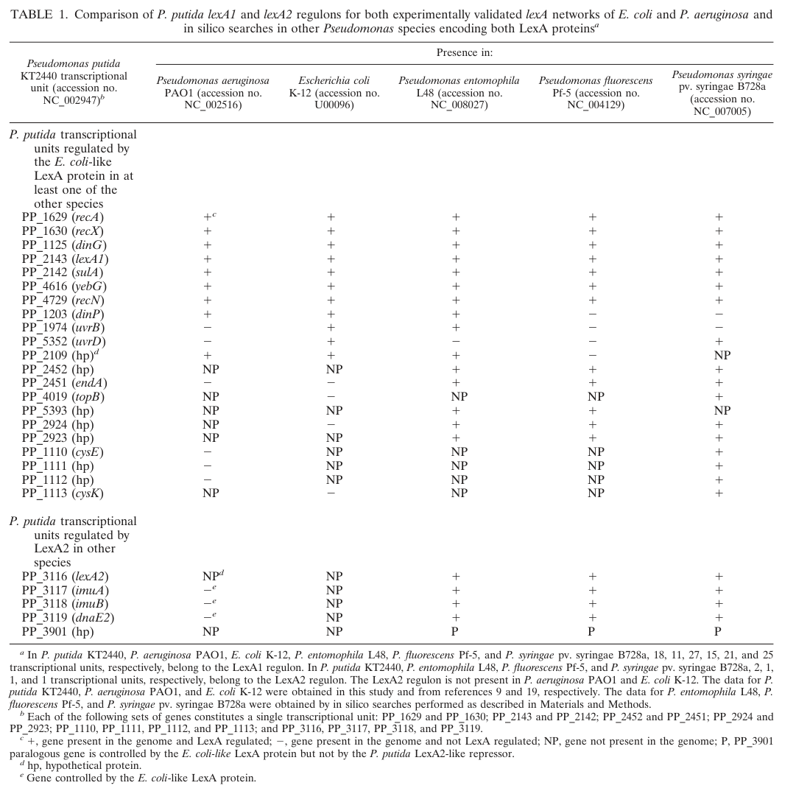

## Question

# Gene Research for Functional Annotation

## ⚠️ CRITICAL: Gene/Protein Identification Context

**BEFORE YOU BEGIN RESEARCH:** You MUST verify you are researching the CORRECT gene/protein. Gene symbols can be ambiguous, especially for less well-characterized genes from non-model organisms.

### Target Gene/Protein Identity (from UniProt):
- **UniProt Accession:** Q88ME3
- **Protein Description:** RecName: Full=Regulatory protein RecX {ECO:0000255|HAMAP-Rule:MF_01114};
- **Gene Information:** Name=recX {ECO:0000255|HAMAP-Rule:MF_01114}; OrderedLocusNames=PP_1630;
- **Organism (full):** Pseudomonas putida (strain ATCC 47054 / DSM 6125 / CFBP 8728 / NCIMB 11950 / KT2440).
- **Protein Family:** Belongs to the RecX family. {ECO:0000255|HAMAP-
- **Key Domains:** RecX_HTH_1st. (IPR053926); RecX_HTH_2nd. (IPR053924); RecX_HTH_3rd. (IPR053925); Regulatory_RecX. (IPR003783); WH-like_DNA-bd_sf. (IPR036388)

### MANDATORY VERIFICATION STEPS:

1. **Check if the gene symbol "recX" matches the protein description above**
2. **Verify the organism is correct:** Pseudomonas putida (strain ATCC 47054 / DSM 6125 / CFBP 8728 / NCIMB 11950 / KT2440).
3. **Check if protein family/domains align with what you find in literature**
4. **If you find literature for a DIFFERENT gene with the same or similar symbol, STOP**

### If Gene Symbol is Ambiguous or You Cannot Find Relevant Literature:

**DO NOT PROCEED WITH RESEARCH ON A DIFFERENT GENE.** Instead:
- State clearly: "The gene symbol 'recX' is ambiguous or literature is limited for this specific protein"
- Explain what you found (e.g., "Found extensive literature on a different gene with the same symbol in a different organism")
- Describe the protein based ONLY on the UniProt information provided above
- Suggest that the protein function can be inferred from domain/family information

### Research Target:

Please provide a comprehensive research report on the gene **recX** (gene ID: recX, UniProt: Q88ME3) in PSEPK.

The research report should be a detailed narrative explaining the function, biological processes, and localization of the gene product. Citations should be given for all claims.

You should prioritize authoritative reviews and primary scientific literature when conducting research. You can supplement
this with annotations you find in gene/protein databases, but these can be outdated or inaccurate.

We are specifically interested in the primary function of the gene - for enzymes, what reaction is catalyzed, and what is the substrate specificity? For transporters, what is the substrate? For structural proteins or adapters, what is the broader structural role? For signaling molecules, what is the role in the pathway.

We are interested in where in or outside the cell the gene product carries out its function.

We are also interested in the signaling or biochemical pathways in which the gene functions. We are less interested in broad pleiotropic effects, except where these elucidate the precise role.

Include evidence where possible. We are interested in both experimental evidence as well as inference from structure, evolution, or bioinformatic analysis. Precise studies should be prioritized over high-throughput, where available.

## Output

Question: You are an expert researcher providing comprehensive, well-cited information.

Provide detailed information focusing on:
1. Key concepts and definitions with current understanding
2. Recent developments and latest research (prioritize 2023-2024 sources)
3. Current applications and real-world implementations
4. Expert opinions and analysis from authoritative sources
5. Relevant statistics and data from recent studies

Format as a comprehensive research report with proper citations. Include URLs and publication dates where available.
Always prioritize recent, authoritative sources and provide specific citations for all major claims.

# Gene Research for Functional Annotation

## ⚠️ CRITICAL: Gene/Protein Identification Context

**BEFORE YOU BEGIN RESEARCH:** You MUST verify you are researching the CORRECT gene/protein. Gene symbols can be ambiguous, especially for less well-characterized genes from non-model organisms.

### Target Gene/Protein Identity (from UniProt):
- **UniProt Accession:** Q88ME3
- **Protein Description:** RecName: Full=Regulatory protein RecX {ECO:0000255|HAMAP-Rule:MF_01114};
- **Gene Information:** Name=recX {ECO:0000255|HAMAP-Rule:MF_01114}; OrderedLocusNames=PP_1630;
- **Organism (full):** Pseudomonas putida (strain ATCC 47054 / DSM 6125 / CFBP 8728 / NCIMB 11950 / KT2440).
- **Protein Family:** Belongs to the RecX family. {ECO:0000255|HAMAP-
- **Key Domains:** RecX_HTH_1st. (IPR053926); RecX_HTH_2nd. (IPR053924); RecX_HTH_3rd. (IPR053925); Regulatory_RecX. (IPR003783); WH-like_DNA-bd_sf. (IPR036388)

### MANDATORY VERIFICATION STEPS:

1. **Check if the gene symbol "recX" matches the protein description above**
2. **Verify the organism is correct:** Pseudomonas putida (strain ATCC 47054 / DSM 6125 / CFBP 8728 / NCIMB 11950 / KT2440).
3. **Check if protein family/domains align with what you find in literature**
4. **If you find literature for a DIFFERENT gene with the same or similar symbol, STOP**

### If Gene Symbol is Ambiguous or You Cannot Find Relevant Literature:

**DO NOT PROCEED WITH RESEARCH ON A DIFFERENT GENE.** Instead:
- State clearly: "The gene symbol 'recX' is ambiguous or literature is limited for this specific protein"
- Explain what you found (e.g., "Found extensive literature on a different gene with the same symbol in a different organism")
- Describe the protein based ONLY on the UniProt information provided above
- Suggest that the protein function can be inferred from domain/family information

### Research Target:

Please provide a comprehensive research report on the gene **recX** (gene ID: recX, UniProt: Q88ME3) in PSEPK.

The research report should be a detailed narrative explaining the function, biological processes, and localization of the gene product. Citations should be given for all claims.

You should prioritize authoritative reviews and primary scientific literature when conducting research. You can supplement
this with annotations you find in gene/protein databases, but these can be outdated or inaccurate.

We are specifically interested in the primary function of the gene - for enzymes, what reaction is catalyzed, and what is the substrate specificity? For transporters, what is the substrate? For structural proteins or adapters, what is the broader structural role? For signaling molecules, what is the role in the pathway.

We are interested in where in or outside the cell the gene product carries out its function.

We are also interested in the signaling or biochemical pathways in which the gene functions. We are less interested in broad pleiotropic effects, except where these elucidate the precise role.

Include evidence where possible. We are interested in both experimental evidence as well as inference from structure, evolution, or bioinformatic analysis. Precise studies should be prioritized over high-throughput, where available.

# Research Report: Functional Annotation of **recX (PP_1630; UniProt Q88ME3)** in *Pseudomonas putida* KT2440

## 0) Executive summary (verified target)
The UniProt accession **Q88ME3** corresponds to **RecX**, a **regulatory protein of the RecX family** encoded by **recX / PP_1630** in *Pseudomonas putida* KT2440, co-transcribed with **recA / PP_1629** as a single transcriptional unit within the **LexA1 (SOS) regulon** in this strain. (abella2007cohabitationoftwo pages 4-4)

Direct experimental literature specific to *P. putida* KT2440 **RecX protein function, localization, or recX mutant phenotypes** was not identified in the retrieved corpus; therefore, functional annotation beyond regulation/genomic context relies on **well-supported RecX family biology** from other bacteria (notably *E. coli* and *Bacillus subtilis*), which consistently positions RecX as a **modulator/negative regulator of RecA nucleoprotein filaments**, thereby tuning **homologous recombination** and **SOS signaling**. (alekseev2022anewinsight pages 1-2, cardenas2012recxfacilitateshomologous pages 4-6)

## 1) Key concepts and definitions (current understanding)

### 1.1 RecA filaments, homologous recombination, and SOS
Bacterial recombinational DNA repair is driven by **RecA**, which forms a **nucleoprotein filament on ssDNA** and catalyzes homology search and strand exchange; RecA filaments also act as a **co-protease** to trigger **LexA self-cleavage**, thereby inducing the **SOS response**. RecA function is therefore strongly dependent on how efficiently filaments assemble, transition between conformations, and disassemble. (alekseev2022anewinsight pages 1-2, cardenas2012recxfacilitateshomologous pages 4-6)

### 1.2 What RecX is
**RecX** is a conserved bacterial protein family whose primary role is to **modulate (often inhibit) RecA filament growth and/or stability**, with the net effect of controlling the magnitude/timing of RecA-dependent recombination and SOS activation. (alekseev2022anewinsight pages 1-2, cardenas2012recxfacilitateshomologous pages 4-6)

Importantly, RecX is best described as a **RecA filament “modulator”** rather than a simple “off switch”: in some systems, RecX inhibition of RecA can paradoxically **improve recombination outcomes** by preventing unproductive or deleterious RecA filament states. (cardenas2012recxfacilitateshomologous pages 1-2)

## 2) Target-gene verification and organism-specific context (*P. putida* KT2440)

### 2.1 Gene identity and genomic context
Abella et al. experimentally mapped LexA regulons in *P. putida* KT2440 and explicitly identified **PP_1630 as recX**, with **PP_1629 (recA)** and **PP_1630 (recX)** forming a **single transcriptional unit (operon)**. (abella2007cohabitationoftwo pages 4-4)

### 2.2 Regulation: LexA1/SOS linkage
In *P. putida* KT2440, the **recA–recX transcriptional unit** belongs to the **LexA1 regulon**, and is discussed among units induced after **mitomycin C** treatment (a DNA damaging agent commonly used to induce SOS). (abella2007cohabitationoftwo pages 4-4)

**Visual evidence:** Cropped regions of the paper’s **Table 1** and **Figure 1** show PP_1630 annotated as recX and the recA–recX transcriptional unit as part of the LexA1 regulon. (abella2007cohabitationoftwo media 03faf27d, abella2007cohabitationoftwo media 55b1231c)

## 3) Molecular function of RecX (family-based mechanism with quantitative evidence)

### 3.1 Mechanistic role: destabilization/disassembly of RecA filaments
Single-molecule experiments with *E. coli* proteins show that RecX binds RecA filaments and drives net filament shortening, consistent with stimulation of disassembly; RecX preferentially binds the **inactive/post-hydrolysis** RecA filament state and slows the transition to an active state. (alekseev2022anewinsight pages 8-10, alekseev2022anewinsight pages 3-4)

**Quantitative kinetics example (single-molecule):** under conditions where RecA–dsDNA filaments were preassembled, transfer to **200 nM RecX** caused filament reduction to bare DNA length within **~30 s**, and the authors report the disassembly/shortening effect on dsDNA filaments was **~100× faster** than on ssDNA under their conditions. (alekseev2022anewinsight pages 8-10)

### 3.2 Two non-exclusive inhibition models (capping vs internal binding)
Mechanistic models for RecX include (i) a **capping model** (binding at the growing filament end to block extension) and (ii) an **internal binding/groove binding (“nicking”)** model that locally destabilizes the filament and increases effective disassembly ends; concentration dependence and structural considerations support that both behaviors may contribute depending on system context and RecX concentration. (alekseev2022anewinsight pages 1-2, alekseev2022anewinsight pages 3-4)

### 3.3 RecX as a tunable regulator of SOS induction threshold
In *B. subtilis*, RecX influences when SOS is triggered by restraining RecA filament behavior: in ΔrecX cells exposed to mitomycin C, RecA accumulation is increased at low damage levels (e.g., **~18,000 RecA monomers/cell at 0.07 mM MMC** vs basal **~4,500 monomers/cell** in wild type), while maximal induction occurs around 0.6 mM MMC with **~4–6×** induction. (cardenas2012recxfacilitateshomologous pages 4-6)

These data support a conserved conceptual role for RecX: **buffering the RecA filament system** to prevent premature or excessive SOS activation while maintaining productive recombination capacity. (cardenas2012recxfacilitateshomologous pages 4-6, cardenas2012recxfacilitateshomologous pages 1-2)

## 4) Biological processes and pathways (placing *P. putida* RecX in context)

### 4.1 SOS/DNA damage response
The strongest *P. putida* KT2440-specific conclusion supported by evidence is that **recX (PP_1630)** is part of a **LexA1-controlled DNA-damage/SOS transcriptional program**, co-regulated with recA. (abella2007cohabitationoftwo pages 4-4)

Family-level evidence indicates RecX modulates RecA co-protease activity (LexA cleavage) by controlling formation and persistence of extended RecA–ssDNA filaments needed for SOS signaling. (cardenas2012recxfacilitateshomologous pages 2-3, alekseev2022anewinsight pages 1-2)

### 4.2 Homologous recombination and DNA repair licensing
In bacteria, RecX impacts homologous recombination by shaping RecA filament dynamics, affecting recombination repair and genetic exchange. (cardenas2012recxfacilitateshomologous pages 1-2)

### 4.3 Replication stress and stalled replication forks (2024 synthesis)
A 2024 authoritative review (FEMS Microbiology Reviews) places RecX among RecA “modulators” important during **replication stress**, describing RecX as a negative modulator that can **actively disassemble RecA nucleoprotein filaments** and that counterbalance with positive modulators (e.g., RecF and RarA) is crucial for RecA filament/thread dynamics and downstream SOS signaling. (carrasco2024processingofstalled pages 6-7)

This recent synthesis also reports that RecX is considered to physically interact with RecA (in the *B. subtilis* model) and participates in genetic interaction networks affecting replication-stress outcomes. (carrasco2024processingofstalled pages 5-6)

## 5) Cellular localization (direct evidence vs inference)

### 5.1 What is known directly in *P. putida* KT2440
No RecX cellular localization microscopy in *P. putida* KT2440 was identified in the retrieved literature.

### 5.2 Experimentally observed localization patterns in other bacteria
In *B. subtilis*, RecX-YFP forms **discrete intracellular foci**, frequently **nucleoid-associated** and sometimes **polar** (competence-related), and appears after RecA nucleation; RecX foci co-localize near RecA thread structures during DNA damage responses. (cardenas2012recxfacilitateshomologous pages 10-11, cardenas2012recxfacilitateshomologous pages 6-7)

**Quantitative localization statistics (B. subtilis):** RecX-YFP foci were observed in ~**8–10%** of competent cells, usually one focus/cell (73%); after DNA addition, nucleoid-associated foci increased (46% → 72%) and polar foci decreased (27% → 13%). (cardenas2012recxfacilitateshomologous pages 10-11)

### 5.3 Best-supported localization inference for *P. putida* RecX
Given (i) the RecX role is mediated by direct interactions with RecA filaments (cytosolic/nucleoid-associated structures) and (ii) the absence of signal peptide or membrane-associated function in the RecX mechanistic literature, the most evidence-consistent localization for *P. putida* RecX is **intracellular (cytosol) with functional association to nucleoid/RecA filament sites**, especially under DNA damage/replication stress conditions. (cardenas2012recxfacilitateshomologous pages 10-11, carrasco2024processingofstalled pages 6-7)

## 6) Recent developments (prioritizing 2023–2024)

### 6.1 2024: replication stress framework integrates RecX with multiple modulators
The 2024 FEMS Microbiology Reviews article integrates RecX into a broader replication stress network, emphasizing RecX as an active negative regulator/disassembly factor for RecA filaments, and highlighting balancing interactions with positive modulators (RecF/RarA) that collectively shape RecA filament length/lifetime, thereby tuning SOS and recombination-based fork processing. (carrasco2024processingofstalled pages 6-7, carrasco2024processingofstalled pages 9-10)

### 6.2 Gap: lack of 2023–2024 *P. putida* KT2440 RecX-specific primary studies in retrieved set
No 2023–2024 studies directly characterizing **PP_1630/Q88ME3 RecX** in *P. putida* KT2440 (biochemistry, structures, localization, or mutant phenotypes) were found in the retrieved corpus. The most solid *P. putida*-specific evidence remains the regulon/operon mapping from 2007. (abella2007cohabitationoftwo pages 4-4)

## 7) Current applications and real-world implementations

### 7.1 Practical relevance of RecX modulation
RecX modulates RecA, which is central to DNA repair, genome stability, SOS mutagenesis programs, and recombination-based genetic exchange; therefore, RecX is relevant to:
- **Strain genome stability** during industrial cultivation (e.g., limiting unwanted recombination or stress-induced mutagenesis),
- **Recombineering / transformation efficiencies** (RecA filament regulation affects recombination-based DNA integration),
- **Antibacterial strategies** aimed at DNA repair/SOS control (conceptually, by influencing RecA filament dynamics).

Within the retrieved evidence, direct application data were not *P. putida*-specific; however, *B. subtilis* experiments show RecX strongly impacts transformation frequencies (chromosomal and plasmid), illustrating the magnitude with which RecX-family regulation can influence genetic engineering outcomes in bacteria. (cardenas2012recxfacilitateshomologous pages 6-7, cardenas2012recxfacilitateshomologous pages 1-2)

## 8) Expert opinions and authoritative synthesis
Across mechanistic studies and reviews, the consensus is that RecX is part of a layered regulatory architecture that controls RecA filaments (assembly, extension, disassembly, conformational switching). This view is supported by:
- **Single-molecule mechanistic dissection** (RecX binds specific RecA filament states; cooperativity; ATP-hydrolysis dependence for certain destabilization behaviors). (alekseev2022anewinsight pages 8-10, alekseev2022anewinsight pages 3-4)
- **Genetic/cytological systems biology in vivo** showing that RecX affects SOS thresholds and recombination/transformation outcomes, and that RecX is temporally coordinated with RecA/RecF. (cardenas2012recxfacilitateshomologous pages 6-7, cardenas2012recxfacilitateshomologous pages 4-6)
- **2024 review-level synthesis** integrating RecX into replication fork stress processing and emphasizing its role as a modulator/disassembly factor rather than a simple inhibitor. (carrasco2024processingofstalled pages 6-7)

## 9) Relevant statistics and data points (from recent/primary studies)
Selected quantitative findings (mostly from non-*P. putida* model systems):
- **RecX-driven filament disassembly (single-molecule, *E. coli*):** 200 nM RecX collapses RecA–dsDNA filaments to bare DNA length in ~30 s; dsDNA filament shortening reported ~100× faster than ssDNA under these conditions. (alekseev2022anewinsight pages 8-10)
- **Cooperativity (single-molecule, *E. coli*):** concentration dependence fit with Hill coefficient **2.0 ± 0.3**. (alekseev2022anewinsight pages 3-4)
- **SOS/RecA levels (in vivo, *B. subtilis*):** ~18,000 RecA monomers/cell at 0.07 mM MMC in ΔrecX vs ~4,500 monomers/cell basal in wild type; maximal induction at ~0.6 mM MMC gives ~4–6× induction. (cardenas2012recxfacilitateshomologous pages 4-6)
- **Transformation impact (in vivo, *B. subtilis*):** ΔrecX reduces chromosomal transformation to ~0.5% of wild type and plasmid transformation to ~1.8% in one dataset; broader summary indicates order-of-magnitude losses can occur depending on allele/background. (cardenas2012recxfacilitateshomologous pages 6-7, alekseev2022anewinsight pages 1-2)
- **Localization frequency (in vivo, *B. subtilis*):** RecX-YFP foci in ~8–10% of competent cells; distribution shifts toward nucleoid-associated foci after DNA addition. (cardenas2012recxfacilitateshomologous pages 10-11)

## 10) Evidence table (direct vs inferred)
| Evidence type | Key finding (function/regulation/localization) | Quantitative/phenotypic data | Pathway/process link (SOS, homologous recombination, transformation) | Primary source with year and URL | Notes/limitations |
|---|---|---|---|---|---|
| P. putida direct | PP_1630 is recX in *Pseudomonas putida* KT2440 and is co-transcribed with recA (PP_1629) as a single transcriptional unit in the LexA1 regulon (abella2007cohabitationoftwo pages 4-4, abella2007cohabitationoftwo media 03faf27d) | No RecX-specific phenotype or protein abundance reported in the cited excerpt (abella2007cohabitationoftwo pages 4-4) | SOS / DNA-damage regulon | Abella et al., 2007, https://doi.org/10.1128/JB.01213-07 | Strongest organism-specific evidence; establishes identity and regulation, but not biochemical mechanism or localization in *P. putida* (abella2007cohabitationoftwo pages 4-4) |
| P. putida direct | The recA-recX transcriptional unit belongs to the LexA1 regulon and is described among genes induced after mitomycin C treatment, supporting DNA-damage responsiveness (abella2007cohabitationoftwo pages 4-4) | Mitomycin C induction is indicated qualitatively; no fold-change for recX given in the excerpt (abella2007cohabitationoftwo pages 4-4) | SOS / DNA damage response | Abella et al., 2007, https://doi.org/10.1128/JB.01213-07 | Evidence is transcriptional/regulon mapping, not direct RecX functional assay (abella2007cohabitationoftwo pages 4-4) |
| Review-mechanistic / other species foundation | RecX is a conserved small negative regulator/modulator of RecA that suppresses RecA ATPase, DNA pairing, strand exchange, and co-protease activities; in *E. coli* recX is SOS-regulated, downstream of recA, and co-transcribed with it (alekseev2022anewinsight pages 1-2, alekseev2022anewinsight pages 18-19) | In *E. coli*, RecX level is reported as ~500-fold lower than RecA (alekseev2022anewinsight pages 1-2) | SOS, homologous recombination | Alekseev et al., 2022, https://doi.org/10.7554/eLife.78409 | Indirect for *P. putida* but highly relevant because *P. putida* recX is also recA-linked and LexA-regulated (alekseev2022anewinsight pages 1-2, abella2007cohabitationoftwo pages 4-4) |
| Other species experimental | RecX promotes net disassembly of RecA filaments and preferentially binds inactive/post-hydrolysis RecA filament states, slowing transition to active filaments (alekseev2022anewinsight pages 8-10, alekseev2022anewinsight pages 3-4) | On RecA-dsDNA filaments, 200 nM RecX reduced filaments to bare-dsDNA length within ~30 s; disassembly on dsDNA was ~100× faster than on ssDNA; concentration dependence fit a Hill coefficient of 2.0 ± 0.3 (alekseev2022anewinsight pages 8-10, alekseev2022anewinsight pages 3-4) | Homologous recombination / RecA filament control | Alekseev et al., 2022, https://doi.org/10.7554/eLife.78409 | Single-molecule work was done with *E. coli* proteins, not *P. putida* RecX (alekseev2022anewinsight pages 8-10, alekseev2022anewinsight pages 3-4) |
| Other species experimental | Mechanistic models for RecX action include capping the growing 3′ end of RecA filaments and/or internal nicking/groove binding that creates additional disassembling ends (alekseev2022anewinsight pages 1-2, alekseev2022anewinsight pages 3-4) | Faster depolymerization at higher RecX concentrations supports a nonexclusive internal-binding model (alekseev2022anewinsight pages 1-2, alekseev2022anewinsight pages 3-4) | Homologous recombination / SOS tuning | Alekseev et al., 2022, https://doi.org/10.7554/eLife.78409 | Mechanistic inference is broad across bacteria; direct structural confirmation for *P. putida* Q88ME3 is lacking (alekseev2022anewinsight pages 1-2, alekseev2022anewinsight pages 3-4) |
| Other species experimental | RecX facilitates homologous recombination by modulating RecA filament length/packing rather than simply blocking RecA; it can prevent inappropriate or overextended RecA filaments (cardenas2012recxfacilitateshomologous pages 1-2, cardenas2012recxfacilitateshomologous pages 11-12) | In *Bacillus subtilis*, loss of RecX severely impaired natural transformation; chromosomal transformation dropped to ~0.5% of wild type and plasmid transformation to ~1.8% in one dataset; absence of RecX caused ~200-fold lower chromosomal transformation in summary statements (cardenas2012recxfacilitateshomologous pages 6-7, alekseev2022anewinsight pages 1-2) | Homologous recombination, transformation | Cárdenas et al., 2012, https://doi.org/10.1371/journal.pgen.1003126 | Strong genetic evidence, but from Gram-positive *Bacillus*; phenotype magnitude may not transfer directly to *P. putida* (cardenas2012recxfacilitateshomologous pages 6-7, cardenas2012recxfacilitateshomologous pages 1-2) |
| Other species experimental | RecX modulates SOS induction threshold by restraining RecA filament behavior; without RecX, RecA filaments persist longer and SOS can be induced at lower damage levels (cardenas2012recxfacilitateshomologous pages 3-4, cardenas2012recxfacilitateshomologous pages 10-11, cardenas2012recxfacilitateshomologous pages 4-6) | In *B. subtilis* ΔrecX, RecA accumulated to ~18,000 monomers/cell at 0.07 mM MMC versus basal ~4,500 monomers/cell in wild type; maximal induction at ~0.6 mM MMC was ~4–6× (cardenas2012recxfacilitateshomologous pages 4-6) | SOS / DNA damage response | Cárdenas et al., 2012, https://doi.org/10.1371/journal.pgen.1003126 | Indicates RecX tunes SOS rather than acting as a repair enzyme; indirect for *P. putida* (cardenas2012recxfacilitateshomologous pages 4-6) |
| Other species experimental | Cellular localization studies place RecX in the cytoplasm/nucleoid-associated compartment, forming discrete foci on the nucleoid and sometimes at poles, often near RecA structures after DNA damage or during competence (cardenas2012recxfacilitateshomologous pages 10-11, cardenas2012recxfacilitateshomologous pages 6-7, cardenas2012recxfacilitateshomologous pages 1-2) | In competent *B. subtilis* cells, RecX-YFP foci occurred in ~8–10% of cells; usually one focus/cell (73%); after DNA addition, nucleoid-associated foci increased from 46% to 72%, while pole-localized foci decreased from 27% to 13%; RecX overlapped/was adjacent to RecA in 41% of cells with RecA signal and in 91% of cells showing RecX foci (cardenas2012recxfacilitateshomologous pages 10-11, cardenas2012recxfacilitateshomologous pages 6-7) | Homologous recombination, transformation | Cárdenas et al., 2012, https://doi.org/10.1371/journal.pgen.1003126 | No direct localization data for *P. putida*; likely intracellular and nucleoid-associated by homology/function (cardenas2012recxfacilitateshomologous pages 10-11, cardenas2012recxfacilitateshomologous pages 6-7) |
| Review-mechanistic / other species foundation | RecX family proteins can differ in length across taxa; proteobacterial RecX proteins are shorter than many Gram-positive homologs, supporting family-level conservation with possible mechanistic variation (cardenas2012recxfacilitateshomologous pages 1-2, cardenas2012recxfacilitateshomologous pages 4-6) | *B. subtilis* RecX is 264 aa, whereas proteobacterial RecX proteins are noted as shorter (~180 aa class) (cardenas2012recxfacilitateshomologous pages 1-2, cardenas2012recxfacilitateshomologous pages 4-6) | Homologous recombination regulator evolution | Cárdenas et al., 2012, https://doi.org/10.1371/journal.pgen.1003126 | Supports cautious transfer of family-level function to *P. putida* Q88ME3 while acknowledging species-specific differences (cardenas2012recxfacilitateshomologous pages 1-2, cardenas2012recxfacilitateshomologous pages 4-6) |
| Review-mechanistic / other species foundation | Functional outcomes of RecX can be context dependent: despite inhibiting RecA filament activity, RecX may improve recombination efficiency or genome stability by preventing maladaptive RecA assemblies (alekseev2022anewinsight pages 18-19, alekseev2022anewinsight pages 1-2, cardenas2012recxfacilitateshomologous pages 1-2) | Reported outcomes across species include reduced UV resistance when RecX is lost or overexpressed, and altered transformation/recombination efficiencies (alekseev2022anewinsight pages 1-2, cardenas2012recxfacilitateshomologous pages 1-2) | SOS, homologous recombination, transformation | Alekseev et al., 2022, https://doi.org/10.7554/eLife.78409; Cárdenas et al., 2012, https://doi.org/10.1371/journal.pgen.1003126 | Important for annotation: RecX is best described as a RecA filament modulator, not simply an inhibitor (alekseev2022anewinsight pages 1-2, cardenas2012recxfacilitateshomologous pages 1-2) |

*Table: This table summarizes the strongest available evidence for functional annotation of RecX (recX/PP_1630/Q88ME3) in *Pseudomonas putida* KT2440, separating direct organism-specific findings from indirect but mechanistically informative studies in other bacteria. It is useful for distinguishing what is experimentally established in *P. putida* from what is inferred from conserved RecX family biology.*

## 11) Conclusions for functional annotation of *P. putida* KT2440 RecX (PP_1630; Q88ME3)
1. **Primary function (best-supported):** RecX is a **RecA filament regulator/modulator**, most consistently acting to **limit filament extension and/or promote disassembly** and thereby tune both **homologous recombination** and **SOS induction dynamics**. (alekseev2022anewinsight pages 1-2, carrasco2024processingofstalled pages 6-7)
2. **Process/pathway placement in *P. putida* KT2440:** recX is in the **LexA1-controlled SOS/DNA damage response network** and co-transcribed with recA, strongly supporting a role in **DNA damage inducible recombination control** in this strain. (abella2007cohabitationoftwo pages 4-4)
3. **Localization (inference with strong support from other bacteria):** intracellular, likely **cytosolic/nucleoid-associated** under conditions that generate RecA filaments (DNA damage, replication stress). (cardenas2012recxfacilitateshomologous pages 10-11, carrasco2024processingofstalled pages 6-7)
4. **Uncertainties and gaps:** no *P. putida* KT2440-specific RecX biochemical parameters, structural data, or recX mutant phenotypes were identified in the retrieved set; these remain the highest-priority areas for experimental validation if precise strain-specific annotation is required. (abella2007cohabitationoftwo pages 4-4)

## Key sources (with publication dates and URLs)
- Abella M. et al. **(Dec 2007)**. *Cohabitation of Two Different lexA Regulons in Pseudomonas putida*. **Journal of Bacteriology**. https://doi.org/10.1128/JB.01213-07 (abella2007cohabitationoftwo pages 4-4)
- Alekseev A. et al. **(Jun 2022)**. *A new insight into RecA filament regulation by RecX from the analysis of conformation-specific interactions*. **eLife**. https://doi.org/10.7554/eLife.78409 (alekseev2022anewinsight pages 8-10)
- Cárdenas P.P. et al. **(Dec 2012)**. *RecX Facilitates Homologous Recombination by Modulating RecA Activities*. **PLoS Genetics**. https://doi.org/10.1371/journal.pgen.1003126 (cardenas2012recxfacilitateshomologous pages 6-7)
- Carrasco B. et al. **(Dec 2024)**. *Processing of stalled replication forks in Bacillus subtilis*. **FEMS Microbiology Reviews**. https://doi.org/10.1093/femsre/fuad065 (carrasco2024processingofstalled pages 6-7)

References

1. (abella2007cohabitationoftwo pages 4-4): Marc Abella, Susana Campoy, Ivan Erill, Fernando Rojo, and Jordi Barbé. Cohabitation of two different<i>lexa</i>regulons in<i>pseudomonas putida</i>. Dec 2007. URL: https://doi.org/10.1128/jb.01213-07, doi:10.1128/jb.01213-07. This article has 44 citations and is from a peer-reviewed journal.

2. (alekseev2022anewinsight pages 1-2): Aleksandr Alekseev, Georgii Pobegalov, Natalia Morozova, Alexey Vedyaykin, Galina Cherevatenko, Alexander Yakimov, Dmitry Baitin, and Mikhail Khodorkovskii. A new insight into reca filament regulation by recx from the analysis of conformation-specific interactions. Jun 2022. URL: https://doi.org/10.7554/elife.78409, doi:10.7554/elife.78409. This article has 17 citations and is from a domain leading peer-reviewed journal.

3. (cardenas2012recxfacilitateshomologous pages 4-6): Paula P. Cárdenas, Begoña Carrasco, Clarisse Defeu Soufo, Carolina E. César, Katharina Herr, Miriam Kaufenstein, Peter L. Graumann, and Juan C. Alonso. Recx facilitates homologous recombination by modulating reca activities. PLoS Genetics, 8:e1003126, Dec 2012. URL: https://doi.org/10.1371/journal.pgen.1003126, doi:10.1371/journal.pgen.1003126. This article has 71 citations and is from a domain leading peer-reviewed journal.

4. (cardenas2012recxfacilitateshomologous pages 1-2): Paula P. Cárdenas, Begoña Carrasco, Clarisse Defeu Soufo, Carolina E. César, Katharina Herr, Miriam Kaufenstein, Peter L. Graumann, and Juan C. Alonso. Recx facilitates homologous recombination by modulating reca activities. PLoS Genetics, 8:e1003126, Dec 2012. URL: https://doi.org/10.1371/journal.pgen.1003126, doi:10.1371/journal.pgen.1003126. This article has 71 citations and is from a domain leading peer-reviewed journal.

5. (abella2007cohabitationoftwo media 03faf27d): Marc Abella, Susana Campoy, Ivan Erill, Fernando Rojo, and Jordi Barbé. Cohabitation of two different<i>lexa</i>regulons in<i>pseudomonas putida</i>. Dec 2007. URL: https://doi.org/10.1128/jb.01213-07, doi:10.1128/jb.01213-07. This article has 44 citations and is from a peer-reviewed journal.

6. (abella2007cohabitationoftwo media 55b1231c): Marc Abella, Susana Campoy, Ivan Erill, Fernando Rojo, and Jordi Barbé. Cohabitation of two different<i>lexa</i>regulons in<i>pseudomonas putida</i>. Dec 2007. URL: https://doi.org/10.1128/jb.01213-07, doi:10.1128/jb.01213-07. This article has 44 citations and is from a peer-reviewed journal.

7. (alekseev2022anewinsight pages 8-10): Aleksandr Alekseev, Georgii Pobegalov, Natalia Morozova, Alexey Vedyaykin, Galina Cherevatenko, Alexander Yakimov, Dmitry Baitin, and Mikhail Khodorkovskii. A new insight into reca filament regulation by recx from the analysis of conformation-specific interactions. Jun 2022. URL: https://doi.org/10.7554/elife.78409, doi:10.7554/elife.78409. This article has 17 citations and is from a domain leading peer-reviewed journal.

8. (alekseev2022anewinsight pages 3-4): Aleksandr Alekseev, Georgii Pobegalov, Natalia Morozova, Alexey Vedyaykin, Galina Cherevatenko, Alexander Yakimov, Dmitry Baitin, and Mikhail Khodorkovskii. A new insight into reca filament regulation by recx from the analysis of conformation-specific interactions. Jun 2022. URL: https://doi.org/10.7554/elife.78409, doi:10.7554/elife.78409. This article has 17 citations and is from a domain leading peer-reviewed journal.

9. (cardenas2012recxfacilitateshomologous pages 2-3): Paula P. Cárdenas, Begoña Carrasco, Clarisse Defeu Soufo, Carolina E. César, Katharina Herr, Miriam Kaufenstein, Peter L. Graumann, and Juan C. Alonso. Recx facilitates homologous recombination by modulating reca activities. PLoS Genetics, 8:e1003126, Dec 2012. URL: https://doi.org/10.1371/journal.pgen.1003126, doi:10.1371/journal.pgen.1003126. This article has 71 citations and is from a domain leading peer-reviewed journal.

10. (carrasco2024processingofstalled pages 6-7): Begoña Carrasco, Rubén Torres, María Moreno-del Álamo, Cristina Ramos, Silvia Ayora, and Juan C Alonso. Processing of stalled replication forks in bacillus subtilis. FEMS Microbiology Reviews, Dec 2024. URL: https://doi.org/10.1093/femsre/fuad065, doi:10.1093/femsre/fuad065. This article has 14 citations and is from a domain leading peer-reviewed journal.

11. (carrasco2024processingofstalled pages 5-6): Begoña Carrasco, Rubén Torres, María Moreno-del Álamo, Cristina Ramos, Silvia Ayora, and Juan C Alonso. Processing of stalled replication forks in bacillus subtilis. FEMS Microbiology Reviews, Dec 2024. URL: https://doi.org/10.1093/femsre/fuad065, doi:10.1093/femsre/fuad065. This article has 14 citations and is from a domain leading peer-reviewed journal.

12. (cardenas2012recxfacilitateshomologous pages 10-11): Paula P. Cárdenas, Begoña Carrasco, Clarisse Defeu Soufo, Carolina E. César, Katharina Herr, Miriam Kaufenstein, Peter L. Graumann, and Juan C. Alonso. Recx facilitates homologous recombination by modulating reca activities. PLoS Genetics, 8:e1003126, Dec 2012. URL: https://doi.org/10.1371/journal.pgen.1003126, doi:10.1371/journal.pgen.1003126. This article has 71 citations and is from a domain leading peer-reviewed journal.

13. (cardenas2012recxfacilitateshomologous pages 6-7): Paula P. Cárdenas, Begoña Carrasco, Clarisse Defeu Soufo, Carolina E. César, Katharina Herr, Miriam Kaufenstein, Peter L. Graumann, and Juan C. Alonso. Recx facilitates homologous recombination by modulating reca activities. PLoS Genetics, 8:e1003126, Dec 2012. URL: https://doi.org/10.1371/journal.pgen.1003126, doi:10.1371/journal.pgen.1003126. This article has 71 citations and is from a domain leading peer-reviewed journal.

14. (carrasco2024processingofstalled pages 9-10): Begoña Carrasco, Rubén Torres, María Moreno-del Álamo, Cristina Ramos, Silvia Ayora, and Juan C Alonso. Processing of stalled replication forks in bacillus subtilis. FEMS Microbiology Reviews, Dec 2024. URL: https://doi.org/10.1093/femsre/fuad065, doi:10.1093/femsre/fuad065. This article has 14 citations and is from a domain leading peer-reviewed journal.

15. (alekseev2022anewinsight pages 18-19): Aleksandr Alekseev, Georgii Pobegalov, Natalia Morozova, Alexey Vedyaykin, Galina Cherevatenko, Alexander Yakimov, Dmitry Baitin, and Mikhail Khodorkovskii. A new insight into reca filament regulation by recx from the analysis of conformation-specific interactions. Jun 2022. URL: https://doi.org/10.7554/elife.78409, doi:10.7554/elife.78409. This article has 17 citations and is from a domain leading peer-reviewed journal.

16. (cardenas2012recxfacilitateshomologous pages 11-12): Paula P. Cárdenas, Begoña Carrasco, Clarisse Defeu Soufo, Carolina E. César, Katharina Herr, Miriam Kaufenstein, Peter L. Graumann, and Juan C. Alonso. Recx facilitates homologous recombination by modulating reca activities. PLoS Genetics, 8:e1003126, Dec 2012. URL: https://doi.org/10.1371/journal.pgen.1003126, doi:10.1371/journal.pgen.1003126. This article has 71 citations and is from a domain leading peer-reviewed journal.

17. (cardenas2012recxfacilitateshomologous pages 3-4): Paula P. Cárdenas, Begoña Carrasco, Clarisse Defeu Soufo, Carolina E. César, Katharina Herr, Miriam Kaufenstein, Peter L. Graumann, and Juan C. Alonso. Recx facilitates homologous recombination by modulating reca activities. PLoS Genetics, 8:e1003126, Dec 2012. URL: https://doi.org/10.1371/journal.pgen.1003126, doi:10.1371/journal.pgen.1003126. This article has 71 citations and is from a domain leading peer-reviewed journal.

## Artifacts

- [Edison artifact artifact-00](recX-deep-research-falcon_artifacts/artifact-00.md)

## Citations

1. abella2007cohabitationoftwo pages 4-4
2. cardenas2012recxfacilitateshomologous pages 1-2
3. alekseev2022anewinsight pages 8-10
4. cardenas2012recxfacilitateshomologous pages 4-6
5. carrasco2024processingofstalled pages 6-7
6. carrasco2024processingofstalled pages 5-6
7. cardenas2012recxfacilitateshomologous pages 10-11
8. alekseev2022anewinsight pages 3-4
9. alekseev2022anewinsight pages 1-2
10. cardenas2012recxfacilitateshomologous pages 6-7
11. cardenas2012recxfacilitateshomologous pages 2-3
12. carrasco2024processingofstalled pages 9-10
13. alekseev2022anewinsight pages 18-19
14. cardenas2012recxfacilitateshomologous pages 11-12
15. cardenas2012recxfacilitateshomologous pages 3-4
16. https://doi.org/10.1128/JB.01213-07
17. https://doi.org/10.7554/eLife.78409
18. https://doi.org/10.1371/journal.pgen.1003126
19. https://doi.org/10.7554/eLife.78409;
20. https://doi.org/10.1093/femsre/fuad065
21. https://doi.org/10.1128/jb.01213-07,
22. https://doi.org/10.7554/elife.78409,
23. https://doi.org/10.1371/journal.pgen.1003126,
24. https://doi.org/10.1093/femsre/fuad065,