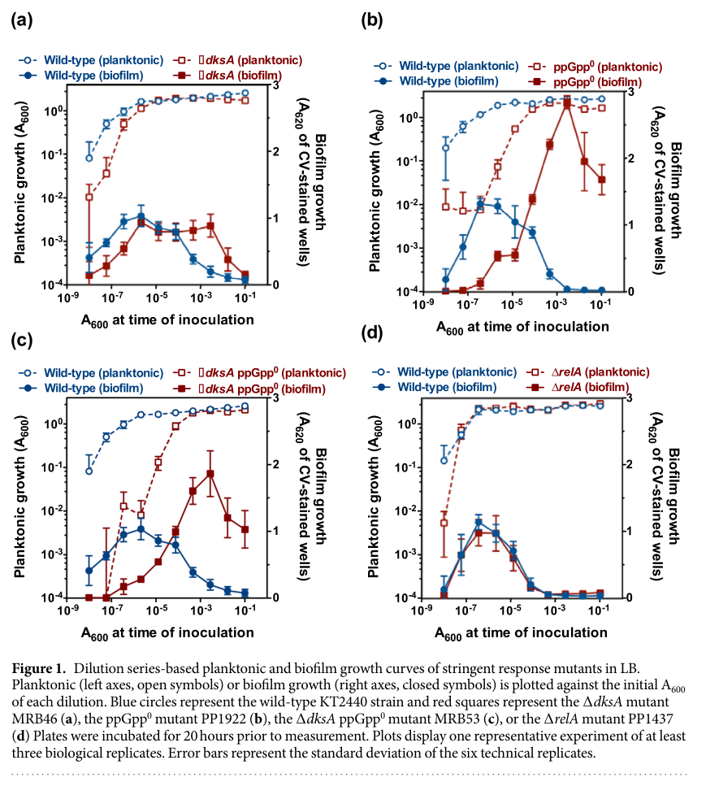

## Question

# Gene Research for Functional Annotation

## ⚠️ CRITICAL: Gene/Protein Identification Context

**BEFORE YOU BEGIN RESEARCH:** You MUST verify you are researching the CORRECT gene/protein. Gene symbols can be ambiguous, especially for less well-characterized genes from non-model organisms.

### Target Gene/Protein Identity (from UniProt):
- **UniProt Accession:** Q88MB8
- **Protein Description:** RecName: Full=GTP pyrophosphokinase {ECO:0000256|ARBA:ARBA00019852}; AltName: Full=(p)ppGpp synthase {ECO:0000256|ARBA:ARBA00032407}; AltName: Full=ATP:GTP 3'-pyrophosphotransferase {ECO:0000256|ARBA:ARBA00029754}; AltName: Full=ppGpp synthase I {ECO:0000256|ARBA:ARBA00033308};
- **Gene Information:** Name=relA {ECO:0000313|EMBL:AAN67277.1}; OrderedLocusNames=PP_1656 {ECO:0000313|EMBL:AAN67277.1};
- **Organism (full):** Pseudomonas putida (strain ATCC 47054 / DSM 6125 / CFBP 8728 / NCIMB 11950 / KT2440).
- **Protein Family:** Belongs to the relA/spoT family.
- **Key Domains:** ACT-like_dom_sf. (IPR045865); ACT_dom. (IPR002912); Beta-grasp_dom_sf. (IPR012675); NT_sf. (IPR043519); RelA/Spo_fam. (IPR004811)

### MANDATORY VERIFICATION STEPS:

1. **Check if the gene symbol "relA" matches the protein description above**
2. **Verify the organism is correct:** Pseudomonas putida (strain ATCC 47054 / DSM 6125 / CFBP 8728 / NCIMB 11950 / KT2440).
3. **Check if protein family/domains align with what you find in literature**
4. **If you find literature for a DIFFERENT gene with the same or similar symbol, STOP**

### If Gene Symbol is Ambiguous or You Cannot Find Relevant Literature:

**DO NOT PROCEED WITH RESEARCH ON A DIFFERENT GENE.** Instead:
- State clearly: "The gene symbol 'relA' is ambiguous or literature is limited for this specific protein"
- Explain what you found (e.g., "Found extensive literature on a different gene with the same symbol in a different organism")
- Describe the protein based ONLY on the UniProt information provided above
- Suggest that the protein function can be inferred from domain/family information

### Research Target:

Please provide a comprehensive research report on the gene **relA** (gene ID: relA, UniProt: Q88MB8) in PSEPK.

The research report should be a detailed narrative explaining the function, biological processes, and localization of the gene product. Citations should be given for all claims.

You should prioritize authoritative reviews and primary scientific literature when conducting research. You can supplement
this with annotations you find in gene/protein databases, but these can be outdated or inaccurate.

We are specifically interested in the primary function of the gene - for enzymes, what reaction is catalyzed, and what is the substrate specificity? For transporters, what is the substrate? For structural proteins or adapters, what is the broader structural role? For signaling molecules, what is the role in the pathway.

We are interested in where in or outside the cell the gene product carries out its function.

We are also interested in the signaling or biochemical pathways in which the gene functions. We are less interested in broad pleiotropic effects, except where these elucidate the precise role.

Include evidence where possible. We are interested in both experimental evidence as well as inference from structure, evolution, or bioinformatic analysis. Precise studies should be prioritized over high-throughput, where available.

## Output

Question: You are an expert researcher providing comprehensive, well-cited information.

Provide detailed information focusing on:
1. Key concepts and definitions with current understanding
2. Recent developments and latest research (prioritize 2023-2024 sources)
3. Current applications and real-world implementations
4. Expert opinions and analysis from authoritative sources
5. Relevant statistics and data from recent studies

Format as a comprehensive research report with proper citations. Include URLs and publication dates where available.
Always prioritize recent, authoritative sources and provide specific citations for all major claims.

# Gene Research for Functional Annotation

## ⚠️ CRITICAL: Gene/Protein Identification Context

**BEFORE YOU BEGIN RESEARCH:** You MUST verify you are researching the CORRECT gene/protein. Gene symbols can be ambiguous, especially for less well-characterized genes from non-model organisms.

### Target Gene/Protein Identity (from UniProt):
- **UniProt Accession:** Q88MB8
- **Protein Description:** RecName: Full=GTP pyrophosphokinase {ECO:0000256|ARBA:ARBA00019852}; AltName: Full=(p)ppGpp synthase {ECO:0000256|ARBA:ARBA00032407}; AltName: Full=ATP:GTP 3'-pyrophosphotransferase {ECO:0000256|ARBA:ARBA00029754}; AltName: Full=ppGpp synthase I {ECO:0000256|ARBA:ARBA00033308};
- **Gene Information:** Name=relA {ECO:0000313|EMBL:AAN67277.1}; OrderedLocusNames=PP_1656 {ECO:0000313|EMBL:AAN67277.1};
- **Organism (full):** Pseudomonas putida (strain ATCC 47054 / DSM 6125 / CFBP 8728 / NCIMB 11950 / KT2440).
- **Protein Family:** Belongs to the relA/spoT family.
- **Key Domains:** ACT-like_dom_sf. (IPR045865); ACT_dom. (IPR002912); Beta-grasp_dom_sf. (IPR012675); NT_sf. (IPR043519); RelA/Spo_fam. (IPR004811)

### MANDATORY VERIFICATION STEPS:

1. **Check if the gene symbol "relA" matches the protein description above**
2. **Verify the organism is correct:** Pseudomonas putida (strain ATCC 47054 / DSM 6125 / CFBP 8728 / NCIMB 11950 / KT2440).
3. **Check if protein family/domains align with what you find in literature**
4. **If you find literature for a DIFFERENT gene with the same or similar symbol, STOP**

### If Gene Symbol is Ambiguous or You Cannot Find Relevant Literature:

**DO NOT PROCEED WITH RESEARCH ON A DIFFERENT GENE.** Instead:
- State clearly: "The gene symbol 'relA' is ambiguous or literature is limited for this specific protein"
- Explain what you found (e.g., "Found extensive literature on a different gene with the same symbol in a different organism")
- Describe the protein based ONLY on the UniProt information provided above
- Suggest that the protein function can be inferred from domain/family information

### Research Target:

Please provide a comprehensive research report on the gene **relA** (gene ID: relA, UniProt: Q88MB8) in PSEPK.

The research report should be a detailed narrative explaining the function, biological processes, and localization of the gene product. Citations should be given for all claims.

You should prioritize authoritative reviews and primary scientific literature when conducting research. You can supplement
this with annotations you find in gene/protein databases, but these can be outdated or inaccurate.

We are specifically interested in the primary function of the gene - for enzymes, what reaction is catalyzed, and what is the substrate specificity? For transporters, what is the substrate? For structural proteins or adapters, what is the broader structural role? For signaling molecules, what is the role in the pathway.

We are interested in where in or outside the cell the gene product carries out its function.

We are also interested in the signaling or biochemical pathways in which the gene functions. We are less interested in broad pleiotropic effects, except where these elucidate the precise role.

Include evidence where possible. We are interested in both experimental evidence as well as inference from structure, evolution, or bioinformatic analysis. Precise studies should be prioritized over high-throughput, where available.

## Research report: Functional annotation of **relA** (UniProt **Q88MB8**, locus **PP_1656**) in *Pseudomonas putida* KT2440

### 0) Scope, identity verification, and gene/protein disambiguation
The target protein is **RelA** from *Pseudomonas putida* strain KT2440 (ordered locus **PP_1656**, UniProt **Q88MB8**), annotated as a **GTP pyrophosphokinase / (p)ppGpp synthase** in the **RelA/SpoT homolog (RSH)** family. The evidence base used here is restricted to studies explicitly using *P. putida* KT2440 relA-related mutants and/or KT2440 stringent-response experiments (e.g., ppGpp0 strains with **ΔrelA ΔspoT**) plus authoritative, recent mechanistic reviews of RelA/SpoT enzymes. No contradictory organism/gene identity evidence was encountered in the retrieved literature (vogeleer2022dynamicmetabolicresponse pages 7-10, diazsalazar2017thestringentresponse pages 2-3, urwin2024microbialprimerwhat pages 1-2).

### 1) Key concepts and definitions (current understanding)
#### 1.1 The stringent response and “alarmones”
The **stringent response** is a conserved bacterial stress program that enables survival under nutrient limitation by changing transcription, translation, and other core processes. Its activation is characterized by increased intracellular levels of the nucleotide second messengers **ppGpp** and **pppGpp**, collectively **(p)ppGpp** (urwin2024microbialprimerwhat pages 1-2, urwin2024microbialprimerwhat pages 2-4).

#### 1.2 Long RSH enzymes (RelA/SpoT) versus short RSH enzymes
In many Proteobacteria, including the classic *E. coli* paradigm, (p)ppGpp homeostasis is controlled by **two long RSH enzymes**, **RelA** and **SpoT**. Long RSH proteins are multi-domain enzymes with N-terminal catalytic modules and C-terminal regulatory modules (urwin2024microbialprimerwhat pages 2-4, urwin2024microbialprimerwhat pages 1-2). In contrast, short RSH enzymes (SAS/SAH) are monodomain synthetases or hydrolases and are uncommon in Proteobacteria compared with Firmicutes (urwin2024microbialprimerwhat pages 2-4).

### 2) Primary function of RelA Q88MB8 (reaction and substrate specificity)
#### 2.1 Enzymatic reaction catalyzed
RelA-family long RSH synthetase activity produces (p)ppGpp by transferring a **pyrophosphate from ATP** to the **3′-hydroxyl of GDP or GTP**, yielding **ppGpp (from GDP) or pppGpp (from GTP)** plus **AMP** (urwin2024microbialprimerwhat pages 1-2, becker2025geneticblueprintfor pages 11-12). Thus, the key substrates are **ATP + GDP/GTP** and the products are **(p)ppGpp + AMP**.

#### 2.2 Functional partitioning with SpoT (important for interpretation)
A common organization in γ-proteobacteria is that **RelA functions primarily as a (p)ppGpp synthetase**, while **SpoT is bifunctional** (synthesis + hydrolysis) and is often central to basal (p)ppGpp control (ray2023identificationofnovel pages 32-36, pletzer2020thestringentstress pages 2-3). Consistent with this logic, *P. putida* KT2440 experiments show conditions where SpoT-derived (p)ppGpp is sufficient for specific starvation programs (biofilm dispersal; see below) (diazsalazar2017thestringentresponse pages 2-3, diazsalazar2017thestringentresponse pages 7-10).

### 3) Protein family, domain architecture, and mechanistic regulation
#### 3.1 Family and domains (RelA/SpoT homolog, long RSH)
Authoritative summaries describe long RSH enzymes as multi-domain proteins with:
- N-terminal catalytic domains (synthetase SD/SYNTH; hydrolase HD—often degenerate in RelA)
- Structural domains (helical + ZFD)
- Regulatory domains (TGS, ACT) (urwin2024microbialprimerwhat pages 2-4, ray2023identificationofnovel pages 32-36).

More detailed structural/catalytic descriptions emphasize conserved residues and metal-ion dependence for catalysis, with Mg2+ (and other ions in hydrolase chemistry) supporting pyrophosphate transfer to GDP/GTP (becker2025geneticblueprintfor pages 11-12).

#### 3.2 Activation trigger: ribosome + deacylated tRNA
A major, conserved activation principle is **ribosome-dependent RelA activation** during amino-acid limitation: **deacylated (uncharged) tRNAs** accumulate and enter the ribosomal A site, ribosomes stall, and RelA associates with the stalled ribosome–tRNA complex in a conformation that enhances synthetase activity (urwin2024microbialprimerwhat pages 2-4, pletzer2020thestringentstress pages 2-3).

#### 3.3 “Localization” in the cell (where the function occurs)
RelA is best understood as a **cytosolic, ribosome-associated enzyme** whose functional localization is at **stalled translating ribosomes** rather than membranes or extracellular compartments (urwin2024microbialprimerwhat pages 2-4, pletzer2020thestringentstress pages 2-3). While direct KT2440 imaging was not retrieved in this tool run, this ribosome association is the mechanistically relevant localization for long-RSH RelA activity in γ-proteobacteria (urwin2024microbialprimerwhat pages 2-4).

### 4) *Pseudomonas putida* KT2440: organism-specific experimental evidence and pathways
#### 4.1 Rapid metabolic remodeling and purine pathway downregulation (metabolomics)
A key KT2440 experimental resource is untargeted metabolomics following stringent-response induction with **serine hydroxamate (SHX)**. In wild-type KT2440, SHX triggers **ppGpp and pppGpp accumulation within minutes** and arrests growth while cells remain metabolically active (vogeleer2022dynamicmetabolicresponse pages 1-2).

Quantitatively, upon (p)ppGpp accumulation in wild-type KT2440, multiple **de novo purine biosynthesis intermediates** drop sharply relative to pre-induction baseline, including approximately:
- **GAR ~11%**, **FGAR ~21%**, **AICAR ~27%**, **AS ~7%**, and **IMP ~50%** (vogeleer2022dynamicmetabolicresponse pages 7-10).

In contrast, **ΔrelA** and **ppGpp0** (lacking (p)ppGpp synthesis genes) do not show this wild-type decline; some intermediates remain constant or increase (vogeleer2022dynamicmetabolicresponse pages 7-10). This supports a KT2440-specific conclusion that (p)ppGpp—produced by RelA/SpoT circuitry—**downregulates de novo purine biosynthesis**, and the authors highlight **PurF** and **PurA** as likely in vivo controlled steps/targets in KT2440 (vogeleer2022dynamicmetabolicresponse pages 7-10).

The same study reports extracellular accumulation of **pyruvate and acetate** as a specific metabolic consequence during stringent response in KT2440 (vogeleer2022dynamicmetabolicresponse pages 1-2).

#### 4.2 Biofilm dispersal under starvation: a defined pathway link (stringent response → bifA → c-di-GMP → LapA)
A mechanistically detailed KT2440 study demonstrates that the stringent response is required to relay nutrient stress to the **biofilm dispersal** machinery (Scientific Reports, 2017-12; https://doi.org/10.1038/s41598-017-18518-0) (diazsalazar2017thestringentresponse pages 1-2).

Key findings (KT2440):
- Mutants lacking (p)ppGpp synthesis (**ppGpp0 = ΔrelA ΔspoT**) and **ΔdksA ppGpp0** are **strongly impaired in dispersal** and show **elevated biofilm biomass**, peaking **~2–3× higher** than wild type in the reported assays (diazsalazar2017thestringentresponse pages 2-3, diazsalazar2017thestringentresponse media 13938001).
- A **ΔrelA** single mutant is **indistinguishable from wild type** for dispersal in their conditions, supporting that **SpoT-mediated (p)ppGpp** can be sufficient/required in this specific starvation-to-dispersal signaling context (diazsalazar2017thestringentresponse pages 2-3).
- (p)ppGpp positively regulates **bifA** transcription and negatively regulates **lapA** and lap secretion operons, providing a coordinated program: promote c-di-GMP phosphodiesterase (BifA) while limiting adhesin production (diazsalazar2017thestringentresponse pages 1-2, diazsalazar2017thestringentresponse pages 4-7).

Quantitative promoter/regulatory effects reported:
- In ppGpp0 vs wild type, **PlapA / PlapBC / PlapE** reporter outputs increase about **4× / 2× / 3×** (diazsalazar2017thestringentresponse pages 4-7, diazsalazar2017thestringentresponse media 2f2d8758).
- In vitro transcription assays for **PbifA** show direct stimulation by stringent-response components; **1 µM DksA** alone gives up to **~2-fold** stimulation, while **1 µM DksA + 200–600 µM ppGpp** yields about **~3-fold combined** stimulation (with figure-based summary indicating up to ~9-fold maximal activation across tested conditions) (diazsalazar2017thestringentresponse pages 4-7, diazsalazar2017thestringentresponse media 13938001).

Mechanistic pathway interpretation in this model:
- (p)ppGpp + DksA stimulate **bifA** transcription; BifA lowers **c-di-GMP**, enabling **LapA** proteolysis (via LapD/LapG control) and thereby promoting dispersal (diazsalazar2017thestringentresponse pages 10-10).

#### 4.3 Nitrogen limitation and polyhydroxyalkanoate (PHA) physiology
In KT2440 transcriptomics under nitrogen limitation during medium-chain-length PHA synthesis, a stringent-response-deficient **relA/spoT mutant** shows distinct global expression patterns and altered transcription of PHA-related operons, indicating that stringent response shapes metabolic gene regulation during nutrient limitation (dabrowska2020transcriptomechangesin pages 10-11). This supports relA/spoT as global regulators interfacing nutrient stress with carbon storage and related pathways, though the excerpted evidence is primarily transcriptional and does not provide reaction-level details beyond (p)ppGpp control (dabrowska2020transcriptomechangesin pages 10-11).

### 5) Recent developments and latest research (prioritize 2023–2024)
#### 5.1 2024 authoritative synthesis of stringent-response concepts
A 2024 “Microbial Primer” provides a current, authoritative conceptual framework: long RSH architecture (HD/SD + helical/ZFD + TGS/ACT), ribosome-dependent activation by deacylated tRNA, and broad cellular effects via RNAP binding and translation-factor inhibition (published 2024-07; https://doi.org/10.1099/mic.0.001483) (urwin2024microbialprimerwhat pages 2-4, urwin2024microbialprimerwhat pages 1-2).

#### 5.2 2023 perspectives on nucleotide second messengers
A 2023 review of nucleotide second messenger signaling highlights (p)ppGpp as a conserved coordinator of growth/survival in bacterial signaling networks and emphasizes integration among nucleotide signaling pathways (published 2023-04; https://doi.org/10.1093/femsml/uqad015) (urwin2024microbialprimerwhat pages 2-4).

#### 5.3 Gap note: KT2440 relA-specific 2023–2024 primary studies
Within the papers successfully retrieved in this tool run, KT2440 relA-specific primary data were dominated by 2017–2022 studies (biofilm dispersal; SHX metabolomics). The 2023–2024 additions were mainly high-authority reviews/primers rather than new KT2440 RelA biochemistry papers. Consequently, the most detailed KT2440 quantitative pathway evidence cited here remains 2017–2022, supplemented by 2023–2024 mechanistic synthesis (urwin2024microbialprimerwhat pages 2-4, vogeleer2022dynamicmetabolicresponse pages 7-10).

### 6) Current applications and real-world implementations
#### 6.1 Industrial/bioprocess resilience in *P. putida* and stringent-response-like programs
A bioprocess-relevant study of *P. putida* KT2440 under large-scale-like repeated glucose shortage reports induction of a **stringent response-like transcriptional program**, and provides quantitative estimates relevant to industrial physiology: cells needed only **~0.4% of glucose uptake** to build 3-hydroxyalkanoate (3-HA)-based energy buffers, and the authors report increased cellular maintenance by about **~17%** under the tested conditions (published 2020-04; https://doi.org/10.1111/1751-7915.13571) (ankenbauer2020pseudomonasputidakt2440 pages 9-10). While this study does not isolate RelA biochemistry directly, it situates stringent-response regulation as a key feature of KT2440 robustness in industrially relevant stress regimes (ankenbauer2020pseudomonasputidakt2440 pages 9-10).

#### 6.2 Biofilm management
The KT2440 dispersal pathway indicates that targeting stringent-response effectors (p)ppGpp/DksA) or downstream regulators (BifA/c-di-GMP) can modulate biofilm dispersal, which is relevant to both anti-biofilm strategies and engineered biofilm lifecycle control (diazsalazar2017thestringentresponse pages 1-2, diazsalazar2017thestringentresponse pages 4-7).

### 7) Expert opinions and analysis (authoritative synthesis)
Across authoritative syntheses, the consensus view is that (p)ppGpp is a **central integrator** that shifts bacteria from growth-focused physiology to survival-focused physiology by:
- direct transcriptional control (in Proteobacteria, binding RNAP at conserved sites)
- inhibition of translation-associated factors and ribosome biogenesis
- metabolic enzyme control and nucleotide pool reshaping (urwin2024microbialprimerwhat pages 2-4, urwin2024microbialprimerwhat pages 1-2).

KT2440-specific datasets reinforce that this is not merely a transcriptomic phenomenon: stringent-response activation rapidly remodels metabolite pools (notably purine intermediates), consistent with (p)ppGpp’s dual action at “hierarchical” (gene expression) and “metabolic” (enzyme activity) levels (vogeleer2022dynamicmetabolicresponse pages 7-10, vogeleer2022dynamicmetabolicresponse pages 1-2).

### 8) Quantitative highlights (recent/primary data)
- **Purine pathway repression under stringent response (KT2440):** GAR ~11%, FGAR ~21%, AICAR ~27%, AS ~7%, IMP ~50% of baseline following (p)ppGpp accumulation (vogeleer2022dynamicmetabolicresponse pages 7-10).
- **Biofilm phenotype (KT2440):** ppGpp0-related strains reach **~2–3×** wild-type biofilm peak and show strong dispersal defects over ~20–26 h window (diazsalazar2017thestringentresponse pages 2-3, diazsalazar2017thestringentresponse media 13938001).
- **Transcriptional regulation in KT2440 biofilm dispersal:** in ppGpp0 vs wild type, PlapA/PlapBC/PlapE expression increases **4×/2×/3×**, consistent with (p)ppGpp acting as a repressor of adhesin synthesis/secretion genes in this context (diazsalazar2017thestringentresponse pages 4-7, diazsalazar2017thestringentresponse media 2f2d8758).
- **Direct in vitro transcription stimulation:** at PbifA, **1 µM DksA** and **200–600 µM ppGpp** provide measurable promoter stimulation (diazsalazar2017thestringentresponse pages 4-7, diazsalazar2017thestringentresponse media 13938001).
- **Industrial stress physiology (KT2440):** **0.4%** of glucose uptake estimated to build 3-HA energy buffers; maintenance increased by **~17%** under repeated starvation regime (ankenbauer2020pseudomonasputidakt2440 pages 9-10).

### 9) Summary table for functional annotation
| Aspect | Key findings | Best supporting citations | Primary source |
|---|---|---|---|
| Enzyme reaction / substrates | • RelA is the primary **(p)ppGpp synthetase** in γ-proteobacteria, including the P. putida context  • Catalyzes transfer of the **βγ-pyrophosphate from ATP to the 3′-OH of GDP or GTP**, yielding **ppGpp or pppGpp + AMP**  • Fits UniProt Q88MB8 annotation: GTP pyrophosphokinase / ATP:GTP 3′-pyrophosphotransferase / ppGpp synthase I | (urwin2024microbialprimerwhat pages 1-2, ray2023identificationofnovel pages 32-36, becker2025geneticblueprintfor pages 11-12) | Urwin et al. 2024, https://doi.org/10.1099/mic.0.001483; Ray 2023; Becker et al. 2025, https://doi.org/10.1159/000546200 |
| Protein family & domains | • Q88MB8 matches the **RelA/SpoT homolog (RSH)** family  • Long RSH architecture: N-terminal **HD/pseudo-HD** and **synthetase (SYNTH/SD)** regions plus C-terminal **helical/AH-RIS, ZFD, TGS, ACT** regulatory modules  • In RelA, the HD is typically **degenerate/inactive**, so the protein functions mainly as a synthetase  • Domain logic is consistent with UniProt domain/family assignments | (urwin2024microbialprimerwhat pages 2-4, ray2023identificationofnovel pages 32-36, becker2025geneticblueprintfor pages 4-5, becker2025geneticblueprintfor pages 11-12) | Urwin et al. 2024, https://doi.org/10.1099/mic.0.001483; Becker et al. 2025, https://doi.org/10.1159/000546200 |
| Activation / regulation | • Activated during nutrient stress, especially **amino-acid starvation**, when **deacylated tRNA** accumulates in the ribosomal A site  • RelA undergoes ribosome-coupled conformational activation; (p)ppGpp can also support **allosteric positive feedback** in long RSH proteins  • In Pseudomonas-related systems, **DksA** collaborates with (p)ppGpp to remodel transcription  • In P. putida biofilm dispersal conditions tested, **SpoT-derived (p)ppGpp** rather than RelA was sufficient/required for the starvation response | (urwin2024microbialprimerwhat pages 2-4, ray2023identificationofnovel pages 32-36, becker2025geneticblueprintfor pages 4-5, diazsalazar2017thestringentresponse pages 2-3, diazsalazar2017thestringentresponse pages 7-10) | Urwin et al. 2024, https://doi.org/10.1099/mic.0.001483; Díaz-Salazar et al. 2017, https://doi.org/10.1038/s41598-017-18518-0 |
| Cellular localization | • RelA is understood as a **cytosolic, ribosome-associated** enzyme rather than a membrane or extracellular protein  • Activation depends on interaction with **stalled ribosomes** and uncharged tRNA  • Direct KT2440 localization imaging was not retrieved, but Pseudomonas evidence supports ribosome association as the operative localization for function | (urwin2024microbialprimerwhat pages 2-4, ray2023identificationofnovel pages 32-36, pletzer2020thestringentstress pages 2-3) | Urwin et al. 2024, https://doi.org/10.1099/mic.0.001483; Pletzer et al. 2020, https://doi.org/10.1128/msystems.00495-20 |
| Pathway roles | • (p)ppGpp controls the **stringent response**, altering transcription, translation, DNA-replication-linked physiology, and metabolic allocation  • In P. putida, (p)ppGpp rapidly remodels **central carbon metabolism** and strongly **downregulates de novo purine biosynthesis**  • In biofilms, stringent-response signaling promotes dispersal through **bifA upregulation**, c-di-GMP reduction, and reduced **LapA** synthesis/secretion  • In nitrogen-limited P. putida, stringent-response deficiency alters **PHA-linked transcriptional programs** | (urwin2024microbialprimerwhat pages 2-4, vogeleer2022dynamicmetabolicresponse pages 7-10, diazsalazar2017thestringentresponse pages 4-7, dabrowska2020transcriptomechangesin pages 10-11) | Urwin et al. 2024, https://doi.org/10.1099/mic.0.001483; Vogeleer & Létisse 2022, https://doi.org/10.3389/fmicb.2022.872749; Díaz-Salazar et al. 2017, https://doi.org/10.1038/s41598-017-18518-0; Dabrowska et al. 2020, https://doi.org/10.3390/ijms22010152 |
| P. putida experimental evidence | • SHX treatment in KT2440 caused rapid **ppGpp and pppGpp accumulation within minutes** and growth arrest while cells remained metabolically active  • **ΔrelA** and **ppGpp0** strains failed to show the WT purine-pathway decrease after SHX, implicating RelA/(p)ppGpp in purine control  • **ppGpp0** and **ΔdksA ppGpp0** strains were strongly defective in starvation-induced biofilm dispersal; **ΔrelA** resembled WT in that assay  • relA/spoT deficiency altered pha operon regulation during nitrogen-responsive mcl-PHA physiology | (vogeleer2022dynamicmetabolicresponse pages 1-2, vogeleer2022dynamicmetabolicresponse pages 7-10, diazsalazar2017thestringentresponse pages 2-3, dabrowska2020transcriptomechangesin pages 10-11) | Vogeleer & Létisse 2022, https://doi.org/10.3389/fmicb.2022.872749; Díaz-Salazar et al. 2017, https://doi.org/10.1038/s41598-017-18518-0; Dabrowska et al. 2020, https://doi.org/10.3390/ijms22010152 |
| Quantitative data points | • After stringent-response induction, WT purine intermediates fell to about **GAR 11%**, **FGAR 21%**, **AICAR 27%**, **AS 7%**, **IMP 50%** of baseline  • ppGpp0-related biofilm biomass peaked at **2–3× WT** and dispersal remained defective over ~20–26 h  • In ppGpp0, **PlapA / PlapBC / PlapE** reporter outputs increased about **4× / 2× / 3×** versus WT  • At **PbifA**, **1 µM DksA** alone gave up to **~2-fold** stimulation; **1 µM DksA + 200–600 µM ppGpp** gave about **~3-fold** combined stimulation; figure-based summary indicates up to **~9-fold** maximal in vitro activation across tested conditions | (vogeleer2022dynamicmetabolicresponse pages 7-10, diazsalazar2017thestringentresponse pages 2-3, diazsalazar2017thestringentresponse pages 4-7, diazsalazar2017thestringentresponse media 13938001) | Vogeleer & Létisse 2022, https://doi.org/10.3389/fmicb.2022.872749; Díaz-Salazar et al. 2017, https://doi.org/10.1038/s41598-017-18518-0 |
| Applications / implementations | • For biotechnology, stringent-response signaling is relevant to **industrial stress adaptation** in P. putida, a major chassis organism  • Repeated glucose starvation in large-scale-like conditions induced a stringent-response-like program; only **0.4% of glucose uptake** was estimated to build 3-HA energy buffers and cellular maintenance increased by about **17%** under the tested regime  • relA/spoT-linked control of **biofilm dispersal** and **PHA-associated metabolism** makes the pathway relevant to bioprocess robustness, surface colonization, and carbon-storage engineering | (ankenbauer2020pseudomonasputidakt2440 pages 9-10, dabrowska2020transcriptomechangesin pages 10-11, diazsalazar2017thestringentresponse pages 4-7) | Ankenbauer et al. 2020, https://doi.org/10.1111/1751-7915.13571; Dabrowska et al. 2020, https://doi.org/10.3390/ijms22010152; Díaz-Salazar et al. 2017, https://doi.org/10.1038/s41598-017-18518-0 |

*Table: This table summarizes the best-supported functional annotation points for Pseudomonas putida KT2440 RelA (UniProt Q88MB8 / PP_1656), integrating mechanism, regulation, organism-specific experiments, and key quantitative findings useful for annotation.*

### 10) Concise functional annotation statement (for databases)
**RelA (Q88MB8; PP_1656)** is a long RSH-family, cytosolic ribosome-associated **(p)ppGpp synthetase** that catalyzes **ATP-dependent pyrophosphate transfer to GDP/GTP** to form **ppGpp/pppGpp + AMP**, enabling stringent-response signaling that reprograms transcription/translation and rapidly remodels metabolism under nutrient stress. In *P. putida* KT2440, (p)ppGpp-dependent regulation controls **purine biosynthesis** metabolite pools and promotes starvation-induced **biofilm dispersal** via transcriptional activation of **bifA** and repression of **lap** adhesin synthesis/secretion, integrating stringent response with c-di-GMP signaling (urwin2024microbialprimerwhat pages 1-2, vogeleer2022dynamicmetabolicresponse pages 7-10, diazsalazar2017thestringentresponse pages 4-7).

References

1. (vogeleer2022dynamicmetabolicresponse pages 7-10): Philippe Vogeleer and Fabien Létisse. Dynamic metabolic response to (p)ppgpp accumulation in pseudomonas putida. Frontiers in Microbiology, Apr 2022. URL: https://doi.org/10.3389/fmicb.2022.872749, doi:10.3389/fmicb.2022.872749. This article has 11 citations and is from a peer-reviewed journal.

2. (diazsalazar2017thestringentresponse pages 2-3): Carlos Díaz-Salazar, Patricia Calero, Rocío Espinosa-Portero, Alicia Jiménez-Fernández, Lisa Wirebrand, María G. Velasco-Domínguez, Aroa López-Sánchez, Victoria Shingler, and Fernando Govantes. The stringent response promotes biofilm dispersal in pseudomonas putida. Scientific Reports, Dec 2017. URL: https://doi.org/10.1038/s41598-017-18518-0, doi:10.1038/s41598-017-18518-0. This article has 85 citations and is from a peer-reviewed journal.

3. (urwin2024microbialprimerwhat pages 1-2): Lucy Urwin, Orestis Savva, and Rebecca M. Corrigan. Microbial primer: what is the stringent response and how does it allow bacteria to survive stress? Jul 2024. URL: https://doi.org/10.1099/mic.0.001483, doi:10.1099/mic.0.001483. This article has 30 citations and is from a peer-reviewed journal.

4. (urwin2024microbialprimerwhat pages 2-4): Lucy Urwin, Orestis Savva, and Rebecca M. Corrigan. Microbial primer: what is the stringent response and how does it allow bacteria to survive stress? Jul 2024. URL: https://doi.org/10.1099/mic.0.001483, doi:10.1099/mic.0.001483. This article has 30 citations and is from a peer-reviewed journal.

5. (becker2025geneticblueprintfor pages 11-12): Patrick Becker, Jakob Ruickoldt, Petra Wendler, Barbara Reinhold-Hurek, and Ralf Rabus. Genetic blueprint for stringent response in betaproteobacterial aromatoleum/azoarcus/thauera cluster. Microbial physiology, 35:1-25, May 2025. URL: https://doi.org/10.1159/000546200, doi:10.1159/000546200. This article has 1 citations.

6. (ray2023identificationofnovel pages 32-36): A Ray. Identification of novel regulators of nitrate respiration in paracoccus denitrificans: roles of dksa,(p) ppgpp, and regab. Unknown journal, 2023.

7. (pletzer2020thestringentstress pages 2-3): Daniel Pletzer, Travis M. Blimkie, Heidi Wolfmeier, Yicong Li, Arjun Baghela, Amy H. Y. Lee, Reza Falsafi, and Robert E. W. Hancock. The stringent stress response controls proteases and global regulators under optimal growth conditions in pseudomonas aeruginosa. Aug 2020. URL: https://doi.org/10.1128/msystems.00495-20, doi:10.1128/msystems.00495-20. This article has 38 citations and is from a peer-reviewed journal.

8. (diazsalazar2017thestringentresponse pages 7-10): Carlos Díaz-Salazar, Patricia Calero, Rocío Espinosa-Portero, Alicia Jiménez-Fernández, Lisa Wirebrand, María G. Velasco-Domínguez, Aroa López-Sánchez, Victoria Shingler, and Fernando Govantes. The stringent response promotes biofilm dispersal in pseudomonas putida. Scientific Reports, Dec 2017. URL: https://doi.org/10.1038/s41598-017-18518-0, doi:10.1038/s41598-017-18518-0. This article has 85 citations and is from a peer-reviewed journal.

9. (vogeleer2022dynamicmetabolicresponse pages 1-2): Philippe Vogeleer and Fabien Létisse. Dynamic metabolic response to (p)ppgpp accumulation in pseudomonas putida. Frontiers in Microbiology, Apr 2022. URL: https://doi.org/10.3389/fmicb.2022.872749, doi:10.3389/fmicb.2022.872749. This article has 11 citations and is from a peer-reviewed journal.

10. (diazsalazar2017thestringentresponse pages 1-2): Carlos Díaz-Salazar, Patricia Calero, Rocío Espinosa-Portero, Alicia Jiménez-Fernández, Lisa Wirebrand, María G. Velasco-Domínguez, Aroa López-Sánchez, Victoria Shingler, and Fernando Govantes. The stringent response promotes biofilm dispersal in pseudomonas putida. Scientific Reports, Dec 2017. URL: https://doi.org/10.1038/s41598-017-18518-0, doi:10.1038/s41598-017-18518-0. This article has 85 citations and is from a peer-reviewed journal.

11. (diazsalazar2017thestringentresponse media 13938001): Carlos Díaz-Salazar, Patricia Calero, Rocío Espinosa-Portero, Alicia Jiménez-Fernández, Lisa Wirebrand, María G. Velasco-Domínguez, Aroa López-Sánchez, Victoria Shingler, and Fernando Govantes. The stringent response promotes biofilm dispersal in pseudomonas putida. Scientific Reports, Dec 2017. URL: https://doi.org/10.1038/s41598-017-18518-0, doi:10.1038/s41598-017-18518-0. This article has 85 citations and is from a peer-reviewed journal.

12. (diazsalazar2017thestringentresponse pages 4-7): Carlos Díaz-Salazar, Patricia Calero, Rocío Espinosa-Portero, Alicia Jiménez-Fernández, Lisa Wirebrand, María G. Velasco-Domínguez, Aroa López-Sánchez, Victoria Shingler, and Fernando Govantes. The stringent response promotes biofilm dispersal in pseudomonas putida. Scientific Reports, Dec 2017. URL: https://doi.org/10.1038/s41598-017-18518-0, doi:10.1038/s41598-017-18518-0. This article has 85 citations and is from a peer-reviewed journal.

13. (diazsalazar2017thestringentresponse media 2f2d8758): Carlos Díaz-Salazar, Patricia Calero, Rocío Espinosa-Portero, Alicia Jiménez-Fernández, Lisa Wirebrand, María G. Velasco-Domínguez, Aroa López-Sánchez, Victoria Shingler, and Fernando Govantes. The stringent response promotes biofilm dispersal in pseudomonas putida. Scientific Reports, Dec 2017. URL: https://doi.org/10.1038/s41598-017-18518-0, doi:10.1038/s41598-017-18518-0. This article has 85 citations and is from a peer-reviewed journal.

14. (diazsalazar2017thestringentresponse pages 10-10): Carlos Díaz-Salazar, Patricia Calero, Rocío Espinosa-Portero, Alicia Jiménez-Fernández, Lisa Wirebrand, María G. Velasco-Domínguez, Aroa López-Sánchez, Victoria Shingler, and Fernando Govantes. The stringent response promotes biofilm dispersal in pseudomonas putida. Scientific Reports, Dec 2017. URL: https://doi.org/10.1038/s41598-017-18518-0, doi:10.1038/s41598-017-18518-0. This article has 85 citations and is from a peer-reviewed journal.

15. (dabrowska2020transcriptomechangesin pages 10-11): Dorota Dabrowska, Justyna Mozejko-Ciesielska, Tomasz Pokój, and Slawomir Ciesielski. Transcriptome changes in pseudomonas putida kt2440 during medium-chain-length polyhydroxyalkanoate synthesis induced by nitrogen limitation. International Journal of Molecular Sciences, 22:152, Dec 2020. URL: https://doi.org/10.3390/ijms22010152, doi:10.3390/ijms22010152. This article has 13 citations.

16. (ankenbauer2020pseudomonasputidakt2440 pages 9-10): Andreas Ankenbauer, Richard A. Schäfer, Sandra C. Viegas, Vânia Pobre, Björn Voß, Cecília M. Arraiano, and Ralf Takors. Pseudomonas putida kt2440 is naturally endowed to withstand industrial‐scale stress conditions. Microbial Biotechnology, 13:1145-1161, Apr 2020. URL: https://doi.org/10.1111/1751-7915.13571, doi:10.1111/1751-7915.13571. This article has 94 citations and is from a peer-reviewed journal.

17. (becker2025geneticblueprintfor pages 4-5): Patrick Becker, Jakob Ruickoldt, Petra Wendler, Barbara Reinhold-Hurek, and Ralf Rabus. Genetic blueprint for stringent response in betaproteobacterial aromatoleum/azoarcus/thauera cluster. Microbial physiology, 35:1-25, May 2025. URL: https://doi.org/10.1159/000546200, doi:10.1159/000546200. This article has 1 citations.

## Artifacts

- [Edison artifact artifact-00](relA-deep-research-falcon_artifacts/artifact-00.md)

## Citations

1. urwin2024microbialprimerwhat pages 2-4
2. becker2025geneticblueprintfor pages 11-12
3. vogeleer2022dynamicmetabolicresponse pages 1-2
4. vogeleer2022dynamicmetabolicresponse pages 7-10
5. diazsalazar2017thestringentresponse pages 1-2
6. diazsalazar2017thestringentresponse pages 2-3
7. diazsalazar2017thestringentresponse pages 10-10
8. dabrowska2020transcriptomechangesin pages 10-11
9. urwin2024microbialprimerwhat pages 1-2
10. ray2023identificationofnovel pages 32-36
11. pletzer2020thestringentstress pages 2-3
12. diazsalazar2017thestringentresponse pages 7-10
13. diazsalazar2017thestringentresponse pages 4-7
14. becker2025geneticblueprintfor pages 4-5
15. https://doi.org/10.1038/s41598-017-18518-0
16. https://doi.org/10.1099/mic.0.001483
17. https://doi.org/10.1093/femsml/uqad015
18. https://doi.org/10.1111/1751-7915.13571
19. https://doi.org/10.1099/mic.0.001483;
20. https://doi.org/10.1159/000546200
21. https://doi.org/10.1128/msystems.00495-20
22. https://doi.org/10.3389/fmicb.2022.872749;
23. https://doi.org/10.1038/s41598-017-18518-0;
24. https://doi.org/10.3390/ijms22010152
25. https://doi.org/10.1111/1751-7915.13571;
26. https://doi.org/10.3390/ijms22010152;
27. https://doi.org/10.3389/fmicb.2022.872749,
28. https://doi.org/10.1038/s41598-017-18518-0,
29. https://doi.org/10.1099/mic.0.001483,
30. https://doi.org/10.1159/000546200,
31. https://doi.org/10.1128/msystems.00495-20,
32. https://doi.org/10.3390/ijms22010152,
33. https://doi.org/10.1111/1751-7915.13571,