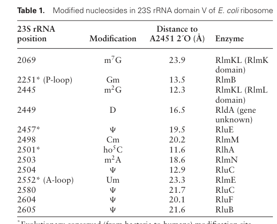

## Question

# Gene Research for Functional Annotation

## ⚠️ CRITICAL: Gene/Protein Identification Context

**BEFORE YOU BEGIN RESEARCH:** You MUST verify you are researching the CORRECT gene/protein. Gene symbols can be ambiguous, especially for less well-characterized genes from non-model organisms.

### Target Gene/Protein Identity (from UniProt):
- **UniProt Accession:** Q88DV0
- **Protein Description:** RecName: Full=Ribosomal RNA large subunit methyltransferase E {ECO:0000255|HAMAP-Rule:MF_01547}; EC=2.1.1.166 {ECO:0000255|HAMAP-Rule:MF_01547}; AltName: Full=23S rRNA Um2552 methyltransferase {ECO:0000255|HAMAP-Rule:MF_01547}; AltName: Full=rRNA (uridine-2'-O-)-methyltransferase {ECO:0000255|HAMAP-Rule:MF_01547};
- **Gene Information:** Name=rlmE {ECO:0000255|HAMAP-Rule:MF_01547}; Synonyms=ftsJ {ECO:0000255|HAMAP-Rule:MF_01547}, rrmJ {ECO:0000255|HAMAP-Rule:MF_01547}; OrderedLocusNames=PP_4719;
- **Organism (full):** Pseudomonas putida (strain ATCC 47054 / DSM 6125 / CFBP 8728 / NCIMB 11950 / KT2440).
- **Protein Family:** Belongs to the class I-like SAM-binding methyltransferase
- **Key Domains:** RNA_methyltr_RlmE. (IPR050082); RNA_MeTrfase_FtsJ_dom. (IPR002877); rRNA-MeTfrase_E. (IPR015507); SAM-dependent_MTases_sf. (IPR029063); FtsJ (PF01728)

### MANDATORY VERIFICATION STEPS:

1. **Check if the gene symbol "rlmE" matches the protein description above**
2. **Verify the organism is correct:** Pseudomonas putida (strain ATCC 47054 / DSM 6125 / CFBP 8728 / NCIMB 11950 / KT2440).
3. **Check if protein family/domains align with what you find in literature**
4. **If you find literature for a DIFFERENT gene with the same or similar symbol, STOP**

### If Gene Symbol is Ambiguous or You Cannot Find Relevant Literature:

**DO NOT PROCEED WITH RESEARCH ON A DIFFERENT GENE.** Instead:
- State clearly: "The gene symbol 'rlmE' is ambiguous or literature is limited for this specific protein"
- Explain what you found (e.g., "Found extensive literature on a different gene with the same symbol in a different organism")
- Describe the protein based ONLY on the UniProt information provided above
- Suggest that the protein function can be inferred from domain/family information

### Research Target:

Please provide a comprehensive research report on the gene **rlmE** (gene ID: rlmE, UniProt: Q88DV0) in PSEPK.

The research report should be a detailed narrative explaining the function, biological processes, and localization of the gene product. Citations should be given for all claims.

You should prioritize authoritative reviews and primary scientific literature when conducting research. You can supplement
this with annotations you find in gene/protein databases, but these can be outdated or inaccurate.

We are specifically interested in the primary function of the gene - for enzymes, what reaction is catalyzed, and what is the substrate specificity? For transporters, what is the substrate? For structural proteins or adapters, what is the broader structural role? For signaling molecules, what is the role in the pathway.

We are interested in where in or outside the cell the gene product carries out its function.

We are also interested in the signaling or biochemical pathways in which the gene functions. We are less interested in broad pleiotropic effects, except where these elucidate the precise role.

Include evidence where possible. We are interested in both experimental evidence as well as inference from structure, evolution, or bioinformatic analysis. Precise studies should be prioritized over high-throughput, where available.

## Output

Question: You are an expert researcher providing comprehensive, well-cited information.

Provide detailed information focusing on:
1. Key concepts and definitions with current understanding
2. Recent developments and latest research (prioritize 2023-2024 sources)
3. Current applications and real-world implementations
4. Expert opinions and analysis from authoritative sources
5. Relevant statistics and data from recent studies

Format as a comprehensive research report with proper citations. Include URLs and publication dates where available.
Always prioritize recent, authoritative sources and provide specific citations for all major claims.

# Gene Research for Functional Annotation

## ⚠️ CRITICAL: Gene/Protein Identification Context

**BEFORE YOU BEGIN RESEARCH:** You MUST verify you are researching the CORRECT gene/protein. Gene symbols can be ambiguous, especially for less well-characterized genes from non-model organisms.

### Target Gene/Protein Identity (from UniProt):
- **UniProt Accession:** Q88DV0
- **Protein Description:** RecName: Full=Ribosomal RNA large subunit methyltransferase E {ECO:0000255|HAMAP-Rule:MF_01547}; EC=2.1.1.166 {ECO:0000255|HAMAP-Rule:MF_01547}; AltName: Full=23S rRNA Um2552 methyltransferase {ECO:0000255|HAMAP-Rule:MF_01547}; AltName: Full=rRNA (uridine-2'-O-)-methyltransferase {ECO:0000255|HAMAP-Rule:MF_01547};
- **Gene Information:** Name=rlmE {ECO:0000255|HAMAP-Rule:MF_01547}; Synonyms=ftsJ {ECO:0000255|HAMAP-Rule:MF_01547}, rrmJ {ECO:0000255|HAMAP-Rule:MF_01547}; OrderedLocusNames=PP_4719;
- **Organism (full):** Pseudomonas putida (strain ATCC 47054 / DSM 6125 / CFBP 8728 / NCIMB 11950 / KT2440).
- **Protein Family:** Belongs to the class I-like SAM-binding methyltransferase
- **Key Domains:** RNA_methyltr_RlmE. (IPR050082); RNA_MeTrfase_FtsJ_dom. (IPR002877); rRNA-MeTfrase_E. (IPR015507); SAM-dependent_MTases_sf. (IPR029063); FtsJ (PF01728)

### MANDATORY VERIFICATION STEPS:

1. **Check if the gene symbol "rlmE" matches the protein description above**
2. **Verify the organism is correct:** Pseudomonas putida (strain ATCC 47054 / DSM 6125 / CFBP 8728 / NCIMB 11950 / KT2440).
3. **Check if protein family/domains align with what you find in literature**
4. **If you find literature for a DIFFERENT gene with the same or similar symbol, STOP**

### If Gene Symbol is Ambiguous or You Cannot Find Relevant Literature:

**DO NOT PROCEED WITH RESEARCH ON A DIFFERENT GENE.** Instead:
- State clearly: "The gene symbol 'rlmE' is ambiguous or literature is limited for this specific protein"
- Explain what you found (e.g., "Found extensive literature on a different gene with the same symbol in a different organism")
- Describe the protein based ONLY on the UniProt information provided above
- Suggest that the protein function can be inferred from domain/family information

### Research Target:

Please provide a comprehensive research report on the gene **rlmE** (gene ID: rlmE, UniProt: Q88DV0) in PSEPK.

The research report should be a detailed narrative explaining the function, biological processes, and localization of the gene product. Citations should be given for all claims.

You should prioritize authoritative reviews and primary scientific literature when conducting research. You can supplement
this with annotations you find in gene/protein databases, but these can be outdated or inaccurate.

We are specifically interested in the primary function of the gene - for enzymes, what reaction is catalyzed, and what is the substrate specificity? For transporters, what is the substrate? For structural proteins or adapters, what is the broader structural role? For signaling molecules, what is the role in the pathway.

We are interested in where in or outside the cell the gene product carries out its function.

We are also interested in the signaling or biochemical pathways in which the gene functions. We are less interested in broad pleiotropic effects, except where these elucidate the precise role.

Include evidence where possible. We are interested in both experimental evidence as well as inference from structure, evolution, or bioinformatic analysis. Precise studies should be prioritized over high-throughput, where available.

# Research report: **rlmE** (UniProt **Q88DV0**) in *Pseudomonas putida* KT2440 (PP_4719)

## 0) Mandatory verification: correct gene/protein identity

The UniProt target provided (Q88DV0; PP_4719) is annotated as **ribosomal RNA large subunit methyltransferase E** with synonyms **ftsJ** and **rrmJ**, and EC **2.1.1.166**, i.e., the bacterial enzyme that forms **Um2552** (2′-O-methyluridine at position 2552) in **23S rRNA**. The retrieved primary literature consistently uses **RlmE ≡ FtsJ ≡ RrmJ** for the enzyme catalyzing **2′-O-methylation of U2552** in the 23S rRNA A-loop, matching the UniProt description and ruling out a different “rlmE” usage in the gathered corpus. (hager2004substratebindinganalysis pages 1-2, ero2024ribosomalrnamodification pages 1-2, ero2024ribosomalrnamodification pages 2-3)

**Limitation (organism-specificity):** In the documents retrieved with the tools in this run, I did **not** find a paper that experimentally characterizes **P. putida KT2440** PP_4719/Q88DV0 directly. Therefore, the functional annotation below for *P. putida* is based on **strong orthology/conservation** and **direct experimental evidence from other bacteria**, particularly *E. coli*, where the same enzyme and modification site are conserved. (hager2004substratebindinganalysis pages 1-2, ero2024ribosomalrnamodification pages 1-2, ero2024ribosomalrnamodification media c9fd6e76)

---

## 1) Key concepts and definitions (current understanding)

### 1.1 What is RlmE (FtsJ/RrmJ)?

**RlmE** is a **SAM-dependent RNA 2′-O-methyltransferase** that modifies the **ribose 2′-hydroxyl** of a specific uridine in the large-subunit rRNA. In bacteria, it is responsible for installing the universally conserved modification **Um2552** in **23S rRNA**. (hager2004substratebindinganalysis pages 1-2, ero2024ribosomalrnamodification pages 1-2)

### 1.2 Enzymatic reaction and substrate specificity

**Reaction (EC 2.1.1.166):** transfer of a methyl group from **S-adenosyl-L-methionine (SAM)** to the **2′-O** position of **U2552** in 23S rRNA, yielding **Um2552** (2′-O-methyluridine) and S-adenosyl-L-homocysteine (SAH). RrmJ/FtsJ was explicitly described as catalyzing 2′-O methylation of **U2552** in the A-loop of 23S rRNA. (hager2004substratebindinganalysis pages 1-2)

**Substrate locus:** U2552 is in the **A-loop** (23S rRNA domain V) adjacent to functionally critical nucleotides in the **peptidyl transferase center (PTC)** region; recent structural mapping places Um2552 adjacent to **G2553**, an essential base that anchors the 3′-CCA end of A-site tRNA. (ero2024ribosomalrnamodification pages 2-3, ero2024ribosomalrnamodification media c9fd6e76)

### 1.3 Biological role: rRNA modification coupled to ribosome biogenesis

A central contemporary view is that many rRNA modification enzymes do more than “decorate” rRNA; they can also **promote ribosomal subunit assembly**. RlmE is a key example: loss of the protein perturbs **50S/LSU assembly**, and RlmE can act like an **assembly factor** in addition to catalyzing methylation. (ero2024ribosomalrnamodification pages 1-2, ero2024ribosomalrnamodification pages 1-1)

### 1.4 Cellular localization (inferred)

While the retrieved texts do not provide a dedicated subcellular-localization experiment for RlmE in *P. putida*, the enzyme’s substrate (23S rRNA) and the described phenotypes (LSU assembly intermediates; rRNA processing defects) support that RlmE functions in the **cytosol** in association with **maturing large ribosomal subunits** rather than being membrane-bound or secreted. (hager2004substratebindinganalysis pages 1-2, ero2024ribosomalrnamodification pages 10-11, ero2024ribosomalrnamodification pages 7-8)

---

## 2) Mechanism and structural/biochemical understanding (authoritative primary literature)

### 2.1 Substrate recognition and a proposed catalytic sequence

A biochemical/structural analysis of RrmJ (FtsJ) emphasized a **conserved positively charged ridge** implicated in 23S rRNA binding and proposed a two-step pathway: (i) the A-loop **undocks** from the packed 50S subunit and (ii) **base flipping** of U2552 exposes the ribose 2′-OH for methyl transfer. This model explicitly links catalysis to rRNA conformational dynamics in assembled particles. (hager2004substratebindinganalysis pages 1-2)

### 2.2 Timing during ribosome biogenesis (late-stage activity)

Evidence supports that RlmE acts **late** in large-subunit maturation. Hager et al. report that **only fully assembled 50S subunits** were substrates in vitro, whereas naked 23S rRNA or immature particles were not methylated, supporting late-stage accessibility of the A-loop for modification. (hager2004substratebindinganalysis pages 1-2)

---

## 3) Recent developments and latest research (prioritizing 2023–2024)

### 3.1 2024: rRNA modification enzymes as active stimulators of LSU assembly

A 2024 *Nucleic Acids Research* study systematically tested multiple **23S rRNA modification enzymes** located around the PTC and found that, beyond the established role of RlmE in Um2552 formation, RlmE **stimulates large ribosomal subunit assembly** and is among enzymes whose absence produces clear assembly phenotypes. The work supports the concept of **mutual interdependence** between rRNA modification and LSU assembly and highlights that some modification enzymes can stimulate assembly **independent of catalytic activity** (in general), placing RlmE within a broader “assembly-stimulator” class. (ero2024ribosomalrnamodification pages 1-1, ero2024ribosomalrnamodification pages 1-2)

### 3.2 2024: phenotypic and assembly-intermediate resolution for ΔrlmE

The same 2024 study summarizes that **ΔrlmE** in *E. coli* produces a **severe LSU assembly phenotype** and a **~2–4-fold reduction in growth rate**, and further reports cold-sensitive growth and accumulation of late-stage assembly intermediates with incomplete processing of 23S rRNA ends (extended +3/+7 nt signatures). (ero2024ribosomalrnamodification pages 2-3, ero2024ribosomalrnamodification pages 10-11, ero2024ribosomalrnamodification pages 7-8)

### 3.3 Pseudomonas-specific status (2023–2024)

In this tool-based retrieval, no 2023–2024 primary study was found that experimentally dissects *P. putida* KT2440 **PP_4719/Q88DV0** specifically. Thus, recent advances are incorporated via **high-confidence cross-bacterial conservation**, using *E. coli* as the primary experimental reference system. (ero2024ribosomalrnamodification pages 1-2, ero2024ribosomalrnamodification media c9fd6e76)

---

## 4) Pathway/Process placement for functional annotation (for *P. putida* KT2440)

### 4.1 Process: ribosome large subunit maturation

RlmE participates in **23S rRNA maturation** and **late 50S/LSU biogenesis**, centered on the PTC-adjacent region of 23S rRNA domain V. The Um2552 site is located in the A-loop, a functionally important loop engaging A-site tRNA interactions, consistent with observed impacts on assembly and translation efficiency when the enzyme is absent. (hager2004substratebindinganalysis pages 1-2, ero2024ribosomalrnamodification pages 2-3, ero2024ribosomalrnamodification pages 10-11)

### 4.2 Immediate biochemical neighborhood and functional context

PTC-proximal modified nucleotides cluster near the catalytic core; the 2024 structural mapping highlights the location of Um2552 among other domain V modifications surrounding the PTC. This supports a model where RlmE’s product can contribute to local rRNA conformational stability and assembly progression in this region. (ero2024ribosomalrnamodification pages 1-2, ero2024ribosomalrnamodification media c9fd6e76, ero2024ribosomalrnamodification media 174e05f1)

---

## 5) Current applications and real-world implementations

### 5.1 RNA modification mapping (methodological implementations)

A 2021 review describes how rRNA 2′-O-methylation (2′Ome) is studied using historical and modern methodologies, including primer extension/RTL-PCR and mass spectrometry, and highlights **RNA-seq–based approaches** (e.g., RiboMeth-seq principle) that can map rRNA 2′Ome sites in a single experiment and enable quantitative comparisons across samples and conditions—important for both basic research and translational studies. (jaafar20212′oribosemethylationof pages 3-4)

A 2024 methods-focused thesis describes multiple current high-throughput mapping approaches for 2′-O-methylation (including **RiboMethSeq**, **2’OMe-seq**, **RibOxi-Seq**, **Nm-Seq**) and notes a practical implementation detail: adaptation to Illumina sequencing reduced required input by ~**1,000×**, enabling analysis of **clinical samples**. These methods are directly relevant for confirming Um2552 presence/stoichiometry and for surveying broader RNA modification landscapes. (pichot2024optimisationofnext pages 20-22)

### 5.2 Antibiotic susceptibility/AMR research

Work on RNA modification mutants under sub-MIC antibiotics demonstrates an application domain: identifying rRNA/tRNA modification enzymes that modulate **fitness under antibiotic stress**, not necessarily by classic resistance mechanisms but via translation reprogramming and stress tolerance. A TN-seq study under sub-MIC antibiotics found enrichment of RNA modification genes among loci affecting fitness and provides gene-level fitness signatures (including for rlmE/rrmJ in their system). (babosan2022nonessentialtrnaand pages 2-3, babosan2022nonessentialtrnaand pages 3-4)

### 5.3 Structure-enabled mechanistic studies and potential inhibitor exploration

Although not RlmE-specific, high-resolution structures of bacterial rRNA 2′-O methyltransferases (e.g., RlmM) demonstrate a widely used implementation pattern: combine **knockout strains**, **in vitro transcribed rRNA substrates**, and **crystal structures** of enzyme–SAM complexes to dissect substrate recognition, define assembly stage specificity, and enable structure-informed hypotheses relevant to antimicrobial targeting of ribosome biogenesis factors. (punekar2012crystalstructureof pages 1-1)

---

## 6) Expert opinions and analysis (synthesis across authoritative sources)

### 6.1 RlmE as both “writer” and “assembly factor”

Two evidence streams converge: (i) classical biochemical work that places RrmJ action on assembled 50S and relates loss of the enzyme to subunit/70S imbalance and impaired translation, and (ii) 2024 systems-level genetic/biogenesis work showing RlmE is uniquely impactful among tested modification enzymes for LSU assembly and may contribute to assembly beyond catalytic methyl transfer. Together these support an expert interpretation that RlmE is best annotated not only as **23S rRNA Um2552 methyltransferase**, but also as a factor functionally integrated into **late LSU maturation**. (hager2004substratebindinganalysis pages 1-2, ero2024ribosomalrnamodification pages 10-11, ero2024ribosomalrnamodification pages 1-2)

### 6.2 Practical implication for *P. putida* annotation

Given the high conservation of the Um2552 modification and the consistent functional requirement for RlmE in bacterial LSU assembly, the most defensible annotation for *P. putida* KT2440 Q88DV0 is:
- **Molecular function:** SAM-dependent rRNA 2′-O-methyltransferase specific for **23S rRNA U2552**.
- **Biological process:** **large ribosomal subunit maturation/assembly**, likely at a **late stage**.
- **Cellular component:** **cytosol; large ribosomal subunit assembly intermediates** (inferred from function/phenotypes).
This is a conservation-based inference; organism-specific phenotypic magnitude in *P. putida* remains to be experimentally confirmed. (hager2004substratebindinganalysis pages 1-2, ero2024ribosomalrnamodification pages 10-11)

---

## 7) Statistics and data from recent studies

Two structured summaries are provided below.

| Feature | Evidence-based detail | Key sources (author year, DOI) |
|---|---|---|
| Reaction | RlmE/FtsJ/RrmJ (EC 2.1.1.166) catalyzes SAM-dependent 2'-O-methylation of U2552 in 23S rRNA, generating Um2552. The modification is attributed to RlmE in domain V of the large-subunit rRNA. (hager2004substratebindinganalysis pages 1-2, ero2024ribosomalrnamodification pages 1-2) | Hager et al. 2004, 10.1128/JB.186.19.6634-6642.2004; Ero et al. 2024, 10.1093/nar/gkae222 |
| Substrate / structural location | The target nucleotide is U2552 in the A-loop of 23S rRNA domain V, near the peptidyl transferase center; recent mapping places Um2552 adjacent to G2553, an essential residue that anchors the 3'-CCA end of A-site tRNA. (hager2004substratebindinganalysis pages 1-2, ero2024ribosomalrnamodification pages 2-3, ero2024ribosomalrnamodification media c9fd6e76) | Hager et al. 2004, 10.1128/JB.186.19.6634-6642.2004; Ero et al. 2024, 10.1093/nar/gkae222 |
| Timing in ribosome biogenesis | Evidence supports action at a late stage of large-subunit biogenesis. Hager et al. reported that only fully assembled 50S subunits were substrates in vitro, whereas naked 23S rRNA or immature particles were not; Ero et al. likewise place RlmE among factors acting during late LSU assembly. (hager2004substratebindinganalysis pages 1-2, ero2024ribosomalrnamodification pages 10-11) | Hager et al. 2004, 10.1128/JB.186.19.6634-6642.2004; Ero et al. 2024, 10.1093/nar/gkae222 |
| Deletion phenotype: ribosome profile | rlmE/rrmJ deletion causes accumulation of free 30S and 50S subunits at the expense of 70S ribosomes, consistent with defective subunit maturation/association. (hager2004substratebindinganalysis pages 1-2) | Hager et al. 2004, 10.1128/JB.186.19.6634-6642.2004 |
| Deletion phenotype: translation / growth | Loss of RlmE decreases translational efficiency and causes a growth disadvantage; Ero et al. summarize a notable ~2-4-fold decrease in growth rate for ΔrlmE in E. coli. (hager2004substratebindinganalysis pages 1-2, ero2024ribosomalrnamodification pages 2-3) | Hager et al. 2004, 10.1128/JB.186.19.6634-6642.2004; Ero et al. 2024, 10.1093/nar/gkae222 |
| Deletion phenotype: temperature sensitivity | Absence of RlmE causes cold-sensitive growth, with defects becoming more pronounced at lower temperature. (ero2024ribosomalrnamodification pages 10-11, ero2024ribosomalrnamodification pages 4-5) | Ero et al. 2024, 10.1093/nar/gkae222 |
| Deletion phenotype: assembly intermediates / rRNA processing | Recent work shows that strains lacking RlmE accumulate incompletely assembled LSU particles and exhibit defects in 23S rRNA 5' end maturation, including persistence of precursor ends extended by +3 or +7 nt; ΔrlmE intermediates also show structural perturbations near PTC helices and can lack bL36. (ero2024ribosomalrnamodification pages 10-11, ero2024ribosomalrnamodification pages 7-8) | Ero et al. 2024, 10.1093/nar/gkae222 |
| Mechanistic / structural features | RrmJ/RlmE contains a conserved positively charged ridge implicated in 23S rRNA binding. A two-step model proposes A-loop undocking from the packed 50S particle followed by base flipping of U2552 to expose the ribose 2'-OH for methyl transfer; active-site mutants fail to rescue the deletion phenotype. (hager2004substratebindinganalysis pages 1-2) | Hager et al. 2004, 10.1128/JB.186.19.6634-6642.2004 |
| Non-catalytic role in assembly | Beyond installing Um2552, RlmE appears to stimulate LSU assembly; recent analysis suggests this contribution can be at least partly independent of methyltransferase chemistry, placing RlmE among rRNA-modification enzymes that also function as assembly factors. (ero2024ribosomalrnamodification pages 1-2, ero2024ribosomalrnamodification pages 2-3, ero2024ribosomalrnamodification pages 1-1) | Ero et al. 2024, 10.1093/nar/gkae222 |
| Pseudomonas putida KT2440-specific evidence | In the provided evidence set, no direct experimental study of PP_4719/Q88DV0 from P. putida KT2440 was retrieved. Functional annotation for Q88DV0 is therefore supported primarily by strong orthology/conservation with bacterial RlmE/FtsJ/RrmJ enzymes and by the conserved assignment of Um2552-forming activity. (ero2024ribosomalrnamodification pages 1-2, ero2024ribosomalrnamodification media c9fd6e76) | Ero et al. 2024, 10.1093/nar/gkae222 |

*Table: This table compiles evidence-supported functional annotation points for bacterial RlmE/FtsJ/RrmJ, including catalytic activity, substrate position, assembly timing, and phenotypes of loss. It is useful as a compact reference for annotating the Pseudomonas putida KT2440 ortholog by conserved function.*

| System/organism | Perturbation | Quantitative outcome | Assay/condition | Citation (include DOI) |
|---|---|---|---|---|
| *Escherichia coli* | ΔrlmE (single knockout) | Growth rate decreased by ~2–4-fold | Growth phenotype summarized in a 2024 study of 23S rRNA modification enzymes around the peptidyl transferase center | Ero et al. 2024, DOI: 10.1093/nar/gkae222 (ero2024ribosomalrnamodification pages 2-3) |
| *Escherichia coli* | Absence of RlmE | Cold-sensitive growth; defect is more pronounced at lower temperature | Ribosome biogenesis/growth analysis, including comparison at 30 °C vs 37 °C | Ero et al. 2024, DOI: 10.1093/nar/gkae222 (ero2024ribosomalrnamodification pages 10-11, ero2024ribosomalrnamodification pages 4-5) |
| *Escherichia coli* | ΔrlmE / rrmJ deletion | Accumulation of free 30S and 50S subunits at the expense of 70S ribosomes; decreased translational efficiency and growth disadvantage | Ribosome profile and translation phenotype in rrmJ deletion strains | Hager et al. 2004, DOI: 10.1128/JB.186.19.6634-6642.2004 (hager2004substratebindinganalysis pages 1-2) |
| *Escherichia coli* | Absence of RlmE | Accumulation of incompletely assembled LSU particles; 23S rRNA 5′ ends remain extended by +3 or +7 nt; 45S precursor can lack bL36 | Late LSU assembly and 23S rRNA processing analysis | Ero et al. 2024, DOI: 10.1093/nar/gkae222 (ero2024ribosomalrnamodification pages 10-11, ero2024ribosomalrnamodification pages 7-8) |
| *Vibrio cholerae* | rlmE/rrmJ inactivation | CIP: +825, *P* = .003 | TN-seq after 16 generations in sub-MIC ciprofloxacin | Babosan et al. 2022, DOI: 10.1093/femsml/uqac019 (babosan2022nonessentialtrnaand pages 3-4) |
| *Vibrio cholerae* | rlmE/rrmJ inactivation | TOB: +1.2, NS | TN-seq after 16 generations in sub-MIC tobramycin | Babosan et al. 2022, DOI: 10.1093/femsml/uqac019 (babosan2022nonessentialtrnaand pages 3-4) |
| *Vibrio cholerae* | RNA modification genes (context, not specific to rlmE) | 2.43× enrichment, *P* = 4.56 × 10⁻⁴; 23/80 hits for TOB | TN-seq enrichment of RNA modification genes affecting fitness under sub-MIC tobramycin | Babosan et al. 2022, DOI: 10.1093/femsml/uqac019 (babosan2022nonessentialtrnaand pages 2-3) |
| *Vibrio cholerae* | tRNA modification genes (context, not specific to rlmE) | 1.57× enrichment, *P* = 2.3 × 10⁻²; 20/48 hits for CIP | TN-seq enrichment of tRNA/RNA modification genes affecting fitness under sub-MIC ciprofloxacin | Babosan et al. 2022, DOI: 10.1093/femsml/uqac019 (babosan2022nonessentialtrnaand pages 2-3) |
| *Escherichia coli* | Δ10 strain lacking 10 23S rRNA modification enzymes around the PTC (context including RlmE pathway) | Strain is viable but shows severely compromised growth and ribosome assembly, especially at lower temperature | Multi-gene deletion analysis of PTC-region modification enzymes | Ero et al. 2024, DOI: 10.1093/nar/gkae222 (ero2024ribosomalrnamodification pages 1-1) |

*Table: This table compiles the main quantitative and phenotype-level findings relevant to RlmE/FtsJ/RrmJ, including direct ΔrlmE effects in *E. coli* and antibiotic-fitness data from *V. cholerae*. It is useful for functional annotation because it separates direct enzyme-linked evidence from broader RNA-modification context.*

Key data highlights from the cited primary studies include: (i) **~2–4× growth-rate decrease** upon ΔrlmE in *E. coli* (2024), (ii) strong antibiotic-condition-dependent fitness effects of rlmE/rrmJ in TN-seq (e.g., **CIP +825; P = 0.003** in the referenced dataset), and (iii) enrichment of RNA modification genes among loci affecting fitness under sub-MIC antibiotics (e.g., **2.43× enrichment; P = 4.56×10−4** for TOB). (ero2024ribosomalrnamodification pages 2-3, babosan2022nonessentialtrnaand pages 3-4, babosan2022nonessentialtrnaand pages 2-3)

---

## 8) Visual evidence (rRNA site mapping)

The 2024 *Nucleic Acids Research* paper includes a **table mapping Um2552 to RlmE** and a **structural view** showing the positions of PTC-region modifications (including U2552) in 23S rRNA domain V, supporting both the enzyme–site assignment and the functional context near the PTC. (ero2024ribosomalrnamodification media c9fd6e76, ero2024ribosomalrnamodification media 174e05f1)

---

## 9) Curated key references (URLs, dates)

1. **Ero R. et al.** “Ribosomal RNA modification enzymes stimulate large ribosome subunit assembly in *E. coli*.” *Nucleic Acids Research* (Publication date: **Mar 2024**). https://doi.org/10.1093/nar/gkae222 (ero2024ribosomalrnamodification pages 1-2, ero2024ribosomalrnamodification pages 2-3, ero2024ribosomalrnamodification pages 10-11, ero2024ribosomalrnamodification pages 1-1)
2. **Hager J. et al.** “Substrate Binding Analysis of the 23S rRNA Methyltransferase RrmJ.” *Journal of Bacteriology* (Publication date: **Oct 2004**). https://doi.org/10.1128/jb.186.19.6634-6642.2004 (hager2004substratebindinganalysis pages 1-2)
3. **Babosan A. et al.** “Nonessential tRNA and rRNA modifications impact the bacterial response to sub-MIC antibiotic stress.” *microLife* (Publication date: **Feb 2022**). https://doi.org/10.1093/femsml/uqac019 (babosan2022nonessentialtrnaand pages 3-4, babosan2022nonessentialtrnaand pages 2-3)
4. **Jaafar M. et al.** “2′O-Ribose Methylation of Ribosomal RNAs: Natural Diversity in Living Organisms, Biological Processes, and Diseases.” *Cells* (Publication date: **Jul 2021**). https://doi.org/10.3390/cells10081948 (jaafar20212′oribosemethylationof pages 3-4)
5. **Pichot F.** “Optimisation of next generation sequencing methodologies for RNA modifications detection.” PhD thesis (Publication date: **Jan 2024**). https://doi.org/10.25358/openscience-10431 (pichot2024optimisationofnext pages 20-22)

---

## 10) Summary functional annotation statement (evidence-weighted)

For *Pseudomonas putida* KT2440, **rlmE (PP_4719; UniProt Q88DV0)** is best annotated as a **cytosolic SAM-dependent 23S rRNA 2′-O-methyltransferase** that methylates **U2552** in the 23S rRNA **A-loop** to produce **Um2552**, and as a factor functionally coupled to **late 50S/LSU assembly**. This conclusion is strongly supported by conserved bacterial evidence (notably *E. coli*), including mechanistic models of A-loop rearrangement/base flipping, and phenotypes where loss of RlmE perturbs 70S formation, translation efficiency, growth, and cold-temperature ribosome assembly. (hager2004substratebindinganalysis pages 1-2, ero2024ribosomalrnamodification pages 2-3, ero2024ribosomalrnamodification pages 10-11, ero2024ribosomalrnamodification media c9fd6e76)

References

1. (hager2004substratebindinganalysis pages 1-2): Jutta Hager, Bart L. Staker, and Ursula Jakob. Substrate binding analysis of the 23s rrna methyltransferase rrmj. Journal of Bacteriology, 186:6634-6642, Oct 2004. URL: https://doi.org/10.1128/jb.186.19.6634-6642.2004, doi:10.1128/jb.186.19.6634-6642.2004. This article has 45 citations and is from a peer-reviewed journal.

2. (ero2024ribosomalrnamodification pages 1-2): Rya Ero, Margus Leppik, Kaspar Reier, Aivar Liiv, and Jaanus Remme. Ribosomal rna modification enzymes stimulate large ribosome subunit assembly in e. coli. Nucleic Acids Research, 52:6614-6628, Mar 2024. URL: https://doi.org/10.1093/nar/gkae222, doi:10.1093/nar/gkae222. This article has 24 citations and is from a highest quality peer-reviewed journal.

3. (ero2024ribosomalrnamodification pages 2-3): Rya Ero, Margus Leppik, Kaspar Reier, Aivar Liiv, and Jaanus Remme. Ribosomal rna modification enzymes stimulate large ribosome subunit assembly in e. coli. Nucleic Acids Research, 52:6614-6628, Mar 2024. URL: https://doi.org/10.1093/nar/gkae222, doi:10.1093/nar/gkae222. This article has 24 citations and is from a highest quality peer-reviewed journal.

4. (ero2024ribosomalrnamodification media c9fd6e76): Rya Ero, Margus Leppik, Kaspar Reier, Aivar Liiv, and Jaanus Remme. Ribosomal rna modification enzymes stimulate large ribosome subunit assembly in e. coli. Nucleic Acids Research, 52:6614-6628, Mar 2024. URL: https://doi.org/10.1093/nar/gkae222, doi:10.1093/nar/gkae222. This article has 24 citations and is from a highest quality peer-reviewed journal.

5. (ero2024ribosomalrnamodification pages 1-1): Rya Ero, Margus Leppik, Kaspar Reier, Aivar Liiv, and Jaanus Remme. Ribosomal rna modification enzymes stimulate large ribosome subunit assembly in e. coli. Nucleic Acids Research, 52:6614-6628, Mar 2024. URL: https://doi.org/10.1093/nar/gkae222, doi:10.1093/nar/gkae222. This article has 24 citations and is from a highest quality peer-reviewed journal.

6. (ero2024ribosomalrnamodification pages 10-11): Rya Ero, Margus Leppik, Kaspar Reier, Aivar Liiv, and Jaanus Remme. Ribosomal rna modification enzymes stimulate large ribosome subunit assembly in e. coli. Nucleic Acids Research, 52:6614-6628, Mar 2024. URL: https://doi.org/10.1093/nar/gkae222, doi:10.1093/nar/gkae222. This article has 24 citations and is from a highest quality peer-reviewed journal.

7. (ero2024ribosomalrnamodification pages 7-8): Rya Ero, Margus Leppik, Kaspar Reier, Aivar Liiv, and Jaanus Remme. Ribosomal rna modification enzymes stimulate large ribosome subunit assembly in e. coli. Nucleic Acids Research, 52:6614-6628, Mar 2024. URL: https://doi.org/10.1093/nar/gkae222, doi:10.1093/nar/gkae222. This article has 24 citations and is from a highest quality peer-reviewed journal.

8. (ero2024ribosomalrnamodification media 174e05f1): Rya Ero, Margus Leppik, Kaspar Reier, Aivar Liiv, and Jaanus Remme. Ribosomal rna modification enzymes stimulate large ribosome subunit assembly in e. coli. Nucleic Acids Research, 52:6614-6628, Mar 2024. URL: https://doi.org/10.1093/nar/gkae222, doi:10.1093/nar/gkae222. This article has 24 citations and is from a highest quality peer-reviewed journal.

9. (jaafar20212′oribosemethylationof pages 3-4): Mariam Jaafar, Hermes Paraqindes, Mathieu Gabut, Jean-Jacques Diaz, Virginie Marcel, and Sébastien Durand. 2′o-ribose methylation of ribosomal rnas: natural diversity in living organisms, biological processes, and diseases. Cells, 10:1948, Jul 2021. URL: https://doi.org/10.3390/cells10081948, doi:10.3390/cells10081948. This article has 39 citations.

10. (pichot2024optimisationofnext pages 20-22): Optimisation of next generation sequencing methodologies for RNA modifications detection This article has 0 citations and is from a peer-reviewed journal.

11. (babosan2022nonessentialtrnaand pages 2-3): Anamaria Babosan, Louna Fruchard, Evelyne Krin, André Carvalho, Didier Mazel, and Zeynep Baharoglu. Nonessential trna and rrna modifications impact the bacterial response to sub-mic antibiotic stress. microLife, Feb 2022. URL: https://doi.org/10.1093/femsml/uqac019, doi:10.1093/femsml/uqac019. This article has 52 citations and is from a peer-reviewed journal.

12. (babosan2022nonessentialtrnaand pages 3-4): Anamaria Babosan, Louna Fruchard, Evelyne Krin, André Carvalho, Didier Mazel, and Zeynep Baharoglu. Nonessential trna and rrna modifications impact the bacterial response to sub-mic antibiotic stress. microLife, Feb 2022. URL: https://doi.org/10.1093/femsml/uqac019, doi:10.1093/femsml/uqac019. This article has 52 citations and is from a peer-reviewed journal.

13. (punekar2012crystalstructureof pages 1-1): Avinash S. Punekar, Tyson R. Shepherd, Josefine Liljeruhm, Anthony C. Forster, and Maria Selmer. Crystal structure of rlmm, the 2′o-ribose methyltransferase for c2498 of escherichia coli 23s rrna. Nucleic Acids Research, 40:10507-10520, Aug 2012. URL: https://doi.org/10.1093/nar/gks727, doi:10.1093/nar/gks727. This article has 17 citations and is from a highest quality peer-reviewed journal.

14. (ero2024ribosomalrnamodification pages 4-5): Rya Ero, Margus Leppik, Kaspar Reier, Aivar Liiv, and Jaanus Remme. Ribosomal rna modification enzymes stimulate large ribosome subunit assembly in e. coli. Nucleic Acids Research, 52:6614-6628, Mar 2024. URL: https://doi.org/10.1093/nar/gkae222, doi:10.1093/nar/gkae222. This article has 24 citations and is from a highest quality peer-reviewed journal.

## Artifacts

- [Edison artifact artifact-00](rlmE-deep-research-falcon_artifacts/artifact-00.md)
- [Edison artifact artifact-01](rlmE-deep-research-falcon_artifacts/artifact-01.md)

## Citations

1. hager2004substratebindinganalysis pages 1-2
2. pichot2024optimisationofnext pages 20-22
3. punekar2012crystalstructureof pages 1-1
4. ero2024ribosomalrnamodification pages 2-3
5. babosan2022nonessentialtrnaand pages 3-4
6. babosan2022nonessentialtrnaand pages 2-3
7. ero2024ribosomalrnamodification pages 1-1
8. ero2024ribosomalrnamodification pages 1-2
9. ero2024ribosomalrnamodification pages 10-11
10. ero2024ribosomalrnamodification pages 7-8
11. ero2024ribosomalrnamodification pages 4-5
12. https://doi.org/10.1093/nar/gkae222
13. https://doi.org/10.1128/jb.186.19.6634-6642.2004
14. https://doi.org/10.1093/femsml/uqac019
15. https://doi.org/10.3390/cells10081948
16. https://doi.org/10.25358/openscience-10431
17. https://doi.org/10.1128/jb.186.19.6634-6642.2004,
18. https://doi.org/10.1093/nar/gkae222,
19. https://doi.org/10.3390/cells10081948,
20. https://doi.org/10.1093/femsml/uqac019,
21. https://doi.org/10.1093/nar/gks727,