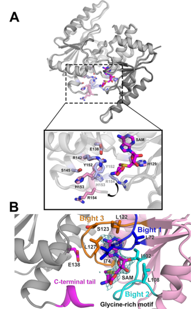

## Question

# Gene Research for Functional Annotation

## ⚠️ CRITICAL: Gene/Protein Identification Context

**BEFORE YOU BEGIN RESEARCH:** You MUST verify you are researching the CORRECT gene/protein. Gene symbols can be ambiguous, especially for less well-characterized genes from non-model organisms.

### Target Gene/Protein Identity (from UniProt):
- **UniProt Accession:** Q88DL7
- **Protein Description:** RecName: Full=Ribosomal RNA large subunit methyltransferase H {ECO:0000255|HAMAP-Rule:MF_00658}; EC=2.1.1.177 {ECO:0000255|HAMAP-Rule:MF_00658}; AltName: Full=23S rRNA (pseudouridine1915-N3)-methyltransferase {ECO:0000255|HAMAP-Rule:MF_00658}; AltName: Full=23S rRNA m3Psi1915 methyltransferase {ECO:0000255|HAMAP-Rule:MF_00658}; AltName: Full=rRNA (pseudouridine-N3-)-methyltransferase RlmH {ECO:0000255|HAMAP-Rule:MF_00658};
- **Gene Information:** Name=rlmH {ECO:0000255|HAMAP-Rule:MF_00658}; OrderedLocusNames=PP_4808;
- **Organism (full):** Pseudomonas putida (strain ATCC 47054 / DSM 6125 / CFBP 8728 / NCIMB 11950 / KT2440).
- **Protein Family:** Belongs to the RNA methyltransferase RlmH family.
- **Key Domains:** Alpha/beta_knot_MTases. (IPR029028); RlmH-like. (IPR003742); tRNA_m1G_MTases_N. (IPR029026); SPOUT_MTase (PF02590)

### MANDATORY VERIFICATION STEPS:

1. **Check if the gene symbol "rlmH" matches the protein description above**
2. **Verify the organism is correct:** Pseudomonas putida (strain ATCC 47054 / DSM 6125 / CFBP 8728 / NCIMB 11950 / KT2440).
3. **Check if protein family/domains align with what you find in literature**
4. **If you find literature for a DIFFERENT gene with the same or similar symbol, STOP**

### If Gene Symbol is Ambiguous or You Cannot Find Relevant Literature:

**DO NOT PROCEED WITH RESEARCH ON A DIFFERENT GENE.** Instead:
- State clearly: "The gene symbol 'rlmH' is ambiguous or literature is limited for this specific protein"
- Explain what you found (e.g., "Found extensive literature on a different gene with the same symbol in a different organism")
- Describe the protein based ONLY on the UniProt information provided above
- Suggest that the protein function can be inferred from domain/family information

### Research Target:

Please provide a comprehensive research report on the gene **rlmH** (gene ID: rlmH, UniProt: Q88DL7) in PSEPK.

The research report should be a detailed narrative explaining the function, biological processes, and localization of the gene product. Citations should be given for all claims.

You should prioritize authoritative reviews and primary scientific literature when conducting research. You can supplement
this with annotations you find in gene/protein databases, but these can be outdated or inaccurate.

We are specifically interested in the primary function of the gene - for enzymes, what reaction is catalyzed, and what is the substrate specificity? For transporters, what is the substrate? For structural proteins or adapters, what is the broader structural role? For signaling molecules, what is the role in the pathway.

We are interested in where in or outside the cell the gene product carries out its function.

We are also interested in the signaling or biochemical pathways in which the gene functions. We are less interested in broad pleiotropic effects, except where these elucidate the precise role.

Include evidence where possible. We are interested in both experimental evidence as well as inference from structure, evolution, or bioinformatic analysis. Precise studies should be prioritized over high-throughput, where available.

## Output

Question: You are an expert researcher providing comprehensive, well-cited information.

Provide detailed information focusing on:
1. Key concepts and definitions with current understanding
2. Recent developments and latest research (prioritize 2023-2024 sources)
3. Current applications and real-world implementations
4. Expert opinions and analysis from authoritative sources
5. Relevant statistics and data from recent studies

Format as a comprehensive research report with proper citations. Include URLs and publication dates where available.
Always prioritize recent, authoritative sources and provide specific citations for all major claims.

# Gene Research for Functional Annotation

## ⚠️ CRITICAL: Gene/Protein Identification Context

**BEFORE YOU BEGIN RESEARCH:** You MUST verify you are researching the CORRECT gene/protein. Gene symbols can be ambiguous, especially for less well-characterized genes from non-model organisms.

### Target Gene/Protein Identity (from UniProt):
- **UniProt Accession:** Q88DL7
- **Protein Description:** RecName: Full=Ribosomal RNA large subunit methyltransferase H {ECO:0000255|HAMAP-Rule:MF_00658}; EC=2.1.1.177 {ECO:0000255|HAMAP-Rule:MF_00658}; AltName: Full=23S rRNA (pseudouridine1915-N3)-methyltransferase {ECO:0000255|HAMAP-Rule:MF_00658}; AltName: Full=23S rRNA m3Psi1915 methyltransferase {ECO:0000255|HAMAP-Rule:MF_00658}; AltName: Full=rRNA (pseudouridine-N3-)-methyltransferase RlmH {ECO:0000255|HAMAP-Rule:MF_00658};
- **Gene Information:** Name=rlmH {ECO:0000255|HAMAP-Rule:MF_00658}; OrderedLocusNames=PP_4808;
- **Organism (full):** Pseudomonas putida (strain ATCC 47054 / DSM 6125 / CFBP 8728 / NCIMB 11950 / KT2440).
- **Protein Family:** Belongs to the RNA methyltransferase RlmH family.
- **Key Domains:** Alpha/beta_knot_MTases. (IPR029028); RlmH-like. (IPR003742); tRNA_m1G_MTases_N. (IPR029026); SPOUT_MTase (PF02590)

### MANDATORY VERIFICATION STEPS:

1. **Check if the gene symbol "rlmH" matches the protein description above**
2. **Verify the organism is correct:** Pseudomonas putida (strain ATCC 47054 / DSM 6125 / CFBP 8728 / NCIMB 11950 / KT2440).
3. **Check if protein family/domains align with what you find in literature**
4. **If you find literature for a DIFFERENT gene with the same or similar symbol, STOP**

### If Gene Symbol is Ambiguous or You Cannot Find Relevant Literature:

**DO NOT PROCEED WITH RESEARCH ON A DIFFERENT GENE.** Instead:
- State clearly: "The gene symbol 'rlmH' is ambiguous or literature is limited for this specific protein"
- Explain what you found (e.g., "Found extensive literature on a different gene with the same symbol in a different organism")
- Describe the protein based ONLY on the UniProt information provided above
- Suggest that the protein function can be inferred from domain/family information

### Research Target:

Please provide a comprehensive research report on the gene **rlmH** (gene ID: rlmH, UniProt: Q88DL7) in PSEPK.

The research report should be a detailed narrative explaining the function, biological processes, and localization of the gene product. Citations should be given for all claims.

You should prioritize authoritative reviews and primary scientific literature when conducting research. You can supplement
this with annotations you find in gene/protein databases, but these can be outdated or inaccurate.

We are specifically interested in the primary function of the gene - for enzymes, what reaction is catalyzed, and what is the substrate specificity? For transporters, what is the substrate? For structural proteins or adapters, what is the broader structural role? For signaling molecules, what is the role in the pathway.

We are interested in where in or outside the cell the gene product carries out its function.

We are also interested in the signaling or biochemical pathways in which the gene functions. We are less interested in broad pleiotropic effects, except where these elucidate the precise role.

Include evidence where possible. We are interested in both experimental evidence as well as inference from structure, evolution, or bioinformatic analysis. Precise studies should be prioritized over high-throughput, where available.

## Research report: **rlmH (UniProt Q88DL7; PP_4808) in *Pseudomonas putida* KT2440**

### Executive summary (identity verified)
UniProt accession **Q88DL7** from *Pseudomonas putida* KT2440 is annotated as **ribosomal RNA large subunit methyltransferase H (RlmH)**, an S-adenosyl‑L‑methionine (SAM)–dependent **SPOUT/αβ-knot** RNA methyltransferase (EC **2.1.1.177**) that catalyzes **N3-methylation of a pre-existing pseudouridine in 23S rRNA** (commonly referred to as **m3Ψ1915** in *E. coli* numbering). The available primary mechanistic literature is largely from *E. coli* and other bacteria; however, the enzyme family/function is strongly conserved and aligns with the UniProt family/domain assignment for Q88DL7 (koh2017smallmethyltransferaserlmh pages 1-2, purta2008ybeaisthe pages 1-2, popova2024completelistof pages 31-33).

**Important limitation:** in the retrieved full-text set, **no paper directly studying *P. putida* KT2440 PP_4808/Q88DL7** was obtained; therefore, organism-specific phenotypes and regulation in *P. putida* are not experimentally supported here and are presented only as conserved-function inference (purta2008ybeaisthe pages 1-2, koh2017smallmethyltransferaserlmh pages 1-2).

### Data sources (URLs and publication dates)
Key sources used in this report:
- Purta et al. **2008-08**. *RNA*. “YbeA is the m3Ψ methyltransferase RlmH that targets nucleotide 1915 in 23S rRNA.” https://doi.org/10.1261/rna.1198108 (purta2008ybeaisthe pages 1-2, purta2008ybeaisthe pages 3-4)
- Koh et al. **2017-04**. *Scientific Reports*. “Small methyltransferase RlmH assembles a composite active site to methylate a ribosomal pseudouridine.” https://doi.org/10.1038/s41598-017-01186-5 (koh2017smallmethyltransferaserlmh pages 1-2, koh2017smallmethyltransferaserlmh pages 2-3)
- Narayan et al. **2023-09**. *Biochemistry*. “RNA Post-transcriptional Modifications of an Early-Stage Large-Subunit Ribosomal Intermediate.” https://doi.org/10.1021/acs.biochem.3c00291 (narayan2023rnaposttranscriptionalmodifications pages 10-12)
- Popova et al. **2024-05**. *bioRxiv*. “Complete list of canonical post-transcriptional modifications in the Bacillus subtilis ribosome and their link to RbgA driven large subunit assembly.” https://doi.org/10.1101/2024.05.10.593627 (popova2024completelistof pages 25-31, popova2024completelistof pages 31-33)
- Haft et al. **2014-06**. *PNAS*. “Correcting direct effects of ethanol on translation and transcription machinery confers ethanol tolerance in bacteria.” https://doi.org/10.1073/pnas.1401853111 (haft2014correctingdirecteffects pages 7-8)

---

## 1) Key concepts and definitions (current understanding)

### 1.1 What is RlmH?
**RlmH** (historically annotated as **YbeA** in *E. coli*) is a **bacterial 23S rRNA modification enzyme** that installs **3-methylpseudouridine** at a conserved site in the large-subunit rRNA (koh2017smallmethyltransferaserlmh pages 1-2, purta2008ybeaisthe pages 1-2). It belongs to the **SPOUT** (SpoU-TrmD) superfamily of SAM-dependent methyltransferases and is unusual in being among the smallest SPOUT enzymes, lacking an additional RNA-recognition domain (koh2017smallmethyltransferaserlmh pages 1-2).

### 1.2 Reaction chemistry, substrates, and specificity
**Reaction (canonical):**
- **Substrate:** 23S rRNA containing **pseudouridine (Ψ)** at the target site in helix 69 (H69).
- **Cofactor:** **SAM** (methyl donor).
- **Product:** **m3Ψ** (N3-methylpseudouridine) at that site.
- **Enzyme class:** EC **2.1.1.177**.

Koh et al. describe RlmH as “the bacterial 23S rRNA N3-methyltransferase that converts Ψ1915 to 3‑methylpseudouridine (m3Ψ) via a site-specific transfer of a methyl group from SAM,” and emphasize that it acts on the assembled ribosome and does not methylate neighboring pseudouridines (koh2017smallmethyltransferaserlmh pages 1-2). Purta et al. genetically identify ybeA/rlmH as responsible for the methylation at nucleotide 1915 of 23S rRNA and classify it as a SAM-dependent SPOUT-family methyltransferase (purta2008ybeaisthe pages 1-2, purta2008ybeaisthe pages 3-4).

**Dependency on prior pseudouridylation:** the modification is a **two-step pathway** where uridine is first isomerized to Ψ (by **RluD**) and then methylated by RlmH; this requirement is explicitly supported in recent assembly-timing studies (popova2024completelistof pages 31-33, narayan2023rnaposttranscriptionalmodifications pages 10-12).

### 1.3 Structural biology: fold, oligomeric state, and active site
RlmH adopts the SPOUT “**overhand-knot**” α/β fold and functions as a **homodimer**. A key mechanistic concept is that the enzyme assembles a **composite, asymmetric active site across the dimer**, in which:
- one monomer contributes the **SAM-binding pocket**, and
- the partner monomer’s **C-terminal tail** contributes residues essential for catalysis (koh2017smallmethyltransferaserlmh pages 1-2, koh2017smallmethyltransferaserlmh pages 5-7).

This composite active-site architecture is shown in the structural panels retrieved from Koh et al. (koh2017smallmethyltransferaserlmh media ba365767, koh2017smallmethyltransferaserlmh media d46266e4, koh2017smallmethyltransferaserlmh media 0ac60c2b).

**Catalytically important residues and ribosome binding surface:** Koh et al. identify conserved residues (e.g., **E138, R142, Y152, H153, R154**) as essential for catalysis and/or ribosome binding, and propose a positively charged patch as an rRNA interaction surface (koh2017smallmethyltransferaserlmh pages 2-3, koh2017smallmethyltransferaserlmh pages 5-7).

### 1.4 Cellular location and molecular context
In bacteria, rRNA modification enzymes such as RlmH act in the **cytosol** on **ribosomal particles**. A strong mechanistic constraint is that RlmH preferentially recognizes the **assembled 70S ribosome** rather than naked rRNA under tested conditions (koh2017smallmethyltransferaserlmh pages 1-2, koh2017smallmethyltransferaserlmh pages 5-7). Purta et al. further propose (based on docking) that RlmH binds near the ribosomal A site at the 30S–50S interface to position SAM adjacent to the target nucleotide (purta2008ybeaisthe pages 1-2).

---

## 2) Recent developments and latest research (prioritizing 2023–2024)

### 2.1 RlmH as a late-acting ribosome assembly/maturation enzyme
Recent rRNA-modification profiling emphasizes that many rRNA modifications are **installed during assembly** and that specific marks appear late.

- **E. coli early intermediate mapping (2023):** Narayan et al. profiled multiple 23S rRNA modifications in an early **27S** LSU assembly intermediate and report that **m3Ψ1919 (RlmH product)** is **significantly less abundant** in this intermediate compared with mature 50S, supporting the model that RlmH acts later in assembly (narayan2023rnaposttranscriptionalmodifications pages 10-12).

- **Bacillus subtilis comprehensive modification inventory and timing (2024):** Popova et al. mapped a complete set of canonical rRNA modifications in *B. subtilis* and directly quantified modification levels in assembly intermediates. They identify the RlmH homolog as responsible for **1944‑m3Ψ** (corresponding to *E. coli* m3Ψ1915) and show that this modification is **absent from the RbgA-dependent 45S intermediate** and only **56 ± 13%** present in 50SWT fractions, consistent with RlmH acting **late/final** in the LSU pathway (popova2024completelistof pages 25-31). They further state that m3Ψ methylation is a **final modification step** and depends on prior RluD pseudouridylation, with RlmH associating after release of the late assembly factor **RbgA** (popova2024completelistof pages 31-33).

**Interpretation (expert synthesis grounded in evidence):** Together, these 2023–2024 studies support a modern view of RlmH as a **late-stage quality-control/finishing enzyme**: it modifies a conserved intersubunit-bridge nucleotide once the rRNA architecture and subunit joining are sufficiently mature to present the correct structural epitope (narayan2023rnaposttranscriptionalmodifications pages 10-12, popova2024completelistof pages 31-33).

### 2.2 Quantitative mapping and stoichiometry as a “new” capability
A notable methodological development is the ability to quantify modification completion in intermediates with **MS** and **NGS/chemical probing**, enabling estimation of modification stoichiometry rather than only presence/absence. For example, Popova et al. report that LSU assembly intermediates are low abundance (~**2% of ribosome load**) yet still analyzable, and provide quantitative depletion/partial completion for specific H69 modifications including the RlmH-dependent m3Ψ (popova2024completelistof pages 1-5, popova2024completelistof pages 25-31).

---

## 3) Current applications and real-world implementations

### 3.1 Engineering stress tolerance (ethanol) via translation machinery robustness
In an applied/engineering context, Haft et al. (PNAS 2014) discuss ethanol stress as a perturbant of translation, proposing that ethanol disrupts the decoding center similarly to streptomycin, and note that **overexpression of RlmH confers ethanol tolerance in E. coli** (haft2014correctingdirecteffects pages 7-8). Although the excerpt available here does not provide the quantitative tolerance improvement, it establishes RlmH as part of a set of translation/transcription machinery interventions relevant to microbial robustness (haft2014correctingdirecteffects pages 7-8).

### 3.2 Ribosome biogenesis research and antibiotic-sensitivity landscapes
Recent systematic mapping of rRNA modification inventories is used as a platform for:
- identifying “missing” modifications in intermediates,
- inferring assembly order, and
- linking modification patterns to functional centers (PTC, intersubunit bridges) and sometimes antibiotic sensitivities.

Popova et al. highlight that many 23S rRNA modifications cluster in functional regions and that some specific 2′‑O‑methylations are associated with sensitivity to antibiotics such as capreomycin/viomycin (context for modification biology broadly, though not specific to RlmH) (popova2024completelistof pages 31-33). This supports the general application of rRNA modification mapping to antibiotic interaction studies, even when a direct RlmH-antibiotic phenotype is not established in the retrieved excerpts.

---

## 4) Expert opinions and analysis from authoritative sources (as stated in primary literature)

### 4.1 “Stamp of approval” hypothesis for late LSU engagement
Purta et al. propose that RlmH methylation may function as a “**stamp of approval** signifying that the 50S subunit has engaged in translational initiation,” consistent with structural docking at the intersubunit interface and late action during maturation (purta2008ybeaisthe pages 1-2). This hypothesis aligns with later assembly profiling that places m3Ψ installation late in the pathway (narayan2023rnaposttranscriptionalmodifications pages 10-12, popova2024completelistof pages 31-33).

### 4.2 Composite active site and minimalist SPOUT design
Koh et al. present RlmH as a mechanistic exemplar for how a very small SPOUT enzyme can achieve strict site specificity by using the ribosome as a recognition scaffold and by constructing a composite active site across a dimer (koh2017smallmethyltransferaserlmh pages 1-2, koh2017smallmethyltransferaserlmh pages 5-7). The structural panels retrieved from the paper visually support this architecture (koh2017smallmethyltransferaserlmh media ba365767, koh2017smallmethyltransferaserlmh media d46266e4).

---

## 5) Relevant statistics and data from recent and foundational studies

### 5.1 Enzyme kinetics on ribosomes (quantitative enzymology)
Koh et al. report kinetic parameters for *E. coli* RlmH acting on **70S ribosomes**: apparent **KM ≤ 0.3 μM** and **kcat = 2.5 ± 0.4 min⁻1** (His-tagged enzyme), and cite prior untagged values **KM = 0.51 ± 0.06 μM** and **kcat = 4.95 ± 1.10 min⁻1** (koh2017smallmethyltransferaserlmh pages 2-3). These values indicate high apparent affinity for the ribosomal substrate and a modest catalytic turnover consistent with a maturation enzyme acting on ribosome particles.

### 5.2 Modification stoichiometry in assembly intermediates (2024)
Popova et al. quantify the RlmH-dependent m3Ψ modification in *B. subtilis* fractions:
- **absent** in 45S-RbgA intermediates, and
- **56 ± 13%** present in 50SWT fractions,
consistent with a late installation step (popova2024completelistof pages 25-31).

### 5.3 Genetic/biochemical validation of the modification site (2008)
Purta et al. use MALDI-MS and tandem MS to localize the methylation to nucleotide 1915: an 11-nt fragment shifts from **m/z 3519.5 (unmethylated)** to **m/z 3533.5 (methylated)**; the methylated species is lost in a ybeA/rlmH knockout and restored by complementation (purta2008ybeaisthe pages 3-4).

---

## Functional annotation for *P. putida* KT2440 Q88DL7 (rlmH) based on best available evidence

### Primary molecular function (most supported)
**RlmH (Q88DL7) is best annotated as a SAM-dependent 23S rRNA methyltransferase that catalyzes N3-methylation of Ψ1915 to m3Ψ1915 (EC 2.1.1.177).** This is supported by conserved family assignment and direct characterization of homologs showing the same reaction chemistry and specificity (koh2017smallmethyltransferaserlmh pages 1-2, purta2008ybeaisthe pages 1-2).

### Substrate specificity (what it acts on)
- **RNA target:** helix 69 of 23S rRNA at the conserved Ψ1915 site (koh2017smallmethyltransferaserlmh pages 1-2, purta2008ybeaisthe pages 3-4).
- **Requires prior Ψ:** pseudouridylation precedes methylation; RlmH modifies Ψ, not U (popova2024completelistof pages 31-33, narayan2023rnaposttranscriptionalmodifications pages 10-12).
- **Ribosomal particle requirement:** acts preferentially on **assembled 70S** ribosomes under tested conditions (koh2017smallmethyltransferaserlmh pages 1-2).

### Cellular process and pathway context
RlmH participates in the broader pathway of **ribosome biogenesis and rRNA maturation**, acting **late** during large-subunit maturation/subunit joining; recent profiling indicates m3Ψ formation is depleted in early intermediates and appears after late assembly events (narayan2023rnaposttranscriptionalmodifications pages 10-12, popova2024completelistof pages 31-33).

### Subcellular localization
By function, RlmH is expected to be a **cytosolic, ribosome-associated enzyme**, acting on ribosome particles/70S complexes rather than secreted or membrane-localized substrates (koh2017smallmethyltransferaserlmh pages 1-2, purta2008ybeaisthe pages 1-2).

---

## Visual evidence (figures/tables)
Koh et al. provide structural panels illustrating the **dimeric composite active site** and cofactor binding architecture, as well as panels connected to **enzymology/kinetics**; cropped panels were retrieved here (koh2017smallmethyltransferaserlmh media ba365767, koh2017smallmethyltransferaserlmh media d46266e4, koh2017smallmethyltransferaserlmh media 0ac60c2b).

---

## Consolidated functional-annotation table
| Annotation aspect | Key finding | Evidence type | Best supporting citation IDs |
|---|---|---|---|
| Reaction | RlmH/YbeA is the bacterial 23S rRNA N3-methyltransferase (EC 2.1.1.177) that converts pseudouridine at the target site to 3-methylpseudouridine (m3Ψ). | Biochemical, genetic, structural | (koh2017smallmethyltransferaserlmh pages 1-2, purta2008ybeaisthe pages 1-2) |
| Substrate/site | The modified nucleotide is 23S rRNA Ψ1915 in *E. coli* numbering, located in helix 69 near the decoding center/inter-subunit interface; tandem MS localized the methylation to nt 1915. | MS, genetic, structural modeling | (purta2008ybeaisthe pages 3-4, purta2008ybeaisthe pages 1-2, purta2008ybeaisthe pages 6-8) |
| Cofactor | The enzyme is SAM/AdoMet-dependent; SAM and the inhibitor sinefungin bind in the SPOUT active site in a bent conformation. | Structural, biochemical, bioinformatic | (koh2017smallmethyltransferaserlmh pages 1-2, koh2017smallmethyltransferaserlmh pages 2-3, purta2008ybeaisthe pages 1-2) |
| Requirement for prior modification | RlmH requires prior pseudouridylation by RluD; methyl transfer occurs only after the uridine has been converted to Ψ. | Assembly profiling, comparative functional analysis | (popova2024completelistof pages 31-33, narayan2023rnaposttranscriptionalmodifications pages 8-10, koh2017smallmethyltransferaserlmh pages 1-2) |
| Enzyme family/domains | RlmH belongs to the SPOUT superfamily/COG1576 and is the smallest known SPOUT methyltransferase, with a single knotted α/β domain rather than a separate RNA-recognition domain. This matches the UniProt assignment to alpha/beta-knot/SPOUT methyltransferase family. | Structural, bioinformatic | (koh2017smallmethyltransferaserlmh pages 1-2, purta2008ybeaisthe pages 1-2) |
| Oligomeric state / active-site architecture | RlmH functions as a homodimer with a composite asymmetric active site: one monomer contributes the SAM-binding pocket and the partner monomer contributes essential C-terminal catalytic residues. | X-ray crystallography, mutagenesis, biochemical assays | (koh2017smallmethyltransferaserlmh pages 5-7, koh2017smallmethyltransferaserlmh pages 1-2, koh2017smallmethyltransferaserlmh pages 2-3, koh2017smallmethyltransferaserlmh media ba365767) |
| Catalytic residues / binding surface | Conserved residues E138, R142, Y152, H153, and R154 are critical for catalysis and/or ribosome binding; a positively charged surface is proposed to bind helix 69 rRNA. | Mutagenesis, structural analysis | (koh2017smallmethyltransferaserlmh pages 5-7, koh2017smallmethyltransferaserlmh pages 2-3) |
| Substrate form / complex | Under experimentally tested conditions, RlmH methylates assembled 70S ribosomes rather than free rRNA and does not modify adjacent pseudouridines. | In vitro enzymology, structural analysis | (koh2017smallmethyltransferaserlmh pages 1-2, koh2017smallmethyltransferaserlmh pages 5-7, koh2017smallmethyltransferaserlmh pages 2-3) |
| Cellular role in ribosome assembly/function | The modification lies in helix 69, a functionally important inter-subunit bridge region implicated in initiation, termination, and recycling; RlmH has been proposed to act as a late “stamp of approval” on ribosome maturation/engagement in translation. | Structural modeling, review-level synthesis, assembly studies | (purta2008ybeaisthe pages 1-2, popova2024completelistof pages 31-33, popova2024completelistof pages 1-5) |
| Timing in assembly | Recent work supports that RlmH acts late in large-subunit assembly: m3Ψ is depleted or absent in early/late LSU intermediates and appears after late assembly transitions, including after release of the assembly factor RbgA in *B. subtilis*. | NGS-based modification profiling, isotope-ratio MS, assembly studies | (narayan2023rnaposttranscriptionalmodifications pages 8-10, narayan2023rnaposttranscriptionalmodifications pages 10-12, popova2024completelistof pages 25-31, popova2024completelistof pages 31-33) |
| Kinetics / quantitation | For *E. coli* RlmH acting on 70S ribosomes, reported parameters include apparent KM ≤0.3 µM and kcat 2.5 ± 0.4 min−1 for the His-tagged enzyme; prior untagged values were KM 0.51 ± 0.06 µM and kcat 4.95 ± 1.10 min−1. In *B. subtilis*, the homologous m3Ψ modification was 56 ± 13% present in 50SWT fractions and absent from 45S-RbgA intermediates. | Enzymology, MS-based assembly quantitation | (koh2017smallmethyltransferaserlmh pages 2-3, popova2024completelistof pages 25-31) |
| Structural resources | Structural resources include apo-RlmH (PDB 1NS5) and cofactor-bound crystal structures reported for SAM- and sinefungin-bound RlmH; gathered evidence also notes deposited structures 5TWJ and 5TWK. | X-ray crystallography | (koh2017smallmethyltransferaserlmh pages 1-2, koh2017smallmethyltransferaserlmh pages 10-11, koh2017smallmethyltransferaserlmh media ba365767) |
| Phenotypes | Loss of rlmH in *E. coli* causes only a slight growth defect; additional reported contexts suggest altered cellular fitness under stress and improved ethanol tolerance upon overexpression, but strong essentiality was not shown in gathered evidence. | Genetic, physiological | (purta2008ybeaisthe pages 1-2, koh2017smallmethyltransferaserlmh pages 1-2) |
| Broader significance / applications | Recent ribosome-modification studies place RlmH among late-acting rRNA enzymes used to map ribosome assembly order; such modification maps are relevant to understanding translational control and antibiotic susceptibility landscapes, though no direct *P. putida* application was found here. | MS, NGS, ribosome biogenesis research | (popova2024completelistof pages 31-33, popova2024completelistof pages 1-5, narayan2023rnaposttranscriptionalmodifications pages 10-12) |
| Notes on organism-specific evidence | For UniProt Q88DL7 / PP_4808 in *Pseudomonas putida* KT2440, direct primary experimental literature was not retrieved in the gathered evidence. Functional annotation is therefore inferred from strong conservation of the bacterial RlmH family, whose properties align with the UniProt naming, EC number, and SPOUT-domain assignment. | Inference from conserved homologs, database-consistent family assignment | (purta2008ybeaisthe pages 1-2, koh2017smallmethyltransferaserlmh pages 1-2, popova2024completelistof pages 31-33) |

*Table: This table summarizes the best-supported functional annotation points for rlmH/RlmH relevant to UniProt Q88DL7 in Pseudomonas putida KT2440. It distinguishes direct experimental findings from conserved-homolog inference where organism-specific evidence is limited.*

---

## Conclusions and evidence gaps for *Pseudomonas putida* KT2440
The current best-supported annotation for **rlmH (Q88DL7; PP_4808)** is as a **conserved bacterial SPOUT-family rRNA methyltransferase** catalyzing **m3Ψ formation at 23S rRNA Ψ1915**, acting **late in ribosome biogenesis** and requiring the correct ribosome-particle context for specificity (koh2017smallmethyltransferaserlmh pages 1-2, narayan2023rnaposttranscriptionalmodifications pages 10-12, popova2024completelistof pages 31-33). While homolog studies support a plausible role in translation robustness and stress adaptation (e.g., ethanol tolerance upon overexpression in *E. coli*), **direct experimental validation of phenotypes, regulation, and condition-specific roles in *P. putida* KT2440** was not retrieved and remains a key gap for organism-specific functional annotation (haft2014correctingdirecteffects pages 7-8, purta2008ybeaisthe pages 1-2).

References

1. (koh2017smallmethyltransferaserlmh pages 1-2): Cha San Koh, Rohini Madireddy, Timothy J. Beane, Phillip D. Zamore, and Andrei A. Korostelev. Small methyltransferase rlmh assembles a composite active site to methylate a ribosomal pseudouridine. Scientific Reports, Apr 2017. URL: https://doi.org/10.1038/s41598-017-01186-5, doi:10.1038/s41598-017-01186-5. This article has 18 citations and is from a peer-reviewed journal.

2. (purta2008ybeaisthe pages 1-2): Elzbieta Purta, Katarzyna H. Kaminska, Joanna M. Kasprzak, Janusz M. Bujnicki, and Stephen Douthwaite. Ybea is the m3ψ methyltransferase rlmh that targets nucleotide 1915 in 23s rrna. RNA, 14(10):2234-2244, Aug 2008. URL: https://doi.org/10.1261/rna.1198108, doi:10.1261/rna.1198108. This article has 88 citations and is from a domain leading peer-reviewed journal.

3. (popova2024completelistof pages 31-33): Anna M. Popova, Nikhil Jain, Xiyu Dong, Farshad Abdollah-Nia, Robert A. Britton, and Jamie R. Williamson. Complete list of canonical post-transcriptional modifications in the bacillus subtilis ribosome and their link to rbga driven large subunit assembly. bioRxiv, May 2024. URL: https://doi.org/10.1101/2024.05.10.593627, doi:10.1101/2024.05.10.593627. This article has 9 citations.

4. (purta2008ybeaisthe pages 3-4): Elzbieta Purta, Katarzyna H. Kaminska, Joanna M. Kasprzak, Janusz M. Bujnicki, and Stephen Douthwaite. Ybea is the m3ψ methyltransferase rlmh that targets nucleotide 1915 in 23s rrna. RNA, 14(10):2234-2244, Aug 2008. URL: https://doi.org/10.1261/rna.1198108, doi:10.1261/rna.1198108. This article has 88 citations and is from a domain leading peer-reviewed journal.

5. (koh2017smallmethyltransferaserlmh pages 2-3): Cha San Koh, Rohini Madireddy, Timothy J. Beane, Phillip D. Zamore, and Andrei A. Korostelev. Small methyltransferase rlmh assembles a composite active site to methylate a ribosomal pseudouridine. Scientific Reports, Apr 2017. URL: https://doi.org/10.1038/s41598-017-01186-5, doi:10.1038/s41598-017-01186-5. This article has 18 citations and is from a peer-reviewed journal.

6. (narayan2023rnaposttranscriptionalmodifications pages 10-12): Gyan Narayan, Luis A. Gracia Mazuca, Samuel S. Cho, Jonathon E. Mohl, and Eda Koculi. Rna post-transcriptional modifications of an early-stage large-subunit ribosomal intermediate. Biochemistry, 62:2908-2915, Sep 2023. URL: https://doi.org/10.1021/acs.biochem.3c00291, doi:10.1021/acs.biochem.3c00291. This article has 7 citations and is from a peer-reviewed journal.

7. (popova2024completelistof pages 25-31): Anna M. Popova, Nikhil Jain, Xiyu Dong, Farshad Abdollah-Nia, Robert A. Britton, and Jamie R. Williamson. Complete list of canonical post-transcriptional modifications in the bacillus subtilis ribosome and their link to rbga driven large subunit assembly. bioRxiv, May 2024. URL: https://doi.org/10.1101/2024.05.10.593627, doi:10.1101/2024.05.10.593627. This article has 9 citations.

8. (haft2014correctingdirecteffects pages 7-8): Rembrandt J. F. Haft, David H. Keating, Tyler Schwaegler, Michael S. Schwalbach, Jeffrey Vinokur, Mary Tremaine, Jason M. Peters, Matthew V. Kotlajich, Edward L. Pohlmann, Irene M. Ong, Jeffrey A. Grass, Patricia J. Kiley, and Robert Landick. Correcting direct effects of ethanol on translation and transcription machinery confers ethanol tolerance in bacteria. Proceedings of the National Academy of Sciences, 111:E2576-E2585, Jun 2014. URL: https://doi.org/10.1073/pnas.1401853111, doi:10.1073/pnas.1401853111. This article has 190 citations and is from a highest quality peer-reviewed journal.

9. (koh2017smallmethyltransferaserlmh pages 5-7): Cha San Koh, Rohini Madireddy, Timothy J. Beane, Phillip D. Zamore, and Andrei A. Korostelev. Small methyltransferase rlmh assembles a composite active site to methylate a ribosomal pseudouridine. Scientific Reports, Apr 2017. URL: https://doi.org/10.1038/s41598-017-01186-5, doi:10.1038/s41598-017-01186-5. This article has 18 citations and is from a peer-reviewed journal.

10. (koh2017smallmethyltransferaserlmh media ba365767): Cha San Koh, Rohini Madireddy, Timothy J. Beane, Phillip D. Zamore, and Andrei A. Korostelev. Small methyltransferase rlmh assembles a composite active site to methylate a ribosomal pseudouridine. Scientific Reports, Apr 2017. URL: https://doi.org/10.1038/s41598-017-01186-5, doi:10.1038/s41598-017-01186-5. This article has 18 citations and is from a peer-reviewed journal.

11. (koh2017smallmethyltransferaserlmh media d46266e4): Cha San Koh, Rohini Madireddy, Timothy J. Beane, Phillip D. Zamore, and Andrei A. Korostelev. Small methyltransferase rlmh assembles a composite active site to methylate a ribosomal pseudouridine. Scientific Reports, Apr 2017. URL: https://doi.org/10.1038/s41598-017-01186-5, doi:10.1038/s41598-017-01186-5. This article has 18 citations and is from a peer-reviewed journal.

12. (koh2017smallmethyltransferaserlmh media 0ac60c2b): Cha San Koh, Rohini Madireddy, Timothy J. Beane, Phillip D. Zamore, and Andrei A. Korostelev. Small methyltransferase rlmh assembles a composite active site to methylate a ribosomal pseudouridine. Scientific Reports, Apr 2017. URL: https://doi.org/10.1038/s41598-017-01186-5, doi:10.1038/s41598-017-01186-5. This article has 18 citations and is from a peer-reviewed journal.

13. (popova2024completelistof pages 1-5): Anna M. Popova, Nikhil Jain, Xiyu Dong, Farshad Abdollah-Nia, Robert A. Britton, and Jamie R. Williamson. Complete list of canonical post-transcriptional modifications in the bacillus subtilis ribosome and their link to rbga driven large subunit assembly. bioRxiv, May 2024. URL: https://doi.org/10.1101/2024.05.10.593627, doi:10.1101/2024.05.10.593627. This article has 9 citations.

14. (purta2008ybeaisthe pages 6-8): Elzbieta Purta, Katarzyna H. Kaminska, Joanna M. Kasprzak, Janusz M. Bujnicki, and Stephen Douthwaite. Ybea is the m3ψ methyltransferase rlmh that targets nucleotide 1915 in 23s rrna. RNA, 14(10):2234-2244, Aug 2008. URL: https://doi.org/10.1261/rna.1198108, doi:10.1261/rna.1198108. This article has 88 citations and is from a domain leading peer-reviewed journal.

15. (narayan2023rnaposttranscriptionalmodifications pages 8-10): Gyan Narayan, Luis A. Gracia Mazuca, Samuel S. Cho, Jonathon E. Mohl, and Eda Koculi. Rna post-transcriptional modifications of an early-stage large-subunit ribosomal intermediate. Biochemistry, 62:2908-2915, Sep 2023. URL: https://doi.org/10.1021/acs.biochem.3c00291, doi:10.1021/acs.biochem.3c00291. This article has 7 citations and is from a peer-reviewed journal.

16. (koh2017smallmethyltransferaserlmh pages 10-11): Cha San Koh, Rohini Madireddy, Timothy J. Beane, Phillip D. Zamore, and Andrei A. Korostelev. Small methyltransferase rlmh assembles a composite active site to methylate a ribosomal pseudouridine. Scientific Reports, Apr 2017. URL: https://doi.org/10.1038/s41598-017-01186-5, doi:10.1038/s41598-017-01186-5. This article has 18 citations and is from a peer-reviewed journal.

## Artifacts

- [Edison artifact artifact-00](rlmH-deep-research-falcon_artifacts/artifact-00.md)

## Citations

1. narayan2023rnaposttranscriptionalmodifications pages 10-12
2. haft2014correctingdirecteffects pages 7-8
3. koh2017smallmethyltransferaserlmh pages 1-2
4. purta2008ybeaisthe pages 1-2
5. popova2024completelistof pages 25-31
6. popova2024completelistof pages 31-33
7. koh2017smallmethyltransferaserlmh pages 2-3
8. purta2008ybeaisthe pages 3-4
9. koh2017smallmethyltransferaserlmh pages 5-7
10. popova2024completelistof pages 1-5
11. purta2008ybeaisthe pages 6-8
12. narayan2023rnaposttranscriptionalmodifications pages 8-10
13. koh2017smallmethyltransferaserlmh pages 10-11
14. https://doi.org/10.1261/rna.1198108
15. https://doi.org/10.1038/s41598-017-01186-5
16. https://doi.org/10.1021/acs.biochem.3c00291
17. https://doi.org/10.1101/2024.05.10.593627
18. https://doi.org/10.1073/pnas.1401853111
19. https://doi.org/10.1038/s41598-017-01186-5,
20. https://doi.org/10.1261/rna.1198108,
21. https://doi.org/10.1101/2024.05.10.593627,
22. https://doi.org/10.1021/acs.biochem.3c00291,
23. https://doi.org/10.1073/pnas.1401853111,