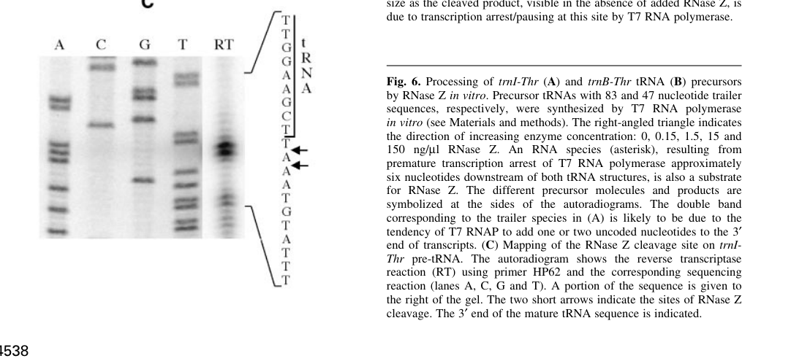

## Question

# Gene Research for Functional Annotation

## ⚠️ CRITICAL: Gene/Protein Identification Context

**BEFORE YOU BEGIN RESEARCH:** You MUST verify you are researching the CORRECT gene/protein. Gene symbols can be ambiguous, especially for less well-characterized genes from non-model organisms.

### Target Gene/Protein Identity (from UniProt):
- **UniProt Accession:** Q88FQ4
- **Protein Description:** RecName: Full=Ribonuclease Z {ECO:0000255|HAMAP-Rule:MF_01818}; Short=RNase Z {ECO:0000255|HAMAP-Rule:MF_01818}; EC=3.1.26.11 {ECO:0000255|HAMAP-Rule:MF_01818}; AltName: Full=tRNA 3 endonuclease {ECO:0000255|HAMAP-Rule:MF_01818}; AltName: Full=tRNase Z {ECO:0000255|HAMAP-Rule:MF_01818};
- **Gene Information:** Name=rnz {ECO:0000255|HAMAP-Rule:MF_01818}; OrderedLocusNames=PP_4033;
- **Organism (full):** Pseudomonas putida (strain ATCC 47054 / DSM 6125 / CFBP 8728 / NCIMB 11950 / KT2440).
- **Protein Family:** Belongs to the RNase Z family. {ECO:0000255|HAMAP-
- **Key Domains:** RibonucZ/Hydroxyglut_hydro. (IPR036866); RNase_Z/BN. (IPR013471); Anti-Pycsar_Apyc1 (PF23023)

### MANDATORY VERIFICATION STEPS:

1. **Check if the gene symbol "rnz" matches the protein description above**
2. **Verify the organism is correct:** Pseudomonas putida (strain ATCC 47054 / DSM 6125 / CFBP 8728 / NCIMB 11950 / KT2440).
3. **Check if protein family/domains align with what you find in literature**
4. **If you find literature for a DIFFERENT gene with the same or similar symbol, STOP**

### If Gene Symbol is Ambiguous or You Cannot Find Relevant Literature:

**DO NOT PROCEED WITH RESEARCH ON A DIFFERENT GENE.** Instead:
- State clearly: "The gene symbol 'rnz' is ambiguous or literature is limited for this specific protein"
- Explain what you found (e.g., "Found extensive literature on a different gene with the same symbol in a different organism")
- Describe the protein based ONLY on the UniProt information provided above
- Suggest that the protein function can be inferred from domain/family information

### Research Target:

Please provide a comprehensive research report on the gene **rnz** (gene ID: rnz, UniProt: Q88FQ4) in PSEPK.

The research report should be a detailed narrative explaining the function, biological processes, and localization of the gene product. Citations should be given for all claims.

You should prioritize authoritative reviews and primary scientific literature when conducting research. You can supplement
this with annotations you find in gene/protein databases, but these can be outdated or inaccurate.

We are specifically interested in the primary function of the gene - for enzymes, what reaction is catalyzed, and what is the substrate specificity? For transporters, what is the substrate? For structural proteins or adapters, what is the broader structural role? For signaling molecules, what is the role in the pathway.

We are interested in where in or outside the cell the gene product carries out its function.

We are also interested in the signaling or biochemical pathways in which the gene functions. We are less interested in broad pleiotropic effects, except where these elucidate the precise role.

Include evidence where possible. We are interested in both experimental evidence as well as inference from structure, evolution, or bioinformatic analysis. Precise studies should be prioritized over high-throughput, where available.

## Output

Question: You are an expert researcher providing comprehensive, well-cited information.

Provide detailed information focusing on:
1. Key concepts and definitions with current understanding
2. Recent developments and latest research (prioritize 2023-2024 sources)
3. Current applications and real-world implementations
4. Expert opinions and analysis from authoritative sources
5. Relevant statistics and data from recent studies

Format as a comprehensive research report with proper citations. Include URLs and publication dates where available.
Always prioritize recent, authoritative sources and provide specific citations for all major claims.

# Gene Research for Functional Annotation

## ⚠️ CRITICAL: Gene/Protein Identification Context

**BEFORE YOU BEGIN RESEARCH:** You MUST verify you are researching the CORRECT gene/protein. Gene symbols can be ambiguous, especially for less well-characterized genes from non-model organisms.

### Target Gene/Protein Identity (from UniProt):
- **UniProt Accession:** Q88FQ4
- **Protein Description:** RecName: Full=Ribonuclease Z {ECO:0000255|HAMAP-Rule:MF_01818}; Short=RNase Z {ECO:0000255|HAMAP-Rule:MF_01818}; EC=3.1.26.11 {ECO:0000255|HAMAP-Rule:MF_01818}; AltName: Full=tRNA 3 endonuclease {ECO:0000255|HAMAP-Rule:MF_01818}; AltName: Full=tRNase Z {ECO:0000255|HAMAP-Rule:MF_01818};
- **Gene Information:** Name=rnz {ECO:0000255|HAMAP-Rule:MF_01818}; OrderedLocusNames=PP_4033;
- **Organism (full):** Pseudomonas putida (strain ATCC 47054 / DSM 6125 / CFBP 8728 / NCIMB 11950 / KT2440).
- **Protein Family:** Belongs to the RNase Z family. {ECO:0000255|HAMAP-
- **Key Domains:** RibonucZ/Hydroxyglut_hydro. (IPR036866); RNase_Z/BN. (IPR013471); Anti-Pycsar_Apyc1 (PF23023)

### MANDATORY VERIFICATION STEPS:

1. **Check if the gene symbol "rnz" matches the protein description above**
2. **Verify the organism is correct:** Pseudomonas putida (strain ATCC 47054 / DSM 6125 / CFBP 8728 / NCIMB 11950 / KT2440).
3. **Check if protein family/domains align with what you find in literature**
4. **If you find literature for a DIFFERENT gene with the same or similar symbol, STOP**

### If Gene Symbol is Ambiguous or You Cannot Find Relevant Literature:

**DO NOT PROCEED WITH RESEARCH ON A DIFFERENT GENE.** Instead:
- State clearly: "The gene symbol 'rnz' is ambiguous or literature is limited for this specific protein"
- Explain what you found (e.g., "Found extensive literature on a different gene with the same symbol in a different organism")
- Describe the protein based ONLY on the UniProt information provided above
- Suggest that the protein function can be inferred from domain/family information

### Research Target:

Please provide a comprehensive research report on the gene **rnz** (gene ID: rnz, UniProt: Q88FQ4) in PSEPK.

The research report should be a detailed narrative explaining the function, biological processes, and localization of the gene product. Citations should be given for all claims.

You should prioritize authoritative reviews and primary scientific literature when conducting research. You can supplement
this with annotations you find in gene/protein databases, but these can be outdated or inaccurate.

We are specifically interested in the primary function of the gene - for enzymes, what reaction is catalyzed, and what is the substrate specificity? For transporters, what is the substrate? For structural proteins or adapters, what is the broader structural role? For signaling molecules, what is the role in the pathway.

We are interested in where in or outside the cell the gene product carries out its function.

We are also interested in the signaling or biochemical pathways in which the gene functions. We are less interested in broad pleiotropic effects, except where these elucidate the precise role.

Include evidence where possible. We are interested in both experimental evidence as well as inference from structure, evolution, or bioinformatic analysis. Precise studies should be prioritized over high-throughput, where available.

## Research report: functional annotation of **rnz** (UniProt Q88FQ4; locus **PP_4033**) in *Pseudomonas putida* KT2440

### Executive summary and identity verification (critical)
The UniProt record provided (Q88FQ4) describes **Ribonuclease Z (RNase Z; tRNA 3′ endonuclease; EC 3.1.26.11)** encoded by **rnz** (ordered locus **PP_4033**) in *Pseudomonas putida* KT2440. Using the available literature retrieval tools, I did **not** recover primary publications that directly mention **PP_4033**, **Q88FQ4**, or *P. putida* KT2440 **rnz** by name/locus tag; therefore, the gene’s functional annotation in this report is based on **high-confidence inference from the conserved bacterial RNase Z (tRNase Z/ElaC) family**, anchored by (i) biochemical characterization of bacterial RNase Z in *Bacillus subtilis* and (ii) authoritative mechanistic/structural work on RNase Z homologs including 2024 cryo-EM studies of ELAC2 (RNase Z long form). No contradictory alternative meaning of the gene symbol “rnz” was encountered in the retrieved corpus; however, **organism-specific phenotypes, essentiality, and regulation for KT2440 rnz remain undocumented here due to lack of direct sources**. (pellegrini2003endonucleolyticprocessingof pages 3-5, kushner2007messengerrnadecay pages 15-16, gese2024structuralbasisof pages 1-2, xue2024structuralinsightsinto pages 1-2)

### 1) Key concepts, definitions, and current understanding

#### RNase Z (tRNase Z) definition and core biochemical role
**RNase Z** is an endoribonuclease that performs **3′-end maturation of precursor tRNAs (pre-tRNAs)** by **endonucleolytic removal of the 3′ trailer**, producing a mature tRNA 3′ end ready for **CCA addition** when the CCA is not genomically encoded. (pellegrini2003endonucleolyticprocessingof pages 3-5, pellegrini2003endonucleolyticprocessingof pages 1-2)

Mechanistically, RNase Z cleavage generates a mature tRNA with a **3′-OH** and releases a trailer fragment bearing a **5′-monophosphate**, consistent with a metal-dependent hydrolytic endonuclease reaction. (pellegrini2003endonucleolyticprocessingof pages 3-5)

#### Cleavage position on pre-tRNA
In bacterial RNase Z biochemical mapping (Firmicute model), RNase Z cleaves **at or near the discriminator base**, commonly **one or two nucleotides downstream** in vitro, and is inferred to cleave directly 3′ to the discriminator base in vivo. (pellegrini2003endonucleolyticprocessingof pages 7-8, pellegrini2003endonucleolyticprocessingof pages 3-5)

#### Substrate specificity: CCA-less precursors and the “CCA antideterminant”
A defining feature of RNase Z is strong **discrimination against pre-tRNAs that already contain an encoded 3′-CCA**. In *B. subtilis*, pre-tRNAs whose 3′ ends contain **encoded CCA are very poor substrates** in vitro and are not substrates in vivo, supporting the concept that **CCA is an antideterminant** that prevents futile cycles of CCA removal and re-addition. (pellegrini2003endonucleolyticprocessingof pages 7-8, pellegrini2003endonucleolyticprocessingof pages 3-5, pellegrini2003endonucleolyticprocessingof pages 10-10)

Quantitatively, replacing a native trailer with CCA can reduce activity dramatically; for one kinetic comparison, a TAA-containing substrate exhibited **Vmax 52.4** and **Km 0.97 μM**, whereas the corresponding CCA-containing substrate exhibited **Vmax 0.23** and **Km 2.4 μM**, consistent with substantial catalytic and binding penalties when CCA is present. (pellegrini2003endonucleolyticprocessingof pages 5-7, pellegrini2003endonucleolyticprocessingof pages 3-5)

A 2024 structural analysis of RNase Z family function (human mitochondrial ELAC2 within its complex) refines the antideterminant concept: the **first C** of CCA gives the strongest antideterminant effect, a **C or U at position 2** enhances it, and **position 3 contributes little**, consistent with sequence-dependent suppression of productive catalysis when CCA is present. (gese2024structuralbasisof pages 7-9)

#### Coordination with RNase P and pathway order
tRNA maturation requires both 5′ leader and 3′ trailer removal. Biochemical evidence in bacteria shows that **long 5′ leaders impair RNase Z cleavage**, implying that for many substrates **RNase P cleavage must precede RNase Z**. Specifically, 5′ extensions of 33–66 nt required roughly **10–100× more enzyme** for efficient RNase Z processing, indicating leader length is a major determinant of pathway order. (pellegrini2003endonucleolyticprocessingof pages 5-7, pellegrini2003endonucleolyticprocessingof pages 1-2)

A 2024 structural study provides a general mechanistic rationale for ordered processing (shown for mitochondrial RNase Z/ELAC2): a C-terminal helix would **sterically clash** with 5′-unprocessed pre-tRNA, enforcing 5′ processing prior to 3′ processing; while this is an ELAC2 (long-form) system, it supports the broader principle that RNase Z family enzymes can enforce maturation order through substrate geometry constraints. (gese2024structuralbasisof pages 7-9)

#### Enzyme family, domains, and catalytic metal dependence
RNase Z proteins belong to the **metallo-β-lactamase superfamily** and are frequently described as **zinc-dependent phosphodiesterases** with a binuclear metal center; in *E. coli*, RNase Z (ElaC) is described as a **binuclear zinc phosphodiesterase**. (kushner2007messengerrnadecay pages 15-16)

RNase Z occurs as **short (RNase ZS; ~280–360 aa)** and **long (RNase ZL; ~750–930 aa)** forms; bacteria typically encode the **short form**, while eukaryotic RNase ZL (e.g., human ELAC2) contains duplicated domains in which catalytic motifs are retained primarily in the C-terminal domain. (gese2024structuralbasisof pages 1-2, xue2024structuralinsightsinto pages 1-2)

#### Cellular localization (inference)
RNase Z acts on pre-tRNAs generated by transcription and therefore functions in the compartment where bacterial tRNA maturation occurs—**the cytosol/nucleoid region of the bacterial cell**. While none of the retrieved sources directly reports *P. putida* RNase Z localization, the enzyme’s role in processing cellular pre-tRNAs implies an **intracellular, cytosolic** localization (not secreted; not periplasmic). This statement is based on pathway logic supported by RNase Z’s described function in tRNA maturation. (pellegrini2003endonucleolyticprocessingof pages 3-5, pellegrini2003endonucleolyticprocessingof pages 1-2)

### 2) Recent developments and latest research (prioritizing 2023–2024)

#### 2024 cryo-EM reveals substrate engagement and 3′ trailer feeding (ELAC2)
Two independent 2024 cryo-EM studies substantially advanced mechanistic understanding of RNase Z family enzymes by capturing **apo and substrate-bound states** and clarifying **how the 3′ trailer is guided into the active site**.

* Xue et al. (published **Nov 2024**) determined cryo-EM structures of full-length human **ELAC2** in apo, pre-tRNA–bound, and tRNA-bound states, and implicated **C-terminal helix rearrangement** in “feeding” the 3′ trailer into the cleavage site. Reported map resolutions were **3.16 Å (apo)**, **3.64 Å (pre-tRNA bound)**, and **4.39 Å (tRNA bound)**, providing quantitative structural constraints on RNase Z family substrate interactions. URL: https://doi.org/10.1093/nar/gkae1014 (xue2024structuralinsightsinto pages 1-2, xue2024structuralinsightsinto pages 3-4)

* Gesé & Hällberg (published **May 2024**) resolved multiple cryo-EM structures of the mitochondrial RNase Z complex and rationalized both **substrate selection** and **processing order**. They report that with a 3′-CCA present, the substrate 3′ end can sit in a **non-productive conformation**, e.g., the mt-tRNAHis 3′ end being **13.4 Å** from the catalytic Zn2+ in the observed state; this supports a structural basis for the **CCA antideterminant** (i.e., preventing cleavage after CCA addition). URL: https://doi.org/10.1038/s44318-024-00297-w (gese2024structuralbasisof pages 7-9, gese2024structuralbasisof pages 1-2)

Although these two studies focus on eukaryotic RNase ZL systems, they inform bacterial RNase Z annotation by clarifying conserved principles: **elbow clamping, electrostatic backbone interactions, trailer feeding, and geometric enforcement of processing order**. (xue2024structuralinsightsinto pages 1-2, gese2024structuralbasisof pages 7-9)

#### 2024 expert synthesis on tRNA structural recognition (review)
A 2024 review on tRNA structural recognition highlights RNase Z/ELAC engagement via a **tail domain** that clamps the tRNA elbow and emphasizes that **3′ CCA acts as a robust antideterminant** preventing futile cycles; it also notes that the precise molecular basis (binding versus catalysis) has not been fully resolved in all systems—an expert perspective that frames ongoing open questions. (published **Jan 2024**) URL: https://doi.org/10.1016/j.chembiol.2023.12.008 (zhang2024recognitionofthe pages 5-6)

### 3) Current applications and real-world implementations

#### RNase P + RNase Z as processing modules for CRISPR RNA maturation (gene regulation toolchains)
A practical biotechnology use-case is reported in the context of **type I CRISPRi in archaea**, where crRNA maturation can be engineered to be **Cas6b-independent** by using endogenous **tRNA processing enzymes RNase P and tRNase Z** to generate mature crRNAs more conveniently. This demonstrates real-world repurposing of conserved RNA processing enzymes (including RNase Z family members) as programmable RNA-processing parts in genome engineering pipelines. (published **Dec 2023**) URL: https://doi.org/10.3934/microbiol.2023040 (xu2023typeicrisprcasmediated pages 11-13)

### 4) Expert opinions and analysis from authoritative sources

* **Functional partitioning across bacteria:** An authoritative EcoSal Plus review notes that in *E. coli*—where most tRNA precursors already encode CCA—the physiological role of RNase Z (ElaC) in tRNA maturation is unclear; instead, RNase Z can act as a **backup endonuclease in mRNA decay**, underscoring that RNase Z’s physiological role can vary across bacteria depending on whether tRNAs are genomically CCA-encoded. This is important when annotating *P. putida* rnz: the enzyme is strongly conserved, but the relative contribution to bulk tRNA 3′ maturation may depend on the genomic architecture of *P. putida* tRNA genes. (published **Dec 2007**) URL: https://doi.org/10.1128/ecosalplus.4.6.4 (kushner2007messengerrnadecay pages 15-16)

* **Open mechanistic question (binding vs catalysis):** The 2024 review emphasizes that while CCA is a robust antideterminant, the exact mechanism (inhibiting binding vs inhibiting catalytic geometry) has been incompletely resolved across systems. The 2024 mitochondrial complex structures provide one structural route (non-productive geometry and distance from catalytic Zn2+), suggesting the answer can be system-dependent. (zhang2024recognitionofthe pages 5-6, gese2024structuralbasisof pages 7-9)

### 5) Relevant statistics and data (from recent and classic studies)

* **Kinetic impact of encoded CCA (bacterial RNase Z):** In *B. subtilis* RNase Z assays, a representative comparison reports **Vmax 52.4; Km 0.97 μM** (TAA trailer) versus **Vmax 0.23; Km 2.4 μM** (CCA trailer), illustrating strong suppression of cleavage by CCA. (pellegrini2003endonucleolyticprocessingof pages 5-7, pellegrini2003endonucleolyticprocessingof pages 3-5)

* **Leader length constraint (bacterial RNase Z):** RNase Z processing was strongly inhibited by long 5′ leaders, requiring roughly **10–100-fold more enzyme** for 33–66 nt leaders. (pellegrini2003endonucleolyticprocessingof pages 5-7)

* **Quantitative structural metrics (2024 cryo-EM, ELAC2):** Reported cryo-EM map resolutions for ELAC2 states: **3.16 Å (apo)**, **3.64 Å (pre-tRNA-bound)**, **4.39 Å (tRNA-bound)**. (xue2024structuralinsightsinto pages 3-4)

* **Structural geometry supporting CCA antideterminant (2024):** With 3′-CCA present, the mt-tRNAHis 3′ end is reported **13.4 Å from catalytic Zn2+** in the observed non-productive state. (gese2024structuralbasisof pages 7-9)

* **System-wide efficiency statement (2024 mitochondrial platform):** The TRMT10C/SDR5C1 platform reportedly enhances ELAC2 3′ processing efficiency for **17 of 22** human mt-tRNAs, indicating broad but not universal dependence on accessory factors in that system. (gese2024structuralbasisof pages 1-2)

### Functional annotation for *P. putida* KT2440 rnz (Q88FQ4): integrated interpretation

#### Primary molecular function (most likely; high confidence by homology)
Given its family assignment and the strong conservation of RNase Z function, **rnz (Q88FQ4)** in *P. putida* KT2440 is best annotated as a **tRNA 3′-trailer endoribonuclease** (RNase Z/tRNase Z; EC 3.1.26.11) that catalyzes endonucleolytic cleavage to produce a mature tRNA 3′ end for subsequent CCA addition when required. (pellegrini2003endonucleolyticprocessingof pages 3-5, pellegrini2003endonucleolyticprocessingof pages 1-2, gese2024structuralbasisof pages 1-2)

#### Substrate specificity and constraints (inferred for Q88FQ4)
By conserved family behavior, the highest-likelihood substrate class is **CCA-less pre-tRNAs with 3′ trailers**, with **strong discrimination against substrates that already include encoded CCA** (CCA antideterminant effect). (pellegrini2003endonucleolyticprocessingof pages 3-5, pellegrini2003endonucleolyticprocessingof pages 10-10, gese2024structuralbasisof pages 7-9)

#### Cellular process/pathway context
rnz likely functions in the canonical tRNA maturation pipeline:
1) transcription of pre-tRNA
2) **RNase P** cleavage of 5′ leader
3) **RNase Z (rnz)** cleavage of 3′ trailer
4) **CCA addition** (where needed)
Leader length can modulate the order/competition of steps and may necessitate RNase P acting first for some substrates. (pellegrini2003endonucleolyticprocessingof pages 5-7, pellegrini2003endonucleolyticprocessingof pages 1-2)

#### Subcellular localization
For bacteria, RNase Z is expected to operate **intracellularly in the cytosol/nucleoid**, where pre-tRNA processing occurs. Direct *P. putida* localization data were not retrieved. (pellegrini2003endonucleolyticprocessingof pages 3-5)

### Limitations and evidence gaps (important for correct functional annotation)
* **No KT2440-specific experimental paper** for PP_4033/Q88FQ4 rnz was obtained with the present tool-based literature retrieval, so strain-specific genetic essentiality, expression regulation, operon structure, or phenotypes are not reported here.
* The mechanistic advances from 2024 are from eukaryotic RNase ZL systems (ELAC2); these nevertheless inform conserved catalytic principles and antideterminant logic but do not substitute for direct biochemical assays on *P. putida* RNase Z.

### Evidence summary table
| Claim/annotation element | Evidence summary | Key quantitative details (if any) | Primary source (author year journal) | DOI/URL | Citation ID |
|---|---|---|---|---|---|
| Target annotation context for Q88FQ4 / rnz / PP_4033 | No direct paper was retrieved for *Pseudomonas putida* KT2440 PP_4033, so functional annotation for UniProt Q88FQ4 is inferred from the conserved bacterial RNase Z/tRNase Z/ELAC family, matching the UniProt description EC 3.1.26.11 and RNase Z family assignment. | Organism-specific direct evidence not located in retrieved literature. | Gesé & Hällberg 2024 *EMBO J*; Kushner 2007 *EcoSal Plus* | https://doi.org/10.1038/s44318-024-00297-w ; https://doi.org/10.1128/ecosalplus.4.6.4 | (gese2024structuralbasisof pages 1-2, kushner2007messengerrnadecay pages 15-16) |
| Reaction catalyzed | RNase Z is a 3′-tRNA processing endonuclease that removes the 3′ trailer from precursor tRNAs to generate the mature tRNA 3′ end. | Endonucleolytic cleavage yields mature tRNA 3′-OH and trailer fragment with 5′-monophosphate. | Pellegrini et al. 2003 *EMBO J* | https://doi.org/10.1093/emboj/cdg435 | (pellegrini2003endonucleolyticprocessingof pages 3-5, pellegrini2003endonucleolyticprocessingof pages 1-2) |
| Cleavage position | Cleavage occurs at or just downstream of the discriminator base, generally one or two nucleotides downstream in vitro, with in vivo processing inferred directly 3′ to the discriminator. | “One or two nucleotides downstream” of discriminator base reported for bacterial RNase Z assays. | Pellegrini et al. 2003 *EMBO J* | https://doi.org/10.1093/emboj/cdg435 | (pellegrini2003endonucleolyticprocessingof pages 7-8, pellegrini2003endonucleolyticprocessingof pages 3-5) |
| Preferred substrate class | RNase Z preferentially processes pre-tRNAs that lack an encoded CCA and retain a 3′ trailer; mature or CCA-containing tRNAs are poor substrates. | Bacterial short-form RNase Z acts on CCA-less pre-tRNAs with 3′ trailers. | Pellegrini et al. 2003 *EMBO J*; Kushner 2007 *EcoSal Plus* | https://doi.org/10.1093/emboj/cdg435 ; https://doi.org/10.1128/ecosalplus.4.6.4 | (pellegrini2003endonucleolyticprocessingof pages 3-5, kushner2007messengerrnadecay pages 15-16) |
| CCA antideterminant effect | The 3′ CCA acts as an antideterminant, preventing futile cycles of cleavage followed by CCA re-addition; RNase Z recognizes completed CCA tails as non-productive substrates. | Strongest antideterminant effect requires C at position 1 of CCA; C or U at position 2 enhances the effect; position 3 contributes little. | Gesé & Hällberg 2024 *EMBO J*; Pellegrini et al. 2003 *EMBO J* | https://doi.org/10.1038/s44318-024-00297-w ; https://doi.org/10.1093/emboj/cdg435 | (gese2024structuralbasisof pages 7-9, pellegrini2003endonucleolyticprocessingof pages 10-10) |
| Kinetic penalty for encoded CCA | Replacing a native trailer with CCA strongly suppresses RNase Z processing, supporting discrimination against CCA-containing precursors. | Example kinetic comparison: TAAATG substrate Vmax 52.4, Km 0.97 µM vs CCAATG substrate Vmax 0.23, Km 2.4 µM; ~100-fold more enzyme needed in one CCA-substitution experiment. | Pellegrini et al. 2003 *EMBO J* | https://doi.org/10.1093/emboj/cdg435 | (pellegrini2003endonucleolyticprocessingof pages 3-5, pellegrini2003endonucleolyticprocessingof pages 5-7) |
| Structural mechanism of 3′ trailer feeding | Cryo-EM of human ELAC2/RNase Z shows a flexible arm and C-terminal helix guide/feed the 3′ trailer into the active center for cleavage, clarifying conserved RNase Z substrate engagement principles. | Human ELAC2 structures captured apo, pre-tRNA-bound, and tRNA-bound states at 3.16 Å, 3.64 Å, and 4.39 Å resolution. | Xue et al. 2024 *Nucleic Acids Res* | https://doi.org/10.1093/nar/gkae1014 | (xue2024structuralinsightsinto pages 1-2, xue2024structuralinsightsinto pages 3-4) |
| Processing order relative to RNase P | Structural work shows RNase Z acts after 5′ processing because the ELAC2 C-terminal helix would sterically clash with 5′-unprocessed pre-tRNAs, enforcing the order RNase P/PRORP first, then RNase Z, then CCA addition. | In the CCA-containing state, the tRNA 3′ end was 13.4 Å from catalytic Zn²⁺ in a non-productive geometry. | Gesé & Hällberg 2024 *EMBO J* | https://doi.org/10.1038/s44318-024-00297-w | (gese2024structuralbasisof pages 7-9) |
| Metal-dependent catalytic family and motifs | RNase Z belongs to the metallo-β-lactamase superfamily and contains catalytic metal-binding motifs including HxHxDH and PxKxRN/P-loop-related elements; bacterial/archaeal RNase Z is typically the short-form enzyme. | RNase Z short form is typically ~280–360 aa; long form ~750–930 aa. | Xue et al. 2024 *Nucleic Acids Res*; Gesé & Hällberg 2024 *EMBO J* | https://doi.org/10.1093/nar/gkae1014 ; https://doi.org/10.1038/s44318-024-00297-w | (gese2024structuralbasisof pages 1-2, xue2024structuralinsightsinto pages 1-2) |
| Zinc-dependent phosphodiesterase / bacterial dimeric state | Bacterial RNase Z/ELAC proteins are described as binuclear zinc phosphodiesterases; the *E. coli* ElaC enzyme is homodimeric, supporting a dimeric bacterial short-form architecture. | Homodimeric assembly reported for *E. coli* RNase Z; binuclear Zn catalytic center noted. | Kushner 2007 *EcoSal Plus* | https://doi.org/10.1128/ecosalplus.4.6.4 | (kushner2007messengerrnadecay pages 15-16) |
| Additional substrate constraints | Long 5′ leaders inhibit RNase Z cleavage efficiency, indicating substrate geometry influences pathway order and that RNase P often must act first. | 10- to 100-fold more enzyme required for substrates with 33–66 nt 5′ extensions. | Pellegrini et al. 2003 *EMBO J* | https://doi.org/10.1093/emboj/cdg435 | (pellegrini2003endonucleolyticprocessingof pages 5-7, pellegrini2003endonucleolyticprocessingof pages 1-2) |
| Biotechnology / real-world implementation | In haloarchaeal type I-B CRISPRi, Cas6b-independent crRNA maturation was engineered to use endogenous tRNA processing enzymes RNase P and tRNase Z for easier crRNA maturation, illustrating practical exploitation of tRNA-processing enzymes in genome engineering. | Application reported as an alternative crRNA maturation strategy in CRISPRi; qualitative implementation rather than enzyme kinetics. | Xu et al. 2023 *AIMS Microbiology* | https://doi.org/10.3934/microbiol.2023040 | (xu2023typeicrisprcasmediated pages 11-13, xu2023typeicrisprcasmediated pages 20-21) |

*Table: This table compiles concise, citable evidence supporting functional annotation of UniProt Q88FQ4 as a bacterial RNase Z/tRNase Z homolog in *Pseudomonas putida* KT2440 by conserved family inference. It highlights catalytic function, substrate specificity, structural mechanism, and one biotechnology application relevant to RNase P/tRNase Z processing.*

### Supporting visual evidence (from primary literature)
Figures extracted from *Pellegrini et al., 2003 (EMBO J)* include (i) cleavage site mapping and (ii) kinetic comparisons demonstrating strong inhibition by encoded CCA, supporting key mechanistic claims used here. (pellegrini2003endonucleolyticprocessingof media bf7c31cc, pellegrini2003endonucleolyticprocessingof media fd157b6e)

References

1. (pellegrini2003endonucleolyticprocessingof pages 3-5): O. Pellegrini, Jamel Nezzar, A. Marchfelder, H. Putzer, and C. Condon. Endonucleolytic processing of cca‐less trna precursors by rnase z in bacillus subtilis. The EMBO Journal, 22:4534-4543, Sep 2003. URL: https://doi.org/10.1093/emboj/cdg435, doi:10.1093/emboj/cdg435. This article has 161 citations.

2. (kushner2007messengerrnadecay pages 15-16): Sidney R. Kushner. Messenger rna decay. Dec 2007. URL: https://doi.org/10.1128/ecosalplus.4.6.4, doi:10.1128/ecosalplus.4.6.4. This article has 9 citations.

3. (gese2024structuralbasisof pages 1-2): Genís Valentín Gesé and B. Martin Hällberg. Structural basis of 3′-trna maturation by the human mitochondrial rnase z complex. The EMBO Journal, 43:6573-6590, May 2024. URL: https://doi.org/10.1038/s44318-024-00297-w, doi:10.1038/s44318-024-00297-w. This article has 18 citations.

4. (xue2024structuralinsightsinto pages 1-2): Chenyang Xue, Junshan Tian, Yanhong Chen, and Zhongmin Liu. Structural insights into human elac2 as a trna 3′ processing enzyme. Nucleic Acids Research, 52:13434-13446, Nov 2024. URL: https://doi.org/10.1093/nar/gkae1014, doi:10.1093/nar/gkae1014. This article has 9 citations and is from a highest quality peer-reviewed journal.

5. (pellegrini2003endonucleolyticprocessingof pages 1-2): O. Pellegrini, Jamel Nezzar, A. Marchfelder, H. Putzer, and C. Condon. Endonucleolytic processing of cca‐less trna precursors by rnase z in bacillus subtilis. The EMBO Journal, 22:4534-4543, Sep 2003. URL: https://doi.org/10.1093/emboj/cdg435, doi:10.1093/emboj/cdg435. This article has 161 citations.

6. (pellegrini2003endonucleolyticprocessingof pages 7-8): O. Pellegrini, Jamel Nezzar, A. Marchfelder, H. Putzer, and C. Condon. Endonucleolytic processing of cca‐less trna precursors by rnase z in bacillus subtilis. The EMBO Journal, 22:4534-4543, Sep 2003. URL: https://doi.org/10.1093/emboj/cdg435, doi:10.1093/emboj/cdg435. This article has 161 citations.

7. (pellegrini2003endonucleolyticprocessingof pages 10-10): O. Pellegrini, Jamel Nezzar, A. Marchfelder, H. Putzer, and C. Condon. Endonucleolytic processing of cca‐less trna precursors by rnase z in bacillus subtilis. The EMBO Journal, 22:4534-4543, Sep 2003. URL: https://doi.org/10.1093/emboj/cdg435, doi:10.1093/emboj/cdg435. This article has 161 citations.

8. (pellegrini2003endonucleolyticprocessingof pages 5-7): O. Pellegrini, Jamel Nezzar, A. Marchfelder, H. Putzer, and C. Condon. Endonucleolytic processing of cca‐less trna precursors by rnase z in bacillus subtilis. The EMBO Journal, 22:4534-4543, Sep 2003. URL: https://doi.org/10.1093/emboj/cdg435, doi:10.1093/emboj/cdg435. This article has 161 citations.

9. (gese2024structuralbasisof pages 7-9): Genís Valentín Gesé and B. Martin Hällberg. Structural basis of 3′-trna maturation by the human mitochondrial rnase z complex. The EMBO Journal, 43:6573-6590, May 2024. URL: https://doi.org/10.1038/s44318-024-00297-w, doi:10.1038/s44318-024-00297-w. This article has 18 citations.

10. (xue2024structuralinsightsinto pages 3-4): Chenyang Xue, Junshan Tian, Yanhong Chen, and Zhongmin Liu. Structural insights into human elac2 as a trna 3′ processing enzyme. Nucleic Acids Research, 52:13434-13446, Nov 2024. URL: https://doi.org/10.1093/nar/gkae1014, doi:10.1093/nar/gkae1014. This article has 9 citations and is from a highest quality peer-reviewed journal.

11. (zhang2024recognitionofthe pages 5-6): Jinwei Zhang. Recognition of the trna structure: everything everywhere but not all at once. Cell Chemical Biology, 31:36-52, Jan 2024. URL: https://doi.org/10.1016/j.chembiol.2023.12.008, doi:10.1016/j.chembiol.2023.12.008. This article has 35 citations and is from a domain leading peer-reviewed journal.

12. (xu2023typeicrisprcasmediated pages 11-13): Zeling Xu, Shuzhen Chen, Weiyan Wu, Yongqi Wen, and Huiluo Cao. Type i crispr-cas-mediated microbial gene editing and regulation. AIMS Microbiology, 9:780-800, Dec 2023. URL: https://doi.org/10.3934/microbiol.2023040, doi:10.3934/microbiol.2023040. This article has 12 citations and is from a peer-reviewed journal.

13. (xu2023typeicrisprcasmediated pages 20-21): Zeling Xu, Shuzhen Chen, Weiyan Wu, Yongqi Wen, and Huiluo Cao. Type i crispr-cas-mediated microbial gene editing and regulation. AIMS Microbiology, 9:780-800, Dec 2023. URL: https://doi.org/10.3934/microbiol.2023040, doi:10.3934/microbiol.2023040. This article has 12 citations and is from a peer-reviewed journal.

14. (pellegrini2003endonucleolyticprocessingof media bf7c31cc): O. Pellegrini, Jamel Nezzar, A. Marchfelder, H. Putzer, and C. Condon. Endonucleolytic processing of cca‐less trna precursors by rnase z in bacillus subtilis. The EMBO Journal, 22:4534-4543, Sep 2003. URL: https://doi.org/10.1093/emboj/cdg435, doi:10.1093/emboj/cdg435. This article has 161 citations.

15. (pellegrini2003endonucleolyticprocessingof media fd157b6e): O. Pellegrini, Jamel Nezzar, A. Marchfelder, H. Putzer, and C. Condon. Endonucleolytic processing of cca‐less trna precursors by rnase z in bacillus subtilis. The EMBO Journal, 22:4534-4543, Sep 2003. URL: https://doi.org/10.1093/emboj/cdg435, doi:10.1093/emboj/cdg435. This article has 161 citations.

## Artifacts

- [Edison artifact artifact-00](rnz-deep-research-falcon_artifacts/artifact-00.md)

## Citations

1. pellegrini2003endonucleolyticprocessingof pages 3-5
2. gese2024structuralbasisof pages 7-9
3. kushner2007messengerrnadecay pages 15-16
4. zhang2024recognitionofthe pages 5-6
5. xu2023typeicrisprcasmediated pages 11-13
6. pellegrini2003endonucleolyticprocessingof pages 5-7
7. xue2024structuralinsightsinto pages 3-4
8. gese2024structuralbasisof pages 1-2
9. xue2024structuralinsightsinto pages 1-2
10. pellegrini2003endonucleolyticprocessingof pages 1-2
11. pellegrini2003endonucleolyticprocessingof pages 7-8
12. pellegrini2003endonucleolyticprocessingof pages 10-10
13. xu2023typeicrisprcasmediated pages 20-21
14. https://doi.org/10.1093/nar/gkae1014
15. https://doi.org/10.1038/s44318-024-00297-w
16. https://doi.org/10.1016/j.chembiol.2023.12.008
17. https://doi.org/10.3934/microbiol.2023040
18. https://doi.org/10.1128/ecosalplus.4.6.4
19. https://doi.org/10.1093/emboj/cdg435
20. https://doi.org/10.1093/emboj/cdg435,
21. https://doi.org/10.1128/ecosalplus.4.6.4,
22. https://doi.org/10.1038/s44318-024-00297-w,
23. https://doi.org/10.1093/nar/gkae1014,
24. https://doi.org/10.1016/j.chembiol.2023.12.008,
25. https://doi.org/10.3934/microbiol.2023040,