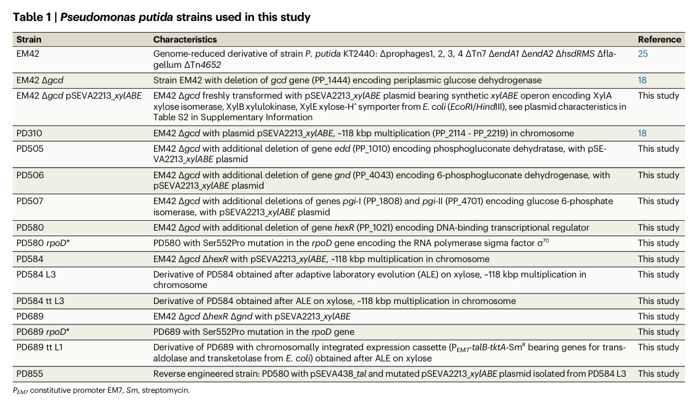

## Question

# Gene Research for Functional Annotation

## ⚠️ CRITICAL: Gene/Protein Identification Context

**BEFORE YOU BEGIN RESEARCH:** You MUST verify you are researching the CORRECT gene/protein. Gene symbols can be ambiguous, especially for less well-characterized genes from non-model organisms.

### Target Gene/Protein Identity (from UniProt):
- **UniProt Accession:** Q88QU7
- **Protein Description:** RecName: Full=RNA polymerase sigma factor RpoD {ECO:0000256|HAMAP-Rule:MF_00963}; AltName: Full=Sigma-70 {ECO:0000256|HAMAP-Rule:MF_00963};
- **Gene Information:** Name=rpoD {ECO:0000256|HAMAP-Rule:MF_00963, ECO:0000313|EMBL:AAN66018.1}; OrderedLocusNames=PP_0387 {ECO:0000313|EMBL:AAN66018.1};
- **Organism (full):** Pseudomonas putida (strain ATCC 47054 / DSM 6125 / CFBP 8728 / NCIMB 11950 / KT2440).
- **Protein Family:** Belongs to the sigma-70 factor family. RpoD/SigA subfamily.
- **Key Domains:** RNA_pol_sigma-70_dom. (IPR014284); RNA_pol_sigma70. (IPR000943); RNA_pol_sigma70_r1_2. (IPR009042); RNA_pol_sigma70_r2. (IPR007627); RNA_pol_sigma70_r3. (IPR007624)

### MANDATORY VERIFICATION STEPS:

1. **Check if the gene symbol "rpoD" matches the protein description above**
2. **Verify the organism is correct:** Pseudomonas putida (strain ATCC 47054 / DSM 6125 / CFBP 8728 / NCIMB 11950 / KT2440).
3. **Check if protein family/domains align with what you find in literature**
4. **If you find literature for a DIFFERENT gene with the same or similar symbol, STOP**

### If Gene Symbol is Ambiguous or You Cannot Find Relevant Literature:

**DO NOT PROCEED WITH RESEARCH ON A DIFFERENT GENE.** Instead:
- State clearly: "The gene symbol 'rpoD' is ambiguous or literature is limited for this specific protein"
- Explain what you found (e.g., "Found extensive literature on a different gene with the same symbol in a different organism")
- Describe the protein based ONLY on the UniProt information provided above
- Suggest that the protein function can be inferred from domain/family information

### Research Target:

Please provide a comprehensive research report on the gene **rpoD** (gene ID: rpoD, UniProt: Q88QU7) in PSEPK.

The research report should be a detailed narrative explaining the function, biological processes, and localization of the gene product. Citations should be given for all claims.

You should prioritize authoritative reviews and primary scientific literature when conducting research. You can supplement
this with annotations you find in gene/protein databases, but these can be outdated or inaccurate.

We are specifically interested in the primary function of the gene - for enzymes, what reaction is catalyzed, and what is the substrate specificity? For transporters, what is the substrate? For structural proteins or adapters, what is the broader structural role? For signaling molecules, what is the role in the pathway.

We are interested in where in or outside the cell the gene product carries out its function.

We are also interested in the signaling or biochemical pathways in which the gene functions. We are less interested in broad pleiotropic effects, except where these elucidate the precise role.

Include evidence where possible. We are interested in both experimental evidence as well as inference from structure, evolution, or bioinformatic analysis. Precise studies should be prioritized over high-throughput, where available.

## Output

Question: You are an expert researcher providing comprehensive, well-cited information.

Provide detailed information focusing on:
1. Key concepts and definitions with current understanding
2. Recent developments and latest research (prioritize 2023-2024 sources)
3. Current applications and real-world implementations
4. Expert opinions and analysis from authoritative sources
5. Relevant statistics and data from recent studies

Format as a comprehensive research report with proper citations. Include URLs and publication dates where available.
Always prioritize recent, authoritative sources and provide specific citations for all major claims.

# Gene Research for Functional Annotation

## ⚠️ CRITICAL: Gene/Protein Identification Context

**BEFORE YOU BEGIN RESEARCH:** You MUST verify you are researching the CORRECT gene/protein. Gene symbols can be ambiguous, especially for less well-characterized genes from non-model organisms.

### Target Gene/Protein Identity (from UniProt):
- **UniProt Accession:** Q88QU7
- **Protein Description:** RecName: Full=RNA polymerase sigma factor RpoD {ECO:0000256|HAMAP-Rule:MF_00963}; AltName: Full=Sigma-70 {ECO:0000256|HAMAP-Rule:MF_00963};
- **Gene Information:** Name=rpoD {ECO:0000256|HAMAP-Rule:MF_00963, ECO:0000313|EMBL:AAN66018.1}; OrderedLocusNames=PP_0387 {ECO:0000313|EMBL:AAN66018.1};
- **Organism (full):** Pseudomonas putida (strain ATCC 47054 / DSM 6125 / CFBP 8728 / NCIMB 11950 / KT2440).
- **Protein Family:** Belongs to the sigma-70 factor family. RpoD/SigA subfamily.
- **Key Domains:** RNA_pol_sigma-70_dom. (IPR014284); RNA_pol_sigma70. (IPR000943); RNA_pol_sigma70_r1_2. (IPR009042); RNA_pol_sigma70_r2. (IPR007627); RNA_pol_sigma70_r3. (IPR007624)

### MANDATORY VERIFICATION STEPS:

1. **Check if the gene symbol "rpoD" matches the protein description above**
2. **Verify the organism is correct:** Pseudomonas putida (strain ATCC 47054 / DSM 6125 / CFBP 8728 / NCIMB 11950 / KT2440).
3. **Check if protein family/domains align with what you find in literature**
4. **If you find literature for a DIFFERENT gene with the same or similar symbol, STOP**

### If Gene Symbol is Ambiguous or You Cannot Find Relevant Literature:

**DO NOT PROCEED WITH RESEARCH ON A DIFFERENT GENE.** Instead:
- State clearly: "The gene symbol 'rpoD' is ambiguous or literature is limited for this specific protein"
- Explain what you found (e.g., "Found extensive literature on a different gene with the same symbol in a different organism")
- Describe the protein based ONLY on the UniProt information provided above
- Suggest that the protein function can be inferred from domain/family information

### Research Target:

Please provide a comprehensive research report on the gene **rpoD** (gene ID: rpoD, UniProt: Q88QU7) in PSEPK.

The research report should be a detailed narrative explaining the function, biological processes, and localization of the gene product. Citations should be given for all claims.

You should prioritize authoritative reviews and primary scientific literature when conducting research. You can supplement
this with annotations you find in gene/protein databases, but these can be outdated or inaccurate.

We are specifically interested in the primary function of the gene - for enzymes, what reaction is catalyzed, and what is the substrate specificity? For transporters, what is the substrate? For structural proteins or adapters, what is the broader structural role? For signaling molecules, what is the role in the pathway.

We are interested in where in or outside the cell the gene product carries out its function.

We are also interested in the signaling or biochemical pathways in which the gene functions. We are less interested in broad pleiotropic effects, except where these elucidate the precise role.

Include evidence where possible. We are interested in both experimental evidence as well as inference from structure, evolution, or bioinformatic analysis. Precise studies should be prioritized over high-throughput, where available.

## Research report: **rpoD (UniProt Q88QU7; PP_0387)** in *Pseudomonas putida* KT2440

### 0) Executive summary (identity verified)
The UniProt target **Q88QU7** corresponds to **rpoD** in *Pseudomonas putida* KT2440 (ordered locus **PP_0387**) and encodes the **RNA polymerase sigma factor σ70 (RpoD)**—the primary (“housekeeping”) sigma factor used predominantly during exponential growth. This matches the sigma-70 family/RpoD (SigA) subfamily designation and the σ70-domain architecture described in the prompt and in the KT2440 literature. (lopezlara2020influenceofrehydration pages 2-4, benignoUnknownyearmicrobialsinglecellrna pages 81-83, dvorak2024syntheticallyprimedadaptationof pages 2-3)

### 1) Key concepts and definitions (current understanding)

#### 1.1 What is RpoD/σ70?
In bacteria, sigma (σ) factors are **promoter specificity subunits** that associate with the RNA polymerase (RNAP) core enzyme to form a holoenzyme capable of promoter-specific transcription initiation. The “housekeeping” sigma factor **σ70 (RpoD)** is the predominant sigma factor directing transcript initiation at the majority of promoters in many Proteobacteria, and it is commonly described as the **primary/vegetative** sigma factor. (busby2024transcriptionactivationin pages 1-4, bouillet2024rposandthe pages 1-5)

A central mechanistic concept is that σ70-family sigma factors contain conserved domains used for promoter recognition and DNA opening. In authoritative 2024 synthesis, σ70-like housekeeping sigma factors are described as having four independently folding domains; **Domain 2** drives transcription-bubble formation and interacts with the -10 region, while **Domains 3 and 4** contribute promoter-binding specificity (e.g., domain 4 recognizes bases in the **-35** element; domain 3 recognizes the extended -10). (busby2024transcriptionactivationin pages 1-4)

#### 1.2 Promoter recognition by σ70: -10 and -35 elements
σ70 directs RNAP to promoters mainly by sequence recognition of the canonical **-10 and -35 promoter elements**, mediated by conserved sigma regions/domains. Mechanistic review/overview sources summarize that σ factors (including σ70/RpoD) recognize promoter DNA elements and enable open complex formation (local DNA melting) around the transcription start site. (busby2024transcriptionactivationin pages 1-4, bouillet2024rposandthe pages 1-5)

A complementary mechanistic description emphasizes that σ70 promoter recognition involves distinct contacts: the **-35 element** is recognized by σ region/domain 4, and the **-10 element** by σ region/domain 2; through this, sigma factors define promoter usage and thus regulon structure. (hinton2025transcriptionalreprogrammingby pages 1-3)

#### 1.3 Sigma-factor competition (regulatory logic)
A defining systems-level concept is **competition among sigma factors for limiting RNAP core**. In 2024 review treatment of σ-factor biology (framed around stress response), competition with the “vegetative” sigma (RpoD/σ70) is described as a primary determinant of which promoter sets are transcribed under particular conditions (growth vs. stress programs). (bouillet2024rposandthe pages 5-7)

### 2) Gene/protein-specific functional annotation for *P. putida* KT2440 rpoD (PP_0387)

#### 2.1 Molecular function
**Primary function:** RpoD is the **σ70 sigma factor** that binds RNAP core and directs it to **σ70-dependent promoters** to initiate transcription, especially during exponential growth. In KT2440 transcriptomics of desiccation/rehydration, rpoD is explicitly annotated as **“RNA polymerase sigma 70 factor (gene rpoD, PP_0387)”**, and the authors explicitly state that **RpoD is the primary sigma factor during exponential growth**. (lopezlara2020influenceofrehydration pages 2-4)

**Not an enzyme/transport reaction:** RpoD is not a metabolic enzyme and does not catalyze a chemical transformation; instead it is a transcription initiation specificity factor controlling gene expression programs via promoter recognition. (busby2024transcriptionactivationin pages 1-4, lopezlara2020influenceofrehydration pages 2-4)

#### 2.2 Biological processes governed by rpoD activity (with organism-specific evidence)
**Growth-associated transcription and translation capacity.** In *P. putida* KT2440, downregulation of rpoD in desiccated cells after prolonged rehydration was interpreted as consistent with a non-growing state. The same study connects rpoD repression with decreased expression of ribosomal protein genes, stating that σ70-RNAP transcribes genes encoding ribosomal proteins; thus, reduced rpoD expression coincides with reduced translation capacity. (lopezlara2020influenceofrehydration pages 2-4)

**Control of σ70-dependent virulence/competition machinery (T6SS) in *P. putida*.** In KT2440, the K1-type VI secretion system (K1-T6SS) gene cluster was shown to be organized into two transcriptional units driven by **four σ70-dependent promoters**, and the authors state that σ70 is the housekeeping sigma factor (also known as RpoD/σA). This provides direct organism-level evidence that native functional loci in KT2440 are transcribed from σ70-dependent promoters. (bernal2023transcriptionalorganizationand pages 2-4)

**Stationary phase transition/stress contexts (transcript abundance).** In a KT2440 **relA/spoT** mutant (defective in stringent response), RNA-seq measurements reported rpoD (PP_0387) transcript values of **2845.4 vs 2825.1** with a fold change of **~1.1 down**, and the authors state that rpoD (along with rpoS and rpoN) did not show statistically significant transcript changes between exponential and stationary phase in that mutant background. (mozejkociesielska2017mediumchainlengthpolyhydroxyalkanoatessynthesis pages 9-10)

#### 2.3 Cellular localization
Direct experimental localization (e.g., fluorescence microscopy) for KT2440 RpoD was not identified in the retrieved sources. Functionally, sigma factors operate in the **cytoplasm/nucleoid region** as part of the RNAP holoenzyme engaging chromosomal DNA at promoters; this is consistent with the general description that σ factors bind promoter DNA as part of the RNAP holoenzyme to initiate transcription. (busby2024transcriptionactivationin pages 1-4, joron2024evidencefora pages 1-4)

### 3) Recent developments and latest research (prioritizing 2023–2024)

#### 3.1 2024: adaptive evolution/engineering finds rpoD mutation in KT2440 derivatives
A 2024 *Nature Communications* study on synthetically primed adaptation of *P. putida* to D-xylose reports strains carrying an **rpoD\*** allele with a **Ser552Pro** substitution and explicitly describes rpoD as encoding RNAP sigma factor **σ70**. This is strong recent evidence that modest changes in the primary sigma factor can emerge or be used during laboratory adaptation/strain engineering. (dvorak2024syntheticallyprimedadaptationof pages 3-4, dvorak2024syntheticallyprimedadaptationof pages 2-3)

A visual confirmation of this strain list and mutation annotation is provided in the paper’s Table 1 (cropped). (dvorak2024syntheticallyprimedadaptationof media 92d25f8a)

#### 3.2 2024: updated mechanistic/structural understanding of σ70
A 2024 primary study (in *E. coli*, but mechanistically relevant to σ70 factors) provides evidence that free (apo) σ70 can adopt a **compact conformation** and becomes extended upon RNAP binding, exposing DNA-binding surfaces for high-affinity promoter recognition. This contributes to current understanding of σ70 regulation and initiation competency—conceptually relevant when interpreting how rpoD mutations or regulatory factors could modulate transcription in engineered strains. (joron2024evidencefora pages 1-4, joron2024evidencefora pages 10-14)

#### 3.3 2023: σ70-dependent promoter architecture in KT2440 K1-T6SS
A 2023 primary study experimentally defined promoter architecture and regulation of the KT2440 K1-T6SS locus and concluded that its promoters contain typical features of σ70-dependent promoters and that the cluster is controlled by multiple global regulators (e.g., induced in stationary phase, repressed indirectly by RpoS; repressed by RpoN/FleQ; activated by GacS–GacA; repressed by RetS). While not exclusively about rpoD, this study is highly informative for σ70-dependent promoter use in KT2440’s competitive interactions. (bernal2023transcriptionalorganizationand pages 2-4)

### 4) Current applications and real-world implementations

#### 4.1 rpoD as an internal reference for RT-qPCR normalization
Because rpoD is widely treated as a housekeeping gene in pseudomonads, it is frequently used for normalization in RT-qPCR workflows.

* In *P. putida* KT2440 biotechnology-oriented work (prodigiosin pathway expression from rDNA loci), **rpoD** was used as an internal reference to track extraction/RT efficiency and correct target transcript levels; the paper provides explicit RT-qPCR operational details (e.g., sampling at OD650 1.5; calibration with plasmid standards across 1×10^-3 to 1000 ng). (domrose2019pseudomonasputidardna pages 10-11)
* In a KT2440 zinc-stress transcriptome study, a gene described as the **regulator of sigma factor RpoD (rsd/algQ)** was selected as the RT-qPCR internal reference due to high transcriptional stability under polymetallic stress conditions, illustrating the practical importance of stable housekeeping-linked normalization in environmental stress experiments. (peng2018comparativetranscriptomeanalysis pages 2-3)
* A broader Pseudomonas RT-qPCR reference-gene validation study notes rpoD as a commonly used/validated housekeeping gene in Pseudomonas (with multiple cited precedents, including P. putida), while emphasizing that stability should be validated per condition. (bai2020selectionandvalidation pages 9-12)

#### 4.2 σ70 promoter logic in KT2440 synthetic biology and functional studies
KT2440 research frequently relies on identifying or engineering **σ70-dependent promoters** for predictable transcription. The K1-T6SS study provides a concrete example where four σ70-dependent promoters were mapped and then interrogated using lacZ reporter constructs; promoter fragments (hundreds of base pairs) were cloned upstream of lacZ to quantify expression and regulation across conditions/mutant backgrounds. (bernal2023transcriptionalorganizationand pages 2-4)

Additionally, a KT2440 light-response study cloned the **PrpoD (PP_0387)** promoter fragment into a lacZ reporter plasmid (pMElacZ) and introduced it into KT2440 and mutants for in vivo promoter assays (light/dark; M9 medium; β-galactosidase readout). This demonstrates direct experimental use of the native rpoD promoter as a reporter element. (sumi2020lightresponseof pages 28-31)

### 5) Expert opinions and authoritative synthesis

#### 5.1 Authoritative consensus: σ70 as the housekeeping sigma factor
A leading 2024 review summarizes sigma factors as central transcriptional specificity units and describes **RpoD-like sigma factors as housekeeping regulators**, with promoter recognition mediated by σ2 and σ4 interactions with -10 and -35 elements; it also emphasizes σ-factor competition for core RNAP as a major driver of condition-dependent gene expression. (bouillet2024rposandthe pages 1-5, bouillet2024rposandthe pages 5-7)

A separate 2024 authoritative review of transcription activation emphasizes the housekeeping role of σ70/rpoD in coordinating initiation at most promoters and describes the mechanistic steps from promoter recognition to open complex formation. (busby2024transcriptionactivationin pages 1-4)

These sources collectively support the expert-level interpretation that *P. putida* KT2440 rpoD’s primary function is to direct RNAP to housekeeping promoters and maintain the transcriptional program for active growth, while alternative sigma factors and global regulators reshape this program under stress or specialized conditions. (busby2024transcriptionactivationin pages 1-4, bouillet2024rposandthe pages 1-5, bouillet2024rposandthe pages 5-7)

### 6) Relevant statistics and data highlights
Key quantitative findings and implementation details drawn from KT2440 and related Pseudomonas studies include:

* **rpoD (PP_0387) RNA-seq values** 2845.4 vs 2825.1; **fold-change ~1.1 down** (not statistically significant per authors) between growth phases in a relA/spoT mutant. (mozejkociesielska2017mediumchainlengthpolyhydroxyalkanoatessynthesis pages 9-10)
* **K1-T6SS locus:** **four σ70-dependent promoters** identified; promoter fragments used in lacZ constructs include **343 bp, 507 bp, 456 bp** segments (plus additional 173 bp/711 bp regions in related cloning). (bernal2023transcriptionalorganizationand pages 2-4)
* **Zinc stress transcriptomics scale:** ZnSO4 **0.2/1.5/2.5 mM** produced ~**5%/40%/80%** growth inhibition at 6 h; RNA-seq libraries **11.3–15.8 million reads/sample** with ~**83.4% mapping**; differential expression used **q < 0.01**. (peng2018comparativetranscriptomeanalysis pages 2-3)
* **Adaptive evolution mutation:** **Ser552Pro** substitution in **rpoD\*** reported in engineered/evolved KT2440 derivatives. (dvorak2024syntheticallyprimedadaptationof pages 3-4, dvorak2024syntheticallyprimedadaptationof pages 2-3, dvorak2024syntheticallyprimedadaptationof media 92d25f8a)

### 7) Evidence map and data tables
The following tables summarize identity verification, key functional concepts, organism-specific findings, and quantitative/application data.

| Claim/Concept | Evidence summary | Organism/Context | Source (authors year journal) | URL | Citation ID |
|---|---|---|---|---|---|
| Verified identity of target protein | UniProt target Q88QU7 matches **rpoD** in *Pseudomonas putida* KT2440; literature excerpts identify **rpoD, PP_0387** as the **RNA polymerase sigma-70 factor/RpoD**. | *P. putida* KT2440 | López-Lara et al. 2020 *Annals of Microbiology*; Benigno et al. unknown journal; Dvořák et al. 2024 *Nature Communications* | https://doi.org/10.1186/s13213-020-01596-3 ; https://doi.org/10.1038/s41467-024-46812-9 | (lopezlara2020influenceofrehydration pages 2-4, benignoUnknownyearmicrobialsinglecellrna pages 81-83, dvorak2024syntheticallyprimedadaptationof pages 2-3) |
| Primary molecular function | RpoD/σ70 is the **primary/housekeeping sigma factor** that associates with RNAP core to confer promoter specificity and initiate transcription at housekeeping promoters. | General bacterial σ70 framework, applicable to KT2440 annotation | Bouillet et al. 2024 *MMBR*; Busby & Browning 2024 *EcoSal Plus* | https://doi.org/10.1128/mmbr.00151-22 ; https://doi.org/10.1128/ecosalplus.esp-0039-2020 | (busby2024transcriptionactivationin pages 1-4, bouillet2024rposandthe pages 1-5, bouillet2024rposandthe pages 5-7) |
| Promoter recognition domains | Conserved σ70-family domains mediate promoter recognition: **σ2** recognizes the **-10** element, **σ4** recognizes the **-35** element; domain 3 can recognize extended -10 motifs, and these interactions position RNAP for open-complex formation. | Mechanistic model for bacterial σ70 factors | Busby & Browning 2024 *EcoSal Plus*; Hinton 2025 *EcoSal Plus* | https://doi.org/10.1128/ecosalplus.esp-0039-2020 ; https://doi.org/10.1128/ecosalplus.esp-0006-2025 | (hinton2025transcriptionalreprogrammingby pages 1-3, busby2024transcriptionactivationin pages 1-4) |
| Structural current understanding | 2024 evidence supports that free σ70 can adopt a **compact apo conformation** and becomes extended upon RNAP binding, exposing DNA-binding surfaces needed for high-affinity promoter recognition and transcription initiation. | Experimental σ70 biophysics; informs interpretation of RpoD function | Joron et al. 2024 *iScience* | https://doi.org/10.1101/2022.10.14.512049 | (joron2024evidencefora pages 1-4, joron2024evidencefora pages 10-14) |
| Expression behavior in *P. putida* stress physiology | In desiccated/rehydrated KT2440 cells, **rpoD (PP_0387)** was repressed; authors interpret this as consistent with reduced growth/protein synthesis because RpoD is the primary sigma factor during exponential growth. | *P. putida* KT2440 VBNC/resuscitation study | López-Lara et al. 2020 *Annals of Microbiology* | https://doi.org/10.1186/s13213-020-01596-3 | (lopezlara2020influenceofrehydration pages 2-4) |
| Expression behavior in stationary-phase transition | In a **relA/spoT** mutant, RNA-seq reported **rpoD/PP_0387** with only ~**1.1-fold down** and no statistically significant change between exponential and stationary phase, indicating stable transcript abundance in that background. | *P. putida* KT2440 relA/spoT mutant during mcl-PHA process | Mozejko-Ciesielska et al. 2017 *AMB Express* | https://doi.org/10.1186/s13568-017-0396-z | (mozejkociesielska2017mediumchainlengthpolyhydroxyalkanoatessynthesis pages 9-10) |
| σ70 dependence of native promoters in *P. putida* | The K1-T6SS cluster contains **four σ70-dependent promoters**; most T6SS promoters are described as dependent on the housekeeping sigma factor **σ70/RpoD**. | *P. putida* KT2440 K1 type VI secretion system | Bernal et al. 2023 *Microbiology* | https://doi.org/10.1099/mic.0.001295 | (bernal2023transcriptionalorganizationand pages 2-4) |
| Experimental PrpoD reporter use | A **PrpoD (PP_0387)** promoter fragment was cloned into a **lacZ reporter plasmid** and introduced into KT2440/mutants for in vivo promoter assays under light/dark conditions, demonstrating direct experimental use of the native rpoD promoter. | *P. putida* KT2440 promoter-reporter assay | Sumi et al. 2020 *Journal of Bacteriology* | https://doi.org/10.1128/jb.00146-20 | (sumi2020lightresponseof pages 28-31) |
| Recent mutation evidence | Recent adaptive-evolution work identified/used **rpoD\*** alleles with **Ser552Pro** substitutions in KT2440 derivatives, explicitly annotating rpoD as encoding RNAP sigma factor **σ70**. | Engineered/evolved *P. putida* xylose-utilizing strains | Dvořák et al. 2024 *Nature Communications* | https://doi.org/10.1038/s41467-024-46812-9 | (dvorak2024syntheticallyprimedadaptationof pages 3-4, dvorak2024syntheticallyprimedadaptationof pages 2-3, dvorak2024syntheticallyprimedadaptationof media 92d25f8a) |
| Application: RT-qPCR normalization | rpoD is widely used as a **reference/housekeeping gene** in *Pseudomonas* expression studies; in KT2440-related work, stability or prior validation is cited when normalizing RT-qPCR data. | KT2440 stress, chemotaxis, acetate and related studies | Peng et al. 2018 *Frontiers in Microbiology*; Bai et al. 2020 *PLOS ONE* | https://doi.org/10.3389/fmicb.2018.01669 ; https://doi.org/10.1371/journal.pone.0227927 | (peng2018comparativetranscriptomeanalysis pages 2-3, bai2020selectionandvalidation pages 9-12) |
| Application: industrial/synthetic-biology relevance | Because KT2440 is a prominent **industrial and synthetic-biology chassis**, understanding RpoD/σ70 is relevant for promoter choice, transcriptional load, pathway expression, and adaptation during strain engineering. | KT2440 biotechnology platform | Dvořák et al. 2024 *Nature Communications*; Loeschcke & Thies 2015 *Applied Microbiology and Biotechnology* | https://doi.org/10.1038/s41467-024-46812-9 ; https://doi.org/10.1007/s00253-015-6745-4 | (dvorak2024syntheticallyprimedadaptationof pages 3-4) |

*Table: This table verifies the identity of Q88QU7 as rpoD/PP_0387 in Pseudomonas putida KT2440 and summarizes core functional concepts, organism-specific experimental evidence, and practical applications. It is useful as a compact evidence map for annotation and report writing.*

| Use case | Metric/data (with units) | Experimental context | Interpretation | Source (year) | URL | Citation ID |
|---|---|---|---|---|---|---|
| Housekeeping sigma assignment in native promoter control | **4 σ70-dependent promoters** identified in the K1-T6SS locus | *Pseudomonas putida* KT2440 K1 type VI secretion system transcriptional mapping | Direct evidence that RpoD/σ70 drives multiple native promoters in a biologically relevant competitive system | Bernal et al. (2023) | https://doi.org/10.1099/mic.0.001295 | (bernal2023transcriptionalorganizationand pages 2-4) |
| Promoter-reporter implementation | Promoter fragments cloned for functional assays: **343 bp (PtagB1), 507 bp (Phcp1), 456 bp (PvrgG1)**; additional regions **173 bp** and **711 bp** | lacZ reporter fusions and promoter analyses in *P. putida* KT2440 | Real-world implementation of σ70-regulated promoter analysis in KT2440 | Bernal et al. (2023) | https://doi.org/10.1099/mic.0.001295 | (bernal2023transcriptionalorganizationand pages 2-4) |
| Stress physiology readout of rpoD expression | rpoD/PP_0387 RNA-seq values **2845.4 vs 2825.1**, reported **fold-change 1.1 down** | *P. putida* KT2440 relA/spoT mutant, exponential vs stationary phase during mcl-PHA process | Suggests rpoD transcript abundance remained broadly stable across this transition in the tested mutant background | Mozejko-Ciesielska et al. (2017) | https://doi.org/10.1186/s13568-017-0396-z | (mozejkociesielska2017mediumchainlengthpolyhydroxyalkanoatessynthesis pages 9-10) |
| Exponential-growth housekeeping role | Qualitative but functionally specific: rpoD identified as **primary sigma factor during exponential growth** | Desiccation/rehydration transcriptomics in KT2440 | Supports use of rpoD as a marker of growth-associated transcriptional capacity | López-Lara et al. (2020) | https://doi.org/10.1186/s13213-020-01596-3 | (lopezlara2020influenceofrehydration pages 2-4) |
| Reference-gene implementation in RT-qPCR workflows | **30 PCR cycles**; calibration range **1×10^-3 to 1000 ng** plasmid DNA; sampling at **OD650 = 1.5** and **8 h** after inoculation | RT-qPCR in *P. putida* KT2440 biosynthetic-gene expression study using rpoD as internal reference | Shows operational use of rpoD for normalization and transcript-copy correction in applied biotechnology experiments | Domröse et al. (2019) | https://doi.org/10.1038/s41598-019-43405-1 | (domrose2019pseudomonasputidardna pages 10-11) |
| Reference-gene stability under metal stress | Zinc treatments **0.2, 1.5, 2.5 mmol L^-1**; growth inhibition after 6 h about **5%, 40%, 80%**; RNA-seq libraries **11.3–15.8 million reads/sample** with **83.4% mapping**; **15 genes** validated by RT-qPCR; **3 biological replicates** | Zinc-stress transcriptomics in *P. putida* KT2440; rsd/algQ used as stable internal reference linked to RpoD regulation | Demonstrates the quantitative scale of KT2440 transcriptome studies in which RpoD-associated housekeeping control is important for normalization | Peng et al. (2018) | https://doi.org/10.3389/fmicb.2018.01669 | (peng2018comparativetranscriptomeanalysis pages 2-3) |
| Adaptive evolution / strain engineering | **Ser552Pro** substitution in **rpoD*** (reported in strains PD580/PD689) | 2024 adaptive evolution and metabolic engineering of xylose utilization in KT2440 derivatives | Recent evidence that subtle RpoD variation is selected/used during strain adaptation, underscoring its systems-level importance | Dvořák et al. (2024) | https://doi.org/10.1038/s41467-024-46812-9 | (dvorak2024syntheticallyprimedadaptationof pages 3-4, dvorak2024syntheticallyprimedadaptationof pages 2-3, dvorak2024syntheticallyprimedadaptationof media 92d25f8a) |
| Closely related Pseudomonas reference-gene validation | rpoD ranked among the most stable reference genes alongside other candidates in comparative validation pipelines | *Pseudomonas brassicacearum* GS20 and prior cited *Pseudomonas* studies | Supports transferability of rpoD as a practical normalization gene across pseudomonads, though condition-specific validation remains necessary | Bai et al. (2020) | https://doi.org/10.1371/journal.pone.0227927 | (bai2020selectionandvalidation pages 9-12) |

*Table: This table compiles quantitative findings and practical implementations involving rpoD/RpoD(σ70) in Pseudomonas putida KT2440 and related pseudomonads. It is useful for linking functional annotation to measurable experimental evidence and biotechnology use.*

### 8) Gaps, caveats, and confidence
* **Essentiality in KT2440:** While authoritative reviews describe RpoD-like sigma factors as essential housekeeping regulators in model bacteria (e.g., *E. coli*), the retrieved KT2440-specific sources did not include a direct genetic essentiality test (e.g., conditional depletion/knockout) for PP_0387. Thus, KT2440 essentiality is best treated here as **highly likely by homology and role**, but **not directly demonstrated** in the cited KT2440 texts. (bouillet2024rposandthe pages 1-5, lopezlara2020influenceofrehydration pages 2-4)
* **Subcellular localization:** Direct localization experiments for KT2440 RpoD were not found in the retrieved set; localization is inferred from conserved function as part of RNAP holoenzyme acting on chromosomal DNA. (busby2024transcriptionactivationin pages 1-4, joron2024evidencefora pages 1-4)
* **Regulon mapping in KT2440:** No KT2440-wide RpoD ChIP-seq/ChIP-exo regulon definition was retrieved here; conclusions about specific RpoD regulon membership beyond the cited loci (e.g., K1-T6SS promoters; ribosomal gene linkage in one stress context) should be considered incomplete. (lopezlara2020influenceofrehydration pages 2-4, bernal2023transcriptionalorganizationand pages 2-4)

### 9) Key referenced URLs (with publication dates)
* Bouillet et al. 2024-03, *Microbiology and Molecular Biology Reviews*: https://doi.org/10.1128/mmbr.00151-22 (bouillet2024rposandthe pages 1-5)
* Busby & Browning 2024-12, *EcoSal Plus*: https://doi.org/10.1128/ecosalplus.esp-0039-2020 (busby2024transcriptionactivationin pages 1-4)
* Joron et al. 2024-12, *iScience*: https://doi.org/10.1101/2022.10.14.512049 (joron2024evidencefora pages 1-4)
* Dvořák et al. 2024-03, *Nature Communications*: https://doi.org/10.1038/s41467-024-46812-9 (dvorak2024syntheticallyprimedadaptationof pages 3-4)
* Bernal et al. 2023-01, *Microbiology*: https://doi.org/10.1099/mic.0.001295 (bernal2023transcriptionalorganizationand pages 2-4)
* López-Lara et al. 2020-09, *Annals of Microbiology*: https://doi.org/10.1186/s13213-020-01596-3 (lopezlara2020influenceofrehydration pages 2-4)
* Domröse et al. 2019-05, *Scientific Reports*: https://doi.org/10.1038/s41598-019-43405-1 (domrose2019pseudomonasputidardna pages 10-11)
* Peng et al. 2018-07, *Frontiers in Microbiology*: https://doi.org/10.3389/fmicb.2018.01669 (peng2018comparativetranscriptomeanalysis pages 2-3)
* Mozejko-Ciesielska et al. 2017-05, *AMB Express*: https://doi.org/10.1186/s13568-017-0396-z (mozejkociesielska2017mediumchainlengthpolyhydroxyalkanoatessynthesis pages 9-10)

References

1. (lopezlara2020influenceofrehydration pages 2-4): Lilia I. López-Lara, Laura A. Pazos-Rojas, Lesther E. López-Cruz, Yolanda E. Morales-García, Verónica Quintero-Hernández, Jesús de la Torre, Pieter van Dillewijn, Jesús Muñoz-Rojas, and Antonino Baez. Influence of rehydration on transcriptome during resuscitation of desiccated pseudomonas putida kt2440. Annals of Microbiology, Sep 2020. URL: https://doi.org/10.1186/s13213-020-01596-3, doi:10.1186/s13213-020-01596-3. This article has 16 citations and is from a peer-reviewed journal.

2. (benignoUnknownyearmicrobialsinglecellrna pages 81-83): V Benigno, V Sentchilo, V Cyriaque, and R Ibarra-Chávez. Microbial single-cell rna sequencing to investigate environmental triggers for iceclc transfer competence activation in pseudomonas putida. Unknown journal, Unknown year.

3. (dvorak2024syntheticallyprimedadaptationof pages 2-3): Pavel Dvořák, Barbora Burýšková, Barbora Popelářová, Birgitta Elisabeth Ebert, Tibor Botka, Dalimil Bujdoš, Alberto Sánchez-Pascuala, Hannah Schöttler, Heiko Hayen, Víctor de Lorenzo, Lars M. Blank, and Martin Benešík. Synthetically-primed adaptation of pseudomonas putida to a non-native substrate d-xylose. Nature Communications, Mar 2024. URL: https://doi.org/10.1038/s41467-024-46812-9, doi:10.1038/s41467-024-46812-9. This article has 37 citations and is from a highest quality peer-reviewed journal.

4. (busby2024transcriptionactivationin pages 1-4): Stephen J. W. Busby and Douglas F. Browning. Transcription activation in <i>escherichia coli</i> and <i>salmonella</i>. EcoSal Plus, Dec 2024. URL: https://doi.org/10.1128/ecosalplus.esp-0039-2020, doi:10.1128/ecosalplus.esp-0039-2020. This article has 15 citations.

5. (bouillet2024rposandthe pages 1-5): Sophie Bouillet, Taran S. Bauer, and Susan Gottesman. Rpos and the bacterial general stress response. Microbiology and Molecular Biology Reviews, Mar 2024. URL: https://doi.org/10.1128/mmbr.00151-22, doi:10.1128/mmbr.00151-22. This article has 103 citations and is from a domain leading peer-reviewed journal.

6. (hinton2025transcriptionalreprogrammingby pages 1-3): Deborah M. Hinton. Transcriptional reprogramming by bacteriophage t4: turning the host transcriptional machinery to the dark side. EcoSal Plus, Dec 2025. URL: https://doi.org/10.1128/ecosalplus.esp-0006-2025, doi:10.1128/ecosalplus.esp-0006-2025. This article has 1 citations.

7. (bouillet2024rposandthe pages 5-7): Sophie Bouillet, Taran S. Bauer, and Susan Gottesman. Rpos and the bacterial general stress response. Microbiology and Molecular Biology Reviews, Mar 2024. URL: https://doi.org/10.1128/mmbr.00151-22, doi:10.1128/mmbr.00151-22. This article has 103 citations and is from a domain leading peer-reviewed journal.

8. (bernal2023transcriptionalorganizationand pages 2-4): Patricia Bernal, Cristina Civantos, Daniel Pacheco-Sánchez, José M. Quesada, Alain Filloux, and María A. Llamas. Transcriptional organization and regulation of the pseudomonas putida k1 type vi secretion system gene cluster. Jan 2023. URL: https://doi.org/10.1099/mic.0.001295, doi:10.1099/mic.0.001295. This article has 15 citations and is from a peer-reviewed journal.

9. (mozejkociesielska2017mediumchainlengthpolyhydroxyalkanoatessynthesis pages 9-10): Justyna Mozejko-Ciesielska, Dorota Dabrowska, Agnieszka Szalewska-Palasz, and Slawomir Ciesielski. Medium-chain-length polyhydroxyalkanoates synthesis by pseudomonas putida kt2440 rela/spot mutant: bioprocess characterization and transcriptome analysis. AMB Express, May 2017. URL: https://doi.org/10.1186/s13568-017-0396-z, doi:10.1186/s13568-017-0396-z. This article has 34 citations and is from a peer-reviewed journal.

10. (joron2024evidencefora pages 1-4): Khalil Joron, Joanna Zamel, Nir Kalisman, and Eitan Lerner. Evidence for a compact σ70 conformation in vitro and in vivo. iScience, Dec 2024. URL: https://doi.org/10.1101/2022.10.14.512049, doi:10.1101/2022.10.14.512049. This article has 3 citations and is from a peer-reviewed journal.

11. (dvorak2024syntheticallyprimedadaptationof pages 3-4): Pavel Dvořák, Barbora Burýšková, Barbora Popelářová, Birgitta Elisabeth Ebert, Tibor Botka, Dalimil Bujdoš, Alberto Sánchez-Pascuala, Hannah Schöttler, Heiko Hayen, Víctor de Lorenzo, Lars M. Blank, and Martin Benešík. Synthetically-primed adaptation of pseudomonas putida to a non-native substrate d-xylose. Nature Communications, Mar 2024. URL: https://doi.org/10.1038/s41467-024-46812-9, doi:10.1038/s41467-024-46812-9. This article has 37 citations and is from a highest quality peer-reviewed journal.

12. (dvorak2024syntheticallyprimedadaptationof media 92d25f8a): Pavel Dvořák, Barbora Burýšková, Barbora Popelářová, Birgitta Elisabeth Ebert, Tibor Botka, Dalimil Bujdoš, Alberto Sánchez-Pascuala, Hannah Schöttler, Heiko Hayen, Víctor de Lorenzo, Lars M. Blank, and Martin Benešík. Synthetically-primed adaptation of pseudomonas putida to a non-native substrate d-xylose. Nature Communications, Mar 2024. URL: https://doi.org/10.1038/s41467-024-46812-9, doi:10.1038/s41467-024-46812-9. This article has 37 citations and is from a highest quality peer-reviewed journal.

13. (joron2024evidencefora pages 10-14): Khalil Joron, Joanna Zamel, Nir Kalisman, and Eitan Lerner. Evidence for a compact σ70 conformation in vitro and in vivo. iScience, Dec 2024. URL: https://doi.org/10.1101/2022.10.14.512049, doi:10.1101/2022.10.14.512049. This article has 3 citations and is from a peer-reviewed journal.

14. (domrose2019pseudomonasputidardna pages 10-11): Andreas Domröse, Jennifer Hage-Hülsmann, Stephan Thies, Robin Weihmann, Luzie Kruse, Maike Otto, Nick Wierckx, Karl-Erich Jaeger, Thomas Drepper, and Anita Loeschcke. Pseudomonas putida rdna is a favored site for the expression of biosynthetic genes. Scientific Reports, May 2019. URL: https://doi.org/10.1038/s41598-019-43405-1, doi:10.1038/s41598-019-43405-1. This article has 31 citations and is from a peer-reviewed journal.

15. (peng2018comparativetranscriptomeanalysis pages 2-3): Jun Peng, Lihong Miao, Xi Chen, and Pulin Liu. Comparative transcriptome analysis of pseudomonas putida kt2440 revealed its response mechanisms to elevated levels of zinc stress. Frontiers in Microbiology, Jul 2018. URL: https://doi.org/10.3389/fmicb.2018.01669, doi:10.3389/fmicb.2018.01669. This article has 30 citations and is from a peer-reviewed journal.

16. (bai2020selectionandvalidation pages 9-12): Bianxia Bai, Jiahong Ren, Fenling Bai, and Lin Hao. Selection and validation of reference genes for gene expression studies in pseudomonas brassicacearum gs20 using real-time quantitative reverse transcription pcr. PLOS ONE, 15:e0227927, Jan 2020. URL: https://doi.org/10.1371/journal.pone.0227927, doi:10.1371/journal.pone.0227927. This article has 41 citations and is from a peer-reviewed journal.

17. (sumi2020lightresponseof pages 28-31): Satoru Sumi, Naotaka Mutaguchi, Teppei Ebuchi, Hiroaki Tsuchida, Takahiro Yamamoto, Maki Suzuki, Chihiro Natsuka, Hatsumi Shiratori-Takano, Masaki Shintani, Hideaki Nojiri, Kenji Ueda, and Hideaki Takano. Light response of <i>pseudomonas putida</i> kt2440 mediated by class ii litr, a photosensor homolog. Sep 2020. URL: https://doi.org/10.1128/jb.00146-20, doi:10.1128/jb.00146-20. This article has 23 citations and is from a peer-reviewed journal.

## Artifacts

- [Edison artifact artifact-00](rpoD-deep-research-falcon_artifacts/artifact-00.md)
- [Edison artifact artifact-01](rpoD-deep-research-falcon_artifacts/artifact-01.md)

## Citations

1. busby2024transcriptionactivationin pages 1-4
2. hinton2025transcriptionalreprogrammingby pages 1-3
3. bouillet2024rposandthe pages 5-7
4. lopezlara2020influenceofrehydration pages 2-4
5. bernal2023transcriptionalorganizationand pages 2-4
6. mozejkociesielska2017mediumchainlengthpolyhydroxyalkanoatessynthesis pages 9-10
7. domrose2019pseudomonasputidardna pages 10-11
8. peng2018comparativetranscriptomeanalysis pages 2-3
9. bai2020selectionandvalidation pages 9-12
10. sumi2020lightresponseof pages 28-31
11. dvorak2024syntheticallyprimedadaptationof pages 3-4
12. bouillet2024rposandthe pages 1-5
13. joron2024evidencefora pages 1-4
14. dvorak2024syntheticallyprimedadaptationof pages 2-3
15. joron2024evidencefora pages 10-14
16. https://doi.org/10.1186/s13213-020-01596-3
17. https://doi.org/10.1038/s41467-024-46812-9
18. https://doi.org/10.1128/mmbr.00151-22
19. https://doi.org/10.1128/ecosalplus.esp-0039-2020
20. https://doi.org/10.1128/ecosalplus.esp-0006-2025
21. https://doi.org/10.1101/2022.10.14.512049
22. https://doi.org/10.1186/s13568-017-0396-z
23. https://doi.org/10.1099/mic.0.001295
24. https://doi.org/10.1128/jb.00146-20
25. https://doi.org/10.3389/fmicb.2018.01669
26. https://doi.org/10.1371/journal.pone.0227927
27. https://doi.org/10.1007/s00253-015-6745-4
28. https://doi.org/10.1038/s41598-019-43405-1
29. https://doi.org/10.1186/s13213-020-01596-3,
30. https://doi.org/10.1038/s41467-024-46812-9,
31. https://doi.org/10.1128/ecosalplus.esp-0039-2020,
32. https://doi.org/10.1128/mmbr.00151-22,
33. https://doi.org/10.1128/ecosalplus.esp-0006-2025,
34. https://doi.org/10.1099/mic.0.001295,
35. https://doi.org/10.1186/s13568-017-0396-z,
36. https://doi.org/10.1101/2022.10.14.512049,
37. https://doi.org/10.1038/s41598-019-43405-1,
38. https://doi.org/10.3389/fmicb.2018.01669,
39. https://doi.org/10.1371/journal.pone.0227927,
40. https://doi.org/10.1128/jb.00146-20,