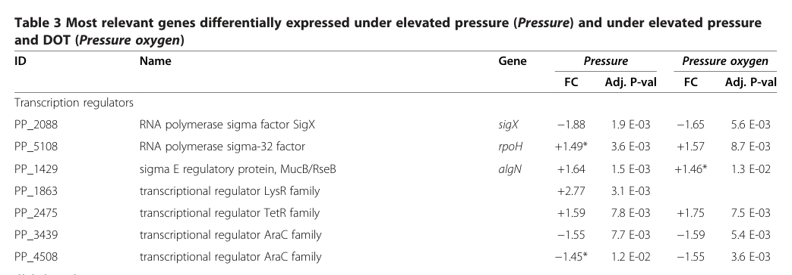

## Question

# Gene Research for Functional Annotation

## ⚠️ CRITICAL: Gene/Protein Identification Context

**BEFORE YOU BEGIN RESEARCH:** You MUST verify you are researching the CORRECT gene/protein. Gene symbols can be ambiguous, especially for less well-characterized genes from non-model organisms.

### Target Gene/Protein Identity (from UniProt):
- **UniProt Accession:** Q7CCA6
- **Protein Description:** RecName: Full=RNA polymerase sigma factor RpoH {ECO:0000256|HAMAP-Rule:MF_00961, ECO:0000256|NCBIfam:TIGR02392}; AltName: Full=RNA polymerase sigma-32 factor {ECO:0000256|HAMAP-Rule:MF_00961};
- **Gene Information:** Name=rpoH {ECO:0000256|HAMAP-Rule:MF_00961, ECO:0000313|EMBL:AAN70673.1}; OrderedLocusNames=PP_5108 {ECO:0000313|EMBL:AAN70673.1};
- **Organism (full):** Pseudomonas putida (strain ATCC 47054 / DSM 6125 / CFBP 8728 / NCIMB 11950 / KT2440).
- **Protein Family:** Belongs to the sigma-70 factor family. RpoH subfamily.
- **Key Domains:** RNA_pol_sigma-70_dom. (IPR014284); RNA_pol_sigma70. (IPR000943); RNA_pol_sigma70_r2. (IPR007627); RNA_pol_sigma70_r4. (IPR007630); RNA_pol_sigma_r2. (IPR013325)

### MANDATORY VERIFICATION STEPS:

1. **Check if the gene symbol "rpoH" matches the protein description above**
2. **Verify the organism is correct:** Pseudomonas putida (strain ATCC 47054 / DSM 6125 / CFBP 8728 / NCIMB 11950 / KT2440).
3. **Check if protein family/domains align with what you find in literature**
4. **If you find literature for a DIFFERENT gene with the same or similar symbol, STOP**

### If Gene Symbol is Ambiguous or You Cannot Find Relevant Literature:

**DO NOT PROCEED WITH RESEARCH ON A DIFFERENT GENE.** Instead:
- State clearly: "The gene symbol 'rpoH' is ambiguous or literature is limited for this specific protein"
- Explain what you found (e.g., "Found extensive literature on a different gene with the same symbol in a different organism")
- Describe the protein based ONLY on the UniProt information provided above
- Suggest that the protein function can be inferred from domain/family information

### Research Target:

Please provide a comprehensive research report on the gene **rpoH** (gene ID: rpoH, UniProt: Q7CCA6) in PSEPK.

The research report should be a detailed narrative explaining the function, biological processes, and localization of the gene product. Citations should be given for all claims.

You should prioritize authoritative reviews and primary scientific literature when conducting research. You can supplement
this with annotations you find in gene/protein databases, but these can be outdated or inaccurate.

We are specifically interested in the primary function of the gene - for enzymes, what reaction is catalyzed, and what is the substrate specificity? For transporters, what is the substrate? For structural proteins or adapters, what is the broader structural role? For signaling molecules, what is the role in the pathway.

We are interested in where in or outside the cell the gene product carries out its function.

We are also interested in the signaling or biochemical pathways in which the gene functions. We are less interested in broad pleiotropic effects, except where these elucidate the precise role.

Include evidence where possible. We are interested in both experimental evidence as well as inference from structure, evolution, or bioinformatic analysis. Precise studies should be prioritized over high-throughput, where available.

## Output

Question: You are an expert researcher providing comprehensive, well-cited information.

Provide detailed information focusing on:
1. Key concepts and definitions with current understanding
2. Recent developments and latest research (prioritize 2023-2024 sources)
3. Current applications and real-world implementations
4. Expert opinions and analysis from authoritative sources
5. Relevant statistics and data from recent studies

Format as a comprehensive research report with proper citations. Include URLs and publication dates where available.
Always prioritize recent, authoritative sources and provide specific citations for all major claims.

# Gene Research for Functional Annotation

## ⚠️ CRITICAL: Gene/Protein Identification Context

**BEFORE YOU BEGIN RESEARCH:** You MUST verify you are researching the CORRECT gene/protein. Gene symbols can be ambiguous, especially for less well-characterized genes from non-model organisms.

### Target Gene/Protein Identity (from UniProt):
- **UniProt Accession:** Q7CCA6
- **Protein Description:** RecName: Full=RNA polymerase sigma factor RpoH {ECO:0000256|HAMAP-Rule:MF_00961, ECO:0000256|NCBIfam:TIGR02392}; AltName: Full=RNA polymerase sigma-32 factor {ECO:0000256|HAMAP-Rule:MF_00961};
- **Gene Information:** Name=rpoH {ECO:0000256|HAMAP-Rule:MF_00961, ECO:0000313|EMBL:AAN70673.1}; OrderedLocusNames=PP_5108 {ECO:0000313|EMBL:AAN70673.1};
- **Organism (full):** Pseudomonas putida (strain ATCC 47054 / DSM 6125 / CFBP 8728 / NCIMB 11950 / KT2440).
- **Protein Family:** Belongs to the sigma-70 factor family. RpoH subfamily.
- **Key Domains:** RNA_pol_sigma-70_dom. (IPR014284); RNA_pol_sigma70. (IPR000943); RNA_pol_sigma70_r2. (IPR007627); RNA_pol_sigma70_r4. (IPR007630); RNA_pol_sigma_r2. (IPR013325)

### MANDATORY VERIFICATION STEPS:

1. **Check if the gene symbol "rpoH" matches the protein description above**
2. **Verify the organism is correct:** Pseudomonas putida (strain ATCC 47054 / DSM 6125 / CFBP 8728 / NCIMB 11950 / KT2440).
3. **Check if protein family/domains align with what you find in literature**
4. **If you find literature for a DIFFERENT gene with the same or similar symbol, STOP**

### If Gene Symbol is Ambiguous or You Cannot Find Relevant Literature:

**DO NOT PROCEED WITH RESEARCH ON A DIFFERENT GENE.** Instead:
- State clearly: "The gene symbol 'rpoH' is ambiguous or literature is limited for this specific protein"
- Explain what you found (e.g., "Found extensive literature on a different gene with the same symbol in a different organism")
- Describe the protein based ONLY on the UniProt information provided above
- Suggest that the protein function can be inferred from domain/family information

### Research Target:

Please provide a comprehensive research report on the gene **rpoH** (gene ID: rpoH, UniProt: Q7CCA6) in PSEPK.

The research report should be a detailed narrative explaining the function, biological processes, and localization of the gene product. Citations should be given for all claims.

You should prioritize authoritative reviews and primary scientific literature when conducting research. You can supplement
this with annotations you find in gene/protein databases, but these can be outdated or inaccurate.

We are specifically interested in the primary function of the gene - for enzymes, what reaction is catalyzed, and what is the substrate specificity? For transporters, what is the substrate? For structural proteins or adapters, what is the broader structural role? For signaling molecules, what is the role in the pathway.

We are interested in where in or outside the cell the gene product carries out its function.

We are also interested in the signaling or biochemical pathways in which the gene functions. We are less interested in broad pleiotropic effects, except where these elucidate the precise role.

Include evidence where possible. We are interested in both experimental evidence as well as inference from structure, evolution, or bioinformatic analysis. Precise studies should be prioritized over high-throughput, where available.

## Research report: **rpoH (UniProt Q7CCA6; locus PP_5108)** in *Pseudomonas putida* KT2440 (PSEPK)

### 0) Identity verification (mandatory)
The literature gathered matches the UniProt target **Q7CCA6** because it explicitly identifies **PP_5108** in *P. putida* **KT2440** as **rpoH**, annotated as the **RNA polymerase sigma-32 factor** (σ32/RpoH), which is the canonical heat-shock sigma factor in Gram-negative bacteria. In KT2440 pressure transcriptomics, PP_5108 is labeled “RNA polymerase sigma-32 factor” with gene name **rpoH**, confirming the locus-to-function mapping. (follonier2013newinsightson pages 5-6)

### 1) Key concepts and definitions (current understanding)

#### 1.1 What RpoH (σ32) is
**RpoH (σ32)** is an **alternative sigma factor** in the **σ70 family**. Sigma factors are RNA polymerase (RNAP) specificity subunits that redirect RNAP to particular promoter classes. In Gram-negative bacteria, σ32 is the major transcriptional regulator of the **heat-shock response (HSR)**, activating genes that restore **protein homeostasis (proteostasis)**—molecular chaperones and proteases that refold or degrade damaged proteins. (potvin2008sigmafactorsin pages 3-5, ito2014geneticandphenotypic pages 2-3)

In a widely cited Pseudomonas-focused review, RpoH is described as an **σ70-like factor** with substantial similarity to *E. coli* σ32 (noted as ~61% identity for the *P. aeruginosa* RpoH). It is responsible for the canonical heat-shock induction response and supports basal expression of multiple heat-shock proteins. (potvin2008sigmafactorsin pages 3-5)

#### 1.2 σ70-family domain architecture relevant to RpoH function
σ70-family sigma factors share conserved regions that implement promoter recognition and RNAP interaction. In Pseudomonas, these conserved σ70-family regions are summarized as: 
- **Region/domain 2**: most conserved; involved in **core RNAP binding**, **DNA melting**, and recognition of the **−10 element**.
- **Region/domain 4**: contains an **HTH DNA-binding motif** for recognition of the **−35 element**.
These concepts support functional inference for Q7CCA6 (RpoH subfamily) in promoter recognition and transcription initiation. (potvin2008sigmafactorsin pages 3-5)

#### 1.3 σ32 regulon size and promoter consensus (reference framework)
While regulon membership differs across organisms, a quantitative reference point for σ32 control comes from *E. coli*: σ32 is cited as controlling **~50 transcriptional units (~90 genes)**, emphasizing its broad role in proteostasis. (ito2014geneticandphenotypic pages 2-3)

A σ32 promoter consensus reported in the *P. putida* heat-shock genetics study (citing the *E. coli* consensus) is **CTTGAA N13–17 CCCCATNT**, and *P. putida* candidate σ32 promoter sequences were identified upstream of **cbpA**, **hfq (PP4894)**, and **secA (PP1345)**. (ito2014geneticandphenotypic pages 6-8)

### 2) Primary function and pathway placement in *P. putida* KT2440

#### 2.1 Primary molecular function
RpoH is **not an enzyme**; its primary function is **sequence-specific transcription initiation control**. RpoH binds the RNAP core enzyme to form an alternative holoenzyme and drives transcription from **heat-shock promoters**, upregulating chaperones/proteases and related stress-repair functions. This is the central mechanistic meaning of “heat shock sigma factor.” (ito2014geneticandphenotypic pages 2-3, ito2014geneticandphenotypic pages 6-8)

#### 2.2 Biological processes governed (HSR/proteostasis control)
In *Pseudomonas putida*, the heat-shock response is described as being controlled by σ32 (encoded by **rpoH**) and implemented by conserved chaperone/protease systems, notably **DnaK/DnaJ/GrpE** and **GroEL/GroES** chaperone machines and ATP-dependent proteases (including **FtsH**) that together establish a feedback-regulated proteostasis circuit. (ito2014geneticandphenotypic pages 1-2, ito2014geneticandphenotypic pages 2-3)

#### 2.3 Cellular localization of RpoH action
RpoH functions where transcription occurs: it acts as part of the RNAP holoenzyme on the **bacterial chromosome in the cytoplasm/nucleoid** (i.e., it is not secreted and does not act in the periplasm). Its regulatory targets include cytosolic chaperones (DnaK/DnaJ/GrpE; GroEL/GroES) and proteases; regulation also involves the membrane-embedded protease **FtsH**, linking cytosolic σ32 levels to membrane-associated proteolysis. (ito2014geneticandphenotypic pages 1-2, ito2014geneticandphenotypic pages 2-3)

### 3) Regulation of RpoH/σ32 in *P. putida*: mechanisms and experimentally supported phenotypes

#### 3.1 Negative feedback control by chaperones and proteolysis
A central current model is chaperone-mediated negative feedback: when proteins misfold under stress, chaperones are titrated away from σ32, freeing σ32 to activate heat-shock transcription; as chaperone levels rise, they re-bind/inactivate σ32 and promote its turnover.

In *P. putida*, σ32 activity/quantity is controlled by **DnaK/DnaJ/GrpE** and **GroEL/GroES**, and σ32 is degraded by a membrane ATP-dependent protease (implicated as **FtsH**) with chaperone assistance. (ito2014geneticandphenotypic pages 1-2, ito2014geneticandphenotypic pages 2-3)

#### 3.2 Induction kinetics (quantitative)
σ32 induction after heat shock is described as **transient**, peaking at **~5–15 minutes**, and in *P. putida* heat-shock experiments increased expression of heat-shock genes occurs within **~10 minutes** and correlates with σ32 levels. Moreover, **rpoH mRNA** can continue increasing even as σ32 protein levels decline, indicating layered transcriptional/post-transcriptional regulation. (ito2014geneticandphenotypic pages 2-3, ito2014geneticandphenotypic pages 6-8)

#### 3.3 Genetic evidence for the σ32-centered proteostasis circuit
While not direct rpoH knockouts, genetic perturbations in σ32 effector systems demonstrate the pathway’s biological necessity:
- A **ΔclpB** mutant in *P. putida* shows normal heat-shock protein synthesis (except ClpB) but is **highly temperature sensitive** and cannot disaggregate thermo-induced aggregates, demonstrating that σ32-driven proteostasis requires specific disaggregation capacity for survival after heat stress. (ito2014geneticandphenotypic pages 1-2)
- A **ΔdnaJ** mutant is **temperature sensitive** and accumulates more (especially high-molecular-weight) aggregates upon heat stress; **CbpA** can partially substitute for DnaJ, consistent with σ32-regulated tuning of DnaK co-chaperone capacity in *P. putida*. (ito2014geneticandphenotypic pages 1-2, ito2014geneticandphenotypic pages 2-3)

### 4) Stress contexts in KT2440 where rpoH/σ32 is implicated (omics + experimental evidence)

#### 4.1 Elevated pressure / bioreactor-relevant conditions (KT2440)
Under elevated pressure conditions relevant to industrial-scale bioreactors, KT2440 microarrays show **upregulation of rpoH (PP_5108)** alongside canonical heat-shock genes. Specifically:
- **rpoH (PP_5108): +1.49 fold-change** (adjusted p = 3.6×10−3) under pressure; **+1.57** (adjusted p = 8.7×10−3) under pressure + elevated oxygen.
- Chaperone genes are co-induced: **htpG +1.65/+1.92**, **groES +1.61/+1.77**, **groEL +1.78/+2.19**, consistent with activation of a heat-shock-like proteostasis response. (follonier2013newinsightson pages 5-6, follonier2013newinsightson media 908730bc)

#### 4.2 Aromatic solvent stress / proteotoxicity (KT2440)
In a KT2440 study examining toluene and related aromatics, induced proteins are described as belonging to the **RpoH regulon**, including **GroES, GroEL, GrpE, Lon protease, DnaK, and IbpA**, linking solvent exposure to heat-shock/proteostasis activation. (dominguezcuevas2006transcriptionaltradeoffbetween pages 7-8)

Quantitatively, large inductions were observed for multiple heat-shock/proteostasis genes upon aromatic exposure (selected examples): **HslU 12.03-fold** (o-xylene), **DnaK 6.43-fold** (o-xylene), **HSP20 family protein 47.05-fold** (toluene), and **IbpA up to 6.46-fold** (3MB), illustrating strong compound-specific activation of proteostasis pathways. (dominguezcuevas2006transcriptionaltradeoffbetween pages 7-8)

#### 4.3 Aromatic bioproduct stress in a KT2440-background strain (2023)
A 2023 study in *P. putida* DOT-T1E (a solvent-tolerant strain, KT2440 background) exposed to aromatics (styrene/trans-cinnamic acid) reported induction of multiple chaperones and proteostasis-related proteins including **GroEL**, **SurA**, **HtpG**, and GroSL, with associated oxidative-stress defenses and efflux systems; some genes were overexpressed by up to **7.7-fold** and ATP synthase genes induced **2.2–5.2-fold**, indicating substantial physiological burden and engagement of stress repair systems relevant to industrial aromatic production. (garciafranco2023insightsintothe pages 9-10, garciafranco2023insightsintothe pages 10-11)

### 5) Applications and real-world implementations

#### 5.1 Process robustness and temperature-based control
A review of Pseudomonas stress responses emphasizes that heat-shock systems (including σ32/RpoH control and RNA thermosensors) can be leveraged for industrial applications. It highlights **ROSE-type RNA thermometers** in heat-shock gene regulation; in *P. putida*, a ROSE element precedes **ibpA** (small heat-shock protein), illustrating temperature-responsive post-transcriptional control within the broader σ32-linked heat-shock network. (craig2021leveragingpseudomonasstress pages 7-9)

As a concrete process-relevant example, *P. putida* KT2440 heterologous rhamnolipid production increased by **>60%** when temperature was raised from **30°C to 37°C**, supporting the concept that temperature shifts can be used as a practical control input interacting with heat-shock regulatory circuitry. (craig2021leveragingpseudomonasstress pages 7-9)

#### 5.2 Industrially relevant stresses that intersect RpoH biology
The same review notes that industrial workflows expose bacteria to temperature extremes (e.g., drying and sterilization steps) and that survival relies on “chaperones, proteases, thermosensors, and alternative sigma factors.” This frames RpoH-centered proteostasis as directly relevant to strain engineering for robustness and to formulation processes (e.g., drying). (craig2021leveragingpseudomonasstress pages 5-6, craig2021leveragingpseudomonasstress pages 11-12)

### 6) Recent developments and latest research (prioritizing 2023–2024)

#### 6.1 2024 systems biology: genome-wide mapping of RpoH binding and sigmulons
A 2024 PLOS Genetics study applied genome-wide binding assays and transcriptomic systems biology to quantify sigma-factor regulatory dynamics during heat shock (in *Salmonella* as a model). While not *P. putida*, it exemplifies the **current best practice** for defining sigma regulons (ChIP-based occupancy + RNA-seq integration + iModulon inference) and produces quantitative benchmarks:
- Binding sites under control conditions: **RpoH 181**, with **+40 new** and **−8 lost** after heat shock.
- RpoH sigmulon size: **151 genes (93 TUs)** under control vs **163 genes (98 TUs)** after heat shock; **43** RpoH sigmulon genes changed significantly in expression.
- Overlap with housekeeping sigma RpoD: **~28.7% (control)** and **~24.8% (heat shock)**, indicating shared/competitive promoter use.
These results provide up-to-date quantitative framing for σ32 network plasticity and sigma competition, which are likely relevant principles for Pseudomonas RpoH biology even if organism-specific maps differ. (park2024unveilingthenovel pages 5-7, park2024unveilingthenovel pages 4-5)

#### 6.2 2024 population genomics: updated genomic context for KT2440 robustness
A 2024 FEMS Microbiology Reviews article quantifies stress-related gene inventories and regulatory capacity in the *P. putida* group, offering updated genomic context for KT2440 (noting its robustness). It reports that KT2440 encodes **10 universal stress proteins**, **7 cold shock proteins**, **5 heat shock proteins**, and that **~10% of the genome** is devoted to regulatory proteins, alongside extensive efflux capacity (e.g., **14 RND efflux pumps** across four subfamilies). Although RpoH is not singled out in the excerpted passage, these data contextualize σ-factor–mediated stress regulation as embedded within a large regulatory repertoire supporting environmental and industrial resilience. (udaondo2024unravelingthegenomic pages 14-16)

### 7) Expert interpretation (authoritative synthesis)
Collectively, the evidence supports functional annotation of **rpoH (Q7CCA6; PP_5108)** in KT2440 as a **σ70-family alternative sigma factor (σ32)** that orchestrates a **proteostasis-centered stress response**. The strongest organism-specific signals are that KT2440/KT2442 quickly induces σ32-dependent programs upon heat upshift (minutes scale), and that diverse industrially relevant stresses that cause protein damage (aromatic solvents; elevated pressure/oxygen transfer conditions) activate rpoH-linked chaperone/protease expression, reflecting that these stresses converge on the same proteostasis bottleneck. (ito2014geneticandphenotypic pages 6-8, follonier2013newinsightson pages 5-6, dominguezcuevas2006transcriptionaltradeoffbetween pages 7-8)

### 8) Evidence summary table
| Claim / functional element | Evidence type | Key quantitative data | Stress condition / context | Source and URL |
|---|---|---|---|---|
| **Identity:** PP_5108 in *P. putida* KT2440 is **rpoH**, annotated as **RNA polymerase sigma-32 factor (RpoH)** | Omics annotation + organism-specific literature | Table entry explicitly maps **PP_5108 = rpoH = RNA polymerase sigma-32 factor**; functional studies in *P. putida* state **rpoH encodes σ32** | KT2440 transcriptome under elevated pressure; KT2442 heat-shock genetics | Follonier et al. 2013 *Microbial Cell Factories* https://doi.org/10.1186/1475-2859-12-30; Ito et al. 2014 *MicrobiologyOpen* https://doi.org/10.1002/mbo3.217 (follonier2013newinsightson pages 5-6, ito2014geneticandphenotypic pages 1-2) |
| **Induction kinetics:** RpoH/σ32 is rapidly induced after heat shift and correlates with hsp induction | Experiment | σ32 induction is described as transient, **peaking at ~5–15 min** after heat shock; in *P. putida*, **hsp gene expression increased within ~10 min** and correlated with σ32 level | Heat-shock response in *P. putida* KT2442 | Ito et al. 2014 *MicrobiologyOpen* https://doi.org/10.1002/mbo3.217 (ito2014geneticandphenotypic pages 2-3, ito2014geneticandphenotypic pages 6-8) |
| **Regulon size / promoter logic:** RpoH directs RNAP to heat-shock promoters; canonical σ32 promoter motif reported | Experiment + comparative regulatory analysis | E. coli σ32 regulon cited as **~50 transcriptional units / ~90 genes**; reported σ32 promoter consensus **CTTGAA N13-17 CCCCATNT**; candidate *P. putida* σ32-regulated genes include **cbpA, hfq, secA** | Heat-shock transcriptional regulation; inference used in *P. putida* promoter searches | Ito et al. 2014 *MicrobiologyOpen* https://doi.org/10.1002/mbo3.217 (ito2014geneticandphenotypic pages 6-8) |
| **Mechanistic regulation:** RpoH activity and abundance are controlled by chaperones and proteolysis | Review + experiment | **DnaK/DnaJ/GrpE** and **GroEL/GroES** bind/inactivate σ32; **FtsH** degrades σ32; *P. putida* **dnaJ** mutant is temperature sensitive and accumulates more protein aggregates, while **clpB** mutant is heat sensitive and defective in aggregate solubilization | Heat-shock quality-control circuit in cytoplasm | Ito et al. 2014 *MicrobiologyOpen* https://doi.org/10.1002/mbo3.217; Potvin et al. 2008 *FEMS Microbiology Reviews* https://doi.org/10.1111/j.1574-6976.2007.00092.x (ito2014geneticandphenotypic pages 1-2, potvin2008sigmafactorsin pages 3-5, ito2014geneticandphenotypic pages 2-3) |
| **Protein family / domain context:** RpoH is an alternative **sigma-70 family** sigma factor for heat-shock transcription | Review | RpoH shows **61% identity** to *E. coli* σ32; σ70-family architecture includes conserved **domain 2** (core RNAP binding, DNA melting, -10 recognition) and **domain 4** (HTH, -35 recognition) | General bacterial transcription; relevant to Pseudomonas RpoH annotation | Potvin et al. 2008 *FEMS Microbiology Reviews* https://doi.org/10.1111/j.1574-6976.2007.00092.x (potvin2008sigmafactorsin pages 3-5) |
| **Pressure-associated induction in KT2440:** rpoH and canonical heat-shock genes are upregulated | Omics (microarray; supported by qRT-PCR for most tested genes) | Under elevated pressure: **rpoH +1.49** (adj. P = **3.6E-03**); with pressure + O2: **+1.57** (adj. P = **8.7E-03**). Associated genes: **htpG +1.65 / +1.92**, **groES +1.61 / +1.77**, **groEL +1.78 / +2.19**, **grpE +1.33** | KT2440 under elevated pressure and elevated pressure + dissolved oxygen; bioprocess-relevant stress | Follonier et al. 2013 *Microbial Cell Factories* https://doi.org/10.1186/1475-2859-12-30 (follonier2013newinsightson pages 5-6, follonier2013newinsightson media 908730bc, follonier2013newinsightson media 43885585) |
| **Solvent response link:** aromatic solvent stress recruits the RpoH heat-shock program | Omics + experiment | Toluene/o-xylene exposure induced proteins assigned to the **RpoH regulon**, including **GroES, GroEL, GrpE, Lon, DnaK, IbpA**; activation of the TOL meta operon was reported to require the contribution of **σ32 and/or σ38** host factors | KT2440 exposed to toluene/aromatic solvents; proteotoxic stress tradeoff with metabolism | Domínguez-Cuevas et al. 2006 *Journal of Biological Chemistry* https://doi.org/10.1074/jbc.m509848200 (dominguezcuevas2006transcriptionaltradeoffbetween pages 1-2) |

*Table: This table compiles organism-specific evidence supporting the functional annotation of *Pseudomonas putida* KT2440/KT2442 rpoH (PP_5108) as the sigma-32 heat-shock sigma factor. It highlights identity, regulatory mechanism, kinetics, regulon features, and stress-responsive expression data most useful for gene-function annotation.*

### 9) Key quantitative evidence highlights (selected)
- KT2440 elevated pressure: **rpoH +1.49 FC** (adj. p 3.6×10−3), **groEL +1.78 FC**, **groES +1.61 FC**, **htpG +1.65 FC**. (follonier2013newinsightson pages 5-6, follonier2013newinsightson media 908730bc)
- KT2440 aromatic exposure: **HSP20 family protein 47.05-fold** (toluene), **HslU 12.03-fold** (o-xylene), **DnaK 6.43-fold** (o-xylene), **IbpA up to 6.46-fold** (3MB). (dominguezcuevas2006transcriptionaltradeoffbetween pages 7-8)
- σ32 induction timing: **peak ~5–15 min**, hsp induction within **~10 min**. (ito2014geneticandphenotypic pages 2-3, ito2014geneticandphenotypic pages 6-8)
- 2024 genome-wide sigma mapping (model organism): RpoH binding sites **181** baseline, **+40/−8** remodeling; sigmulon **151→163 genes** under heat shock. (park2024unveilingthenovel pages 5-7, park2024unveilingthenovel pages 4-5)
- 2024 KT2440-group genomics: **10 universal stress proteins**, **7 cold shock proteins**, **5 heat shock proteins**, **~10%** genome regulatory proteins, **14 RND efflux pumps**. (udaondo2024unravelingthegenomic pages 14-16)

### 10) URLs and publication dates (most-cited sources used here)
- Ito et al. **2014-10**. *MicrobiologyOpen*. “Genetic and phenotypic characterization of the heat shock response in *Pseudomonas putida*.” https://doi.org/10.1002/mbo3.217 (ito2014geneticandphenotypic pages 2-3, ito2014geneticandphenotypic pages 6-8)
- Follonier et al. **2013-03**. *Microbial Cell Factories*. “New insights on the reorganization of gene transcription in *P. putida* KT2440 at elevated pressure.” https://doi.org/10.1186/1475-2859-12-30 (follonier2013newinsightson pages 5-6, follonier2013newinsightson media 908730bc)
- Domínguez-Cuevas et al. **2006-04**. *Journal of Biological Chemistry*. “Transcriptional tradeoff between metabolic and stress-response programs in *P. putida* KT2440 exposed to toluene.” https://doi.org/10.1074/jbc.m509848200 (dominguezcuevas2006transcriptionaltradeoffbetween pages 7-8)
- García-Franco et al. **2023-02**. *Microbial Cell Factories*. “Susceptibility of *P. putida* to industrial aromatic hydrocarbons.” https://doi.org/10.1186/s12934-023-02028-y (garciafranco2023insightsintothe pages 9-10)
- Park et al. **2024-10**. *PLOS Genetics*. Sigma-factor systems biology mapping under heat shock. https://doi.org/10.1371/journal.pgen.1011464 (park2024unveilingthenovel pages 5-7, park2024unveilingthenovel pages 4-5)
- Udaondo et al. **2024-10**. *FEMS Microbiology Reviews*. Population genomics of the *P. putida* group. https://doi.org/10.1093/femsre/fuae025 (udaondo2024unravelingthegenomic pages 14-16)

### 11) Notes on limitations (scope and organism specificity)
A complete, experimentally defined **KT2440-specific RpoH regulon map** (e.g., ChIP-seq/ChIP-exo of RpoH in KT2440) was not available in the retrieved corpus. Therefore, regulon membership is supported here by (i) direct KT2440 stress transcriptomics, (ii) KT2442 heat-shock genetics and promoter motif searches, and (iii) solvent-stress gene induction patterns explicitly labeled as RpoH regulon members by the authors. (ito2014geneticandphenotypic pages 6-8, dominguezcuevas2006transcriptionaltradeoffbetween pages 7-8)

References

1. (follonier2013newinsightson pages 5-6): Stéphanie Follonier, Isabel F Escapa, Pilar M Fonseca, Bernhard Henes, Sven Panke, Manfred Zinn, and María Auxiliadora Prieto. New insights on the reorganization of gene transcription in pseudomonas putida kt2440 at elevated pressure. Microbial Cell Factories, 12:30-30, Mar 2013. URL: https://doi.org/10.1186/1475-2859-12-30, doi:10.1186/1475-2859-12-30. This article has 46 citations and is from a peer-reviewed journal.

2. (potvin2008sigmafactorsin pages 3-5): Eric Potvin, François Sanschagrin, and Roger C. Levesque. Sigma factors in pseudomonas aeruginosa. FEMS microbiology reviews, 32 1:38-55, Jan 2008. URL: https://doi.org/10.1111/j.1574-6976.2007.00092.x, doi:10.1111/j.1574-6976.2007.00092.x. This article has 427 citations and is from a domain leading peer-reviewed journal.

3. (ito2014geneticandphenotypic pages 2-3): Fumihiro Ito, Takayuki Tamiya, Iwao Ohtsu, Makoto Fujimura, and Fumiyasu Fukumori. Genetic and phenotypic characterization of the heat shock response in pseudomonas putida. MicrobiologyOpen, 3:922-936, Oct 2014. URL: https://doi.org/10.1002/mbo3.217, doi:10.1002/mbo3.217. This article has 28 citations and is from a peer-reviewed journal.

4. (ito2014geneticandphenotypic pages 6-8): Fumihiro Ito, Takayuki Tamiya, Iwao Ohtsu, Makoto Fujimura, and Fumiyasu Fukumori. Genetic and phenotypic characterization of the heat shock response in pseudomonas putida. MicrobiologyOpen, 3:922-936, Oct 2014. URL: https://doi.org/10.1002/mbo3.217, doi:10.1002/mbo3.217. This article has 28 citations and is from a peer-reviewed journal.

5. (ito2014geneticandphenotypic pages 1-2): Fumihiro Ito, Takayuki Tamiya, Iwao Ohtsu, Makoto Fujimura, and Fumiyasu Fukumori. Genetic and phenotypic characterization of the heat shock response in pseudomonas putida. MicrobiologyOpen, 3:922-936, Oct 2014. URL: https://doi.org/10.1002/mbo3.217, doi:10.1002/mbo3.217. This article has 28 citations and is from a peer-reviewed journal.

6. (follonier2013newinsightson media 908730bc): Stéphanie Follonier, Isabel F Escapa, Pilar M Fonseca, Bernhard Henes, Sven Panke, Manfred Zinn, and María Auxiliadora Prieto. New insights on the reorganization of gene transcription in pseudomonas putida kt2440 at elevated pressure. Microbial Cell Factories, 12:30-30, Mar 2013. URL: https://doi.org/10.1186/1475-2859-12-30, doi:10.1186/1475-2859-12-30. This article has 46 citations and is from a peer-reviewed journal.

7. (dominguezcuevas2006transcriptionaltradeoffbetween pages 7-8): Patricia Domínguez-Cuevas, José-Eduardo González-Pastor, Silvia Marqués, Juan-Luis Ramos, and Víctor de Lorenzo. Transcriptional tradeoff between metabolic and stress-response programs in pseudomonas putida kt2440 cells exposed to toluene*. Journal of Biological Chemistry, 281:11981-11991, Apr 2006. URL: https://doi.org/10.1074/jbc.m509848200, doi:10.1074/jbc.m509848200. This article has 269 citations and is from a domain leading peer-reviewed journal.

8. (garciafranco2023insightsintothe pages 9-10): Ana García-Franco, Patricia Godoy, Estrella Duque, and Juan Luis Ramos. Insights into the susceptibility of pseudomonas putida to industrially relevant aromatic hydrocarbons that it can synthesize from sugars. Microbial Cell Factories, Feb 2023. URL: https://doi.org/10.1186/s12934-023-02028-y, doi:10.1186/s12934-023-02028-y. This article has 15 citations and is from a peer-reviewed journal.

9. (garciafranco2023insightsintothe pages 10-11): Ana García-Franco, Patricia Godoy, Estrella Duque, and Juan Luis Ramos. Insights into the susceptibility of pseudomonas putida to industrially relevant aromatic hydrocarbons that it can synthesize from sugars. Microbial Cell Factories, Feb 2023. URL: https://doi.org/10.1186/s12934-023-02028-y, doi:10.1186/s12934-023-02028-y. This article has 15 citations and is from a peer-reviewed journal.

10. (craig2021leveragingpseudomonasstress pages 7-9): Kelly Craig, Brant R. Johnson, and Amy Grunden. Leveraging pseudomonas stress response mechanisms for industrial applications. Frontiers in Microbiology, May 2021. URL: https://doi.org/10.3389/fmicb.2021.660134, doi:10.3389/fmicb.2021.660134. This article has 67 citations and is from a peer-reviewed journal.

11. (craig2021leveragingpseudomonasstress pages 5-6): Kelly Craig, Brant R. Johnson, and Amy Grunden. Leveraging pseudomonas stress response mechanisms for industrial applications. Frontiers in Microbiology, May 2021. URL: https://doi.org/10.3389/fmicb.2021.660134, doi:10.3389/fmicb.2021.660134. This article has 67 citations and is from a peer-reviewed journal.

12. (craig2021leveragingpseudomonasstress pages 11-12): Kelly Craig, Brant R. Johnson, and Amy Grunden. Leveraging pseudomonas stress response mechanisms for industrial applications. Frontiers in Microbiology, May 2021. URL: https://doi.org/10.3389/fmicb.2021.660134, doi:10.3389/fmicb.2021.660134. This article has 67 citations and is from a peer-reviewed journal.

13. (park2024unveilingthenovel pages 5-7): Joon Young Park, Minchang Jang, Sang-Mok Lee, Jihoon Woo, Eun-Jin Lee, and Donghyuk Kim. Unveiling the novel regulatory roles of rpod-family sigma factors in salmonella typhimurium heat shock response through systems biology approaches. Oct 2024. URL: https://doi.org/10.1371/journal.pgen.1011464, doi:10.1371/journal.pgen.1011464. This article has 12 citations and is from a domain leading peer-reviewed journal.

14. (park2024unveilingthenovel pages 4-5): Joon Young Park, Minchang Jang, Sang-Mok Lee, Jihoon Woo, Eun-Jin Lee, and Donghyuk Kim. Unveiling the novel regulatory roles of rpod-family sigma factors in salmonella typhimurium heat shock response through systems biology approaches. Oct 2024. URL: https://doi.org/10.1371/journal.pgen.1011464, doi:10.1371/journal.pgen.1011464. This article has 12 citations and is from a domain leading peer-reviewed journal.

15. (udaondo2024unravelingthegenomic pages 14-16): Zulema Udaondo, Juan-Luis Ramos, and Kaleb Z. Abram. Unraveling the genomic diversity of the pseudomonas putida group: exploring taxonomy, core pangenome, and antibiotic resistance mechanisms. FEMS Microbiology Reviews, Oct 2024. URL: https://doi.org/10.1093/femsre/fuae025, doi:10.1093/femsre/fuae025. This article has 13 citations and is from a domain leading peer-reviewed journal.

16. (follonier2013newinsightson media 43885585): Stéphanie Follonier, Isabel F Escapa, Pilar M Fonseca, Bernhard Henes, Sven Panke, Manfred Zinn, and María Auxiliadora Prieto. New insights on the reorganization of gene transcription in pseudomonas putida kt2440 at elevated pressure. Microbial Cell Factories, 12:30-30, Mar 2013. URL: https://doi.org/10.1186/1475-2859-12-30, doi:10.1186/1475-2859-12-30. This article has 46 citations and is from a peer-reviewed journal.

17. (dominguezcuevas2006transcriptionaltradeoffbetween pages 1-2): Patricia Domínguez-Cuevas, José-Eduardo González-Pastor, Silvia Marqués, Juan-Luis Ramos, and Víctor de Lorenzo. Transcriptional tradeoff between metabolic and stress-response programs in pseudomonas putida kt2440 cells exposed to toluene*. Journal of Biological Chemistry, 281:11981-11991, Apr 2006. URL: https://doi.org/10.1074/jbc.m509848200, doi:10.1074/jbc.m509848200. This article has 269 citations and is from a domain leading peer-reviewed journal.

## Artifacts

- [Edison artifact artifact-00](rpoH-deep-research-falcon_artifacts/artifact-00.md)

## Citations

1. follonier2013newinsightson pages 5-6
2. potvin2008sigmafactorsin pages 3-5
3. ito2014geneticandphenotypic pages 2-3
4. ito2014geneticandphenotypic pages 6-8
5. ito2014geneticandphenotypic pages 1-2
6. dominguezcuevas2006transcriptionaltradeoffbetween pages 7-8
7. craig2021leveragingpseudomonasstress pages 7-9
8. udaondo2024unravelingthegenomic pages 14-16
9. dominguezcuevas2006transcriptionaltradeoffbetween pages 1-2
10. garciafranco2023insightsintothe pages 9-10
11. garciafranco2023insightsintothe pages 10-11
12. craig2021leveragingpseudomonasstress pages 5-6
13. craig2021leveragingpseudomonasstress pages 11-12
14. park2024unveilingthenovel pages 5-7
15. park2024unveilingthenovel pages 4-5
16. https://doi.org/10.1186/1475-2859-12-30;
17. https://doi.org/10.1002/mbo3.217
18. https://doi.org/10.1002/mbo3.217;
19. https://doi.org/10.1111/j.1574-6976.2007.00092.x
20. https://doi.org/10.1186/1475-2859-12-30
21. https://doi.org/10.1074/jbc.m509848200
22. https://doi.org/10.1186/s12934-023-02028-y
23. https://doi.org/10.1371/journal.pgen.1011464
24. https://doi.org/10.1093/femsre/fuae025
25. https://doi.org/10.1186/1475-2859-12-30,
26. https://doi.org/10.1111/j.1574-6976.2007.00092.x,
27. https://doi.org/10.1002/mbo3.217,
28. https://doi.org/10.1074/jbc.m509848200,
29. https://doi.org/10.1186/s12934-023-02028-y,
30. https://doi.org/10.3389/fmicb.2021.660134,
31. https://doi.org/10.1371/journal.pgen.1011464,
32. https://doi.org/10.1093/femsre/fuae025,