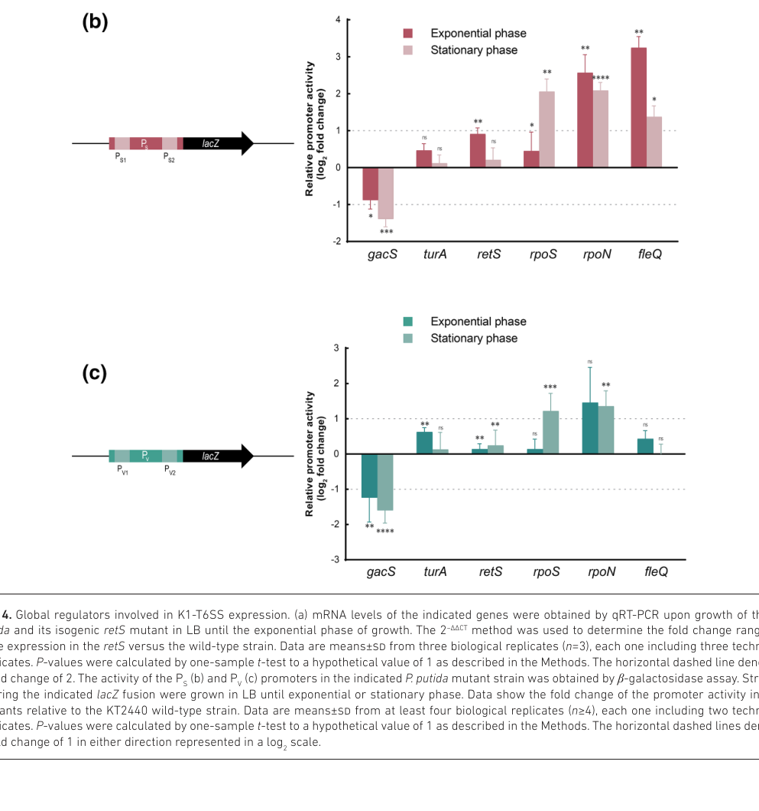

## Question

# Gene Research for Functional Annotation

## ⚠️ CRITICAL: Gene/Protein Identification Context

**BEFORE YOU BEGIN RESEARCH:** You MUST verify you are researching the CORRECT gene/protein. Gene symbols can be ambiguous, especially for less well-characterized genes from non-model organisms.

### Target Gene/Protein Identity (from UniProt):
- **UniProt Accession:** P0A171
- **Protein Description:** RecName: Full=RNA polymerase sigma-54 factor;
- **Gene Information:** Name=rpoN; Synonyms=ntrA; OrderedLocusNames=PP_0952;
- **Organism (full):** Pseudomonas putida (strain ATCC 47054 / DSM 6125 / CFBP 8728 / NCIMB 11950 / KT2440).
- **Protein Family:** Belongs to the sigma-54 factor family. .
- **Key Domains:** RNA_pol_sigma_54. (IPR000394); RNA_pol_sigma_54_core-bd. (IPR007046); RNA_pol_sigma_54_DNA-bd. (IPR007634); RpoN_core-bd_sf. (IPR038709); Sigma54_AID (PF00309)

### MANDATORY VERIFICATION STEPS:

1. **Check if the gene symbol "rpoN" matches the protein description above**
2. **Verify the organism is correct:** Pseudomonas putida (strain ATCC 47054 / DSM 6125 / CFBP 8728 / NCIMB 11950 / KT2440).
3. **Check if protein family/domains align with what you find in literature**
4. **If you find literature for a DIFFERENT gene with the same or similar symbol, STOP**

### If Gene Symbol is Ambiguous or You Cannot Find Relevant Literature:

**DO NOT PROCEED WITH RESEARCH ON A DIFFERENT GENE.** Instead:
- State clearly: "The gene symbol 'rpoN' is ambiguous or literature is limited for this specific protein"
- Explain what you found (e.g., "Found extensive literature on a different gene with the same symbol in a different organism")
- Describe the protein based ONLY on the UniProt information provided above
- Suggest that the protein function can be inferred from domain/family information

### Research Target:

Please provide a comprehensive research report on the gene **rpoN** (gene ID: rpoN, UniProt: P0A171) in PSEPK.

The research report should be a detailed narrative explaining the function, biological processes, and localization of the gene product. Citations should be given for all claims.

You should prioritize authoritative reviews and primary scientific literature when conducting research. You can supplement
this with annotations you find in gene/protein databases, but these can be outdated or inaccurate.

We are specifically interested in the primary function of the gene - for enzymes, what reaction is catalyzed, and what is the substrate specificity? For transporters, what is the substrate? For structural proteins or adapters, what is the broader structural role? For signaling molecules, what is the role in the pathway.

We are interested in where in or outside the cell the gene product carries out its function.

We are also interested in the signaling or biochemical pathways in which the gene functions. We are less interested in broad pleiotropic effects, except where these elucidate the precise role.

Include evidence where possible. We are interested in both experimental evidence as well as inference from structure, evolution, or bioinformatic analysis. Precise studies should be prioritized over high-throughput, where available.

## Output

Question: You are an expert researcher providing comprehensive, well-cited information.

Provide detailed information focusing on:
1. Key concepts and definitions with current understanding
2. Recent developments and latest research (prioritize 2023-2024 sources)
3. Current applications and real-world implementations
4. Expert opinions and analysis from authoritative sources
5. Relevant statistics and data from recent studies

Format as a comprehensive research report with proper citations. Include URLs and publication dates where available.
Always prioritize recent, authoritative sources and provide specific citations for all major claims.

# Gene Research for Functional Annotation

## ⚠️ CRITICAL: Gene/Protein Identification Context

**BEFORE YOU BEGIN RESEARCH:** You MUST verify you are researching the CORRECT gene/protein. Gene symbols can be ambiguous, especially for less well-characterized genes from non-model organisms.

### Target Gene/Protein Identity (from UniProt):
- **UniProt Accession:** P0A171
- **Protein Description:** RecName: Full=RNA polymerase sigma-54 factor;
- **Gene Information:** Name=rpoN; Synonyms=ntrA; OrderedLocusNames=PP_0952;
- **Organism (full):** Pseudomonas putida (strain ATCC 47054 / DSM 6125 / CFBP 8728 / NCIMB 11950 / KT2440).
- **Protein Family:** Belongs to the sigma-54 factor family. .
- **Key Domains:** RNA_pol_sigma_54. (IPR000394); RNA_pol_sigma_54_core-bd. (IPR007046); RNA_pol_sigma_54_DNA-bd. (IPR007634); RpoN_core-bd_sf. (IPR038709); Sigma54_AID (PF00309)

### MANDATORY VERIFICATION STEPS:

1. **Check if the gene symbol "rpoN" matches the protein description above**
2. **Verify the organism is correct:** Pseudomonas putida (strain ATCC 47054 / DSM 6125 / CFBP 8728 / NCIMB 11950 / KT2440).
3. **Check if protein family/domains align with what you find in literature**
4. **If you find literature for a DIFFERENT gene with the same or similar symbol, STOP**

### If Gene Symbol is Ambiguous or You Cannot Find Relevant Literature:

**DO NOT PROCEED WITH RESEARCH ON A DIFFERENT GENE.** Instead:
- State clearly: "The gene symbol 'rpoN' is ambiguous or literature is limited for this specific protein"
- Explain what you found (e.g., "Found extensive literature on a different gene with the same symbol in a different organism")
- Describe the protein based ONLY on the UniProt information provided above
- Suggest that the protein function can be inferred from domain/family information

### Research Target:

Please provide a comprehensive research report on the gene **rpoN** (gene ID: rpoN, UniProt: P0A171) in PSEPK.

The research report should be a detailed narrative explaining the function, biological processes, and localization of the gene product. Citations should be given for all claims.

You should prioritize authoritative reviews and primary scientific literature when conducting research. You can supplement
this with annotations you find in gene/protein databases, but these can be outdated or inaccurate.

We are specifically interested in the primary function of the gene - for enzymes, what reaction is catalyzed, and what is the substrate specificity? For transporters, what is the substrate? For structural proteins or adapters, what is the broader structural role? For signaling molecules, what is the role in the pathway.

We are interested in where in or outside the cell the gene product carries out its function.

We are also interested in the signaling or biochemical pathways in which the gene functions. We are less interested in broad pleiotropic effects, except where these elucidate the precise role.

Include evidence where possible. We are interested in both experimental evidence as well as inference from structure, evolution, or bioinformatic analysis. Precise studies should be prioritized over high-throughput, where available.

# Research report: **rpoN (σ54 / σN) functional annotation in *Pseudomonas putida* KT2440** (UniProt P0A171)

## 0) Target identity verification (critical)
The target protein (UniProt **P0A171**) is annotated as **RNA polymerase sigma-54 factor** and the gene name **rpoN** (synonym **ntrA**) in *Pseudomonas putida* KT2440 (ordered locus name **PP_0952**). In *P. putida* KT2440 transcriptomic work, **rpoN (PP_0952)** is explicitly referred to as “**Sigma factor RpoN**,” matching the UniProt description (and distinguishing it from similarly named genes in other organisms). (mozejkociesielska2017mediumchainlengthpolyhydroxyalkanoatessynthesis pages 9-10)

## 1) Key concepts and definitions (current understanding)
### 1.1 What is RpoN/σ54?
RpoN (σ54, also called σN) is an **alternative sigma factor** that binds the bacterial RNA polymerase (RNAP) core enzyme to form an RNAP holoenzyme with **distinct promoter specificity** and a **distinct activation mechanism** from σ70. (yu2021theregulatoryfunctions pages 1-2, busby2024transcriptionactivationin pages 10-12)

### 1.2 σ54 promoter architecture and recognition
σ54 recognizes promoters with conserved elements at **−24 and −12** relative to the transcription start site, including a conserved motif described as **GGN10GC**. This contrasts with σ70-family promoters, which are typically defined by −35/−10 elements. (yu2021theregulatoryfunctions pages 1-2, busby2024transcriptionactivationin pages 10-12)

### 1.3 The defining mechanistic feature: obligate ATP-dependent activation by enhancer-binding proteins (EBPs)
A central “textbook” feature of σ54-dependent transcription is that the σ54-RNAP holoenzyme can bind its promoter but is **blocked from forming a transcriptionally competent open complex** without help. EcoSal Plus (2024) describes that σ54 Region I obstructs DNA opening; therefore transcription initiation requires **specialized enhancer-binding proteins (EBPs)** that contain **AAA+ ATPase domains** to **remodel σ54** using ATP hydrolysis, enabling promoter melting/open complex formation. (busby2024transcriptionactivationin pages 10-12, busby2024transcriptionactivationin pages 6-8)

A complementary review summary emphasizes that EBPs usually have (i) an N-terminal signal-sensing domain, (ii) a central conserved **AAA+ ATPase domain** that interacts with σ54 and hydrolyzes ATP to drive activation, and (iii) a C-terminal DNA-binding domain. (yu2021theregulatoryfunctions pages 1-2)

### 1.4 Domain organization (mapping to UniProt “Sigma54_AID” and DNA-binding)
A review describes σ54/RpoN as containing **two conserved functional domains**: an **N-terminal activator-interacting domain** and a **C-terminal DNA-binding domain**—consistent with UniProt’s sigma54 AID and DNA-binding annotations for P0A171. (yu2021theregulatoryfunctions pages 2-4, yu2021theregulatoryfunctions pages 1-2)

## 2) Primary function, cellular localization, and pathway context
### 2.1 Primary function
RpoN is **not an enzyme** and does **not catalyze a chemical reaction**. Its primary function is to provide **promoter recognition specificity** to the RNAP holoenzyme at σ54 promoters and to integrate environmental signals through **EBP-controlled activation**, thereby controlling transcription initiation at specific regulons. (busby2024transcriptionactivationin pages 10-12, yu2021theregulatoryfunctions pages 1-2)

### 2.2 Cellular localization
As a sigma factor, RpoN functions in the **cytoplasm** in association with RNAP and promoter DNA (i.e., nucleoid-associated transcription machinery). Mechanistic descriptions place σ54 as part of the RNAP holoenzyme bound to promoter DNA, remodeled by EBPs to initiate transcription. (busby2024transcriptionactivationin pages 10-12, yu2021theregulatoryfunctions pages 1-2)

### 2.3 Pathway-level role in pseudomonads (context)
σ54 systems are typically “hub-like” because a **single σ54** can interface with **many EBPs**, enabling regulation of diverse processes (motility, secretion, nutrient assimilation) depending on which EBP is active under given conditions. This conceptual model is emphasized by the EBP-dependent architecture and the need for ATP-driven remodeling of σ54 at promoters. (yu2021theregulatoryfunctions pages 1-2, busby2024transcriptionactivationin pages 10-12)

## 3) KT2440-specific functional evidence (including recent developments)

### 3.1 Recent (2023) study: RpoN represses the K1 Type VI secretion system (T6SS) in KT2440 (indirectly)
A 2023 *Microbiology* paper mapped transcription of the **K1-T6SS gene cluster** in *P. putida* KT2440 and identified four promoters with **σ70-type promoter features**. Despite this σ70 architecture, the authors show that K1-T6SS expression is **repressed** by **RpoN (σ54)** and by **FleQ**, an enhancer-binding protein often associated with σ54-mediated regulation. (bernal2023transcriptionalorganizationand pages 1-2)

Importantly, the authors interpret the RpoN effect as **likely indirect**, noting that σ factors usually promote transcription; they tested a putative σ54-binding motif overlapping a σ70 promoter element and found mutational evidence inconsistent with direct RpoN binding and repression at that site (supporting an indirect regulatory mechanism, e.g., via an RpoN-dependent repressor). (bernal2023transcriptionalorganizationand pages 8-10, bernal2023transcriptionalorganizationand pages 2-4)

**Image-based evidence:** β-galactosidase promoter fusion data (Figures 4–5) show promoter derepression in **ΔrpoN** and **ΔfleQ** backgrounds, especially during exponential growth phase, consistent with repression by RpoN/FleQ. (bernal2023transcriptionalorganizationand media 34bb0ce1, bernal2023transcriptionalorganizationand media 28b5d7e5)

### 3.2 Nitrogen limitation transcriptomics (KT2440): RpoN mutation alters parts of the nitrogen-limitation response but does not abolish it
A nitrogen-limitation RNA-seq study compared *P. putida* KT2440 wild type to mutants including an **rpoN mutant**. The authors report that under nitrogen limitation the rpoN mutant shows a transcriptional response with **58 genes upregulated and 81 genes downregulated**, and that many nitrogen-limitation-responsive changes are shared with wild type. (dabrowska2020transcriptomechangesin pages 6-8)

Quantitative examples (fold-change values reported for the rpoN background under nitrogen limitation) include strong changes in respiratory oxidase genes such as **ccoO-I (PP_4251: 252.3), ccoQ-I (PP_4252: 209.35), ccoP-I (PP_4253: 118.18), cyoD (PP_0815: 37.9), and cyoC (PP_0814: 15.99)**. (dabrowska2020transcriptomechangesin pages 6-8)

Nitrogen limitation also induced nutrient acquisition/transport functions in the rpoN background, including **urtA–urtD** urea uptake genes (e.g., **urtA: 11.12-fold in rpoN**, comparable to WT 12.7-fold). (dabrowska2020transcriptomechangesin pages 8-10)

### 3.3 Industrially relevant trait: mcl-PHA bioplastic production under nitrogen limitation can persist without RpoN
In the same nitrogen-limitation context, the authors state that nitrogen limitation increased mcl-PHA synthesis in both wild type and **rpoN mutant**, and RT-qPCR results indicate that **PHA-related transcript levels were comparable in wild type and rpoN mutant** under their conditions, suggesting RpoN is not required for the basic transcriptional response of the assayed PHA genes in this setting. (dabrowska2020transcriptomechangesin pages 4-6, dabrowska2020transcriptomechangesin pages 8-10)

A physiological statistic from the study indicates similar nitrogen consumption across strains: at 48 h, ammonium was **2.1 g NH4+-N/L (WT), 1.7 g/L (relA/spoT), 1.63 g/L (rpoN)**. (dabrowska2020transcriptomechangesin pages 4-6)

## 4) Current applications and real-world implementations
### 4.1 Biological control / microbial competition (KT2440 K1-T6SS)
K1-T6SS in *P. putida* KT2440 has been described as an antimicrobial weapon used to outcompete phytopathogens and protect plants; understanding its regulatory network is important for designing or controlling biocontrol behavior. The 2023 KT2440 study identifies **RpoN and FleQ as repressors** (and GacS/GacA as positive regulators), providing actionable regulatory levers for engineering expression of the competitive weapon. (bernal2023transcriptionalorganizationand pages 1-2)

### 4.2 Bioprocessing and metabolic engineering context (mcl-PHAs)
*P. putida* KT2440 is a biotechnological chassis for producing **medium-chain-length polyhydroxyalkanoates (mcl-PHAs)**. Nitrogen-limitation transcriptomics including an rpoN mutant helps delineate which transcriptional changes during nitrogen limitation are **RpoN-sensitive** versus **RpoN-independent**, informing strain design when nitrogen limitation is used as a production trigger. (dabrowska2020transcriptomechangesin pages 8-10, dabrowska2020transcriptomechangesin pages 4-6)

## 5) Expert interpretation and analysis (authoritative synthesis)
### 5.1 Why σ54 systems behave differently from σ70 systems
A 2024 EcoSal Plus review highlights a major conceptual difference: for σ70-holoenzyme promoters, activation often works by **recruiting more RNAP**; for σ54-holoenzyme promoters, the initiation pathway is intrinsically blocked so the **principal action of activators is to remodel σ54** (ATP-dependent). This makes σ54 regulons more tightly gated by signal-responsive EBPs. (busby2024transcriptionactivationin pages 6-8, busby2024transcriptionactivationin pages 10-12)

### 5.2 Reconciling “σ54 repression” with “σ54 activation mechanism” in KT2440
The KT2440 K1-T6SS study provides a useful cautionary example: although σ54 is classically an activatable sigma factor, loss of rpoN **derepressed** a cluster whose promoters were experimentally characterized as primarily **σ70-driven**. The authors explicitly note that σ factors generally promote transcription and therefore argue the observed repression is likely **indirect** (e.g., RpoN activates another gene encoding a repressor, or RpoN influences σ70 promoter usage/competition). This interpretation is consistent with the broader mechanistic framework that RpoN affects global transcriptional allocation and regulatory hierarchies through multiple EBPs and downstream regulators. (bernal2023transcriptionalorganizationand pages 8-10, bernal2023transcriptionalorganizationand pages 2-4, busby2024transcriptionactivationin pages 10-12)

## 6) Evidence map (compact summary table)
The following table compiles key definitions, KT2440-specific phenotypes, applications, and quantitative statistics with URLs and publication dates.

| Aspect (definition/mechanism/phenotype/application/statistic) | Key points | Evidence (what experiment or statement) | Primary source (first author year) | URL | Pub date |
|---|---|---|---|---|---|
| Definition | **rpoN (PP_0952)** in *Pseudomonas putida* KT2440 encodes **RpoN/σ54/σN**, an alternative RNA polymerase sigma factor, matching UniProt P0A171. | KT2440 transcriptome study lists **rpoN (PP_0952)** as “Sigma factor RpoN”; broader σ54 literature defines RpoN as σ54/σN. (mozejkociesielska2017mediumchainlengthpolyhydroxyalkanoatessynthesis pages 9-10, yu2021theregulatoryfunctions pages 1-2) | Mozejko-Ciesielska 2017 | https://doi.org/10.1186/s13568-017-0396-z | 2017-05 |
| Mechanism | RpoN recognizes **−24/−12 promoters** with a conserved **GGN10GC** motif rather than σ70-type −35/−10 promoters. | Review statement describing direct σ54 promoter recognition at −24/−12 and motif architecture. (yu2021theregulatoryfunctions pages 1-2) | Yu 2021 | https://doi.org/10.3390/ijms222312692 | 2021-11 |
| Mechanism | RpoN-dependent transcription requires **enhancer-binding proteins (EBPs)** with a central **AAA+ ATPase** domain. | Review and EcoSal article state σ54 forms a closed complex and needs ATP-driven remodeling by AAA+ EBPs to initiate transcription. (yu2021theregulatoryfunctions pages 1-2, busby2024transcriptionactivationin pages 10-12, busby2024transcriptionactivationin pages 6-8) | Busby 2024 | https://doi.org/10.1128/ecosalplus.esp-0039-2020 | 2024-12 |
| Mechanism | Domain architecture aligns with UniProt family assignment: **N-terminal activator-interacting domain** and **C-terminal DNA-binding domain**. | Review explicitly describes two conserved functional domains in σ54/RpoN. (yu2021theregulatoryfunctions pages 2-4, yu2021theregulatoryfunctions pages 1-2) | Yu 2021 | https://doi.org/10.3390/ijms222312692 | 2021-11 |
| Localization/function | RpoN acts in the **cytoplasm/nucleoid-associated transcription machinery** as part of the **RNAP holoenzyme** rather than as a secreted or membrane protein. | Mechanistic reviews describe σ54 as binding core RNAP and promoter DNA to direct transcription initiation. (yu2021theregulatoryfunctions pages 1-2, busby2024transcriptionactivationin pages 10-12) | Busby 2024 | https://doi.org/10.1128/ecosalplus.esp-0039-2020 | 2024-12 |
| Phenotype/pathway | Under nitrogen limitation, the **rpoN mutant transcriptome clusters closely with wild type** for PHA-related expression; mcl-PHA accumulation can still occur without RpoN under these conditions. | RNA-seq and RT-qPCR comparison of WT, relA/spoT, and rpoN mutant; authors state analyzed pha transcripts were at comparable levels in WT and rpoN mutant. (dabrowska2020transcriptomechangesin pages 4-6, dabrowska2020transcriptomechangesin pages 8-10) | Dabrowska 2020 | https://doi.org/10.3390/ijms22010152 | 2020-12 |
| Statistic | In nitrogen-limited cultures, **ammonium at 48 h** was **2.1 g/L (WT), 1.7 g/L (relA/spoT), 1.63 g/L (rpoN)**, indicating similar N consumption by the rpoN mutant. | Batch-culture physiology in PHA study. (dabrowska2020transcriptomechangesin pages 4-6) | Dabrowska 2020 | https://doi.org/10.3390/ijms22010152 | 2020-12 |
| Statistic | In the same study, **phaI/phaF operon expression was ~40-fold higher** than **phaC1ZC2D**; however, WT and rpoN mutant showed comparable PHA-gene transcript levels. | RT-qPCR across pha loci under N limitation. (dabrowska2020transcriptomechangesin pages 4-6) | Dabrowska 2020 | https://doi.org/10.3390/ijms22010152 | 2020-12 |
| Pathway/regulon | Nitrogen limitation in the **rpoN mutant** still induced multiple **nitrogen acquisition and transport genes**, including **urtA–urtD** urea transporter genes. | RNA-seq table lists strong upregulation of **urtA–urtD** in WT and rpoN backgrounds. Example: **urtA 12.7-fold (WT), 11.12-fold (rpoN)**. (dabrowska2020transcriptomechangesin pages 8-10) | Dabrowska 2020 | https://doi.org/10.3390/ijms22010152 | 2020-12 |
| Statistic | Nitrogen limitation induced transporter genes associated with a **sigma-54-dependent regulator** region (**PP_2259–PP_2263**), but induction was reduced in the rpoN mutant. | RNA-seq table: **PP_2260** glycerol-phosphate ABC transporter **17.36-fold (WT) vs 6.74-fold (rpoN)**; **PP_2261** sugar ABC transporter **39.87-fold (WT) vs 8.01-fold (rpoN)**. (dabrowska2020transcriptomechangesin pages 8-10) | Dabrowska 2020 | https://doi.org/10.3390/ijms22010152 | 2020-12 |
| Statistic | Several respiratory oxidase genes changed strongly in the rpoN mutant under N limitation. | RNA-seq table reports high fold changes in rpoN column, including **ccoO-I (PP_4251) 252.3**, **ccoQ-I (PP_4252) 209.35**, **ccoP-I (PP_4253) 118.18**, **cyoD (PP_0815) 37.9**, **cyoC (PP_0814) 15.99**. (dabrowska2020transcriptomechangesin pages 6-8) | Dabrowska 2020 | https://doi.org/10.3390/ijms22010152 | 2020-12 |
| Pathway/regulon | The rpoN-linked nitrogen-response dataset also includes **glnL/glnG (NtrB/NtrC system)** and chemotaxis/flagellar genes, consistent with σ54 involvement in broader nutrient-response networks. | RNA-seq tables annotate **glnL**, **glnG**, chemotaxis genes, and **FlgE** among N-limitation-responsive loci. (dabrowska2020transcriptomechangesin pages 6-8, dabrowska2020transcriptomechangesin pages 8-10) | Dabrowska 2020 | https://doi.org/10.3390/ijms22010152 | 2020-12 |
| Phenotype/pathway | In KT2440, **K1-T6SS expression is repressed by RpoN and FleQ**, even though the T6SS promoters themselves are mainly **σ70-dependent**. | Promoter-lacZ assays in regulator mutants; authors define four σ70-like promoters and show increased expression in **rpoN** and **fleQ** mutants. (bernal2023transcriptionalorganizationand pages 1-2, bernal2023transcriptionalorganizationand pages 2-4, bernal2023transcriptionalorganizationand pages 10-13) | Bernal 2023 | https://doi.org/10.1099/mic.0.001295 | 2023-01 |
| Statistic | **Promoter derepression in Bernal 2023:** deletion of **rpoN** caused a **clear qualitative increase** (substantial de-repression; approximately twofold for one tested construct, and stronger for some PS/PV promoter assays) in K1-T6SS promoter activity, especially in exponential phase; exact values are figure-based and not fully readable here. | β-galactosidase assays in WT vs ΔrpoN and ΔfleQ; figure interpretation indicates substantial derepression and one explicitly noted **twofold** effect for the **M1** construct in ΔrpoN. (bernal2023transcriptionalorganizationand pages 8-10, bernal2023transcriptionalorganizationand pages 10-13, bernal2023transcriptionalorganizationand media 34bb0ce1) | Bernal 2023 | https://doi.org/10.1099/mic.0.001295 | 2023-01 |
| Mechanism | For K1-T6SS, RpoN repression appears **indirect**, not due to direct binding of a canonical σ54 site in the PS2 promoter. | Site-directed mutagenesis of the putative RpoN box showed results inconsistent with direct promoter binding; authors conclude RpoN likely represses via another regulator or noncanonical mechanism. (bernal2023transcriptionalorganizationand pages 8-10, bernal2023transcriptionalorganizationand pages 2-4) | Bernal 2023 | https://doi.org/10.1099/mic.0.001295 | 2023-01 |
| Application | Understanding RpoN/FleQ control of **K1-T6SS**, a system used by *P. putida* to outcompete phytopathogens, is relevant to **biological control** and engineering of plant-protective pseudomonads. | Bernal et al. frame K1-T6SS as a relevant antimicrobial/biocontrol system whose expression could be manipulated through this regulatory network. (bernal2023transcriptionalorganizationand pages 1-2) | Bernal 2023 | https://doi.org/10.1099/mic.0.001295 | 2023-01 |
| Application | In the industrial chassis KT2440, RpoN is part of the nitrogen-responsive regulatory context around **mcl-PHA bioplastic production**, but available data suggest **RpoN is not the main limiting regulator** for PHA accumulation on gluconate under N limitation. | Comparative transcriptomics and physiology show mcl-PHA production persists in the rpoN mutant, with WT and rpoN transcriptomes grouping together. (dabrowska2020transcriptomechangesin pages 4-6, dabrowska2020transcriptomechangesin pages 8-10) | Dabrowska 2020 | https://doi.org/10.3390/ijms22010152 | 2020-12 |
| Expert analysis | Current expert consensus is that σ54 systems are unusually specialized: unlike σ70, they often integrate environmental signals through multiple EBPs, making RpoN a **global transcriptional hub** rather than an enzyme with a substrate. | Review-level synthesis emphasizing enhancer dependence, ATP-coupled activation, and broad regulatory integration. (yu2021theregulatoryfunctions pages 1-2, busby2024transcriptionactivationin pages 10-12, yu2021theregulatoryfunctions pages 9-11) | Busby 2024 | https://doi.org/10.1128/ecosalplus.esp-0039-2020 | 2024-12 |

*Table: This table summarizes verified mechanistic, physiological, and application-relevant findings for *Pseudomonas putida* KT2440 rpoN (RpoN/σ54), with direct evidence and recent authoritative sources. It is useful as a compact evidence map linking sigma-54 mechanism to KT2440-specific phenotypes and quantitative transcriptomic observations.*

## 7) Key sources (prioritized recent, with URLs and dates)
- Bernal et al. 2023-01, *Microbiology*: “Transcriptional organization and regulation of the *P. putida* K1-T6SS gene cluster” https://doi.org/10.1099/mic.0.001295 (bernal2023transcriptionalorganizationand pages 1-2)
- Busby & Browning 2024-12, *EcoSal Plus*: “Transcription activation in *E. coli* and *Salmonella*” (mechanism review including σ54) https://doi.org/10.1128/ecosalplus.esp-0039-2020 (busby2024transcriptionactivationin pages 10-12)
- Dabrowska et al. 2020-12, *IJMS*: nitrogen-limitation transcriptomics in KT2440 including rpoN mutant https://doi.org/10.3390/ijms22010152 (dabrowska2020transcriptomechangesin pages 6-8)
- Yu et al. 2021-11, *IJMS* review: σ54 domains, promoter motif, EBP/AAA+ mechanism https://doi.org/10.3390/ijms222312692 (yu2021theregulatoryfunctions pages 1-2)

## 8) Scope notes / limitations
The most recent KT2440-specific primary evidence retrieved here is concentrated on (i) K1-T6SS regulation (2023) and (ii) nitrogen-limitation transcriptomic/bioprocess contexts (2020). These support firm conclusions about σ54 mechanism (general) and several KT2440 phenotypes and regulatory interactions, but do not constitute a complete, genome-wide KT2440 RpoN regulon map (e.g., ChIP-seq of RpoN in KT2440 was not available in the retrieved set). (dabrowska2020transcriptomechangesin pages 6-8, bernal2023transcriptionalorganizationand pages 1-2)

References

1. (mozejkociesielska2017mediumchainlengthpolyhydroxyalkanoatessynthesis pages 9-10): Justyna Mozejko-Ciesielska, Dorota Dabrowska, Agnieszka Szalewska-Palasz, and Slawomir Ciesielski. Medium-chain-length polyhydroxyalkanoates synthesis by pseudomonas putida kt2440 rela/spot mutant: bioprocess characterization and transcriptome analysis. AMB Express, May 2017. URL: https://doi.org/10.1186/s13568-017-0396-z, doi:10.1186/s13568-017-0396-z. This article has 34 citations and is from a peer-reviewed journal.

2. (yu2021theregulatoryfunctions pages 1-2): Chao Yu, Fenghuan Yang, Dingrong Xue, Xiuna Wang, and Huamin Chen. The regulatory functions of σ54 factor in phytopathogenic bacteria. International Journal of Molecular Sciences, 22:12692, Nov 2021. URL: https://doi.org/10.3390/ijms222312692, doi:10.3390/ijms222312692. This article has 23 citations.

3. (busby2024transcriptionactivationin pages 10-12): Stephen J. W. Busby and Douglas F. Browning. Transcription activation in <i>escherichia coli</i> and <i>salmonella</i>. EcoSal Plus, Dec 2024. URL: https://doi.org/10.1128/ecosalplus.esp-0039-2020, doi:10.1128/ecosalplus.esp-0039-2020. This article has 15 citations.

4. (busby2024transcriptionactivationin pages 6-8): Stephen J. W. Busby and Douglas F. Browning. Transcription activation in <i>escherichia coli</i> and <i>salmonella</i>. EcoSal Plus, Dec 2024. URL: https://doi.org/10.1128/ecosalplus.esp-0039-2020, doi:10.1128/ecosalplus.esp-0039-2020. This article has 15 citations.

5. (yu2021theregulatoryfunctions pages 2-4): Chao Yu, Fenghuan Yang, Dingrong Xue, Xiuna Wang, and Huamin Chen. The regulatory functions of σ54 factor in phytopathogenic bacteria. International Journal of Molecular Sciences, 22:12692, Nov 2021. URL: https://doi.org/10.3390/ijms222312692, doi:10.3390/ijms222312692. This article has 23 citations.

6. (bernal2023transcriptionalorganizationand pages 1-2): Patricia Bernal, Cristina Civantos, Daniel Pacheco-Sánchez, José M. Quesada, Alain Filloux, and María A. Llamas. Transcriptional organization and regulation of the pseudomonas putida k1 type vi secretion system gene cluster. Jan 2023. URL: https://doi.org/10.1099/mic.0.001295, doi:10.1099/mic.0.001295. This article has 15 citations and is from a peer-reviewed journal.

7. (bernal2023transcriptionalorganizationand pages 8-10): Patricia Bernal, Cristina Civantos, Daniel Pacheco-Sánchez, José M. Quesada, Alain Filloux, and María A. Llamas. Transcriptional organization and regulation of the pseudomonas putida k1 type vi secretion system gene cluster. Jan 2023. URL: https://doi.org/10.1099/mic.0.001295, doi:10.1099/mic.0.001295. This article has 15 citations and is from a peer-reviewed journal.

8. (bernal2023transcriptionalorganizationand pages 2-4): Patricia Bernal, Cristina Civantos, Daniel Pacheco-Sánchez, José M. Quesada, Alain Filloux, and María A. Llamas. Transcriptional organization and regulation of the pseudomonas putida k1 type vi secretion system gene cluster. Jan 2023. URL: https://doi.org/10.1099/mic.0.001295, doi:10.1099/mic.0.001295. This article has 15 citations and is from a peer-reviewed journal.

9. (bernal2023transcriptionalorganizationand media 34bb0ce1): Patricia Bernal, Cristina Civantos, Daniel Pacheco-Sánchez, José M. Quesada, Alain Filloux, and María A. Llamas. Transcriptional organization and regulation of the pseudomonas putida k1 type vi secretion system gene cluster. Jan 2023. URL: https://doi.org/10.1099/mic.0.001295, doi:10.1099/mic.0.001295. This article has 15 citations and is from a peer-reviewed journal.

10. (bernal2023transcriptionalorganizationand media 28b5d7e5): Patricia Bernal, Cristina Civantos, Daniel Pacheco-Sánchez, José M. Quesada, Alain Filloux, and María A. Llamas. Transcriptional organization and regulation of the pseudomonas putida k1 type vi secretion system gene cluster. Jan 2023. URL: https://doi.org/10.1099/mic.0.001295, doi:10.1099/mic.0.001295. This article has 15 citations and is from a peer-reviewed journal.

11. (dabrowska2020transcriptomechangesin pages 6-8): Dorota Dabrowska, Justyna Mozejko-Ciesielska, Tomasz Pokój, and Slawomir Ciesielski. Transcriptome changes in pseudomonas putida kt2440 during medium-chain-length polyhydroxyalkanoate synthesis induced by nitrogen limitation. International Journal of Molecular Sciences, 22:152, Dec 2020. URL: https://doi.org/10.3390/ijms22010152, doi:10.3390/ijms22010152. This article has 13 citations.

12. (dabrowska2020transcriptomechangesin pages 8-10): Dorota Dabrowska, Justyna Mozejko-Ciesielska, Tomasz Pokój, and Slawomir Ciesielski. Transcriptome changes in pseudomonas putida kt2440 during medium-chain-length polyhydroxyalkanoate synthesis induced by nitrogen limitation. International Journal of Molecular Sciences, 22:152, Dec 2020. URL: https://doi.org/10.3390/ijms22010152, doi:10.3390/ijms22010152. This article has 13 citations.

13. (dabrowska2020transcriptomechangesin pages 4-6): Dorota Dabrowska, Justyna Mozejko-Ciesielska, Tomasz Pokój, and Slawomir Ciesielski. Transcriptome changes in pseudomonas putida kt2440 during medium-chain-length polyhydroxyalkanoate synthesis induced by nitrogen limitation. International Journal of Molecular Sciences, 22:152, Dec 2020. URL: https://doi.org/10.3390/ijms22010152, doi:10.3390/ijms22010152. This article has 13 citations.

14. (bernal2023transcriptionalorganizationand pages 10-13): Patricia Bernal, Cristina Civantos, Daniel Pacheco-Sánchez, José M. Quesada, Alain Filloux, and María A. Llamas. Transcriptional organization and regulation of the pseudomonas putida k1 type vi secretion system gene cluster. Jan 2023. URL: https://doi.org/10.1099/mic.0.001295, doi:10.1099/mic.0.001295. This article has 15 citations and is from a peer-reviewed journal.

15. (yu2021theregulatoryfunctions pages 9-11): Chao Yu, Fenghuan Yang, Dingrong Xue, Xiuna Wang, and Huamin Chen. The regulatory functions of σ54 factor in phytopathogenic bacteria. International Journal of Molecular Sciences, 22:12692, Nov 2021. URL: https://doi.org/10.3390/ijms222312692, doi:10.3390/ijms222312692. This article has 23 citations.

## Artifacts

- [Edison artifact artifact-00](rpoN-deep-research-falcon_artifacts/artifact-00.md)

## Citations

1. mozejkociesielska2017mediumchainlengthpolyhydroxyalkanoatessynthesis pages 9-10
2. yu2021theregulatoryfunctions pages 1-2
3. bernal2023transcriptionalorganizationand pages 1-2
4. dabrowska2020transcriptomechangesin pages 6-8
5. dabrowska2020transcriptomechangesin pages 8-10
6. dabrowska2020transcriptomechangesin pages 4-6
7. busby2024transcriptionactivationin pages 10-12
8. busby2024transcriptionactivationin pages 6-8
9. yu2021theregulatoryfunctions pages 2-4
10. bernal2023transcriptionalorganizationand pages 8-10
11. bernal2023transcriptionalorganizationand pages 2-4
12. bernal2023transcriptionalorganizationand pages 10-13
13. yu2021theregulatoryfunctions pages 9-11
14. https://doi.org/10.1186/s13568-017-0396-z
15. https://doi.org/10.3390/ijms222312692
16. https://doi.org/10.1128/ecosalplus.esp-0039-2020
17. https://doi.org/10.3390/ijms22010152
18. https://doi.org/10.1099/mic.0.001295
19. https://doi.org/10.1186/s13568-017-0396-z,
20. https://doi.org/10.3390/ijms222312692,
21. https://doi.org/10.1128/ecosalplus.esp-0039-2020,
22. https://doi.org/10.1099/mic.0.001295,
23. https://doi.org/10.3390/ijms22010152,