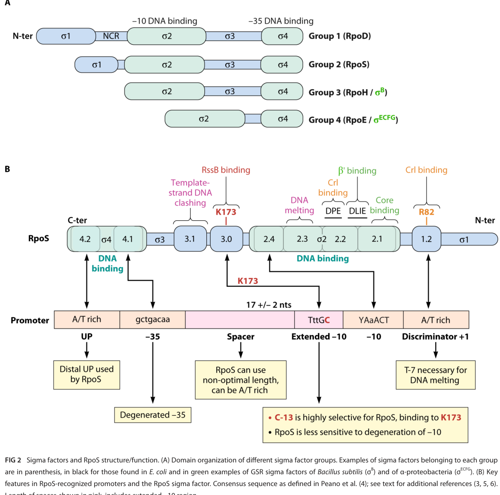

## Question

# Gene Research for Functional Annotation

## ⚠️ CRITICAL: Gene/Protein Identification Context

**BEFORE YOU BEGIN RESEARCH:** You MUST verify you are researching the CORRECT gene/protein. Gene symbols can be ambiguous, especially for less well-characterized genes from non-model organisms.

### Target Gene/Protein Identity (from UniProt):
- **UniProt Accession:** Q88ME8
- **Protein Description:** RecName: Full=RNA polymerase sigma factor RpoS {ECO:0000256|HAMAP-Rule:MF_00959}; AltName: Full=Sigma S {ECO:0000256|HAMAP-Rule:MF_00959}; AltName: Full=Sigma-38 {ECO:0000256|HAMAP-Rule:MF_00959};
- **Gene Information:** Name=rpoS {ECO:0000256|HAMAP-Rule:MF_00959, ECO:0000313|EMBL:AAN67244.1}; OrderedLocusNames=PP_1623 {ECO:0000313|EMBL:AAN67244.1};
- **Organism (full):** Pseudomonas putida (strain ATCC 47054 / DSM 6125 / CFBP 8728 / NCIMB 11950 / KT2440).
- **Protein Family:** Belongs to the sigma-70 factor family. RpoS subfamily.
- **Key Domains:** RNA_pol_sigma-70_dom. (IPR014284); RNA_pol_sigma70. (IPR000943); RNA_pol_sigma70_r1_2. (IPR009042); RNA_pol_sigma70_r2. (IPR007627); RNA_pol_sigma70_r3. (IPR007624)

### MANDATORY VERIFICATION STEPS:

1. **Check if the gene symbol "rpoS" matches the protein description above**
2. **Verify the organism is correct:** Pseudomonas putida (strain ATCC 47054 / DSM 6125 / CFBP 8728 / NCIMB 11950 / KT2440).
3. **Check if protein family/domains align with what you find in literature**
4. **If you find literature for a DIFFERENT gene with the same or similar symbol, STOP**

### If Gene Symbol is Ambiguous or You Cannot Find Relevant Literature:

**DO NOT PROCEED WITH RESEARCH ON A DIFFERENT GENE.** Instead:
- State clearly: "The gene symbol 'rpoS' is ambiguous or literature is limited for this specific protein"
- Explain what you found (e.g., "Found extensive literature on a different gene with the same symbol in a different organism")
- Describe the protein based ONLY on the UniProt information provided above
- Suggest that the protein function can be inferred from domain/family information

### Research Target:

Please provide a comprehensive research report on the gene **rpoS** (gene ID: rpoS, UniProt: Q88ME8) in PSEPK.

The research report should be a detailed narrative explaining the function, biological processes, and localization of the gene product. Citations should be given for all claims.

You should prioritize authoritative reviews and primary scientific literature when conducting research. You can supplement
this with annotations you find in gene/protein databases, but these can be outdated or inaccurate.

We are specifically interested in the primary function of the gene - for enzymes, what reaction is catalyzed, and what is the substrate specificity? For transporters, what is the substrate? For structural proteins or adapters, what is the broader structural role? For signaling molecules, what is the role in the pathway.

We are interested in where in or outside the cell the gene product carries out its function.

We are also interested in the signaling or biochemical pathways in which the gene functions. We are less interested in broad pleiotropic effects, except where these elucidate the precise role.

Include evidence where possible. We are interested in both experimental evidence as well as inference from structure, evolution, or bioinformatic analysis. Precise studies should be prioritized over high-throughput, where available.

## Output

Question: You are an expert researcher providing comprehensive, well-cited information.

Provide detailed information focusing on:
1. Key concepts and definitions with current understanding
2. Recent developments and latest research (prioritize 2023-2024 sources)
3. Current applications and real-world implementations
4. Expert opinions and analysis from authoritative sources
5. Relevant statistics and data from recent studies

Format as a comprehensive research report with proper citations. Include URLs and publication dates where available.
Always prioritize recent, authoritative sources and provide specific citations for all major claims.

# Gene Research for Functional Annotation

## ⚠️ CRITICAL: Gene/Protein Identification Context

**BEFORE YOU BEGIN RESEARCH:** You MUST verify you are researching the CORRECT gene/protein. Gene symbols can be ambiguous, especially for less well-characterized genes from non-model organisms.

### Target Gene/Protein Identity (from UniProt):
- **UniProt Accession:** Q88ME8
- **Protein Description:** RecName: Full=RNA polymerase sigma factor RpoS {ECO:0000256|HAMAP-Rule:MF_00959}; AltName: Full=Sigma S {ECO:0000256|HAMAP-Rule:MF_00959}; AltName: Full=Sigma-38 {ECO:0000256|HAMAP-Rule:MF_00959};
- **Gene Information:** Name=rpoS {ECO:0000256|HAMAP-Rule:MF_00959, ECO:0000313|EMBL:AAN67244.1}; OrderedLocusNames=PP_1623 {ECO:0000313|EMBL:AAN67244.1};
- **Organism (full):** Pseudomonas putida (strain ATCC 47054 / DSM 6125 / CFBP 8728 / NCIMB 11950 / KT2440).
- **Protein Family:** Belongs to the sigma-70 factor family. RpoS subfamily.
- **Key Domains:** RNA_pol_sigma-70_dom. (IPR014284); RNA_pol_sigma70. (IPR000943); RNA_pol_sigma70_r1_2. (IPR009042); RNA_pol_sigma70_r2. (IPR007627); RNA_pol_sigma70_r3. (IPR007624)

### MANDATORY VERIFICATION STEPS:

1. **Check if the gene symbol "rpoS" matches the protein description above**
2. **Verify the organism is correct:** Pseudomonas putida (strain ATCC 47054 / DSM 6125 / CFBP 8728 / NCIMB 11950 / KT2440).
3. **Check if protein family/domains align with what you find in literature**
4. **If you find literature for a DIFFERENT gene with the same or similar symbol, STOP**

### If Gene Symbol is Ambiguous or You Cannot Find Relevant Literature:

**DO NOT PROCEED WITH RESEARCH ON A DIFFERENT GENE.** Instead:
- State clearly: "The gene symbol 'rpoS' is ambiguous or literature is limited for this specific protein"
- Explain what you found (e.g., "Found extensive literature on a different gene with the same symbol in a different organism")
- Describe the protein based ONLY on the UniProt information provided above
- Suggest that the protein function can be inferred from domain/family information

### Research Target:

Please provide a comprehensive research report on the gene **rpoS** (gene ID: rpoS, UniProt: Q88ME8) in PSEPK.

The research report should be a detailed narrative explaining the function, biological processes, and localization of the gene product. Citations should be given for all claims.

You should prioritize authoritative reviews and primary scientific literature when conducting research. You can supplement
this with annotations you find in gene/protein databases, but these can be outdated or inaccurate.

We are specifically interested in the primary function of the gene - for enzymes, what reaction is catalyzed, and what is the substrate specificity? For transporters, what is the substrate? For structural proteins or adapters, what is the broader structural role? For signaling molecules, what is the role in the pathway.

We are interested in where in or outside the cell the gene product carries out its function.

We are also interested in the signaling or biochemical pathways in which the gene functions. We are less interested in broad pleiotropic effects, except where these elucidate the precise role.

Include evidence where possible. We are interested in both experimental evidence as well as inference from structure, evolution, or bioinformatic analysis. Precise studies should be prioritized over high-throughput, where available.

## Research Report: Functional annotation of **rpoS** (PP_1623; UniProt Q88ME8) in *Pseudomonas putida* KT2440

### 0) Target identity verification (critical)
The UniProt entry **Q88ME8** corresponds to **RpoS (sigma S / sigma-38)** in *Pseudomonas putida* strain KT2440 (ordered locus **PP_1623**). Independent KT2440-specific studies explicitly refer to **RpoS** as the “stationary-phase sigma factor” and map it to KT2440 regulatory phenotypes, matching the requested target and avoiding confusion with rpoS homologs in other bacteria. (huertasrosales2021genomewideanalysisof pages 9-11, liu2017influenceof(p)ppgpp pages 11-15)

---

### 1) Key concepts and definitions (current understanding)

#### 1.1 What RpoS is
**RpoS is an alternative sigma factor** (sigma-70 family; “group 2” sigma) that binds the **core RNA polymerase** and redirects transcription to a broad set of promoters that support survival during **stationary phase** and diverse stresses—commonly termed the **general stress response (GSR)** in γ-proteobacteria. (bouillet2024rposandthe pages 1-5)

At the mechanistic level, sigma factors contain domains that recognize promoter elements: σ2 and σ4 interact with the **−10** and **−35** promoter regions; group-1 and group-2 sigma factors also include σ3, which links promoter-recognition functions. This is summarized visually in Bouillet et al. (2024) Figure 2. (bouillet2024rposandthe media f4434c02)

#### 1.2 What RpoS does (primary molecular function)
RpoS does **not** catalyze a biochemical reaction and is **not** a transporter. Its primary function is **sequence-specific transcription initiation control** by:
1) associating with core RNAP, and
2) increasing transcription from a specific class of promoters (often similar to σ70/RpoD promoters), thereby reprogramming gene expression toward stress protection. (bouillet2024rposandthe pages 1-5, bouillet2024rposandthe media f4434c02)

#### 1.3 Sigma competition and the growth–stress tradeoff
A central concept is **sigma competition**: RpoS competes with the housekeeping sigma **RpoD (σ70)** and other alternative sigmas for a limiting pool of core RNAP. Increased RpoS generally increases stress resistance but can reduce growth performance—framed as a “growth vs. survival” (SPANC) tradeoff in the RpoS literature. (bouillet2024rposandthe pages 5-7)

---

### 2) Regulation of RpoS (with KT2440 evidence emphasized)

#### 2.1 Multi-layer regulation is a defining feature of RpoS biology
In the best-characterized paradigm (*E. coli*), RpoS induction during nutrient limitation/stress occurs largely through **activation of rpoS translation** and **inhibition of RpoS proteolysis**, rather than transcription alone. This reflects a multi-input “signal integration” architecture for GSR activation. (bouillet2024rposandthe pages 1-5)

Although these details are best established in *E. coli*, they provide strong conserved context for interpreting pseudomonad RpoS systems because RpoS is broadly conserved across many γ-proteobacteria. (bouillet2024rposandthe pages 1-5)

#### 2.2 KT2440: RsmA directly targets rpoS mRNA (post-transcriptional control)
In *P. putida* KT2440, Huertas-Rosales et al. (2021) provide direct biochemical evidence that **RsmA binds rpoS (PP_1623) mRNA**: binding of RsmA to an RNA fragment containing the **ribosome-binding site and start codon** of rpoS was confirmed by **EMSA**. This supports a model where the Gac/Rsm post-transcriptional network can modulate RpoS levels through translation control. (huertasrosales2021genomewideanalysisof pages 9-11)

#### 2.3 KT2440: stringent response links to rpoS and RpoS-dependent biofilm functions
A KT2440 study of the stringent response showed that deleting (p)ppGpp synthases (relA and relA/spoT) alters biofilm programs and is accompanied by lowered rpoS expression/activity and downstream changes in RpoS-linked outputs (e.g., lapF). The work used **rpoS::lacZ promoter fusions**, alongside lapA/lapF reporters and qRT-PCR, placing RpoS downstream of (p)ppGpp-mediated physiology in KT2440 biofilm regulation. (liu2017influenceof(p)ppgpp pages 26-31, liu2017influenceof(p)ppgpp pages 11-15)

---

### 3) Cellular localization / where the protein functions
RpoS is a **cytosolic** transcription factor (sigma factor) that exerts its function by interacting with **cytosolic RNA polymerase** and promoter DNA. This is consistent with its sigma-factor domain organization and RNAP-binding mechanism. No membrane localization or secretion is implied by the sigma-factor structural model. (bouillet2024rposandthe pages 1-5, bouillet2024rposandthe media f4434c02)

---

### 4) Biological processes and pathways controlled by RpoS in *P. putida* KT2440

#### 4.1 General stress response outputs (conserved categories)
RpoS-dependent regulons typically include genes that increase tolerance to oxidative stress, osmotic stress, temperature and pH extremes, and other stationary-phase threats. Bouillet et al. (2024) summarizes classical protective categories and illustrates that RpoS controls broad stress-protective pathways in γ-proteobacteria. (bouillet2024rposandthe pages 1-5)

#### 4.2 KT2440: biofilm extracellular matrix (ECM) and lifestyle transition
A well-supported KT2440-specific function is RpoS control of **biofilm maturation** via matrix components:

- **LapF adhesin**: lapF transcription is described as dependent on RpoS in KT2440 biofilm literature, and stringent-response perturbations that reduce RpoS activity correlate with strongly reduced lapF reporter output. (liu2017influenceof(p)ppgpp pages 11-15)
- **Pea exopolysaccharide (EPS)**: in stringent-response mutants, pea transcript abundance was reduced **2.3-fold (ΔrelA)** and **5.8-fold (ΔrelAΔspoT; ΔRS)** relative to wild type, with associated changes in colony morphology and pellicle architecture; the authors note Pea’s importance in structured/wrinkly colony traits in KT2440. (liu2017influenceof(p)ppgpp pages 11-15)

This supports an interpretation that RpoS helps drive a stationary-phase biofilm/ECM program in KT2440, coordinating adhesins and EPS production. (liu2017influenceof(p)ppgpp pages 11-15)

#### 4.3 KT2440: c-di-GMP signaling via CfcR, with RpoS embedded in the regulatory circuit
Multiple KT2440 studies connect RpoS to **c-di-GMP-controlled lifestyle shifts** via **CfcR**, a diguanylate cyclase/response regulator important for stationary-phase c-di-GMP levels:

- ArgR study: LapF, Pea, and **CfcR** expression is influenced by ArgR, “likely through the alternative sigma factor RpoS,” linking metabolism to c-di-GMP outputs through RpoS. (barrientosmoreno2022roleofthe pages 1-2)
- Rsm network study: RpoS is described as controlling lapF expression; and cfcR expression is described as regulated by RpoS, supporting indirect Rsm→RpoS→c-di-GMP control. (huertasrosales2021genomewideanalysisof pages 9-11)
- Arginine cue study: authors hypothesize that cellular arginine pools connect central metabolism to c-di-GMP turnover and note changes in expression of “RpoS and elements under its control (lapF, pea, cfcR)” in arginine-biosynthesis mutants. (barrientosmoreno2020arginineasan pages 11-12)

Together, these data define a KT2440-specific pathway-level role: **RpoS integrates nutrient/stress state into multicellular lifestyle output via ECM genes and the c-di-GMP system**. (barrientosmoreno2022roleofthe pages 1-2, huertasrosales2021genomewideanalysisof pages 9-11, barrientosmoreno2020arginineasan pages 11-12)

#### 4.4 Boundaries of the RpoS regulon: stationary-phase induction does not always mean RpoS activation
Bernal et al. (2023) show that the **K1 type VI secretion system (T6SS)** is induced in stationary phase in KT2440, but its transcription is **not dependent** on RpoS and is **indirectly repressed by RpoS**. This cautions against assuming that stationary-phase induction implies direct RpoS positive control and highlights that RpoS can act as an indirect repressor in specific contexts. (bernal2023transcriptionalorganizationand pages 1-2)

---

### 5) Recent developments and latest research (prioritizing 2023–2024)

#### 5.1 2024: updated RpoS regulation frameworks (authoritative synthesis)
Bouillet et al. (MMBR, **March 2024**, https://doi.org/10.1128/mmbr.00151-22) synthesizes “new advances” in how stresses induce RpoS and summarizes approaches used to define RpoS-dependent genes/pathways. Key modern themes relevant for annotation and engineering include: multi-layer control (translation/proteolysis), sigma competition, and heterogeneous regulon outputs. (bouillet2024rposandthe pages 1-5)

The paper’s Figure 2 is a useful up-to-date schematic reference for sigma-factor domain organization and promoter recognition principles that underpin functional inference for Q88ME8. (bouillet2024rposandthe media f4434c02)

#### 5.2 2023: KT2440 regulatory network mapping around plant-protective T6SS
Bernal et al. (*Microbiology*, **Jan 2023**, https://doi.org/10.1099/mic.0.001295) delineates a regulatory network for K1-T6SS, important because KT2440 T6SS contributes to outcompetition of phytopathogens (plant protection). While not RpoS-dependent, the system is **indirectly repressed by RpoS** and regulated by GacS–GacA/RetS, revealing how RpoS intersects with biocontrol-relevant programs. (bernal2023transcriptionalorganizationand pages 1-2)

---

### 6) Current applications and real-world implementations

#### 6.1 Biological control / plant protection
KT2440’s K1-T6SS provides competitive advantage by outcompeting phytopathogens, positioning *P. putida* as a potential biological control agent. The regulatory map (including GacS–GacA activation and RetS repression) provides engineering levers for tuning this behavior; RpoS itself is implicated as an indirect repressor, which could matter for strain optimization depending on desired antimicrobial competitiveness vs stress robustness. (bernal2023transcriptionalorganizationand pages 1-2)

#### 6.2 Industrial biotechnology: stress tolerance vs productivity trade-offs (expert analysis)
A recurring expert conclusion is that increasing RpoS activity can enhance broad stress robustness but may reduce growth on diverse substrates due to sigma competition—implying that industrial strain design must balance RpoS-mediated protection with productivity. Bouillet et al. (2024) emphasizes this growth–survival trade-off and notes that lab evolution often selects for reduced RpoS activity under benign conditions, warning about evolutionary stability of engineered constructs that increase RpoS. (bouillet2024rposandthe pages 5-7)

In KT2440, biofilm/ECM control via RpoS (LapF, Pea) is also operationally relevant because biofilms can be beneficial (immobilized biocatalysis, stress buffering) or detrimental (reactor fouling), so tuning RpoS-linked matrix expression can be a practical lever. (liu2017influenceof(p)ppgpp pages 11-15)

#### 6.3 Stress-engineering strategies in Pseudomonas (broader implementation guidance)
An industrially oriented review of Pseudomonas stress mechanisms emphasizes that upstream pathways (e.g., stringent response, polyphosphate, preconditioning) can be leveraged to improve survival in industrially relevant stresses (drying, temperature shocks, formulation). Quantitative examples include a reported **10-fold** competitiveness reduction for a polyphosphate kinase mutant of *P. fluorescens* in low-phosphate sterile soil, and evidence that osmotic pre-adaptation improved survival across temperature shocks spanning **−15°C to 58°C** in cited Pseudomonas systems. While not KT2440- or RpoS-exclusive, these strategies intersect with sigma-factor-controlled stress programs and inform translational approaches for robust Pseudomonas chassis design. (craig2021leveragingpseudomonasstress pages 11-12)

---

### 7) Relevant statistics and data points from studies (selected)
- **pea EPS transcript change** in KT2440 stringent-response mutants: **2.3-fold decrease** (ΔrelA) and **5.8-fold decrease** (ΔrelAΔspoT/ΔRS) vs wild type (qRT-PCR). (liu2017influenceof(p)ppgpp pages 11-15)
- **Biofilm dynamics** in KT2440 stringent-response mutants: ΔRS showed increased microtiter-plate biofilm by **22 h** and maintained thick biofilm at **34 h**, whereas wild type biofilm strongly reduced by 34 h (dispersion). (liu2017influenceof(p)ppgpp pages 11-15)
- **RsmA enrichment values for cfcR mRNA** in KT2440: fold-enrichment **1.82** and **1.88** (below cut-off) reported in the Rsm target capture analysis, highlighting modest in vivo enrichment in that dataset. (huertasrosales2021genomewideanalysisof pages 9-11)
- **Biofilm assay replication/statistics** in arginine cue study: crystal-violet biofilm after **10 h** reported as **A595 normalized to OD660**, averages/SE from **two independent experiments with four technical replicates**, significance by Student’s *t* test (*p ≤ 0.05; **p ≤ 0.01). (barrientosmoreno2020arginineasan pages 11-12)

---

### 8) Practical functional annotation summary (for Q88ME8 / PP_1623)

**Recommended primary function annotation:**
- *Molecular function:* RNA polymerase sigma factor (alternative sigma), directing transcription initiation at RpoS-dependent promoters by forming an RNAP holoenzyme with core RNAP. (bouillet2024rposandthe pages 1-5, bouillet2024rposandthe media f4434c02)

**Recommended biological process annotations (KT2440-supported):**
- Stationary-phase/general stress response transcriptional program (conserved context). (bouillet2024rposandthe pages 1-5)
- Regulation of biofilm maturation/extracellular matrix gene expression, including LapF and the Pea EPS pathway, downstream of stringent response and post-transcriptional networks. (liu2017influenceof(p)ppgpp pages 11-15)
- Integration of metabolic state (arginine pools; ArgR network) with c-di-GMP signaling outputs involving CfcR and ECM genes, likely via RpoS. (barrientosmoreno2022roleofthe pages 1-2, barrientosmoreno2020arginineasan pages 11-12)

**Cellular component/location:**
- Cytosol / nucleoid-associated transcription machinery (RNAP-associated). (bouillet2024rposandthe pages 1-5, bouillet2024rposandthe media f4434c02)

**Regulatory context (KT2440-supported):**
- Post-transcriptional regulation by Gac/Rsm system via RsmA binding of rpoS mRNA (translational control evidence). (huertasrosales2021genomewideanalysisof pages 9-11)
- Modulation by stringent response ((p)ppGpp), affecting rpoS and RpoS-dependent outputs in biofilm/ECM programs. (liu2017influenceof(p)ppgpp pages 11-15)

**Important caveat (regulon boundaries):**
- Not all stationary-phase induced functions require RpoS; KT2440 K1-T6SS is induced in stationary phase but is not RpoS-dependent and is indirectly repressed by RpoS. (bernal2023transcriptionalorganizationand pages 1-2)

---

### Evidence summary table
The following table compiles the most directly relevant evidence for KT2440 rpoS/PP_1623, with URLs and publication dates.

| Aspect | Key finding | Evidence type | Quantitative/statistical details (if any) | Source (first author year, journal) | URL | Publication date (month year if known) |
|---|---|---|---|---|---|---|
| identity/function | RpoS is the conserved general-stress/stationary-phase alternative sigma factor in many γ-proteobacteria; as a group 2 sigma factor, it binds core RNAP and recognizes promoters similar to RpoD, using σ2/σ3/σ4 domains to engage promoter elements. This supports annotation of PP_1623/Q88ME8 as sigma S rather than an enzyme or transporter. (bouillet2024rposandthe pages 1-5, bouillet2024rposandthe media f4434c02) | Authoritative review; domain/promoter synthesis | Review notes >300 promoters in the *E. coli* RpoS regulon; emphasizes promoter similarity to σ70/RpoD promoters rather than a catalytic reaction. (bouillet2024rposandthe pages 1-5) | Bouillet 2024, *Microbiology and Molecular Biology Reviews* | https://doi.org/10.1128/mmbr.00151-22 | March 2024 |
| regulation/process | In *P. putida* KT2440, RsmA directly binds the untranslated region of **rpoS** mRNA (including the ribosome-binding/start-codon region), supporting post-transcriptional control of RpoS. Through RpoS, the Gac/Rsm cascade connects to **lapF** expression and indirectly to **cfcR**-dependent c-di-GMP signaling. (huertasrosales2021genomewideanalysisof pages 9-11, huertasrosales2021genomewideanalysisof pages 7-9) | EMSA; RNA target capture; regulatory model | EMSA confirmed RsmA–rpoS RNA binding; **cfcR** transcript showed RsmA enrichment values **1.82** and **1.88** (below cut-off), consistent with modest in vivo enrichment despite prior interaction evidence. (huertasrosales2021genomewideanalysisof pages 9-11) | Huertas-Rosales 2021, *Frontiers in Molecular Biosciences* | https://doi.org/10.3389/fmolb.2021.624061 | February 2021 |
| regulation/phenotype | Loss of (p)ppGpp synthesis alters RpoS-linked biofilm regulation in KT2440: ΔrelA and especially ΔrelAΔspoT show reduced **rpoS** promoter activity, increased **lapA**, decreased **lapF**, reduced **pea**, and abnormal pellicle/biofilm architecture. This places RpoS downstream of the stringent response in biofilm control. (liu2017influenceof(p)ppgpp pages 11-15, liu2017influenceof(p)ppgpp pages 15-19, liu2017influenceof(p)ppgpp pages 26-31) | Reporter assays (rpoS::lacZ, lapA::lacZ, lapF::lacZ); qRT-PCR; crystal violet biofilm assay; morphology assays | **pea** reduced **2.3-fold** in ΔrelA and **5.8-fold** in ΔRS; **peb** and **bcs** increased about **2.0-fold** and **2.2-fold** in ΔRS; ΔRS showed noticeably increased microtiter biofilm at **22 h** and maintained thick biofilm at **34 h**, while WT dispersed by 34 h. (liu2017influenceof(p)ppgpp pages 11-15) | Liu 2017, *Microbiological Research* | https://doi.org/10.1016/j.micres.2017.07.003 | November 2017 |
| process/phenotype | ArgR links arginine metabolism to c-di-GMP signaling and likely modulates **LapF**, **Pea**, and the diguanylate cyclase **CfcR** through RpoS in KT2440; argR deletion increases biofilm formation and reduces surface motility. (barrientosmoreno2022roleofthe pages 1-2) | Primary genetics/phenotyping study | The excerpt reports qualitative phenotypes (increased biofilm, reduced surface motility) but no explicit fold-change for RpoS-dependent outputs in the provided text. (barrientosmoreno2022roleofthe pages 1-2) | Barrientos-Moreno 2022, *Applied and Environmental Microbiology* | https://doi.org/10.1128/aem.00064-22 | April 2022 |
| process/application | Arginine acts as an environmental/metabolic cue that raises c-di-GMP in KT2440; the response is associated with altered expression of **RpoS-controlled elements** (**lapF, pea, cfcR**) in arginine-biosynthesis mutants, linking metabolism to RpoS-regulated biofilm output. (barrientosmoreno2020arginineasan pages 11-12) | c-di-GMP biosensor study; biofilm assay; mutant analysis | Biofilm quantified after **10 h** as crystal-violet **A595/OD660**; values were averages from **2 independent experiments** with **4 technical replicates** each; significance by Student’s *t* test (**\*p ≤ 0.05; \*\*p ≤ 0.01**). (barrientosmoreno2020arginineasan pages 11-12) | Barrientos-Moreno 2020, *Scientific Reports* | https://doi.org/10.1038/s41598-020-70675-x | August 2020 |
| process/regulation | Stationary-phase induction in KT2440 does not necessarily imply positive RpoS control: the K1-T6SS is induced in stationary phase, but transcription is **not dependent on RpoS** and is instead **indirectly repressed by RpoS**. This helps define boundaries of the RpoS regulon. (bernal2023transcriptionalorganizationand pages 1-2) | Promoter mapping; mutant regulatory analysis | Four K1-T6SS promoters showed typical **σ70-dependent** features; no fold-change values were given in the provided excerpt for RpoS effects. (bernal2023transcriptionalorganizationand pages 1-2) | Bernal 2023, *Microbiology* | https://doi.org/10.1099/mic.0.001295 | January 2023 |

*Table: This table summarizes the most relevant literature-backed findings for *Pseudomonas putida* KT2440 rpoS (PP_1623), spanning core molecular function, regulation, and organism-specific phenotypes. It highlights where evidence is direct for KT2440 and where recent reviews provide conserved mechanistic context for sigma S.*

References

1. (huertasrosales2021genomewideanalysisof pages 9-11): Óscar Huertas-Rosales, Manuel Romero, Kok-Gan Chan, Kar-Wai Hong, Miguel Cámara, Stephan Heeb, Laura Barrientos-Moreno, María Antonia Molina-Henares, María L. Travieso, María Isabel Ramos-González, and Manuel Espinosa-Urgel. Genome-wide analysis of targets for post-transcriptional regulation by rsm proteins in pseudomonas putida. Frontiers in Molecular Biosciences, Feb 2021. URL: https://doi.org/10.3389/fmolb.2021.624061, doi:10.3389/fmolb.2021.624061. This article has 15 citations.

2. (liu2017influenceof(p)ppgpp pages 11-15): Huizhong Liu, Yujie Xiao, Hailing Nie, Qiaoyun Huang, and Wenli Chen. Influence of (p)ppgpp on biofilm regulation in pseudomonas putida kt2440. Microbiological Research, 204:1-8, Nov 2017. URL: https://doi.org/10.1016/j.micres.2017.07.003, doi:10.1016/j.micres.2017.07.003. This article has 64 citations and is from a peer-reviewed journal.

3. (bouillet2024rposandthe pages 1-5): Sophie Bouillet, Taran S. Bauer, and Susan Gottesman. Rpos and the bacterial general stress response. Microbiology and Molecular Biology Reviews, Mar 2024. URL: https://doi.org/10.1128/mmbr.00151-22, doi:10.1128/mmbr.00151-22. This article has 103 citations and is from a domain leading peer-reviewed journal.

4. (bouillet2024rposandthe media f4434c02): Sophie Bouillet, Taran S. Bauer, and Susan Gottesman. Rpos and the bacterial general stress response. Microbiology and Molecular Biology Reviews, Mar 2024. URL: https://doi.org/10.1128/mmbr.00151-22, doi:10.1128/mmbr.00151-22. This article has 103 citations and is from a domain leading peer-reviewed journal.

5. (bouillet2024rposandthe pages 5-7): Sophie Bouillet, Taran S. Bauer, and Susan Gottesman. Rpos and the bacterial general stress response. Microbiology and Molecular Biology Reviews, Mar 2024. URL: https://doi.org/10.1128/mmbr.00151-22, doi:10.1128/mmbr.00151-22. This article has 103 citations and is from a domain leading peer-reviewed journal.

6. (liu2017influenceof(p)ppgpp pages 26-31): Huizhong Liu, Yujie Xiao, Hailing Nie, Qiaoyun Huang, and Wenli Chen. Influence of (p)ppgpp on biofilm regulation in pseudomonas putida kt2440. Microbiological Research, 204:1-8, Nov 2017. URL: https://doi.org/10.1016/j.micres.2017.07.003, doi:10.1016/j.micres.2017.07.003. This article has 64 citations and is from a peer-reviewed journal.

7. (barrientosmoreno2022roleofthe pages 1-2): Laura Barrientos-Moreno, María Antonia Molina-Henares, María Isabel Ramos-González, and Manuel Espinosa-Urgel. Role of the transcriptional regulator argr in the connection between arginine metabolism and c-di-gmp signaling in pseudomonas putida. Apr 2022. URL: https://doi.org/10.1128/aem.00064-22, doi:10.1128/aem.00064-22. This article has 27 citations and is from a peer-reviewed journal.

8. (barrientosmoreno2020arginineasan pages 11-12): Laura Barrientos-Moreno, María Antonia Molina-Henares, María Isabel Ramos-González, and Manuel Espinosa-Urgel. Arginine as an environmental and metabolic cue for cyclic diguanylate signalling and biofilm formation in pseudomonas putida. Scientific Reports, Aug 2020. URL: https://doi.org/10.1038/s41598-020-70675-x, doi:10.1038/s41598-020-70675-x. This article has 51 citations and is from a peer-reviewed journal.

9. (bernal2023transcriptionalorganizationand pages 1-2): Patricia Bernal, Cristina Civantos, Daniel Pacheco-Sánchez, José M. Quesada, Alain Filloux, and María A. Llamas. Transcriptional organization and regulation of the pseudomonas putida k1 type vi secretion system gene cluster. Jan 2023. URL: https://doi.org/10.1099/mic.0.001295, doi:10.1099/mic.0.001295. This article has 15 citations and is from a peer-reviewed journal.

10. (craig2021leveragingpseudomonasstress pages 11-12): Kelly Craig, Brant R. Johnson, and Amy Grunden. Leveraging pseudomonas stress response mechanisms for industrial applications. Frontiers in Microbiology, May 2021. URL: https://doi.org/10.3389/fmicb.2021.660134, doi:10.3389/fmicb.2021.660134. This article has 67 citations and is from a peer-reviewed journal.

11. (huertasrosales2021genomewideanalysisof pages 7-9): Óscar Huertas-Rosales, Manuel Romero, Kok-Gan Chan, Kar-Wai Hong, Miguel Cámara, Stephan Heeb, Laura Barrientos-Moreno, María Antonia Molina-Henares, María L. Travieso, María Isabel Ramos-González, and Manuel Espinosa-Urgel. Genome-wide analysis of targets for post-transcriptional regulation by rsm proteins in pseudomonas putida. Frontiers in Molecular Biosciences, Feb 2021. URL: https://doi.org/10.3389/fmolb.2021.624061, doi:10.3389/fmolb.2021.624061. This article has 15 citations.

12. (liu2017influenceof(p)ppgpp pages 15-19): Huizhong Liu, Yujie Xiao, Hailing Nie, Qiaoyun Huang, and Wenli Chen. Influence of (p)ppgpp on biofilm regulation in pseudomonas putida kt2440. Microbiological Research, 204:1-8, Nov 2017. URL: https://doi.org/10.1016/j.micres.2017.07.003, doi:10.1016/j.micres.2017.07.003. This article has 64 citations and is from a peer-reviewed journal.

## Artifacts

- [Edison artifact artifact-00](rpoS-deep-research-falcon_artifacts/artifact-00.md)

## Citations

1. bouillet2024rposandthe pages 1-5
2. bouillet2024rposandthe pages 5-7
3. huertasrosales2021genomewideanalysisof pages 9-11
4. barrientosmoreno2022roleofthe pages 1-2
5. barrientosmoreno2020arginineasan pages 11-12
6. bernal2023transcriptionalorganizationand pages 1-2
7. craig2021leveragingpseudomonasstress pages 11-12
8. huertasrosales2021genomewideanalysisof pages 7-9
9. https://doi.org/10.1128/mmbr.00151-22
10. https://doi.org/10.1099/mic.0.001295
11. https://doi.org/10.3389/fmolb.2021.624061
12. https://doi.org/10.1016/j.micres.2017.07.003
13. https://doi.org/10.1128/aem.00064-22
14. https://doi.org/10.1038/s41598-020-70675-x
15. https://doi.org/10.3389/fmolb.2021.624061,
16. https://doi.org/10.1016/j.micres.2017.07.003,
17. https://doi.org/10.1128/mmbr.00151-22,
18. https://doi.org/10.1128/aem.00064-22,
19. https://doi.org/10.1038/s41598-020-70675-x,
20. https://doi.org/10.1099/mic.0.001295,
21. https://doi.org/10.3389/fmicb.2021.660134,