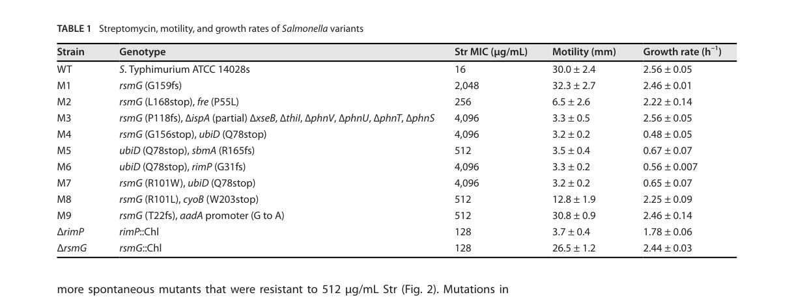

## Question

# Gene Research for Functional Annotation

## ⚠️ CRITICAL: Gene/Protein Identification Context

**BEFORE YOU BEGIN RESEARCH:** You MUST verify you are researching the CORRECT gene/protein. Gene symbols can be ambiguous, especially for less well-characterized genes from non-model organisms.

### Target Gene/Protein Identity (from UniProt):
- **UniProt Accession:** P0A124
- **Protein Description:** RecName: Full=Ribosomal RNA small subunit methyltransferase G {ECO:0000255|HAMAP-Rule:MF_00074}; EC=2.1.1.170 {ECO:0000255|HAMAP-Rule:MF_00074}; AltName: Full=16S rRNA 7-methylguanosine methyltransferase {ECO:0000255|HAMAP-Rule:MF_00074}; Short=16S rRNA m7G methyltransferase {ECO:0000255|HAMAP-Rule:MF_00074};
- **Gene Information:** Name=rsmG {ECO:0000255|HAMAP-Rule:MF_00074}; OrderedLocusNames=PP_0003;
- **Organism (full):** Pseudomonas putida (strain ATCC 47054 / DSM 6125 / CFBP 8728 / NCIMB 11950 / KT2440).
- **Protein Family:** Belongs to the methyltransferase superfamily. RNA
- **Key Domains:** rRNA_ssu_MeTfrase_G. (IPR003682); SAM-dependent_MTases_sf. (IPR029063); GidB (PF02527)

### MANDATORY VERIFICATION STEPS:

1. **Check if the gene symbol "rsmG" matches the protein description above**
2. **Verify the organism is correct:** Pseudomonas putida (strain ATCC 47054 / DSM 6125 / CFBP 8728 / NCIMB 11950 / KT2440).
3. **Check if protein family/domains align with what you find in literature**
4. **If you find literature for a DIFFERENT gene with the same or similar symbol, STOP**

### If Gene Symbol is Ambiguous or You Cannot Find Relevant Literature:

**DO NOT PROCEED WITH RESEARCH ON A DIFFERENT GENE.** Instead:
- State clearly: "The gene symbol 'rsmG' is ambiguous or literature is limited for this specific protein"
- Explain what you found (e.g., "Found extensive literature on a different gene with the same symbol in a different organism")
- Describe the protein based ONLY on the UniProt information provided above
- Suggest that the protein function can be inferred from domain/family information

### Research Target:

Please provide a comprehensive research report on the gene **rsmG** (gene ID: rsmG, UniProt: P0A124) in PSEPK.

The research report should be a detailed narrative explaining the function, biological processes, and localization of the gene product. Citations should be given for all claims.

You should prioritize authoritative reviews and primary scientific literature when conducting research. You can supplement
this with annotations you find in gene/protein databases, but these can be outdated or inaccurate.

We are specifically interested in the primary function of the gene - for enzymes, what reaction is catalyzed, and what is the substrate specificity? For transporters, what is the substrate? For structural proteins or adapters, what is the broader structural role? For signaling molecules, what is the role in the pathway.

We are interested in where in or outside the cell the gene product carries out its function.

We are also interested in the signaling or biochemical pathways in which the gene functions. We are less interested in broad pleiotropic effects, except where these elucidate the precise role.

Include evidence where possible. We are interested in both experimental evidence as well as inference from structure, evolution, or bioinformatic analysis. Precise studies should be prioritized over high-throughput, where available.

## Output

Question: You are an expert researcher providing comprehensive, well-cited information.

Provide detailed information focusing on:
1. Key concepts and definitions with current understanding
2. Recent developments and latest research (prioritize 2023-2024 sources)
3. Current applications and real-world implementations
4. Expert opinions and analysis from authoritative sources
5. Relevant statistics and data from recent studies

Format as a comprehensive research report with proper citations. Include URLs and publication dates where available.
Always prioritize recent, authoritative sources and provide specific citations for all major claims.

# Gene Research for Functional Annotation

## ⚠️ CRITICAL: Gene/Protein Identification Context

**BEFORE YOU BEGIN RESEARCH:** You MUST verify you are researching the CORRECT gene/protein. Gene symbols can be ambiguous, especially for less well-characterized genes from non-model organisms.

### Target Gene/Protein Identity (from UniProt):
- **UniProt Accession:** P0A124
- **Protein Description:** RecName: Full=Ribosomal RNA small subunit methyltransferase G {ECO:0000255|HAMAP-Rule:MF_00074}; EC=2.1.1.170 {ECO:0000255|HAMAP-Rule:MF_00074}; AltName: Full=16S rRNA 7-methylguanosine methyltransferase {ECO:0000255|HAMAP-Rule:MF_00074}; Short=16S rRNA m7G methyltransferase {ECO:0000255|HAMAP-Rule:MF_00074};
- **Gene Information:** Name=rsmG {ECO:0000255|HAMAP-Rule:MF_00074}; OrderedLocusNames=PP_0003;
- **Organism (full):** Pseudomonas putida (strain ATCC 47054 / DSM 6125 / CFBP 8728 / NCIMB 11950 / KT2440).
- **Protein Family:** Belongs to the methyltransferase superfamily. RNA
- **Key Domains:** rRNA_ssu_MeTfrase_G. (IPR003682); SAM-dependent_MTases_sf. (IPR029063); GidB (PF02527)

### MANDATORY VERIFICATION STEPS:

1. **Check if the gene symbol "rsmG" matches the protein description above**
2. **Verify the organism is correct:** Pseudomonas putida (strain ATCC 47054 / DSM 6125 / CFBP 8728 / NCIMB 11950 / KT2440).
3. **Check if protein family/domains align with what you find in literature**
4. **If you find literature for a DIFFERENT gene with the same or similar symbol, STOP**

### If Gene Symbol is Ambiguous or You Cannot Find Relevant Literature:

**DO NOT PROCEED WITH RESEARCH ON A DIFFERENT GENE.** Instead:
- State clearly: "The gene symbol 'rsmG' is ambiguous or literature is limited for this specific protein"
- Explain what you found (e.g., "Found extensive literature on a different gene with the same symbol in a different organism")
- Describe the protein based ONLY on the UniProt information provided above
- Suggest that the protein function can be inferred from domain/family information

### Research Target:

Please provide a comprehensive research report on the gene **rsmG** (gene ID: rsmG, UniProt: P0A124) in PSEPK.

The research report should be a detailed narrative explaining the function, biological processes, and localization of the gene product. Citations should be given for all claims.

You should prioritize authoritative reviews and primary scientific literature when conducting research. You can supplement
this with annotations you find in gene/protein databases, but these can be outdated or inaccurate.

We are specifically interested in the primary function of the gene - for enzymes, what reaction is catalyzed, and what is the substrate specificity? For transporters, what is the substrate? For structural proteins or adapters, what is the broader structural role? For signaling molecules, what is the role in the pathway.

We are interested in where in or outside the cell the gene product carries out its function.

We are also interested in the signaling or biochemical pathways in which the gene functions. We are less interested in broad pleiotropic effects, except where these elucidate the precise role.

Include evidence where possible. We are interested in both experimental evidence as well as inference from structure, evolution, or bioinformatic analysis. Precise studies should be prioritized over high-throughput, where available.

## Research report: **rsmG (UniProt P0A124; locus PP_0003) in *Pseudomonas putida* KT2440**

### Executive summary
The *Pseudomonas putida* KT2440 gene **rsmG** (UniProt **P0A124**) encodes a conserved **S-adenosyl-L-methionine (SAM/AdoMet)-dependent 16S rRNA guanine-N7 methyltransferase** (also known as **GidB**) that installs the **m7G modification** at the conserved guanosine **G527 (E. coli numbering)** in the **530 loop/helix 18** region of **16S rRNA**, near the decoding center. This modification is widely conserved and is implicated in tuning translation fidelity and aminoglycoside (especially streptomycin) susceptibility. For *P. putida* specifically, direct primary experimental studies of PP_0003/P0A124 were not retrieved in the current evidence set; therefore, functional assignment is **high-confidence homology-based inference** supported by conserved enzyme family behavior and mechanistic studies in multiple bacterial models. (garinmurguialdayUnknownyearmanuscritov pages 224-226, benitezpaez2012regulationofexpression pages 1-2, nishimura2007identificationofthe pages 2-3)

| Claim/Concept | Evidence summary | Species/model | Source (with URL + year) | Notes/limits |
|---|---|---|---|---|
| Verified identity of **rsmG/GidB** | rsmG (also called gidB) is a **16S rRNA m7G methyltransferase**; annotation in retrieved evidence lists **EC 2.1.1.170** and describes the product as a **(guanine(527)-N7)-methyltransferase** acting on 16S rRNA, with cytosolic localization. This matches the UniProt target description for P0A124 and supports assignment to the conserved **GidB/RsmG RNA methyltransferase family**. (garinmurguialdayUnknownyearmanuscritov pages 224-226) | General bacterial annotation; target is *Pseudomonas putida* KT2440 by UniProt context | Garín-Murguialday & Márquez-Urbano, “Manuscrito V” (unknown year/journal; URL unavailable in retrieved text); annotation excerpt via retrieved context. (garinmurguialdayUnknownyearmanuscritov pages 224-226) | Direct experimental evidence for **P. putida KT2440 PP_0003/P0A124** was not retrieved; identity is supported mainly by UniProt-supplied naming/domain context plus cross-species conservation. |
| Biochemical reaction and modified site | Retrieved papers describe RsmG/GidB as methylating **G527 of 16S rRNA** in **E. coli numbering**, producing an **m7G** modification near the decoding center; additional cited text places the modified guanosine in the **16S rRNA 530 loop** (e.g., G518 in *M. tuberculosis* numbering). (lyu2024inactivationofthe pages 1-3, lyu2024deficiencyinribosome pages 1-4, lyu2024inactivationofthe pages 11-12) | *Salmonella enterica*, *E. coli* numbering convention, *Mycobacterium tuberculosis* numbering convention | Lyu et al., *Antimicrob. Agents Chemother.* 2024, https://doi.org/10.1128/aac.00002-24 ; Lyu et al., *bioRxiv* 2024, https://doi.org/10.1101/2024.01.08.574728 (lyu2024inactivationofthe pages 1-3, lyu2024deficiencyinribosome pages 1-4, lyu2024inactivationofthe pages 11-12) | Exact nucleotide numbering can vary by species; the conserved concept is methylation of the homologous guanosine in the **530 loop/decoding-center region**. |
| Antibiotic-resistance phenotype | Loss or mutation of rsmG is repeatedly linked to **streptomycin resistance**. In the Salmonella study, deleting rsmG increased streptomycin MIC from **16 to 128 µg/mL** (**8-fold**), and multiple evolved lineages carried rsmG frameshift/stop mutations with still higher MICs. (lyu2024inactivationofthe pages 1-3, lyu2024deficiencyinribosome pages 1-4, lyu2024deficiencyinribosome pages 13-22, lyu2024inactivationofthe media 16fe0a24) | *Salmonella enterica* experimental evolution and gene deletion | Lyu et al., *Antimicrob. Agents Chemother.* 2024, https://doi.org/10.1128/aac.00002-24 ; figure/table context showing MIC values. (lyu2024inactivationofthe pages 1-3, lyu2024inactivationofthe media 16fe0a24) | These are not **P. putida** measurements; they show a conserved phenotype associated with rsmG loss in other bacteria. |
| Translational fidelity phenotype | Retrieved evidence states that rsmG deletion/mutation can **increase ribosomal fidelity** (reduced stop-codon readthrough / reduced mistranslation), and this has been reported in *Salmonella*, *E. coli*, and *M. tuberculosis*. (lyu2024deficiencyinribosome pages 4-7, lyu2024inactivationofthe pages 3-6, lyu2024inactivationofthe pages 11-12) | *Salmonella*, *E. coli*, *M. tuberculosis* | Lyu et al., *bioRxiv* 2024, https://doi.org/10.1101/2024.01.08.574728 ; Lyu et al., *Antimicrob. Agents Chemother.* 2024, https://doi.org/10.1128/aac.00002-24 (lyu2024deficiencyinribosome pages 4-7, lyu2024inactivationofthe pages 3-6, lyu2024inactivationofthe pages 11-12) | Mechanistic interpretation is cross-species; direct translational-fidelity assays were not retrieved for *P. putida* KT2440. |
| Species contexts and relevance to *P. putida* KT2440 | Evidence directly retrieved is strongest for **Salmonella** and cites prior work in **E. coli** and **M. tuberculosis**. For **Pseudomonas putida KT2440**, relevance is presently **inference only**: the UniProt target P0A124/PP_0003 has the same rsmG naming, reaction annotation, and conserved family/domain assignment, supporting functional transfer of annotation to a cytosolic small-subunit rRNA methyltransferase. (garinmurguialdayUnknownyearmanuscritov pages 224-226, lyu2024inactivationofthe pages 1-3, lyu2024inactivationofthe pages 11-12) | *P. putida* KT2440 inferred from homology/annotation; comparator species with experiments: *Salmonella*, *E. coli*, *M. tuberculosis* | Annotation excerpt via retrieved context; Lyu et al. 2024 peer-reviewed and preprint articles: https://doi.org/10.1128/aac.00002-24 ; https://doi.org/10.1101/2024.01.08.574728 (garinmurguialdayUnknownyearmanuscritov pages 224-226, lyu2024inactivationofthe pages 1-3, lyu2024inactivationofthe pages 11-12) | No organism-specific primary paper for *P. putida* KT2440 rsmG was retrieved in the current evidence set, so conclusions for the target organism should be presented as **high-confidence homology-based inference**, not direct experimental proof. |

*Table: This table consolidates the verified identity, biochemical role, and major phenotypes associated with rsmG/GidB, while distinguishing direct experimental evidence from cross-species inference for *Pseudomonas putida* KT2440.*

---

## 1) Key concepts and definitions (current understanding)

### 1.1 What is RsmG/GidB?
**RsmG** (historically also referred to as **GidB** in many bacteria) is a **Rossmann-like SAM-dependent methyltransferase** that modifies bacterial small-subunit rRNA by methylating a **single guanine** in 16S rRNA to form **7-methylguanosine (m7G)**. Mechanistic and mapping studies show the relevant modification is **m7G527** (E. coli numbering), located in the **universally conserved 530 loop** of 16S rRNA. (benitezpaez2012regulationofexpression pages 1-2, nishimura2007identificationofthe pages 1-2)

### 1.2 Enzymatic reaction and substrate specificity
**Reaction (biochemical definition):** transfer of a methyl group from **SAM/AdoMet** to the **N7 atom of guanine** at the conserved position in **16S rRNA** (G527 in E. coli numbering), yielding **m7G** and S-adenosyl-homocysteine (SAH/AdoHcy). SAM dependence and the identity of the modified nucleotide are directly supported by biochemical mapping and structural/cofactor-bound studies. (gregory2009structuralandfunctional pages 1-2, benitezpaez2012regulationofexpression pages 1-2, nishimura2007identificationofthe pages 1-2)

**Site specificity:** In *Bacillus subtilis*, the homologous target was experimentally mapped as **G535**, corresponding to **E. coli G527**, using chemical cleavage/primer-extension methods and nucleoside analysis; rsmG mutants lacked the m7G modification. (nishimura2007identificationofthe pages 2-3, nishimura2007identificationofthe pages 1-2)

### 1.3 Where in the cell and when does RsmG act?
RsmG is a **cytosolic** enzyme acting on ribosomal RNA (in bacteria, ribosome biogenesis is cytosolic). An rsmG annotation excerpt explicitly places the protein in the **cytosol**. (garinmurguialdayUnknownyearmanuscritov pages 224-226)

Mechanistically, multiple lines of evidence indicate that the physiological substrate is likely **nascent 16S rRNA or an early small-subunit assembly intermediate** rather than a fully mature 30S particle, and substrate preferences can vary across species. In *Thermus thermophilus*, maximal in vitro activity was observed on **deproteinized 16S rRNA**, consistent with acting during early assembly; the authors propose the biological substrate is an early assembly intermediate. (gregory2009structuralandfunctional pages 1-2, gregory2009structuralandfunctional pages 7-8)

Consistent with a ribosome biogenesis role, RsmG binds **premature small-subunit rRNA** with higher affinity than mature rRNA (reported as ~15× higher affinity for immature rRNA with full leader sequence than for mature 16S rRNA), suggesting RsmG can function as a biogenesis-associated factor while still catalyzing methyl transfer. (abedeera2020rsmgformsstable pages 2-3)

### 1.4 Biological role: decoding center chemistry, translational fidelity, and antibiotic binding
The m7G modification at the 530 loop is in the **decoding region** near the streptomycin binding site; loss of the modification is repeatedly associated with **low-level streptomycin resistance** and altered translation fidelity in multiple bacteria. (benitezpaez2012regulationofexpression pages 1-2, nishimura2007identificationofthe pages 1-2)

---

## 2) Recent developments and latest research (prioritizing 2023–2024)

### 2.1 2024: experimental evolution highlights rsmG as a recurrent target in streptomycin adaptation
A 2024 peer-reviewed study evolved *Salmonella Typhimurium* in streptomycin and found **rsmG mutated in 7 of 9 independent evolved lineages**, indicating rsmG is a common path to increased streptomycin tolerance during adaptive evolution. (lyu2024inactivationofthe pages 1-3)

**Quantitative resistance data (2024):**
* Wild-type streptomycin MIC: **16 µg/mL**.
* Constructed **ΔrsmG** mutant MIC: **128 µg/mL** (**8-fold increase**).
* Individual evolved isolates carrying rsmG lesions showed MICs up to **2,048–4,096 µg/mL**. (lyu2024inactivationofthe pages 1-3, lyu2024inactivationofthe pages 3-6)

The corresponding MIC table is captured as a cropped figure and supports these quantitative claims. (lyu2024inactivationofthe media 16fe0a24)

### 2.2 2024: mechanistic model linking rsmG loss to reduced mistranslation and reduced aminoglycoside uptake/damage
A 2024 preprint and its peer-reviewed counterpart frame rsmG within a broader mechanistic model in which perturbations to ribosome biogenesis and decoding-center chemistry (including loss of **m7G527**) reduce aminoglycoside-induced mistranslation and downstream membrane damage/leakiness, thereby **reducing intracellular antibiotic accumulation** and increasing apparent resistance. (lyu2024deficiencyinribosome pages 4-7, lyu2024inactivationofthe pages 3-6, lyu2024deficiencyinribosome pages 1-4)

Notably, rsmG loss in Salmonella is associated with **improved ribosomal fidelity** (decreased UGA stop-codon readthrough), consistent with earlier cross-species observations linking rsmG/GidB to translational accuracy. (lyu2024inactivationofthe pages 3-6, lyu2024deficiencyinribosome pages 4-7)

### 2.3 2023–2024 in *P. putida* KT2440
A 2023 *mBio* study on recursive genome engineering in *P. putida* KT2440 was retrieved but does not directly address rsmG; it nevertheless underscores KT2440’s ongoing use as a model chassis for high-resolution genotype–phenotype dissection. (lyu2024inactivationofthe pages 10-11)

---

## 3) Current applications and real-world implementations

### 3.1 Clinical microbiology / surveillance: rsmG as a marker of low-level streptomycin resistance
A dedicated review on “the rsmG case” frames rsmG/GidB loss-of-function as a **point-mutation-dependent strategy for aminoglycoside (streptomycin) resistance**, and discusses the use of rsmG mutation “hot spots” as **genetic traits for screening** resistant isolates. This motivates rsmG as part of **molecular diagnostic panels** for explaining low-level streptomycin resistance (often alongside rpsL/rrs loci). (benitezpaez2014impairingmethylationsat pages 1-2, benitezpaez2014impairingmethylationsat pages 6-7)

### 3.2 Biotechnology: “ribosome engineering” and antibiotic overproduction
A widely cited primary study in *Streptomyces coelicolor* (an industrially relevant antibiotic producer) demonstrates a direct implementation: **rsmG mutations** cause **low-level streptomycin resistance** and are associated with **overproduction of actinorhodin**; complementation with wild-type rsmG reverses these phenotypes. This connects rsmG to practical strain improvement strategies. (nishimura2007mutationsinrsmg pages 1-2, nishimura2007mutationsinrsmg pages 6-7)

This same work reports that spontaneous rsmG mutations occurred at approximately **~1,000-fold higher frequency** than rpsL mutations in their system, underscoring rsmG as a high-accessibility evolutionary/engineering knob. (nishimura2007mutationsinrsmg pages 1-2)

---

## 4) Expert opinions and analysis from authoritative sources

### 4.1 RsmG as a conserved decoding-center rRNA modifier with resistance implications
Multiple mechanistic studies and a focused review converge on an interpretation that **impairing m7G527 formation** can yield **low-level streptomycin resistance** by altering local decoding-center/530-loop chemistry and streptomycin interactions. (benitezpaez2012regulationofexpression pages 1-2, benitezpaez2014impairingmethylationsat pages 1-2)

### 4.2 Stepwise evolution: rsmG as an “enabler” of high-level resistance
Both primary literature and review-level synthesis argue that rsmG loss-of-function can increase the likelihood of acquiring high-level streptomycin resistance mutations (e.g., in rpsL). For example, in *B. subtilis* rsmG mutants, emergence of high-level rpsL mutants was reported to increase by **~200-fold**. (nishimura2007identificationofthe pages 1-2)

In a review-level analysis, ΔrsmG backgrounds were reported to show a **42-fold higher** emergence of high-level streptomycin resistance compared with wild type (species contexts discussed include *E. coli* and *M. tuberculosis*). (benitezpaez2014impairingmethylationsat pages 6-7)

---

## 5) Relevant statistics and data (recent studies emphasized)

### 5.1 Streptomycin MIC changes and mutation frequencies (2024)
In experimental evolution of *Salmonella Typhimurium* in streptomycin:
* **All nine** parallel lineages reached growth at **128 µg/mL** after three rounds (WT MIC **16 µg/mL**). (lyu2024inactivationofthe pages 1-3)
* **rsmG mutated in 7/9** evolved lineages. (lyu2024inactivationofthe pages 1-3)
* **ΔrsmG MIC 128 µg/mL** (8× WT). (lyu2024inactivationofthe pages 1-3, lyu2024inactivationofthe media 16fe0a24)
* Evolved rsmG mutants reached **2,048–4,096 µg/mL** MIC in examples reported. (lyu2024inactivationofthe pages 3-6, lyu2024inactivationofthe media 16fe0a24)

### 5.2 Quantitative biogenesis/biochemistry context
* RsmG binds premature 16S rRNA more strongly than mature 16S rRNA (reported as **~15× higher affinity** for premature leader-containing rRNA). (abedeera2020rsmgformsstable pages 2-3)
* In *E. coli*, the measured AdoMet (SAM) affinity for RsmG was reported as **Kd ≈ 0.39 mM**, supporting a defined cofactor interaction measurable in vitro. (benitezpaez2012regulationofexpression pages 7-8)

### 5.3 Translation fidelity effects
Deletion of rsmG is associated with increased translational fidelity (e.g., decreased stop-codon readthrough) in the 2024 Salmonella work, supporting a mechanistic link between 530-loop chemistry and decoding accuracy. (lyu2024inactivationofthe pages 3-6, lyu2024deficiencyinribosome pages 4-7)

---

## Functional annotation for *Pseudomonas putida* KT2440 rsmG (P0A124): integrated interpretation

### Molecular function (high-confidence inference)
Given the conserved enzymology and the UniProt-provided protein identity, PP_0003/P0A124 in *P. putida* KT2440 is best annotated as:
* **16S rRNA (guanine(527)-N7) methyltransferase** (SAM-dependent), catalyzing formation of **m7G** at the conserved 16S rRNA site in the **530 loop**. (benitezpaez2012regulationofexpression pages 1-2, nishimura2007identificationofthe pages 1-2)

### Biological process
* **Ribosome biogenesis / maturation of the 30S small subunit** and **fine-tuning of translational decoding** via rRNA chemical modification; likely acts on **immature small-subunit rRNA/early assembly intermediates**. (gregory2009structuralandfunctional pages 1-2, abedeera2020rsmgformsstable pages 2-3)

### Subcellular localization
* **Cytosol**, consistent with bacterial rRNA processing and ribosome assembly location and explicit annotation excerpt. (garinmurguialdayUnknownyearmanuscritov pages 224-226)

### Phenotypic consequences expected in *P. putida* (inference; not directly measured here)
Based on multiple bacterial models, *P. putida* rsmG loss-of-function would be expected to:
* remove/attenuate **m7G527**
* produce **low-level streptomycin resistance**, potentially facilitating stepwise evolution to higher-level resistance under selection
* alter translational fidelity phenotypes (direction can be species/context dependent, but increased fidelity has been observed in Salmonella upon rsmG deletion). (benitezpaez2012regulationofexpression pages 1-2, lyu2024inactivationofthe pages 1-3, lyu2024inactivationofthe pages 3-6)

---

## Evidence limitations and scope note
No KT2440/PP_0003/P0A124-specific primary experimental paper was retrieved in the current tool-assisted corpus; thus, organism-specific phenotypes for *P. putida* KT2440 are **not claimed as direct evidence** here. The functional annotation is grounded in (i) explicit mechanistic definition of the RsmG reaction across bacteria and (ii) strong conservation of the enzyme family and target site. (benitezpaez2012regulationofexpression pages 1-2, nishimura2007identificationofthe pages 1-2)

---

## Key sources (with publication dates and URLs)
* Lyu Z, Ling Y, van Hoof A, Ling J. **Inactivation of the ribosome assembly factor RimP causes streptomycin resistance and impairs motility in Salmonella.** *Antimicrobial Agents and Chemotherapy* (Apr 2024). https://doi.org/10.1128/aac.00002-24 (lyu2024inactivationofthe pages 1-3)
* Lyu Z, Ling Y, van Hoof A, Ling J. **Deficiency in ribosome biogenesis causes streptomycin resistance and impairs motility in Salmonella.** *bioRxiv* (Jan 2024). https://doi.org/10.1101/2024.01.08.574728 (lyu2024deficiencyinribosome pages 1-4)
* Benítez-Páez A, Villarroya M, Armengod M-E. **Regulation of expression and catalytic activity of *E. coli* RsmG methyltransferase.** *RNA* (Apr 2012). https://doi.org/10.1261/rna.029868.111 (benitezpaez2012regulationofexpression pages 1-2)
* Gregory ST et al. **Structural and functional studies of the *Thermus thermophilus* 16S rRNA methyltransferase RsmG.** *RNA* (Jul 2009). https://doi.org/10.1261/rna.1652709 (gregory2009structuralandfunctional pages 1-2)
* Nishimura K et al. **Identification of the RsmG methyltransferase target as 16S rRNA nucleotide G527 and characterization of *B. subtilis rsmG* mutants.** *Journal of Bacteriology* (Aug 2007). https://doi.org/10.1128/jb.00558-07 (nishimura2007identificationofthe pages 1-2)
* Benítez-Páez A et al. **Impairing methylations at ribosome RNA…: The rsmG case.** *Biomedica* (Aug 2014). https://doi.org/10.7705/biomedica.v34i0.1702 (benitezpaez2014impairingmethylationsat pages 1-2)
* Nishimura K et al. **Mutations in rsmG… result in low-level streptomycin resistance and antibiotic overproduction in *Streptomyces coelicolor*.** *Journal of Bacteriology* (May 2007). https://doi.org/10.1128/jb.01776-06 (nishimura2007mutationsinrsmg pages 1-2)

References

1. (garinmurguialdayUnknownyearmanuscritov pages 224-226): N Garín-Murguialday and F Márquez-Urbano. Manuscrito v. Unknown journal, Unknown year.

2. (benitezpaez2012regulationofexpression pages 1-2): Alfonso Benítez-Páez, Magda Villarroya, and M.-Eugenia Armengod. Regulation of expression and catalytic activity of escherichia coli rsmg methyltransferase. RNA, 18 4:795-806, Apr 2012. URL: https://doi.org/10.1261/rna.029868.111, doi:10.1261/rna.029868.111. This article has 27 citations and is from a domain leading peer-reviewed journal.

3. (nishimura2007identificationofthe pages 2-3): Kenji Nishimura, Shanna K. Johansen, Takashi Inaoka, Takeshi Hosaka, Shinji Tokuyama, Yasutaka Tahara, Susumu Okamoto, Fujio Kawamura, Stephen Douthwaite, and Kozo Ochi. Identification of the rsmg methyltransferase target as 16s rrna nucleotide g527 and characterization of <i>bacillus subtilis rsmg</i> mutants. Journal of Bacteriology, 189:6068-6073, Aug 2007. URL: https://doi.org/10.1128/jb.00558-07, doi:10.1128/jb.00558-07. This article has 72 citations and is from a peer-reviewed journal.

4. (lyu2024inactivationofthe pages 1-3): Zhihui Lyu, Yunyi Ling, Ambro van Hoof, and Jiqiang Ling. Inactivation of the ribosome assembly factor rimp causes streptomycin resistance and impairs motility in salmonella. Antimicrobial Agents and Chemotherapy, Apr 2024. URL: https://doi.org/10.1128/aac.00002-24, doi:10.1128/aac.00002-24. This article has 5 citations and is from a highest quality peer-reviewed journal.

5. (lyu2024deficiencyinribosome pages 1-4): Zhihui Lyu, Yunyi Ling, Ambro van Hoof, and Jiqiang Ling. Deficiency in ribosome biogenesis causes streptomycin resistance and impairs motility in salmonella. bioRxiv, Jan 2024. URL: https://doi.org/10.1101/2024.01.08.574728, doi:10.1101/2024.01.08.574728. This article has 0 citations.

6. (lyu2024inactivationofthe pages 11-12): Zhihui Lyu, Yunyi Ling, Ambro van Hoof, and Jiqiang Ling. Inactivation of the ribosome assembly factor rimp causes streptomycin resistance and impairs motility in salmonella. Antimicrobial Agents and Chemotherapy, Apr 2024. URL: https://doi.org/10.1128/aac.00002-24, doi:10.1128/aac.00002-24. This article has 5 citations and is from a highest quality peer-reviewed journal.

7. (lyu2024deficiencyinribosome pages 13-22): Zhihui Lyu, Yunyi Ling, Ambro van Hoof, and Jiqiang Ling. Deficiency in ribosome biogenesis causes streptomycin resistance and impairs motility in salmonella. bioRxiv, Jan 2024. URL: https://doi.org/10.1101/2024.01.08.574728, doi:10.1101/2024.01.08.574728. This article has 0 citations.

8. (lyu2024inactivationofthe media 16fe0a24): Zhihui Lyu, Yunyi Ling, Ambro van Hoof, and Jiqiang Ling. Inactivation of the ribosome assembly factor rimp causes streptomycin resistance and impairs motility in salmonella. Antimicrobial Agents and Chemotherapy, Apr 2024. URL: https://doi.org/10.1128/aac.00002-24, doi:10.1128/aac.00002-24. This article has 5 citations and is from a highest quality peer-reviewed journal.

9. (lyu2024deficiencyinribosome pages 4-7): Zhihui Lyu, Yunyi Ling, Ambro van Hoof, and Jiqiang Ling. Deficiency in ribosome biogenesis causes streptomycin resistance and impairs motility in salmonella. bioRxiv, Jan 2024. URL: https://doi.org/10.1101/2024.01.08.574728, doi:10.1101/2024.01.08.574728. This article has 0 citations.

10. (lyu2024inactivationofthe pages 3-6): Zhihui Lyu, Yunyi Ling, Ambro van Hoof, and Jiqiang Ling. Inactivation of the ribosome assembly factor rimp causes streptomycin resistance and impairs motility in salmonella. Antimicrobial Agents and Chemotherapy, Apr 2024. URL: https://doi.org/10.1128/aac.00002-24, doi:10.1128/aac.00002-24. This article has 5 citations and is from a highest quality peer-reviewed journal.

11. (nishimura2007identificationofthe pages 1-2): Kenji Nishimura, Shanna K. Johansen, Takashi Inaoka, Takeshi Hosaka, Shinji Tokuyama, Yasutaka Tahara, Susumu Okamoto, Fujio Kawamura, Stephen Douthwaite, and Kozo Ochi. Identification of the rsmg methyltransferase target as 16s rrna nucleotide g527 and characterization of <i>bacillus subtilis rsmg</i> mutants. Journal of Bacteriology, 189:6068-6073, Aug 2007. URL: https://doi.org/10.1128/jb.00558-07, doi:10.1128/jb.00558-07. This article has 72 citations and is from a peer-reviewed journal.

12. (gregory2009structuralandfunctional pages 1-2): Steven T. Gregory, Hasan Demirci, Riccardo Belardinelli, Tanakarn Monshupanee, Claudio Gualerzi, Albert E. Dahlberg, and Gerwald Jogl. Structural and functional studies of the thermus thermophilus 16s rrna methyltransferase rsmg. RNA, 15 9:1693-704, Jul 2009. URL: https://doi.org/10.1261/rna.1652709, doi:10.1261/rna.1652709. This article has 26 citations and is from a domain leading peer-reviewed journal.

13. (gregory2009structuralandfunctional pages 7-8): Steven T. Gregory, Hasan Demirci, Riccardo Belardinelli, Tanakarn Monshupanee, Claudio Gualerzi, Albert E. Dahlberg, and Gerwald Jogl. Structural and functional studies of the thermus thermophilus 16s rrna methyltransferase rsmg. RNA, 15 9:1693-704, Jul 2009. URL: https://doi.org/10.1261/rna.1652709, doi:10.1261/rna.1652709. This article has 26 citations and is from a domain leading peer-reviewed journal.

14. (abedeera2020rsmgformsstable pages 2-3): Sudeshi M. Abedeera, Caitlin M. Hawkins, and Sanjaya C. Abeysirigunawardena. Rsmg forms stable complexes with premature small subunit rrna during bacterial ribosome biogenesis. RSC Advances, 10:22361-22369, Jun 2020. URL: https://doi.org/10.1039/d0ra02732d, doi:10.1039/d0ra02732d. This article has 6 citations and is from a peer-reviewed journal.

15. (lyu2024inactivationofthe pages 10-11): Zhihui Lyu, Yunyi Ling, Ambro van Hoof, and Jiqiang Ling. Inactivation of the ribosome assembly factor rimp causes streptomycin resistance and impairs motility in salmonella. Antimicrobial Agents and Chemotherapy, Apr 2024. URL: https://doi.org/10.1128/aac.00002-24, doi:10.1128/aac.00002-24. This article has 5 citations and is from a highest quality peer-reviewed journal.

16. (benitezpaez2014impairingmethylationsat pages 1-2): Alfonso Benítez-Páez, Sonia Cárdenas-Brito, Mauricio Corredor, Magda Villarroya, and María Eugenia Armengod. Impairing methylations at ribosome rna, a point mutation-dependent strategy for aminoglycoside resistance: the rsmg case. Biomedica, 34:41-49, Aug 2014. URL: https://doi.org/10.7705/biomedica.v34i0.1702, doi:10.7705/biomedica.v34i0.1702. This article has 20 citations and is from a peer-reviewed journal.

17. (benitezpaez2014impairingmethylationsat pages 6-7): Alfonso Benítez-Páez, Sonia Cárdenas-Brito, Mauricio Corredor, Magda Villarroya, and María Eugenia Armengod. Impairing methylations at ribosome rna, a point mutation-dependent strategy for aminoglycoside resistance: the rsmg case. Biomedica, 34:41-49, Aug 2014. URL: https://doi.org/10.7705/biomedica.v34i0.1702, doi:10.7705/biomedica.v34i0.1702. This article has 20 citations and is from a peer-reviewed journal.

18. (nishimura2007mutationsinrsmg pages 1-2): Kenji Nishimura, Takeshi Hosaka, Shinji Tokuyama, Susumu Okamoto, and Kozo Ochi. Mutations in <i>rsmg</i> , encoding a 16s rrna methyltransferase, result in low-level streptomycin resistance and antibiotic overproduction in <i>streptomyces coelicolor</i> a3(2). May 2007. URL: https://doi.org/10.1128/jb.01776-06, doi:10.1128/jb.01776-06. This article has 149 citations and is from a peer-reviewed journal.

19. (nishimura2007mutationsinrsmg pages 6-7): Kenji Nishimura, Takeshi Hosaka, Shinji Tokuyama, Susumu Okamoto, and Kozo Ochi. Mutations in <i>rsmg</i> , encoding a 16s rrna methyltransferase, result in low-level streptomycin resistance and antibiotic overproduction in <i>streptomyces coelicolor</i> a3(2). May 2007. URL: https://doi.org/10.1128/jb.01776-06, doi:10.1128/jb.01776-06. This article has 149 citations and is from a peer-reviewed journal.

20. (benitezpaez2012regulationofexpression pages 7-8): Alfonso Benítez-Páez, Magda Villarroya, and M.-Eugenia Armengod. Regulation of expression and catalytic activity of escherichia coli rsmg methyltransferase. RNA, 18 4:795-806, Apr 2012. URL: https://doi.org/10.1261/rna.029868.111, doi:10.1261/rna.029868.111. This article has 27 citations and is from a domain leading peer-reviewed journal.

## Artifacts

- [Edison artifact artifact-00](rsmG-deep-research-falcon_artifacts/artifact-00.md)

## Citations

1. abedeera2020rsmgformsstable pages 2-3
2. lyu2024inactivationofthe pages 1-3
3. lyu2024inactivationofthe pages 10-11
4. nishimura2007mutationsinrsmg pages 1-2
5. nishimura2007identificationofthe pages 1-2
6. benitezpaez2014impairingmethylationsat pages 6-7
7. benitezpaez2012regulationofexpression pages 7-8
8. lyu2024deficiencyinribosome pages 1-4
9. benitezpaez2012regulationofexpression pages 1-2
10. gregory2009structuralandfunctional pages 1-2
11. benitezpaez2014impairingmethylationsat pages 1-2
12. nishimura2007identificationofthe pages 2-3
13. lyu2024inactivationofthe pages 11-12
14. lyu2024deficiencyinribosome pages 13-22
15. lyu2024deficiencyinribosome pages 4-7
16. lyu2024inactivationofthe pages 3-6
17. gregory2009structuralandfunctional pages 7-8
18. nishimura2007mutationsinrsmg pages 6-7
19. https://doi.org/10.1128/aac.00002-24
20. https://doi.org/10.1101/2024.01.08.574728
21. https://doi.org/10.1261/rna.029868.111
22. https://doi.org/10.1261/rna.1652709
23. https://doi.org/10.1128/jb.00558-07
24. https://doi.org/10.7705/biomedica.v34i0.1702
25. https://doi.org/10.1128/jb.01776-06
26. https://doi.org/10.1261/rna.029868.111,
27. https://doi.org/10.1128/jb.00558-07,
28. https://doi.org/10.1128/aac.00002-24,
29. https://doi.org/10.1101/2024.01.08.574728,
30. https://doi.org/10.1261/rna.1652709,
31. https://doi.org/10.1039/d0ra02732d,
32. https://doi.org/10.7705/biomedica.v34i0.1702,
33. https://doi.org/10.1128/jb.01776-06,