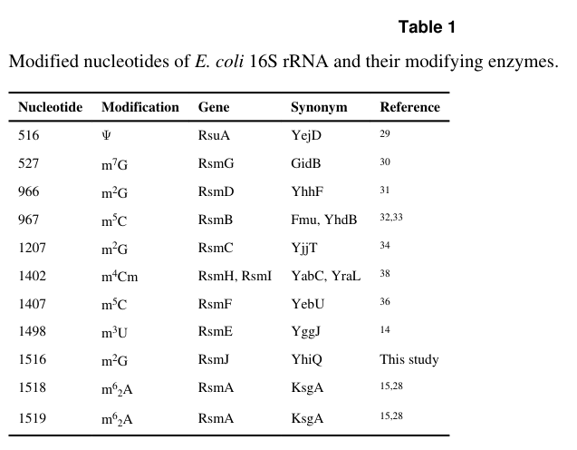

## Question

# Gene Research for Functional Annotation

## ⚠️ CRITICAL: Gene/Protein Identification Context

**BEFORE YOU BEGIN RESEARCH:** You MUST verify you are researching the CORRECT gene/protein. Gene symbols can be ambiguous, especially for less well-characterized genes from non-model organisms.

### Target Gene/Protein Identity (from UniProt):
- **UniProt Accession:** Q88MQ7
- **Protein Description:** RecName: Full=Ribosomal RNA small subunit methyltransferase J {ECO:0000255|HAMAP-Rule:MF_01523}; EC=2.1.1.242 {ECO:0000255|HAMAP-Rule:MF_01523}; AltName: Full=16S rRNA m2G1516 methyltransferase {ECO:0000255|HAMAP-Rule:MF_01523}; AltName: Full=rRNA (guanine-N(2)-)-methyltransferase {ECO:0000255|HAMAP-Rule:MF_01523};
- **Gene Information:** Name=rsmJ {ECO:0000255|HAMAP-Rule:MF_01523}; OrderedLocusNames=PP_1513;
- **Organism (full):** Pseudomonas putida (strain ATCC 47054 / DSM 6125 / CFBP 8728 / NCIMB 11950 / KT2440).
- **Protein Family:** Belongs to the methyltransferase superfamily. RsmJ family.
- **Key Domains:** 16SrRNA_methylTrfase_J. (IPR007536); SAM-dependent_MTases_sf. (IPR029063); SAM_MT (PF04445)

### MANDATORY VERIFICATION STEPS:

1. **Check if the gene symbol "rsmJ" matches the protein description above**
2. **Verify the organism is correct:** Pseudomonas putida (strain ATCC 47054 / DSM 6125 / CFBP 8728 / NCIMB 11950 / KT2440).
3. **Check if protein family/domains align with what you find in literature**
4. **If you find literature for a DIFFERENT gene with the same or similar symbol, STOP**

### If Gene Symbol is Ambiguous or You Cannot Find Relevant Literature:

**DO NOT PROCEED WITH RESEARCH ON A DIFFERENT GENE.** Instead:
- State clearly: "The gene symbol 'rsmJ' is ambiguous or literature is limited for this specific protein"
- Explain what you found (e.g., "Found extensive literature on a different gene with the same symbol in a different organism")
- Describe the protein based ONLY on the UniProt information provided above
- Suggest that the protein function can be inferred from domain/family information

### Research Target:

Please provide a comprehensive research report on the gene **rsmJ** (gene ID: rsmJ, UniProt: Q88MQ7) in PSEPK.

The research report should be a detailed narrative explaining the function, biological processes, and localization of the gene product. Citations should be given for all claims.

You should prioritize authoritative reviews and primary scientific literature when conducting research. You can supplement
this with annotations you find in gene/protein databases, but these can be outdated or inaccurate.

We are specifically interested in the primary function of the gene - for enzymes, what reaction is catalyzed, and what is the substrate specificity? For transporters, what is the substrate? For structural proteins or adapters, what is the broader structural role? For signaling molecules, what is the role in the pathway.

We are interested in where in or outside the cell the gene product carries out its function.

We are also interested in the signaling or biochemical pathways in which the gene functions. We are less interested in broad pleiotropic effects, except where these elucidate the precise role.

Include evidence where possible. We are interested in both experimental evidence as well as inference from structure, evolution, or bioinformatic analysis. Precise studies should be prioritized over high-throughput, where available.

## Output

Question: You are an expert researcher providing comprehensive, well-cited information.

Provide detailed information focusing on:
1. Key concepts and definitions with current understanding
2. Recent developments and latest research (prioritize 2023-2024 sources)
3. Current applications and real-world implementations
4. Expert opinions and analysis from authoritative sources
5. Relevant statistics and data from recent studies

Format as a comprehensive research report with proper citations. Include URLs and publication dates where available.
Always prioritize recent, authoritative sources and provide specific citations for all major claims.

# Gene Research for Functional Annotation

## ⚠️ CRITICAL: Gene/Protein Identification Context

**BEFORE YOU BEGIN RESEARCH:** You MUST verify you are researching the CORRECT gene/protein. Gene symbols can be ambiguous, especially for less well-characterized genes from non-model organisms.

### Target Gene/Protein Identity (from UniProt):
- **UniProt Accession:** Q88MQ7
- **Protein Description:** RecName: Full=Ribosomal RNA small subunit methyltransferase J {ECO:0000255|HAMAP-Rule:MF_01523}; EC=2.1.1.242 {ECO:0000255|HAMAP-Rule:MF_01523}; AltName: Full=16S rRNA m2G1516 methyltransferase {ECO:0000255|HAMAP-Rule:MF_01523}; AltName: Full=rRNA (guanine-N(2)-)-methyltransferase {ECO:0000255|HAMAP-Rule:MF_01523};
- **Gene Information:** Name=rsmJ {ECO:0000255|HAMAP-Rule:MF_01523}; OrderedLocusNames=PP_1513;
- **Organism (full):** Pseudomonas putida (strain ATCC 47054 / DSM 6125 / CFBP 8728 / NCIMB 11950 / KT2440).
- **Protein Family:** Belongs to the methyltransferase superfamily. RsmJ family.
- **Key Domains:** 16SrRNA_methylTrfase_J. (IPR007536); SAM-dependent_MTases_sf. (IPR029063); SAM_MT (PF04445)

### MANDATORY VERIFICATION STEPS:

1. **Check if the gene symbol "rsmJ" matches the protein description above**
2. **Verify the organism is correct:** Pseudomonas putida (strain ATCC 47054 / DSM 6125 / CFBP 8728 / NCIMB 11950 / KT2440).
3. **Check if protein family/domains align with what you find in literature**
4. **If you find literature for a DIFFERENT gene with the same or similar symbol, STOP**

### If Gene Symbol is Ambiguous or You Cannot Find Relevant Literature:

**DO NOT PROCEED WITH RESEARCH ON A DIFFERENT GENE.** Instead:
- State clearly: "The gene symbol 'rsmJ' is ambiguous or literature is limited for this specific protein"
- Explain what you found (e.g., "Found extensive literature on a different gene with the same symbol in a different organism")
- Describe the protein based ONLY on the UniProt information provided above
- Suggest that the protein function can be inferred from domain/family information

### Research Target:

Please provide a comprehensive research report on the gene **rsmJ** (gene ID: rsmJ, UniProt: Q88MQ7) in PSEPK.

The research report should be a detailed narrative explaining the function, biological processes, and localization of the gene product. Citations should be given for all claims.

You should prioritize authoritative reviews and primary scientific literature when conducting research. You can supplement
this with annotations you find in gene/protein databases, but these can be outdated or inaccurate.

We are specifically interested in the primary function of the gene - for enzymes, what reaction is catalyzed, and what is the substrate specificity? For transporters, what is the substrate? For structural proteins or adapters, what is the broader structural role? For signaling molecules, what is the role in the pathway.

We are interested in where in or outside the cell the gene product carries out its function.

We are also interested in the signaling or biochemical pathways in which the gene functions. We are less interested in broad pleiotropic effects, except where these elucidate the precise role.

Include evidence where possible. We are interested in both experimental evidence as well as inference from structure, evolution, or bioinformatic analysis. Precise studies should be prioritized over high-throughput, where available.

## Research report: functional annotation of **rsmJ** (UniProt Q88MQ7; PP_1513) in *Pseudomonas putida* KT2440 (PSEPK)

### 0) Target verification (critical identity check)
The UniProt entry provided (Q88MQ7; gene **rsmJ**; locus **PP_1513**) is annotated as a **ribosomal RNA small subunit methyltransferase J** belonging to the **RsmJ family** of **SAM-dependent methyltransferases**. The experimentally established founder function for bacterial RsmJ (also known as **YhiQ** in *E. coli*) is **site-specific N2-methylation of guanine at position 1516 in 16S rRNA**, producing **m2G1516** (EC **2.1.1.242**) (basturea2012yhiqisrsmj pages 1-3, basturea2012yhiqisrsmj pages 8-12). No tool-retrieved primary literature directly characterizing **PP_1513/Q88MQ7 in *P. putida* KT2440** was found; organism-level functional claims below are therefore based on (i) the UniProt identity supplied in the prompt and (ii) high-confidence functional conservation from the canonical bacterial RsmJ literature (basturea2012yhiqisrsmj pages 1-3, basturea2012yhiqisrsmj pages 3-4).

### 1) Key concepts and definitions (current understanding)

#### 1.1 What RsmJ is
**RsmJ** is a bacterial **16S rRNA base methyltransferase** that catalyzes formation of **N2-methylguanosine (m2G)** at a defined nucleotide in the small-subunit rRNA: **G1516** in *E. coli* numbering (basturea2012yhiqisrsmj pages 1-3, basturea2012yhiqisrsmj pages 8-12). This modification is part of the broader set of bacterial rRNA modifications (base methylations, ribose methylations, pseudouridines) that cluster in functionally important ribosomal regions (decoding center, intersubunit bridges, tRNA binding sites) and are introduced by site-specific enzymes (basturea2012yhiqisrsmj pages 1-3).

#### 1.2 Reaction chemistry and enzyme class
RsmJ is a **SAM-dependent methyltransferase** that transfers a methyl group from **S-adenosyl-L-methionine (SAM)** to the **exocyclic N2 of guanine** at 16S rRNA position 1516, producing **m2G1516** and **S-adenosyl-L-homocysteine (SAH)** (basturea2012yhiqisrsmj pages 3-4, basturea2012yhiqisrsmj pages 8-12). In vitro assays explicitly used radiolabeled **[3H]-SAM** as methyl donor to detect methyl incorporation by purified enzyme (basturea2012yhiqisrsmj pages 3-4, basturea2012yhiqisrsmj pages 8-12).

### 2) Primary function: substrate specificity, biological process, and localization

#### 2.1 Substrate and site specificity
Canonical evidence in *E. coli* demonstrates that deletion of **yhiQ/rsmJ** abolishes the methyl group at **G1516** in 16S rRNA, and complementation restores the modification, establishing direct gene→site assignment (basturea2012yhiqisrsmj pages 1-3, basturea2012yhiqisrsmj pages 3-4). Site specificity was validated by **primer extension**, where reverse transcriptase stops at **G1517** when **G1516 is methylated** (basturea2012yhiqisrsmj pages 8-12). These experimental readouts are also captured in the retrieved figure/table crops (basturea2012yhiqisrsmj media f9de6c21, basturea2012yhiqisrsmj media a932af51).

#### 2.2 Particle/context preference (late-stage 30S substrate)
A central mechanistic insight is that RsmJ acts preferentially on **assembled 30S particles** rather than free RNA. Purified RsmJ (YhiQ) incorporated methyl groups into **30S ribosomal particles** isolated from an rsmJ deletion strain, but **no incorporation** was detected on **free 16S rRNA** in that assay context, implying dependence on ribosomal-protein context and/or assembly-dependent rRNA conformation (basturea2012yhiqisrsmj pages 3-4). The authors interpret this as consistent with methylation occurring during a **late intermediate/late step of 30S assembly** (basturea2012yhiqisrsmj pages 3-4). A review of stress-related RNA modification biology similarly summarizes that almost all 16S rRNA modifying enzymes act on **fully assembled subunits with proteins**, consistent with late-stage biogenesis (baldridge2017insightsintothe pages 54-58).

#### 2.3 Cellular localization and pathway context
Because the substrate is the **30S ribosomal subunit** and bacterial ribosome assembly and translation occur in the **cytoplasm**, the functional localization for RsmJ is best described as **cytoplasmic ribosome biogenesis/translation machinery**, acting on small-subunit assembly intermediates or near-mature 30S particles (basturea2012yhiqisrsmj pages 3-4, baldridge2017insightsintothe pages 54-58). For *P. putida* KT2440 Q88MQ7 specifically, no direct localization experiments were retrieved; the localization inference rests on substrate context conserved across bacteria (basturea2012yhiqisrsmj pages 3-4).

### 3) Phenotypes and functional consequences (what changes if rsmJ is missing?)

#### 3.1 Growth and stress phenotypes
In *E. coli*, loss of rsmJ causes a **conditional cold-sensitive phenotype**: little/no strong growth defect at 22–37°C, but reduced growth at **16°C**, reported as ~**88%** of the isogenic wild-type growth rate under tested conditions (basturea2012yhiqisrsmj pages 4-6). This supports the idea that m2G1516 contributes to ribosome performance or assembly robustness under temperature stress (basturea2012yhiqisrsmj pages 3-4).

#### 3.2 Ribosome profiling/assembly readouts
Despite the cold-sensitive growth phenotype, one study reports **no detectable change in ribosome profile** in mutant cells grown at 16°C (data not shown), suggesting that gross steady-state ribosomal subunit distributions were not dramatically perturbed under that assay (basturea2012yhiqisrsmj pages 4-6). This does not exclude subtle assembly kinetics/fidelity effects.

#### 3.3 Antibiotic susceptibility: a negative but informative result
Basturea et al. directly tested whether loss of m2G1516 explains **kasugamycin resistance** (classically linked to loss of dimethyladenosines at A1518/A1519 by RsmA/KsgA). They found **no difference** in kasugamycin MIC between wild type and ΔrsmJ/ΔyhiQ (**2 μg/mL** in both), whereas ΔrsmA-containing strains were resistant up to **100 μg/mL** (basturea2012yhiqisrsmj pages 4-6). Thus, m2G1516 is not the causal determinant of kasugamycin resistance in that genetic context.

### 4) Recent developments (prioritizing 2023–2024) and latest research
Direct, RsmJ-focused mechanistic work in 2023–2024 was not retrieved for *P. putida* KT2440; however, multiple recent studies illuminate the broader, currently active research context in which RsmJ functions.

#### 4.1 rsmJ expression associated with adaptive antibiotic resistance (2023)
A 2023 study of *E. coli* adaptive antibiotic resistance reports increased global RNA methylation in antibiotic-resistant lines and explicitly identifies **rsmJ** as “**16S rRNA m2G1516 methyltransferase**.” The authors state that rsmJ is among RNA-modifying methyltransferase genes **overexpressed** in antibiotic-resistant cells (context suggests association with the gentamicin-resistant line), providing an association between rsmJ regulation and antibiotic-adaptive states (D’Aquila et al., 2023-06; https://doi.org/10.1128/spectrum.04583-22) (d’aquila2023epigeneticbasedregulationof pages 7-11). The excerpt does not provide fold-changes or demonstrate causality.

#### 4.2 Nanopore direct RNA sequencing enables rRNA modification mapping at scale (2024)
Tan et al. (2024-07; https://doi.org/10.1093/nar/gkae601) report that nanopore-based methods detected **18/25** known **23S rRNA** modification sites and **6/11** known **16S rRNA** modification sites (barrios2025directrnasequencing pages 24-26). Although this study excerpt does not single out G1516, it demonstrates a rapidly developing platform for large-scale rRNA modification profiling that could, in principle, be applied to organisms like *P. putida*.

A complementary 2024 nanopore DRS study (preprint) reports a systematic E. coli epitranscriptome analysis and detected **387 putative modifications outside rRNAs/tRNAs** at 37°C after applying thresholds targeting <15% error rate (Barrios et al., 2024-07/11 preprint; https://doi.org/10.1101/2024.07.08.602490) (barrios2025directrnasequencing pages 24-26). Under heat stress (45°C), they observed increases in certain **16S rRNA methylation types** (m5C, m6A, m6,6A) alongside decreases in tRNA anticodon-loop modification abundance, and they discuss how such remodeling could influence translation accuracy and stress physiology (barrios2025directrnasequencing pages 1-4).

### 5) Expert opinions and interpretive analysis from authoritative sources
A structural/evolutionary review of rRNA methylation emphasizes that rRNA modifications are concentrated in key functional regions and provides context for interpreting site-specific enzymes like RsmJ as part of a conserved ribosome-tuning layer (Sergiev et al., 2018-02; https://doi.org/10.1038/nchembio.2569) (basturea2012yhiqisrsmj pages 1-3).

A focused review/thesis on RNA modifications in stress argues that conservation of rRNA methyltransferases implies functional significance, and notes that methylations can stabilize RNA conformations and concentrate near RNA–RNA contact regions and the decoding center—consistent with roles that become apparent under stress (Baldridge, 2017-08; https://doi.org/10.26153/tsw/29512) (baldridge2017insightsintothe pages 54-58, baldridge2017insightsintothe pages 44-50). In that same source, RsmJ is listed as an enzyme acting on assembled 30S substrate and is annotated at the “m2G1516–m2G1835 intersubunit contact,” providing an interpretive placement of the modified nucleotide in ribosome architecture (baldridge2017insightsintothe pages 44-50).

### 6) Real-world applications and implementations

#### 6.1 Antibiotic research and potential target/context
While the canonical study indicates that loss of RsmJ does not confer kasugamycin resistance (basturea2012yhiqisrsmj pages 4-6), the broader literature links rRNA methylations to antibiotic phenotypes (baldridge2017insightsintothe pages 235-237). The 2023 adaptive resistance study’s observation that rsmJ is overexpressed in resistant lines suggests rsmJ may serve as a **biomarker** or **component** of adaptive states even when not directly causing classic target-site resistance (d’aquila2023epigeneticbasedregulationof pages 7-11).

#### 6.2 Epitranscriptome-enabled diagnostics/monitoring in bacteria
The 2024 nanopore direct RNA sequencing workflows demonstrate real-world implementable assays that can detect many known rRNA modification sites in bacteria and quantify stress-dependent remodeling (barrios2025directrnasequencing pages 24-26, barrios2025directrnasequencing pages 1-4). Such methods could be deployed to compare rRNA modification profiles (including potentially m2G1516) across conditions (temperature stress, antibiotic exposure) or across strains, including industrially relevant chassis like *P. putida*.

### 7) Evidence highlights (visual)
The Basturea et al. (2012) figures/tables provide direct visual evidence that (i) m2G1516 is assigned to RsmJ/YhiQ, (ii) primer extension reports loss/restoration of methylation, and (iii) purified enzyme methylates appropriate ribosomal substrates (basturea2012yhiqisrsmj media 18ab5446, basturea2012yhiqisrsmj media f9de6c21, basturea2012yhiqisrsmj media a932af51, basturea2012yhiqisrsmj media 012ccfb0).

### 8) Summary and actionable functional annotation for **P. putida** Q88MQ7
**Most-supported primary function (conserved annotation):** RsmJ (Q88MQ7; PP_1513) is a **cytoplasmic SAM-dependent 16S rRNA guanine-N2 methyltransferase** that installs **m2G** at the conserved **G1516** site in the small-subunit rRNA, acting preferentially on **assembled/late-stage 30S particles** during ribosome biogenesis (basturea2012yhiqisrsmj pages 3-4, basturea2012yhiqisrsmj pages 8-12). **Likely biological role:** fine-tuning ribosome structure/function with phenotypes that are most evident under **stress (cold)** rather than in standard growth conditions (basturea2012yhiqisrsmj pages 4-6, basturea2012yhiqisrsmj pages 3-4). **Antibiotic link:** RsmJ loss alone does not explain kasugamycin resistance (basturea2012yhiqisrsmj pages 4-6), but rsmJ expression changes can associate with adaptive antibiotic resistance states (d’aquila2023epigeneticbasedregulationof pages 7-11).

---

### Embedded summary table
| Entity | Functional annotation | Evidence/Notes | Key citations | Key source (date; URL) |
|---|---|---|---|---|
| RsmJ (rsmJ / yhiQ) | 16S rRNA guanine-N2 methyltransferase; installs **m2G** at nucleotide **G1516** of bacterial 16S rRNA | Canonical experimental identification in *E. coli* established yhiQ as **RsmJ**; Table 1 assigns **1516 m2G** to **RsmJ/YhiQ** | (basturea2012yhiqisrsmj pages 1-3, basturea2012yhiqisrsmj pages 8-12) | Basturea et al., **2012-01**; https://doi.org/10.1016/j.jmb.2011.10.044 |
| Reaction | **16S rRNA guanine(1516) + SAM -> 16S rRNA m2G1516 + SAH** | In vitro methylation assays used [3H]-SAM and purified His-YhiQ; activity is specific for the G1516 site | (basturea2012yhiqisrsmj pages 3-4, basturea2012yhiqisrsmj pages 8-12) | Basturea et al., **2012-01**; https://doi.org/10.1016/j.jmb.2011.10.044 |
| Substrate specificity | Preferred substrate is the **30S ribosomal subunit** containing immature/unmodified 16S rRNA; free 16S rRNA is a poor or inactive substrate | No methyl incorporation into free 16S rRNA in one assay context, implying dependence on ribosomal particle context and/or ribosomal proteins; modification likely occurs during **late 30S assembly** | (basturea2012yhiqisrsmj pages 3-4, basturea2012yhiqisrsmj pages 8-12) | Basturea et al., **2012-01**; https://doi.org/10.1016/j.jmb.2011.10.044 |
| Cofactor | **S-adenosyl-L-methionine (SAM)** methyl donor | Structural assignment and biochemical assay conditions support SAM-dependent catalysis; family belongs to SAM-dependent methyltransferase superfamily | (basturea2012yhiqisrsmj pages 3-4, basturea2012yhiqisrsmj pages 8-12) | Basturea et al., **2012-01**; https://doi.org/10.1016/j.jmb.2011.10.044 |
| Product/site | **m2G1516** in 16S rRNA, located in the **3′ minor domain / helix 45-44 region** of the small subunit | Site verified by primer-extension stop at **G1517** when G1516 is methylated; region is functionally important and highly conserved | (basturea2012yhiqisrsmj pages 1-3, basturea2012yhiqisrsmj pages 8-12, basturea2012yhiqisrsmj media 18ab5446) | Basturea et al., **2012-01**; https://doi.org/10.1016/j.jmb.2011.10.044 |
| Cellular context / localization | Acts in the **cytoplasm** on the **small ribosomal subunit (30S)** during **ribosome biogenesis/translation machinery maturation** | Evidence points to modification on assembled ribosomal particles rather than naked RNA; review literature places bacterial rRNA methylations in ribosome assembly and functional tuning | (basturea2012yhiqisrsmj pages 3-4, jayalath2021investigationofthe pages 23-31) | Basturea et al., **2012-01**; https://doi.org/10.1016/j.jmb.2011.10.044; Sergiev et al., **2018-02**; https://doi.org/10.1038/nchembio.2569 |
| Key experimental evidence | (1) ΔyhiQ loses G1516 methylation; (2) complementation restores it; (3) purified YhiQ methylates 30S particles in vitro; (4) primer extension detects the modification site | This combination provides strong gene-to-reaction assignment and site-specific validation | (basturea2012yhiqisrsmj pages 3-4, basturea2012yhiqisrsmj pages 1-3, basturea2012yhiqisrsmj pages 8-12, basturea2012yhiqisrsmj media 18ab5446) | Basturea et al., **2012-01**; https://doi.org/10.1016/j.jmb.2011.10.044 |
| Phenotypes on loss of enzyme | **Cold-sensitive growth defect** at **16°C**; little/no major growth defect at **22–37°C** | Reported growth of yhiQ mutant at 16°C was ~**88%** of isogenic wild type; no major ribosome profile change detected in that study | (basturea2012yhiqisrsmj pages 3-4, basturea2012yhiqisrsmj pages 4-6) | Basturea et al., **2012-01**; https://doi.org/10.1016/j.jmb.2011.10.044 |
| Antibiotic-related phenotype | Loss of RsmJ alone did **not** explain kasugamycin resistance associated with loss of RsmA | MIC of kasugamycin remained **2 μg/mL** for WT and ΔyhiQ, whereas ΔrsmA-containing strains were resistant up to **100 μg/mL** | (basturea2012yhiqisrsmj pages 4-6) | Basturea et al., **2012-01**; https://doi.org/10.1016/j.jmb.2011.10.044 |
| Family/domain inference for target protein Q88MQ7 | Consistent with **RsmJ family**, DUF548/UPF0341/COG0500-like SAM-dependent methyltransferase architecture | Matches the supplied UniProt description for *Pseudomonas putida* KT2440 **Q88MQ7 / PP_1513**; direct organism-specific experimental paper was not retrieved, so annotation is inferred by strong family conservation | (basturea2012yhiqisrsmj pages 3-4, basturea2012yhiqisrsmj pages 1-3) | Basturea et al., **2012-01**; https://doi.org/10.1016/j.jmb.2011.10.044 |
| Recent developments relevant to function | Modern bacterial epitranscriptome studies detect many known 16S/23S rRNA modifications and show stress-responsive remodeling of RNA modifications, reinforcing biological importance of rRNA methylation networks | 2024 nanopore/orthogonal studies detected **18/25** known 23S and **6/11** known 16S rRNA modification sites in one dataset; another 2024 study reported **387** putative non-rRNA/tRNA modifications and heat-stress-associated increases in some 16S rRNA marks, though not specifically assigning new RsmJ biology | (barrios2025directrnasequencing pages 24-26, barrios2025directrnasequencing pages 1-4, barrios2025directrnasequencing pages 31-34) | Tan et al., **2024-07**; https://doi.org/10.1093/nar/gkae601; Barrios et al., **2024-11 preprint**; https://doi.org/10.1101/2024.07.08.602490 |

*Table: This table summarizes the experimentally established function of RsmJ/YhiQ and maps it onto the target UniProt entry Q88MQ7 from *Pseudomonas putida* KT2440. It highlights reaction chemistry, substrate specificity, cellular context, phenotypes, and the strength and limits of current organism-specific evidence.*

References

1. (basturea2012yhiqisrsmj pages 1-3): Georgeta N. Basturea, Darryl R. Dague, Murray P. Deutscher, and Kenneth E. Rudd. Yhiq is rsmj, the methyltransferase responsible for methylation of g1516 in 16s rrna of e. coli. Journal of molecular biology, 415 1:16-21, Jan 2012. URL: https://doi.org/10.1016/j.jmb.2011.10.044, doi:10.1016/j.jmb.2011.10.044. This article has 41 citations and is from a domain leading peer-reviewed journal.

2. (basturea2012yhiqisrsmj pages 8-12): Georgeta N. Basturea, Darryl R. Dague, Murray P. Deutscher, and Kenneth E. Rudd. Yhiq is rsmj, the methyltransferase responsible for methylation of g1516 in 16s rrna of e. coli. Journal of molecular biology, 415 1:16-21, Jan 2012. URL: https://doi.org/10.1016/j.jmb.2011.10.044, doi:10.1016/j.jmb.2011.10.044. This article has 41 citations and is from a domain leading peer-reviewed journal.

3. (basturea2012yhiqisrsmj pages 3-4): Georgeta N. Basturea, Darryl R. Dague, Murray P. Deutscher, and Kenneth E. Rudd. Yhiq is rsmj, the methyltransferase responsible for methylation of g1516 in 16s rrna of e. coli. Journal of molecular biology, 415 1:16-21, Jan 2012. URL: https://doi.org/10.1016/j.jmb.2011.10.044, doi:10.1016/j.jmb.2011.10.044. This article has 41 citations and is from a domain leading peer-reviewed journal.

4. (basturea2012yhiqisrsmj media f9de6c21): Georgeta N. Basturea, Darryl R. Dague, Murray P. Deutscher, and Kenneth E. Rudd. Yhiq is rsmj, the methyltransferase responsible for methylation of g1516 in 16s rrna of e. coli. Journal of molecular biology, 415 1:16-21, Jan 2012. URL: https://doi.org/10.1016/j.jmb.2011.10.044, doi:10.1016/j.jmb.2011.10.044. This article has 41 citations and is from a domain leading peer-reviewed journal.

5. (basturea2012yhiqisrsmj media a932af51): Georgeta N. Basturea, Darryl R. Dague, Murray P. Deutscher, and Kenneth E. Rudd. Yhiq is rsmj, the methyltransferase responsible for methylation of g1516 in 16s rrna of e. coli. Journal of molecular biology, 415 1:16-21, Jan 2012. URL: https://doi.org/10.1016/j.jmb.2011.10.044, doi:10.1016/j.jmb.2011.10.044. This article has 41 citations and is from a domain leading peer-reviewed journal.

6. (baldridge2017insightsintothe pages 54-58): Kevin Charles Baldridge and 0000-0003-1829-7714. Insights into the functions of rna post-transcriptional modifications gained through studies in cellular stress. Text, Aug 2017. URL: https://doi.org/10.26153/tsw/29512, doi:10.26153/tsw/29512. This article has 0 citations and is from a peer-reviewed journal.

7. (basturea2012yhiqisrsmj pages 4-6): Georgeta N. Basturea, Darryl R. Dague, Murray P. Deutscher, and Kenneth E. Rudd. Yhiq is rsmj, the methyltransferase responsible for methylation of g1516 in 16s rrna of e. coli. Journal of molecular biology, 415 1:16-21, Jan 2012. URL: https://doi.org/10.1016/j.jmb.2011.10.044, doi:10.1016/j.jmb.2011.10.044. This article has 41 citations and is from a domain leading peer-reviewed journal.

8. (d’aquila2023epigeneticbasedregulationof pages 7-11): Patrizia D’Aquila, Francesco De Rango, Ersilia Paparazzo, Giuseppe Passarino, and Dina Bellizzi. Epigenetic-based regulation of transcriptome in escherichia coli adaptive antibiotic resistance. Microbiology Spectrum, Jun 2023. URL: https://doi.org/10.1128/spectrum.04583-22, doi:10.1128/spectrum.04583-22. This article has 22 citations and is from a domain leading peer-reviewed journal.

9. (barrios2025directrnasequencing pages 24-26): Sebastian Riquelme Barrios, Leonardo Vasquez Camus, Siobhan A. Cusack, Korinna Burdack, Dimitar Plamenov Petrov, G. N. Yeşiltaç-Tosun, Stefanie M. Kaiser, Pascal Giehr, and Kirsten Jung. Direct rna sequencing of the escherichia coli epitranscriptome uncovers alterations under heat stress. Nucleic Acids Research, Nov 2024. URL: https://doi.org/10.1101/2024.07.08.602490, doi:10.1101/2024.07.08.602490. This article has 1 citations and is from a highest quality peer-reviewed journal.

10. (barrios2025directrnasequencing pages 1-4): Sebastian Riquelme Barrios, Leonardo Vasquez Camus, Siobhan A. Cusack, Korinna Burdack, Dimitar Plamenov Petrov, G. N. Yeşiltaç-Tosun, Stefanie M. Kaiser, Pascal Giehr, and Kirsten Jung. Direct rna sequencing of the escherichia coli epitranscriptome uncovers alterations under heat stress. Nucleic Acids Research, Nov 2024. URL: https://doi.org/10.1101/2024.07.08.602490, doi:10.1101/2024.07.08.602490. This article has 1 citations and is from a highest quality peer-reviewed journal.

11. (baldridge2017insightsintothe pages 44-50): Kevin Charles Baldridge and 0000-0003-1829-7714. Insights into the functions of rna post-transcriptional modifications gained through studies in cellular stress. Text, Aug 2017. URL: https://doi.org/10.26153/tsw/29512, doi:10.26153/tsw/29512. This article has 0 citations and is from a peer-reviewed journal.

12. (baldridge2017insightsintothe pages 235-237): Kevin Charles Baldridge and 0000-0003-1829-7714. Insights into the functions of rna post-transcriptional modifications gained through studies in cellular stress. Text, Aug 2017. URL: https://doi.org/10.26153/tsw/29512, doi:10.26153/tsw/29512. This article has 0 citations and is from a peer-reviewed journal.

13. (basturea2012yhiqisrsmj media 18ab5446): Georgeta N. Basturea, Darryl R. Dague, Murray P. Deutscher, and Kenneth E. Rudd. Yhiq is rsmj, the methyltransferase responsible for methylation of g1516 in 16s rrna of e. coli. Journal of molecular biology, 415 1:16-21, Jan 2012. URL: https://doi.org/10.1016/j.jmb.2011.10.044, doi:10.1016/j.jmb.2011.10.044. This article has 41 citations and is from a domain leading peer-reviewed journal.

14. (basturea2012yhiqisrsmj media 012ccfb0): Georgeta N. Basturea, Darryl R. Dague, Murray P. Deutscher, and Kenneth E. Rudd. Yhiq is rsmj, the methyltransferase responsible for methylation of g1516 in 16s rrna of e. coli. Journal of molecular biology, 415 1:16-21, Jan 2012. URL: https://doi.org/10.1016/j.jmb.2011.10.044, doi:10.1016/j.jmb.2011.10.044. This article has 41 citations and is from a domain leading peer-reviewed journal.

15. (jayalath2021investigationofthe pages 23-31): K Jayalath. Investigation of the roles of pseudouridine synthases in ribosome biogenesis and epitranscriptomic gene regulation. Unknown journal, 2021.

16. (barrios2025directrnasequencing pages 31-34): Sebastian Riquelme Barrios, Leonardo Vasquez Camus, Siobhan A. Cusack, Korinna Burdack, Dimitar Plamenov Petrov, G. N. Yeşiltaç-Tosun, Stefanie M. Kaiser, Pascal Giehr, and Kirsten Jung. Direct rna sequencing of the escherichia coli epitranscriptome uncovers alterations under heat stress. Nucleic Acids Research, Nov 2024. URL: https://doi.org/10.1101/2024.07.08.602490, doi:10.1101/2024.07.08.602490. This article has 1 citations and is from a highest quality peer-reviewed journal.

## Artifacts

- [Edison artifact artifact-00](rsmJ-deep-research-falcon_artifacts/artifact-00.md)

## Citations

1. basturea2012yhiqisrsmj pages 1-3
2. basturea2012yhiqisrsmj pages 8-12
3. basturea2012yhiqisrsmj pages 3-4
4. baldridge2017insightsintothe pages 54-58
5. basturea2012yhiqisrsmj pages 4-6
6. barrios2025directrnasequencing pages 24-26
7. barrios2025directrnasequencing pages 1-4
8. baldridge2017insightsintothe pages 44-50
9. baldridge2017insightsintothe pages 235-237
10. jayalath2021investigationofthe pages 23-31
11. barrios2025directrnasequencing pages 31-34
12. 3H
13. https://doi.org/10.1128/spectrum.04583-22
14. https://doi.org/10.1093/nar/gkae601
15. https://doi.org/10.1101/2024.07.08.602490
16. https://doi.org/10.1038/nchembio.2569
17. https://doi.org/10.26153/tsw/29512
18. https://doi.org/10.1016/j.jmb.2011.10.044
19. https://doi.org/10.1016/j.jmb.2011.10.044;
20. https://doi.org/10.1093/nar/gkae601;
21. https://doi.org/10.1016/j.jmb.2011.10.044,
22. https://doi.org/10.26153/tsw/29512,
23. https://doi.org/10.1128/spectrum.04583-22,
24. https://doi.org/10.1101/2024.07.08.602490,