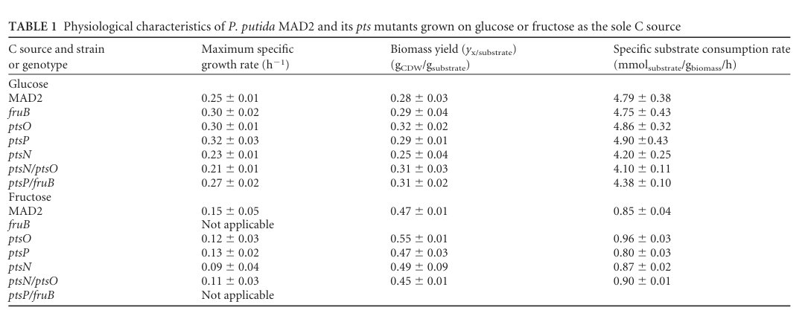

## Question

# Gene Research for Functional Annotation

## ⚠️ CRITICAL: Gene/Protein Identification Context

**BEFORE YOU BEGIN RESEARCH:** You MUST verify you are researching the CORRECT gene/protein. Gene symbols can be ambiguous, especially for less well-characterized genes from non-model organisms.

### Target Gene/Protein Identity (from UniProt):
- **UniProt Accession:** Q88FA7
- **Protein Description:** RecName: Full=Succinate dehydrogenase flavoprotein subunit {ECO:0000256|ARBA:ARBA00019965, ECO:0000256|NCBIfam:TIGR01816}; EC=1.3.5.1 {ECO:0000256|ARBA:ARBA00012792, ECO:0000256|RuleBase:RU362051};
- **Gene Information:** Name=sdhA {ECO:0000313|EMBL:AAN69772.1}; OrderedLocusNames=PP_4191 {ECO:0000313|EMBL:AAN69772.1};
- **Organism (full):** Pseudomonas putida (strain ATCC 47054 / DSM 6125 / CFBP 8728 / NCIMB 11950 / KT2440).
- **Protein Family:** Belongs to the FAD-dependent oxidoreductase 2 family.
- **Key Domains:** FAD-dep_OxRdtase_2_FAD-bd. (IPR003953); FAD/NAD-bd_sf. (IPR036188); FRD_SDH_FAD_BS. (IPR003952); Fum_R/Succ_DH_flav-like_C_sf. (IPR037099); Fum_Rdtase/Succ_DH_flav-like_C. (IPR015939)

### MANDATORY VERIFICATION STEPS:

1. **Check if the gene symbol "sdhA" matches the protein description above**
2. **Verify the organism is correct:** Pseudomonas putida (strain ATCC 47054 / DSM 6125 / CFBP 8728 / NCIMB 11950 / KT2440).
3. **Check if protein family/domains align with what you find in literature**
4. **If you find literature for a DIFFERENT gene with the same or similar symbol, STOP**

### If Gene Symbol is Ambiguous or You Cannot Find Relevant Literature:

**DO NOT PROCEED WITH RESEARCH ON A DIFFERENT GENE.** Instead:
- State clearly: "The gene symbol 'sdhA' is ambiguous or literature is limited for this specific protein"
- Explain what you found (e.g., "Found extensive literature on a different gene with the same symbol in a different organism")
- Describe the protein based ONLY on the UniProt information provided above
- Suggest that the protein function can be inferred from domain/family information

### Research Target:

Please provide a comprehensive research report on the gene **sdhA** (gene ID: sdhA, UniProt: Q88FA7) in PSEPK.

The research report should be a detailed narrative explaining the function, biological processes, and localization of the gene product. Citations should be given for all claims.

You should prioritize authoritative reviews and primary scientific literature when conducting research. You can supplement
this with annotations you find in gene/protein databases, but these can be outdated or inaccurate.

We are specifically interested in the primary function of the gene - for enzymes, what reaction is catalyzed, and what is the substrate specificity? For transporters, what is the substrate? For structural proteins or adapters, what is the broader structural role? For signaling molecules, what is the role in the pathway.

We are interested in where in or outside the cell the gene product carries out its function.

We are also interested in the signaling or biochemical pathways in which the gene functions. We are less interested in broad pleiotropic effects, except where these elucidate the precise role.

Include evidence where possible. We are interested in both experimental evidence as well as inference from structure, evolution, or bioinformatic analysis. Precise studies should be prioritized over high-throughput, where available.

## Output

Question: You are an expert researcher providing comprehensive, well-cited information.

Provide detailed information focusing on:
1. Key concepts and definitions with current understanding
2. Recent developments and latest research (prioritize 2023-2024 sources)
3. Current applications and real-world implementations
4. Expert opinions and analysis from authoritative sources
5. Relevant statistics and data from recent studies

Format as a comprehensive research report with proper citations. Include URLs and publication dates where available.
Always prioritize recent, authoritative sources and provide specific citations for all major claims.

# Gene Research for Functional Annotation

## ⚠️ CRITICAL: Gene/Protein Identification Context

**BEFORE YOU BEGIN RESEARCH:** You MUST verify you are researching the CORRECT gene/protein. Gene symbols can be ambiguous, especially for less well-characterized genes from non-model organisms.

### Target Gene/Protein Identity (from UniProt):
- **UniProt Accession:** Q88FA7
- **Protein Description:** RecName: Full=Succinate dehydrogenase flavoprotein subunit {ECO:0000256|ARBA:ARBA00019965, ECO:0000256|NCBIfam:TIGR01816}; EC=1.3.5.1 {ECO:0000256|ARBA:ARBA00012792, ECO:0000256|RuleBase:RU362051};
- **Gene Information:** Name=sdhA {ECO:0000313|EMBL:AAN69772.1}; OrderedLocusNames=PP_4191 {ECO:0000313|EMBL:AAN69772.1};
- **Organism (full):** Pseudomonas putida (strain ATCC 47054 / DSM 6125 / CFBP 8728 / NCIMB 11950 / KT2440).
- **Protein Family:** Belongs to the FAD-dependent oxidoreductase 2 family.
- **Key Domains:** FAD-dep_OxRdtase_2_FAD-bd. (IPR003953); FAD/NAD-bd_sf. (IPR036188); FRD_SDH_FAD_BS. (IPR003952); Fum_R/Succ_DH_flav-like_C_sf. (IPR037099); Fum_Rdtase/Succ_DH_flav-like_C. (IPR015939)

### MANDATORY VERIFICATION STEPS:

1. **Check if the gene symbol "sdhA" matches the protein description above**
2. **Verify the organism is correct:** Pseudomonas putida (strain ATCC 47054 / DSM 6125 / CFBP 8728 / NCIMB 11950 / KT2440).
3. **Check if protein family/domains align with what you find in literature**
4. **If you find literature for a DIFFERENT gene with the same or similar symbol, STOP**

### If Gene Symbol is Ambiguous or You Cannot Find Relevant Literature:

**DO NOT PROCEED WITH RESEARCH ON A DIFFERENT GENE.** Instead:
- State clearly: "The gene symbol 'sdhA' is ambiguous or literature is limited for this specific protein"
- Explain what you found (e.g., "Found extensive literature on a different gene with the same symbol in a different organism")
- Describe the protein based ONLY on the UniProt information provided above
- Suggest that the protein function can be inferred from domain/family information

### Research Target:

Please provide a comprehensive research report on the gene **sdhA** (gene ID: sdhA, UniProt: Q88FA7) in PSEPK.

The research report should be a detailed narrative explaining the function, biological processes, and localization of the gene product. Citations should be given for all claims.

You should prioritize authoritative reviews and primary scientific literature when conducting research. You can supplement
this with annotations you find in gene/protein databases, but these can be outdated or inaccurate.

We are specifically interested in the primary function of the gene - for enzymes, what reaction is catalyzed, and what is the substrate specificity? For transporters, what is the substrate? For structural proteins or adapters, what is the broader structural role? For signaling molecules, what is the role in the pathway.

We are interested in where in or outside the cell the gene product carries out its function.

We are also interested in the signaling or biochemical pathways in which the gene functions. We are less interested in broad pleiotropic effects, except where these elucidate the precise role.

Include evidence where possible. We are interested in both experimental evidence as well as inference from structure, evolution, or bioinformatic analysis. Precise studies should be prioritized over high-throughput, where available.

# Research Report: Functional Annotation of **sdhA** (PP_4191; UniProt Q88FA7) in *Pseudomonas putida* KT2440

## 0. Target verification (mandatory disambiguation)

The gene symbol **sdhA** in *Pseudomonas putida* KT2440 is unambiguously linked to **PP_4191**, annotated as the **succinate dehydrogenase flavoprotein subunit (SdhA)**, and occurs with the other complex II subunits **SdhB (PP_4190), SdhD (PP_4192), and SdhC (PP_4193)** in KT2440. This mapping matches the UniProt-provided identity (Q88FA7) as a succinate dehydrogenase flavoprotein subunit (EC 1.3.5.1). (chavarria2012regulatorytasksof pages 3-4, chavarria2012regulatorytasksof media b14b64f4, chavarria2012regulatorytasksof media 8dabbe7d)

## 1. Key concepts, definitions, and current understanding

### 1.1 What SdhA is (protein role within Complex II)

**Succinate dehydrogenase (SDH; respiratory complex II)** is a central bioenergetic enzyme that functionally couples the **tricarboxylic acid (TCA) cycle** to the **aerobic respiratory electron transport chain**. In bacteria and mitochondria, complex II comprises a soluble catalytic “head” and membrane anchor components that connect catalysis to the quinone pool. (bouillaud2023inhibitionofsuccinate pages 3-5, mcneil2012sdheisa pages 1-2)

Within this complex, **SdhA** is the **flavoprotein catalytic subunit** that carries the flavin cofactor and hosts the succinate/fumarate active-site chemistry. (bouillaud2023inhibitionofsuccinate pages 3-5, mcneil2012sdheisa pages 1-2)

### 1.2 Enzymatic reaction and substrate specificity (primary function)

The canonical SDH reaction (EC **1.3.5.1**) is the **oxidation of succinate to fumarate**:

- **succinate → fumarate + 2H+ + 2e−**

The electrons are transferred into the membrane quinone pool by coupled reduction of quinone:

- **Q + 2e− + 2H+ → QH2**

Thus, SdhA’s primary substrate specificity is toward **succinate** (as the electron donor in the forward SDH direction) and **fumarate** (in the reverse fumarate reductase direction in organisms/conditions where reversal occurs), with coupling to the quinone pool as electron acceptor via the rest of complex II. (bouillaud2023inhibitionofsuccinate pages 3-5)

### 1.3 Cofactors/prosthetic groups and maturation concepts

Complex II function depends on redox cofactors:

- SDH contains **FAD** (associated with the soluble catalytic portion containing SdhA) and **iron** (consistent with iron-containing redox centers in the soluble part of the complex). (bouillaud2023inhibitionofsuccinate pages 3-5)

A key mechanistic concept for bacterial SdhA is **flavinylation** (incorporation/attachment of FAD into the SdhA subunit). In a bacterial model system, SdhA requires an accessory protein **SdhE** for FAD incorporation; SdhE interacts with SdhA, binds FAD, and is required for SdhA flavinylation and SDH activity. (mcneil2012sdheisa pages 4-5, mcneil2012sdheisa pages 1-2)

Although this SdhE-dependent maturation evidence is not from *P. putida* directly, SdhE is described as conserved across diverse proteobacteria, supporting inference that *P. putida* SdhA likewise depends on proper flavinylation for activity. (mcneil2012sdheisa pages 1-2)

## 2. Pathway context and cellular localization in *Pseudomonas putida* KT2440

### 2.1 Localization

Complex II is described as a **membrane-spanning redox enzyme** with a soluble catalytic side containing the flavoprotein subunit (SdhA) and membrane subunits that inject electrons into quinone in the membrane. (bouillaud2023inhibitionofsuccinate pages 3-5)

Consistent with this, bacterial experimental work localized SdhA to the **membrane-associated complex**, reflecting its function as part of a membrane respiratory complex rather than a freely soluble cytosolic enzyme. (mcneil2012sdheisa pages 4-5)

### 2.2 Subunits/operon context in KT2440

In KT2440, the complex II subunits are explicitly mapped as:

- **SdhB** (iron–sulfur subunit): **PP_4190**
- **SdhA** (flavoprotein subunit): **PP_4191**
- **SdhD** (hydrophobic membrane anchor): **PP_4192**
- **SdhC** (cytochrome b556 subunit): **PP_4193**

This supports annotation of PP_4191/Q88FA7 as the catalytic complex II flavoprotein subunit within the canonical SDH architecture in *P. putida* KT2440. (chavarria2012regulatorytasksof media b14b64f4, chavarria2012regulatorytasksof media 8dabbe7d)

## 3. Recent developments (prioritizing 2023–2024) and latest research relevant to sdhA/complex II

### 3.1 2023: SDH function contextualized by modern bioenergetics and inhibition literature

A 2023 review synthesizes modern understanding of SDH/complex II as a redox enzyme connecting succinate oxidation to quinone reduction, emphasizing its four-subunit architecture and centrality to energy metabolism, while also discussing assay approaches and the energetic consequence that complex II **does not pump protons** (unlike complexes I/III/IV), implying its control is primarily redox/substrate/quinone-state dependent. (bouillaud2023inhibitionofsuccinate pages 3-5)

While this review focuses on SDH inhibition in eukaryotic contexts, its biochemical statements about the enzyme’s reaction chemistry and architecture are directly applicable to bacterial SDH (including *P. putida*). (bouillaud2023inhibitionofsuccinate pages 3-5)

### 3.2 2023: KT2440 microaerobic regulation of sdhA and metabolic engineering implications

A 2023 study on microaerobic cultivation of *P. putida* KT2440 for succinate production provides direct KT2440 evidence that:

- KT2440 can **reassimilate succinate** via an SDH activity (“sdhAB enzyme”), which can reduce apparent succinate accumulation in bioprocess contexts; therefore, deleting or downregulating sdhAB is proposed as a strategy to improve succinate production. (mutyala2023citratesynthaseoverexpression pages 10-11)
- **sdhA expression is reduced by ~2.2-fold** under **microaerobic** relative to aerobic cultivation in WT KT2440, consistent with reduced succinate oxidation capacity when oxygen availability is limited. (mutyala2023citratesynthaseoverexpression pages 10-11)

Together, these findings operationalize sdhA (and sdhAB) as a tunable node in *P. putida* metabolic engineering for improved organic acid accumulation under oxygen-limited regimes. (mutyala2023citratesynthaseoverexpression pages 10-11)

### 3.3 2024 evidence limitation (explicitly stated)

Although 2024 *P. putida* KT2440 systems-biology papers were retrieved in the search set, the accessible text evidence obtained in this run did not provide explicit, citable sdhA-specific quantitative statements. Therefore, sdhA-focused 2023 KT2440 evidence (above) is the primary recent source for strain-specific regulation and application claims within the current tool-retrieved corpus. (mutyala2023citratesynthaseoverexpression pages 10-11)

## 4. Applications and real-world implementations

### 4.1 Industrial and metabolic engineering context (succinate bioproduction)

In KT2440 succinate bioproduction under microaerobic conditions, sdhA/SDH is relevant because it can **consume succinate** (reassimilate it into the TCA cycle via succinate oxidation). The 2023 microaerobic cultivation study explicitly frames **sdhAB** as a target whose downregulation or deletion could improve succinate accumulation and yields in engineered strains. (mutyala2023citratesynthaseoverexpression pages 10-11)

This is a practical, real-world application: controlling SDH activity (via sdhA expression or function) helps redirect carbon and reducing equivalents away from respiration-driven succinate consumption toward product accumulation. (mutyala2023citratesynthaseoverexpression pages 10-11)

## 5. Expert opinion and analysis (authoritative synthesis)

### 5.1 Why sdhA is a high-confidence functional annotation target

Multiple independent lines of evidence converge on the functional assignment:

1. **Direct KT2440 locus mapping** (PP_4191 = SdhA) and subunit context (PP_4190/4192/4193), establishing correct gene identity in the correct organism/strain. (chavarria2012regulatorytasksof pages 3-4, chavarria2012regulatorytasksof media b14b64f4, chavarria2012regulatorytasksof media 8dabbe7d)
2. **Biochemical consensus** that SdhA-containing complex II catalyzes succinate oxidation coupled to quinone reduction (EC 1.3.5.1) and contains FAD and iron-based redox centers. (bouillaud2023inhibitionofsuccinate pages 3-5)
3. **Mechanistic bacterial evidence** that SdhA is FAD-dependent and requires maturation (flavinylation) mediated by the conserved protein SdhE; disruption of this process dramatically reduces SDH activity. (mcneil2012sdheisa pages 4-5, mcneil2012sdheisa pages 1-2)

Thus, even if KT2440-specific enzymology (e.g., purified enzyme kinetics) is limited in the retrieved corpus, functional inference for Q88FA7 is robust because complex II is highly conserved and anchored by direct strain-specific gene mapping. (bouillaud2023inhibitionofsuccinate pages 3-5, chavarria2012regulatorytasksof pages 3-4, chavarria2012regulatorytasksof media b14b64f4, chavarria2012regulatorytasksof media 8dabbe7d)

### 5.2 Regulatory interpretation under oxygen limitation

The KT2440 observation that **sdhA transcript abundance drops ~2.2-fold under microaerobic cultivation** can be interpreted as part of a broader physiological shift: when oxygen is limiting, cells may downshift electron transport chain activity and reduce flux through succinate oxidation, a step that normally passes electrons to quinone in aerobic respiration. (bouillaud2023inhibitionofsuccinate pages 3-5, mutyala2023citratesynthaseoverexpression pages 10-11)

## 6. Relevant statistics and quantitative data (from recent studies)

### 6.1 KT2440 sdhA expression under microaerobic vs aerobic conditions

- **~2.2-fold reduction** in **sdhA expression** in WT *P. putida* under **microaerobic** versus aerobic cultivation. (mutyala2023citratesynthaseoverexpression pages 10-11)

### 6.2 KT2440 succinate production metrics (engineering context tied to SDH control)

In the same 2023 study (microaerobic succinate production from acetate with citrate synthase overexpression):

- gltA overexpression yielded an **~50% improvement** in succinate production compared with WT. (mutyala2023citratesynthaseoverexpression pages 10-11)
- Under optimal pH 7.5, succinate accumulation reached **4.73 ± 0.6 mM in 36 h**, reported as **~400% higher** than WT. (mutyala2023citratesynthaseoverexpression pages 10-11)

These values provide practical quantitative context for why minimizing SDH-mediated succinate reassimilation (e.g., via sdhAB modulation) is an attractive engineering strategy. (mutyala2023citratesynthaseoverexpression pages 10-11)

### 6.3 Mechanistic activity effect size for SdhA maturation disruption (bacterial model)

In a bacterial model system used to elucidate complex II flavinylation:

- Loss of the flavin assembly factor **SdhE** caused a **~90% reduction** in measured SDH activity, consistent with the requirement of SdhA flavinylation (FAD incorporation) for function. (mcneil2012sdheisa pages 4-5)

## Evidence summary table

| Topic | Key findings (concise) | Evidence type (review/primary; organism) | Quantitative data (if any) | Primary source (authors, year) | Publication date (month/year if available) | URL | PaperQA citation id (pqac-...) |
|---|---|---|---|---|---|---|---|
| identity | PP_4191 is explicitly annotated as **SdhA, succinate dehydrogenase flavoprotein subunit** in *Pseudomonas putida* KT2440, matching UniProt Q88FA7. | Primary; *P. putida* KT2440 | Not reported | Chavarría et al., 2012 | 05/2012 | https://doi.org/10.1128/mbio.00028-12 | (chavarria2012regulatorytasksof pages 3-4) |
| reaction/EC | Succinate dehydrogenase (complex II) catalyzes **succinate → fumarate + 2H+ + 2e−** and couples this to **quinone reduction (Q → QH2)**, consistent with EC 1.3.5.1. | Review; general SDH biology | Stoichiometry given in review; no strain-specific kinetic values | Bouillaud, 2023 | 02/2023 | https://doi.org/10.3390/ijms24044045 | (bouillaud2023inhibitionofsuccinate pages 3-5) |
| role/pathway | SDH/complex II links the **TCA cycle** and **electron transport chain**; SdhA is the catalytic flavoprotein subunit of this respiratory enzyme. | Review + primary; general bacteria | Not reported for KT2440 | Bouillaud, 2023; McNeil et al., 2012 | 02/2023; 05/2012 | https://doi.org/10.3390/ijms24044045 ; https://doi.org/10.1074/jbc.m111.293803 | (bouillaud2023inhibitionofsuccinate pages 3-5, mcneil2012sdheisa pages 1-2) |
| cofactors | Bacterial SdhA is a **FAD-dependent flavoprotein**; SDH contains **FAD and iron** cofactors, and SdhE is required for SdhA flavinylation in bacteria. | Review + primary; general bacteria | Loss of SdhE caused ~**90% reduction in SDH activity** in Serratia model | McNeil et al., 2012; Bouillaud, 2023 | 05/2012; 02/2023 | https://doi.org/10.1074/jbc.m111.293803 ; https://doi.org/10.3390/ijms24044045 | (mcneil2012sdheisa pages 4-5, bouillaud2023inhibitionofsuccinate pages 3-5, mcneil2012sdheisa pages 1-2) |
| complex subunits/operon | In KT2440, the SDH subunits are mapped as **SdhB/PP_4190**, **SdhA/PP_4191**, **SdhD/PP_4192**, and **SdhC/PP_4193**. This supports assignment of PP_4191 to the canonical bacterial SDH complex. | Primary; *P. putida* KT2440 | Not reported | Chavarría et al., 2012 | 05/2012 | https://doi.org/10.1128/mbio.00028-12 | (chavarria2012regulatorytasksof media b14b64f4, chavarria2012regulatorytasksof media 8dabbe7d) |
| localization | SDH is a **membrane-spanning complex** with a soluble catalytic side containing SdhA and membrane subunits that transfer electrons to quinone; bacterial experiments localized SdhA to the membrane-associated complex. | Review + primary; general bacteria | Functional SDH reported as ~**360 kDa trimeric** complex in Serratia model | Bouillaud, 2023; McNeil et al., 2012 | 02/2023; 05/2012 | https://doi.org/10.3390/ijms24044045 ; https://doi.org/10.1074/jbc.m111.293803 | (mcneil2012sdheisa pages 4-5, bouillaud2023inhibitionofsuccinate pages 3-5) |
| regulation/expression | In *P. putida*, **sdhA expression decreases under microaerobic cultivation**, consistent with reduced succinate oxidation when oxygen becomes limiting. | Primary; *P. putida* | **~2.2-fold reduction** of sdhA expression in wild type under microaerobic vs aerobic conditions | Mutyala et al., 2023 | 07/2023 | https://doi.org/10.1021/acsomega.3c02520 | (mutyala2023citratesynthaseoverexpression pages 10-11) |
| phenotypes/essentiality | KT2440 transposon screening identified the **succinate dehydrogenase complex (5 genes)** among genes important for growth on minimal medium, supporting central metabolic importance, though not proving PP_4191 alone is universally essential. | Primary; *P. putida* KT2440 | Gene count only; no PP_4191-specific effect size in provided context | Molina-Henares et al., 2010 | 06/2010 | https://doi.org/10.1111/j.1462-2920.2010.02166.x | (chavarria2012regulatorytasksof pages 3-4) |
| applications/engineering relevance | Because KT2440 can **reassimilate succinate using sdhAB**, downregulating or deleting sdhAB is proposed to improve biotechnological **succinate accumulation**; microaerobic repression of sdhA supports this strategy. | Primary; *P. putida* | gltA overexpression improved succinate production by **~50%**; succinate reached **4.73 ± 0.6 mM in 36 h**, ~**400%** above wild type at pH 7.5; sdhA expression reduced **~2.2-fold** microaerobically | Mutyala et al., 2023 | 07/2023 | https://doi.org/10.1021/acsomega.3c02520 | (mutyala2023citratesynthaseoverexpression pages 10-11) |

*Table: This table summarizes evidence-supported functional annotation points for *Pseudomonas putida* KT2440 sdhA (PP_4191; UniProt Q88FA7), including identity, biochemistry, pathway role, localization, and engineering relevance. It only includes claims directly supported by the available evidence contexts.*

## References (with dates and URLs)

- Chavarría M. et al. *mBio* (May 2012). “Regulatory Tasks of the Phosphoenolpyruvate-Phosphotransferase System of *Pseudomonas putida* in Central Carbon Metabolism.” https://doi.org/10.1128/mbio.00028-12 (chavarria2012regulatorytasksof pages 3-4, chavarria2012regulatorytasksof media b14b64f4, chavarria2012regulatorytasksof media 8dabbe7d)
- Bouillaud F. *Int J Mol Sci* (Feb 2023). “Inhibition of Succinate Dehydrogenase by Pesticides (SDHIs) and Energy Metabolism.” https://doi.org/10.3390/ijms24044045 (bouillaud2023inhibitionofsuccinate pages 3-5)
- McNeil M.B. et al. *J Biol Chem* (May 2012). “SdhE Is a Conserved Protein Required for Flavinylation of Succinate Dehydrogenase in Bacteria.” https://doi.org/10.1074/jbc.m111.293803 (mcneil2012sdheisa pages 4-5, mcneil2012sdheisa pages 1-2)
- Mutyala S. et al. *ACS Omega* (Jul 2023). “Citrate Synthase Overexpression of *Pseudomonas putida* Increases Succinate Production from Acetate in Microaerobic Cultivation.” https://doi.org/10.1021/acsomega.3c02520 (mutyala2023citratesynthaseoverexpression pages 10-11)

## Scope notes and limitations

- The retrieved evidence set contained **strong strain-specific identity mapping** and **a 2023 KT2440 expression/regulation signal** for sdhA under microaerobic conditions, but did not include KT2440-specific biochemical purification/kinetic constants for SdhA. Therefore, enzyme kinetics and residue-level substrate determinants are not reported here to avoid unsupported extrapolation. (mutyala2023citratesynthaseoverexpression pages 10-11, chavarria2012regulatorytasksof pages 3-4)
- Where mechanistic details (e.g., SdhE-dependent flavinylation) are drawn from non-*P. putida* bacterial experiments, they are explicitly framed as **conserved bacterial complex II biology** rather than KT2440-specific demonstrations. (mcneil2012sdheisa pages 4-5, mcneil2012sdheisa pages 1-2)

References

1. (chavarria2012regulatorytasksof pages 3-4): Max Chavarría, Roelco J. Kleijn, Uwe Sauer, Katharina Pflüger-Grau, and Víctor de Lorenzo. Regulatory tasks of the phosphoenolpyruvate-phosphotransferase system of pseudomonas putida in central carbon metabolism. May 2012. URL: https://doi.org/10.1128/mbio.00028-12, doi:10.1128/mbio.00028-12. This article has 96 citations and is from a domain leading peer-reviewed journal.

2. (chavarria2012regulatorytasksof media b14b64f4): Max Chavarría, Roelco J. Kleijn, Uwe Sauer, Katharina Pflüger-Grau, and Víctor de Lorenzo. Regulatory tasks of the phosphoenolpyruvate-phosphotransferase system of pseudomonas putida in central carbon metabolism. May 2012. URL: https://doi.org/10.1128/mbio.00028-12, doi:10.1128/mbio.00028-12. This article has 96 citations and is from a domain leading peer-reviewed journal.

3. (chavarria2012regulatorytasksof media 8dabbe7d): Max Chavarría, Roelco J. Kleijn, Uwe Sauer, Katharina Pflüger-Grau, and Víctor de Lorenzo. Regulatory tasks of the phosphoenolpyruvate-phosphotransferase system of pseudomonas putida in central carbon metabolism. May 2012. URL: https://doi.org/10.1128/mbio.00028-12, doi:10.1128/mbio.00028-12. This article has 96 citations and is from a domain leading peer-reviewed journal.

4. (bouillaud2023inhibitionofsuccinate pages 3-5): Frederic Bouillaud. Inhibition of succinate dehydrogenase by pesticides (sdhis) and energy metabolism. International Journal of Molecular Sciences, 24:4045, Feb 2023. URL: https://doi.org/10.3390/ijms24044045, doi:10.3390/ijms24044045. This article has 60 citations.

5. (mcneil2012sdheisa pages 1-2): Matthew B. McNeil, James S. Clulow, Nabil M. Wilf, George P.C. Salmond, and Peter C. Fineran. Sdhe is a conserved protein required for flavinylation of succinate dehydrogenase in bacteria. Journal of Biological Chemistry, 287:18418-18428, May 2012. URL: https://doi.org/10.1074/jbc.m111.293803, doi:10.1074/jbc.m111.293803. This article has 86 citations and is from a domain leading peer-reviewed journal.

6. (mcneil2012sdheisa pages 4-5): Matthew B. McNeil, James S. Clulow, Nabil M. Wilf, George P.C. Salmond, and Peter C. Fineran. Sdhe is a conserved protein required for flavinylation of succinate dehydrogenase in bacteria. Journal of Biological Chemistry, 287:18418-18428, May 2012. URL: https://doi.org/10.1074/jbc.m111.293803, doi:10.1074/jbc.m111.293803. This article has 86 citations and is from a domain leading peer-reviewed journal.

7. (mutyala2023citratesynthaseoverexpression pages 10-11): Sakuntala Mutyala, Shuwei Li, Himanshu Khandelwal, Da Seul Kong, and Jung Rae Kim. Citrate synthase overexpression of <i>pseudomonas putida</i> increases succinate production from acetate in microaerobic cultivation. ACS Omega, 8:26231-26242, Jul 2023. URL: https://doi.org/10.1021/acsomega.3c02520, doi:10.1021/acsomega.3c02520. This article has 13 citations and is from a peer-reviewed journal.

## Artifacts

- [Edison artifact artifact-00](sdhA-deep-research-falcon_artifacts/artifact-00.md)

## Citations

1. bouillaud2023inhibitionofsuccinate pages 3-5
2. mcneil2012sdheisa pages 1-2
3. mcneil2012sdheisa pages 4-5
4. mutyala2023citratesynthaseoverexpression pages 10-11
5. chavarria2012regulatorytasksof pages 3-4
6. https://doi.org/10.1128/mbio.00028-12
7. https://doi.org/10.3390/ijms24044045
8. https://doi.org/10.1074/jbc.m111.293803
9. https://doi.org/10.1021/acsomega.3c02520
10. https://doi.org/10.1111/j.1462-2920.2010.02166.x
11. https://doi.org/10.1128/mbio.00028-12,
12. https://doi.org/10.3390/ijms24044045,
13. https://doi.org/10.1074/jbc.m111.293803,
14. https://doi.org/10.1021/acsomega.3c02520,