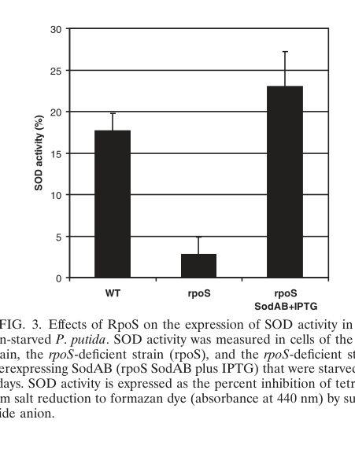

## Question

# Gene Research for Functional Annotation

## ⚠️ CRITICAL: Gene/Protein Identification Context

**BEFORE YOU BEGIN RESEARCH:** You MUST verify you are researching the CORRECT gene/protein. Gene symbols can be ambiguous, especially for less well-characterized genes from non-model organisms.

### Target Gene/Protein Identity (from UniProt):
- **UniProt Accession:** Q88PD5
- **Protein Description:** RecName: Full=Superoxide dismutase [Fe]; EC=1.15.1.1;
- **Gene Information:** Name=sodB; OrderedLocusNames=PP_0915;
- **Organism (full):** Pseudomonas putida (strain ATCC 47054 / DSM 6125 / CFBP 8728 / NCIMB 11950 / KT2440).
- **Protein Family:** Belongs to the iron/manganese superoxide dismutase family.
- **Key Domains:** Mn/Fe_SOD. (IPR001189); Mn/Fe_SOD_BS. (IPR019833); Mn/Fe_SOD_C. (IPR019832); Mn/Fe_SOD_N. (IPR019831); Mn/Fe_SOD_N_sf. (IPR036324)

### MANDATORY VERIFICATION STEPS:

1. **Check if the gene symbol "sodB" matches the protein description above**
2. **Verify the organism is correct:** Pseudomonas putida (strain ATCC 47054 / DSM 6125 / CFBP 8728 / NCIMB 11950 / KT2440).
3. **Check if protein family/domains align with what you find in literature**
4. **If you find literature for a DIFFERENT gene with the same or similar symbol, STOP**

### If Gene Symbol is Ambiguous or You Cannot Find Relevant Literature:

**DO NOT PROCEED WITH RESEARCH ON A DIFFERENT GENE.** Instead:
- State clearly: "The gene symbol 'sodB' is ambiguous or literature is limited for this specific protein"
- Explain what you found (e.g., "Found extensive literature on a different gene with the same symbol in a different organism")
- Describe the protein based ONLY on the UniProt information provided above
- Suggest that the protein function can be inferred from domain/family information

### Research Target:

Please provide a comprehensive research report on the gene **sodB** (gene ID: sodB, UniProt: Q88PD5) in PSEPK.

The research report should be a detailed narrative explaining the function, biological processes, and localization of the gene product. Citations should be given for all claims.

You should prioritize authoritative reviews and primary scientific literature when conducting research. You can supplement
this with annotations you find in gene/protein databases, but these can be outdated or inaccurate.

We are specifically interested in the primary function of the gene - for enzymes, what reaction is catalyzed, and what is the substrate specificity? For transporters, what is the substrate? For structural proteins or adapters, what is the broader structural role? For signaling molecules, what is the role in the pathway.

We are interested in where in or outside the cell the gene product carries out its function.

We are also interested in the signaling or biochemical pathways in which the gene functions. We are less interested in broad pleiotropic effects, except where these elucidate the precise role.

Include evidence where possible. We are interested in both experimental evidence as well as inference from structure, evolution, or bioinformatic analysis. Precise studies should be prioritized over high-throughput, where available.

## Output

Question: You are an expert researcher providing comprehensive, well-cited information.

Provide detailed information focusing on:
1. Key concepts and definitions with current understanding
2. Recent developments and latest research (prioritize 2023-2024 sources)
3. Current applications and real-world implementations
4. Expert opinions and analysis from authoritative sources
5. Relevant statistics and data from recent studies

Format as a comprehensive research report with proper citations. Include URLs and publication dates where available.
Always prioritize recent, authoritative sources and provide specific citations for all major claims.

# Gene Research for Functional Annotation

## ⚠️ CRITICAL: Gene/Protein Identification Context

**BEFORE YOU BEGIN RESEARCH:** You MUST verify you are researching the CORRECT gene/protein. Gene symbols can be ambiguous, especially for less well-characterized genes from non-model organisms.

### Target Gene/Protein Identity (from UniProt):
- **UniProt Accession:** Q88PD5
- **Protein Description:** RecName: Full=Superoxide dismutase [Fe]; EC=1.15.1.1;
- **Gene Information:** Name=sodB; OrderedLocusNames=PP_0915;
- **Organism (full):** Pseudomonas putida (strain ATCC 47054 / DSM 6125 / CFBP 8728 / NCIMB 11950 / KT2440).
- **Protein Family:** Belongs to the iron/manganese superoxide dismutase family.
- **Key Domains:** Mn/Fe_SOD. (IPR001189); Mn/Fe_SOD_BS. (IPR019833); Mn/Fe_SOD_C. (IPR019832); Mn/Fe_SOD_N. (IPR019831); Mn/Fe_SOD_N_sf. (IPR036324)

### MANDATORY VERIFICATION STEPS:

1. **Check if the gene symbol "sodB" matches the protein description above**
2. **Verify the organism is correct:** Pseudomonas putida (strain ATCC 47054 / DSM 6125 / CFBP 8728 / NCIMB 11950 / KT2440).
3. **Check if protein family/domains align with what you find in literature**
4. **If you find literature for a DIFFERENT gene with the same or similar symbol, STOP**

### If Gene Symbol is Ambiguous or You Cannot Find Relevant Literature:

**DO NOT PROCEED WITH RESEARCH ON A DIFFERENT GENE.** Instead:
- State clearly: "The gene symbol 'sodB' is ambiguous or literature is limited for this specific protein"
- Explain what you found (e.g., "Found extensive literature on a different gene with the same symbol in a different organism")
- Describe the protein based ONLY on the UniProt information provided above
- Suggest that the protein function can be inferred from domain/family information

### Research Target:

Please provide a comprehensive research report on the gene **sodB** (gene ID: sodB, UniProt: Q88PD5) in PSEPK.

The research report should be a detailed narrative explaining the function, biological processes, and localization of the gene product. Citations should be given for all claims.

You should prioritize authoritative reviews and primary scientific literature when conducting research. You can supplement
this with annotations you find in gene/protein databases, but these can be outdated or inaccurate.

We are specifically interested in the primary function of the gene - for enzymes, what reaction is catalyzed, and what is the substrate specificity? For transporters, what is the substrate? For structural proteins or adapters, what is the broader structural role? For signaling molecules, what is the role in the pathway.

We are interested in where in or outside the cell the gene product carries out its function.

We are also interested in the signaling or biochemical pathways in which the gene functions. We are less interested in broad pleiotropic effects, except where these elucidate the precise role.

Include evidence where possible. We are interested in both experimental evidence as well as inference from structure, evolution, or bioinformatic analysis. Precise studies should be prioritized over high-throughput, where available.

# Research report: **sodB** (UniProt Q88PD5; locus **PP_0915**) in *Pseudomonas putida* KT2440

## 0. Target verification (critical disambiguation)
The gene symbol **sodB** is widely used across bacteria, but in *Pseudomonas putida* **KT2440** it is explicitly mapped to the ordered locus name **PP_0915** and annotated as an **iron-type superoxide dismutase (Fe-SOD)**, while **sodA** maps to **PP_0946** (Mn-SOD). (kim2014oxidativestressresponse pages 1-2, tarassova2009elevatedmutationfrequency pages 5-7)

This matches the user-provided UniProt entry **Q88PD5** (gene **sodB**, PP_0915; Mn/Fe_SOD family domains) and therefore the report below pertains to the correct protein/gene context. (kim2014oxidativestressresponse pages 1-2)

## 1. Key concepts and current understanding

### 1.1. What SodB is (definition)
**Superoxide dismutases (SODs)** are metalloenzymes that detoxify reactive oxygen species (ROS) by catalyzing the **dismutation of superoxide radical (O2•−) to O2 and H2O2**. In bacteria, H2O2 is then removed mainly by catalases/peroxidases. (kim2014oxidativestressresponse pages 1-2)

SODs are categorized by the metal cofactor used in catalysis (Cu/Zn-, Fe-, Mn-, Ni-SOD). Most *P. putida* strains encode both **Mn-SOD** and **Fe-SOD**, where **Fe-SOD is commonly encoded by sodB (or sodF)**. (kim2014oxidativestressresponse pages 1-2)

### 1.2. Specific annotation in KT2440
In *P. putida* KT2440:
- **sodB = PP_0915** (Fe-SOD) (kim2014oxidativestressresponse pages 1-2)
- **sodA = PP_0946** (Mn-SOD) (kim2014oxidativestressresponse pages 1-2)
- A **SodA–SodB heterodimer** has been reported in KT2440 cells (reviewed). (kim2014oxidativestressresponse pages 1-2)

### 1.3. Primary biochemical function and substrate specificity
**Reaction catalyzed:** dismutation of superoxide (O2•−) into oxygen (O2) and hydrogen peroxide (H2O2). (kim2014oxidativestressresponse pages 1-2)

**Substrate specificity:** the physiological substrate is superoxide; the retrieved KT2440-focused texts do not provide SodB kinetic constants or alternative substrates. (kim2014oxidativestressresponse pages 1-2)

**Cofactor usage:** KT2440 SodB is annotated as an **Fe-SOD**, while SodA is Mn-SOD; iron and manganese availability influence SOD expression in *P. putida*. (kim2014oxidativestressresponse pages 1-2)

## 2. Pathway and systems context (oxidative stress biology)

### 2.1. ROS detoxification pathway placement
The *P. putida* oxidative-stress detoxification cascade described in authoritative KT2440-focused review is:
1) **Superoxide (O2•−)** generated during aerobic metabolism and stress
2) detoxified by **SODs (SodA/SodB)** → **H2O2**
3) **H2O2** removed by catalases/peroxidases (e.g., KatA/KatB/Ahp systems). (kim2014oxidativestressresponse pages 1-2)

### 2.2. Regulation and network integration (what is known for KT2440)
**Metal availability & growth phase:** Expression of **sodA and sodB** is reported to be differentially regulated by **growth phase** and by **iron and manganese** availability; these metals are essential cofactors and are important in regulation of sod transcription. (kim2014oxidativestressresponse pages 1-2, kim2014oxidativestressresponse pages 2-4)

**RpoS (stationary phase / starvation):** In carbon-starved stationary-phase cells, an **rpoS-deficient** *P. putida* strain shows an approximately **fivefold lower SOD activity** than WT; the authors conclude SOD expression is under positive control of **RpoS**, and explicitly state RpoS is important for regulating **sodA and sodB**. (tarassova2009elevatedmutationfrequency pages 5-7)

**OxyR (peroxide response):** Catalase genes (KatA/KatB) are stated to be under control of **OxyR** in *P. putida*; this places SodB upstream of peroxide detoxification, but the retrieved excerpts do not provide direct OxyR→sodB regulation evidence. (tarassova2009elevatedmutationfrequency pages 5-7)

**SoxR paradigm differs from enterics:** *P. putida* oxidative-stress regulation differs from the classic *E. coli* SoxR/SoxS model. A transcriptomics study reports SoxR is not responsive to oxidative stress in *P. putida* and that typical SoxR-regulon genes in enterics (including sodA) are SoxR-independent in *P. putida*. (bojanovic2017globaltranscriptionalresponses pages 10-11)

### 2.3. Localization
The retrieved KT2440-focused sources did **not** explicitly state SodB subcellular localization (cytosol vs periplasm) or provide signal peptide evidence. Therefore, this report cannot cite experimental localization for SodB from the retrieved full text. (kim2014oxidativestressresponse pages 4-5, kim2014oxidativestressresponse pages 5-6)

## 3. Phenotypic and quantitative evidence in *P. putida* relevant to SodB function

### 3.1. Phenol-induced stress proteomics
Under sudden exposure to phenol, quantitative proteomics reported **SodB (Fe)** upregulation with induction folds of:
- **1.5×** at **600 mg/L phenol**
- **1.7×** at **800 mg/L phenol**
This supports a role in chemical-stress-associated ROS management during exposure to toxic aromatics. (santos2004insightsintopseudomonas pages 6-7)

### 3.2. Starvation stress, survival, and genome stability (RpoS link)
Tarassova et al. (2009) provide quantitative evidence connecting SOD capacity (from sodA/sodB) to survival and mutation accumulation in starving *P. putida*:
- **~5-fold decline** in SOD activity in an rpoS-deficient strain vs WT after 8 days starvation (tarassova2009elevatedmutationfrequency pages 5-7)
- Overexpression of a chromosomal **Ptac-sodA-sodB** cassette restored SOD activity to WT-like levels (tarassova2009elevatedmutationfrequency pages 5-7)
- SodAB overexpression increased survival of starving rpoS-deficient cells by **~10-fold** and reduced accumulation of base-substitution revertants by **~2.5-fold** (tarassova2009elevatedmutationfrequency pages 5-7)

Figure-based visual evidence for these quantitative effects is available from the same paper (Fig. 3 and Fig. 4). (tarassova2009elevatedmutationfrequency media 8659f34f, tarassova2009elevatedmutationfrequency media 8e16e747)

### 3.3. Oxidants and induction behavior
In a global transcriptional study, **sodA and sodB were not differentially expressed after addition of H2O2** in KT2440, consistent with the concept that SODs detoxify superoxide rather than peroxide and that peroxide detoxification is handled largely by catalases/peroxidases. (bojanovic2017globaltranscriptionalresponses pages 10-11)

## 4. Recent developments (prioritizing 2023–2024) and implications for functional annotation

### 4.1. 2024: Engineering KT2440 for saline bioremediation (application context for oxidative stress robustness)
A 2024 study engineered KT2440 for improved salt tolerance and demonstrated pollutant degradation under high salinity:
- WT KT2440 tolerated **4% w/v NaCl** in minimal salts medium.
- Engineering (co-expression of **EcnhaA** Na+/H+ antiporter + **betB**) raised tolerance to **5% w/v NaCl**, and with compatible solute supplementation to **6% w/v NaCl**.
- Under **4% NaCl**, engineered KT2440 degraded **56.70% benzoic acid** and **95.64% protocatechuic acid** in **48 h**, whereas WT showed **no biodegradation** under those conditions.
These data are not SodB-specific, but they reinforce the importance of stress-defense networks (including redox/ROS management) for real-world deployment of *P. putida* chassis strains in harsh environments. (fan2024improvementinsalt pages 1-2, fan2024improvementinsalt pages 10-12)

### 4.2. 2024: P. putida group genomics and taxonomy (context for transferring annotations)
A 2024 FEMS Microbiology Reviews paper emphasizes that many genomes labeled “*P. putida*” in databases actually fall into distinct cliques/species within the *P. putida* group, highlighting the need for caution when transferring annotations across strains/species. This is directly relevant to sodB annotation practice because SodB homologs are widespread and functional assumptions should track strain/species identity carefully. (udaondo2024unravelingthegenomic pages 9-12)

### 4.3. 2024: Multi-omics co-culture work illustrates SOD as a stress-response node (systems-level view)
In a 2024 Communications Biology multi-omics co-culture study, the authors discuss superoxide dismutase within the glutathione-independent oxidative stress handling toolkit (catalases/peroxidases/SODs). While the sodB quantitative example shown is for the cyanobacterial partner (SodB log2-FC 1.5 in *S. elongatus*), the paper also frames *P. putida* as a stress-tolerant co-culture partner and discusses ROS as a major stress factor for heterotrophs near photosynthetic organisms. This supports the broader expert view that robust antioxidant systems are part of why pseudomonads perform well in mixed communities and biotechnology. (kratzl2024pseudomonasputidaas pages 11-12, kratzl2024pseudomonasputidaas pages 10-11)

## 5. Expert synthesis and authoritative interpretation

### 5.1. Why SodB matters in KT2440 physiology
Across the retrieved KT2440-focused literature, SodB is consistently positioned as part of the primary defense against superoxide generated during aerobic metabolism and environmental challenges, including pollutant exposure. (kim2014oxidativestressresponse pages 1-2, santos2004insightsintopseudomonas pages 6-7)

### 5.2. Regulatory nuance important for engineering
A key expert takeaway is that *P. putida* oxidative-stress regulation is **not isomorphic to *E. coli***: paraquat/oxidant responses and the SoxR regulatory logic differ, which affects how one should interpret expression data or design biosensors/engineering strategies around superoxide stress and SOD genes. (bojanovic2017globaltranscriptionalresponses pages 10-11, kim2014oxidativestressresponse pages 1-2)

### 5.3. Genome stability and stress survival
The starvation study provides a clear mechanistic link from stationary-phase regulation (RpoS) → SOD capacity → survival and reduced mutation accumulation, implicating SodA/SodB capacity as a contributor to both stress tolerance and maintenance of genome integrity under prolonged nutrient limitation. (tarassova2009elevatedmutationfrequency pages 5-7)

## 6. Evidence summary table
The following table compiles the strongest retrieved evidence for KT2440 SodB identity, function, regulation, and quantitative phenotypes/applications.

| Claim/Topic | Key details (include quantitative numbers) | Evidence source (paper + year) | URL/DOI | Notes/limitations |
|---|---|---|---|---|
| Gene identity and matched locus tags | In *Pseudomonas putida* KT2440, **sodB = PP_0915** and **sodA = PP_0946**; sodB is the **iron-containing superoxide dismutase (Fe-SOD)** in this strain, matching the UniProt target Q88PD5 rather than unrelated sodB genes from other organisms. (kim2014oxidativestressresponse pages 1-2, tarassova2009elevatedmutationfrequency pages 5-7) | Kim & Park 2014; Tarassova et al. 2009 | https://doi.org/10.1007/s00253-014-5883-4; https://doi.org/10.1128/JB.01803-08 | Identity is well supported at the strain/locus level; UniProt accession itself was provided by the user, not extracted from these papers. |
| Core enzymatic reaction and cofactor class | SODs catalyze dismutation of **superoxide (O2•−) to O2 and H2O2**; P. putida SODs are classified by metal cofactor, with **Fe-SOD (sodB/sodF)** and **Mn-SOD (sodA/sodM)** present in most strains. (kim2014oxidativestressresponse pages 1-2) | Kim & Park 2014 | https://doi.org/10.1007/s00253-014-5883-4 | Review-level evidence; no KT2440-specific kinetic constants for SodB were recovered in the available contexts. |
| SodA–SodB heterodimer | KT2440 reportedly produces a **SodA–SodB heterodimer**, indicating interaction between Mn-SOD and Fe-SOD isoforms in vivo. (kim2014oxidativestressresponse pages 1-2) | Kim & Park 2014 | https://doi.org/10.1007/s00253-014-5883-4 | Statement is cited in the review from earlier primary literature; the original heterodimer paper was not directly available in the retrieved full text. |
| Regulation by growth phase and metals | Expression of **sodA and sodB** is reported to be **differentially regulated by growth phase, iron, and manganese**; Fe and Mn are described as essential SOD cofactors that influence transcription/activity. (kim2014oxidativestressresponse pages 1-2, kim2014oxidativestressresponse pages 2-4) | Kim & Park 2014 | https://doi.org/10.1007/s00253-014-5883-4 | Available excerpts do not provide numerical fold-changes for Fe/Mn regulation or direct Fur-binding data for KT2440 sodB. |
| Paraquat regulation differs from *E. coli* paradigm | In *P. putida*, **paraquat does not induce sod transcription or increase SOD activity**, unlike the classic *E. coli* SoxR/SoxS paradigm. Yet loss of antioxidant SOD capacity matters physiologically. (kim2014oxidativestressresponse pages 2-4, bojanovic2017globaltranscriptionalresponses pages 10-11) | Kim & Park 2014; Bojanovič et al. 2017 | https://doi.org/10.1007/s00253-014-5883-4; https://doi.org/10.1128/AEM.03236-16 | Evidence supports non-induction by paraquat/H2O2 in KT2440, but direct sodB-only mutant data were not recovered here. |
| Functional phenotype of sodA/sodB loss | Although paraquat does not induce sod genes, **deletion of both sodA and sodB increases paraquat sensitivity** and causes **impaired growth on roots/root colonization**, attributed to oxidative inactivation of sensitive metabolic enzymes. (kim2014oxidativestressresponse pages 2-4) | Kim & Park 2014 | https://doi.org/10.1007/s00253-014-5883-4 | Phenotype is for the **double mutant**, so the relative contribution of SodB alone versus SodA is not resolved in the available excerpts. |
| Phenol-stress proteomic induction | Under sudden phenol exposure, KT2440 **SodB (Fe)** was upregulated in proteomics with **1.5-fold induction at 600 mg/L phenol** and **1.7-fold at 800 mg/L phenol**. (santos2004insightsintopseudomonas pages 6-7) | Santos et al. 2004 | https://doi.org/10.1002/pmic.200300793 | Protein-level evidence under a defined chemical stress; does not prove direct transcriptional regulation or isolate SodB-specific necessity. |
| RpoS-dependent antioxidant control | In carbon-starved stationary-phase cells, an **rpoS-deficient strain showed ~5-fold lower SOD activity** than WT, indicating positive control of sodA/sodB expression by **RpoS** under starvation/stationary-phase stress. (tarassova2009elevatedmutationfrequency pages 5-7) | Tarassova et al. 2009 | https://doi.org/10.1128/JB.01803-08 | Activity assay measured total SOD activity, not SodB alone; effect likely reflects combined SodA/SodB regulation. |
| SodAB overexpression rescues oxidative-stress phenotypes | Chromosomal **Ptac-sodAsodB** overexpression restored SOD activity in the rpoS mutant to near WT levels, **increased survival about 10-fold** during long-term starvation, and **reduced accumulation of Phe+ revertants ~2.5-fold**. (tarassova2009elevatedmutationfrequency pages 5-7, tarassova2009elevatedmutationfrequency media 8659f34f) | Tarassova et al. 2009 | https://doi.org/10.1128/JB.01803-08 | Rescue used **combined sodA+sodB overexpression**, so it supports antioxidant function but not a SodB-only quantitative attribution. |
| Oxidative-stress pathway context | SodB is part of the cytoprotective ROS-detoxification layer where SOD converts superoxide to H2O2, which is then removed by catalase/peroxiredoxin systems; KT2440 oxidative-stress regulation involves **OxyR, SoxR, FinR, and HexR**, but direct sodB targeting is not firmly established in the available excerpts. (kim2014oxidativestressresponse pages 1-2, bojanovic2017globaltranscriptionalresponses pages 10-11) | Kim & Park 2014; Bojanovič et al. 2017 | https://doi.org/10.1007/s00253-014-5883-4; https://doi.org/10.1128/AEM.03236-16 | Strong pathway context, but direct regulator–promoter evidence for **sodB** specifically is limited in the retrieved material. |

*Table: This table compiles the strongest retrieved evidence for the identity, biochemical function, regulation, and stress-related phenotypes of *Pseudomonas putida* KT2440 SodB (PP_0915). It highlights quantitative findings and flags where current evidence is indirect, review-based, or reflects combined SodA/SodB effects rather than SodB alone.*

## 7. Key limitations and gaps (based on retrieved full text)
1. **Subcellular localization** of KT2440 SodB (cytosolic vs periplasmic) was not explicitly stated in the retrieved excerpts; therefore, localization is not claimed beyond general pathway placement. (kim2014oxidativestressresponse pages 5-6)
2. **Kinetic parameters** (kcat/KM), metal-binding stoichiometry, and biochemical characterization specific to KT2440 SodB were not retrieved here; additional targeted structural/enzymology literature would be required for enzyme-kinetics-level annotation. (kim2014oxidativestressresponse pages 1-2)
3. Several quantitative/phenotypic datasets are for **combined SodA+SodB** effects (double mutants or dual overexpression), so attribution to SodB alone is limited in the currently retrieved evidence. (tarassova2009elevatedmutationfrequency pages 5-7, kim2014oxidativestressresponse pages 2-4)

## 8. URLs and publication dates (key sources cited)
- Kim & Park. “Oxidative stress response in *Pseudomonas putida*.” *Applied Microbiology and Biotechnology* (Published online 2014-06-24). https://doi.org/10.1007/s00253-014-5883-4 (kim2014oxidativestressresponse pages 1-2)
- Tarassova et al. “Elevated mutation frequency… caused by reduced expression of superoxide dismutase and catalase.” *Journal of Bacteriology* (2009-06). https://doi.org/10.1128/JB.01803-08 (tarassova2009elevatedmutationfrequency pages 5-7)
- Santos et al. “Response to phenol-induced stress by quantitative proteomics.” *PROTEOMICS* (2004-09). https://doi.org/10.1002/pmic.200300793 (santos2004insightsintopseudomonas pages 6-7)
- Bojanovič et al. “Global transcriptional responses to osmotic, oxidative, and imipenem stress…” *Applied and Environmental Microbiology* (2017-04). https://doi.org/10.1128/aem.03236-16 (bojanovic2017globaltranscriptionalresponses pages 10-11)
- Fan et al. “Improvement in Salt Tolerance Ability of *Pseudomonas putida* KT2440.” *Biology* (2024-06). https://doi.org/10.3390/biology13060404 (fan2024improvementinsalt pages 1-2)
- Udaondo et al. “Unraveling the genomic diversity of the *Pseudomonas putida* group…” *FEMS Microbiology Reviews* (2024-10). https://doi.org/10.1093/femsre/fuae025 (udaondo2024unravelingthegenomic pages 9-12)
- Kratzl et al. “*Pseudomonas putida* as saviour…” *Communications Biology* (2024-04). https://doi.org/10.1038/s42003-024-06098-5 (kratzl2024pseudomonasputidaas pages 11-12)

References

1. (kim2014oxidativestressresponse pages 1-2): Jisun Kim and Woojun Park. Oxidative stress response in pseudomonas putida. Applied Microbiology and Biotechnology, 98:6933-6946, Jun 2014. URL: https://doi.org/10.1007/s00253-014-5883-4, doi:10.1007/s00253-014-5883-4. This article has 144 citations and is from a domain leading peer-reviewed journal.

2. (tarassova2009elevatedmutationfrequency pages 5-7): Kairi Tarassova, Radi Tegova, Andres Tover, Riho Teras, Mariliis Tark, Signe Saumaa, and Maia Kivisaar. Elevated mutation frequency in surviving populations of carbon-starved <i>rpos</i> -deficient <i>pseudomonas putida</i> is caused by reduced expression of superoxide dismutase and catalase. Jun 2009. URL: https://doi.org/10.1128/jb.01803-08, doi:10.1128/jb.01803-08. This article has 23 citations and is from a peer-reviewed journal.

3. (kim2014oxidativestressresponse pages 2-4): Jisun Kim and Woojun Park. Oxidative stress response in pseudomonas putida. Applied Microbiology and Biotechnology, 98:6933-6946, Jun 2014. URL: https://doi.org/10.1007/s00253-014-5883-4, doi:10.1007/s00253-014-5883-4. This article has 144 citations and is from a domain leading peer-reviewed journal.

4. (bojanovic2017globaltranscriptionalresponses pages 10-11): Klara Bojanovič, Isotta D'Arrigo, and Katherine S. Long. Global transcriptional responses to osmotic, oxidative, and imipenem stress conditions in pseudomonas putida. Applied and Environmental Microbiology, Apr 2017. URL: https://doi.org/10.1128/aem.03236-16, doi:10.1128/aem.03236-16. This article has 83 citations and is from a peer-reviewed journal.

5. (kim2014oxidativestressresponse pages 4-5): Jisun Kim and Woojun Park. Oxidative stress response in pseudomonas putida. Applied Microbiology and Biotechnology, 98:6933-6946, Jun 2014. URL: https://doi.org/10.1007/s00253-014-5883-4, doi:10.1007/s00253-014-5883-4. This article has 144 citations and is from a domain leading peer-reviewed journal.

6. (kim2014oxidativestressresponse pages 5-6): Jisun Kim and Woojun Park. Oxidative stress response in pseudomonas putida. Applied Microbiology and Biotechnology, 98:6933-6946, Jun 2014. URL: https://doi.org/10.1007/s00253-014-5883-4, doi:10.1007/s00253-014-5883-4. This article has 144 citations and is from a domain leading peer-reviewed journal.

7. (santos2004insightsintopseudomonas pages 6-7): Pedro M. Santos, Dirk Benndorf, and Isabel Sá‐Correia. Insights into pseudomonas putida kt2440 response to phenol‐induced stress by quantitative proteomics. PROTEOMICS, 4:2640-2652, Sep 2004. URL: https://doi.org/10.1002/pmic.200300793, doi:10.1002/pmic.200300793. This article has 282 citations and is from a peer-reviewed journal.

8. (tarassova2009elevatedmutationfrequency media 8659f34f): Kairi Tarassova, Radi Tegova, Andres Tover, Riho Teras, Mariliis Tark, Signe Saumaa, and Maia Kivisaar. Elevated mutation frequency in surviving populations of carbon-starved <i>rpos</i> -deficient <i>pseudomonas putida</i> is caused by reduced expression of superoxide dismutase and catalase. Jun 2009. URL: https://doi.org/10.1128/jb.01803-08, doi:10.1128/jb.01803-08. This article has 23 citations and is from a peer-reviewed journal.

9. (tarassova2009elevatedmutationfrequency media 8e16e747): Kairi Tarassova, Radi Tegova, Andres Tover, Riho Teras, Mariliis Tark, Signe Saumaa, and Maia Kivisaar. Elevated mutation frequency in surviving populations of carbon-starved <i>rpos</i> -deficient <i>pseudomonas putida</i> is caused by reduced expression of superoxide dismutase and catalase. Jun 2009. URL: https://doi.org/10.1128/jb.01803-08, doi:10.1128/jb.01803-08. This article has 23 citations and is from a peer-reviewed journal.

10. (fan2024improvementinsalt pages 1-2): Min Fan, Shuyu Tan, Wei Wang, and Xuehong Zhang. Improvement in salt tolerance ability of pseudomonas putida kt2440. Biology, 13:404, Jun 2024. URL: https://doi.org/10.3390/biology13060404, doi:10.3390/biology13060404. This article has 25 citations.

11. (fan2024improvementinsalt pages 10-12): Min Fan, Shuyu Tan, Wei Wang, and Xuehong Zhang. Improvement in salt tolerance ability of pseudomonas putida kt2440. Biology, 13:404, Jun 2024. URL: https://doi.org/10.3390/biology13060404, doi:10.3390/biology13060404. This article has 25 citations.

12. (udaondo2024unravelingthegenomic pages 9-12): Zulema Udaondo, Juan-Luis Ramos, and Kaleb Z. Abram. Unraveling the genomic diversity of the pseudomonas putida group: exploring taxonomy, core pangenome, and antibiotic resistance mechanisms. FEMS Microbiology Reviews, Oct 2024. URL: https://doi.org/10.1093/femsre/fuae025, doi:10.1093/femsre/fuae025. This article has 12 citations and is from a domain leading peer-reviewed journal.

13. (kratzl2024pseudomonasputidaas pages 11-12): Franziska Kratzl, Marlene Urban, Jagroop Pandhal, Mengxun Shi, Chen Meng, Karin Kleigrewe, Andreas Kremling, and Katharina Pflüger-Grau. Pseudomonas putida as saviour for troubled synechococcus elongatus in a synthetic co-culture – interaction studies based on a multi-omics approach. Communications Biology, Apr 2024. URL: https://doi.org/10.1038/s42003-024-06098-5, doi:10.1038/s42003-024-06098-5. This article has 8 citations and is from a peer-reviewed journal.

14. (kratzl2024pseudomonasputidaas pages 10-11): Franziska Kratzl, Marlene Urban, Jagroop Pandhal, Mengxun Shi, Chen Meng, Karin Kleigrewe, Andreas Kremling, and Katharina Pflüger-Grau. Pseudomonas putida as saviour for troubled synechococcus elongatus in a synthetic co-culture – interaction studies based on a multi-omics approach. Communications Biology, Apr 2024. URL: https://doi.org/10.1038/s42003-024-06098-5, doi:10.1038/s42003-024-06098-5. This article has 8 citations and is from a peer-reviewed journal.

## Artifacts

- [Edison artifact artifact-00](sodB-deep-research-falcon_artifacts/artifact-00.md)

## Citations

1. kim2014oxidativestressresponse pages 1-2
2. tarassova2009elevatedmutationfrequency pages 5-7
3. bojanovic2017globaltranscriptionalresponses pages 10-11
4. santos2004insightsintopseudomonas pages 6-7
5. udaondo2024unravelingthegenomic pages 9-12
6. kim2014oxidativestressresponse pages 2-4
7. kim2014oxidativestressresponse pages 5-6
8. fan2024improvementinsalt pages 1-2
9. kratzl2024pseudomonasputidaas pages 11-12
10. kim2014oxidativestressresponse pages 4-5
11. fan2024improvementinsalt pages 10-12
12. kratzl2024pseudomonasputidaas pages 10-11
13. Fe
14. https://doi.org/10.1007/s00253-014-5883-4;
15. https://doi.org/10.1128/JB.01803-08
16. https://doi.org/10.1007/s00253-014-5883-4
17. https://doi.org/10.1128/AEM.03236-16
18. https://doi.org/10.1002/pmic.200300793
19. https://doi.org/10.1128/aem.03236-16
20. https://doi.org/10.3390/biology13060404
21. https://doi.org/10.1093/femsre/fuae025
22. https://doi.org/10.1038/s42003-024-06098-5
23. https://doi.org/10.1007/s00253-014-5883-4,
24. https://doi.org/10.1128/jb.01803-08,
25. https://doi.org/10.1128/aem.03236-16,
26. https://doi.org/10.1002/pmic.200300793,
27. https://doi.org/10.3390/biology13060404,
28. https://doi.org/10.1093/femsre/fuae025,
29. https://doi.org/10.1038/s42003-024-06098-5,