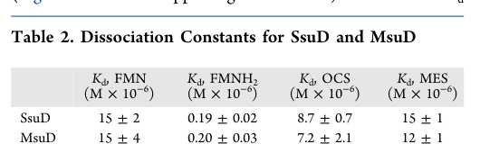

## Question

# Gene Research for Functional Annotation

## ⚠️ CRITICAL: Gene/Protein Identification Context

**BEFORE YOU BEGIN RESEARCH:** You MUST verify you are researching the CORRECT gene/protein. Gene symbols can be ambiguous, especially for less well-characterized genes from non-model organisms.

### Target Gene/Protein Identity (from UniProt):
- **UniProt Accession:** Q88R95
- **Protein Description:** RecName: Full=Alkanesulfonate monooxygenase {ECO:0000255|HAMAP-Rule:MF_01229}; EC=1.14.14.5 {ECO:0000255|HAMAP-Rule:MF_01229}; AltName: Full=FMNH2-dependent aliphatic sulfonate monooxygenase {ECO:0000255|HAMAP-Rule:MF_01229};
- **Gene Information:** Name=ssuD {ECO:0000255|HAMAP-Rule:MF_01229}; OrderedLocusNames=PP_0238;
- **Organism (full):** Pseudomonas putida (strain ATCC 47054 / DSM 6125 / CFBP 8728 / NCIMB 11950 / KT2440).
- **Protein Family:** Belongs to the SsuD family. {ECO:0000255|HAMAP-
- **Key Domains:** Alkanesulphonate_mOase_FMN-dep. (IPR019911); Luciferase-like_dom. (IPR011251); Luciferase-like_sf. (IPR036661); SsuD_RutA_monooxygenase. (IPR050172); Bac_luciferase (PF00296)

### MANDATORY VERIFICATION STEPS:

1. **Check if the gene symbol "ssuD" matches the protein description above**
2. **Verify the organism is correct:** Pseudomonas putida (strain ATCC 47054 / DSM 6125 / CFBP 8728 / NCIMB 11950 / KT2440).
3. **Check if protein family/domains align with what you find in literature**
4. **If you find literature for a DIFFERENT gene with the same or similar symbol, STOP**

### If Gene Symbol is Ambiguous or You Cannot Find Relevant Literature:

**DO NOT PROCEED WITH RESEARCH ON A DIFFERENT GENE.** Instead:
- State clearly: "The gene symbol 'ssuD' is ambiguous or literature is limited for this specific protein"
- Explain what you found (e.g., "Found extensive literature on a different gene with the same symbol in a different organism")
- Describe the protein based ONLY on the UniProt information provided above
- Suggest that the protein function can be inferred from domain/family information

### Research Target:

Please provide a comprehensive research report on the gene **ssuD** (gene ID: ssuD, UniProt: Q88R95) in PSEPK.

The research report should be a detailed narrative explaining the function, biological processes, and localization of the gene product. Citations should be given for all claims.

You should prioritize authoritative reviews and primary scientific literature when conducting research. You can supplement
this with annotations you find in gene/protein databases, but these can be outdated or inaccurate.

We are specifically interested in the primary function of the gene - for enzymes, what reaction is catalyzed, and what is the substrate specificity? For transporters, what is the substrate? For structural proteins or adapters, what is the broader structural role? For signaling molecules, what is the role in the pathway.

We are interested in where in or outside the cell the gene product carries out its function.

We are also interested in the signaling or biochemical pathways in which the gene functions. We are less interested in broad pleiotropic effects, except where these elucidate the precise role.

Include evidence where possible. We are interested in both experimental evidence as well as inference from structure, evolution, or bioinformatic analysis. Precise studies should be prioritized over high-throughput, where available.

## Output

Question: You are an expert researcher providing comprehensive, well-cited information.

Provide detailed information focusing on:
1. Key concepts and definitions with current understanding
2. Recent developments and latest research (prioritize 2023-2024 sources)
3. Current applications and real-world implementations
4. Expert opinions and analysis from authoritative sources
5. Relevant statistics and data from recent studies

Format as a comprehensive research report with proper citations. Include URLs and publication dates where available.
Always prioritize recent, authoritative sources and provide specific citations for all major claims.

# Gene Research for Functional Annotation

## ⚠️ CRITICAL: Gene/Protein Identification Context

**BEFORE YOU BEGIN RESEARCH:** You MUST verify you are researching the CORRECT gene/protein. Gene symbols can be ambiguous, especially for less well-characterized genes from non-model organisms.

### Target Gene/Protein Identity (from UniProt):
- **UniProt Accession:** Q88R95
- **Protein Description:** RecName: Full=Alkanesulfonate monooxygenase {ECO:0000255|HAMAP-Rule:MF_01229}; EC=1.14.14.5 {ECO:0000255|HAMAP-Rule:MF_01229}; AltName: Full=FMNH2-dependent aliphatic sulfonate monooxygenase {ECO:0000255|HAMAP-Rule:MF_01229};
- **Gene Information:** Name=ssuD {ECO:0000255|HAMAP-Rule:MF_01229}; OrderedLocusNames=PP_0238;
- **Organism (full):** Pseudomonas putida (strain ATCC 47054 / DSM 6125 / CFBP 8728 / NCIMB 11950 / KT2440).
- **Protein Family:** Belongs to the SsuD family. {ECO:0000255|HAMAP-
- **Key Domains:** Alkanesulphonate_mOase_FMN-dep. (IPR019911); Luciferase-like_dom. (IPR011251); Luciferase-like_sf. (IPR036661); SsuD_RutA_monooxygenase. (IPR050172); Bac_luciferase (PF00296)

### MANDATORY VERIFICATION STEPS:

1. **Check if the gene symbol "ssuD" matches the protein description above**
2. **Verify the organism is correct:** Pseudomonas putida (strain ATCC 47054 / DSM 6125 / CFBP 8728 / NCIMB 11950 / KT2440).
3. **Check if protein family/domains align with what you find in literature**
4. **If you find literature for a DIFFERENT gene with the same or similar symbol, STOP**

### If Gene Symbol is Ambiguous or You Cannot Find Relevant Literature:

**DO NOT PROCEED WITH RESEARCH ON A DIFFERENT GENE.** Instead:
- State clearly: "The gene symbol 'ssuD' is ambiguous or literature is limited for this specific protein"
- Explain what you found (e.g., "Found extensive literature on a different gene with the same symbol in a different organism")
- Describe the protein based ONLY on the UniProt information provided above
- Suggest that the protein function can be inferred from domain/family information

### Research Target:

Please provide a comprehensive research report on the gene **ssuD** (gene ID: ssuD, UniProt: Q88R95) in PSEPK.

The research report should be a detailed narrative explaining the function, biological processes, and localization of the gene product. Citations should be given for all claims.

You should prioritize authoritative reviews and primary scientific literature when conducting research. You can supplement
this with annotations you find in gene/protein databases, but these can be outdated or inaccurate.

We are specifically interested in the primary function of the gene - for enzymes, what reaction is catalyzed, and what is the substrate specificity? For transporters, what is the substrate? For structural proteins or adapters, what is the broader structural role? For signaling molecules, what is the role in the pathway.

We are interested in where in or outside the cell the gene product carries out its function.

We are also interested in the signaling or biochemical pathways in which the gene functions. We are less interested in broad pleiotropic effects, except where these elucidate the precise role.

Include evidence where possible. We are interested in both experimental evidence as well as inference from structure, evolution, or bioinformatic analysis. Precise studies should be prioritized over high-throughput, where available.

# Comprehensive Research Report: **ssuD (UniProt Q88R95; locus PP_0238)** in *Pseudomonas putida* KT2440

## 0) Target verification (mandatory disambiguation)
The UniProt target **Q88R95** is annotated as **alkan(es)ulfonate monooxygenase SsuD** (EC **1.14.14.5**), an **FMNH2-dependent aliphatic sulfonate monooxygenase** belonging to the **SsuD family**. In *Pseudomonas*, **ssuD** is consistently described as the oxygenase component of a two-component system with **SsuE** (an NADPH:FMN reductase), encoded in a sulfate-starvation-induced **ssu locus/operon** that supports growth on organosulfur compounds. This functional identity is strongly supported by genetic and biochemical characterization of the *Pseudomonas putida* **ssuEADCBF** locus (strain S-313), including explicit description of SsuD as an **FMNH2-dependent monooxygenase/desulfonating oxygenase** and SsuE as the **FMN reductase** partner, with ssu expression induced during sulfate starvation. (https://doi.org/10.1128/jb.182.10.2869-2878.2000; May 2000) (kahnert2000thessulocus pages 3-4, kahnert2000thessulocus pages 6-7)

**Critical scope note:** In the retrieved literature, **direct wet-lab characterization of PP_0238/Q88R95 in KT2440 specifically** was not found. Therefore, KT2440 functional annotation below combines: (i) KT2440 genome-level evidence for sulfonate/taurine/sulfate transport capacity, and (ii) strong **operon-level and enzyme-mechanism conservation** from experimentally characterized *Pseudomonas* ssu loci and SsuD homolog studies. (santos2004insightsintothe pages 8-10, kahnert2000thessulocus pages 3-4)

---

## 1) Key concepts and definitions (current understanding)

### 1.1 What SsuD is
**SsuD is an FMNH2-dependent alkanesulfonate monooxygenase (desulfonative oxygenase)** that enables bacteria to use **alkanesulfonates** (and in some organisms certain aryl/alkyl sulfonates) as alternative sulfur sources when inorganic sulfate is limiting. In *Pseudomonas*, SsuD operates with **SsuE**, an **NADPH-dependent FMN reductase** that supplies reduced flavin (FMNH2). (maren2001sulfateesterutilization pages 13-20, maren2001sulfateesterutilization pages 60-64, kahnert2000thessulocus pages 6-7)

A key mechanistic concept is that **FMNH2 is used as a diffusible cosubstrate rather than a tightly bound prosthetic group** in this two-component monooxygenase system: SsuE reduces FMN using NADPH, and the reduced flavin is then used by SsuD for the oxygenation step. (abdurachim2007studiestoelucidate pages 54-58, maren2001sulfateesterutilization pages 60-64)

### 1.2 Canonical reaction and products
For **aliphatic sulfonates**, desulfonation by SsuD/SsuE is commonly described as proceeding via **α-oxygenation** of the sulfonate, producing an unstable hydroxysulfonate intermediate that decomposes to an **aldehyde** and **sulfite** (SO3^2−), thereby releasing sulfur in a form that can be assimilated. (maren2001sulfateesterutilization pages 60-64)

For **aromatic sulfonates** in *Pseudomonas*, utilization can require additional gene products beyond ssuD/ssuE (e.g., asf genes), and the process yields **phenolic products + sulfite**; SsuE is described as particularly important for aromatic sulfonate utilization and may contribute structurally to a larger enzyme complex. (maren2001sulfateesterutilization pages 60-64, maren2001sulfateesterutilization pages 142-145, kahnert2000thessulocus pages 6-7)

### 1.3 Pathway context: the ssu locus / operon
In *Pseudomonas putida* S-313, the **ssuEADCBF** locus encodes two functional modules: (i) an **ABC-type transport system** (SsuA/SsuB/SsuC) for sulfonate uptake, and (ii) the **two-component monooxygenase** (SsuD oxygenase + SsuE FMN reductase), with an additional small protein **SsuF** (function less clear) encoded in the cluster. (https://doi.org/10.1128/jb.182.10.2869-2878.2000; May 2000) (kahnert2000thessulocus pages 3-4)

Expression of these organosulfur acquisition systems is reported to occur under **sulfate starvation** (i.e., when sulfate is absent), consistent with the “sulfate starvation-induced stimulon” concept. (maren2001sulfateesterutilization pages 57-60, kahnert2000thessulocus pages 6-7)

---

## 2) Molecular function of SsuD: substrate specificity and mechanism

### 2.1 Core mechanism and protein features (authoritative mechanistic evidence)
Mechanistic work on SsuD homologs describes SsuD as a **monofunctional flavin-dependent monooxygenase** that performs the **oxidative half-reaction** and depends on **externally supplied FMNH2**. Structural descriptions indicate oligomerization (homotetramer reported for *E. coli* SsuD) and a TIM-barrel-like fold with conserved active-site residues important for catalysis and/or gating. (abdurachim2007studiestoelucidate pages 54-58)

A more recent structure-function study emphasizes that FMNH2/substrate binding induces conformational changes including **closure of a mobile loop** over the active site, which is important for excluding solvent and stabilizing reactive intermediates during desulfonation. (https://doi.org/10.1021/acs.biochem.2c00586; Dec 2022) (somai2022shorteralkanesulfonatecarbon pages 1-2, somai2022shorteralkanesulfonatecarbon pages 4-5)

### 2.2 Quantitative substrate-range evidence (kinetics and binding)
A recent steady-state analysis compared an SsuD with the related MsuD and showed that **substrate carbon-chain length can strongly affect catalytic competence**. Under the reported conditions, SsuD showed measurable activity on **C4–C10** alkanesulfonates with increasing catalytic efficiency for longer chains (e.g., SsuD kcat/Km for decanesulfonate reported as 3.4 × 10^4 M^−1 s^−1), whereas SsuD activity on **methanesulfonate (C1)** could not be determined in that assay system. (somai2022shorteralkanesulfonatecarbon pages 3-4, somai2022shorteralkanesulfonatecarbon pages 4-5)

Notably, **binding affinity does not necessarily predict turnover**: SsuD bound methanesulfonate with **Kd = 15 ± 1 µM**, similar to its binding of octanesulfonate (Kd = 8.7 ± 0.7 µM), yet did not show detectable sulfite production from methanesulfonate under the experimental conditions. This supports a current mechanistic model where **short-chain substrates can bind but fail to maintain the active-site architecture needed for productive catalysis**. (somai2022shorteralkanesulfonatecarbon pages 4-5)

The same study quantified that both enzymes bind **FMNH2 ~100-fold more tightly than FMN** (e.g., SsuD Kd(FMNH2) = 0.19 ± 0.02 µM versus Kd(FMN) = 15 ± 2 µM), consistent with FMNH2 being the catalytically relevant cosubstrate. (somai2022shorteralkanesulfonatecarbon pages 4-5)

| Data type | Ligand / substrate | SsuD kcat (s^-1) | SsuD Km (µM) | SsuD kcat/Km (×10^4 M^-1 s^-1) | MsuD kcat (s^-1) | MsuD Km (µM) | MsuD kcat/Km (×10^4 M^-1 s^-1) | Citation |
|---|---|---:|---:|---:|---:|---:|---:|---|
| Kinetics | Methanesulfonate (MES) | ND | ND | ND | 0.30 ± 0.01 | 36 ± 7 | 0.83 ± 0.16 | (somai2022shorteralkanesulfonatecarbon pages 3-4, somai2022shorteralkanesulfonatecarbon pages 4-5) |
| Kinetics | Butanesulfonate | 0.56 ± 0.14 | 363 ± 193 | 0.15 ± 0.09 | 0.30 ± 0.16 | 235 ± 200 | 0.13 ± 0.13 | (somai2022shorteralkanesulfonatecarbon pages 3-4, somai2022shorteralkanesulfonatecarbon pages 4-5) |
| Kinetics | Hexanesulfonate | 1.20 ± 0.06 | 123 ± 17 | 0.98 ± 0.14 | 0.64 ± 0.04 | 118 ± 20 | 0.54 ± 0.10 | (somai2022shorteralkanesulfonatecarbon pages 3-4, somai2022shorteralkanesulfonatecarbon pages 4-5) |
| Kinetics | Octanesulfonate (OCS) | 1.06 ± 0.04 | 62 ± 8 | 1.7 ± 0.23 | 0.59 ± 0.02 | 49 ± 6 | 1.20 ± 0.15 | (somai2022shorteralkanesulfonatecarbon pages 3-4, somai2022shorteralkanesulfonatecarbon pages 4-5) |
| Kinetics | Decanesulfonate | 1.01 ± 0.03 | 30 ± 4 | 3.4 ± 0.5 | 0.47 ± 0.02 | 39 ± 5 | 1.21 ± 0.16 | (somai2022shorteralkanesulfonatecarbon pages 3-4, somai2022shorteralkanesulfonatecarbon pages 4-5) |
| Binding | FMN | 15 ± 2 | — | — | 15 ± 4 | — | — | (somai2022shorteralkanesulfonatecarbon pages 4-5) |
| Binding | FMNH2 | 0.19 ± 0.02 | — | — | 0.20 ± 0.03 | — | — | (somai2022shorteralkanesulfonatecarbon pages 4-5) |
| Binding | Octanesulfonate (OCS) Kd (µM) | 8.7 ± 0.7 | — | — | 7.2 ± 2.1 | — | — | (somai2022shorteralkanesulfonatecarbon pages 4-5) |
| Binding | Methanesulfonate (MES) Kd (µM) | 15 ± 1 | — | — | 12 ± 1 | — | — | (somai2022shorteralkanesulfonatecarbon pages 4-5) |
| Note | SsuD methanesulfonate activity | Could not be determined under the experimental conditions used | — | — | — | — | — | (somai2022shorteralkanesulfonatecarbon pages 3-4, somai2022shorteralkanesulfonatecarbon pages 4-5) |

*Table: This table summarizes the quantitative steady-state kinetic parameters and dissociation constants reported for SsuD and MsuD in Somai et al. It is useful for comparing substrate range and explaining why SsuD binds methanesulfonate yet does not measurably turn it over under the reported conditions.*

**Primary visual evidence:** The kinetic and binding constants summarized above are directly shown in cropped Tables 1–2 from the source paper. (somai2022shorteralkanesulfonatecarbon media 44c12e93, somai2022shorteralkanesulfonatecarbon media c9672b93)

---

## 3) Biological role and pathway integration in *Pseudomonas*

### 3.1 Physiological role: sulfur scavenging during sulfate limitation
In *Pseudomonas putida* S-313, mutation of ssu genes causes defects in utilizing a range of organosulfur compounds, supporting the conclusion that the **ssu locus is central to organosulfur metabolism**, particularly enabling growth on alkanesulfonates as sulfur sources under sulfate starvation. (https://doi.org/10.1128/jb.182.10.2869-2878.2000; May 2000) (kahnert2000thessulocus pages 7-8, kahnert2000thessulocus pages 6-7)

### 3.2 Genomic context and transport/localization inferences relevant to KT2440
Although PP_0238 itself was not explicitly resolved in the retrieved KT2440 genome excerpt, the KT2440 genome analysis reports: (i) **sulfonate ABC transport systems** plus a **periplasmic sulfonate protein**, (ii) a **taurine transport locus (PP0231–PP0233)**, and (iii) multiple taurine-family dioxygenase homologs including **PP0230**, consistent with strong capacity for uptake and metabolism of organosulfur compounds in the **PP02xx region** of the KT2440 genome. (https://doi.org/10.1111/j.1462-2920.2004.00734.x; Dec 2004) (santos2004insightsintothe pages 8-10, santos2004insightsintothe pages 7-8)

From the experimentally characterized *Pseudomonas* ssu locus (S-313), the transporter module includes:
- **SsuA**: periplasmic solute-binding protein with an N-terminal signal peptide;
- **SsuB**: cytosolic ATP-binding component;
- **SsuC**: inner-membrane permease with multiple transmembrane helices.
This supports a model in which sulfonates are **imported via an ABC transporter spanning the inner membrane**, delivering substrate to the cytosol where the SsuD/SsuE reactions occur. (kahnert2000thessulocus pages 3-4)

**Cellular localization (best-supported inference):** SsuD is not described as periplasmic or secreted; instead, it functions with cytosolic NADPH and flavin reduction by SsuE and therefore is most consistently interpreted as a **cytosolic enzyme** acting after import of sulfonates by periplasmic-binding-protein-dependent ABC systems. Direct localization experiments for KT2440 PP_0238 were not identified in the retrieved texts. (abdurachim2007studiestoelucidate pages 54-58, kahnert2000thessulocus pages 3-4)

### 3.3 Regulation
In *Pseudomonas* organosulfur utilization work, sulfonatase/desulfonation activities (including those attributed to the ssu system) are described as being expressed **only under sulfate starvation** (absence of sulfate; also described in relation to absence of thiocyanate), consistent with ssu being part of a sulfate starvation-induced stimulon. (maren2001sulfateesterutilization pages 57-60, kahnert2000thessulocus pages 6-7)

---

## 4) Recent developments (prioritized 2023–2024)

### 4.1 2022/2023: Mechanistic basis of substrate-length dependence
Recent mechanistic work (published Dec 2022 in *Biochemistry*; journal issue labeled 2023 in the PDF) advanced understanding of **why some SsuD enzymes fail on short-chain sulfonates**: loop closure and stable flavin positioning appear to require sufficient hydrophobic chain length to maintain a catalytically competent architecture. This study provided **quantitative kinetics**, **Kd binding constants**, and conformational analysis supporting this model. (https://doi.org/10.1021/acs.biochem.2c00586; Dec 2022) (somai2022shorteralkanesulfonatecarbon pages 1-2, somai2022shorteralkanesulfonatecarbon pages 4-5)

### 4.2 2024: Emerging applications in environmental remediation (PFAS context)
A 2024 *Applied and Environmental Microbiology* review highlighted SsuD/SsuE-type desulfonases as potential components of a **molecular toolkit for microbial remediation**, noting emerging evidence that some bacteria can use **fluorotelomer sulfonates (e.g., 6:2 FTSA)** as sulfur sources. The review reports that crude enzyme preparations containing **SsuD/SsuE** produced **~60–100 µM sulfite** from **500 µM 6:2 FTSA** after **1 h at 30°C**, and also describes **increased ssuD expression** during growth on 6:2 FTSA in a model strain. The authors explicitly emphasize that mechanistic confirmation remains incomplete (e.g., expected aldehyde product not observed), so this should be considered an **early-stage, laboratory-scale lead** rather than a validated deployment-ready remediation pathway. (https://doi.org/10.1128/aem.00157-24; Apr 2024) (hu2024towardthedevelopment pages 13-15)

---

## 5) Current applications and real-world implementations

### 5.1 Environmental sulfur cycling and microbial ecology
The core “real-world” role of SsuD-like systems is enabling microbes to scavenge sulfur from organosulfur pools when sulfate is limiting, supporting microbial fitness in soil and other environments where sulfate availability fluctuates. This is supported experimentally by the central role of the ssu locus in organosulfur growth phenotypes in *Pseudomonas*. (kahnert2000thessulocus pages 7-8, kahnert2000thessulocus pages 6-7)

### 5.2 Bioremediation potential (emerging; not yet established)
The strongest 2024 implementation-adjacent discussion is the proposed use of desulfonation enzymes (including SsuD/SsuE) for PFAS-related transformations, where measurable sulfite release from a fluorotelomer sulfonate was reported in crude-enzyme assays and ssuD induction was observed during growth on PFAS sulfur sources. These results are promising but remain **proof-of-concept** with open mechanistic questions (product identity, reaction completeness, and whether C–F bond transformation occurs). (hu2024towardthedevelopment pages 13-15)

---

## 6) Expert synthesis and interpretation for KT2440 PP_0238/Q88R95

### 6.1 Primary functional annotation (most defensible)
Given the conserved ssu biology in *Pseudomonas* and the UniProt-defined family assignment, the most defensible functional annotation for **KT2440 ssuD (Q88R95; PP_0238)** is:
- **Enzyme:** FMNH2-dependent alkanesulfonate monooxygenase (SsuD family; EC 1.14.14.5)
- **System:** Two-component monooxygenase with **SsuE** supplying FMNH2
- **Physiological role:** Enables sulfur acquisition from **alkanesulfonates** during **sulfate starvation**, releasing sulfite for assimilation
- **Cellular context:** Works downstream of sulfonate uptake (ABC transporter module with periplasmic binding protein + inner membrane permease), most consistent with a **cytosolic** site of reaction
(kahnert2000thessulocus pages 3-4, maren2001sulfateesterutilization pages 60-64, kahnert2000thessulocus pages 6-7)

### 6.2 Substrate specificity (expectations and caveats)
SsuD enzymes are generally described as having broad alkanesulfonate substrate scope in organosulfur metabolism, but **chain-length dependence and enzyme-to-enzyme variation** are now well supported experimentally (e.g., measurable differences between SsuD and MsuD, including cases where methanesulfonate binds but is not turned over). Therefore, for **KT2440 SsuD**, the most evidence-aligned expectation is activity on **medium-to-longer chain alkanesulfonates**, with uncertainty about short-chain substrates unless KT2440-specific assays are performed. (somai2022shorteralkanesulfonatecarbon pages 4-5)

---

## 7) Key gaps and recommended validation experiments (for functional annotation completion)
1. **KT2440-specific operon mapping:** confirm PP_0238 neighbors (presence/identity of ssuE and transporter genes) by genome-context analysis or targeted RT-PCR across operon boundaries.
2. **Growth phenotypes:** test KT2440 ΔssuD for growth on defined Cn-alkanesulfonates as sole sulfur sources under sulfate limitation.
3. **Biochemistry:** reconstitute KT2440 SsuE+SsuD activity in vitro to measure sulfite release, aldehyde product formation, and kinetics across chain lengths.
4. **Localization:** cell fractionation or fluorescent tagging to confirm cytosolic localization.
These are not required to support the core SsuD functional assignment (which is strongly conserved), but are needed to refine KT2440-specific substrate range and regulation parameters.

---

# URLs and publication dates for key sources cited
- Kahnert et al. *Journal of Bacteriology* (May 2000): “The ssu Locus Plays a Key Role in Organosulfur Metabolism in *Pseudomonas putida* S-313.” https://doi.org/10.1128/jb.182.10.2869-2878.2000 (kahnert2000thessulocus pages 3-4, kahnert2000thessulocus pages 6-7)
- Martins dos Santos et al. *Environmental Microbiology* (Dec 2004): “Insights into the genomic basis of niche specificity of *Pseudomonas putida* KT2440.” https://doi.org/10.1111/j.1462-2920.2004.00734.x (santos2004insightsintothe pages 8-10, santos2004insightsintothe pages 7-8)
- Somai et al. *Biochemistry* (Dec 2022): “Shorter Alkanesulfonate Carbon Chains Destabilize the Active Site Architecture of SsuD for Desulfonation.” https://doi.org/10.1021/acs.biochem.2c00586 (somai2022shorteralkanesulfonatecarbon pages 1-2, somai2022shorteralkanesulfonatecarbon pages 4-5)
- Hu & Scott *Applied and Environmental Microbiology* (Apr 2024): “Toward the development of a molecular toolkit for the microbial remediation of per- and polyfluoroalkyl substances.” https://doi.org/10.1128/aem.00157-24 (hu2024towardthedevelopment pages 13-15)

References

1. (kahnert2000thessulocus pages 3-4): Antje Kahnert, Paul Vermeij, Claudia Wietek, Peter James, Thomas Leisinger, and Michael A. Kertesz. The ssu locus plays a key role in organosulfur metabolism in pseudomonas putidas-313. Journal of Bacteriology, 182:2869-2878, May 2000. URL: https://doi.org/10.1128/jb.182.10.2869-2878.2000, doi:10.1128/jb.182.10.2869-2878.2000. This article has 122 citations and is from a peer-reviewed journal.

2. (kahnert2000thessulocus pages 6-7): Antje Kahnert, Paul Vermeij, Claudia Wietek, Peter James, Thomas Leisinger, and Michael A. Kertesz. The ssu locus plays a key role in organosulfur metabolism in pseudomonas putidas-313. Journal of Bacteriology, 182:2869-2878, May 2000. URL: https://doi.org/10.1128/jb.182.10.2869-2878.2000, doi:10.1128/jb.182.10.2869-2878.2000. This article has 122 citations and is from a peer-reviewed journal.

3. (santos2004insightsintothe pages 8-10): V. A. P. Martins Dos Santos, S. Heim, E. R. B. Moore, M. Strätz, and K. N. Timmis. Insights into the genomic basis of niche specificity of pseudomonas putida kt2440. Environmental microbiology, 6 12:1264-86, Dec 2004. URL: https://doi.org/10.1111/j.1462-2920.2004.00734.x, doi:10.1111/j.1462-2920.2004.00734.x. This article has 340 citations and is from a domain leading peer-reviewed journal.

4. (maren2001sulfateesterutilization pages 13-20): Antje Maren Kahnert. Sulfate ester utilization in pseudomonas. Text, 2001. URL: https://doi.org/10.3929/ethz-a-004281617, doi:10.3929/ethz-a-004281617. This article has 0 citations and is from a peer-reviewed journal.

5. (maren2001sulfateesterutilization pages 60-64): Antje Maren Kahnert. Sulfate ester utilization in pseudomonas. Text, 2001. URL: https://doi.org/10.3929/ethz-a-004281617, doi:10.3929/ethz-a-004281617. This article has 0 citations and is from a peer-reviewed journal.

6. (abdurachim2007studiestoelucidate pages 54-58): K Abdurachim. Studies to elucidate the mechanism of reduced flavin transfer in the alkanesulfonate monooxygenase system from escherichia coli. Unknown journal, 2007.

7. (maren2001sulfateesterutilization pages 142-145): Antje Maren Kahnert. Sulfate ester utilization in pseudomonas. Text, 2001. URL: https://doi.org/10.3929/ethz-a-004281617, doi:10.3929/ethz-a-004281617. This article has 0 citations and is from a peer-reviewed journal.

8. (maren2001sulfateesterutilization pages 57-60): Antje Maren Kahnert. Sulfate ester utilization in pseudomonas. Text, 2001. URL: https://doi.org/10.3929/ethz-a-004281617, doi:10.3929/ethz-a-004281617. This article has 0 citations and is from a peer-reviewed journal.

9. (somai2022shorteralkanesulfonatecarbon pages 1-2): Shruti Somai, Kun Yue, Orlando Acevedo, and Holly R. Ellis. Shorter alkanesulfonate carbon chains destabilize the active site architecture of ssud for desulfonation. Biochemistry, 62 1:85-94, Dec 2022. URL: https://doi.org/10.1021/acs.biochem.2c00586, doi:10.1021/acs.biochem.2c00586. This article has 4 citations and is from a peer-reviewed journal.

10. (somai2022shorteralkanesulfonatecarbon pages 4-5): Shruti Somai, Kun Yue, Orlando Acevedo, and Holly R. Ellis. Shorter alkanesulfonate carbon chains destabilize the active site architecture of ssud for desulfonation. Biochemistry, 62 1:85-94, Dec 2022. URL: https://doi.org/10.1021/acs.biochem.2c00586, doi:10.1021/acs.biochem.2c00586. This article has 4 citations and is from a peer-reviewed journal.

11. (somai2022shorteralkanesulfonatecarbon pages 3-4): Shruti Somai, Kun Yue, Orlando Acevedo, and Holly R. Ellis. Shorter alkanesulfonate carbon chains destabilize the active site architecture of ssud for desulfonation. Biochemistry, 62 1:85-94, Dec 2022. URL: https://doi.org/10.1021/acs.biochem.2c00586, doi:10.1021/acs.biochem.2c00586. This article has 4 citations and is from a peer-reviewed journal.

12. (somai2022shorteralkanesulfonatecarbon media 44c12e93): Shruti Somai, Kun Yue, Orlando Acevedo, and Holly R. Ellis. Shorter alkanesulfonate carbon chains destabilize the active site architecture of ssud for desulfonation. Biochemistry, 62 1:85-94, Dec 2022. URL: https://doi.org/10.1021/acs.biochem.2c00586, doi:10.1021/acs.biochem.2c00586. This article has 4 citations and is from a peer-reviewed journal.

13. (somai2022shorteralkanesulfonatecarbon media c9672b93): Shruti Somai, Kun Yue, Orlando Acevedo, and Holly R. Ellis. Shorter alkanesulfonate carbon chains destabilize the active site architecture of ssud for desulfonation. Biochemistry, 62 1:85-94, Dec 2022. URL: https://doi.org/10.1021/acs.biochem.2c00586, doi:10.1021/acs.biochem.2c00586. This article has 4 citations and is from a peer-reviewed journal.

14. (kahnert2000thessulocus pages 7-8): Antje Kahnert, Paul Vermeij, Claudia Wietek, Peter James, Thomas Leisinger, and Michael A. Kertesz. The ssu locus plays a key role in organosulfur metabolism in pseudomonas putidas-313. Journal of Bacteriology, 182:2869-2878, May 2000. URL: https://doi.org/10.1128/jb.182.10.2869-2878.2000, doi:10.1128/jb.182.10.2869-2878.2000. This article has 122 citations and is from a peer-reviewed journal.

15. (santos2004insightsintothe pages 7-8): V. A. P. Martins Dos Santos, S. Heim, E. R. B. Moore, M. Strätz, and K. N. Timmis. Insights into the genomic basis of niche specificity of pseudomonas putida kt2440. Environmental microbiology, 6 12:1264-86, Dec 2004. URL: https://doi.org/10.1111/j.1462-2920.2004.00734.x, doi:10.1111/j.1462-2920.2004.00734.x. This article has 340 citations and is from a domain leading peer-reviewed journal.

16. (hu2024towardthedevelopment pages 13-15): Miao Hu and Colin Scott. Toward the development of a molecular toolkit for the microbial remediation of per-and polyfluoroalkyl substances. Applied and Environmental Microbiology, Apr 2024. URL: https://doi.org/10.1128/aem.00157-24, doi:10.1128/aem.00157-24. This article has 58 citations and is from a peer-reviewed journal.

## Artifacts

- [Edison artifact artifact-00](ssuD-deep-research-falcon_artifacts/artifact-00.md)

## Citations

1. maren2001sulfateesterutilization pages 60-64
2. kahnert2000thessulocus pages 3-4
3. abdurachim2007studiestoelucidate pages 54-58
4. somai2022shorteralkanesulfonatecarbon pages 4-5
5. hu2024towardthedevelopment pages 13-15
6. kahnert2000thessulocus pages 6-7
7. santos2004insightsintothe pages 8-10
8. maren2001sulfateesterutilization pages 13-20
9. maren2001sulfateesterutilization pages 142-145
10. maren2001sulfateesterutilization pages 57-60
11. somai2022shorteralkanesulfonatecarbon pages 1-2
12. somai2022shorteralkanesulfonatecarbon pages 3-4
13. kahnert2000thessulocus pages 7-8
14. santos2004insightsintothe pages 7-8
15. https://doi.org/10.1128/jb.182.10.2869-2878.2000;
16. https://doi.org/10.1021/acs.biochem.2c00586;
17. https://doi.org/10.1111/j.1462-2920.2004.00734.x;
18. https://doi.org/10.1128/aem.00157-24;
19. https://doi.org/10.1128/jb.182.10.2869-2878.2000
20. https://doi.org/10.1111/j.1462-2920.2004.00734.x
21. https://doi.org/10.1021/acs.biochem.2c00586
22. https://doi.org/10.1128/aem.00157-24
23. https://doi.org/10.1128/jb.182.10.2869-2878.2000,
24. https://doi.org/10.1111/j.1462-2920.2004.00734.x,
25. https://doi.org/10.3929/ethz-a-004281617,
26. https://doi.org/10.1021/acs.biochem.2c00586,
27. https://doi.org/10.1128/aem.00157-24,