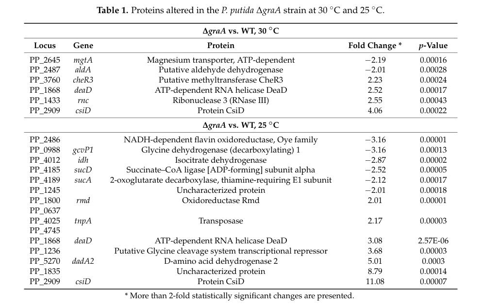

## Question

# Gene Research for Functional Annotation

## ⚠️ CRITICAL: Gene/Protein Identification Context

**BEFORE YOU BEGIN RESEARCH:** You MUST verify you are researching the CORRECT gene/protein. Gene symbols can be ambiguous, especially for less well-characterized genes from non-model organisms.

### Target Gene/Protein Identity (from UniProt):
- **UniProt Accession:** Q88FA9
- **Protein Description:** RecName: Full=2-oxoglutarate dehydrogenase E1 component {ECO:0000256|ARBA:ARBA00013321}; EC=1.2.4.2 {ECO:0000256|ARBA:ARBA00012280}; AltName: Full=Alpha-ketoglutarate dehydrogenase {ECO:0000256|ARBA:ARBA00030680};
- **Gene Information:** Name=sucA {ECO:0000313|EMBL:AAN69770.1}; OrderedLocusNames=PP_4189 {ECO:0000313|EMBL:AAN69770.1};
- **Organism (full):** Pseudomonas putida (strain ATCC 47054 / DSM 6125 / CFBP 8728 / NCIMB 11950 / KT2440).
- **Protein Family:** Belongs to the alpha-ketoglutarate dehydrogenase family.
- **Key Domains:** 2-oxogl_dehyd_N. (IPR032106); 2oxoglutarate_DH_E1. (IPR011603); DH_E1. (IPR001017); KGD_C_sf. (IPR042179); ODO-1/KGD_C. (IPR031717)

### MANDATORY VERIFICATION STEPS:

1. **Check if the gene symbol "sucA" matches the protein description above**
2. **Verify the organism is correct:** Pseudomonas putida (strain ATCC 47054 / DSM 6125 / CFBP 8728 / NCIMB 11950 / KT2440).
3. **Check if protein family/domains align with what you find in literature**
4. **If you find literature for a DIFFERENT gene with the same or similar symbol, STOP**

### If Gene Symbol is Ambiguous or You Cannot Find Relevant Literature:

**DO NOT PROCEED WITH RESEARCH ON A DIFFERENT GENE.** Instead:
- State clearly: "The gene symbol 'sucA' is ambiguous or literature is limited for this specific protein"
- Explain what you found (e.g., "Found extensive literature on a different gene with the same symbol in a different organism")
- Describe the protein based ONLY on the UniProt information provided above
- Suggest that the protein function can be inferred from domain/family information

### Research Target:

Please provide a comprehensive research report on the gene **sucA** (gene ID: sucA, UniProt: Q88FA9) in PSEPK.

The research report should be a detailed narrative explaining the function, biological processes, and localization of the gene product. Citations should be given for all claims.

You should prioritize authoritative reviews and primary scientific literature when conducting research. You can supplement
this with annotations you find in gene/protein databases, but these can be outdated or inaccurate.

We are specifically interested in the primary function of the gene - for enzymes, what reaction is catalyzed, and what is the substrate specificity? For transporters, what is the substrate? For structural proteins or adapters, what is the broader structural role? For signaling molecules, what is the role in the pathway.

We are interested in where in or outside the cell the gene product carries out its function.

We are also interested in the signaling or biochemical pathways in which the gene functions. We are less interested in broad pleiotropic effects, except where these elucidate the precise role.

Include evidence where possible. We are interested in both experimental evidence as well as inference from structure, evolution, or bioinformatic analysis. Precise studies should be prioritized over high-throughput, where available.

## Output

Question: You are an expert researcher providing comprehensive, well-cited information.

Provide detailed information focusing on:
1. Key concepts and definitions with current understanding
2. Recent developments and latest research (prioritize 2023-2024 sources)
3. Current applications and real-world implementations
4. Expert opinions and analysis from authoritative sources
5. Relevant statistics and data from recent studies

Format as a comprehensive research report with proper citations. Include URLs and publication dates where available.
Always prioritize recent, authoritative sources and provide specific citations for all major claims.

# Gene Research for Functional Annotation

## ⚠️ CRITICAL: Gene/Protein Identification Context

**BEFORE YOU BEGIN RESEARCH:** You MUST verify you are researching the CORRECT gene/protein. Gene symbols can be ambiguous, especially for less well-characterized genes from non-model organisms.

### Target Gene/Protein Identity (from UniProt):
- **UniProt Accession:** Q88FA9
- **Protein Description:** RecName: Full=2-oxoglutarate dehydrogenase E1 component {ECO:0000256|ARBA:ARBA00013321}; EC=1.2.4.2 {ECO:0000256|ARBA:ARBA00012280}; AltName: Full=Alpha-ketoglutarate dehydrogenase {ECO:0000256|ARBA:ARBA00030680};
- **Gene Information:** Name=sucA {ECO:0000313|EMBL:AAN69770.1}; OrderedLocusNames=PP_4189 {ECO:0000313|EMBL:AAN69770.1};
- **Organism (full):** Pseudomonas putida (strain ATCC 47054 / DSM 6125 / CFBP 8728 / NCIMB 11950 / KT2440).
- **Protein Family:** Belongs to the alpha-ketoglutarate dehydrogenase family.
- **Key Domains:** 2-oxogl_dehyd_N. (IPR032106); 2oxoglutarate_DH_E1. (IPR011603); DH_E1. (IPR001017); KGD_C_sf. (IPR042179); ODO-1/KGD_C. (IPR031717)

### MANDATORY VERIFICATION STEPS:

1. **Check if the gene symbol "sucA" matches the protein description above**
2. **Verify the organism is correct:** Pseudomonas putida (strain ATCC 47054 / DSM 6125 / CFBP 8728 / NCIMB 11950 / KT2440).
3. **Check if protein family/domains align with what you find in literature**
4. **If you find literature for a DIFFERENT gene with the same or similar symbol, STOP**

### If Gene Symbol is Ambiguous or You Cannot Find Relevant Literature:

**DO NOT PROCEED WITH RESEARCH ON A DIFFERENT GENE.** Instead:
- State clearly: "The gene symbol 'sucA' is ambiguous or literature is limited for this specific protein"
- Explain what you found (e.g., "Found extensive literature on a different gene with the same symbol in a different organism")
- Describe the protein based ONLY on the UniProt information provided above
- Suggest that the protein function can be inferred from domain/family information

### Research Target:

Please provide a comprehensive research report on the gene **sucA** (gene ID: sucA, UniProt: Q88FA9) in PSEPK.

The research report should be a detailed narrative explaining the function, biological processes, and localization of the gene product. Citations should be given for all claims.

You should prioritize authoritative reviews and primary scientific literature when conducting research. You can supplement
this with annotations you find in gene/protein databases, but these can be outdated or inaccurate.

We are specifically interested in the primary function of the gene - for enzymes, what reaction is catalyzed, and what is the substrate specificity? For transporters, what is the substrate? For structural proteins or adapters, what is the broader structural role? For signaling molecules, what is the role in the pathway.

We are interested in where in or outside the cell the gene product carries out its function.

We are also interested in the signaling or biochemical pathways in which the gene functions. We are less interested in broad pleiotropic effects, except where these elucidate the precise role.

Include evidence where possible. We are interested in both experimental evidence as well as inference from structure, evolution, or bioinformatic analysis. Precise studies should be prioritized over high-throughput, where available.

## Research report: **sucA (PP_4189; UniProt Q88FA9)** in *Pseudomonas putida* KT2440

### 0) Target verification (critical disambiguation)
Multiple KT2440-focused studies explicitly identify **sucA as PP_4189** and annotate it as the **α-ketoglutarate/2‑oxoglutarate dehydrogenase E1 component (SucA)** in the tricarboxylic acid (TCA) cycle, matching the UniProt Q88FA9 description (2‑oxoglutarate dehydrogenase E1; EC 1.2.4.2). (avendano2023productionofselenium pages 5-6, ainelo2019pseudomonasputidaresponds pages 5-9)

### 1) Key concepts & definitions (current understanding)
#### 1.1 The enzyme and the reaction catalyzed
**SucA is the E1 (decarboxylase) component** of the bacterial **2‑oxoglutarate dehydrogenase complex** (also termed **α‑ketoglutarate dehydrogenase complex; OGDHc/KGDH**). (bunik2013translatingenzymologyinto pages 2-3, chakraborty2022engineeringthe2oxoglutarate pages 2-3)

At the pathway level, the complex catalyzes the **oxidative decarboxylation of 2‑oxoglutarate (α‑ketoglutarate)** to succinyl‑CoA:

- **Overall reaction:** 2‑oxoglutarate + CoA + NAD+ → succinyl‑CoA + CO2 + NADH (chakraborty2022engineeringthe2oxoglutarate pages 2-3)

This step is **irreversible** and is a major **branch point** linking carbon metabolism with nitrogen (via 2‑oxoglutarate/glutamate) and redox metabolism through NADH generation. (bunik2013translatingenzymologyinto pages 1-2)

#### 1.2 Complex architecture, cofactors, and substrate channeling
The bacterial complex is a multienzyme assembly of:
- **E1o (SucA)**: ThDP/TPP-dependent 2‑oxoglutarate dehydrogenase (decarboxylase) (bunik2013translatingenzymologyinto pages 2-3)
- **E2o**: dihydrolipoamide succinyltransferase (forms succinyl‑CoA from CoA) (bunik2013translatingenzymologyinto pages 2-3)
- **E3**: dihydrolipoamide dehydrogenase (FAD/NAD+-dependent reoxidation of reduced lipoamide, producing NADH) (bunik2013translatingenzymologyinto pages 2-3)

Key cofactors include **ThDP (TPP), lipoate (lipoyllysine swinging arm on E2), CoA, FAD, and NAD+**. (bunik2013translatingenzymologyinto pages 2-3)

Structurally, in *E. coli* (a reference bacterial system), the complex is described as having a **24‑mer E2 core** with E1 and E3 peripherally associated, and catalysis involves transfer of intermediates via a lipoyl “swinging arm” mechanism. (chakraborty2022engineeringthe2oxoglutarate pages 2-3)

#### 1.3 Substrate specificity and mechanistic determinants (inference relevant to annotation)
Mechanistic/structural work across bacterial systems indicates that E1o substrate specificity for 2‑oxoglutarate is supported by conserved active-site features, including a positively charged loop (e.g., **Arg505-containing loop**) implicated in recognizing the **5‑carboxylate** of 2‑oxoglutarate. (bunik2013translatingenzymologyinto pages 3-4, bunik2013translatingenzymologyinto pages 4-6)

Engineering studies show that mutating specific E1 residues can broaden or alter substrate recognition (e.g., variants accepting substrates lacking the 5‑carboxyl group), illustrating how E1 chemistry can be retuned for nonnative substrates in related systems. (chakraborty2022engineeringthe2oxoglutarate pages 1-2)

### 2) sucA in *Pseudomonas putida* KT2440: function, pathway role, and likely localization
#### 2.1 Core biological role in KT2440
In KT2440, sucA (PP_4189) is repeatedly described as a **key Krebs/TCA cycle enzyme**, consistent with the canonical OGDHc role in producing succinyl‑CoA and NADH from 2‑oxoglutarate. (avendano2023productionofselenium pages 5-6, ainelo2019pseudomonasputidaresponds pages 5-9)

#### 2.2 Genomic/operon context and complex partners (KT2440-specific evidence)
RNA-level investigations in *P. putida* KT2440 place **sucA in operon context** with other TCA genes, including **sucB** and **lpdG** (as part of the α‑ketoglutarate dehydrogenase complex components), and suggest larger transcriptional units that can include **sdh** and **suc** genes. (geiger2019investigationofrnabased pages 18-22)

#### 2.3 Cellular localization
The OGDHc is a soluble cytosolic enzyme complex in bacteria (as part of central carbon metabolism); consistent with this, KT2440 studies treat SucA as a central metabolic enzyme measured in whole-cell proteomes. (ainelo2019pseudomonasputidaresponds pages 5-9, kratzl2024pseudomonasputidaas pages 7-9)

### 3) Regulation and control: what is known and what is still uncertain
#### 3.1 Protein abundance changes under stress (experimental evidence)
A proteomics/metabolomics study of the GraT toxin system in *P. putida* (KT2440-derivative background) reported that TCA-cycle enzymes including **SucA are downregulated** when GraT is active (ΔgraA). In extracted quantitative data, SucA shows a **fold change of −2.12** (ΔgraA vs WT, 25 °C), with other enzymes in the same TCA segment also down (Idh −2.87; SucD −2.52). (ainelo2019pseudomonasputidaresponds media c323b5f8, ainelo2019pseudomonasputidaresponds pages 5-9)

These changes were interpreted as part of a coordinated decrease in flux through the isocitrate→succinate segment of the TCA cycle. (ainelo2019pseudomonasputidaresponds pages 5-9)

#### 3.2 RNA-based regulation (KT2440 and broader Pseudomonadaceae context)
Work on RNA motifs reports a conserved **sucA RNA / sucA‑II motif** in the **5′ UTR** and notes **two transcription start sites** in *P. putida* KT2440, including one ~110 nt upstream of the ORF. The motif was proposed as a potential cis-regulatory element because predicted structures overlap the Shine–Dalgarno region. (geiger2019investigationofrnabased pages 22-27, geiger2019investigationofrnabased pages 83-87)

However, extensive ligand screening and follow-up experiments did **not validate** a classic small-molecule riboswitch mechanism for sucA‑II. Instead, results suggested possible **protein-mediated regulation**; RNA pulldown experiments nominated candidate interacting proteins including **SucC/SucD** (consistent with potential operon-level feedback). (geiger2019investigationofrnabaseda pages 83-87, geiger2019investigationofrnabased pages 83-87)

Overall, the best-supported current interpretation from these data is that **post-transcriptional control may exist**, but its mechanism and physiological ligand(s) remain unresolved. (geiger2019investigationofrnabased pages 83-87, geiger2019investigationofrnabaseda pages 83-87)

### 4) Recent developments (prioritizing 2023–2024)
#### 4.1 2023: sucA links central metabolism to selenium nanoparticle biogenesis
A 2023 *Microbial Biotechnology* study of aerobic selenite reduction in *P. putida* KT2440 used genetic approaches and identified **sucA (PP_4189)** among genes implicating **2‑ketoglutarate/glutamate metabolism** as important for converting selenite to selenium. The authors explicitly identify sucA as encoding **2‑oxoglutarate dehydrogenase** and a key Krebs cycle enzyme. (avendano2023productionofselenium pages 5-6)

**Quantitative/experimental context:** Experiments were conducted in the presence of **1 mM selenite**; despite optical density differences (attributed in part to elemental selenium formation), the authors report **no differences in CFUs for at least 22 h** between WT and mutants under selenite exposure. (avendano2023productionofselenium pages 5-6)

This provides recent, organism-specific evidence that sucA-linked central metabolism affects a real biotransformation phenotype (selenite → selenium nanoparticles). (avendano2023productionofselenium pages 5-6)

#### 4.2 2024: multi-omics suggests metabolic rerouting around decarboxylative TCA steps
A 2024 *Communications Biology* multi-omics study of a defined synthetic co-culture (cyanobacterium feeding sucrose to *P. putida*) reports decreased protein abundances of **SucA/B/D** and **Idh** in *P. putida* alongside increased glyoxylate-cycle enzymes **AceA** and **GlcB**, interpreted as partial TCA “shutdown” and redirection through the glyoxylate cycle. (kratzl2024pseudomonasputidaas pages 7-9)

Quantitative transcriptomics in the same study reported **idh transcript upregulation (log2-FC = 1.9)** and **aceA transcript downregulation (log2-FC = −2.64)**, emphasizing that transcript–protein concordance was only moderate and suggesting additional layers of regulation. (kratzl2024pseudomonasputidaas pages 7-9)

### 5) Current applications and real-world implementations
#### 5.1 Biotechnology: nanoparticle biosynthesis
The 2023 KT2440 study indicates that manipulating central metabolic nodes including sucA can affect **selenite biotransformation to selenium nanoparticles**, and identifies gene targets of potential biotechnological interest for tuning nanoparticle formation rate. (avendano2023productionofselenium pages 5-6)

#### 5.2 Systems and synthetic biology: managing redox and carbon flux
More generally, authoritative enzymology literature emphasizes OGDHc as a **rate-limiting** and regulatable node at the intersection of carbon flux and redox status. (bunik2013translatingenzymologyinto pages 2-3, bunik2013translatingenzymologyinto pages 1-2)

In applied contexts, the 2024 co-culture study illustrates a real implementation of multi-omics to diagnose central metabolism rewiring (including downshifts in SucA/B/D proteins) as part of designing or understanding microbial consortia. (kratzl2024pseudomonasputidaas pages 7-9)

### 6) Expert opinions and authoritative synthesis (interpretation anchored in reviews)
A detailed review of the OGDHc frames this complex as an irreversible, rate-limiting TCA step whose flux is tuned through enzyme–ligand interactions and protein–protein interactions, and notes that component stoichiometry and cofactor interactions can serve as regulatory handles. (bunik2013translatingenzymologyinto pages 1-2, bunik2013translatingenzymologyinto pages 2-3)

In the context of functional annotation for KT2440 sucA (Q88FA9), these authoritative sources justify annotating SucA as:
- ThDP-dependent decarboxylase E1 component of OGDHc
- critical for producing succinyl-CoA and NADH from 2-oxoglutarate
- likely a key control point linking carbon/nitrogen/redox metabolism

### 7) Statistics & data highlights (compiled)
- **Proteomics (GraT toxin response, ΔgraA vs WT, 25 °C):** SucA fold change **−2.12**; Idh **−2.87**; SucD **−2.52**. (ainelo2019pseudomonasputidaresponds media c323b5f8)
- **Selenite conversion study:** **1 mM selenite** exposure; **no CFU difference for ≥22 h** between WT and mutants; sucA mutant shows slight reduction in growth/biomass. (avendano2023productionofselenium pages 5-6)
- **Co-culture transcriptomics:** idh transcript **log2-FC = 1.9**; aceA transcript **log2-FC = −2.64**; proteomics indicates decreased SucA/B/D proteins with increased glyoxylate-cycle enzymes. (kratzl2024pseudomonasputidaas pages 7-9)
- **RNA–protein pulldown (sucA-II motif regulation hypothesis):** condition-dependent changes in numbers of specifically bound proteins (e.g., **5** specific proteins in rich medium vs **17** in osmotic shock; **3** in rich vs **7** in nitrogen limitation), supporting stress-dependent post-transcriptional interaction landscapes. (geiger2019investigationofrnabased pages 65-68)

### 8) Limitations of the current evidence base (important for annotation quality)
- Direct biochemical characterization (e.g., KT2440 SucA kinetic parameters, in vitro substrate specificity across analogs) was not available in the retrieved KT2440 primary literature excerpts; catalytic mechanism is therefore best supported by conserved-family enzymology and cross-bacterial evidence. (chakraborty2022engineeringthe2oxoglutarate pages 2-3, bunik2013translatingenzymologyinto pages 2-3)
- RNA motif work proposes and tests regulatory hypotheses but does not conclusively establish a ligand-based riboswitch for KT2440 sucA regulation. (geiger2019investigationofrnabased pages 83-87, geiger2019investigationofrnabaseda pages 83-87)

---

### Evidence summary table
| Evidence category | Finding | Experimental context/system | Source (authors year journal) | URL/DOI |
|---|---|---|---|---|
| Function/reaction | **sucA (PP_4189)** in *Pseudomonas putida* KT2440 is identified as the **E1 component of 2-oxoglutarate dehydrogenase (α-ketoglutarate dehydrogenase)**, a **ThDP-dependent** enzyme in the 2-oxoglutarate dehydrogenase complex. The complex converts **2-oxoglutarate + CoA + NAD+ → succinyl-CoA + CO2 + NADH**. (avendano2023productionofselenium pages 5-6, geiger2019investigationofrnabased pages 22-27, chakraborty2022engineeringthe2oxoglutarate pages 2-3, bunik2013translatingenzymologyinto pages 2-3) | KT2440 gene assignment from mutant study; broader bacterial OGDHc mechanism from reviews/enzymology papers | Avendaño et al. 2023 *Microbial Biotechnology*; Geiger 2019; Chakraborty et al. 2022 *Reactions*; Bunik et al. 2013 *Current Chemical Biology* | https://doi.org/10.1111/1751-7915.14215; https://doi.org/10.3390/reactions3010011; https://doi.org/10.2174/2212796811307010008 |
| Function/reaction | The OGDH complex is a **multienzyme E1/E2/E3 assembly**: E1o/SucA performs ThDP-dependent decarboxylation and succinyl transfer to lipoyl groups on E2; E2 forms succinyl-CoA; E3 reoxidizes dihydrolipoamide using **FAD and NAD+**. Cofactors highlighted include **ThDP, lipoate, CoA, FAD, NAD+**, with E2 built on a 24-mer core and flexible lipoyl “swinging arm” domains for substrate channeling. (chakraborty2022engineeringthe2oxoglutarate pages 2-3, bunik2013translatingenzymologyinto pages 2-3, bunik2013translatingenzymologyinto pages 4-6) | Authoritative conceptual background from bacterial OGDHc reviews and engineering paper | Chakraborty et al. 2022 *Reactions*; Bunik et al. 2013 *Current Chemical Biology* | https://doi.org/10.3390/reactions3010011; https://doi.org/10.2174/2212796811307010008 |
| Pathway role | SucA is placed in the **Krebs/TCA cycle** as a key enzyme linking **2-oxoglutarate metabolism to succinyl-CoA formation**, i.e., a central node connecting carbon flow and redox generation. (avendano2023productionofselenium pages 5-6, ainelo2019pseudomonasputidaresponds pages 5-9, bunik2013translatingenzymologyinto pages 1-2) | KT2440 mutant phenotype paper and stress proteomics; broader metabolic review | Avendaño et al. 2023 *Microbial Biotechnology*; Ainelo et al. 2019 *Toxins*; Bunik et al. 2013 *Current Chemical Biology* | https://doi.org/10.1111/1751-7915.14215; https://doi.org/10.3390/toxins11020103; https://doi.org/10.2174/2212796811307010008 |
| Pathway/operon context | In *P. putida* KT2440, **sucA** is reported in operon context with **sucB** and in broader TCA-linked transcriptional units that can include **sdh genes, sucAB, sucABCD, and lpdG**; the α-KGDH complex in this context comprises **SucA, SucB, and LpdG**. (geiger2019investigationofrnabased pages 18-22) | Transcript/operon analysis and RNA-regulation study in KT2440 | Geiger 2019 | n/a |
| Regulation | A conserved **sucA RNA motif / sucA-II motif** in the **5′ UTR** was proposed as a **cis-regulatory RNA** because structural elements overlap the ribosome-binding region; in KT2440, **two transcription start sites** were reported, including one about **110 nt upstream** of the ORF. (geiger2019investigationofrnabased pages 22-27, geiger2019investigationofrnabased pages 83-87) | Comparative RNA motif analysis and follow-up regulatory experiments | Geiger 2019 | n/a |
| Regulation | The small-molecule riboswitch model for sucA-II was **not validated**. A systematic screen of **55 candidates** and another screen of **109 ligands** failed to confirm a ligand-responsive riboswitch; instead, results suggest possible **protein-mediated regulation**. Candidate binders included **SucC/SucD** (possible operon-level feedback) and PP_4065, which increased RNA cleavage consistent with mRNA destabilization. (geiger2019investigationofrnabased pages 83-87, geiger2019investigationofrnabaseda pages 83-87, geiger2019investigationofrnabaseda pages 50-54) | In-line probing, RNA pulldown, RNase footprinting, reporter assays | Geiger 2019 | n/a |
| Regulation | In broader bacterial OGDHc, E1o/SucA is described as a **major physiological regulation target** and often **rate-limiting**; **ThDP** can act as both catalytic cofactor and allosteric regulator, and adenine nucleotides can modulate substrate binding. (bunik2013translatingenzymologyinto pages 2-3, bunik2013translatingenzymologyinto pages 4-6, bunik2013translatingenzymologyinto pages 1-2) | Review-level mechanistic/regulatory synthesis across bacterial systems | Bunik et al. 2013 *Current Chemical Biology* | https://doi.org/10.2174/2212796811307010008 |
| Phenotypes/stress links | In a KT2440 mutant collection studying selenium metabolism, the **sucA mutant (PP_4189)** showed a **very slight reduction in growth rate and biomass formation** and was among mutants with a slower growth rate than WT. The paper interprets this as consistent with sucA encoding a key Krebs cycle enzyme. (avendano2023productionofselenium pages 5-6) | KT2440 mutants grown with and without selenite during selenium nanoparticle studies | Avendaño et al. 2023 *Microbial Biotechnology* | https://doi.org/10.1111/1751-7915.14215 |
| Phenotypes/stress links | In the same KT2440 selenium study, **2-ketoglutarate/glutamate metabolism** involving **sucA** was implicated as important for **selenite reduction to elemental selenium/selenium nanoparticles**. The authors highlight sucA among genes connecting central metabolism to selenium transformation. (avendano2023productionofselenium pages 5-6) | Genetic and analytical study of aerobic selenite reduction | Avendaño et al. 2023 *Microbial Biotechnology* | https://doi.org/10.1111/1751-7915.14215 |
| Phenotypes/stress links | Under **GraT toxin** stress in *P. putida*, SucA protein abundance decreased together with other TCA enzymes, supporting a model of **repressed central carbon metabolism/TCA flux** during toxin-induced physiological reprogramming. (ainelo2019pseudomonasputidaresponds pages 5-9, ainelo2019pseudomonasputidaresponds pages 1-3) | Proteomics and metabolomics in ΔgraA strain where GraT toxin is active | Ainelo et al. 2019 *Toxins* | https://doi.org/10.3390/toxins11020103 |
| Quantitative data | In the GraT study, **SucA abundance decreased >2-fold** in the ΔgraA strain at **25 °C**; the extracted table gives a **fold change of -2.12** for SucA. Other TCA enzymes in the same branch also dropped (e.g., Idh **-2.87**, SucD **-2.52**), supporting coordinated repression of the isocitrate-to-succinate segment. (ainelo2019pseudomonasputidaresponds pages 5-9, ainelo2019pseudomonasputidaresponds media c323b5f8) | Quantitative proteomics table from ΔgraA vs WT comparison | Ainelo et al. 2019 *Toxins* | https://doi.org/10.3390/toxins11020103 |
| Quantitative data | In the selenium study, growth/selenite experiments were carried out with **1 mM selenite**. Although OD differed, the authors reported **no CFU differences for at least 22 h** between WT and mutants under selenite, indicating that optical changes may reflect selenium nanoparticle formation rather than loss of viability. (avendano2023productionofselenium pages 5-6) | KT2440 WT and mutant comparison during selenite reduction | Avendaño et al. 2023 *Microbial Biotechnology* | https://doi.org/10.1111/1751-7915.14215 |
| Quantitative data | Stress-dependent RNA pulldown experiments for sucA-related RNA regulation reported changing numbers of specifically bound proteins: **5** specific proteins in rich medium vs **17** in osmotic shock; **3** in rich medium, **3** in carbon limitation, and **7** in nitrogen limitation; at low pH with glutamate, **147** proteins were detected before filtering. These data support condition-dependent post-transcriptional regulation hypotheses rather than a validated ligand riboswitch. (geiger2019investigationofrnabased pages 65-68) | RNA–protein pulldown under osmoshock, carbon limitation (**1 mM glucose**), nitrogen limitation (**6 mM NH4+**), and pH-shift conditions | Geiger 2019 | n/a |
| Mechanistic specificity | Conserved E1o/SucA active-site features implicated in substrate specificity include an **Arg505-containing loop** for recognition of the substrate **5-carboxylate** and conserved histidines (**His539, His579, His747, His1020**). Engineering of E1o residues **His260** and **His298** altered substrate recognition, demonstrating that E1 chemistry can be retuned for nonnative substrates. (chakraborty2022engineeringthe2oxoglutarate pages 1-2, bunik2013translatingenzymologyinto pages 4-6, bunik2013translatingenzymologyinto pages 3-4) | Structural/mutational enzymology in bacterial OGDHc systems | Chakraborty et al. 2022 *Reactions*; Bunik et al. 2013 *Current Chemical Biology* | https://doi.org/10.3390/reactions3010011; https://doi.org/10.2174/2212796811307010008 |

*Table: This table summarizes the main functional-annotation evidence for Pseudomonas putida KT2440 sucA (PP_4189; UniProt Q88FA9), covering enzymatic function, pathway placement, regulation, stress-linked phenotypes, and quantitative findings from the gathered literature.*

References

1. (avendano2023productionofselenium pages 5-6): Roberto Avendaño, Said Muñoz‐Montero, Diego Rojas‐Gätjens, Paola Fuentes‐Schweizer, Sofía Vieto, Rafael Montenegro, Manuel Salvador, Rufus Frew, Juhyun Kim, Max Chavarría, and Jose I. Jiménez. Production of selenium nanoparticles occurs through an interconnected pathway of sulphur metabolism and oxidative stress response in <i>pseudomonas putida</i> kt2440. Microbial Biotechnology, 16:931-946, Jan 2023. URL: https://doi.org/10.1111/1751-7915.14215, doi:10.1111/1751-7915.14215. This article has 26 citations and is from a peer-reviewed journal.

2. (ainelo2019pseudomonasputidaresponds pages 5-9): Andres Ainelo, Rando Porosk, Kalle Kilk, Sirli Rosendahl, Jaanus Remme, and Rita Hõrak. Pseudomonas putida responds to the toxin grat by inducing ribosome biogenesis factors and repressing tca cycle enzymes. Toxins, 11:103, Feb 2019. URL: https://doi.org/10.3390/toxins11020103, doi:10.3390/toxins11020103. This article has 10 citations.

3. (bunik2013translatingenzymologyinto pages 2-3): Victoria I. Bunik, Guenter Raddatz, and Slawomir Strumilo. Translating enzymology into metabolic regulation: the case of the 2- oxoglutarate dehydrogenase multienzyme complex. Apr 2013. URL: https://doi.org/10.2174/2212796811307010008, doi:10.2174/2212796811307010008. This article has 24 citations and is from a peer-reviewed journal.

4. (chakraborty2022engineeringthe2oxoglutarate pages 2-3): Joydeep Chakraborty, Natalia Nemeria, Yujeong Shim, Xu Zhang, Elena L. Guevara, Hetal Patel, Edgardo T. Farinas, and Frank Jordan. Engineering the 2-oxoglutarate dehydrogenase complex to understand catalysis and alter substrate recognition. Reactions, 3:139-159, Feb 2022. URL: https://doi.org/10.3390/reactions3010011, doi:10.3390/reactions3010011. This article has 8 citations.

5. (bunik2013translatingenzymologyinto pages 1-2): Victoria I. Bunik, Guenter Raddatz, and Slawomir Strumilo. Translating enzymology into metabolic regulation: the case of the 2- oxoglutarate dehydrogenase multienzyme complex. Apr 2013. URL: https://doi.org/10.2174/2212796811307010008, doi:10.2174/2212796811307010008. This article has 24 citations and is from a peer-reviewed journal.

6. (bunik2013translatingenzymologyinto pages 3-4): Victoria I. Bunik, Guenter Raddatz, and Slawomir Strumilo. Translating enzymology into metabolic regulation: the case of the 2- oxoglutarate dehydrogenase multienzyme complex. Apr 2013. URL: https://doi.org/10.2174/2212796811307010008, doi:10.2174/2212796811307010008. This article has 24 citations and is from a peer-reviewed journal.

7. (bunik2013translatingenzymologyinto pages 4-6): Victoria I. Bunik, Guenter Raddatz, and Slawomir Strumilo. Translating enzymology into metabolic regulation: the case of the 2- oxoglutarate dehydrogenase multienzyme complex. Apr 2013. URL: https://doi.org/10.2174/2212796811307010008, doi:10.2174/2212796811307010008. This article has 24 citations and is from a peer-reviewed journal.

8. (chakraborty2022engineeringthe2oxoglutarate pages 1-2): Joydeep Chakraborty, Natalia Nemeria, Yujeong Shim, Xu Zhang, Elena L. Guevara, Hetal Patel, Edgardo T. Farinas, and Frank Jordan. Engineering the 2-oxoglutarate dehydrogenase complex to understand catalysis and alter substrate recognition. Reactions, 3:139-159, Feb 2022. URL: https://doi.org/10.3390/reactions3010011, doi:10.3390/reactions3010011. This article has 8 citations.

9. (geiger2019investigationofrnabased pages 18-22): S Geiger. Investigation of rna-based regulation of gene expression in proteobacterial energy metabolism. Unknown journal, 2019.

10. (kratzl2024pseudomonasputidaas pages 7-9): Franziska Kratzl, Marlene Urban, Jagroop Pandhal, Mengxun Shi, Chen Meng, Karin Kleigrewe, Andreas Kremling, and Katharina Pflüger-Grau. Pseudomonas putida as saviour for troubled synechococcus elongatus in a synthetic co-culture – interaction studies based on a multi-omics approach. Communications Biology, Apr 2024. URL: https://doi.org/10.1038/s42003-024-06098-5, doi:10.1038/s42003-024-06098-5. This article has 8 citations and is from a peer-reviewed journal.

11. (ainelo2019pseudomonasputidaresponds media c323b5f8): Andres Ainelo, Rando Porosk, Kalle Kilk, Sirli Rosendahl, Jaanus Remme, and Rita Hõrak. Pseudomonas putida responds to the toxin grat by inducing ribosome biogenesis factors and repressing tca cycle enzymes. Toxins, 11:103, Feb 2019. URL: https://doi.org/10.3390/toxins11020103, doi:10.3390/toxins11020103. This article has 10 citations.

12. (geiger2019investigationofrnabased pages 22-27): S Geiger. Investigation of rna-based regulation of gene expression in proteobacterial energy metabolism. Unknown journal, 2019.

13. (geiger2019investigationofrnabased pages 83-87): S Geiger. Investigation of rna-based regulation of gene expression in proteobacterial energy metabolism. Unknown journal, 2019.

14. (geiger2019investigationofrnabaseda pages 83-87): S Geiger. Investigation of rna-based regulation of gene expression in proteobacterial energy metabolism. Unknown journal, 2019.

15. (geiger2019investigationofrnabased pages 65-68): S Geiger. Investigation of rna-based regulation of gene expression in proteobacterial energy metabolism. Unknown journal, 2019.

16. (geiger2019investigationofrnabaseda pages 50-54): S Geiger. Investigation of rna-based regulation of gene expression in proteobacterial energy metabolism. Unknown journal, 2019.

17. (ainelo2019pseudomonasputidaresponds pages 1-3): Andres Ainelo, Rando Porosk, Kalle Kilk, Sirli Rosendahl, Jaanus Remme, and Rita Hõrak. Pseudomonas putida responds to the toxin grat by inducing ribosome biogenesis factors and repressing tca cycle enzymes. Toxins, 11:103, Feb 2019. URL: https://doi.org/10.3390/toxins11020103, doi:10.3390/toxins11020103. This article has 10 citations.

## Artifacts

- [Edison artifact artifact-00](sucA-deep-research-falcon_artifacts/artifact-00.md)

## Citations

1. bunik2013translatingenzymologyinto pages 1-2
2. bunik2013translatingenzymologyinto pages 2-3
3. geiger2019investigationofrnabased pages 18-22
4. ainelo2019pseudomonasputidaresponds pages 5-9
5. avendano2023productionofselenium pages 5-6
6. kratzl2024pseudomonasputidaas pages 7-9
7. geiger2019investigationofrnabased pages 65-68
8. bunik2013translatingenzymologyinto pages 3-4
9. bunik2013translatingenzymologyinto pages 4-6
10. geiger2019investigationofrnabased pages 22-27
11. geiger2019investigationofrnabased pages 83-87
12. geiger2019investigationofrnabaseda pages 83-87
13. geiger2019investigationofrnabaseda pages 50-54
14. ainelo2019pseudomonasputidaresponds pages 1-3
15. https://doi.org/10.1111/1751-7915.14215;
16. https://doi.org/10.3390/reactions3010011;
17. https://doi.org/10.2174/2212796811307010008
18. https://doi.org/10.3390/toxins11020103;
19. https://doi.org/10.1111/1751-7915.14215
20. https://doi.org/10.3390/toxins11020103
21. https://doi.org/10.1111/1751-7915.14215,
22. https://doi.org/10.3390/toxins11020103,
23. https://doi.org/10.2174/2212796811307010008,
24. https://doi.org/10.3390/reactions3010011,
25. https://doi.org/10.1038/s42003-024-06098-5,