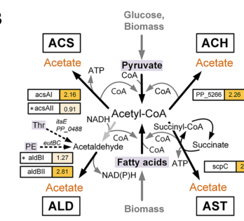

## Question

# Gene Research for Functional Annotation

## ⚠️ CRITICAL: Gene/Protein Identification Context

**BEFORE YOU BEGIN RESEARCH:** You MUST verify you are researching the CORRECT gene/protein. Gene symbols can be ambiguous, especially for less well-characterized genes from non-model organisms.

### Target Gene/Protein Identity (from UniProt):
- **UniProt Accession:** Q88FB2
- **Protein Description:** RecName: Full=Succinate--CoA ligase [ADP-forming] subunit beta {ECO:0000255|HAMAP-Rule:MF_00558}; EC=6.2.1.5 {ECO:0000255|HAMAP-Rule:MF_00558}; AltName: Full=Succinyl-CoA synthetase subunit beta {ECO:0000255|HAMAP-Rule:MF_00558}; Short=SCS-beta {ECO:0000255|HAMAP-Rule:MF_00558};
- **Gene Information:** Name=sucC {ECO:0000255|HAMAP-Rule:MF_00558}; OrderedLocusNames=PP_4186; ORFNames=PP4186;
- **Organism (full):** Pseudomonas putida (strain ATCC 47054 / DSM 6125 / CFBP 8728 / NCIMB 11950 / KT2440).
- **Protein Family:** Belongs to the succinate/malate CoA ligase beta subunit
- **Key Domains:** ATP-grasp. (IPR011761); ATP-grasp_succ-CoA_synth-type. (IPR013650); ATP_grasp_subdomain_1. (IPR013815); Succ-CoA_synthase_bsu_CS. (IPR017866); SUCC_ACL_C. (IPR005811)

### MANDATORY VERIFICATION STEPS:

1. **Check if the gene symbol "sucC" matches the protein description above**
2. **Verify the organism is correct:** Pseudomonas putida (strain ATCC 47054 / DSM 6125 / CFBP 8728 / NCIMB 11950 / KT2440).
3. **Check if protein family/domains align with what you find in literature**
4. **If you find literature for a DIFFERENT gene with the same or similar symbol, STOP**

### If Gene Symbol is Ambiguous or You Cannot Find Relevant Literature:

**DO NOT PROCEED WITH RESEARCH ON A DIFFERENT GENE.** Instead:
- State clearly: "The gene symbol 'sucC' is ambiguous or literature is limited for this specific protein"
- Explain what you found (e.g., "Found extensive literature on a different gene with the same symbol in a different organism")
- Describe the protein based ONLY on the UniProt information provided above
- Suggest that the protein function can be inferred from domain/family information

### Research Target:

Please provide a comprehensive research report on the gene **sucC** (gene ID: sucC, UniProt: Q88FB2) in PSEPK.

The research report should be a detailed narrative explaining the function, biological processes, and localization of the gene product. Citations should be given for all claims.

You should prioritize authoritative reviews and primary scientific literature when conducting research. You can supplement
this with annotations you find in gene/protein databases, but these can be outdated or inaccurate.

We are specifically interested in the primary function of the gene - for enzymes, what reaction is catalyzed, and what is the substrate specificity? For transporters, what is the substrate? For structural proteins or adapters, what is the broader structural role? For signaling molecules, what is the role in the pathway.

We are interested in where in or outside the cell the gene product carries out its function.

We are also interested in the signaling or biochemical pathways in which the gene functions. We are less interested in broad pleiotropic effects, except where these elucidate the precise role.

Include evidence where possible. We are interested in both experimental evidence as well as inference from structure, evolution, or bioinformatic analysis. Precise studies should be prioritized over high-throughput, where available.

## Output

Question: You are an expert researcher providing comprehensive, well-cited information.

Provide detailed information focusing on:
1. Key concepts and definitions with current understanding
2. Recent developments and latest research (prioritize 2023-2024 sources)
3. Current applications and real-world implementations
4. Expert opinions and analysis from authoritative sources
5. Relevant statistics and data from recent studies

Format as a comprehensive research report with proper citations. Include URLs and publication dates where available.
Always prioritize recent, authoritative sources and provide specific citations for all major claims.

# Gene Research for Functional Annotation

## ⚠️ CRITICAL: Gene/Protein Identification Context

**BEFORE YOU BEGIN RESEARCH:** You MUST verify you are researching the CORRECT gene/protein. Gene symbols can be ambiguous, especially for less well-characterized genes from non-model organisms.

### Target Gene/Protein Identity (from UniProt):
- **UniProt Accession:** Q88FB2
- **Protein Description:** RecName: Full=Succinate--CoA ligase [ADP-forming] subunit beta {ECO:0000255|HAMAP-Rule:MF_00558}; EC=6.2.1.5 {ECO:0000255|HAMAP-Rule:MF_00558}; AltName: Full=Succinyl-CoA synthetase subunit beta {ECO:0000255|HAMAP-Rule:MF_00558}; Short=SCS-beta {ECO:0000255|HAMAP-Rule:MF_00558};
- **Gene Information:** Name=sucC {ECO:0000255|HAMAP-Rule:MF_00558}; OrderedLocusNames=PP_4186; ORFNames=PP4186;
- **Organism (full):** Pseudomonas putida (strain ATCC 47054 / DSM 6125 / CFBP 8728 / NCIMB 11950 / KT2440).
- **Protein Family:** Belongs to the succinate/malate CoA ligase beta subunit
- **Key Domains:** ATP-grasp. (IPR011761); ATP-grasp_succ-CoA_synth-type. (IPR013650); ATP_grasp_subdomain_1. (IPR013815); Succ-CoA_synthase_bsu_CS. (IPR017866); SUCC_ACL_C. (IPR005811)

### MANDATORY VERIFICATION STEPS:

1. **Check if the gene symbol "sucC" matches the protein description above**
2. **Verify the organism is correct:** Pseudomonas putida (strain ATCC 47054 / DSM 6125 / CFBP 8728 / NCIMB 11950 / KT2440).
3. **Check if protein family/domains align with what you find in literature**
4. **If you find literature for a DIFFERENT gene with the same or similar symbol, STOP**

### If Gene Symbol is Ambiguous or You Cannot Find Relevant Literature:

**DO NOT PROCEED WITH RESEARCH ON A DIFFERENT GENE.** Instead:
- State clearly: "The gene symbol 'sucC' is ambiguous or literature is limited for this specific protein"
- Explain what you found (e.g., "Found extensive literature on a different gene with the same symbol in a different organism")
- Describe the protein based ONLY on the UniProt information provided above
- Suggest that the protein function can be inferred from domain/family information

### Research Target:

Please provide a comprehensive research report on the gene **sucC** (gene ID: sucC, UniProt: Q88FB2) in PSEPK.

The research report should be a detailed narrative explaining the function, biological processes, and localization of the gene product. Citations should be given for all claims.

You should prioritize authoritative reviews and primary scientific literature when conducting research. You can supplement
this with annotations you find in gene/protein databases, but these can be outdated or inaccurate.

We are specifically interested in the primary function of the gene - for enzymes, what reaction is catalyzed, and what is the substrate specificity? For transporters, what is the substrate? For structural proteins or adapters, what is the broader structural role? For signaling molecules, what is the role in the pathway.

We are interested in where in or outside the cell the gene product carries out its function.

We are also interested in the signaling or biochemical pathways in which the gene functions. We are less interested in broad pleiotropic effects, except where these elucidate the precise role.

Include evidence where possible. We are interested in both experimental evidence as well as inference from structure, evolution, or bioinformatic analysis. Precise studies should be prioritized over high-throughput, where available.

## Research report: **sucC (PP_4186; UniProt Q88FB2)** in *Pseudomonas putida* KT2440

### 0) Target verification (mandatory)
The UniProt target provided (Q88FB2) corresponds to **sucC** in *Pseudomonas putida* KT2440 with ordered locus **PP_4186**, annotated as **succinate–CoA ligase / succinyl‑CoA synthetase subunit β** (ADP‑forming; EC **6.2.1.5**). This identity is supported by *P. putida* KT2440 literature explicitly tying **PP_4186** to **succinate–CoA ligase [ADP‑forming] subunit beta** and describing the enzyme’s canonical reaction, consistent with UniProt’s description (geiger2019investigationofrnabased pages 93-97, geiger2019investigationofrnabased pages 22-27).

### 1) Key concepts and current understanding

#### 1.1 Enzyme definition and reaction
**Succinyl‑CoA synthetase** (also called **succinate–CoA ligase**) is the TCA‑cycle enzyme that catalyzes the reversible interconversion:

**succinyl‑CoA + ADP + Pi ⇌ succinate + CoA + ATP**

This is the **substrate‑level phosphorylation** step of the cycle in many organisms and is described as the succinyl‑CoA→succinate step of the TCA cycle (lancaster2023succinylcoasynthetasedysfunction pages 1-2). The same reaction is stated in *Pseudomonas* sucC regulatory literature focused on KT2440 (geiger2019investigationofrnabased pages 22-27, geiger2019investigationofrnabasedb pages 22-27).

#### 1.2 Subunit composition (SucC/SucD)
In bacteria, the enzyme is composed of two subunits (**SucC** and **SucD**, commonly referred to as β and α subunits, respectively) that assemble into the functional succinyl‑CoA synthetase/ligase complex. A 2023 authoritative review summarizes that prokaryotic studies (e.g., *E. coli*) support an α/β subunit organization (often described as an (αβ)2 complex) (lancaster2023succinylcoasynthetasedysfunction pages 1-2). In *P. putida* KT2440 locus context, **sucC (PP_4186)** is repeatedly discussed together with its partner **sucD** in operon/complex annotations (geiger2019investigationofrnabased pages 93-97).

#### 1.3 Substrate specificity and “non-canonical” activities
While the physiological substrate pair in the TCA cycle is succinyl‑CoA/succinate, bacterial SucCD enzymes can show **measurable activity on related C4‑dicarboxylates** in vitro, implying some catalytic promiscuity. For example, Nolte et al. (2014) reported **10–21%** activity with **malate** relative to succinate activity, with **Km** values in the **mM range** (L‑malate 2.5–3.6 mM; D‑malate 3.6–4.2 mM), and demonstrated CoA‑thioester formation for succinate analogues (nolte2014novelcharacteristicsof pages 1-2). This informs functional annotation by clarifying that “substrate specificity” is centered on succinate/succinyl‑CoA but may extend to analogues under some conditions.

### 2) Pathway placement and cellular localization

#### 2.1 Biological process / pathway
In *P. putida* KT2440, **sucC** is best understood as a **central carbon metabolism gene**, contributing to the **TCA cycle** at the succinyl‑CoA↔succinate step, and thus linking carbon oxidation to ATP generation via substrate‑level phosphorylation (geiger2019investigationofrnabased pages 22-27, lancaster2023succinylcoasynthetasedysfunction pages 1-2).

#### 2.2 Subcellular localization
The retrieved sources situate SucCD as a **central metabolic enzyme** (TCA‑cycle step) but do **not** provide a direct localization experiment for KT2440 SucC (e.g., imaging, fractionation with SucC detection). Therefore, the most defensible statement from the available evidence is:
- SucC functions as a **soluble central metabolic enzyme in the cytosol**, consistent with canonical TCA‑cycle biochemistry, but **this is inferred** rather than directly measured for KT2440 in the retrieved texts (lancaster2023succinylcoasynthetasedysfunction pages 1-2, geiger2019investigationofrnabasedb pages 22-27).

### 3) Organism-specific evidence in *Pseudomonas putida* KT2440

#### 3.1 Pseudomonas-specific cis-regulatory RNA in the sucC 5′ UTR
A notable KT2440‑relevant feature is the **“sucC RNA motif”** located in the **5′ UTR of sucC** and reported as **unique to Pseudomonas**. In the Geiger study, 72 representatives of the motif are discussed; it is treated as a probable cis‑regulatory RNA but considered an ambiguous riboswitch candidate, with alternative hypotheses such as protein‑binding via palindromic domains (geiger2019investigationofrnabasedb pages 22-27, geiger2019investigationofrnabased pages 22-27).

Geiger further reports experimental work suggesting that succinyl‑CoA synthetase/ligase subunits are candidate binders of this RNA motif; SPR data suggested binding likely involves a single subunit rather than the holoenzyme, with discussion of sucD as a candidate interactor, and notes that KD determination was pending (geiger2019investigationofrnabased pages 93-97).

#### 3.2 Systems biology under anoxic-electrogenic conditions (2024)
Weimer et al. (2024) studied *P. putida* KT2440 cultured in an anoxic bio‑electrochemical system (BES) and described **acetate accumulation** and multiple acetate biosynthesis routes. Importantly for sucC functional context, they describe the **acetate:succinate CoA‑transferase (AST) pathway** as coupling ATP formation through **regeneration of succinyl‑CoA into succinate via succinyl‑CoA synthetase** (weimer2024systemsbiologyof pages 8-9). Figure evidence from the paper depicts this AST/energy coupling route explicitly (weimer2024systemsbiologyof media 4f549e8e).

Quantitatively, Weimer et al. reported that engineered mutants deficient in acetate formation improved 2‑ketogluconate performance: the best-performing mutant accumulated 2‑ketogluconate at **twice the rate** of wild type with an increased yield of **0.96 mol/mol** (weimer2024systemsbiologyof pages 8-9). While sucC is not individually perturbed here, the study is a recent, real‑world implementation context where flux through succinyl‑CoA synthetase is directly invoked as part of an ATP‑linked acetate strategy.

#### 3.3 Genetic perturbation of the SucCD complex affects physiology and drug resistance (2020)
Puja et al. (2020) identified a multidrug‑resistant (MDR) *P. putida* KT2440 mutant (HPG‑5) carrying an inactivating mutation in **sucD** (the partner subunit of sucC in the succinyl‑CoA synthetase complex). Disruption of sucD in KT2440 reproduced the MDR phenotype and was associated with activation of the glyoxylate shunt (puja2020coordinateoverexpressionof pages 1-2). This provides strong organism‑specific genetic evidence that integrity of the SucCD step influences central metabolism remodeling with clinically/industrial-relevant phenotypes.

The paper reports quantitative antibiotic susceptibility changes linked to efflux regulation in this MDR background, including:
- selection frequency for this MDR mutant type: **1 × 10−9** (puja2020coordinateoverexpressionof pages 1-2)
- **8–16‑fold MIC decreases** for gentamicin/amikacin after restoring susceptibility via operon deletion,
- multiple additional MIC fold‑changes (2–32‑fold) under different efflux‑pump deletions, illustrating large physiological consequences of central metabolism/efflux coupling (puja2020coordinateoverexpressionof pages 4-5).

### 4) Recent developments (2023–2024 prioritized)

#### 4.1 2024: Multi-omics and metabolic engineering in KT2440 BES systems
Weimer et al. (2024) is a recent peer‑reviewed systems biology study connecting central metabolism to a new operational regime (anoxic-electrogenic). It provides an updated mechanistic view of energy metabolism adaptations and explicitly places succinyl‑CoA synthetase into an ATP‑coupled acetate biosynthesis framework in KT2440 (weimer2024systemsbiologyof pages 8-9, weimer2024systemsbiologyof media 4f549e8e).

It also reports system-level quantitative protein abundance changes over time under these conditions, including decreases of **up to 24‑fold** for some ribosomal proteins in later stages, indicating major physiological remodeling during long-term BES incubation (weimer2024systemsbiologyof pages 8-9).

#### 4.2 2023: Central metabolism rebalancing around the α‑ketoglutarate → succinyl‑CoA node in engineered KT2440
Eng et al. (2023, preprint) focused on growth‑coupled production of indigoidine from aromatic substrates and reported quantitative metabolomics/proteomics shifts around the TCA node feeding succinyl‑CoA. While SucCD itself was not singled out, the upstream conversion of α‑ketoglutarate to succinyl‑CoA (SucA/SucB/LpdG) was downregulated, with metabolite changes including **α‑ketoglutarate +2.71×**, **glutamate +4.4×**, **glutamine −6×**, **fumarate +2.7×**, and **acetyl‑CoA and citrate ~+2×** compared to WT in one design condition (eng2023ensembleanditerative pages 13-16). This provides current evidence that the succinyl‑CoA branch point is frequently implicated in KT2440 strain engineering strategies.

#### 4.3 2023: Expert synthesis of SCS function beyond the TCA cycle (conceptual context)
Lancaster & Graham (2023) review succinyl‑CoA synthetase as a TCA enzyme coupled to substrate-level phosphorylation and summarize bacterial subunit organization and mechanistic insights from prokaryotes (lancaster2023succinylcoasynthetasedysfunction pages 1-2). Although the review’s primary focus is mitochondrial disease, it is an authoritative consolidation of SCS function and enzyme architecture.

### 5) Current applications and real-world implementations

1. **Bioelectrochemical systems (BES) bioproduction in KT2440**: Weimer et al. (2024) used BES cultivation to enable an anoxic‑electrogenic operating mode and performed metabolic engineering to enhance **2‑ketogluconate** production, providing a concrete implementation where ATP-linked acetate routing via succinyl‑CoA synthetase is part of the mechanistic model (weimer2024systemsbiologyof pages 8-9, weimer2024systemsbiologyof media 4f549e8e).

2. **Industrial/bioprocess relevance of central metabolism remodeling**: The MDR phenotype tied to sucD disruption (partner of sucC) highlights that perturbing this central step can trigger broad network responses (e.g., glyoxylate shunt activation) that influence stress phenotypes (antibiotics, solvents), relevant to both clinical and industrial settings where robustness is critical (puja2020coordinateoverexpressionof pages 1-2).

3. **Biocatalytic potential / pathway extensions**: Demonstrated bacterial SucCD promiscuity and activation of succinate analogues expands potential metabolic engineering options (e.g., activation of alternative dicarboxylates), though these findings are not specific to KT2440 (nolte2014novelcharacteristicsof pages 1-2, schurmann2011novelreactionof pages 1-2).

### 6) Expert analysis and interpretation (evidence-grounded)

- **Centrality and pleiotropy**: Because SucCD sits at a key TCA step that can directly generate ATP, perturbations in its function are expected to have system‑level effects. The KT2440 sucD mutant MDR phenotype and inferred glyoxylate shunt activation is consistent with this expectation, illustrating a link between energy metabolism and envelope/efflux phenotypes (puja2020coordinateoverexpressionof pages 1-2).

- **Annotation confidence**: For KT2440, sucC functional annotation as the β subunit of ADP‑forming succinyl‑CoA synthetase is well supported by locus-specific literature naming PP_4186 and by canonical enzyme chemistry described across authoritative sources (geiger2019investigationofrnabased pages 22-27, lancaster2023succinylcoasynthetasedysfunction pages 1-2).

- **Regulatory complexity in Pseudomonas**: The Pseudomonas-specific sucC 5′ UTR motif and the experimental suggestion of protein–RNA interactions involving succinate–CoA ligase subunits implies that sucC expression may be subject to organism‑specific post‑transcriptional regulation, a nuance relevant to engineering and interpretation of omics results (geiger2019investigationofrnabased pages 93-97, geiger2019investigationofrnabasedb pages 22-27).

### 7) Key quantitative statistics extracted from recent/relevant studies
- **2‑ketogluconate yield under BES engineering (KT2440)**: **0.96 mol/mol** and **2× rate** vs WT in a best mutant (2024) (weimer2024systemsbiologyof pages 8-9).
- **Translation machinery changes under BES**: decreases up to **24‑fold** for some ribosomal proteins in later stages (2024) (weimer2024systemsbiologyof pages 8-9).
- **MDR mutant selection frequency** linked to central metabolism perturbation: **1 × 10−9** (2020) (puja2020coordinateoverexpressionof pages 1-2).
- **Antibiotic MIC fold-changes** in KT2440/HPG-5 efflux mutants (2020): e.g., **8–16‑fold MIC decrease** for certain aminoglycosides under specific deletions; multiple **2–32‑fold** sensitizations for other antibiotics (puja2020coordinateoverexpressionof pages 4-5).
- **SucCD substrate promiscuity kinetics** (non-KT2440, but relevant enzymology): malate activity **10–21%** of succinate; **Km 2.5–4.2 mM** depending on malate enantiomer (2014) (nolte2014novelcharacteristicsof pages 1-2).

### 8) Visual evidence
The following figure panel (from Weimer et al. 2024) depicts the acetate biosynthesis routes and explicitly shows the AST pathway’s coupling to succinyl‑CoA synthetase activity (succinate–succinyl‑CoA node) under anoxic‑electrogenic conditions in *P. putida* KT2440 (weimer2024systemsbiologyof media 4f549e8e).

### 9) Consolidated evidence table
| Feature | Summary | Evidence / source |
|---|---|---|
| Target gene / protein | **sucC = PP_4186 = UniProt Q88FB2** in *Pseudomonas putida* KT2440; annotated as **succinate--CoA ligase [ADP-forming] / succinyl-CoA synthetase subunit beta**. A partner gene **sucD = PP_4185** is mentioned in operon/KEGG context as the other subunit of the complex. | Geiger 2019 identifies PP_4186 as the succinate-CoA ligase [ADP-forming] subunit beta and references KEGG **PP_4185 + PP_4186** for the complex (geiger2019investigationofrnabased pages 93-97, geiger2019investigationofrnabased pages 22-27) |
| Enzyme name / EC / reaction | The SucC/SucD complex is **succinyl-CoA synthetase / succinate--CoA ligase (ADP-forming), EC 6.2.1.5**. Core reaction: **succinyl-CoA + ADP + Pi ⇌ succinate + CoA + ATP**. | Explicit reaction and subunit assignment in *Pseudomonas* sucC literature; broader bacterial mechanistic reviews agree that SCS performs the substrate-level phosphorylation step of the TCA cycle (geiger2019investigationofrnabased pages 22-27, lancaster2023succinylcoasynthetasedysfunction pages 1-2, geiger2019investigationofrnabasedb pages 22-27) |
| Complex architecture | In bacteria, succinyl-CoA synthetase is composed of **alpha and beta subunits** (commonly discussed as **SucD/SucC**) and forms the canonical bacterial SCS complex. | Bacterial structural/biochemical summaries and *Pseudomonas* locus context support two-subunit organization (lancaster2023succinylcoasynthetasedysfunction pages 1-2, schurmann2011novelreactionof pages 1-2, geiger2019investigationofrnabased pages 93-97) |
| Cellular location | **Likely cytosolic / soluble central-metabolic enzyme**, but **no retrieved source directly demonstrated localization for *P. putida* KT2440 sucC**. Localization should therefore be treated as inferred from its TCA-cycle role rather than directly proven here. | Retrieved evidence situates the enzyme in central carbon metabolism/TCA but does not provide a direct localization experiment for KT2440 (lancaster2023succinylcoasynthetasedysfunction pages 1-2, geiger2019investigationofrnabasedb pages 22-27) |
| Pathway context | **TCA cycle:** reversible succinyl-CoA ↔ succinate step coupled to ATP formation. **Additional 2024 systems-biology context:** in anoxic-electrogenic *P. putida*, the **acetate:succinate CoA-transferase (AST) pathway** is described as coupling ATP formation through regeneration of succinyl-CoA into succinate **via succinyl-CoA synthetase**. | Canonical TCA role and 2024 AST/acetate-coupling interpretation in KT2440 (lancaster2023succinylcoasynthetasedysfunction pages 1-2, weimer2024systemsbiologyof pages 8-9, weimer2024systemsbiologyof media 4f549e8e) |
| Regulatory / RNA context | A **sucC 5' UTR RNA motif** occurs uniquely in *Pseudomonas* species and was proposed as a cis-regulatory element; 72 representatives were reported. Geiger’s work also reported candidate interaction of succinate-CoA ligase subunits with this RNA motif. | RNA motif/regulatory context for *Pseudomonas* sucC (geiger2019investigationofrnabased pages 22-27, geiger2019investigationofrnabased pages 93-97) |
| Quantitative finding: multidrug-resistance link via SCS disruption | In KT2440-related work, a multidrug-resistant mutant **HPG-5** carried an inactivating mutation in **sucD**; second-type mutants like HPG-5 appeared at **1 × 10⁻⁹** selection frequency. Deleting **parXY (PP_3455/3456)** restored susceptibility with **8- to 16-fold MIC decreases** for gentamicin/amikacin and **2- to 4-fold** decreases for fluoroquinolones/tobramycin; deleting **ttgABC** sensitized KT2440 to β-lactams by **2- to 32-fold**, fluoroquinolones **2-fold**, chloramphenicol **2-fold**, tetracycline **2-fold**, novobiocin **32-fold**. The phenotype was linked to **sucD** disruption activating the glyoxylate shunt. | Quantitative antibiotic-resistance phenotypes from Puja et al. 2020 (puja2020coordinateoverexpressionof pages 1-2, puja2020coordinateoverexpressionof pages 4-5) |
| Quantitative finding: anoxic-electrogenic systems biology | Under anoxic-electrogenic conditions, KT2440 maintained selective metabolism; after 24 h, **95 proteins decreased** and **40 increased** significantly. After 100 h, abundance of **27 ribosomal proteins decreased**, with reductions of **up to 24-fold** (RpsU example). These data provide recent systems-level context in which succinyl-CoA synthetase participates in ATP-linked acetate routing. | Weimer et al. 2024 proteome/time-course data (weimer2024systemsbiologyof pages 8-9) |
| Quantitative finding: butanol assimilation / central metabolism context | In *P. putida* BIRD-1 (not KT2440, but relevant *Pseudomonas* central-metabolism context), an acyl-CoA synthetase candidate was induced **245-fold** and an adjacent acyl-CoA dehydrogenase-domain protein **278-fold** during butanol assimilation; the glyoxylate shunt was highlighted as key for routing carbon to central metabolism. | Strain-specific but informative *Pseudomonas* metabolic context; not direct evidence for KT2440 sucC expression (cuenca2016understandingbutanoltolerance pages 9-10) |
| Key references | **Geiger 2019** (RNA-based regulation thesis; Pseudomonas sucC motif and PP_4186 annotation; URL not available in retrieved context). **Puja et al. 2020**, *Environmental Microbiology*, DOI: https://doi.org/10.1111/1462-2920.15200. **Weimer et al. 2024**, *Microbial Cell Factories*, DOI: https://doi.org/10.1186/s12934-024-02509-8. **Lancaster & Graham 2023**, *Int J Mol Sci*, DOI: https://doi.org/10.3390/ijms241310725. **Nolte et al. 2014**, *Appl Environ Microbiol*, DOI: https://doi.org/10.1128/AEM.03075-13. **Schürmann et al. 2011**, *J Bacteriol*, DOI: https://doi.org/10.1128/JB.00049-11. | Consolidated from retrieved citation contexts (huang2020understandingthemechanism pages 121-125, nolte2014novelcharacteristicsof pages 1-2, lancaster2023succinylcoasynthetasedysfunction pages 1-2, schurmann2011novelreactionof pages 1-2) |

*Table: This table compiles the verified identity, biochemical role, pathway placement, and quantitative literature findings for *P. putida* KT2440 sucC (PP_4186/Q88FB2) and its partner subunit context. It is useful as a compact evidence map linking annotation, reaction chemistry, and recent systems-level observations.*

### 10) URLs and publication dates (from retrieved sources)
- Weimer A. et al. **2024-09**. *Microbial Cell Factories*. “Systems biology of electrogenic *Pseudomonas putida*…” DOI: https://doi.org/10.1186/s12934-024-02509-8 (weimer2024systemsbiologyof pages 8-9)
- Borchert A.J. et al. **2024-03**. *mSystems*. DOI: https://doi.org/10.1128/msystems.00942-23 (contextual functional genomics in KT2440) (borchert2024machinelearninganalysis pages 7-11)
- Eng T.T. et al. **2023-03**. bioRxiv preprint. DOI: https://doi.org/10.1101/2023.03.16.532821 (metabolic engineering context around succinyl‑CoA node) (eng2023ensembleanditerative pages 13-16)
- Puja H. et al. **2020-09**. *Environmental Microbiology*. DOI: https://doi.org/10.1111/1462-2920.15200 (sucD mutation, glyoxylate shunt activation, MIC fold-changes) (puja2020coordinateoverexpressionof pages 1-2)
- Nolte J.C. et al. **2014-01**. *Applied and Environmental Microbiology*. DOI: https://doi.org/10.1128/aem.03075-13 (SucCD substrate scope/kinetics) (nolte2014novelcharacteristicsof pages 1-2)
- Schürmann M. et al. **2011-06**. *Journal of Bacteriology*. DOI: https://doi.org/10.1128/jb.00049-11 (3‑sulfinopropionate activation by SucCD) (schurmann2011novelreactionof pages 1-2)
- Lancaster M.S., Graham B.H. **2023-06**. *International Journal of Molecular Sciences*. DOI: https://doi.org/10.3390/ijms241310725 (review: SCS function/subunits/role in TCA) (lancaster2023succinylcoasynthetasedysfunction pages 1-2)

### 11) Limitations of this report
- **Direct database page retrieval** for UniProt Q88FB2 and InterPro domain statements was not available in the tool state for citation; conclusions about domain families and localization were therefore limited to what could be supported by retrieved literature plus the user-provided UniProt description. 
- **Direct KT2440 SucC localization** (experimental) and **KT2440 SucC kinetics** were not found in the retrieved corpus; enzymology values cited come from other bacterial SucCD studies (nolte2014novelcharacteristicsof pages 1-2).

References

1. (geiger2019investigationofrnabased pages 93-97): S Geiger. Investigation of rna-based regulation of gene expression in proteobacterial energy metabolism. Unknown journal, 2019.

2. (geiger2019investigationofrnabased pages 22-27): S Geiger. Investigation of rna-based regulation of gene expression in proteobacterial energy metabolism. Unknown journal, 2019.

3. (lancaster2023succinylcoasynthetasedysfunction pages 1-2): Makayla S. Lancaster and Brett H. Graham. Succinyl-coa synthetase dysfunction as a mechanism of mitochondrial encephalomyopathy: more than just an oxidative energy deficit. International Journal of Molecular Sciences, 24:10725, Jun 2023. URL: https://doi.org/10.3390/ijms241310725, doi:10.3390/ijms241310725. This article has 30 citations.

4. (geiger2019investigationofrnabasedb pages 22-27): S Geiger. Investigation of rna-based regulation of gene expression in proteobacterial energy metabolism. Unknown journal, 2019.

5. (nolte2014novelcharacteristicsof pages 1-2): Johannes Christoph Nolte, Marc Schürmann, Catherine-Louise Schepers, Elvira Vogel, Jan Hendrik Wübbeler, and Alexander Steinbüchel. Novel characteristics of succinate coenzyme a (succinate-coa) ligases: conversion of malate to malyl-coa and coa-thioester formation of succinate analogues <i>in vitro</i>. Applied and Environmental Microbiology, 80:166-176, Jan 2014. URL: https://doi.org/10.1128/aem.03075-13, doi:10.1128/aem.03075-13. This article has 41 citations and is from a peer-reviewed journal.

6. (weimer2024systemsbiologyof pages 8-9): Anna Weimer, Laura Pause, Fabian Ries, Michael Kohlstedt, Lorenz Adrian, Jens Krömer, Bin Lai, and Christoph Wittmann. Systems biology of electrogenic pseudomonas putida - multi-omics insights and metabolic engineering for enhanced 2-ketogluconate production. Microbial Cell Factories, Sep 2024. URL: https://doi.org/10.1186/s12934-024-02509-8, doi:10.1186/s12934-024-02509-8. This article has 7 citations and is from a peer-reviewed journal.

7. (weimer2024systemsbiologyof media 4f549e8e): Anna Weimer, Laura Pause, Fabian Ries, Michael Kohlstedt, Lorenz Adrian, Jens Krömer, Bin Lai, and Christoph Wittmann. Systems biology of electrogenic pseudomonas putida - multi-omics insights and metabolic engineering for enhanced 2-ketogluconate production. Microbial Cell Factories, Sep 2024. URL: https://doi.org/10.1186/s12934-024-02509-8, doi:10.1186/s12934-024-02509-8. This article has 7 citations and is from a peer-reviewed journal.

8. (puja2020coordinateoverexpressionof pages 1-2): Hélène Puja, Gwendoline Comment, Sophie Chassagne, Patrick Plésiat, and Katy Jeannot. Coordinate overexpression of two <scp>rnd</scp> efflux systems, <scp>parxy</scp> and <scp>ttgabc</scp>, is responsible for multidrug resistance in <i>pseudomonas putida</i>. Sep 2020. URL: https://doi.org/10.1111/1462-2920.15200, doi:10.1111/1462-2920.15200. This article has 10 citations and is from a domain leading peer-reviewed journal.

9. (puja2020coordinateoverexpressionof pages 4-5): Hélène Puja, Gwendoline Comment, Sophie Chassagne, Patrick Plésiat, and Katy Jeannot. Coordinate overexpression of two <scp>rnd</scp> efflux systems, <scp>parxy</scp> and <scp>ttgabc</scp>, is responsible for multidrug resistance in <i>pseudomonas putida</i>. Sep 2020. URL: https://doi.org/10.1111/1462-2920.15200, doi:10.1111/1462-2920.15200. This article has 10 citations and is from a domain leading peer-reviewed journal.

10. (eng2023ensembleanditerative pages 13-16): Thomas T Eng, Deepanwita Banerjee, Javier Menasalvas, Yan Chen, Jennifer Gin, Hemant Choudhary, Edward Baidoo, Jian Hua Chen, Axel Ekman, Ramu Kakumanu, Yuzhong Liu Diercks, Alex Codik, Carolyn Larabell, John Gladden, Blake A Simmons, Jay D Keasling, Christopher J Petzold, and Aindrila Mukhopadhyay. Ensemble and iterative engineering for maximized bioconversion to the blue pigment, indigoidine from non-canonical sustainable carbon sources. bioRxiv, Mar 2023. URL: https://doi.org/10.1101/2023.03.16.532821, doi:10.1101/2023.03.16.532821. This article has 1 citations.

11. (schurmann2011novelreactionof pages 1-2): Marc Schürmann, Jan Hendrik Wübbeler, Jessica Grote, and Alexander Steinbüchel. Novel reaction of succinyl coenzyme a (succinyl-coa) synthetase: activation of 3-sulfinopropionate to 3-sulfinopropionyl-coa in advenella mimigardefordensis strain dpn7 t during degradation of 3,3′-dithiodipropionic acid. Jun 2011. URL: https://doi.org/10.1128/jb.00049-11, doi:10.1128/jb.00049-11. This article has 36 citations and is from a peer-reviewed journal.

12. (cuenca2016understandingbutanoltolerance pages 9-10): María del Sol Cuenca, Amalia Roca, Carlos Molina‐Santiago, Estrella Duque, Jean Armengaud, María R. Gómez‐Garcia, and Juan L. Ramos. Understanding butanol tolerance and assimilation in p seudomonas putida bird‐1: an integrated omics approach. Microbial Biotechnology, 9:100-115, Jan 2016. URL: https://doi.org/10.1111/1751-7915.12328, doi:10.1111/1751-7915.12328. This article has 59 citations and is from a peer-reviewed journal.

13. (huang2020understandingthemechanism pages 121-125): Ji Huang. Understanding the mechanism of succinyl-coa synthetase catalysis from structural studies. Aug 2020. URL: https://doi.org/10.11575/prism/39384, doi:10.11575/prism/39384. This article has 1 citations.

14. (borchert2024machinelearninganalysis pages 7-11): Andrew J. Borchert, Alissa C. Bleem, Hyun Gyu Lim, Kevin Rychel, Keven D. Dooley, Zoe A. Kellermyer, Tracy L. Hodges, Bernhard O. Palsson, and Gregg T. Beckham. Machine learning analysis of rb-tnseq fitness data predicts functional gene modules in <i>pseudomonas putida</i> kt2440. Mar 2024. URL: https://doi.org/10.1128/msystems.00942-23, doi:10.1128/msystems.00942-23. This article has 13 citations and is from a peer-reviewed journal.

## Artifacts

- [Edison artifact artifact-00](sucC-deep-research-falcon_artifacts/artifact-00.md)

## Citations

1. lancaster2023succinylcoasynthetasedysfunction pages 1-2
2. geiger2019investigationofrnabased pages 93-97
3. nolte2014novelcharacteristicsof pages 1-2
4. weimer2024systemsbiologyof pages 8-9
5. puja2020coordinateoverexpressionof pages 1-2
6. puja2020coordinateoverexpressionof pages 4-5
7. eng2023ensembleanditerative pages 13-16
8. cuenca2016understandingbutanoltolerance pages 9-10
9. borchert2024machinelearninganalysis pages 7-11
10. schurmann2011novelreactionof pages 1-2
11. geiger2019investigationofrnabased pages 22-27
12. geiger2019investigationofrnabasedb pages 22-27
13. huang2020understandingthemechanism pages 121-125
14. ADP-forming
15. ADP‑forming
16. https://doi.org/10.1111/1462-2920.15200.
17. https://doi.org/10.1186/s12934-024-02509-8.
18. https://doi.org/10.3390/ijms241310725.
19. https://doi.org/10.1128/AEM.03075-13.
20. https://doi.org/10.1128/JB.00049-11.
21. https://doi.org/10.1186/s12934-024-02509-8
22. https://doi.org/10.1128/msystems.00942-23
23. https://doi.org/10.1101/2023.03.16.532821
24. https://doi.org/10.1111/1462-2920.15200
25. https://doi.org/10.1128/aem.03075-13
26. https://doi.org/10.1128/jb.00049-11
27. https://doi.org/10.3390/ijms241310725
28. https://doi.org/10.3390/ijms241310725,
29. https://doi.org/10.1128/aem.03075-13,
30. https://doi.org/10.1186/s12934-024-02509-8,
31. https://doi.org/10.1111/1462-2920.15200,
32. https://doi.org/10.1101/2023.03.16.532821,
33. https://doi.org/10.1128/jb.00049-11,
34. https://doi.org/10.1111/1751-7915.12328,
35. https://doi.org/10.11575/prism/39384,
36. https://doi.org/10.1128/msystems.00942-23,