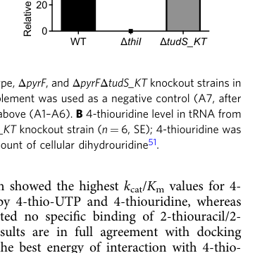

## Question

# Gene Research for Functional Annotation

## ⚠️ CRITICAL: Gene/Protein Identification Context

**BEFORE YOU BEGIN RESEARCH:** You MUST verify you are researching the CORRECT gene/protein. Gene symbols can be ambiguous, especially for less well-characterized genes from non-model organisms.

### Target Gene/Protein Identity (from UniProt):
- **UniProt Accession:** Q88CY4
- **Protein Description:** RecName: Full=tRNA sulfurtransferase {ECO:0000255|HAMAP-Rule:MF_00021}; EC=2.8.1.4 {ECO:0000255|HAMAP-Rule:MF_00021}; AltName: Full=Sulfur carrier protein ThiS sulfurtransferase {ECO:0000255|HAMAP-Rule:MF_00021}; AltName: Full=Thiamine biosynthesis protein ThiI {ECO:0000255|HAMAP-Rule:MF_00021}; AltName: Full=tRNA 4-thiouridine synthase {ECO:0000255|HAMAP-Rule:MF_00021};
- **Gene Information:** Name=thiI {ECO:0000255|HAMAP-Rule:MF_00021}; OrderedLocusNames=PP_5045;
- **Organism (full):** Pseudomonas putida (strain ATCC 47054 / DSM 6125 / CFBP 8728 / NCIMB 11950 / KT2440).
- **Protein Family:** Belongs to the ThiI family. {ECO:0000255|HAMAP-
- **Key Domains:** Rhodanese-like_dom. (IPR001763); Rhodanese-like_dom_sf. (IPR036873); Rossmann-like_a/b/a_fold. (IPR014729); ThiI_AANH. (IPR020536); ThiI_fer. (IPR054173)

### MANDATORY VERIFICATION STEPS:

1. **Check if the gene symbol "thiI" matches the protein description above**
2. **Verify the organism is correct:** Pseudomonas putida (strain ATCC 47054 / DSM 6125 / CFBP 8728 / NCIMB 11950 / KT2440).
3. **Check if protein family/domains align with what you find in literature**
4. **If you find literature for a DIFFERENT gene with the same or similar symbol, STOP**

### If Gene Symbol is Ambiguous or You Cannot Find Relevant Literature:

**DO NOT PROCEED WITH RESEARCH ON A DIFFERENT GENE.** Instead:
- State clearly: "The gene symbol 'thiI' is ambiguous or literature is limited for this specific protein"
- Explain what you found (e.g., "Found extensive literature on a different gene with the same symbol in a different organism")
- Describe the protein based ONLY on the UniProt information provided above
- Suggest that the protein function can be inferred from domain/family information

### Research Target:

Please provide a comprehensive research report on the gene **thiI** (gene ID: thiI, UniProt: Q88CY4) in PSEPK.

The research report should be a detailed narrative explaining the function, biological processes, and localization of the gene product. Citations should be given for all claims.

You should prioritize authoritative reviews and primary scientific literature when conducting research. You can supplement
this with annotations you find in gene/protein databases, but these can be outdated or inaccurate.

We are specifically interested in the primary function of the gene - for enzymes, what reaction is catalyzed, and what is the substrate specificity? For transporters, what is the substrate? For structural proteins or adapters, what is the broader structural role? For signaling molecules, what is the role in the pathway.

We are interested in where in or outside the cell the gene product carries out its function.

We are also interested in the signaling or biochemical pathways in which the gene functions. We are less interested in broad pleiotropic effects, except where these elucidate the precise role.

Include evidence where possible. We are interested in both experimental evidence as well as inference from structure, evolution, or bioinformatic analysis. Precise studies should be prioritized over high-throughput, where available.

## Output

Question: You are an expert researcher providing comprehensive, well-cited information.

Provide detailed information focusing on:
1. Key concepts and definitions with current understanding
2. Recent developments and latest research (prioritize 2023-2024 sources)
3. Current applications and real-world implementations
4. Expert opinions and analysis from authoritative sources
5. Relevant statistics and data from recent studies

Format as a comprehensive research report with proper citations. Include URLs and publication dates where available.
Always prioritize recent, authoritative sources and provide specific citations for all major claims.

# Gene Research for Functional Annotation

## ⚠️ CRITICAL: Gene/Protein Identification Context

**BEFORE YOU BEGIN RESEARCH:** You MUST verify you are researching the CORRECT gene/protein. Gene symbols can be ambiguous, especially for less well-characterized genes from non-model organisms.

### Target Gene/Protein Identity (from UniProt):
- **UniProt Accession:** Q88CY4
- **Protein Description:** RecName: Full=tRNA sulfurtransferase {ECO:0000255|HAMAP-Rule:MF_00021}; EC=2.8.1.4 {ECO:0000255|HAMAP-Rule:MF_00021}; AltName: Full=Sulfur carrier protein ThiS sulfurtransferase {ECO:0000255|HAMAP-Rule:MF_00021}; AltName: Full=Thiamine biosynthesis protein ThiI {ECO:0000255|HAMAP-Rule:MF_00021}; AltName: Full=tRNA 4-thiouridine synthase {ECO:0000255|HAMAP-Rule:MF_00021};
- **Gene Information:** Name=thiI {ECO:0000255|HAMAP-Rule:MF_00021}; OrderedLocusNames=PP_5045;
- **Organism (full):** Pseudomonas putida (strain ATCC 47054 / DSM 6125 / CFBP 8728 / NCIMB 11950 / KT2440).
- **Protein Family:** Belongs to the ThiI family. {ECO:0000255|HAMAP-
- **Key Domains:** Rhodanese-like_dom. (IPR001763); Rhodanese-like_dom_sf. (IPR036873); Rossmann-like_a/b/a_fold. (IPR014729); ThiI_AANH. (IPR020536); ThiI_fer. (IPR054173)

### MANDATORY VERIFICATION STEPS:

1. **Check if the gene symbol "thiI" matches the protein description above**
2. **Verify the organism is correct:** Pseudomonas putida (strain ATCC 47054 / DSM 6125 / CFBP 8728 / NCIMB 11950 / KT2440).
3. **Check if protein family/domains align with what you find in literature**
4. **If you find literature for a DIFFERENT gene with the same or similar symbol, STOP**

### If Gene Symbol is Ambiguous or You Cannot Find Relevant Literature:

**DO NOT PROCEED WITH RESEARCH ON A DIFFERENT GENE.** Instead:
- State clearly: "The gene symbol 'thiI' is ambiguous or literature is limited for this specific protein"
- Explain what you found (e.g., "Found extensive literature on a different gene with the same symbol in a different organism")
- Describe the protein based ONLY on the UniProt information provided above
- Suggest that the protein function can be inferred from domain/family information

### Research Target:

Please provide a comprehensive research report on the gene **thiI** (gene ID: thiI, UniProt: Q88CY4) in PSEPK.

The research report should be a detailed narrative explaining the function, biological processes, and localization of the gene product. Citations should be given for all claims.

You should prioritize authoritative reviews and primary scientific literature when conducting research. You can supplement
this with annotations you find in gene/protein databases, but these can be outdated or inaccurate.

We are specifically interested in the primary function of the gene - for enzymes, what reaction is catalyzed, and what is the substrate specificity? For transporters, what is the substrate? For structural proteins or adapters, what is the broader structural role? For signaling molecules, what is the role in the pathway.

We are interested in where in or outside the cell the gene product carries out its function.

We are also interested in the signaling or biochemical pathways in which the gene functions. We are less interested in broad pleiotropic effects, except where these elucidate the precise role.

Include evidence where possible. We are interested in both experimental evidence as well as inference from structure, evolution, or bioinformatic analysis. Precise studies should be prioritized over high-throughput, where available.

## Research report: Functional annotation of **thiI** (UniProt **Q88CY4**, locus **PP_5045**) in *Pseudomonas putida* KT2440

### Executive summary (identity verified)
The *Pseudomonas putida* KT2440 gene **thiI** (UniProt **Q88CY4**) encodes a **tRNA sulfurtransferase (tRNA 4-thiouridine synthase; EC 2.8.1.4)** responsible for installing **4-thiouridine (s4U)** in cellular tRNA. In *P. putida* KT2440, deletion of **thiI** causes a **drastic reduction of s4U in bulk tRNA**, directly supporting this assignment. In contrast, deletion of **tudS_KT** does not alter tRNA s4U levels, demonstrating that ThiI is the s4U “writer” while TudS is functionally distinct (a recycling/desulfidation enzyme acting on small-molecule 4-thio-nucleotide derivatives). (fuchs2023tudsdesulfidasesrecycle pages 6-7, fuchs2023tudsdesulfidasesrecycle media fa9f0ea0)

### 1) Key concepts and definitions (current understanding)

#### 1.1 What is s4U and why does it matter?
**4-thiouridine (s4U)** is a post-transcriptional sulfur modification of uridine found in bacterial (and some archaeal) tRNAs, typically at **position 8** in the tRNA core. It is one of the best-studied tRNA sulfur modifications and contributes to **tRNA structural stability** and can participate in **light/UV-associated physiology** because s4U is UV-reactive. (rajakovich2012functionalanalysisof pages 1-2)

#### 1.2 What is ThiI?
**ThiI** is the canonical enzyme family responsible for **tRNA uridine C4 thiolation** to generate **s4U**. ThiI is an **ATP-dependent** tRNA-modifying enzyme (PP-loop/adenylation chemistry) that uses a sulfur donor supplied by cellular sulfur trafficking pathways (classically via cysteine desulfurases such as IscS). (hori2023transferrnamodification pages 5-7, shigi2021biosynthesisanddegradation pages 7-8)

#### 1.3 Important distinction: ThiI (writer) vs TudS/RudS (erasers/salvage)
Recent work has clarified that bacteria can also encode “eraser”/recycling activities acting on s4U-containing molecules:
* **TudS** (DUF523) enzymes are **Fe–S cluster-dependent desulfidases** that preferentially act on **4-thiouridine-5′-monophosphate (4-thio-UMP)** rather than intact thiolated tRNA, consistent with a role in **recycling/detoxifying tRNA degradation products**. (fuchs2023tudsdesulfidasesrecycle pages 1-2)
* **RudS** enzymes (TudS fused to DUF1722) are described as **tRNA s4U de-modifying enzymes** (“erasers”) that can remove s4U from intact tRNA in vivo. (jamontas2024rudsbacterialdesulfidase pages 1-1)

This is critical for annotation: **ThiI is the biosynthetic writer of s4U**, while TudS/RudS represent distinct, downstream removal/recycling functions. (fuchs2023tudsdesulfidasesrecycle pages 6-7, jamontas2024rudsbacterialdesulfidase pages 1-1)

### 2) Primary biochemical function of *P. putida* KT2440 ThiI (Q88CY4)

#### 2.1 Reaction catalyzed (writer function)
ThiI catalyzes **ATP-dependent conversion of a tRNA uridine to 4-thiouridine (s4U)** (classically at U8). The reaction proceeds via **uridine activation by adenylation** followed by sulfur transfer to the C4 position of uridine. (hori2023transferrnamodification pages 5-7, shigi2021biosynthesisanddegradation pages 7-8)

#### 2.2 Substrate specificity (tRNA recognition)
ThiI is a **tRNA-binding enzyme**. Reviews emphasize that the **THUMP domain captures the tRNA 3′-CCA terminus**, and proper tRNA architecture is essential for catalysis. (hori2023transferrnamodification pages 5-7)

#### 2.3 Sulfur source and intermediates (mechanism)
Authoritative mechanistic summaries describe a canonical bacterial pathway:
1. **Cysteine desulfurase IscS** mobilizes sulfur from **L-cysteine** to form an **IscS persulfide**.
2. Persulfide sulfur is transferred to ThiI (in *E. coli*, to a rhodanese-like domain cysteine, classically referenced as **Cys456**).
3. ThiI uses **ATP** to activate the target uridine (adenylated intermediate), and a second cysteine (classically **Cys344**) assists incorporation of sulfur into tRNA, with a disulfide proposed during turnover.

These residue numbers are from *E. coli* and serve as **mechanistic guidance by homology**; the specific residue numbering for Q88CY4 was not directly provided in the retrieved corpus. (hori2023transferrnamodification pages 5-7, shigi2021biosynthesisanddegradation pages 7-8, rajakovich2012functionalanalysisof pages 1-2)

#### 2.4 Domain architecture (family-level understanding; supports function inference)
ThiI is described as a **multi-domain** enzyme. Across bacteria, ThiI proteins include:
* an **N-terminal ferredoxin-like domain**,
* a central **THUMP** RNA-binding domain,
* a **PP-loop** (ATP-binding/adenylation) domain,
* and in some lineages a **rhodanese-like domain** implicated in sulfur transfer.

Reviews emphasize that ThiI architecture varies across taxa (e.g., some bacteria lack a canonical rhodanese domain), indicating mechanistic diversity in how the sulfur is handled. (hori2023transferrnamodification pages 5-7, shigi2021biosynthesisanddegradation pages 7-8, rajakovich2012functionalanalysisof pages 1-2)

### 3) Organism-specific evidence in *Pseudomonas putida* KT2440

#### 3.1 Direct functional evidence: thiI is required for tRNA s4U in KT2440
Fuchs et al. (2023, *Communications Biology*, DOI: **10.1038/s42003-023-05450-5**, URL: https://doi.org/10.1038/s42003-023-05450-5; published 2023) quantified **4-thiouridine in bulk tRNA** by **mass spectrometry** and reported that a **ΔthiI** strain shows **drastically reduced** s4U relative to wild type (normalized to dihydrouridine). This provides direct, strain-specific evidence that *P. putida* ThiI is the s4U synthase. (fuchs2023tudsdesulfidasesrecycle pages 6-7, fuchs2023tudsdesulfidasesrecycle media fa9f0ea0)

#### 3.2 Distinguishing ThiI from TudS_KT in KT2440
The same study tested **ΔtudS_KT** and observed **virtually no difference** in bulk-tRNA s4U versus wild type, concluding that **TudS_KT does not act on tRNA-incorporated s4U in vivo** in KT2440. (fuchs2023tudsdesulfidasesrecycle pages 6-7)

#### 3.3 Cellular location
No KT2440-specific localization experiment was retrieved. However, the substrate is **cellular tRNA**, implying a **cytosolic/intracellular** site of action for ThiI (consistent with general tRNA modification biology). (hori2023transferrnamodification pages 5-7, rajakovich2012functionalanalysisof pages 1-2)

### 4) Recent developments (prioritizing 2023–2024)

#### 4.1 2023: TudS function clarified and connected to *P. putida* KT2440 salvage/recycling
Fuchs et al. (2023) provide mechanistic and genetic evidence that TudS enzymes preferentially act on **4-thio-UMP** rather than intact thiolated tRNA and that the **KT2440 TudS** enables growth using **4-thiouracil/4-thiouridine** as uracil/uridine sources in minimal media, supporting a recycling/detoxification role for tRNA degradation products. (fuchs2023tudsdesulfidasesrecycle pages 1-2, fuchs2023tudsdesulfidasesrecycle pages 6-7)

This helps functional annotation by cleanly separating pathways:
* **ThiI**: biosynthesis of s4U in tRNA (writer).
* **TudS**: salvage/recycling of 4-thio-UMP (not a tRNA eraser in KT2440 under tested conditions). (fuchs2023tudsdesulfidasesrecycle pages 6-7, fuchs2023tudsdesulfidasesrecycle pages 1-2)

#### 4.2 2023: Updated expert synthesis of ThiI structural biology
Hori (2023, *Genes*, Jan 2023, DOI: **10.3390/genes14020382**, URL: https://doi.org/10.3390/genes14020382) synthesizes structural and mechanistic work on THUMP-domain tRNA modification enzymes including ThiI. It emphasizes the **THUMP domain’s role in capturing the tRNA CCA end**, the **ATP-dependent activation step**, and the canonical **IscS→ThiI sulfur transfer** model in bacteria. (hori2023transferrnamodification pages 5-7, hori2023transferrnamodification pages 17-18)

#### 4.3 2024: Emergence of RudS as a tRNA s4U “eraser” family
Jamontas et al. (2024, *Nucleic Acids Research*, Aug 2024, DOI: **10.1093/nar/gkae716**, URL: https://doi.org/10.1093/nar/gkae716; published Aug 2024) report **RudS**, a widespread enzyme family (TudS fused to DUF1722) that can remove s4U from tRNA.

Key quantitative findings and mechanistic features include:
* **Prevalence:** 857 homologs in 884 reference genomes; co-occurrence with ThiI in 637 genomes (suggesting frequent pairing of writer and eraser functions). (jamontas2024rudsbacterialdesulfidase pages 6-7)
* **Effect size:** heterologous expression in *E. coli* reduced tRNA s4U by **4.7- to 26-fold** (RudS_KT reported at the high end). (jamontas2024rudsbacterialdesulfidase pages 6-7, jamontas2024rudsbacterialdesulfidase pages 7-7)
* **Cofactor:** RudS_KT shows Fe–S features; a ferene assay measured ~**1.01 Fe per monomer** (interpreted as partial occupancy/damage for an Fe–S enzyme). (jamontas2024rudsbacterialdesulfidase pages 8-9)
* **Physiology:** RudS_KT overexpression reduced a UVA-induced growth lag from ~**105 min** to ~**60 min**, consistent with a role in mitigating UVA-associated s4U stress. (jamontas2024rudsbacterialdesulfidase pages 12-13)

These findings are directly relevant to ThiI functional annotation because they show the s4U mark can be dynamically removed in some bacterial contexts. (jamontas2024rudsbacterialdesulfidase pages 1-1)

### 5) Current applications and real-world implementations

#### 5.1 Analytical implementations: quantifying s4U to validate gene function
*Mass spectrometry of bulk tRNA modifications* is used as a direct functional readout for thiI activity in *P. putida* KT2440, where ΔthiI serves as a control showing strong depletion of s4U. (fuchs2023tudsdesulfidasesrecycle pages 6-7, fuchs2023tudsdesulfidasesrecycle media fa9f0ea0)

#### 5.2 Nanopore tRNA sequencing as an implementation for modification mapping
RudS work uses nanopore-based **nano-tRNAseq** to infer conversion of s4U back to U at a specific tRNA position in vivo (supporting the “eraser” role). (jamontas2024rudsbacterialdesulfidase pages 7-7)

#### 5.3 Metabolic salvage and detoxification of sulfur-modified nucleotide derivatives
In KT2440, TudS_KT supports growth when **4-thiouracil/4-thiouridine** are provided as exogenous sources, indicating a real cellular implementation of **salvage/recycling** of sulfur-modified uracil derivatives. This is relevant when interpreting sulfur-modification homeostasis: loss of ThiI affects the tRNA modification mark, while TudS affects how degradation products are recycled. (fuchs2023tudsdesulfidasesrecycle pages 6-7)

### 6) Expert opinions and authoritative interpretations

#### 6.1 Consensus mechanism (expert reviews)
Hori (2023) and Shigi (2021) converge on a model where ThiI operates as an **ATP-dependent adenylating sulfurtransferase** acting on tRNA, with sulfur delivery commonly routed through cysteine desulfurases (e.g., IscS) and persulfide intermediates. (hori2023transferrnamodification pages 5-7, shigi2021biosynthesisanddegradation pages 7-8)

#### 6.2 Caution on cross-species mechanistic inference
Reviews emphasize that ThiI architecture and sulfur-trafficking solutions vary between lineages (e.g., Firmicutes ThiI proteins lacking a rhodanese domain and different sulfur donors/partner desulfurases). Thus, while the IscS-persulfide model is strongly supported in *E. coli* and is commonly applied by homology, direct biochemical confirmation in KT2440 is still desirable for substrate/partner specificity. (shigi2021biosynthesisanddegradation pages 7-8, rajakovich2012functionalanalysisof pages 1-2)

### 7) Statistics and quantitative data (recent studies)

Key quantitative results relevant to ThiI/s4U biology from 2023–2024 literature include:
* **ΔthiI effect in KT2440:** bulk-tRNA s4U levels are **drastically reduced** in ΔthiI; ΔtudS_KT shows **virtually no change** vs WT (mass spectrometry; normalization to dihydrouridine). (fuchs2023tudsdesulfidasesrecycle pages 6-7, fuchs2023tudsdesulfidasesrecycle media fa9f0ea0)
* **RudS prevalence:** 857 homologs in 884 reference genomes; 637 genomes encode both RudS and ThiI. (jamontas2024rudsbacterialdesulfidase pages 6-7)
* **RudS effect size on tRNA s4U:** 4.7–26-fold decreases upon heterologous overexpression. (jamontas2024rudsbacterialdesulfidase pages 6-7)
* **UVA phenotype modulation:** growth-lag reduced ~105 min → ~60 min with RudS_KT overexpression after UVA exposure. (jamontas2024rudsbacterialdesulfidase pages 12-13)
* **RudS Fe content (proxy for Fe–S cofactor occupancy):** ~1.01 Fe per monomer reported by ferene assay. (jamontas2024rudsbacterialdesulfidase pages 8-9)

### 8) Evidence-based functional statement for annotation
**thiI (Q88CY4; PP_5045) in *Pseudomonas putida* KT2440 encodes a cytosolic tRNA uridine sulfurtransferase required for biosynthesis of tRNA 4-thiouridine (s4U), an ATP-dependent modification installed in tRNA (classically U8).** The canonical mechanism involves adenylation of the target uridine and sulfur transfer via persulfide chemistry supplied by cysteine desulfurase pathways (IscS-like), though direct biochemical identification of the sulfur donor/partner in KT2440 was not captured in the retrieved corpus. (hori2023transferrnamodification pages 5-7, fuchs2023tudsdesulfidasesrecycle pages 6-7, shigi2021biosynthesisanddegradation pages 7-8, fuchs2023tudsdesulfidasesrecycle media fa9f0ea0)

### Summary table (for curation)
| Aspect | Evidence summary | Key sources (year + DOI/URL) |
|---|---|---|
| Identity | The target is **ThiI / PP_5045 / UniProt Q88CY4** from *Pseudomonas putida* KT2440, annotated as a **tRNA sulfurtransferase / tRNA 4-thiouridine synthase** in the ThiI family. In *P. putida* KT2440, deletion of **thiI** drastically reduces bulk tRNA 4-thiouridine (s4U), supporting that this gene is the organism’s bona fide s4U-forming ThiI rather than the distinct TudS/RudS desulfurases (fuchs2023tudsdesulfidasesrecycle pages 6-7). | Fuchs et al., 2023, *Communications Biology*, published 2023, DOI: 10.1038/s42003-023-05450-5, https://doi.org/10.1038/s42003-023-05450-5; Hori, 2023, *Genes*, Jan 2023, DOI: 10.3390/genes14020382, https://doi.org/10.3390/genes14020382 |
| Reaction | Current understanding is that ThiI catalyzes **ATP-dependent thiolation of uridine in tRNA to form 4-thiouridine (s4U), typically at position 8**. The mechanistic model is adenylation of the target uridine followed by sulfur transfer to C4 of uridine (hori2023transferrnamodification pages 5-7, shigi2021biosynthesisanddegradation pages 7-8, rajakovich2012functionalanalysisof pages 1-2). | Hori, 2023, https://doi.org/10.3390/genes14020382; Shigi, 2021, Nov 2021, DOI: 10.3390/ijms222111937, https://doi.org/10.3390/ijms222111937; Rajakovich et al., 2012, Jul 2012, DOI: 10.1128/JB.00842-12, https://doi.org/10.1128/JB.00842-12 |
| Substrates | Substrates are **tRNA containing the target uridine** plus **ATP**; the THUMP-containing RNA-binding region recognizes tRNA and the **3′-CCA end is important/essential** for catalysis in ThiI systems. The PP-loop domain activates the tRNA uridine by adenylation (hori2023transferrnamodification pages 5-7, shigi2021biosynthesisanddegradation pages 7-8, rajakovich2012functionalanalysisof pages 1-2). | Hori, 2023, https://doi.org/10.3390/genes14020382; Shigi, 2021, https://doi.org/10.3390/ijms222111937; Rajakovich et al., 2012, https://doi.org/10.1128/JB.00842-12 |
| Sulfur donor | In the canonical bacterial mechanism summarized from *E. coli* and related systems, sulfur is mobilized from **L-cysteine by the cysteine desulfurase IscS**, transferred as a **persulfide** to ThiI, then inserted into tRNA. This is the best-supported mechanistic inference for *P. putida* ThiI, although the cited conversation does not include a *P. putida*-specific biochemical reconstitution of sulfur transfer (hori2023transferrnamodification pages 5-7, hori2023transferrnamodification pages 17-18, shigi2021biosynthesisanddegradation pages 7-8, rajakovich2012functionalanalysisof pages 1-2). | Hori, 2023, https://doi.org/10.3390/genes14020382; Shigi, 2021, https://doi.org/10.3390/ijms222111937; Rajakovich et al., 2012, https://doi.org/10.1128/JB.00842-12 |
| Cofactors | ThiI is generally considered **ATP-dependent**. Many bacterial ThiI enzymes are **not Fe–S-cluster dependent**, although some archaeal ThiI homologs use Fe–S clusters. For the KT2440 protein, available conversation evidence supports assignment as a canonical bacterial ThiI rather than an Fe–S ThiI; no direct evidence here shows a metal cofactor requirement for Q88CY4 (hori2023transferrnamodification pages 5-7, shigi2021biosynthesisanddegradation pages 7-8). | Hori, 2023, https://doi.org/10.3390/genes14020382; Shigi, 2021, https://doi.org/10.3390/ijms222111937 |
| Domains | Reviews describe ThiI as a multi-domain enzyme with **N-terminal ferredoxin-like domain**, **central THUMP domain** for tRNA binding/CCA-end capture, and **PP-loop pyrophosphatase / adenylation domain**. Some ThiI proteins also carry a **C-terminal rhodanese-like domain (RLD)** that accepts sulfur; this domain architecture varies across taxa. UniProt annotation for Q88CY4 is consistent with a ThiI-family protein containing ThiI-associated and rhodanese-like features (hori2023transferrnamodification pages 5-7, hori2023transferrnamodification pages 17-18, shigi2021biosynthesisanddegradation pages 7-8, rajakovich2012functionalanalysisof pages 1-2). | Hori, 2023, https://doi.org/10.3390/genes14020382; Shigi, 2021, https://doi.org/10.3390/ijms222111937; Rajakovich et al., 2012, https://doi.org/10.1128/JB.00842-12 |
| Key residues | Canonical ThiI mechanism highlights **two catalytic cysteines in *E. coli***: **Cys456** in the rhodanese-like domain receives sulfur from IscS, and **Cys344** assists sulfur incorporation, with a disulfide proposed during turnover. These residue numbers are organism-specific and should be treated as **homology-based mechanistic guidance**, not directly validated numbering for Q88CY4 in the evidence provided here (hori2023transferrnamodification pages 5-7, shigi2021biosynthesisanddegradation pages 7-8, rajakovich2012functionalanalysisof pages 1-2). | Hori, 2023, https://doi.org/10.3390/genes14020382; Shigi, 2021, https://doi.org/10.3390/ijms222111937; Rajakovich et al., 2012, https://doi.org/10.1128/JB.00842-12 |
| Localization | The functional context is **intracellular/cytosolic**, acting on mature cellular tRNA. No evidence in the cited materials suggests secretion, membrane localization, or periplasmic function; ThiI acts where tRNA sulfur modification occurs (hori2023transferrnamodification pages 5-7, shigi2021biosynthesisanddegradation pages 7-8, rajakovich2012functionalanalysisof pages 1-2). | Hori, 2023, https://doi.org/10.3390/genes14020382; Shigi, 2021, https://doi.org/10.3390/ijms222111937; Rajakovich et al., 2012, https://doi.org/10.1128/JB.00842-12 |
| Pathway links | ThiI sits in the **tRNA sulfur-modification network** and, in some bacteria, also links to **thiamine (thiazole) biosynthesis**. The cited reviews and *Salmonella/Bacillus* studies show that ThiI can be bifunctional or mechanistically diverge across phyla; therefore, for *P. putida* KT2440 the strongest direct evidence supports the **tRNA s4U pathway**, while any thiamine-biosynthesis role remains an inference from family knowledge rather than KT2440-specific proof in the cited conversation (hori2023transferrnamodification pages 17-18, rajakovich2012functionalanalysisof pages 1-2). | Hori, 2023, https://doi.org/10.3390/genes14020382; Rajakovich et al., 2012, https://doi.org/10.1128/JB.00842-12 |
| Organism-specific evidence | In *P. putida* KT2440, **ΔthiI drastically reduces tRNA s4U**, whereas **ΔtudS_KT has virtually no effect** on bulk tRNA s4U. This cleanly separates ThiI as the **writer** of the s4U tRNA modification from **TudS** as a distinct desulfidase/recycling enzyme acting on **4-thio-UMP/4-thiouracil-derived metabolites**, not on intact tRNA in this organism (fuchs2023tudsdesulfidasesrecycle pages 6-7, fuchs2023tudsdesulfidasesrecycle pages 1-2, fuchs2023tudsdesulfidasesrecycle media fa9f0ea0). | Fuchs et al., 2023, *Communications Biology*, published 2023, DOI: 10.1038/s42003-023-05450-5, https://doi.org/10.1038/s42003-023-05450-5 |
| Annotation caveat | Recent literature introduces **RudS** as a bona fide bacterial **tRNA s4U de-modifying enzyme**, but the specific *P. putida* KT2440 protein discussed in Fuchs et al. 2023 is **TudS_KT**, which was concluded **not** to desulfurize intact tRNA in vivo. Thus, ThiI functional annotation for Q88CY4 should not be conflated with TudS/RudS pathways (fuchs2023tudsdesulfidasesrecycle pages 6-7). | Fuchs et al., 2023, https://doi.org/10.1038/s42003-023-05450-5; Hori, 2023, https://doi.org/10.3390/genes14020382 |

*Table: This table summarizes the best-supported functional annotation for Pseudomonas putida KT2440 ThiI (Q88CY4/PP_5045), separating organism-specific evidence from broader ThiI-family mechanistic inference. It is useful for distinguishing the s4U-writing activity of ThiI from separate TudS/RudS desulfidase pathways.*

### Notes on limitations / gaps
* The retrieved KT2440-specific literature provided strong evidence for the **tRNA s4U writer function** of ThiI, but did not include a KT2440-specific **in vitro reconstitution** of the full sulfur relay (i.e., explicit identification of the partner cysteine desulfurase) nor direct subcellular localization experiments. Therefore, sulfur-donor assignment and localization are reported as **best-supported inference from authoritative reviews** rather than KT2440-specific measurements. (hori2023transferrnamodification pages 5-7, shigi2021biosynthesisanddegradation pages 7-8)

### Key recent references (URLs and publication dates)
* Fuchs J, Jamontas R, Hoock MH, et al. **TudS desulfidases recycle 4-thiouridine-5′-monophosphate at a catalytic [4Fe-4S] cluster.** *Communications Biology* (2023). DOI: 10.1038/s42003-023-05450-5. URL: https://doi.org/10.1038/s42003-023-05450-5 (fuchs2023tudsdesulfidasesrecycle pages 1-2, fuchs2023tudsdesulfidasesrecycle pages 6-7)
* Hori H. **Transfer RNA Modification Enzymes with a THUMP Domain…** *Genes* (Jan 2023). DOI: 10.3390/genes14020382. URL: https://doi.org/10.3390/genes14020382 (hori2023transferrnamodification pages 5-7, hori2023transferrnamodification pages 17-18)
* Jamontas R, Laurynėnas A, Povilaitytė D, et al. **RudS: bacterial desulfidase responsible for tRNA 4-thiouridine de-modification.** *Nucleic Acids Research* (Aug 2024). DOI: 10.1093/nar/gkae716. URL: https://doi.org/10.1093/nar/gkae716 (jamontas2024rudsbacterialdesulfidase pages 1-1, jamontas2024rudsbacterialdesulfidase pages 12-13)
* Shigi N. **Biosynthesis and Degradation of Sulfur Modifications in tRNAs.** *International Journal of Molecular Sciences* (Nov 2021). DOI: 10.3390/ijms222111937. URL: https://doi.org/10.3390/ijms222111937 (shigi2021biosynthesisanddegradation pages 7-8, shigi2021biosynthesisanddegradation pages 8-10)
* Rajakovich LJ, Tomlinson J, Dos Santos PC. **Functional Analysis of Bacillus subtilis Genes Involved in the Biosynthesis of 4-Thiouridine in tRNA.** *Journal of Bacteriology* (Jul 2012). DOI: 10.1128/JB.00842-12. URL: https://doi.org/10.1128/JB.00842-12 (rajakovich2012functionalanalysisof pages 1-2, rajakovich2012functionalanalysisof pages 2-3)

References

1. (fuchs2023tudsdesulfidasesrecycle pages 6-7): J Fuchs, R Jamontas, MH Hoock, and J Oltmanns. Tuds desulfidases recycle 4-thiouridine-5'-monophosphate at a catalytic cluster. Unknown journal, 2023.

2. (fuchs2023tudsdesulfidasesrecycle media fa9f0ea0): J Fuchs, R Jamontas, MH Hoock, and J Oltmanns. Tuds desulfidases recycle 4-thiouridine-5'-monophosphate at a catalytic cluster. Unknown journal, 2023.

3. (rajakovich2012functionalanalysisof pages 1-2): Lauren J. Rajakovich, John Tomlinson, and Patricia C. Dos Santos. Functional analysis of bacillus subtilis genes involved in the biosynthesis of 4-thiouridine in trna. Journal of Bacteriology, 194:4933-4940, Jul 2012. URL: https://doi.org/10.1128/jb.00842-12, doi:10.1128/jb.00842-12. This article has 55 citations and is from a peer-reviewed journal.

4. (hori2023transferrnamodification pages 5-7): Hiroyuki Hori. Transfer rna modification enzymes with a thiouridine synthetase, methyltransferase and pseudouridine synthase (thump) domain and the nucleosides they produce in trna. Genes, 14:382, Jan 2023. URL: https://doi.org/10.3390/genes14020382, doi:10.3390/genes14020382. This article has 15 citations.

5. (shigi2021biosynthesisanddegradation pages 7-8): Naoki Shigi. Biosynthesis and degradation of sulfur modifications in trnas. International Journal of Molecular Sciences, 22:11937, Nov 2021. URL: https://doi.org/10.3390/ijms222111937, doi:10.3390/ijms222111937. This article has 32 citations.

6. (fuchs2023tudsdesulfidasesrecycle pages 1-2): J Fuchs, R Jamontas, MH Hoock, and J Oltmanns. Tuds desulfidases recycle 4-thiouridine-5'-monophosphate at a catalytic cluster. Unknown journal, 2023.

7. (jamontas2024rudsbacterialdesulfidase pages 1-1): Rapolas Jamontas, Audrius Laurynėnas, Deimantė Povilaitytė, Rolandas Meškys, and Agota Aučynaitė. Ruds: bacterial desulfidase responsible for trna 4-thiouridine de-modification. Nucleic Acids Research, 52:10543-10562, Aug 2024. URL: https://doi.org/10.1093/nar/gkae716, doi:10.1093/nar/gkae716. This article has 9 citations and is from a highest quality peer-reviewed journal.

8. (hori2023transferrnamodification pages 17-18): Hiroyuki Hori. Transfer rna modification enzymes with a thiouridine synthetase, methyltransferase and pseudouridine synthase (thump) domain and the nucleosides they produce in trna. Genes, 14:382, Jan 2023. URL: https://doi.org/10.3390/genes14020382, doi:10.3390/genes14020382. This article has 15 citations.

9. (jamontas2024rudsbacterialdesulfidase pages 6-7): Rapolas Jamontas, Audrius Laurynėnas, Deimantė Povilaitytė, Rolandas Meškys, and Agota Aučynaitė. Ruds: bacterial desulfidase responsible for trna 4-thiouridine de-modification. Nucleic Acids Research, 52:10543-10562, Aug 2024. URL: https://doi.org/10.1093/nar/gkae716, doi:10.1093/nar/gkae716. This article has 9 citations and is from a highest quality peer-reviewed journal.

10. (jamontas2024rudsbacterialdesulfidase pages 7-7): Rapolas Jamontas, Audrius Laurynėnas, Deimantė Povilaitytė, Rolandas Meškys, and Agota Aučynaitė. Ruds: bacterial desulfidase responsible for trna 4-thiouridine de-modification. Nucleic Acids Research, 52:10543-10562, Aug 2024. URL: https://doi.org/10.1093/nar/gkae716, doi:10.1093/nar/gkae716. This article has 9 citations and is from a highest quality peer-reviewed journal.

11. (jamontas2024rudsbacterialdesulfidase pages 8-9): Rapolas Jamontas, Audrius Laurynėnas, Deimantė Povilaitytė, Rolandas Meškys, and Agota Aučynaitė. Ruds: bacterial desulfidase responsible for trna 4-thiouridine de-modification. Nucleic Acids Research, 52:10543-10562, Aug 2024. URL: https://doi.org/10.1093/nar/gkae716, doi:10.1093/nar/gkae716. This article has 9 citations and is from a highest quality peer-reviewed journal.

12. (jamontas2024rudsbacterialdesulfidase pages 12-13): Rapolas Jamontas, Audrius Laurynėnas, Deimantė Povilaitytė, Rolandas Meškys, and Agota Aučynaitė. Ruds: bacterial desulfidase responsible for trna 4-thiouridine de-modification. Nucleic Acids Research, 52:10543-10562, Aug 2024. URL: https://doi.org/10.1093/nar/gkae716, doi:10.1093/nar/gkae716. This article has 9 citations and is from a highest quality peer-reviewed journal.

13. (shigi2021biosynthesisanddegradation pages 8-10): Naoki Shigi. Biosynthesis and degradation of sulfur modifications in trnas. International Journal of Molecular Sciences, 22:11937, Nov 2021. URL: https://doi.org/10.3390/ijms222111937, doi:10.3390/ijms222111937. This article has 32 citations.

14. (rajakovich2012functionalanalysisof pages 2-3): Lauren J. Rajakovich, John Tomlinson, and Patricia C. Dos Santos. Functional analysis of bacillus subtilis genes involved in the biosynthesis of 4-thiouridine in trna. Journal of Bacteriology, 194:4933-4940, Jul 2012. URL: https://doi.org/10.1128/jb.00842-12, doi:10.1128/jb.00842-12. This article has 55 citations and is from a peer-reviewed journal.

## Artifacts

- [Edison artifact artifact-00](thiI-deep-research-falcon_artifacts/artifact-00.md)

## Citations

1. rajakovich2012functionalanalysisof pages 1-2
2. fuchs2023tudsdesulfidasesrecycle pages 1-2
3. jamontas2024rudsbacterialdesulfidase pages 1-1
4. hori2023transferrnamodification pages 5-7
5. fuchs2023tudsdesulfidasesrecycle pages 6-7
6. jamontas2024rudsbacterialdesulfidase pages 6-7
7. jamontas2024rudsbacterialdesulfidase pages 8-9
8. jamontas2024rudsbacterialdesulfidase pages 12-13
9. jamontas2024rudsbacterialdesulfidase pages 7-7
10. shigi2021biosynthesisanddegradation pages 7-8
11. hori2023transferrnamodification pages 17-18
12. shigi2021biosynthesisanddegradation pages 8-10
13. rajakovich2012functionalanalysisof pages 2-3
14. 4Fe-4S
15. https://doi.org/10.1038/s42003-023-05450-5;
16. https://doi.org/10.3390/genes14020382
17. https://doi.org/10.1093/nar/gkae716;
18. https://doi.org/10.3390/genes14020382;
19. https://doi.org/10.3390/ijms222111937;
20. https://doi.org/10.1128/JB.00842-12
21. https://doi.org/10.3390/ijms222111937
22. https://doi.org/10.1038/s42003-023-05450-5
23. https://doi.org/10.1093/nar/gkae716
24. https://doi.org/10.1128/jb.00842-12,
25. https://doi.org/10.3390/genes14020382,
26. https://doi.org/10.3390/ijms222111937,
27. https://doi.org/10.1093/nar/gkae716,