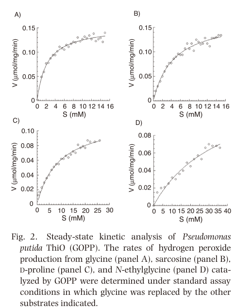

## Question

# Gene Research for Functional Annotation

## ⚠️ CRITICAL: Gene/Protein Identification Context

**BEFORE YOU BEGIN RESEARCH:** You MUST verify you are researching the CORRECT gene/protein. Gene symbols can be ambiguous, especially for less well-characterized genes from non-model organisms.

### Target Gene/Protein Identity (from UniProt):
- **UniProt Accession:** Q88Q83
- **Protein Description:** RecName: Full=Glycine oxidase {ECO:0000303|PubMed:26875494}; Short=GO {ECO:0000303|PubMed:26875494}; EC=1.4.3.19 {ECO:0000269|PubMed:26875494};
- **Gene Information:** Name=thiO {ECO:0000303|PubMed:26875494, ECO:0000312|EMBL:AAN66238.1}; OrderedLocusNames=PP_0612 {ECO:0000312|EMBL:AAN66238.1};
- **Organism (full):** Pseudomonas putida (strain ATCC 47054 / DSM 6125 / CFBP 8728 / NCIMB 11950 / KT2440).
- **Protein Family:** Belongs to the DAO family. ThiO subfamily. .
- **Key Domains:** FAD-dep_OxRdtase. (IPR006076); FAD/NAD-bd_sf. (IPR036188); Gly_oxidase_ThiO. (IPR012727); DAO (PF01266)

### MANDATORY VERIFICATION STEPS:

1. **Check if the gene symbol "thiO" matches the protein description above**
2. **Verify the organism is correct:** Pseudomonas putida (strain ATCC 47054 / DSM 6125 / CFBP 8728 / NCIMB 11950 / KT2440).
3. **Check if protein family/domains align with what you find in literature**
4. **If you find literature for a DIFFERENT gene with the same or similar symbol, STOP**

### If Gene Symbol is Ambiguous or You Cannot Find Relevant Literature:

**DO NOT PROCEED WITH RESEARCH ON A DIFFERENT GENE.** Instead:
- State clearly: "The gene symbol 'thiO' is ambiguous or literature is limited for this specific protein"
- Explain what you found (e.g., "Found extensive literature on a different gene with the same symbol in a different organism")
- Describe the protein based ONLY on the UniProt information provided above
- Suggest that the protein function can be inferred from domain/family information

### Research Target:

Please provide a comprehensive research report on the gene **thiO** (gene ID: thiO, UniProt: Q88Q83) in PSEPK.

The research report should be a detailed narrative explaining the function, biological processes, and localization of the gene product. Citations should be given for all claims.

You should prioritize authoritative reviews and primary scientific literature when conducting research. You can supplement
this with annotations you find in gene/protein databases, but these can be outdated or inaccurate.

We are specifically interested in the primary function of the gene - for enzymes, what reaction is catalyzed, and what is the substrate specificity? For transporters, what is the substrate? For structural proteins or adapters, what is the broader structural role? For signaling molecules, what is the role in the pathway.

We are interested in where in or outside the cell the gene product carries out its function.

We are also interested in the signaling or biochemical pathways in which the gene functions. We are less interested in broad pleiotropic effects, except where these elucidate the precise role.

Include evidence where possible. We are interested in both experimental evidence as well as inference from structure, evolution, or bioinformatic analysis. Precise studies should be prioritized over high-throughput, where available.

## Output

Question: You are an expert researcher providing comprehensive, well-cited information.

Provide detailed information focusing on:
1. Key concepts and definitions with current understanding
2. Recent developments and latest research (prioritize 2023-2024 sources)
3. Current applications and real-world implementations
4. Expert opinions and analysis from authoritative sources
5. Relevant statistics and data from recent studies

Format as a comprehensive research report with proper citations. Include URLs and publication dates where available.
Always prioritize recent, authoritative sources and provide specific citations for all major claims.

# Gene Research for Functional Annotation

## ⚠️ CRITICAL: Gene/Protein Identification Context

**BEFORE YOU BEGIN RESEARCH:** You MUST verify you are researching the CORRECT gene/protein. Gene symbols can be ambiguous, especially for less well-characterized genes from non-model organisms.

### Target Gene/Protein Identity (from UniProt):
- **UniProt Accession:** Q88Q83
- **Protein Description:** RecName: Full=Glycine oxidase {ECO:0000303|PubMed:26875494}; Short=GO {ECO:0000303|PubMed:26875494}; EC=1.4.3.19 {ECO:0000269|PubMed:26875494};
- **Gene Information:** Name=thiO {ECO:0000303|PubMed:26875494, ECO:0000312|EMBL:AAN66238.1}; OrderedLocusNames=PP_0612 {ECO:0000312|EMBL:AAN66238.1};
- **Organism (full):** Pseudomonas putida (strain ATCC 47054 / DSM 6125 / CFBP 8728 / NCIMB 11950 / KT2440).
- **Protein Family:** Belongs to the DAO family. ThiO subfamily. .
- **Key Domains:** FAD-dep_OxRdtase. (IPR006076); FAD/NAD-bd_sf. (IPR036188); Gly_oxidase_ThiO. (IPR012727); DAO (PF01266)

### MANDATORY VERIFICATION STEPS:

1. **Check if the gene symbol "thiO" matches the protein description above**
2. **Verify the organism is correct:** Pseudomonas putida (strain ATCC 47054 / DSM 6125 / CFBP 8728 / NCIMB 11950 / KT2440).
3. **Check if protein family/domains align with what you find in literature**
4. **If you find literature for a DIFFERENT gene with the same or similar symbol, STOP**

### If Gene Symbol is Ambiguous or You Cannot Find Relevant Literature:

**DO NOT PROCEED WITH RESEARCH ON A DIFFERENT GENE.** Instead:
- State clearly: "The gene symbol 'thiO' is ambiguous or literature is limited for this specific protein"
- Explain what you found (e.g., "Found extensive literature on a different gene with the same symbol in a different organism")
- Describe the protein based ONLY on the UniProt information provided above
- Suggest that the protein function can be inferred from domain/family information

### Research Target:

Please provide a comprehensive research report on the gene **thiO** (gene ID: thiO, UniProt: Q88Q83) in PSEPK.

The research report should be a detailed narrative explaining the function, biological processes, and localization of the gene product. Citations should be given for all claims.

You should prioritize authoritative reviews and primary scientific literature when conducting research. You can supplement
this with annotations you find in gene/protein databases, but these can be outdated or inaccurate.

We are specifically interested in the primary function of the gene - for enzymes, what reaction is catalyzed, and what is the substrate specificity? For transporters, what is the substrate? For structural proteins or adapters, what is the broader structural role? For signaling molecules, what is the role in the pathway.

We are interested in where in or outside the cell the gene product carries out its function.

We are also interested in the signaling or biochemical pathways in which the gene functions. We are less interested in broad pleiotropic effects, except where these elucidate the precise role.

Include evidence where possible. We are interested in both experimental evidence as well as inference from structure, evolution, or bioinformatic analysis. Precise studies should be prioritized over high-throughput, where available.

## Research report: Functional annotation of **thiO (PP_0612; UniProt Q88Q83)** in *Pseudomonas putida* KT2440

### 1) Target verification (gene/protein identity)
The **thiO** locus in *P. putida* KT2440 is annotated as **PP_0612** and was experimentally characterized as a **glycine oxidase (GO; EC 1.4.3.19)**; the primary characterization paper explicitly equates the enzyme (GOPP) with **UniProt Q88Q83**. (equar2015purificationandproperties pages 2-4)

### 2) Key concepts and current understanding

#### 2.1 Enzymatic function and reaction chemistry
ThiO (GOPP) is a flavoprotein oxidase that catalyzes oxidative deamination of glycine to an imine while reducing O2 to H2O2. In the *P. putida* KT2440 ThiO study, the authors describe the glycine oxidase reaction as producing **glyoxyl imine** and **hydrogen peroxide**, with glyoxyl imine able to **spontaneously hydrolyze to glyoxylate and ammonia**. (equar2015purificationandproperties pages 1-2)

#### 2.2 Substrate specificity
In contrast to some ThiO homologs that show broad specificity and can behave more like D-proline oxidases, *P. putida* ThiO is described as having **preference for glycine** and exhibiting **narrower substrate specificity** than Bacillus/Geobacillus ThiO homologs. (equar2015purificationandproperties pages 1-2, equar2015purificationandproperties pages 4-5)

Kinetic analyses in the primary study indicate substantial differences in affinity across tested substrates, with much weaker binding/turnover for D-proline than for glycine/sarcosine. (equar2015purificationandproperties pages 2-4, equar2015purificationandproperties media 4adffce9)

#### 2.3 Cofactor usage, oligomeric state, and mechanistic implications
*P. putida* ThiO exhibits absorption features typical of a flavoprotein and is reported to contain a **noncovalently bound flavin cofactor** (the authors conclude the flavin cofactor is not covalently attached). (equar2015purificationandproperties pages 2-4)

By gel filtration/SDS-PAGE-based estimates, the recombinant enzyme is **monomeric**, distinguishing it from some characterized ThiO enzymes that are homotetramers. (equar2015purificationandproperties pages 2-4)

Because the ThiO reaction produces **H2O2**, its activity can couple metabolism to oxidative stress and redox buffering demands; this is a common practical consideration when deploying oxidases in vivo or on electrodes. (equar2015purificationandproperties pages 1-2, jared2024biomimeticlaserinducedgraphene pages 7-9)

#### 2.4 Biological process and pathway context
The *P. putida* KT2440 ThiO work links thiO to **thiamin (vitamin B1) thiazole biosynthesis**, describing ThiO as supplying **glyoxyl imine** needed for formation of the thiazole moiety. (equar2015purificationandproperties pages 1-2)

More generally, *P. putida* thiO (PP_0612) is also described in later *P. putida* metabolic engineering work as encoding a **FAD-dependent glycine/D-amino acid oxidase** catalyzing glycine oxidation to **2-iminoacetate**, which can convert to **glyoxylate** with release of NH3 while generating **H2O2**; in that context, ThiO-mediated glycine oxidation is discussed as a potential competing flux affecting engineered C1 assimilation routes. (turlin2025syntheticc1metabolism pages 4-7)

#### 2.5 Cellular localization
The primary biochemical characterization of *P. putida* ThiO focuses on purification and in vitro properties and does **not report experimental subcellular localization** information in the extracted evidence. (equar2015purificationandproperties pages 1-2)

### 3) Quantitative evidence: kinetics and biochemical properties (primary data)
The main quantitative parameters supporting functional annotation (substrate preference, kinetics, and biochemical optima) are summarized below and visually supported by the original kinetic table/curves. (equar2015purificationandproperties pages 2-4, equar2015purificationandproperties media 4adffce9, equar2015purificationandproperties media 68ed7c6f)

| Study / row | System | Key statistic(s) | Value(s) | Notes | Publication date / DOI |
|---|---|---|---|---|---|
| Equar et al. 2015 — biochemical properties | *P. putida* KT2440 ThiO / GOPP (PP_0612; UniProt Q88Q83) | Oligomeric state; cofactor; cofactor attachment; pH optimum; pH stability; temperature optimum; specific activity | Monomeric; FAD-dependent flavoprotein; flavin not covalently attached; pH optimum ~8.5; stable at pH 8.0–10; temperature optimum ~40°C; specific activity ~0.073 mmol·mg⁻¹·min⁻¹ | Direct primary characterization of the target enzyme; assays included added FAD with activation plateau above 0.1 mM FAD (equar2015purificationandproperties pages 1-2, equar2015purificationandproperties pages 2-4, equar2015purificationandproperties media 4adffce9) | Jan 2015; https://doi.org/10.3177/jnsv.61.506 |
| Equar et al. 2015 — glycine kinetics | *P. putida* KT2440 ThiO / GOPP | Vmax; Km | Vmax 0.15 mmol·mg⁻¹·min⁻¹; Km 2.43 mM | Preferred substrate; reaction yields glyoxyl imine and H₂O₂, with spontaneous conversion to glyoxylate + NH₃ (equar2015purificationandproperties pages 1-2, equar2015purificationandproperties pages 2-4, equar2015purificationandproperties media 4adffce9) | Jan 2015; https://doi.org/10.3177/jnsv.61.506 |
| Equar et al. 2015 — sarcosine kinetics | *P. putida* KT2440 ThiO / GOPP | Vmax; Km | Vmax 0.17 mmol·mg⁻¹·min⁻¹; Km 4.86 mM | Sarcosine was also a preferred substrate, but glycine remained central to annotation/function (equar2015purificationandproperties pages 2-4, equar2015purificationandproperties media 4adffce9) | Jan 2015; https://doi.org/10.3177/jnsv.61.506 |
| Equar et al. 2015 — N-ethylglycine kinetics | *P. putida* KT2440 ThiO / GOPP | Vmax; Km | Vmax 0.11 mmol·mg⁻¹·min⁻¹; Km 7.68 mM | Lower affinity than glycine/sarcosine (equar2015purificationandproperties pages 2-4, equar2015purificationandproperties media 4adffce9) | Jan 2015; https://doi.org/10.3177/jnsv.61.506 |
| Equar et al. 2015 — D-proline kinetics | *P. putida* KT2440 ThiO / GOPP | Vmax; Km | Vmax 0.13 mmol·mg⁻¹·min⁻¹; Km 31.7 mM | Distinguishes *P. putida* ThiO from broader-specificity/tetrameric ThiO homologs that prefer D-proline (equar2015purificationandproperties pages 2-4, equar2015purificationandproperties pages 4-5, equar2015purificationandproperties media 4adffce9) | Jan 2015; https://doi.org/10.3177/jnsv.61.506 |
| Zangelmi et al. 2023 — literature values for ThiO | Comparative survey of FAD-dependent small-amine oxidoreductases | Km; kcat/KM | Km 0.9 mM; kcat/KM 340 M⁻¹·s⁻¹ | These are cited literature values for ThiO in a comparative enzymology paper, not new direct measurements on *P. putida* Q88Q83 within that study (zangelmi2023decipheringtherole pages 8-9) | Nov 2023; https://doi.org/10.1016/j.isci.2023.108108 |
| Jared et al. 2024 — glyphosate biosensor | LIG/PtNP/glycine oxidase electrochemical biosensor | Linear range; LOD; sensitivity; accuracy | Linear range 10–260 µM; LOD 1.15 µM; sensitivity 5.64 nA·µM⁻¹; accuracy up to 97% vs benchtop potentiostat | Source excerpts contain unit inconsistencies in some pages (reported as nM/mM in places), but the abstract-level summary reports µM; value harmonized here to µM and inconsistency noted explicitly (jared2024biomimeticlaserinducedgraphene pages 10-11, jared2024biomimeticlaserinducedgraphene pages 1-2, jared2024biomimeticlaserinducedgraphene pages 7-9) | Jul 2024; https://doi.org/10.1039/d4nh00010b |
| Jared et al. 2024 — field recovery | Biomimetic LIG “collect-and-sense” fern-leaf patch + glycine oxidase sensor | Recovery at 24–48 h; 1 week; 2 weeks post-spray | 73.64 ± 4.94%; 14.02 ± 5.18%; no response / negligible signal | Supports real-world deployment window shortly after spraying / near REI timing (jared2024biomimeticlaserinducedgraphene pages 10-11, jared2024biomimeticlaserinducedgraphene pages 9-10, jared2024biomimeticlaserinducedgraphene pages 11-12) | Jul 2024; https://doi.org/10.1039/d4nh00010b |
| Zribi et al. 2024 — MoS₂-LIG glyphosate biosensor | MoS₂/LIG/glycine oxidase electrochemical biosensor | Linear range; LOD; sensitivity; stability; recovery | Linear range 10–90 µM; LOD 4.0 µM; sensitivity 11 ± 3 nA/µM; stability 21–34 days; agrochemical interference recovery 86.3–111.1%; food-sample recovery 81.3–120% | Validated against LC–MS; negative-potential operation reduced interferent oxidation (zribi2024molybdenumdisulfidediselenidelaserinducedgrapheneglycine pages 1-5, zribi2024molybdenumdisulfidediselenidelaserinducedgrapheneglycine pages 19-24) | Dec 2024; https://doi.org/10.1021/acsami.4c14042 |
| Zribi et al. 2024 — MoSe₂-LIG glyphosate biosensor | MoSe₂/LIG/glycine oxidase electrochemical biosensor | Linear range; LOD; sensitivity; stability; recovery | Linear range 10–90 µM; LOD 6.1 µM; sensitivity 18 ± 2 nA/µM; stability 21–34 days; agrochemical interference recovery 79.3–98.8%; food-sample recovery 81.3–120% | MoSe₂ devices trended toward overprediction in complex food matrices; food-specific modeling factor was introduced (zribi2024molybdenumdisulfidediselenidelaserinducedgrapheneglycine pages 1-5, zribi2024molybdenumdisulfidediselenidelaserinducedgrapheneglycine pages 19-24) | Dec 2024; https://doi.org/10.1021/acsami.4c14042 |

*Table: This table compiles the main quantitative functional-annotation data for *Pseudomonas putida* KT2440 ThiO (Q88Q83/PP_0612) and recent glycine-oxidase application studies. It is useful for quickly linking core enzymology to current biosensor implementations and their measured performance.*

### 4) Recent developments (2023–2024 prioritized)

#### 4.1 Comparative enzymology: placing ThiO among recurrent FAD enzymes
A 2023 iScience study surveying recurrent FAD-dependent enzymes (in a different biological context) cites literature values for **ThiO oxidizing glycine** with **KM = 0.9 mM** and **kcat/KM = 340 M⁻¹·s⁻¹**, illustrating how ThiO is used as a benchmark for small-amine oxidation in FAD-enzyme comparisons. (zangelmi2023decipheringtherole pages 8-9)

#### 4.2 Mechanistic/structural advances in glycine-oxidation-coupled FAD chemistry
A 2023 Nature Communications paper reports a noncanonical FAD enzyme (Orf1) that uses **glycine oxidation** as part of aminoglycoside tailoring, featuring **two substrate-binding sites (~13.5 Å apart)** and an unusual **N–O–S enzyme–substrate linkage** enabling reactivity that differs from canonical FAD oxidases. This work expands the mechanistic landscape of glycine-oxidation-dependent biochemistry and includes activity testing of multiple mutants to probe mechanism. (wang2023nformimidoylationiminoacetylationmodificationin pages 1-3, wang2023nformimidoylationiminoacetylationmodificationin pages 3-4)

Although Orf1 is not ThiO, the study explicitly mentions **ThiO** as a comparator in assays (as indicated in extracted figure legend text), underscoring ThiO’s role as a reference glycine-oxidation enzyme family member in current mechanistic studies. (wang2023nformimidoylationiminoacetylationmodificationin pages 3-4)

### 5) Current applications and real-world implementations (2024)

#### 5.1 Field-deployable electrochemical monitoring of glyphosate using glycine oxidase
A 2024 Nanoscale Horizons study demonstrates a portable, enzyme-based “collect-and-sense” platform for agricultural pesticide monitoring that uses **glycine oxidase** to generate **H2O2** for amperometric detection at Pt nanoparticles on laser-induced graphene (LIG). (jared2024biomimeticlaserinducedgraphene pages 7-9, jared2024biomimeticlaserinducedgraphene pages 1-2)

The reported biosensor performance includes a **linear range of 10–260 µM**, **LOD 1.15 µM**, and **sensitivity 5.64 nA·µM⁻¹**, with a portable potentiostat achieving **up to 97% accuracy** relative to a benchtop instrument; outdoor sampling showed signal recovery of **73.64 ± 4.94%** at 24–48 h post-spray, dropping to **14.02 ± 5.18%** at 1 week, and negligible response at 2 weeks—providing practical guidance on operational deployment windows. (jared2024biomimeticlaserinducedgraphene pages 1-2, jared2024biomimeticlaserinducedgraphene pages 10-11, jared2024biomimeticlaserinducedgraphene pages 9-10)

#### 5.2 Food-matrix validation and longer stability via MoS2/MoSe2–LIG glycine oxidase composites
A 2024 ACS Applied Materials & Interfaces paper reports LIG biosensors functionalized with **MoS2 or MoSe2 nanosheets** and glycine oxidase for glyphosate detection. (zribi2024molybdenumdisulfidediselenidelaserinducedgrapheneglycine pages 1-5)

The study reports a **linear range of 10–90 µM** and LODs of **4.0 µM (MoS2)** and **6.1 µM (MoSe2)**, and further provides application-level metrics including sensitivities (**11 ± 3 nA/µM** for MoS2; **18 ± 2 nA/µM** for MoSe2), stability over **21–34 days**, and recovery ranges in interference and food matrices, with validation against LC–MS. (zribi2024molybdenumdisulfidediselenidelaserinducedgrapheneglycine pages 1-5, zribi2024molybdenumdisulfidediselenidelaserinducedgrapheneglycine pages 19-24)

### 6) Expert synthesis and functional annotation conclusions

**Primary molecular function.** The strongest direct evidence supports annotation of *P. putida* KT2440 **thiO (PP_0612; Q88Q83)** as a **FAD-dependent glycine oxidase** that preferentially oxidizes **glycine** (and also accepts sarcosine), yielding an imine intermediate and **H2O2**, with spontaneous conversion to **glyoxylate + NH3**. (equar2015purificationandproperties pages 1-2, equar2015purificationandproperties pages 2-4)

**Substrate specificity and distinguishing features.** Compared with some previously characterized ThiO enzymes that are tetrameric and broader-specificity, the *P. putida* enzyme is **monomeric**, has **narrower substrate specificity**, and shows **weak activity/low affinity** toward D-proline (high KM) relative to glycine. (equar2015purificationandproperties pages 1-2, equar2015purificationandproperties pages 2-4, equar2015purificationandproperties media 4adffce9)

**Pathway/process assignment.** The primary study connects ThiO activity to **thiamin thiazole biosynthesis** by providing **glyoxyl imine** as an intermediate/input to thiazole formation. (equar2015purificationandproperties pages 1-2)

**Cellular location.** No direct localization evidence was found in the retrieved primary biochemical characterization excerpts; thus, localization should currently be treated as **unresolved experimentally** for this specific protein in *P. putida* KT2440 within this evidence set. (equar2015purificationandproperties pages 1-2)

### Key sources (URLs and publication dates)
- Equar MY, Tani Y, Mihara H. *Purification and properties of glycine oxidase from Pseudomonas putida KT2440.* **Jan 2015**. J Nutr Sci Vitaminol. https://doi.org/10.3177/jnsv.61.506 (equar2015purificationandproperties pages 1-2, equar2015purificationandproperties pages 2-4, equar2015purificationandproperties media 4adffce9)
- Wang Y-L et al. *N-formimidoylation/-iminoacetylation modification in aminoglycosides requires FAD-dependent and ligand-protein NOS bridge dual chemistry.* **May 2023**. Nat Commun. https://doi.org/10.1038/s41467-023-38218-w (wang2023nformimidoylationiminoacetylationmodificationin pages 1-3, wang2023nformimidoylationiminoacetylationmodificationin pages 3-4)
- Zangelmi E et al. *Deciphering the role of recurrent FAD-dependent enzymes in bacterial phosphonate catabolism.* **Nov 2023**. iScience. https://doi.org/10.1016/j.isci.2023.108108 (zangelmi2023decipheringtherole pages 8-9)
- Jared NM et al. *Biomimetic laser-induced graphene fern leaf and enzymatic biosensor for pesticide spray collection and monitoring.* **Jul 2024**. Nanoscale Horizons. https://doi.org/10.1039/d4nh00010b (jared2024biomimeticlaserinducedgraphene pages 1-2, jared2024biomimeticlaserinducedgraphene pages 10-11, jared2024biomimeticlaserinducedgraphene pages 9-10)
- Zribi R et al. *MoS2/MoSe2–laser-induced graphene–glycine oxidase composite for electrochemical sensing of glyphosate.* **Dec 2024**. ACS Appl Mater Interfaces. https://doi.org/10.1021/acsami.4c14042 (zribi2024molybdenumdisulfidediselenidelaserinducedgrapheneglycine pages 1-5, zribi2024molybdenumdisulfidediselenidelaserinducedgrapheneglycine pages 19-24)

References

1. (equar2015purificationandproperties pages 2-4): Messele Yohannes EQUAR, Yasushi TANI, and Hisaaki MIHARA. Purification and properties of glycine oxidase from pseudomonas putida kt2440. Journal of nutritional science and vitaminology, 61 6:506-10, Jan 2015. URL: https://doi.org/10.3177/jnsv.61.506, doi:10.3177/jnsv.61.506. This article has 12 citations and is from a peer-reviewed journal.

2. (equar2015purificationandproperties pages 1-2): Messele Yohannes EQUAR, Yasushi TANI, and Hisaaki MIHARA. Purification and properties of glycine oxidase from pseudomonas putida kt2440. Journal of nutritional science and vitaminology, 61 6:506-10, Jan 2015. URL: https://doi.org/10.3177/jnsv.61.506, doi:10.3177/jnsv.61.506. This article has 12 citations and is from a peer-reviewed journal.

3. (equar2015purificationandproperties pages 4-5): Messele Yohannes EQUAR, Yasushi TANI, and Hisaaki MIHARA. Purification and properties of glycine oxidase from pseudomonas putida kt2440. Journal of nutritional science and vitaminology, 61 6:506-10, Jan 2015. URL: https://doi.org/10.3177/jnsv.61.506, doi:10.3177/jnsv.61.506. This article has 12 citations and is from a peer-reviewed journal.

4. (equar2015purificationandproperties media 4adffce9): Messele Yohannes EQUAR, Yasushi TANI, and Hisaaki MIHARA. Purification and properties of glycine oxidase from pseudomonas putida kt2440. Journal of nutritional science and vitaminology, 61 6:506-10, Jan 2015. URL: https://doi.org/10.3177/jnsv.61.506, doi:10.3177/jnsv.61.506. This article has 12 citations and is from a peer-reviewed journal.

5. (jared2024biomimeticlaserinducedgraphene pages 7-9): Nathan M. Jared, Zachary T. Johnson, Cicero C. Pola, Kristi K. Bez, Krishangee Bez, Shelby L. Hooe, Joyce C. Breger, Emily A. Smith, Igor L. Medintz, Nathan M. Neihart, and Jonathan C. Claussen. Biomimetic laser-induced graphene fern leaf and enzymatic biosensor for pesticide spray collection and monitoring. Nanoscale horizons, 9:1543-1556, Jul 2024. URL: https://doi.org/10.1039/d4nh00010b, doi:10.1039/d4nh00010b. This article has 9 citations and is from a peer-reviewed journal.

6. (turlin2025syntheticc1metabolism pages 4-7): Justine Turlin, Maria V G Alván-Vargas, Òscar Puiggené, S. Donati, Sebastian Wenk, and P. Nikel. Synthetic c1 metabolism in pseudomonas putida enables strict formatotrophy and methylotrophy via the reductive glycine pathway. mBio, pages e0197625, Aug 2025. URL: https://doi.org/10.1128/mbio.01976-25, doi:10.1128/mbio.01976-25. This article has 8 citations and is from a domain leading peer-reviewed journal.

7. (equar2015purificationandproperties media 68ed7c6f): Messele Yohannes EQUAR, Yasushi TANI, and Hisaaki MIHARA. Purification and properties of glycine oxidase from pseudomonas putida kt2440. Journal of nutritional science and vitaminology, 61 6:506-10, Jan 2015. URL: https://doi.org/10.3177/jnsv.61.506, doi:10.3177/jnsv.61.506. This article has 12 citations and is from a peer-reviewed journal.

8. (zangelmi2023decipheringtherole pages 8-9): Erika Zangelmi, Francesca Ruffolo, Tamara Dinhof, Marco Gerdol, Marco Malatesta, Jason P. Chin, Claudio Rivetti, Andrea Secchi, Katharina Pallitsch, and Alessio Peracchi. Deciphering the role of recurrent fad-dependent enzymes in bacterial phosphonate catabolism. Nov 2023. URL: https://doi.org/10.1016/j.isci.2023.108108, doi:10.1016/j.isci.2023.108108. This article has 14 citations and is from a peer-reviewed journal.

9. (jared2024biomimeticlaserinducedgraphene pages 10-11): Nathan M. Jared, Zachary T. Johnson, Cicero C. Pola, Kristi K. Bez, Krishangee Bez, Shelby L. Hooe, Joyce C. Breger, Emily A. Smith, Igor L. Medintz, Nathan M. Neihart, and Jonathan C. Claussen. Biomimetic laser-induced graphene fern leaf and enzymatic biosensor for pesticide spray collection and monitoring. Nanoscale horizons, 9:1543-1556, Jul 2024. URL: https://doi.org/10.1039/d4nh00010b, doi:10.1039/d4nh00010b. This article has 9 citations and is from a peer-reviewed journal.

10. (jared2024biomimeticlaserinducedgraphene pages 1-2): Nathan M. Jared, Zachary T. Johnson, Cicero C. Pola, Kristi K. Bez, Krishangee Bez, Shelby L. Hooe, Joyce C. Breger, Emily A. Smith, Igor L. Medintz, Nathan M. Neihart, and Jonathan C. Claussen. Biomimetic laser-induced graphene fern leaf and enzymatic biosensor for pesticide spray collection and monitoring. Nanoscale horizons, 9:1543-1556, Jul 2024. URL: https://doi.org/10.1039/d4nh00010b, doi:10.1039/d4nh00010b. This article has 9 citations and is from a peer-reviewed journal.

11. (jared2024biomimeticlaserinducedgraphene pages 9-10): Nathan M. Jared, Zachary T. Johnson, Cicero C. Pola, Kristi K. Bez, Krishangee Bez, Shelby L. Hooe, Joyce C. Breger, Emily A. Smith, Igor L. Medintz, Nathan M. Neihart, and Jonathan C. Claussen. Biomimetic laser-induced graphene fern leaf and enzymatic biosensor for pesticide spray collection and monitoring. Nanoscale horizons, 9:1543-1556, Jul 2024. URL: https://doi.org/10.1039/d4nh00010b, doi:10.1039/d4nh00010b. This article has 9 citations and is from a peer-reviewed journal.

12. (jared2024biomimeticlaserinducedgraphene pages 11-12): Nathan M. Jared, Zachary T. Johnson, Cicero C. Pola, Kristi K. Bez, Krishangee Bez, Shelby L. Hooe, Joyce C. Breger, Emily A. Smith, Igor L. Medintz, Nathan M. Neihart, and Jonathan C. Claussen. Biomimetic laser-induced graphene fern leaf and enzymatic biosensor for pesticide spray collection and monitoring. Nanoscale horizons, 9:1543-1556, Jul 2024. URL: https://doi.org/10.1039/d4nh00010b, doi:10.1039/d4nh00010b. This article has 9 citations and is from a peer-reviewed journal.

13. (zribi2024molybdenumdisulfidediselenidelaserinducedgrapheneglycine pages 1-5): Rayhane Zribi, Zachary T. Johnson, Griffin Ellis, Christopher Banwart, Jemima Opare-Addo, Shelby L. Hooe, Joyce Breger, Antonino Foti, Pietro G. Gucciardi, Emily A. Smith, Carmen L. Gomes, Igor L. Medintz, Giovanni Neri, and Jonathan C. Claussen. Molybdenum disulfide/diselenide-laser-induced graphene-glycine oxidase composite for electrochemical sensing of glyphosate. ACS applied materials & interfaces, 17:247-259, Dec 2024. URL: https://doi.org/10.1021/acsami.4c14042, doi:10.1021/acsami.4c14042. This article has 14 citations and is from a domain leading peer-reviewed journal.

14. (zribi2024molybdenumdisulfidediselenidelaserinducedgrapheneglycine pages 19-24): Rayhane Zribi, Zachary T. Johnson, Griffin Ellis, Christopher Banwart, Jemima Opare-Addo, Shelby L. Hooe, Joyce Breger, Antonino Foti, Pietro G. Gucciardi, Emily A. Smith, Carmen L. Gomes, Igor L. Medintz, Giovanni Neri, and Jonathan C. Claussen. Molybdenum disulfide/diselenide-laser-induced graphene-glycine oxidase composite for electrochemical sensing of glyphosate. ACS applied materials & interfaces, 17:247-259, Dec 2024. URL: https://doi.org/10.1021/acsami.4c14042, doi:10.1021/acsami.4c14042. This article has 14 citations and is from a domain leading peer-reviewed journal.

15. (wang2023nformimidoylationiminoacetylationmodificationin pages 1-3): Yung-Lin Wang, Chin-Yuan Chang, Ning-Shian Hsu, I-Wen Lo, Kuan-Hung Lin, Chun-Liang Chen, Chi-Fon Chang, Zhe-Chong Wang, Yasushi Ogasawara, Tohru Dairi, Chitose Maruyama, Yoshimitsu Hamano, and Tsung-Lin Li. N-formimidoylation/-iminoacetylation modification in aminoglycosides requires fad-dependent and ligand-protein nos bridge dual chemistry. Nature Communications, May 2023. URL: https://doi.org/10.1038/s41467-023-38218-w, doi:10.1038/s41467-023-38218-w. This article has 8 citations and is from a highest quality peer-reviewed journal.

16. (wang2023nformimidoylationiminoacetylationmodificationin pages 3-4): Yung-Lin Wang, Chin-Yuan Chang, Ning-Shian Hsu, I-Wen Lo, Kuan-Hung Lin, Chun-Liang Chen, Chi-Fon Chang, Zhe-Chong Wang, Yasushi Ogasawara, Tohru Dairi, Chitose Maruyama, Yoshimitsu Hamano, and Tsung-Lin Li. N-formimidoylation/-iminoacetylation modification in aminoglycosides requires fad-dependent and ligand-protein nos bridge dual chemistry. Nature Communications, May 2023. URL: https://doi.org/10.1038/s41467-023-38218-w, doi:10.1038/s41467-023-38218-w. This article has 8 citations and is from a highest quality peer-reviewed journal.

## Artifacts

- [Edison artifact artifact-00](thiO-deep-research-falcon_artifacts/artifact-00.md)

## Citations

1. equar2015purificationandproperties pages 2-4
2. equar2015purificationandproperties pages 1-2
3. zangelmi2023decipheringtherole pages 8-9
4. wang2023nformimidoylationiminoacetylationmodificationin pages 3-4
5. zribi2024molybdenumdisulfidediselenidelaserinducedgrapheneglycine pages 1-5
6. equar2015purificationandproperties pages 4-5
7. jared2024biomimeticlaserinducedgraphene pages 7-9
8. jared2024biomimeticlaserinducedgraphene pages 10-11
9. jared2024biomimeticlaserinducedgraphene pages 1-2
10. jared2024biomimeticlaserinducedgraphene pages 9-10
11. jared2024biomimeticlaserinducedgraphene pages 11-12
12. zribi2024molybdenumdisulfidediselenidelaserinducedgrapheneglycine pages 19-24
13. wang2023nformimidoylationiminoacetylationmodificationin pages 1-3
14. https://doi.org/10.3177/jnsv.61.506
15. https://doi.org/10.1016/j.isci.2023.108108
16. https://doi.org/10.1039/d4nh00010b
17. https://doi.org/10.1021/acsami.4c14042
18. https://doi.org/10.1038/s41467-023-38218-w
19. https://doi.org/10.3177/jnsv.61.506,
20. https://doi.org/10.1039/d4nh00010b,
21. https://doi.org/10.1128/mbio.01976-25,
22. https://doi.org/10.1016/j.isci.2023.108108,
23. https://doi.org/10.1021/acsami.4c14042,
24. https://doi.org/10.1038/s41467-023-38218-w,