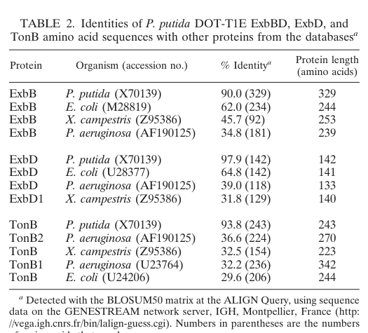

## Question

# Gene Research for Functional Annotation

## ⚠️ CRITICAL: Gene/Protein Identification Context

**BEFORE YOU BEGIN RESEARCH:** You MUST verify you are researching the CORRECT gene/protein. Gene symbols can be ambiguous, especially for less well-characterized genes from non-model organisms.

### Target Gene/Protein Identity (from UniProt):
- **UniProt Accession:** Q88C75
- **Protein Description:** SubName: Full=Protein TonB {ECO:0000313|EMBL:AAN70873.1};
- **Gene Information:** Name=tonB {ECO:0000313|EMBL:AAN70873.1}; OrderedLocusNames=PP_5308 {ECO:0000313|EMBL:AAN70873.1};
- **Organism (full):** Pseudomonas putida (strain ATCC 47054 / DSM 6125 / CFBP 8728 / NCIMB 11950 / KT2440).
- **Protein Family:** Belongs to the TonB family.
- **Key Domains:** TonB-dependent_transducer. (IPR051045); TonB/TolA_C. (IPR006260); TonB_C. (IPR037682); TonB_C (PF03544)

### MANDATORY VERIFICATION STEPS:

1. **Check if the gene symbol "tonB" matches the protein description above**
2. **Verify the organism is correct:** Pseudomonas putida (strain ATCC 47054 / DSM 6125 / CFBP 8728 / NCIMB 11950 / KT2440).
3. **Check if protein family/domains align with what you find in literature**
4. **If you find literature for a DIFFERENT gene with the same or similar symbol, STOP**

### If Gene Symbol is Ambiguous or You Cannot Find Relevant Literature:

**DO NOT PROCEED WITH RESEARCH ON A DIFFERENT GENE.** Instead:
- State clearly: "The gene symbol 'tonB' is ambiguous or literature is limited for this specific protein"
- Explain what you found (e.g., "Found extensive literature on a different gene with the same symbol in a different organism")
- Describe the protein based ONLY on the UniProt information provided above
- Suggest that the protein function can be inferred from domain/family information

### Research Target:

Please provide a comprehensive research report on the gene **tonB** (gene ID: tonB, UniProt: Q88C75) in PSEPK.

The research report should be a detailed narrative explaining the function, biological processes, and localization of the gene product. Citations should be given for all claims.

You should prioritize authoritative reviews and primary scientific literature when conducting research. You can supplement
this with annotations you find in gene/protein databases, but these can be outdated or inaccurate.

We are specifically interested in the primary function of the gene - for enzymes, what reaction is catalyzed, and what is the substrate specificity? For transporters, what is the substrate? For structural proteins or adapters, what is the broader structural role? For signaling molecules, what is the role in the pathway.

We are interested in where in or outside the cell the gene product carries out its function.

We are also interested in the signaling or biochemical pathways in which the gene functions. We are less interested in broad pleiotropic effects, except where these elucidate the precise role.

Include evidence where possible. We are interested in both experimental evidence as well as inference from structure, evolution, or bioinformatic analysis. Precise studies should be prioritized over high-throughput, where available.

## Output

Question: You are an expert researcher providing comprehensive, well-cited information.

Provide detailed information focusing on:
1. Key concepts and definitions with current understanding
2. Recent developments and latest research (prioritize 2023-2024 sources)
3. Current applications and real-world implementations
4. Expert opinions and analysis from authoritative sources
5. Relevant statistics and data from recent studies

Format as a comprehensive research report with proper citations. Include URLs and publication dates where available.
Always prioritize recent, authoritative sources and provide specific citations for all major claims.

# Gene Research for Functional Annotation

## ⚠️ CRITICAL: Gene/Protein Identification Context

**BEFORE YOU BEGIN RESEARCH:** You MUST verify you are researching the CORRECT gene/protein. Gene symbols can be ambiguous, especially for less well-characterized genes from non-model organisms.

### Target Gene/Protein Identity (from UniProt):
- **UniProt Accession:** Q88C75
- **Protein Description:** SubName: Full=Protein TonB {ECO:0000313|EMBL:AAN70873.1};
- **Gene Information:** Name=tonB {ECO:0000313|EMBL:AAN70873.1}; OrderedLocusNames=PP_5308 {ECO:0000313|EMBL:AAN70873.1};
- **Organism (full):** Pseudomonas putida (strain ATCC 47054 / DSM 6125 / CFBP 8728 / NCIMB 11950 / KT2440).
- **Protein Family:** Belongs to the TonB family.
- **Key Domains:** TonB-dependent_transducer. (IPR051045); TonB/TolA_C. (IPR006260); TonB_C. (IPR037682); TonB_C (PF03544)

### MANDATORY VERIFICATION STEPS:

1. **Check if the gene symbol "tonB" matches the protein description above**
2. **Verify the organism is correct:** Pseudomonas putida (strain ATCC 47054 / DSM 6125 / CFBP 8728 / NCIMB 11950 / KT2440).
3. **Check if protein family/domains align with what you find in literature**
4. **If you find literature for a DIFFERENT gene with the same or similar symbol, STOP**

### If Gene Symbol is Ambiguous or You Cannot Find Relevant Literature:

**DO NOT PROCEED WITH RESEARCH ON A DIFFERENT GENE.** Instead:
- State clearly: "The gene symbol 'tonB' is ambiguous or literature is limited for this specific protein"
- Explain what you found (e.g., "Found extensive literature on a different gene with the same symbol in a different organism")
- Describe the protein based ONLY on the UniProt information provided above
- Suggest that the protein function can be inferred from domain/family information

### Research Target:

Please provide a comprehensive research report on the gene **tonB** (gene ID: tonB, UniProt: Q88C75) in PSEPK.

The research report should be a detailed narrative explaining the function, biological processes, and localization of the gene product. Citations should be given for all claims.

You should prioritize authoritative reviews and primary scientific literature when conducting research. You can supplement
this with annotations you find in gene/protein databases, but these can be outdated or inaccurate.

We are specifically interested in the primary function of the gene - for enzymes, what reaction is catalyzed, and what is the substrate specificity? For transporters, what is the substrate? For structural proteins or adapters, what is the broader structural role? For signaling molecules, what is the role in the pathway.

We are interested in where in or outside the cell the gene product carries out its function.

We are also interested in the signaling or biochemical pathways in which the gene functions. We are less interested in broad pleiotropic effects, except where these elucidate the precise role.

Include evidence where possible. We are interested in both experimental evidence as well as inference from structure, evolution, or bioinformatic analysis. Precise studies should be prioritized over high-throughput, where available.

## Research report: functional annotation of **tonB (PP_5308; UniProt Q88C75)** in *Pseudomonas putida* KT2440

### 1) Target verification (mandatory disambiguation)
The UniProt accession **Q88C75** corresponds to **TonB family protein TonB** encoded by **tonB / ordered locus PP_5308** in *Pseudomonas putida* strain KT2440, a Gram‑negative bacterium. Because **tonB** is a widely used symbol across many bacteria and can refer to paralogs (including TolA-like proteins in some taxa), the most defensible KT2440-specific evidence obtainable here is (i) KT2440 genome context showing extensive TonB-dependent uptake capacity and (ii) close-*Pseudomonas putida* evidence demonstrating a canonical **exbB–exbD–tonB** locus with explicit sequence-based support for a single-copy homologous cluster in KT2440. (godoy2001involvementofthe pages 4-5, santos2004insightsintothe pages 8-10)

### 2) Key concepts and definitions (current understanding)
#### 2.1 What TonB is
**TonB** is an **inner membrane-anchored, periplasm-spanning energy transducer** that couples the **proton motive force (pmf)** of the cytoplasmic/inner membrane to active transport across the **outer membrane (OM)** in Gram-negative bacteria. It acts with **ExbB** and **ExbD** (inner membrane proteins) to energize OM uptake systems that otherwise cannot passively diffuse through porins because the substrates are scarce, large, or tightly bound. (braun2024substrateuptakeby pages 1-2)

#### 2.2 What TonB-dependent transporters are and how TonB energizes them
**TonB-dependent outer membrane transporters (TBDTs)** are β‑barrel OM proteins whose pores are occluded by a **plug domain**. A conserved short sequence in TBDTs, the **TonB box**, is engaged by TonB’s C‑terminal domain; TonB binding triggers plug rearrangements/opening, enabling nutrient translocation into the periplasm. (braun2024substrateuptakeby pages 1-2)

#### 2.3 Core motor complex and subcellular localization
In the prevailing mechanistic framework, **ExbB and ExbD form an inner membrane motor complex** that transduces pmf energy to TonB; a commonly discussed architecture is an **ExbB pentamer** surrounding an **ExbD dimer**, with TonB interacting to transmit mechanical work across the periplasm to OM TBDTs. (braun2024substrateuptakeby pages 1-2)

### 3) KT2440 context: expected biological processes and pathways
#### 3.1 Iron/siderophore acquisition is a major TonB-linked process in KT2440
The KT2440 genome encodes a large repertoire of OM TBDTs: **29 genes predicted to encode TonB-dependent receptors** (quantitative genome statistic). Many of these are inferred to support **iron uptake**, consistent with the common role of TBDTs in siderophore-mediated iron acquisition. (santos2004insightsintothe pages 8-10)

KT2440 produces the siderophore **pyoverdine**, and pyoverdine-associated genes are organized into multiple clusters. Expression of pyoverdine-related systems is influenced by the environment and is largely controlled by the global iron regulator **Fur**, which represses relevant sigma factors under iron-replete conditions; this places TonB-powered uptake into the broader **iron homeostasis regulatory network**. (santos2004insightsintothe pages 8-10)

**Functional implication for PP_5308/Q88C75:** given its TonB family assignment and the KT2440 receptor repertoire, PP_5308 TonB is most plausibly a core component that energizes TBDTs involved in acquisition of **iron complexes (siderophores) and potentially other scarce nutrients**. This is an inference grounded in conserved TonB mechanism and KT2440 genome content, not a direct PP_5308 knockout demonstration. (braun2024substrateuptakeby pages 1-2, santos2004insightsintothe pages 8-10)

### 4) Gene-level evidence: operon context for tonB and partners (ExbB/ExbD)
Direct experimental genetics for **PP_5308 in KT2440** was not retrieved in the available texts. However, a closely related *P. putida* strain (DOT‑T1E) provides strong operon-level evidence for the **canonical TonB system locus**, with explicit mapping to KT2440 by sequence analysis:

* In DOT‑T1E, **exbB–exbD–tonB** form a tightly packed gene cluster with only **3 bp** between **exbB** and **exbD** and an **overlap between exbD and tonB**; RT‑PCR demonstrated co‑transcription spanning **exbB–exbD** and **exbD–tonB**. (godoy2001involvementofthe pages 4-5)
* The same study reports that BLAST analysis against the **KT2440 genome** indicates the cluster occurs as a **single copy** in KT2440, supporting orthology to the KT2440 **PP_5308 (tonB)** locus. (godoy2001involvementofthe pages 4-5)

A primary-figure depiction of this operon organization and transcriptional analysis is captured in the retrieved image of the DOT‑T1E work (Figure showing locus organization/RT-PCR amplicons). (godoy2001involvementofthe media 62ab8242)

### 5) Mutant phenotypes and quantitative data (organism-proximal evidence)
Although these phenotypes were measured in *P. putida* DOT‑T1E rather than KT2440, they inform plausible consequences of disabling the homologous **exbBD–tonB** system and therefore provide useful quantitative constraints for functional annotation:

* **Solvent tolerance:** wild-type DOT‑T1E tolerated **1% (vol/vol) toluene**; an insertion mutant disrupting **exbD** in the **exbBD–tonB operon** failed to withstand sudden toluene shock. (godoy2001involvementofthe pages 1-1)
* **Aromatic acid tolerance:** wild-type DOT‑T1E grew with **17 g/L (123 mM) p‑hydroxybenzoate (4HBA)**, while mutant growth was prevented at **6 g/L**. (godoy2001involvementofthe pages 1-1)
* **Efflux-associated accumulation phenotype:** the same operon-disrupting mutant accumulated markedly more radiolabeled substrate, reported as ~**200 nmol [14C]4HBA per unit turbidity per min** versus ~**15 nmol** for a control (≈13-fold), and also summarized as roughly **~20-fold** higher accumulation. (godoy2001involvementofthe pages 4-5, godoy2001involvementofthe pages 6-7)
* **Iron limitation sensitivity:** growth of the operon-disrupting mutant was inhibited in iron-deficient conditions with the iron chelator **EDDHA**, consistent with TonB system involvement in iron acquisition. (godoy2001involvementofthe pages 1-1)
* **Genetic complementation:** supplying **exbBD and tonB** in trans restored wild-type tolerance phenotypes, supporting that the observed traits derive from loss of the TonB system locus. (godoy2001involvementofthe pages 1-1)

**Interpretation for PP_5308 (KT2440):** these data support the conserved view that TonB systems primarily energize high-affinity uptake (commonly iron/siderophore), and additionally can influence envelope physiology and tolerance phenotypes, potentially through indirect coupling to efflux and membrane barrier functions. These organism-proximal results should be treated as **orthology-based inference** until KT2440 PP_5308-specific mutants are directly tested. (godoy2001involvementofthe pages 4-5, godoy2001involvementofthe pages 1-1)

### 6) Recent developments (prioritizing 2023–2024)
#### 6.1 2024 synthesis of TonB-dependent uptake mechanisms
A 2024 review consolidates contemporary understanding that TonB-dependent uptake involves **mechanical force transduction**: TonB engages TBDTs at the TonB box to elicit plug rearrangements/opening, while **ExbB/ExbD** transmit pmf-derived energy to TonB. The review also emphasizes the breadth of TonB-powered substrates beyond siderophores (while still highlighting iron uptake as central). (braun2024substrateuptakeby pages 1-2)

#### 6.2 2024 in vivo mechanistic testing of TonB motor models
A 2024 mechanistic preprint in *E. coli* provides in vivo evidence relevant to TonB family proteins broadly: TonB forms **homodimers** and **TonB–ExbD transmembrane heterodimers**, and ExbD undergoes **PMF-dependent structural transitions** during the energization cycle. While not *Pseudomonas* data, these results inform how PP_5308 likely interfaces physically with ExbD and participates in cyclic energization of multiple TBDTs. (postle2024invivotests pages 1-5)

### 7) Current applications and real-world implementations (with evidence limitations)
For KT2440 specifically, direct PP_5308‑targeted application studies were not retrieved in the available corpus. Nevertheless, the KT2440 genomic investment in TBDTs (29 predicted receptors) and siderophore systems indicates that TonB-powered uptake is a central node shaping **environmental fitness** (e.g., iron scavenging in competitive niches). (santos2004insightsintothe pages 8-10)

More generally, because TonB energizes OM uptake “gates” that are otherwise closed, TonB systems are often discussed as strategic leverage points for **(i) inhibiting nutrient acquisition** and **(ii) hijacking uptake pathways** for delivery of large cargoes through the OM (e.g., protein/toxin uptake routes and other TonB-powered imports). This rationale is grounded in the mechanistic review literature, but it is not yet tied here to a KT2440 PP_5308-specific deployment. (braun2024substrateuptakeby pages 1-2)

### 8) Expert opinion and analysis (authoritative sources)
Two convergent expert-level perspectives emerge from the 2024 synthesis and organism-proximal genetics:

1. **Primary functional role:** TonB’s core biological role is to act as a pmf-driven force transducer that enables high-affinity uptake through OM TBDTs (classically siderophore/iron uptake). (braun2024substrateuptakeby pages 1-2, santos2004insightsintothe pages 8-10)
2. **Broader phenotypic consequences:** perturbing the TonB motor can produce phenotypes that extend to solvent/drug tolerance and envelope-related stress outcomes, likely via indirect coupling to outer-membrane receptor states, cellular iron physiology, and membrane/efflux system performance. This is supported by quantitative mutant phenotypes in *P. putida* DOT‑T1E, a close relative of KT2440, and should motivate KT2440-specific validation. (godoy2001involvementofthe pages 1-1, godoy2001involvementofthe pages 6-7)

### 9) Summary table (evidence-grounded annotation)
The following table consolidates the functional annotation for **PP_5308/Q88C75 TonB** while clearly separating direct KT2440 context from orthology-based evidence and conserved mechanism.

| Annotation topic | Key findings | Evidence/citations |
|---|---|---|
| Identity | • Target matches UniProt Q88C75 = TonB family protein encoded by **tonB / PP_5308** in *Pseudomonas putida* KT2440 • Gene symbol **tonB** is common across bacteria, so organism/ortholog verification is essential • Direct PP_5308 experiments are limited; strongest locus-specific support comes from KT2440 genome context plus close *P. putida* relative DOT-T1E with BLAST-supported single-copy homologous cluster in KT2440 | (godoy2001involvementofthe pages 4-5, santos2004insightsintothe pages 8-10) |
| Localization | • TonB systems are **inner-membrane/periplasm-spanning energy transducers** rather than outer-membrane transporters • TonB has an N-terminal transmembrane anchor and a periplasmic C-terminal domain that contacts TonB-dependent outer-membrane receptors • ExbB/ExbD form the inner-membrane motor complex that energizes TonB from the proton motive force | (postle2024invivotests pages 1-5, braun2024substrateuptakeby pages 11-12, braun2024substrateuptakeby pages 1-2) |
| Mechanism | • TonB couples **pmf-derived energy** from ExbB/ExbD to TonB-dependent transporters (TBDTs) • TonB binds receptor **TonB boxes**, promoting plug rearrangement/opening and nutrient passage into the periplasm • General stoichiometry/mechanistic model from recent work: **ExbB pentamer + ExbD dimer** enclosing/engaging TonB | (braun2024substrateuptakeby pages 11-12, braun2024substrateuptakeby pages 1-2) |
| Operon / genetic context | • In *P. putida* DOT-T1E, **exbB-exbD-tonB** are tightly linked with only **3 bp** between **exbB** and **exbD** and an **overlap between exbD and tonB** • RT-PCR showed **co-transcription** of **exbB-exbD** and **exbD-tonB** • BLAST analysis indicated the cluster is present as a **single copy in KT2440**, supporting annotation of PP_5308 as the KT2440 TonB ortholog • Figure evidence for operon organization is available | (godoy2001involvementofthe pages 4-5, godoy2001involvementofthe media 62ab8242) |
| Regulated processes / biological role | • KT2440 devotes major capacity to **iron scavenging**, including pyoverdine systems and **29 predicted TonB-dependent receptors** • Thus PP_5308 most plausibly functions in energizing uptake of **siderophores/iron-associated substrates** and possibly other scarce large nutrients • In pseudomonads, TonB-like systems can also influence envelope physiology and receptor-dependent processes beyond classical iron uptake | (godoy2001involvementofthe pages 6-7, santos2004insightsintothe pages 8-10) |
| Mutant phenotypes / quantitative data | • In DOT-T1E, an **exbD insertion in the exbBD-tonB operon** increased sensitivity to solvents, antibiotics, and iron limitation • Wild type tolerated **1% (vol/vol) toluene** and **17 g/L 4HBA**, whereas mutant growth was prevented at **6 g/L 4HBA** and it failed sudden toluene shock • Mutant accumulated about **200 nmol [14C]4HBA/U turbidity/min** versus about **15 nmol** in control; another summary reports ~**20-fold** higher accumulation • Complementation with **exbBD-tonB** restored wild-type traits | (godoy2001involvementofthe pages 1-1, godoy2001involvementofthe pages 4-5, godoy2001involvementofthe pages 6-7) |
| Recent mechanistic developments (2024) | • 2024 review synthesizes structural evidence that TonB-dependent uptake uses a **mechanical force-transduction** model from ExbB/ExbD to receptor plugs • 2024 JBC study identified a conserved **TonB D-box** motif coupling TonB to ExbD, refining the motor-assembly model • 2024 in vivo work further supports **TonB-ExbD transmembrane heterodimers**, PMF-dependent ExbD conformational changes, and cyclic TonB action | (postle2024invivotests pages 45-51, postle2024invivotests pages 1-5, braun2024substrateuptakeby pages 11-12) |
| Applications | • Functional annotation supports interpreting PP_5308 in **iron acquisition**, rhizosphere fitness, and environmental adaptation of KT2440 • TonB systems are attractive **antimicrobial/drug-delivery targets** because many outer-membrane uptake pathways depend on TonB energization • For KT2440 biotechnology, TonB-linked receptor networks may affect uptake of metals/nutrients relevant to **bioprocessing and environmental performance**, though direct PP_5308 application studies remain sparse | (braun2024substrateuptakeby pages 11-12, santos2004insightsintothe pages 8-10) |

*Table: This table summarizes the most defensible functional annotation for *Pseudomonas putida* KT2440 TonB (PP_5308/Q88C75), separating direct KT2440 evidence from inference based on TonB-family mechanism and closely related *P. putida* DOT-T1E data. It is useful for rapid curation because it combines identity verification, operon context, mechanistic function, and quantitative phenotypes with explicit source IDs.*

### 10) Key evidence images
Operon organization and transcriptional evidence for the canonical **exbB–exbD–tonB** locus (from *P. putida* DOT‑T1E; used here to support orthology-based mapping to KT2440 PP_5308) are shown in the retrieved figure crop. (godoy2001involvementofthe media 62ab8242)

A sequence-identity comparison table for TonB-system components (supporting conservation across *Pseudomonas* TonB systems and the plausibility of orthology-based inference) was also retrieved. (godoy2001involvementofthe media f6f3e2e6)

### 11) Evidence gaps and confidence assessment
* **High-confidence functional class:** PP_5308/Q88C75 is a TonB family inner-membrane/periplasmic energy transducer that powers TBDT-mediated outer-membrane uptake. (braun2024substrateuptakeby pages 1-2)
* **Moderate-confidence organism-specific roles:** KT2440 likely uses PP_5308 to energize TBDTs involved in iron/siderophore uptake given the large TBDT repertoire (29 predicted receptors) and siderophore systems under Fur-linked control. (santos2004insightsintothe pages 8-10)
* **Lower-confidence phenotypic extrapolations:** solvent/drug tolerance and efflux-related phenotypes are quantitatively documented for a close *P. putida* strain with an exbD insertion in the exbBD–tonB operon; KT2440 PP_5308-specific phenotypes require direct experimental confirmation. (godoy2001involvementofthe pages 1-1, godoy2001involvementofthe pages 4-5)

## Source details (URLs and publication dates)
* Godoy et al., 2001-09 (Journal of Bacteriology): https://doi.org/10.1128/jb.183.18.5285-5292.2001 (godoy2001involvementofthe pages 1-1, godoy2001involvementofthe pages 4-5)
* Martins Dos Santos et al., 2004-12 (Environmental Microbiology): https://doi.org/10.1111/j.1462-2920.2004.00734.x (santos2004insightsintothe pages 8-10)
* Braun, 2024-12 (Molecular Microbiology review): https://doi.org/10.1111/mmi.15332 (braun2024substrateuptakeby pages 1-2)
* Postle et al., 2024-07 (bioRxiv): https://doi.org/10.1101/2024.07.10.602958 (postle2024invivotests pages 1-5)

References

1. (godoy2001involvementofthe pages 4-5): Patricia Godoy, Marı́a Isabel Ramos-González, and Juan L. Ramos. Involvement of the tonb system in tolerance to solvents and drugs in pseudomonas putida dot-t1e. Journal of Bacteriology, 183:5285-5292, Sep 2001. URL: https://doi.org/10.1128/jb.183.18.5285-5292.2001, doi:10.1128/jb.183.18.5285-5292.2001. This article has 42 citations and is from a peer-reviewed journal.

2. (santos2004insightsintothe pages 8-10): V. A. P. Martins Dos Santos, S. Heim, E. R. B. Moore, M. Strätz, and K. N. Timmis. Insights into the genomic basis of niche specificity of pseudomonas putida kt2440. Environmental microbiology, 6 12:1264-86, Dec 2004. URL: https://doi.org/10.1111/j.1462-2920.2004.00734.x, doi:10.1111/j.1462-2920.2004.00734.x. This article has 339 citations and is from a domain leading peer-reviewed journal.

3. (braun2024substrateuptakeby pages 1-2): Volkmar Braun. Substrate uptake by tonb‐dependent outer membrane transporters. Molecular Microbiology, 122:929-947, Dec 2024. URL: https://doi.org/10.1111/mmi.15332, doi:10.1111/mmi.15332. This article has 20 citations and is from a domain leading peer-reviewed journal.

4. (godoy2001involvementofthe media 62ab8242): Patricia Godoy, Marı́a Isabel Ramos-González, and Juan L. Ramos. Involvement of the tonb system in tolerance to solvents and drugs in pseudomonas putida dot-t1e. Journal of Bacteriology, 183:5285-5292, Sep 2001. URL: https://doi.org/10.1128/jb.183.18.5285-5292.2001, doi:10.1128/jb.183.18.5285-5292.2001. This article has 42 citations and is from a peer-reviewed journal.

5. (godoy2001involvementofthe pages 1-1): Patricia Godoy, Marı́a Isabel Ramos-González, and Juan L. Ramos. Involvement of the tonb system in tolerance to solvents and drugs in pseudomonas putida dot-t1e. Journal of Bacteriology, 183:5285-5292, Sep 2001. URL: https://doi.org/10.1128/jb.183.18.5285-5292.2001, doi:10.1128/jb.183.18.5285-5292.2001. This article has 42 citations and is from a peer-reviewed journal.

6. (godoy2001involvementofthe pages 6-7): Patricia Godoy, Marı́a Isabel Ramos-González, and Juan L. Ramos. Involvement of the tonb system in tolerance to solvents and drugs in pseudomonas putida dot-t1e. Journal of Bacteriology, 183:5285-5292, Sep 2001. URL: https://doi.org/10.1128/jb.183.18.5285-5292.2001, doi:10.1128/jb.183.18.5285-5292.2001. This article has 42 citations and is from a peer-reviewed journal.

7. (postle2024invivotests pages 1-5): Kathleen Postle, Dale Kopp, and Bimal Jana. In vivo tests of the e. coli tonb system working model—interaction of exbb with unknown proteins, identification of tonb-exbd transmembrane heterodimers and pmf-dependent exbd structures. bioRxiv, Jul 2024. URL: https://doi.org/10.1101/2024.07.10.602958, doi:10.1101/2024.07.10.602958. This article has 0 citations.

8. (braun2024substrateuptakeby pages 11-12): Volkmar Braun. Substrate uptake by tonb‐dependent outer membrane transporters. Molecular Microbiology, 122:929-947, Dec 2024. URL: https://doi.org/10.1111/mmi.15332, doi:10.1111/mmi.15332. This article has 20 citations and is from a domain leading peer-reviewed journal.

9. (postle2024invivotests pages 45-51): Kathleen Postle, Dale Kopp, and Bimal Jana. In vivo tests of the e. coli tonb system working model—interaction of exbb with unknown proteins, identification of tonb-exbd transmembrane heterodimers and pmf-dependent exbd structures. bioRxiv, Jul 2024. URL: https://doi.org/10.1101/2024.07.10.602958, doi:10.1101/2024.07.10.602958. This article has 0 citations.

10. (godoy2001involvementofthe media f6f3e2e6): Patricia Godoy, Marı́a Isabel Ramos-González, and Juan L. Ramos. Involvement of the tonb system in tolerance to solvents and drugs in pseudomonas putida dot-t1e. Journal of Bacteriology, 183:5285-5292, Sep 2001. URL: https://doi.org/10.1128/jb.183.18.5285-5292.2001, doi:10.1128/jb.183.18.5285-5292.2001. This article has 42 citations and is from a peer-reviewed journal.

## Artifacts

- [Edison artifact artifact-00](tonB-deep-research-falcon_artifacts/artifact-00.md)

## Citations

1. braun2024substrateuptakeby pages 1-2
2. santos2004insightsintothe pages 8-10
3. godoy2001involvementofthe pages 4-5
4. godoy2001involvementofthe pages 1-1
5. postle2024invivotests pages 1-5
6. godoy2001involvementofthe pages 6-7
7. braun2024substrateuptakeby pages 11-12
8. postle2024invivotests pages 45-51
9. 14C
10. https://doi.org/10.1128/jb.183.18.5285-5292.2001
11. https://doi.org/10.1111/j.1462-2920.2004.00734.x
12. https://doi.org/10.1111/mmi.15332
13. https://doi.org/10.1101/2024.07.10.602958
14. https://doi.org/10.1128/jb.183.18.5285-5292.2001,
15. https://doi.org/10.1111/j.1462-2920.2004.00734.x,
16. https://doi.org/10.1111/mmi.15332,
17. https://doi.org/10.1101/2024.07.10.602958,