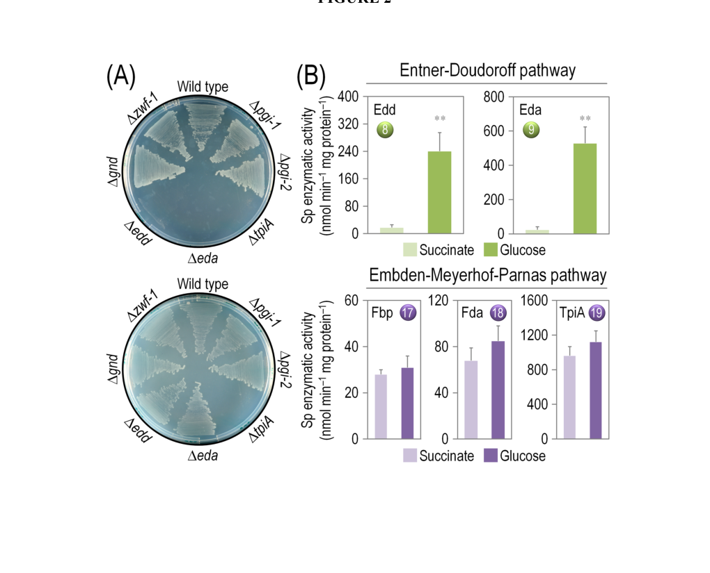

## Question

# Gene Research for Functional Annotation

## ⚠️ CRITICAL: Gene/Protein Identification Context

**BEFORE YOU BEGIN RESEARCH:** You MUST verify you are researching the CORRECT gene/protein. Gene symbols can be ambiguous, especially for less well-characterized genes from non-model organisms.

### Target Gene/Protein Identity (from UniProt):
- **UniProt Accession:** Q88DV4
- **Protein Description:** RecName: Full=Triosephosphate isomerase {ECO:0000255|HAMAP-Rule:MF_00147}; Short=TIM {ECO:0000255|HAMAP-Rule:MF_00147}; Short=TPI {ECO:0000255|HAMAP-Rule:MF_00147}; EC=5.3.1.1 {ECO:0000255|HAMAP-Rule:MF_00147}; AltName: Full=Triose-phosphate isomerase {ECO:0000255|HAMAP-Rule:MF_00147};
- **Gene Information:** Name=tpiA {ECO:0000255|HAMAP-Rule:MF_00147}; OrderedLocusNames=PP_4715;
- **Organism (full):** Pseudomonas putida (strain ATCC 47054 / DSM 6125 / CFBP 8728 / NCIMB 11950 / KT2440).
- **Protein Family:** Belongs to the triosephosphate isomerase family.
- **Key Domains:** Aldolase_TIM. (IPR013785); TIM_sf. (IPR035990); TrioseP_Isoase_bac/euk. (IPR022896); Triosephosphate_isomerase. (IPR000652); Triosephosphate_isomerase_AS. (IPR020861)

### MANDATORY VERIFICATION STEPS:

1. **Check if the gene symbol "tpiA" matches the protein description above**
2. **Verify the organism is correct:** Pseudomonas putida (strain ATCC 47054 / DSM 6125 / CFBP 8728 / NCIMB 11950 / KT2440).
3. **Check if protein family/domains align with what you find in literature**
4. **If you find literature for a DIFFERENT gene with the same or similar symbol, STOP**

### If Gene Symbol is Ambiguous or You Cannot Find Relevant Literature:

**DO NOT PROCEED WITH RESEARCH ON A DIFFERENT GENE.** Instead:
- State clearly: "The gene symbol 'tpiA' is ambiguous or literature is limited for this specific protein"
- Explain what you found (e.g., "Found extensive literature on a different gene with the same symbol in a different organism")
- Describe the protein based ONLY on the UniProt information provided above
- Suggest that the protein function can be inferred from domain/family information

### Research Target:

Please provide a comprehensive research report on the gene **tpiA** (gene ID: tpiA, UniProt: Q88DV4) in PSEPK.

The research report should be a detailed narrative explaining the function, biological processes, and localization of the gene product. Citations should be given for all claims.

You should prioritize authoritative reviews and primary scientific literature when conducting research. You can supplement
this with annotations you find in gene/protein databases, but these can be outdated or inaccurate.

We are specifically interested in the primary function of the gene - for enzymes, what reaction is catalyzed, and what is the substrate specificity? For transporters, what is the substrate? For structural proteins or adapters, what is the broader structural role? For signaling molecules, what is the role in the pathway.

We are interested in where in or outside the cell the gene product carries out its function.

We are also interested in the signaling or biochemical pathways in which the gene functions. We are less interested in broad pleiotropic effects, except where these elucidate the precise role.

Include evidence where possible. We are interested in both experimental evidence as well as inference from structure, evolution, or bioinformatic analysis. Precise studies should be prioritized over high-throughput, where available.

## Output

Question: You are an expert researcher providing comprehensive, well-cited information.

Provide detailed information focusing on:
1. Key concepts and definitions with current understanding
2. Recent developments and latest research (prioritize 2023-2024 sources)
3. Current applications and real-world implementations
4. Expert opinions and analysis from authoritative sources
5. Relevant statistics and data from recent studies

Format as a comprehensive research report with proper citations. Include URLs and publication dates where available.
Always prioritize recent, authoritative sources and provide specific citations for all major claims.

# Gene Research for Functional Annotation

## ⚠️ CRITICAL: Gene/Protein Identification Context

**BEFORE YOU BEGIN RESEARCH:** You MUST verify you are researching the CORRECT gene/protein. Gene symbols can be ambiguous, especially for less well-characterized genes from non-model organisms.

### Target Gene/Protein Identity (from UniProt):
- **UniProt Accession:** Q88DV4
- **Protein Description:** RecName: Full=Triosephosphate isomerase {ECO:0000255|HAMAP-Rule:MF_00147}; Short=TIM {ECO:0000255|HAMAP-Rule:MF_00147}; Short=TPI {ECO:0000255|HAMAP-Rule:MF_00147}; EC=5.3.1.1 {ECO:0000255|HAMAP-Rule:MF_00147}; AltName: Full=Triose-phosphate isomerase {ECO:0000255|HAMAP-Rule:MF_00147};
- **Gene Information:** Name=tpiA {ECO:0000255|HAMAP-Rule:MF_00147}; OrderedLocusNames=PP_4715;
- **Organism (full):** Pseudomonas putida (strain ATCC 47054 / DSM 6125 / CFBP 8728 / NCIMB 11950 / KT2440).
- **Protein Family:** Belongs to the triosephosphate isomerase family.
- **Key Domains:** Aldolase_TIM. (IPR013785); TIM_sf. (IPR035990); TrioseP_Isoase_bac/euk. (IPR022896); Triosephosphate_isomerase. (IPR000652); Triosephosphate_isomerase_AS. (IPR020861)

### MANDATORY VERIFICATION STEPS:

1. **Check if the gene symbol "tpiA" matches the protein description above**
2. **Verify the organism is correct:** Pseudomonas putida (strain ATCC 47054 / DSM 6125 / CFBP 8728 / NCIMB 11950 / KT2440).
3. **Check if protein family/domains align with what you find in literature**
4. **If you find literature for a DIFFERENT gene with the same or similar symbol, STOP**

### If Gene Symbol is Ambiguous or You Cannot Find Relevant Literature:

**DO NOT PROCEED WITH RESEARCH ON A DIFFERENT GENE.** Instead:
- State clearly: "The gene symbol 'tpiA' is ambiguous or literature is limited for this specific protein"
- Explain what you found (e.g., "Found extensive literature on a different gene with the same symbol in a different organism")
- Describe the protein based ONLY on the UniProt information provided above
- Suggest that the protein function can be inferred from domain/family information

### Research Target:

Please provide a comprehensive research report on the gene **tpiA** (gene ID: tpiA, UniProt: Q88DV4) in PSEPK.

The research report should be a detailed narrative explaining the function, biological processes, and localization of the gene product. Citations should be given for all claims.

You should prioritize authoritative reviews and primary scientific literature when conducting research. You can supplement
this with annotations you find in gene/protein databases, but these can be outdated or inaccurate.

We are specifically interested in the primary function of the gene - for enzymes, what reaction is catalyzed, and what is the substrate specificity? For transporters, what is the substrate? For structural proteins or adapters, what is the broader structural role? For signaling molecules, what is the role in the pathway.

We are interested in where in or outside the cell the gene product carries out its function.

We are also interested in the signaling or biochemical pathways in which the gene functions. We are less interested in broad pleiotropic effects, except where these elucidate the precise role.

Include evidence where possible. We are interested in both experimental evidence as well as inference from structure, evolution, or bioinformatic analysis. Precise studies should be prioritized over high-throughput, where available.

## Research Report: Functional Annotation of **tpiA** (UniProt **Q88DV4**, locus **PP_4715**) in *Pseudomonas putida* KT2440

### Executive summary
The gene **tpiA** in *Pseudomonas putida* KT2440 (ordered locus name **PP_4715**) encodes **triosephosphate isomerase** (TIM/TPI; **EC 5.3.1.1**), a highly efficient cytosolic enzyme that **reversibly interconverts dihydroxyacetone phosphate (DHAP) and glyceraldehyde-3-phosphate (G3P/D-GAP)**, balancing the pool of triose phosphates in central carbon metabolism. In KT2440, genetic evidence shows that **loss of tpiA prevents growth on both glucose and succinate**, indicating a critical role under both glycolytic and gluconeogenic regimes, despite the organism’s atypical glucose catabolism dominated by Entner–Doudoroff (ED) reactions. (nikel2015pseudomonasputidakt2440 pages 6-7)

### 1. Identity verification (critical disambiguation)
**Target confirmed:** In a detailed KT2440 central carbon metabolism study, **tpiA is explicitly annotated as PP_4715 encoding “triose phosphate isomerase” (TpiA)** and is included among mutant derivatives evaluated, confirming that the KT2440 gene symbol **tpiA** corresponds to triosephosphate isomerase rather than an unrelated “tpiA” in other organisms. (nikel2015pseudomonasputidakt2440 pages 15-17)

Visual evidence from the same work includes (i) a pathway schematic where **TpiA catalyzes DHAP ↔ G3P** and (ii) plate-growth results including the **ΔtpiA** strain. (nikel2015pseudomonasputidakt2440 media 6f85cc6f, nikel2015pseudomonasputidakt2440 media 0edc1cf4)

### 2. Key concepts and definitions (current understanding)
#### 2.1 Enzyme reaction and substrate specificity
Triosephosphate isomerase (TIM/TPI) catalyzes the reversible aldose–ketose isomerization:

- **DHAP ⇄ D-GAP (G3P)**

TIM is described as **stereospecific** in converting DHAP to D-GAP and does **not require a cofactor or metal ion**. (wierenga2010triosephosphateisomerasea pages 1-3)

Substrate binding strongly depends on recognition of the **phosphate dianion** in a specialized pocket formed by multiple active-site loops; this tight binding helps enforce productive catalysis and suppresses side reactions such as phosphate elimination. (wierenga2010triosephosphateisomerasea pages 6-8, wierenga2010triosephosphateisomerasea pages 1-3)

#### 2.2 Catalytic mechanism and conserved residues
TIM is a paradigmatic “near-perfect” enzyme. Mechanistically, TIM catalysis proceeds through an **enediolate-type intermediate**, enabled by a conserved active-site architecture and loop motions that close the active site to exclude bulk solvent. (wierenga2010triosephosphateisomerasea pages 3-5, wierenga2010triosephosphateisomerasea pages 1-3)

Key catalytic residues in the canonical numbering scheme include:
- **Asn11, Lys13, His95, and Glu167 (catalytic base)** (wierenga2010triosephosphateisomerasea pages 3-5, wierenga2010triosephosphateisomerasea pages 1-3)

A 2023 expert review on TPI in eukaryotes uses slightly different numbering (e.g., **K14, H96, E166**) but refers to the same conserved catalytic core. (myers2023newlydiscoveredroles pages 1-2)

#### 2.3 Enzyme efficiency and kinetics (quantitative)
TIM is frequently cited as diffusion-limited or near diffusion-limited in catalytic efficiency. Reported values include:
- **kcat/Km ≈ 1 × 10^9 M−1 s−1** (diffusion-limited range) in the **D-GAP → DHAP** direction (wierenga2010triosephosphateisomerasea pages 3-5)
- **kcat ~500 s−1** for **DHAP → D-GAP** and **~5,000 s−1** for **D-GAP → DHAP** (wierenga2010triosephosphateisomerasea pages 3-5)
- **Km ~1.2 mM** for DHAP and **~0.25 mM** for D-GAP (with additional notes about the unhydrated species) (wierenga2010triosephosphateisomerasea pages 3-5)

These parameters reflect an enzyme optimized to rapidly equilibrate intracellular DHAP and G3P pools. (wierenga2010triosephosphateisomerasea pages 3-5, wierenga2010triosephosphateisomerasea pages 19-20)

#### 2.4 Oligomeric state
TIM is typically **dimeric**, and **only the dimer is fully active**; engineered monomeric variants show orders-of-magnitude lower catalytic performance (e.g., kcat ~1 s−1, Km ~5 mM), illustrating that dimerization contributes to active-site rigidity and solvent exclusion. (wierenga2010triosephosphateisomerasea pages 10-12)

#### 2.5 Subcellular localization (bacterial expectation)
TIM is generally a **cytosolic enzyme** in most organisms, consistent with its canonical role in central carbon metabolism; specialized compartmentalization is described mainly for specific eukaryotes (e.g., glycosomes), not typical bacteria. (wierenga2010triosephosphateisomerasea pages 3-5, kursula2003crystallographicstudieson pages 34-37)

### 3. *Pseudomonas putida* KT2440: pathway context and functional role
#### 3.1 Central carbon metabolism architecture in KT2440
*P. putida* KT2440 is well known for glucose catabolism that is strongly routed through periplasmic oxidation and ED pathway reactions, and lacks a “standard” fully operational Embden–Meyerhof–Parnas (EMP) glycolysis due to low/absent canonical phosphofructokinase activity (as framed in the study’s pathway description). (nikel2015pseudomonasputidakt2440 pages 15-17)

Nevertheless, the KT2440 network uses **ED/EMP/PP reactions in an integrated cycle** for glucose processing, and triose-phosphate balancing remains crucial. (nikel2015pseudomonasputidakt2440 pages 6-7, nikel2015pseudomonasputidakt2440 pages 15-17)

Quantitative flux/yield context reported for KT2440 on glucose includes:
- **Lag phase ~1.2 ± 0.5 h** on fresh glucose
- Periplasmic oxidation yields: **gluconate yG/S = 0.34 ± 0.02** and **2-ketogluconate yK/S = 0.11 ± 0.01** (C-mol/C-mol)
- **>80%** of glucose influx routed via periplasmic oxidation
- About **25%** of fructose-6-phosphate (F6P) formed through the PP pathway
- An **~50% relative flux contribution** of ED pathway to pyruvate formation

These values highlight the metabolic background in which triose-phosphate interconversion is embedded. (nikel2015pseudomonasputidakt2440 pages 6-7)

#### 3.2 Genetic evidence for essentiality/criticality of tpiA in KT2440
In KT2440, deleting/disrupting **tpiA** produced a striking phenotype: the authors report **“lack of growth of a tpiA mutant in either glucose or succinate.”** (nikel2015pseudomonasputidakt2440 pages 6-7)

They also emphasize that this was “unexpected,” because ED metabolism produces G3P and pyruvate and thus, in principle, the TpiA reaction might be thought less critical for growth on glucose; the observed non-growth indicates that triose-phosphate interconversion is indispensable for KT2440 physiology under the tested conditions. (nikel2015pseudomonasputidakt2440 pages 6-7)

Figure-based evidence shows the **ΔtpiA** mutant included among strains evaluated on glucose vs succinate minimal media plates. (nikel2015pseudomonasputidakt2440 media 6f85cc6f, nikel2015pseudomonasputidakt2440 media 0edc1cf4)

#### 3.3 Enzymology in KT2440 extracts and metabolite context
Enzyme assays in cell-free extracts indicate that **Fbp, Fda, and TpiA (EMP-associated enzymes) were “equally active” in both glucose and succinate cultures**, consistent with a role beyond “classical” glycolysis-only contexts. (nikel2015pseudomonasputidakt2440 pages 5-6)

For quasi in vivo enzymatic assays, intracellular metabolite levels included **G3P ~140 µM**, providing a quantitative anchor for the triose-phosphate pool under the studied conditions. (nikel2015pseudomonasputidakt2440 pages 5-6)

### 4. Recent developments (prioritizing 2023–2024)
#### 4.1 2024 Nature Communications: engineered KT2440 adaptation to D-xylose
A 2024 *Nature Communications* study on synthetically primed adaptation of KT2440 to D-xylose explicitly remarks that **operation of Fbp, Fba, and TpiA would be redundant to pentose phosphate pathway (PPP) activity** in the engineered xylose-grown strain, reflecting modern interpretations of how central carbon flux can be rewired in *P. putida* and when EMP/gluconeogenic steps become unnecessary. (dvorak2024syntheticallyprimedadaptationof pages 4-5)

This provides recent, high-authority evidence that TpiA’s functional necessity can be **context-dependent** in engineered metabolic states, even though it is strongly required for growth in the baseline KT2440 conditions tested in earlier work. (dvorak2024syntheticallyprimedadaptationof pages 4-5, nikel2015pseudomonasputidakt2440 pages 6-7)

Publication details: March 2024; URL: https://doi.org/10.1038/s41467-024-46812-9 (dvorak2024syntheticallyprimedadaptationof pages 4-5)

#### 4.2 2024 Microbial Cell Factories: anoxic-electrogenic cultivation and multi-omics
A 2024 multi-omics study of electrogenic (bio-electrochemical) cultivation of KT2440 reports that **tpiA (within “triose recycling” genes) was largely unchanged or slightly downregulated** under anoxic-electrogenic fermentation conditions, suggesting that core triose-phosphate balancing may not be strongly transcriptionally induced in that specific non-growth/maintenance-like regime (at least at the qualitative level provided in the excerpt). (weimer2024systemsbiologyof pages 8-9)

Publication details: September 2024; URL: https://doi.org/10.1186/s12934-024-02509-8 (weimer2024systemsbiologyof pages 8-9)

#### 4.3 2023 expert review: expanding conceptual landscape of TPI (moonlighting)
A 2023 review synthesizes evidence that TPI can have “moonlighting” functions (including nuclear roles) in eukaryotes and disease contexts. While this is not direct evidence for bacterial *P. putida* tpiA moonlighting, it is relevant as an expert caution: **TPI proteins can participate in cellular processes beyond glycolysis in some systems**, and catalytic loss may not fully explain phenotypes in all organisms. (myers2023newlydiscoveredroles pages 1-2, myers2023newlydiscoveredroles pages 2-4)

Publication details: January 2023; URL: https://doi.org/10.1186/s10020-023-00612-x (myers2023newlydiscoveredroles pages 1-2)

### 5. Current applications and real-world implementations
Because **tpiA encodes a core central-carbon enzyme**, it is primarily leveraged indirectly in applications that engineer *P. putida* central metabolism:

- **Substrate scope expansion and metabolic rewiring:** In engineered KT2440 strains adapted to new substrates (e.g., xylose), pathway designs and evolved flux states can make steps like TpiA (together with Fbp/Fba) **redundant relative to PPP-driven carbon processing**, informing design choices for strain engineering. (dvorak2024syntheticallyprimedadaptationof pages 4-5)

- **Bioelectrochemical and non-standard bioprocessing:** In anoxic-electrogenic systems aimed at producing oxidized sugars such as 2-ketogluconate, KT2440 shows broad transcriptome remodeling while some central “triose recycling” genes including tpiA are not strongly induced, illustrating how industrially relevant cultivation modes may alter central-carbon gene utilization patterns. (weimer2024systemsbiologyof pages 8-9)

### 6. Expert opinions and analysis (authoritative synthesis)
- **TIM as an archetypal optimized enzyme:** The detailed structural and mechanistic review characterizes TIM as a “highly evolved biocatalyst” with catalytic performance approaching diffusion limits, emphasizing loop closure, phosphate recognition, and catalytic-base chemistry as key design principles. (wierenga2010triosephosphateisomerasea pages 1-3, wierenga2010triosephosphateisomerasea pages 19-20)

- **KT2440 network-level interpretation:** Nikel et al. interpret the **unexpected non-growth of ΔtpiA** as evidence that EMP-associated reactions, despite the unusual architecture of glucose catabolism in *P. putida*, are functionally necessary and active in vivo, helping define the integrated ED/EMP/PP cycling picture for KT2440. (nikel2015pseudomonasputidakt2440 pages 6-7, nikel2015pseudomonasputidakt2440 pages 5-6)

### 7. Evidence map (compact)
| Topic | Key finding | Evidence/quantitative details | Primary source (with year) | URL |
|---|---|---|---|---|
| Gene identity in *P. putida* KT2440 | **tpiA** maps to **PP_4715** and encodes triose phosphate isomerase (TpiA) | Study explicitly annotates **tpiA (PP4715, triose phosphate isomerase)** among KT2440 mutants tested (nikel2015pseudomonasputidakt2440 pages 15-17) | Nikel et al., *J. Biol. Chem.* (2015) | https://doi.org/10.1074/jbc.M115.687749 |
| Primary biochemical function | TIM/TPI catalyzes reversible isomerization of **DHAP ⇄ D-GAP/G3P** | Conserved glycolytic reaction; stereospecific conversion of DHAP to D-GAP; no cofactor or metal required (wierenga2010triosephosphateisomerasea pages 1-3) | Wierenga et al., *Cell. Mol. Life Sci.* (2010) | https://doi.org/10.1007/s00018-010-0473-9 |
| Catalytic mechanism / residues | Catalysis uses conserved active-site residues, with glutamate as catalytic base | Residues identified as **Asn11, Lys13, His95, Glu167**; proton-shuttling via enediolate intermediate; loop-6/loop-7 closure helps shield active site (wierenga2010triosephosphateisomerasea pages 3-5, wierenga2010triosephosphateisomerasea pages 1-3) | Wierenga et al., *Cell. Mol. Life Sci.* (2010) | https://doi.org/10.1007/s00018-010-0473-9 |
| Alternative residue numbering in eukaryotic review | Same catalytic core appears in alternate numbering scheme | Myers review lists active-site residues as **K14, H96, E166** in eukaryotic TPI context, consistent with highly conserved catalytic core (myers2023newlydiscoveredroles pages 1-2) | Myers & Palladino, *Molecular Medicine* (2023) | https://doi.org/10.1186/s10020-023-00612-x |
| Enzyme efficiency | TIM is a near-diffusion-limited catalyst | Reported **kcat/Km ≈ 1 × 10^9 M^-1 s^-1** (D-GAP→DHAP direction); **kcat ~500 s^-1** for DHAP→D-GAP and **~5,000 s^-1** for D-GAP→DHAP; **Km ~1.2 mM (DHAP)** and **~0.25 mM (D-GAP)** (wierenga2010triosephosphateisomerasea pages 3-5, wierenga2010triosephosphateisomerasea pages 1-3) | Wierenga et al., *Cell. Mol. Life Sci.* (2010) | https://doi.org/10.1007/s00018-010-0473-9 |
| Oligomeric state / structural requirement | TIM is functionally dimeric, and dimerization supports full activity | Review states **only the TIM dimer is fully active**; monomeric TIM variants show about **kcat ≈ 1 s^-1** and **Km ≈ 5 mM**, roughly **1,000-fold lower kcat** and **10-fold higher Km** than wild type (wierenga2010triosephosphateisomerasea pages 10-12) | Wierenga et al., *Cell. Mol. Life Sci.* (2010) | https://doi.org/10.1007/s00018-010-0473-9 |
| Subcellular localization | TIM is generally a **cytosolic** glycolytic enzyme | Review notes TIM is generally cytosolic in most organisms, with special compartmentalization exceptions outside typical bacteria (wierenga2010triosephosphateisomerasea pages 3-5, kursula2003crystallographicstudieson pages 34-37) | Wierenga et al., *Cell. Mol. Life Sci.* (2010) | https://doi.org/10.1007/s00018-010-0473-9 |
| Essentiality / conservation | TPI is a highly conserved, essential glycolytic enzyme | Myers review describes TPI as **essential** and **highly conserved**, required for DHAP catabolism and net ATP yield from anaerobic glucose metabolism (myers2023newlydiscoveredroles pages 1-2) | Myers & Palladino, *Molecular Medicine* (2023) | https://doi.org/10.1186/s10020-023-00612-x |
| KT2440 mutant phenotype | **tpiA** disruption causes severe growth defect in KT2440 | Authors report **“lack of growth of a tpiA mutant in either glucose or succinate”**, indicating an unexpectedly strong requirement under both glycolytic and gluconeogenic conditions tested (nikel2015pseudomonasputidakt2440 pages 6-7) | Nikel et al., *J. Biol. Chem.* (2015) | https://doi.org/10.1074/jbc.M115.687749 |
| Pathway context in KT2440 | TpiA participates in the partial EMP arm embedded within ED/PP-centered metabolism | In KT2440, ED pathway is essential for glucose growth, PP contribution is described as negligible in that condition, yet **partial EMP route is remarkably relevant**; TpiA is called a key EMP step despite lack of canonical phosphofructokinase (nikel2015pseudomonasputidakt2440 pages 6-7, nikel2015pseudomonasputidakt2440 pages 15-17) | Nikel et al., *J. Biol. Chem.* (2015) | https://doi.org/10.1074/jbc.M115.687749 |
| Enzyme activity in KT2440 extracts | TpiA activity is present under both glycolytic and gluconeogenic growth | **Fbp, Fda, and TpiA were equally active in both glucose and succinate cultures**; measured intracellular **G3P concentration = 140 µM** for quasi in vivo assays (nikel2015pseudomonasputidakt2440 pages 5-6) | Nikel et al., *J. Biol. Chem.* (2015) | https://doi.org/10.1074/jbc.M115.687749 |
| Glucose flux context in KT2440 | Upper central metabolism is dominated by ED/periplasmic oxidation, but triose-phosphate balancing remains important | Reported values include lag phase **1.2 ± 0.5 h**, gluconate yield **0.34 ± 0.02 C-mol/C-mol**, 2-KG yield **0.11 ± 0.01 C-mol/C-mol**, **>80%** of glucose influx via periplasmic oxidation, **~25%** of F6P formed through PP pathway, and **~50%** relative ED contribution to pyruvate formation (nikel2015pseudomonasputidakt2440 pages 6-7) | Nikel et al., *J. Biol. Chem.* (2015) | https://doi.org/10.1074/jbc.M115.687749 |
| Moonlighting caution | Non-glycolytic “moonlighting” roles are described for eukaryotic TPI, not established here for *P. putida* tpiA | 2023 review highlights nuclear TPI roles in eukaryotes and stress/chemotherapy-linked nuclear localization; these findings should not be over-transferred to bacterial KT2440 annotation (myers2023newlydiscoveredroles pages 1-2, myers2023newlydiscoveredroles pages 2-4) | Myers & Palladino, *Molecular Medicine* (2023) | https://doi.org/10.1186/s10020-023-00612-x |

*Table: This table compiles validated organism-specific facts for *Pseudomonas putida* KT2440 tpiA/PP_4715 together with core triosephosphate isomerase biochemistry. It is useful as a compact evidence map for function, pathway role, localization, and key quantitative properties.*

### 8. Functional annotation conclusion for Q88DV4 (tpiA/PP_4715)
**Recommended functional annotation (supported by evidence):**
- **Protein:** Triosephosphate isomerase (TIM/TPI)
- **EC:** 5.3.1.1
- **Reaction:** DHAP ⇄ G3P (D-GAP)
- **Primary role in KT2440:** Balances triose-phosphate pools in central carbon metabolism; required for growth on both glucose and succinate in the tested conditions.
- **Localization:** Cytosolic enzyme (bacterial expectation) supporting central metabolism.

All major claims above are supported by the cited primary literature and reviews listed in the references.

### References (URLs and publication dates)
1. Nikel PI, Chavarría M, Fuhrer T, Sauer U, de Lorenzo V. *Pseudomonas putida* KT2440 metabolizes glucose through a cycle formed by ED, EMP, and PP enzymes. **Journal of Biological Chemistry**. **Oct 2015**. https://doi.org/10.1074/jbc.M115.687749 (nikel2015pseudomonasputidakt2440 pages 6-7)
2. Wierenga RK, Kapetaniou EG, Venkatesan R. Triosephosphate isomerase: a highly evolved biocatalyst. **Cellular and Molecular Life Sciences**. **Aug 2010**. https://doi.org/10.1007/s00018-010-0473-9 (wierenga2010triosephosphateisomerasea pages 1-3)
3. Myers TD, Palladino MJ. Newly discovered roles of triosephosphate isomerase including functions within the nucleus. **Molecular Medicine**. **Jan 2023**. https://doi.org/10.1186/s10020-023-00612-x (myers2023newlydiscoveredroles pages 1-2)
4. Dvořák P, et al. Synthetically-primed adaptation of *Pseudomonas putida* to a non-native substrate D-xylose. **Nature Communications**. **Mar 2024**. https://doi.org/10.1038/s41467-024-46812-9 (dvorak2024syntheticallyprimedadaptationof pages 4-5)
5. Weimer A, et al. Systems biology of electrogenic *Pseudomonas putida*: multi-omics insights and metabolic engineering for enhanced 2-ketogluconate production. **Microbial Cell Factories**. **Sep 2024**. https://doi.org/10.1186/s12934-024-02509-8 (weimer2024systemsbiologyof pages 8-9)

References

1. (nikel2015pseudomonasputidakt2440 pages 6-7): Pablo I. Nikel, Max Chavarría, Tobias Fuhrer, Uwe Sauer, and Víctor de Lorenzo. Pseudomonas putida kt2440 strain metabolizes glucose through a cycle formed by enzymes of the entner-doudoroff, embden-meyerhof-parnas, and pentose phosphate pathways. Journal of Biological Chemistry, 290:25920-25932, Oct 2015. URL: https://doi.org/10.1074/jbc.m115.687749, doi:10.1074/jbc.m115.687749. This article has 440 citations and is from a domain leading peer-reviewed journal.

2. (nikel2015pseudomonasputidakt2440 pages 15-17): Pablo I. Nikel, Max Chavarría, Tobias Fuhrer, Uwe Sauer, and Víctor de Lorenzo. Pseudomonas putida kt2440 strain metabolizes glucose through a cycle formed by enzymes of the entner-doudoroff, embden-meyerhof-parnas, and pentose phosphate pathways. Journal of Biological Chemistry, 290:25920-25932, Oct 2015. URL: https://doi.org/10.1074/jbc.m115.687749, doi:10.1074/jbc.m115.687749. This article has 440 citations and is from a domain leading peer-reviewed journal.

3. (nikel2015pseudomonasputidakt2440 media 6f85cc6f): Pablo I. Nikel, Max Chavarría, Tobias Fuhrer, Uwe Sauer, and Víctor de Lorenzo. Pseudomonas putida kt2440 strain metabolizes glucose through a cycle formed by enzymes of the entner-doudoroff, embden-meyerhof-parnas, and pentose phosphate pathways. Journal of Biological Chemistry, 290:25920-25932, Oct 2015. URL: https://doi.org/10.1074/jbc.m115.687749, doi:10.1074/jbc.m115.687749. This article has 440 citations and is from a domain leading peer-reviewed journal.

4. (nikel2015pseudomonasputidakt2440 media 0edc1cf4): Pablo I. Nikel, Max Chavarría, Tobias Fuhrer, Uwe Sauer, and Víctor de Lorenzo. Pseudomonas putida kt2440 strain metabolizes glucose through a cycle formed by enzymes of the entner-doudoroff, embden-meyerhof-parnas, and pentose phosphate pathways. Journal of Biological Chemistry, 290:25920-25932, Oct 2015. URL: https://doi.org/10.1074/jbc.m115.687749, doi:10.1074/jbc.m115.687749. This article has 440 citations and is from a domain leading peer-reviewed journal.

5. (wierenga2010triosephosphateisomerasea pages 1-3): R. K. Wierenga, E. G. Kapetaniou, and R. Venkatesan. Triosephosphate isomerase: a highly evolved biocatalyst. Cellular and Molecular Life Sciences, 67:3961-3982, Aug 2010. URL: https://doi.org/10.1007/s00018-010-0473-9, doi:10.1007/s00018-010-0473-9. This article has 284 citations and is from a domain leading peer-reviewed journal.

6. (wierenga2010triosephosphateisomerasea pages 6-8): R. K. Wierenga, E. G. Kapetaniou, and R. Venkatesan. Triosephosphate isomerase: a highly evolved biocatalyst. Cellular and Molecular Life Sciences, 67:3961-3982, Aug 2010. URL: https://doi.org/10.1007/s00018-010-0473-9, doi:10.1007/s00018-010-0473-9. This article has 284 citations and is from a domain leading peer-reviewed journal.

7. (wierenga2010triosephosphateisomerasea pages 3-5): R. K. Wierenga, E. G. Kapetaniou, and R. Venkatesan. Triosephosphate isomerase: a highly evolved biocatalyst. Cellular and Molecular Life Sciences, 67:3961-3982, Aug 2010. URL: https://doi.org/10.1007/s00018-010-0473-9, doi:10.1007/s00018-010-0473-9. This article has 284 citations and is from a domain leading peer-reviewed journal.

8. (myers2023newlydiscoveredroles pages 1-2): Tracey D. Myers and Michael J. Palladino. Newly discovered roles of triosephosphate isomerase including functions within the nucleus. Molecular Medicine, Jan 2023. URL: https://doi.org/10.1186/s10020-023-00612-x, doi:10.1186/s10020-023-00612-x. This article has 51 citations and is from a peer-reviewed journal.

9. (wierenga2010triosephosphateisomerasea pages 19-20): R. K. Wierenga, E. G. Kapetaniou, and R. Venkatesan. Triosephosphate isomerase: a highly evolved biocatalyst. Cellular and Molecular Life Sciences, 67:3961-3982, Aug 2010. URL: https://doi.org/10.1007/s00018-010-0473-9, doi:10.1007/s00018-010-0473-9. This article has 284 citations and is from a domain leading peer-reviewed journal.

10. (wierenga2010triosephosphateisomerasea pages 10-12): R. K. Wierenga, E. G. Kapetaniou, and R. Venkatesan. Triosephosphate isomerase: a highly evolved biocatalyst. Cellular and Molecular Life Sciences, 67:3961-3982, Aug 2010. URL: https://doi.org/10.1007/s00018-010-0473-9, doi:10.1007/s00018-010-0473-9. This article has 284 citations and is from a domain leading peer-reviewed journal.

11. (kursula2003crystallographicstudieson pages 34-37): I Kursula. Crystallographic studies on the structure-function relationships in triosephosphate isomerase. Unknown journal, 2003.

12. (nikel2015pseudomonasputidakt2440 pages 5-6): Pablo I. Nikel, Max Chavarría, Tobias Fuhrer, Uwe Sauer, and Víctor de Lorenzo. Pseudomonas putida kt2440 strain metabolizes glucose through a cycle formed by enzymes of the entner-doudoroff, embden-meyerhof-parnas, and pentose phosphate pathways. Journal of Biological Chemistry, 290:25920-25932, Oct 2015. URL: https://doi.org/10.1074/jbc.m115.687749, doi:10.1074/jbc.m115.687749. This article has 440 citations and is from a domain leading peer-reviewed journal.

13. (dvorak2024syntheticallyprimedadaptationof pages 4-5): Pavel Dvořák, Barbora Burýšková, Barbora Popelářová, Birgitta Elisabeth Ebert, Tibor Botka, Dalimil Bujdoš, Alberto Sánchez-Pascuala, Hannah Schöttler, Heiko Hayen, Víctor de Lorenzo, Lars M. Blank, and Martin Benešík. Synthetically-primed adaptation of pseudomonas putida to a non-native substrate d-xylose. Nature Communications, Mar 2024. URL: https://doi.org/10.1038/s41467-024-46812-9, doi:10.1038/s41467-024-46812-9. This article has 37 citations and is from a highest quality peer-reviewed journal.

14. (weimer2024systemsbiologyof pages 8-9): Anna Weimer, Laura Pause, Fabian Ries, Michael Kohlstedt, Lorenz Adrian, Jens Krömer, Bin Lai, and Christoph Wittmann. Systems biology of electrogenic pseudomonas putida - multi-omics insights and metabolic engineering for enhanced 2-ketogluconate production. Microbial Cell Factories, Sep 2024. URL: https://doi.org/10.1186/s12934-024-02509-8, doi:10.1186/s12934-024-02509-8. This article has 7 citations and is from a peer-reviewed journal.

15. (myers2023newlydiscoveredroles pages 2-4): Tracey D. Myers and Michael J. Palladino. Newly discovered roles of triosephosphate isomerase including functions within the nucleus. Molecular Medicine, Jan 2023. URL: https://doi.org/10.1186/s10020-023-00612-x, doi:10.1186/s10020-023-00612-x. This article has 51 citations and is from a peer-reviewed journal.

## Artifacts

- [Edison artifact artifact-00](tpiA-deep-research-falcon_artifacts/artifact-00.md)

## Citations

1. wierenga2010triosephosphateisomerasea pages 1-3
2. myers2023newlydiscoveredroles pages 1-2
3. wierenga2010triosephosphateisomerasea pages 3-5
4. wierenga2010triosephosphateisomerasea pages 10-12
5. dvorak2024syntheticallyprimedadaptationof pages 4-5
6. weimer2024systemsbiologyof pages 8-9
7. wierenga2010triosephosphateisomerasea pages 6-8
8. wierenga2010triosephosphateisomerasea pages 19-20
9. kursula2003crystallographicstudieson pages 34-37
10. myers2023newlydiscoveredroles pages 2-4
11. https://doi.org/10.1038/s41467-024-46812-9
12. https://doi.org/10.1186/s12934-024-02509-8
13. https://doi.org/10.1186/s10020-023-00612-x
14. https://doi.org/10.1074/jbc.M115.687749
15. https://doi.org/10.1007/s00018-010-0473-9
16. https://doi.org/10.1074/jbc.m115.687749,
17. https://doi.org/10.1007/s00018-010-0473-9,
18. https://doi.org/10.1186/s10020-023-00612-x,
19. https://doi.org/10.1038/s41467-024-46812-9,
20. https://doi.org/10.1186/s12934-024-02509-8,