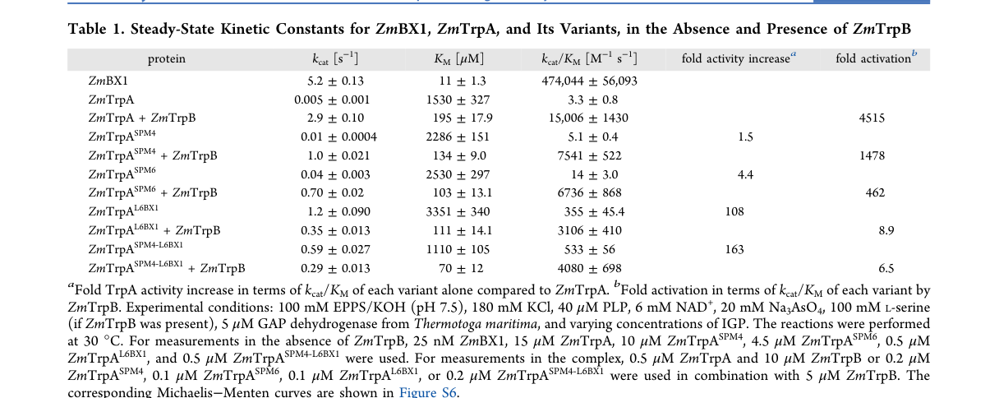

## Question

# Gene Research for Functional Annotation

## ⚠️ CRITICAL: Gene/Protein Identification Context

**BEFORE YOU BEGIN RESEARCH:** You MUST verify you are researching the CORRECT gene/protein. Gene symbols can be ambiguous, especially for less well-characterized genes from non-model organisms.

### Target Gene/Protein Identity (from UniProt):
- **UniProt Accession:** Q88RP7
- **Protein Description:** RecName: Full=Tryptophan synthase alpha chain {ECO:0000255|HAMAP-Rule:MF_00131}; EC=4.2.1.20 {ECO:0000255|HAMAP-Rule:MF_00131};
- **Gene Information:** Name=trpA {ECO:0000255|HAMAP-Rule:MF_00131}; OrderedLocusNames=PP_0082;
- **Organism (full):** Pseudomonas putida (strain ATCC 47054 / DSM 6125 / CFBP 8728 / NCIMB 11950 / KT2440).
- **Protein Family:** Belongs to the TrpA family. {ECO:0000255|HAMAP-
- **Key Domains:** Aldolase_TIM. (IPR013785); RibuloseP-bd_barrel. (IPR011060); Trp_synthase_alpha_AS. (IPR018204); Trp_synthase_suA. (IPR002028); Trp_syntA (PF00290)

### MANDATORY VERIFICATION STEPS:

1. **Check if the gene symbol "trpA" matches the protein description above**
2. **Verify the organism is correct:** Pseudomonas putida (strain ATCC 47054 / DSM 6125 / CFBP 8728 / NCIMB 11950 / KT2440).
3. **Check if protein family/domains align with what you find in literature**
4. **If you find literature for a DIFFERENT gene with the same or similar symbol, STOP**

### If Gene Symbol is Ambiguous or You Cannot Find Relevant Literature:

**DO NOT PROCEED WITH RESEARCH ON A DIFFERENT GENE.** Instead:
- State clearly: "The gene symbol 'trpA' is ambiguous or literature is limited for this specific protein"
- Explain what you found (e.g., "Found extensive literature on a different gene with the same symbol in a different organism")
- Describe the protein based ONLY on the UniProt information provided above
- Suggest that the protein function can be inferred from domain/family information

### Research Target:

Please provide a comprehensive research report on the gene **trpA** (gene ID: trpA, UniProt: Q88RP7) in PSEPK.

The research report should be a detailed narrative explaining the function, biological processes, and localization of the gene product. Citations should be given for all claims.

You should prioritize authoritative reviews and primary scientific literature when conducting research. You can supplement
this with annotations you find in gene/protein databases, but these can be outdated or inaccurate.

We are specifically interested in the primary function of the gene - for enzymes, what reaction is catalyzed, and what is the substrate specificity? For transporters, what is the substrate? For structural proteins or adapters, what is the broader structural role? For signaling molecules, what is the role in the pathway.

We are interested in where in or outside the cell the gene product carries out its function.

We are also interested in the signaling or biochemical pathways in which the gene functions. We are less interested in broad pleiotropic effects, except where these elucidate the precise role.

Include evidence where possible. We are interested in both experimental evidence as well as inference from structure, evolution, or bioinformatic analysis. Precise studies should be prioritized over high-throughput, where available.

## Output

Question: You are an expert researcher providing comprehensive, well-cited information.

Provide detailed information focusing on:
1. Key concepts and definitions with current understanding
2. Recent developments and latest research (prioritize 2023-2024 sources)
3. Current applications and real-world implementations
4. Expert opinions and analysis from authoritative sources
5. Relevant statistics and data from recent studies

Format as a comprehensive research report with proper citations. Include URLs and publication dates where available.
Always prioritize recent, authoritative sources and provide specific citations for all major claims.

# Gene Research for Functional Annotation

## ⚠️ CRITICAL: Gene/Protein Identification Context

**BEFORE YOU BEGIN RESEARCH:** You MUST verify you are researching the CORRECT gene/protein. Gene symbols can be ambiguous, especially for less well-characterized genes from non-model organisms.

### Target Gene/Protein Identity (from UniProt):
- **UniProt Accession:** Q88RP7
- **Protein Description:** RecName: Full=Tryptophan synthase alpha chain {ECO:0000255|HAMAP-Rule:MF_00131}; EC=4.2.1.20 {ECO:0000255|HAMAP-Rule:MF_00131};
- **Gene Information:** Name=trpA {ECO:0000255|HAMAP-Rule:MF_00131}; OrderedLocusNames=PP_0082;
- **Organism (full):** Pseudomonas putida (strain ATCC 47054 / DSM 6125 / CFBP 8728 / NCIMB 11950 / KT2440).
- **Protein Family:** Belongs to the TrpA family. {ECO:0000255|HAMAP-
- **Key Domains:** Aldolase_TIM. (IPR013785); RibuloseP-bd_barrel. (IPR011060); Trp_synthase_alpha_AS. (IPR018204); Trp_synthase_suA. (IPR002028); Trp_syntA (PF00290)

### MANDATORY VERIFICATION STEPS:

1. **Check if the gene symbol "trpA" matches the protein description above**
2. **Verify the organism is correct:** Pseudomonas putida (strain ATCC 47054 / DSM 6125 / CFBP 8728 / NCIMB 11950 / KT2440).
3. **Check if protein family/domains align with what you find in literature**
4. **If you find literature for a DIFFERENT gene with the same or similar symbol, STOP**

### If Gene Symbol is Ambiguous or You Cannot Find Relevant Literature:

**DO NOT PROCEED WITH RESEARCH ON A DIFFERENT GENE.** Instead:
- State clearly: "The gene symbol 'trpA' is ambiguous or literature is limited for this specific protein"
- Explain what you found (e.g., "Found extensive literature on a different gene with the same symbol in a different organism")
- Describe the protein based ONLY on the UniProt information provided above
- Suggest that the protein function can be inferred from domain/family information

### Research Target:

Please provide a comprehensive research report on the gene **trpA** (gene ID: trpA, UniProt: Q88RP7) in PSEPK.

The research report should be a detailed narrative explaining the function, biological processes, and localization of the gene product. Citations should be given for all claims.

You should prioritize authoritative reviews and primary scientific literature when conducting research. You can supplement
this with annotations you find in gene/protein databases, but these can be outdated or inaccurate.

We are specifically interested in the primary function of the gene - for enzymes, what reaction is catalyzed, and what is the substrate specificity? For transporters, what is the substrate? For structural proteins or adapters, what is the broader structural role? For signaling molecules, what is the role in the pathway.

We are interested in where in or outside the cell the gene product carries out its function.

We are also interested in the signaling or biochemical pathways in which the gene functions. We are less interested in broad pleiotropic effects, except where these elucidate the precise role.

Include evidence where possible. We are interested in both experimental evidence as well as inference from structure, evolution, or bioinformatic analysis. Precise studies should be prioritized over high-throughput, where available.

## Comprehensive research report: **trpA (UniProt Q88RP7; PP_0082) — Tryptophan synthase α chain** in *Pseudomonas putida* KT2440

### 0) Scope and identity verification (critical disambiguation)
The target protein **UniProt Q88RP7** is annotated as **tryptophan synthase α chain (TrpA; EC 4.2.1.20)** from *Pseudomonas putida* strain KT2440, with ordered locus name **PP_0082** (gene **trpA**). The KT2440 gene **PP0082** was experimentally linked to the **tryptophan synthase α-subunit** by (i) **sequence similarity** (“high similarity to trpA” by BLAST) and (ii) **functional genetics**, where a mini‑Tn5 insertion near the start of PP0082 produced a **tryptophan auxotroph**, consistent with loss of TrpA function. (molinahenares2009functionalanalysisof pages 2-4)

### 1) Key concepts and current understanding
#### 1.1 What TrpA is (definition)
**TrpA** is the **α-subunit of tryptophan synthase**, a canonical bacterial enzyme complex (often αββα) catalyzing the final steps of **L‑tryptophan biosynthesis**. TrpA performs the **indole-generating step**, producing indole that is subsequently used by the β‑subunit (**TrpB**) to make L‑tryptophan. (duran2024alteringactivesiteloop pages 1-2, lambert2026sequencebasedgenerativeai pages 3-5)

#### 1.2 Primary biochemical function (reaction, substrates/products, EC)
TrpA catalyzes the **retro‑aldol cleavage** (lyase reaction; **EC 4.2.1.20**) of **indole‑3‑glycerol phosphate (IGP; also written I3GP)** to yield **indole** and **D‑glyceraldehyde‑3‑phosphate (G3P)**. (duran2024alteringactivesiteloop pages 1-2)

Mechanistically, recent synthesis of experimental/computational work describes a “push–pull” **general acid–base** mechanism involving **Asp61 and Glu50** (numbering as discussed in that work’s TrpA models) and emphasizes that TrpA catalysis depends on access to a **closed, catalytically activated conformational state**. (duran2024alteringactivesiteloop pages 1-2, duran2024alteringactivesiteloop pages 3-4)

#### 1.3 Functional coupling to TrpB: substrate channeling and allostery
A defining feature of tryptophan synthase is **substrate channeling**: indole produced at TrpA is transported through an **internal intersubunit tunnel** to the TrpB active site. One recent synthesis/engineering paper describes a **~20–25 Å substrate tunnel** that channels indole from TrpA to TrpB. (lambert2026sequencebasedgenerativeai pages 1-3, lambert2026sequencebasedgenerativeai pages 3-5)

TrpA and TrpB are also **mutually allosterically activating**: binding and catalytic events in one subunit influence the conformational ensemble and catalytic competence of the other. Contemporary mechanistic discussions emphasize that **open (low-activity) vs closed (high-activity)** state transitions regulate ligand binding, intermediate stabilization, and product release across the complex. (duran2024alteringactivesiteloop pages 1-2, lambert2026sequencebasedgenerativeai pages 3-5)

### 2) Gene context in *P. putida* KT2440: operon structure, regulation, and genetics
#### 2.1 Operon organization
In *P. putida* KT2440, **trpA (PP0082)** is clustered with **trpB** (PP0083 in the cited KT2440 organization) and the two genes **overlap by one nucleotide**, forming a **trpBA operon** confirmed by RT‑PCR. The adjacent regulator **trpI (PP0084)** is **divergently transcribed** and is **monocistronic**. (molinahenares2009functionalanalysisof pages 2-4)

This arrangement—**trpBA divergently transcribed from trpI**—is consistent with a regulatory module in which TrpI controls expression of the tryptophan synthase subunits. (molinahenares2009functionalanalysisof pages 2-4)

#### 2.2 Evidence that trpA is required for tryptophan prototrophy
Disrupting PP0082/trpA yields **tryptophan auxotrophy**. A mini‑Tn5 insertion at the **7th codon** of PP0082 produced a Trp‑requiring mutant (“Aux‑1”) in KT2440. (molinahenares2009functionalanalysisof pages 2-4, molinahenares2009functionalanalysisof pages 1-2)

A separate phenotypic characterization reported that a **trpA mutant** grew on minimal medium **only when L‑tryptophan (0.6 mM) was supplied**, consistent with TrpA being essential for endogenous tryptophan biosynthesis under those conditions. (molinahenares2009functionalanalysisof pages 4-6)

#### 2.3 TrpI-regulated indole responsiveness in KT2440 (quantitative)
A KT2440-derived transcriptional system **PpTrpI/PPP_RS00425** (from the **trpIAB** locus, with locus tags reported as trpI **PP_RS00430**, trpA **PP_RS00420**, trpB **PP_RS00425**) was characterized as **indole-inducible** and used as a portable whole-cell biosensor module in heterologous hosts. (matulis2022developmentandcharacterization pages 2-4)

Quantitatively, this TrpI-based system achieved **up to 639.6‑fold induction** and showed a **linear response** over approximately **0.4–5 mM indole** (with fitted inducer Km values in the ~0.9–1.8 mM range depending on host/medium). (matulis2022developmentandcharacterization pages 1-2, matulis2022developmentandcharacterization pages 4-6)

### 3) Cellular localization of TrpA (what is known vs inferred)
No direct subcellular localization experiments (e.g., fluorescent tagging, fractionation) were present in the retrieved full-text excerpts. However, the function of TrpA as a core enzyme in amino-acid biosynthesis and its role as a soluble subunit in a cytosolic enzyme complex strongly supports **cytosolic localization** in bacteria. This inference is consistent with its described participation in the soluble tryptophan synthase complex and with the cytosolic nature of indole channeling between TrpA and TrpB. (duran2024alteringactivesiteloop pages 1-2, lambert2026sequencebasedgenerativeai pages 3-5)

### 4) Recent developments (prioritizing 2023–2024): dynamics, engineering, and new functional perspectives
#### 4.1 2024: loop dynamics as a design handle for TrpA standalone activity
A 2024 ACS Catalysis study dissected how **two active-site loops (loop 2 and loop 6)** coordinate transitions between open and closed conformations to enable catalysis and product release. It identifies formation of a catalytically activated enzyme–substrate state as rate-limiting and reports structural/distance metrics (e.g., positioning of a catalytic Asp relative to indole N1) that mark catalytically competent states. (duran2024alteringactivesiteloop pages 3-4)

A central quantitative result is the dramatic dependence of TrpA activity on TrpB: ZmTrpA has extremely low standalone activity (**kcat 0.005 s−1; KM 1530 μM; kcat/KM 3.3 M−1 s−1**) but in complex with TrpB reaches **kcat 2.9 s−1; KM 195 μM; kcat/KM 15,006 M−1 s−1**, corresponding to **~4515‑fold activation**. (duran2024alteringactivesiteloop pages 3-4)

The authors further report a computationally designed TrpA variant with **163‑fold improved catalytic efficiency** for IGP cleavage, illustrating how conformational ensemble engineering can partially decouple TrpA from obligatory TrpB activation. (duran2024alteringactivesiteloop pages 1-2)

Evidence from the paper’s **Table 1** and conformational analysis figure supports these quantitative comparisons. (duran2024alteringactivesiteloop media 8730a16f, duran2024alteringactivesiteloop media 001701b4)

#### 4.2 2024: expanding the industrial and synthetic-biology relevance of TrpA/TrpB chemistry
A 2024 review of indole biotechnology highlights that some bacterial TrpA homologs can function as bona fide **indole‑3‑glycerol phosphate lyases** capable of producing indole without the canonical TrpB partner under certain engineering contexts, and that engineered pathways plus **in situ product removal** can overcome indole toxicity to reach multi‑g/L titers. (ferrer2024indolesandthe pages 7-9)

Complementing this, 2024 work in biocatalysis shows how the tryptophan synthase system—especially TrpB—has become a platform for creating **noncanonical amino acids** and even reprogramming chemistry toward tyrosine analog synthesis, underscoring the modern view that the TrpA/TrpB scaffold is a tunable biocatalyst chassis rather than only a “housekeeping” biosynthetic enzyme. (almhjell2024theβsubunitof pages 1-2)

### 5) Current applications and real-world implementations
#### 5.1 KT2440 aromatic pathway engineering connected to the tryptophan branch
Metabolic engineering in *P. putida* KT2440 has leveraged the **tryptophan pathway branchpoint** to produce aromatic chemicals such as **anthranilate (o‑aminobenzoate; oAB)**, a tryptophan precursor. A 2015 study engineered KT2440 by deleting **trpDC** (blocking conversion of anthranilate onward toward tryptophan) and overexpressing a feedback‑insensitive **DAHP synthase** and an engineered **anthranilate synthase**, reaching **1.54 ± 0.3 g/L (11.23 mM) anthranilate** from glucose in tryptophan-limited fed‑batch fermentation (with reported yields ~3.5–3.6% g/g under tested feed regimes). (kuepper2015metabolicengineeringof pages 1-2, kuepper2015metabolicengineeringof pages 6-7)

Although this is not a direct “TrpA product” application, it is a real KT2440 implementation demonstrating that the trp network (including downstream steps such as TrpA/TrpB) is an actionable control point in industrial strain design. (kuepper2015metabolicengineeringof pages 1-2)

#### 5.2 Indole and indigoid biomanufacturing (2024 synthesis)
Recent synthesis of industrial biotechnology reports multiple routes to indole and indole-derived products:
- **De novo indole** production in engineered microbes reached **~0.7 g/L**, and with extraction/sequestration strategies could reach **1.4 g/L** or **5.7 g/L**. (ferrer2024indolesandthe pages 7-9)
- **Indigo** production has been demonstrated at scale (e.g., **911 mg/L in a 3000 L fermenter** from L‑Trp feed in one process) and high-titer fed-batch processes (e.g., **18 g/L indigo** reported in the review’s survey). (ferrer2024indolesandthe pages 7-9, ferrer2024indolesandthe pages 9-10)
- Related indole-derived products include **indican (2.9 g/L)** and **indirubin** (up to **233 mg/L** in one cited context; and **56 mg/L** in a de novo pathway with coproduced indigo). (ferrer2024indolesandthe pages 7-9, ferrer2024indolesandthe pages 9-10)

These applications connect directly to TrpA biology because **IGP→indole** chemistry (whether via TrpA or dedicated IGP lyases) controls flux into indole-derived value chains. (ferrer2024indolesandthe pages 7-9)

#### 5.3 Directed evolution and screening technology (2024)
A 2024 ACS Catalysis study introduced a **DNA aptamer-based L‑tryptophan sensor** compatible with droplet microfluidics, enabling **ultrahigh-throughput directed evolution** of tryptophan synthase activity. Reported throughput reaches **up to 10^7 experiments/day**, and a proof-of-principle screen of **~100,000 variants** recovered enzymes with **~5-fold improved catalytic efficiency**. (scheele2024ultrahighthroughputevolution pages 1-2, scheele2024ultrahighthroughputevolution pages 2-4)

### 6) Expert analysis: what the recent literature implies for functional annotation of *P. putida* TrpA (Q88RP7)
#### 6.1 Most defensible primary function annotation
Given the KT2440 genetics (trpA disruption → Trp auxotrophy) and the conserved, well-defined enzymology of bacterial TrpA, the most defensible functional annotation for Q88RP7 is:
- **Enzyme**: tryptophan synthase α subunit (EC 4.2.1.20)
- **Reaction**: IGP → indole + G3P
- **Pathway role**: provides indole for the TrpB PLP-dependent condensation with L‑serine to form L‑tryptophan
- **Complex behavior**: functions as part of tryptophan synthase complex with strong allosteric coupling and indole channeling

This is supported by mechanistic synthesis describing TrpA’s reaction and TrpA–TrpB tunnel/allostery, and by *P. putida* KT2440 genetics/operon architecture establishing trpA as an essential tryptophan biosynthetic gene. (duran2024alteringactivesiteloop pages 1-2, lambert2026sequencebasedgenerativeai pages 3-5, molinahenares2009functionalanalysisof pages 2-4, molinahenares2009functionalanalysisof pages 4-6)

#### 6.2 Substrate specificity considerations
The evidence base here primarily supports the canonical TrpA substrate **IGP (I3GP)** and products **indole + G3P**. The reviewed biotechnology literature indicates that homologous TSAs can sometimes act as IGP lyases in engineered contexts and that indole flux can be rerouted to diverse derivatives; however, these are generally **homolog- and context-dependent** properties and should not be assigned to KT2440 TrpA without direct experimental demonstration in *P. putida* KT2440. (ferrer2024indolesandthe pages 7-9)

#### 6.3 Regulation in *Pseudomonas* context
KT2440’s TrpI-associated regulatory locus provides a plausible link between indole/IGP availability and trp gene expression. The strong, quantifiable indole inducibility of a KT2440-derived TrpI/promoter module suggests this regulator–promoter pair is a potent sensor of indole-related metabolites, enabling both natural regulation and synthetic-biology reuse. (matulis2022developmentandcharacterization pages 1-2, matulis2022developmentandcharacterization pages 4-6)

### 7) Key statistics and quantitative data (selected)
The table below consolidates the most actionable quantitative findings relevant to TrpA function, regulation, and applications.

| Topic | System/Organism | Measurement (with units) | Value(s) | Notes/Context | Source (citation id) |
|---|---|---|---|---|---|
| TrpA reaction | Tryptophan synthase α-subunit (TrpA) | Catalyzed reaction | Indole-3-glycerol phosphate (IGP) → indole + D-glyceraldehyde-3-phosphate (G3P) | Retro-aldol cleavage step of tryptophan synthase; indole is transferred to TrpB through the intersubunit tunnel | (duran2024alteringactivesiteloop pages 1-2) |
| TrpA kinetics, standalone | ZmTrpA alone | kcat (s^-1); KM (μM); kcat/KM (M^-1 s^-1) | 0.005 ± 0.001; 1530 ± 327; 3.3 ± 0.8 | Very low standalone activity of α-subunit without TrpB partner | (duran2024alteringactivesiteloop pages 3-4, duran2024alteringactivesiteloop media 8730a16f) |
| TrpA kinetics, activated complex | ZmTrpA in complex with ZmTrpB | kcat (s^-1); KM (μM); kcat/KM (M^-1 s^-1) | 2.9 ± 0.10; 195 ± 17.9; 15,006 ± 1,430 | TrpB strongly activates TrpA catalysis allosterically | (duran2024alteringactivesiteloop pages 3-4, duran2024alteringactivesiteloop media 8730a16f) |
| TrpA activation by TrpB | ZmTrpA + ZmTrpB | Fold activation | 4515-fold | Reported increase in catalytic efficiency/activity upon complex formation | (duran2024alteringactivesiteloop pages 3-4, duran2024alteringactivesiteloop media 8730a16f) |
| Engineered standalone TrpA improvement | Designed ZmTrpA variant (ZmTrpASPM4-L6BX1) | Catalytic-efficiency improvement (fold) | 163-fold | Loop-dynamics engineering enhanced standalone IGP cleavage | (duran2024alteringactivesiteloop pages 1-2) |
| Indole-responsive regulation | PpTrpI/PPP_RS00425 from Pseudomonas putida KT2440 | Maximum induction (fold) | Up to 639.6-fold | Indole-inducible transcriptional system used to build whole-cell biosensors | (matulis2022developmentandcharacterization pages 1-2, matulis2022developmentandcharacterization pages 4-6, matulis2022developmentandcharacterization pages 8-9) |
| Indole-responsive regulation | PpTrpI/PPP_RS00425 from Pseudomonas putida KT2440 | Linear response range (mM indole) | ~0.4–5 mM | Reported linear dose-response window for biosensor output | (matulis2022developmentandcharacterization pages 1-2, matulis2022developmentandcharacterization pages 4-6) |
| Indole-responsive regulation | E. coli host carrying PpTrpI/PPP_RS00425 | Dynamic range (fold); Km (mM) | 373.5-fold in LB, Km 1.207; 639.6-fold in minimal medium, Km 1.347 | Host-dependent biosensor performance | (matulis2022developmentandcharacterization pages 4-6) |
| Indole-responsive regulation | Cupriavidus necator host carrying PpTrpI/PPP_RS00425 | Dynamic range (fold); Km (mM) | 101.4-fold in LB, Km 1.819; 11.9-fold in minimal medium, Km 0.9055 | Growth inhibition observed at >=0.125 mM indole in C. necator | (matulis2022developmentandcharacterization pages 4-6) |
| Indole production limitation | Prior microbial indole production | Titer (mM) | ~5 mM | Mentioned as an upper level in prior work, likely limited by indole toxicity | (matulis2022developmentandcharacterization pages 1-2) |
| Anthranilate biomanufacturing | Pseudomonas putida KT2440 engineered strain | Maximum anthranilate titer | 1.54 ± 0.3 g/L (11.23 mM) | Best strain: ΔtrpDC with aroGD146N + trpES40FG overexpression under tryptophan-limited fed-batch conditions | (kuepper2015metabolicengineeringof pages 1-2, kuepper2015metabolicengineeringof pages 5-6, kuepper2015metabolicengineeringof pages 6-7) |
| Anthranilate biomanufacturing | Pseudomonas putida KT2440 engineered strain | Shake-flask anthranilate titer | 0.25 ± 0.004 g/L (1.83 mM) | Initial production level before fed-batch optimization | (kuepper2015metabolicengineeringof pages 5-6) |
| Anthranilate biomanufacturing | Pseudomonas putida KT2440 engineered strain | Alternative fed-batch anthranilate titer | 1.0 ± 0.07 g/L | Achieved with different glucose:tryptophan feed regime | (kuepper2015metabolicengineeringof pages 5-6, kuepper2015metabolicengineeringof pages 6-7) |
| Anthranilate biomanufacturing | Pseudomonas putida KT2440 engineered strain | Product/substrate yield (g/g) | 3.6 ± 0.5% and 3.5 ± 0.5% | Reported for two fed conditions; yields were relatively similar | (kuepper2015metabolicengineeringof pages 6-7) |
| Droplet evolution platform | Directed evolution of TrpB in droplets | Throughput (experiments/day) | Up to 10^7/day | Ultrahigh-throughput droplet microfluidic screening with aptamer readout | (scheele2024ultrahighthroughputevolution pages 1-2) |
| Droplet evolution platform | Directed evolution of TrpB in droplets | Screened variants; improvement (fold) | ~100,000 variants screened; ~5-fold improved variants recovered | Demonstrated practical uHT enzyme evolution for tryptophan synthase | (scheele2024ultrahighthroughputevolution pages 1-2) |
| Droplet evolution platform | Directed evolution of TrpB in droplets | Variants/day; sensor signal-to-noise | ≈100,000 variants/day; ≈6-fold S/N at 5 mM Trp | CS-10 aptamer sensor performed best and was compatible with droplet incubation | (scheele2024ultrahighthroughputevolution pages 2-4) |
| De novo indole production | Engineered Corynebacterium glutamicum with trpA/IGL route | Indole titer (g/L) | ~0.7 g/L | Achieved with shikimate-producing background, trpB deletion, and in situ product removal | (ferrer2024indolesandthe pages 7-9) |
| De novo indole production | Engineered production with tributyrin extraction | Indole titer (g/L) | 1.4 g/L | In situ removal improved de novo indole accumulation | (ferrer2024indolesandthe pages 7-9) |
| De novo indole production | Engineered production with dibutyl sebacate sequestration | Indole titer (g/L) | 5.7 g/L | Higher final indole titer by mitigating toxicity/product loss | (ferrer2024indolesandthe pages 7-9) |
| Industrial indigo production | Biotransformation from 2 g/L L-Trp in 3000 L fermenter | Indigo titer (mg/L) | 911 mg/L | Demonstrates scale-up of indigo bioproduction | (ferrer2024indolesandthe pages 7-9) |
| Indigo production | Engineered system with fused FMO–tryptophanase | Indigo titer (g/L) | 1.7 g/L | Biotransformation route from L-tryptophan | (ferrer2024indolesandthe pages 7-9) |
| Indigo production | Engineered fed-batch process | Indigo titer (g/L) | 18 g/L | High-titer indigoid production reported in review | (ferrer2024indolesandthe pages 9-10) |
| Indican production | Engineered production system | Indican titer (g/L) | 2.9 g/L | Industrially relevant indole-derivative titer | (ferrer2024indolesandthe pages 7-9) |
| Indirubin production | Engineered production system | Indirubin titer (mg/L) | Up to 233 mg/L | Reported under cysteine supplementation | (ferrer2024indolesandthe pages 7-9) |
| De novo indirubin production | Engineered pathway with coproduced indigo | Indirubin titer (mg/L); Indigo coproduction (mg/L) | 56 mg/L indirubin; 640 mg/L indigo | Combined pathway engineering for indigoid products | (ferrer2024indolesandthe pages 9-10) |
| Halogenated indole production | Engineered Corynebacterium glutamicum / tryptophanase routes | Final titer (mg/L) | 16 mg/L 7-Cl-indole; 23 mg/L 7-Br-indole | Demonstrates extension of Trp/indole biomanufacturing to halogenated derivatives | (ferrer2024indolesandthe pages 9-10) |

*Table: This table compiles the main quantitative findings relevant to TrpA/trpA function, regulation, and tryptophan/indole biomanufacturing from the gathered evidence. It is useful as a quick reference for kinetics, regulatory response ranges, engineered production titers, and throughput metrics from recent literature.*

Additionally, Duran et al. (2024) provide a direct tabular/figure comparison of TrpA kinetic constants and conformational effects of TrpB binding, useful as mechanistic evidence for strong α–β allosteric activation. (duran2024alteringactivesiteloop media 8730a16f, duran2024alteringactivesiteloop media 001701b4)

### 8) Limitations and evidence gaps
- **Direct subcellular localization** evidence for *P. putida* KT2440 TrpA (e.g., microscopy/fractionation) was not identified in the retrieved sources; localization is inferred as **cytosolic** based on enzyme role and complex behavior. (duran2024alteringactivesiteloop pages 1-2, lambert2026sequencebasedgenerativeai pages 3-5)
- The most detailed **structure/dynamics** data in the retrieved 2024 TrpA paper are from plant TrpA/BX1 homologs; nonetheless, the principles (loop‑gated catalysis; strong TrpB allosteric activation; open/closed ensemble shift) are widely treated as general features of tryptophan synthase systems and are appropriate for mechanistic context, but organism-specific kinetic constants for KT2440 TrpA were not found in the current corpus. (duran2024alteringactivesiteloop pages 3-4, duran2024alteringactivesiteloop pages 1-2)

### 9) References (with URLs and publication dates)
- Molina-Henares MA et al. **Functional analysis of aromatic biosynthetic pathways in *Pseudomonas putida* KT2440**. *Microbial Biotechnology*. **Dec 2009**. https://doi.org/10.1111/j.1751-7915.2008.00062.x (molinahenares2009functionalanalysisof pages 2-4)
- Molina-Henares MA et al. **Identification of conditionally essential genes for growth of *Pseudomonas putida* KT2440 on minimal medium…** *Environmental Microbiology*. **Jun 2010**. https://doi.org/10.1111/j.1462-2920.2010.02166.x (molina‐henares2010identificationofconditionally pages 6-7)
- Kuepper J et al. **Metabolic Engineering of *Pseudomonas putida* KT2440 to Produce Anthranilate from Glucose**. *Frontiers in Microbiology*. **Nov 2015**. https://doi.org/10.3389/fmicb.2015.01310 (kuepper2015metabolicengineeringof pages 1-2)
- Matulis P et al. **Development and Characterization of Indole-Responsive Whole-Cell Biosensor… from *P. putida* KT2440**. *Int. J. Mol. Sci.* **Apr 2022**. https://doi.org/10.3390/ijms23094649 (matulis2022developmentandcharacterization pages 1-2)
- Scheele RA et al. **Ultrahigh Throughput Evolution of Tryptophan Synthase in Droplets via an Aptamer Sensor**. *ACS Catalysis*. **Apr 2024**. https://doi.org/10.1021/acscatal.4c00230 (scheele2024ultrahighthroughputevolution pages 1-2)
- Almhjell PJ et al. **The β-subunit of tryptophan synthase is a latent tyrosine synthase**. *Nature Chemical Biology*. **May 2024**. https://doi.org/10.1038/s41589-024-01619-z (almhjell2024theβsubunitof pages 1-2)
- Ferrer L et al. **Indoles and the advances in their biotechnological production for industrial applications**. *Systems Microbiology and Biomanufacturing*. **Dec 2024**. https://doi.org/10.1007/s43393-023-00223-x (ferrer2024indolesandthe pages 7-9)
- Duran C et al. **Altering Active-Site Loop Dynamics Enhances Standalone Activity of the Tryptophan Synthase Alpha Subunit**. *ACS Catalysis*. **Nov 2024**. https://doi.org/10.1021/acscatal.4c04587 (duran2024alteringactivesiteloop pages 1-2)

References

1. (molinahenares2009functionalanalysisof pages 2-4): M. A. Molina-Henares, Adela García‐Salamanca, A. Molina-Henares, J. de la Torre, M. C. Herrera, J. Ramos, and E. Duque. Functional analysis of aromatic biosynthetic pathways in pseudomonas putida kt2440. Microbial biotechnology, 2:91-100, Dec 2009. URL: https://doi.org/10.1111/j.1751-7915.2008.00062.x, doi:10.1111/j.1751-7915.2008.00062.x. This article has 32 citations and is from a peer-reviewed journal.

2. (duran2024alteringactivesiteloop pages 1-2): Cristina Duran, Thomas Kinateder, Caroline Hiefinger, Reinhard Sterner, and Sílvia Osuna. Altering active-site loop dynamics enhances standalone activity of the tryptophan synthase alpha subunit. ACS Catalysis, 14:16986-16995, Nov 2024. URL: https://doi.org/10.1021/acscatal.4c04587, doi:10.1021/acscatal.4c04587. This article has 18 citations and is from a highest quality peer-reviewed journal.

3. (lambert2026sequencebasedgenerativeai pages 3-5): Théophile Lambert, Amin Tavakoli, Gautham Dharuman, Jason Yang, Vignesh C. Bhethanabotla, Sukhvinder Kaur, Matthew Hill, Arvind Ramanathan, Anima Anandkumar, and Frances H. Arnold. Sequence-based generative ai design of versatile tryptophan synthases. Nature Communications, Jan 2026. URL: https://doi.org/10.1038/s41467-026-68384-6, doi:10.1038/s41467-026-68384-6. This article has 5 citations and is from a highest quality peer-reviewed journal.

4. (duran2024alteringactivesiteloop pages 3-4): Cristina Duran, Thomas Kinateder, Caroline Hiefinger, Reinhard Sterner, and Sílvia Osuna. Altering active-site loop dynamics enhances standalone activity of the tryptophan synthase alpha subunit. ACS Catalysis, 14:16986-16995, Nov 2024. URL: https://doi.org/10.1021/acscatal.4c04587, doi:10.1021/acscatal.4c04587. This article has 18 citations and is from a highest quality peer-reviewed journal.

5. (lambert2026sequencebasedgenerativeai pages 1-3): Théophile Lambert, Amin Tavakoli, Gautham Dharuman, Jason Yang, Vignesh C. Bhethanabotla, Sukhvinder Kaur, Matthew Hill, Arvind Ramanathan, Anima Anandkumar, and Frances H. Arnold. Sequence-based generative ai design of versatile tryptophan synthases. Nature Communications, Jan 2026. URL: https://doi.org/10.1038/s41467-026-68384-6, doi:10.1038/s41467-026-68384-6. This article has 5 citations and is from a highest quality peer-reviewed journal.

6. (molinahenares2009functionalanalysisof pages 1-2): M. A. Molina-Henares, Adela García‐Salamanca, A. Molina-Henares, J. de la Torre, M. C. Herrera, J. Ramos, and E. Duque. Functional analysis of aromatic biosynthetic pathways in pseudomonas putida kt2440. Microbial biotechnology, 2:91-100, Dec 2009. URL: https://doi.org/10.1111/j.1751-7915.2008.00062.x, doi:10.1111/j.1751-7915.2008.00062.x. This article has 32 citations and is from a peer-reviewed journal.

7. (molinahenares2009functionalanalysisof pages 4-6): M. A. Molina-Henares, Adela García‐Salamanca, A. Molina-Henares, J. de la Torre, M. C. Herrera, J. Ramos, and E. Duque. Functional analysis of aromatic biosynthetic pathways in pseudomonas putida kt2440. Microbial biotechnology, 2:91-100, Dec 2009. URL: https://doi.org/10.1111/j.1751-7915.2008.00062.x, doi:10.1111/j.1751-7915.2008.00062.x. This article has 32 citations and is from a peer-reviewed journal.

8. (matulis2022developmentandcharacterization pages 2-4): Paulius Matulis, Ingrida Kutraite, Ernesta Augustiniene, Egle Valanciene, Ilona Jonuskiene, and Naglis Malys. Development and characterization of indole-responsive whole-cell biosensor based on the inducible gene expression system from pseudomonas putida kt2440. International Journal of Molecular Sciences, 23:4649, Apr 2022. URL: https://doi.org/10.3390/ijms23094649, doi:10.3390/ijms23094649. This article has 8 citations.

9. (matulis2022developmentandcharacterization pages 1-2): Paulius Matulis, Ingrida Kutraite, Ernesta Augustiniene, Egle Valanciene, Ilona Jonuskiene, and Naglis Malys. Development and characterization of indole-responsive whole-cell biosensor based on the inducible gene expression system from pseudomonas putida kt2440. International Journal of Molecular Sciences, 23:4649, Apr 2022. URL: https://doi.org/10.3390/ijms23094649, doi:10.3390/ijms23094649. This article has 8 citations.

10. (matulis2022developmentandcharacterization pages 4-6): Paulius Matulis, Ingrida Kutraite, Ernesta Augustiniene, Egle Valanciene, Ilona Jonuskiene, and Naglis Malys. Development and characterization of indole-responsive whole-cell biosensor based on the inducible gene expression system from pseudomonas putida kt2440. International Journal of Molecular Sciences, 23:4649, Apr 2022. URL: https://doi.org/10.3390/ijms23094649, doi:10.3390/ijms23094649. This article has 8 citations.

11. (duran2024alteringactivesiteloop media 8730a16f): Cristina Duran, Thomas Kinateder, Caroline Hiefinger, Reinhard Sterner, and Sílvia Osuna. Altering active-site loop dynamics enhances standalone activity of the tryptophan synthase alpha subunit. ACS Catalysis, 14:16986-16995, Nov 2024. URL: https://doi.org/10.1021/acscatal.4c04587, doi:10.1021/acscatal.4c04587. This article has 18 citations and is from a highest quality peer-reviewed journal.

12. (duran2024alteringactivesiteloop media 001701b4): Cristina Duran, Thomas Kinateder, Caroline Hiefinger, Reinhard Sterner, and Sílvia Osuna. Altering active-site loop dynamics enhances standalone activity of the tryptophan synthase alpha subunit. ACS Catalysis, 14:16986-16995, Nov 2024. URL: https://doi.org/10.1021/acscatal.4c04587, doi:10.1021/acscatal.4c04587. This article has 18 citations and is from a highest quality peer-reviewed journal.

13. (ferrer2024indolesandthe pages 7-9): Lenny Ferrer, Melanie Mindt, Volker F. Wendisch, and Katarina Cankar. Indoles and the advances in their biotechnological production for industrial applications. Systems Microbiology and Biomanufacturing, 4:511-527, Dec 2024. URL: https://doi.org/10.1007/s43393-023-00223-x, doi:10.1007/s43393-023-00223-x. This article has 34 citations.

14. (almhjell2024theβsubunitof pages 1-2): Patrick J. Almhjell, Kadina E. Johnston, Nicholas J. Porter, Jennifer L. Kennemur, Vignesh C. Bhethanabotla, Julie Ducharme, and Frances H. Arnold. The β-subunit of tryptophan synthase is a latent tyrosine synthase. Nature chemical biology, 20:1086-1093, May 2024. URL: https://doi.org/10.1038/s41589-024-01619-z, doi:10.1038/s41589-024-01619-z. This article has 37 citations and is from a highest quality peer-reviewed journal.

15. (kuepper2015metabolicengineeringof pages 1-2): Jannis Kuepper, Jasmin Dickler, Michael Biggel, Swantje Behnken, Gernot Jäger, Nick Wierckx, and Lars M. Blank. Metabolic engineering of pseudomonas putida kt2440 to produce anthranilate from glucose. Frontiers in Microbiology, Nov 2015. URL: https://doi.org/10.3389/fmicb.2015.01310, doi:10.3389/fmicb.2015.01310. This article has 66 citations and is from a peer-reviewed journal.

16. (kuepper2015metabolicengineeringof pages 6-7): Jannis Kuepper, Jasmin Dickler, Michael Biggel, Swantje Behnken, Gernot Jäger, Nick Wierckx, and Lars M. Blank. Metabolic engineering of pseudomonas putida kt2440 to produce anthranilate from glucose. Frontiers in Microbiology, Nov 2015. URL: https://doi.org/10.3389/fmicb.2015.01310, doi:10.3389/fmicb.2015.01310. This article has 66 citations and is from a peer-reviewed journal.

17. (ferrer2024indolesandthe pages 9-10): Lenny Ferrer, Melanie Mindt, Volker F. Wendisch, and Katarina Cankar. Indoles and the advances in their biotechnological production for industrial applications. Systems Microbiology and Biomanufacturing, 4:511-527, Dec 2024. URL: https://doi.org/10.1007/s43393-023-00223-x, doi:10.1007/s43393-023-00223-x. This article has 34 citations.

18. (scheele2024ultrahighthroughputevolution pages 1-2): Remkes A. Scheele, Yanik Weber, Friederike E. H. Nintzel, Michael Herger, Tomasz S. Kaminski, and Florian Hollfelder. Ultrahigh throughput evolution of tryptophan synthase in droplets via an aptamer sensor. ACS Catalysis, 14:6259-6271, Apr 2024. URL: https://doi.org/10.1021/acscatal.4c00230, doi:10.1021/acscatal.4c00230. This article has 17 citations and is from a highest quality peer-reviewed journal.

19. (scheele2024ultrahighthroughputevolution pages 2-4): Remkes A. Scheele, Yanik Weber, Friederike E. H. Nintzel, Michael Herger, Tomasz S. Kaminski, and Florian Hollfelder. Ultrahigh throughput evolution of tryptophan synthase in droplets via an aptamer sensor. ACS Catalysis, 14:6259-6271, Apr 2024. URL: https://doi.org/10.1021/acscatal.4c00230, doi:10.1021/acscatal.4c00230. This article has 17 citations and is from a highest quality peer-reviewed journal.

20. (matulis2022developmentandcharacterization pages 8-9): Paulius Matulis, Ingrida Kutraite, Ernesta Augustiniene, Egle Valanciene, Ilona Jonuskiene, and Naglis Malys. Development and characterization of indole-responsive whole-cell biosensor based on the inducible gene expression system from pseudomonas putida kt2440. International Journal of Molecular Sciences, 23:4649, Apr 2022. URL: https://doi.org/10.3390/ijms23094649, doi:10.3390/ijms23094649. This article has 8 citations.

21. (kuepper2015metabolicengineeringof pages 5-6): Jannis Kuepper, Jasmin Dickler, Michael Biggel, Swantje Behnken, Gernot Jäger, Nick Wierckx, and Lars M. Blank. Metabolic engineering of pseudomonas putida kt2440 to produce anthranilate from glucose. Frontiers in Microbiology, Nov 2015. URL: https://doi.org/10.3389/fmicb.2015.01310, doi:10.3389/fmicb.2015.01310. This article has 66 citations and is from a peer-reviewed journal.

22. (molina‐henares2010identificationofconditionally pages 6-7): M. Antonia Molina‐Henares, Jesús De La Torre, Adela García‐Salamanca, A. Jesús Molina‐Henares, M. Carmen Herrera, Juan L. Ramos, and Estrella Duque. Identification of conditionally essential genes for growth of <i>pseudomonas putida</i> kt2440 on minimal medium through the screening of a genome‐wide mutant library. Environmental Microbiology, 12:1468-1485, Jun 2010. URL: https://doi.org/10.1111/j.1462-2920.2010.02166.x, doi:10.1111/j.1462-2920.2010.02166.x. This article has 89 citations and is from a domain leading peer-reviewed journal.

## Artifacts

- [Edison artifact artifact-00](trpA-deep-research-falcon_artifacts/artifact-00.md)

## Citations

1. molinahenares2009functionalanalysisof pages 2-4
2. duran2024alteringactivesiteloop pages 1-2
3. molinahenares2009functionalanalysisof pages 4-6
4. matulis2022developmentandcharacterization pages 2-4
5. duran2024alteringactivesiteloop pages 3-4
6. ferrer2024indolesandthe pages 7-9
7. kuepper2015metabolicengineeringof pages 1-2
8. matulis2022developmentandcharacterization pages 4-6
9. matulis2022developmentandcharacterization pages 1-2
10. kuepper2015metabolicengineeringof pages 5-6
11. kuepper2015metabolicengineeringof pages 6-7
12. scheele2024ultrahighthroughputevolution pages 1-2
13. scheele2024ultrahighthroughputevolution pages 2-4
14. ferrer2024indolesandthe pages 9-10
15. lambert2026sequencebasedgenerativeai pages 3-5
16. lambert2026sequencebasedgenerativeai pages 1-3
17. molinahenares2009functionalanalysisof pages 1-2
18. matulis2022developmentandcharacterization pages 8-9
19. https://doi.org/10.1111/j.1751-7915.2008.00062.x
20. https://doi.org/10.1111/j.1462-2920.2010.02166.x
21. https://doi.org/10.3389/fmicb.2015.01310
22. https://doi.org/10.3390/ijms23094649
23. https://doi.org/10.1021/acscatal.4c00230
24. https://doi.org/10.1038/s41589-024-01619-z
25. https://doi.org/10.1007/s43393-023-00223-x
26. https://doi.org/10.1021/acscatal.4c04587
27. https://doi.org/10.1111/j.1751-7915.2008.00062.x,
28. https://doi.org/10.1021/acscatal.4c04587,
29. https://doi.org/10.1038/s41467-026-68384-6,
30. https://doi.org/10.3390/ijms23094649,
31. https://doi.org/10.1007/s43393-023-00223-x,
32. https://doi.org/10.1038/s41589-024-01619-z,
33. https://doi.org/10.3389/fmicb.2015.01310,
34. https://doi.org/10.1021/acscatal.4c00230,
35. https://doi.org/10.1111/j.1462-2920.2010.02166.x,