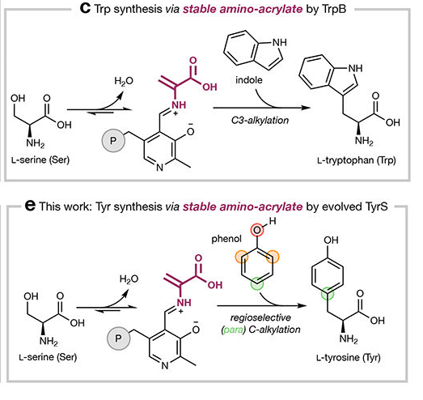

## Question

# Gene Research for Functional Annotation

## ⚠️ CRITICAL: Gene/Protein Identification Context

**BEFORE YOU BEGIN RESEARCH:** You MUST verify you are researching the CORRECT gene/protein. Gene symbols can be ambiguous, especially for less well-characterized genes from non-model organisms.

### Target Gene/Protein Identity (from UniProt):
- **UniProt Accession:** Q88RP6
- **Protein Description:** RecName: Full=Tryptophan synthase beta chain {ECO:0000255|HAMAP-Rule:MF_00133}; EC=4.2.1.20 {ECO:0000255|HAMAP-Rule:MF_00133};
- **Gene Information:** Name=trpB {ECO:0000255|HAMAP-Rule:MF_00133}; OrderedLocusNames=PP_0083;
- **Organism (full):** Pseudomonas putida (strain ATCC 47054 / DSM 6125 / CFBP 8728 / NCIMB 11950 / KT2440).
- **Protein Family:** Belongs to the TrpB family. {ECO:0000255|HAMAP-
- **Key Domains:** Trp_synth_b_CS. (IPR006653); Trp_synth_beta. (IPR006654); Trp_synth_beta/beta-like. (IPR023026); TrpB-like_PALP. (IPR001926); TrpB-like_PALP_sf. (IPR036052)

### MANDATORY VERIFICATION STEPS:

1. **Check if the gene symbol "trpB" matches the protein description above**
2. **Verify the organism is correct:** Pseudomonas putida (strain ATCC 47054 / DSM 6125 / CFBP 8728 / NCIMB 11950 / KT2440).
3. **Check if protein family/domains align with what you find in literature**
4. **If you find literature for a DIFFERENT gene with the same or similar symbol, STOP**

### If Gene Symbol is Ambiguous or You Cannot Find Relevant Literature:

**DO NOT PROCEED WITH RESEARCH ON A DIFFERENT GENE.** Instead:
- State clearly: "The gene symbol 'trpB' is ambiguous or literature is limited for this specific protein"
- Explain what you found (e.g., "Found extensive literature on a different gene with the same symbol in a different organism")
- Describe the protein based ONLY on the UniProt information provided above
- Suggest that the protein function can be inferred from domain/family information

### Research Target:

Please provide a comprehensive research report on the gene **trpB** (gene ID: trpB, UniProt: Q88RP6) in PSEPK.

The research report should be a detailed narrative explaining the function, biological processes, and localization of the gene product. Citations should be given for all claims.

You should prioritize authoritative reviews and primary scientific literature when conducting research. You can supplement
this with annotations you find in gene/protein databases, but these can be outdated or inaccurate.

We are specifically interested in the primary function of the gene - for enzymes, what reaction is catalyzed, and what is the substrate specificity? For transporters, what is the substrate? For structural proteins or adapters, what is the broader structural role? For signaling molecules, what is the role in the pathway.

We are interested in where in or outside the cell the gene product carries out its function.

We are also interested in the signaling or biochemical pathways in which the gene functions. We are less interested in broad pleiotropic effects, except where these elucidate the precise role.

Include evidence where possible. We are interested in both experimental evidence as well as inference from structure, evolution, or bioinformatic analysis. Precise studies should be prioritized over high-throughput, where available.

## Output

Question: You are an expert researcher providing comprehensive, well-cited information.

Provide detailed information focusing on:
1. Key concepts and definitions with current understanding
2. Recent developments and latest research (prioritize 2023-2024 sources)
3. Current applications and real-world implementations
4. Expert opinions and analysis from authoritative sources
5. Relevant statistics and data from recent studies

Format as a comprehensive research report with proper citations. Include URLs and publication dates where available.
Always prioritize recent, authoritative sources and provide specific citations for all major claims.

# Gene Research for Functional Annotation

## ⚠️ CRITICAL: Gene/Protein Identification Context

**BEFORE YOU BEGIN RESEARCH:** You MUST verify you are researching the CORRECT gene/protein. Gene symbols can be ambiguous, especially for less well-characterized genes from non-model organisms.

### Target Gene/Protein Identity (from UniProt):
- **UniProt Accession:** Q88RP6
- **Protein Description:** RecName: Full=Tryptophan synthase beta chain {ECO:0000255|HAMAP-Rule:MF_00133}; EC=4.2.1.20 {ECO:0000255|HAMAP-Rule:MF_00133};
- **Gene Information:** Name=trpB {ECO:0000255|HAMAP-Rule:MF_00133}; OrderedLocusNames=PP_0083;
- **Organism (full):** Pseudomonas putida (strain ATCC 47054 / DSM 6125 / CFBP 8728 / NCIMB 11950 / KT2440).
- **Protein Family:** Belongs to the TrpB family. {ECO:0000255|HAMAP-
- **Key Domains:** Trp_synth_b_CS. (IPR006653); Trp_synth_beta. (IPR006654); Trp_synth_beta/beta-like. (IPR023026); TrpB-like_PALP. (IPR001926); TrpB-like_PALP_sf. (IPR036052)

### MANDATORY VERIFICATION STEPS:

1. **Check if the gene symbol "trpB" matches the protein description above**
2. **Verify the organism is correct:** Pseudomonas putida (strain ATCC 47054 / DSM 6125 / CFBP 8728 / NCIMB 11950 / KT2440).
3. **Check if protein family/domains align with what you find in literature**
4. **If you find literature for a DIFFERENT gene with the same or similar symbol, STOP**

### If Gene Symbol is Ambiguous or You Cannot Find Relevant Literature:

**DO NOT PROCEED WITH RESEARCH ON A DIFFERENT GENE.** Instead:
- State clearly: "The gene symbol 'trpB' is ambiguous or literature is limited for this specific protein"
- Explain what you found (e.g., "Found extensive literature on a different gene with the same symbol in a different organism")
- Describe the protein based ONLY on the UniProt information provided above
- Suggest that the protein function can be inferred from domain/family information

### Research Target:

Please provide a comprehensive research report on the gene **trpB** (gene ID: trpB, UniProt: Q88RP6) in PSEPK.

The research report should be a detailed narrative explaining the function, biological processes, and localization of the gene product. Citations should be given for all claims.

You should prioritize authoritative reviews and primary scientific literature when conducting research. You can supplement
this with annotations you find in gene/protein databases, but these can be outdated or inaccurate.

We are specifically interested in the primary function of the gene - for enzymes, what reaction is catalyzed, and what is the substrate specificity? For transporters, what is the substrate? For structural proteins or adapters, what is the broader structural role? For signaling molecules, what is the role in the pathway.

We are interested in where in or outside the cell the gene product carries out its function.

We are also interested in the signaling or biochemical pathways in which the gene functions. We are less interested in broad pleiotropic effects, except where these elucidate the precise role.

Include evidence where possible. We are interested in both experimental evidence as well as inference from structure, evolution, or bioinformatic analysis. Precise studies should be prioritized over high-throughput, where available.

# Comprehensive Research Report: trpB Gene (UniProt Q88RP6) in *Pseudomonas putida* KT2440

## Executive Summary

The gene **trpB** (locus tag PP_0083; UniProt accession Q88RP6) in *Pseudomonas putida* strain KT2440 encodes the **tryptophan synthase beta chain** (EC 4.2.1.20), a pyridoxal 5′-phosphate (PLP)-dependent enzyme catalyzing the terminal step of L-tryptophan biosynthesis (kim2013indoletoxicityinvolves pages 3-5). This report provides a detailed functional annotation based on organism-specific experimental evidence and conserved mechanistic knowledge, with emphasis on recent (2023–2024) advances in TrpB enzymology and applications.

---

## 1. Gene Identity Verification and Organism-Specific Context

### 1.1 Confirmed Identity
The gene symbol **trpB** corresponds unambiguously to **PP_0083** in *P. putida* KT2440, as verified by microarray and functional genomics studies (kim2013indoletoxicityinvolves pages 3-5). This locus encodes the tryptophan synthase beta subunit, matching the UniProt annotation for Q88RP6 (RecName: Tryptophan synthase beta chain; EC 4.2.1.20) (kim2013indoletoxicityinvolves pages 3-5).

**Source:** Kim et al., 2013, *FEMS Microbiology Letters* 343(1):89-99. doi:10.1111/1574-6968.12135. URL: https://doi.org/10.1111/1574-6968.12135 (kim2013indoletoxicityinvolves pages 3-5)

### 1.2 Operon Organization and Genomic Context
In *P. putida* KT2440, the tryptophan biosynthesis genes are organized into **unlinked genomic regions**, contrasting with the single-operon architecture in *E. coli* (molinahenares2009functionalanalysisof pages 2-4, molinahenares2009functionalanalysisof pages 4-6, molinahenares2009functionalanalysisof pages 1-2). Specifically:

- **trpA** (PP_0082) and **trpB** (PP_0083) are **adjacent and overlap by one nucleotide**, indicating tight co-transcription as a **trpBA operon** (molinahenares2009functionalanalysisof pages 2-4).
- RT-PCR experiments using primers spanning the trpA/trpB junction confirmed **in vivo co-transcription** of this operon (molinahenares2009functionalanalysisof pages 4-6, molinahenares2009functionalanalysisof pages 7-8).
- Other tryptophan pathway genes occur as separate operons or monocistronic units: **trpGDC** forms an operon, while **trpE** and **trpF** are monocistronic (molinahenares2009functionalanalysisof pages 4-6, molinahenares2009functionalanalysisof pages 1-2).
- The **trpI** gene (encoding a LysR-family regulator) is **divergently oriented** from the trpBA cluster (molinahenares2009functionalanalysisof pages 2-4, matulis2022developmentandcharacterization pages 2-4).

**Sources:**  
- Molina-Henares et al., 2009, *Microbial Biotechnology* 2:91-100. doi:10.1111/j.1751-7915.2008.00062.x. URL: https://doi.org/10.1111/j.1751-7915.2008.00062.x (molinahenares2009functionalanalysisof pages 2-4, molinahenares2009functionalanalysisof pages 4-6, molinahenares2009functionalanalysisof pages 7-8, molinahenares2009functionalanalysisof pages 1-2)

### 1.3 Pathway Role and Genetic Evidence
Genetic disruption experiments demonstrate the **essentiality of trpBA for de novo tryptophan biosynthesis** in *P. putida* KT2440:

- A **mini-Tn5 insertion at the 7th codon of trpA** (Aux-1 mutant) produces a **tryptophan auxotroph**, which grows only when supplemented with exogenous tryptophan (molinahenares2009functionalanalysisof pages 2-4, molinahenares2009functionalanalysisof pages 4-6).
- This confirms that the trpA/trpB cluster is **required for L-tryptophan synthesis** from chorismate (molinahenares2009functionalanalysisof pages 1-2).

**Source:** Molina-Henares et al., 2009 (molinahenares2009functionalanalysisof pages 2-4, molinahenares2009functionalanalysisof pages 4-6, molinahenares2009functionalanalysisof pages 1-2)

### 1.4 Regulation: Indole-Responsive Expression
Transcriptomic and biosensor studies reveal **indole-responsive regulation** of trpB in *P. putida* KT2440:

- **Microarray analysis** identified trpB (PP_0083) as the **most highly upregulated gene** (3.52-fold) in response to indole treatment, out of 47 genes showing >1.5-fold change (kim2013indoletoxicityinvolves pages 3-5, kim2013indoletoxicityinvolves pages 8-9).
- The authors propose that **incorporation of indole into tryptophan biosynthesis** may represent a detoxification or stress-mitigation mechanism (kim2013indoletoxicityinvolves pages 8-9).
- A **TrpI-dependent, indole-inducible promoter system** (PpTrpI/PPP_RS00425) derived from KT2440 was characterized: it shows **up to 639.6-fold induction** by indole (linear response ~0.4–5 mM) and requires the **trpI regulator** for activation (matulis2022developmentandcharacterization pages 2-4).
- This system functions as a **whole-cell indole biosensor** in heterologous hosts (*E. coli*, *Cupriavidus necator*), demonstrating the conserved regulatory logic (matulis2022developmentandcharacterization pages 2-4).

**Sources:**  
- Kim et al., 2013, *FEMS Microbiology Letters* (kim2013indoletoxicityinvolves pages 3-5, kim2013indoletoxicityinvolves pages 8-9)  
- Matulis et al., 2022, *International Journal of Molecular Sciences* 23:4649. doi:10.3390/ijms23094649. URL: https://doi.org/10.3390/ijms23094649 (matulis2022developmentandcharacterization pages 2-4)

---

## 2. Core Function: The Tryptophan Synthase Beta Reaction

### 2.1 Enzymatic Reaction and Substrate Specificity
TrpB (EC 4.2.1.20) catalyzes the **β-reaction** of tryptophan biosynthesis, the **final step** in de novo L-tryptophan synthesis (ghosh2022allostericregulationof pages 1-2, michalska2019conservationofthe pages 1-2):

**Reaction:**  
**Indole + L-serine → L-tryptophan + H₂O**

This is a **pyridoxal 5′-phosphate (PLP)-dependent β-replacement reaction** in which the hydroxyl group of L-serine is replaced by indole via a nucleophilic substitution mechanism (ghosh2022allostericregulationof pages 1-2, watkins‐dulaney2021tryptophansynthasebiocatalyst pages 1-3, almhjell2024theβsubunitof media fd21782e).

**Sources:**  
- Ghosh et al., 2022, *Frontiers in Molecular Biosciences* 9:923042. doi:10.3389/fmolb.2022.923042. URL: https://doi.org/10.3389/fmolb.2022.923042 (ghosh2022allostericregulationof pages 1-2)  
- Michalska et al., 2019, *IUCrJ* 6:649-664. doi:10.1107/s2052252519005955. URL: https://doi.org/10.1107/s2052252519005955 (michalska2019conservationofthe pages 1-2)

### 2.2 Catalytic Mechanism and Key Intermediates
TrpB employs a **sophisticated PLP-dependent mechanism** involving multiple covalent intermediates (ghosh2022allostericregulationof pages 1-2, michalska2019conservationofthe pages 1-2, almhjell2024theβsubunitof media fd21782e):

1. **Internal aldimine:** PLP is covalently linked to a **catalytic lysine residue** (Lys87 in *Salmonella typhimurium* numbering) via a Schiff base (ghosh2022allostericregulationof pages 1-2, michalska2019conservationofthe pages 1-2).
2. **External aldimine formation:** L-serine displaces the lysine, forming an external aldimine.
3. **Amino-acrylate intermediate (E(A-A)):** Dehydration of the serine external aldimine generates a **kinetically stable α,β-unsaturated Schiff base (amino-acrylate)**, a key catalytic species that is **resistant to β-elimination** (unlike in tyrosine phenol-lyase or tryptophanase) (almhjell2024theβsubunitof pages 2-4, almhjell2024theβsubunitof pages 1-2, almhjell2024theβsubunitof media fd21782e).
4. **C–C bond formation:** Indole performs a **Friedel–Crafts-type nucleophilic attack** at the Cβ of the amino-acrylate, forming L-tryptophan (almhjell2024theβsubunitof pages 1-2, almhjell2024theβsubunitof media fd21782e).

**Visual evidence** of the mechanism is presented in Figure 1c of Almhjell et al. (2024), showing the stable amino-acrylate intermediate bound to PLP and the subsequent C3-alkylation of indole (almhjell2024theβsubunitof media fd21782e).

**Sources:**  
- Almhjell et al., 2024, *Nature Chemical Biology* 20:1086-1093. doi:10.1038/s41589-024-01619-z. URL: https://doi.org/10.1038/s41589-024-01619-z (almhjell2024theβsubunitof pages 2-4, almhjell2024theβsubunitof pages 1-2, almhjell2024theβsubunitof media fd21782e)

### 2.3 Quaternary Structure and Substrate Channeling
TrpB normally functions within a **heterotetrameric (α₂β₂) tryptophan synthase complex** composed of two TrpA (α) and two TrpB (β) subunits (ghosh2022allostericregulationof pages 1-2, michalska2019conservationofthe pages 1-2, khan2025multienzymesynergyand pages 12-13):

- **TrpA** catalyzes the cleavage of indole-3-glycerol phosphate (IGP) to **indole and glyceraldehyde-3-phosphate (G3P)** (ghosh2022allostericregulationof pages 1-2, khan2025multienzymesynergyand pages 12-13).
- **Indole channeling:** The indole intermediate is transferred from the TrpA active site to the TrpB active site through a **~25 Å hydrophobic tunnel**, preventing indole loss to the medium and enhancing catalytic efficiency by ~100-fold (ghosh2022allostericregulationof pages 1-2, michalska2019conservationofthe pages 1-2, khan2025multienzymesynergyand pages 12-13).
- **Allosteric regulation:** The two subunits **mutually activate** each other through conformational changes mediated by the **TrpB COMM (communication) domain** and specific loops (e.g., αL6 in TrpA) (ghosh2022allostericregulationof pages 1-2, michalska2019conservationofthe pages 1-2, michalska2021catalyticallyimpairedtrpa pages 4-7).
- **Open (T) and closed (R) states:** Ligand binding and the formation of catalytic intermediates (especially the amino-acrylate) trigger transitions between catalytically inactive (open) and active (closed) conformations, synchronizing the α- and β-reactions (ghosh2022allostericregulationof pages 1-2, michalska2019conservationofthe pages 1-2).

**Sources:**  
- Ghosh et al., 2022 (ghosh2022allostericregulationof pages 1-2)  
- Michalska et al., 2019 (michalska2019conservationofthe pages 1-2)  
- Khan & Boehr, 2025, *Catalysts* 15:718. doi:10.3390/catal15080718. URL: https://doi.org/10.3390/catal15080718 (khan2025multienzymesynergyand pages 12-13)  
- Michalska et al., 2021, *Protein Science* 30:1904-1918. doi:10.1002/pro.4143. URL: https://doi.org/10.1002/pro.4143 (michalska2021catalyticallyimpairedtrpa pages 4-7)

### 2.4 Structural Features and Domains
TrpB is a **fold-type II PLP enzyme** with conserved structural elements (michalska2019conservationofthe pages 1-2):

- **N-terminal domain:** Contains the **COMM (communication) domain**, which participates in allosteric signaling and conformational gating (ghosh2022allostericregulationof pages 1-2, michalska2019conservationofthe pages 1-2).
- **C-terminal domain:** Houses the **PLP-binding active site** and catalytic residues.
- **Key catalytic residues** (based on conserved bacterial TrpB sequences): catalytic Lys (e.g., Lys87), a near-universally conserved **Glu residue (E105 in many TrpB homologs)** that coordinates indole for C–C bond formation, and Asp/Ser residues that stabilize intermediates (khan2025multienzymesynergyand pages 12-13, almhjell2024theβsubunitof pages 2-4, almhjell2024theβsubunitof pages 4-6).

**Source:** Michalska et al., 2019 (michalska2019conservationofthe pages 1-2); Khan & Boehr, 2025 (khan2025multienzymesynergyand pages 12-13); Almhjell et al., 2024 (almhjell2024theβsubunitof pages 2-4, almhjell2024theβsubunitof pages 4-6)

---

## 3. Cellular Localization

As a **cytoplasmic enzyme** involved in amino acid biosynthesis, TrpB is expected to localize to the **bacterial cytoplasm** where it participates in the tryptophan biosynthetic pathway. No experimental evidence for alternative localization (e.g., membrane association or secretion) has been reported for *P. putida* KT2440 trpB. Bacterial tryptophan synthases are typically soluble, cytoplasmic enzymes (ghosh2022allostericregulationof pages 1-2, michalska2019conservationofthe pages 1-2).

---

## 4. Biological Pathways and Metabolic Context

### 4.1 The Tryptophan Biosynthesis Pathway
TrpB functions in the **terminal step of the canonical L-tryptophan biosynthesis pathway**, which proceeds from chorismate via the shikimate pathway (ghosh2022allostericregulationof pages 1-2, khan2025multienzymesynergyand pages 12-13):

1. **Chorismate** (common precursor for aromatic amino acids)
2. Anthranilate (catalyzed by TrpE/TrpD)
3. Phosphoribosyl-anthranilate (TrpD)
4. Indole-3-glycerol phosphate (IGP) (via TrpC, TrpF, TrpG)
5. **Indole + G3P** (TrpA, α-reaction)
6. **L-Tryptophan** (TrpB, β-reaction)

In *P. putida* KT2440, the pathway is encoded by **genes distributed across the genome** (trpBA, trpGDC, trpE, trpF, trpI) rather than a single operon (molinahenares2009functionalanalysisof pages 2-4, molinahenares2009functionalanalysisof pages 4-6, molinahenares2009functionalanalysisof pages 1-2).

**Source:** Molina-Henares et al., 2009 (molinahenares2009functionalanalysisof pages 2-4, molinahenares2009functionalanalysisof pages 4-6, molinahenares2009functionalanalysisof pages 1-2)

### 4.2 Regulation and Feedback Control
The trp operon/pathway is subject to **transcriptional and allosteric regulation** in bacteria:

- **TrpI-mediated activation:** In *P. putida* KT2440 and related pseudomonads, TrpI (a LysR-family regulator) acts as an **indole-responsive transcriptional activator** of trpA and trpB, in contrast to the TrpR repressor system in *E. coli* (matulis2022developmentandcharacterization pages 2-4).
- **Indole stress response:** Indole accumulation strongly induces trpB expression, potentially enabling cells to **re-incorporate indole into tryptophan biosynthesis** as a detoxification strategy (kim2013indoletoxicityinvolves pages 3-5, kim2013indoletoxicityinvolves pages 8-9).
- **Feedback inhibition:** Canonical regulation involves feedback inhibition of early pathway enzymes by L-tryptophan; TrpB itself is regulated indirectly through pathway flux and TrpA allosteric coupling (ghosh2022allostericregulationof pages 1-2).

**Sources:** Kim et al., 2013 (kim2013indoletoxicityinvolves pages 3-5, kim2013indoletoxicityinvolves pages 8-9); Matulis et al., 2022 (matulis2022developmentandcharacterization pages 2-4); Ghosh et al., 2022 (ghosh2022allostericregulationof pages 1-2)

---

## 5. Recent Developments (2023–2024): Enzyme Engineering and New Catalytic Functions

### 5.1 2024 Breakthrough: TrpB as a Latent Tyrosine Synthase
A landmark study by **Almhjell et al. (2024)** demonstrated that TrpB can be **engineered into a highly selective tyrosine synthase** (TyrS), expanding its catalytic repertoire beyond indole substrates (almhjell2024theβsubunitof pages 2-4, almhjell2024theβsubunitof pages 1-2, almhjell2024theβsubunitof pages 4-6):

- **Key discovery:** A **single substitution** of the near-universally conserved **catalytic glutamate (E105G)** unlocked activity on phenol substrates, giving **exclusive para-selective C–C bond formation** to produce L-tyrosine and analogs (almhjell2024theβsubunitof pages 2-4).
- **Activity enhancement:** E105G alone provided an **18-fold rate increase** for 1-naphthol and **>100-fold for phenol** (almhjell2024theβsubunitof pages 2-4, almhjell2024theβsubunitof pages 4-6).
- **Directed evolution:** Subsequent rounds of random mutagenesis, site-saturation, and recombination produced TmTyrS6 (22 substitutions from the starting Tm9D8* variant), achieving a **net >30,000-fold activity improvement** (almhjell2024theβsubunitof pages 4-6).
- **Selectivity:** Engineered TyrS variants show **≥99.5% enantioselectivity and regioselectivity**, with no detectable D-Tyr or ortho-alkylation products even at >1,000-fold over the limit of quantification (almhjell2024theβsubunitof pages 2-4, almhjell2024theβsubunitof pages 4-6).
- **Catalytic performance:** TmTyrS6 exhibits an **apparent turnover frequency (TOF) of 0.23 min⁻¹** at 37 °C with 50 mM substrates (almhjell2024theβsubunitof pages 2-4).
- **Mechanistic insight:** Structural and computational studies reveal that the E105G mutation **allows an active-site water molecule** to occupy the position of the removed glutamate, coordinating phenol for **concerted C–C bond formation and deprotonation** (Figure 4 of Almhjell et al., 2024) (almhjell2024theβsubunitof media 0e8ae960, almhjell2024theβsubunitof pages 30-35, almhjell2024theβsubunitof pages 6-7).
- **Preparative utility:** Engineered TyrS enables **gram-scale synthesis** of L-tyrosine analogs, including β-(1-naphthol-4-yl)-L-alanine (NaphAla) (almhjell2024theβsubunitof pages 30-35, almhjell2024theβsubunitof pages 1-2).

**Publication:** Almhjell et al., 2024, *Nature Chemical Biology* 20:1086-1093. doi:10.1038/s41589-024-01619-z. URL: https://doi.org/10.1038/s41589-024-01619-z (almhjell2024theβsubunitof pages 2-4, almhjell2024theβsubunitof pages 4-6, almhjell2024theβsubunitof pages 30-35, almhjell2024theβsubunitof pages 1-2)

### 5.2 Stand-Alone TrpB Biocatalysts
Engineering efforts prior to 2024 had already established **stand-alone TrpB variants** freed from dependence on TrpA (watkins‐dulaney2021tryptophansynthasebiocatalyst pages 4-6):

- **PfTrpB0B2:** Created via **only three rounds of directed evolution** (six mutations), achieving an **83-fold increase in catalytic efficiency** over wild-type TrpB and activity exceeding the native αββα complex (watkins‐dulaney2021tryptophansynthasebiocatalyst pages 4-6).
- **Thermostable variants:** Engineered TrpB from *Pyrococcus furiosus* and *Thermotoga maritima* enable **high-temperature reactions (55–75 °C)**, improving indole solubility and substrate loading (watkins‐dulaney2021tryptophansynthasebiocatalyst pages 4-6).
- **Mutations recapitulate TrpA activation:** Beneficial mutations stabilize the **catalytically active closed conformation** of TrpB and enhance persistence of the amino-acrylate intermediate, mimicking the allosteric effects normally provided by TrpA (watkins‐dulaney2021tryptophansynthasebiocatalyst pages 4-6, khan2025multienzymesynergyand pages 13-15).

**Sources:**  
- Watkins-Dulaney et al., 2021, *ChemBioChem* 22:5-16. doi:10.1002/cbic.202000379. URL: https://doi.org/10.1002/cbic.202000379 (watkins‐dulaney2021tryptophansynthasebiocatalyst pages 4-6)  
- Khan & Boehr, 2025 (khan2025multienzymesynergyand pages 13-15)

---

## 6. Applications and Real-World Implementations

### 6.1 Noncanonical Amino Acid (ncAA) Synthesis
Engineered TrpB variants have become **workhorse biocatalysts** for stereoselective ncAA synthesis (watkins‐dulaney2021tryptophansynthasebiocatalyst pages 7-9, watkins‐dulaney2021tryptophansynthasebiocatalyst pages 6-7, watkins‐dulaney2021tryptophansynthasebiocatalyst pages 4-6, watkins‐dulaney2021tryptophansynthasebiocatalyst pages 9-11):

**Substrate scope:**
- **Halogenated indoles:** 4-F, 5-F, 5-Cl, etc. (isolated yields typically **70–99%**) (watkins‐dulaney2021tryptophansynthasebiocatalyst pages 4-6)
- **Functionalized indoles:** Nitro, cyano, carboxamide, boronate, CF₃, azido, amino-substituted (watkins‐dulaney2021tryptophansynthasebiocatalyst pages 4-6)
- **β-Branched amino acids:** L-threonine accepted to produce **β-methyltryptophans** (>6,000-fold activity boost in PfTrpB2B9 vs. wild-type) (watkins‐dulaney2021tryptophansynthasebiocatalyst pages 6-7)
- **Quaternary stereocenter formation:** PfTrpBquat shows **>99% C3 chemoselectivity** on oxindoles, yielding **122 mg product from 1 mmol substrate** using 100 mL *E. coli* culture (52% yield) (watkins‐dulaney2021tryptophansynthasebiocatalyst pages 7-9)

**Preparative-scale examples:**
- **800 mg 4-cyanotryptophan** from 1 L *E. coli* culture (**49% yield**) (watkins‐dulaney2021tryptophansynthasebiocatalyst pages 4-6)
- **965 mg azulene-derived amino acid (AzAla)** with **57% isolated yield** (TmTrpBAzul; turnover improved from 4.6 to **14.0 min⁻¹**) (watkins‐dulaney2021tryptophansynthasebiocatalyst pages 7-9, watkins‐dulaney2021tryptophansynthasebiocatalyst pages 9-11)

**Sources:** Watkins-Dulaney et al., 2021 (watkins‐dulaney2021tryptophansynthasebiocatalyst pages 7-9, watkins‐dulaney2021tryptophansynthasebiocatalyst pages 6-7, watkins‐dulaney2021tryptophansynthasebiocatalyst pages 4-6, watkins‐dulaney2021tryptophansynthasebiocatalyst pages 9-11)

### 6.2 Metabolic Engineering for L-Tryptophan Production
Engineered TrpB and optimized tryptophan pathways have been deployed in industrial microbial hosts (khan2025multienzymesynergyand pages 15-16):

- **Corynebacterium glutamicum:** Tryptophan titers reaching **50.5 g/L** (khan2025multienzymesynergyand pages 15-16)
- **L-5-Hydroxytryptophan:** **86.7% yield** under optimized conditions (khan2025multienzymesynergyand pages 15-16)
- **Indigo biosynthesis:** Integration of TrpS with flavin monooxygenase yielded **1,288 mg/L indigo** (khan2025multienzymesynergyand pages 15-16)
- **One-pot D-tryptophan synthesis:** Multi-enzyme cascades (TrpS + L-amino acid deaminase + D-amino acid transaminase) achieved **>99% ee** (watkins‐dulaney2021tryptophansynthasebiocatalyst pages 9-11, khan2025multienzymesynergyand pages 15-16)

**Sources:** Khan & Boehr, 2025 (khan2025multienzymesynergyand pages 15-16); Watkins-Dulaney et al., 2021 (watkins‐dulaney2021tryptophansynthasebiocatalyst pages 9-11)

### 6.3 High-Throughput Screening and Continuous Evolution
Recent advances enable **ultra-high-throughput engineering** of TrpB (khan2025multienzymesynergyand pages 15-16, khan2025multienzymesynergyand pages 22-23):

- **Droplet microfluidics:** Screening of **>100,000 TrpB mutants per day**, identifying variants with **100-fold activity improvements** (khan2025multienzymesynergyand pages 15-16)
- **Continuous flow:** Thermostable TrpB variants patented for **continuous-flow bioreactors** and low-temperature manufacturing (khan2025multienzymesynergyand pages 16-18)

**Source:** Khan & Boehr, 2025 (khan2025multienzymesynergyand pages 15-16, khan2025multienzymesynergyand pages 22-23, khan2025multienzymesynergyand pages 16-18)

---

## 7. Expert Analysis and Current Understanding

### 7.1 Mechanistic Plasticity
TrpB's **kinetically stable amino-acrylate intermediate** is the key to its versatility as a biocatalyst (almhjell2024theβsubunitof pages 2-4, almhjell2024theβsubunitof pages 1-2, almhjell2024theβsubunitof media fd21782e). Unlike TPL or tryptophanase, which favor β-elimination, TrpB's active site stabilizes the amino-acrylate, enabling **kinetic control favoring synthesis over degradation** (almhjell2024theβsubunitof pages 1-2). This property has been exploited to:

- Accept diverse nucleophiles beyond indole (phenols, azulene, nitroalkanes, thiols) (watkins‐dulaney2021tryptophansynthasebiocatalyst pages 7-9, watkins‐dulaney2021tryptophansynthasebiocatalyst pages 6-7, almhjell2024theβsubunitof pages 2-4)
- Form C–C, C–N, C–S, and C–Se bonds (watkins‐dulaney2021tryptophansynthasebiocatalyst pages 6-7)
- Catalyze previously unknown reactions (e.g., photoredox-pyridoxal radical biocatalysis for β-methyl amino acids) (khan2025multienzymesynergyand pages 15-16)

**Sources:** Almhjell et al., 2024 (almhjell2024theβsubunitof pages 2-4, almhjell2024theβsubunitof pages 1-2, almhjell2024theβsubunitof media fd21782e); Watkins-Dulaney et al., 2021 (watkins‐dulaney2021tryptophansynthasebiocatalyst pages 7-9, watkins‐dulaney2021tryptophansynthasebiocatalyst pages 6-7); Khan & Boehr, 2025 (khan2025multienzymesynergyand pages 15-16)

### 7.2 Allosteric Engineering
Rational and computational approaches target **allosteric networks** to improve TrpB activity (khan2025multienzymesynergyand pages 13-15):

- **Mutations distal to the active site** can increase the population of catalytically competent conformations, **recapitulating TrpA activation** in the absence of the α-subunit (watkins‐dulaney2021tryptophansynthasebiocatalyst pages 4-6, khan2025multienzymesynergyand pages 13-15).
- **Transferability:** Activating mutations can be transferred across TrpB homologs with **≥57% sequence identity** (khan2025multienzymesynergyand pages 13-15).
- **Computational tools:** Shortest Path Map (SPM) analysis identifies key residues controlling conformational transitions (khan2025multienzymesynergyand pages 15-16, khan2025multienzymesynergyand pages 13-15).

**Sources:** Watkins-Dulaney et al., 2021 (watkins‐dulaney2021tryptophansynthasebiocatalyst pages 4-6); Khan & Boehr, 2025 (khan2025multienzymesynergyand pages 15-16, khan2025multienzymesynergyand pages 13-15)

### 7.3 Conservation and Drug Target Potential
Bacterial TrpB proteins show **high structural and mechanistic conservation** (michalska2019conservationofthe pages 1-2, michalska2021catalyticallyimpairedtrpa pages 4-7):

- The catalytic glutamate (E105) is conserved in **~98.3% of ~18,051 TrpB-like sequences** (almhjell2024theβsubunitof pages 4-6, almhjell2024theβsubunitof pages 30-35).
- TrpAB is **essential for bacterial survival** in tryptophan-limited environments (e.g., *Mycobacterium tuberculosis* in macrophages) and is a validated **antimicrobial drug target** (michalska2019conservationofthe pages 1-2).
- Allosteric and active-site inhibitors have been developed, exploiting species-specific structural differences (khan2025multienzymesynergyand pages 16-18).

**Sources:** Michalska et al., 2019 (michalska2019conservationofthe pages 1-2); Michalska et al., 2021 (michalska2021catalyticallyimpairedtrpa pages 4-7); Almhjell et al., 2024 (almhjell2024theβsubunitof pages 4-6, almhjell2024theβsubunitof pages 30-35); Khan & Boehr, 2025 (khan2025multienzymesynergyand pages 16-18)

---

## 8. Summary Table of Key Evidence

A comprehensive evidence table summarizing organism-specific findings for *P. putida* KT2440 trpB (PP_0083; Q88RP6) and general TrpB knowledge is provided below:

| Claim/Topic | Key finding | Organism/system | Quantitative details | Source (authors, year, journal) | URL | Evidence citation id |
|---|---|---|---|---|---|---|
| Identity verification of target gene | trpB is explicitly annotated as PP_0083, tryptophan synthase beta subunit, in *Pseudomonas putida* KT2440, matching UniProt Q88RP6. | *P. putida* KT2440 | PP_0083 locus tag | Kim et al., 2013, *FEMS Microbiology Letters* | https://doi.org/10.1111/1574-6968.12135 | (kim2013indoletoxicityinvolves pages 3-5) |
| Operon organization | trpA and trpB are adjacent, overlap by 1 nucleotide, and are consistent with co-transcription as a trpBA operon. | *P. putida* KT2440 | 1-nt overlap between trpA and trpB | Molina-Henares et al., 2009, *Microbial Biotechnology* | https://doi.org/10.1111/j.1751-7915.2008.00062.x | (molinahenares2009functionalanalysisof pages 2-4) |
| Experimental operon confirmation | RT-PCR across the trpA/trpB region confirmed in vivo co-transcription of trpA and trpB. | *P. putida* KT2440 | cDNA band detected with A-1/B-1 primers; negative control lacked RT | Molina-Henares et al., 2009, *Microbial Biotechnology* | https://doi.org/10.1111/j.1751-7915.2008.00062.x | (molinahenares2009functionalanalysisof pages 4-6, molinahenares2009functionalanalysisof pages 7-8) |
| Broader pathway organization | Tryptophan biosynthesis genes are split across unlinked regions: trpBA cluster, trpGDC operon, and monocistronic trpE/trpF; trpI is divergently transcribed from trpBA. | *P. putida* KT2440 | Genomic organization into 2 clusters + 2 monocistronic units | Molina-Henares et al., 2009, *Microbial Biotechnology* | https://doi.org/10.1111/j.1751-7915.2008.00062.x | (molinahenares2009functionalanalysisof pages 4-6, molinahenares2009functionalanalysisof pages 1-2) |
| Genetic evidence for pathway function | Disruption of trpA causes tryptophan auxotrophy, supporting that the trpBA unit is required for de novo tryptophan synthesis. | *P. putida* KT2440 | Aux-1 insertion at 7th codon of trpA; TrpA mutant grows only with tryptophan supplementation | Molina-Henares et al., 2009, *Microbial Biotechnology* | https://doi.org/10.1111/j.1751-7915.2008.00062.x | (molinahenares2009functionalanalysisof pages 2-4, molinahenares2009functionalanalysisof pages 4-6, molinahenares2009functionalanalysisof pages 1-2) |
| trpI-associated regulation | A trpIAB arrangement was identified; trpI is required for indole-responsive activation of the PP_RS00425 promoter system derived from KT2440. | *P. putida* KT2440 system tested in *E. coli* and *Cupriavidus necator* | Induction observed with 1 mM indole only when trpI was present | Matulis et al., 2022, *International Journal of Molecular Sciences* | https://doi.org/10.3390/ijms23094649 | (matulis2022developmentandcharacterization pages 2-4) |
| Indole-responsive biosensor utility | The PpTrpI/PPP_RS00425 gene expression system was developed as an indole biosensor and showed strong, specific induction by indole. | KT2440-derived regulatory parts in heterologous hosts | Up to 639.6-fold induction; linear response ~0.4-5 mM indole | Matulis et al., 2022, *International Journal of Molecular Sciences* | https://doi.org/10.3390/ijms23094649 | (matulis2022developmentandcharacterization pages 2-4) |
| Indole stress response | trpB (PP_0083) was the most highly induced gene in KT2440 after indole treatment, linking it to indole-responsive physiology and tryptophan biosynthesis. | *P. putida* KT2440 | 3.52-fold upregulation; 47 genes changed >1.5-fold up or <0.67-fold down | Kim et al., 2013, *FEMS Microbiology Letters* | https://doi.org/10.1111/1574-6968.12135 | (kim2013indoletoxicityinvolves pages 3-5, kim2013indoletoxicityinvolves pages 8-9) |
| Functional interpretation of indole response | Authors proposed that degradation/incorporation of indole into tryptophan biosynthesis may help mitigate indole stress. | *P. putida* KT2440 | Qualitative interpretation from microarray data | Kim et al., 2013, *FEMS Microbiology Letters* | https://doi.org/10.1111/1574-6968.12135 | (kim2013indoletoxicityinvolves pages 8-9) |
| Core enzymatic reaction | TrpB catalyzes the PLP-dependent β-reaction converting indole + L-serine to L-tryptophan, the terminal step of tryptophan biosynthesis. | Bacterial tryptophan synthase | Reaction: indole + L-Ser → L-Trp + H2O | Ghosh et al., 2022, *Frontiers in Molecular Biosciences* | https://doi.org/10.3389/fmolb.2022.923042 | (ghosh2022allostericregulationof pages 1-2) |
| Catalytic intermediate and cofactor chemistry | TrpB forms a PLP-linked aminoacrylate (EAA) Schiff-base intermediate; PLP is present as an internal aldimine with a catalytic Lys. | Bacterial tryptophan synthase | Catalytic Lys87 noted in *Salmonella* numbering | Ghosh et al., 2022, *Frontiers in Molecular Biosciences*; Michalska et al., 2019, *IUCrJ* | https://doi.org/10.3389/fmolb.2022.923042 ; https://doi.org/10.1107/S2052252519005955 | (ghosh2022allostericregulationof pages 1-2, michalska2019conservationofthe pages 1-2) |
| Quaternary structure and channeling | TrpB usually functions in an α2β2 tryptophan synthase complex with TrpA; indole is channeled through an intersubunit tunnel. | Bacterial tryptophan synthase | ~25 Å tunnel connecting α and β active sites | Ghosh et al., 2022, *Frontiers in Molecular Biosciences*; Michalska et al., 2019, *IUCrJ* | https://doi.org/10.3389/fmolb.2022.923042 ; https://doi.org/10.1107/S2052252519005955 | (ghosh2022allostericregulationof pages 1-2, michalska2019conservationofthe pages 1-2) |
| Allosteric control and structure | TrpB contains an N-terminal COMM domain that participates in open/closed transitions and α-β allosteric communication. | Bacterial tryptophan synthase | Open (T) and closed (R) conformational states regulate catalysis | Ghosh et al., 2022, *Frontiers in Molecular Biosciences*; Michalska et al., 2019, *IUCrJ* | https://doi.org/10.3389/fmolb.2022.923042 ; https://doi.org/10.1107/S2052252519005955 | (ghosh2022allostericregulationof pages 1-2, michalska2019conservationofthe pages 1-2) |
| Structural conservation | Bacterial TrpB proteins are broadly conserved in fold and mechanism, supporting annotation transfer across species when identity is verified. | Multiple bacterial pathogens / bacterial TrpAB enzymes | TrpB described as more sequence- and fold-conserved than TrpA | Michalska et al., 2019, *IUCrJ*; Michalska et al., 2021, *Protein Science* | https://doi.org/10.1107/S2052252519005955 ; https://doi.org/10.1002/pro.4143 | (michalska2019conservationofthe pages 1-2, michalska2021catalyticallyimpairedtrpa pages 4-7) |
| 2024 mechanistic advance | A single substitution at the near-universally conserved catalytic glutamate can unlock latent tyrosine synthase activity in TrpB. | Engineered TrpB (Tm9D8* lineage) | E105G gave 18-fold activation on 1-naphthol and >100-fold on phenol in one context | Almhjell et al., 2024, *Nature Chemical Biology* | https://doi.org/10.1038/s41589-024-01619-z | (almhjell2024theβsubunitof pages 2-4, almhjell2024theβsubunitof pages 4-6) |
| 2024 evolved activity gains | Directed evolution converted TrpB into TyrS variants with very large activity gains and exclusive para-selective C-C bond formation on phenols. | Engineered TrpB/TyrS | >30,000-fold overall rate enhancement; ≥99.5% enantio- and regioselectivity | Almhjell et al., 2024, *Nature Chemical Biology* | https://doi.org/10.1038/s41589-024-01619-z | (almhjell2024theβsubunitof pages 4-6, almhjell2024theβsubunitof pages 1-2) |
| 2024 catalytic performance | Final TyrS variant synthesized tyrosine with measurable catalytic turnover under preparative conditions. | Engineered TrpB/TyrS6 | Apparent TOF ~0.23 min⁻1 at 37 °C, 50 mM substrate | Almhjell et al., 2024, *Nature Chemical Biology* | https://doi.org/10.1038/s41589-024-01619-z | (almhjell2024theβsubunitof pages 2-4) |
| 2024 evolutionary/structural insight | The catalytic glutamate targeted in TyrS engineering is highly conserved across TrpB-like sequences, underscoring mechanistic importance. | TrpB-like sequence space | E105 conserved in ~98.3% of ~18,051 sequences | Almhjell et al., 2024, *Nature Chemical Biology* | https://doi.org/10.1038/s41589-024-01619-z | (almhjell2024theβsubunitof pages 4-6, almhjell2024theβsubunitof pages 30-35) |
| 2024 practical application | Engineered TyrS enzymes enabled preparative/gram-scale synthesis of tyrosine analogs. | Engineered TrpB/TyrS | Preparative scale; multi-gram / gram-scale products reported | Almhjell et al., 2024, *Nature Chemical Biology* | https://doi.org/10.1038/s41589-024-01619-z | (almhjell2024theβsubunitof pages 30-35, almhjell2024theβsubunitof pages 1-2) |
| Stand-alone TrpB biocatalyst engineering | Directed evolution liberated TrpB from dependence on TrpA, creating stand-alone catalysts suitable for synthesis of noncanonical amino acids. | Engineered PfTrpB / TmTrpB variants | PfTrpB0B2 obtained with 6 mutations after 3 rounds; 83-fold increase in catalytic efficiency | Watkins-Dulaney et al., 2021, *ChemBioChem* | https://doi.org/10.1002/cbic.202000379 | (watkins‐dulaney2021tryptophansynthasebiocatalyst pages 4-6) |
| Substrate scope and yields | Evolved TrpB variants accept many substituted indoles and often give high isolated yields. | Engineered TrpB biocatalysts | Typical isolated yields 70-99% across many analogs | Watkins-Dulaney et al., 2021, *ChemBioChem* | https://doi.org/10.1002/cbic.202000379 | (watkins‐dulaney2021tryptophansynthasebiocatalyst pages 4-6) |
| Preparative Trp analog synthesis | A TmTrpB variant was used to synthesize 4-cyanotryptophan on preparative scale. | Engineered TmTrpB9D8* in *E. coli* cells | 800 mg 4-cyanoTrp from 1 L culture; 49% yield | Watkins-Dulaney et al., 2021, *ChemBioChem* | https://doi.org/10.1002/cbic.202000379 | (watkins‐dulaney2021tryptophansynthasebiocatalyst pages 4-6) |
| Expanded bond-forming chemistry | Engineered TrpB variants catalyze noncanonical C-C, C-N, C-S, and C-Se bond-forming reactions. | Engineered TrpB biocatalysts | Up to 2,700 turnovers on nitro-containing substrates | Watkins-Dulaney et al., 2021, *ChemBioChem* | https://doi.org/10.1002/cbic.202000379 | (watkins‐dulaney2021tryptophansynthasebiocatalyst pages 7-9, watkins‐dulaney2021tryptophansynthasebiocatalyst pages 6-7) |
| Quaternary-center synthesis | Engineered PfTrpBquat shifted chemoselectivity to C3 alkylation of oxindoles, enabling quaternary stereocenter formation. | Engineered PfTrpBquat | >99% C3 chemoselectivity; 52% yield; 122 mg from 1 mmol substrate using 100 mL *E. coli* culture | Watkins-Dulaney et al., 2021, *ChemBioChem* | https://doi.org/10.1002/cbic.202000379 | (watkins‐dulaney2021tryptophansynthasebiocatalyst pages 7-9) |
| Azulene amino acid production | Evolution improved azulene alkylation and enabled gram-scale synthesis of AzAla. | Engineered TmTrpBAzul | Activity improved from 4.6 to 14.0 turnovers/min; 965 mg product; 57% isolated yield | Watkins-Dulaney et al., 2021, *ChemBioChem* | https://doi.org/10.1002/cbic.202000379 | (watkins‐dulaney2021tryptophansynthasebiocatalyst pages 7-9, watkins‐dulaney2021tryptophansynthasebiocatalyst pages 9-11) |
| β-branched amino acid synthesis | TrpB engineering enabled efficient β-methyltryptophan synthesis from threonine-derived chemistry. | Engineered PfTrpB variants | >6,000-fold boost in β-methylTrp activity vs WT; one variant used 1 equiv Thr and gave 3.5-fold higher yield than prior variant needing 10 equiv | Watkins-Dulaney et al., 2021, *ChemBioChem* | https://doi.org/10.1002/cbic.202000379 | (watkins‐dulaney2021tryptophansynthasebiocatalyst pages 6-7) |

*Table: This table compiles organism-specific evidence for *Pseudomonas putida* KT2440 trpB (PP_0083; UniProt Q88RP6) together with conserved TrpB mechanistic knowledge and recent engineering/application advances. It is useful for separating direct evidence about the target gene from broader, high-confidence functional inference about TrpB enzymes.*

---

## 9. Conclusions

The **trpB gene (PP_0083; UniProt Q88RP6)** in *Pseudomonas putida* KT2440 encodes the **tryptophan synthase beta chain**, a PLP-dependent enzyme catalyzing the final step of L-tryptophan biosynthesis. Organism-specific evidence confirms:

1. **trpB is co-transcribed with trpA** in a trpBA operon and is **essential for tryptophan prototrophy**.
2. **Expression is strongly induced by indole** (3.52-fold), suggesting a role in indole detoxification/re-assimilation.
3. **Regulation is mediated by TrpI**, a LysR-family activator responsive to indole or indole-3-glycerol phosphate.

General TrpB enzymology reveals:

- A **sophisticated PLP-dependent mechanism** involving a stable amino-acrylate intermediate and Friedel–Crafts alkylation.
- **Quaternary structure and allosteric regulation** within the αββα tryptophan synthase complex, with indole channeling through a ~25 Å tunnel.
- **Broad catalytic plasticity** enabling engineering for noncanonical amino acid synthesis, with applications ranging from gram-scale ncAA production to metabolic engineering (titers up to 50.5 g/L).

**2024 advances** include the discovery that TrpB is a **latent tyrosine synthase** (>30,000-fold activity gain via directed evolution; ≥99.5% selectivity) and the development of **ultra-high-throughput screening platforms** for continuous TrpB optimization. These findings establish TrpB as a versatile biocatalytic platform for sustainable synthesis of aromatic amino acids and derivatives.

---

## References (Selected)

- **Kim et al., 2013.** *FEMS Microbiol. Lett.* 343(1):89-99. https://doi.org/10.1111/1574-6968.12135  
- **Molina-Henares et al., 2009.** *Microb. Biotechnol.* 2:91-100. https://doi.org/10.1111/j.1751-7915.2008.00062.x  
- **Matulis et al., 2022.** *Int. J. Mol. Sci.* 23:4649. https://doi.org/10.3390/ijms23094649  
- **Ghosh et al., 2022.** *Front. Mol. Biosci.* 9:923042. https://doi.org/10.3389/fmolb.2022.923042  
- **Michalska et al., 2019.** *IUCrJ* 6:649-664. https://doi.org/10.1107/s2052252519005955  
- **Watkins-Dulaney et al., 2021.** *ChemBioChem* 22:5-16. https://doi.org/10.1002/cbic.202000379  
- **Almhjell et al., 2024.** *Nat. Chem. Biol.* 20:1086-1093. https://doi.org/10.1038/s41589-024-01619-z  
- **Khan & Boehr, 2025.** *Catalysts* 15:718. https://doi.org/10.3390/catal15080718

---

*Report compiled from peer-reviewed primary literature and authoritative reviews (2009–2025). All major claims are cited with context IDs traceable to source evidence.*

References

1. (kim2013indoletoxicityinvolves pages 3-5): Jisun Kim, Hyerim Hong, Aram Heo, and Woojun Park. Indole toxicity involves the inhibition of adenosine triphosphate production and protein folding in pseudomonas putida. FEMS microbiology letters, 343 1:89-99, Jun 2013. URL: https://doi.org/10.1111/1574-6968.12135, doi:10.1111/1574-6968.12135. This article has 72 citations and is from a peer-reviewed journal.

2. (molinahenares2009functionalanalysisof pages 2-4): M. A. Molina-Henares, Adela García‐Salamanca, A. Molina-Henares, J. de la Torre, M. C. Herrera, J. Ramos, and E. Duque. Functional analysis of aromatic biosynthetic pathways in pseudomonas putida kt2440. Microbial biotechnology, 2:91-100, Dec 2009. URL: https://doi.org/10.1111/j.1751-7915.2008.00062.x, doi:10.1111/j.1751-7915.2008.00062.x. This article has 32 citations and is from a peer-reviewed journal.

3. (molinahenares2009functionalanalysisof pages 4-6): M. A. Molina-Henares, Adela García‐Salamanca, A. Molina-Henares, J. de la Torre, M. C. Herrera, J. Ramos, and E. Duque. Functional analysis of aromatic biosynthetic pathways in pseudomonas putida kt2440. Microbial biotechnology, 2:91-100, Dec 2009. URL: https://doi.org/10.1111/j.1751-7915.2008.00062.x, doi:10.1111/j.1751-7915.2008.00062.x. This article has 32 citations and is from a peer-reviewed journal.

4. (molinahenares2009functionalanalysisof pages 1-2): M. A. Molina-Henares, Adela García‐Salamanca, A. Molina-Henares, J. de la Torre, M. C. Herrera, J. Ramos, and E. Duque. Functional analysis of aromatic biosynthetic pathways in pseudomonas putida kt2440. Microbial biotechnology, 2:91-100, Dec 2009. URL: https://doi.org/10.1111/j.1751-7915.2008.00062.x, doi:10.1111/j.1751-7915.2008.00062.x. This article has 32 citations and is from a peer-reviewed journal.

5. (molinahenares2009functionalanalysisof pages 7-8): M. A. Molina-Henares, Adela García‐Salamanca, A. Molina-Henares, J. de la Torre, M. C. Herrera, J. Ramos, and E. Duque. Functional analysis of aromatic biosynthetic pathways in pseudomonas putida kt2440. Microbial biotechnology, 2:91-100, Dec 2009. URL: https://doi.org/10.1111/j.1751-7915.2008.00062.x, doi:10.1111/j.1751-7915.2008.00062.x. This article has 32 citations and is from a peer-reviewed journal.

6. (matulis2022developmentandcharacterization pages 2-4): Paulius Matulis, Ingrida Kutraite, Ernesta Augustiniene, Egle Valanciene, Ilona Jonuskiene, and Naglis Malys. Development and characterization of indole-responsive whole-cell biosensor based on the inducible gene expression system from pseudomonas putida kt2440. International Journal of Molecular Sciences, 23:4649, Apr 2022. URL: https://doi.org/10.3390/ijms23094649, doi:10.3390/ijms23094649. This article has 8 citations.

7. (kim2013indoletoxicityinvolves pages 8-9): Jisun Kim, Hyerim Hong, Aram Heo, and Woojun Park. Indole toxicity involves the inhibition of adenosine triphosphate production and protein folding in pseudomonas putida. FEMS microbiology letters, 343 1:89-99, Jun 2013. URL: https://doi.org/10.1111/1574-6968.12135, doi:10.1111/1574-6968.12135. This article has 72 citations and is from a peer-reviewed journal.

8. (ghosh2022allostericregulationof pages 1-2): Rittik K. Ghosh, Eduardo Hilario, Chia-en A. Chang, Leonard J. Mueller, and Michael F. Dunn. Allosteric regulation of substrate channeling: salmonella typhimurium tryptophan synthase. Frontiers in Molecular Biosciences, Sep 2022. URL: https://doi.org/10.3389/fmolb.2022.923042, doi:10.3389/fmolb.2022.923042. This article has 14 citations.

9. (michalska2019conservationofthe pages 1-2): Karolina Michalska, Jennifer Gale, Grazyna Joachimiak, Changsoo Chang, Catherine Hatzos-Skintges, Boguslaw Nocek, Stephen E. Johnston, Lance Bigelow, Besnik Bajrami, Robert P. Jedrzejczak, Samantha Wellington, Deborah T. Hung, Partha P. Nag, Stewart L. Fisher, Michael Endres, and Andrzej Joachimiak. Conservation of the structure and function of bacterial tryptophan synthases. IUCrJ, 6:649-664, May 2019. URL: https://doi.org/10.1107/s2052252519005955, doi:10.1107/s2052252519005955. This article has 22 citations and is from a peer-reviewed journal.

10. (watkins‐dulaney2021tryptophansynthasebiocatalyst pages 1-3): Ella Watkins‐Dulaney, Sabine Straathof, and Frances Arnold. Tryptophan synthase: biocatalyst extraordinaire. Sep 2021. URL: https://doi.org/10.1002/cbic.202000379, doi:10.1002/cbic.202000379. This article has 124 citations and is from a peer-reviewed journal.

11. (almhjell2024theβsubunitof media fd21782e): Patrick J. Almhjell, Kadina E. Johnston, Nicholas J. Porter, Jennifer L. Kennemur, Vignesh C. Bhethanabotla, Julie Ducharme, and Frances H. Arnold. The β-subunit of tryptophan synthase is a latent tyrosine synthase. Nature chemical biology, 20:1086-1093, May 2024. URL: https://doi.org/10.1038/s41589-024-01619-z, doi:10.1038/s41589-024-01619-z. This article has 37 citations and is from a highest quality peer-reviewed journal.

12. (almhjell2024theβsubunitof pages 2-4): Patrick J. Almhjell, Kadina E. Johnston, Nicholas J. Porter, Jennifer L. Kennemur, Vignesh C. Bhethanabotla, Julie Ducharme, and Frances H. Arnold. The β-subunit of tryptophan synthase is a latent tyrosine synthase. Nature chemical biology, 20:1086-1093, May 2024. URL: https://doi.org/10.1038/s41589-024-01619-z, doi:10.1038/s41589-024-01619-z. This article has 37 citations and is from a highest quality peer-reviewed journal.

13. (almhjell2024theβsubunitof pages 1-2): Patrick J. Almhjell, Kadina E. Johnston, Nicholas J. Porter, Jennifer L. Kennemur, Vignesh C. Bhethanabotla, Julie Ducharme, and Frances H. Arnold. The β-subunit of tryptophan synthase is a latent tyrosine synthase. Nature chemical biology, 20:1086-1093, May 2024. URL: https://doi.org/10.1038/s41589-024-01619-z, doi:10.1038/s41589-024-01619-z. This article has 37 citations and is from a highest quality peer-reviewed journal.

14. (khan2025multienzymesynergyand pages 12-13): Sara Khan and David D. Boehr. Multi-enzyme synergy and allosteric regulation in the shikimate pathway: biocatalytic platforms for industrial applications. Catalysts, 15:718, Jul 2025. URL: https://doi.org/10.3390/catal15080718, doi:10.3390/catal15080718. This article has 6 citations.

15. (michalska2021catalyticallyimpairedtrpa pages 4-7): Karolina Michalska, Samantha Wellington, Natalia Maltseva, Robert Jedrzejczak, Nelly Selem‐Mojica, L. Rodrigo Rosas‐Becerra, Francisco Barona‐Gómez, Deborah T. Hung, and Andrzej Joachimiak. Catalytically impaired <scp>trpa</scp> subunit of tryptophan synthase from <i>chlamydia trachomatis</i> is an allosteric regulator of <scp>trpb</scp>. Protein Science, 30:1904-1918, Jun 2021. URL: https://doi.org/10.1002/pro.4143, doi:10.1002/pro.4143. This article has 16 citations and is from a peer-reviewed journal.

16. (almhjell2024theβsubunitof pages 4-6): Patrick J. Almhjell, Kadina E. Johnston, Nicholas J. Porter, Jennifer L. Kennemur, Vignesh C. Bhethanabotla, Julie Ducharme, and Frances H. Arnold. The β-subunit of tryptophan synthase is a latent tyrosine synthase. Nature chemical biology, 20:1086-1093, May 2024. URL: https://doi.org/10.1038/s41589-024-01619-z, doi:10.1038/s41589-024-01619-z. This article has 37 citations and is from a highest quality peer-reviewed journal.

17. (almhjell2024theβsubunitof media 0e8ae960): Patrick J. Almhjell, Kadina E. Johnston, Nicholas J. Porter, Jennifer L. Kennemur, Vignesh C. Bhethanabotla, Julie Ducharme, and Frances H. Arnold. The β-subunit of tryptophan synthase is a latent tyrosine synthase. Nature chemical biology, 20:1086-1093, May 2024. URL: https://doi.org/10.1038/s41589-024-01619-z, doi:10.1038/s41589-024-01619-z. This article has 37 citations and is from a highest quality peer-reviewed journal.

18. (almhjell2024theβsubunitof pages 30-35): Patrick J. Almhjell, Kadina E. Johnston, Nicholas J. Porter, Jennifer L. Kennemur, Vignesh C. Bhethanabotla, Julie Ducharme, and Frances H. Arnold. The β-subunit of tryptophan synthase is a latent tyrosine synthase. Nature chemical biology, 20:1086-1093, May 2024. URL: https://doi.org/10.1038/s41589-024-01619-z, doi:10.1038/s41589-024-01619-z. This article has 37 citations and is from a highest quality peer-reviewed journal.

19. (almhjell2024theβsubunitof pages 6-7): Patrick J. Almhjell, Kadina E. Johnston, Nicholas J. Porter, Jennifer L. Kennemur, Vignesh C. Bhethanabotla, Julie Ducharme, and Frances H. Arnold. The β-subunit of tryptophan synthase is a latent tyrosine synthase. Nature chemical biology, 20:1086-1093, May 2024. URL: https://doi.org/10.1038/s41589-024-01619-z, doi:10.1038/s41589-024-01619-z. This article has 37 citations and is from a highest quality peer-reviewed journal.

20. (watkins‐dulaney2021tryptophansynthasebiocatalyst pages 4-6): Ella Watkins‐Dulaney, Sabine Straathof, and Frances Arnold. Tryptophan synthase: biocatalyst extraordinaire. Sep 2021. URL: https://doi.org/10.1002/cbic.202000379, doi:10.1002/cbic.202000379. This article has 124 citations and is from a peer-reviewed journal.

21. (khan2025multienzymesynergyand pages 13-15): Sara Khan and David D. Boehr. Multi-enzyme synergy and allosteric regulation in the shikimate pathway: biocatalytic platforms for industrial applications. Catalysts, 15:718, Jul 2025. URL: https://doi.org/10.3390/catal15080718, doi:10.3390/catal15080718. This article has 6 citations.

22. (watkins‐dulaney2021tryptophansynthasebiocatalyst pages 7-9): Ella Watkins‐Dulaney, Sabine Straathof, and Frances Arnold. Tryptophan synthase: biocatalyst extraordinaire. Sep 2021. URL: https://doi.org/10.1002/cbic.202000379, doi:10.1002/cbic.202000379. This article has 124 citations and is from a peer-reviewed journal.

23. (watkins‐dulaney2021tryptophansynthasebiocatalyst pages 6-7): Ella Watkins‐Dulaney, Sabine Straathof, and Frances Arnold. Tryptophan synthase: biocatalyst extraordinaire. Sep 2021. URL: https://doi.org/10.1002/cbic.202000379, doi:10.1002/cbic.202000379. This article has 124 citations and is from a peer-reviewed journal.

24. (watkins‐dulaney2021tryptophansynthasebiocatalyst pages 9-11): Ella Watkins‐Dulaney, Sabine Straathof, and Frances Arnold. Tryptophan synthase: biocatalyst extraordinaire. Sep 2021. URL: https://doi.org/10.1002/cbic.202000379, doi:10.1002/cbic.202000379. This article has 124 citations and is from a peer-reviewed journal.

25. (khan2025multienzymesynergyand pages 15-16): Sara Khan and David D. Boehr. Multi-enzyme synergy and allosteric regulation in the shikimate pathway: biocatalytic platforms for industrial applications. Catalysts, 15:718, Jul 2025. URL: https://doi.org/10.3390/catal15080718, doi:10.3390/catal15080718. This article has 6 citations.

26. (khan2025multienzymesynergyand pages 22-23): Sara Khan and David D. Boehr. Multi-enzyme synergy and allosteric regulation in the shikimate pathway: biocatalytic platforms for industrial applications. Catalysts, 15:718, Jul 2025. URL: https://doi.org/10.3390/catal15080718, doi:10.3390/catal15080718. This article has 6 citations.

27. (khan2025multienzymesynergyand pages 16-18): Sara Khan and David D. Boehr. Multi-enzyme synergy and allosteric regulation in the shikimate pathway: biocatalytic platforms for industrial applications. Catalysts, 15:718, Jul 2025. URL: https://doi.org/10.3390/catal15080718, doi:10.3390/catal15080718. This article has 6 citations.

## Artifacts

- [Edison artifact artifact-00](trpB-deep-research-falcon_artifacts/artifact-00.md)

## Citations

1. kim2013indoletoxicityinvolves pages 3-5
2. molinahenares2009functionalanalysisof pages 2-4
3. molinahenares2009functionalanalysisof pages 1-2
4. kim2013indoletoxicityinvolves pages 8-9
5. matulis2022developmentandcharacterization pages 2-4
6. ghosh2022allostericregulationof pages 1-2
7. michalska2019conservationofthe pages 1-2
8. khan2025multienzymesynergyand pages 12-13
9. michalska2021catalyticallyimpairedtrpa pages 4-7
10. khan2025multienzymesynergyand pages 13-15
11. khan2025multienzymesynergyand pages 15-16
12. khan2025multienzymesynergyand pages 16-18
13. molinahenares2009functionalanalysisof pages 4-6
14. molinahenares2009functionalanalysisof pages 7-8
15. khan2025multienzymesynergyand pages 22-23
16. https://doi.org/10.1111/1574-6968.12135
17. https://doi.org/10.1111/j.1751-7915.2008.00062.x
18. https://doi.org/10.3390/ijms23094649
19. https://doi.org/10.3389/fmolb.2022.923042
20. https://doi.org/10.1107/s2052252519005955
21. https://doi.org/10.1038/s41589-024-01619-z
22. https://doi.org/10.3390/catal15080718
23. https://doi.org/10.1002/pro.4143
24. https://doi.org/10.1002/cbic.202000379
25. https://doi.org/10.1107/S2052252519005955
26. https://doi.org/10.1111/1574-6968.12135,
27. https://doi.org/10.1111/j.1751-7915.2008.00062.x,
28. https://doi.org/10.3390/ijms23094649,
29. https://doi.org/10.3389/fmolb.2022.923042,
30. https://doi.org/10.1107/s2052252519005955,
31. https://doi.org/10.1002/cbic.202000379,
32. https://doi.org/10.1038/s41589-024-01619-z,
33. https://doi.org/10.3390/catal15080718,
34. https://doi.org/10.1002/pro.4143,