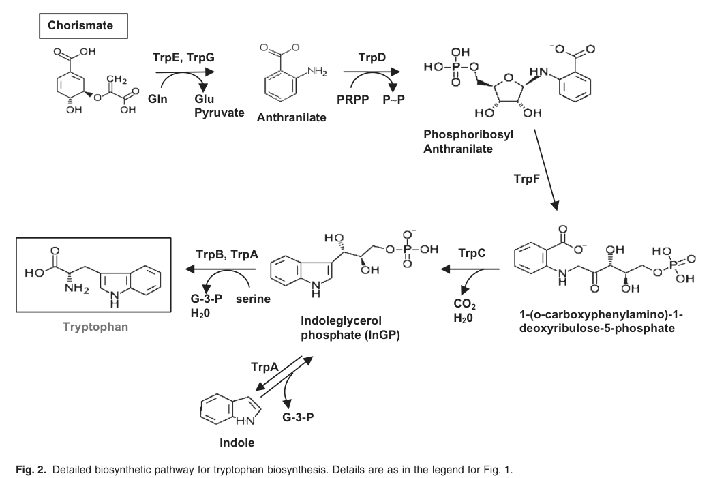

## Question

# Gene Research for Functional Annotation

## ⚠️ CRITICAL: Gene/Protein Identification Context

**BEFORE YOU BEGIN RESEARCH:** You MUST verify you are researching the CORRECT gene/protein. Gene symbols can be ambiguous, especially for less well-characterized genes from non-model organisms.

### Target Gene/Protein Identity (from UniProt):
- **UniProt Accession:** Q88QR6
- **Protein Description:** RecName: Full=Indole-3-glycerol phosphate synthase {ECO:0000255|HAMAP-Rule:MF_00134}; Short=IGPS {ECO:0000255|HAMAP-Rule:MF_00134}; EC=4.1.1.48 {ECO:0000255|HAMAP-Rule:MF_00134};
- **Gene Information:** Name=trpC {ECO:0000255|HAMAP-Rule:MF_00134}; OrderedLocusNames=PP_0422;
- **Organism (full):** Pseudomonas putida (strain ATCC 47054 / DSM 6125 / CFBP 8728 / NCIMB 11950 / KT2440).
- **Protein Family:** Belongs to the TrpC family. {ECO:0000255|HAMAP-
- **Key Domains:** Aldolase_TIM. (IPR013785); Indole-3-glycerol_P_synth. (IPR045186); Indole-3-glycerol_P_synth_dom. (IPR013798); Indole-3-GlycerolPSynthase_CS. (IPR001468); RibuloseP-bd_barrel. (IPR011060)

### MANDATORY VERIFICATION STEPS:

1. **Check if the gene symbol "trpC" matches the protein description above**
2. **Verify the organism is correct:** Pseudomonas putida (strain ATCC 47054 / DSM 6125 / CFBP 8728 / NCIMB 11950 / KT2440).
3. **Check if protein family/domains align with what you find in literature**
4. **If you find literature for a DIFFERENT gene with the same or similar symbol, STOP**

### If Gene Symbol is Ambiguous or You Cannot Find Relevant Literature:

**DO NOT PROCEED WITH RESEARCH ON A DIFFERENT GENE.** Instead:
- State clearly: "The gene symbol 'trpC' is ambiguous or literature is limited for this specific protein"
- Explain what you found (e.g., "Found extensive literature on a different gene with the same symbol in a different organism")
- Describe the protein based ONLY on the UniProt information provided above
- Suggest that the protein function can be inferred from domain/family information

### Research Target:

Please provide a comprehensive research report on the gene **trpC** (gene ID: trpC, UniProt: Q88QR6) in PSEPK.

The research report should be a detailed narrative explaining the function, biological processes, and localization of the gene product. Citations should be given for all claims.

You should prioritize authoritative reviews and primary scientific literature when conducting research. You can supplement
this with annotations you find in gene/protein databases, but these can be outdated or inaccurate.

We are specifically interested in the primary function of the gene - for enzymes, what reaction is catalyzed, and what is the substrate specificity? For transporters, what is the substrate? For structural proteins or adapters, what is the broader structural role? For signaling molecules, what is the role in the pathway.

We are interested in where in or outside the cell the gene product carries out its function.

We are also interested in the signaling or biochemical pathways in which the gene functions. We are less interested in broad pleiotropic effects, except where these elucidate the precise role.

Include evidence where possible. We are interested in both experimental evidence as well as inference from structure, evolution, or bioinformatic analysis. Precise studies should be prioritized over high-throughput, where available.

## Output

Question: You are an expert researcher providing comprehensive, well-cited information.

Provide detailed information focusing on:
1. Key concepts and definitions with current understanding
2. Recent developments and latest research (prioritize 2023-2024 sources)
3. Current applications and real-world implementations
4. Expert opinions and analysis from authoritative sources
5. Relevant statistics and data from recent studies

Format as a comprehensive research report with proper citations. Include URLs and publication dates where available.
Always prioritize recent, authoritative sources and provide specific citations for all major claims.

# Gene Research for Functional Annotation

## ⚠️ CRITICAL: Gene/Protein Identification Context

**BEFORE YOU BEGIN RESEARCH:** You MUST verify you are researching the CORRECT gene/protein. Gene symbols can be ambiguous, especially for less well-characterized genes from non-model organisms.

### Target Gene/Protein Identity (from UniProt):
- **UniProt Accession:** Q88QR6
- **Protein Description:** RecName: Full=Indole-3-glycerol phosphate synthase {ECO:0000255|HAMAP-Rule:MF_00134}; Short=IGPS {ECO:0000255|HAMAP-Rule:MF_00134}; EC=4.1.1.48 {ECO:0000255|HAMAP-Rule:MF_00134};
- **Gene Information:** Name=trpC {ECO:0000255|HAMAP-Rule:MF_00134}; OrderedLocusNames=PP_0422;
- **Organism (full):** Pseudomonas putida (strain ATCC 47054 / DSM 6125 / CFBP 8728 / NCIMB 11950 / KT2440).
- **Protein Family:** Belongs to the TrpC family. {ECO:0000255|HAMAP-
- **Key Domains:** Aldolase_TIM. (IPR013785); Indole-3-glycerol_P_synth. (IPR045186); Indole-3-glycerol_P_synth_dom. (IPR013798); Indole-3-GlycerolPSynthase_CS. (IPR001468); RibuloseP-bd_barrel. (IPR011060)

### MANDATORY VERIFICATION STEPS:

1. **Check if the gene symbol "trpC" matches the protein description above**
2. **Verify the organism is correct:** Pseudomonas putida (strain ATCC 47054 / DSM 6125 / CFBP 8728 / NCIMB 11950 / KT2440).
3. **Check if protein family/domains align with what you find in literature**
4. **If you find literature for a DIFFERENT gene with the same or similar symbol, STOP**

### If Gene Symbol is Ambiguous or You Cannot Find Relevant Literature:

**DO NOT PROCEED WITH RESEARCH ON A DIFFERENT GENE.** Instead:
- State clearly: "The gene symbol 'trpC' is ambiguous or literature is limited for this specific protein"
- Explain what you found (e.g., "Found extensive literature on a different gene with the same symbol in a different organism")
- Describe the protein based ONLY on the UniProt information provided above
- Suggest that the protein function can be inferred from domain/family information

### Research Target:

Please provide a comprehensive research report on the gene **trpC** (gene ID: trpC, UniProt: Q88QR6) in PSEPK.

The research report should be a detailed narrative explaining the function, biological processes, and localization of the gene product. Citations should be given for all claims.

You should prioritize authoritative reviews and primary scientific literature when conducting research. You can supplement
this with annotations you find in gene/protein databases, but these can be outdated or inaccurate.

We are specifically interested in the primary function of the gene - for enzymes, what reaction is catalyzed, and what is the substrate specificity? For transporters, what is the substrate? For structural proteins or adapters, what is the broader structural role? For signaling molecules, what is the role in the pathway.

We are interested in where in or outside the cell the gene product carries out its function.

We are also interested in the signaling or biochemical pathways in which the gene functions. We are less interested in broad pleiotropic effects, except where these elucidate the precise role.

Include evidence where possible. We are interested in both experimental evidence as well as inference from structure, evolution, or bioinformatic analysis. Precise studies should be prioritized over high-throughput, where available.

# Functional annotation research report: **trpC (PP_0422; UniProt Q88QR6)** in *Pseudomonas putida* KT2440

## 0) Scope and identity verification (critical disambiguation)

**Target identity (confirmed):** The gene symbol **trpC** in this report refers specifically to **PP_0422** from *Pseudomonas putida* strain **KT2440** (ATCC 47054 / DSM 6125 / etc.), annotated in UniProt as **indole-3-glycerol phosphate synthase (IGPS; EC 4.1.1.48)**. Multiple independent lines of KT2440-specific evidence support this assignment: PP_0422 lies in the **trpGDC** tryptophan-biosynthesis operon, shows high similarity to characterized **TrpC from *E. coli***, and **loss-of-function insertions in PP_0422 yield tryptophan auxotrophy**. (molinahenares2009functionalanalysisof pages 2-4, molinahenares2009functionalanalysisof pages 1-2)

**Why ambiguity matters:** “trpC” is a widely used bacterial symbol; some taxa have **fused or multifunctional proteins** combining TrpC with other activities, or gene fusions in related pathways. Therefore, all organism-specific conclusions below are restricted to **KT2440 PP_0422/Q88QR6**. (barona‐gomez2003occurrenceofa pages 1-2, molinahenares2009functionalanalysisof pages 2-4)

## 1) Key concepts and definitions (current understanding)

### 1.1 Canonical function of TrpC/IGPS
**Indole-3-glycerol phosphate synthase (IGPS; TrpC; EC 4.1.1.48)** catalyzes the indole-ring-forming step of microbial tryptophan biosynthesis by converting **1-(o-carboxyphenylamino)-1-deoxyribulose 5′-phosphate (CdRP)** into **indole-3-glycerol phosphate (IGP; also abbreviated InGP)**. (esposito2022indole‐3‐glycerolphosphatesynthase pages 1-3, molinahenares2009functionalanalysisof pages 4-6)

In *P. putida* KT2440, pathway mapping places **TrpC** downstream of **TrpD** (anthranilate phosphoribosyltransferase) and upstream of **TrpA/TrpB** (tryptophan synthase subunits), consistent with the standard chorismate→anthranilate→tryptophan route. (molinahenares2009functionalanalysisof pages 4-6, molinahenares2009functionalanalysisof media a5651e48)

### 1.2 Pathway context in KT2440
A KT2440 genetic and biochemical reconstruction supports a **single route** from chorismate to tryptophan, with the *trp* genes arranged in operons and single-gene transcription units characteristic of many bacteria. (molinahenares2009functionalanalysisof pages 1-2, molinahenares2009functionalanalysisof pages 4-6)

**Figure evidence:** the tryptophan pathway and *trp* gene organization in KT2440 (including **trpGDC** with **trpC/PP_0422**) are shown in extracted figures from Molina-Henares et al. (2009). (molinahenares2009functionalanalysisof media a5651e48, molinahenares2009functionalanalysisof media 77d9c78a)

## 2) Molecular function: reaction chemistry, substrate specificity, and mechanism

### 2.1 Reaction and substrate specificity
IGPS/TrpC is functionally defined by its specificity for the pathway intermediate **CdRP**, producing **IGP**. This is the enzyme’s core substrate/product relationship in bacteria. (esposito2022indole‐3‐glycerolphosphatesynthase pages 1-3)

In KT2440, TrpC is explicitly identified as **indoleglycerol phosphate synthase** within the reconstructed pathway and gene cluster, supporting that PP_0422 participates in this exact chemistry rather than a divergent TrpC-like function. (molinahenares2009functionalanalysisof pages 4-6, molinahenares2009functionalanalysisof pages 2-4)

### 2.2 Enzyme fold and catalytic mechanism (authoritative mechanistic synthesis)
A detailed minireview of bacterial IGPS (focused on *Mycobacterium tuberculosis* IGPS but comparing across homologs) describes IGPS as a **(β/α)8 TIM-barrel enzyme** (a classic aldolase/TIM-barrel scaffold). (esposito2022indole‐3‐glycerolphosphatesynthase pages 1-3, esposito2022indole‐3‐glycerolphosphatesynthase pages 4-6)

**Mechanistic consensus (3-step sequence):** cyclization to an intermediate, **irreversible decarboxylation**, and **dehydration** to yield IGP. (esposito2022indole‐3‐glycerolphosphatesynthase pages 3-4)

**Catalytic residue-level insights (from structural/kinetic studies of bacterial IGPS):** conserved Lys/Glu residues participate in proton transfers and dehydration; structural data identify phosphate-binding and indole-stabilizing interactions in the active site (e.g., H-bonding and π-cation interactions) as part of the conserved catalytic architecture. (esposito2022indole‐3‐glycerolphosphatesynthase pages 3-4, esposito2022indole‐3‐glycerolphosphatesynthase pages 4-6)

**Quantitative kinetic data (example bacterial IGPS, not KT2440-specific):** for MtIGPS, reported **KM values vary** substantially across studies (e.g., 55 μM vs. 500 μM vs. 1.13 mM) and a reported **kcat ≈ 0.16 s−1 (25 °C)**; pH dependence indicates apparent pKa values around ~6–6.8 for catalytic parameters. These figures illustrate that IGPS kinetics are sensitive to assay and substrate preparation, and should not be transferred quantitatively to KT2440 without direct measurement. (esposito2022indole‐3‐glycerolphosphatesynthase pages 3-4, esposito2022indole‐3‐glycerolphosphatesynthase pages 1-3)

## 3) KT2440-specific genomic context, regulation, and phenotype evidence

### 3.1 Operon context and transcriptional organization
In *P. putida* KT2440, **trpC = PP_0422** is within a compact operon **trpG–trpD–trpC (trpGDC)**, with very short intergenic distances (including a **6-nt overlap between trpD and trpC**) and **RT-PCR evidence** for cotranscription of trpGDC. (molinahenares2009functionalanalysisof pages 2-4, molinahenares2009functionalanalysisof pages 4-6)

This organization supports functional coupling with upstream tryptophan-branch reactions and is consistent with tight pathway control at the transcriptional/operon level. (molinahenares2009functionalanalysisof pages 4-6, molinahenares2009functionalanalysisof media 77d9c78a)

### 3.2 Loss-of-function phenotypes (auxotrophy)
A genome-wide mini-Tn5 screen in KT2440 identified **tryptophan auxotrophs** with insertions in multiple *trp* genes, including a **PP_0422 (trpC) insertion at the 32nd codon** leading to tryptophan requirement. This is direct genetic evidence that **PP_0422 is essential for endogenous tryptophan biosynthesis under the tested minimal conditions**. (molinahenares2009functionalanalysisof pages 1-2, molinahenares2009functionalanalysisof pages 2-4)

### 3.3 Conservation across Pseudomonas
Tryptophan-pathway enzymes in Pseudomonas were reported as **highly conserved** (71–97% identity range across species for pathway enzymes), supporting functional conservation of TrpC/IGPS across the genus and lending additional confidence to annotation transfer. (molinahenares2009functionalanalysisof pages 4-6)

## 4) Cellular localization

No direct experimental subcellular localization (e.g., fractionation, microscopy, localization tags) for KT2440 TrpC (PP_0422/Q88QR6) was found in the retrieved full-text evidence. (molinahenares2009functionalanalysisof pages 4-6, molinahenares2009functionalanalysisof pages 2-4)

Given its role in **central amino-acid biosynthesis** and the fact that bacterial tryptophan-biosynthesis enzymes are generally soluble metabolic enzymes, the most parsimonious functional inference is that TrpC acts in the **cytosol**; however, this remains an inference rather than a demonstrated localization for KT2440 in the currently retrieved literature. (molinahenares2009functionalanalysisof pages 4-6)

## 5) Current applications and real-world implementations

### 5.1 Metabolic engineering in *P. putida* KT2440: blocking TrpC to accumulate anthranilate
A practical, KT2440-specific application of trpC knowledge is pathway rerouting at the chorismate→anthranilate→tryptophan node.

Kuepper et al. (2015) engineered *P. putida* KT2440 for **anthranilate (o-aminobenzoate; oAB) production from glucose** by **deleting the trpDC operon**, explicitly described as encoding **TrpD (anthranilate phosphoribosyltransferase)** and **TrpC (IGPS)**. This deletion blocks anthranilate consumption toward tryptophan. (kuepper2015metabolicengineeringof pages 1-2)

**Quantitative outcome:** with additional pathway deregulation (feedback-insensitive **aroG** and modified **trpE/trpS** context as described), the best engineered strain achieved **1.54 ± 0.3 g/L (11.23 mM) anthranilate** in tryptophan-limited fed-batch culture. This is a direct, real-world strain-engineering use-case for trpC functional annotation in KT2440. (kuepper2015metabolicengineeringof pages 1-2)

## 6) Recent developments and latest research (prioritizing 2023–2024)

### 6.1 2024: Shikimate pathway rewiring in *P. putida* enables near-theoretical aromatic yields (context for tryptophan-branch control)
A 2024 preprint/report describes **reprogramming *P. putida* catabolism** to rely on the **shikimate pathway** (normally anabolic) as a primary route for growth-associated pyruvate supply (“shikimate pathway-dependent catabolism”, SDC). The study combined **metabolic modeling**, **rational engineering**, and **adaptive laboratory evolution (ALE)** with **biosensor-based selection**, achieving **~89% of the pathway’s maximum theoretical yield** for an aromatic product (4-hydroxybenzoate). (bruinsma2024shikimatepathwaydependentcatabolism pages 1-4, santos2024shikimatepathwaydependentcatabolism pages 1-5)

This work is not a direct study of trpC, but it is highly relevant to the tryptophan branch because it demonstrates that modern strategies can drive very high flux through chorismate/shikimate-derived nodes in *P. putida*. It also highlights design constraints: deleting certain chorismate-derived reactions (e.g., anthranilate synthase routes) is infeasible because it would create auxotrophies, underscoring the physiological coupling of aromatic product formation to essential metabolites like tryptophan. (bruinsma2024shikimatepathwaydependentcatabolism pages 4-6)

### 6.2 2023: Engineering strategies to manage anthranilate/tryptophan-branch byproducts (transferable principles)
A 2023 metabolic engineering study in *Corynebacterium glutamicum* optimized shikimate-derived production and explicitly addressed **anthranilate accumulation** (a tryptophan-branch metabolite) by **reducing anthranilate synthase activity via targeted mutagenesis** while avoiding tryptophan auxotrophy; the study achieved **661 mg/L (4 mM)** p-coumaric acid and demonstrated co-culture conversion to **31.2 mg/L** resveratrol. While not in *P. putida*, these results reflect current engineering practice at the aromatic branchpoint where trp genes (including trpC) are often manipulated to tune flux. (mutz2023microbialsynthesisof pages 1-2)

## 7) Expert opinions and analysis (authoritative sources)

### 7.1 IGPS as a structurally conserved TIM-barrel enzyme and potential target
A focused minireview (ChemBioChem, 2022) frames IGPS as a **highly conserved TIM-barrel enzyme**, summarizes evidence for its mechanism and structural determinants, and argues that bacterial IGPS can be a **useful antibacterial target** because some pathogens rely on tryptophan biosynthesis during host immune pressure and because the enzyme lacks a human homolog. Although discussed in a tuberculosis context, these points represent authoritative expert synthesis of IGPS enzymology and structure–function relationships. (esposito2022indole‐3‐glycerolphosphatesynthase pages 1-3)

### 7.2 Genome-context + mutant phenotypes as strong functional evidence in KT2440
Molina-Henares et al. (2009) provide a KT2440-specific, experimentally grounded approach to functional annotation that combines **operon mapping (RT-PCR)**, **mutant phenotypes**, and pathway logic. This type of evidence is particularly strong for essential metabolic enzymes like TrpC even when purified-enzyme kinetics for the exact strain are not available. (molinahenares2009functionalanalysisof pages 2-4, molinahenares2009functionalanalysisof pages 1-2)

## 8) Evidence map (compact summary)

| Feature | Key finding | Best citation IDs to support it | Source (author/year/doi URL) |
|---|---|---|---|
| Enzyme name | **trpC / PP_0422 / UniProt Q88QR6** in *Pseudomonas putida* KT2440 is assigned as **indole-3-glycerol phosphate synthase (IGPS)** based on sequence similarity to *E. coli* TrpC and placement in the tryptophan biosynthesis locus. | (molinahenares2009functionalanalysisof pages 2-4) | Molina-Henares et al., 2009, *Microbial Biotechnology*, https://doi.org/10.1111/j.1751-7915.2008.00062.x |
| EC number | The gene product corresponds to **EC 4.1.1.48**, the canonical IGPS carboxy-lyase in tryptophan biosynthesis. This matches the functional assignment used in comparative and pathway literature. | (esposito2022indole‐3‐glycerolphosphatesynthase pages 3-4, barona‐gomez2003occurrenceofa pages 1-2) | Esposito et al., 2022, *ChemBioChem*, https://doi.org/10.1002/cbic.202100314; Barona-Gómez & Hodgson, 2003, *EMBO Reports*, https://doi.org/10.1038/sj.embor.embor771 |
| Reaction | IGPS catalyzes conversion of **1-(o-carboxyphenylamino)-1-deoxyribulose-5-phosphate (CdRP)** to **indole-3-glycerol phosphate (IGP/InGP)**, the indole-ring-forming step of the pathway. | (esposito2022indole‐3‐glycerolphosphatesynthase pages 3-4, esposito2022indole‐3‐glycerolphosphatesynthase pages 1-3) | Esposito et al., 2022, *ChemBioChem*, https://doi.org/10.1002/cbic.202100314 |
| Substrate/product | The substrate is **CdRP** and the product is **IGP/InGP**; in the KT2440 pathway map, TrpC is explicitly positioned at the step producing indoleglycerol phosphate from the upstream anthranilate-derived intermediate. | (molinahenares2009functionalanalysisof pages 4-6, esposito2022indole‐3‐glycerolphosphatesynthase pages 1-3) | Molina-Henares et al., 2009, https://doi.org/10.1111/j.1751-7915.2008.00062.x; Esposito et al., 2022, https://doi.org/10.1002/cbic.202100314 |
| Pathway step | TrpC functions in the **tryptophan biosynthetic pathway downstream of TrpD and upstream of TrpA/TrpB**, converting the anthranilate branch intermediate into IGP before terminal tryptophan synthase steps. | (molinahenares2009functionalanalysisof pages 4-6, molinahenares2009functionalanalysisof media a5651e48) | Molina-Henares et al., 2009, *Microbial Biotechnology*, https://doi.org/10.1111/j.1751-7915.2008.00062.x |
| Operon context | In KT2440, **trpC is part of the trpGDC operon**; RT-PCR showed cotranscription of **trpG-trpD-trpC**, and **trpD overlaps trpC by 6 nt**, indicating tight transcriptional/functional coupling. | (molinahenares2009functionalanalysisof pages 2-4, molinahenares2009functionalanalysisof pages 4-6) | Molina-Henares et al., 2009, *Microbial Biotechnology*, https://doi.org/10.1111/j.1751-7915.2008.00062.x |
| Evidence type | Functional annotation is supported by **genome context, RT-PCR operon mapping, sequence similarity, pathway reconstruction, and mutant phenotype analysis** rather than direct biochemical characterization of the purified KT2440 enzyme. | (molinahenares2009functionalanalysisof pages 2-4, molinahenares2009functionalanalysisof pages 7-8) | Molina-Henares et al., 2009, *Microbial Biotechnology*, https://doi.org/10.1111/j.1751-7915.2008.00062.x |
| Phenotype | **Loss of trpC causes tryptophan auxotrophy** in KT2440: a mini-Tn5 insertion in **PP_0422** yielded an auxotrophic mutant in the aromatic-pathway screen. | (molinahenares2009functionalanalysisof pages 1-2) | Molina-Henares et al., 2009, *Microbial Biotechnology*, https://doi.org/10.1111/j.1751-7915.2008.00062.x |
| Applications / metabolic engineering | **Deleting trpDC (including trpC)** in KT2440 was used to block anthranilate consumption and redirect flux for product formation; the best engineered strain produced **1.54 ± 0.3 g/L (11.23 mM) anthranilate** in tryptophan-limited fed-batch culture. | (kuepper2015metabolicengineeringof pages 1-2) | Kuepper et al., 2015, *Frontiers in Microbiology*, https://doi.org/10.3389/fmicb.2015.01310 |
| Structure / domains | TrpC/IGPS is a **(β/α)8 TIM-barrel enzyme** with a conserved catalytic architecture. The UniProt/domain assignment for Q88QR6 is consistent with this family-level structural model, although no KT2440-specific structure was identified here. | (esposito2022indole‐3‐glycerolphosphatesynthase pages 3-4, esposito2022indole‐3‐glycerolphosphatesynthase pages 4-6, kursula2003crystallographicstudieson pages 28-30) | Esposito et al., 2022, *ChemBioChem*, https://doi.org/10.1002/cbic.202100314; Kursula, 2003 |
| Localization | No direct KT2440 localization experiment was found in the retrieved evidence. Given its role in central amino-acid biosynthesis and lack of membrane/export features in the discussed sources, TrpC is best inferred to function in the **cytosol**. | (molinahenares2009functionalanalysisof pages 4-6, molinahenares2009functionalanalysisof pages 2-4) | Molina-Henares et al., 2009, *Microbial Biotechnology*, https://doi.org/10.1111/j.1751-7915.2008.00062.x |
| Recent 2023–2024 relevance | Recent work did not directly recharacterize KT2440 TrpC, but **2024 shikimate-pathway rewiring in *P. putida*** showed that flux through chorismate-derived aromatics can reach **89% of theoretical yield**, highlighting the modern engineering context in which trpC-associated branch control remains important. | (santos2024shikimatepathwaydependentcatabolism pages 1-5, bruinsma2024shikimatepathwaydependentcatabolism pages 1-4) | dos Santos et al., 2024, https://doi.org/10.21203/rs.3.rs-4761679/v1; Bruinsma et al., 2024, *bioRxiv*, https://doi.org/10.1101/2024.07.06.602327 |

*Table: This table summarizes the experimentally supported functional annotation of *Pseudomonas putida* KT2440 trpC (PP_0422; UniProt Q88QR6), including pathway role, operon context, phenotype, structural inference, and engineering relevance. It is useful as a compact evidence map for gene-function annotation.*

## 9) Limitations and open gaps for KT2440 PP_0422/Q88QR6

* **Direct biochemical characterization of KT2440 TrpC** (KM/kcat, substrate analog specificity, inhibition) was not located in the retrieved texts; mechanistic/kinetic details cited here derive from other bacterial IGPS homologs and should be treated as **family-level inference** rather than KT2440-specific parameters. (esposito2022indole‐3‐glycerolphosphatesynthase pages 3-4, esposito2022indole‐3‐glycerolphosphatesynthase pages 1-3)
* **Experimental cellular localization** for KT2440 TrpC was not found; cytosolic localization is inferred from pathway role and typical bacterial metabolism, but not demonstrated here. (molinahenares2009functionalanalysisof pages 4-6)

## Key sources (with URLs and publication dates)

1. Molina-Henares MA et al. **Functional analysis of aromatic biosynthetic pathways in *Pseudomonas putida* KT2440**. *Microbial Biotechnology*. **Dec 2009**. https://doi.org/10.1111/j.1751-7915.2008.00062.x (molinahenares2009functionalanalysisof pages 2-4, molinahenares2009functionalanalysisof media a5651e48)
2. Kuepper J et al. **Metabolic Engineering of *Pseudomonas putida* KT2440 to Produce Anthranilate from Glucose**. *Frontiers in Microbiology*. **Nov 2015**. https://doi.org/10.3389/fmicb.2015.01310 (kuepper2015metabolicengineeringof pages 1-2)
3. Esposito N et al. **Indole-3-Glycerol Phosphate Synthase from *Mycobacterium tuberculosis*: A Potential New Drug Target**. *ChemBioChem*. **Sep 2022**. https://doi.org/10.1002/cbic.202100314 (esposito2022indole‐3‐glycerolphosphatesynthase pages 1-3, esposito2022indole‐3‐glycerolphosphatesynthase pages 3-4)
4. Bruinsma L et al. **Shikimate pathway-Dependent Catabolism: enabling near-to-maximum production yield of aromatics**. *bioRxiv* preprint. **Jul 2024**. https://doi.org/10.1101/2024.07.06.602327 (bruinsma2024shikimatepathwaydependentcatabolism pages 1-4, bruinsma2024shikimatepathwaydependentcatabolism pages 4-6)
5. dos Santos VMPM et al. **Shikimate pathway-Dependent Catabolism: enabling near-to-maximum production yield of aromatics**. (preprint/posted version). **Aug 2024**. https://doi.org/10.21203/rs.3.rs-4761679/v1 (santos2024shikimatepathwaydependentcatabolism pages 1-5)
6. Mutz M et al. **Microbial synthesis of the plant natural product precursor p-coumaric acid with *Corynebacterium glutamicum***. *Microbial Cell Factories*. **Oct 2023**. https://doi.org/10.1186/s12934-023-02222-y (mutz2023microbialsynthesisof pages 1-2)

References

1. (molinahenares2009functionalanalysisof pages 2-4): M. A. Molina-Henares, Adela García‐Salamanca, A. Molina-Henares, J. de la Torre, M. C. Herrera, J. Ramos, and E. Duque. Functional analysis of aromatic biosynthetic pathways in pseudomonas putida kt2440. Microbial biotechnology, 2:91-100, Dec 2009. URL: https://doi.org/10.1111/j.1751-7915.2008.00062.x, doi:10.1111/j.1751-7915.2008.00062.x. This article has 32 citations and is from a peer-reviewed journal.

2. (molinahenares2009functionalanalysisof pages 1-2): M. A. Molina-Henares, Adela García‐Salamanca, A. Molina-Henares, J. de la Torre, M. C. Herrera, J. Ramos, and E. Duque. Functional analysis of aromatic biosynthetic pathways in pseudomonas putida kt2440. Microbial biotechnology, 2:91-100, Dec 2009. URL: https://doi.org/10.1111/j.1751-7915.2008.00062.x, doi:10.1111/j.1751-7915.2008.00062.x. This article has 32 citations and is from a peer-reviewed journal.

3. (barona‐gomez2003occurrenceofa pages 1-2): Francisco Barona‐Gómez and David A Hodgson. Occurrence of a putative ancient‐like isomerase involved in histidine and tryptophan biosynthesis. EMBO reports, 4:296-300, Mar 2003. URL: https://doi.org/10.1038/sj.embor.embor771, doi:10.1038/sj.embor.embor771. This article has 119 citations and is from a highest quality peer-reviewed journal.

4. (esposito2022indole‐3‐glycerolphosphatesynthase pages 1-3): Nikolas Esposito, David W. Konas, and Nina M. Goodey. Indole‐3‐glycerol phosphate synthase from <i>mycobacterium tuberculosis</i>: a potential new drug target. Sep 2022. URL: https://doi.org/10.1002/cbic.202100314, doi:10.1002/cbic.202100314. This article has 5 citations and is from a peer-reviewed journal.

5. (molinahenares2009functionalanalysisof pages 4-6): M. A. Molina-Henares, Adela García‐Salamanca, A. Molina-Henares, J. de la Torre, M. C. Herrera, J. Ramos, and E. Duque. Functional analysis of aromatic biosynthetic pathways in pseudomonas putida kt2440. Microbial biotechnology, 2:91-100, Dec 2009. URL: https://doi.org/10.1111/j.1751-7915.2008.00062.x, doi:10.1111/j.1751-7915.2008.00062.x. This article has 32 citations and is from a peer-reviewed journal.

6. (molinahenares2009functionalanalysisof media a5651e48): M. A. Molina-Henares, Adela García‐Salamanca, A. Molina-Henares, J. de la Torre, M. C. Herrera, J. Ramos, and E. Duque. Functional analysis of aromatic biosynthetic pathways in pseudomonas putida kt2440. Microbial biotechnology, 2:91-100, Dec 2009. URL: https://doi.org/10.1111/j.1751-7915.2008.00062.x, doi:10.1111/j.1751-7915.2008.00062.x. This article has 32 citations and is from a peer-reviewed journal.

7. (molinahenares2009functionalanalysisof media 77d9c78a): M. A. Molina-Henares, Adela García‐Salamanca, A. Molina-Henares, J. de la Torre, M. C. Herrera, J. Ramos, and E. Duque. Functional analysis of aromatic biosynthetic pathways in pseudomonas putida kt2440. Microbial biotechnology, 2:91-100, Dec 2009. URL: https://doi.org/10.1111/j.1751-7915.2008.00062.x, doi:10.1111/j.1751-7915.2008.00062.x. This article has 32 citations and is from a peer-reviewed journal.

8. (esposito2022indole‐3‐glycerolphosphatesynthase pages 4-6): Nikolas Esposito, David W. Konas, and Nina M. Goodey. Indole‐3‐glycerol phosphate synthase from <i>mycobacterium tuberculosis</i>: a potential new drug target. Sep 2022. URL: https://doi.org/10.1002/cbic.202100314, doi:10.1002/cbic.202100314. This article has 5 citations and is from a peer-reviewed journal.

9. (esposito2022indole‐3‐glycerolphosphatesynthase pages 3-4): Nikolas Esposito, David W. Konas, and Nina M. Goodey. Indole‐3‐glycerol phosphate synthase from <i>mycobacterium tuberculosis</i>: a potential new drug target. Sep 2022. URL: https://doi.org/10.1002/cbic.202100314, doi:10.1002/cbic.202100314. This article has 5 citations and is from a peer-reviewed journal.

10. (kuepper2015metabolicengineeringof pages 1-2): Jannis Kuepper, Jasmin Dickler, Michael Biggel, Swantje Behnken, Gernot Jäger, Nick Wierckx, and Lars M. Blank. Metabolic engineering of pseudomonas putida kt2440 to produce anthranilate from glucose. Frontiers in Microbiology, Nov 2015. URL: https://doi.org/10.3389/fmicb.2015.01310, doi:10.3389/fmicb.2015.01310. This article has 66 citations and is from a peer-reviewed journal.

11. (bruinsma2024shikimatepathwaydependentcatabolism pages 1-4): Lyon Bruinsma, Christos Batianis, Sara Moreno Paz, Kesi Kurnia, Job. J Dirkmaat, Alexandra Müller, Jose Juncosa Nunez, Ruud A. Weusthuis, and Vitor A. P. Martins dos Santos. Shikimate pathway-dependent catabolism: enabling near-to-maximum production yield of aromatics. BioRxiv, Jul 2024. URL: https://doi.org/10.1101/2024.07.06.602327, doi:10.1101/2024.07.06.602327. This article has 0 citations.

12. (santos2024shikimatepathwaydependentcatabolism pages 1-5): Vitor Martins dos Santos, Lyon Bruinsma, Christos Batianis, Sara Moreno-Paz, Kesi Kurnia, Job Dirkmaat, Alexandra Müller, Jose Juncosa Nuñez, and Ruud Weusthuis. Shikimate pathway-dependent catabolism: enabling near-to-maximum production yield of aromatics. Unknown journal, Aug 2024. URL: https://doi.org/10.21203/rs.3.rs-4761679/v1, doi:10.21203/rs.3.rs-4761679/v1.

13. (bruinsma2024shikimatepathwaydependentcatabolism pages 4-6): Lyon Bruinsma, Christos Batianis, Sara Moreno Paz, Kesi Kurnia, Job. J Dirkmaat, Alexandra Müller, Jose Juncosa Nunez, Ruud A. Weusthuis, and Vitor A. P. Martins dos Santos. Shikimate pathway-dependent catabolism: enabling near-to-maximum production yield of aromatics. BioRxiv, Jul 2024. URL: https://doi.org/10.1101/2024.07.06.602327, doi:10.1101/2024.07.06.602327. This article has 0 citations.

14. (mutz2023microbialsynthesisof pages 1-2): Mario Mutz, Dominic Kösters, Benedikt Wynands, Nick Wierckx, and Jan Marienhagen. Microbial synthesis of the plant natural product precursor p-coumaric acid with corynebacterium glutamicum. Microbial Cell Factories, Oct 2023. URL: https://doi.org/10.1186/s12934-023-02222-y, doi:10.1186/s12934-023-02222-y. This article has 24 citations and is from a peer-reviewed journal.

15. (molinahenares2009functionalanalysisof pages 7-8): M. A. Molina-Henares, Adela García‐Salamanca, A. Molina-Henares, J. de la Torre, M. C. Herrera, J. Ramos, and E. Duque. Functional analysis of aromatic biosynthetic pathways in pseudomonas putida kt2440. Microbial biotechnology, 2:91-100, Dec 2009. URL: https://doi.org/10.1111/j.1751-7915.2008.00062.x, doi:10.1111/j.1751-7915.2008.00062.x. This article has 32 citations and is from a peer-reviewed journal.

16. (kursula2003crystallographicstudieson pages 28-30): I Kursula. Crystallographic studies on the structure-function relationships in triosephosphate isomerase. Unknown journal, 2003.

## Artifacts

- [Edison artifact artifact-00](trpC-deep-research-falcon_artifacts/artifact-00.md)

## Citations

1. molinahenares2009functionalanalysisof pages 4-6
2. kuepper2015metabolicengineeringof pages 1-2
3. bruinsma2024shikimatepathwaydependentcatabolism pages 4-6
4. mutz2023microbialsynthesisof pages 1-2
5. molinahenares2009functionalanalysisof pages 2-4
6. molinahenares2009functionalanalysisof pages 1-2
7. santos2024shikimatepathwaydependentcatabolism pages 1-5
8. bruinsma2024shikimatepathwaydependentcatabolism pages 1-4
9. molinahenares2009functionalanalysisof pages 7-8
10. kursula2003crystallographicstudieson pages 28-30
11. https://doi.org/10.1111/j.1751-7915.2008.00062.x
12. https://doi.org/10.1002/cbic.202100314;
13. https://doi.org/10.1038/sj.embor.embor771
14. https://doi.org/10.1002/cbic.202100314
15. https://doi.org/10.1111/j.1751-7915.2008.00062.x;
16. https://doi.org/10.3389/fmicb.2015.01310
17. https://doi.org/10.21203/rs.3.rs-4761679/v1;
18. https://doi.org/10.1101/2024.07.06.602327
19. https://doi.org/10.21203/rs.3.rs-4761679/v1
20. https://doi.org/10.1186/s12934-023-02222-y
21. https://doi.org/10.1111/j.1751-7915.2008.00062.x,
22. https://doi.org/10.1038/sj.embor.embor771,
23. https://doi.org/10.1002/cbic.202100314,
24. https://doi.org/10.3389/fmicb.2015.01310,
25. https://doi.org/10.1101/2024.07.06.602327,
26. https://doi.org/10.21203/rs.3.rs-4761679/v1,
27. https://doi.org/10.1186/s12934-023-02222-y,