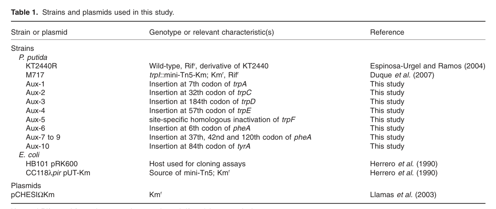

## Question

# Gene Research for Functional Annotation

## ⚠️ CRITICAL: Gene/Protein Identification Context

**BEFORE YOU BEGIN RESEARCH:** You MUST verify you are researching the CORRECT gene/protein. Gene symbols can be ambiguous, especially for less well-characterized genes from non-model organisms.

### Target Gene/Protein Identity (from UniProt):
- **UniProt Accession:** Q88QR7
- **Protein Description:** RecName: Full=Anthranilate phosphoribosyltransferase {ECO:0000255|HAMAP-Rule:MF_00211}; EC=2.4.2.18 {ECO:0000255|HAMAP-Rule:MF_00211};
- **Gene Information:** Name=trpD {ECO:0000255|HAMAP-Rule:MF_00211}; OrderedLocusNames=PP_0421;
- **Organism (full):** Pseudomonas putida (strain ATCC 47054 / DSM 6125 / CFBP 8728 / NCIMB 11950 / KT2440).
- **Protein Family:** Belongs to the anthranilate phosphoribosyltransferase
- **Key Domains:** Anthranilate_Pribosyl_Tfrase. (IPR005940); Glycosyl_Trfase_fam3. (IPR000312); Glycosyl_Trfase_fam3_N_dom. (IPR017459); Glycosyl_Trfase_fam3_N_dom_sf. (IPR036320); Nuc_phospho_transferase. (IPR035902)

### MANDATORY VERIFICATION STEPS:

1. **Check if the gene symbol "trpD" matches the protein description above**
2. **Verify the organism is correct:** Pseudomonas putida (strain ATCC 47054 / DSM 6125 / CFBP 8728 / NCIMB 11950 / KT2440).
3. **Check if protein family/domains align with what you find in literature**
4. **If you find literature for a DIFFERENT gene with the same or similar symbol, STOP**

### If Gene Symbol is Ambiguous or You Cannot Find Relevant Literature:

**DO NOT PROCEED WITH RESEARCH ON A DIFFERENT GENE.** Instead:
- State clearly: "The gene symbol 'trpD' is ambiguous or literature is limited for this specific protein"
- Explain what you found (e.g., "Found extensive literature on a different gene with the same symbol in a different organism")
- Describe the protein based ONLY on the UniProt information provided above
- Suggest that the protein function can be inferred from domain/family information

### Research Target:

Please provide a comprehensive research report on the gene **trpD** (gene ID: trpD, UniProt: Q88QR7) in PSEPK.

The research report should be a detailed narrative explaining the function, biological processes, and localization of the gene product. Citations should be given for all claims.

You should prioritize authoritative reviews and primary scientific literature when conducting research. You can supplement
this with annotations you find in gene/protein databases, but these can be outdated or inaccurate.

We are specifically interested in the primary function of the gene - for enzymes, what reaction is catalyzed, and what is the substrate specificity? For transporters, what is the substrate? For structural proteins or adapters, what is the broader structural role? For signaling molecules, what is the role in the pathway.

We are interested in where in or outside the cell the gene product carries out its function.

We are also interested in the signaling or biochemical pathways in which the gene functions. We are less interested in broad pleiotropic effects, except where these elucidate the precise role.

Include evidence where possible. We are interested in both experimental evidence as well as inference from structure, evolution, or bioinformatic analysis. Precise studies should be prioritized over high-throughput, where available.

## Output

Question: You are an expert researcher providing comprehensive, well-cited information.

Provide detailed information focusing on:
1. Key concepts and definitions with current understanding
2. Recent developments and latest research (prioritize 2023-2024 sources)
3. Current applications and real-world implementations
4. Expert opinions and analysis from authoritative sources
5. Relevant statistics and data from recent studies

Format as a comprehensive research report with proper citations. Include URLs and publication dates where available.
Always prioritize recent, authoritative sources and provide specific citations for all major claims.

# Gene Research for Functional Annotation

## ⚠️ CRITICAL: Gene/Protein Identification Context

**BEFORE YOU BEGIN RESEARCH:** You MUST verify you are researching the CORRECT gene/protein. Gene symbols can be ambiguous, especially for less well-characterized genes from non-model organisms.

### Target Gene/Protein Identity (from UniProt):
- **UniProt Accession:** Q88QR7
- **Protein Description:** RecName: Full=Anthranilate phosphoribosyltransferase {ECO:0000255|HAMAP-Rule:MF_00211}; EC=2.4.2.18 {ECO:0000255|HAMAP-Rule:MF_00211};
- **Gene Information:** Name=trpD {ECO:0000255|HAMAP-Rule:MF_00211}; OrderedLocusNames=PP_0421;
- **Organism (full):** Pseudomonas putida (strain ATCC 47054 / DSM 6125 / CFBP 8728 / NCIMB 11950 / KT2440).
- **Protein Family:** Belongs to the anthranilate phosphoribosyltransferase
- **Key Domains:** Anthranilate_Pribosyl_Tfrase. (IPR005940); Glycosyl_Trfase_fam3. (IPR000312); Glycosyl_Trfase_fam3_N_dom. (IPR017459); Glycosyl_Trfase_fam3_N_dom_sf. (IPR036320); Nuc_phospho_transferase. (IPR035902)

### MANDATORY VERIFICATION STEPS:

1. **Check if the gene symbol "trpD" matches the protein description above**
2. **Verify the organism is correct:** Pseudomonas putida (strain ATCC 47054 / DSM 6125 / CFBP 8728 / NCIMB 11950 / KT2440).
3. **Check if protein family/domains align with what you find in literature**
4. **If you find literature for a DIFFERENT gene with the same or similar symbol, STOP**

### If Gene Symbol is Ambiguous or You Cannot Find Relevant Literature:

**DO NOT PROCEED WITH RESEARCH ON A DIFFERENT GENE.** Instead:
- State clearly: "The gene symbol 'trpD' is ambiguous or literature is limited for this specific protein"
- Explain what you found (e.g., "Found extensive literature on a different gene with the same symbol in a different organism")
- Describe the protein based ONLY on the UniProt information provided above
- Suggest that the protein function can be inferred from domain/family information

### Research Target:

Please provide a comprehensive research report on the gene **trpD** (gene ID: trpD, UniProt: Q88QR7) in PSEPK.

The research report should be a detailed narrative explaining the function, biological processes, and localization of the gene product. Citations should be given for all claims.

You should prioritize authoritative reviews and primary scientific literature when conducting research. You can supplement
this with annotations you find in gene/protein databases, but these can be outdated or inaccurate.

We are specifically interested in the primary function of the gene - for enzymes, what reaction is catalyzed, and what is the substrate specificity? For transporters, what is the substrate? For structural proteins or adapters, what is the broader structural role? For signaling molecules, what is the role in the pathway.

We are interested in where in or outside the cell the gene product carries out its function.

We are also interested in the signaling or biochemical pathways in which the gene functions. We are less interested in broad pleiotropic effects, except where these elucidate the precise role.

Include evidence where possible. We are interested in both experimental evidence as well as inference from structure, evolution, or bioinformatic analysis. Precise studies should be prioritized over high-throughput, where available.

## Comprehensive research report: **trpD (UniProt Q88QR7; locus PP_0421)** in *Pseudomonas putida* KT2440

### 0) Executive summary (identity verified)
The target protein **TrpD** in *Pseudomonas putida* KT2440 (UniProt **Q88QR7**, ordered locus **PP_0421**) is **anthranilate phosphoribosyltransferase** (EC **2.4.2.18**), a cytosolic PRPP-dependent phosphoribosyltransferase in the **tryptophan de novo biosynthesis** pathway. In KT2440, **trpD is genetically and transcriptionally linked to trpG and trpC** in a **trpGDC operon**, and loss-of-function causes **tryptophan auxotrophy** that can be rescued by pathway end products/intermediates (L-tryptophan; indole), consistent with the canonical pathway position. (molinahenares2009functionalanalysisof pages 2-4, molinahenares2009functionalanalysisof pages 4-6, molina‐henares2010identificationofconditionally pages 6-7)

---

### 1) Key concepts and definitions (current understanding)

#### 1.1 Definition of TrpD activity and reaction
**Anthranilate phosphoribosyltransferase (TrpD; EC 2.4.2.18)** catalyzes transfer of a phosphoribosyl group from **PRPP (5-phospho-α-D-ribose-1-diphosphate)** to **anthranilate**, yielding **N-(5-phospho-β-D-ribosyl)-anthranilate (PRA)** and **pyrophosphate (PPi)**. (hovejensen2017phosphoribosyldiphosphate(prpp) pages 50-52, parthasarathy2018athreeringcircus pages 6-8)

This step is an early committed reaction in the **tryptophan biosynthesis** route from chorismate: anthranilate is produced by TrpE/TrpG (anthranilate synthase components), and TrpD converts anthranilate into the ribosylated intermediate that proceeds through subsequent transformations toward the indole ring and ultimately tryptophan. (hovejensen2017phosphoribosyldiphosphate(prpp) pages 50-52, parthasarathy2018athreeringcircus pages 6-8)

#### 1.2 Enzyme family, structural features, and mechanism (inference framework)
A widely cited enzymology review of PRPP-dependent enzymes describes TrpD enzymes as typically **homodimeric** proteins with a **two-domain architecture** (N-terminal helical domain and larger C-terminal α/β domain) that creates an active-site cleft for binding PRPP and anthranilate. **Divalent cations** (Mg2+ or Mn2+) promote PRPP binding, and conserved motifs (including a glycine-rich region involved in phosphate binding) are characteristic. Structural studies in bacteria have supported a model involving **substrate capture** and movement of anthranilate through **multiple binding sites**/a channel toward the catalytic configuration that enables nucleophilic attack on PRPP. (hovejensen2017phosphoribosyldiphosphate(prpp) pages 50-52, parthasarathy2018athreeringcircus pages 6-8, hovejensen2017phosphoribosyldiphosphate(prpp) pages 78-78)

These mechanistic and fold-level features are not specific measurements on *P. putida* KT2440 TrpD in the retrieved documents, but they represent the authoritative current understanding used to support functional inference from homology for bacterial TrpD-family members (such as Q88QR7). (hovejensen2017phosphoribosyldiphosphate(prpp) pages 50-52, parthasarathy2018athreeringcircus pages 6-8)

---

### 2) Target-gene verification and *P. putida* KT2440-specific functional evidence

#### 2.1 Correct gene/protein mapping: PP_0421 = trpD = anthranilate phosphoribosyltransferase
A functional genetics study of aromatic amino-acid biosynthesis in *P. putida* KT2440 identifies **PP_0421 as trpD**, encoding **anthranilate phosphoribosyltransferase**, and reports a tryptophan-auxotrophic transposon mutant (**Aux-3**) with a mini-Tn5 insertion at the **184th codon** of **PP_0421/trpD**, linking disruption of PP_0421 to tryptophan auxotrophy. (molinahenares2009functionalanalysisof pages 2-4, molinahenares2009functionalanalysisof pages 1-2)

This directly matches the UniProt identity provided by the user (Q88QR7; PP_0421; “Anthranilate phosphoribosyltransferase”). (molinahenares2009functionalanalysisof pages 2-4)

#### 2.2 Operon/transcriptional organization in KT2440
In KT2440, **trpD is embedded in a trpG–trpD–trpC transcriptional unit (trpGDC operon)**. RT-PCR evidence supports co-transcription across the **trpG–trpD–trpC** boundaries; the genomic spacing/overlap also supports operon logic (trpG–trpD separated by **9 nt**; trpD and trpC overlapping by **6 nt**). The same study reports that **trpE** is transcribed as a **monocistronic unit** distinct from trpGDC. (molinahenares2009functionalanalysisof pages 2-4, molinahenares2009functionalanalysisof pages 4-6, molinahenares2009functionalanalysisof pages 7-8)

Visual evidence for this gene organization and transcriptional-unit mapping is provided in the extracted Table/Figure crops. (molinahenares2009functionalanalysisof media 8eee5d0d, molinahenares2009functionalanalysisof media f71ebd0e)

#### 2.3 Phenotype and pathway placement in KT2440
KT2440 trpD mutants are **unable to grow on minimal medium** and can be rescued by supplementation. In pathway-intermediate feeding experiments, the **trpD mutant grows with tryptophan and indole**, consistent with TrpD operating upstream of indole and tryptophan formation (i.e., loss blocks endogenous synthesis but can be bypassed by supplying downstream metabolites). (molinahenares2009functionalanalysisof pages 4-6)

In an independent genome-wide mutant library study focused on growth on minimal medium, a **trpD mutant is auxotrophic on M9** and growth is restored by **L-tryptophan** (while D-tryptophan does not rescue), reinforcing that trpD is required for endogenous tryptophan biosynthesis under minimal conditions. (molina‐henares2010identificationofconditionally pages 6-7)

#### 2.4 Regulation and cellular localization (what is known vs. not found here)
The KT2440 gene organization places tryptophan biosynthesis genes in multiple genomic regions. A regulatory gene **trpI** is described as divergently transcribed relative to **trpAB** and annotated as encoding a **repressor**, indicating local transcriptional regulation at the trpAB locus that is physically separated from trpGDC. (molinahenares2009functionalanalysisof pages 2-4, molinahenares2009functionalanalysisof pages 4-6)

No direct, KT2440-specific experimental evidence for **subcellular localization** of TrpD (e.g., fractionation, microscopy) was identified in the retrieved texts. Given its biosynthetic role and the general bacterial paradigm for amino-acid biosynthesis enzymes, the most parsimonious functional localization is **intracellular (cytosolic)**, but this report flags that as inference rather than a demonstrated localization in the cited KT2440 sources. (molinahenares2009functionalanalysisof pages 2-4, hovejensen2017phosphoribosyldiphosphate(prpp) pages 50-52)

---

### 3) Pathways and biological processes

#### 3.1 Tryptophan biosynthesis context
In bacteria, tryptophan is biosynthesized from **chorismate** through anthranilate and downstream intermediates; TrpD catalyzes the PRPP-dependent conversion of anthranilate to PRA, positioning it as a key node linking **shikimate/chorismate-derived aromatic metabolism** to the **indole/tryptophan branch**. (hovejensen2017phosphoribosyldiphosphate(prpp) pages 50-52, parthasarathy2018athreeringcircus pages 6-8)

For *P. putida* KT2440, genetic mapping and rescue phenotypes place trpD squarely in this canonical route, consistent with the conserved trp gene clusters described for pseudomonads. (molinahenares2009functionalanalysisof pages 4-6, molinahenares2009functionalanalysisof pages 7-8)

#### 3.2 Crosstalk with PRPP metabolism (expert-level interpretation)
Because TrpD consumes **PRPP**, its effective capacity depends on PRPP supply, which is also demanded by many other phosphoribosyltransferases in nucleotide and amino-acid biosynthesis. A comprehensive PRPP review emphasizes PRPP as a widely shared substrate and discusses structural/mechanistic diversity among PRPP-utilizing enzymes, framing TrpD as one member of a broader PRPP-dependent metabolic network. From a systems viewpoint, TrpD can therefore become a flux-control point not only through its own kinetics and regulation but also through competition for PRPP and impacts on PPi handling. (hovejensen2017phosphoribosyldiphosphate(prpp) pages 50-52)

---

### 4) Recent developments (prioritizing 2023–2024) and expert analysis
Direct 2023–2024 studies specifically characterizing **KT2440 PP_0421/Q88QR7** were not retrieved here; however, 2023–2024 literature demonstrates that **TrpD is a highly actionable control node** in microbial engineering (anthranilate and tryptophan-derived product pipelines). These applied findings provide strong, contemporary support for TrpD’s functional centrality and substrate role.

#### 4.1 2023: using trpD disruption to accumulate anthranilate (platform chemical)
Kim et al. engineered **E. coli** for anthranilate overproduction and explicitly **disrupted trpD** (described as transferring the phosphoribosyl group to anthranilate) to prevent anthranilate consumption and promote accumulation. In a 7-L fed-batch fermentation, they report **~4 g/L anthranilate**. This is an application-level validation that blocking the TrpD step increases anthranilate accumulation in vivo. (kim2023engineeredescherichiacoli pages 1-2)

In their contextualization of the field, the authors also cite prior high performance titers including **up to 14 g/L anthranilate** in an engineered E. coli strain and **1.5 g/L** in a *Pseudomonas putida* ΔtrpDC strain (the latter supports that trpD-region perturbations are used directly in *P. putida* backgrounds, though not specifically the KT2440 PP_0421 allele). (kim2023engineeredescherichiacoli pages 2-4)

#### 4.2 2024: tuning trpD translation to optimize anthranilate production
Mutz et al. engineered **Corynebacterium glutamicum** for anthranilate production and report that adjusting translation efficiency of **trpD** (anthranilate phosphoribosyltransferase) along with aroK improved production; their final strain accumulated up to **5.9 g/L (43 mM) anthranilate** in bioreactors. This demonstrates modern pathway-balancing strategies that treat TrpD as a tunable valve controlling anthranilate drainage to downstream tryptophan. (mutz2024metabolicengineeringof pages 1-3)

#### 4.3 2024: engineering TrpD variants for improved tryptophan availability and specialty products
Putri et al. report a **TrpD A162D** variant in C. glutamicum described as **feedback-resistant to L-tryptophan** and with **increased substrate affinity** versus wild-type. Incorporating this engineering, they report **3.1 g/L L-tryptophan** in flask culture (with multiple copies/expressions of the variant), enabling downstream biosynthesis of a halogenated natural-product derivative (APRN) with **~28.1–29.5 mg/L** titers. This illustrates recent, protein-level engineering of TrpD beyond knockouts or expression tuning. (putri2024fermentativeaminopyrrolnitrinproduction pages 1-3)

#### 4.4 2024 expert synthesis: TrpD as a co-overexpression target in industrial tryptophan production
A 2024 review on fermentation strategies for tryptophan production in E. coli highlights that the trp operon enzymes are common genetic targets and reports an example where co-overexpression of **trpE and trpD** produced tryptophan titers up to **45.6 g/L**, underscoring that TrpD is not only a drain on anthranilate (when knocked out) but also a needed capacity step when the objective is maximal tryptophan. (ramosvaldovinos2024optimizingfermentationstrategies pages 7-8)

---

### 5) Current applications and real-world implementations

#### 5.1 Biomanufacturing (anthranilate as a platform chemical)
Anthranilate is described as a platform chemical relevant to food ingredients, dyes, perfumes, agrochemicals, pharmaceuticals, and plastics; engineering strategies frequently include **disrupting trpD** to prevent conversion of anthranilate to PRA, thereby increasing anthranilate accumulation, as validated by 7-L fed-batch production at **~4 g/L** in E. coli. (kim2023engineeredescherichiacoli pages 1-2)

#### 5.2 Biomanufacturing (tryptophan and tryptophan-derived compounds)
Recent work in C. glutamicum demonstrates that **engineering TrpD itself (A162D)** can raise tryptophan availability (3.1 g/L) and serve as a foundation for production of **tryptophan-derived halogenated specialty metabolites** (APRN at ~28–29.5 mg/L). (putri2024fermentativeaminopyrrolnitrinproduction pages 1-3)

#### 5.3 Drug discovery relevance (contextual)
Structural and mechanistic work on bacterial TrpD—especially in pathogens such as *Mycobacterium tuberculosis*—has informed inhibitor design through characterization of substrate capture and active-site conformational changes. While not directly a KT2440 application, this is an expert-level rationale for why TrpD remains a target of interest for antimicrobial strategies. (parthasarathy2018athreeringcircus pages 6-8, hovejensen2017phosphoribosyldiphosphate(prpp) pages 78-78)

---

### 6) Statistics and data highlights (from cited studies)
- **KT2440 genetic mapping:** Aux-3 mini-Tn5 insertion at **trpD (PP_0421) 184th codon** causing tryptophan auxotrophy. (molinahenares2009functionalanalysisof pages 2-4, molinahenares2009functionalanalysisof media 8eee5d0d)
- **KT2440 operon structure:** **trpGDC operon**; **trpG–trpD** separated by **9 nt**; **trpD–trpC** overlap by **6 nt**; RT-PCR supports co-transcription. (molinahenares2009functionalanalysisof pages 2-4, molinahenares2009functionalanalysisof pages 4-6)
- **KT2440 phenotype:** trpD mutant growth rescued by **L-tryptophan** and **indole**. (molinahenares2009functionalanalysisof pages 4-6, molina‐henares2010identificationofconditionally pages 6-7)
- **Anthranilate titers (2023–2024):** ~**4 g/L** (E. coli, 7-L fed-batch; trpD disrupted). (kim2023engineeredescherichiacoli pages 1-2)
- **Anthranilate titers (2024):** up to **5.9 g/L (43 mM)** (C. glutamicum, bioreactor; includes trpD translation tuning). (mutz2024metabolicengineeringof pages 1-3)
- **Tryptophan and derivative titers (2024):** **3.1 g/L L-tryptophan** (C. glutamicum; TrpD A162D engineering) and **~28.1–29.5 mg/L APRN**. (putri2024fermentativeaminopyrrolnitrinproduction pages 1-3)
- **Industrial-context tryptophan titer (reviewed 2024):** up to **45.6 g/L** with trpE/trpD co-overexpression in an E. coli example compiled in review. (ramosvaldovinos2024optimizingfermentationstrategies pages 7-8)

---

### 7) Evidence summary table
The table below consolidates organism-specific evidence for **KT2440 PP_0421/Q88QR7** versus general mechanistic knowledge and recent engineering applications.

| Claim | Key evidence and quantitative data | Organism context | Source with year and URL |
|---|---|---|---|
| Correct gene identity and function | PP_0421 in *Pseudomonas putida* KT2440 is identified as **trpD**, encoding anthranilate phosphoribosyltransferase; Aux-3 carries a mini-Tn5 insertion at the **184th codon** of **trpD/PP0421**, linking disruption to tryptophan auxotrophy. (molinahenares2009functionalanalysisof pages 2-4, molinahenares2009functionalanalysisof pages 1-2) | **P. putida KT2440** (target gene Q88QR7 / PP_0421) | Molina-Henares et al., 2009, https://doi.org/10.1111/j.1751-7915.2008.00062.x |
| Biochemical reaction | Anthranilate phosphoribosyltransferase **TrpD (EC 2.4.2.18)** transfers the phosphoribosyl group from **PRPP** to **anthranilate** to form **N-(5-phospho-β-D-ribosyl)-anthranilate (PRA)** plus **PPi**; this is an early committed step in tryptophan biosynthesis. (hovejensen2017phosphoribosyldiphosphate(prpp) pages 50-52, parthasarathy2018athreeringcircus pages 6-8) | General bacterial/archaeal TrpD framework used to interpret the *P. putida* ortholog | Hove-Jensen et al., 2017, https://doi.org/10.1128/mmbr.00040-16; Parthasarathy et al., 2018, https://doi.org/10.3389/fmolb.2018.00029 |
| Pathway role | In *P. putida*, trpD acts downstream of anthranilate formation and upstream of later indole/tryptophan steps; mutant rescue by **tryptophan and indole** is consistent with this position in the pathway. (molinahenares2009functionalanalysisof pages 4-6) | **P. putida KT2440** | Molina-Henares et al., 2009, https://doi.org/10.1111/j.1751-7915.2008.00062.x |
| Operon context | **trpGDC forms an operon** in *P. putida* KT2440; **trpE** and **trpF** are monocistronic. Physical organization supports co-transcription: **trpG–trpD separated by 9 nt** and **trpD/trpC overlap by 6 nt**; RT-PCR supports a contiguous trpG-trpD-trpC transcript. (molinahenares2009functionalanalysisof pages 2-4, molinahenares2009functionalanalysisof pages 4-6, molinahenares2009functionalanalysisof pages 7-8, molinahenares2009functionalanalysisof media 8eee5d0d) | **P. putida KT2440**; conserved organization also noted across *Pseudomonas* spp. | Molina-Henares et al., 2009, https://doi.org/10.1111/j.1751-7915.2008.00062.x |
| Phenotype / essentiality for minimal growth | A **trpD mutant fails to grow on M9 minimal medium** and is rescued by **L-tryptophan**; in another assay, **trpD mutants grew with tryptophan and indole**. A genome-wide mutant screen likewise identified trpD as conditionally essential for minimal-medium growth. (molinahenares2009functionalanalysisof pages 4-6, molina‐henares2010identificationofconditionally pages 6-7) | **P. putida KT2440** | Molina-Henares et al., 2009, https://doi.org/10.1111/j.1751-7915.2008.00062.x; Molina-Henares et al., 2010, https://doi.org/10.1111/j.1462-2920.2010.02166.x |
| Regulatory / transcriptional context | The trpAB locus is separate and transcribed divergently from **trpI**, a repressor-like regulator; **trpGDC** is in a distinct transcriptional unit from **trpE**, indicating split pathway organization and local regulatory separation. Direct specific regulation of PP_0421 itself was not detailed beyond operon structure. (molinahenares2009functionalanalysisof pages 2-4, molinahenares2009functionalanalysisof pages 4-6, molinahenares2009functionalanalysisof pages 9-10) | **P. putida KT2440** with comparative pointers to fluorescent pseudomonads | Molina-Henares et al., 2009, https://doi.org/10.1111/j.1751-7915.2008.00062.x |
| Structural/mechanistic features supporting annotation | TrpD enzymes are typically **homodimeric**, with a **two-domain fold**, **Mg2+/Mn2+**-assisted PRPP binding, and a conserved glycine-rich PRPP-binding motif; structural studies show anthranilate-binding sites/tunnel features relevant to catalysis. (hovejensen2017phosphoribosyldiphosphate(prpp) pages 50-52, hovejensen2017phosphoribosyldiphosphate(prpp) pages 78-78) | General bacterial TrpD knowledge; not demonstrated directly for *P. putida* PP_0421 in the gathered snippets | Hove-Jensen et al., 2017, https://doi.org/10.1128/mmbr.00040-16 |
| Localization | No direct subcellular localization experiment for PP_0421/TrpD in *P. putida* was reported in the gathered evidence; the evidence supports a typical intracellular biosynthetic enzyme role rather than extracellular function. (molinahenares2009functionalanalysisof pages 2-4) | **P. putida KT2440** | Molina-Henares et al., 2009, https://doi.org/10.1111/j.1751-7915.2008.00062.x |
| Application: anthranilate accumulation by blocking TrpD step | In engineered **E. coli**, **trpD disruption** was used to accumulate anthranilate, reaching about **4 g/L anthranilate** in **7-L fed-batch fermentation**; the study also cites prior values of **14 g/L** in another engineered *E. coli* strain and **1.5 g/L** in *P. putida* ΔtrpDC as context. (kim2023engineeredescherichiacoli pages 1-2, kim2023engineeredescherichiacoli pages 2-4) | Other bacteria (*E. coli* primary; *P. putida* cited as comparison, not PP_0421-specific functional proof) | Kim et al., 2023, https://doi.org/10.3389/fmicb.2023.1081221 |
| Application: anthranilate production via trpD translation tuning | In engineered **Corynebacterium glutamicum**, translation-efficiency modulation of **trpD** together with **aroK** improved anthranilate production; the final strain reached **5.9 g/L (43 mM) anthranilate** in bioreactor cultivation. (mutz2024metabolicengineeringof pages 1-3) | Other bacteria; demonstrates practical flux-control value of the TrpD step | Mutz et al., 2024, https://doi.org/10.1111/1751-7915.14388 |
| Application: engineered TrpD variant | In **C. glutamicum**, **TrpD A162D** was reported as feedback-resistant to L-tryptophan with increased substrate affinity; strains carrying this variant produced **3.1 g/L L-tryptophan** in flask culture, and downstream pathway engineering yielded **~28.1–29.5 mg/L APRN**. (putri2024fermentativeaminopyrrolnitrinproduction pages 1-3) | Other bacteria; shows TrpD can be engineered to improve tryptophan-derived product formation | Putri et al., 2024, https://doi.org/10.1186/s12934-024-02424-y |
| Application: high-tryptophan production context | A 2024 review reports that co-overexpression of **trpE** and **trpD** in an *E. coli* production background yielded **45.6 g/L tryptophan**, underscoring TrpD as a relevant engineering node in industrial pathway balancing. (ramosvaldovinos2024optimizingfermentationstrategies pages 7-8) | Other bacteria; review-level production context rather than direct *P. putida* evidence | Ramos-Valdovinos and Martínez-Antonio, 2024, https://doi.org/10.3390/pr12112422 |

*Table: This table summarizes direct and indirect evidence for the annotation of Pseudomonas putida KT2440 trpD (UniProt Q88QR7 / PP_0421), separating strain-specific genetic evidence from broader mechanistic and application-oriented TrpD literature. It is useful for distinguishing what is experimentally shown in the target organism versus what is inferred from authoritative studies in other bacteria.*

---

### 8) Limitations of this evidence set (important for annotation confidence)
- **KT2440-specific enzymology:** No direct enzyme kinetic parameters (Km, kcat, Ki) or structural data for *P. putida* KT2440 TrpD (Q88QR7) were retrieved in the accessible documents; mechanistic/structural claims are therefore grounded in authoritative general TrpD literature. (hovejensen2017phosphoribosyldiphosphate(prpp) pages 50-52, parthasarathy2018athreeringcircus pages 6-8)
- **Localization:** No experimental localization data (e.g., cytosolic fractionation, localization tags) were identified for KT2440 TrpD in the retrieved texts. (molinahenares2009functionalanalysisof pages 2-4)
- **2023–2024 KT2440-focused studies:** Recent work was found primarily in other organisms (E. coli; C. glutamicum) or as contextual citations about *Pseudomonas* strains; this supports functional centrality and engineering relevance but does not replace organism-specific biochemical characterization. (kim2023engineeredescherichiacoli pages 1-2, mutz2024metabolicengineeringof pages 1-3, kim2023engineeredescherichiacoli pages 2-4)

---

### 9) Key references (with publication dates and URLs)
- Molina-Henares et al. **2009-12**. *Functional analysis of aromatic biosynthetic pathways in Pseudomonas putida KT2440*. **Microbial Biotechnology**. https://doi.org/10.1111/j.1751-7915.2008.00062.x (molinahenares2009functionalanalysisof pages 2-4, molinahenares2009functionalanalysisof pages 4-6)
- Molina-Henares et al. **2010-06**. *Identification of conditionally essential genes for growth of Pseudomonas putida KT2440 on minimal medium...* **Environmental Microbiology**. https://doi.org/10.1111/j.1462-2920.2010.02166.x (molina‐henares2010identificationofconditionally pages 6-7)
- Hove-Jensen et al. **2017-03**. *PRPP: Biosynthesis, Enzymology, Utilization, and Metabolic Significance*. **Microbiology and Molecular Biology Reviews**. https://doi.org/10.1128/mmbr.00040-16 (hovejensen2017phosphoribosyldiphosphate(prpp) pages 50-52)
- Parthasarathy et al. **2018-04**. *A Three-Ring Circus...* **Frontiers in Molecular Biosciences**. https://doi.org/10.3389/fmolb.2018.00029 (parthasarathy2018athreeringcircus pages 6-8)
- Kim et al. **2023-03**. *Engineered Escherichia coli cell factory for anthranilate over-production*. **Frontiers in Microbiology**. https://doi.org/10.3389/fmicb.2023.1081221 (kim2023engineeredescherichiacoli pages 1-2)
- Mutz et al. **2024-01**. *Metabolic engineering of Corynebacterium glutamicum for the production of anthranilate...* **Microbial Biotechnology**. https://doi.org/10.1111/1751-7915.14388 (mutz2024metabolicengineeringof pages 1-3)
- Putri et al. **2024-05**. *Fermentative aminopyrrolnitrin production...* **Microbial Cell Factories**. https://doi.org/10.1186/s12934-024-02424-y (putri2024fermentativeaminopyrrolnitrinproduction pages 1-3)
- Ramos-Valdovinos & Martínez-Antonio **2024-11**. *Optimizing Fermentation Strategies for Enhanced Tryptophan Production...* **Processes**. https://doi.org/10.3390/pr12112422 (ramosvaldovinos2024optimizingfermentationstrategies pages 7-8)

References

1. (molinahenares2009functionalanalysisof pages 2-4): M. A. Molina-Henares, Adela García‐Salamanca, A. Molina-Henares, J. de la Torre, M. C. Herrera, J. Ramos, and E. Duque. Functional analysis of aromatic biosynthetic pathways in pseudomonas putida kt2440. Microbial biotechnology, 2:91-100, Dec 2009. URL: https://doi.org/10.1111/j.1751-7915.2008.00062.x, doi:10.1111/j.1751-7915.2008.00062.x. This article has 32 citations and is from a peer-reviewed journal.

2. (molinahenares2009functionalanalysisof pages 4-6): M. A. Molina-Henares, Adela García‐Salamanca, A. Molina-Henares, J. de la Torre, M. C. Herrera, J. Ramos, and E. Duque. Functional analysis of aromatic biosynthetic pathways in pseudomonas putida kt2440. Microbial biotechnology, 2:91-100, Dec 2009. URL: https://doi.org/10.1111/j.1751-7915.2008.00062.x, doi:10.1111/j.1751-7915.2008.00062.x. This article has 32 citations and is from a peer-reviewed journal.

3. (molina‐henares2010identificationofconditionally pages 6-7): M. Antonia Molina‐Henares, Jesús De La Torre, Adela García‐Salamanca, A. Jesús Molina‐Henares, M. Carmen Herrera, Juan L. Ramos, and Estrella Duque. Identification of conditionally essential genes for growth of <i>pseudomonas putida</i> kt2440 on minimal medium through the screening of a genome‐wide mutant library. Environmental Microbiology, 12:1468-1485, Jun 2010. URL: https://doi.org/10.1111/j.1462-2920.2010.02166.x, doi:10.1111/j.1462-2920.2010.02166.x. This article has 89 citations and is from a domain leading peer-reviewed journal.

4. (hovejensen2017phosphoribosyldiphosphate(prpp) pages 50-52): Bjarne Hove-Jensen, Kasper R. Andersen, Mogens Kilstrup, Jan Martinussen, Robert L. Switzer, and Martin Willemoës. Phosphoribosyl diphosphate (prpp): biosynthesis, enzymology, utilization, and metabolic significance. Microbiology and Molecular Biology Reviews, Mar 2017. URL: https://doi.org/10.1128/mmbr.00040-16, doi:10.1128/mmbr.00040-16. This article has 283 citations and is from a domain leading peer-reviewed journal.

5. (parthasarathy2018athreeringcircus pages 6-8): Anutthaman Parthasarathy, Penelope J. Cross, Renwick C. J. Dobson, Lily E. Adams, Michael A. Savka, and André O. Hudson. A three-ring circus: metabolism of the three proteogenic aromatic amino acids and their role in the health of plants and animals. Frontiers in Molecular Biosciences, Apr 2018. URL: https://doi.org/10.3389/fmolb.2018.00029, doi:10.3389/fmolb.2018.00029. This article has 423 citations.

6. (hovejensen2017phosphoribosyldiphosphate(prpp) pages 78-78): Bjarne Hove-Jensen, Kasper R. Andersen, Mogens Kilstrup, Jan Martinussen, Robert L. Switzer, and Martin Willemoës. Phosphoribosyl diphosphate (prpp): biosynthesis, enzymology, utilization, and metabolic significance. Microbiology and Molecular Biology Reviews, Mar 2017. URL: https://doi.org/10.1128/mmbr.00040-16, doi:10.1128/mmbr.00040-16. This article has 283 citations and is from a domain leading peer-reviewed journal.

7. (molinahenares2009functionalanalysisof pages 1-2): M. A. Molina-Henares, Adela García‐Salamanca, A. Molina-Henares, J. de la Torre, M. C. Herrera, J. Ramos, and E. Duque. Functional analysis of aromatic biosynthetic pathways in pseudomonas putida kt2440. Microbial biotechnology, 2:91-100, Dec 2009. URL: https://doi.org/10.1111/j.1751-7915.2008.00062.x, doi:10.1111/j.1751-7915.2008.00062.x. This article has 32 citations and is from a peer-reviewed journal.

8. (molinahenares2009functionalanalysisof pages 7-8): M. A. Molina-Henares, Adela García‐Salamanca, A. Molina-Henares, J. de la Torre, M. C. Herrera, J. Ramos, and E. Duque. Functional analysis of aromatic biosynthetic pathways in pseudomonas putida kt2440. Microbial biotechnology, 2:91-100, Dec 2009. URL: https://doi.org/10.1111/j.1751-7915.2008.00062.x, doi:10.1111/j.1751-7915.2008.00062.x. This article has 32 citations and is from a peer-reviewed journal.

9. (molinahenares2009functionalanalysisof media 8eee5d0d): M. A. Molina-Henares, Adela García‐Salamanca, A. Molina-Henares, J. de la Torre, M. C. Herrera, J. Ramos, and E. Duque. Functional analysis of aromatic biosynthetic pathways in pseudomonas putida kt2440. Microbial biotechnology, 2:91-100, Dec 2009. URL: https://doi.org/10.1111/j.1751-7915.2008.00062.x, doi:10.1111/j.1751-7915.2008.00062.x. This article has 32 citations and is from a peer-reviewed journal.

10. (molinahenares2009functionalanalysisof media f71ebd0e): M. A. Molina-Henares, Adela García‐Salamanca, A. Molina-Henares, J. de la Torre, M. C. Herrera, J. Ramos, and E. Duque. Functional analysis of aromatic biosynthetic pathways in pseudomonas putida kt2440. Microbial biotechnology, 2:91-100, Dec 2009. URL: https://doi.org/10.1111/j.1751-7915.2008.00062.x, doi:10.1111/j.1751-7915.2008.00062.x. This article has 32 citations and is from a peer-reviewed journal.

11. (kim2023engineeredescherichiacoli pages 1-2): Hye-Jin Kim, Seung-Yeul Seo, Heung-Soon Park, Ji-Young Ko, Si-Sun Choi, Sang Joung Lee, and Eung-Soo Kim. Engineered escherichia coli cell factory for anthranilate over-production. Frontiers in Microbiology, Mar 2023. URL: https://doi.org/10.3389/fmicb.2023.1081221, doi:10.3389/fmicb.2023.1081221. This article has 9 citations and is from a peer-reviewed journal.

12. (kim2023engineeredescherichiacoli pages 2-4): Hye-Jin Kim, Seung-Yeul Seo, Heung-Soon Park, Ji-Young Ko, Si-Sun Choi, Sang Joung Lee, and Eung-Soo Kim. Engineered escherichia coli cell factory for anthranilate over-production. Frontiers in Microbiology, Mar 2023. URL: https://doi.org/10.3389/fmicb.2023.1081221, doi:10.3389/fmicb.2023.1081221. This article has 9 citations and is from a peer-reviewed journal.

13. (mutz2024metabolicengineeringof pages 1-3): Mario Mutz, Vincent Brüning, Christian Brüsseler, Moritz‐Fabian Müller, Stephan Noack, and Jan Marienhagen. Metabolic engineering of <i>corynebacterium glutamicum</i> for the production of anthranilate from glucose and xylose. Microbial Biotechnology, Jan 2024. URL: https://doi.org/10.1111/1751-7915.14388, doi:10.1111/1751-7915.14388. This article has 15 citations and is from a peer-reviewed journal.

14. (putri2024fermentativeaminopyrrolnitrinproduction pages 1-3): Virginia Ryandini Melati Putri, Min-Hee Jung, Ji-Young Lee, Mi-Hyang Kwak, Theavita Chatarina Mariyes, Anastasia Kerbs, Volker F. Wendisch, Hee Jeong Kong, Young-Ok Kim, and Jin-Ho Lee. Fermentative aminopyrrolnitrin production by metabolically engineered corynebacterium glutamicum. Microbial Cell Factories, May 2024. URL: https://doi.org/10.1186/s12934-024-02424-y, doi:10.1186/s12934-024-02424-y. This article has 6 citations and is from a peer-reviewed journal.

15. (ramosvaldovinos2024optimizingfermentationstrategies pages 7-8): Miguel Angel Ramos-Valdovinos and Agustino Martínez-Antonio. Optimizing fermentation strategies for enhanced tryptophan production in escherichia coli: integrating genetic and environmental controls for industrial applications. Processes, Nov 2024. URL: https://doi.org/10.3390/pr12112422, doi:10.3390/pr12112422. This article has 10 citations.

16. (molinahenares2009functionalanalysisof pages 9-10): M. A. Molina-Henares, Adela García‐Salamanca, A. Molina-Henares, J. de la Torre, M. C. Herrera, J. Ramos, and E. Duque. Functional analysis of aromatic biosynthetic pathways in pseudomonas putida kt2440. Microbial biotechnology, 2:91-100, Dec 2009. URL: https://doi.org/10.1111/j.1751-7915.2008.00062.x, doi:10.1111/j.1751-7915.2008.00062.x. This article has 32 citations and is from a peer-reviewed journal.

## Artifacts

- [Edison artifact artifact-00](trpD-deep-research-falcon_artifacts/artifact-00.md)

## Citations

1. molinahenares2009functionalanalysisof pages 2-4
2. molinahenares2009functionalanalysisof pages 4-6
3. kim2023engineeredescherichiacoli pages 1-2
4. kim2023engineeredescherichiacoli pages 2-4
5. mutz2024metabolicengineeringof pages 1-3
6. putri2024fermentativeaminopyrrolnitrinproduction pages 1-3
7. ramosvaldovinos2024optimizingfermentationstrategies pages 7-8
8. parthasarathy2018athreeringcircus pages 6-8
9. molinahenares2009functionalanalysisof pages 1-2
10. molinahenares2009functionalanalysisof pages 7-8
11. molinahenares2009functionalanalysisof pages 9-10
12. https://doi.org/10.1111/j.1751-7915.2008.00062.x
13. https://doi.org/10.1128/mmbr.00040-16;
14. https://doi.org/10.3389/fmolb.2018.00029
15. https://doi.org/10.1111/j.1751-7915.2008.00062.x;
16. https://doi.org/10.1111/j.1462-2920.2010.02166.x
17. https://doi.org/10.1128/mmbr.00040-16
18. https://doi.org/10.3389/fmicb.2023.1081221
19. https://doi.org/10.1111/1751-7915.14388
20. https://doi.org/10.1186/s12934-024-02424-y
21. https://doi.org/10.3390/pr12112422
22. https://doi.org/10.1111/j.1751-7915.2008.00062.x,
23. https://doi.org/10.1111/j.1462-2920.2010.02166.x,
24. https://doi.org/10.1128/mmbr.00040-16,
25. https://doi.org/10.3389/fmolb.2018.00029,
26. https://doi.org/10.3389/fmicb.2023.1081221,
27. https://doi.org/10.1111/1751-7915.14388,
28. https://doi.org/10.1186/s12934-024-02424-y,
29. https://doi.org/10.3390/pr12112422,