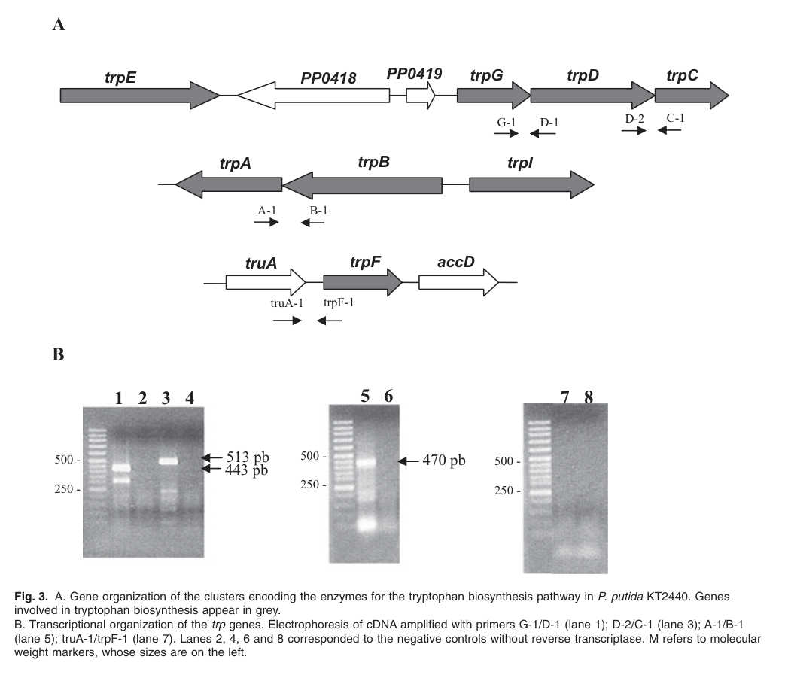

## Question

# Gene Research for Functional Annotation

## ⚠️ CRITICAL: Gene/Protein Identification Context

**BEFORE YOU BEGIN RESEARCH:** You MUST verify you are researching the CORRECT gene/protein. Gene symbols can be ambiguous, especially for less well-characterized genes from non-model organisms.

### Target Gene/Protein Identity (from UniProt):
- **UniProt Accession:** Q88QS1
- **Protein Description:** RecName: Full=Anthranilate synthase component 1 {ECO:0000256|ARBA:ARBA00020653, ECO:0000256|RuleBase:RU364045}; EC=4.1.3.27 {ECO:0000256|ARBA:ARBA00012266, ECO:0000256|RuleBase:RU364045};
- **Gene Information:** Name=trpE {ECO:0000256|RuleBase:RU364045, ECO:0000313|EMBL:AAN66047.1}; OrderedLocusNames=PP_0417 {ECO:0000313|EMBL:AAN66047.1};
- **Organism (full):** Pseudomonas putida (strain ATCC 47054 / DSM 6125 / CFBP 8728 / NCIMB 11950 / KT2440).
- **Protein Family:** Belongs to the anthranilate synthase component I family.
- **Key Domains:** ADC_synthase. (IPR005801); Anth_synth_I-like. (IPR019999); Anth_synth_I_N. (IPR006805); Anth_synth_I_PabB. (IPR005256); Chorismate_C. (IPR015890)

### MANDATORY VERIFICATION STEPS:

1. **Check if the gene symbol "trpE" matches the protein description above**
2. **Verify the organism is correct:** Pseudomonas putida (strain ATCC 47054 / DSM 6125 / CFBP 8728 / NCIMB 11950 / KT2440).
3. **Check if protein family/domains align with what you find in literature**
4. **If you find literature for a DIFFERENT gene with the same or similar symbol, STOP**

### If Gene Symbol is Ambiguous or You Cannot Find Relevant Literature:

**DO NOT PROCEED WITH RESEARCH ON A DIFFERENT GENE.** Instead:
- State clearly: "The gene symbol 'trpE' is ambiguous or literature is limited for this specific protein"
- Explain what you found (e.g., "Found extensive literature on a different gene with the same symbol in a different organism")
- Describe the protein based ONLY on the UniProt information provided above
- Suggest that the protein function can be inferred from domain/family information

### Research Target:

Please provide a comprehensive research report on the gene **trpE** (gene ID: trpE, UniProt: Q88QS1) in PSEPK.

The research report should be a detailed narrative explaining the function, biological processes, and localization of the gene product. Citations should be given for all claims.

You should prioritize authoritative reviews and primary scientific literature when conducting research. You can supplement
this with annotations you find in gene/protein databases, but these can be outdated or inaccurate.

We are specifically interested in the primary function of the gene - for enzymes, what reaction is catalyzed, and what is the substrate specificity? For transporters, what is the substrate? For structural proteins or adapters, what is the broader structural role? For signaling molecules, what is the role in the pathway.

We are interested in where in or outside the cell the gene product carries out its function.

We are also interested in the signaling or biochemical pathways in which the gene functions. We are less interested in broad pleiotropic effects, except where these elucidate the precise role.

Include evidence where possible. We are interested in both experimental evidence as well as inference from structure, evolution, or bioinformatic analysis. Precise studies should be prioritized over high-throughput, where available.

## Output

Question: You are an expert researcher providing comprehensive, well-cited information.

Provide detailed information focusing on:
1. Key concepts and definitions with current understanding
2. Recent developments and latest research (prioritize 2023-2024 sources)
3. Current applications and real-world implementations
4. Expert opinions and analysis from authoritative sources
5. Relevant statistics and data from recent studies

Format as a comprehensive research report with proper citations. Include URLs and publication dates where available.
Always prioritize recent, authoritative sources and provide specific citations for all major claims.

# Gene Research for Functional Annotation

## ⚠️ CRITICAL: Gene/Protein Identification Context

**BEFORE YOU BEGIN RESEARCH:** You MUST verify you are researching the CORRECT gene/protein. Gene symbols can be ambiguous, especially for less well-characterized genes from non-model organisms.

### Target Gene/Protein Identity (from UniProt):
- **UniProt Accession:** Q88QS1
- **Protein Description:** RecName: Full=Anthranilate synthase component 1 {ECO:0000256|ARBA:ARBA00020653, ECO:0000256|RuleBase:RU364045}; EC=4.1.3.27 {ECO:0000256|ARBA:ARBA00012266, ECO:0000256|RuleBase:RU364045};
- **Gene Information:** Name=trpE {ECO:0000256|RuleBase:RU364045, ECO:0000313|EMBL:AAN66047.1}; OrderedLocusNames=PP_0417 {ECO:0000313|EMBL:AAN66047.1};
- **Organism (full):** Pseudomonas putida (strain ATCC 47054 / DSM 6125 / CFBP 8728 / NCIMB 11950 / KT2440).
- **Protein Family:** Belongs to the anthranilate synthase component I family.
- **Key Domains:** ADC_synthase. (IPR005801); Anth_synth_I-like. (IPR019999); Anth_synth_I_N. (IPR006805); Anth_synth_I_PabB. (IPR005256); Chorismate_C. (IPR015890)

### MANDATORY VERIFICATION STEPS:

1. **Check if the gene symbol "trpE" matches the protein description above**
2. **Verify the organism is correct:** Pseudomonas putida (strain ATCC 47054 / DSM 6125 / CFBP 8728 / NCIMB 11950 / KT2440).
3. **Check if protein family/domains align with what you find in literature**
4. **If you find literature for a DIFFERENT gene with the same or similar symbol, STOP**

### If Gene Symbol is Ambiguous or You Cannot Find Relevant Literature:

**DO NOT PROCEED WITH RESEARCH ON A DIFFERENT GENE.** Instead:
- State clearly: "The gene symbol 'trpE' is ambiguous or literature is limited for this specific protein"
- Explain what you found (e.g., "Found extensive literature on a different gene with the same symbol in a different organism")
- Describe the protein based ONLY on the UniProt information provided above
- Suggest that the protein function can be inferred from domain/family information

### Research Target:

Please provide a comprehensive research report on the gene **trpE** (gene ID: trpE, UniProt: Q88QS1) in PSEPK.

The research report should be a detailed narrative explaining the function, biological processes, and localization of the gene product. Citations should be given for all claims.

You should prioritize authoritative reviews and primary scientific literature when conducting research. You can supplement
this with annotations you find in gene/protein databases, but these can be outdated or inaccurate.

We are specifically interested in the primary function of the gene - for enzymes, what reaction is catalyzed, and what is the substrate specificity? For transporters, what is the substrate? For structural proteins or adapters, what is the broader structural role? For signaling molecules, what is the role in the pathway.

We are interested in where in or outside the cell the gene product carries out its function.

We are also interested in the signaling or biochemical pathways in which the gene functions. We are less interested in broad pleiotropic effects, except where these elucidate the precise role.

Include evidence where possible. We are interested in both experimental evidence as well as inference from structure, evolution, or bioinformatic analysis. Precise studies should be prioritized over high-throughput, where available.

## Research report: functional annotation of **trpE** (UniProt **Q88QS1**; locus **PP_0417**) in *Pseudomonas putida* KT2440

### 0) Target verification (mandatory disambiguation)
The symbol **trpE** is used across many bacteria, but in *Pseudomonas putida* KT2440 it specifically corresponds to **PP_0417**, which is annotated and experimentally supported as **anthranilate synthase component I (TrpE)**, required for tryptophan prototrophy (molinahenares2009functionalanalysisof pages 2-4). A mini‑Tn5 insertion in **PP_0417** causes a **tryptophan auxotrophy**, linking this KT2440 locus unambiguously to TrpE function in tryptophan biosynthesis (molinahenares2009functionalanalysisof pages 2-4).

### 1) Key concepts and definitions (current understanding)

#### 1.1 Anthranilate synthase (AS): committed step enzyme in tryptophan biosynthesis
**Anthranilate synthase (EC 4.1.3.27)** catalyzes the **first committed step** of L‑tryptophan biosynthesis: conversion of **chorismate → anthranilate** (parthasarathy2018athreeringcircus pages 5-6, naz2023insightintoderegulation pages 11-14). In most bacteria, AS is a **two-subunit glutamine amidotransferase complex** comprising:
- **TrpE**: the **synthase/“large” (α) subunit**, which binds chorismate and performs the amination/lyase chemistry leading to anthranilate and pyruvate formation (parthasarathy2018athreeringcircus pages 5-6, naz2023insightintoderegulation pages 11-14).
- **TrpG**: the **glutaminase/“small” (β) subunit**, which hydrolyzes glutamine to produce **ammonia**, which is then transferred to the TrpE active site (parthasarathy2018athreeringcircus pages 5-6, funke2024validationofaminodeoxychorismate pages 2-5).

#### 1.2 Reaction chemistry, substrates, and products
Mechanistic descriptions in reviews and structural analyses support a pathway in which TrpE/TrpG carries out an amidation/lyase transformation at chorismate:
- **Primary substrates/co-substrates:** chorismate + glutamine (as ammonia source via TrpG) (parthasarathy2018athreeringcircus pages 5-6, funke2024validationofaminodeoxychorismate pages 2-5).
- **Products:** anthranilate (precursor of tryptophan), **pyruvate** (released from chorismate side chain), and **glutamate** (from glutamine hydrolysis) (parthasarathy2018athreeringcircus pages 5-6, funke2024validationofaminodeoxychorismate pages 2-5).
Two operational modes are described: a **glutamine-dependent** reaction requiring both subunits and an **ammonia-dependent** reaction in which the α subunit can use free ammonia under high ammonium availability (naz2023insightintoderegulation pages 14-15).

#### 1.3 Regulation: feedback inhibition by L‑tryptophan
AS is commonly **allosterically feedback-inhibited by L‑tryptophan**, which reduces flux through the committed step of the pathway (niraula2025aromaticaminoacids pages 13-14, naz2023insightintoderegulation pages 11-14). Structural-level discussions place important determinants of inhibition in/near TrpE domain interfaces and binding crevices coupled to the TrpG interaction region (naz2023insightintoderegulation pages 11-14, naz2023insightintoderegulation pages 14-15).

### 2) Gene/protein function in *Pseudomonas putida* KT2440

#### 2.1 Pathway placement and biological role
In KT2440, TrpE (PP_0417) functions **upstream of anthranilate** in the (essentially one-way) chorismate→tryptophan biosynthetic route (molinahenares2009functionalanalysisof pages 1-2). This is experimentally supported by precursor feeding experiments:
- A **trpE** mutant did not grow on minimal medium but growth was restored by **anthranilate, indole, or tryptophan supplementation** (molinahenares2009functionalanalysisof pages 4-6).
This rescue pattern is consistent with TrpE acting at the anthranilate-forming step (and thus upstream of indole and tryptophan) (molinahenares2009functionalanalysisof pages 4-6).

#### 2.2 Operon/transcription organization and genomic context
In KT2440, tryptophan biosynthesis genes are split across loci. In the cluster containing PP_0417:
- **trpE (PP_0417)** is expressed as a **single monocistronic transcript**.
- **trpG-trpD-trpC** form a **separate operon** (tight spacing/overlaps and RT-PCR confirmation) (molinahenares2009functionalanalysisof pages 2-4).
Other trp genes are in distinct regions: **trpA-trpB** form an operon transcribed divergently from the repressor gene **trpI**, and **trpF** is an unlinked monocistronic unit (molinahenares2009functionalanalysisof pages 2-4, molinahenares2009functionalanalysisof pages 4-6). This gene organization is shown in the KT2440 trp gene map and RT-PCR schematic (molinahenares2009functionalanalysisof media 744c52d9).

#### 2.3 Protein–protein interactions: TrpE–TrpG interface is essential
AS activity depends on formation of a functional **TrpG–TrpE complex**, in which ammonia generated by TrpG is channeled to TrpE (funke2024validationofaminodeoxychorismate pages 2-5). A recent experimental validation study (in *E. coli* with cross-reference to *Pseudomonas* sequence conservation) identifies a conserved synthase aspartate (ecTrpE D367) interacting with glutaminase residues (ecTrpG Y132, S173) as critical for complex stability and function, indicating the **TrpE–TrpG interface** is a mechanistically and evolutionarily constrained interaction surface (funke2024validationofaminodeoxychorismate pages 2-5).

#### 2.4 Cellular localization
No KT2440-specific subcellular localization experiments were identified in the retrieved sources. However, anthranilate synthase is described as a soluble glutamine amidotransferase enzyme complex of primary metabolism, consistent with **cytosolic localization** in bacteria (parthasarathy2018athreeringcircus pages 5-6, funke2024validationofaminodeoxychorismate pages 2-5). This statement is therefore best treated as a strong inference from enzyme class/function rather than a strain-specific localization measurement.

### 3) Recent developments and latest research (prioritizing 2023–2024)

#### 3.1 2023: structure-informed understanding of feedback inhibition and engineering targets
A 2023 review focusing on deregulation of amino-acid feedback inhibition summarizes structural features and residue-level determinants for AS (TrpE/TrpG), emphasizing: (i) TrpE as the chorismate-binding/anthranilate-forming subunit; (ii) TrpG as the glutamine amidotransferase subunit; and (iii) the importance of conformational states and TrpE residues in tryptophan binding and feedback control (naz2023insightintoderegulation pages 11-14, naz2023insightintoderegulation pages 14-15). This supports current “expert consensus” that TrpE is a key lever for tuning tryptophan/anthranilate flux in strain engineering.

#### 3.2 2024: anthranilate synthase interface as a novel antibiotic target concept
A 2024 *Applied and Environmental Microbiology* study proposes a therapeutic strategy distinct from classic active-site inhibitors: **blocking conserved protein–protein interactions** required for assembly of glutamine amidotransferase complexes. The authors validate that disrupting conserved **TrpG–TrpE interface hot spots** is strongly growth-limiting in vivo on minimal medium due to **tryptophan deficiency**, and note high conservation of these residues across a non-redundant set of **695 AS/ADCS sequences** (funke2024validationofaminodeoxychorismate pages 2-5). This work positions AS (TrpE/TrpG) not only as a metabolic enzyme but also as a potentially “high-robustness” antimicrobial target because interface disruption affects essential complex formation (funke2024validationofaminodeoxychorismate pages 2-5).

#### 3.3 2024: functional genomics context in *P. putida* KT2440
A 2024 *mSystems* paper applies independent component analysis to a large RB‑TnSeq fitness compendium (179 conditions) to define functional gene modules (fModules) in KT2440. It reports a specific **“tryptophan biosynthesis” fModule** (9 genes) explaining **8.47% of dataset variance**, indicating that tryptophan biosynthesis genes show a coherent, condition-dependent fitness signature in KT2440 (borchert2024machinelearninganalysis pages 4-6). (The excerpted text does not list whether PP_0417/trpE is among those 9 genes; gene-level membership is referenced via an external resource.)

### 4) Current applications and real-world implementations

#### 4.1 Metabolic engineering in *P. putida* KT2440: anthranilate production from glucose
Anthranilate is both a pathway intermediate and an industrially relevant compound. In a KT2440 engineering study, a **markerless deletion of trpDC** (downstream of anthranilate) enabled anthranilate accumulation, facilitated by the fact that in KT2440 (unlike *E. coli*) **trpEG and trpDC are encoded by separate ORFs** (kuepper2015metabolicengineeringof pages 2-3). The authors further used expression constructs including **trpES40FG** (a feedback-insensitive anthranilate synthase variant) for improved production (kuepper2015metabolicengineeringof pages 2-3).

**Quantitative performance:** Under tryptophan-limited fed-batch conditions, the best engineered strain achieved **1.54 ± 0.3 g/L anthranilate (11.23 mM)** from glucose (kuepper2015metabolicengineeringof pages 2-3). This demonstrates that TrpE-mediated flux control at the committed step is directly exploitable for biomanufacturing.

### 5) Statistics and data points (recent and/or authoritative)
- **Screen scale and genetics (KT2440):** nearly **150,000** mini‑Tn5 mutants screened to isolate aromatic amino-acid auxotrophs; the **trpE** auxotroph had insertion in the **57th codon** of PP_0417 (molinahenares2009functionalanalysisof pages 2-4).
- **Pathway genetics (KT2440):** **RT‑PCR** evidence supports **monocistronic trpE** and **trpGDC operon** organization (molinahenares2009functionalanalysisof pages 2-4, molinahenares2009functionalanalysisof media 744c52d9).
- **Bioprocess metric:** **1.54 ± 0.3 g/L (11.23 mM)** anthranilate achieved in engineered KT2440 (kuepper2015metabolicengineeringof pages 2-3).
- **Antibiotic-target conservation analysis:** interface hot-spot residues conserved across **695** AS/ADCS sequences (non-redundant filtered set) in a 2024 validation study (funke2024validationofaminodeoxychorismate pages 2-5).
- **Systems-level functional genomics:** tryptophan biosynthesis module explains **8.47%** of variance in RB‑TnSeq dataset (KT2440) (borchert2024machinelearninganalysis pages 4-6).

### 6) Visual evidence (pathway and gene organization)
Molina‑Henares et al. provide (i) a pathway schematic detailing the enzymatic steps from chorismate to tryptophan and (ii) a KT2440 gene-organization diagram showing trpE as a separate unit from the trpGDC operon; these figures support both the biochemical pathway position and the transcriptional organization used in this annotation (molinahenares2009functionalanalysisof media 89069567, molinahenares2009functionalanalysisof media 744c52d9).

### 7) Conclusions for functional annotation of UniProt Q88QS1 (KT2440 TrpE)
**Primary molecular function:** chorismate→anthranilate synthase activity as the **TrpE (anthranilate synthase component I)** subunit of the TrpE/TrpG glutamine amidotransferase complex (EC 4.1.3.27), implementing the **first committed step** in L‑tryptophan biosynthesis (parthasarathy2018athreeringcircus pages 5-6, molinahenares2009functionalanalysisof pages 2-4).

**Biological process:** de novo **L‑tryptophan biosynthesis** from chorismate via anthranilate; genetic and feeding tests in KT2440 place trpE upstream of anthranilate/indole/tryptophan (molinahenares2009functionalanalysisof pages 4-6).

**Complex/partners:** requires interaction with **TrpG** to use glutamine as nitrogen source; the TrpG–TrpE interface is essential and evolutionarily conserved, now also investigated as a PPI-inhibitor target class (funke2024validationofaminodeoxychorismate pages 2-5).

**Gene context:** **monocistronic trpE (PP_0417)** separated from **trpGDC operon**; other trp genes are in additional loci (molinahenares2009functionalanalysisof pages 2-4, molinahenares2009functionalanalysisof media 744c52d9).

**Applied relevance:** TrpE is a major control node for redirecting chorismate flux to anthranilate in *P. putida* KT2440, enabling gram‑per‑liter anthranilate production in engineered strains (kuepper2015metabolicengineeringof pages 2-3).

---

### Summary table
| Category | Key points | Best supporting citations (pqac IDs) | URLs / publication dates |
|---|---|---|---|
| Identity | UniProt Q88QS1 corresponds to **trpE / PP_0417** in *Pseudomonas putida* KT2440 and encodes **anthranilate synthase component I** (large/synthase subunit) in tryptophan biosynthesis; KT2440 studies explicitly annotate PP0417 as **TrpE** and show loss of function causes tryptophan auxotrophy. | (molinahenares2009functionalanalysisof pages 2-4, molinahenares2009functionalanalysisof pages 1-2) | Molina-Henares et al., *Microbial Biotechnology* (Dec 2009): https://doi.org/10.1111/j.1751-7915.2008.00062.x |
| Reaction | TrpE is the synthase/alpha component of **anthranilate synthase (EC 4.1.3.27)**, catalyzing the **first committed step of L-tryptophan biosynthesis** by converting chorismate to anthranilate in concert with TrpG. Mechanistically, TrpE forms/acts on the aminated chorismate intermediate and supports pyruvate elimination. | (parthasarathy2018athreeringcircus pages 5-6, naz2023insightintoderegulation pages 11-14) | Parthasarathy et al., *Frontiers in Molecular Biosciences* (Apr 2018): https://doi.org/10.3389/fmolb.2018.00029; Naz et al., *Microbial Cell Factories* (Aug 2023): https://doi.org/10.1186/s12934-023-02178-z |
| Substrates / products | Canonical glutamine-dependent reaction uses **chorismate** plus ammonia derived from **glutamine**; products are **anthranilate**, **pyruvate**, and **glutamate**. Under some conditions, the alpha subunit can use free ammonia instead of glutamine-derived ammonia. | (parthasarathy2018athreeringcircus pages 5-6, naz2023insightintoderegulation pages 14-15) | Parthasarathy et al. (Apr 2018): https://doi.org/10.3389/fmolb.2018.00029; Naz et al. (Aug 2023): https://doi.org/10.1186/s12934-023-02178-z |
| Pathway role | In KT2440, trpE functions at or before **anthranilate formation** in the one-way pathway from chorismate to tryptophan; precursor-feeding experiments showed **trpE mutants are rescued by anthranilate, indole, or tryptophan**, placing TrpE upstream of these intermediates. | (molinahenares2009functionalanalysisof pages 4-6, molinahenares2009functionalanalysisof pages 1-2, molinahenares2009functionalanalysisof media 89069567) | Molina-Henares et al. (Dec 2009): https://doi.org/10.1111/j.1751-7915.2008.00062.x |
| Complex / partner | TrpE acts with **TrpG** (anthranilate synthase component II / glutamine amidotransferase) as a two-subunit enzyme, commonly organized as **αβ or α2β2** assemblies; TrpG supplies ammonia from glutamine to the TrpE active site. Conserved subunit interfaces are essential for activity. | (parthasarathy2018athreeringcircus pages 5-6, naz2023insightintoderegulation pages 11-14, funke2024validationofaminodeoxychorismate pages 1-2, funke2024validationofaminodeoxychorismate pages 2-5) | Parthasarathy et al. (Apr 2018): https://doi.org/10.3389/fmolb.2018.00029; Naz et al. (Aug 2023): https://doi.org/10.1186/s12934-023-02178-z; Funke et al., *Applied and Environmental Microbiology* (May 2024): https://doi.org/10.1128/aem.00572-24 |
| Regulation | Anthranilate synthase is **feedback-inhibited by L-tryptophan**. Structural analyses place inhibitory residues in/near the chorismate-binding domain and domain interfaces; elevated Trp prevents the conformational state needed for efficient catalysis/ammonia transfer. Feedback-insensitive **trpE** alleles are widely exploited in engineering. | (niraula2025aromaticaminoacids pages 13-14, naz2023insightintoderegulation pages 11-14, naz2023insightintoderegulation pages 14-15, ramosvaldovinos2024optimizingfermentationstrategies pages 7-8) | Niraula et al. (Jan 2025): https://doi.org/10.3390/biotech14010006; Naz et al. (Aug 2023): https://doi.org/10.1186/s12934-023-02178-z; Ramos-Valdovinos & Martínez-Antonio, *Processes* (Nov 2024): https://doi.org/10.3390/pr12112422 |
| Gene organization | In *P. putida* KT2440, **trpE is a monocistronic transcription unit** separate from the **trpGDC** operon; trp genes are split across multiple chromosomal loci, with **trpBA** and **trpI** elsewhere. Engineering literature also notes **trpEG and trpDC are encoded by separate open reading frames** in KT2440. | (molinahenares2009functionalanalysisof pages 4-6, molinahenares2009functionalanalysisof pages 2-4, kuepper2015metabolicengineeringof pages 2-3, molinahenares2009functionalanalysisof media 89069567) | Molina-Henares et al. (Dec 2009): https://doi.org/10.1111/j.1751-7915.2008.00062.x; Kuepper et al., *Frontiers in Microbiology* (Nov 2015): https://doi.org/10.3389/fmicb.2015.01310 |
| Localization | TrpE is a **cytosolic enzyme** inferred from its role in soluble primary metabolism and from its bacterial anthranilate synthase family organization; no evidence in the gathered KT2440 sources suggests membrane or extracellular localization. | (parthasarathy2018athreeringcircus pages 5-6, naz2023insightintoderegulation pages 11-14) | Parthasarathy et al. (Apr 2018): https://doi.org/10.3389/fmolb.2018.00029; Naz et al. (Aug 2023): https://doi.org/10.1186/s12934-023-02178-z |
| Phenotypes | A **mini-Tn5 insertion in trpE** produced a **tryptophan auxotroph** in KT2440. Rescue by anthranilate/indole/tryptophan demonstrates specific impairment of the first committed step of Trp biosynthesis rather than a broad growth defect. | (molinahenares2009functionalanalysisof pages 2-4, molinahenares2009functionalanalysisof pages 1-2) | Molina-Henares et al. (Dec 2009): https://doi.org/10.1111/j.1751-7915.2008.00062.x |
| Applications / engineering | KT2440 has been engineered to accumulate **anthranilate** by deleting **trpDC** and overexpressing **feedback-insensitive trpE/trpG** variants. In fed-batch, the best reported strain reached **1.54 ± 0.3 g/L anthranilate (11.23 mM)** from glucose. TrpE is thus a practical flux-control node for aromatic biomanufacturing. | (kuepper2015metabolicengineeringof pages 2-3) | Kuepper et al., *Frontiers in Microbiology* (Nov 2015): https://doi.org/10.3389/fmicb.2015.01310 |
| Recent developments (2023–2024) | Recent work emphasizes (i) **structure-guided deregulation** of anthranilate synthase feedback inhibition, including residue-level analysis of Trp and chorismate binding; (ii) **PPI-targeted antibiotic strategies** aimed at the conserved TrpG–TrpE interface; and (iii) renewed interest in aromatic-pathway rewiring for high-yield production platforms. | (naz2023insightintoderegulation pages 11-14, naz2023insightintoderegulation pages 14-15, funke2024validationofaminodeoxychorismate pages 1-2, funke2024validationofaminodeoxychorismate pages 2-5) | Naz et al. (Aug 2023): https://doi.org/10.1186/s12934-023-02178-z; Funke et al. (May 2024): https://doi.org/10.1128/aem.00572-24 |
| Statistics / data | Quantitative findings include: **1.54 ± 0.3 g/L (11.23 mM)** anthranilate in engineered KT2440; Funke et al. analyzed conservation across **~695 bacterial AS/ADCS sequences** to identify interface hotspots; Molina-Henares et al. isolated **four tryptophan auxotrophs** in KT2440 mutagenesis, including a **trpE** mutant. | (kuepper2015metabolicengineeringof pages 2-3, funke2024validationofaminodeoxychorismate pages 2-5, molinahenares2009functionalanalysisof pages 1-2) | Kuepper et al. (Nov 2015): https://doi.org/10.3389/fmicb.2015.01310; Funke et al. (May 2024): https://doi.org/10.1128/aem.00572-24; Molina-Henares et al. (Dec 2009): https://doi.org/10.1111/j.1751-7915.2008.00062.x |

*Table: This table summarizes the validated functional annotation of *Pseudomonas putida* KT2440 trpE (UniProt Q88QS1 / PP_0417), covering biochemical function, gene organization, phenotypes, engineering uses, and recent 2023–2024 developments with direct context-ID citations.*

References

1. (molinahenares2009functionalanalysisof pages 2-4): M. A. Molina-Henares, Adela García‐Salamanca, A. Molina-Henares, J. de la Torre, M. C. Herrera, J. Ramos, and E. Duque. Functional analysis of aromatic biosynthetic pathways in pseudomonas putida kt2440. Microbial biotechnology, 2:91-100, Dec 2009. URL: https://doi.org/10.1111/j.1751-7915.2008.00062.x, doi:10.1111/j.1751-7915.2008.00062.x. This article has 32 citations and is from a peer-reviewed journal.

2. (parthasarathy2018athreeringcircus pages 5-6): Anutthaman Parthasarathy, Penelope J. Cross, Renwick C. J. Dobson, Lily E. Adams, Michael A. Savka, and André O. Hudson. A three-ring circus: metabolism of the three proteogenic aromatic amino acids and their role in the health of plants and animals. Frontiers in Molecular Biosciences, Apr 2018. URL: https://doi.org/10.3389/fmolb.2018.00029, doi:10.3389/fmolb.2018.00029. This article has 423 citations.

3. (naz2023insightintoderegulation pages 11-14): Sadia Naz, Pi Liu, Umar Farooq, and Hongwu Ma. Insight into de-regulation of amino acid feedback inhibition: a focus on structure analysis method. Microbial Cell Factories, Aug 2023. URL: https://doi.org/10.1186/s12934-023-02178-z, doi:10.1186/s12934-023-02178-z. This article has 23 citations and is from a peer-reviewed journal.

4. (funke2024validationofaminodeoxychorismate pages 2-5): Franziska Jasmin Funke, Sandra Schlee, and Reinhard Sterner. Validation of aminodeoxychorismate synthase and anthranilate synthase as novel targets for bispecific antibiotics inhibiting conserved protein-protein interactions. Applied and Environmental Microbiology, May 2024. URL: https://doi.org/10.1128/aem.00572-24, doi:10.1128/aem.00572-24. This article has 5 citations and is from a peer-reviewed journal.

5. (naz2023insightintoderegulation pages 14-15): Sadia Naz, Pi Liu, Umar Farooq, and Hongwu Ma. Insight into de-regulation of amino acid feedback inhibition: a focus on structure analysis method. Microbial Cell Factories, Aug 2023. URL: https://doi.org/10.1186/s12934-023-02178-z, doi:10.1186/s12934-023-02178-z. This article has 23 citations and is from a peer-reviewed journal.

6. (niraula2025aromaticaminoacids pages 13-14): Archana Niraula, Amir Danesh, Natacha Merindol, Fatma Meddeb-Mouelhi, and Isabel Desgagné-Penix. Aromatic amino acids: exploring microalgae as a potential biofactory. BioTech, 14:6, Jan 2025. URL: https://doi.org/10.3390/biotech14010006, doi:10.3390/biotech14010006. This article has 9 citations.

7. (molinahenares2009functionalanalysisof pages 1-2): M. A. Molina-Henares, Adela García‐Salamanca, A. Molina-Henares, J. de la Torre, M. C. Herrera, J. Ramos, and E. Duque. Functional analysis of aromatic biosynthetic pathways in pseudomonas putida kt2440. Microbial biotechnology, 2:91-100, Dec 2009. URL: https://doi.org/10.1111/j.1751-7915.2008.00062.x, doi:10.1111/j.1751-7915.2008.00062.x. This article has 32 citations and is from a peer-reviewed journal.

8. (molinahenares2009functionalanalysisof pages 4-6): M. A. Molina-Henares, Adela García‐Salamanca, A. Molina-Henares, J. de la Torre, M. C. Herrera, J. Ramos, and E. Duque. Functional analysis of aromatic biosynthetic pathways in pseudomonas putida kt2440. Microbial biotechnology, 2:91-100, Dec 2009. URL: https://doi.org/10.1111/j.1751-7915.2008.00062.x, doi:10.1111/j.1751-7915.2008.00062.x. This article has 32 citations and is from a peer-reviewed journal.

9. (molinahenares2009functionalanalysisof media 744c52d9): M. A. Molina-Henares, Adela García‐Salamanca, A. Molina-Henares, J. de la Torre, M. C. Herrera, J. Ramos, and E. Duque. Functional analysis of aromatic biosynthetic pathways in pseudomonas putida kt2440. Microbial biotechnology, 2:91-100, Dec 2009. URL: https://doi.org/10.1111/j.1751-7915.2008.00062.x, doi:10.1111/j.1751-7915.2008.00062.x. This article has 32 citations and is from a peer-reviewed journal.

10. (borchert2024machinelearninganalysis pages 4-6): Andrew J. Borchert, Alissa C. Bleem, Hyun Gyu Lim, Kevin Rychel, Keven D. Dooley, Zoe A. Kellermyer, Tracy L. Hodges, Bernhard O. Palsson, and Gregg T. Beckham. Machine learning analysis of rb-tnseq fitness data predicts functional gene modules in <i>pseudomonas putida</i> kt2440. Mar 2024. URL: https://doi.org/10.1128/msystems.00942-23, doi:10.1128/msystems.00942-23. This article has 13 citations and is from a peer-reviewed journal.

11. (kuepper2015metabolicengineeringof pages 2-3): Jannis Kuepper, Jasmin Dickler, Michael Biggel, Swantje Behnken, Gernot Jäger, Nick Wierckx, and Lars M. Blank. Metabolic engineering of pseudomonas putida kt2440 to produce anthranilate from glucose. Frontiers in Microbiology, Nov 2015. URL: https://doi.org/10.3389/fmicb.2015.01310, doi:10.3389/fmicb.2015.01310. This article has 66 citations and is from a peer-reviewed journal.

12. (molinahenares2009functionalanalysisof media 89069567): M. A. Molina-Henares, Adela García‐Salamanca, A. Molina-Henares, J. de la Torre, M. C. Herrera, J. Ramos, and E. Duque. Functional analysis of aromatic biosynthetic pathways in pseudomonas putida kt2440. Microbial biotechnology, 2:91-100, Dec 2009. URL: https://doi.org/10.1111/j.1751-7915.2008.00062.x, doi:10.1111/j.1751-7915.2008.00062.x. This article has 32 citations and is from a peer-reviewed journal.

13. (funke2024validationofaminodeoxychorismate pages 1-2): Franziska Jasmin Funke, Sandra Schlee, and Reinhard Sterner. Validation of aminodeoxychorismate synthase and anthranilate synthase as novel targets for bispecific antibiotics inhibiting conserved protein-protein interactions. Applied and Environmental Microbiology, May 2024. URL: https://doi.org/10.1128/aem.00572-24, doi:10.1128/aem.00572-24. This article has 5 citations and is from a peer-reviewed journal.

14. (ramosvaldovinos2024optimizingfermentationstrategies pages 7-8): Miguel Angel Ramos-Valdovinos and Agustino Martínez-Antonio. Optimizing fermentation strategies for enhanced tryptophan production in escherichia coli: integrating genetic and environmental controls for industrial applications. Processes, Nov 2024. URL: https://doi.org/10.3390/pr12112422, doi:10.3390/pr12112422. This article has 10 citations.

## Artifacts

- [Edison artifact artifact-00](trpE-deep-research-falcon_artifacts/artifact-00.md)

## Citations

1. molinahenares2009functionalanalysisof pages 2-4
2. naz2023insightintoderegulation pages 14-15
3. molinahenares2009functionalanalysisof pages 1-2
4. molinahenares2009functionalanalysisof pages 4-6
5. funke2024validationofaminodeoxychorismate pages 2-5
6. borchert2024machinelearninganalysis pages 4-6
7. kuepper2015metabolicengineeringof pages 2-3
8. parthasarathy2018athreeringcircus pages 5-6
9. naz2023insightintoderegulation pages 11-14
10. niraula2025aromaticaminoacids pages 13-14
11. funke2024validationofaminodeoxychorismate pages 1-2
12. ramosvaldovinos2024optimizingfermentationstrategies pages 7-8
13. https://doi.org/10.1111/j.1751-7915.2008.00062.x
14. https://doi.org/10.3389/fmolb.2018.00029;
15. https://doi.org/10.1186/s12934-023-02178-z
16. https://doi.org/10.1186/s12934-023-02178-z;
17. https://doi.org/10.1128/aem.00572-24
18. https://doi.org/10.3390/biotech14010006;
19. https://doi.org/10.3390/pr12112422
20. https://doi.org/10.1111/j.1751-7915.2008.00062.x;
21. https://doi.org/10.3389/fmicb.2015.01310
22. https://doi.org/10.3389/fmicb.2015.01310;
23. https://doi.org/10.1128/aem.00572-24;
24. https://doi.org/10.1111/j.1751-7915.2008.00062.x,
25. https://doi.org/10.3389/fmolb.2018.00029,
26. https://doi.org/10.1186/s12934-023-02178-z,
27. https://doi.org/10.1128/aem.00572-24,
28. https://doi.org/10.3390/biotech14010006,
29. https://doi.org/10.1128/msystems.00942-23,
30. https://doi.org/10.3389/fmicb.2015.01310,
31. https://doi.org/10.3390/pr12112422,