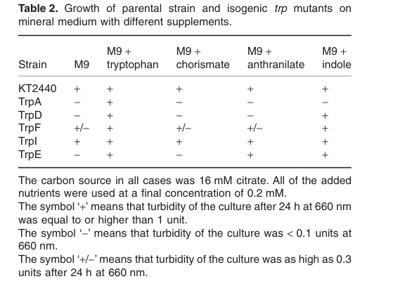

## Question

# Gene Research for Functional Annotation

## ⚠️ CRITICAL: Gene/Protein Identification Context

**BEFORE YOU BEGIN RESEARCH:** You MUST verify you are researching the CORRECT gene/protein. Gene symbols can be ambiguous, especially for less well-characterized genes from non-model organisms.

### Target Gene/Protein Identity (from UniProt):
- **UniProt Accession:** Q88LE0
- **Protein Description:** RecName: Full=N-(5'-phosphoribosyl)anthranilate isomerase {ECO:0000255|HAMAP-Rule:MF_00135}; Short=PRAI {ECO:0000255|HAMAP-Rule:MF_00135}; EC=5.3.1.24 {ECO:0000255|HAMAP-Rule:MF_00135};
- **Gene Information:** Name=trpF {ECO:0000255|HAMAP-Rule:MF_00135}; OrderedLocusNames=PP_1995;
- **Organism (full):** Pseudomonas putida (strain ATCC 47054 / DSM 6125 / CFBP 8728 / NCIMB 11950 / KT2440).
- **Protein Family:** Belongs to the TrpF family. {ECO:0000255|HAMAP-
- **Key Domains:** Aldolase_TIM. (IPR013785); PRAI_dom. (IPR001240); RibuloseP-bd_barrel. (IPR011060); TrpF_fam. (IPR044643); PRAI (PF00697)

### MANDATORY VERIFICATION STEPS:

1. **Check if the gene symbol "trpF" matches the protein description above**
2. **Verify the organism is correct:** Pseudomonas putida (strain ATCC 47054 / DSM 6125 / CFBP 8728 / NCIMB 11950 / KT2440).
3. **Check if protein family/domains align with what you find in literature**
4. **If you find literature for a DIFFERENT gene with the same or similar symbol, STOP**

### If Gene Symbol is Ambiguous or You Cannot Find Relevant Literature:

**DO NOT PROCEED WITH RESEARCH ON A DIFFERENT GENE.** Instead:
- State clearly: "The gene symbol 'trpF' is ambiguous or literature is limited for this specific protein"
- Explain what you found (e.g., "Found extensive literature on a different gene with the same symbol in a different organism")
- Describe the protein based ONLY on the UniProt information provided above
- Suggest that the protein function can be inferred from domain/family information

### Research Target:

Please provide a comprehensive research report on the gene **trpF** (gene ID: trpF, UniProt: Q88LE0) in PSEPK.

The research report should be a detailed narrative explaining the function, biological processes, and localization of the gene product. Citations should be given for all claims.

You should prioritize authoritative reviews and primary scientific literature when conducting research. You can supplement
this with annotations you find in gene/protein databases, but these can be outdated or inaccurate.

We are specifically interested in the primary function of the gene - for enzymes, what reaction is catalyzed, and what is the substrate specificity? For transporters, what is the substrate? For structural proteins or adapters, what is the broader structural role? For signaling molecules, what is the role in the pathway.

We are interested in where in or outside the cell the gene product carries out its function.

We are also interested in the signaling or biochemical pathways in which the gene functions. We are less interested in broad pleiotropic effects, except where these elucidate the precise role.

Include evidence where possible. We are interested in both experimental evidence as well as inference from structure, evolution, or bioinformatic analysis. Precise studies should be prioritized over high-throughput, where available.

## Output

Question: You are an expert researcher providing comprehensive, well-cited information.

Provide detailed information focusing on:
1. Key concepts and definitions with current understanding
2. Recent developments and latest research (prioritize 2023-2024 sources)
3. Current applications and real-world implementations
4. Expert opinions and analysis from authoritative sources
5. Relevant statistics and data from recent studies

Format as a comprehensive research report with proper citations. Include URLs and publication dates where available.
Always prioritize recent, authoritative sources and provide specific citations for all major claims.

# Gene Research for Functional Annotation

## ⚠️ CRITICAL: Gene/Protein Identification Context

**BEFORE YOU BEGIN RESEARCH:** You MUST verify you are researching the CORRECT gene/protein. Gene symbols can be ambiguous, especially for less well-characterized genes from non-model organisms.

### Target Gene/Protein Identity (from UniProt):
- **UniProt Accession:** Q88LE0
- **Protein Description:** RecName: Full=N-(5'-phosphoribosyl)anthranilate isomerase {ECO:0000255|HAMAP-Rule:MF_00135}; Short=PRAI {ECO:0000255|HAMAP-Rule:MF_00135}; EC=5.3.1.24 {ECO:0000255|HAMAP-Rule:MF_00135};
- **Gene Information:** Name=trpF {ECO:0000255|HAMAP-Rule:MF_00135}; OrderedLocusNames=PP_1995;
- **Organism (full):** Pseudomonas putida (strain ATCC 47054 / DSM 6125 / CFBP 8728 / NCIMB 11950 / KT2440).
- **Protein Family:** Belongs to the TrpF family. {ECO:0000255|HAMAP-
- **Key Domains:** Aldolase_TIM. (IPR013785); PRAI_dom. (IPR001240); RibuloseP-bd_barrel. (IPR011060); TrpF_fam. (IPR044643); PRAI (PF00697)

### MANDATORY VERIFICATION STEPS:

1. **Check if the gene symbol "trpF" matches the protein description above**
2. **Verify the organism is correct:** Pseudomonas putida (strain ATCC 47054 / DSM 6125 / CFBP 8728 / NCIMB 11950 / KT2440).
3. **Check if protein family/domains align with what you find in literature**
4. **If you find literature for a DIFFERENT gene with the same or similar symbol, STOP**

### If Gene Symbol is Ambiguous or You Cannot Find Relevant Literature:

**DO NOT PROCEED WITH RESEARCH ON A DIFFERENT GENE.** Instead:
- State clearly: "The gene symbol 'trpF' is ambiguous or literature is limited for this specific protein"
- Explain what you found (e.g., "Found extensive literature on a different gene with the same symbol in a different organism")
- Describe the protein based ONLY on the UniProt information provided above
- Suggest that the protein function can be inferred from domain/family information

### Research Target:

Please provide a comprehensive research report on the gene **trpF** (gene ID: trpF, UniProt: Q88LE0) in PSEPK.

The research report should be a detailed narrative explaining the function, biological processes, and localization of the gene product. Citations should be given for all claims.

You should prioritize authoritative reviews and primary scientific literature when conducting research. You can supplement
this with annotations you find in gene/protein databases, but these can be outdated or inaccurate.

We are specifically interested in the primary function of the gene - for enzymes, what reaction is catalyzed, and what is the substrate specificity? For transporters, what is the substrate? For structural proteins or adapters, what is the broader structural role? For signaling molecules, what is the role in the pathway.

We are interested in where in or outside the cell the gene product carries out its function.

We are also interested in the signaling or biochemical pathways in which the gene functions. We are less interested in broad pleiotropic effects, except where these elucidate the precise role.

Include evidence where possible. We are interested in both experimental evidence as well as inference from structure, evolution, or bioinformatic analysis. Precise studies should be prioritized over high-throughput, where available.

## Research report: **trpF** (UniProt Q88LE0; locus **PP_1995**) in *Pseudomonas putida* KT2440

### 0) Identity verification (mandatory disambiguation)
The target protein is unambiguously *Pseudomonas putida* KT2440 **trpF** (locus tag **PP_1995**), functionally assigned as **phosphoribosyl anthranilate isomerase** (PRAI) in the tryptophan biosynthesis pathway. This is supported by a KT2440-specific targeted chromosomal knockout of **trpF (PP_1995)** and pathway-consistent auxotrophy/complementation assays, confirming that this trpF is the canonical tryptophan-pathway enzyme rather than an unrelated protein sharing the symbol (molinahenares2009functionalanalysisof pages 4-6, molinahenares2009functionalanalysisof pages 7-8, molinahenares2009functionalanalysisof media f6402c94).

### 1) Key concepts and definitions (current understanding)

#### 1.1 Enzyme and reaction definition
**TrpF (phosphoribosyl anthranilate isomerase; PRAI)** catalyzes an isomerization step in the conversion of anthranilate-derived intermediates toward tryptophan. In pathway terms, anthranilate is first converted to **phosphoribosyl anthranilate (PRA)** by TrpD; **TrpF then opens the ribose ring of PRA to yield** **1-carboxyphenylamino-1′-deoxyribulose-5′-phosphate (CdRP)**, and TrpC then converts CdRP onward toward indole ring formation (guida2024aminoacidbiosynthesis pages 4-6).

A mechanistic picture consistent with this biochemical definition is supported by modern computational/structural analyses of TrpF-family enzymes: TrpF catalysis is described as proceeding through an **Amadori-type rearrangement** and involves **enzyme-catalyzed opening of the ribose ring** (romerorivera2022complexloopdynamics pages 2-3, romerorivera2022complexloopdynamics pages 3-4).

#### 1.2 Pathway context in *Pseudomonas*
In *Pseudomonas*, tryptophan biosynthesis genes are often not in a single contiguous operon; instead, they can be distributed in separate loci. In KT2440 specifically, **trpBA** and **trpGDE** form operons, whereas **trpF** (and some other trp genes) are organized as **single transcriptional units** (molinahenares2009functionalanalysisof pages 1-2). Downstream in the pathway, TrpA/TrpB (tryptophan synthase) convert indole + L-serine to L-tryptophan; regulation can differ from *E. coli* and in some *Pseudomonas* involves the LysR-family regulator **TrpI** influencing expression of tryptophan synthase genes (matulis2022developmentandcharacterization pages 1-2).

### 2) KT2440-specific functional annotation: gene organization, phenotype, and pathway placement

#### 2.1 Gene organization and genomic context
Molina-Henares et al. (2009) show that KT2440 **trpF/PP_1995** is **unlinked** to the main trp gene clusters and is likely **monocistronic**. They report short intergenic distances suggestive of independent transcriptional units (PP1994 is **61 nt upstream**; PP1996 begins **222 nt** after the PP_1995 stop codon), and RT-PCR did not support cotranscription, leading them to conclude trpF is “most probably a single cistron” (molinahenares2009functionalanalysisof pages 2-4). They further note that in sequenced *Pseudomonas* spp. trpF is consistently flanked by **truA** and **accD** (molinahenares2009functionalanalysisof pages 4-6).

#### 2.2 Targeted knockout and auxotrophy
Because spontaneous trpF mutants were not recovered, Molina-Henares et al. constructed a **site-specific chromosomal trpF (PP_1995) knockout** using a pCHESI-based strategy; insertion was confirmed by PCR and Southern blotting (molinahenares2009functionalanalysisof pages 7-8). The resulting mutants were **tryptophan auxotrophs**, with only very small colonies detectable without tryptophan supplementation (molinahenares2009functionalanalysisof pages 4-6).

#### 2.3 Precursor-feeding evidence maps trpF step relative to anthranilate and indole
In minimal medium supplementation assays, the **trpF mutant is rescued by tryptophan and by indole**, but shows only weak/variable growth with anthranilate or chorismate supplementation, a pattern consistent with trpF acting **downstream of anthranilate formation and upstream of indole** (molinahenares2009functionalanalysisof pages 4-6, molinahenares2009functionalanalysisof media f6402c94).

These assays were performed in **M9 minimal medium with 16 mM citrate** as carbon source and supplemented nutrients at **0.2 mM** (with a higher tryptophan condition used for a trpA comparison), providing quantitative experimental conditions for the phenotype (molinahenares2009functionalanalysisof pages 4-6).

### 3) Structure/function and substrate specificity (TrpF family; relevance to Q88LE0)

#### 3.1 TIM-barrel enzyme family and loop dynamics as determinants of specificity
Recent mechanistic work on (βα)8-barrel enzymes involved in histidine and tryptophan biosynthesis highlights that TrpF is a **specialist enzyme** with specificity for the smaller substrate **PRA**, whereas related enzymes (e.g., PriA) can be bifunctional. A key determinant is active-site architecture and loop dynamics:
* TrpF catalysis includes **ribose-ring opening** as a first mechanistic step and proceeds to products such as **CdRP** (romerorivera2022complexloopdynamics pages 3-4).
* TrpF active sites can be more compact, supporting selectivity for PRA over bulkier analogs like ProFAR; substrate volume comparisons (ProFAR **829 ų** vs PRA **559 ų**) were used to rationalize specificity in a TrpF model (romerorivera2022complexloopdynamics pages 3-4).
* Catalytically important residues and loops are emphasized, including a catalytically important Asp in loop 6 (example numbering D126 in TmTrpF) and multiple long-loop rearrangements that gate catalytic competence (romerorivera2022complexloopdynamics pages 2-3, romerorivera2022complexloopdynamics pages 6-8).

While these detailed mechanistic/structural data are not from *P. putida* KT2440 specifically, they provide authoritative, modern support for how **TrpF-family** enzymes (the family to which Q88LE0 belongs, per the provided UniProt context) achieve substrate specificity and catalysis (romerorivera2022complexloopdynamics pages 2-3, romerorivera2022complexloopdynamics pages 3-4, romerorivera2022complexloopdynamics pages 6-8).

#### 3.2 What is (and is not) known specifically for KT2440 TrpF biochemistry
In the retrieved KT2440-focused experimental genetics paper, the evidence is phenotype-based (auxotrophy/complementation), not purified-enzyme kinetics. No KT2440 TrpF kinetic parameters (kcat/Km for PRA) were identified in the retrieved corpus, so substrate specificity is supported indirectly by (i) pathway-consistent rescue by indole/tryptophan and (ii) broader TrpF-family mechanistic literature (molinahenares2009functionalanalysisof pages 4-6, romerorivera2022complexloopdynamics pages 3-4).

### 4) Cellular localization
No retrieved source explicitly states subcellular localization for *P. putida* KT2440 TrpF. Given the pathway role in amino-acid biosynthesis and lack of secretion/transport context in the experimental genetics paper, the most defensible statement from this evidence set is that TrpF functions as an **intracellular enzyme**, but the precise compartmental assignment (e.g., “cytosolic”) cannot be directly cited here and should be treated as an inference rather than a proven KT2440-specific fact (molinahenares2009functionalanalysisof pages 4-6, molinahenares2009functionalanalysisof pages 2-4).

### 5) Recent developments and latest research (prioritizing 2023–2024)

#### 5.1 2024 perspective: Trp pathway enzymes as antimicrobial targets
A 2024 review on amino-acid biosynthesis inhibitors in tuberculosis drug discovery summarizes the tryptophan pathway and explicitly describes the TrpF step: **TrpF opens the ribose ring of PRA to form CdRP**, which is then processed by TrpC (guida2024aminoacidbiosynthesis pages 4-6). While focused on *Mycobacterium tuberculosis*, this review reflects contemporary interest in Trp biosynthesis (including TrpF) as a drug target and provides an up-to-date pathway description (guida2024aminoacidbiosynthesis pages 4-6).

#### 5.2 Current mechanistic consensus: conformational dynamics and evolvability
Modern mechanistic analyses emphasize that TrpF-family catalysis depends on **interdependent loop motions** and that differences in loop dynamics/active-site volumes can encode specialization versus bifunctionality (romerorivera2022complexloopdynamics pages 2-3, romerorivera2022complexloopdynamics pages 3-4). This informs current thinking on how TrpF-like enzymes might be engineered or inhibited.

### 6) Current applications and real-world implementations (with quantitative data)

#### 6.1 Metabolic engineering in *P. putida* KT2440: anthranilate production
Anthranilate (o-aminobenzoate; a tryptophan-pathway intermediate precursor) is an industrially relevant aromatic. In *P. putida* KT2440, Kuepper et al. (2015) engineered strains to accumulate anthranilate from glucose by deleting **trpDC** (blocking conversion toward tryptophan) and overexpressing feedback-insensitive variants (including **trpES40FG** and **aroGD146N**) (kuepper2015metabolicengineeringof pages 1-2). In tryptophan-limited fed-batch fermentations, the best strain reached a maximum of **1.54 ± 0.3 g/L** anthranilate (11.23 mM) (kuepper2015metabolicengineeringof pages 1-2).

Although this study targets upstream steps (anthranilate synthesis and blocking its consumption), it is a concrete example of how the tryptophan biosynthesis branch—including downstream steps like TrpF—interfaces with engineering strategies that modulate flux through the pathway (kuepper2015metabolicengineeringof pages 1-2).

#### 6.2 Biosensing built from *P. putida* KT2440 regulation: indole-responsive biosensor
Matulis et al. (2022) repurposed an indole-inducible gene expression system from *P. putida* KT2440 (PpTrpI/PPP_RS00425) to build whole-cell biosensors in *E. coli* and *Cupriavidus necator*. Key reported performance metrics include:
* **Up to 639.6-fold induction** by indole (in *E. coli* biosensor, minimal medium) (matulis2022developmentandcharacterization pages 1-2).
* A **linear response range** of approximately **0.4–5 mM indole** (matulis2022developmentandcharacterization pages 1-2, matulis2022developmentandcharacterization pages 4-6).
* Apparent **Km values ~0.9–1.8 mM**, depending on host and medium (matulis2022developmentandcharacterization pages 4-6).
* Specificity: structurally similar compounds (including L-tryptophan and several indole-acid derivatives) did not induce the system (matulis2022developmentandcharacterization pages 6-8, matulis2022developmentandcharacterization pages 4-6).

This is a real-world implementation derived from KT2440’s tryptophan/indole regulatory biology, enabling monitoring of indole production/accumulation—a pathway output connected to tryptophan metabolism (matulis2022developmentandcharacterization pages 6-8).

### 7) Expert interpretation and analysis (evidence-based)

1. **Strongest KT2440-specific evidence for function is genetic/phenotypic.** The targeted PP_1995 knockout yields tryptophan auxotrophy and is rescued by indole/tryptophan, establishing that trpF is required for de novo tryptophan synthesis and placing it upstream of indole (molinahenares2009functionalanalysisof pages 4-6, molinahenares2009functionalanalysisof media f6402c94).
2. **Modern mechanistic literature suggests TrpF specificity is a structural/dynamic property rather than just a static active-site motif.** Comparative MD/EVB work highlights loop rearrangements and active-site volume as determinants of PRA specificity and as levers of evolvability toward bifunctional PriA-like behavior (romerorivera2022complexloopdynamics pages 3-4, romerorivera2022complexloopdynamics pages 6-8).
3. **Applied biotechnology around this pathway in *P. putida* focuses more on flux control than on TrpF itself.** Industrially oriented studies often modulate upstream anthranilate synthesis and block consumption (e.g., trpDC deletion) to accumulate valuable aromatics; TrpF becomes relevant as part of the native pathway capacity that may need to be bypassed, balanced, or monitored (kuepper2015metabolicengineeringof pages 1-2).

### 8) Key statistics/data points (from cited studies)
* **KT2440 trpF (PP_1995) genomic context**: PP1994 is **61 nt** upstream; PP1996 starts **222 nt** downstream of PP_1995 stop codon; RT-PCR does not support cotranscription → likely monocistronic (molinahenares2009functionalanalysisof pages 2-4).
* **KT2440 trpF mutant feeding assay conditions**: M9 minimal medium + **16 mM citrate**, supplements at **0.2 mM**; TrpF growth pattern indicates rescue by **tryptophan** and **indole** (molinahenares2009functionalanalysisof pages 4-6, molinahenares2009functionalanalysisof media f6402c94).
* **Anthranilate bioproduction in KT2440 (2015)**: maximum **1.54 ± 0.3 g/L** (11.23 mM) in tryptophan-limited fed-batch (kuepper2015metabolicengineeringof pages 1-2).
* **Indole biosensor derived from KT2440 regulation (2022)**: up to **639.6-fold induction**; linear range ~**0.4–5 mM**; **Km ~0.9–1.8 mM** (matulis2022developmentandcharacterization pages 1-2, matulis2022developmentandcharacterization pages 4-6).

### 9) Evidence summary table
| Target | Enzyme name / function | EC number | Reaction step in tryptophan biosynthesis | Gene organization / genomic context | Key experimental evidence in *P. putida* KT2440 | Growth complementation / quantitative conditions | Key citation(s) |
|---|---|---|---|---|---|---|---|
| **trpF** (UniProt **Q88LE0**; locus **PP_1995**) | **Phosphoribosyl anthranilate isomerase** / **N-(5'-phosphoribosyl)anthranilate isomerase**; enzyme assigned to the tryptophan branch from anthranilate toward indole-3-glycerol phosphate (molinahenares2009functionalanalysisof pages 2-4, molinahenares2009functionalanalysisof pages 1-2) | **EC 5.3.1.24** reported for TrpF/PRAI in general pathway annotations and genome annotations cited in retrieved literature; KT2440 paper functionally assigns PP_1995 as phosphoribosyl anthranilate isomerase (molinahenares2009functionalanalysisof pages 2-4) | Catalyzes the **PRAI step** after anthranilate phosphoribosyltransferase (**TrpD**) and before indole-3-glycerol phosphate synthase (**TrpC**); thus it converts the phosphoribosyl-anthranilate intermediate within the anthranilate → indole-3-glycerol phosphate segment of the pathway (molinahenares2009functionalanalysisof pages 2-4, matulis2022developmentandcharacterization pages 1-2) | **Monocistronic**, **unlinked** to the other main trp clusters; trp genes in KT2440 are distributed in separate regions, with **trpBA** and **trpGDC** in operons while **trpF** is a **single transcriptional unit**. In sequenced *Pseudomonas* spp., trpF is consistently flanked by **truA** and **accD**. In KT2440, the upstream ORF (**PP1994**) is **61 nt** away and the downstream ORF (**PP1996**) starts **222 nt** after the PP_1995 stop codon; RT-PCR for cotranscription was negative, supporting that **trpF is most probably a single cistron** (molinahenares2009functionalanalysisof pages 4-6, molinahenares2009functionalanalysisof pages 2-4, molinahenares2009functionalanalysisof pages 1-2) | Because spontaneous mutants were not recovered, the authors made a **targeted chromosomal knockout** using a **pCHESI/pCHESIWKm site-specific homologous inactivation strategy**. An internal fragment of about **500 bp** was amplified with primers **TrpF-XbaI** and **TrpF-2**, cloned, introduced by **electroporation**, and confirmed by **colony PCR** and **Southern blotting**. The resulting trpF-deficient clones were **tryptophan auxotrophs**, with only **very small colonies** appearing without tryptophan supplementation (molinahenares2009functionalanalysisof pages 4-6, molinahenares2009functionalanalysisof pages 7-8) | In feeding assays on **M9 minimal medium with 16 mM citrate** as carbon source, supplements were added to **0.2 mM final concentration** (except tryptophan at **0.6 mM** for the trpA assay comparison). The **TrpF mutant** showed growth pattern: **M9 +/-**, **+ tryptophan: +**, **+ chorismate: +/-**, **+ anthranilate: +/-**, **+ indole: +**. This indicates rescue by **tryptophan** or **indole**, but not effective rescue by **anthranilate**, consistent with TrpF acting downstream of anthranilate formation and upstream of indole production (molinahenares2009functionalanalysisof pages 4-6, molinahenares2009functionalanalysisof media f6402c94) | Molina-Henares et al., **2009-12**, *Microbial Biotechnology*, DOI: **10.1111/j.1751-7915.2008.00062.x**, URL: **https://doi.org/10.1111/j.1751-7915.2008.00062.x** (molinahenares2009functionalanalysisof pages 4-6, molinahenares2009functionalanalysisof pages 2-4, molinahenares2009functionalanalysisof pages 1-2, molinahenares2009functionalanalysisof pages 7-8, molinahenares2009functionalanalysisof media f6402c94); pathway/regulatory context from Matulis et al., **2022-04**, *Int. J. Mol. Sci.*, DOI: **10.3390/ijms23094649**, URL: **https://doi.org/10.3390/ijms23094649** (matulis2022developmentandcharacterization pages 1-2) |

*Table: This table summarizes the validated functional annotation of Pseudomonas putida KT2440 trpF/PP_1995, including its enzymatic role, pathway position, genomic organization, and direct mutant evidence. It is useful as a concise evidence map linking the locus to tryptophan biosynthesis and experimentally observed auxotrophy/complementation.*

### References (URLs and publication dates)
* Molina-Henares MA et al. **Functional analysis of aromatic biosynthetic pathways in *Pseudomonas putida* KT2440**. *Microbial Biotechnology*. **Dec 2009**. https://doi.org/10.1111/j.1751-7915.2008.00062.x (molinahenares2009functionalanalysisof pages 4-6, molinahenares2009functionalanalysisof pages 2-4, molinahenares2009functionalanalysisof pages 1-2, molinahenares2009functionalanalysisof pages 7-8, molinahenares2009functionalanalysisof media f6402c94)
* Guida M et al. **Amino Acid Biosynthesis Inhibitors in Tuberculosis Drug Discovery**. *Pharmaceutics*. **May 2024**. https://doi.org/10.3390/pharmaceutics16060725 (guida2024aminoacidbiosynthesis pages 4-6)
* Romero-Rivera A et al. **Complex Loop Dynamics Underpin Activity, Specificity, and Evolvability in the (βα)8 Barrel Enzymes of Histidine and Tryptophan Biosynthesis**. *JACS Au*. **Apr 2022**. https://doi.org/10.1021/jacsau.2c00063 (romerorivera2022complexloopdynamics pages 2-3, romerorivera2022complexloopdynamics pages 3-4, romerorivera2022complexloopdynamics pages 6-8)
* Kuepper J et al. **Metabolic Engineering of *Pseudomonas putida* KT2440 to Produce Anthranilate from Glucose**. *Frontiers in Microbiology*. **Nov 2015**. https://doi.org/10.3389/fmicb.2015.01310 (kuepper2015metabolicengineeringof pages 1-2, kuepper2015metabolicengineeringof pages 5-6)
* Matulis P et al. **Development and Characterization of Indole-Responsive Whole-Cell Biosensor Based on the Inducible Gene Expression System from *Pseudomonas putida* KT2440**. *Int. J. Mol. Sci.* **Apr 2022**. https://doi.org/10.3390/ijms23094649 (matulis2022developmentandcharacterization pages 6-8, matulis2022developmentandcharacterization pages 1-2, matulis2022developmentandcharacterization pages 4-6)

References

1. (molinahenares2009functionalanalysisof pages 4-6): M. A. Molina-Henares, Adela García‐Salamanca, A. Molina-Henares, J. de la Torre, M. C. Herrera, J. Ramos, and E. Duque. Functional analysis of aromatic biosynthetic pathways in pseudomonas putida kt2440. Microbial biotechnology, 2:91-100, Dec 2009. URL: https://doi.org/10.1111/j.1751-7915.2008.00062.x, doi:10.1111/j.1751-7915.2008.00062.x. This article has 32 citations and is from a peer-reviewed journal.

2. (molinahenares2009functionalanalysisof pages 7-8): M. A. Molina-Henares, Adela García‐Salamanca, A. Molina-Henares, J. de la Torre, M. C. Herrera, J. Ramos, and E. Duque. Functional analysis of aromatic biosynthetic pathways in pseudomonas putida kt2440. Microbial biotechnology, 2:91-100, Dec 2009. URL: https://doi.org/10.1111/j.1751-7915.2008.00062.x, doi:10.1111/j.1751-7915.2008.00062.x. This article has 32 citations and is from a peer-reviewed journal.

3. (molinahenares2009functionalanalysisof media f6402c94): M. A. Molina-Henares, Adela García‐Salamanca, A. Molina-Henares, J. de la Torre, M. C. Herrera, J. Ramos, and E. Duque. Functional analysis of aromatic biosynthetic pathways in pseudomonas putida kt2440. Microbial biotechnology, 2:91-100, Dec 2009. URL: https://doi.org/10.1111/j.1751-7915.2008.00062.x, doi:10.1111/j.1751-7915.2008.00062.x. This article has 32 citations and is from a peer-reviewed journal.

4. (guida2024aminoacidbiosynthesis pages 4-6): Michela Guida, Chiara Tammaro, Miriana Quaranta, Benedetta Salvucci, Mariangela Biava, Giovanna Poce, and Sara Consalvi. Amino acid biosynthesis inhibitors in tuberculosis drug discovery. Pharmaceutics, 16:725, May 2024. URL: https://doi.org/10.3390/pharmaceutics16060725, doi:10.3390/pharmaceutics16060725. This article has 3 citations.

5. (romerorivera2022complexloopdynamics pages 2-3): Adrian Romero-Rivera, Marina Corbella, Antonietta Parracino, Wayne M. Patrick, and Shina Caroline Lynn Kamerlin. Complex loop dynamics underpin activity, specificity, and evolvability in the (βα)8 barrel enzymes of histidine and tryptophan biosynthesis. JACS Au, 2:943-960, Apr 2022. URL: https://doi.org/10.1021/jacsau.2c00063, doi:10.1021/jacsau.2c00063. This article has 35 citations and is from a peer-reviewed journal.

6. (romerorivera2022complexloopdynamics pages 3-4): Adrian Romero-Rivera, Marina Corbella, Antonietta Parracino, Wayne M. Patrick, and Shina Caroline Lynn Kamerlin. Complex loop dynamics underpin activity, specificity, and evolvability in the (βα)8 barrel enzymes of histidine and tryptophan biosynthesis. JACS Au, 2:943-960, Apr 2022. URL: https://doi.org/10.1021/jacsau.2c00063, doi:10.1021/jacsau.2c00063. This article has 35 citations and is from a peer-reviewed journal.

7. (molinahenares2009functionalanalysisof pages 1-2): M. A. Molina-Henares, Adela García‐Salamanca, A. Molina-Henares, J. de la Torre, M. C. Herrera, J. Ramos, and E. Duque. Functional analysis of aromatic biosynthetic pathways in pseudomonas putida kt2440. Microbial biotechnology, 2:91-100, Dec 2009. URL: https://doi.org/10.1111/j.1751-7915.2008.00062.x, doi:10.1111/j.1751-7915.2008.00062.x. This article has 32 citations and is from a peer-reviewed journal.

8. (matulis2022developmentandcharacterization pages 1-2): Paulius Matulis, Ingrida Kutraite, Ernesta Augustiniene, Egle Valanciene, Ilona Jonuskiene, and Naglis Malys. Development and characterization of indole-responsive whole-cell biosensor based on the inducible gene expression system from pseudomonas putida kt2440. International Journal of Molecular Sciences, 23:4649, Apr 2022. URL: https://doi.org/10.3390/ijms23094649, doi:10.3390/ijms23094649. This article has 8 citations.

9. (molinahenares2009functionalanalysisof pages 2-4): M. A. Molina-Henares, Adela García‐Salamanca, A. Molina-Henares, J. de la Torre, M. C. Herrera, J. Ramos, and E. Duque. Functional analysis of aromatic biosynthetic pathways in pseudomonas putida kt2440. Microbial biotechnology, 2:91-100, Dec 2009. URL: https://doi.org/10.1111/j.1751-7915.2008.00062.x, doi:10.1111/j.1751-7915.2008.00062.x. This article has 32 citations and is from a peer-reviewed journal.

10. (romerorivera2022complexloopdynamics pages 6-8): Adrian Romero-Rivera, Marina Corbella, Antonietta Parracino, Wayne M. Patrick, and Shina Caroline Lynn Kamerlin. Complex loop dynamics underpin activity, specificity, and evolvability in the (βα)8 barrel enzymes of histidine and tryptophan biosynthesis. JACS Au, 2:943-960, Apr 2022. URL: https://doi.org/10.1021/jacsau.2c00063, doi:10.1021/jacsau.2c00063. This article has 35 citations and is from a peer-reviewed journal.

11. (kuepper2015metabolicengineeringof pages 1-2): Jannis Kuepper, Jasmin Dickler, Michael Biggel, Swantje Behnken, Gernot Jäger, Nick Wierckx, and Lars M. Blank. Metabolic engineering of pseudomonas putida kt2440 to produce anthranilate from glucose. Frontiers in Microbiology, Nov 2015. URL: https://doi.org/10.3389/fmicb.2015.01310, doi:10.3389/fmicb.2015.01310. This article has 66 citations and is from a peer-reviewed journal.

12. (matulis2022developmentandcharacterization pages 4-6): Paulius Matulis, Ingrida Kutraite, Ernesta Augustiniene, Egle Valanciene, Ilona Jonuskiene, and Naglis Malys. Development and characterization of indole-responsive whole-cell biosensor based on the inducible gene expression system from pseudomonas putida kt2440. International Journal of Molecular Sciences, 23:4649, Apr 2022. URL: https://doi.org/10.3390/ijms23094649, doi:10.3390/ijms23094649. This article has 8 citations.

13. (matulis2022developmentandcharacterization pages 6-8): Paulius Matulis, Ingrida Kutraite, Ernesta Augustiniene, Egle Valanciene, Ilona Jonuskiene, and Naglis Malys. Development and characterization of indole-responsive whole-cell biosensor based on the inducible gene expression system from pseudomonas putida kt2440. International Journal of Molecular Sciences, 23:4649, Apr 2022. URL: https://doi.org/10.3390/ijms23094649, doi:10.3390/ijms23094649. This article has 8 citations.

14. (kuepper2015metabolicengineeringof pages 5-6): Jannis Kuepper, Jasmin Dickler, Michael Biggel, Swantje Behnken, Gernot Jäger, Nick Wierckx, and Lars M. Blank. Metabolic engineering of pseudomonas putida kt2440 to produce anthranilate from glucose. Frontiers in Microbiology, Nov 2015. URL: https://doi.org/10.3389/fmicb.2015.01310, doi:10.3389/fmicb.2015.01310. This article has 66 citations and is from a peer-reviewed journal.

## Artifacts

- [Edison artifact artifact-00](trpF-deep-research-falcon_artifacts/artifact-00.md)

## Citations

1. guida2024aminoacidbiosynthesis pages 4-6
2. molinahenares2009functionalanalysisof pages 1-2
3. matulis2022developmentandcharacterization pages 1-2
4. molinahenares2009functionalanalysisof pages 2-4
5. molinahenares2009functionalanalysisof pages 4-6
6. molinahenares2009functionalanalysisof pages 7-8
7. romerorivera2022complexloopdynamics pages 3-4
8. kuepper2015metabolicengineeringof pages 1-2
9. matulis2022developmentandcharacterization pages 4-6
10. matulis2022developmentandcharacterization pages 6-8
11. romerorivera2022complexloopdynamics pages 2-3
12. romerorivera2022complexloopdynamics pages 6-8
13. kuepper2015metabolicengineeringof pages 5-6
14. https://doi.org/10.1111/j.1751-7915.2008.00062.x**
15. https://doi.org/10.3390/ijms23094649**
16. https://doi.org/10.1111/j.1751-7915.2008.00062.x
17. https://doi.org/10.3390/pharmaceutics16060725
18. https://doi.org/10.1021/jacsau.2c00063
19. https://doi.org/10.3389/fmicb.2015.01310
20. https://doi.org/10.3390/ijms23094649
21. https://doi.org/10.1111/j.1751-7915.2008.00062.x,
22. https://doi.org/10.3390/pharmaceutics16060725,
23. https://doi.org/10.1021/jacsau.2c00063,
24. https://doi.org/10.3390/ijms23094649,
25. https://doi.org/10.3389/fmicb.2015.01310,