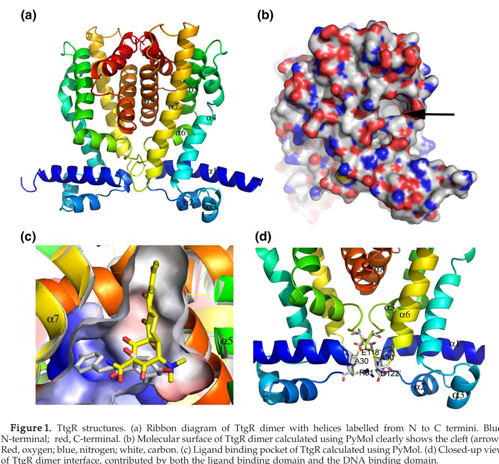

## Question

# Gene Research for Functional Annotation

## ⚠️ CRITICAL: Gene/Protein Identification Context

**BEFORE YOU BEGIN RESEARCH:** You MUST verify you are researching the CORRECT gene/protein. Gene symbols can be ambiguous, especially for less well-characterized genes from non-model organisms.

### Target Gene/Protein Identity (from UniProt):
- **UniProt Accession:** Q88N29
- **Protein Description:** RecName: Full=Probable HTH-type transcriptional regulator TtgR; AltName: Full=Efflux pump ttgABC operon regulator;
- **Gene Information:** Name=ttgR; OrderedLocusNames=PP_1387;
- **Organism (full):** Pseudomonas putida (strain ATCC 47054 / DSM 6125 / CFBP 8728 / NCIMB 11950 / KT2440).
- **Protein Family:** Not specified in UniProt
- **Key Domains:** DNA-bd_HTH_TetR-type_CS. (IPR023772); Homeodomain-like_sf. (IPR009057); HTH-type_TetR-like_transc_reg. (IPR050109); HTH_TetR. (IPR001647); Tet_transcr_reg_TetR-rel_C_sf. (IPR036271)

### MANDATORY VERIFICATION STEPS:

1. **Check if the gene symbol "ttgR" matches the protein description above**
2. **Verify the organism is correct:** Pseudomonas putida (strain ATCC 47054 / DSM 6125 / CFBP 8728 / NCIMB 11950 / KT2440).
3. **Check if protein family/domains align with what you find in literature**
4. **If you find literature for a DIFFERENT gene with the same or similar symbol, STOP**

### If Gene Symbol is Ambiguous or You Cannot Find Relevant Literature:

**DO NOT PROCEED WITH RESEARCH ON A DIFFERENT GENE.** Instead:
- State clearly: "The gene symbol 'ttgR' is ambiguous or literature is limited for this specific protein"
- Explain what you found (e.g., "Found extensive literature on a different gene with the same symbol in a different organism")
- Describe the protein based ONLY on the UniProt information provided above
- Suggest that the protein function can be inferred from domain/family information

### Research Target:

Please provide a comprehensive research report on the gene **ttgR** (gene ID: ttgR, UniProt: Q88N29) in PSEPK.

The research report should be a detailed narrative explaining the function, biological processes, and localization of the gene product. Citations should be given for all claims.

You should prioritize authoritative reviews and primary scientific literature when conducting research. You can supplement
this with annotations you find in gene/protein databases, but these can be outdated or inaccurate.

We are specifically interested in the primary function of the gene - for enzymes, what reaction is catalyzed, and what is the substrate specificity? For transporters, what is the substrate? For structural proteins or adapters, what is the broader structural role? For signaling molecules, what is the role in the pathway.

We are interested in where in or outside the cell the gene product carries out its function.

We are also interested in the signaling or biochemical pathways in which the gene functions. We are less interested in broad pleiotropic effects, except where these elucidate the precise role.

Include evidence where possible. We are interested in both experimental evidence as well as inference from structure, evolution, or bioinformatic analysis. Precise studies should be prioritized over high-throughput, where available.

## Output

Question: You are an expert researcher providing comprehensive, well-cited information.

Provide detailed information focusing on:
1. Key concepts and definitions with current understanding
2. Recent developments and latest research (prioritize 2023-2024 sources)
3. Current applications and real-world implementations
4. Expert opinions and analysis from authoritative sources
5. Relevant statistics and data from recent studies

Format as a comprehensive research report with proper citations. Include URLs and publication dates where available.
Always prioritize recent, authoritative sources and provide specific citations for all major claims.

# Gene Research for Functional Annotation

## ⚠️ CRITICAL: Gene/Protein Identification Context

**BEFORE YOU BEGIN RESEARCH:** You MUST verify you are researching the CORRECT gene/protein. Gene symbols can be ambiguous, especially for less well-characterized genes from non-model organisms.

### Target Gene/Protein Identity (from UniProt):
- **UniProt Accession:** Q88N29
- **Protein Description:** RecName: Full=Probable HTH-type transcriptional regulator TtgR; AltName: Full=Efflux pump ttgABC operon regulator;
- **Gene Information:** Name=ttgR; OrderedLocusNames=PP_1387;
- **Organism (full):** Pseudomonas putida (strain ATCC 47054 / DSM 6125 / CFBP 8728 / NCIMB 11950 / KT2440).
- **Protein Family:** Not specified in UniProt
- **Key Domains:** DNA-bd_HTH_TetR-type_CS. (IPR023772); Homeodomain-like_sf. (IPR009057); HTH-type_TetR-like_transc_reg. (IPR050109); HTH_TetR. (IPR001647); Tet_transcr_reg_TetR-rel_C_sf. (IPR036271)

### MANDATORY VERIFICATION STEPS:

1. **Check if the gene symbol "ttgR" matches the protein description above**
2. **Verify the organism is correct:** Pseudomonas putida (strain ATCC 47054 / DSM 6125 / CFBP 8728 / NCIMB 11950 / KT2440).
3. **Check if protein family/domains align with what you find in literature**
4. **If you find literature for a DIFFERENT gene with the same or similar symbol, STOP**

### If Gene Symbol is Ambiguous or You Cannot Find Relevant Literature:

**DO NOT PROCEED WITH RESEARCH ON A DIFFERENT GENE.** Instead:
- State clearly: "The gene symbol 'ttgR' is ambiguous or literature is limited for this specific protein"
- Explain what you found (e.g., "Found extensive literature on a different gene with the same symbol in a different organism")
- Describe the protein based ONLY on the UniProt information provided above
- Suggest that the protein function can be inferred from domain/family information

### Research Target:

Please provide a comprehensive research report on the gene **ttgR** (gene ID: ttgR, UniProt: Q88N29) in PSEPK.

The research report should be a detailed narrative explaining the function, biological processes, and localization of the gene product. Citations should be given for all claims.

You should prioritize authoritative reviews and primary scientific literature when conducting research. You can supplement
this with annotations you find in gene/protein databases, but these can be outdated or inaccurate.

We are specifically interested in the primary function of the gene - for enzymes, what reaction is catalyzed, and what is the substrate specificity? For transporters, what is the substrate? For structural proteins or adapters, what is the broader structural role? For signaling molecules, what is the role in the pathway.

We are interested in where in or outside the cell the gene product carries out its function.

We are also interested in the signaling or biochemical pathways in which the gene functions. We are less interested in broad pleiotropic effects, except where these elucidate the precise role.

Include evidence where possible. We are interested in both experimental evidence as well as inference from structure, evolution, or bioinformatic analysis. Precise studies should be prioritized over high-throughput, where available.

## Comprehensive research report: **TtgR (ttgR; PP_1387; UniProt Q88N29)** in *Pseudomonas putida* KT2440

### 0) Identity verification (critical disambiguation)
The gene symbol **ttgR** in *Pseudomonas putida* **KT2440** maps to **locus PP_1387** and sits divergently adjacent to the **ttgABC** efflux operon (**PP_1386/PP_1385/PP_1384 = ttgA/ttgB/ttgC**), consistent with the UniProt record context provided (Q88N29; regulator of ttgABC). This KT2440 mapping is stated explicitly in a KT2440-focused efflux pump dissertation and is consistent with a KT2440 transcriptomics study referencing PP_1387/ttgR as the operon regulator. (stein2023navigatingpyoverdineand pages 31-34, tettmann2014knockoutofextracytoplasmic pages 5-6)

### 1) Key concepts and definitions (current understanding)

#### 1.1 TetR-family HTH transcriptional repressors
**TtgR** is best understood as a **TetR-family helix–turn–helix (HTH) transcriptional repressor**. TetR-family regulators typically (i) bind an operator sequence via an N-terminal HTH DNA-binding domain, (ii) form dimers, and (iii) undergo allosteric changes upon small-molecule effector binding that reduce DNA affinity, thereby derepressing target genes. For TtgR specifically, structural and biochemical work describes a **canonical TetR-like architecture** with an N-terminal DNA-binding domain and a C-terminal ligand-binding/dimerization domain, and a largely α-helical fold. (daniels2010domaincrosstalkduring pages 1-2, alguel2007crystalstructuresof pages 1-2, santiago2015desarrollodeprocesos pages 54-58)

#### 1.2 RND tripartite efflux pumps and the ttgABC system
The **ttgABC** operon encodes a **tripartite RND-family efflux pump** (inner-membrane transporter + membrane fusion protein + outer-membrane channel) that contributes to intrinsic and inducible tolerance/resistance to chemically diverse toxic compounds. Within KT2440, TtgABC is described as a multidrug efflux system with experimental evidence supporting broad substrate export, and its name is historically linked to **toluene tolerance** (“ttg”). (tettmann2014knockoutofextracytoplasmic pages 5-6, stein2023navigatingpyoverdineand pages 31-34)

### 2) Molecular function of TtgR and regulated processes

#### 2.1 Primary function: ligand-responsive repression of the ttgABC efflux operon
TtgR’s **primary function** is repression of **ttgABC** transcription via operator binding in the **ttgR/ttgA intergenic region**. In the presence of specific toxic compounds (effectors/ligands), TtgR’s DNA-binding affinity decreases, enabling **upregulation of efflux pump expression** and increased tolerance to those compounds. (daniels2010domaincrosstalkduring pages 1-2, daniels2010domaincrosstalkduring pages 2-3, stein2023navigatingpyoverdineand pages 34-43)

#### 2.2 Operator binding and cooperativity
Biochemical characterization indicates TtgR binds a pseudo-palindromic operator overlapping the divergent promoters, and **two TtgR dimers** can bind cooperatively to the operator DNA. This cooperativity is consistent with tight repression under basal conditions and a switch-like derepression upon effector binding. (daniels2010domaincrosstalkduring pages 2-3)

### 3) Ligands/inducers and substrate scope (functional context)

#### 3.1 Effector (ligand) classes sensed by TtgR
TtgR binds and responds to chemically diverse effectors, including:
- **Antibiotics** such as **tetracycline** and **chloramphenicol** (also linked to derepression/induction of ttgABC). (alguel2007crystalstructuresof pages 2-4, alguel2007crystalstructuresof pages 9-11, stein2023navigatingpyoverdineand pages 34-43)
- **Plant antimicrobials / flavonoids**, including **quercetin**, **naringenin**, and **phloretin**. (alguel2007crystalstructuresof pages 2-4, alguel2007crystalstructuresof pages 9-11)
A key structural generalization from crystallographic analysis is that ligands share at least one **aromatic ring** feature, consistent with a hydrophobic binding environment. (alguel2007crystalstructuresof pages 2-4)

#### 3.2 Substrates and physiological relevance of TtgABC (as output of TtgR regulation)
KT2440-focused synthesis describes TtgABC as associated with efflux/tolerance to **toluene**, multiple antibiotics (e.g., **chloramphenicol, carbenicillin, tetracycline, erythromycin, nalidixic acid**), and additional compound classes (e.g., bile salts/deoxycholate and bipyridyl derivatives) in the broader KT2440 efflux literature summary. (stein2023navigatingpyoverdineand pages 31-34)

### 4) Structure–function relationships and quantitative biophysics

#### 4.1 Overall fold and domains
Crystallography shows each TtgR monomer contains **nine α-helices** organized into two domains: an **N-terminal HTH DNA-binding domain** (α1–α3; residues 1–53) and a **C-terminal ligand-binding domain** (α4–α9; residues 54–210). (alguel2007crystalstructuresof pages 1-2)

#### 4.2 Ligand-binding pocket architecture and binding sites
Structural and mutational work supports **two distinct but overlapping ligand-binding sites** within a **large, largely hydrophobic pocket**. One site is broader/hydrophobic; the other is deeper and more polar. The effector-binding cavity is described as lined by hydrophobic residues (e.g., Leu-66, Val-96, Phe-168, Val-171) with polar residues at the pocket bottom (e.g., Asn-110, His-114, Asp-172). (daniels2010domaincrosstalkduring pages 2-3, alguel2007crystalstructuresof pages 1-2)

Visual structural evidence (ligand pocket and representative ligands) is shown in the extracted figures from Alguel et al. 2007, including overall dimer architecture and ligand interaction panels. (alguel2007crystalstructuresof media 18c56565, alguel2007crystalstructuresof media 99d9985c)

#### 4.3 Quantitative structural/biophysical parameters
Reported quantitative parameters include:
- **Crystal structure resolution** for antibiotic complexes (e.g., tetracycline/chloramphenicol) at **2.7 Å**. (alguel2007crystalstructuresof pages 2-4)
- **Pocket volume ~1500 ų** and DNA-recognition helix separation reported as **42 Å** (structural geometry consistent with TetR-like regulators). (alguel2007crystalstructuresof pages 2-4)
- Apparent ligand-binding affinities reported in the range of **K\_D ~10–50 μM** (from biophysical assays such as ITC). (alguel2007crystalstructuresof pages 9-11)

#### 4.4 Allostery and mutational evidence (expert mechanistic interpretation)
Mutational studies provide strong mechanistic evidence for **inter-domain communication**: substitutions within the ligand-binding pocket can alter **both effector response and DNA-binding affinity**, supporting an allosteric pathway from ligand binding → conformational change → decreased operator binding. Quantitatively, reported operator-binding differences include **3-fold stronger binding** (L66A) and **15-fold stronger binding** (L66AV96A) compared with wild type, whereas H67A binds ~**3-fold weaker** than wild type. (daniels2010domaincrosstalkduring pages 1-2, daniels2010domaincrosstalkduring pages 9-10)

### 5) Biological roles, pathways, and cellular localization

#### 5.1 Cellular localization
TtgR functions as a **cytosolic DNA-binding transcription factor**, acting at the chromosomal **ttgR/ttgA promoter-operator region**. Its downstream regulated system, TtgABC, is a **cell-envelope spanning efflux pump** (inner membrane/outer membrane-associated tripartite assembly). (daniels2010domaincrosstalkduring pages 1-2, tettmann2014knockoutofextracytoplasmic pages 5-6)

#### 5.2 Physiological roles in stress tolerance, antibiotic resistance, and biofilm phenotypes (KT2440)
In KT2440, experimental work connecting the ttgABC locus to phenotypes indicates:
- **Overexpression of ttgABC** can increase **biofilm formation by ~25%**, and deletion/inactivation of ttgABC modulates antibiotic susceptibility. (tettmann2014knockoutofextracytoplasmic pages 5-6)
- TtgABC is implicated in resistance/susceptibility to multiple antibiotics including **ciprofloxacin, meropenem, chloramphenicol, nalidixic acid, sulfamethoxazole** (increased susceptibility when TtgABC is inactivated). (tettmann2014knockoutofextracytoplasmic pages 5-6)
- The efflux inhibitor **PAβN** (phenyl-arginine-β-naphthylamide; 10 μg/mL in the cited assay context) can eliminate certain biofilm differences linked to efflux activity, supporting efflux-dependent phenotypes. (tettmann2014knockoutofextracytoplasmic pages 5-6)

While the cited KT2440 transcriptome study focuses on an ECF sigma-factor knockout background, it explicitly identifies **ttgR (PP_1387)** as the regulator of ttgABC and demonstrates locus-level dysregulation of the ttgABC/ttgR region with downstream phenotypic consequences tied to efflux activity. (tettmann2014knockoutofextracytoplasmic pages 5-6)

#### 5.3 Induction magnitude (quantitative expression context)
A KT2440 study cites prior observations that **ttgABC expression can rise ~3–4-fold** in response to some antibiotics (e.g., chloramphenicol, tetracycline), consistent with an inducible efflux response. (tettmann2014knockoutofextracytoplasmic pages 5-6)

### 6) Recent developments (prioritizing 2023–2024)

#### 6.1 2023: KT2440-focused synthesis of efflux pump roles and TtgR positioning
A 2023 KT2440-focused dissertation consolidates the organization and broad substrate associations of TtgABC and explicitly states **ttgR = PP_1387** as the upstream repressor with antibiotic-inducible activity, describing release from DNA upon exposure to hydrophobic antibiotics (example: chloramphenicol). It also notes that **mutations in ttgR** are associated with upregulated TtgABC expression in multidrug-resistant isolates, consistent with TtgR’s role as a repressor gatekeeper. (stein2023navigatingpyoverdineand pages 31-34, stein2023navigatingpyoverdineand pages 34-43)

#### 6.2 2024: TtgR as a resveratrol-responsive biosensor component for ultrahigh-throughput screening
A 2024 study in *Biotechnology for Biofuels and Bioproducts* implements a **TtgR-based resveratrol biosensor** in *E. coli* in which TtgR controls **mCherry** expression in response to resveratrol produced by an engineered pathway. The study reports:
- Resveratrol production of **~160 mg/L** in the described strain context (linked to their biosensor-enabled workflow). (chen2024ultrahighthroughputscreeningassistedin pages 8-11)
- A FACS-based selection step where **5,000 cells** were collected at a **0.592‰ sorting threshold**, with **>60%** of sorted cells showing improved fluorescence relative to the starting strain. (chen2024ultrahighthroughputscreeningassistedin pages 8-11)
- Selected retransformed strains showing resveratrol titers **more than twice** that of the control group, supporting real utility of the TtgR biosensor for production screening/optimization. (chen2024ultrahighthroughputscreeningassistedin pages 8-11)

This represents a notable “latest research” development: TtgR’s natural ligand promiscuity and operator logic are repurposed into an **in vivo metabolite–fluorescence coupling** for directed evolution / pathway improvement. (chen2024ultrahighthroughputscreeningassistedin pages 8-11)

### 7) Current applications and real-world implementations

#### 7.1 Metabolic engineering and strain screening (2023–2024)
- **Plant natural product biosynthesis / enzyme-library screening:** A 2023 biosensor review describes engineered TtgR used as a **resveratrol-responsive sensor** to screen pathway enzyme libraries (e.g., 4CL mutagenesis library) and identify mutants improving resveratrol/naringenin production. (zhang2023applicationofmetaboliteresponsive pages 7-9)
- **High-throughput selection of improved producers:** The 2024 work described above provides a practical implementation of TtgR-based biosensing coupled to cell sorting, yielding improved resveratrol-producing strains. (chen2024ultrahighthroughputscreeningassistedin pages 8-11)

#### 7.2 Clinical/therapeutic relevance as an antimicrobial-resistance mechanism (conceptual application)
Although KT2440 is non-pathogenic, TtgR regulates an RND efflux system that exports antibiotics and other antimicrobials, and the TtgR/TtgABC axis is routinely discussed as a model for understanding efflux-mediated resistance and its regulation via ligand-responsive repressors. The key translational concept is that efflux regulation and ligand recognition contribute to multidrug tolerance, motivating structural and mechanistic studies of regulators like TtgR. (daniels2010domaincrosstalkduring pages 1-2, alguel2007crystalstructuresof pages 2-4)

### 8) Expert opinions / authoritative analysis (interpreting the evidence)

1. **Broad ligand specificity is structurally “designed” by a large, mostly hydrophobic pocket with overlapping sub-sites.** Crystallographic evidence for multiple chemically distinct ligands and a large pocket volume supports the interpretation that TtgR evolved as a “multidrug sensor” for chemically diverse aromatic toxins. (alguel2007crystalstructuresof pages 2-4, alguel2007crystalstructuresof pages 1-2, alguel2007crystalstructuresof media 99d9985c)
2. **Allostery couples ligand binding to DNA-binding changes via inter-domain communication.** Mutations in the effector pocket that substantially alter operator affinity and effector responsiveness support a mechanistic model where ligand binding shifts helical orientations (including DNA-binding helix geometry) to reduce operator binding. (daniels2010domaincrosstalkduring pages 1-2, daniels2010domaincrosstalkduring pages 9-10)
3. **Regulatory mutations in ttgR are plausible evolutionary routes to multidrug resistance.** KT2440-focused synthesis notes MDR isolates with ttgR mutations show increased TtgABC expression, aligning with the general evolutionary pattern where loss-of-repressor function derepresses efflux. (stein2023navigatingpyoverdineand pages 34-43)

### 9) Key quantitative statistics/data points (compiled)
- TtgR antibiotic complex structure resolution: **2.7 Å** (tetracycline/chloramphenicol complexes). (alguel2007crystalstructuresof pages 2-4)
- Ligand-binding pocket volume: **~1500 ų**. (alguel2007crystalstructuresof pages 2-4)
- Apparent ligand-binding affinity: **K\_D ~10–50 μM** (ITC-reported range in Alguel et al.). (alguel2007crystalstructuresof pages 9-11)
- DNA-binding affinity shifts from pocket mutations: up to **15-fold** tighter binding (L66AV96A) and ~**3-fold** weaker binding (H67A). (daniels2010domaincrosstalkduring pages 1-2, daniels2010domaincrosstalkduring pages 9-10)
- KT2440 phenotype: TtgABC overexpression increases biofilm formation by **~25%**. (tettmann2014knockoutofextracytoplasmic pages 5-6)
- KT2440 induction magnitude cited: **~3–4-fold** increased ttgABC expression in response to certain antibiotics (e.g., chloramphenicol, tetracycline; cited as prior observations). (tettmann2014knockoutofextracytoplasmic pages 5-6)
- 2024 TtgR-based resveratrol biosensor application: resveratrol titer **~160 mg/L**; **5,000** cells sorted at **0.592‰** threshold; **>60%** improved fluorescence; selected strains **>2×** control titer. (chen2024ultrahighthroughputscreeningassistedin pages 8-11)

### 10) Evidence map (compact functional annotation table)
| Aspect | Key findings | Evidence/citations |
|---|---|---|
| Identity | UniProt Q88N29 corresponds to **TtgR / PP_1387** in *Pseudomonas putida* KT2440; KT2440 literature places **ttgR (PP_1387)** immediately adjacent to and regulating the **ttgABC** efflux operon. | (stein2023navigatingpyoverdineand pages 31-34, tettmann2014knockoutofextracytoplasmic pages 5-6) |
| Protein family/domains | TtgR is a **TetR-family HTH-type transcriptional repressor**. Structural work describes a **210-aa**, largely **α-helical**, **dimeric** regulator with an **N-terminal DNA-binding HTH domain** and a **C-terminal ligand-binding/dimerization domain**. | (daniels2010domaincrosstalkduring pages 1-2, alguel2007crystalstructuresof pages 1-2, santiago2015desarrollodeprocesos pages 54-58) |
| Regulated genes/operon | TtgR represses the **ttgABC** operon, encoding an **RND-family tripartite efflux pump** (**ttgA/PP_1386, ttgB/PP_1385, ttgC/PP_1384**). TtgR also autoregulates from the divergent **ttgR/ttgA intergenic region**. | (daniels2010domaincrosstalkduring pages 1-2, daniels2010domaincrosstalkduring pages 2-3, stein2023navigatingpyoverdineand pages 31-34, tettmann2014knockoutofextracytoplasmic pages 5-6) |
| Mechanism | In the absence of effectors, TtgR binds a **pseudo-palindromic operator** overlapping the **ttgR/ttgA promoters**; **two TtgR dimers** bind cooperatively. Effector binding triggers conformational changes that lower DNA affinity and derepress **ttgABC** transcription. | (daniels2010domaincrosstalkduring pages 2-3, daniels2010domaincrosstalkduring pages 9-10, santiago2015desarrollodeprocesos pages 54-58) |
| Ligands/inducers | Reported effectors include **antibiotics** (**tetracycline, chloramphenicol**), **flavonoids/plant antimicrobials** (**quercetin, naringenin, phloretin**), and aromatic/toxic compounds. A common feature is usually **at least one aromatic ring**. | (alguel2007crystalstructuresof pages 2-4, alguel2007crystalstructuresof pages 9-11, alguel2007crystalstructuresof pages 1-2) |
| Structural/biophysical quantitative data | Crystal structures were solved for ligand complexes including tetracycline and chloramphenicol at **2.7 Å**; ligand-binding pocket volume is about **1500 ų**; DNA-recognition helices are separated by **42 Å**; apparent ligand **K\_D ~10–50 μM**. TtgR has **two overlapping ligand-binding sites** (broad hydrophobic and deeper polar). | (alguel2007crystalstructuresof pages 2-4, alguel2007crystalstructuresof pages 9-11, alguel2007crystalstructuresof pages 1-2, alguel2007crystalstructuresof media 18c56565) |
| Phenotypes/quantitative data | Loss of **ttgR** causes pump overproduction and increased resistance to **carbenicillin, chloramphenicol, nalidixic acid, tetracycline**. In KT2440, **ttgABC** overexpression increased biofilm formation by about **25%**, while pump inactivation increased susceptibility to **ciprofloxacin, meropenem, chloramphenicol, nalidixic acid, sulfamethoxazole**. Some antibiotics induce **ttgABC ~3–4-fold**. | (daniels2010domaincrosstalkduring pages 1-2, daniels2010domaincrosstalkduring pages 9-10, tettmann2014knockoutofextracytoplasmic pages 5-6) |
| Localization | TtgR is a **cytosolic DNA-binding regulator** acting at the **chromosomal ttgR/ttgABC promoter region**; its functional output controls the **cell-envelope-associated TtgABC RND efflux pump**. | (daniels2010domaincrosstalkduring pages 1-2, daniels2010domaincrosstalkduring pages 2-3, tettmann2014knockoutofextracytoplasmic pages 5-6) |

*Table: This table summarizes the core functional annotation of TtgR (Q88N29/PP_1387) in *Pseudomonas putida* KT2440, including identity, mechanism, ligands, quantitative structural data, phenotypes, and localization. It is useful as a compact evidence map linking KT2440 locus information to mechanistic and structural literature.*

### 11) Limitations and scope notes
1. **Strain context for high-resolution structural work:** Much mechanistic structural work is reported for *P. putida* **DOT-T1E**, a solvent-tolerant strain, rather than KT2440. However, KT2440-specific sources confirm the same **ttgR/ttgABC locus pairing (PP_1387–PP_1384)** and the same regulatory role, and the TetR-family architecture/mechanism is consistent across strains. (alguel2007crystalstructuresof pages 1-2, stein2023navigatingpyoverdineand pages 31-34)
2. **Recent (2023–2024) KT2440 primary mechanistic updates are limited in the retrieved set.** The most substantive 2023–2024 “latest developments” in the retrieved corpus are **applications** (biosensors/directed evolution) and KT2440-focused synthesis rather than new KT2440 structural biology. (chen2024ultrahighthroughputscreeningassistedin pages 8-11, stein2023navigatingpyoverdineand pages 31-34)

### 12) Reference URLs and publication dates (from cited sources)
- Alguel et al. **2007-06**. *J. Mol. Biol.* “Crystal structures of multidrug binding protein TtgR…” https://doi.org/10.1016/j.jmb.2007.03.062 (alguel2007crystalstructuresof pages 2-4, alguel2007crystalstructuresof pages 1-2)
- Daniels et al. **2010-07**. *J. Biol. Chem.* “Domain cross-talk during effector binding…” https://doi.org/10.1074/jbc.M110.113282 (daniels2010domaincrosstalkduring pages 1-2)
- Tettmann et al. **2014-08**. *Appl. Environ. Microbiol.* “Knockout of ECF-10 affects stress resistance…” https://doi.org/10.1128/aem.01291-14 (tettmann2014knockoutofextracytoplasmic pages 5-6)
- Stein **2023-01**. Dissertation (LMU Munich) “Navigating pyoverdine and beyond…” https://doi.org/10.5282/edoc.32605 (stein2023navigatingpyoverdineand pages 31-34)
- Zhang et al. **2023-06**. *Biosensors* review “Application of metabolite-responsive biosensors…” https://doi.org/10.3390/bios13060633 (zhang2023applicationofmetaboliteresponsive pages 7-9)
- Chen et al. **2024-01**. *Biotechnology for Biofuels and Bioproducts* “Ultrahigh-throughput screening-assisted…” https://doi.org/10.1186/s13068-024-02457-w (chen2024ultrahighthroughputscreeningassistedin pages 8-11)

### 13) Included visual evidence
- Cropped figures from Alguel et al. 2007 illustrating TtgR dimer structure and ligand-binding pocket and ligand interaction panels (including tetracycline/chloramphenicol/quercetin/naringenin/phloretin). (alguel2007crystalstructuresof media 18c56565, alguel2007crystalstructuresof media 99d9985c, alguel2007crystalstructuresof media 8bbbe2ab)

References

1. (stein2023navigatingpyoverdineand pages 31-34): Nicola Victoria Maria Stein. Navigating pyoverdine and beyond: the role of tripartite efflux pumps in pseudomonas putida kt2440. Dissertation, Jan 2023. URL: https://doi.org/10.5282/edoc.32605, doi:10.5282/edoc.32605. This article has 1 citations.

2. (tettmann2014knockoutofextracytoplasmic pages 5-6): Beatrix Tettmann, Andreas Dötsch, Olivier Armant, Christopher D. Fjell, and Joerg Overhage. Knockout of extracytoplasmic function sigma factor ecf-10 affects stress resistance and biofilm formation in pseudomonas putida kt2440. Aug 2014. URL: https://doi.org/10.1128/aem.01291-14, doi:10.1128/aem.01291-14. This article has 38 citations and is from a peer-reviewed journal.

3. (daniels2010domaincrosstalkduring pages 1-2): Craig Daniels, Abdelali Daddaoua, Duo Lu, Xiaodong Zhang, and Juan-Luis Ramos. Domain cross-talk during effector binding to the multidrug binding ttgr regulator. Journal of Biological Chemistry, 285:21372-21381, Jul 2010. URL: https://doi.org/10.1074/jbc.m110.113282, doi:10.1074/jbc.m110.113282. This article has 33 citations and is from a domain leading peer-reviewed journal.

4. (alguel2007crystalstructuresof pages 1-2): Yilmaz Alguel, Cuixiang Meng, Wilson Terán, Tino Krell, Juan L. Ramos, María-Trinidad Gallegos, and Xiaodong Zhang. Crystal structures of multidrug binding protein ttgr in complex with antibiotics and plant antimicrobials. Journal of Molecular Biology, 369:829-840, Jun 2007. URL: https://doi.org/10.1016/j.jmb.2007.03.062, doi:10.1016/j.jmb.2007.03.062. This article has 163 citations and is from a domain leading peer-reviewed journal.

5. (santiago2015desarrollodeprocesos pages 54-58): CA Molina Santiago. Desarrollo de procesos biotecnológicos basados en cepas de pseudomonas putida: mecanismos de señalización y biosíntesis de antibióticos. Unknown journal, 2015.

6. (daniels2010domaincrosstalkduring pages 2-3): Craig Daniels, Abdelali Daddaoua, Duo Lu, Xiaodong Zhang, and Juan-Luis Ramos. Domain cross-talk during effector binding to the multidrug binding ttgr regulator. Journal of Biological Chemistry, 285:21372-21381, Jul 2010. URL: https://doi.org/10.1074/jbc.m110.113282, doi:10.1074/jbc.m110.113282. This article has 33 citations and is from a domain leading peer-reviewed journal.

7. (stein2023navigatingpyoverdineand pages 34-43): Nicola Victoria Maria Stein. Navigating pyoverdine and beyond: the role of tripartite efflux pumps in pseudomonas putida kt2440. Dissertation, Jan 2023. URL: https://doi.org/10.5282/edoc.32605, doi:10.5282/edoc.32605. This article has 1 citations.

8. (alguel2007crystalstructuresof pages 2-4): Yilmaz Alguel, Cuixiang Meng, Wilson Terán, Tino Krell, Juan L. Ramos, María-Trinidad Gallegos, and Xiaodong Zhang. Crystal structures of multidrug binding protein ttgr in complex with antibiotics and plant antimicrobials. Journal of Molecular Biology, 369:829-840, Jun 2007. URL: https://doi.org/10.1016/j.jmb.2007.03.062, doi:10.1016/j.jmb.2007.03.062. This article has 163 citations and is from a domain leading peer-reviewed journal.

9. (alguel2007crystalstructuresof pages 9-11): Yilmaz Alguel, Cuixiang Meng, Wilson Terán, Tino Krell, Juan L. Ramos, María-Trinidad Gallegos, and Xiaodong Zhang. Crystal structures of multidrug binding protein ttgr in complex with antibiotics and plant antimicrobials. Journal of Molecular Biology, 369:829-840, Jun 2007. URL: https://doi.org/10.1016/j.jmb.2007.03.062, doi:10.1016/j.jmb.2007.03.062. This article has 163 citations and is from a domain leading peer-reviewed journal.

10. (alguel2007crystalstructuresof media 18c56565): Yilmaz Alguel, Cuixiang Meng, Wilson Terán, Tino Krell, Juan L. Ramos, María-Trinidad Gallegos, and Xiaodong Zhang. Crystal structures of multidrug binding protein ttgr in complex with antibiotics and plant antimicrobials. Journal of Molecular Biology, 369:829-840, Jun 2007. URL: https://doi.org/10.1016/j.jmb.2007.03.062, doi:10.1016/j.jmb.2007.03.062. This article has 163 citations and is from a domain leading peer-reviewed journal.

11. (alguel2007crystalstructuresof media 99d9985c): Yilmaz Alguel, Cuixiang Meng, Wilson Terán, Tino Krell, Juan L. Ramos, María-Trinidad Gallegos, and Xiaodong Zhang. Crystal structures of multidrug binding protein ttgr in complex with antibiotics and plant antimicrobials. Journal of Molecular Biology, 369:829-840, Jun 2007. URL: https://doi.org/10.1016/j.jmb.2007.03.062, doi:10.1016/j.jmb.2007.03.062. This article has 163 citations and is from a domain leading peer-reviewed journal.

12. (daniels2010domaincrosstalkduring pages 9-10): Craig Daniels, Abdelali Daddaoua, Duo Lu, Xiaodong Zhang, and Juan-Luis Ramos. Domain cross-talk during effector binding to the multidrug binding ttgr regulator. Journal of Biological Chemistry, 285:21372-21381, Jul 2010. URL: https://doi.org/10.1074/jbc.m110.113282, doi:10.1074/jbc.m110.113282. This article has 33 citations and is from a domain leading peer-reviewed journal.

13. (chen2024ultrahighthroughputscreeningassistedin pages 8-11): Shuaili Chen, Zhanhao Yang, Ze Zhong, Shiqin Yu, Jingwen Zhou, Jianghua Li, Guocheng Du, and Guoqiang Zhang. Ultrahigh-throughput screening-assisted in vivo directed evolution for enzyme engineering. Biotechnology for Biofuels and Bioproducts, Jan 2024. URL: https://doi.org/10.1186/s13068-024-02457-w, doi:10.1186/s13068-024-02457-w. This article has 25 citations and is from a domain leading peer-reviewed journal.

14. (zhang2023applicationofmetaboliteresponsive pages 7-9): Jianli Zhang, Xinyu Gong, Qi Gan, and Yajun Yan. Application of metabolite-responsive biosensors for plant natural products biosynthesis. Biosensors, 13:633, Jun 2023. URL: https://doi.org/10.3390/bios13060633, doi:10.3390/bios13060633. This article has 17 citations.

15. (alguel2007crystalstructuresof media 8bbbe2ab): Yilmaz Alguel, Cuixiang Meng, Wilson Terán, Tino Krell, Juan L. Ramos, María-Trinidad Gallegos, and Xiaodong Zhang. Crystal structures of multidrug binding protein ttgr in complex with antibiotics and plant antimicrobials. Journal of Molecular Biology, 369:829-840, Jun 2007. URL: https://doi.org/10.1016/j.jmb.2007.03.062, doi:10.1016/j.jmb.2007.03.062. This article has 163 citations and is from a domain leading peer-reviewed journal.

## Artifacts

- [Edison artifact artifact-00](ttgR-deep-research-falcon_artifacts/artifact-00.md)

## Citations

1. daniels2010domaincrosstalkduring pages 2-3
2. alguel2007crystalstructuresof pages 2-4
3. stein2023navigatingpyoverdineand pages 31-34
4. alguel2007crystalstructuresof pages 1-2
5. alguel2007crystalstructuresof pages 9-11
6. tettmann2014knockoutofextracytoplasmic pages 5-6
7. chen2024ultrahighthroughputscreeningassistedin pages 8-11
8. zhang2023applicationofmetaboliteresponsive pages 7-9
9. stein2023navigatingpyoverdineand pages 34-43
10. daniels2010domaincrosstalkduring pages 1-2
11. santiago2015desarrollodeprocesos pages 54-58
12. daniels2010domaincrosstalkduring pages 9-10
13. https://doi.org/10.1016/j.jmb.2007.03.062
14. https://doi.org/10.1074/jbc.M110.113282
15. https://doi.org/10.1128/aem.01291-14
16. https://doi.org/10.5282/edoc.32605
17. https://doi.org/10.3390/bios13060633
18. https://doi.org/10.1186/s13068-024-02457-w
19. https://doi.org/10.5282/edoc.32605,
20. https://doi.org/10.1128/aem.01291-14,
21. https://doi.org/10.1074/jbc.m110.113282,
22. https://doi.org/10.1016/j.jmb.2007.03.062,
23. https://doi.org/10.1186/s13068-024-02457-w,
24. https://doi.org/10.3390/bios13060633,