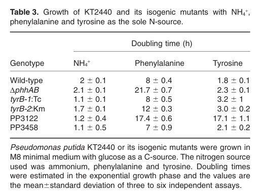
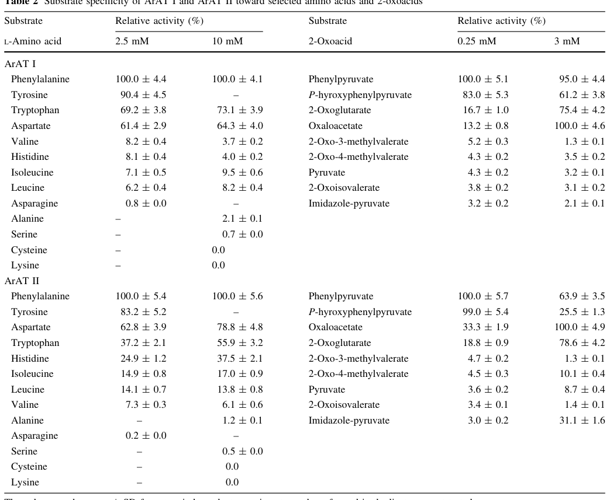

## Question

# Gene Research for Functional Annotation

## ⚠️ CRITICAL: Gene/Protein Identification Context

**BEFORE YOU BEGIN RESEARCH:** You MUST verify you are researching the CORRECT gene/protein. Gene symbols can be ambiguous, especially for less well-characterized genes from non-model organisms.

### Target Gene/Protein Identity (from UniProt):
- **UniProt Accession:** Q88LG1
- **Protein Description:** RecName: Full=Aminotransferase {ECO:0000256|RuleBase:RU000481}; EC=2.6.1.- {ECO:0000256|RuleBase:RU000481};
- **Gene Information:** Name=tyrB {ECO:0000313|EMBL:AAN67587.1}; OrderedLocusNames=PP_1972 {ECO:0000313|EMBL:AAN67587.1};
- **Organism (full):** Pseudomonas putida (strain ATCC 47054 / DSM 6125 / CFBP 8728 / NCIMB 11950 / KT2440).
- **Protein Family:** Belongs to the class-I pyridoxal-phosphate-dependent
- **Key Domains:** Aminotransferase_I/II_large. (IPR004839); Asp_trans. (IPR000796); NHTrfase_class1_PyrdxlP-BS. (IPR004838); PyrdxlP-dep_Trfase. (IPR015424); PyrdxlP-dep_Trfase_major. (IPR015421)

### MANDATORY VERIFICATION STEPS:

1. **Check if the gene symbol "tyrB" matches the protein description above**
2. **Verify the organism is correct:** Pseudomonas putida (strain ATCC 47054 / DSM 6125 / CFBP 8728 / NCIMB 11950 / KT2440).
3. **Check if protein family/domains align with what you find in literature**
4. **If you find literature for a DIFFERENT gene with the same or similar symbol, STOP**

### If Gene Symbol is Ambiguous or You Cannot Find Relevant Literature:

**DO NOT PROCEED WITH RESEARCH ON A DIFFERENT GENE.** Instead:
- State clearly: "The gene symbol 'tyrB' is ambiguous or literature is limited for this specific protein"
- Explain what you found (e.g., "Found extensive literature on a different gene with the same symbol in a different organism")
- Describe the protein based ONLY on the UniProt information provided above
- Suggest that the protein function can be inferred from domain/family information

### Research Target:

Please provide a comprehensive research report on the gene **tyrB** (gene ID: tyrB, UniProt: Q88LG1) in PSEPK.

The research report should be a detailed narrative explaining the function, biological processes, and localization of the gene product. Citations should be given for all claims.

You should prioritize authoritative reviews and primary scientific literature when conducting research. You can supplement
this with annotations you find in gene/protein databases, but these can be outdated or inaccurate.

We are specifically interested in the primary function of the gene - for enzymes, what reaction is catalyzed, and what is the substrate specificity? For transporters, what is the substrate? For structural proteins or adapters, what is the broader structural role? For signaling molecules, what is the role in the pathway.

We are interested in where in or outside the cell the gene product carries out its function.

We are also interested in the signaling or biochemical pathways in which the gene functions. We are less interested in broad pleiotropic effects, except where these elucidate the precise role.

Include evidence where possible. We are interested in both experimental evidence as well as inference from structure, evolution, or bioinformatic analysis. Precise studies should be prioritized over high-throughput, where available.

## Output

Question: You are an expert researcher providing comprehensive, well-cited information.

Provide detailed information focusing on:
1. Key concepts and definitions with current understanding
2. Recent developments and latest research (prioritize 2023-2024 sources)
3. Current applications and real-world implementations
4. Expert opinions and analysis from authoritative sources
5. Relevant statistics and data from recent studies

Format as a comprehensive research report with proper citations. Include URLs and publication dates where available.
Always prioritize recent, authoritative sources and provide specific citations for all major claims.

# Gene Research for Functional Annotation

## ⚠️ CRITICAL: Gene/Protein Identification Context

**BEFORE YOU BEGIN RESEARCH:** You MUST verify you are researching the CORRECT gene/protein. Gene symbols can be ambiguous, especially for less well-characterized genes from non-model organisms.

### Target Gene/Protein Identity (from UniProt):
- **UniProt Accession:** Q88LG1
- **Protein Description:** RecName: Full=Aminotransferase {ECO:0000256|RuleBase:RU000481}; EC=2.6.1.- {ECO:0000256|RuleBase:RU000481};
- **Gene Information:** Name=tyrB {ECO:0000313|EMBL:AAN67587.1}; OrderedLocusNames=PP_1972 {ECO:0000313|EMBL:AAN67587.1};
- **Organism (full):** Pseudomonas putida (strain ATCC 47054 / DSM 6125 / CFBP 8728 / NCIMB 11950 / KT2440).
- **Protein Family:** Belongs to the class-I pyridoxal-phosphate-dependent
- **Key Domains:** Aminotransferase_I/II_large. (IPR004839); Asp_trans. (IPR000796); NHTrfase_class1_PyrdxlP-BS. (IPR004838); PyrdxlP-dep_Trfase. (IPR015424); PyrdxlP-dep_Trfase_major. (IPR015421)

### MANDATORY VERIFICATION STEPS:

1. **Check if the gene symbol "tyrB" matches the protein description above**
2. **Verify the organism is correct:** Pseudomonas putida (strain ATCC 47054 / DSM 6125 / CFBP 8728 / NCIMB 11950 / KT2440).
3. **Check if protein family/domains align with what you find in literature**
4. **If you find literature for a DIFFERENT gene with the same or similar symbol, STOP**

### If Gene Symbol is Ambiguous or You Cannot Find Relevant Literature:

**DO NOT PROCEED WITH RESEARCH ON A DIFFERENT GENE.** Instead:
- State clearly: "The gene symbol 'tyrB' is ambiguous or literature is limited for this specific protein"
- Explain what you found (e.g., "Found extensive literature on a different gene with the same symbol in a different organism")
- Describe the protein based ONLY on the UniProt information provided above
- Suggest that the protein function can be inferred from domain/family information

### Research Target:

Please provide a comprehensive research report on the gene **tyrB** (gene ID: tyrB, UniProt: Q88LG1) in PSEPK.

The research report should be a detailed narrative explaining the function, biological processes, and localization of the gene product. Citations should be given for all claims.

You should prioritize authoritative reviews and primary scientific literature when conducting research. You can supplement
this with annotations you find in gene/protein databases, but these can be outdated or inaccurate.

We are specifically interested in the primary function of the gene - for enzymes, what reaction is catalyzed, and what is the substrate specificity? For transporters, what is the substrate? For structural proteins or adapters, what is the broader structural role? For signaling molecules, what is the role in the pathway.

We are interested in where in or outside the cell the gene product carries out its function.

We are also interested in the signaling or biochemical pathways in which the gene functions. We are less interested in broad pleiotropic effects, except where these elucidate the precise role.

Include evidence where possible. We are interested in both experimental evidence as well as inference from structure, evolution, or bioinformatic analysis. Precise studies should be prioritized over high-throughput, where available.

# Research report: **tyrB (PP_1972; UniProt Q88LG1)** in *Pseudomonas putida* KT2440

## 0) Target verification (gene/protein identity)

The requested UniProt entry **Q88LG1** corresponds to *Pseudomonas putida* KT2440 gene **tyrB** with locus tag **PP_1972**. In KT2440-focused literature analyzing aromatic amino acid catabolism, **PP1972 is explicitly referred to as tyrB-1**, while a paralogous aminotransferase gene (**tyrB-2**) is associated with **PP_3590** (also discussed as **amaC** in later work), confirming that the report targets the correct gene/protein in the correct organism/strain (ATCC 47054/KT2440) and not a different “tyrB” from another organism. (herrera2010identificationandcharacterization pages 1-2, borchert2024machinelearninganalysis pages 7-11)

## 1) Key concepts and definitions (current understanding)

### 1.1 What “TyrB” typically denotes in bacteria
In many bacteria, **TyrB** denotes a **PLP-dependent aminotransferase** that catalyzes reversible **transamination** reactions, transferring an amino group between an amino acid and an α-keto acid. In *Pseudomonas*, enzymes annotated as TyrB-family aminotransferases have been studied primarily in the context of **aromatic amino acid transformations**, i.e., interconversion between aromatic amino acids (phenylalanine/tyrosine/tryptophan) and their corresponding aromatic 2-oxoacids. (szkop2013tyrb2andphhc pages 1-2)

### 1.2 General PLP-aminotransferase chemistry (mechanism-level view)
PLP-dependent transaminases operate through **two half-reactions** in which the cofactor cycles between **pyridoxal-5′-phosphate (PLP)** and **pyridoxamine phosphate (PMP)**, with key intermediates (external aldimine, quinonoid, ketimine) formed during amino-group transfer. A frequent structural theme is an **oligomeric enzyme (often a homodimer)** with active sites formed by residues from both subunits. (menke2024proteinengineeringof pages 22-25, menke2024proteinengineeringof pages 25-28)

This mechanism-level understanding is important for functional annotation because it explains (i) why **PLP is required**, (ii) why **α-keto acids such as 2-oxoglutarate or pyruvate** commonly serve as amino acceptors, and (iii) why these enzymes can show **substrate promiscuity** that complicates gene-to-function assignment by annotation alone. (menke2024proteinengineeringof pages 22-25, menke2024proteinengineeringof pages 25-28)

## 2) Molecular function of **PP_1972 (tyrB; Q88LG1)**

### 2.1 Enzyme class and likely reaction
Direct purified-enzyme biochemistry for **PP_1972/Q88LG1** was not found in the retrieved full texts; however, multiple KT2440 studies place PP_1972 among **aromatic/tyrosine aminotransferase-like genes** and test its role genetically. (herrera2010identificationandcharacterization pages 1-2, herrera2010identificationandcharacterization pages 4-5, borchert2024machinelearninganalysis pages 7-11)

The reaction class most consistent with the TyrB annotation in this KT2440 context is an aromatic amino acid transamination such as:

- **L-tyrosine + 2-oxoglutarate ⇌ 4-hydroxyphenylpyruvate + L-glutamate**
- **L-phenylalanine + 2-oxoglutarate ⇌ phenylpyruvate + L-glutamate**

Support for this reaction type comes from protein-level characterization of closely related *P. putida* aromatic aminotransferases (encoded by **tyrB-2** and **phhC**), which preferentially catalyze transamination involving aromatic amino acids and aromatic 2-oxoacids, with **PLP** included as cofactor and **2-oxoglutarate** used as amino acceptor in assays. (szkop2013tyrb2andphhc pages 1-2, szkop2013tyrb2andphhc media f8f3824d)

### 2.2 Substrate specificity (direct evidence from *P. putida* aromatic aminotransferases)
While the enzyme characterized biochemically in *P. putida* was not PP_1972, **Table 2** from Szkop & Bielawski (2013) provides detailed substrate profiles for two *P. putida* aromatic aminotransferase isozymes, showing that they most efficiently catalyze reactions involving **aromatic amino acids and aromatic 2-oxoacids**, with **L-phenylalanine and phenylpyruvate** being the best substrates reported. Assays used **0.1 M phosphate buffer (pH 8.0)**, **3 mM 2-oxoglutarate**, **10 µM PLP**, and 35 °C—conditions consistent with fold-type I PLP aminotransferase enzymology. (szkop2013tyrb2andphhc pages 1-2, szkop2013tyrb2andphhc media f8f3824d)

These data support that TyrB-like enzymes in *P. putida* are plausibly **aromatic aminotransferases** rather than strictly tyrosine-specific enzymes, and that substrate promiscuity and isozyme redundancy should be expected in vivo. (szkop2013tyrb2andphhc pages 1-2, szkop2013tyrb2andphhc media f8f3824d)

## 3) Biological role and pathways in *P. putida* KT2440

### 3.1 Phenylalanine utilization routes and PhhR-controlled regulon
A central KT2440 pathway context is phenylalanine assimilation/catabolism regulated by **PhhR**, which induces the **phhAB operon** encoding a pterin-dependent **phenylalanine hydroxylase system** (PhhA catalytic hydroxylase; PhhB pterin cofactor regeneration). This provides a route for conversion of **L-phenylalanine to L-tyrosine**. (herrera2010identificationandcharacterization pages 1-2)

Herrera et al. (2010) place phenylalanine/tyrosine degradation into a larger catabolic funnel via **p-hydroxyphenylpyruvate** and **homogentisate** (hpd/hmg genes), which then feeds into central metabolism. (herrera2010identificationandcharacterization pages 4-5)

### 3.2 Genetic evidence for tyrB-family involvement in phenylalanine/tyrosine catabolism
In KT2440, mutants in TyrB-like genes exhibit measurable growth phenotypes on aromatic amino acids as nitrogen sources.

- Wild-type KT2440 doubling time: ~**8 h** on **phenylalanine**; ~**1.8 h** on **tyrosine**.
- **tyrB-1 (PP_1972)** mutant: phenylalanine growth near WT, but slower on tyrosine (~**3.2 h**).
- **tyrB-2** mutant: slower on phenylalanine (~**12 h**) and slower on tyrosine (~**3.0 h**).

This pattern supports that TyrB-family enzymes contribute to aromatic amino acid utilization, with a stronger phenotype for tyrB-2 in phenylalanine conditions in this dataset. (herrera2010identificationandcharacterization media d9fda959, herrera2010identificationandcharacterization pages 4-5)

### 3.3 Redundancy and reassignment of “primary” aromatic aminotransferase (major recent development)
A key development in 2024 is that machine-learning analysis of RB-TnSeq fitness compendia (ICA-derived “fModules”) was used to pinpoint genes involved in phenylalanine/tyrosine catabolism, followed by mutant validation.

Borchert et al. (2024, published March 2024; https://doi.org/10.1128/msystems.00942-23) report that disruption of **tyrB (PP_1972)** **did not inhibit** growth on L-phenylalanine or L-tyrosine as sole nitrogen sources, whereas disruption of **amaC (PP_3590; sometimes called tyrB2)** **completely abrogated** growth on these substrates. The authors therefore propose **re-annotation of AmaC (PP_3590) as an L-tyrosine aminotransferase**, implying that **PP_1972 is not the primary enzyme** for these growth phenotypes under the tested conditions and that previous “tyrB” annotation may overstate its physiological importance. (borchert2024machinelearninganalysis pages 7-11)

This reconciles earlier BarSeq-based observations that PP_1972 often shows **weak fitness effects** and that a **PP_3590/PP_1972 double knockout did not cause phenylalanine auxotrophy**, consistent with broader redundancy or alternative routes, while still allowing PP_1972 to contribute in specific environments or regulatory states. (schmidt2022nitrogenmetabolismin pages 8-10, schmidt2022nitrogenmetabolismin pages 10-12)

## 4) Cellular localization

No retrieved KT2440 primary source in this corpus provided a direct experimental localization (cytosol/periplasm) for **PP_1972/Q88LG1**.

For context on what localization evidence looks like for bacterial PLP-dependent aminotransferases, Ringel et al. (2017) show that a distinct **periplasmic** PLP-dependent transaminase (PtaA) can be demonstrated by subcellular fractionation and is a **homodimer** by SEC-MALS; however, this is a different enzyme in a different *Pseudomonas* species and should not be taken as evidence that PP_1972 is periplasmic. (ringel2017theperiplasmictransaminase pages 16-18)

**Current best-supported statement from the retrieved KT2440 corpus:** localization of PP_1972 remains **unresolved** here and should be taken from UniProt/InterPro experimental annotations if available, or validated experimentally.

## 5) Current applications and real-world implementations

### 5.1 Functional genomics for strain engineering and annotation (2024)
The 2024 RB‑TnSeq + ICA framework provides a practical route to **re-annotate metabolic genes** and identify engineering targets for *P. putida* as a chassis. In particular, the ability to distinguish **PP_1972 (tyrB)** from **PP_3590 (AmaC)** as the functionally dominant aminotransferase for phenylalanine/tyrosine utilization under defined conditions is directly actionable for (i) redirecting aromatic amino acid flux, and (ii) avoiding incorrect knockouts when designing production strains. (borchert2024machinelearninganalysis pages 7-11)

### 5.2 Engineering relevance via aromatic-stress tolerance and aromatic feedstocks
Borchert et al. (2024) also connect aminotransferase-linked modules to tolerance phenotypes during growth with **high concentrations of hydroxycinnamates** (e.g., ~60 mM in glucose + hydroxycinnamate tests; and higher concentrations as carbon sources in some conditions). These results highlight that aromatic amino acid and aromatic acid metabolism genes can have roles in **stress tolerance**, a key trait for industrial bioprocessing on lignin-derived aromatics. (borchert2024machinelearninganalysis pages 7-11)

### 5.3 Broader industrial deployment of PLP-transaminases (expert review)
Menke (2024) reviews industrial and engineering aspects of PLP-dependent amine transaminases (ATAs), emphasizing (i) their use in stereoselective synthesis of chiral amines, (ii) the importance of addressing unfavorable equilibria (e.g., via coproduct removal or sacrificial donors), and (iii) the rise of machine-learning-guided engineering. The review notes an industrial benchmark: (R)-ATA-catalyzed synthesis of **(R)-sitagliptin** with **>99.95% optical purity**, and also reports large engineering gains (e.g., up to **2000-fold** improved catalytic activity in one redesign example), illustrating the real-world value of understanding transaminase substrate specificity and engineering it rationally. (menke2024proteinengineeringof pages 61-71)

Although this review is not specific to PP_1972, it provides authoritative context for why TyrB-family enzymes and related aminotransferases are frequently targeted in metabolic engineering and biocatalysis.

## 6) Summary of key quantitative evidence (recent and classic)

1. **Mutant growth phenotypes (KT2440; 2010):** doubling times on phenylalanine and tyrosine as sole N sources show measurable aromatic-amino-acid-related phenotypes for tyrB mutants, with a stronger phenotype for tyrB-2 in phenylalanine conditions. (herrera2010identificationandcharacterization media d9fda959)
2. **Functional genomics/fitness and redundancy (2022):** PP_1972 shows weak fitness effects in some aromatic N-source conditions and is genetically redundant with other aminotransferases in some contexts. (schmidt2022nitrogenmetabolismin pages 8-10, schmidt2022nitrogenmetabolismin pages 10-12)
3. **Reannotation-driven experimental validation (2024):** PP_1972 knockout does not inhibit growth on L-Phe/L-Tyr as sole N sources, while PP_3590 (AmaC) knockout abolishes growth, supporting updated functional assignment of the dominant aromatic aminotransferase in those conditions. (borchert2024machinelearninganalysis pages 7-11)
4. **Biochemical assay conditions and substrate profiles (2013):** *P. putida* aromatic aminotransferase isozymes show strongest activity for aromatic amino acids/2-oxoacids (e.g., L-Phe/phenylpyruvate) in PLP + 2-oxoglutarate-dependent assays. (szkop2013tyrb2andphhc media f8f3824d)

## 7) Practical functional-annotation conclusion for **PP_1972 (tyrB; Q88LG1)**

**Most defensible functional annotation from the retrieved evidence:**

- **Gene/protein:** tyrB (PP_1972; UniProt Q88LG1) in *P. putida* KT2440.
- **Molecular function:** PLP-dependent **aminotransferase** in the aromatic/tyrosine aminotransferase-like set of enzymes in *Pseudomonas*; likely catalyzes reversible transamination between aromatic amino acids (e.g., tyrosine/phenylalanine) and α-keto acids (commonly 2-oxoglutarate), but **direct biochemical constants for PP_1972 are not established** in the retrieved corpus. (herrera2010identificationandcharacterization pages 1-2, szkop2013tyrb2andphhc media f8f3824d)
- **Biological process/pathway:** participates (directly or redundantly) in **aromatic amino acid utilization/catabolism** connected to phenylalanine → tyrosine conversion (PhhAB) and downstream degradation via p-hydroxyphenylpyruvate/homogentisate. Genetic data indicate PP_1972 contributes measurably to tyrosine growth in some conditions but is not the primary determinant of Phe/Tyr utilization in others. (herrera2010identificationandcharacterization pages 4-5, herrera2010identificationandcharacterization media d9fda959, borchert2024machinelearninganalysis pages 7-11)
- **Systems-level role:** part of a **redundant aminotransferase network** in KT2440; recent (2024) work indicates that PP_3590 (AmaC) dominates growth phenotypes on Phe/Tyr as N sources, and PP_1972 disruption alone may not block those pathways under standard minimal-media conditions. (borchert2024machinelearninganalysis pages 7-11, schmidt2022nitrogenmetabolismin pages 10-12)
- **Cellular localization:** **not resolved** from retrieved KT2440 evidence; should be verified experimentally or via curated UniProt localization annotations. (ringel2017theperiplasmictransaminase pages 16-18)

## 8) Evidence table (quick reference)

| Aspect | Evidence summary | Key quantitative data |
|---|---|---|
| Target identity | UniProt Q88LG1 corresponds to **tyrB / PP_1972** in *Pseudomonas putida* KT2440; genome annotation in KT2440 literature lists **PP1972** as **tyrB-1**, one of two tyrosine/aromatic aminotransferase-like genes in this strain (herrera2010identificationandcharacterization pages 1-2, herrera2010identificationandcharacterization pages 9-10) | Locus tags/names reported as **PP1972 / tyrB-1**; paralog also noted as **PP3590 / tyrB-2** (herrera2010identificationandcharacterization pages 1-2) |
| Predicted molecular function/class | TyrB/PP_1972 is an **aminotransferase** in the **PLP-dependent aromatic amino acid aminotransferase** class; related *P. putida* aromatic aminotransferases preferentially transaminate aromatic amino acids with 2-oxoglutarate, with best substrates including **L-phenylalanine** and **phenylpyruvate** (szkop2013tyrb2andphhc pages 2-4, szkop2013tyrb2andphhc pages 1-2) | Assays for related *P. putida* ArAT enzymes used **10 µM PLP** and **3 mM 2-oxoglutarate**; activity measured as release of **1 µmol IPyA min⁻¹** in L-tryptophan:2-oxoglutarate assays (szkop2013tyrb2andphhc pages 2-4) |
| Pathway role in aromatic amino acid metabolism | In KT2440, phenylalanine can be degraded by the **phenylalanine hydroxylase pathway** (PhhAB → tyrosine → p-hydroxyphenylpyruvate → homogentisate), and KT2440 carries two TyrB-like aminotransferase genes. Mutant phenotypes support TyrB-family participation in **phenylalanine/tyrosine catabolism**, especially downstream aromatic transamination steps (herrera2010identificationandcharacterization pages 4-5, herrera2010identificationandcharacterization pages 1-2) | Wild type doubling times on sole N source: **phenylalanine ~8 h**, **tyrosine ~1.8 h**; **tyrB-1** mutant: phenylalanine ~WT, tyrosine **~3.2 h**; **tyrB-2** mutant: phenylalanine **~12 h**, tyrosine **~3.0 h** (herrera2010identificationandcharacterization pages 4-5, herrera2010identificationandcharacterization media d9fda959) |
| Evidence for redundancy | Recent RB-TnSeq and prior knockout work indicate **functional redundancy** among aromatic aminotransferases in *P. putida* KT2440: PP_1972 has only weak single-gene phenotypes in some aromatic N-source conditions, and even combined loss with PP_3590 did not cause phenylalanine auxotrophy (schmidt2022nitrogenmetabolismin pages 8-10, schmidt2022nitrogenmetabolismin pages 10-12) | BarSeq fitness effects for **PP_1972** were small: phenylalanine **-0.35** and pipecolate **-0.15** in one report; another excerpt summarizes similarly weak effects and cites no phenylalanine auxotrophy in the **PP_3590 PP_1972** double knockout (schmidt2022nitrogenmetabolismin pages 8-10, schmidt2022nitrogenmetabolismin pages 10-12) |
| Strength/limits of direct evidence for Q88LG1 | Evidence for **PP_1972/Q88LG1 specifically** is mainly **genetic/fitness-based** in KT2440; direct biochemical characterization in *P. putida* has more clearly identified other aromatic aminotransferase isozymes (**tyrB-2/phhC**) than PP_1972 itself, so annotation of Q88LG1 is supported by homology plus mutant evidence rather than purified-enzyme kinetics (szkop2013tyrb2andphhc pages 1-2, schmidt2022nitrogenmetabolismin pages 10-12) | No direct purified-enzyme kinetic constants for **PP_1972/Q88LG1** were extracted from the cited KT2440 sources; strongest KT2440-specific quantitative data are mutant doubling times and RB-TnSeq fitness values (schmidt2022nitrogenmetabolismin pages 10-12, herrera2010identificationandcharacterization media d9fda959) |

*Table: This table summarizes the strongest available evidence for functional annotation of *Pseudomonas putida* KT2440 tyrB (PP_1972; UniProt Q88LG1), including its identity, predicted aminotransferase role, pathway context, redundancy, and the key quantitative phenotypes available from mutant and fitness studies.*

## 9) Source list (with URLs and publication dates where available)

- Herrera MC, Duque E, Rodríguez‑Herva JJ, Fernández‑Escamilla AM, Ramos JL. **Identification and characterization of the PhhR regulon in *Pseudomonas putida*.** *Environmental Microbiology* (Jun **2010**). https://doi.org/10.1111/j.1462-2920.2009.02124.x (herrera2010identificationandcharacterization pages 1-2, herrera2010identificationandcharacterization media d9fda959)
- Szkop M, Bielawski W. **tyrB-2 and phhC genes of *Pseudomonas putida* encode aromatic amino acid aminotransferase isozymes: evidence at the protein level.** *Amino Acids* (May **2013**). https://doi.org/10.1007/s00726-013-1508-y (szkop2013tyrb2andphhc pages 1-2, szkop2013tyrb2andphhc media f8f3824d)
- Schmidt M et al. **Nitrogen metabolism in *Pseudomonas putida*: functional analysis using random barcode transposon sequencing.** *Applied and Environmental Microbiology* (Apr **2022**). https://doi.org/10.1128/aem.02430-21 (schmidt2022nitrogenmetabolismin pages 8-10, schmidt2022nitrogenmetabolismin pages 10-12)
- Borchert AJ et al. **Machine learning analysis of RB‑TnSeq fitness data predicts functional gene modules in *Pseudomonas putida* KT2440.** *mSystems* (Mar **2024**). https://doi.org/10.1128/msystems.00942-23 (borchert2024machinelearninganalysis pages 7-11)
- Menke M. **Protein Engineering of Amine Transaminases and Methyltransferases using Machine Learning and High-Throughput Screening Tools.** (**2024**; journal not captured in retrieved metadata). (menke2024proteinengineeringof pages 61-71, menke2024proteinengineeringof pages 25-28)

## 10) Key limitations and recommended next steps

- **Direct PP_1972 enzymology:** The retrieved corpus lacks purified-enzyme kinetics (Km/kcat) and direct substrate panels for **PP_1972/Q88LG1** specifically; current enzymatic claims for PP_1972 are therefore best stated as **inference from gene context + mutant/fitness phenotypes** and from biochemical characterization of close isozymes in *P. putida*. (borchert2024machinelearninganalysis pages 7-11, szkop2013tyrb2andphhc media f8f3824d)
- **Localization:** No KT2440 localization evidence for PP_1972 was found here. If localization is critical (e.g., for pathway compartmentalization or cofactor supply), it should be determined experimentally (cell fractionation, fluorescence tagging) or taken from curated UniProt/InterPro annotations.

References

1. (herrera2010identificationandcharacterization pages 1-2): M. Carmen Herrera, Estrella Duque, José J. Rodríguez‐Herva, Ana M. Fernández‐Escamilla, and Juan L. Ramos. Identification and characterization of the phhr regulon in pseudomonas putida. Environmental microbiology, 12 6:1427-38, Jun 2010. URL: https://doi.org/10.1111/j.1462-2920.2009.02124.x, doi:10.1111/j.1462-2920.2009.02124.x. This article has 43 citations and is from a domain leading peer-reviewed journal.

2. (borchert2024machinelearninganalysis pages 7-11): Andrew J. Borchert, Alissa C. Bleem, Hyun Gyu Lim, Kevin Rychel, Keven D. Dooley, Zoe A. Kellermyer, Tracy L. Hodges, Bernhard O. Palsson, and Gregg T. Beckham. Machine learning analysis of rb-tnseq fitness data predicts functional gene modules in <i>pseudomonas putida</i> kt2440. Mar 2024. URL: https://doi.org/10.1128/msystems.00942-23, doi:10.1128/msystems.00942-23. This article has 13 citations and is from a peer-reviewed journal.

3. (szkop2013tyrb2andphhc pages 1-2): Michał Szkop and Wiesław Bielawski. Tyrb-2 and phhc genes of pseudomonas putida encode aromatic amino acid aminotransferase isozymes: evidence at the protein level. Amino Acids, 45:351-358, May 2013. URL: https://doi.org/10.1007/s00726-013-1508-y, doi:10.1007/s00726-013-1508-y. This article has 5 citations and is from a peer-reviewed journal.

4. (menke2024proteinengineeringof pages 22-25): M Menke. Protein engineering of amine transaminases and methyltransferases using machine learning and high-throughput screening tools. Unknown journal, 2024.

5. (menke2024proteinengineeringof pages 25-28): M Menke. Protein engineering of amine transaminases and methyltransferases using machine learning and high-throughput screening tools. Unknown journal, 2024.

6. (herrera2010identificationandcharacterization pages 4-5): M. Carmen Herrera, Estrella Duque, José J. Rodríguez‐Herva, Ana M. Fernández‐Escamilla, and Juan L. Ramos. Identification and characterization of the phhr regulon in pseudomonas putida. Environmental microbiology, 12 6:1427-38, Jun 2010. URL: https://doi.org/10.1111/j.1462-2920.2009.02124.x, doi:10.1111/j.1462-2920.2009.02124.x. This article has 43 citations and is from a domain leading peer-reviewed journal.

7. (szkop2013tyrb2andphhc media f8f3824d): Michał Szkop and Wiesław Bielawski. Tyrb-2 and phhc genes of pseudomonas putida encode aromatic amino acid aminotransferase isozymes: evidence at the protein level. Amino Acids, 45:351-358, May 2013. URL: https://doi.org/10.1007/s00726-013-1508-y, doi:10.1007/s00726-013-1508-y. This article has 5 citations and is from a peer-reviewed journal.

8. (herrera2010identificationandcharacterization media d9fda959): M. Carmen Herrera, Estrella Duque, José J. Rodríguez‐Herva, Ana M. Fernández‐Escamilla, and Juan L. Ramos. Identification and characterization of the phhr regulon in pseudomonas putida. Environmental microbiology, 12 6:1427-38, Jun 2010. URL: https://doi.org/10.1111/j.1462-2920.2009.02124.x, doi:10.1111/j.1462-2920.2009.02124.x. This article has 43 citations and is from a domain leading peer-reviewed journal.

9. (schmidt2022nitrogenmetabolismin pages 8-10): Matthias Schmidt, Allison N. Pearson, Matthew R. Incha, Mitchell G. Thompson, Edward E. K. Baidoo, Ramu Kakumanu, Aindrila Mukhopadhyay, Patrick M. Shih, Adam M. Deutschbauer, Lars M. Blank, and Jay D. Keasling. Nitrogen metabolism in pseudomonas putida: functional analysis using random barcode transposon sequencing. Applied and Environmental Microbiology, Apr 2022. URL: https://doi.org/10.1128/aem.02430-21, doi:10.1128/aem.02430-21. This article has 36 citations and is from a peer-reviewed journal.

10. (schmidt2022nitrogenmetabolismin pages 10-12): Matthias Schmidt, Allison N. Pearson, Matthew R. Incha, Mitchell G. Thompson, Edward E. K. Baidoo, Ramu Kakumanu, Aindrila Mukhopadhyay, Patrick M. Shih, Adam M. Deutschbauer, Lars M. Blank, and Jay D. Keasling. Nitrogen metabolism in pseudomonas putida: functional analysis using random barcode transposon sequencing. Applied and Environmental Microbiology, Apr 2022. URL: https://doi.org/10.1128/aem.02430-21, doi:10.1128/aem.02430-21. This article has 36 citations and is from a peer-reviewed journal.

11. (ringel2017theperiplasmictransaminase pages 16-18): Michael T. Ringel, Gerald Dräger, and Thomas Brüser. The periplasmic transaminase ptaa of pseudomonas fluorescens converts the glutamic acid residue at the pyoverdine fluorophore to α-ketoglutaric acid. Journal of Biological Chemistry, 292:18660-18671, Nov 2017. URL: https://doi.org/10.1074/jbc.m117.812545, doi:10.1074/jbc.m117.812545. This article has 17 citations and is from a domain leading peer-reviewed journal.

12. (menke2024proteinengineeringof pages 61-71): M Menke. Protein engineering of amine transaminases and methyltransferases using machine learning and high-throughput screening tools. Unknown journal, 2024.

13. (herrera2010identificationandcharacterization pages 9-10): M. Carmen Herrera, Estrella Duque, José J. Rodríguez‐Herva, Ana M. Fernández‐Escamilla, and Juan L. Ramos. Identification and characterization of the phhr regulon in pseudomonas putida. Environmental microbiology, 12 6:1427-38, Jun 2010. URL: https://doi.org/10.1111/j.1462-2920.2009.02124.x, doi:10.1111/j.1462-2920.2009.02124.x. This article has 43 citations and is from a domain leading peer-reviewed journal.

14. (szkop2013tyrb2andphhc pages 2-4): Michał Szkop and Wiesław Bielawski. Tyrb-2 and phhc genes of pseudomonas putida encode aromatic amino acid aminotransferase isozymes: evidence at the protein level. Amino Acids, 45:351-358, May 2013. URL: https://doi.org/10.1007/s00726-013-1508-y, doi:10.1007/s00726-013-1508-y. This article has 5 citations and is from a peer-reviewed journal.

## Artifacts

- [Edison artifact artifact-00](tyrB-deep-research-falcon_artifacts/artifact-00.md)

## Citations

1. herrera2010identificationandcharacterization pages 1-2
2. herrera2010identificationandcharacterization pages 4-5
3. borchert2024machinelearninganalysis pages 7-11
4. ringel2017theperiplasmictransaminase pages 16-18
5. menke2024proteinengineeringof pages 61-71
6. menke2024proteinengineeringof pages 22-25
7. menke2024proteinengineeringof pages 25-28
8. schmidt2022nitrogenmetabolismin pages 8-10
9. schmidt2022nitrogenmetabolismin pages 10-12
10. herrera2010identificationandcharacterization pages 9-10
11. https://doi.org/10.1128/msystems.00942-23
12. https://doi.org/10.1111/j.1462-2920.2009.02124.x
13. https://doi.org/10.1007/s00726-013-1508-y
14. https://doi.org/10.1128/aem.02430-21
15. https://doi.org/10.1111/j.1462-2920.2009.02124.x,
16. https://doi.org/10.1128/msystems.00942-23,
17. https://doi.org/10.1007/s00726-013-1508-y,
18. https://doi.org/10.1128/aem.02430-21,
19. https://doi.org/10.1074/jbc.m117.812545,