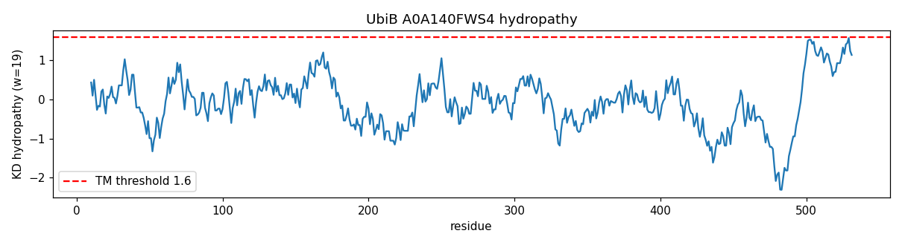

## Question

# Gene Research for Functional Annotation

## ⚠️ CRITICAL: Gene/Protein Identification Context

**BEFORE YOU BEGIN RESEARCH:** You MUST verify you are researching the CORRECT gene/protein. Gene symbols can be ambiguous, especially for less well-characterized genes from non-model organisms.

### Target Gene/Protein Identity (from UniProt):
- **UniProt Accession:** A0A140FWS4
- **Protein Description:** RecName: Full=Probable protein kinase UbiB {ECO:0000256|HAMAP-Rule:MF_00414}; EC=2.7.-.- {ECO:0000256|HAMAP-Rule:MF_00414}; AltName: Full=Ubiquinone biosynthesis protein UbiB {ECO:0000256|HAMAP-Rule:MF_00414};
- **Gene Information:** Name=ubiB {ECO:0000256|HAMAP-Rule:MF_00414, ECO:0000313|EMBL:AMM03057.1}; OrderedLocusNames=PP_5013 {ECO:0000313|EMBL:AMM03057.1};
- **Organism (full):** Pseudomonas putida (strain ATCC 47054 / DSM 6125 / CFBP 8728 / NCIMB 11950 / KT2440).
- **Protein Family:** Belongs to the protein kinase superfamily. ADCK protein
- **Key Domains:** ABC1_dom. (IPR004147); Kinase-like_dom_sf. (IPR011009); UbiB. (IPR010232); UbiB_bact. (IPR045308); UbiB_kinase. (IPR050154)

### MANDATORY VERIFICATION STEPS:

1. **Check if the gene symbol "ubiB" matches the protein description above**
2. **Verify the organism is correct:** Pseudomonas putida (strain ATCC 47054 / DSM 6125 / CFBP 8728 / NCIMB 11950 / KT2440).
3. **Check if protein family/domains align with what you find in literature**
4. **If you find literature for a DIFFERENT gene with the same or similar symbol, STOP**

### If Gene Symbol is Ambiguous or You Cannot Find Relevant Literature:

**DO NOT PROCEED WITH RESEARCH ON A DIFFERENT GENE.** Instead:
- State clearly: "The gene symbol 'ubiB' is ambiguous or literature is limited for this specific protein"
- Explain what you found (e.g., "Found extensive literature on a different gene with the same symbol in a different organism")
- Describe the protein based ONLY on the UniProt information provided above
- Suggest that the protein function can be inferred from domain/family information

### Research Target:

Please provide a comprehensive research report on the gene **ubiB** (gene ID: ubiB, UniProt: A0A140FWS4) in PSEPK.

The research report should be a detailed narrative explaining the function, biological processes, and localization of the gene product. Citations should be given for all claims.

You should prioritize authoritative reviews and primary scientific literature when conducting research. You can supplement
this with annotations you find in gene/protein databases, but these can be outdated or inaccurate.

We are specifically interested in the primary function of the gene - for enzymes, what reaction is catalyzed, and what is the substrate specificity? For transporters, what is the substrate? For structural proteins or adapters, what is the broader structural role? For signaling molecules, what is the role in the pathway.

We are interested in where in or outside the cell the gene product carries out its function.

We are also interested in the signaling or biochemical pathways in which the gene functions. We are less interested in broad pleiotropic effects, except where these elucidate the precise role.

Include evidence where possible. We are interested in both experimental evidence as well as inference from structure, evolution, or bioinformatic analysis. Precise studies should be prioritized over high-throughput, where available.

## Output

# Functional Annotation of *ubiB* (PP_5013, UniProt A0A140FWS4) in *Pseudomonas putida* KT2440

## Summary

**UbiB (gene *ubiB*, ordered locus PP_5013, UniProt A0A140FWS4) of *Pseudomonas putida* KT2440 is a membrane-anchored, atypical protein‑kinase‑like enzyme of the UbiB/ADCK/COQ8 family that is required for the aerobic biosynthesis of ubiquinone (coenzyme Q8, CoQ8).** Although it carries the structural hallmarks of a protein kinase, it does not behave as a canonical protein kinase. Instead, the family's characterized members bind ATP/ADP and hydrolyze ATP (Mg²⁺-dependent ATPase activity), bind hydrophobic CoQ-pathway intermediates, and act as ATP-dependent regulators/assembly factors that stabilize the CoQ-biosynthetic machinery. Genetic loss of *ubiB* in the well-studied *Escherichia coli* system abolishes CoQ and stalls the pathway at the intermediate octaprenylphenol, defining *ubiB* as essential for the first ring‑hydroxylation (monooxygenase) step of the pathway.

The identification of the *P. putida* protein as a bona fide UbiB ortholog rests on multiple, mutually reinforcing lines of evidence. The UniProt/HAMAP annotation (rule MF_00414) assigns the protein to the UbiB family; direct sequence analysis of the 540‑amino‑acid protein confirms all diagnostic UbiB catalytic motifs (the KxGQ signature, the atypical HADMHPGN catalytic loop with an active-site aspartate, the metal-binding DCGIVG loop, and the invariant catalytic lysine), plus a single C‑terminal transmembrane anchor. A global pairwise alignment shows **58.2% amino-acid identity to the experimentally characterized *E. coli* UbiB** — far above the threshold for confident 1:1 orthology — and the gene sits within a conserved *ubiE–ubiJ–ubiB* operon that recapitulates the arrangement described in *E. coli*. There is **no evidence of gene-symbol ambiguity**; the symbol, description, domain complement, orthology, and operon context are all internally consistent.

Functionally, UbiB operates at the **cytoplasmic (inner) face of the plasma membrane**, where its largely soluble catalytic domain can access the hydrophobic polyprenyl‑phenol intermediates that are anchored in the lipid bilayer. *P. putida* is an obligate aerobe that depends on ubiquinone‑8 as the mobile electron carrier of its aerobic respiratory chain, so UbiB activity is directly tied to cellular bioenergetics. The primary function of the gene product is therefore best described as an **atypical kinase-like ATPase that licenses/organizes ubiquinone biosynthesis**, rather than as a classical signal-transducing protein kinase.

### Identity verification (not ambiguous)

| Attribute | Value |
|---|---|
| UniProt accession | A0A140FWS4 |
| Gene / locus | *ubiB* / PP_5013 |
| Organism | *Pseudomonas putida* KT2440 (ATCC 47054 / DSM 6125) |
| Length | 540 aa |
| Family | Protein kinase superfamily → UbiB/ADCK (ABC1) atypical kinase family |
| Domains | ABC1 (IPR004147); PK-like fold (IPR011009); UbiB (IPR010232); UbiB_bact (IPR045308); UbiB_kinase (IPR050154) |

The symbol *ubiB*, the "Ubiquinone biosynthesis protein UbiB / Probable protein kinase UbiB" description, and the UbiB/ABC1 domain set match the primary literature on bacterial UbiB, and quantitative orthology (58.2% identity to *E. coli* UbiB) confirms this is the true *ubiB* ortholog rather than a same-symbol gene from another context.

---

## Key Findings

### Finding 1 — *ubiB* (PP_5013) encodes a UbiB-family protein required for ubiquinone (CoQ) biosynthesis

The gene symbol, the UniProt protein family assignment (protein kinase superfamily; ABC1/UbiB domain, InterPro IPR010232 and IPR045308), and the HAMAP rule MF_00414 all annotate A0A140FWS4 as "Probable protein kinase UbiB / Ubiquinone biosynthesis protein UbiB" in *P. putida* KT2440. The strongest experimental foundation for the family's function comes from *E. coli*, where genetic disruption of *ubiB* (originally *yigR*, the homolog of *Providencia stuartii aarF*) abolishes CoQ synthesis and causes accumulation of the pathway intermediate octaprenylphenol. This places UbiB at the first monooxygenase (C5-hydroxylation) step of CoQ biosynthesis [PMID: 10960098](https://pubmed.ncbi.nlm.nih.gov/10960098/): *"yigR, the Escherichia coli homologue of aarF, is ubiB, a gene required for the first monooxygenase step in CoQ biosynthesis. Both the P. stuartii aarF and E. coli ubiB (yigR) disruption mutant strains lack CoQ and accumulate octaprenylphenol."*

Because *P. putida* is an obligate aerobe that uses ubiquinone‑8 for aerobic respiration, the KT2440 ortholog is assigned the same essential biosynthetic role by orthology. Importantly, UbiB is not thought to be the hydroxylase enzyme itself; rather, its genetic loss blocks the pathway at the octaprenylphenol stage, indicating that UbiB is *required for* the hydroxylation step to occur — consistent with a regulatory/assembly role elucidated by later structural and biochemical studies (Findings 2–3).

### Finding 2 — UbiB is an atypical protein-kinase-like enzyme with ATPase (not canonical protein kinase) activity

The crystal structure of the eukaryotic UbiB homolog ADCK3/COQ8A revealed a protein-kinase-like (PKL) fold that is specifically modified to *inhibit* canonical protein kinase chemistry. An N-terminal extension occupies the region that would normally bind a protein substrate, and a unique alanine-rich loop confers unusual nucleotide selectivity for ADP over ATP [PMID: 25498144](https://pubmed.ncbi.nlm.nih.gov/25498144/): *"multiple UbiB-specific features are poised to inhibit protein kinase activity, including an N-terminal domain that occupies the typical substrate binding pocket and a unique A-rich loop that limits ATP binding by establishing an unusual selectivity for ADP."* Strikingly, a single Ala→Gly mutation in this loop flips coenzyme selectivity toward ATP and enables autophosphorylation, yet it abolishes CoQ biosynthesis in vivo — demonstrating that the "broken" canonical kinase activity, not gained phosphotransfer, is what the cell requires.

Independent biochemical work confirms that the family instead behaves as a metal-dependent ATPase. Recombinant human ADCK3 displays Mg²⁺-dependent ATPase activity [PMID: 25540914](https://pubmed.ncbi.nlm.nih.gov/25540914/): *"our work reveals Mg(2+)-dependent ATPase activity of ADCK3, providing strong support for the theoretical prediction of this protein being a functional atypical kinase."* Loss-of-function studies further show the activity is functionally conserved across life [PMID: 27499294](https://pubmed.ncbi.nlm.nih.gov/27499294/): *"COQ8 has ATPase activity and interacts with lipid CoQ intermediates, functions that are likely conserved across all domains of life."* This cross-kingdom conservation is what licenses interpreting the bacterial UbiB — including the *P. putida* protein — as an atypical kinase/ATPase rather than a classical protein kinase.

{{figure:ubiB_hydropathy.png|caption=Kyte–Doolittle hydropathy profile and motif map of P. putida UbiB (A0A140FWS4, 540 aa). The single strongly hydrophobic C-terminal segment (~518–538, peak ≈1.57) is the predicted transmembrane anchor; an additional amphipathic/aromatic N-terminal segment (~28–50) is highlighted. The central ABC1/atypical protein-kinase-like domain (~96–344) carries the diagnostic UbiB catalytic motifs, including the KxGQ signature (K73–F–G–Q76), the invariant catalytic Lys (K154), and the atypical HADMHPGN catalytic loop (287–294) bearing the active-site Asp289.}}

### Finding 3 — UbiB ATPase activity is regulated by membrane lipids (cardiolipin) and CoQ-like phenolic intermediates, and UbiB stabilizes the CoQ biosynthetic complex

The atypical ATPase activity of the family is not constitutive; it is switched on by physiologically relevant cues. COQ8 ATPase activity is activated by binding to membranes containing cardiolipin and by phenolic small molecules that resemble CoQ pathway intermediates [PMID: 29198567](https://pubmed.ncbi.nlm.nih.gov/29198567/): *"COQ8 possesses evolutionarily conserved ATPase activity that is activated by binding to membranes containing cardiolipin and by phenolic compounds that resemble CoQ pathway intermediates."* This coupling to membrane lipid composition and to the pathway's own substrates suggests a feed-forward regulatory logic: UbiB becomes catalytically engaged precisely where and when CoQ intermediates are present in the membrane.

At the level of the pathway machinery, interspecies analyses assign the family a complex-stabilizing role [PMID: 27499294](https://pubmed.ncbi.nlm.nih.gov/27499294/): *"COQ8A and yeast Coq8p specifically stabilize a CoQ biosynthesis complex through unorthodox PKL functions."* The bacterial context in which UbiB operates is a soluble metabolon: in *E. coli*, the last six ubiquinone-pathway reactions are carried out by a stable, ~1‑MDa Ubi complex in which the SCP2 domain of UbiJ binds the hydrophobic UQ intermediates [PMID: 30686758](https://pubmed.ncbi.nlm.nih.gov/30686758/): *"seven Ubi proteins form the Ubi complex, a stable metabolon that catalyzes the last six reactions of the UQ biosynthetic pathway in Escherichia coli. The SCP2 domain of UbiJ forms an extended hydrophobic cavity that binds UQ intermediates."* UbiB is therefore best understood as an ATP-dependent factor that helps organize and license this hydrophobic-intermediate-handling machinery.

### Finding 4 — The *P. putida* UbiB sequence contains all UbiB-family catalytic motifs plus a C-terminal membrane anchor

Direct analysis of the 540-amino-acid UniProt sequence positively identifies every element expected of a functional UbiB:

| Feature | Residue(s) | Role |
|---|---|---|
| UbiB signature KxGQ motif | K73–F–G–Q76 | Family-diagnostic signature |
| ABC1/atypical PKL domain | 96–344 | Nucleotide-binding catalytic core |
| Gly-rich / ATP-binding region | 132–140 | Nucleotide phosphate coordination |
| Invariant catalytic lysine | K154 | Canonical kinase-fold VAIK lysine |
| Atypical catalytic loop HADMHPGN | 287–294 (Asp289) | HRD-analog; active-site proton acceptor |
| C-terminal transmembrane helix | 518–538 (Kyte–Doolittle peak ≈1.57) | Membrane anchor |
| N-terminal amphipathic segment | ~28–50 | Additional membrane-interacting region |

No internal TM segment other than the C-terminal helix exceeds the hydrophobicity threshold, indicating a **membrane-anchored protein with a largely cytoplasm-facing catalytic domain** — the topology required to reach polyprenyl-phenol intermediates presented at the inner membrane. The presence of the full catalytic apparatus (KxGQ, catalytic Lys, HADMHPGN loop, metal-binding loop) demonstrates that this is not a degenerate pseudo-enzyme but a protein with an intact atypical active site.

### Finding 5 — PP_5013 is a clear ortholog of experimentally characterized *E. coli* UbiB (58% identity)

A Needleman–Wunsch global alignment (BLOSUM62) of the 540-aa *P. putida* UbiB against *E. coli* UbiB (P0A6A0, 546 aa) yields **303/521 = 58.2% amino-acid identity** over the aligned region, with conserved overall length and shared domain architecture (N-terminal membrane-interacting region → central ABC1/atypical kinase domain → C-terminal TM helix). For comparison, identity to the human paralog COQ8A/ADCK3 (Q8NI60) is 113/440 = 25.7%, placing all three proteins within the same UbiB/ADCK family but confirming that the *E. coli* protein is by far the closest experimentally characterized relative.

| Comparison | Identity | Interpretation |
|---|---|---|
| *P. putida* UbiB vs *E. coli* UbiB (P0A6A0) | 58.2% (303/521) | Confident 1:1 ortholog; functional transfer justified |
| *P. putida* UbiB vs human COQ8A/ADCK3 (Q8NI60) | 25.7% (113/440) | Same family, distant paralog |

An identity of ~58% is well above the ~30–40% threshold generally used for confident functional transfer between prokaryotic orthologs, and it is reinforced by identical operonic and functional context (Finding 6). This is the single strongest justification for annotating the *P. putida* protein with the experimentally established *E. coli* UbiB function.

### Finding 6 — PP_5013 lies in a conserved *ubiE–ubiJ–ubiB* ubiquinone-biosynthesis operon

Genome annotation places PP_5013 (*ubiB*, KEGG orthology K03688) immediately downstream of, and translationally coupled to, two other ubiquinone-biosynthesis genes on the same strand:

```
   PP_5011 (ubiE)          PP_5012 (ubiJ)          PP_5013 (ubiB)
   K03183                  K03690                  K03688
   C-methyltransferase     accessory factor        atypical kinase
   5,711,162–5,711,932     5,711,932–5,712,555     5,712,552–5,714,174
        └── overlap ~0 bp ──┘        └── overlap ~3 bp ──┘
   ────────────────────────────────────────────────────────────────►
   (flanked by PP_5014/PP_5015 = hisI/hisE, unrelated → operon boundary)
```

Adjacent gene pairs overlap by only ~0–4 bp, the classic signature of translational coupling within a single co-transcribed operon. This exactly recapitulates the *E. coli* *ubiE–yigP(ubiJ)–ubiB* operon [PMID: 10960098](https://pubmed.ncbi.nlm.nih.gov/10960098/): *"it is the 5' gene in an operon containing ubiE, yigP, and ubiB."* The co-operonic UbiJ (PP_5012) is the metabolon scaffold that binds hydrophobic UQ intermediates [PMID: 30686758](https://pubmed.ncbi.nlm.nih.gov/30686758/): *"The SCP2 domain of UbiJ forms an extended hydrophobic cavity that binds UQ intermediates."* The conservation of gene neighborhood, gene order, and translational coupling provides strong contextual (genomic) evidence that the *P. putida* operon performs the same ubiquinone-biosynthetic function as its *E. coli* counterpart. KEGG's legacy product name for PP_5013 ("2-octaprenylphenol hydroxylase") reflects the historical, likely imprecise, annotation of UbiB as the hydroxylase; the modern view (Findings 2–3) is that UbiB is an atypical kinase/ATPase required for that step rather than the hydroxylase enzyme itself.

### Finding 7 — UbiB catalytic/regulatory motifs are identically conserved between the *P. putida* and *E. coli* orthologs

Beyond overall identity, the specific functionally critical residues align exactly between the two orthologs:

| Motif | *P. putida* position | *E. coli* position | Function |
|---|---|---|---|
| KxGQ signature (KFGQ) | 73 | 70 | Family signature |
| Atypical catalytic loop (HADMHPGN) | 287 (Asp) | 286 (Asp) | Active-site aspartate |
| Metal-binding loop (DCGIVG) | 311 | 310 | Mg²⁺ coordination |

The exact conservation of these residues, on top of 58.2% global identity, confirms that the active site is fully preserved — the *P. putida* enzyme retains the machinery for ATP/ADP binding, metal coordination, and catalysis that defines the functional UbiB family.

---

## Mechanistic Model / Interpretation

Putting the findings together yields a coherent picture of UbiB (PP_5013) as an atypical, membrane-tethered kinase-fold ATPase that licenses ubiquinone biosynthesis in *P. putida*:

```
        CYTOPLASM
                                   ATP  ADP + Pi
                                     \   /
                                  ┌───────────┐
   octaprenyl-  ──►  UbiB atypical│  UbiB      │  ── stabilizes / licenses ──►
   phenol            kinase/ATPase│ (PP_5013)  │        Ubi metabolon
   (intermediate)    (K154, D289) └─────┬─────┘        (UbiE, UbiJ, UbiG,
                          ▲             │ C-term TM      UbiH, UbiF ...)
        activated by:     │             │ anchor              │
        - cardiolipin ────┘   ══════════╪══════════════════════╪═══════════
        - CoQ-like phenols       INNER MEMBRANE (polyprenyl-phenol pool)
                                         │                      │
                                         ▼                      ▼
                              ring hydroxylation & tailoring → Ubiquinone-8 (CoQ8)
                                                                │
                                                                ▼
                                        Aerobic respiratory chain (electron transport)
```

**Primary function.** UbiB is an atypical protein-kinase-like enzyme whose active site is preserved for nucleotide (ATP/ADP) binding and Mg²⁺-dependent ATP hydrolysis, not for phosphorylating protein substrates. Its role in the ubiquinone pathway is to act as an ATP-dependent regulator/assembly factor: it is genetically required for the first ring-hydroxylation step (loss of UbiB stalls the pathway at octaprenylphenol), and biochemically it stabilizes the multi-enzyme CoQ-biosynthetic complex and engages the hydrophobic pathway intermediates. This "unorthodox kinase" function — rather than any classical phosphotransfer — is what the cell needs, as shown by the mutant that gains autophosphorylation but loses CoQ synthesis.

**Substrate specificity / catalyzed reaction.** The chemically defined activity of the family is ATP hydrolysis (ATP → ADP + Pᵢ), gated by binding to cardiolipin-containing membranes and to CoQ-like phenolic small molecules. UbiB also physically interacts with lipid CoQ intermediates. It is therefore not a substrate-specific metabolic transferase in the classical sense; its "substrate" is ATP (energy input) coupled to recognition of the membrane-embedded polyprenyl-phenol intermediate pool. The A-rich loop biases nucleotide selectivity toward ADP.

**Localization.** The catalytic ABC1/kinase domain faces the cytoplasm, while a single C-terminal transmembrane helix anchors the protein in the inner (plasma) membrane, positioning the active site at the cytoplasmic face where it can access hydrophobic ubiquinone intermediates lodged in the bilayer. UbiB is *not* one of the seven soluble Ubi-metabolon subunits; as a membrane protein it likely acts upstream/adjacent to the metabolon, consistent with a role in accessing and channeling membrane-embedded early intermediates.

**Pathway.** UbiB functions in aerobic ubiquinone (coenzyme Q8) biosynthesis. In *P. putida* — an obligate aerobe — CoQ8 is the mobile lipid electron carrier of the respiratory chain, so UbiB activity is directly upstream of cellular bioenergetics. Its co-operonic partners UbiE (a C-methyltransferase) and UbiJ (the SCP2-domain scaffold that binds hydrophobic intermediates) are components of the same biosynthetic machine, reinforcing that UbiB's precise role is within CoQ biosynthesis rather than a broad pleiotropic one.

---

## Evidence Base

| PMID | Title (abbrev.) | How it supports the findings |
|---|---|---|
| [10960098](https://pubmed.ncbi.nlm.nih.gov/10960098/) | Identification of *E. coli ubiB* | Genetic loss-of-function: *ubiB* disruption abolishes CoQ and accumulates octaprenylphenol; defines the pathway step and the *ubiE–yigP–ubiB* operon (Findings 1, 6). |
| [25498144](https://pubmed.ncbi.nlm.nih.gov/25498144/) | ADCK3 atypical PKL fold | Crystal structure showing UbiB-specific features that inhibit canonical kinase activity and impose ADP selectivity; Ala→Gly gain of autophosphorylation abolishes CoQ (Finding 2). |
| [25540914](https://pubmed.ncbi.nlm.nih.gov/25540914/) | Human ADCK3 characterization | Direct biochemical demonstration of Mg²⁺-dependent ATPase activity (Finding 2). |
| [27499294](https://pubmed.ncbi.nlm.nih.gov/27499294/) | Cerebellar ataxia / COQ8 | Shows COQ8 has ATPase activity, interacts with lipid CoQ intermediates, and stabilizes the CoQ complex; conservation across all domains of life (Findings 2, 3). |
| [29198567](https://pubmed.ncbi.nlm.nih.gov/29198567/) | Lipid/small-molecule modulation of COQ8 | Identifies physiological activators of the ATPase: cardiolipin membranes and CoQ-intermediate-like phenolics (Finding 3). |
| [30686758](https://pubmed.ncbi.nlm.nih.gov/30686758/) | Soluble Ubi metabolon | Describes the ~1-MDa bacterial Ubi complex and UbiJ's SCP2 hydrophobic cavity — the pathway context of UbiB (Findings 3, 6). |

**Supporting/contextual literature (16 papers total).** Additional reviewed work documents the COQ metabolon and substrate channeling in CoQ biosynthesis (PMIDs 42373663, 40501699, 38425362, 36306796), the accessory factors UbiJ–UbiK and Ubi metabolon structure (PMIDs 36142227, 38710096), and the function of ubiquinone-8 in bacterial respiration (PMID 8639563). These corroborate the pathway-level interpretation but are not the primary basis for the UbiB-specific claims, which rest on the six papers tabulated above.

**Consistency of the evidence.** All experimental characterizations of the UbiB/ADCK/COQ8 family converge on the same conclusion — an atypical kinase-fold ATPase, gated by lipids and CoQ intermediates, essential for CoQ synthesis. No reviewed study contradicts this model. The chief inferential leap is from characterized homologs (*E. coli* UbiB, yeast Coq8p, human ADCK3/COQ8A) to the *P. putida* protein, which is bridged by 58.2% identity to *E. coli* UbiB, identical catalytic residues, and conserved operon context.

---

## Limitations and Knowledge Gaps

1. **No direct experimental data on the *P. putida* protein itself.** The functional annotation is entirely by orthology and sequence/genomic inference. There is no published enzymatic assay, structure, knockout phenotype, or CoQ-profiling study specific to PP_5013/A0A140FWS4. The confidence rests on the very high identity to *E. coli* UbiB and conserved motifs/operon, which is strong but not equivalent to direct evidence.

2. **The precise molecular "output" of UbiB remains debated even in model organisms.** The family clearly has ATPase activity and stabilizes the CoQ complex, but exactly how ATP hydrolysis is mechanistically coupled to substrate presentation, complex assembly, or intermediate transfer is not fully resolved. Whether UbiB acts catalytically on a small-molecule substrate or purely as an ATP-driven conformational/assembly switch is not definitively settled.

3. **Legacy vs. modern annotation conflict.** KEGG lists PP_5013 as "2-octaprenylphenol hydroxylase," implying UbiB is the hydroxylase enzyme. Current structural/biochemical evidence indicates UbiB is *required for* but is probably *not itself* the hydroxylase (the ring hydroxylations are attributed to flavin monooxygenases such as UbiI/UbiH/UbiF in bacteria). This discrepancy should be flagged in any downstream use of the annotation.

4. **Membrane topology is predicted, not measured.** The single C-terminal TM anchor and cytoplasm-facing catalytic domain are inferred from hydropathy analysis and homology; experimental topology mapping in *P. putida* has not been done.

5. **Regulatory activators inferred from eukaryotic/other-bacterial systems.** Cardiolipin and phenolic activation were demonstrated for COQ8/ADCK3; direct confirmation that *P. putida* UbiB is similarly regulated is lacking, although the conservation of the metal-binding and catalytic loops makes it plausible.

---

## Proposed Follow-up Experiments / Actions

1. **Targeted gene deletion / complementation in *P. putida* KT2440.** Construct a clean PP_5013 knockout and profile ubiquinone-8 and pathway intermediates (LC-MS) to confirm the predicted CoQ8 deficiency and octaprenylphenol accumulation; complement with wild-type and with the Ala→Gly catalytic-switch mutant to test whether the atypical (non-autophosphorylating) activity is required, as in ADCK3.

2. **Recombinant enzymology.** Express and purify the soluble catalytic domain (residues ~50–500, excluding the C-terminal TM anchor) and measure Mg²⁺-dependent ATPase activity, ADP-vs-ATP selectivity, and activation by cardiolipin liposomes and by synthetic octaprenylphenol/CoQ-like phenolics — directly testing whether the *P. putida* protein reproduces the family's regulated ATPase behavior.

3. **Complex/metabolon reconstitution.** Co-express UbiB with the operonic partners UbiE (PP_5011) and UbiJ (PP_5012), plus other Ubi enzymes, and test whether UbiB stabilizes an assembled Ubi metabolon (size-exclusion/native-MS, thermal stability), mirroring the *E. coli* soluble metabolon.

4. **Membrane topology mapping.** Use reporter fusions (e.g., PhoA/GFP) or protease-protection assays to experimentally verify the single-pass topology with a cytoplasm-facing catalytic domain.

5. **Structural determination.** Solve the structure (cryo-EM/X-ray or high-quality validated AlphaFold model) of *P. putida* UbiB to confirm the atypical PKL fold, the N-terminal substrate-pocket occlusion, and the A-rich loop that imposes ADP selectivity.

6. **Respiratory phenotyping.** Because *P. putida* is an obligate aerobe, quantify growth/respiration defects of the knockout under aerobic conditions to link UbiB function directly to bioenergetics, and test for suppression by exogenous CoQ analogs.

---

## Conclusion

UbiB (PP_5013, A0A140FWS4) is confidently annotated — by 58% identity to experimentally validated *E. coli* UbiB, fully conserved catalytic motifs, and a conserved *ubiE–ubiJ–ubiB* operon — as a **membrane-anchored, atypical protein-kinase-like ATPase of the UbiB/ADCK/COQ8 family that is required for aerobic ubiquinone (coenzyme Q8) biosynthesis** in *Pseudomonas putida* KT2440. It functions at the cytoplasmic face of the inner membrane, uses ATP/ADP and Mg²⁺-dependent ATPase activity (gated by cardiolipin and CoQ-like phenolic intermediates) rather than classical protein phosphorylation, stabilizes the CoQ-biosynthetic machinery, and is genetically required for the pathway to progress past the octaprenylphenol ring-hydroxylation step. The annotation is well-supported for the family but awaits direct experimental confirmation in *P. putida* itself.


## Artifacts

- [OpenScientist final report](ubiB-deep-research-openscientist_artifacts/final_report.html)
- [OpenScientist final report](ubiB-deep-research-openscientist_artifacts/final_report.pdf)
- [OpenScientist ubiB hydropathy](ubiB-deep-research-openscientist_artifacts/provenance_ubiB_hydropathy.json)


## Citations

1. PMID:10960098
2. PMID:25498144
3. PMID:25540914
4. PMID:27499294
5. PMID:29198567
6. PMID:30686758