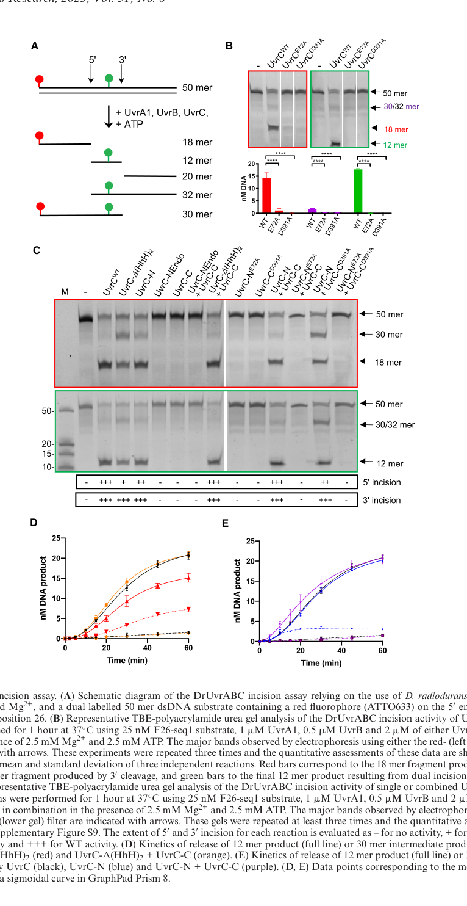

## Question

# Gene Research for Functional Annotation

## ⚠️ CRITICAL: Gene/Protein Identification Context

**BEFORE YOU BEGIN RESEARCH:** You MUST verify you are researching the CORRECT gene/protein. Gene symbols can be ambiguous, especially for less well-characterized genes from non-model organisms.

### Target Gene/Protein Identity (from UniProt):
- **UniProt Accession:** Q88LF9
- **Protein Description:** RecName: Full=UvrABC system protein B {ECO:0000255|HAMAP-Rule:MF_00204}; Short=Protein UvrB {ECO:0000255|HAMAP-Rule:MF_00204}; AltName: Full=Excinuclease ABC subunit B {ECO:0000255|HAMAP-Rule:MF_00204};
- **Gene Information:** Name=uvrB {ECO:0000255|HAMAP-Rule:MF_00204}; OrderedLocusNames=PP_1974;
- **Organism (full):** Pseudomonas putida (strain ATCC 47054 / DSM 6125 / CFBP 8728 / NCIMB 11950 / KT2440).
- **Protein Family:** Belongs to the UvrB family. {ECO:0000255|HAMAP-
- **Key Domains:** Helicase/UvrB_N. (IPR006935); Helicase_ATP-bd. (IPR014001); Helicase_C-like. (IPR001650); P-loop_NTPase. (IPR027417); UVR_dom. (IPR001943)

### MANDATORY VERIFICATION STEPS:

1. **Check if the gene symbol "uvrB" matches the protein description above**
2. **Verify the organism is correct:** Pseudomonas putida (strain ATCC 47054 / DSM 6125 / CFBP 8728 / NCIMB 11950 / KT2440).
3. **Check if protein family/domains align with what you find in literature**
4. **If you find literature for a DIFFERENT gene with the same or similar symbol, STOP**

### If Gene Symbol is Ambiguous or You Cannot Find Relevant Literature:

**DO NOT PROCEED WITH RESEARCH ON A DIFFERENT GENE.** Instead:
- State clearly: "The gene symbol 'uvrB' is ambiguous or literature is limited for this specific protein"
- Explain what you found (e.g., "Found extensive literature on a different gene with the same symbol in a different organism")
- Describe the protein based ONLY on the UniProt information provided above
- Suggest that the protein function can be inferred from domain/family information

### Research Target:

Please provide a comprehensive research report on the gene **uvrB** (gene ID: uvrB, UniProt: Q88LF9) in PSEPK.

The research report should be a detailed narrative explaining the function, biological processes, and localization of the gene product. Citations should be given for all claims.

You should prioritize authoritative reviews and primary scientific literature when conducting research. You can supplement
this with annotations you find in gene/protein databases, but these can be outdated or inaccurate.

We are specifically interested in the primary function of the gene - for enzymes, what reaction is catalyzed, and what is the substrate specificity? For transporters, what is the substrate? For structural proteins or adapters, what is the broader structural role? For signaling molecules, what is the role in the pathway.

We are interested in where in or outside the cell the gene product carries out its function.

We are also interested in the signaling or biochemical pathways in which the gene functions. We are less interested in broad pleiotropic effects, except where these elucidate the precise role.

Include evidence where possible. We are interested in both experimental evidence as well as inference from structure, evolution, or bioinformatic analysis. Precise studies should be prioritized over high-throughput, where available.

## Output

Question: You are an expert researcher providing comprehensive, well-cited information.

Provide detailed information focusing on:
1. Key concepts and definitions with current understanding
2. Recent developments and latest research (prioritize 2023-2024 sources)
3. Current applications and real-world implementations
4. Expert opinions and analysis from authoritative sources
5. Relevant statistics and data from recent studies

Format as a comprehensive research report with proper citations. Include URLs and publication dates where available.
Always prioritize recent, authoritative sources and provide specific citations for all major claims.

# Gene Research for Functional Annotation

## ⚠️ CRITICAL: Gene/Protein Identification Context

**BEFORE YOU BEGIN RESEARCH:** You MUST verify you are researching the CORRECT gene/protein. Gene symbols can be ambiguous, especially for less well-characterized genes from non-model organisms.

### Target Gene/Protein Identity (from UniProt):
- **UniProt Accession:** Q88LF9
- **Protein Description:** RecName: Full=UvrABC system protein B {ECO:0000255|HAMAP-Rule:MF_00204}; Short=Protein UvrB {ECO:0000255|HAMAP-Rule:MF_00204}; AltName: Full=Excinuclease ABC subunit B {ECO:0000255|HAMAP-Rule:MF_00204};
- **Gene Information:** Name=uvrB {ECO:0000255|HAMAP-Rule:MF_00204}; OrderedLocusNames=PP_1974;
- **Organism (full):** Pseudomonas putida (strain ATCC 47054 / DSM 6125 / CFBP 8728 / NCIMB 11950 / KT2440).
- **Protein Family:** Belongs to the UvrB family. {ECO:0000255|HAMAP-
- **Key Domains:** Helicase/UvrB_N. (IPR006935); Helicase_ATP-bd. (IPR014001); Helicase_C-like. (IPR001650); P-loop_NTPase. (IPR027417); UVR_dom. (IPR001943)

### MANDATORY VERIFICATION STEPS:

1. **Check if the gene symbol "uvrB" matches the protein description above**
2. **Verify the organism is correct:** Pseudomonas putida (strain ATCC 47054 / DSM 6125 / CFBP 8728 / NCIMB 11950 / KT2440).
3. **Check if protein family/domains align with what you find in literature**
4. **If you find literature for a DIFFERENT gene with the same or similar symbol, STOP**

### If Gene Symbol is Ambiguous or You Cannot Find Relevant Literature:

**DO NOT PROCEED WITH RESEARCH ON A DIFFERENT GENE.** Instead:
- State clearly: "The gene symbol 'uvrB' is ambiguous or literature is limited for this specific protein"
- Explain what you found (e.g., "Found extensive literature on a different gene with the same symbol in a different organism")
- Describe the protein based ONLY on the UniProt information provided above
- Suggest that the protein function can be inferred from domain/family information

### Research Target:

Please provide a comprehensive research report on the gene **uvrB** (gene ID: uvrB, UniProt: Q88LF9) in PSEPK.

The research report should be a detailed narrative explaining the function, biological processes, and localization of the gene product. Citations should be given for all claims.

You should prioritize authoritative reviews and primary scientific literature when conducting research. You can supplement
this with annotations you find in gene/protein databases, but these can be outdated or inaccurate.

We are specifically interested in the primary function of the gene - for enzymes, what reaction is catalyzed, and what is the substrate specificity? For transporters, what is the substrate? For structural proteins or adapters, what is the broader structural role? For signaling molecules, what is the role in the pathway.

We are interested in where in or outside the cell the gene product carries out its function.

We are also interested in the signaling or biochemical pathways in which the gene functions. We are less interested in broad pleiotropic effects, except where these elucidate the precise role.

Include evidence where possible. We are interested in both experimental evidence as well as inference from structure, evolution, or bioinformatic analysis. Precise studies should be prioritized over high-throughput, where available.

## Research report: Functional annotation of **uvrB** (UniProt **Q88LF9**; locus **PP_1974**) in *Pseudomonas putida* KT2440

### 0) Target verification (critical disambiguation)
The requested protein is **UvrABC system protein B (UvrB; excinuclease ABC subunit B)** encoded by **uvrB** at ordered locus **PP_1974** in *Pseudomonas putida* strain KT2440, UniProt accession **Q88LF9**. The mechanistic literature retrieved describes UvrB as the bacterial **nucleotide excision repair (NER)** damage-verification factor and an **SF2 helicase-family ATPase** with hallmark helicase motifs and a conserved β-hairpin used for damage verification, which aligns with the expected UvrB family/domain composition for Q88LF9. (thakur2023globalgenomeand pages 3-4, seck2023structuralandfunctional pages 1-2)

### 1) Key concepts and definitions (current understanding)

#### 1.1 What is bacterial nucleotide excision repair (NER)?
**NER** is a conserved, versatile DNA repair pathway that removes structurally diverse, helix-distorting DNA lesions (e.g., bulky adducts and UV photoproducts) via a multistep process requiring **UvrA, UvrB, and UvrC** (the “UvrABC excinuclease”), followed by post-incision processing. (seck2023structuralandfunctional pages 1-2, thakur2023globalgenomeand pages 1-3)

#### 1.2 What is UvrB’s primary molecular function?
UvrB is the **central lesion-verification and DNA-engagement factor** in bacterial NER. After UvrA recognizes or senses damage and recruits UvrB to DNA, UvrB forms a stable **UvrB–DNA pre-incision complex** at the lesion; this complex then recruits UvrC to perform dual incision flanking the lesion. (seck2023structuralandfunctional pages 1-2, thakur2023globalgenomeand pages 3-4)

#### 1.3 What biochemical activities does UvrB perform?
Mechanistic summaries describe UvrB as having **ATPase-dependent helicase/translocase functions** that become functionally engaged during repair: UvrB translocates on DNA and promotes local DNA opening that enables stable lesion engagement and verification. In one 2023 review, UvrB ATP hydrolysis is described as **essential for formation of the UvrB–DNA preincision complex** (a prerequisite for UvrC recruitment). (thakur2023globalgenomeand pages 3-4, seck2023structuralandfunctional pages 1-2)

#### 1.4 Domains/motifs relevant to function
UvrB is described as an **SF2-family helicase** with conserved **helicase motifs I–VI**, RecA-like domains (e.g., domains 1a and 3 in a commonly used domain scheme), plus accessory domains and a projecting **β-hairpin**. The β-hairpin inserts between DNA strands, promoting local strand separation and enabling the damaged base to be flipped/positioned into a UvrB pocket for **damage verification**. (seck2023structuralandfunctional pages 1-2, genta2025prokaryoticdnarepair pages 36-43)

#### 1.5 What is excised in bacterial NER?
After UvrB verifies the lesion and recruits UvrC, the endonuclease incises both sides of the lesion to release a short oligonucleotide; one mechanistic description specifies release of a **~12–13 nucleotide** single-stranded fragment containing the lesion. (seck2023structuralandfunctional pages 1-2)

### 2) Functional annotation for *P. putida* KT2440 uvrB (Q88LF9)

#### 2.1 Biological process: NER and genome stability under DNA damage
For *P. putida* KT2440, the most defensible functional annotation—based on conserved mechanism and genus-level evidence—is:
- **Process:** Nucleotide excision repair of bulky, helix-distorting DNA lesions.
- **Role:** **Damage verification and pre-incision complex formation** at lesion sites (UvrB–DNA complex), enabling recruitment/activation of UvrC for dual incision. (thakur2023globalgenomeand pages 3-4, seck2023structuralandfunctional pages 1-2)

While direct *P. putida* KT2440 uvrB knock-out phenotypes were not retrieved in the available corpus, *Pseudomonas* spp. studies emphasize that NER is a major determinant of UV survival, supporting the biological importance of the pathway in the genus. (gunasekera2006roleofnucleotide pages 7-8)

#### 2.2 Substrate specificity (lesions)
NER substrates are defined broadly as **DNA helix distortions** rather than a single chemical substrate class. The 2023 mechanistic sources emphasize NER’s ability to remove a wide range of lesions and UvrB’s role in lesion verification after UvrA-mediated detection/hand-off. (seck2023structuralandfunctional pages 1-2, thakur2023globalgenomeand pages 1-3)

#### 2.3 Subcellular localization
UvrB functions on **chromosomal DNA**; thus its operational localization is the **cytosol/nucleoid** where DNA resides. This is implied by the mechanistic descriptions of UvrB binding/translocating on DNA to form pre-incision complexes and by its role in transcription-coupled repair at transcription-blocking lesions. (thakur2023globalgenomeand pages 3-4, thakur2023globalgenomeand pages 1-3)

### 3) Pathway context: global-genome NER vs transcription-coupled NER (TCR)

#### 3.1 Global-genome NER (GG-NER)
In GG-NER, UvrA recognizes helix distortions and recruits UvrB; UvrB then engages the lesion-containing strand, verifies damage, and establishes the pre-incision complex needed for UvrC recruitment and incision. (thakur2023globalgenomeand pages 3-4, seck2023structuralandfunctional pages 1-2)

#### 3.2 Transcription-coupled repair (TCR)
A 2023 review summarizes that in prokaryotic TCR, UvrAB is recruited to transcription-blocking lesions after RNAP is displaced/backtracked, and UvrB is loaded onto the damaged template strand for homing and verification. (thakur2023globalgenomeand pages 1-3)

### 4) Recent developments (prioritizing 2023–2024)

#### 4.1 Structural and mechanistic refinement of bacterial NER (2023)
A 2023 *Nucleic Acids Research* study focusing on UvrC activation places UvrB upstream as the damage-verification component and reiterates that UvrB’s ATPase/helicase activities are activated in the NER context to enable local DNA opening and stable lesion association; the work provides updated structural/mechanistic framing for the **handoff from UvrB-bound lesion to activated UvrC**. (seck2023structuralandfunctional pages 1-2, seck2023structuralandfunctional media 8f79c5ac)

#### 4.2 Updated synthesis of GG-NER and TCR logic (2023)
A 2023 review (Journal of Biosciences) explicitly discusses UvrB translocation on the damaged strand and highlights that **UvrB ATP hydrolysis is essential for formation of the preincision complex**, refining how ATP usage maps to assembly/disassembly steps in early NER. (thakur2023globalgenomeand pages 3-4)

#### 4.3 Regulatory integration of transcription and repair via alarmone ppGpp (2023–2024)
Recent work and review-level discussion link stress signaling to repair pathway function, including NER/TCR complexes involving UvrA/UvrB. Specifically, a 2023 cryo-EM/biochemical/genetic study reports that ppGpp control of RNAP elongation impacts bacterial sensitivity to genotoxic agents and UV, and frames this within assembly of functional transcription-coupled repair machinery that includes NER factors such as **UvrA and UvrB**. (thakur2023globalgenomeand pages 1-3)

### 5) Pseudomonas-relevant experimental evidence and quantitative data

#### 5.1 *P. putida* KT2440 shows extreme UV sensitivity (DNA damage is a major stress axis)
A quantitative UV spot assay comparing *E. coli* and *P. putida* KT2440 reported that **30 J/m²** UV left *E. coli* “virtually intact,” whereas the same dose decreased *P. putida* KT2440 survival by **>4 orders of magnitude**, indicating a strong DNA-damage challenge context in which repair pathways like NER (including UvrB) are expected to be important. (martinez‐garcia2015freeingpseudomonasputida pages 7-10)

The same study showed that deleting multiple prophages (a Δall-Φ strain) increased UV resistance relative to wild-type KT2440, especially at higher UV intensities (**15–30 J m⁻²**), and interpreted the wild-type hypersensitivity as being driven largely by SOS-triggered prophage gene expression rather than a demonstrated defect of the host recombination/repair capacity. (martinez‐garcia2015freeingpseudomonasputida pages 7-10, martinez‐garcia2015freeingpseudomonasputida pages 10-12)

#### 5.2 Genus-level quantitative evidence that NER is critical to UV survival
In *P. syringae* pv. syringae B728a, loss of a core NER component (**uvrA**) strongly sensitized cells to UVB/solar UVB. For example, a **phr uvrA** double mutant showed a **10-fold survival reduction** after **2000 J m⁻²** solar UVB and an approximately **10⁷-fold reduction** after **4000 J m⁻²** solar UVB, consistent with NER being a major determinant of UV survival in pseudomonads (supporting the inferred importance of the conserved UvrB homolog in the same pathway). (gunasekera2006roleofnucleotide pages 6-7)

#### 5.3 Quantitative DNA-damage response data in pseudomonads (contextual complement to NER)
Although not measuring NER directly, Pseudomonas studies of DNA damage responses show strong inducible mutagenesis pathways (translesion synthesis) that can co-occur with repair pathways. In *P. putida* PaW1, mitomycin C induced expression of error-prone polymerase genes **rulAB ~14-fold** and **imuC ~8-fold**; UV-C at **5 J/m²** increased Rif^r mutant frequency by **~60-fold** in *P. fluorescens* PC20 and **~38-fold** in PC24, illustrating the magnitude of DNA damage–responsive systems operating alongside NER in related pseudomonads. (ilmjarv2017contributionofincreased pages 9-10)

### 6) Current applications and real-world implementations

#### 6.1 Strain robustness for biotechnology and environmental applications
Because *P. putida* KT2440 is used as an industrial/biotech chassis, stress endurance under DNA-damaging conditions is practically relevant. A 2015 study showed that removing proviral load increased tolerance to UV and several DNA-damaging chemicals, and concluded that this produced a “more robust” *P. putida* platform strain for biotechnology/environmental applications—highlighting that DNA damage responses (including NER components such as UvrB) form part of the durability envelope for deployment. (martinez‐garcia2015freeingpseudomonasputida pages 10-12, martinez‐garcia2015freeingpseudomonasputida pages 12-15)

#### 6.2 Mobile elements and DNA-damage tolerance traits
The same work discusses plasmid-borne UV tolerance via **rulAB (Pol V)** on the TOL plasmid pWW0 (in *P. putida* mt-2, related to KT2440) as a transferable DNA-damage tolerance trait, illustrating how DNA repair/bypass functions can be engineered or acquired to tune survival under genotoxic stress. (martinez‐garcia2015freeingpseudomonasputida pages 12-15)

### 7) Expert interpretation / authoritative synthesis (from retrieved reviews and primary sources)

1. **Mechanistic consensus:** UvrB is the lesion-verification and DNA-engagement hub of UvrABC NER; its ATPase-driven conformational/translocation activities enable formation of a stable preincision complex that licenses UvrC dual incision. (thakur2023globalgenomeand pages 3-4, seck2023structuralandfunctional pages 1-2)
2. **Operational context matters in *P. putida* KT2440:** Extreme UV sensitivity in KT2440 can be amplified by prophage/SOS dynamics, meaning that UV survival phenotypes may reflect both DNA repair capacity and inducible mobile-element toxicity; interpreting uvrB function should therefore prioritize its conserved biochemical role in NER rather than assuming a unique KT2440-specific defect. (martinez‐garcia2015freeingpseudomonasputida pages 7-10, martinez‐garcia2015freeingpseudomonasputida pages 10-12)
3. **Systems integration is emerging as a 2023–2024 theme:** Modern work highlights coupling between transcription regulation (e.g., ppGpp-mediated RNAP changes) and DNA repair pathway outcomes, providing a framework for how NER factors including UvrB may be deployed differentially under stress and across transcriptional states. (thakur2023globalgenomeand pages 1-3)

### 8) Evidence summary table
| Topic | Key points | Quantitative data | Organism/strain | Source (with DOI URL and year) |
|---|---|---|---|---|
| Verified identity of target protein | Target is **uvrB / PP_1974 / UniProt Q88LF9** from **Pseudomonas putida KT2440**; UniProt description identifies it as **UvrABC system protein B / Excinuclease ABC subunit B**, belonging to the **UvrB family**. Literature context on bacterial UvrB matches this annotation: UvrB is the damage-verification subunit of the bacterial UvrABC excinuclease in NER and is a helicase-family ATPase acting at damaged DNA. | No strain-specific quantitative value reported in provided contexts for identity itself. | *Pseudomonas putida* KT2440 (target); comparative mechanistic literature from diverse bacteria | Thakur & Muniyappa 2023, DOI: https://doi.org/10.1007/s12038-023-00378-8 (thakur2023globalgenomeand pages 3-4, thakur2023globalgenomeand pages 1-3) |
| Core molecular function in bacterial NER | UvrB is the central **damage-verification** factor in bacterial nucleotide excision repair. After lesion sensing by UvrA, UvrB is loaded onto DNA, forms the **pre-incision complex**, and then recruits UvrC for dual incision of the damaged strand; downstream UvrD/Pol I/ligase complete repair. UvrB associates stably with the lesion-containing strand after local duplex opening. | UvrC excises a **12–13 nt** lesion-containing oligonucleotide after UvrB pre-incision complex formation. | General bacterial NER | Seck et al. 2023, DOI: https://doi.org/10.1093/nar/gkad108 (seck2023structuralandfunctional pages 1-2); Thakur & Muniyappa 2023, DOI: https://doi.org/10.1007/s12038-023-00378-8 (thakur2023globalgenomeand pages 3-4); Genta 2025 review context (genta2025prokaryoticdnarepair pages 36-43, genta2025prokaryoticdnarepaira pages 36-43) |
| Key domains and catalytic features | UvrB is described as an **SF2/helicase-family ATPase** with conserved **helicase motifs I–VI**, **RecA-like domains 1a and 3**, and auxiliary **domains 1b, 2, and 4**. It has weak intrinsic ATPase/helicase activity that is stimulated in the NER complex and supports local DNA unwinding/translocation needed for lesion engagement. | ATP hydrolysis is **essential for formation of the UvrB–DNA preincision complex**, though reported as dispensable for UvrA dissociation in one mechanistic summary. | General bacterial NER | Thakur & Muniyappa 2023, DOI: https://doi.org/10.1007/s12038-023-00378-8 (thakur2023globalgenomeand pages 3-4); Seck et al. 2023, DOI: https://doi.org/10.1093/nar/gkad108 (seck2023structuralandfunctional pages 1-2); Covizzi 2024 context (covizzi2024recombinantexpressionanda pages 16-20) |
| Mechanistic motifs for damage verification | A conserved **β-hairpin** inserts between DNA strands, helping separate them and flip the damaged base into a **hydrophobic pocket** in UvrB for lesion verification. Structural/biochemical summaries also note that a second UvrB protomer can engage the opposite strand in some models before dissociation. | In one mechanistic review, a second UvrB can dissociate after translocating **~22–27 nt** when no lesion is present. | General bacterial NER | Seck et al. 2023, DOI: https://doi.org/10.1093/nar/gkad108 (seck2023structuralandfunctional pages 1-2); Thakur & Muniyappa 2023, DOI: https://doi.org/10.1007/s12038-023-00378-8 (thakur2023globalgenomeand pages 3-4) |
| Transcription-coupled repair (TCR) context | In prokaryotic TCR, UvrAB is recruited to transcription-blocking lesions exposed after RNAP displacement/backtracking. Reviews describe UvrB as the component that is loaded onto the damaged template strand for homing/verification. Recent work further links ppGpp-controlled elongation states of RNAP to assembly of functional TCR complexes containing **UvrA, UvrB, and UvrD**. | No direct UvrB-specific kinetic number in the provided TCR contexts. | General bacterial TCR, especially *E. coli* context | Thakur & Muniyappa 2023, DOI: https://doi.org/10.1007/s12038-023-00378-8 (thakur2023globalgenomeand pages 3-4, thakur2023globalgenomeand pages 1-3); Weaver et al. 2023, DOI: https://doi.org/10.1038/s41594-023-00948-2 (from cited paper context in prior tool output) |
| Pseudomonas NER significance | In *Pseudomonas* spp., NER is described as a major contributor to UV survival. Gunasekera & Sundin note that the **UvrABC excision repair complex** in *P. aeruginosa* appears to function similarly to the *E. coli* system, although **uvrA and uvrB are not SOS-regulated** there, which may influence UV sensitivity. | NER characterized as probably providing the **greatest contribution** to UVR survival among *Pseudomonas* DNA-repair systems, but no single numeric estimate for uvrB alone. | *Pseudomonas* spp.; discussion includes *P. aeruginosa* and *P. syringae* | Gunasekera & Sundin 2006, DOI: https://doi.org/10.1111/j.1365-2672.2006.02841.x (gunasekera2006roleofnucleotide pages 7-8) |
| Pseudomonas UV phenotype relevant to NER | In *P. syringae* pv. *syringae* B728a, an **uvrA** mutant showed markedly higher UVB/solar UVB sensitivity, supporting the importance of UvrABC-mediated NER in pseudomonads. This is relevant background for inferred importance of the homologous UvrB pathway component. | Under solar UVB, the **phr uvrA** double mutant showed a **10-fold survival reduction at 2000 J/m²** and about **10^7-fold reduction at 4000 J/m²**; after artificial UVB, recA induction in the **uvrA** mutant occurred at as little as **18 J/m²**, reaching about **60% greater** than unexposed cultures; wild type recA induction under solar UVB was about **20–40% greater** than unexposed cultures. | *Pseudomonas syringae* pv. *syringae* B728a and derivatives | Gunasekera & Sundin 2006, DOI: https://doi.org/10.1111/j.1365-2672.2006.02841.x (gunasekera2006roleofnucleotide pages 6-7, gunasekera2006roleofnucleotide pages 7-8) |
| P. putida KT2440 UV/DNA-damage context | In *P. putida* KT2440, strong UV sensitivity is documented, but Martínez-García et al. attribute much of the hypersensitivity to **prophage induction after SOS activation**, not to a demonstrated defect in the host recombination/DNA repair machinery. This is important context when interpreting DNA-damage phenotypes for KT2440. | At **30 J/m²** UV, *E. coli* remained virtually intact whereas *P. putida* KT2440 survival fell by **>4 orders of magnitude**. Prophage-free Δall-Φ strains were more resistant, especially at **15–30 J m⁻²**. | *Pseudomonas putida* KT2440 and prophage-deletion derivatives | Martínez-García et al. 2015, DOI: https://doi.org/10.1111/1462-2920.12492 (martinez‐garcia2015freeingpseudomonasputida pages 7-10, martinez‐garcia2015freeingpseudomonasputida pages 10-12) |
| P. putida KT2440 tolerance to other DNA-damaging agents | Removal of KT2440 prophages improved tolerance to several DNA-damaging conditions, indicating that environmental DNA damage is a major stress axis in this strain; these findings do not isolate uvrB but are relevant physiological context for DNA repair demands. | Increased tolerance observed for **nalidixic acid**, **N-methyl-N'-nitro-N-nitrosoguanidine**, and **4NQO** in the prophage-free strain; no difference reported for **EMS**, **MMS**, **paraquat**, or sublethal **ampicillin** in the cited passages. | *Pseudomonas putida* KT2440 and Δall-Φ derivatives | Martínez-García et al. 2015, DOI: https://doi.org/10.1111/1462-2920.12492 (martinez‐garcia2015freeingpseudomonasputida pages 10-12) |
| Error-prone DNA damage responses in Pseudomonas | In *Pseudomonas* studies of UV-induced mutagenesis, DNA damage responses can involve **rulAB (Pol V)** and **imuC**, complementing but distinct from NER. These data are useful for distinguishing excision repair from inducible mutagenic bypass pathways in pseudomonads. | In *P. putida* PaW1, MMC induced **rulAB ~14-fold** and **imuC ~8-fold**. In *P. fluorescens* PC20, UV-C at **5 J/m²** increased Rif^r mutant frequency about **60-fold**; in PC24, **~38-fold** at **5 J/m²** and **~4.5-fold** at **100 J/m²**; reference *P. putida* PaW85 showed **4.8-fold** increase at **5 J/m²**. Presence of rulAB in controls increased Rif^r frequency **>10-fold** after UV. | *P. putida* PaW1/PaW85 and *P. fluorescens* PC20/PC24 | Ilmjärv et al. 2017, DOI: https://doi.org/10.1371/journal.pone.0182484 (ilmjarv2017contributionofincreased pages 6-9, ilmjarv2017contributionofincreased pages 9-10) |

*Table: This table verifies the identity of the target UvrB protein and summarizes conserved mechanistic roles of UvrB in bacterial nucleotide excision repair alongside Pseudomonas-specific DNA-damage phenotypes and quantitative findings useful for functional annotation.*

### 9) Key figure evidence (mechanistic schematic)
A 2023 *Nucleic Acids Research* paper provides figures summarizing steps in bacterial NER and the activation of UvrC downstream of lesion engagement, supporting the role of UvrB in creating the lesion-bound state that recruits/activates UvrC for incision. (seck2023structuralandfunctional media 8f79c5ac, seck2023structuralandfunctional media 14a84162, seck2023structuralandfunctional media a1c1d0e1)

### 10) Limitations of this evidence set (important)
Direct, KT2440-specific experimental characterization of **uvrB (PP_1974; Q88LF9)** (e.g., ΔuvrB mutant UV sensitivity, complementation, biochemical assays of purified KT2440 UvrB) was not present in the retrieved full texts; therefore, the functional annotation for Q88LF9 is primarily based on **high-confidence conservation** of UvrB mechanism across bacteria and on **Pseudomonas** genus-level experimental evidence that NER is a dominant UV survival determinant. (seck2023structuralandfunctional pages 1-2, thakur2023globalgenomeand pages 3-4, gunasekera2006roleofnucleotide pages 7-8)

References

1. (thakur2023globalgenomeand pages 3-4): Manoj Thakur and Kalappa Muniyappa. Global genome and transcription-coupled nucleotide excision repair pathway in prokaryotes. Dec 2023. URL: https://doi.org/10.1007/s12038-023-00378-8, doi:10.1007/s12038-023-00378-8. This article has 6 citations and is from a peer-reviewed journal.

2. (seck2023structuralandfunctional pages 1-2): Anna Seck, Salvatore De Bonis, Meike Stelter, Mats Ökvist, Müge Senarisoy, Mohammad Rida Hayek, Aline Le Roy, Lydie Martin, Christine Saint-Pierre, Célia M Silveira, Didier Gasparutto, Smilja Todorovic, Jean-Luc Ravanat, and Joanna Timmins. Structural and functional insights into the activation of the dual incision activity of uvrc, a key player in bacterial ner. Nucleic Acids Research, 51:2931-2949, Mar 2023. URL: https://doi.org/10.1093/nar/gkad108, doi:10.1093/nar/gkad108. This article has 15 citations and is from a highest quality peer-reviewed journal.

3. (thakur2023globalgenomeand pages 1-3): Manoj Thakur and Kalappa Muniyappa. Global genome and transcription-coupled nucleotide excision repair pathway in prokaryotes. Dec 2023. URL: https://doi.org/10.1007/s12038-023-00378-8, doi:10.1007/s12038-023-00378-8. This article has 6 citations and is from a peer-reviewed journal.

4. (genta2025prokaryoticdnarepair pages 36-43): M Genta. Prokaryotic dna repair systems: mechanistic characterization and valuable insights for biotechnological applications. Unknown journal, 2025.

5. (gunasekera2006roleofnucleotide pages 7-8): T.S. Gunasekera and G.W. Sundin. Role of nucleotide excision repair and photoreactivation in the solar uvb radiation survival of pseudomonas syringae pv. syringae b728a. Journal of Applied Microbiology, 100:1073-1083, May 2006. URL: https://doi.org/10.1111/j.1365-2672.2006.02841.x, doi:10.1111/j.1365-2672.2006.02841.x. This article has 43 citations and is from a peer-reviewed journal.

6. (seck2023structuralandfunctional media 8f79c5ac): Anna Seck, Salvatore De Bonis, Meike Stelter, Mats Ökvist, Müge Senarisoy, Mohammad Rida Hayek, Aline Le Roy, Lydie Martin, Christine Saint-Pierre, Célia M Silveira, Didier Gasparutto, Smilja Todorovic, Jean-Luc Ravanat, and Joanna Timmins. Structural and functional insights into the activation of the dual incision activity of uvrc, a key player in bacterial ner. Nucleic Acids Research, 51:2931-2949, Mar 2023. URL: https://doi.org/10.1093/nar/gkad108, doi:10.1093/nar/gkad108. This article has 15 citations and is from a highest quality peer-reviewed journal.

7. (martinez‐garcia2015freeingpseudomonasputida pages 7-10): Esteban Martínez‐García, Tatjana Jatsenko, Maia Kivisaar, and Víctor de Lorenzo. Freeing pseudomonas putida kt2440 of its proviral load strengthens endurance to environmental stresses. Environmental microbiology, 17 1:76-90, Jun 2015. URL: https://doi.org/10.1111/1462-2920.12492, doi:10.1111/1462-2920.12492. This article has 94 citations and is from a domain leading peer-reviewed journal.

8. (martinez‐garcia2015freeingpseudomonasputida pages 10-12): Esteban Martínez‐García, Tatjana Jatsenko, Maia Kivisaar, and Víctor de Lorenzo. Freeing pseudomonas putida kt2440 of its proviral load strengthens endurance to environmental stresses. Environmental microbiology, 17 1:76-90, Jun 2015. URL: https://doi.org/10.1111/1462-2920.12492, doi:10.1111/1462-2920.12492. This article has 94 citations and is from a domain leading peer-reviewed journal.

9. (gunasekera2006roleofnucleotide pages 6-7): T.S. Gunasekera and G.W. Sundin. Role of nucleotide excision repair and photoreactivation in the solar uvb radiation survival of pseudomonas syringae pv. syringae b728a. Journal of Applied Microbiology, 100:1073-1083, May 2006. URL: https://doi.org/10.1111/j.1365-2672.2006.02841.x, doi:10.1111/j.1365-2672.2006.02841.x. This article has 43 citations and is from a peer-reviewed journal.

10. (ilmjarv2017contributionofincreased pages 9-10): Tanel Ilmjärv, Eve Naanuri, and Maia Kivisaar. Contribution of increased mutagenesis to the evolution of pollutants-degrading indigenous bacteria. PLoS ONE, 12:e0182484, Aug 2017. URL: https://doi.org/10.1371/journal.pone.0182484, doi:10.1371/journal.pone.0182484. This article has 21 citations and is from a peer-reviewed journal.

11. (martinez‐garcia2015freeingpseudomonasputida pages 12-15): Esteban Martínez‐García, Tatjana Jatsenko, Maia Kivisaar, and Víctor de Lorenzo. Freeing pseudomonas putida kt2440 of its proviral load strengthens endurance to environmental stresses. Environmental microbiology, 17 1:76-90, Jun 2015. URL: https://doi.org/10.1111/1462-2920.12492, doi:10.1111/1462-2920.12492. This article has 94 citations and is from a domain leading peer-reviewed journal.

12. (genta2025prokaryoticdnarepaira pages 36-43): M Genta. Prokaryotic dna repair systems: mechanistic characterization and valuable insights for biotechnological applications. Unknown journal, 2025.

13. (covizzi2024recombinantexpressionanda pages 16-20): J COVIZZI. Recombinant expression and purification trials of mycobacterium tuberculosis uvrc: a key protein of the nucleotide excision repair pathway. Unknown journal, 2024.

14. (ilmjarv2017contributionofincreased pages 6-9): Tanel Ilmjärv, Eve Naanuri, and Maia Kivisaar. Contribution of increased mutagenesis to the evolution of pollutants-degrading indigenous bacteria. PLoS ONE, 12:e0182484, Aug 2017. URL: https://doi.org/10.1371/journal.pone.0182484, doi:10.1371/journal.pone.0182484. This article has 21 citations and is from a peer-reviewed journal.

15. (seck2023structuralandfunctional media 14a84162): Anna Seck, Salvatore De Bonis, Meike Stelter, Mats Ökvist, Müge Senarisoy, Mohammad Rida Hayek, Aline Le Roy, Lydie Martin, Christine Saint-Pierre, Célia M Silveira, Didier Gasparutto, Smilja Todorovic, Jean-Luc Ravanat, and Joanna Timmins. Structural and functional insights into the activation of the dual incision activity of uvrc, a key player in bacterial ner. Nucleic Acids Research, 51:2931-2949, Mar 2023. URL: https://doi.org/10.1093/nar/gkad108, doi:10.1093/nar/gkad108. This article has 15 citations and is from a highest quality peer-reviewed journal.

16. (seck2023structuralandfunctional media a1c1d0e1): Anna Seck, Salvatore De Bonis, Meike Stelter, Mats Ökvist, Müge Senarisoy, Mohammad Rida Hayek, Aline Le Roy, Lydie Martin, Christine Saint-Pierre, Célia M Silveira, Didier Gasparutto, Smilja Todorovic, Jean-Luc Ravanat, and Joanna Timmins. Structural and functional insights into the activation of the dual incision activity of uvrc, a key player in bacterial ner. Nucleic Acids Research, 51:2931-2949, Mar 2023. URL: https://doi.org/10.1093/nar/gkad108, doi:10.1093/nar/gkad108. This article has 15 citations and is from a highest quality peer-reviewed journal.

## Artifacts

- [Edison artifact artifact-00](uvrB-deep-research-falcon_artifacts/artifact-00.md)

## Citations

1. seck2023structuralandfunctional pages 1-2
2. gunasekera2006roleofnucleotide pages 7-8
3. thakur2023globalgenomeand pages 1-3
4. thakur2023globalgenomeand pages 3-4
5. gunasekera2006roleofnucleotide pages 6-7
6. ilmjarv2017contributionofincreased pages 9-10
7. covizzi2024recombinantexpressionanda pages 16-20
8. genta2025prokaryoticdnarepair pages 36-43
9. genta2025prokaryoticdnarepaira pages 36-43
10. ilmjarv2017contributionofincreased pages 6-9
11. https://doi.org/10.1007/s12038-023-00378-8
12. https://doi.org/10.1093/nar/gkad108
13. https://doi.org/10.1038/s41594-023-00948-2
14. https://doi.org/10.1111/j.1365-2672.2006.02841.x
15. https://doi.org/10.1111/1462-2920.12492
16. https://doi.org/10.1371/journal.pone.0182484
17. https://doi.org/10.1007/s12038-023-00378-8,
18. https://doi.org/10.1093/nar/gkad108,
19. https://doi.org/10.1111/j.1365-2672.2006.02841.x,
20. https://doi.org/10.1111/1462-2920.12492,
21. https://doi.org/10.1371/journal.pone.0182484,