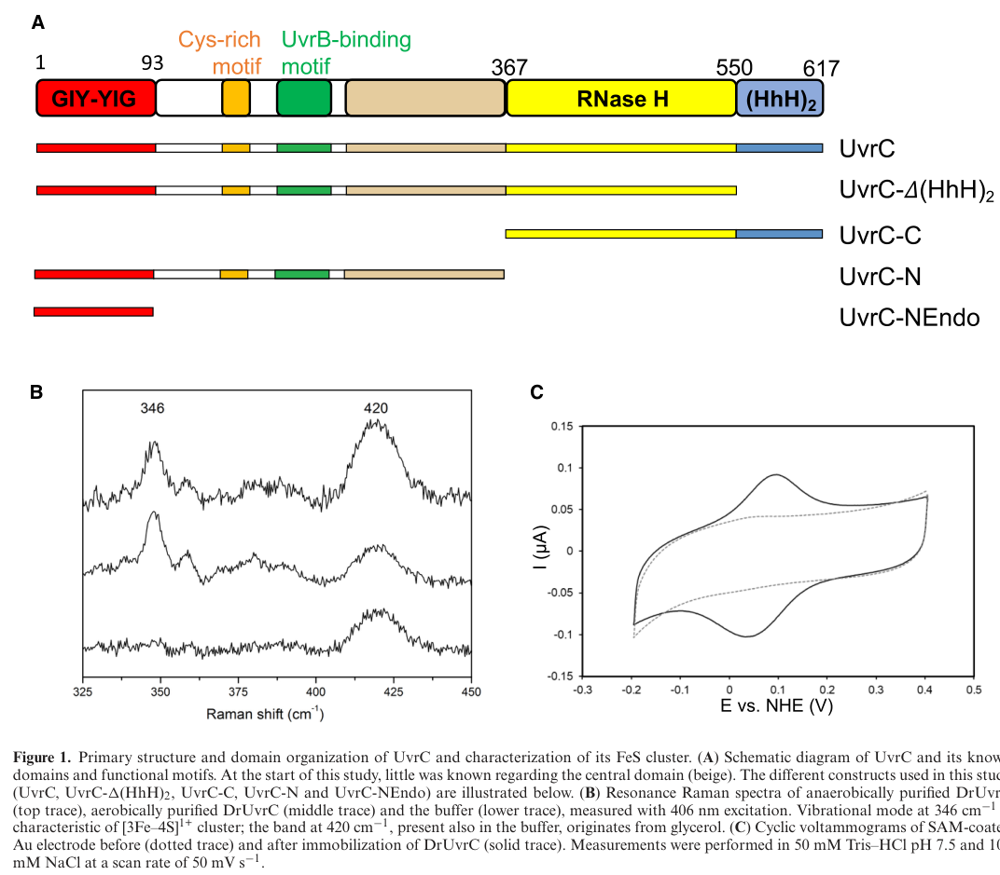

## Question

# Gene Research for Functional Annotation

## ⚠️ CRITICAL: Gene/Protein Identification Context

**BEFORE YOU BEGIN RESEARCH:** You MUST verify you are researching the CORRECT gene/protein. Gene symbols can be ambiguous, especially for less well-characterized genes from non-model organisms.

### Target Gene/Protein Identity (from UniProt):
- **UniProt Accession:** Q88FJ7
- **Protein Description:** RecName: Full=UvrABC system protein C {ECO:0000255|HAMAP-Rule:MF_00203}; Short=Protein UvrC {ECO:0000255|HAMAP-Rule:MF_00203}; AltName: Full=Excinuclease ABC subunit C {ECO:0000255|HAMAP-Rule:MF_00203};
- **Gene Information:** Name=uvrC {ECO:0000255|HAMAP-Rule:MF_00203}; OrderedLocusNames=PP_4098;
- **Organism (full):** Pseudomonas putida (strain ATCC 47054 / DSM 6125 / CFBP 8728 / NCIMB 11950 / KT2440).
- **Protein Family:** Belongs to the UvrC family. {ECO:0000255|HAMAP-
- **Key Domains:** GIY-YIG_endonuc. (IPR000305); GIY-YIG_endonuc_sf. (IPR035901); GIY-YIG_UvrC_Cho. (IPR047296); HHH_SAM-like. (IPR060101); Hlx-hairpin-Hlx_DNA-bd_motif. (IPR003583)

### MANDATORY VERIFICATION STEPS:

1. **Check if the gene symbol "uvrC" matches the protein description above**
2. **Verify the organism is correct:** Pseudomonas putida (strain ATCC 47054 / DSM 6125 / CFBP 8728 / NCIMB 11950 / KT2440).
3. **Check if protein family/domains align with what you find in literature**
4. **If you find literature for a DIFFERENT gene with the same or similar symbol, STOP**

### If Gene Symbol is Ambiguous or You Cannot Find Relevant Literature:

**DO NOT PROCEED WITH RESEARCH ON A DIFFERENT GENE.** Instead:
- State clearly: "The gene symbol 'uvrC' is ambiguous or literature is limited for this specific protein"
- Explain what you found (e.g., "Found extensive literature on a different gene with the same symbol in a different organism")
- Describe the protein based ONLY on the UniProt information provided above
- Suggest that the protein function can be inferred from domain/family information

### Research Target:

Please provide a comprehensive research report on the gene **uvrC** (gene ID: uvrC, UniProt: Q88FJ7) in PSEPK.

The research report should be a detailed narrative explaining the function, biological processes, and localization of the gene product. Citations should be given for all claims.

You should prioritize authoritative reviews and primary scientific literature when conducting research. You can supplement
this with annotations you find in gene/protein databases, but these can be outdated or inaccurate.

We are specifically interested in the primary function of the gene - for enzymes, what reaction is catalyzed, and what is the substrate specificity? For transporters, what is the substrate? For structural proteins or adapters, what is the broader structural role? For signaling molecules, what is the role in the pathway.

We are interested in where in or outside the cell the gene product carries out its function.

We are also interested in the signaling or biochemical pathways in which the gene functions. We are less interested in broad pleiotropic effects, except where these elucidate the precise role.

Include evidence where possible. We are interested in both experimental evidence as well as inference from structure, evolution, or bioinformatic analysis. Precise studies should be prioritized over high-throughput, where available.

## Output

Question: You are an expert researcher providing comprehensive, well-cited information.

Provide detailed information focusing on:
1. Key concepts and definitions with current understanding
2. Recent developments and latest research (prioritize 2023-2024 sources)
3. Current applications and real-world implementations
4. Expert opinions and analysis from authoritative sources
5. Relevant statistics and data from recent studies

Format as a comprehensive research report with proper citations. Include URLs and publication dates where available.
Always prioritize recent, authoritative sources and provide specific citations for all major claims.

# Gene Research for Functional Annotation

## ⚠️ CRITICAL: Gene/Protein Identification Context

**BEFORE YOU BEGIN RESEARCH:** You MUST verify you are researching the CORRECT gene/protein. Gene symbols can be ambiguous, especially for less well-characterized genes from non-model organisms.

### Target Gene/Protein Identity (from UniProt):
- **UniProt Accession:** Q88FJ7
- **Protein Description:** RecName: Full=UvrABC system protein C {ECO:0000255|HAMAP-Rule:MF_00203}; Short=Protein UvrC {ECO:0000255|HAMAP-Rule:MF_00203}; AltName: Full=Excinuclease ABC subunit C {ECO:0000255|HAMAP-Rule:MF_00203};
- **Gene Information:** Name=uvrC {ECO:0000255|HAMAP-Rule:MF_00203}; OrderedLocusNames=PP_4098;
- **Organism (full):** Pseudomonas putida (strain ATCC 47054 / DSM 6125 / CFBP 8728 / NCIMB 11950 / KT2440).
- **Protein Family:** Belongs to the UvrC family. {ECO:0000255|HAMAP-
- **Key Domains:** GIY-YIG_endonuc. (IPR000305); GIY-YIG_endonuc_sf. (IPR035901); GIY-YIG_UvrC_Cho. (IPR047296); HHH_SAM-like. (IPR060101); Hlx-hairpin-Hlx_DNA-bd_motif. (IPR003583)

### MANDATORY VERIFICATION STEPS:

1. **Check if the gene symbol "uvrC" matches the protein description above**
2. **Verify the organism is correct:** Pseudomonas putida (strain ATCC 47054 / DSM 6125 / CFBP 8728 / NCIMB 11950 / KT2440).
3. **Check if protein family/domains align with what you find in literature**
4. **If you find literature for a DIFFERENT gene with the same or similar symbol, STOP**

### If Gene Symbol is Ambiguous or You Cannot Find Relevant Literature:

**DO NOT PROCEED WITH RESEARCH ON A DIFFERENT GENE.** Instead:
- State clearly: "The gene symbol 'uvrC' is ambiguous or literature is limited for this specific protein"
- Explain what you found (e.g., "Found extensive literature on a different gene with the same symbol in a different organism")
- Describe the protein based ONLY on the UniProt information provided above
- Suggest that the protein function can be inferred from domain/family information

### Research Target:

Please provide a comprehensive research report on the gene **uvrC** (gene ID: uvrC, UniProt: Q88FJ7) in PSEPK.

The research report should be a detailed narrative explaining the function, biological processes, and localization of the gene product. Citations should be given for all claims.

You should prioritize authoritative reviews and primary scientific literature when conducting research. You can supplement
this with annotations you find in gene/protein databases, but these can be outdated or inaccurate.

We are specifically interested in the primary function of the gene - for enzymes, what reaction is catalyzed, and what is the substrate specificity? For transporters, what is the substrate? For structural proteins or adapters, what is the broader structural role? For signaling molecules, what is the role in the pathway.

We are interested in where in or outside the cell the gene product carries out its function.

We are also interested in the signaling or biochemical pathways in which the gene functions. We are less interested in broad pleiotropic effects, except where these elucidate the precise role.

Include evidence where possible. We are interested in both experimental evidence as well as inference from structure, evolution, or bioinformatic analysis. Precise studies should be prioritized over high-throughput, where available.

# Research Report: Functional Annotation of **uvrC** (UniProt Q88FJ7; PP_4098) in *Pseudomonas putida* KT2440

## 1) Target verification (gene/protein identity)

The requested target is **UvrABC system protein C (UvrC; excinuclease ABC subunit C)** from *Pseudomonas putida* KT2440 (ordered locus name **PP_4098**) with UniProt accession **Q88FJ7**. The available literature retrieved here contains *P. putida* operon-level references to **gacA–uvrC** genomic linkage and, separately, extensive mechanistic evidence for bacterial UvrC proteins as conserved dual endonucleases in nucleotide excision repair (NER), consistent with the UniProt-described UvrC family and GIY‑YIG / helix–hairpin–helix (HhH) DNA-binding features. Direct biochemical characterization of **the specific KT2440 UvrC protein (Q88FJ7)** was not found in the retrieved corpus; therefore, organism-specific conclusions are explicitly labeled as **direct evidence** (from *P. putida* studies) or **inference by homology** (from conserved UvrC/NER literature). (seck2023structuralandfunctional pages 1-2, kraithong2021apeekinside pages 3-5, jimenezfernandez2016complexinterplaybetween pages 20-22)

## 2) Key concepts and definitions (current understanding)

### 2.1 Nucleotide excision repair (NER) in bacteria
Bacterial NER is a multi-step, ATP-dependent DNA repair pathway that removes a **broad range of bulky, helix-distorting DNA lesions**. In the canonical bacterial pathway, UvrA and UvrB mediate lesion detection and pre-incision complex formation; **UvrC performs the incision reactions** that flank the lesion and create a short excised oligonucleotide; and downstream steps include removal of the damaged oligonucleotide and gap filling/ligation. (kraithong2021apeekinside pages 3-5, taylor2011evolutionaryrelationshipsdesign pages 16-20)

### 2.2 Role of UvrC (excinuclease ABC subunit C)
**UvrC is the nuclease that executes the dual incision reaction** during bacterial NER. It is recruited to the lesion-containing pre-incision complex and cuts the damaged strand on both sides of the lesion to release a short single-stranded DNA segment containing the damage. (seck2023structuralandfunctional pages 1-2, kraithong2021apeekinside pages 3-5)

### 2.3 Dual incision positions (functional definition)
The incision pattern is position-defined relative to the lesion on the damaged strand:
- A **3′-side cut** occurs around the **4th or 5th phosphodiester bond** from the lesion.
- A **5′-side cut** occurs around the **8th phosphodiester bond** from the lesion.
These two nicks bracket the lesion and enable removal of a short damaged oligonucleotide. (kraithong2021apeekinside pages 3-5)

## 3) Molecular function of *P. putida* UvrC (Q88FJ7)

### 3.1 Primary biochemical activity (reaction and substrate context)
**Primary function (inferred for Q88FJ7 by homology):** structure-specific endonuclease activity that cleaves the **damaged DNA strand** at defined positions **3′ and 5′ to a lesion** within the UvrB–DNA pre-incision complex, enabling excision of the lesion-containing oligonucleotide. This function is strongly conserved across bacterial UvrC proteins and is supported by mechanistic/structural work on UvrC homologs. (seck2023structuralandfunctional pages 1-2, kraithong2021apeekinside pages 3-5)

**Substrate specificity (current understanding):** UvrC acts within a pathway that is notable for exceptionally broad lesion scope (chemically/structurally diverse DNA damage), with incision specificity determined by the architecture of the UvrB–DNA complex and UvrC conformational activation rather than by a single lesion chemistry. (seck2023structuralandfunctional pages 1-2)

### 3.2 Domain architecture and mechanistic mapping to function
Mechanistic literature supports a modular architecture that aligns with the domain expectations provided in the UniProt prompt:

- **N-terminal GIY‑YIG endonuclease module**: associated with the **3′ incision** in NER. (kraithong2021apeekinside pages 3-5, seck2023structuralandfunctional pages 1-2)
- **C-terminal nuclease region with RNase H-like features**: linked to the **5′ incision** activity in NER. (kraithong2021apeekinside pages 3-5, kraithong2021apeekinside pages 15-16)
- **(HhH)2 / helix–hairpin–helix DNA-binding motif(s)**: contributes to binding/stabilization at DNA junctions in the pre-incision complex. (seck2023structuralandfunctional pages 1-2, kraithong2021apeekinside pages 3-5)
- **Cys-rich/metal cluster-associated region**: implicated in structural integrity and/or regulation; a study on *Deinococcus radiodurans* UvrC reports Fe–S cluster variations across species (oxygen-insensitive [3Fe–4S] vs oxygen-sensitive [4Fe–4S] in *E. coli*), highlighting that while the motif is conserved, cofactor specifics can differ by lineage. (seck2023structuralandfunctional pages 17-18)

### 3.3 Conformational activation model (major recent advance)
A 2023 structural/mechanistic study assembled the **first full-length UvrC model** (in *D. radiodurans*) and proposed that UvrC is maintained in a **“closed”, inactive** state that must undergo a **major rearrangement to an “open”, active** state to execute the dual incision reaction. This provides a modern framework for interpreting how UvrC integrates multiple domains (GIY‑YIG nuclease, DNA-binding motifs, RNase H-like regions) into a coordinated dual-cut mechanism. (seck2023structuralandfunctional pages 1-2)

**Figure evidence:** The domain organization schematic and activation model are shown in Seck et al. (2023) figures (domain map; full-length model; closed-to-open activation proposals). (seck2023structuralandfunctional media 140d0c6a, seck2023structuralandfunctional media 1f54ebd4, seck2023structuralandfunctional media 96b45139)

## 4) Cellular localization and where UvrC acts

**Most likely localization for Q88FJ7 (inference):** intracellular, associated with the bacterial chromosome in the **cytoplasm/nucleoid region**, because UvrC operates on DNA as part of NER and no evidence suggests secretion or membrane localization in the retrieved sources. (seck2023structuralandfunctional pages 1-2, kraithong2021apeekinside pages 3-5)

## 5) Pathways and interaction network

### 5.1 Core pathway placement
UvrC functions in the canonical **UvrABC** bacterial NER pathway:
1. Damage recognition and verification by UvrA/UvrB.
2. **Recruitment of UvrC** to UvrB–DNA pre-incision complex.
3. **Dual incision** 3′ and 5′ of the lesion by UvrC.
4. Downstream removal of the cut fragment and completion of repair by additional factors (e.g., helicase-driven excision and gap filling/ligation, as described in the mechanistic overview). (kraithong2021apeekinside pages 3-5, taylor2011evolutionaryrelationshipsdesign pages 16-20)

### 5.2 Protein–protein dependencies
Mechanistic literature emphasizes that **UvrB–UvrC interaction** helps ensure proper incision activity and specificity; in the 2023 mechanistic model, UvrC activation is tied to conformational switching that is consistent with partner-assisted activation in the pre-incision complex. (seck2023structuralandfunctional pages 1-2)

## 6) *Pseudomonas putida* KT2440-specific evidence (direct) relevant to uvrC functional annotation

### 6.1 Genomic/operon context in *P. putida*
A promoter/operon analysis in *P. putida* KT2440 reports a **predicted pp4100–gacA–uvrC–pgsA operon** context, providing direct evidence that **uvrC is genomically linked to gacA** in this species/strain background (KT2440/closely related KT2442 used in that study). This supports species-specific regulatory context relevant to functional annotation (e.g., potential co-regulation with the GacS/GacA network). (jimenezfernandez2016complexinterplaybetween pages 20-22)

### 6.2 DNA-damage phenotypes support importance of NER in KT2440
Although KT2440-specific uvrC knockout phenotypes were not retrieved here, a KT2440 study of formaldehyde stress found that a **uvrB mutant** (another core UvrABC NER component) was **hypersensitive to 10 mM formaldehyde**, with killing rates **3–4 orders of magnitude higher than wild type**. This directly supports that **UvrABC-type NER is physiologically important in *P. putida* KT2440** under certain DNA-damaging conditions; by pathway logic, UvrC is expected to be required for completing the incision/excision step of the same pathway. (roca2008physiologicalresponsesof pages 1-3)

### 6.3 UV resistance and genome stability in KT2440 background (context for applications)
A KT2440 study showed that removal of endogenous prophage elements increased endurance to environmental stresses, with a **remarkable improvement in UV tolerance and other DNA insults** in a prophage-free derivative; the same work notes that the TOL plasmid pWW0 (encoding **rulAB**, an error-prone Pol V) can increase UV tolerance, indicating that **DNA damage processing/repair capacity is a key determinant of strain robustness** in this chassis. While this is not uvrC-specific, it provides KT2440-context evidence that DNA damage resistance is a selectable and engineerable trait in this organism. (martinez‐garcia2015freeingpseudomonasputida pages 1-4, martinez‐garcia2015freeingpseudomonasputida pages 12-15, martinez‐garcia2015freeingpseudomonasputida pages 18-21)

## 7) Recent developments and latest research (emphasis 2023–2024)

### 7.1 2023: Full-length UvrC structural model and activation mechanism
The most directly relevant 2023 advance retrieved is the full-length UvrC modeling and activation framework that proposes **closed-to-open conformational rearrangement** and identifies a **central inactive RNase H-like platform** coordinating surrounding domains, clarifying how dual incision might be regulated and activated in the UvrB–DNA complex. (seck2023structuralandfunctional pages 1-2, seck2023structuralandfunctional media 96b45139)

### 7.2 2024: Methods-oriented work reflects continued focus on UvrC biochemistry/structural challenges
A 2024 report focused on recombinant expression/purification of UvrC (in *Mycobacterium tuberculosis*) summarizes canonical mechanistic features (dual incisions flanking a lesion; domain partitioning into GIY‑YIG and C-terminal DNA-binding/nuclease elements). While not *Pseudomonas*-specific, it reflects active ongoing work to enable deeper biochemical/structural study of UvrC proteins. (covizzi2024recombinantexpressionand pages 20-24)

## 8) Current applications and real-world implementations (supported by retrieved evidence)

### 8.1 Engineering robust *P. putida* chassis under genotoxic stress
KT2440 is used as an industrial/biotechnology chassis, and stress endurance—including tolerance to UV and DNA-damaging conditions—can be improved by large-scale genomic changes (e.g., prophage removal) and plasmid-borne damage tolerance factors (rulAB). In practical terms, this positions DNA repair pathways (including NER components such as UvrC) as **relevant to maintaining genome stability and survivability** during environmental or process stresses. (martinez‐garcia2015freeingpseudomonasputida pages 1-4, martinez‐garcia2015freeingpseudomonasputida pages 12-15)

### 8.2 Detoxification contexts that generate DNA damage
Formaldehyde exposure in KT2440 triggers transcriptional responses consistent with DNA damage management; the observed hypersensitivity of a **uvrB** mutant to high formaldehyde indicates that NER contributes to survival under chemical stress. This is relevant to bioremediation and industrial processes where aldehydes can be present or generated. (roca2008physiologicalresponsesof pages 1-3)

## 9) Expert synthesis / authoritative interpretation

### 9.1 What can be stated with high confidence for Q88FJ7 (evidence-based inference)
Because UvrC is a highly conserved core enzyme of bacterial NER and the retrieved 2021–2023 mechanistic literature provides clear mapping between UvrC domains and the dual incision reaction, the most defensible functional annotation for **Q88FJ7 (PP_4098)** is:
- **DNA repair endonuclease** in the **UvrABC NER** pathway,
- catalyzing **dual incision** on the damaged strand at the canonical positions, and
- operating as a partner-dependent nuclease recruited/activated in the **UvrB–DNA pre-incision complex**. (seck2023structuralandfunctional pages 1-2, kraithong2021apeekinside pages 3-5)

### 9.2 What remains uncertain or not directly evidenced for Q88FJ7 in KT2440
- No KT2440-specific biochemical kinetics, lesion preference measurements, or uvrC deletion UV-survival curves were retrieved here; therefore, **quantitative KT2440 uvrC phenotypes** cannot be reported from this corpus.
- Any claims about regulation of uvrC expression by global regulators (e.g., GacA) should be treated as **hypotheses** guided by operon context, until validated by transcriptomics/ChIP/genetic perturbation in KT2440. (jimenezfernandez2016complexinterplaybetween pages 20-22)

## 10) Evidence map (concise)

| Topic | Key points | Best supporting citations | Key sources |
|---|---|---|---|
| Function | • UvrC is the endonuclease component of the bacterial UvrABC excinuclease in nucleotide excision repair (NER). • It performs dual incision on the damaged DNA strand to release a short lesion-containing oligonucleotide. • The excised fragment is typically ~12–13 nt long in bacterial NER. | (seck2023structuralandfunctional pages 1-2, kraithong2021apeekinside pages 3-5, taylor2011evolutionaryrelationshipsdesign pages 16-20) | Seck et al. 2023 — https://doi.org/10.1093/nar/gkad108; Kraithong et al. 2021 — https://doi.org/10.3390/ijms22020952; Taylor 2011 — source in context |
| Pathway step | • In global-genome NER, UvrA/UvrB detect damage and load UvrB at the lesion; UvrC is then recruited to the pre-incision complex. • After UvrC cuts 3′ and 5′ to the lesion, UvrD removes the damaged oligonucleotide and downstream gap filling/ligation complete repair. • UvrB interaction is important for proper incision activity and specificity. | (seck2023structuralandfunctional pages 1-2, kraithong2021apeekinside pages 3-5, taylor2011evolutionaryrelationshipsdesign pages 16-20) | Seck et al. 2023 — https://doi.org/10.1093/nar/gkad108; Kraithong et al. 2021 — https://doi.org/10.3390/ijms22020952 |
| Catalytic activities/incision positions | • UvrC carries two nuclease activities that cut on both sides of the lesion. • The 3′ cut occurs at about the 4th or 5th phosphodiester bond from the lesion. • The 5′ cut occurs at about the 8th phosphodiester bond from the lesion. • In the 2023 mechanistic study, dual incision could occur in either order in the tested homolog, indicating flexibility in activation. | (kraithong2021apeekinside pages 3-5, seck2023structuralandfunctional pages 17-18, kraithong2021apeekinside pages 15-16) | Kraithong et al. 2021 — https://doi.org/10.3390/ijms22020952; Seck et al. 2023 — https://doi.org/10.1093/nar/gkad108 |
| Domains/motifs | • The N-terminus contains a GIY-YIG endonuclease domain associated with the 3′ incision activity. • UvrC also contains a C-terminal RNase H-like nuclease region linked to 5′ incision activity. • An (HhH)2 DNA-binding motif helps bind DNA/ssDNA-dsDNA junctions. • A Cys-rich region is proposed to coordinate an Fe-S cluster; the provided UniProt domain set (GIY-YIG, HHH/SAM-like, Hlx-hairpin-Hlx DNA-binding motif) is consistent with literature-derived architecture. | (seck2023structuralandfunctional pages 1-2, kraithong2021apeekinside pages 3-5, seck2023structuralandfunctional pages 17-18, seck2023structuralandfunctional media 140d0c6a) | Seck et al. 2023 — https://doi.org/10.1093/nar/gkad108; Kraithong et al. 2021 — https://doi.org/10.3390/ijms22020952 |
| Interaction partners | • UvrC acts with UvrA and UvrB in the UvrABC excinuclease pathway. • UvrB directly recruits/positions UvrC at the lesion-containing pre-incision complex. • After incision, UvrD helicase removes the cut fragment and helps disassemble the complex. | (seck2023structuralandfunctional pages 1-2, kraithong2021apeekinside pages 3-5, taylor2011evolutionaryrelationshipsdesign pages 16-20) | Seck et al. 2023 — https://doi.org/10.1093/nar/gkad108; Kraithong et al. 2021 — https://doi.org/10.3390/ijms22020952 |
| Cellular localization | • UvrC functions on chromosomal DNA in the bacterial cytoplasm/nucleoid as part of the DNA repair machinery. • No evidence in the retrieved context supports secretion, membrane localization, or extracellular function. • For Q88FJ7 in P. putida KT2440, localization is therefore inferred as intracellular DNA repair-associated. | (seck2023structuralandfunctional pages 1-2, kraithong2021apeekinside pages 3-5) | Seck et al. 2023 — https://doi.org/10.1093/nar/gkad108; Kraithong et al. 2021 — https://doi.org/10.3390/ijms22020952 |
| P. putida-specific evidence | • Direct: retrieved context did not provide a KT2440-specific uvrC knockout/biochemical study for Q88FJ7 itself. • Direct: a P. putida promoter-library study notes a predicted pp4100-gacA-uvrC-pgsA operon context, supporting genomic linkage/regulatory context in this species. • Direct: in P. putida KT2440, other NER components are functionally important under genotoxic stress; a uvrB mutant was hypersensitive to 10 mM formaldehyde, with killing 3–4 orders of magnitude above wild type, supporting pathway relevance in this organism. • Inferred: Q88FJ7/PP_4098 likely performs canonical UvrC dual-incision repair in KT2440 because its annotation and domain architecture match conserved UvrC family proteins. | (jimenezfernandez2016complexinterplaybetween pages 20-22, roca2008physiologicalresponsesof pages 1-3, seck2023structuralandfunctional pages 1-2) | Jiménez-Fernández et al. 2016 — https://doi.org/10.1371/journal.pone.0163142; Roca et al. 2008 — https://doi.org/10.1111/j.1751-7915.2007.00014.x; Seck et al. 2023 — https://doi.org/10.1093/nar/gkad108 |
| Recent advances 2023-2024 | • A 2023 NAR study produced the first complete model of full-length UvrC and proposed a closed inactive state that must rearrange into an open active state for dual incision. • That work identified a central inactive RNase H-like platform and clarified how surrounding catalytic/DNA-binding modules may be coordinated. • A 2023 review of prokaryotic NER highlighted updated understanding of global-genome and transcription-coupled NER steps involving UvrC. | (seck2023structuralandfunctional pages 1-2, seck2023structuralandfunctional pages 17-18) | Seck et al. 2023 — https://doi.org/10.1093/nar/gkad108; Thakur & Muniyappa 2023 — https://doi.org/10.1007/s12038-023-00378-8 |

*Table: This table summarizes the supported functional annotation for UvrC Q88FJ7 in Pseudomonas putida KT2440, separating direct organism-specific evidence from broader mechanistic inference. It is useful as a concise evidence map linking domain architecture, catalytic role, pathway placement, and recent structural advances.*

## Key figure excerpts (visual evidence)
- Seck et al. (2023) **UvrC domain organization** and **closed-to-open activation model** (Figures showing UvrC architecture and activation proposals). (seck2023structuralandfunctional media 140d0c6a, seck2023structuralandfunctional media 1f54ebd4, seck2023structuralandfunctional media 96b45139)

## References (URLs and publication dates as available)
- Seck A. et al. **Structural and functional insights into the activation of the dual incision activity of UvrC, a key player in bacterial NER**. *Nucleic Acids Research*. **Mar 2023**. https://doi.org/10.1093/nar/gkad108 (seck2023structuralandfunctional pages 1-2)
- Kraithong T. et al. **A Peek Inside the Machines of Bacterial Nucleotide Excision Repair**. *Int J Mol Sci*. **Jan 2021**. https://doi.org/10.3390/ijms22020952 (kraithong2021apeekinside pages 3-5)
- Roca A. et al. **Physiological responses of Pseudomonas putida to formaldehyde during detoxification**. *Microbial Biotechnology*. **Dec 2008**. https://doi.org/10.1111/j.1751-7915.2007.00014.x (roca2008physiologicalresponsesof pages 1-3)
- Martínez-García E. et al. **Freeing Pseudomonas putida KT2440 of its proviral load strengthens endurance to environmental stresses**. *Environmental Microbiology*. **Jun 2015**. https://doi.org/10.1111/1462-2920.12492 (martinez‐garcia2015freeingpseudomonasputida pages 1-4)
- Jiménez-Fernández A. et al. **Complex interplay between FleQ, cyclic diguanylate and multiple σ factors… in Pseudomonas putida**. *PLOS ONE*. **Sep 2016**. https://doi.org/10.1371/journal.pone.0163142 (jimenezfernandez2016complexinterplaybetween pages 20-22)

References

1. (seck2023structuralandfunctional pages 1-2): Anna Seck, Salvatore De Bonis, Meike Stelter, Mats Ökvist, Müge Senarisoy, Mohammad Rida Hayek, Aline Le Roy, Lydie Martin, Christine Saint-Pierre, Célia M Silveira, Didier Gasparutto, Smilja Todorovic, Jean-Luc Ravanat, and Joanna Timmins. Structural and functional insights into the activation of the dual incision activity of uvrc, a key player in bacterial ner. Nucleic Acids Research, 51:2931-2949, Mar 2023. URL: https://doi.org/10.1093/nar/gkad108, doi:10.1093/nar/gkad108. This article has 15 citations and is from a highest quality peer-reviewed journal.

2. (kraithong2021apeekinside pages 3-5): Thanyalak Kraithong, Silas Hartley, David Jeruzalmi, and Danaya Pakotiprapha. A peek inside the machines of bacterial nucleotide excision repair. International Journal of Molecular Sciences, 22:952, Jan 2021. URL: https://doi.org/10.3390/ijms22020952, doi:10.3390/ijms22020952. This article has 36 citations.

3. (jimenezfernandez2016complexinterplaybetween pages 20-22): Alicia Jiménez-Fernández, Aroa López-Sánchez, Lorena Jiménez-Díaz, Blanca Navarrete, Patricia Calero, Ana Isabel Platero, and Fernando Govantes. Complex interplay between fleq, cyclic diguanylate and multiple σ factors coordinately regulates flagellar motility and biofilm development in pseudomonas putida. PLOS ONE, 11:e0163142, Sep 2016. URL: https://doi.org/10.1371/journal.pone.0163142, doi:10.1371/journal.pone.0163142. This article has 61 citations and is from a peer-reviewed journal.

4. (taylor2011evolutionaryrelationshipsdesign pages 16-20): GK Taylor. Evolutionary relationships, design, and biochemical characterization of homing endonucleases. Unknown journal, 2011.

5. (kraithong2021apeekinside pages 15-16): Thanyalak Kraithong, Silas Hartley, David Jeruzalmi, and Danaya Pakotiprapha. A peek inside the machines of bacterial nucleotide excision repair. International Journal of Molecular Sciences, 22:952, Jan 2021. URL: https://doi.org/10.3390/ijms22020952, doi:10.3390/ijms22020952. This article has 36 citations.

6. (seck2023structuralandfunctional pages 17-18): Anna Seck, Salvatore De Bonis, Meike Stelter, Mats Ökvist, Müge Senarisoy, Mohammad Rida Hayek, Aline Le Roy, Lydie Martin, Christine Saint-Pierre, Célia M Silveira, Didier Gasparutto, Smilja Todorovic, Jean-Luc Ravanat, and Joanna Timmins. Structural and functional insights into the activation of the dual incision activity of uvrc, a key player in bacterial ner. Nucleic Acids Research, 51:2931-2949, Mar 2023. URL: https://doi.org/10.1093/nar/gkad108, doi:10.1093/nar/gkad108. This article has 15 citations and is from a highest quality peer-reviewed journal.

7. (seck2023structuralandfunctional media 140d0c6a): Anna Seck, Salvatore De Bonis, Meike Stelter, Mats Ökvist, Müge Senarisoy, Mohammad Rida Hayek, Aline Le Roy, Lydie Martin, Christine Saint-Pierre, Célia M Silveira, Didier Gasparutto, Smilja Todorovic, Jean-Luc Ravanat, and Joanna Timmins. Structural and functional insights into the activation of the dual incision activity of uvrc, a key player in bacterial ner. Nucleic Acids Research, 51:2931-2949, Mar 2023. URL: https://doi.org/10.1093/nar/gkad108, doi:10.1093/nar/gkad108. This article has 15 citations and is from a highest quality peer-reviewed journal.

8. (seck2023structuralandfunctional media 1f54ebd4): Anna Seck, Salvatore De Bonis, Meike Stelter, Mats Ökvist, Müge Senarisoy, Mohammad Rida Hayek, Aline Le Roy, Lydie Martin, Christine Saint-Pierre, Célia M Silveira, Didier Gasparutto, Smilja Todorovic, Jean-Luc Ravanat, and Joanna Timmins. Structural and functional insights into the activation of the dual incision activity of uvrc, a key player in bacterial ner. Nucleic Acids Research, 51:2931-2949, Mar 2023. URL: https://doi.org/10.1093/nar/gkad108, doi:10.1093/nar/gkad108. This article has 15 citations and is from a highest quality peer-reviewed journal.

9. (seck2023structuralandfunctional media 96b45139): Anna Seck, Salvatore De Bonis, Meike Stelter, Mats Ökvist, Müge Senarisoy, Mohammad Rida Hayek, Aline Le Roy, Lydie Martin, Christine Saint-Pierre, Célia M Silveira, Didier Gasparutto, Smilja Todorovic, Jean-Luc Ravanat, and Joanna Timmins. Structural and functional insights into the activation of the dual incision activity of uvrc, a key player in bacterial ner. Nucleic Acids Research, 51:2931-2949, Mar 2023. URL: https://doi.org/10.1093/nar/gkad108, doi:10.1093/nar/gkad108. This article has 15 citations and is from a highest quality peer-reviewed journal.

10. (roca2008physiologicalresponsesof pages 1-3): Amalia Roca, José‐Juan Rodríguez‐Herva, Estrella Duque, and Juan L. Ramos. Physiological responses of pseudomonas putida to formaldehyde during detoxification. Microbial Biotechnology, 1:158-169, Dec 2008. URL: https://doi.org/10.1111/j.1751-7915.2007.00014.x, doi:10.1111/j.1751-7915.2007.00014.x. This article has 96 citations and is from a peer-reviewed journal.

11. (martinez‐garcia2015freeingpseudomonasputida pages 1-4): Esteban Martínez‐García, Tatjana Jatsenko, Maia Kivisaar, and Víctor de Lorenzo. Freeing pseudomonas putida kt2440 of its proviral load strengthens endurance to environmental stresses. Environmental microbiology, 17 1:76-90, Jun 2015. URL: https://doi.org/10.1111/1462-2920.12492, doi:10.1111/1462-2920.12492. This article has 94 citations and is from a domain leading peer-reviewed journal.

12. (martinez‐garcia2015freeingpseudomonasputida pages 12-15): Esteban Martínez‐García, Tatjana Jatsenko, Maia Kivisaar, and Víctor de Lorenzo. Freeing pseudomonas putida kt2440 of its proviral load strengthens endurance to environmental stresses. Environmental microbiology, 17 1:76-90, Jun 2015. URL: https://doi.org/10.1111/1462-2920.12492, doi:10.1111/1462-2920.12492. This article has 94 citations and is from a domain leading peer-reviewed journal.

13. (martinez‐garcia2015freeingpseudomonasputida pages 18-21): Esteban Martínez‐García, Tatjana Jatsenko, Maia Kivisaar, and Víctor de Lorenzo. Freeing pseudomonas putida kt2440 of its proviral load strengthens endurance to environmental stresses. Environmental microbiology, 17 1:76-90, Jun 2015. URL: https://doi.org/10.1111/1462-2920.12492, doi:10.1111/1462-2920.12492. This article has 94 citations and is from a domain leading peer-reviewed journal.

14. (covizzi2024recombinantexpressionand pages 20-24): J COVIZZI. Recombinant expression and purification trials of mycobacterium tuberculosis uvrc: a key protein of the nucleotide excision repair pathway. Unknown journal, 2024.

## Artifacts

- [Edison artifact artifact-00](uvrC-deep-research-falcon_artifacts/artifact-00.md)

## Citations

1. kraithong2021apeekinside pages 3-5
2. seck2023structuralandfunctional pages 1-2
3. seck2023structuralandfunctional pages 17-18
4. jimenezfernandez2016complexinterplaybetween pages 20-22
5. roca2008physiologicalresponsesof pages 1-3
6. covizzi2024recombinantexpressionand pages 20-24
7. taylor2011evolutionaryrelationshipsdesign pages 16-20
8. kraithong2021apeekinside pages 15-16
9. 3Fe–4S
10. 4Fe–4S
11. https://doi.org/10.1093/nar/gkad108;
12. https://doi.org/10.3390/ijms22020952;
13. https://doi.org/10.3390/ijms22020952
14. https://doi.org/10.1093/nar/gkad108
15. https://doi.org/10.1371/journal.pone.0163142;
16. https://doi.org/10.1111/j.1751-7915.2007.00014.x;
17. https://doi.org/10.1007/s12038-023-00378-8
18. https://doi.org/10.1111/j.1751-7915.2007.00014.x
19. https://doi.org/10.1111/1462-2920.12492
20. https://doi.org/10.1371/journal.pone.0163142
21. https://doi.org/10.1093/nar/gkad108,
22. https://doi.org/10.3390/ijms22020952,
23. https://doi.org/10.1371/journal.pone.0163142,
24. https://doi.org/10.1111/j.1751-7915.2007.00014.x,
25. https://doi.org/10.1111/1462-2920.12492,