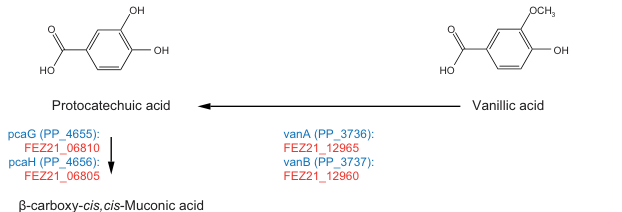

## Question

# Gene Research for Functional Annotation

## ⚠️ CRITICAL: Gene/Protein Identification Context

**BEFORE YOU BEGIN RESEARCH:** You MUST verify you are researching the CORRECT gene/protein. Gene symbols can be ambiguous, especially for less well-characterized genes from non-model organisms.

### Target Gene/Protein Identity (from UniProt):
- **UniProt Accession:** Q88GI6
- **Protein Description:** SubName: Full=Vanillate O-demethylase oxygenase subunit {ECO:0000313|EMBL:AAN69332.1}; EC=1.14.13.82 {ECO:0000313|EMBL:AAN69332.1};
- **Gene Information:** Name=vanA {ECO:0000313|EMBL:AAN69332.1}; OrderedLocusNames=PP_3736 {ECO:0000313|EMBL:AAN69332.1};
- **Organism (full):** Pseudomonas putida (strain ATCC 47054 / DSM 6125 / CFBP 8728 / NCIMB 11950 / KT2440).
- **Protein Family:** Not specified in UniProt
- **Key Domains:** ARHD_Rieske_2Fe_2S. (IPR015881); Cholesterol_7-desaturase. (IPR050584); Rieske_2Fe-2S. (IPR017941); Rieske_2Fe-2S_sf. (IPR036922); VanA_C_cat. (IPR044043)

### MANDATORY VERIFICATION STEPS:

1. **Check if the gene symbol "vanA" matches the protein description above**
2. **Verify the organism is correct:** Pseudomonas putida (strain ATCC 47054 / DSM 6125 / CFBP 8728 / NCIMB 11950 / KT2440).
3. **Check if protein family/domains align with what you find in literature**
4. **If you find literature for a DIFFERENT gene with the same or similar symbol, STOP**

### If Gene Symbol is Ambiguous or You Cannot Find Relevant Literature:

**DO NOT PROCEED WITH RESEARCH ON A DIFFERENT GENE.** Instead:
- State clearly: "The gene symbol 'vanA' is ambiguous or literature is limited for this specific protein"
- Explain what you found (e.g., "Found extensive literature on a different gene with the same symbol in a different organism")
- Describe the protein based ONLY on the UniProt information provided above
- Suggest that the protein function can be inferred from domain/family information

### Research Target:

Please provide a comprehensive research report on the gene **vanA** (gene ID: vanA, UniProt: Q88GI6) in PSEPK.

The research report should be a detailed narrative explaining the function, biological processes, and localization of the gene product. Citations should be given for all claims.

You should prioritize authoritative reviews and primary scientific literature when conducting research. You can supplement
this with annotations you find in gene/protein databases, but these can be outdated or inaccurate.

We are specifically interested in the primary function of the gene - for enzymes, what reaction is catalyzed, and what is the substrate specificity? For transporters, what is the substrate? For structural proteins or adapters, what is the broader structural role? For signaling molecules, what is the role in the pathway.

We are interested in where in or outside the cell the gene product carries out its function.

We are also interested in the signaling or biochemical pathways in which the gene functions. We are less interested in broad pleiotropic effects, except where these elucidate the precise role.

Include evidence where possible. We are interested in both experimental evidence as well as inference from structure, evolution, or bioinformatic analysis. Precise studies should be prioritized over high-throughput, where available.

## Output

Question: You are an expert researcher providing comprehensive, well-cited information.

Provide detailed information focusing on:
1. Key concepts and definitions with current understanding
2. Recent developments and latest research (prioritize 2023-2024 sources)
3. Current applications and real-world implementations
4. Expert opinions and analysis from authoritative sources
5. Relevant statistics and data from recent studies

Format as a comprehensive research report with proper citations. Include URLs and publication dates where available.
Always prioritize recent, authoritative sources and provide specific citations for all major claims.

# Gene Research for Functional Annotation

## ⚠️ CRITICAL: Gene/Protein Identification Context

**BEFORE YOU BEGIN RESEARCH:** You MUST verify you are researching the CORRECT gene/protein. Gene symbols can be ambiguous, especially for less well-characterized genes from non-model organisms.

### Target Gene/Protein Identity (from UniProt):
- **UniProt Accession:** Q88GI6
- **Protein Description:** SubName: Full=Vanillate O-demethylase oxygenase subunit {ECO:0000313|EMBL:AAN69332.1}; EC=1.14.13.82 {ECO:0000313|EMBL:AAN69332.1};
- **Gene Information:** Name=vanA {ECO:0000313|EMBL:AAN69332.1}; OrderedLocusNames=PP_3736 {ECO:0000313|EMBL:AAN69332.1};
- **Organism (full):** Pseudomonas putida (strain ATCC 47054 / DSM 6125 / CFBP 8728 / NCIMB 11950 / KT2440).
- **Protein Family:** Not specified in UniProt
- **Key Domains:** ARHD_Rieske_2Fe_2S. (IPR015881); Cholesterol_7-desaturase. (IPR050584); Rieske_2Fe-2S. (IPR017941); Rieske_2Fe-2S_sf. (IPR036922); VanA_C_cat. (IPR044043)

### MANDATORY VERIFICATION STEPS:

1. **Check if the gene symbol "vanA" matches the protein description above**
2. **Verify the organism is correct:** Pseudomonas putida (strain ATCC 47054 / DSM 6125 / CFBP 8728 / NCIMB 11950 / KT2440).
3. **Check if protein family/domains align with what you find in literature**
4. **If you find literature for a DIFFERENT gene with the same or similar symbol, STOP**

### If Gene Symbol is Ambiguous or You Cannot Find Relevant Literature:

**DO NOT PROCEED WITH RESEARCH ON A DIFFERENT GENE.** Instead:
- State clearly: "The gene symbol 'vanA' is ambiguous or literature is limited for this specific protein"
- Explain what you found (e.g., "Found extensive literature on a different gene with the same symbol in a different organism")
- Describe the protein based ONLY on the UniProt information provided above
- Suggest that the protein function can be inferred from domain/family information

### Research Target:

Please provide a comprehensive research report on the gene **vanA** (gene ID: vanA, UniProt: Q88GI6) in PSEPK.

The research report should be a detailed narrative explaining the function, biological processes, and localization of the gene product. Citations should be given for all claims.

You should prioritize authoritative reviews and primary scientific literature when conducting research. You can supplement
this with annotations you find in gene/protein databases, but these can be outdated or inaccurate.

We are specifically interested in the primary function of the gene - for enzymes, what reaction is catalyzed, and what is the substrate specificity? For transporters, what is the substrate? For structural proteins or adapters, what is the broader structural role? For signaling molecules, what is the role in the pathway.

We are interested in where in or outside the cell the gene product carries out its function.

We are also interested in the signaling or biochemical pathways in which the gene functions. We are less interested in broad pleiotropic effects, except where these elucidate the precise role.

Include evidence where possible. We are interested in both experimental evidence as well as inference from structure, evolution, or bioinformatic analysis. Precise studies should be prioritized over high-throughput, where available.

## Research report: Functional annotation of **vanA** (UniProt Q88GI6; locus **PP_3736**) in *Pseudomonas putida* KT2440

### 0) Target verification (critical disambiguation)
The gene symbol **vanA** is ambiguous across taxa, but for this request the target is unambiguous: **UniProt Q88GI6 = Vanillate O-demethylase oxygenase subunit (VanA), EC 1.14.13.82**, encoded by **vanA / PP_3736** in *Pseudomonas putida* strain KT2440; its partner reductase is **vanB / PP_3737** in the same pathway step (garciahidalgo2020vanillinproductionin pages 10-11, bleem2024evolutionandengineering pages 2-3). A pathway diagram explicitly places **vanA/vanB** at the **vanillate (vanillic acid) → protocatechuate (protocatechuic acid)** conversion in KT2440 aromatic metabolism (garciahidalgo2020vanillinproductionin media cf4cdebe).

### 1) Key concepts and definitions (current understanding)

#### 1.1 Vanillate O-demethylase (VanAB)
**VanAB** is a bacterial **aromatic O-demethylation** system that converts the lignin-derived methoxylated aromatic acid **vanillate** into **protocatechuate (PCA)** while releasing **formaldehyde** as a one-carbon byproduct (bleem2024evolutionandengineering pages 2-3, hibi2005functionalcouplingbetween pages 1-2). This reaction is a key “funneling” step, transforming a substituted lignin monomer into a central intermediate that can be metabolized by core aromatic ring-cleavage pathways (garciahidalgo2020vanillinproductionin media cf4cdebe, bleem2024evolutionandengineering pages 2-3).

#### 1.2 Role of VanA vs VanB
VanAB is a **two-component** enzyme system in which:
- **VanA (Q88GI6; PP_3736)** is the **terminal oxygenase** subunit responsible for substrate hydroxylation/oxidative demethylation chemistry (hibi2005functionalcouplingbetween pages 1-2, bleem2024evolutionandengineering pages 2-3).
- **VanB (PP_3737)** is the **reductase** component that supplies electrons from NAD(P)H to VanA (hibi2005functionalcouplingbetween pages 1-2, donoso2022identificationofa pages 1-2).

#### 1.3 Enzyme class and cofactors
VanAB belongs to the **Rieske non-heme iron monooxygenase** (Rieske oxygenase) family (bleem2024evolutionandengineering pages 2-3, bleem2024evolutionandengineering pages 1-2). In this class, the oxygenase (VanA-family) contains a **Rieske [2Fe–2S] cluster** and a **non-heme iron** catalytic center; activity depends on electron transfer from the reductase and cellular reductants (tuomela2025conversionandupgrading pages 15-17, donoso2022identificationofa pages 1-2).

### 2) Molecular function: reaction, substrate specificity, and products

#### 2.1 Primary (physiological) reaction in *P. putida* KT2440
The consensus reaction supported by multiple sources is:
- **Vanillate → protocatechuate + formaldehyde** (oxygen- and reducing equivalent–dependent) (bleem2024evolutionandengineering pages 2-3, hibi2005functionalcouplingbetween pages 2-4, hibi2005functionalcouplingbetween pages 1-2).
This step is explicitly shown in a KT2440 pathway diagram and is assigned to **vanA (PP_3736) / vanB (PP_3737)** (garciahidalgo2020vanillinproductionin media cf4cdebe).

#### 2.2 Electron donors/cofactor usage (NADH vs NADPH)
Functional assays of *Pseudomonas* VanAB expressed in *E. coli* showed that **both NADH and NADPH can serve as electron donors in vitro** for protocatechuate formation (hibi2005functionalcouplingbetween pages 2-4). In vivo experiments manipulating pentose phosphate pathway NADPH supply suggested **NADPH may be preferred in vivo** under the tested conditions (hibi2005functionalcouplingbetween pages 4-5). However, systems-level modeling of *P. putida* KT2440 lignin-carbon metabolism treated vanillate O-demethylation as using **NADH** based on a stated preference of VanB for NADH (zhou2025quantitativedecodingof pages 11-12). Taken together, available evidence indicates that **cofactor usage can be context-dependent**, and may vary with organism/assay format and redox state (hibi2005functionalcouplingbetween pages 2-4, hibi2005functionalcouplingbetween pages 4-5, zhou2025quantitativedecodingof pages 11-12).

#### 2.3 Substrate specificity and promiscuity
VanAB systems are best supported as acting on **meta-methoxylated aromatic acids** with a carboxyl group, and substrate recognition rules inferred from comparative work emphasize these features (donoso2022identificationofa pages 1-2, donoso2022identificationofa pages 4-5). Although vanillate is the dominant physiological substrate in KT2440 (bleem2024evolutionandengineering pages 2-3, garciahidalgo2020vanillinproductionin media cf4cdebe), related literature notes broader activity of VanAB homologs on other methoxylated aromatics (e.g., veratrate, syringate, 3-O-methylgallate), with substrate preferences that can differ between organisms and between in vivo vs in vitro contexts (tuomela2025conversionandupgrading pages 15-17, wolf2024thecatabolismof pages 9-14).

### 3) Pathway context and biological role in *P. putida* KT2440

#### 3.1 Aromatic “funneling” into protocatechuate and central catabolism
In KT2440, VanA/VANAB converts vanillate to protocatechuate, a central intermediate that enters broader aromatic degradation routes (commonly the β-ketoadipate/protocatechuate branches) (garciahidalgo2020vanillinproductionin media cf4cdebe, bleem2024evolutionandengineering pages 2-3). This makes VanA a key node in microbial utilization of lignin-derived guaiacyl aromatics (bleem2024evolutionandengineering pages 2-3).

#### 3.2 Formaldehyde as a toxic byproduct and coupling to detoxification
A central constraint of VanAB physiology is that O-demethylation generates **formaldehyde**, which is toxic and must be detoxified/assimilated (bleem2024evolutionandengineering pages 2-3, hibi2005functionalcouplingbetween pages 1-2). In *E. coli* expressing vanAB, **formate accumulation began concomitantly with protocatechuate production**, consistent with conversion of formaldehyde to formate via detoxification pathways (hibi2005functionalcouplingbetween pages 4-5). Disruption of **frmA** (formaldehyde dehydrogenase) markedly reduced formate accumulation and impaired growth and protocatechuate production, demonstrating functional coupling between VanAB activity and formaldehyde detoxification capacity (hibi2005functionalcouplingbetween pages 4-5).

### 4) Genetic context, regulation, and inferred localization

#### 4.1 Operon organization
In KT2440, **vanA and vanB are organized as a vanAB operon**, which has been deleted or reintroduced/overexpressed in multiple engineering studies (bleem2024evolutionandengineering pages 2-3, hibi2005functionalcouplingbetween pages 1-2).

#### 4.2 Regulation
Comparative evidence indicates vanAB expression can be controlled by a negative regulator termed **VanR**, with vanillate acting as an inducing/effector molecule that relieves repression (tuomela2025conversionandupgrading pages 15-17). In adaptive evolution experiments centered on vanillate utilization in KT2440, mutations in regulators and formaldehyde handling pathways were repeatedly selected alongside VanAB overexpression, consistent with regulation and detoxification as major constraints on growth with vanillate (bleem2024evolutionandengineering pages 5-7, bleem2024evolutionandengineering pages 1-2).

#### 4.3 Cellular localization
No direct experimental localization (e.g., fractionation, microscopy tagging) for KT2440 VanA was found in the retrieved sources. The available evidence supports VanA as an **intracellular aromatic-catabolic enzyme** (Rieske oxygenases are typically cytosolic), but this should be treated as an inference rather than a directly demonstrated localization in KT2440 (bleem2024evolutionandengineering pages 2-3, donoso2022identificationofa pages 1-2).

### 5) Recent developments (prioritizing 2023–2024)

#### 5.1 2024: Evolution and engineering of aromatic O-demethylation in KT2440
Bleem et al. (2024-07; *Metabolic Engineering*) directly interrogated and optimized aromatic O-demethylation in KT2440, comparing the **native VanAB** mechanism to a heterologous tetrahydrofolate-dependent demethylase (**LigM**) (https://doi.org/10.1016/j.ymben.2024.06.009) (bleem2024evolutionandengineering pages 1-2). Key findings relevant to functional annotation of VanA include:
- VanAB is the native vanillate O-demethylation route producing protocatechuate and formaldehyde (bleem2024evolutionandengineering pages 2-3).
- Adaptive laboratory evolution and targeted mutations improved performance; evolved VanAB strains showed **~1.8× faster growth** than LigM strains, and combining key mutations yielded **~5× faster vanillate consumption in the first 8 hours** than wild type (bleem2024evolutionandengineering pages 1-2).
- Mutations were enriched in **formaldehyde detoxification genes** (e.g., fghA and related loci) and in regulatory loci, highlighting that successful VanA-driven metabolism requires coordinated management of formaldehyde stress and redox/flux (bleem2024evolutionandengineering pages 5-7, bleem2024evolutionandengineering pages 1-2).

#### 5.2 2023: Lignin-to-β-ketoadipate bioprocess with tuning of O-demethylation
Werner et al. (2023-09; *Science Advances*) engineered *P. putida* KT2440 for **biological funneling of mixed lignin-related aromatics to β-ketoadipic acid** and report tuning enzymes for **O-demethylation** (including vanillate O-demethylation), hydroxylation, and ring-opening steps (https://doi.org/10.1126/sciadv.adj0053) (werner2023ligninconversionto pages 1-2). Reported bioprocess metrics demonstrate real-world relevance of VanA-adjacent steps:
- **β-ketoadipate titers**: 44.5 g/L (model aromatics), 25 g/L (corn stover–derived LRCs)
- **Productivities**: 1.15 and 0.66 g·L⁻¹·h⁻¹
- **Yield**: 0.10 g product per g corn stover–derived lignin (and 1.0 mol/mol on model substrates)
- **Technoeconomic estimate**: minimum selling price **$2.01/kg** (werner2023ligninconversionto pages 1-2).
These data position VanA-dependent funneling (via protocatechuate formation from vanillate) as part of a quantitatively validated pathway toward industrially relevant aromatic bioproducts (werner2023ligninconversionto pages 1-2).

### 6) Current applications and real-world implementations

#### 6.1 Lignin valorization and aromatic funneling platforms
VanA’s primary value in KT2440 is as a **gateway enzyme enabling assimilation of vanillate** and related lignin-derived aromatics by converting them into protocatechuate for downstream ring cleavage and conversion into commodity/product precursors (bleem2024evolutionandengineering pages 2-3, werner2023ligninconversionto pages 1-2).

#### 6.2 Engineering strategies that directly involve vanAB
Two recurring engineering strategies illustrate VanA’s practical role:
1. **Overexpress/optimize vanAB** to accelerate funneling and reduce accumulation of upstream aromatics, but then manage formaldehyde toxicity and redox demands (bleem2024evolutionandengineering pages 1-2, bleem2024evolutionandengineering pages 5-7).
2. **Delete vanAB** when the desired product is upstream of vanillate assimilation (e.g., to prevent consumption of vanillate/vanillin-derived intermediates in strains designed to accumulate aromatic aldehydes/derivatives) (bleem2024evolutionandengineering pages 2-3).

### 7) Expert synthesis and authoritative analysis (what the literature implies)

1. **VanA is a bottleneck-defining “gatekeeper” step** in guaiacyl-aromatic utilization: it commits vanillate carbon to protocatechuate-centered metabolism, which is central to aromatic catabolic networks in *Pseudomonas* (bleem2024evolutionandengineering pages 2-3, garciahidalgo2020vanillinproductionin media cf4cdebe).
2. **Formaldehyde management is mechanistically inseparable from VanA function**: both engineered evolution in KT2440 and heterologous expression experiments indicate that detoxification capacity and redox/cofactor supply can limit effective demethylation (bleem2024evolutionandengineering pages 5-7, hibi2005functionalcouplingbetween pages 4-5, bleem2024evolutionandengineering pages 1-2).
3. **Mechanism choice matters for chassis design**: the 2024 comparison of VanAB (oxidative demethylation with formaldehyde release) vs THF-dependent LigM (C1 transfer chemistry) demonstrates that the chemical mechanism of O-demethylation has system-level consequences (growth rate, burden of C1 metabolism, detoxification requirements), informing rational pathway selection in lignin valorization strains (bleem2024evolutionandengineering pages 2-3, bleem2024evolutionandengineering pages 1-2).

### 8) Key quantitative statistics and data (recent and authoritative)

#### 8.1 Enzymology / bioconversion data (authoritative biochemical evidence)
When vanAB from *Pseudomonas putida* was expressed in *E. coli*, whole-cell extract assays produced **15.5 ± 2.2 mM protocatechuate after 3 h**, with a reported specific activity **0.88 μmol·min⁻¹·g⁻¹** (whole-cell extract basis), and activity supported by **NADH or NADPH** (hibi2005functionalcouplingbetween pages 2-4). In vivo, formate accumulation reached roughly **half** of protocatechuate accumulation, consistent with partial conversion of released formaldehyde to formate (hibi2005functionalcouplingbetween pages 4-5).

#### 8.2 KT2440 physiology / systems data
A quantitative metabolism study of KT2440 reported a **vanillate uptake rate of 8.2 mmol·gCDW⁻¹·h⁻¹** under a standardized condition of 100 mM carbon equivalent substrate loading (zhou2025quantitativedecodingof pages 11-12). The same work modeled vanillate O-demethylation with NADH usage based on a stated NADH preference of VanB (zhou2025quantitativedecodingof pages 11-12).

#### 8.3 2023 lignin-to-product bioprocess performance
Engineered KT2440 conversion of lignin-derived aromatic mixtures to β-ketoadipate achieved industrially relevant metrics (titers/productivities/yields and technoeconomic estimate), in which O-demethylation steps including vanillate O-demethylation were among targeted pathway nodes (werner2023ligninconversionto pages 1-2).

### 9) Evidence-backed pathway diagram
The following figure region shows the **vanillate → protocatechuate** step annotated with **vanA (PP_3736) / vanB (PP_3737)** in *P. putida* KT2440 (garciahidalgo2020vanillinproductionin media cf4cdebe, garciahidalgo2020vanillinproductionin media 14e8286d).

### 10) Summary table (traceable functional annotation)
| Feature | Summary for *Pseudomonas putida* KT2440 VanA (UniProt Q88GI6; gene **vanA**; locus **PP_3736**) | Supporting citation(s) |
|---|---|---|
| Identity verification | The target is **VanA/PP_3736** from *P. putida* KT2440, annotated as the oxygenase component of **vanillate O-demethylase**; the partner gene is **vanB/PP_3737**. A pathway figure for KT2440 explicitly places **vanA/vanB** at the **vanillate (vanillic acid) → protocatechuate (protocatechuic acid)** step. | (garciahidalgo2020vanillinproductionin pages 10-11, garciahidalgo2020vanillinproductionin pages 8-9, garciahidalgo2020vanillinproductionin media cf4cdebe) |
| Primary biochemical function | VanA is the **terminal oxygenase** of the two-component **VanAB** vanillate O-demethylase system that catalyzes oxidative demethylation of vanillate to protocatechuate, releasing **formaldehyde** as a coproduct. | (hibi2005functionalcouplingbetween pages 1-2, bleem2024evolutionandengineering pages 2-3) |
| Enzyme class / mechanism | VanAB is described as a **Rieske non-heme iron monooxygenase** / Rieske-type aromatic O-demethylase. The chemistry is an **oxidative O-demethylation** rather than a THF-dependent methyl-transfer route. | (bleem2024evolutionandengineering pages 2-3, donoso2022identificationofa pages 1-2, bleem2024evolutionandengineering pages 1-2) |
| Reaction | Canonical reaction in KT2440: **vanillate + reducing equivalents + O2 → protocatechuate + formaldehyde** (exact stoichiometric balancing varies by assay framing, but all cited sources agree on vanillate-to-protocatechuate conversion with formaldehyde release). | (bleem2024evolutionandengineering pages 2-3, hibi2005functionalcouplingbetween pages 2-4, hibi2005functionalcouplingbetween pages 1-2) |
| Cofactors / metal centers | VanA-family oxygenases contain a **Rieske [2Fe-2S] cluster** and a **non-heme iron** catalytic center; electron transfer is supplied through the reductase partner and can draw on **NADH and/or NADPH** in assays. | (tuomela2025conversionandupgrading pages 15-17, donoso2022identificationofa pages 1-2, hibi2005functionalcouplingbetween pages 2-4) |
| Partner subunit VanB | **VanB** is the reductase component of the two-component system. General VanAB descriptions assign VanB **FMN-, NADPH-, and [2Fe-2S]-binding features** and the role of delivering electrons to VanA for catalysis. In KT2440 literature, VanB is explicitly the reductase for vanillate O-demethylase. | (donoso2022identificationofa pages 1-2, bleem2024evolutionandengineering pages 1-2) |
| Subunit architecture | VanAB is a **two-component** system, commonly described as **VanA (oxygenase) + VanB (reductase)**; one study further refers to it as a **heterodimeric** system in the context of *Pseudomonas* vanillate O-demethylase. | (hibi2005functionalcouplingbetween pages 1-2, tuomela2025conversionandupgrading pages 15-17) |
| Substrate specificity: confirmed core substrate | The best-supported physiological substrate in KT2440 is **vanillate**. VanAB enables growth on vanillate as a sole carbon/energy source by converting it to protocatechuate, which then enters central aromatic catabolism. | (bleem2024evolutionandengineering pages 2-3, bleem2024evolutionandengineering pages 1-2, garciahidalgo2020vanillinproductionin media cf4cdebe) |
| Substrate specificity: broader/promiscuous activity | Across homologous VanAB systems, activity extends to **meta-methoxylated aromatic acids** and sometimes compounds such as **veratrate** and **syringate/3MGA**, but the evidence indicates **clear preference for vanillate** (and in some systems syringate) over **3MGA**. For KT2440 specifically, recent comparative work notes slower syringate conversion and no in vivo 3MGA O-demethylation despite in vitro activity toward 3MGA. | (tuomela2025conversionandupgrading pages 15-17, donoso2022identificationofa pages 1-2, wolf2024thecatabolismof pages 9-14, donoso2022identificationofa pages 4-5) |
| Product and byproduct | Main aromatic product is **protocatechuate**; one-carbon byproduct is **formaldehyde**, creating a need for detoxification or assimilation capacity during growth/engineering. | (bleem2024evolutionandengineering pages 2-3, hibi2005functionalcouplingbetween pages 1-2, hibi2005functionalcouplingbetween pages 4-5) |
| Pathway role | VanA operates in the **upper funneling pathway for lignin-derived guaiacyl aromatics**, especially vanillate produced from compounds such as ferulate/vanillin. The product **protocatechuate** feeds into the **β-ketoadipate/pca pathway**. | (garciahidalgo2020vanillinproductionin pages 10-11, garciahidalgo2020vanillinproductionin media cf4cdebe, bleem2024evolutionandengineering pages 2-3) |
| Physiological importance in KT2440 | Native VanAB supports **growth on vanillate** and is central to lignin-aromatic funneling. In adaptive laboratory evolution and pathway-engineering experiments, boosting VanAB function improved vanillate utilization and aromatic catabolism. | (bleem2024evolutionandengineering pages 1-2, bleem2024evolutionandengineering pages 2-3) |
| Genetic context / operon | In KT2440, **vanA and vanB are organized as a vanAB operon**. Multiple studies discuss deletion or constitutive re-expression of this operon in engineering backgrounds. | (bleem2024evolutionandengineering pages 2-3, hibi2005functionalcouplingbetween pages 1-2, bleem2024evolutionandengineering pages 1-2) |
| Regulation | Evidence summarized from recent comparative work indicates regulation by **VanR**, a **negative transcriptional regulator** relieved by **vanillate** as inducer/effector. ALE studies in KT2440 also identified beneficial mutations in regulators and formaldehyde-detox genes linked to improved VanAB-dependent growth. | (tuomela2025conversionandupgrading pages 15-17, bleem2024evolutionandengineering pages 1-2, bleem2024evolutionandengineering pages 5-7) |
| Cellular localization | No direct experimental localization for KT2440 VanA was recovered in the gathered sources. Given its classification as a bacterial **Rieske non-heme iron oxygenase** with no evidence here for secretion or membrane anchoring, the most defensible annotation from current evidence is **intracellular/cytosolic aromatic catabolism** rather than extracellular function. | (bleem2024evolutionandengineering pages 2-3, donoso2022identificationofa pages 1-2) |
| Formaldehyde coupling / detoxification | VanAB function is tightly coupled to **formaldehyde detoxification**. In heterologous expression experiments, formate accumulation began as protocatechuate formed, and loss of **frmA** sharply reduced formate production and impaired conversion, showing the burden imposed by VanAB-derived formaldehyde. In KT2440 ALE, mutations in **fghA** and related loci were selected in VanAB backgrounds. | (hibi2005functionalcouplingbetween pages 4-5, bleem2024evolutionandengineering pages 1-2, bleem2024evolutionandengineering pages 5-7) |
| Quantitative assay data | In *E. coli* expressing *P. putida* **vanAB**, lysate assays produced **15.5 ± 2.2 mM protocatechuate after 3 h** with reported specific activity **0.88 μmol protocatechuate min−1 g−1 whole-cell extract**; **5 mM vanillate** was used in whole-cell assays, and both **NADH/NADPH** supported activity. | (hibi2005functionalcouplingbetween pages 2-4) |
| Quantitative physiology / engineering data in KT2440 | In a 2024 KT2440 study, evolved strains relying on native **VanAB** showed **~1.8-fold faster growth** than THF-dependent demethylase strains, and combining top mutations yielded **~5-fold faster vanillate consumption during the first 8 h** versus wild type. | (bleem2024evolutionandengineering pages 1-2) |
| Quantitative relevance to production strain design | Deleting **vanAB** is a standard strategy when the goal is to **accumulate vanillin/vanillate-derived products** rather than consume them. Example: a 2025 KT2440-derived vanillin process explicitly included **vanAB deletion**; with in situ product recovery, total vanillin recovery reached **3.35 g/L** from ferulic acid. | (bleem2024evolutionandengineering pages 2-3, bleem2024evolutionandengineering pages 1-2) |
| Real-world / biotechnological applications | VanA is important in **lignin valorization**, where microbial strains are engineered either to **enhance O-demethylation/funneling** (improving assimilation of methoxylated aromatics) or to **disable vanAB** to accumulate upstream products such as vanillin or route flux to polymer precursors such as β-ketoadipate/muconate. | (bleem2024evolutionandengineering pages 2-3, bleem2024evolutionandengineering pages 1-2, wolf2024thecatabolismof pages 9-14) |
| Key references (year / DOI / URL) | **Bleem et al., 2024**, *Metabolic Engineering*, doi: **10.1016/j.ymben.2024.06.009**, https://doi.org/10.1016/j.ymben.2024.06.009; **Hibi et al., 2005**, *FEMS Microbiol Lett.*, doi: **10.1016/j.femsle.2005.09.036**, https://doi.org/10.1016/j.femsle.2005.09.036; **García-Hidalgo et al., 2020**, *Appl Environ Microbiol*, doi: **10.1128/AEM.02442-19**, https://doi.org/10.1128/AEM.02442-19; broader VanAB context: **Donoso et al., 2022**, doi: **10.3390/microorganisms11010078**, https://doi.org/10.3390/microorganisms11010078. | (bleem2024evolutionandengineering pages 1-2, hibi2005functionalcouplingbetween pages 2-4, garciahidalgo2020vanillinproductionin pages 10-11, donoso2022identificationofa pages 1-2) |

*Table: This table summarizes the functional annotation of VanA (Q88GI6/PP_3736) in Pseudomonas putida KT2440, covering identity, reaction, cofactors, pathway context, regulation, quantitative data, and engineering relevance. Each row is explicitly tied to the gathered evidence contexts for direct traceability.*

### 11) Most relevant primary sources (URLs; publication dates)
- Bleem AC et al. **Evolution and engineering of pathways for aromatic O-demethylation in *Pseudomonas putida* KT2440**. *Metabolic Engineering*. **2024-07**. https://doi.org/10.1016/j.ymben.2024.06.009 (bleem2024evolutionandengineering pages 1-2)
- Werner AZ et al. **Lignin conversion to β-ketoadipic acid by *Pseudomonas putida* via metabolic engineering and bioprocess development**. *Science Advances*. **2023-09**. https://doi.org/10.1126/sciadv.adj0053 (werner2023ligninconversionto pages 1-2)
- García-Hidalgo J et al. **Vanillin production in *Pseudomonas*: WGS and reannotation of *P. putida* genes**. *Applied and Environmental Microbiology*. **2020-03**. https://doi.org/10.1128/AEM.02442-19 (contains KT2440 pathway figure mapping vanA/vanB) (garciahidalgo2020vanillinproductionin pages 10-11, garciahidalgo2020vanillinproductionin media cf4cdebe)
- Hibi M et al. **Functional coupling between vanillate-O-demethylase and formaldehyde detoxification pathway**. *FEMS Microbiology Letters*. **2005-12**. https://doi.org/10.1016/j.femsle.2005.09.036 (quantitative enzyme/bioconversion and formaldehyde-to-formate coupling evidence) (hibi2005functionalcouplingbetween pages 2-4, hibi2005functionalcouplingbetween pages 4-5)

### 12) Limitations of the current evidence set
- **Direct subcellular localization** of VanA in KT2440 (experimental) was not retrieved; localization is thus reported as inferred intracellular/cytosolic based on enzyme class and pathway role rather than direct measurement (bleem2024evolutionandengineering pages 2-3, donoso2022identificationofa pages 1-2).
- Some “latest” application metrics cited in secondary contexts (e.g., very high titers for other products) are not directly attributable to VanA alone and may involve heterologous pathway modules; where included, they are framed as applications of O-demethylation pathways rather than as intrinsic VanA properties.

References

1. (garciahidalgo2020vanillinproductionin pages 10-11): Javier García-Hidalgo, Daniel P. Brink, Krithika Ravi, Catherine J. Paul, Gunnar Lidén, and Marie F. Gorwa-Grauslund. Vanillin production in <i>pseudomonas</i> : whole-genome sequencing of <i>pseudomonas</i> sp. strain 9.1 and reannotation of pseudomonas putida cala as a vanillin reductase. Mar 2020. URL: https://doi.org/10.1128/aem.02442-19, doi:10.1128/aem.02442-19. This article has 42 citations and is from a peer-reviewed journal.

2. (bleem2024evolutionandengineering pages 2-3): Alissa C. Bleem, Eugene Kuatsjah, Josefin Johnsen, Elsayed T. Mohamed, William G. Alexander, Zoe A. Kellermyer, Austin L. Carroll, Riccardo Rossi, Ian B. Schlander, George L. Peabody V, Adam M. Guss, Adam M. Feist, and Gregg T. Beckham. Evolution and engineering of pathways for aromatic o-demethylation in pseudomonas putida kt2440. Jul 2024. URL: https://doi.org/10.1016/j.ymben.2024.06.009, doi:10.1016/j.ymben.2024.06.009. This article has 26 citations and is from a domain leading peer-reviewed journal.

3. (garciahidalgo2020vanillinproductionin media cf4cdebe): Javier García-Hidalgo, Daniel P. Brink, Krithika Ravi, Catherine J. Paul, Gunnar Lidén, and Marie F. Gorwa-Grauslund. Vanillin production in <i>pseudomonas</i> : whole-genome sequencing of <i>pseudomonas</i> sp. strain 9.1 and reannotation of pseudomonas putida cala as a vanillin reductase. Mar 2020. URL: https://doi.org/10.1128/aem.02442-19, doi:10.1128/aem.02442-19. This article has 42 citations and is from a peer-reviewed journal.

4. (hibi2005functionalcouplingbetween pages 1-2): Makoto Hibi, Tomonori Sonoki, and Hideo Mori. Functional coupling between vanillate-o-demethylase and formaldehyde detoxification pathway. FEMS microbiology letters, 253 2:237-42, Dec 2005. URL: https://doi.org/10.1016/j.femsle.2005.09.036, doi:10.1016/j.femsle.2005.09.036. This article has 58 citations and is from a peer-reviewed journal.

5. (donoso2022identificationofa pages 1-2): Raúl A. Donoso, Ricardo Corbinaud, Carla Gárate-Castro, Sandra Galaz, and Danilo Pérez-Pantoja. Identification of a phylogenetically divergent vanillate o-demethylase from rhodococcus ruber r1 supporting growth on meta-methoxylated aromatic acids. Microorganisms, 11:78, Dec 2022. URL: https://doi.org/10.3390/microorganisms11010078, doi:10.3390/microorganisms11010078. This article has 6 citations.

6. (bleem2024evolutionandengineering pages 1-2): Alissa C. Bleem, Eugene Kuatsjah, Josefin Johnsen, Elsayed T. Mohamed, William G. Alexander, Zoe A. Kellermyer, Austin L. Carroll, Riccardo Rossi, Ian B. Schlander, George L. Peabody V, Adam M. Guss, Adam M. Feist, and Gregg T. Beckham. Evolution and engineering of pathways for aromatic o-demethylation in pseudomonas putida kt2440. Jul 2024. URL: https://doi.org/10.1016/j.ymben.2024.06.009, doi:10.1016/j.ymben.2024.06.009. This article has 26 citations and is from a domain leading peer-reviewed journal.

7. (tuomela2025conversionandupgrading pages 15-17): Heidi Tuomela, Johanna Koivisto, Elena Efimova, and Suvi Santala. Conversion and upgrading of s-lignin related syringate by acinetobacter baylyi adp1. Mar 2025. URL: https://doi.org/10.21203/rs.3.rs-6218493/v1, doi:10.21203/rs.3.rs-6218493/v1.

8. (hibi2005functionalcouplingbetween pages 2-4): Makoto Hibi, Tomonori Sonoki, and Hideo Mori. Functional coupling between vanillate-o-demethylase and formaldehyde detoxification pathway. FEMS microbiology letters, 253 2:237-42, Dec 2005. URL: https://doi.org/10.1016/j.femsle.2005.09.036, doi:10.1016/j.femsle.2005.09.036. This article has 58 citations and is from a peer-reviewed journal.

9. (hibi2005functionalcouplingbetween pages 4-5): Makoto Hibi, Tomonori Sonoki, and Hideo Mori. Functional coupling between vanillate-o-demethylase and formaldehyde detoxification pathway. FEMS microbiology letters, 253 2:237-42, Dec 2005. URL: https://doi.org/10.1016/j.femsle.2005.09.036, doi:10.1016/j.femsle.2005.09.036. This article has 58 citations and is from a peer-reviewed journal.

10. (zhou2025quantitativedecodingof pages 11-12): Nanqing Zhou, Rebecca A. Wilkes, Xinyu Chen, Kelly P. Teitel, James A. Belgrave, Gregg T. Beckham, Allison Z. Werner, Yanbao Yu, and Ludmilla Aristilde. Quantitative decoding of coupled carbon and energy metabolism in pseudomonas putida for lignin carbon utilization. Communications Biology, Aug 2025. URL: https://doi.org/10.1038/s42003-025-08723-3, doi:10.1038/s42003-025-08723-3. This article has 7 citations and is from a peer-reviewed journal.

11. (donoso2022identificationofa pages 4-5): Raúl A. Donoso, Ricardo Corbinaud, Carla Gárate-Castro, Sandra Galaz, and Danilo Pérez-Pantoja. Identification of a phylogenetically divergent vanillate o-demethylase from rhodococcus ruber r1 supporting growth on meta-methoxylated aromatic acids. Microorganisms, 11:78, Dec 2022. URL: https://doi.org/10.3390/microorganisms11010078, doi:10.3390/microorganisms11010078. This article has 6 citations.

12. (wolf2024thecatabolismof pages 9-14): Megan E. Wolf, Anne T. Lalande, Brianne L. Newman, Alissa C. Bleem, Chad T. Palumbo, Gregg T. Beckham, and Lindsay D. Eltis. The catabolism of lignin-derived p-methoxylated aromatic compounds by rhodococcus jostii rha1. Applied and Environmental Microbiology, Feb 2024. URL: https://doi.org/10.1128/aem.02155-23, doi:10.1128/aem.02155-23. This article has 16 citations and is from a peer-reviewed journal.

13. (bleem2024evolutionandengineering pages 5-7): Alissa C. Bleem, Eugene Kuatsjah, Josefin Johnsen, Elsayed T. Mohamed, William G. Alexander, Zoe A. Kellermyer, Austin L. Carroll, Riccardo Rossi, Ian B. Schlander, George L. Peabody V, Adam M. Guss, Adam M. Feist, and Gregg T. Beckham. Evolution and engineering of pathways for aromatic o-demethylation in pseudomonas putida kt2440. Jul 2024. URL: https://doi.org/10.1016/j.ymben.2024.06.009, doi:10.1016/j.ymben.2024.06.009. This article has 26 citations and is from a domain leading peer-reviewed journal.

14. (werner2023ligninconversionto pages 1-2): Allison Z. Werner, William T. Cordell, Ciaran W. Lahive, Bruno C. Klein, Christine A. Singer, Eric C. D. Tan, Morgan A. Ingraham, Kelsey J. Ramirez, Dong Hyun Kim, Jacob Nedergaard Pedersen, Christopher W. Johnson, Brian F. Pfleger, Gregg T. Beckham, and Davinia Salvachúa. Lignin conversion to β-ketoadipic acid by <i>pseudomonas putida</i> via metabolic engineering and bioprocess development. Science Advances, Sep 2023. URL: https://doi.org/10.1126/sciadv.adj0053, doi:10.1126/sciadv.adj0053. This article has 88 citations and is from a highest quality peer-reviewed journal.

15. (garciahidalgo2020vanillinproductionin media 14e8286d): Javier García-Hidalgo, Daniel P. Brink, Krithika Ravi, Catherine J. Paul, Gunnar Lidén, and Marie F. Gorwa-Grauslund. Vanillin production in <i>pseudomonas</i> : whole-genome sequencing of <i>pseudomonas</i> sp. strain 9.1 and reannotation of pseudomonas putida cala as a vanillin reductase. Mar 2020. URL: https://doi.org/10.1128/aem.02442-19, doi:10.1128/aem.02442-19. This article has 42 citations and is from a peer-reviewed journal.

16. (garciahidalgo2020vanillinproductionin pages 8-9): Javier García-Hidalgo, Daniel P. Brink, Krithika Ravi, Catherine J. Paul, Gunnar Lidén, and Marie F. Gorwa-Grauslund. Vanillin production in <i>pseudomonas</i> : whole-genome sequencing of <i>pseudomonas</i> sp. strain 9.1 and reannotation of pseudomonas putida cala as a vanillin reductase. Mar 2020. URL: https://doi.org/10.1128/aem.02442-19, doi:10.1128/aem.02442-19. This article has 42 citations and is from a peer-reviewed journal.

## Artifacts

- [Edison artifact artifact-00](vanA-deep-research-falcon_artifacts/artifact-00.md)

## Citations

1. hibi2005functionalcouplingbetween pages 2-4
2. hibi2005functionalcouplingbetween pages 4-5
3. zhou2025quantitativedecodingof pages 11-12
4. bleem2024evolutionandengineering pages 2-3
5. tuomela2025conversionandupgrading pages 15-17
6. bleem2024evolutionandengineering pages 1-2
7. werner2023ligninconversionto pages 1-2
8. garciahidalgo2020vanillinproductionin pages 10-11
9. hibi2005functionalcouplingbetween pages 1-2
10. donoso2022identificationofa pages 1-2
11. donoso2022identificationofa pages 4-5
12. wolf2024thecatabolismof pages 9-14
13. bleem2024evolutionandengineering pages 5-7
14. garciahidalgo2020vanillinproductionin pages 8-9
15. 2Fe–2S
16. 2Fe-2S
17. https://doi.org/10.1016/j.ymben.2024.06.009
18. https://doi.org/10.1126/sciadv.adj0053
19. https://doi.org/10.1016/j.ymben.2024.06.009;
20. https://doi.org/10.1016/j.femsle.2005.09.036;
21. https://doi.org/10.1128/AEM.02442-19;
22. https://doi.org/10.3390/microorganisms11010078.
23. https://doi.org/10.1128/AEM.02442-19
24. https://doi.org/10.1016/j.femsle.2005.09.036
25. https://doi.org/10.1128/aem.02442-19,
26. https://doi.org/10.1016/j.ymben.2024.06.009,
27. https://doi.org/10.1016/j.femsle.2005.09.036,
28. https://doi.org/10.3390/microorganisms11010078,
29. https://doi.org/10.21203/rs.3.rs-6218493/v1,
30. https://doi.org/10.1038/s42003-025-08723-3,
31. https://doi.org/10.1128/aem.02155-23,
32. https://doi.org/10.1126/sciadv.adj0053,