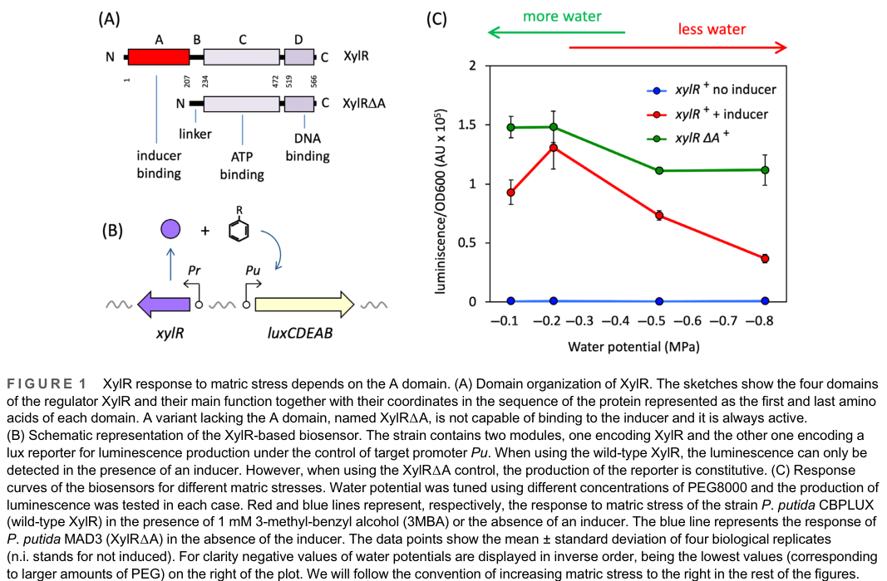

## Question

# Gene Research for Functional Annotation

## ⚠️ CRITICAL: Gene/Protein Identification Context

**BEFORE YOU BEGIN RESEARCH:** You MUST verify you are researching the CORRECT gene/protein. Gene symbols can be ambiguous, especially for less well-characterized genes from non-model organisms.

### Target Gene/Protein Identity (from UniProt):
- **UniProt Accession:** P06519
- **Protein Description:** RecName: Full=Transcriptional regulatory protein XylR; AltName: Full=67 kDa protein;
- **Gene Information:** Name=xylR;
- **Organism (full):** Pseudomonas putida (Arthrobacter siderocapsulatus).
- **Protein Family:** Not specified in UniProt
- **Key Domains:** AAA+_ATPase. (IPR003593); AAA_lid_NorR. (IPR058031); Homeodomain-like_sf. (IPR009057); HTH_Fis. (IPR002197); NO_sig/Golgi_transp_ligand-bd. (IPR024096)

### MANDATORY VERIFICATION STEPS:

1. **Check if the gene symbol "xylR" matches the protein description above**
2. **Verify the organism is correct:** Pseudomonas putida (Arthrobacter siderocapsulatus).
3. **Check if protein family/domains align with what you find in literature**
4. **If you find literature for a DIFFERENT gene with the same or similar symbol, STOP**

### If Gene Symbol is Ambiguous or You Cannot Find Relevant Literature:

**DO NOT PROCEED WITH RESEARCH ON A DIFFERENT GENE.** Instead:
- State clearly: "The gene symbol 'xylR' is ambiguous or literature is limited for this specific protein"
- Explain what you found (e.g., "Found extensive literature on a different gene with the same symbol in a different organism")
- Describe the protein based ONLY on the UniProt information provided above
- Suggest that the protein function can be inferred from domain/family information

### Research Target:

Please provide a comprehensive research report on the gene **xylR** (gene ID: xylR, UniProt: P06519) in PSEPK.

The research report should be a detailed narrative explaining the function, biological processes, and localization of the gene product. Citations should be given for all claims.

You should prioritize authoritative reviews and primary scientific literature when conducting research. You can supplement
this with annotations you find in gene/protein databases, but these can be outdated or inaccurate.

We are specifically interested in the primary function of the gene - for enzymes, what reaction is catalyzed, and what is the substrate specificity? For transporters, what is the substrate? For structural proteins or adapters, what is the broader structural role? For signaling molecules, what is the role in the pathway.

We are interested in where in or outside the cell the gene product carries out its function.

We are also interested in the signaling or biochemical pathways in which the gene functions. We are less interested in broad pleiotropic effects, except where these elucidate the precise role.

Include evidence where possible. We are interested in both experimental evidence as well as inference from structure, evolution, or bioinformatic analysis. Precise studies should be prioritized over high-throughput, where available.

## Output

Question: You are an expert researcher providing comprehensive, well-cited information.

Provide detailed information focusing on:
1. Key concepts and definitions with current understanding
2. Recent developments and latest research (prioritize 2023-2024 sources)
3. Current applications and real-world implementations
4. Expert opinions and analysis from authoritative sources
5. Relevant statistics and data from recent studies

Format as a comprehensive research report with proper citations. Include URLs and publication dates where available.
Always prioritize recent, authoritative sources and provide specific citations for all major claims.

# Gene Research for Functional Annotation

## ⚠️ CRITICAL: Gene/Protein Identification Context

**BEFORE YOU BEGIN RESEARCH:** You MUST verify you are researching the CORRECT gene/protein. Gene symbols can be ambiguous, especially for less well-characterized genes from non-model organisms.

### Target Gene/Protein Identity (from UniProt):
- **UniProt Accession:** P06519
- **Protein Description:** RecName: Full=Transcriptional regulatory protein XylR; AltName: Full=67 kDa protein;
- **Gene Information:** Name=xylR;
- **Organism (full):** Pseudomonas putida (Arthrobacter siderocapsulatus).
- **Protein Family:** Not specified in UniProt
- **Key Domains:** AAA+_ATPase. (IPR003593); AAA_lid_NorR. (IPR058031); Homeodomain-like_sf. (IPR009057); HTH_Fis. (IPR002197); NO_sig/Golgi_transp_ligand-bd. (IPR024096)

### MANDATORY VERIFICATION STEPS:

1. **Check if the gene symbol "xylR" matches the protein description above**
2. **Verify the organism is correct:** Pseudomonas putida (Arthrobacter siderocapsulatus).
3. **Check if protein family/domains align with what you find in literature**
4. **If you find literature for a DIFFERENT gene with the same or similar symbol, STOP**

### If Gene Symbol is Ambiguous or You Cannot Find Relevant Literature:

**DO NOT PROCEED WITH RESEARCH ON A DIFFERENT GENE.** Instead:
- State clearly: "The gene symbol 'xylR' is ambiguous or literature is limited for this specific protein"
- Explain what you found (e.g., "Found extensive literature on a different gene with the same symbol in a different organism")
- Describe the protein based ONLY on the UniProt information provided above
- Suggest that the protein function can be inferred from domain/family information

### Research Target:

Please provide a comprehensive research report on the gene **xylR** (gene ID: xylR, UniProt: P06519) in PSEPK.

The research report should be a detailed narrative explaining the function, biological processes, and localization of the gene product. Citations should be given for all claims.

You should prioritize authoritative reviews and primary scientific literature when conducting research. You can supplement
this with annotations you find in gene/protein databases, but these can be outdated or inaccurate.

We are specifically interested in the primary function of the gene - for enzymes, what reaction is catalyzed, and what is the substrate specificity? For transporters, what is the substrate? For structural proteins or adapters, what is the broader structural role? For signaling molecules, what is the role in the pathway.

We are interested in where in or outside the cell the gene product carries out its function.

We are also interested in the signaling or biochemical pathways in which the gene functions. We are less interested in broad pleiotropic effects, except where these elucidate the precise role.

Include evidence where possible. We are interested in both experimental evidence as well as inference from structure, evolution, or bioinformatic analysis. Precise studies should be prioritized over high-throughput, where available.

# Research Report: Functional Annotation of **xylR** (UniProt **P06519**) in *Pseudomonas putida* (TOL system)

## 0) Mandatory verification: correct gene/protein identity

The UniProt accession **P06519** corresponds to *Pseudomonas putida* (classically strain mt-2) **XylR**, a **σ54-dependent bacterial enhancer-binding protein (bEBP)** that controls expression of promoters in the **TOL (pWW0) plasmid** catabolic network for aromatic hydrocarbons. This XylR is specifically described as a **prokaryotic enhancer-binding transcription factor of the NtrC family**, responsive to aromatic effectors, and is explicitly linked to **TOL-plasmid promoters Pu and Ps** rather than to xylose utilization regulation. (dvorak2023waterpotentialgoverns pages 1-2, devos2002decipheringtheaction pages 1-2, bertoni1997geneticevidenceof pages 1-2)

## 1) Key concepts and definitions (current understanding)

### 1.1 σ54-dependent transcription and bEBPs
σ54 (RpoN)-dependent promoters form unusually stable **closed complexes** with RNA polymerase that require ATP-driven remodeling by **bEBPs** to become transcriptionally active. A core mechanistic model is that bEBPs use a **central AAA+ ATPase domain** to couple ATP hydrolysis to remodeling of the σ54–RNAP complex, driving DNA melting/open complex formation at the −12/−24 promoter region. (bush2012theroleof pages 4-6)

### 1.2 What XylR is (and is not)
**XylR (P06519) is not an enzyme** and does not catalyze a metabolic reaction; it is a **signal-responsive transcriptional regulator** that activates transcription of genes enabling catabolism of aromatic hydrocarbons. In the TOL system it activates the **Pu promoter** driving the **upper operon** and activates σ54-class promoter **Ps1** to induce **xylS**, thereby coordinating the broader catabolic program. (dvorak2023waterpotentialgoverns pages 1-2, bertoni1997geneticevidenceof pages 1-2, tropel2004bacterialtranscriptionalregulators pages 9-10)

### 1.3 Domain architecture and functional modules
Multiple primary studies and a recent 2023 paper support a **modular A–B–C–D organization**:
- **A domain (N-terminus):** effector/inducer recognition and intramolecular repression in the absence of inducer
- **B region/linker:** transmits conformational changes; influences effector specificity
- **C domain (central AAA+ ATPase):** ATP binding/hydrolysis powering σ54 activation
- **D domain (C-terminus):** DNA binding to upstream activating sequences (UAS), typically via an HTH-type motif

These modules are depicted in the 2023 work’s domain schematic (Figure 1A). (devos2002decipheringtheaction pages 1-2, garmendia2000theroleof pages 1-2, dvorak2023waterpotentialgoverns media ed53c3c9)

## 2) Biological function, pathway context, and cellular localization

### 2.1 Pathway context: TOL plasmid catabolic network
XylR is described as the principal/master regulator in the TOL plasmid network controlling degradation of **toluene and xylene isomers**. It activates the **Pu** and **Ps** promoters, which drive expression of operons that convert aromatic hydrocarbons through intermediates to corresponding carboxylic acids and downstream products. (dvorak2023waterpotentialgoverns pages 1-2, bertoni1997geneticevidenceof pages 1-2)

### 2.2 Promoters and regulatory layout (Pu, Ps1/Ps2, Pr)
The xylR/xylS intergenic region contains multiple promoters:
- **Pr1/Pr2:** tandem σ70-dependent promoters driving **xylR**
- **Ps2:** constitutive σ70-dependent promoter for **xylS**
- **Ps1:** **σ54-dependent**, inducible promoter for **xylS**

XylR binds UAS sequences that overlap the Pr promoters and are within/near Ps1, enabling **autoregulation** (repression of Pr) and activation of Ps1 under inducing conditions. (marques1998activationandrepression pages 1-2)

### 2.3 Cellular localization
All mechanistic evidence in the retrieved corpus is consistent with XylR functioning as a **cytoplasmic DNA-binding transcription factor** acting on plasmid-borne promoters (Pu/Ps/Pr) inside the cell; there is no indication of membrane localization or secretion. (bertoni1997geneticevidenceof pages 1-2, garmendia2000theroleof pages 1-2)

## 3) Mechanism of action (experimental evidence)

### 3.1 Effector sensing and relief of intramolecular repression
The N-terminal A domain is described as binding aromatic effectors and repressing the central activation domain until inducer binding. Deletion of the N-terminal region (e.g., removal of the A domain) yields **constitutive activity**, supporting the “A-domain-as-repressor” model. (devos2002decipheringtheaction pages 1-2, dvorak2021anupdatedstructural pages 10-12)

### 3.2 ATPase-driven activation of σ54 promoters
XylR belongs to NtrC-like bEBPs that activate σ54 transcription via ATP hydrolysis. A classic mechanistic description includes UAS binding, oligomerization, ATP hydrolysis, and productive contact with σ54-RNAP to drive open-complex formation. (bertoni1997geneticevidenceof pages 1-2, tropel2004bacterialtranscriptionalregulators pages 17-18, bush2012theroleof pages 4-6)

Genetic analysis supports separation of activation and repression functions: XylR variants defective in activation of Ps (σ54 promoter) remained competent for repression of Pr (autoregulation), indicating distinct mechanistic requirements. (bertoni1997geneticevidenceof pages 4-5)

### 3.3 Enhancer-like regulation and host factors (IHF and σ54)
XylR binds UAS sites and can act at a distance, often requiring DNA looping and bending. Integration host factor (**IHF**) is implicated in modulating promoter outputs in the xylR/xylS region, affecting basal and maximal induction behavior. σ54 (RpoN) is essential for Ps1 activity: Ps1 transcription is abolished in σ54-deficient backgrounds. (marques1998activationandrepression pages 1-2, marques1998activationandrepression pages 3-4)

## 4) Recent developments (prioritizing 2023–2024)

### 4.1 2023: Water potential controls effector specificity and output
A 2023 *Environmental Microbiology* study reports that **environmental water availability (water potential/humidity)** alters XylR-mediated activation and **changes effector specificity** at the Pu promoter, with effects traceable to conformational changes in the A-domain effector-binding region. The study uses non-disruptive **lux** reporters and compares wild-type XylR to A-domain variants and to a constitutive **xylRΔA** background. (dvorak2023waterpotentialgoverns pages 1-2, dvorak2023waterpotentialgoverns pages 5-6)

**Key quantitative data from this 2023 study:**
- PEG8000-generated water potentials: **0.15, 0.25, 0.50, 0.75 MPa** (0, 25, 100, 200 g/L PEG8000). (dvorak2023waterpotentialgoverns pages 4-5)
- PEG8000 treatment caused **20–50% growth reductions** in the reported conditions. (dvorak2023waterpotentialgoverns pages 5-6)
- A-domain variant predicted pocket volumes increased vs wild type: **WT 225.0 ± 10.0 ų**, vs **Va 285.8 ± 8.2**, **V18 268.0 ± 6.2**, **V101 237.2 ± 9.2 ų** (significant expansions for V18/V101, p<0.01). (dvorak2023waterpotentialgoverns pages 8-11)
- Compatible solute **glycine betaine** can restore activity toward poor effectors under low water potential, consistent with an osmotic/conformational component to signaling. (dvorak2023waterpotentialgoverns pages 6-8)

The paper’s Figure 1 schematically links (i) XylR domain structure, (ii) Pu reporter design, and (iii) water-potential effects on Pu output, providing a compact “current view” of this regulatory system under environmental stress. (dvorak2023waterpotentialgoverns media ed53c3c9)

### 4.2 2024: limited directly citable new primary data in retrieved corpus
Within the retrieved 2024 sources, no additional primary study directly quantifying *P. putida* XylR (P06519) biosensor performance or structural mechanism was available for citation beyond the 2023 primary study and established mechanistic literature. Therefore, the “latest research” component is anchored primarily by the 2023 primary study above. (dvorak2023waterpotentialgoverns pages 1-2)

## 5) Current applications and real-world implementations

### 5.1 Whole-cell biosensing and reporter implementations
XylR’s modular effector-sensing and σ54 activation has made it a common chassis for building **whole-cell biosensors** for aromatic compounds. In the 2023 study, the practical implementation is explicit: a **Pu–luxCDABE** reporter in *P. putida* backgrounds (including variants of the XylR A domain) is used to quantify responses to inducers under environmental water-stress conditions. (dvorak2023waterpotentialgoverns pages 6-8, dvorak2023waterpotentialgoverns pages 4-5, dvorak2023waterpotentialgoverns media ed53c3c9)

### 5.2 Biodegradation network engineering (systems/synthetic biology context)
At a system level, XylR operates as the upstream regulator that coordinates the TOL catabolic network; modeling and systems descriptions emphasize XylR/XylS interplay and σ54/σ70 promoter layering as a design motif for coordinating long catabolic routes. This architecture underlies many synthetic-biology adaptations where catabolic pathways are re-contextualized into engineered hosts. (tropel2004bacterialtranscriptionalregulators pages 9-10, marques1998activationandrepression pages 1-2)

## 6) Expert opinions and authoritative analyses

Two highly cited reviews provide authoritative framing:
- **Tropel & van der Meer (2004, MMBR)** summarize aromatic-pathway regulators, placing XylR among NtrC-family activators that require chemical effectors plus ATP and bind UAS sites to activate σ54 promoters; they also describe the regulatory cascade with XylR activating xylS transcription from σ54 promoter **Ps1** while **Ps2** provides low basal σ70-driven xylS expression. (tropel2004bacterialtranscriptionalregulators pages 17-18, tropel2004bacterialtranscriptionalregulators pages 9-10)
- **Bush & Dixon (2012, MMBR)** provide a detailed mechanistic framework for σ54 bEBPs, including modular domain organization and how AAA+ ATPase hexamers remodel the σ54–RNAP complex; XylR is cited as a representative σ54-dependent activator, and XylR mutational evidence (e.g., ATPase-defective mutations) is used to support ATPase function requirements. (bush2012theroleof pages 4-6)

Together, these reviews support a consensus view of XylR as a canonical σ54 bEBP with effector-responsive regulation and ATPase-driven transcriptional activation. (tropel2004bacterialtranscriptionalregulators pages 17-18, bush2012theroleof pages 4-6)

## 7) Statistics and data highlights (from recent and foundational studies)

- **σ54 dependence of Ps1:** Ps1 transcription is abolished in σ54 (rpoN) deficient backgrounds; additionally, σ54 deletion caused **~10-fold increase** in Ps2 and **~2-fold increases** in Pr1/Pr2 in one genetic background examined. (marques1998activationandrepression pages 3-4)
- **IHF modulation:** In an IHF-deficient strain, effector-dependent induction at Ps1 was reported **up to ~20-fold** under the described conditions. (marques1998activationandrepression pages 3-4)
- **Water potential experiments (2023):** defined water potentials **0.15–0.75 MPa**, growth reductions **20–50%**, and A-domain pocket volume changes (WT vs variants) as above. (dvorak2023waterpotentialgoverns pages 5-6, dvorak2023waterpotentialgoverns pages 4-5, dvorak2023waterpotentialgoverns pages 8-11)

## 8) Visual evidence (figure)

Figure evidence summarizing domain architecture and reporter implementation is available from the 2023 study: the figure includes XylR **A–B–C–D** domain organization and Pu-lux reporter schematic and data on water potential effects. (dvorak2023waterpotentialgoverns media ed53c3c9)

## Evidence summary table

| Feature | Evidence summary | Key citations | Publication info |
|---|---|---|---|
| Gene/protein identity | UniProt P06519 corresponds to **Pseudomonas putida** TOL-plasmid **XylR**, an aromatic-effector-responsive **σ54-dependent enhancer-binding transcriptional regulator**; this distinguishes it from unrelated XylR proteins such as xylose regulators in other taxa. | (dvorak2023waterpotentialgoverns pages 1-2, devos2002decipheringtheaction pages 1-2, bertoni1997geneticevidenceof pages 1-2) | 2023, https://doi.org/10.1111/1462-2920.16342; 2002, https://doi.org/10.1046/j.1462-2920.2002.00265.x; 1997, https://doi.org/10.1046/j.1365-2958.1997.3091673.x |
| Organism / genetic element | XylR is encoded in the **pWW0 TOL plasmid** regulatory network of *P. putida* mt-2 and controls aromatic-hydrocarbon catabolism. | (dvorak2023waterpotentialgoverns pages 1-2, marques1998activationandrepression pages 1-2) | 2023, https://doi.org/10.1111/1462-2920.16342; 1998, https://doi.org/10.1128/jb.180.11.2889-2894.1998 |
| Domains / modules | XylR has modular **A-B-C-D** organization: **A** inducer/effector recognition, **B** interdomain linker, **C** central **AAA+/ATPase** activation domain, **D** C-terminal HTH/UAS DNA-binding domain. | (devos2002decipheringtheaction pages 1-2, garmendia2000theroleof pages 1-2, dvorak2023waterpotentialgoverns media ed53c3c9) | 2002, https://doi.org/10.1046/j.1462-2920.2002.00265.x; 2000, https://doi.org/10.1046/j.1365-2958.2000.02139.x; 2023, https://doi.org/10.1111/1462-2920.16342 |
| Effector ligands / specificity | Native effectors include **toluene and xylene isomers**; XylR also responds variably to related aromatics, and A-domain mutations expand or alter specificity, including responses to poor/non-native inducers such as TCB in some contexts. | (dvorak2023waterpotentialgoverns pages 1-2, devos2002decipheringtheaction pages 1-2, garmendia2000theroleof pages 3-4, dvorak2023waterpotentialgoverns pages 8-11) | 2023, https://doi.org/10.1111/1462-2920.16342; 2002, https://doi.org/10.1046/j.1462-2920.2002.00265.x; 2000, https://doi.org/10.1046/j.1365-2958.2000.02139.x |
| Regulated promoters / operons | XylR activates the **σ54-dependent Pu promoter** of the **upper TOL operon** and also regulates **Ps1** controlling **xylS**; UAS binding can overlap divergent **Pr** promoters driving xylR. | (bertoni1997geneticevidenceof pages 1-2, marques1998activationandrepression pages 1-2) | 1997, https://doi.org/10.1046/j.1365-2958.1997.3091673.x; 1998, https://doi.org/10.1128/jb.180.11.2889-2894.1998 |
| Primary biological function | XylR is a **transcriptional activator**, not a catabolic enzyme: it turns on genes for the **upper TOL pathway**, which converts toluene/xylene-type aromatics to corresponding carboxylic acids. | (dvorak2023waterpotentialgoverns pages 1-2, garmendia2000theroleof pages 1-2) | 2023, https://doi.org/10.1111/1462-2920.16342; 2000, https://doi.org/10.1046/j.1365-2958.2000.02139.x |
| Activation mechanism | Effector binding to domain A relieves intramolecular repression; XylR then uses **ATP binding/hydrolysis**, oligomerization, and contact with **σ54-RNAP** to stimulate closed-to-open complex transition at target promoters. | (devos2002decipheringtheaction pages 1-2, tropel2004bacterialtranscriptionalregulators pages 17-18, bush2012theroleof pages 4-6, garmendia2000theroleof pages 10-10) | 2002, https://doi.org/10.1046/j.1462-2920.2002.00265.x; 2004, https://doi.org/10.1128/mmbr.68.3.474-500.2004; 2012, https://doi.org/10.1128/mmbr.00006-12; 2000, https://doi.org/10.1046/j.1365-2958.2000.02139.x |
| Repression / autoregulation | XylR also represses its own **Pr** promoter region by occupying overlapping UAS/Pr sites; repressor and activator functions are genetically separable, and **Pr repression is σ54-independent**. | (bertoni1997geneticevidenceof pages 1-2, bertoni1997geneticevidenceof pages 4-5, marques1998activationandrepression pages 1-2) | 1997, https://doi.org/10.1046/j.1365-2958.1997.3091673.x; 1998, https://doi.org/10.1128/jb.180.11.2889-2894.1998 |
| DNA binding / enhancer organization | XylR binds **upstream activating sequences (UASs)** typically >100 bp upstream; DNA looping and enhancer-like architecture enable productive engagement with promoter-bound σ54-RNAP. | (bertoni1997geneticevidenceof pages 1-2, tropel2004bacterialtranscriptionalregulators pages 17-18, marques1998activationandrepression pages 1-2) | 1997, https://doi.org/10.1046/j.1365-2958.1997.3091673.x; 2004, https://doi.org/10.1128/mmbr.68.3.474-500.2004; 1998, https://doi.org/10.1128/jb.180.11.2889-2894.1998 |
| Localization | XylR functions as a **cytoplasmic DNA-binding transcription factor** acting on plasmid-borne promoters; evidence supports intracellular action rather than membrane or extracellular localization. | (bertoni1997geneticevidenceof pages 1-2, marques1998activationandrepression pages 1-2, garmendia2000theroleof pages 1-2) | 1997, https://doi.org/10.1046/j.1365-2958.1997.3091673.x; 1998, https://doi.org/10.1128/jb.180.11.2889-2894.1998; 2000, https://doi.org/10.1046/j.1365-2958.2000.02139.x |
| Key host factors | **σ54/RpoN** is essential for Ps1/Pu activation, while **IHF** modulates promoter output and enhancer-promoter communication; σ70-dependent promoters (Pr1/Pr2/Ps2) intersect with this circuit. | (marques1998activationandrepression pages 1-2, marques1998activationandrepression pages 3-4) | 1998, https://doi.org/10.1128/jb.180.11.2889-2894.1998 |
| Recent development (2023) | Water availability changes XylR specificity: lower water potential/humidity narrows response toward authentic TOL substrates, while **glycine betaine** can restore activity toward poorer effectors; A-domain variants are less humidity-sensitive. | (dvorak2023waterpotentialgoverns pages 8-11, dvorak2023waterpotentialgoverns pages 6-8, dvorak2023waterpotentialgoverns pages 5-6, dvorak2023waterpotentialgoverns pages 4-5) | 2023, https://doi.org/10.1111/1462-2920.16342 |
| Representative quantitative findings | In 2023 work, PEG8000 treatments defined **0.15, 0.25, 0.50, 0.75 MPa** water potentials; variant binding-pocket volumes were **225.0 ± 10.0 Å3** (WT) versus **285.8 ± 8.2**, **268.0 ± 6.2**, **237.2 ± 9.2 Å3** for Va, V18, V101, with significant expansions for V18/V101. | (dvorak2023waterpotentialgoverns pages 8-11, dvorak2023waterpotentialgoverns pages 4-5) | 2023, https://doi.org/10.1111/1462-2920.16342 |

*Table: This table summarizes the experimentally supported functional annotation of XylR (UniProt P06519) in the Pseudomonas putida TOL system, including identity, domains, mechanism, pathway context, localization, and recent 2023 findings. It is useful as a concise evidence map linking each annotation claim to specific gathered context IDs and publication metadata.*

## References (URLs and publication dates)

- Dvořák P. et al. *Environmental Microbiology* (published online Jan 2023). “Water potential governs the effector specificity of the transcriptional regulator XylR of Pseudomonas putida.” https://doi.org/10.1111/1462-2920.16342 (dvorak2023waterpotentialgoverns pages 1-2)
- Marqués S. et al. *Journal of Bacteriology* (Jun 1998). “Activation and Repression of Transcription at the Double Tandem Divergent Promoters for the xylR and xylS Genes…” https://doi.org/10.1128/jb.180.11.2889-2894.1998 (marques1998activationandrepression pages 1-2)
- Bertoni G. et al. *Molecular Microbiology* (Mar 1997). “Genetic evidence of separate repressor and activator activities of the XylR regulator…” https://doi.org/10.1046/j.1365-2958.1997.3091673.x (bertoni1997geneticevidenceof pages 1-2)
- Garmendia J. & de Lorenzo V. *Molecular Microbiology* (Oct 2000). “The role of the interdomain B linker in the activation of the XylR protein…” https://doi.org/10.1046/j.1365-2958.2000.02139.x (garmendia2000theroleof pages 1-2)
- Devos D.P. et al. *Environmental Microbiology* (Jan 2002). “Deciphering the action of aromatic effectors on… XylR…” https://doi.org/10.1046/j.1462-2920.2002.00265.x (devos2002decipheringtheaction pages 1-2)
- Tropel D. & van der Meer J.R. *Microbiology and Molecular Biology Reviews* (Sep 2004). “Bacterial Transcriptional Regulators for Degradation Pathways of Aromatic Compounds.” https://doi.org/10.1128/mmbr.68.3.474-500.2004 (tropel2004bacterialtranscriptionalregulators pages 18-18)
- Bush M.J. & Dixon R. *Microbiology and Molecular Biology Reviews* (Sep 2012). “The Role of Bacterial Enhancer Binding Proteins as Specialized Activators of σ54-Dependent Transcription.” https://doi.org/10.1128/mmbr.00006-12 (bush2012theroleof pages 4-6)

## Limitations of this synthesis

Some high-value classic primary sources directly quantifying XylR DNA binding footprints, intracellular abundance dynamics, or providing in vitro kinetic constants were listed by the search system but were not obtainable in full text during this run; therefore this report emphasizes the accessible primary studies and authoritative reviews listed above, and does not report binding constants (Kd) or absolute ATPase rates that are not present in the retrieved evidence. (bertoni1997geneticevidenceof pages 1-2, bush2012theroleof pages 4-6)

References

1. (dvorak2023waterpotentialgoverns pages 1-2): Pavel Dvořák, Teca Calcagno Galvão, Katharina Pflüger‐Grau, Alice M. Banks, Víctor de Lorenzo, and Jose I. Jiménez. Water potential governs the effector specificity of the transcriptional regulator <scp>xylr</scp> of <scp><i>pseudomonas putida</i></scp>. Environmental Microbiology, 25:1041-1054, Jan 2023. URL: https://doi.org/10.1111/1462-2920.16342, doi:10.1111/1462-2920.16342. This article has 2 citations and is from a domain leading peer-reviewed journal.

2. (devos2002decipheringtheaction pages 1-2): Damien P. Devos, J. Garmendia, V. D. Lorenzo, and Alfonso Valencia. Deciphering the action of aromatic effectors on the prokaryotic enhancer-binding protein xylr: a structural model of its n-terminal domain. Environmental microbiology, 4 1:29-41, Jan 2002. URL: https://doi.org/10.1046/j.1462-2920.2002.00265.x, doi:10.1046/j.1462-2920.2002.00265.x. This article has 57 citations and is from a domain leading peer-reviewed journal.

3. (bertoni1997geneticevidenceof pages 1-2): Giovanni Bertoni, Jose Perez‐Martfn, and Victor de Lorenzo. Genetic evidence of separate repressor and activator activities of the xylr regulator of the tol plasmid, pwwo, of pseudomonas putida. Molecular Microbiology, 23:1221-1227, Mar 1997. URL: https://doi.org/10.1046/j.1365-2958.1997.3091673.x, doi:10.1046/j.1365-2958.1997.3091673.x. This article has 28 citations and is from a domain leading peer-reviewed journal.

4. (bush2012theroleof pages 4-6): Matthew J. Bush and R. Dixon. The role of bacterial enhancer binding proteins as specialized activators of σ54-dependent transcription. Microbiology and Molecular Biology Reviews, 76:497-529, Sep 2012. URL: https://doi.org/10.1128/mmbr.00006-12, doi:10.1128/mmbr.00006-12. This article has 417 citations and is from a domain leading peer-reviewed journal.

5. (tropel2004bacterialtranscriptionalregulators pages 9-10): David Tropel and Jan Roelof van der Meer. Bacterial transcriptional regulators for degradation pathways of aromatic compounds. Microbiology and Molecular Biology Reviews, 68:474-500, Sep 2004. URL: https://doi.org/10.1128/mmbr.68.3.474-500.2004, doi:10.1128/mmbr.68.3.474-500.2004. This article has 481 citations and is from a domain leading peer-reviewed journal.

6. (garmendia2000theroleof pages 1-2): Junkal Garmendia and Víctor De Lorenzo. The role of the interdomain b linker in the activation of the xylr protein of pseudomonas putida. Molecular Microbiology, 38:401-410, Oct 2000. URL: https://doi.org/10.1046/j.1365-2958.2000.02139.x, doi:10.1046/j.1365-2958.2000.02139.x. This article has 47 citations and is from a domain leading peer-reviewed journal.

7. (dvorak2023waterpotentialgoverns media ed53c3c9): Pavel Dvořák, Teca Calcagno Galvão, Katharina Pflüger‐Grau, Alice M. Banks, Víctor de Lorenzo, and Jose I. Jiménez. Water potential governs the effector specificity of the transcriptional regulator <scp>xylr</scp> of <scp><i>pseudomonas putida</i></scp>. Environmental Microbiology, 25:1041-1054, Jan 2023. URL: https://doi.org/10.1111/1462-2920.16342, doi:10.1111/1462-2920.16342. This article has 2 citations and is from a domain leading peer-reviewed journal.

8. (marques1998activationandrepression pages 1-2): Silvia Marqués, María-Trinidad Gallegos, Maximino Manzanera, Andreas Holtel, Kenneth N. Timmis, and Juan L. Ramos. Activation and repression of transcription at the double tandem divergent promoters for the xylr and xyls genes of the tol plasmid of pseudomonas putida. Journal of Bacteriology, 180:2889-2894, Jun 1998. URL: https://doi.org/10.1128/jb.180.11.2889-2894.1998, doi:10.1128/jb.180.11.2889-2894.1998. This article has 78 citations and is from a peer-reviewed journal.

9. (dvorak2021anupdatedstructural pages 10-12): Pavel Dvořák, Carlos Alvarez-Carreño, Sergio Ciordia, Alberto Paradela, and Víctor de Lorenzo. An updated structural model of the a domain of the pseudomonas putida xylr regulator exposes a distinct interplay with aromatic effectors. bioRxiv, Jan 2021. URL: https://doi.org/10.1101/2021.01.17.427014, doi:10.1101/2021.01.17.427014. This article has 0 citations.

10. (tropel2004bacterialtranscriptionalregulators pages 17-18): David Tropel and Jan Roelof van der Meer. Bacterial transcriptional regulators for degradation pathways of aromatic compounds. Microbiology and Molecular Biology Reviews, 68:474-500, Sep 2004. URL: https://doi.org/10.1128/mmbr.68.3.474-500.2004, doi:10.1128/mmbr.68.3.474-500.2004. This article has 481 citations and is from a domain leading peer-reviewed journal.

11. (bertoni1997geneticevidenceof pages 4-5): Giovanni Bertoni, Jose Perez‐Martfn, and Victor de Lorenzo. Genetic evidence of separate repressor and activator activities of the xylr regulator of the tol plasmid, pwwo, of pseudomonas putida. Molecular Microbiology, 23:1221-1227, Mar 1997. URL: https://doi.org/10.1046/j.1365-2958.1997.3091673.x, doi:10.1046/j.1365-2958.1997.3091673.x. This article has 28 citations and is from a domain leading peer-reviewed journal.

12. (marques1998activationandrepression pages 3-4): Silvia Marqués, María-Trinidad Gallegos, Maximino Manzanera, Andreas Holtel, Kenneth N. Timmis, and Juan L. Ramos. Activation and repression of transcription at the double tandem divergent promoters for the xylr and xyls genes of the tol plasmid of pseudomonas putida. Journal of Bacteriology, 180:2889-2894, Jun 1998. URL: https://doi.org/10.1128/jb.180.11.2889-2894.1998, doi:10.1128/jb.180.11.2889-2894.1998. This article has 78 citations and is from a peer-reviewed journal.

13. (dvorak2023waterpotentialgoverns pages 5-6): Pavel Dvořák, Teca Calcagno Galvão, Katharina Pflüger‐Grau, Alice M. Banks, Víctor de Lorenzo, and Jose I. Jiménez. Water potential governs the effector specificity of the transcriptional regulator <scp>xylr</scp> of <scp><i>pseudomonas putida</i></scp>. Environmental Microbiology, 25:1041-1054, Jan 2023. URL: https://doi.org/10.1111/1462-2920.16342, doi:10.1111/1462-2920.16342. This article has 2 citations and is from a domain leading peer-reviewed journal.

14. (dvorak2023waterpotentialgoverns pages 4-5): Pavel Dvořák, Teca Calcagno Galvão, Katharina Pflüger‐Grau, Alice M. Banks, Víctor de Lorenzo, and Jose I. Jiménez. Water potential governs the effector specificity of the transcriptional regulator <scp>xylr</scp> of <scp><i>pseudomonas putida</i></scp>. Environmental Microbiology, 25:1041-1054, Jan 2023. URL: https://doi.org/10.1111/1462-2920.16342, doi:10.1111/1462-2920.16342. This article has 2 citations and is from a domain leading peer-reviewed journal.

15. (dvorak2023waterpotentialgoverns pages 8-11): Pavel Dvořák, Teca Calcagno Galvão, Katharina Pflüger‐Grau, Alice M. Banks, Víctor de Lorenzo, and Jose I. Jiménez. Water potential governs the effector specificity of the transcriptional regulator <scp>xylr</scp> of <scp><i>pseudomonas putida</i></scp>. Environmental Microbiology, 25:1041-1054, Jan 2023. URL: https://doi.org/10.1111/1462-2920.16342, doi:10.1111/1462-2920.16342. This article has 2 citations and is from a domain leading peer-reviewed journal.

16. (dvorak2023waterpotentialgoverns pages 6-8): Pavel Dvořák, Teca Calcagno Galvão, Katharina Pflüger‐Grau, Alice M. Banks, Víctor de Lorenzo, and Jose I. Jiménez. Water potential governs the effector specificity of the transcriptional regulator <scp>xylr</scp> of <scp><i>pseudomonas putida</i></scp>. Environmental Microbiology, 25:1041-1054, Jan 2023. URL: https://doi.org/10.1111/1462-2920.16342, doi:10.1111/1462-2920.16342. This article has 2 citations and is from a domain leading peer-reviewed journal.

17. (garmendia2000theroleof pages 3-4): Junkal Garmendia and Víctor De Lorenzo. The role of the interdomain b linker in the activation of the xylr protein of pseudomonas putida. Molecular Microbiology, 38:401-410, Oct 2000. URL: https://doi.org/10.1046/j.1365-2958.2000.02139.x, doi:10.1046/j.1365-2958.2000.02139.x. This article has 47 citations and is from a domain leading peer-reviewed journal.

18. (garmendia2000theroleof pages 10-10): Junkal Garmendia and Víctor De Lorenzo. The role of the interdomain b linker in the activation of the xylr protein of pseudomonas putida. Molecular Microbiology, 38:401-410, Oct 2000. URL: https://doi.org/10.1046/j.1365-2958.2000.02139.x, doi:10.1046/j.1365-2958.2000.02139.x. This article has 47 citations and is from a domain leading peer-reviewed journal.

19. (tropel2004bacterialtranscriptionalregulators pages 18-18): David Tropel and Jan Roelof van der Meer. Bacterial transcriptional regulators for degradation pathways of aromatic compounds. Microbiology and Molecular Biology Reviews, 68:474-500, Sep 2004. URL: https://doi.org/10.1128/mmbr.68.3.474-500.2004, doi:10.1128/mmbr.68.3.474-500.2004. This article has 481 citations and is from a domain leading peer-reviewed journal.

## Artifacts

- [Edison artifact artifact-00](xylR-deep-research-falcon_artifacts/artifact-00.md)

## Citations

1. bush2012theroleof pages 4-6
2. marques1998activationandrepression pages 1-2
3. bertoni1997geneticevidenceof pages 4-5
4. dvorak2023waterpotentialgoverns pages 4-5
5. dvorak2023waterpotentialgoverns pages 5-6
6. dvorak2023waterpotentialgoverns pages 8-11
7. dvorak2023waterpotentialgoverns pages 6-8
8. dvorak2023waterpotentialgoverns pages 1-2
9. marques1998activationandrepression pages 3-4
10. bertoni1997geneticevidenceof pages 1-2
11. garmendia2000theroleof pages 1-2
12. devos2002decipheringtheaction pages 1-2
13. tropel2004bacterialtranscriptionalregulators pages 18-18
14. tropel2004bacterialtranscriptionalregulators pages 9-10
15. dvorak2021anupdatedstructural pages 10-12
16. tropel2004bacterialtranscriptionalregulators pages 17-18
17. garmendia2000theroleof pages 3-4
18. garmendia2000theroleof pages 10-10
19. https://doi.org/10.1111/1462-2920.16342;
20. https://doi.org/10.1046/j.1462-2920.2002.00265.x;
21. https://doi.org/10.1046/j.1365-2958.1997.3091673.x
22. https://doi.org/10.1128/jb.180.11.2889-2894.1998
23. https://doi.org/10.1046/j.1365-2958.2000.02139.x;
24. https://doi.org/10.1111/1462-2920.16342
25. https://doi.org/10.1046/j.1365-2958.2000.02139.x
26. https://doi.org/10.1046/j.1365-2958.1997.3091673.x;
27. https://doi.org/10.1128/mmbr.68.3.474-500.2004;
28. https://doi.org/10.1128/mmbr.00006-12;
29. https://doi.org/10.1128/jb.180.11.2889-2894.1998;
30. https://doi.org/10.1046/j.1462-2920.2002.00265.x
31. https://doi.org/10.1128/mmbr.68.3.474-500.2004
32. https://doi.org/10.1128/mmbr.00006-12
33. https://doi.org/10.1111/1462-2920.16342,
34. https://doi.org/10.1046/j.1462-2920.2002.00265.x,
35. https://doi.org/10.1046/j.1365-2958.1997.3091673.x,
36. https://doi.org/10.1128/mmbr.00006-12,
37. https://doi.org/10.1128/mmbr.68.3.474-500.2004,
38. https://doi.org/10.1046/j.1365-2958.2000.02139.x,
39. https://doi.org/10.1128/jb.180.11.2889-2894.1998,
40. https://doi.org/10.1101/2021.01.17.427014,