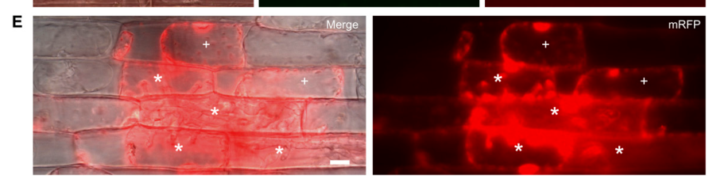

## Question

# Gene Research for Functional Annotation

## ⚠️ CRITICAL: Gene/Protein Identification Context

**BEFORE YOU BEGIN RESEARCH:** You MUST verify you are researching the CORRECT gene/protein. Gene symbols can be ambiguous, especially for less well-characterized genes from non-model organisms.

### Target Gene/Protein Identity (from UniProt):
- **UniProt Accession:** G5EHI7
- **Protein Description:** RecName: Full=Biotrophy-associated secreted protein 1 {ECO:0000303|PubMed:19357089}; Flags: Precursor;
- **Gene Information:** Name=BAS1 {ECO:0000303|PubMed:19357089}; ORFNames=MGG_04795;
- **Organism (full):** Pyricularia oryzae (strain 70-15 / ATCC MYA-4617 / FGSC 8958) (Rice blast fungus) (Magnaporthe oryzae).
- **Protein Family:** Not specified in UniProt
- **Key Domains:** Not specified in UniProt

### MANDATORY VERIFICATION STEPS:

1. **Check if the gene symbol "BAS1" matches the protein description above**
2. **Verify the organism is correct:** Pyricularia oryzae (strain 70-15 / ATCC MYA-4617 / FGSC 8958) (Rice blast fungus) (Magnaporthe oryzae).
3. **Check if protein family/domains align with what you find in literature**
4. **If you find literature for a DIFFERENT gene with the same or similar symbol, STOP**

### If Gene Symbol is Ambiguous or You Cannot Find Relevant Literature:

**DO NOT PROCEED WITH RESEARCH ON A DIFFERENT GENE.** Instead:
- State clearly: "The gene symbol 'BAS1' is ambiguous or literature is limited for this specific protein"
- Explain what you found (e.g., "Found extensive literature on a different gene with the same symbol in a different organism")
- Describe the protein based ONLY on the UniProt information provided above
- Suggest that the protein function can be inferred from domain/family information

### Research Target:

Please provide a comprehensive research report on the gene **BAS1** (gene ID: BAS1, UniProt: G5EHI7) in PYRO7.

The research report should be a detailed narrative explaining the function, biological processes, and localization of the gene product. Citations should be given for all claims.

You should prioritize authoritative reviews and primary scientific literature when conducting research. You can supplement
this with annotations you find in gene/protein databases, but these can be outdated or inaccurate.

We are specifically interested in the primary function of the gene - for enzymes, what reaction is catalyzed, and what is the substrate specificity? For transporters, what is the substrate? For structural proteins or adapters, what is the broader structural role? For signaling molecules, what is the role in the pathway.

We are interested in where in or outside the cell the gene product carries out its function.

We are also interested in the signaling or biochemical pathways in which the gene functions. We are less interested in broad pleiotropic effects, except where these elucidate the precise role.

Include evidence where possible. We are interested in both experimental evidence as well as inference from structure, evolution, or bioinformatic analysis. Precise studies should be prioritized over high-throughput, where available.

## Output

Question: You are an expert researcher providing comprehensive, well-cited information.

Provide detailed information focusing on:
1. Key concepts and definitions with current understanding
2. Recent developments and latest research (prioritize 2023-2024 sources)
3. Current applications and real-world implementations
4. Expert opinions and analysis from authoritative sources
5. Relevant statistics and data from recent studies

Format as a comprehensive research report with proper citations. Include URLs and publication dates where available.
Always prioritize recent, authoritative sources and provide specific citations for all major claims.

# Gene Research for Functional Annotation

## ⚠️ CRITICAL: Gene/Protein Identification Context

**BEFORE YOU BEGIN RESEARCH:** You MUST verify you are researching the CORRECT gene/protein. Gene symbols can be ambiguous, especially for less well-characterized genes from non-model organisms.

### Target Gene/Protein Identity (from UniProt):
- **UniProt Accession:** G5EHI7
- **Protein Description:** RecName: Full=Biotrophy-associated secreted protein 1 {ECO:0000303|PubMed:19357089}; Flags: Precursor;
- **Gene Information:** Name=BAS1 {ECO:0000303|PubMed:19357089}; ORFNames=MGG_04795;
- **Organism (full):** Pyricularia oryzae (strain 70-15 / ATCC MYA-4617 / FGSC 8958) (Rice blast fungus) (Magnaporthe oryzae).
- **Protein Family:** Not specified in UniProt
- **Key Domains:** Not specified in UniProt

### MANDATORY VERIFICATION STEPS:

1. **Check if the gene symbol "BAS1" matches the protein description above**
2. **Verify the organism is correct:** Pyricularia oryzae (strain 70-15 / ATCC MYA-4617 / FGSC 8958) (Rice blast fungus) (Magnaporthe oryzae).
3. **Check if protein family/domains align with what you find in literature**
4. **If you find literature for a DIFFERENT gene with the same or similar symbol, STOP**

### If Gene Symbol is Ambiguous or You Cannot Find Relevant Literature:

**DO NOT PROCEED WITH RESEARCH ON A DIFFERENT GENE.** Instead:
- State clearly: "The gene symbol 'BAS1' is ambiguous or literature is limited for this specific protein"
- Explain what you found (e.g., "Found extensive literature on a different gene with the same symbol in a different organism")
- Describe the protein based ONLY on the UniProt information provided above
- Suggest that the protein function can be inferred from domain/family information

### Research Target:

Please provide a comprehensive research report on the gene **BAS1** (gene ID: BAS1, UniProt: G5EHI7) in PYRO7.

The research report should be a detailed narrative explaining the function, biological processes, and localization of the gene product. Citations should be given for all claims.

You should prioritize authoritative reviews and primary scientific literature when conducting research. You can supplement
this with annotations you find in gene/protein databases, but these can be outdated or inaccurate.

We are specifically interested in the primary function of the gene - for enzymes, what reaction is catalyzed, and what is the substrate specificity? For transporters, what is the substrate? For structural proteins or adapters, what is the broader structural role? For signaling molecules, what is the role in the pathway.

We are interested in where in or outside the cell the gene product carries out its function.

We are also interested in the signaling or biochemical pathways in which the gene functions. We are less interested in broad pleiotropic effects, except where these elucidate the precise role.

Include evidence where possible. We are interested in both experimental evidence as well as inference from structure, evolution, or bioinformatic analysis. Precise studies should be prioritized over high-throughput, where available.

# Functional annotation report: BAS1 (MGG_04795; UniProt G5EHI7)

## Identity and annotation

**The target is fungal BAS1, not a plant gene of the same name.** The supplied UniProt record identifies G5EHI7 as biotrophy-associated secreted protein 1 from *Pyricularia oryzae* strain 70-15, also called *Magnaporthe oryzae*. An independent fungal localization study explicitly identifies **MGG_04795p as Bas1p**, confirming the locus-to-protein match. This report does not transfer functions from plant BAS1 or from the distinct fungal proteins BAS2, BAS3 and BAS4. (gong2015pfplvectorsfor pages 40-42)

**Best-supported primary annotation:** BAS1 encodes a small, infection-associated **secreted cytoplasmic effector**. Here, “cytoplasmic” describes its destination in the **rice host cell**, not an exclusively fungal-cytoplasmic protein: tagged BAS1 concentrates at the biotrophic interfacial complex (BIC) during invasive growth, enters invaded rice-cell cytoplasm and can appear in neighboring cells before fungal hyphae reach them. Its *specific biochemical activity and host target remain unknown*. A published effector survey lists BAS1 as 115 amino acids long but assigns no conserved functional domain or established virulence mechanism; the UniProt information supplied likewise specifies no protein family or key domain. (khang2010translocationofmagnaporthe pages 8-9, khang2010translocationofmagnaporthe pages 1-2, selin2016elucidatingtherole pages 4-5)

## Biological process and site of action

Rice-blast invasive hyphae grow inside initially living rice cells while separated from host cytoplasm by a plant-derived extra-invasive-hyphal membrane. The **BIC** is a localized, plant-membrane-associated interface where a subset of fungal proteins accumulates before host-cell delivery. BAS1 belongs to this BIC-associated class, unlike BAS4, which primarily outlines invasive hyphae in the interfacial compartment. Thus, the relevant sequence of locations is **fungal invasive hypha → BIC at the fungus–rice interface → rice-cell cytoplasm → potentially adjacent, not-yet-invaded rice cells**; BAS1 is not established as an apoplastic enzyme acting in the bulk extracellular space. (dulal2024pathsofleast pages 2-3, khang2010translocationofmagnaporthe pages 8-9, khang2010translocationofmagnaporthe pages 1-2)

The strongest BAS1-specific translocation experiment is Khang and colleagues’ live-cell imaging study, published **April 2010**. BAS1:mRFP was observed in the cytoplasm of invaded rice cells at **25 infection sites examined**, and its fluorescence was also seen ahead of the fungus in uninvaded neighbors. Their Figure 5E shows infected and neighboring uninfected cells at **36 hours after inoculation**. These observations demonstrate where the *tagged* protein travels, but do not identify what it binds or changes once inside the host. Movement through plasmodesmata is a plausible interpretation of intercellular trafficking, **not a BAS1-specific proven transport mechanism**. In particular, published quantitative distance and size-limit experiments primarily used **PWL2** fusions and should not be reported as BAS1 measurements. BAS1-specific accumulation in host nuclei has not been established by these data. (khang2010translocationofmagnaporthe pages 8-9, khang2010translocationofmagnaporthe pages 9-11, khang2010translocationofmagnaporthe pages 12-13, khang2010translocationofmagnaporthe media 587ac2dc)

BAS1’s proposed contribution to the infection process is consequently **host-cell manipulation during biotrophic invasion**, potentially including preparation of cells for subsequent colonization. That is a functional *hypothesis* supported by timing and delivery, rather than proof that BAS1 suppresses a particular immune pathway, catalyzes a reaction, or is individually required for disease. No BAS1-specific substrate specificity, rice binding partner, receptor, catalytic reaction or causal signaling target was established in the evaluated studies. Likewise, the cited BAS1 localization and expression experiments do not constitute a BAS1 knockout-and-complementation demonstration of an individual virulence requirement. (khang2010translocationofmagnaporthe pages 1-2, khang2010translocationofmagnaporthe pages 12-13, wei2023recentadvancesin pages 10-11, selin2016elucidatingtherole pages 4-5)

## How BAS1 is delivered

Giraldo and colleagues’ primary study, published **June 2013**, places BAS1 in the BIC-directed cytoplasmic-effector secretion route rather than the conventional route used by apoplastic reporters. BAS1:mRFP still accumulated at the BIC after **five hours of brefeldin A** treatment, supporting a brefeldin-A-insensitive, Golgi-bypass route in this assay. Perturbing fungal exocyst components caused BAS1:mRFP retention inside invasive hyphae at **22/28 Δexo70** and **23/27 Δsec5** infection sites. In a **Δsso1** t-SNARE mutant, **25/30** BAS1:mRFP-expressing invasive hyphae showed an abnormal two-focus, or “double-BIC,” distribution. Together, these are BAS1-specific evidence that Exo70, Sec5 and Sso1 contribute to efficient, correctly positioned secretion; they do **not** imply that BAS1 physically binds these trafficking proteins. (giraldo2013twodistinctsecretion pages 7-8, giraldo2013twodistinctsecretion pages 8-9, giraldo2013twodistinctsecretion pages 6-7)

A **2024** expert review integrates those secretion experiments into a broader model in which cytoplasmic effectors are directed to BICs by a Golgi-bypass route and subsequently enter host cells through processes involving plant clathrin-mediated endocytosis. The latter is a **pathway-level model**, not evidence that BAS1 itself was individually tested for clathrin-dependent uptake or that its host-cell target has been found. (dulal2024pathsofleast pages 2-3)

## Recent findings and practical research use

A **2023** review still describes Bas1 as a small BIC- and host-cytoplasm-associated protein, while distinguishing it from BAS2/BAS3 and the mainly interfacial BAS4. It provides no BAS1-specific enzymatic or host-target mechanism—an important indication of the continuing annotation gap. Fluorescent BAS1 remains useful experimentally as a **reporter of BIC targeting and effector trafficking**: a 2024-posted study visualized Bas1-GFP and Pwl2-mRFP as signals within the same BIC, but the host-binding and immune-suppression results of that study concern **Pwl2, not BAS1**. (were2025theblasteffector pages 3-5, wei2023recentadvancesin pages 10-11)

In primary research published **January 2024**, Martín-Cardoso and colleagues found by RT-qPCR that **MoBAS1 transcript abundance was higher during approximately 32–40 hours after inoculation** of high-phosphate than low-phosphate rice leaf sheaths. Their broader infection experiment also observed more frequent movement of fungal hyphae into adjacent cells by 48 hours under high phosphate—**56.67% versus 22.76%**—but that comparison does not isolate a causal role for BAS1. Critically, their fungal isolate was **Guy11, not the 70-15 reference strain**, and their live protein reporters were **BAS4:GFP and PWL2:mCherry**, not BAS1. The supported BAS1-specific conclusion is altered **transcript expression**, not demonstrated phosphate-dependent BAS1 secretion, localization or biochemical activity. (martincardoso2024phosphateaccumulationin pages 4-6, martincardoso2024phosphateaccumulationin pages 6-7, martincardoso2024phosphateaccumulationin pages 7-10)

An important implementation caveat comes from Gong and colleagues’ **February 2015** reporter comparison. At 36 hours after inoculation, RFP-tagged Bas1p gave stronger BIC-associated signals with little autofluorescence, whereas CFP/GFP/YFP fusions were weak and **YFP-channel host-cytoplasmic autofluorescence** could confound interpretation. Accordingly, BAS1 host-delivery claims should rely on appropriately controlled imaging—such as the mRFP experiments—rather than treating every host-associated fluorescent signal as authentic BAS1. (gong2015pfplvectorsfor pages 40-42)

The following summary separates direct BAS1 findings from unresolved molecular function.

| Feature | BAS1-specific observation | Interpretation/limit | Source |
|---|---|---|---|
| Identity | **Bas1p = MGG_04795p**, matching fungal **BAS1 / UniProt G5EHI7**; fluorescent-protein fusions were expressed from the native locus promoter. | Confirms the target is the rice-blast fungal protein, not plant BAS1 or fungal BAS2–BAS4. | Gong et al. (2015), *MPMI*, published February 2015, [doi:10.1094/MPMI-05-14-0144-TA](https://doi.org/10.1094/MPMI-05-14-0144-TA) (gong2015pfplvectorsfor pages 4-7, gong2015pfplvectorsfor pages 40-42) |
| Reporter caveat | CFP-, GFP-, and YFP-tagged Bas1p gave weak BIC signals; YFP also produced host-cytoplasmic and subcellular autofluorescence. RFP produced stronger BIC and primary-hypha-associated signals with little or no autofluorescence at 36 h post-inoculation. | Apparent YFP host localization is not reliable by itself; RFP/mRFP and appropriate untransformed controls provide stronger evidence. | Gong et al. (2015), *MPMI*, [doi:10.1094/MPMI-05-14-0144-TA](https://doi.org/10.1094/MPMI-05-14-0144-TA) (gong2015pfplvectorsfor pages 40-42) |
| Infection localization and translocation | BAS1 accumulated in the **biotrophic interfacial complex (BIC)**. BAS1:mRFP was detected in the cytoplasm of invaded rice cells at all **25 infection sites** examined and had moved into neighboring cells lacking invasive hyphae; Figure 5E documents this pattern at **36 h after inoculation**. | Strong live-cell evidence that tagged BAS1 is a BIC-associated cytoplasmic effector capable of host-cell entry and intercellular movement. It does not identify BAS1’s host target or prove what the native protein does after entry. | Khang et al. (2010), *The Plant Cell*, published April 2010, [doi:10.1105/tpc.109.069666](https://doi.org/10.1105/tpc.109.069666) (khang2010translocationofmagnaporthe pages 8-9, khang2010translocationofmagnaporthe pages 1-2, khang2010translocationofmagnaporthe media 587ac2dc) |
| Brefeldin-A response | BAS1:mRFP remained BIC-localized after **5 h** of brefeldin-A treatment. | Supports a brefeldin-A-insensitive, Golgi-bypass route for BIC-directed secretion; this is a trafficking result, not evidence of BAS1 biochemical activity. | Giraldo et al. (2013), *Nature Communications*, published June 2013, [doi:10.1038/ncomms2996](https://doi.org/10.1038/ncomms2996) (giraldo2013twodistinctsecretion pages 6-7, giraldo2013twodistinctsecretion pages 4-6) |
| Exocyst dependence | Bas1:mRFP was retained inside invasive hyphae—mainly BIC-associated cells—in **22/28 Δexo70** and **23/27 Δsec5** infection sites; wild-type hyphae lacked this intracellular retention pattern. | Directly implicates Exo70 and Sec5 in efficient BAS1 secretion. Retention was incomplete, so these components facilitate rather than uniquely define the entire pathway. | Giraldo et al. (2013), *Nature Communications*, [doi:10.1038/ncomms2996](https://doi.org/10.1038/ncomms2996) (giraldo2013twodistinctsecretion pages 7-8) |
| t-SNARE dependence | In **25/30 Δsso1** invasive hyphae, Bas1:mRFP formed a “double-BIC” pattern—one normal focus and one ectopic focus associated with the primary hypha. | Sso1 is required for normal spatial targeting of BAS1 secretion; the phenotype does not establish direct physical binding between BAS1 and Sso1. | Giraldo et al. (2013), *Nature Communications*, [doi:10.1038/ncomms2996](https://doi.org/10.1038/ncomms2996) (giraldo2013twodistinctsecretion pages 9-10, giraldo2013twodistinctsecretion pages 8-9) |
| Environmental regulation | RT-qPCR found higher **MoBAS1** expression in high-phosphate rice tissue at **32–40 h post-inoculation**. | Evidence that host phosphate status modulates BAS1 expression during infection. Experiments used **M. oryzae Guy11**, not strain 70-15; live microscopy tracked **BAS4:GFP and PWL2:mCherry**, not BAS1 protein, so altered BAS1 localization or secretion was not demonstrated. | Martín-Cardoso et al. (2024), *Frontiers in Plant Science*, published January 2024, [doi:10.3389/fpls.2023.1330349](https://doi.org/10.3389/fpls.2023.1330349) (martincardoso2024phosphateaccumulationin pages 4-6, martincardoso2024phosphateaccumulationin pages 6-7, martincardoso2024phosphateaccumulationin pages 7-10) |
| Primary molecular function | No BAS1-specific host binding partner, catalytic reaction, substrate specificity, conserved catalytic domain, or demonstrated signaling target was identified in the evaluated literature. No BAS1 deletion/complementation result establishing an individual virulence requirement was found. | The defensible annotation is **infection-induced, BIC-delivered cytoplasmic effector of unknown molecular activity**. A generic role in immune suppression or susceptibility induction remains a hypothesis, not a BAS1-specific demonstrated mechanism. | Selin et al. (2016), *Frontiers in Microbiology*, published April 2016, [doi:10.3389/fmicb.2016.00600](https://doi.org/10.3389/fmicb.2016.00600); Wei et al. (2023), *Biomolecules*, published November 2023, [doi:10.3390/biom13111650](https://doi.org/10.3390/biom13111650) (wei2023recentadvancesin pages 10-11, selin2016elucidatingtherole pages 4-5) |

*Table: Evidence-grading table restricted to fungal BAS1 (MGG_04795/G5EHI7). It separates direct BAS1 observations from pathway-level inference and unresolved molecular function.*

## Conclusion and evidence limits

For **G5EHI7/MGG_04795**, the most defensible functional annotation is: **infection-associated secreted protein delivered through the BIC into rice-cell cytoplasm, with observed movement of a fluorescent fusion into neighboring cells; molecular activity unknown**. It should **not** be annotated as a brassinosteroid-metabolizing plant BAS1, as an enzyme with a known substrate, or as a proven suppressor of a named rice immune pathway. The founding discovery paper is Mosquera *et al.*, **April 2009**, [*The Plant Cell*, DOI: 10.1105/tpc.107.055228](https://doi.org/10.1105/tpc.107.055228); its full text was unavailable in this retrieval, so the experimentally detailed conclusions above rest principally on accessible subsequent primary studies. Key accessible publications are Khang *et al.*, **April 2010**, [DOI: 10.1105/tpc.109.069666](https://doi.org/10.1105/tpc.109.069666); Giraldo *et al.*, **June 2013**, [DOI: 10.1038/ncomms2996](https://doi.org/10.1038/ncomms2996); Gong *et al.*, **February 2015**, [DOI: 10.1094/MPMI-05-14-0144-TA](https://doi.org/10.1094/MPMI-05-14-0144-TA); Wei *et al.*, **November 2023**, [DOI: 10.3390/biom13111650](https://doi.org/10.3390/biom13111650); Martín-Cardoso *et al.*, **January 2024**, [DOI: 10.3389/fpls.2023.1330349](https://doi.org/10.3389/fpls.2023.1330349); and Dulal and Wilson, **September 2024**, [DOI: 10.1094/MPMI-12-23-0212-CR](https://doi.org/10.1094/MPMI-12-23-0212-CR). (martincardoso2024phosphateaccumulationin pages 4-6, gong2015pfplvectorsfor pages 40-42, dulal2024pathsofleast pages 2-3, khang2010translocationofmagnaporthe pages 8-9, khang2010translocationofmagnaporthe pages 1-2, wei2023recentadvancesin pages 10-11, giraldo2013twodistinctsecretion pages 7-8)

References

1. (gong2015pfplvectorsfor pages 40-42): Xiaoyan Gong, Oscar Hurtado, Baohua Wang, Congqing Wu, Mihwa Yi, Martha Giraldo, Barbara Valent, Michael Goodin, and Mark Farman. Pfpl vectors for high-throughput protein localization in fungi: detecting cytoplasmic accumulation of putative effector proteins. Molecular plant-microbe interactions : MPMI, 28 2:107-21, Feb 2015. URL: https://doi.org/10.1094/mpmi-05-14-0144-ta, doi:10.1094/mpmi-05-14-0144-ta. This article has 38 citations.

2. (khang2010translocationofmagnaporthe pages 8-9): C. Khang, R. Berruyer, Martha C. Giraldo, P. Kankanala, Sook-Young Park, K. Czymmek, Seogchan Kang, and B. Valent. Translocation of magnaporthe oryzae effectors into rice cells and their subsequent cell-to-cell movement[w][oa]. Plant Cell, 22:1388-1403, Apr 2010. URL: https://doi.org/10.1105/tpc.109.069666, doi:10.1105/tpc.109.069666. This article has 603 citations and is from a highest quality peer-reviewed journal.

3. (khang2010translocationofmagnaporthe pages 1-2): C. Khang, R. Berruyer, Martha C. Giraldo, P. Kankanala, Sook-Young Park, K. Czymmek, Seogchan Kang, and B. Valent. Translocation of magnaporthe oryzae effectors into rice cells and their subsequent cell-to-cell movement[w][oa]. Plant Cell, 22:1388-1403, Apr 2010. URL: https://doi.org/10.1105/tpc.109.069666, doi:10.1105/tpc.109.069666. This article has 603 citations and is from a highest quality peer-reviewed journal.

4. (selin2016elucidatingtherole pages 4-5): Carrie Selin, Teresa R. de Kievit, Mark F. Belmonte, and W. G. Dilantha Fernando. Elucidating the role of effectors in plant-fungal interactions: progress and challenges. Frontiers in Microbiology, Apr 2016. URL: https://doi.org/10.3389/fmicb.2016.00600, doi:10.3389/fmicb.2016.00600. This article has 330 citations and is from a peer-reviewed journal.

5. (dulal2024pathsofleast pages 2-3): Nawaraj Dulal and Richard A. Wilson. Paths of least resistance: unconventional effector secretion by fungal and oomycete plant pathogens. Molecular Plant-Microbe Interactions®, 37:653-661, Sep 2024. URL: https://doi.org/10.1094/mpmi-12-23-0212-cr, doi:10.1094/mpmi-12-23-0212-cr. This article has 14 citations.

6. (khang2010translocationofmagnaporthe pages 9-11): C. Khang, R. Berruyer, Martha C. Giraldo, P. Kankanala, Sook-Young Park, K. Czymmek, Seogchan Kang, and B. Valent. Translocation of magnaporthe oryzae effectors into rice cells and their subsequent cell-to-cell movement[w][oa]. Plant Cell, 22:1388-1403, Apr 2010. URL: https://doi.org/10.1105/tpc.109.069666, doi:10.1105/tpc.109.069666. This article has 603 citations and is from a highest quality peer-reviewed journal.

7. (khang2010translocationofmagnaporthe pages 12-13): C. Khang, R. Berruyer, Martha C. Giraldo, P. Kankanala, Sook-Young Park, K. Czymmek, Seogchan Kang, and B. Valent. Translocation of magnaporthe oryzae effectors into rice cells and their subsequent cell-to-cell movement[w][oa]. Plant Cell, 22:1388-1403, Apr 2010. URL: https://doi.org/10.1105/tpc.109.069666, doi:10.1105/tpc.109.069666. This article has 603 citations and is from a highest quality peer-reviewed journal.

8. (khang2010translocationofmagnaporthe media 587ac2dc): C. Khang, R. Berruyer, Martha C. Giraldo, P. Kankanala, Sook-Young Park, K. Czymmek, Seogchan Kang, and B. Valent. Translocation of magnaporthe oryzae effectors into rice cells and their subsequent cell-to-cell movement[w][oa]. Plant Cell, 22:1388-1403, Apr 2010. URL: https://doi.org/10.1105/tpc.109.069666, doi:10.1105/tpc.109.069666. This article has 603 citations and is from a highest quality peer-reviewed journal.

9. (wei2023recentadvancesin pages 10-11): Yun-Yun Wei, Shuang Liang, Xue-Ming Zhu, Xiao-Hong Liu, and Fu-Cheng Lin. Recent advances in effector research of magnaporthe oryzae. Biomolecules, 13:1650, Nov 2023. URL: https://doi.org/10.3390/biom13111650, doi:10.3390/biom13111650. This article has 26 citations.

10. (giraldo2013twodistinctsecretion pages 7-8): Martha C. Giraldo, Yasin F. Dagdas, Yogesh K. Gupta, Thomas A. Mentlak, Mihwa Yi, Ana Lilia Martinez-Rocha, Hiromasa Saitoh, Ryohei Terauchi, Nicholas J. Talbot, and Barbara Valent. Two distinct secretion systems facilitate tissue invasion by the rice blast fungus magnaporthe oryzae. Nature Communications, Jun 2013. URL: https://doi.org/10.1038/ncomms2996, doi:10.1038/ncomms2996. This article has 406 citations and is from a highest quality peer-reviewed journal.

11. (giraldo2013twodistinctsecretion pages 8-9): Martha C. Giraldo, Yasin F. Dagdas, Yogesh K. Gupta, Thomas A. Mentlak, Mihwa Yi, Ana Lilia Martinez-Rocha, Hiromasa Saitoh, Ryohei Terauchi, Nicholas J. Talbot, and Barbara Valent. Two distinct secretion systems facilitate tissue invasion by the rice blast fungus magnaporthe oryzae. Nature Communications, Jun 2013. URL: https://doi.org/10.1038/ncomms2996, doi:10.1038/ncomms2996. This article has 406 citations and is from a highest quality peer-reviewed journal.

12. (giraldo2013twodistinctsecretion pages 6-7): Martha C. Giraldo, Yasin F. Dagdas, Yogesh K. Gupta, Thomas A. Mentlak, Mihwa Yi, Ana Lilia Martinez-Rocha, Hiromasa Saitoh, Ryohei Terauchi, Nicholas J. Talbot, and Barbara Valent. Two distinct secretion systems facilitate tissue invasion by the rice blast fungus magnaporthe oryzae. Nature Communications, Jun 2013. URL: https://doi.org/10.1038/ncomms2996, doi:10.1038/ncomms2996. This article has 406 citations and is from a highest quality peer-reviewed journal.

13. (were2025theblasteffector pages 3-5): Vincent Were, Xia Yan, Andrew J. Foster, Jan Sklenar, Thorsten Langner, Amber Gentle, Neha Sahu, Adam Bentham, Rafał Zdrzałek, Lauren Ryder, Davies Kaimenyi, Diana Gomez De La Cruz, Yohan Petit-Houdenot, Alice Bisola Eseola, Matthew Smoker, Mark Jave Bautista, Weibin Ma, Jiorgos Kourelis, Dan Maclean, Mark J. Banfield, Sophien Kamoun, Frank L.H. Menke, Matthew J. Moscou, and Nicholas J. Talbot. The blast effector pwl2 is a virulence factor that modifies the cellular localisation of host protein hipp43 to suppress immunity. bioRxiv, Jan 2025. URL: https://doi.org/10.1101/2024.01.20.576406, doi:10.1101/2024.01.20.576406. This article has 7 citations.

14. (martincardoso2024phosphateaccumulationin pages 4-6): Héctor Martín-Cardoso, Mireia Bundó, Beatriz Val-Torregrosa, and Blanca San Segundo. Phosphate accumulation in rice leaves promotes fungal pathogenicity and represses host immune responses during pathogen infection. Frontiers in Plant Science, Jan 2024. URL: https://doi.org/10.3389/fpls.2023.1330349, doi:10.3389/fpls.2023.1330349. This article has 18 citations.

15. (martincardoso2024phosphateaccumulationin pages 6-7): Héctor Martín-Cardoso, Mireia Bundó, Beatriz Val-Torregrosa, and Blanca San Segundo. Phosphate accumulation in rice leaves promotes fungal pathogenicity and represses host immune responses during pathogen infection. Frontiers in Plant Science, Jan 2024. URL: https://doi.org/10.3389/fpls.2023.1330349, doi:10.3389/fpls.2023.1330349. This article has 18 citations.

16. (martincardoso2024phosphateaccumulationin pages 7-10): Héctor Martín-Cardoso, Mireia Bundó, Beatriz Val-Torregrosa, and Blanca San Segundo. Phosphate accumulation in rice leaves promotes fungal pathogenicity and represses host immune responses during pathogen infection. Frontiers in Plant Science, Jan 2024. URL: https://doi.org/10.3389/fpls.2023.1330349, doi:10.3389/fpls.2023.1330349. This article has 18 citations.

17. (gong2015pfplvectorsfor pages 4-7): Xiaoyan Gong, Oscar Hurtado, Baohua Wang, Congqing Wu, Mihwa Yi, Martha Giraldo, Barbara Valent, Michael Goodin, and Mark Farman. Pfpl vectors for high-throughput protein localization in fungi: detecting cytoplasmic accumulation of putative effector proteins. Molecular plant-microbe interactions : MPMI, 28 2:107-21, Feb 2015. URL: https://doi.org/10.1094/mpmi-05-14-0144-ta, doi:10.1094/mpmi-05-14-0144-ta. This article has 38 citations.

18. (giraldo2013twodistinctsecretion pages 4-6): Martha C. Giraldo, Yasin F. Dagdas, Yogesh K. Gupta, Thomas A. Mentlak, Mihwa Yi, Ana Lilia Martinez-Rocha, Hiromasa Saitoh, Ryohei Terauchi, Nicholas J. Talbot, and Barbara Valent. Two distinct secretion systems facilitate tissue invasion by the rice blast fungus magnaporthe oryzae. Nature Communications, Jun 2013. URL: https://doi.org/10.1038/ncomms2996, doi:10.1038/ncomms2996. This article has 406 citations and is from a highest quality peer-reviewed journal.

19. (giraldo2013twodistinctsecretion pages 9-10): Martha C. Giraldo, Yasin F. Dagdas, Yogesh K. Gupta, Thomas A. Mentlak, Mihwa Yi, Ana Lilia Martinez-Rocha, Hiromasa Saitoh, Ryohei Terauchi, Nicholas J. Talbot, and Barbara Valent. Two distinct secretion systems facilitate tissue invasion by the rice blast fungus magnaporthe oryzae. Nature Communications, Jun 2013. URL: https://doi.org/10.1038/ncomms2996, doi:10.1038/ncomms2996. This article has 406 citations and is from a highest quality peer-reviewed journal.

## Artifacts

- [Edison artifact artifact-00](BAS1-deep-research-falcon_artifacts/artifact-00.md)

## Citations

1. gong2015pfplvectorsfor pages 40-42
2. dulal2024pathsofleast pages 2-3
3. giraldo2013twodistinctsecretion pages 7-8
4. khang2010translocationofmagnaporthe pages 8-9
5. khang2010translocationofmagnaporthe pages 1-2
6. selin2016elucidatingtherole pages 4-5
7. khang2010translocationofmagnaporthe pages 9-11
8. khang2010translocationofmagnaporthe pages 12-13
9. wei2023recentadvancesin pages 10-11
10. giraldo2013twodistinctsecretion pages 8-9
11. giraldo2013twodistinctsecretion pages 6-7
12. were2025theblasteffector pages 3-5
13. martincardoso2024phosphateaccumulationin pages 4-6
14. martincardoso2024phosphateaccumulationin pages 6-7
15. martincardoso2024phosphateaccumulationin pages 7-10
16. gong2015pfplvectorsfor pages 4-7
17. giraldo2013twodistinctsecretion pages 4-6
18. giraldo2013twodistinctsecretion pages 9-10
19. doi:10.1094/MPMI-05-14-0144-TA
20. doi:10.1105/tpc.109.069666
21. doi:10.1038/ncomms2996
22. doi:10.3389/fpls.2023.1330349
23. doi:10.3389/fmicb.2016.00600
24. doi:10.3390/biom13111650
25. *The Plant Cell*, DOI: 10.1105/tpc.107.055228
26. DOI: 10.1105/tpc.109.069666
27. DOI: 10.1038/ncomms2996
28. DOI: 10.1094/MPMI-05-14-0144-TA
29. DOI: 10.3390/biom13111650
30. DOI: 10.3389/fpls.2023.1330349
31. DOI: 10.1094/MPMI-12-23-0212-CR
32. w
33. oa
34. https://doi.org/10.1094/MPMI-05-14-0144-TA
35. https://doi.org/10.1105/tpc.109.069666
36. https://doi.org/10.1038/ncomms2996
37. https://doi.org/10.3389/fpls.2023.1330349
38. https://doi.org/10.3389/fmicb.2016.00600
39. https://doi.org/10.3390/biom13111650
40. https://doi.org/10.1105/tpc.107.055228
41. https://doi.org/10.1094/MPMI-12-23-0212-CR
42. https://doi.org/10.1094/mpmi-05-14-0144-ta,
43. https://doi.org/10.1105/tpc.109.069666,
44. https://doi.org/10.3389/fmicb.2016.00600,
45. https://doi.org/10.1094/mpmi-12-23-0212-cr,
46. https://doi.org/10.3390/biom13111650,
47. https://doi.org/10.1038/ncomms2996,
48. https://doi.org/10.1101/2024.01.20.576406,
49. https://doi.org/10.3389/fpls.2023.1330349,