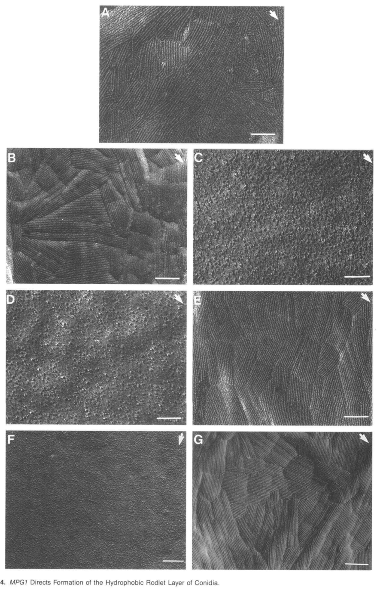

## Question

# Gene Research for Functional Annotation

## ⚠️ CRITICAL: Gene/Protein Identification Context

**BEFORE YOU BEGIN RESEARCH:** You MUST verify you are researching the CORRECT gene/protein. Gene symbols can be ambiguous, especially for less well-characterized genes from non-model organisms.

### Target Gene/Protein Identity (from UniProt):
- **UniProt Accession:** P52751
- **Protein Description:** RecName: Full=Class I hydrophobin MPG1 {ECO:0000303|PubMed:8312740}; Flags: Precursor;
- **Gene Information:** Name=MPG1 {ECO:0000303|PubMed:8312740}; ORFNames=MGCH7_ch7g1089, MGG_10315;
- **Organism (full):** Pyricularia oryzae (strain 70-15 / ATCC MYA-4617 / FGSC 8958) (Rice blast fungus) (Magnaporthe oryzae).
- **Protein Family:** Belongs to the fungal hydrophobin family. .
- **Key Domains:** Class_I_Hydrophobin. (IPR001338); Class_I_Hydrophobin_CS. (IPR019778); Hydrophobin (PF01185)

### MANDATORY VERIFICATION STEPS:

1. **Check if the gene symbol "MPG1" matches the protein description above**
2. **Verify the organism is correct:** Pyricularia oryzae (strain 70-15 / ATCC MYA-4617 / FGSC 8958) (Rice blast fungus) (Magnaporthe oryzae).
3. **Check if protein family/domains align with what you find in literature**
4. **If you find literature for a DIFFERENT gene with the same or similar symbol, STOP**

### If Gene Symbol is Ambiguous or You Cannot Find Relevant Literature:

**DO NOT PROCEED WITH RESEARCH ON A DIFFERENT GENE.** Instead:
- State clearly: "The gene symbol 'MPG1' is ambiguous or literature is limited for this specific protein"
- Explain what you found (e.g., "Found extensive literature on a different gene with the same symbol in a different organism")
- Describe the protein based ONLY on the UniProt information provided above
- Suggest that the protein function can be inferred from domain/family information

### Research Target:

Please provide a comprehensive research report on the gene **MPG1** (gene ID: MPG1, UniProt: P52751) in PYRO7.

The research report should be a detailed narrative explaining the function, biological processes, and localization of the gene product. Citations should be given for all claims.

You should prioritize authoritative reviews and primary scientific literature when conducting research. You can supplement
this with annotations you find in gene/protein databases, but these can be outdated or inaccurate.

We are specifically interested in the primary function of the gene - for enzymes, what reaction is catalyzed, and what is the substrate specificity? For transporters, what is the substrate? For structural proteins or adapters, what is the broader structural role? For signaling molecules, what is the role in the pathway.

We are interested in where in or outside the cell the gene product carries out its function.

We are also interested in the signaling or biochemical pathways in which the gene functions. We are less interested in broad pleiotropic effects, except where these elucidate the precise role.

Include evidence where possible. We are interested in both experimental evidence as well as inference from structure, evolution, or bioinformatic analysis. Precise studies should be prioritized over high-throughput, where available.

## Output

Question: You are an expert researcher providing comprehensive, well-cited information.

Provide detailed information focusing on:
1. Key concepts and definitions with current understanding
2. Recent developments and latest research (prioritize 2023-2024 sources)
3. Current applications and real-world implementations
4. Expert opinions and analysis from authoritative sources
5. Relevant statistics and data from recent studies

Format as a comprehensive research report with proper citations. Include URLs and publication dates where available.
Always prioritize recent, authoritative sources and provide specific citations for all major claims.

# Gene Research for Functional Annotation

## ⚠️ CRITICAL: Gene/Protein Identification Context

**BEFORE YOU BEGIN RESEARCH:** You MUST verify you are researching the CORRECT gene/protein. Gene symbols can be ambiguous, especially for less well-characterized genes from non-model organisms.

### Target Gene/Protein Identity (from UniProt):
- **UniProt Accession:** P52751
- **Protein Description:** RecName: Full=Class I hydrophobin MPG1 {ECO:0000303|PubMed:8312740}; Flags: Precursor;
- **Gene Information:** Name=MPG1 {ECO:0000303|PubMed:8312740}; ORFNames=MGCH7_ch7g1089, MGG_10315;
- **Organism (full):** Pyricularia oryzae (strain 70-15 / ATCC MYA-4617 / FGSC 8958) (Rice blast fungus) (Magnaporthe oryzae).
- **Protein Family:** Belongs to the fungal hydrophobin family. .
- **Key Domains:** Class_I_Hydrophobin. (IPR001338); Class_I_Hydrophobin_CS. (IPR019778); Hydrophobin (PF01185)

### MANDATORY VERIFICATION STEPS:

1. **Check if the gene symbol "MPG1" matches the protein description above**
2. **Verify the organism is correct:** Pyricularia oryzae (strain 70-15 / ATCC MYA-4617 / FGSC 8958) (Rice blast fungus) (Magnaporthe oryzae).
3. **Check if protein family/domains align with what you find in literature**
4. **If you find literature for a DIFFERENT gene with the same or similar symbol, STOP**

### If Gene Symbol is Ambiguous or You Cannot Find Relevant Literature:

**DO NOT PROCEED WITH RESEARCH ON A DIFFERENT GENE.** Instead:
- State clearly: "The gene symbol 'MPG1' is ambiguous or literature is limited for this specific protein"
- Explain what you found (e.g., "Found extensive literature on a different gene with the same symbol in a different organism")
- Describe the protein based ONLY on the UniProt information provided above
- Suggest that the protein function can be inferred from domain/family information

### Research Target:

Please provide a comprehensive research report on the gene **MPG1** (gene ID: MPG1, UniProt: P52751) in PYRO7.

The research report should be a detailed narrative explaining the function, biological processes, and localization of the gene product. Citations should be given for all claims.

You should prioritize authoritative reviews and primary scientific literature when conducting research. You can supplement
this with annotations you find in gene/protein databases, but these can be outdated or inaccurate.

We are specifically interested in the primary function of the gene - for enzymes, what reaction is catalyzed, and what is the substrate specificity? For transporters, what is the substrate? For structural proteins or adapters, what is the broader structural role? For signaling molecules, what is the role in the pathway.

We are interested in where in or outside the cell the gene product carries out its function.

We are also interested in the signaling or biochemical pathways in which the gene functions. We are less interested in broad pleiotropic effects, except where these elucidate the precise role.

Include evidence where possible. We are interested in both experimental evidence as well as inference from structure, evolution, or bioinformatic analysis. Precise studies should be prioritized over high-throughput, where available.

# Functional annotation report: MPG1 (UniProt P52751)

## Identity and conclusion

**MPG1 is the rice-blast-fungus class I hydrophobin specified in the question**, not an identically named enzyme from another organism. The target metadata identify it as MPG1/MGG_10315 from *Pyricularia oryzae* strain 70-15 (also called *Magnaporthe oryzae*), with class I hydrophobin domains IPR001338, IPR019778 and PF01185. Historical primary studies call the rice-blast fungus *Magnaporthe grisea* and independently identify its MPG1 product as a secreted class I hydrophobin. Their experiments principally used the **Guy-11** background; the resulting functional annotation is applicable to the identified rice-blast MPG1 but should not be mistaken for direct knockout evidence in 70-15. MHP1 is a distinct hydrophobin, not an alternative name for MPG1. (talbot1996mpg1encodesa pages 1-2, talbot1993identificationandcharacterization pages 8-10, pham2016selfassemblyofmpg1 pages 1-2)

**Primary molecular function:** MPG1 is a small, secreted **surface-active structural protein**. At interfaces it self-assembles into an amphipathic, detergent-resistant, amyloid-like rodlet coating. This coating contributes to fungal-surface hydrophobicity and to persistent attachment of germ tubes and developing appressoria to hydrophobic surfaces. MPG1 is **not an enzyme or transporter**: no reaction, catalytic substrate specificity or transported substrate is established for it. Cutinase 2 (Cut2), discussed below, is a separate enzyme whose activity MPG1 coatings can retain in cell-free experiments. (talbot1996mpg1encodesa pages 1-2, talbot1996mpg1encodesa pages 5-7, pham2016selfassemblyofmpg1 pages 1-2, pham2016selfassemblyofmpg1 pages 6-7)

## Location and biochemical mechanism

The 1993 gene sequence predicts a **112-amino-acid precursor** with an N-terminal secretion signal and eight cysteines arranged like those of fungal hydrophobins. Subsequent experiments detected an MPG1-dependent approximately **15-kDa** protein in culture filtrates and conidial extracts. Its ethanol/SDS insolubility, extraction with trifluoroacetic acid and capacity to form high-molecular-mass complexes establish class I hydrophobin-like behavior. Its apparent gel mass exceeds the sequence-based estimate; glycosylation and anomalous electrophoretic behavior were proposed, not established as a specific modification. These observations place its functional site **outside the plasma membrane**, on exposed fungal surfaces and at fungal–air, fungal–water or fungal–hydrophobic-substrate interfaces, rather than in a cytosolic pathway. (talbot1993identificationandcharacterization pages 8-10, talbot1996mpg1encodesa pages 7-10, talbot1996mpg1encodesa pages 10-11)

Freeze-fracture electron microscopy gives particularly strong localization evidence: the conidial surface has an interwoven rodlet layer in wild type, lacks it after *MPG1* disruption and regains it after genetic complementation. The native conidial rodlets were described as approximately **5 nm in diameter**. Thus MPG1 is necessary for normal conidial rodlet-layer architecture, although these images do not establish that every component of the layer is MPG1. The images provide direct visual evidence for this loss-and-rescue result. (talbot1996mpg1encodesa pages 1-2, talbot1996mpg1encodesa media 64dde1ed)

Purified MPG1 further explains how that layer can form. In the 2016 primary biophysical study, MPG1 assembled into Thioflavin-T-positive, amyloid-like rodlets at a **hydrophobic–hydrophilic interface**, rather than by ordinary bulk-solution fibrillization. Atomic-force microscopy measured films approximately **2.5 ± 0.2 nm high**; electron microscopy of the experimental assemblies observed rodlets about **200 nm long and 20 nm wide**. These measurements describe different *in-vitro* preparations and should not be conflated with the approximately 5-nm diameter measured for native conidial rodlets. MPG1 films also changed substrate wettability: a dried coating lowered the water contact angle from approximately **100° to 62°** in the reported assay. Interface availability and surface tension strongly affected assembly; MHP1 delayed MPG1 assembly, without demonstrated specific direct MPG1–MHP1 binding. (pham2016selfassemblyofmpg1 pages 4-6, pham2016selfassemblyofmpg1 pages 7-9)

## Biological processes and infection signaling

MPG1 is produced at biologically relevant stages: its transcript was approximately **60-fold more abundant during growth in infected rice than in the comparison culture condition**, and was observed early during appressorium development, during later symptom formation, in conidiating cultures and following carbon or nitrogen starvation. Expression during multiple stages does not by itself establish a separate biochemical function at each stage. (talbot1993identificationandcharacterization pages 1-2, talbot1993identificationandcharacterization pages 8-10)

The direct infection phenotype is substantial. In the original segregation experiments, *mpg1* progeny formed appressoria at **20.25% ± 8.12%**, versus **78.55% ± 11.64%** for wild-type progeny. They produced **3.4 rather than 12.04 lesions per 5-cm susceptible-rice leaf tip**. The mutants also showed reduced conidiation and abnormal surface wettability; reintroducing *MPG1* restored major phenotypes. Conidial germination remained close to 100% in the subsequent adhesion experiments, indicating that the appressorium defect is not simply failure to germinate. These are genotype-specific experimental results, not universal estimates across cultivars or fungal strains. (talbot1996mpg1encodesa pages 1-2, talbot1996mpg1encodesa pages 10-11, talbot1996mpg1encodesa pages 5-7)

**Adhesion is separable from developmental induction.** After sequential ethanol and hot-SDS treatment of germlings on Teflon, approximately **73%** of mutant conidium–germ-tube combinations detached, versus **33%** of wild type. Adding **10 mM cAMP** restored mutant appressorium formation to a mean **86.6%**, but the resulting appressoria still detached more readily than wild type. MPG1 therefore supplies an extracellular, SDS-resistant contribution to attachment even when the downstream developmental response can be bypassed. An extracellular surface-perception role upstream of a cAMP-responsive step is plausible, but these data **do not show direct MPG1 binding to a receptor, activation of adenylate cyclase, phosphorylation of Pmk1, or membership of MPG1 in an intracellular kinase cascade**. Contemporary pathway reviews place cAMP–PKA and Pmk1–MAPK in appressorium regulation; they do not convert the proposed MPG1-to-kinase connection into a demonstrated molecular interaction. (talbot1996mpg1encodesa pages 5-7, talbot1996mpg1encodesa pages 7-10, wang2024keytranscriptionfactors pages 9-12, tan2023thedevastatingrice pages 9-11)

A related **biochemical scaffold hypothesis** has more specific, but still cell-free, support. When hydrophobic graphite was coated with MPG1 rodlets, incubated with fungal Cut2 and washed extensively, the coating retained more **active Cut2** than comparator coatings or bare substrate; reported activity ranked **MPG1 > MHP1 > lysozyme > BSA**. MPG1 may therefore help concentrate or preserve cutinase activity at a plant-contact interface. Because other proteins also enhanced Cut2 activity and the experiment used artificial surfaces, **specific recruitment of Cut2 by MPG1 on an infected rice leaf and a resulting MPG1-dependent cuticle-hydrolysis reaction remain unproven**. The catalytic esterase belongs to Cut2, not MPG1. (pham2016selfassemblyofmpg1 pages 1-2, pham2016selfassemblyofmpg1 pages 6-7, pham2016selfassemblyofmpg1 pages 14-15)

The following evidence summary separates the measurements that establish the annotation from proposed extensions of the mechanism.

| Experimental question | Observation/control | Inference | Boundary |
|---|---|---|---|
| Is *MPG1* induced during rice infection? | *MPG1* transcript was approximately **60-fold more abundant during fungal growth in rice than in culture**; expression was strongest early during appressorium formation and was also detected during symptom development, conidiation, and carbon or nitrogen starvation. (talbot1993identificationandcharacterization pages 1-2, talbot1993identificationandcharacterization pages 8-10) | *MPG1* is transcriptionally coupled to infection-related development, sporulation, and nutrient limitation. | Expression correlation alone does not identify the protein’s molecular action or prove that a plant-specific signal induces it. |
| Is *MPG1* required for appressorium formation? | Wild-type progeny formed appressoria at **78.55% ± 11.64%**, versus **20.25% ± 8.12%** for *mpg1* mutants; reintroduction of *MPG1* restored the phenotype. (talbot1996mpg1encodesa pages 1-2) | Genetic loss and complementation establish that *MPG1* promotes efficient appressorium development. | Germination remained close to 100%, so the phenotype is developmental rather than a general failure to germinate; the measurements used the historical Guy-11 background, not strain 70-15. |
| Does *MPG1* contribute to rice pathogenicity? | On susceptible rice, wild-type progeny produced **12.04 lesions per 5-cm leaf tip**, compared with **3.4** for *mpg1* progeny (*P* < 0.001); complementation restored pathogenicity. (talbot1996mpg1encodesa pages 1-2) | *MPG1* is required for full lesion-forming capacity, consistent with its prepenetration role. | Residual lesions show that deletion attenuates rather than invariably abolishes infection; lesion reduction does not identify a catalytic reaction. |
| Does MPG1 support adhesion independently of appressorium frequency? | After 60% ethanol followed by boiling in 2% SDS, **73%** of mutant conidium–germ-tube combinations detached, versus **33%** for wild type; the difference cosegregated with *MPG1* and was corrected by complementation. (talbot1996mpg1encodesa pages 5-7) | An MPG1-dependent, SDS-resistant extracellular component strengthens attachment to a hydrophobic surface. | Water-flow assays did not distinguish the strains, indicating redundant attachment mechanisms; the result is from artificial Teflon and extraction conditions. |
| Is the developmental defect linked to cAMP signaling, and is adhesion separable from morphogenesis? | Addition of **10 mM cAMP** restored mutant appressorium formation to a mean of **86.6%**, but mutant appressoria remained more readily removed by SDS than wild type. (talbot1996mpg1encodesa pages 7-10) | cAMP can bypass the morphogenetic defect, whereas MPG1-dependent adhesion cannot; MPG1 likely acts at or upstream of cAMP-responsive development while also serving an extracellular structural function. | This epistasis does **not** demonstrate that MPG1 directly activates adenylate cyclase, cAMP–PKA, or Pmk1 MAPK. (wang2024keytranscriptionfactors pages 9-12) |
| Does MPG1 construct the conidial rodlet coat? | Freeze-fracture electron microscopy showed a conidial rodlet layer in wild type, its absence in an *mpg1* knockout, and restoration in an *MPG1*-complemented strain; the interwoven rodlets were approximately **5 nm** in diameter. (talbot1996mpg1encodesa pages 1-2, talbot1996mpg1encodesa media 64dde1ed) | Loss-and-rescue ultrastructure establishes MPG1 as a determinant of the hydrophobic conidial rodlet layer. | The experiment demonstrates dependence of rodlet-layer formation on *MPG1* but does not prove that every rodlet consists exclusively of MPG1. |
| Does purified MPG1 alter wettability and form amyloid-like interfacial rodlets? | A dried MPG1 coating reduced the water contact angle on a hydrophobic substrate from approximately **100° to 62°**. AFM detected lateral rodlets **2.5 ± 0.2 nm high**; assembly was Thioflavin-T positive and required a hydrophobic–hydrophilic interface. (pham2016selfassemblyofmpg1 pages 4-6) | MPG1 is a surface-active class I hydrophobin that self-assembles into amphipathic, amyloid-like rodlet films rather than functioning as an enzyme. | These are purified-protein, cell-free assays; they do not directly establish identical dimensions or assembly kinetics on living rice leaves. |
| Can an MPG1 coating organize cutinase activity at a surface? | On hydrophobic graphite, MPG1 rodlet coatings retained catalytically active Cut2 after extensive washing more effectively than MHP1, lysozyme, BSA, or bare graphite; activity ranked **MPG1 > MHP1 > lysozyme > BSA**. (pham2016selfassemblyofmpg1 pages 1-2, pham2016selfassemblyofmpg1 pages 6-7, pham2016selfassemblyofmpg1 pages 14-15) | MPG1 may act as an extracellular scaffold that localizes or preserves Cut2 activity at the fungus–plant interface. | The assay was cell-free, and Cut2 stimulation was not sequence-specific; direct MPG1-dependent concentration of Cut2 on infected leaves remains unproven. |
| Is there recent evidence for transcriptional regulation and phenotypic sufficiency? | In a January 2024 **non-peer-reviewed preprint**, deletion of *MoMYB13* strongly reduced *MPG1* expression; *MPG1* overexpression restored colony non-wettability but did not restore conidiation or rice pathogenicity. (li2024characterizationofa pages 8-10) | MPG1 is sufficient to recover hydrophobic surface character in that regulatory mutant but insufficient to replace the broader program controlled by MoMyb13. | The result is preliminary because the cited version is an unreviewed preprint; it does not alter the established annotation of MPG1 as an extracellular structural class I hydrophobin. |

*Table: Gene-specific evidence for the rice-blast MPG1 class I hydrophobin, separating direct genetic and biochemical observations from mechanistic inference. The table also identifies strain, assay, and publication-status limitations.*

## 2023–2024 perspective and practical relevance

A **2023 review of genes tested by mutant analysis** includes MPG1 among secreted proteins that contribute to fungal development and pathogenicity, consistent with the primary knockout studies. A **2024 review of rice-blast transcriptional and signaling control** emphasizes that hydrophobic-surface cues feed into cAMP–PKA- and Pmk1-dependent appressorium development. These are useful contemporary syntheses, but the highest-resolution *MPG1-specific molecular evidence retrieved* remains the earlier genetic and 2016 purified-protein experiments. (tan2023thedevastatingrice pages 7-9, wang2024keytranscriptionfactors pages 9-12)

An additional **January 2024 preprint, explicitly marked not peer-reviewed in the retrieved version**, reports that loss of the transcription factor MoMyb13 markedly lowers *MPG1* expression. Forced *MPG1* expression recovered the mutant’s non-wettable colony surface, **but did not restore pathogenicity or conidiation**. This supports a fairly specific role for MPG1 in surface hydrophobicity while showing that it cannot replace all other MoMyb13-regulated infection functions; it is not proof of direct binding of MoMyb13 to the *MPG1* promoter. A journal version was not verified from the retrieved full text, so these observations are identified here as preliminary rather than represented as peer-reviewed findings. (li2024characterizationofa pages 8-10)

For **real-world application**, MPG1 is an experimentally useful marker and perturbation point for studying rice-blast spore coatings, adhesion and prepenetration infection. Its interfacial self-assembly and capacity to retain Cut2 suggest research opportunities in disrupting fungal surface attachment or designing protein-coated interfaces. Neither the cited MPG1 experiments nor the contemporary reviews establish an MPG1-directed fungicide, field-deployed diagnostic or validated crop-protection intervention; those applications remain prospective. (talbot1996mpg1encodesa pages 1-2, pham2016selfassemblyofmpg1 pages 1-2, tan2023thedevastatingrice pages 7-9)

**Recommended functional annotation:** *Secreted class I hydrophobin; self-assembling extracellular conidial rodlet-coat and hydrophobic-interface protein; promotes surface hydrophobicity and SDS-resistant adhesion of infection structures, thereby supporting appressorium formation and full rice-blast virulence.* Annotate its participation in surface-responsive appressorium development as supported by genetics, but label specific receptor/kinase coupling and *in-planta* Cut2 scaffolding as **hypotheses**. (talbot1996mpg1encodesa pages 1-2, talbot1996mpg1encodesa pages 5-7, pham2016selfassemblyofmpg1 pages 1-2, wang2024keytranscriptionfactors pages 9-12)

### Selected sources and dates

- Talbot, Ebbole & Hamer, **November 1993**, *The Plant Cell*, “Identification and characterization of MPG1…”: [https://doi.org/10.1105/tpc.5.11.1575](https://doi.org/10.1105/tpc.5.11.1575). Original gene identification, expression and knockout. (talbot1993identificationandcharacterization pages 1-2)
- Talbot *et al.*, **June 1996**, *The Plant Cell*, “MPG1 Encodes a Fungal Hydrophobin…”: [https://doi.org/10.1105/tpc.8.6.985](https://doi.org/10.1105/tpc.8.6.985). Protein isolation, conidial ultrastructure, complementation and adhesion. (talbot1996mpg1encodesa pages 1-2, talbot1996mpg1encodesa pages 5-7)
- Pham *et al.*, **May 2016**, *Scientific Reports*, “Self-assembly of MPG1…”: [https://doi.org/10.1038/srep25288](https://doi.org/10.1038/srep25288). Interface-specific assembly and cell-free Cut2 assays. (pham2016selfassemblyofmpg1 pages 1-2, pham2016selfassemblyofmpg1 pages 6-7)
- Tanaka & Kahmann, **February 2021**, *Mycologia*, “Cell wall–associated effectors of plant-colonizing fungi”: [https://doi.org/10.1080/00275514.2020.1831293](https://doi.org/10.1080/00275514.2020.1831293). Expert hydrophobin and MPG1 context. (tanaka2021cellwall–associatedeffectors pages 7-8)
- Tan *et al.*, **February 2023**, *Pathogens*, “The Devastating Rice Blast Airborne Pathogen…”: [https://doi.org/10.3390/pathogens12030379](https://doi.org/10.3390/pathogens12030379). Mutant-analysis synthesis. (tan2023thedevastatingrice pages 7-9)
- Wang *et al.*, **February 2024**, *Phytopathology Research*, “Key transcription factors required for outburst of rice blast disease…”: [https://doi.org/10.1186/s42483-024-00225-0](https://doi.org/10.1186/s42483-024-00225-0). Appressorium signaling context, not a direct MPG1 mechanism study. (wang2024keytranscriptionfactors pages 1-2, wang2024keytranscriptionfactors pages 9-12)
- Li *et al.*, **posted 3 January 2024**, **non-peer-reviewed preprint**, “Characterization of a Myb Transcription Factor MoMyb13…”: [https://doi.org/10.20944/preprints202401.0181.v1](https://doi.org/10.20944/preprints202401.0181.v1). Preliminary *MPG1* expression-and-rescue results. (li2024characterizationofa pages 8-10)

References

1. (talbot1996mpg1encodesa pages 1-2): N. Talbot, M. J. Kershaw, G. Wakley, O. M. H. Vries, Joseph G. H. Wessels, and J. E. Hamer. Mpg1 encodes a fungal hydrophobin involved in surface interactions during infection-related development of magnaporthe grisea. The Plant cell, 8:985-999, Jun 1996. URL: https://doi.org/10.1105/tpc.8.6.985, doi:10.1105/tpc.8.6.985. This article has 515 citations.

2. (talbot1993identificationandcharacterization pages 8-10): Nicholas J. Talbot, Daniel J. Ebbole, and John E. Hamer. Identification and characterization of mpg1, a gene involved in pathogenicity from the rice blast fungus magnaporthe grisea. The Plant cell, 5:1575-1590, Nov 1993. URL: https://doi.org/10.1105/tpc.5.11.1575, doi:10.1105/tpc.5.11.1575. This article has 1178 citations.

3. (pham2016selfassemblyofmpg1 pages 1-2): Chi L. L. Pham, Anthony Rey, Victor Lo, Margaux Soulès, Qin Ren, Georg Meisl, Tuomas P. J. Knowles, Ann H. Kwan, and Margaret Sunde. Self-assembly of mpg1, a hydrophobin protein from the rice blast fungus that forms functional amyloid coatings, occurs by a surface-driven mechanism. Scientific Reports, May 2016. URL: https://doi.org/10.1038/srep25288, doi:10.1038/srep25288. This article has 106 citations and is from a peer-reviewed journal.

4. (talbot1996mpg1encodesa pages 5-7): N. Talbot, M. J. Kershaw, G. Wakley, O. M. H. Vries, Joseph G. H. Wessels, and J. E. Hamer. Mpg1 encodes a fungal hydrophobin involved in surface interactions during infection-related development of magnaporthe grisea. The Plant cell, 8:985-999, Jun 1996. URL: https://doi.org/10.1105/tpc.8.6.985, doi:10.1105/tpc.8.6.985. This article has 515 citations.

5. (pham2016selfassemblyofmpg1 pages 6-7): Chi L. L. Pham, Anthony Rey, Victor Lo, Margaux Soulès, Qin Ren, Georg Meisl, Tuomas P. J. Knowles, Ann H. Kwan, and Margaret Sunde. Self-assembly of mpg1, a hydrophobin protein from the rice blast fungus that forms functional amyloid coatings, occurs by a surface-driven mechanism. Scientific Reports, May 2016. URL: https://doi.org/10.1038/srep25288, doi:10.1038/srep25288. This article has 106 citations and is from a peer-reviewed journal.

6. (talbot1996mpg1encodesa pages 7-10): N. Talbot, M. J. Kershaw, G. Wakley, O. M. H. Vries, Joseph G. H. Wessels, and J. E. Hamer. Mpg1 encodes a fungal hydrophobin involved in surface interactions during infection-related development of magnaporthe grisea. The Plant cell, 8:985-999, Jun 1996. URL: https://doi.org/10.1105/tpc.8.6.985, doi:10.1105/tpc.8.6.985. This article has 515 citations.

7. (talbot1996mpg1encodesa pages 10-11): N. Talbot, M. J. Kershaw, G. Wakley, O. M. H. Vries, Joseph G. H. Wessels, and J. E. Hamer. Mpg1 encodes a fungal hydrophobin involved in surface interactions during infection-related development of magnaporthe grisea. The Plant cell, 8:985-999, Jun 1996. URL: https://doi.org/10.1105/tpc.8.6.985, doi:10.1105/tpc.8.6.985. This article has 515 citations.

8. (talbot1996mpg1encodesa media 64dde1ed): N. Talbot, M. J. Kershaw, G. Wakley, O. M. H. Vries, Joseph G. H. Wessels, and J. E. Hamer. Mpg1 encodes a fungal hydrophobin involved in surface interactions during infection-related development of magnaporthe grisea. The Plant cell, 8:985-999, Jun 1996. URL: https://doi.org/10.1105/tpc.8.6.985, doi:10.1105/tpc.8.6.985. This article has 515 citations.

9. (pham2016selfassemblyofmpg1 pages 4-6): Chi L. L. Pham, Anthony Rey, Victor Lo, Margaux Soulès, Qin Ren, Georg Meisl, Tuomas P. J. Knowles, Ann H. Kwan, and Margaret Sunde. Self-assembly of mpg1, a hydrophobin protein from the rice blast fungus that forms functional amyloid coatings, occurs by a surface-driven mechanism. Scientific Reports, May 2016. URL: https://doi.org/10.1038/srep25288, doi:10.1038/srep25288. This article has 106 citations and is from a peer-reviewed journal.

10. (pham2016selfassemblyofmpg1 pages 7-9): Chi L. L. Pham, Anthony Rey, Victor Lo, Margaux Soulès, Qin Ren, Georg Meisl, Tuomas P. J. Knowles, Ann H. Kwan, and Margaret Sunde. Self-assembly of mpg1, a hydrophobin protein from the rice blast fungus that forms functional amyloid coatings, occurs by a surface-driven mechanism. Scientific Reports, May 2016. URL: https://doi.org/10.1038/srep25288, doi:10.1038/srep25288. This article has 106 citations and is from a peer-reviewed journal.

11. (talbot1993identificationandcharacterization pages 1-2): Nicholas J. Talbot, Daniel J. Ebbole, and John E. Hamer. Identification and characterization of mpg1, a gene involved in pathogenicity from the rice blast fungus magnaporthe grisea. The Plant cell, 5:1575-1590, Nov 1993. URL: https://doi.org/10.1105/tpc.5.11.1575, doi:10.1105/tpc.5.11.1575. This article has 1178 citations.

12. (wang2024keytranscriptionfactors pages 9-12): Qing Wang, Zhicheng Huang, Irshad Ali Khan, Yan Li, Jing Wang, Jiaoyu Wang, Xiao-Hong Liu, Fucheng Lin, and Jianping Lu. Key transcription factors required for outburst of rice blast disease in magnaporthe oryzae. Phytopathology Research, Feb 2024. URL: https://doi.org/10.1186/s42483-024-00225-0, doi:10.1186/s42483-024-00225-0. This article has 27 citations and is from a peer-reviewed journal.

13. (tan2023thedevastatingrice pages 9-11): Jinyi Tan, Haikun Zhao, Josh Li, Yi-Qing Gong, and Xin Li. The devastating rice blast airborne pathogen magnaporthe oryzae—a review on genes studied with mutant analysis. Pathogens, 12:379, Feb 2023. URL: https://doi.org/10.3390/pathogens12030379, doi:10.3390/pathogens12030379. This article has 57 citations.

14. (pham2016selfassemblyofmpg1 pages 14-15): Chi L. L. Pham, Anthony Rey, Victor Lo, Margaux Soulès, Qin Ren, Georg Meisl, Tuomas P. J. Knowles, Ann H. Kwan, and Margaret Sunde. Self-assembly of mpg1, a hydrophobin protein from the rice blast fungus that forms functional amyloid coatings, occurs by a surface-driven mechanism. Scientific Reports, May 2016. URL: https://doi.org/10.1038/srep25288, doi:10.1038/srep25288. This article has 106 citations and is from a peer-reviewed journal.

15. (li2024characterizationofa pages 8-10): Ya Li, Xiuxia Zheng, Mengtian Pei, Mengting Chen, Shengnan Zhang, Chenyu Liang, Luyao Gao, Pin Huang, and Stefan Olsson. Characterization of a myb transcription factor momyb13 reveals its role in growth, conidiation, hydrophobicity and pathogenicity of magnaporthe oryzae. Unknown journal, Jan 2024. URL: https://doi.org/10.20944/preprints202401.0181.v1, doi:10.20944/preprints202401.0181.v1.

16. (tan2023thedevastatingrice pages 7-9): Jinyi Tan, Haikun Zhao, Josh Li, Yi-Qing Gong, and Xin Li. The devastating rice blast airborne pathogen magnaporthe oryzae—a review on genes studied with mutant analysis. Pathogens, 12:379, Feb 2023. URL: https://doi.org/10.3390/pathogens12030379, doi:10.3390/pathogens12030379. This article has 57 citations.

17. (tanaka2021cellwall–associatedeffectors pages 7-8): Shigeyuki Tanaka and Regine Kahmann. Cell wall–associated effectors of plant-colonizing fungi. Mycologia, 113:247-260, Feb 2021. URL: https://doi.org/10.1080/00275514.2020.1831293, doi:10.1080/00275514.2020.1831293. This article has 72 citations and is from a domain leading peer-reviewed journal.

18. (wang2024keytranscriptionfactors pages 1-2): Qing Wang, Zhicheng Huang, Irshad Ali Khan, Yan Li, Jing Wang, Jiaoyu Wang, Xiao-Hong Liu, Fucheng Lin, and Jianping Lu. Key transcription factors required for outburst of rice blast disease in magnaporthe oryzae. Phytopathology Research, Feb 2024. URL: https://doi.org/10.1186/s42483-024-00225-0, doi:10.1186/s42483-024-00225-0. This article has 27 citations and is from a peer-reviewed journal.

## Artifacts

- [Edison artifact artifact-00](MPG1-deep-research-falcon_artifacts/artifact-00.md)

## Citations

1. wang2024keytranscriptionfactors pages 9-12
2. li2024characterizationofa pages 8-10
3. talbot1993identificationandcharacterization pages 1-2
4. tan2023thedevastatingrice pages 7-9
5. talbot1993identificationandcharacterization pages 8-10
6. tan2023thedevastatingrice pages 9-11
7. wang2024keytranscriptionfactors pages 1-2
8. https://doi.org/10.1105/tpc.5.11.1575
9. https://doi.org/10.1105/tpc.8.6.985
10. https://doi.org/10.1038/srep25288
11. https://doi.org/10.1080/00275514.2020.1831293
12. https://doi.org/10.3390/pathogens12030379
13. https://doi.org/10.1186/s42483-024-00225-0
14. https://doi.org/10.20944/preprints202401.0181.v1
15. https://doi.org/10.1105/tpc.5.11.1575](https://doi.org/10.1105/tpc.5.11.1575
16. https://doi.org/10.1105/tpc.8.6.985](https://doi.org/10.1105/tpc.8.6.985
17. https://doi.org/10.1038/srep25288](https://doi.org/10.1038/srep25288
18. https://doi.org/10.1080/00275514.2020.1831293](https://doi.org/10.1080/00275514.2020.1831293
19. https://doi.org/10.3390/pathogens12030379](https://doi.org/10.3390/pathogens12030379
20. https://doi.org/10.1186/s42483-024-00225-0](https://doi.org/10.1186/s42483-024-00225-0
21. https://doi.org/10.20944/preprints202401.0181.v1](https://doi.org/10.20944/preprints202401.0181.v1
22. https://doi.org/10.1105/tpc.8.6.985,
23. https://doi.org/10.1105/tpc.5.11.1575,
24. https://doi.org/10.1038/srep25288,
25. https://doi.org/10.1186/s42483-024-00225-0,
26. https://doi.org/10.3390/pathogens12030379,
27. https://doi.org/10.20944/preprints202401.0181.v1,
28. https://doi.org/10.1080/00275514.2020.1831293,