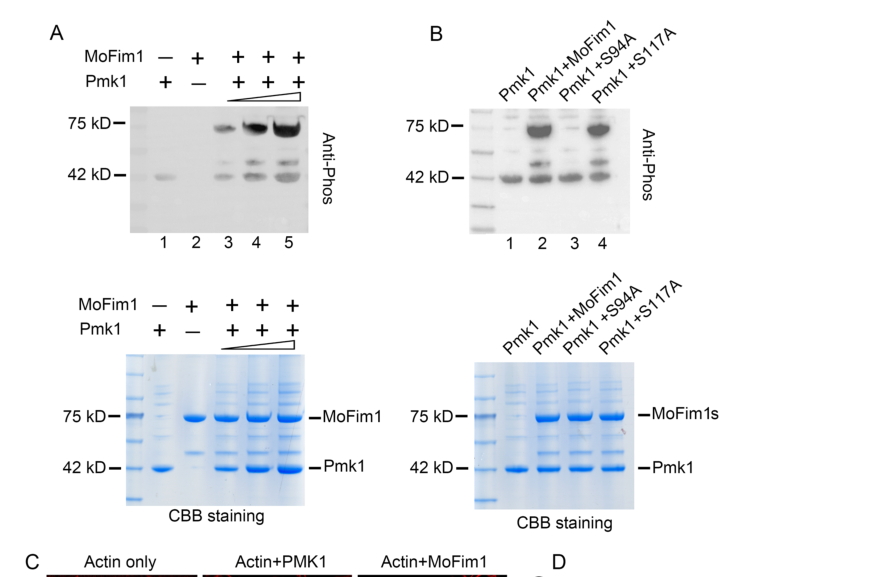

## Question

# Gene Research for Functional Annotation

## ⚠️ CRITICAL: Gene/Protein Identification Context

**BEFORE YOU BEGIN RESEARCH:** You MUST verify you are researching the CORRECT gene/protein. Gene symbols can be ambiguous, especially for less well-characterized genes from non-model organisms.

### Target Gene/Protein Identity (from UniProt):
- **UniProt Accession:** G4N0Z0
- **Protein Description:** RecName: Full=Mitogen-activated protein kinase PMK11 {ECO:0000303|PubMed:8946911}; Short=MAPK PMK1 {ECO:0000303|PubMed:8946911}; EC=2.7.11.24 {ECO:0000269|PubMed:8946911};
- **Gene Information:** Name=PMK1 {ECO:0000303|PubMed:8946911}; ORFNames=MGG_09565;
- **Organism (full):** Pyricularia oryzae (strain 70-15 / ATCC MYA-4617 / FGSC 8958) (Rice blast fungus) (Magnaporthe oryzae).
- **Protein Family:** Belongs to the protein kinase superfamily. CMGC Ser/Thr
- **Key Domains:** Kinase-like_dom_sf. (IPR011009); MAP_kinase_CS. (IPR003527); MAPK. (IPR050117); Prot_kinase_dom. (IPR000719); Protein_kinase_ATP_BS. (IPR017441)

### MANDATORY VERIFICATION STEPS:

1. **Check if the gene symbol "PMK1" matches the protein description above**
2. **Verify the organism is correct:** Pyricularia oryzae (strain 70-15 / ATCC MYA-4617 / FGSC 8958) (Rice blast fungus) (Magnaporthe oryzae).
3. **Check if protein family/domains align with what you find in literature**
4. **If you find literature for a DIFFERENT gene with the same or similar symbol, STOP**

### If Gene Symbol is Ambiguous or You Cannot Find Relevant Literature:

**DO NOT PROCEED WITH RESEARCH ON A DIFFERENT GENE.** Instead:
- State clearly: "The gene symbol 'PMK1' is ambiguous or literature is limited for this specific protein"
- Explain what you found (e.g., "Found extensive literature on a different gene with the same symbol in a different organism")
- Describe the protein based ONLY on the UniProt information provided above
- Suggest that the protein function can be inferred from domain/family information

### Research Target:

Please provide a comprehensive research report on the gene **PMK1** (gene ID: PMK1, UniProt: G4N0Z0) in PYRO7.

The research report should be a detailed narrative explaining the function, biological processes, and localization of the gene product. Citations should be given for all claims.

You should prioritize authoritative reviews and primary scientific literature when conducting research. You can supplement
this with annotations you find in gene/protein databases, but these can be outdated or inaccurate.

We are specifically interested in the primary function of the gene - for enzymes, what reaction is catalyzed, and what is the substrate specificity? For transporters, what is the substrate? For structural proteins or adapters, what is the broader structural role? For signaling molecules, what is the role in the pathway.

We are interested in where in or outside the cell the gene product carries out its function.

We are also interested in the signaling or biochemical pathways in which the gene functions. We are less interested in broad pleiotropic effects, except where these elucidate the precise role.

Include evidence where possible. We are interested in both experimental evidence as well as inference from structure, evolution, or bioinformatic analysis. Precise studies should be prioritized over high-throughput, where available.

## Output

Question: You are an expert researcher providing comprehensive, well-cited information.

Provide detailed information focusing on:
1. Key concepts and definitions with current understanding
2. Recent developments and latest research (prioritize 2023-2024 sources)
3. Current applications and real-world implementations
4. Expert opinions and analysis from authoritative sources
5. Relevant statistics and data from recent studies

Format as a comprehensive research report with proper citations. Include URLs and publication dates where available.
Always prioritize recent, authoritative sources and provide specific citations for all major claims.

# Gene Research for Functional Annotation

## ⚠️ CRITICAL: Gene/Protein Identification Context

**BEFORE YOU BEGIN RESEARCH:** You MUST verify you are researching the CORRECT gene/protein. Gene symbols can be ambiguous, especially for less well-characterized genes from non-model organisms.

### Target Gene/Protein Identity (from UniProt):
- **UniProt Accession:** G4N0Z0
- **Protein Description:** RecName: Full=Mitogen-activated protein kinase PMK11 {ECO:0000303|PubMed:8946911}; Short=MAPK PMK1 {ECO:0000303|PubMed:8946911}; EC=2.7.11.24 {ECO:0000269|PubMed:8946911};
- **Gene Information:** Name=PMK1 {ECO:0000303|PubMed:8946911}; ORFNames=MGG_09565;
- **Organism (full):** Pyricularia oryzae (strain 70-15 / ATCC MYA-4617 / FGSC 8958) (Rice blast fungus) (Magnaporthe oryzae).
- **Protein Family:** Belongs to the protein kinase superfamily. CMGC Ser/Thr
- **Key Domains:** Kinase-like_dom_sf. (IPR011009); MAP_kinase_CS. (IPR003527); MAPK. (IPR050117); Prot_kinase_dom. (IPR000719); Protein_kinase_ATP_BS. (IPR017441)

### MANDATORY VERIFICATION STEPS:

1. **Check if the gene symbol "PMK1" matches the protein description above**
2. **Verify the organism is correct:** Pyricularia oryzae (strain 70-15 / ATCC MYA-4617 / FGSC 8958) (Rice blast fungus) (Magnaporthe oryzae).
3. **Check if protein family/domains align with what you find in literature**
4. **If you find literature for a DIFFERENT gene with the same or similar symbol, STOP**

### If Gene Symbol is Ambiguous or You Cannot Find Relevant Literature:

**DO NOT PROCEED WITH RESEARCH ON A DIFFERENT GENE.** Instead:
- State clearly: "The gene symbol 'PMK1' is ambiguous or literature is limited for this specific protein"
- Explain what you found (e.g., "Found extensive literature on a different gene with the same symbol in a different organism")
- Describe the protein based ONLY on the UniProt information provided above
- Suggest that the protein function can be inferred from domain/family information

### Research Target:

Please provide a comprehensive research report on the gene **PMK1** (gene ID: PMK1, UniProt: G4N0Z0) in PYRO7.

The research report should be a detailed narrative explaining the function, biological processes, and localization of the gene product. Citations should be given for all claims.

You should prioritize authoritative reviews and primary scientific literature when conducting research. You can supplement
this with annotations you find in gene/protein databases, but these can be outdated or inaccurate.

We are specifically interested in the primary function of the gene - for enzymes, what reaction is catalyzed, and what is the substrate specificity? For transporters, what is the substrate? For structural proteins or adapters, what is the broader structural role? For signaling molecules, what is the role in the pathway.

We are interested in where in or outside the cell the gene product carries out its function.

We are also interested in the signaling or biochemical pathways in which the gene functions. We are less interested in broad pleiotropic effects, except where these elucidate the precise role.

Include evidence where possible. We are interested in both experimental evidence as well as inference from structure, evolution, or bioinformatic analysis. Precise studies should be prioritized over high-throughput, where available.

# Functional annotation of PMK1 in PYRO7

## Identity and scope

**PMK1 (UniProt G4N0Z0; ORF MGG_09565)** is identified in the supplied accession information as a mitogen-activated protein kinase (MAPK) of *Pyricularia oryzae* strain 70-15, the rice-blast fungus also called *Magnaporthe oryzae*. The original rice-blast PMK1 study used the historical name *M. grisea*: it described a 356-amino-acid, Fus3/Kss1-related kinase with conserved kinase subdomains and a TEY activation motif at residues 174–176. This experimentally characterized protein and subsequent *M. oryzae* Pmk1 studies match the supplied MAPK/CMGC kinase-domain annotation. **The retrieved papers do not independently cross-reference G4N0Z0 to MGG_09565 or sequence-confirm the 70-15 allele**; that exact accession-to-ORF assignment rests on the UniProt information supplied in the question. Findings about PMK1 homologues in other fungi are not used as evidence for this protein. (xu1996mapkinaseand pages 1-2, li2024fimbrinassociatedwith pages 2-4)

## Primary molecular function and substrate specificity

Pmk1 is an **intracellular protein serine/threonine kinase and the terminal MAPK of an infection-related signaling cascade**. Its catalytic reaction is transfer of a phosphate group from ATP to a hydroxyl group on a protein serine or threonine, producing ADP and a phosphoprotein. Recombinant GST–Pmk1 both autophosphorylated and phosphorylated myelin basic protein *in vitro*, establishing kinase activity; myelin basic protein is an experimental substrate, not an identified fungal physiological target. The TEY motif and Fus3/Kss1 relationship support MAPK classification, while native-substrate experiments specify what the enzyme does in this fungus. (xu1996mapkinaseand pages 1-2, xu1996mapkinaseand pages 8-9, li2024fimbrinassociatedwith pages 4-7)

The following substrates have substantially stronger biochemical support than pathway membership alone. (li2024fimbrinassociatedwith pages 4-7, osesruiz2021appressoriummediatedplantinfection pages 9-10, osesruiz2021appressoriummediatedplantinfection pages 7-8)

| Pmk1 substrate | Type | Site | Direct evidence | Functional interpretation |
|---|---|---:|---|---|
| Hox7 | Native transcription factor | Ser158 | Activated purified GST–Pmk1 phosphorylated recombinant Hox7; phosphoproteomics and targeted PRM confirmed Pmk1-dependent S158 phosphorylation during early appressorium development (osesruiz2021appressoriummediatedplantinfection pages 10-11, osesruiz2021appressoriummediatedplantinfection pages 9-10) | Controls early appressorium differentiation, autophagy/cell-cycle programs, and downstream transcription. Functional rescue involved a **triple phosphomimetic Hox7 S126D/S158D/S254D allele**, not an isolated S158D test (osesruiz2021appressoriummediatedplantinfection pages 9-10) |
| Mst12 | Native transcription factor | Ser133 | Activated Pmk1 directly phosphorylated recombinant Mst12 in vitro (osesruiz2021appressoriummediatedplantinfection pages 10-11) | Supports the later appressorium-maturation program, including septin/F-actin remodeling, repolarization, exocytosis, penetration, and effector-gene expression |
| MoFim1 | Native actin-bundling protein | Ser94 | Recombinant Pmk1 phosphorylated MoFim1 in vitro in a dose-dependent manner; S94A abolished this phosphorylation whereas S117A did not (li2024fimbrinassociatedwith pages 4-7) | S94 phosphorylation promotes actin bundling and hyphal-tip organization. MoFim1-S94D restored Δpmk1 actin organization and hyphal growth and yielded appressorium-like structures in about 15% of germ tubes, but did not restore plant penetration (li2024fimbrinassociatedwith pages 7-11) |
| Myelin basic protein | Artificial assay substrate | Not determined | Recombinant GST–Pmk1 autophosphorylated and phosphorylated myelin basic protein in vitro (xu1996mapkinaseand pages 1-2) | Establishes intrinsic Ser/Thr-protein-kinase activity but does **not** identify a physiological fungal substrate or native substrate specificity |

*Table: Experimentally tested substrates of rice-blast-fungus Pmk1, distinguishing native targets from the artificial kinase-assay substrate. The table summarizes phosphosites, biochemical evidence, and functional consequences.*

In particular, the 2024 MoFim1 study combined physical-interaction assays, purified-protein kinase reactions, phosphosite substitutions and genetic rescue. Recombinant Pmk1 phosphorylated MoFim1; the **S94A**, but not **S117A**, substitution removed phosphorylation in that assay. Phosphorylation enhanced MoFim1-dependent actin bundling, connecting Pmk1 catalysis to a defined cytoskeletal output. The published Figure 3 kinase-assay panels provide visual evidence for this site assignment. (li2024fimbrinassociatedwith pages 4-7, li2024fimbrinassociatedwith media 56a3c3da, li2024fimbrinassociatedwith pages 2-4)

For nuclear signaling, activated Pmk1 phosphorylated the homeobox transcription factor **Hox7 at S158** in a purified-protein assay; developmental phosphoproteomics and targeted measurements also support Pmk1-dependent S158 phosphorylation in cells. **Mst12 S133** was likewise identified as a direct Pmk1 phosphorylation site. These findings establish demonstrated protein substrates rather than merely changes in their downstream gene expression. The precise full set of physiological substrates and a comprehensive sequence-based specificity rule have not been established by these experiments. (osesruiz2021appressoriummediatedplantinfection pages 10-11, osesruiz2021appressoriummediatedplantinfection pages 9-10, osesruiz2021appressoriummediatedplantinfection pages 7-8)

## Pathway, biological process and location of action

Host-surface cues—including hydrophobicity and cutin-derived signals—feed into an infection-related MAPK pathway. Genetic and phosphorylation experiments implicate the surface-associated proteins **MoMsb2 and MoSho1**, upstream **Ras2**, the **Mst11 MAPKKK**, **Mst7 MAPKK**, and the adaptor **Mst50**, culminating in Pmk1 activation. Mst50 associates with upstream kinase components, and Mst7 docks with Pmk1 during appressorium formation. This is a signaling relay, not evidence that Pmk1 directly binds cutin or acts as a cell-surface receptor. cAMP–PKA signaling cooperates with this pathway, but the relationship should not be reduced to an invariant, single linear cAMP→Pmk1 reaction. (zhao2007mitogenactivatedproteinkinase pages 3-4, wang2024keytranscriptionfactors pages 9-12, zhang2021regulationofbiotic pages 2-4)

Pmk1 acts during **appressorium differentiation and maturation**, when a germ tube stops polarized growth and builds the specialized cell that penetrates the rice surface. PMK1 deletion prevents normal appressorium formation and abolishes pathogenic growth in the founding study, despite relatively preserved growth and reproduction in culture. Downstream, Pmk1 phosphorylation of Hox7 helps switch on the early developmental transcriptional program; a distinct Mst12-associated program contributes to later cytoskeletal organization, penetration and invasive development. A 2021 time-resolved analysis identified **6,333 genes whose expression depended on Pmk1** under its experimental conditions; this transcriptomic association is not a claim that Pmk1 directly phosphorylates or directly regulates every gene product. (xu1996mapkinaseand pages 1-2, xu1996mapkinaseand pages 6-7, osesruiz2021appressoriummediatedplantinfection pages 10-11, osesruiz2021appressoriummediatedplantinfection pages 1-2)

The location most firmly supported for Pmk1’s function is **inside fungal cells**, rather than in the plant cell or extracellular space. GFP-tagged Pmk1 was observed in fungal hyphae and germ tubes, with stronger signal in developing conidia and appressoria; nuclear enrichment was reported in appressoria and developing conidia. A 2024 interaction assay additionally detected a Pmk1–MoFim1 association around the **fungal hyphal tip**, consistent with a local cytoskeletal role. Nuclear Hox7/Mst12 signaling and hyphal-tip MoFim1 phosphorylation therefore represent distinct, experimentally supported intracellular outputs; a tagged-protein interaction at a tip does not establish that all Pmk1 is restricted to that location. (li2024fimbrinassociatedwith pages 2-4, zhao2007mitogenactivatedproteinkinase pages 3-4)

## Developments reported in 2023–2024

**2023 — pathway organization.** Deleting the scaffold-associated protein **MoScd2** lowered measured Pmk1 phosphorylation. MoScd2 interacted with Mst50 in yeast two-hybrid and pull-down experiments, supporting its role in organizing or promoting pathway activation. These results do **not** show that MoScd2 itself phosphorylates Pmk1. (sun2023moscd2isinvolved pages 5-7)

**2024 — cytoskeletal substrate.** The direct **Pmk1→MoFim1-S94** mechanism links signaling to fungal actin-bundle organization and hyphal-tip growth. Expressing phosphomimetic MoFim1-S94D in a *pmk1* deletion background improved actin organization and growth, and approximately **15%** of germ tubes formed appressorium-like structures. Crucially, this did **not** restore penetration of rice sheath cells: MoFim1 is one important output, not a complete substitute for Pmk1 signaling. (li2024fimbrinassociatedwith pages 7-11, li2024fimbrinassociatedwith pages 4-7)

**2024 — activation mechanism.** PARP1-mediated poly(ADP-ribosyl)ation of the fungal 14-3-3 protein **GRF1** was found to support its association with **Mst7 and Pmk1**. PARylation-defective GRF1 weakened those interactions and reduced appressorial Pmk1 activation; loss of GRF1 also weakened the Mst7–Pmk1 association. This identifies a regulated **scaffolding step** that helps assemble the kinase pathway, rather than assigning kinase catalytic activity to GRF1. (gao2024parylationof1433 pages 11-12, gao2024parylationof1433 pages 8-9)

**2024 — relevance of allelic variation.** In an avirulent *M. oryzae* isolate designated **AM16**, expressing a Pmk1 allele from virulent strain Guy11 improved functional appressorium formation and restored some pathogenicity, but not to the Guy11 level. The study also identified a defect in the cAMP-associated gene *MAC1*, so the phenotype cannot be assigned solely to PMK1. These are observations in AM16/Guy11 and must not be silently treated as measurements of the specified 70-15 allele. (deng2024molecularbasisfor pages 1-2, deng2024molecularbasisfor pages 7-10)

## Functional interpretation and evidence limits

The most defensible primary annotation is **infection-development MAP kinase that phosphorylates fungal transcriptional and cytoskeletal proteins to convert surface-sensing signals into appressorium formation and invasive growth**. Its nuclear and hyphal-tip outputs explain why loss of one substrate modification only partially compensates for loss of Pmk1. Pmk1 is consequently a biologically important pathway node for understanding rice blast and exploring disease-control strategies; the cited experiments establish mechanistic and genetic importance, **not a validated PMK1-directed field treatment**. Finally, phospho-MAPK immunoblots indicate changes in pathway activation, whereas the purified-kinase experiments on Hox7, Mst12 and MoFim1 provide the narrower evidence for direct substrate phosphorylation. (xu1996mapkinaseand pages 1-2, li2024fimbrinassociatedwith pages 7-11, osesruiz2021appressoriummediatedplantinfection pages 9-10, gao2024parylationof1433 pages 11-12, zhao2007mitogenactivatedproteinkinase pages 3-4)

References

1. (xu1996mapkinaseand pages 1-2): Jin-Rong Xu and J. Hamer. Map kinase and camp signaling regulate infection structure formation and pathogenic growth in the rice blast fungus magnaporthe grisea. Genes & development, 10 21:2696-706, Nov 1996. URL: https://doi.org/10.1101/gad.10.21.2696, doi:10.1101/gad.10.21.2696. This article has 970 citations and is from a highest quality peer-reviewed journal.

2. (li2024fimbrinassociatedwith pages 2-4): Yuan-Bao Li, Ningning Shen, Xianya Deng, Zixuan Liu, Shuai Zhu, Chengyu Liu, Dingzhong Tang, and Li-Bo Han. Fimbrin associated with pmk1 to regulate the actin assembly during magnaporthe oryzae hyphal growth and infection. Stress Biology, Jan 2024. URL: https://doi.org/10.1007/s44154-023-00147-5, doi:10.1007/s44154-023-00147-5. This article has 6 citations.

3. (xu1996mapkinaseand pages 8-9): Jin-Rong Xu and J. Hamer. Map kinase and camp signaling regulate infection structure formation and pathogenic growth in the rice blast fungus magnaporthe grisea. Genes & development, 10 21:2696-706, Nov 1996. URL: https://doi.org/10.1101/gad.10.21.2696, doi:10.1101/gad.10.21.2696. This article has 970 citations and is from a highest quality peer-reviewed journal.

4. (li2024fimbrinassociatedwith pages 4-7): Yuan-Bao Li, Ningning Shen, Xianya Deng, Zixuan Liu, Shuai Zhu, Chengyu Liu, Dingzhong Tang, and Li-Bo Han. Fimbrin associated with pmk1 to regulate the actin assembly during magnaporthe oryzae hyphal growth and infection. Stress Biology, Jan 2024. URL: https://doi.org/10.1007/s44154-023-00147-5, doi:10.1007/s44154-023-00147-5. This article has 6 citations.

5. (osesruiz2021appressoriummediatedplantinfection pages 9-10): Míriam Osés-Ruiz, Neftaly Cruz-Mireles, Magdalena Martin-Urdiroz, Darren M. Soanes, Alice Bisola Eseola, Bozeng Tang, Paul Derbyshire, Mathias Nielsen, Jitender Cheema, Vincent Were, Iris Eisermann, Michael J. Kershaw, Xia Yan, Guadalupe Valdovinos-Ponce, Camilla Molinari, George R. Littlejohn, Barbara Valent, Frank L. H. Menke, and Nicholas J. Talbot. Appressorium-mediated plant infection by magnaporthe oryzae is regulated by a pmk1-dependent hierarchical transcriptional network. Nature Microbiology, 6:1383-1397, Oct 2021. URL: https://doi.org/10.1038/s41564-021-00978-w, doi:10.1038/s41564-021-00978-w. This article has 111 citations and is from a highest quality peer-reviewed journal.

6. (osesruiz2021appressoriummediatedplantinfection pages 7-8): Míriam Osés-Ruiz, Neftaly Cruz-Mireles, Magdalena Martin-Urdiroz, Darren M. Soanes, Alice Bisola Eseola, Bozeng Tang, Paul Derbyshire, Mathias Nielsen, Jitender Cheema, Vincent Were, Iris Eisermann, Michael J. Kershaw, Xia Yan, Guadalupe Valdovinos-Ponce, Camilla Molinari, George R. Littlejohn, Barbara Valent, Frank L. H. Menke, and Nicholas J. Talbot. Appressorium-mediated plant infection by magnaporthe oryzae is regulated by a pmk1-dependent hierarchical transcriptional network. Nature Microbiology, 6:1383-1397, Oct 2021. URL: https://doi.org/10.1038/s41564-021-00978-w, doi:10.1038/s41564-021-00978-w. This article has 111 citations and is from a highest quality peer-reviewed journal.

7. (osesruiz2021appressoriummediatedplantinfection pages 10-11): Míriam Osés-Ruiz, Neftaly Cruz-Mireles, Magdalena Martin-Urdiroz, Darren M. Soanes, Alice Bisola Eseola, Bozeng Tang, Paul Derbyshire, Mathias Nielsen, Jitender Cheema, Vincent Were, Iris Eisermann, Michael J. Kershaw, Xia Yan, Guadalupe Valdovinos-Ponce, Camilla Molinari, George R. Littlejohn, Barbara Valent, Frank L. H. Menke, and Nicholas J. Talbot. Appressorium-mediated plant infection by magnaporthe oryzae is regulated by a pmk1-dependent hierarchical transcriptional network. Nature Microbiology, 6:1383-1397, Oct 2021. URL: https://doi.org/10.1038/s41564-021-00978-w, doi:10.1038/s41564-021-00978-w. This article has 111 citations and is from a highest quality peer-reviewed journal.

8. (li2024fimbrinassociatedwith pages 7-11): Yuan-Bao Li, Ningning Shen, Xianya Deng, Zixuan Liu, Shuai Zhu, Chengyu Liu, Dingzhong Tang, and Li-Bo Han. Fimbrin associated with pmk1 to regulate the actin assembly during magnaporthe oryzae hyphal growth and infection. Stress Biology, Jan 2024. URL: https://doi.org/10.1007/s44154-023-00147-5, doi:10.1007/s44154-023-00147-5. This article has 6 citations.

9. (li2024fimbrinassociatedwith media 56a3c3da): Yuan-Bao Li, Ningning Shen, Xianya Deng, Zixuan Liu, Shuai Zhu, Chengyu Liu, Dingzhong Tang, and Li-Bo Han. Fimbrin associated with pmk1 to regulate the actin assembly during magnaporthe oryzae hyphal growth and infection. Stress Biology, Jan 2024. URL: https://doi.org/10.1007/s44154-023-00147-5, doi:10.1007/s44154-023-00147-5. This article has 6 citations.

10. (zhao2007mitogenactivatedproteinkinase pages 3-4): Xinhua Zhao, Rahim Mehrabi, and Jin-Rong Xu. Mitogen-activated protein kinase pathways and fungal pathogenesis. Oct 2007. URL: https://doi.org/10.1128/ec.00216-07, doi:10.1128/ec.00216-07. This article has 460 citations and is from a peer-reviewed journal.

11. (wang2024keytranscriptionfactors pages 9-12): Qing Wang, Zhicheng Huang, Irshad Ali Khan, Yan Li, Jing Wang, Jiaoyu Wang, Xiao-Hong Liu, Fucheng Lin, and Jianping Lu. Key transcription factors required for outburst of rice blast disease in magnaporthe oryzae. Phytopathology Research, Feb 2024. URL: https://doi.org/10.1186/s42483-024-00225-0, doi:10.1186/s42483-024-00225-0. This article has 27 citations and is from a peer-reviewed journal.

12. (zhang2021regulationofbiotic pages 2-4): Xue Zhang, Zeyi Wang, Cong Jiang, and Jin-Rong Xu. Regulation of biotic interactions and responses to abiotic stresses by map kinase pathways in plant pathogenic fungi. Stress Biology, Aug 2021. URL: https://doi.org/10.1007/s44154-021-00004-3, doi:10.1007/s44154-021-00004-3. This article has 101 citations.

13. (xu1996mapkinaseand pages 6-7): Jin-Rong Xu and J. Hamer. Map kinase and camp signaling regulate infection structure formation and pathogenic growth in the rice blast fungus magnaporthe grisea. Genes & development, 10 21:2696-706, Nov 1996. URL: https://doi.org/10.1101/gad.10.21.2696, doi:10.1101/gad.10.21.2696. This article has 970 citations and is from a highest quality peer-reviewed journal.

14. (osesruiz2021appressoriummediatedplantinfection pages 1-2): Míriam Osés-Ruiz, Neftaly Cruz-Mireles, Magdalena Martin-Urdiroz, Darren M. Soanes, Alice Bisola Eseola, Bozeng Tang, Paul Derbyshire, Mathias Nielsen, Jitender Cheema, Vincent Were, Iris Eisermann, Michael J. Kershaw, Xia Yan, Guadalupe Valdovinos-Ponce, Camilla Molinari, George R. Littlejohn, Barbara Valent, Frank L. H. Menke, and Nicholas J. Talbot. Appressorium-mediated plant infection by magnaporthe oryzae is regulated by a pmk1-dependent hierarchical transcriptional network. Nature Microbiology, 6:1383-1397, Oct 2021. URL: https://doi.org/10.1038/s41564-021-00978-w, doi:10.1038/s41564-021-00978-w. This article has 111 citations and is from a highest quality peer-reviewed journal.

15. (sun2023moscd2isinvolved pages 5-7): Li-Xiao Sun, Hui Qian, Ming-Hua Wu, Fu-Cheng Lin, and Xiao-Hong Liu. Moscd2 is involved in appressorium formation and pathogenicity via the pmk1 mapk pathway in magnaporthe oryzae. Crop Health, Aug 2023. URL: https://doi.org/10.1007/s44297-023-00001-0, doi:10.1007/s44297-023-00001-0. This article has 1 citations.

16. (gao2024parylationof1433 pages 11-12): Xiuqin Gao, Gaigai Gao, Weifeng Zheng, Haibing Liu, Wenbo Pan, Xi Xia, Dongmei Zhang, Wenwei Lin, Zonghua Wang, and Baomin Feng. Parylation of 14-3-3 proteins controls the virulence of magnaporthe oryzae. Nature Communications, Sep 2024. URL: https://doi.org/10.1038/s41467-024-51955-w, doi:10.1038/s41467-024-51955-w. This article has 15 citations and is from a highest quality peer-reviewed journal.

17. (gao2024parylationof1433 pages 8-9): Xiuqin Gao, Gaigai Gao, Weifeng Zheng, Haibing Liu, Wenbo Pan, Xi Xia, Dongmei Zhang, Wenwei Lin, Zonghua Wang, and Baomin Feng. Parylation of 14-3-3 proteins controls the virulence of magnaporthe oryzae. Nature Communications, Sep 2024. URL: https://doi.org/10.1038/s41467-024-51955-w, doi:10.1038/s41467-024-51955-w. This article has 15 citations and is from a highest quality peer-reviewed journal.

18. (deng2024molecularbasisfor pages 1-2): Jiahui Deng, Ziya Zhang, Xingli Wang, Yongni Cao, Huichuan Huang, Mo Wang, and Qiong Luo. Molecular basis for loss of virulence in magnaporthe oryzae strain am16. Frontiers in Plant Science, Dec 2024. URL: https://doi.org/10.3389/fpls.2024.1484214, doi:10.3389/fpls.2024.1484214. This article has 2 citations.

19. (deng2024molecularbasisfor pages 7-10): Jiahui Deng, Ziya Zhang, Xingli Wang, Yongni Cao, Huichuan Huang, Mo Wang, and Qiong Luo. Molecular basis for loss of virulence in magnaporthe oryzae strain am16. Frontiers in Plant Science, Dec 2024. URL: https://doi.org/10.3389/fpls.2024.1484214, doi:10.3389/fpls.2024.1484214. This article has 2 citations.

## Artifacts

- [Edison artifact artifact-00](PMK1-deep-research-falcon_artifacts/artifact-00.md)

## Citations

1. osesruiz2021appressoriummediatedplantinfection pages 9-10
2. osesruiz2021appressoriummediatedplantinfection pages 10-11
3. li2024fimbrinassociatedwith pages 4-7
4. li2024fimbrinassociatedwith pages 7-11
5. xu1996mapkinaseand pages 1-2
6. li2024fimbrinassociatedwith pages 2-4
7. xu1996mapkinaseand pages 8-9
8. osesruiz2021appressoriummediatedplantinfection pages 7-8
9. zhao2007mitogenactivatedproteinkinase pages 3-4
10. wang2024keytranscriptionfactors pages 9-12
11. zhang2021regulationofbiotic pages 2-4
12. xu1996mapkinaseand pages 6-7
13. osesruiz2021appressoriummediatedplantinfection pages 1-2
14. deng2024molecularbasisfor pages 1-2
15. deng2024molecularbasisfor pages 7-10
16. https://doi.org/10.1101/gad.10.21.2696,
17. https://doi.org/10.1007/s44154-023-00147-5,
18. https://doi.org/10.1038/s41564-021-00978-w,
19. https://doi.org/10.1128/ec.00216-07,
20. https://doi.org/10.1186/s42483-024-00225-0,
21. https://doi.org/10.1007/s44154-021-00004-3,
22. https://doi.org/10.1007/s44297-023-00001-0,
23. https://doi.org/10.1038/s41467-024-51955-w,
24. https://doi.org/10.3389/fpls.2024.1484214,