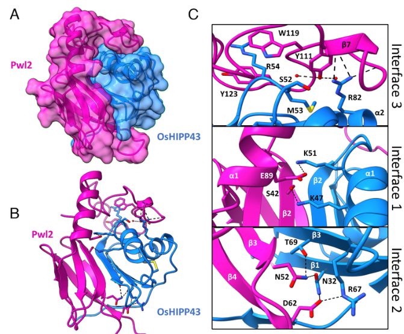

## Question

# Gene Research for Functional Annotation

## ⚠️ CRITICAL: Gene/Protein Identification Context

**BEFORE YOU BEGIN RESEARCH:** You MUST verify you are researching the CORRECT gene/protein. Gene symbols can be ambiguous, especially for less well-characterized genes from non-model organisms.

### Target Gene/Protein Identity (from UniProt):
- **UniProt Accession:** G5EI71
- **Protein Description:** RecName: Full=Secreted effector PWL2 {ECO:0000303|PubMed:7549480}; AltName: Full=Prevents pathogenicity toward weeping lovegrass protein 2 {ECO:0000303|PubMed:7549480}; Flags: Precursor;
- **Gene Information:** Name=PWL2 {ECO:0000303|PubMed:7549480}; ORFNames=MGG_04301, MGG_13863;
- **Organism (full):** Pyricularia oryzae (strain 70-15 / ATCC MYA-4617 / FGSC 8958) (Rice blast fungus) (Magnaporthe oryzae).
- **Protein Family:** Not specified in UniProt
- **Key Domains:** Not specified in UniProt

### MANDATORY VERIFICATION STEPS:

1. **Check if the gene symbol "PWL2" matches the protein description above**
2. **Verify the organism is correct:** Pyricularia oryzae (strain 70-15 / ATCC MYA-4617 / FGSC 8958) (Rice blast fungus) (Magnaporthe oryzae).
3. **Check if protein family/domains align with what you find in literature**
4. **If you find literature for a DIFFERENT gene with the same or similar symbol, STOP**

### If Gene Symbol is Ambiguous or You Cannot Find Relevant Literature:

**DO NOT PROCEED WITH RESEARCH ON A DIFFERENT GENE.** Instead:
- State clearly: "The gene symbol 'PWL2' is ambiguous or literature is limited for this specific protein"
- Explain what you found (e.g., "Found extensive literature on a different gene with the same symbol in a different organism")
- Describe the protein based ONLY on the UniProt information provided above
- Suggest that the protein function can be inferred from domain/family information

### Research Target:

Please provide a comprehensive research report on the gene **PWL2** (gene ID: PWL2, UniProt: G5EI71) in PYRO7.

The research report should be a detailed narrative explaining the function, biological processes, and localization of the gene product. Citations should be given for all claims.

You should prioritize authoritative reviews and primary scientific literature when conducting research. You can supplement
this with annotations you find in gene/protein databases, but these can be outdated or inaccurate.

We are specifically interested in the primary function of the gene - for enzymes, what reaction is catalyzed, and what is the substrate specificity? For transporters, what is the substrate? For structural proteins or adapters, what is the broader structural role? For signaling molecules, what is the role in the pathway.

We are interested in where in or outside the cell the gene product carries out its function.

We are also interested in the signaling or biochemical pathways in which the gene functions. We are less interested in broad pleiotropic effects, except where these elucidate the precise role.

Include evidence where possible. We are interested in both experimental evidence as well as inference from structure, evolution, or bioinformatic analysis. Precise studies should be prioritized over high-throughput, where available.

## Output

Question: You are an expert researcher providing comprehensive, well-cited information.

Provide detailed information focusing on:
1. Key concepts and definitions with current understanding
2. Recent developments and latest research (prioritize 2023-2024 sources)
3. Current applications and real-world implementations
4. Expert opinions and analysis from authoritative sources
5. Relevant statistics and data from recent studies

Format as a comprehensive research report with proper citations. Include URLs and publication dates where available.
Always prioritize recent, authoritative sources and provide specific citations for all major claims.

# Gene Research for Functional Annotation

## ⚠️ CRITICAL: Gene/Protein Identification Context

**BEFORE YOU BEGIN RESEARCH:** You MUST verify you are researching the CORRECT gene/protein. Gene symbols can be ambiguous, especially for less well-characterized genes from non-model organisms.

### Target Gene/Protein Identity (from UniProt):
- **UniProt Accession:** G5EI71
- **Protein Description:** RecName: Full=Secreted effector PWL2 {ECO:0000303|PubMed:7549480}; AltName: Full=Prevents pathogenicity toward weeping lovegrass protein 2 {ECO:0000303|PubMed:7549480}; Flags: Precursor;
- **Gene Information:** Name=PWL2 {ECO:0000303|PubMed:7549480}; ORFNames=MGG_04301, MGG_13863;
- **Organism (full):** Pyricularia oryzae (strain 70-15 / ATCC MYA-4617 / FGSC 8958) (Rice blast fungus) (Magnaporthe oryzae).
- **Protein Family:** Not specified in UniProt
- **Key Domains:** Not specified in UniProt

### MANDATORY VERIFICATION STEPS:

1. **Check if the gene symbol "PWL2" matches the protein description above**
2. **Verify the organism is correct:** Pyricularia oryzae (strain 70-15 / ATCC MYA-4617 / FGSC 8958) (Rice blast fungus) (Magnaporthe oryzae).
3. **Check if protein family/domains align with what you find in literature**
4. **If you find literature for a DIFFERENT gene with the same or similar symbol, STOP**

### If Gene Symbol is Ambiguous or You Cannot Find Relevant Literature:

**DO NOT PROCEED WITH RESEARCH ON A DIFFERENT GENE.** Instead:
- State clearly: "The gene symbol 'PWL2' is ambiguous or literature is limited for this specific protein"
- Explain what you found (e.g., "Found extensive literature on a different gene with the same symbol in a different organism")
- Describe the protein based ONLY on the UniProt information provided above
- Suggest that the protein function can be inferred from domain/family information

### Research Target:

Please provide a comprehensive research report on the gene **PWL2** (gene ID: PWL2, UniProt: G5EI71) in PYRO7.

The research report should be a detailed narrative explaining the function, biological processes, and localization of the gene product. Citations should be given for all claims.

You should prioritize authoritative reviews and primary scientific literature when conducting research. You can supplement
this with annotations you find in gene/protein databases, but these can be outdated or inaccurate.

We are specifically interested in the primary function of the gene - for enzymes, what reaction is catalyzed, and what is the substrate specificity? For transporters, what is the substrate? For structural proteins or adapters, what is the broader structural role? For signaling molecules, what is the role in the pathway.

We are interested in where in or outside the cell the gene product carries out its function.

We are also interested in the signaling or biochemical pathways in which the gene functions. We are less interested in broad pleiotropic effects, except where these elucidate the precise role.

Include evidence where possible. We are interested in both experimental evidence as well as inference from structure, evolution, or bioinformatic analysis. Precise studies should be prioritized over high-throughput, where available.

# Functional annotation report: PWL2 (UniProt G5EI71)

## Identity and scope

**PWL2 encodes a secreted effector of the rice-blast fungus *Pyricularia oryzae* (syn. *Magnaporthe oryzae*), not a plant gene.** This matches the supplied UniProt identification for strain 70-15 (PYRO7). PWL2 is distinct from the related fungal gene **PWL1**: both can prevent infection of weeping lovegrass, but they are separate members of the PWL effector family. A 2024 structural study establishes that Pwl2 has a **MAX (*Magnaporthe* Avrs and ToxB-like) effector fold**, adding a protein-family assignment not specified in the supplied UniProt description. (khang2010translocationofmagnaporthe pages 2-4, liu2024therolesof pages 3-4, zdrzałek2024bioengineeringaplant pages 3-4, were2025theblasteffector pages 5-6)

**Locus-identifier qualification.** The supplied record lists **MGG_04301 and MGG_13863**. A study explicitly examining the 70-15 reference genome instead reports two PWL2 copies on chromosomes 3 and 6 as **MGG_04301 and MGG_13683**. The second identifier is discrepant; these sources do not establish that MGG_13863 and MGG_13683 are interchangeable. The functional conclusions below concern experimentally identified *P. oryzae* Pwl2, but locus-specific claims about G5EI71 should be checked against the underlying 70-15 sequence before transferring an annotation between gene models. (were2025theblasteffector pages 5-6)

## Primary molecular function and biological process

Pwl2 is **not characterized as an enzyme, transporter, or structural component**. Its experimentally supported molecular activity is binding host proteins, particularly **HIPP43**, a heavy-metal-associated, isoprenylated plant protein. Binding was detected with yeast two-hybrid assays, co-immunoprecipitation, and purified-protein isothermal titration calorimetry. Wild-type Pwl2 bound the rice OsHIPP43 HMA domain with a dissociation constant of **191 nM**; the naturally occurring Pwl2-2 and Pwl2-3 variants retained binding at **141 nM** and **35 nM**, respectively. These measurements establish binding specificity, **not** metal transport, metal catalysis, or a biochemical reaction by Pwl2. (were2025theblasteffector pages 6-8, zdrzałek2024bioengineeringaplant pages 2-3)

A crystal structure of the Pwl2–OsHIPP43 complex, resolved to **1.8 Å**, directly confirms the MAX-fold assignment. The protein has a MAX β-sandwich core, followed by a C-terminal α-helix and an extended region. Its three-part contact surface wraps around OsHIPP43; the reported total protein–protein interface is **1,976.9 Ų**. Thus, the experimentally identified structural role of the MAX fold and extension is to form a broad host-protein-binding surface, rather than a catalytic pocket. Figure 4 of the structural study depicts this interface. (zdrzałek2024bioengineeringaplant pages 4-6, zdrzałek2024bioengineeringaplant pages 3-4, zdrzałek2024bioengineeringaplant media 704d2df2)

The leading functional model is **suppression of host pattern-triggered immunity (PTI)**. In host-cell expression experiments, Pwl2 associated with HIPP43 and displaced the host protein from its usual plasmodesmata-associated plasma-membrane puncta into cytoplasm and mobile bodies. HIPP43’s C-terminal isoprenylation motif was important for its normal plasmodesmal localization. Expressing signal-peptide-deleted Pwl2 in rice or barley abolished the measured **chitin- and flg22-triggered reactive-oxygen-species (ROS) bursts** and increased blast susceptibility; HIPP43 overexpression produced a similar immune-suppression phenotype. The plasmodesmatal relocalization experiments used transient expression in *Nicotiana benthamiana*, so whether precisely the same redistribution occurs during native rice infection remains to be established. Likewise, it is not yet known whether HIPP43 directly regulates ROS production or acts through other immune-signaling proteins. (were2025theblasteffector pages 6-8, were2025theblasteffector pages 8-10, were2025theblasteffector pages 10-13)

## Where Pwl2 functions

Pwl2 is produced by the fungus during biotrophic invasion and **secreted into the biotrophic interfacial complex (BIC)**, a plant membrane-rich structure beside the fungal invasive hypha. Expression was reported to peak approximately **36–48 hours after infection** in the examined infection system. The BIC is a delivery interface, **not the final demonstrated site of Pwl2 action**: fluorescently tagged Pwl2 subsequently entered the cytoplasm of invaded rice cells, whereas the apoplastic effector Bas4 ordinarily remained around invasive hyphae. Pwl2 fluorescence was also observed in neighboring, initially uninvaded rice cells, consistent with movement through plasmodesmata. In one quantitative microscopy assay, a PWL2:mRFP reporter was found in the cytoplasm of all **286 evaluable invaded cells**, and in adjoining cells at **260 of those 286 sites (91%)**. Reporter size and rice-cell type affected intercellular spread; these percentages describe tagged reporters under assay conditions, not the distribution of untagged protein in a field infection. Experimental nuclear-localization tags sensitized detection of host-cell entry but do **not** demonstrate that native Pwl2 has a nuclear function. (khang2010translocationofmagnaporthe pages 2-4, giraldo2013twodistinctsecretion pages 6-7, khang2010translocationofmagnaporthe pages 8-9, were2025theblasteffector pages 3-5)

The secretory route is distinct from conventional secretion of apoplastic effectors. **Brefeldin A** blocked normal Bas4 delivery but did not eliminate Pwl2 accumulation at BICs; photobleached Pwl2 fluorescence recovered there during treatment. Mutant and localization experiments implicated fungal exocyst components **Exo70 and Sec5** and the **Sso1** t-SNARE in efficient BIC targeting. A 2024 expert review interprets these observations as Golgi-bypass unconventional secretion of cytoplasmic effectors and discusses host clathrin-mediated uptake at the BIC. That uptake mechanism describes the effector-delivery pathway; it should not be conflated with Pwl2’s demonstrated downstream binding to HIPP43. (giraldo2013twodistinctsecretion pages 6-7, giraldo2013twodistinctsecretion pages 10-10, giraldo2013twodistinctsecretion pages 4-6, dulal2024pathsofleast pages 2-3, dulal2024pathsofleast pages 3-4)

## Host specificity: why an effector can also confer avirulence

**PWL2 has opposing consequences depending on host genotype.** In a susceptible host, its immune-suppressing activity benefits fungal colonization. In a host that recognizes it, the same secreted molecule becomes an **avirulence determinant** and blocks infection. Weeping lovegrass (*Eragrostis curvula*) recognizes Pwl2, although the responsible resistance gene has not been identified. In barley, the intracellular NLR receptor **MLA3/Rmo1** recognizes Pwl2: *PWL2*-loss mutants infected MLA3 barley, and reintroduction of *PWL2* under its native promoter restored avirulence. MLA3–Pwl2 association and effector-dependent cell death were also observed in heterologous expression assays. The natural **Pwl2 D90N (pwl2-2)** variant evaded recognition by both MLA3 barley and resistant weeping lovegrass, while retaining high-affinity binding to OsHIPP43. Thus, escape from immune recognition need not abolish the measured host-target interaction. (zdrzałek2024bioengineeringaplant pages 2-3, brabham2024barleymla3recognizes pages 9-12, brabham2024barleymla3recognizes pages 12-13)

A functional deletion study reinforces this distinction, **but used rice-blast strain Guy11, not the requested 70-15 strain**. Guy11 has **three** PWL2 copies, compared with the two reported for reference 70-15. Disrupting the Guy11 copies enabled disease on weeping lovegrass and MLA3 barley, yet modestly reduced lesion development on susceptible rice and barley. Complementation restored the lovegrass avirulence phenotype. The opposite outcomes provide genetic evidence for both a resistance-triggering and a virulence-promoting role; their magnitudes should not be assumed identical in 70-15. Across **286 surveyed fungal genomes**, PWL2 copy number varied, reaching **eight** in one isolate, another reason to avoid equating gene name with a single invariant locus. (were2025theblasteffector pages 5-6, were2025theblasteffector pages 20-24)

## Applications, recent developments, and assessment

A **2024 proof of concept** exploited the Pwl2–OsHIPP43 interaction for receptor engineering: researchers replaced the native HMA recognition domain of the rice Pikm-1 NLR with the OsHIPP43 HMA domain. Paired with the Pikp-2 helper receptor, this chimera responded to Pwl2, the immune-escape variants Pwl2-2 and Pwl2-3, and other PWL-family proteins. Single and several combined Pwl2 interface mutations retained recognition; a more extensive seven-substitution mutant lost detectable OsHIPP43 binding and engineered-receptor recognition. The experiments establish a plausible route to broader effector detection, **not yet a field implementation or demonstrated blast resistance in engineered cereal crops**: the reported receptor-response assays used transient expression in *N. benthamiana*. By contrast, the separate MLA3 study did demonstrate isolate-specific blast resistance in transgenic barley; more than two MLA3 transgene copies were needed for complete resistance in those lines. (zdrzałek2024bioengineeringaplant pages 4-6, brabham2024barleymla3recognizes pages 6-8, zdrzałek2024bioengineeringaplant pages 6-8, zdrzałek2024bioengineeringaplant pages 2-3)

Taken together, the strongest annotation is: **“Secreted, host-cell-translocated MAX-family effector that binds HIPP43-family host proteins; promotes blast virulence and suppresses elicitor-induced immune ROS in compatible interactions, while acting as an avirulence/host-range determinant where recognized by MLA3 or weeping-lovegrass immunity.”** The Pwl2–HIPP43 structure and MLA3 recognition are supported by peer-reviewed primary studies; the detailed HIPP43-relocalization and PWL2-null immune-phenotype experiments examined here were posted as a **23 January 2024 preprint**, so their proposed causal link to plasmodesmatal immunity merits that qualification. (zdrzałek2024bioengineeringaplant pages 1-2, brabham2024barleymla3recognizes pages 1-2, were2025theblasteffector pages 5-6, were2025theblasteffector pages 6-8, were2025theblasteffector pages 10-13)

The evidence and its principal strain- and application-specific limitations are summarized below.

| Biological question | Specific evidence, study date, and DOI | Interpretation / limitation |
|---|---|---|
| **Is this the correct PWL2, and how many copies occur in strain 70-15?** | The target is the *Magnaporthe oryzae*/*Pyricularia oryzae* PWL2 effector, distinct from PWL1. A 2024 study reports two PWL2 copies in reference strain 70-15, on chromosomes 3 and 6, annotated **MGG_04301** and **MGG_13683**; a 286-genome survey found copy-number variation up to eight copies in one isolate. [Were et al., preprint posted January 23, 2024](https://doi.org/10.1101/2024.01.20.576406) (were2025theblasteffector pages 5-6) | Identity, organism, and two-copy status agree with the supplied UniProt context. However, the paper's **MGG_13683** conflicts with the supplied **MGG_13863**. This may reflect a transcription or annotation-version discrepancy and should not be silently reconciled. |
| **What type of protein is mature Pwl2, and what does it bind?** | Signal-peptide-deleted Pwl2 is a **MAX effector** with a beta-sandwich core, C-terminal alpha helix, and extended loop. A 1.8-angstrom crystal structure showed a three-part interface with OsHIPP43: 1,976.9 square angstroms of buried interface involving 62/112 Pwl2 and 45/76 OsHIPP43 residues. ITC measured dissociation constants of **191 nM** for Pwl2, **141 nM** for Pwl2-2, and **35 nM** for Pwl2-3. [Zdrzalek et al., published July 5, 2024](https://doi.org/10.1073/pnas.2402872121) (zdrzałek2024bioengineeringaplant pages 4-6, zdrzałek2024bioengineeringaplant pages 3-4, zdrzałek2024bioengineeringaplant pages 2-3) | Pwl2 is not an enzyme or transporter: its primary molecular activity is high-affinity protein-protein binding to HIPP43-family host proteins. The crystallized construct lacked the secretion signal and ten C-terminal residues, so the structure represents the host-active mature region rather than the intact precursor. |
| **Where is Pwl2 delivered and where does it act?** | Fluorescent Pwl2 first accumulated at the plant membrane-rich **biotrophic interfacial complex (BIC)**, then entered the invaded rice-cell cytoplasm and moved into neighboring uninvaded cells. PWL2:mRFP reached the cytoplasm in 286/286 evaluable invaded cells and adjoining cells at 260/286 sites (91%); PWL2:EGFP entered 149/210 cells and adjoining cells at 124/149 positive sites (83%). NLS-tagged reporters confirmed host-cell entry and size- and cell-type-dependent spread consistent with plasmodesmal transport. [Khang et al., April 2010](https://doi.org/10.1105/tpc.109.069666) (khang2010translocationofmagnaporthe pages 2-4, khang2010translocationofmagnaporthe pages 5-8, khang2010translocationofmagnaporthe pages 8-9) | Native trafficking comprises distinct stages: fungal secretion, BIC accumulation, host-cytoplasmic translocation, and intercellular movement. Nuclear fluorescence resulted from experimental NLS or histone tags and does **not** establish a native nuclear function. |
| **How is Pwl2 secreted?** | Pwl2 BIC delivery was insensitive to brefeldin A, unlike conventional ER-Golgi secretion of the apoplastic effector Bas4. Exo70 and Sec5 loss reduced BIC accumulation and retained cytoplasmic effectors in invasive hyphae; Sso1 was also required for normal BIC formation. [Giraldo et al., June 2013](https://doi.org/10.1038/ncomms2996) (giraldo2013twodistinctsecretion pages 6-7, giraldo2013twodistinctsecretion pages 10-10, giraldo2013twodistinctsecretion pages 4-6). A 2024 synthesis classifies this as type-IV Golgi-bypass unconventional secretion followed by host clathrin-mediated uptake. [Dulal and Wilson, September 2024](https://doi.org/10.1094/mpmi-12-23-0212-cr) (dulal2024pathsofleast pages 2-3, dulal2024pathsofleast pages 3-4) | Evidence strongly supports a specialized BIC-targeted route distinct from conventional apoplastic secretion. Clathrin-mediated uptake is supported at the cytoplasmic-effector class level; the older Pwl2 experiments alone did not resolve every internalization step. |
| **What host process does Pwl2 manipulate?** | Pwl2 bound barley HIPP43 by yeast two-hybrid and co-immunoprecipitation and interacted with HIPP43 orthologs from several grasses. HIPP43 normally localized to plasmodesmata through a C-terminal isoprenylation motif; coexpression with Pwl2 displaced it into the cytoplasm and approximately 2-4-micrometer mobile bodies. Stable rice and barley expression of signal-peptide-deleted Pwl2 abolished chitin- and flg22-induced ROS, while HIPP43 overexpression produced a similar immune-suppression phenotype. [Were et al., preprint posted January 23, 2024](https://doi.org/10.1101/2024.01.20.576406) (were2025theblasteffector pages 6-8, were2025theblasteffector pages 8-10, were2025theblasteffector pages 10-13) | Best-supported mechanistic model: Pwl2 binds and redistributes or stabilizes HIPP43, perturbing plasmodesmata-associated immunity and suppressing pattern-triggered ROS. Whether HIPP43 directly controls ROS or acts through another signaling component remains unresolved; these functional data were initially reported as a preprint. |
| **How does PWL2 affect host specificity and virulence?** | Deleting all three PWL2 copies from strain Guy11 conferred virulence on weeping lovegrass and MLA3 barley but produced smaller or fewer lesions on susceptible rice and barley, separating avirulence recognition from a positive virulence function. [Were et al., 2024 preprint](https://doi.org/10.1101/2024.01.20.576406) (were2025theblasteffector pages 5-6, were2025theblasteffector pages 20-24). Independently, loss of PWL2 enabled infection of MLA3 barley; native-promoter complementation restored avirulence. The Pwl2 D90N allele escaped recognition by both MLA3 barley and weeping lovegrass. [Brabham et al., advance publication October 11, 2023; 2024 volume](https://doi.org/10.1093/plcell/koad266) (brabham2024barleymla3recognizes pages 1-2, brabham2024barleymla3recognizes pages 8-9, brabham2024barleymla3recognizes pages 9-12) | PWL2 is simultaneously a **virulence effector** in susceptible hosts and an **avirulence or host-range determinant** where cognate immunity exists. Guy11 deletion results should not be attributed directly to 70-15 because the strains differ in PWL2 copy number and genomic background. |
| **Is Pwl2 already being used for crop protection?** | Replacing the native HMA domain of rice Pikm-1 with OsHIPP43 generated Pikm-1-OsHIPP43/Pikp-2, which recognized Pwl2, Pwl2-2, Pwl2-3, and other PWL proteins. Recognition and cell death were demonstrated by transient expression in *Nicotiana benthamiana*; disrupting interaction required extensive multi-interface mutation. [Zdrzalek et al., July 5, 2024](https://doi.org/10.1073/pnas.2402872121) (zdrzałek2024bioengineeringaplant pages 2-3, zdrzałek2024bioengineeringaplant pages 6-8) | This is a promising receptor-engineering proof of concept, **not field-validated resistance**. The 2024 study did not demonstrate protection during blast infection in transgenic rice, barley, or wheat, nor agronomic durability under field conditions. |

*Table: Compact evidence table for *Pyricularia oryzae* PWL2 (UniProt G5EI71), covering identity, structure, trafficking, host targets, host specificity, and engineering applications. It distinguishes direct evidence from unresolved annotation conflicts and translational limitations.*

**Key source links and publication dates:** Khang *et al.*, *The Plant Cell* **2010**, https://doi.org/10.1105/tpc.109.069666; Giraldo *et al.*, *Nature Communications* **2013**, https://doi.org/10.1038/ncomms2996; Brabham *et al.*, *The Plant Cell* **2024** volume, first published online **11 October 2023**, https://doi.org/10.1093/plcell/koad266; Zdrzałek *et al.*, *PNAS*, published **5 July 2024**, https://doi.org/10.1073/pnas.2402872121; Were *et al.*, bioRxiv preprint version posted **23 January 2024**, https://doi.org/10.1101/2024.01.20.576406; and Dulal and Wilson, *Molecular Plant-Microbe Interactions* **September 2024**, https://doi.org/10.1094/mpmi-12-23-0212-cr. (khang2010translocationofmagnaporthe pages 2-4, giraldo2013twodistinctsecretion pages 6-7, brabham2024barleymla3recognizes pages 1-2, zdrzałek2024bioengineeringaplant pages 1-2, were2025theblasteffector pages 5-6, dulal2024pathsofleast pages 2-3)

References

1. (khang2010translocationofmagnaporthe pages 2-4): C. Khang, R. Berruyer, Martha C. Giraldo, P. Kankanala, Sook-Young Park, K. Czymmek, Seogchan Kang, and B. Valent. Translocation of magnaporthe oryzae effectors into rice cells and their subsequent cell-to-cell movement[w][oa]. Plant Cell, 22:1388-1403, Apr 2010. URL: https://doi.org/10.1105/tpc.109.069666, doi:10.1105/tpc.109.069666. This article has 603 citations and is from a highest quality peer-reviewed journal.

2. (liu2024therolesof pages 3-4): Xin Liu, Xiaochun Hu, Zhouyi Tu, Zhenbiao Sun, Peng Qin, Yikang Liu, Xinwei Chen, Zhiqiang Li, Nan Jiang, and Yuanzhu Yang. The roles of magnaporthe oryzae avirulence effectors involved in blast resistance/susceptibility. Frontiers in Plant Science, Oct 2024. URL: https://doi.org/10.3389/fpls.2024.1478159, doi:10.3389/fpls.2024.1478159. This article has 23 citations.

3. (zdrzałek2024bioengineeringaplant pages 3-4): Rafał Zdrzałek, Yuxuan Xi, Thorsten Langner, Adam R. Bentham, Yohann Petit-Houdenot, Juan Carlos De la Concepcion, Adeline Harant, Motoki Shimizu, Vincent Were, Nicholas J. Talbot, Ryohei Terauchi, Sophien Kamoun, and Mark J. Banfield. Bioengineering a plant nlr immune receptor with a robust binding interface toward a conserved fungal pathogen effector. Jul 2024. URL: https://doi.org/10.1073/pnas.2402872121, doi:10.1073/pnas.2402872121. This article has 68 citations and is from a highest quality peer-reviewed journal.

4. (were2025theblasteffector pages 5-6): Vincent Were, Xia Yan, Andrew J. Foster, Jan Sklenar, Thorsten Langner, Amber Gentle, Neha Sahu, Adam Bentham, Rafał Zdrzałek, Lauren Ryder, Davies Kaimenyi, Diana Gomez De La Cruz, Yohan Petit-Houdenot, Alice Bisola Eseola, Matthew Smoker, Mark Jave Bautista, Weibin Ma, Jiorgos Kourelis, Dan Maclean, Mark J. Banfield, Sophien Kamoun, Frank L.H. Menke, Matthew J. Moscou, and Nicholas J. Talbot. The blast effector pwl2 is a virulence factor that modifies the cellular localisation of host protein hipp43 to suppress immunity. bioRxiv, Jan 2025. URL: https://doi.org/10.1101/2024.01.20.576406, doi:10.1101/2024.01.20.576406. This article has 7 citations.

5. (were2025theblasteffector pages 6-8): Vincent Were, Xia Yan, Andrew J. Foster, Jan Sklenar, Thorsten Langner, Amber Gentle, Neha Sahu, Adam Bentham, Rafał Zdrzałek, Lauren Ryder, Davies Kaimenyi, Diana Gomez De La Cruz, Yohan Petit-Houdenot, Alice Bisola Eseola, Matthew Smoker, Mark Jave Bautista, Weibin Ma, Jiorgos Kourelis, Dan Maclean, Mark J. Banfield, Sophien Kamoun, Frank L.H. Menke, Matthew J. Moscou, and Nicholas J. Talbot. The blast effector pwl2 is a virulence factor that modifies the cellular localisation of host protein hipp43 to suppress immunity. bioRxiv, Jan 2025. URL: https://doi.org/10.1101/2024.01.20.576406, doi:10.1101/2024.01.20.576406. This article has 7 citations.

6. (zdrzałek2024bioengineeringaplant pages 2-3): Rafał Zdrzałek, Yuxuan Xi, Thorsten Langner, Adam R. Bentham, Yohann Petit-Houdenot, Juan Carlos De la Concepcion, Adeline Harant, Motoki Shimizu, Vincent Were, Nicholas J. Talbot, Ryohei Terauchi, Sophien Kamoun, and Mark J. Banfield. Bioengineering a plant nlr immune receptor with a robust binding interface toward a conserved fungal pathogen effector. Jul 2024. URL: https://doi.org/10.1073/pnas.2402872121, doi:10.1073/pnas.2402872121. This article has 68 citations and is from a highest quality peer-reviewed journal.

7. (zdrzałek2024bioengineeringaplant pages 4-6): Rafał Zdrzałek, Yuxuan Xi, Thorsten Langner, Adam R. Bentham, Yohann Petit-Houdenot, Juan Carlos De la Concepcion, Adeline Harant, Motoki Shimizu, Vincent Were, Nicholas J. Talbot, Ryohei Terauchi, Sophien Kamoun, and Mark J. Banfield. Bioengineering a plant nlr immune receptor with a robust binding interface toward a conserved fungal pathogen effector. Jul 2024. URL: https://doi.org/10.1073/pnas.2402872121, doi:10.1073/pnas.2402872121. This article has 68 citations and is from a highest quality peer-reviewed journal.

8. (zdrzałek2024bioengineeringaplant media 704d2df2): Rafał Zdrzałek, Yuxuan Xi, Thorsten Langner, Adam R. Bentham, Yohann Petit-Houdenot, Juan Carlos De la Concepcion, Adeline Harant, Motoki Shimizu, Vincent Were, Nicholas J. Talbot, Ryohei Terauchi, Sophien Kamoun, and Mark J. Banfield. Bioengineering a plant nlr immune receptor with a robust binding interface toward a conserved fungal pathogen effector. Jul 2024. URL: https://doi.org/10.1073/pnas.2402872121, doi:10.1073/pnas.2402872121. This article has 68 citations and is from a highest quality peer-reviewed journal.

9. (were2025theblasteffector pages 8-10): Vincent Were, Xia Yan, Andrew J. Foster, Jan Sklenar, Thorsten Langner, Amber Gentle, Neha Sahu, Adam Bentham, Rafał Zdrzałek, Lauren Ryder, Davies Kaimenyi, Diana Gomez De La Cruz, Yohan Petit-Houdenot, Alice Bisola Eseola, Matthew Smoker, Mark Jave Bautista, Weibin Ma, Jiorgos Kourelis, Dan Maclean, Mark J. Banfield, Sophien Kamoun, Frank L.H. Menke, Matthew J. Moscou, and Nicholas J. Talbot. The blast effector pwl2 is a virulence factor that modifies the cellular localisation of host protein hipp43 to suppress immunity. bioRxiv, Jan 2025. URL: https://doi.org/10.1101/2024.01.20.576406, doi:10.1101/2024.01.20.576406. This article has 7 citations.

10. (were2025theblasteffector pages 10-13): Vincent Were, Xia Yan, Andrew J. Foster, Jan Sklenar, Thorsten Langner, Amber Gentle, Neha Sahu, Adam Bentham, Rafał Zdrzałek, Lauren Ryder, Davies Kaimenyi, Diana Gomez De La Cruz, Yohan Petit-Houdenot, Alice Bisola Eseola, Matthew Smoker, Mark Jave Bautista, Weibin Ma, Jiorgos Kourelis, Dan Maclean, Mark J. Banfield, Sophien Kamoun, Frank L.H. Menke, Matthew J. Moscou, and Nicholas J. Talbot. The blast effector pwl2 is a virulence factor that modifies the cellular localisation of host protein hipp43 to suppress immunity. bioRxiv, Jan 2025. URL: https://doi.org/10.1101/2024.01.20.576406, doi:10.1101/2024.01.20.576406. This article has 7 citations.

11. (giraldo2013twodistinctsecretion pages 6-7): Martha C. Giraldo, Yasin F. Dagdas, Yogesh K. Gupta, Thomas A. Mentlak, Mihwa Yi, Ana Lilia Martinez-Rocha, Hiromasa Saitoh, Ryohei Terauchi, Nicholas J. Talbot, and Barbara Valent. Two distinct secretion systems facilitate tissue invasion by the rice blast fungus magnaporthe oryzae. Nature Communications, Jun 2013. URL: https://doi.org/10.1038/ncomms2996, doi:10.1038/ncomms2996. This article has 520 citations and is from a highest quality peer-reviewed journal.

12. (khang2010translocationofmagnaporthe pages 8-9): C. Khang, R. Berruyer, Martha C. Giraldo, P. Kankanala, Sook-Young Park, K. Czymmek, Seogchan Kang, and B. Valent. Translocation of magnaporthe oryzae effectors into rice cells and their subsequent cell-to-cell movement[w][oa]. Plant Cell, 22:1388-1403, Apr 2010. URL: https://doi.org/10.1105/tpc.109.069666, doi:10.1105/tpc.109.069666. This article has 603 citations and is from a highest quality peer-reviewed journal.

13. (were2025theblasteffector pages 3-5): Vincent Were, Xia Yan, Andrew J. Foster, Jan Sklenar, Thorsten Langner, Amber Gentle, Neha Sahu, Adam Bentham, Rafał Zdrzałek, Lauren Ryder, Davies Kaimenyi, Diana Gomez De La Cruz, Yohan Petit-Houdenot, Alice Bisola Eseola, Matthew Smoker, Mark Jave Bautista, Weibin Ma, Jiorgos Kourelis, Dan Maclean, Mark J. Banfield, Sophien Kamoun, Frank L.H. Menke, Matthew J. Moscou, and Nicholas J. Talbot. The blast effector pwl2 is a virulence factor that modifies the cellular localisation of host protein hipp43 to suppress immunity. bioRxiv, Jan 2025. URL: https://doi.org/10.1101/2024.01.20.576406, doi:10.1101/2024.01.20.576406. This article has 7 citations.

14. (giraldo2013twodistinctsecretion pages 10-10): Martha C. Giraldo, Yasin F. Dagdas, Yogesh K. Gupta, Thomas A. Mentlak, Mihwa Yi, Ana Lilia Martinez-Rocha, Hiromasa Saitoh, Ryohei Terauchi, Nicholas J. Talbot, and Barbara Valent. Two distinct secretion systems facilitate tissue invasion by the rice blast fungus magnaporthe oryzae. Nature Communications, Jun 2013. URL: https://doi.org/10.1038/ncomms2996, doi:10.1038/ncomms2996. This article has 520 citations and is from a highest quality peer-reviewed journal.

15. (giraldo2013twodistinctsecretion pages 4-6): Martha C. Giraldo, Yasin F. Dagdas, Yogesh K. Gupta, Thomas A. Mentlak, Mihwa Yi, Ana Lilia Martinez-Rocha, Hiromasa Saitoh, Ryohei Terauchi, Nicholas J. Talbot, and Barbara Valent. Two distinct secretion systems facilitate tissue invasion by the rice blast fungus magnaporthe oryzae. Nature Communications, Jun 2013. URL: https://doi.org/10.1038/ncomms2996, doi:10.1038/ncomms2996. This article has 520 citations and is from a highest quality peer-reviewed journal.

16. (dulal2024pathsofleast pages 2-3): Nawaraj Dulal and Richard A. Wilson. Paths of least resistance: unconventional effector secretion by fungal and oomycete plant pathogens. Molecular Plant-Microbe Interactions®, 37:653-661, Sep 2024. URL: https://doi.org/10.1094/mpmi-12-23-0212-cr, doi:10.1094/mpmi-12-23-0212-cr. This article has 14 citations.

17. (dulal2024pathsofleast pages 3-4): Nawaraj Dulal and Richard A. Wilson. Paths of least resistance: unconventional effector secretion by fungal and oomycete plant pathogens. Molecular Plant-Microbe Interactions®, 37:653-661, Sep 2024. URL: https://doi.org/10.1094/mpmi-12-23-0212-cr, doi:10.1094/mpmi-12-23-0212-cr. This article has 14 citations.

18. (brabham2024barleymla3recognizes pages 9-12): Helen J Brabham, Diana Gómez De La Cruz, Vincent Were, Motoki Shimizu, Hiromasa Saitoh, Inmaculada Hernández-Pinzón, Phon Green, Jennifer Lorang, Koki Fujisaki, Kazuhiro Sato, István Molnár, Hana Šimková, Jaroslav Doležel, James Russell, Jodie Taylor, Matthew Smoker, Yogesh Kumar Gupta, Tom Wolpert, Nicholas J Talbot, Ryohei Terauchi, and Matthew J Moscou. Barley mla3 recognizes the host-specificity effector pwl2 from magnaporthe oryzae. The Plant cell, 36:447-470, Oct 2024. URL: https://doi.org/10.1093/plcell/koad266, doi:10.1093/plcell/koad266. This article has 56 citations.

19. (brabham2024barleymla3recognizes pages 12-13): Helen J Brabham, Diana Gómez De La Cruz, Vincent Were, Motoki Shimizu, Hiromasa Saitoh, Inmaculada Hernández-Pinzón, Phon Green, Jennifer Lorang, Koki Fujisaki, Kazuhiro Sato, István Molnár, Hana Šimková, Jaroslav Doležel, James Russell, Jodie Taylor, Matthew Smoker, Yogesh Kumar Gupta, Tom Wolpert, Nicholas J Talbot, Ryohei Terauchi, and Matthew J Moscou. Barley mla3 recognizes the host-specificity effector pwl2 from magnaporthe oryzae. The Plant cell, 36:447-470, Oct 2024. URL: https://doi.org/10.1093/plcell/koad266, doi:10.1093/plcell/koad266. This article has 56 citations.

20. (were2025theblasteffector pages 20-24): Vincent Were, Xia Yan, Andrew J. Foster, Jan Sklenar, Thorsten Langner, Amber Gentle, Neha Sahu, Adam Bentham, Rafał Zdrzałek, Lauren Ryder, Davies Kaimenyi, Diana Gomez De La Cruz, Yohan Petit-Houdenot, Alice Bisola Eseola, Matthew Smoker, Mark Jave Bautista, Weibin Ma, Jiorgos Kourelis, Dan Maclean, Mark J. Banfield, Sophien Kamoun, Frank L.H. Menke, Matthew J. Moscou, and Nicholas J. Talbot. The blast effector pwl2 is a virulence factor that modifies the cellular localisation of host protein hipp43 to suppress immunity. bioRxiv, Jan 2025. URL: https://doi.org/10.1101/2024.01.20.576406, doi:10.1101/2024.01.20.576406. This article has 7 citations.

21. (brabham2024barleymla3recognizes pages 6-8): Helen J Brabham, Diana Gómez De La Cruz, Vincent Were, Motoki Shimizu, Hiromasa Saitoh, Inmaculada Hernández-Pinzón, Phon Green, Jennifer Lorang, Koki Fujisaki, Kazuhiro Sato, István Molnár, Hana Šimková, Jaroslav Doležel, James Russell, Jodie Taylor, Matthew Smoker, Yogesh Kumar Gupta, Tom Wolpert, Nicholas J Talbot, Ryohei Terauchi, and Matthew J Moscou. Barley mla3 recognizes the host-specificity effector pwl2 from magnaporthe oryzae. The Plant cell, 36:447-470, Oct 2024. URL: https://doi.org/10.1093/plcell/koad266, doi:10.1093/plcell/koad266. This article has 56 citations.

22. (zdrzałek2024bioengineeringaplant pages 6-8): Rafał Zdrzałek, Yuxuan Xi, Thorsten Langner, Adam R. Bentham, Yohann Petit-Houdenot, Juan Carlos De la Concepcion, Adeline Harant, Motoki Shimizu, Vincent Were, Nicholas J. Talbot, Ryohei Terauchi, Sophien Kamoun, and Mark J. Banfield. Bioengineering a plant nlr immune receptor with a robust binding interface toward a conserved fungal pathogen effector. Jul 2024. URL: https://doi.org/10.1073/pnas.2402872121, doi:10.1073/pnas.2402872121. This article has 68 citations and is from a highest quality peer-reviewed journal.

23. (zdrzałek2024bioengineeringaplant pages 1-2): Rafał Zdrzałek, Yuxuan Xi, Thorsten Langner, Adam R. Bentham, Yohann Petit-Houdenot, Juan Carlos De la Concepcion, Adeline Harant, Motoki Shimizu, Vincent Were, Nicholas J. Talbot, Ryohei Terauchi, Sophien Kamoun, and Mark J. Banfield. Bioengineering a plant nlr immune receptor with a robust binding interface toward a conserved fungal pathogen effector. Jul 2024. URL: https://doi.org/10.1073/pnas.2402872121, doi:10.1073/pnas.2402872121. This article has 68 citations and is from a highest quality peer-reviewed journal.

24. (brabham2024barleymla3recognizes pages 1-2): Helen J Brabham, Diana Gómez De La Cruz, Vincent Were, Motoki Shimizu, Hiromasa Saitoh, Inmaculada Hernández-Pinzón, Phon Green, Jennifer Lorang, Koki Fujisaki, Kazuhiro Sato, István Molnár, Hana Šimková, Jaroslav Doležel, James Russell, Jodie Taylor, Matthew Smoker, Yogesh Kumar Gupta, Tom Wolpert, Nicholas J Talbot, Ryohei Terauchi, and Matthew J Moscou. Barley mla3 recognizes the host-specificity effector pwl2 from magnaporthe oryzae. The Plant cell, 36:447-470, Oct 2024. URL: https://doi.org/10.1093/plcell/koad266, doi:10.1093/plcell/koad266. This article has 56 citations.

25. (khang2010translocationofmagnaporthe pages 5-8): C. Khang, R. Berruyer, Martha C. Giraldo, P. Kankanala, Sook-Young Park, K. Czymmek, Seogchan Kang, and B. Valent. Translocation of magnaporthe oryzae effectors into rice cells and their subsequent cell-to-cell movement[w][oa]. Plant Cell, 22:1388-1403, Apr 2010. URL: https://doi.org/10.1105/tpc.109.069666, doi:10.1105/tpc.109.069666. This article has 603 citations and is from a highest quality peer-reviewed journal.

26. (brabham2024barleymla3recognizes pages 8-9): Helen J Brabham, Diana Gómez De La Cruz, Vincent Were, Motoki Shimizu, Hiromasa Saitoh, Inmaculada Hernández-Pinzón, Phon Green, Jennifer Lorang, Koki Fujisaki, Kazuhiro Sato, István Molnár, Hana Šimková, Jaroslav Doležel, James Russell, Jodie Taylor, Matthew Smoker, Yogesh Kumar Gupta, Tom Wolpert, Nicholas J Talbot, Ryohei Terauchi, and Matthew J Moscou. Barley mla3 recognizes the host-specificity effector pwl2 from magnaporthe oryzae. The Plant cell, 36:447-470, Oct 2024. URL: https://doi.org/10.1093/plcell/koad266, doi:10.1093/plcell/koad266. This article has 56 citations.

## Artifacts

- [Edison artifact artifact-00](PWL2-deep-research-falcon_artifacts/artifact-00.md)

## Citations

1. were2025theblasteffector pages 5-6
2. khang2010translocationofmagnaporthe pages 2-4
3. liu2024therolesof pages 3-4
4. were2025theblasteffector pages 6-8
5. were2025theblasteffector pages 8-10
6. were2025theblasteffector pages 10-13
7. giraldo2013twodistinctsecretion pages 6-7
8. khang2010translocationofmagnaporthe pages 8-9
9. were2025theblasteffector pages 3-5
10. giraldo2013twodistinctsecretion pages 10-10
11. giraldo2013twodistinctsecretion pages 4-6
12. dulal2024pathsofleast pages 2-3
13. dulal2024pathsofleast pages 3-4
14. were2025theblasteffector pages 20-24
15. khang2010translocationofmagnaporthe pages 5-8
16. Were et al., preprint posted January 23, 2024
17. Zdrzalek et al., published July 5, 2024
18. Khang et al., April 2010
19. Giraldo et al., June 2013
20. Dulal and Wilson, September 2024
21. Were et al., 2024 preprint
22. Brabham et al., advance publication October 11, 2023; 2024 volume
23. Zdrzalek et al., July 5, 2024
24. w
25. oa
26. https://doi.org/10.1101/2024.01.20.576406
27. https://doi.org/10.1073/pnas.2402872121
28. https://doi.org/10.1105/tpc.109.069666
29. https://doi.org/10.1038/ncomms2996
30. https://doi.org/10.1094/mpmi-12-23-0212-cr
31. https://doi.org/10.1093/plcell/koad266
32. https://doi.org/10.1105/tpc.109.069666;
33. https://doi.org/10.1038/ncomms2996;
34. https://doi.org/10.1093/plcell/koad266;
35. https://doi.org/10.1073/pnas.2402872121;
36. https://doi.org/10.1101/2024.01.20.576406;
37. https://doi.org/10.1094/mpmi-12-23-0212-cr.
38. https://doi.org/10.1105/tpc.109.069666,
39. https://doi.org/10.3389/fpls.2024.1478159,
40. https://doi.org/10.1073/pnas.2402872121,
41. https://doi.org/10.1101/2024.01.20.576406,
42. https://doi.org/10.1038/ncomms2996,
43. https://doi.org/10.1094/mpmi-12-23-0212-cr,
44. https://doi.org/10.1093/plcell/koad266,