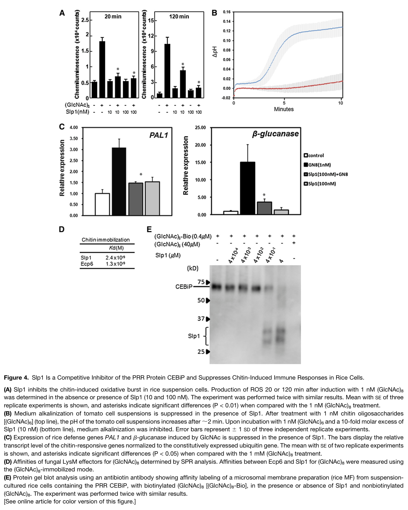

## Question

# Gene Research for Functional Annotation

## ⚠️ CRITICAL: Gene/Protein Identification Context

**BEFORE YOU BEGIN RESEARCH:** You MUST verify you are researching the CORRECT gene/protein. Gene symbols can be ambiguous, especially for less well-characterized genes from non-model organisms.

### Target Gene/Protein Identity (from UniProt):
- **UniProt Accession:** G4N906
- **Protein Description:** RecName: Full=Secreted LysM effector slp1 {ECO:0000303|PubMed:22267486}; AltName: Full=LysM domain-containing protein 1 {ECO:0000303|PubMed:22267486}; AltName: Full=Secreted LysM protein 2 {ECO:0000303|PubMed:22267486}; Flags: Precursor;
- **Gene Information:** Name=slp1 {ECO:0000303|PubMed:22267486}; ORFNames=MGG_10097;
- **Organism (full):** Pyricularia oryzae (strain 70-15 / ATCC MYA-4617 / FGSC 8958) (Rice blast fungus) (Magnaporthe oryzae).
- **Protein Family:** Belongs to the secreted LysM effector family.
- **Key Domains:** LysM. (IPR018392); LysM_dom_sf. (IPR036779); LysM (PF01476)

### MANDATORY VERIFICATION STEPS:

1. **Check if the gene symbol "slp1" matches the protein description above**
2. **Verify the organism is correct:** Pyricularia oryzae (strain 70-15 / ATCC MYA-4617 / FGSC 8958) (Rice blast fungus) (Magnaporthe oryzae).
3. **Check if protein family/domains align with what you find in literature**
4. **If you find literature for a DIFFERENT gene with the same or similar symbol, STOP**

### If Gene Symbol is Ambiguous or You Cannot Find Relevant Literature:

**DO NOT PROCEED WITH RESEARCH ON A DIFFERENT GENE.** Instead:
- State clearly: "The gene symbol 'slp1' is ambiguous or literature is limited for this specific protein"
- Explain what you found (e.g., "Found extensive literature on a different gene with the same symbol in a different organism")
- Describe the protein based ONLY on the UniProt information provided above
- Suggest that the protein function can be inferred from domain/family information

### Research Target:

Please provide a comprehensive research report on the gene **slp1** (gene ID: slp1, UniProt: G4N906) in PYRO7.

The research report should be a detailed narrative explaining the function, biological processes, and localization of the gene product. Citations should be given for all claims.

You should prioritize authoritative reviews and primary scientific literature when conducting research. You can supplement
this with annotations you find in gene/protein databases, but these can be outdated or inaccurate.

We are specifically interested in the primary function of the gene - for enzymes, what reaction is catalyzed, and what is the substrate specificity? For transporters, what is the substrate? For structural proteins or adapters, what is the broader structural role? For signaling molecules, what is the role in the pathway.

We are interested in where in or outside the cell the gene product carries out its function.

We are also interested in the signaling or biochemical pathways in which the gene functions. We are less interested in broad pleiotropic effects, except where these elucidate the precise role.

Include evidence where possible. We are interested in both experimental evidence as well as inference from structure, evolution, or bioinformatic analysis. Precise studies should be prioritized over high-throughput, where available.

## Output

Question: You are an expert researcher providing comprehensive, well-cited information.

Provide detailed information focusing on:
1. Key concepts and definitions with current understanding
2. Recent developments and latest research (prioritize 2023-2024 sources)
3. Current applications and real-world implementations
4. Expert opinions and analysis from authoritative sources
5. Relevant statistics and data from recent studies

Format as a comprehensive research report with proper citations. Include URLs and publication dates where available.
Always prioritize recent, authoritative sources and provide specific citations for all major claims.

# Gene Research for Functional Annotation

## ⚠️ CRITICAL: Gene/Protein Identification Context

**BEFORE YOU BEGIN RESEARCH:** You MUST verify you are researching the CORRECT gene/protein. Gene symbols can be ambiguous, especially for less well-characterized genes from non-model organisms.

### Target Gene/Protein Identity (from UniProt):
- **UniProt Accession:** G4N906
- **Protein Description:** RecName: Full=Secreted LysM effector slp1 {ECO:0000303|PubMed:22267486}; AltName: Full=LysM domain-containing protein 1 {ECO:0000303|PubMed:22267486}; AltName: Full=Secreted LysM protein 2 {ECO:0000303|PubMed:22267486}; Flags: Precursor;
- **Gene Information:** Name=slp1 {ECO:0000303|PubMed:22267486}; ORFNames=MGG_10097;
- **Organism (full):** Pyricularia oryzae (strain 70-15 / ATCC MYA-4617 / FGSC 8958) (Rice blast fungus) (Magnaporthe oryzae).
- **Protein Family:** Belongs to the secreted LysM effector family.
- **Key Domains:** LysM. (IPR018392); LysM_dom_sf. (IPR036779); LysM (PF01476)

### MANDATORY VERIFICATION STEPS:

1. **Check if the gene symbol "slp1" matches the protein description above**
2. **Verify the organism is correct:** Pyricularia oryzae (strain 70-15 / ATCC MYA-4617 / FGSC 8958) (Rice blast fungus) (Magnaporthe oryzae).
3. **Check if protein family/domains align with what you find in literature**
4. **If you find literature for a DIFFERENT gene with the same or similar symbol, STOP**

### If Gene Symbol is Ambiguous or You Cannot Find Relevant Literature:

**DO NOT PROCEED WITH RESEARCH ON A DIFFERENT GENE.** Instead:
- State clearly: "The gene symbol 'slp1' is ambiguous or literature is limited for this specific protein"
- Explain what you found (e.g., "Found extensive literature on a different gene with the same symbol in a different organism")
- Describe the protein based ONLY on the UniProt information provided above
- Suggest that the protein function can be inferred from domain/family information

### Research Target:

Please provide a comprehensive research report on the gene **slp1** (gene ID: slp1, UniProt: G4N906) in PYRO7.

The research report should be a detailed narrative explaining the function, biological processes, and localization of the gene product. Citations should be given for all claims.

You should prioritize authoritative reviews and primary scientific literature when conducting research. You can supplement
this with annotations you find in gene/protein databases, but these can be outdated or inaccurate.

We are specifically interested in the primary function of the gene - for enzymes, what reaction is catalyzed, and what is the substrate specificity? For transporters, what is the substrate? For structural proteins or adapters, what is the broader structural role? For signaling molecules, what is the role in the pathway.

We are interested in where in or outside the cell the gene product carries out its function.

We are also interested in the signaling or biochemical pathways in which the gene functions. We are less interested in broad pleiotropic effects, except where these elucidate the precise role.

Include evidence where possible. We are interested in both experimental evidence as well as inference from structure, evolution, or bioinformatic analysis. Precise studies should be prioritized over high-throughput, where available.

# Functional annotation report: *Pyricularia oryzae* Slp1 (UniProt G4N906)

## Identity and principal function

**Identity check.** The supplied UniProt record identifies G4N906 as **slp1 / MGG_10097** from *Pyricularia oryzae* strain 70-15, also called *Magnaporthe oryzae*, the rice blast fungus. The primary literature independently describes an *M. oryzae* protein named **Secreted LysM Protein 1 (Slp1)** with two putative LysM carbohydrate-binding domains, consistent with that identification. Importantly, the authors distinguish it from a different fungal LysM protein, **Slp2 (MGG_03468)**. The retrieved primary text does not print the G4N906–MGG_10097 accession mapping, so that exact mapping rests on the UniProt identity supplied in the question. The foundational experiments used fungal strains **Guy11** and **P131**, not a demonstrated genetic test specifically in reference strain 70-15; they support functional annotation of this named protein without establishing that every measured phenotype is identical across strains. [UniProt record](https://www.uniprot.org/uniprotkb/G4N906/entry); [Mentlak *et al.*, January 2012](https://doi.org/10.1105/tpc.111.092957); [Chen *et al.*, March 2014](https://doi.org/10.1105/tpc.114.123588). (mentlak2012effectormediatedsuppressionof pages 2-3, mentlak2012effectormediatedsuppressionof pages 4-6, chen2014nglycosylationof pages 8-9)

**Primary molecular function:** Slp1 is a **secreted, chitin-binding immune-evasion effector**, not a characterized enzyme or transporter. It captures fungal chitin-derived oligosaccharides outside the host cell, preventing their recognition by the rice cell-surface receptor **CEBiP**. Its documented role is thus **ligand sequestration upstream of chitin-triggered pattern-triggered immunity (PTI)**, enabling fungal invasive growth. The two LysM domains support a carbohydrate-binding mechanism, but the strongest assignment comes from binding, receptor-competition, host-response, and genetic experiments—not domain annotation alone. [Mentlak *et al.*, 2012](https://doi.org/10.1105/tpc.111.092957); [Zhang *et al.*, February 2024](https://doi.org/10.1186/s42483-024-00226-z). (mentlak2012effectormediatedsuppressionof pages 1-2, mentlak2012effectormediatedsuppressionof pages 8-9, zhang2024earlymolecularevents pages 5-7)

## Biochemical activity and substrate specificity

Purified Slp1 coprecipitated with **crab-shell chitin and chitin beads**, but not the tested alternatives **chitosan**, **cellulose**, or **xylan**. Surface plasmon resonance measured a dissociation constant, **Kᴅ = 2.4 × 10⁻⁹ M**, for the chitin octamer **(GlcNAc)₈**. That result establishes high-affinity binding to an immunogenic *N*-acetylglucosamine oligomer; it does **not** establish an exhaustive preference among all oligomer lengths. The original paper reported a previously determined CEBiP–chitin-oligomer Kᴅ of **2.9 × 10⁻⁸ M**, providing context for competition, although these are measurements reported from different experimental studies. [Mentlak *et al.*, 2012](https://doi.org/10.1105/tpc.111.092957). (mentlak2012effectormediatedsuppressionof pages 8-9, mentlak2012effectormediatedsuppressionof pages 6-8, mentlak2012effectormediatedsuppressionof pages 4-6, mentlak2012effectormediatedsuppressionof media 0723f9e2)

Slp1 **does not appear to function primarily as a fungal-cell-wall shield against chitinases**: unlike the comparator Avr4, purified Slp1 did not protect *Trichoderma viride* hyphae from the tested chitinase preparation, even at the highest Slp1 concentration examined. This negative result applies to that assay; it does not exclude every possible cell-wall interaction in infected rice. No catalytic reaction or transported substrate has been demonstrated for Slp1. [Mentlak *et al.*, 2012](https://doi.org/10.1105/tpc.111.092957). (mentlak2012effectormediatedsuppressionof pages 6-8, mentlak2012effectormediatedsuppressionof pages 4-6)

## Site and timing of action

Slp1 is a **162-amino-acid precursor** with a predicted **27-amino-acid N-terminal secretion signal**. In live-cell imaging of infected rice, Slp1–GFP accumulated at the **plant–fungus interface** around invasive hyphae at approximately **24–28 hours after inoculation**, and subsequently at hyphal tips entering neighboring cells. It was not observed accumulating in host-cell cytoplasm or the biotrophic interfacial complex used by host-cell-delivered effectors. Removing its signal peptide caused cytoplasmic accumulation and prevented complementation of the *slp1* deletion phenotype. Its relevant functional compartment is therefore the **narrow extracellular/apoplastic space between the invasive fungal wall and the rice-derived extra-invasive hyphal membrane**, despite the hypha itself residing within a rice cell. Imaging does not fully resolve whether all detected protein remains freely soluble or some associates with the fungal surface. [Mentlak *et al.*, 2012](https://doi.org/10.1105/tpc.111.092957). (mentlak2012effectormediatedsuppressionof pages 3-4, mentlak2012effectormediatedsuppressionof pages 2-3, mentlak2012effectormediatedsuppressionof pages 8-9, mentlak2012effectormediatedsuppressionof pages 4-6)

Recent reviews continue to classify Slp1 as an **apoplastic effector**, in contrast to cytoplasmic effectors delivered through the biotrophic interfacial complex. They describe conventional ER–Golgi trafficking as the general route for apoplastic effectors; Slp1’s signal-peptide dependence, extracellular location, and glycosylation are consistent with that classification, rather than constituting a complete Slp1-specific trafficking map. [Wei *et al.*, November 2023](https://doi.org/10.3390/biom13111650); [Dulal and Wilson, September 2024](https://doi.org/10.1094/mpmi-12-23-0212-cr). (dulal2024pathsofleast pages 2-3, wei2023recentadvancesin pages 17-19, dulal2024pathsofleast pages 4-5)

## Immune pathway and causal evidence

Rice **OsCEBiP** recognizes chitin oligosaccharides at the host plasma membrane and acts with the transmembrane kinase **OsCERK1**. A 2024 synthesis describes a receptor assembly containing two of each protein and downstream phosphorylation of **OsRLCK185**, leading to defense signaling. **Slp1 acts before receptor activation:** it binds the extracellular ligand, rather than having been shown to enzymatically modify CEBiP, inhibit OsCERK1 directly, or enter rice cells to block the downstream kinase. [Zhang *et al.*, 2024](https://doi.org/10.1186/s42483-024-00226-z); [Mentlak *et al.*, 2012](https://doi.org/10.1105/tpc.111.092957). (mentlak2012effectormediatedsuppressionof pages 2-3, zhang2024earlymolecularevents pages 5-7)

In a rice membrane assay, **0.4 µM Slp1** diverted labeled (GlcNAc)₈ from CEBiP; at **4 µM Slp1**, CEBiP labeling was almost completely blocked. In rice suspension cells, **10 nM Slp1** suppressed the reactive-oxygen-species burst elicited by **1 nM (GlcNAc)₈**, with stronger suppression at **100 nM**. Slp1 also reduced induction of the chitin-responsive rice genes **PAL1** and **β-glucanase**. These findings connect a defined biochemical interaction to specific host immune outputs. The original study’s **Figure 4** presents the oxidative-burst, binding-affinity, and receptor-competition assays together. [Mentlak *et al.*, 2012](https://doi.org/10.1105/tpc.111.092957). (mentlak2012effectormediatedsuppressionof pages 8-9, mentlak2012effectormediatedsuppressionof pages 6-8, mentlak2012effectormediatedsuppressionof media 0723f9e2)

The genetic evidence is unusually informative. In susceptible rice inoculated with Guy11, deleting *SLP1* reduced mean lesion area from **1.15 to 0.31 mm²** and mean lesion density from **40.7 to 11.1 per measured unit area**; reintroducing *SLP1* restored virulence. The mutant still produced morphologically normal conidia and appressoria, focusing the defect on successful invasion rather than failure to form the entry structure. In nonsilenced rice, wild-type Guy11 occupied a mean **8.1 host cells**, versus **3.7** for Δ*slp1*, at 48 hours after inoculation (**P < 0.01**). In **CEBiP-silenced rice**, that difference disappeared: **9.4 versus 10.2 cells**, respectively (**P = 0.322**). This host–pathogen genetic interaction strongly supports suppression of **CEBiP-dependent chitin perception** as Slp1’s principal tested virulence role; RNAi-mediated CEBiP reduction is not proof that no other Slp1 function could exist under different conditions. [Mentlak *et al.*, 2012](https://doi.org/10.1105/tpc.111.092957). (mentlak2012effectormediatedsuppressionof pages 8-9, mentlak2012effectormediatedsuppressionof pages 4-6)

## Post-translational control: why the protein binds effectively

A follow-up primary study found that **Alg3**, a fungal α-1,3-mannosyltransferase involved in *N*-glycan synthesis, is required for Slp1’s fully active glycosylated form. Four asparagine sites were initially predicted, but mutagenesis and glycosidase-sensitive immunoblots implicated **Asn-48, Asn-104, and Asn-131** as the three functionally relevant Alg3-dependent sites; **Asn-94** was a useful negative-control mutation. Mutating any of the three relevant sites impaired virulence complementation and suppression of infection-associated host ROS. Underglycosylated Slp1 still reached the plant–fungus interface, but accumulated less well and bound chitin beads poorly. Thus, glycosylation chiefly supports **Slp1 stability and chitin-binding competence**, not merely its observable destination. [Chen *et al.*, 2014](https://doi.org/10.1105/tpc.114.123588). (chen2014nglycosylationof pages 5-8, chen2014nglycosylationof pages 8-9, chen2014nglycosylationof pages 9-10)

**Alg3 is not synonymous with Slp1.** The same work identified another glycosylated effector, Bas4, and found cell-wall defects in Δ*alg3* that were not reproduced by Δ*slp1*. A subsequent comparative secretome study found **51 proteins** reduced or missing from the Δ*alg3* secretome under its screening conditions and experimentally confirmed altered glycosylation/localization for **nine** selected proteins. Accordingly, broad Δ*alg3* defects cannot all be attributed to loss of Slp1 activity. [Chen *et al.*, 2014](https://doi.org/10.1105/tpc.114.123588); [Liu *et al.*, July 2022](https://doi.org/10.1016/j.gpb.2021.02.007). (chen2014nglycosylationof pages 9-10, liu2022comparativesecretomeanalysis pages 5-8)

## Current interpretation and applications

The **2023–2024 literature primarily consolidates**, rather than replaces, the experimentally established Slp1 mechanism: a glycosylated extracellular LysM effector prevents chitin perception by the OsCEBiP–OsCERK1 defense system. Its experimentally demonstrated use is as a **research model** for fungal ligand sequestration, receptor-pathway epistasis, and glycosylation-dependent effector activity. A 2024 review proposes that identifying fungal effectors and their host targets can inform breeding of disease-resistant rice; however, the reviewed evidence does **not** establish a deployed Slp1-targeting rice cultivar, fungicide, or field-tested Slp1-specific intervention. The most defensible translational inference is that preserving or strengthening chitin recognition, or disrupting fungal effector activity, merits investigation—**not** that either strategy has already been validated in agriculture for Slp1. [Wei *et al.*, 2023](https://doi.org/10.3390/biom13111650); [Zhang *et al.*, 2024](https://doi.org/10.1186/s42483-024-00226-z); [Dulal and Wilson, 2024](https://doi.org/10.1094/mpmi-12-23-0212-cr). (zhang2024earlymolecularevents pages 5-7, dulal2024pathsofleast pages 2-3, wei2023recentadvancesin pages 17-19)

The following table separates decisive observations from their functional interpretations. (mentlak2012effectormediatedsuppressionof pages 8-9, mentlak2012effectormediatedsuppressionof pages 4-6, chen2014nglycosylationof pages 8-9, chen2014nglycosylationof pages 9-10)

| Experimental question | Direct observation (precise numeric values and units where reliable) | Interpretation/limitation | Primary source and DOI |
|---|---|---|---|
| Where is Slp1 localized during infection? | Secreted, accumulating at the plant-fungus interface at 24–28 hours after inoculation (HAI). Deletion of the 27-amino-acid signal peptide prevents secretion, causing cytoplasmic aggregation. | Slp1 acts extracellularly in the apoplast to interact with host interfaces. Observations based on live-cell imaging of tagged fusions in strain Guy11, not the reference genome strain 70-15. | Mentlak 2012, doi:10.1105/tpc.111.092957 (mentlak2012effectormediatedsuppressionof pages 3-4, mentlak2012effectormediatedsuppressionof pages 2-3) |
| What is the carbohydrate binding specificity of Slp1? | Co-precipitates with insoluble crab-shell chitin and chitin beads, but not with chitosan, cellulose, or xylan. Failed to protect *Trichoderma viride* hyphae from basic chitinases at concentrations up to 100 µM. | High specificity for chitin over other cell-wall polysaccharides. Lacks enzymatic activity and does not function to physically shield hyphae from chitinase hydrolysis. | Mentlak 2012, doi:10.1105/tpc.111.092957 (mentlak2012effectormediatedsuppressionof pages 6-8, mentlak2012effectormediatedsuppressionof pages 4-6) |
| What is Slp1's binding affinity for chitin? | Surface plasmon resonance (SPR) yielded a Kd of 2.4 nM (2.4 x 10^-9 M) for chitin octamers (GlcNAc)8. | Exhibits a high-affinity interaction with chitin oligosaccharides, stronger than the previously reported binding affinity of the rice CEBiP receptor. | Mentlak 2012, doi:10.1105/tpc.111.092957 (mentlak2012effectormediatedsuppressionof pages 8-9, mentlak2012effectormediatedsuppressionof media 0723f9e2) |
| Does Slp1 physically compete with host receptors? | In membrane assays, 0.4 µM Slp1 diverted binding of labeled (GlcNAc)8 from CEBiP. A 10-fold molar excess (4 µM) of Slp1 almost entirely blocked CEBiP labeling. | Directly sequesters chitin oligosaccharides, acting as a competitive inhibitor of the rice pattern recognition receptor CEBiP. | Mentlak 2012, doi:10.1105/tpc.111.092957 (mentlak2012effectormediatedsuppressionof pages 8-9, mentlak2012effectormediatedsuppressionof media 0723f9e2) |
| Does Slp1 suppress host immune responses (ROS)? | 10 nM and 100 nM Slp1 successfully suppressed the oxidative burst (reactive oxygen species) induced by 1 nM (GlcNAc)8 in rice suspension cells. | Effectively suppresses chitin-triggered pattern-triggered immunity (PTI) outputs in a dose-dependent manner in vitro. | Mentlak 2012, doi:10.1105/tpc.111.092957 (mentlak2012effectormediatedsuppressionof pages 6-8, mentlak2012effectormediatedsuppressionof media 0723f9e2) |
| Does Slp1 deletion impact fungal virulence? | Mean leaf lesion area for wild-type Guy11 was 1.15 mm², whereas the Δslp1 mutant produced significantly smaller lesions averaging 0.31 mm². | Slp1 is a critical virulence determinant required for full tissue invasion and lesion expansion during rice blast disease. | Mentlak 2012, doi:10.1105/tpc.111.092957 (mentlak2012effectormediatedsuppressionof pages 4-6) |
| Is Slp1's virulence function entirely dependent on CEBiP? | In wild-type rice, Guy11 occupied 8.1 cells vs Δslp1 3.7 cells. In CEBiP-RNAi rice lines, Guy11 occupied 9.4 cells vs Δslp1 10.2 cells (no significant difference). | Strict epistasis observed; the $\Delta$slp1 virulence defect is entirely rescued when the host CEBiP immune pathway is knocked down. | Mentlak 2012, doi:10.1105/tpc.111.092957 (mentlak2012effectormediatedsuppressionof pages 8-9) |
| How does N-glycosylation regulate Slp1 function? | Mutation of three specific Asn sites (N48G, N104G, N131G) abolished the fully glycosylated Slp1 form, abrogating chitin binding and stability. The N94G mutation served as a negative control and retained wild-type function. | Alg3-mediated N-glycosylation at positions 48, 104, and 131 is strictly required for effector stability and chitin-binding activity. Experiments were conducted in strain P131, not 70-15. | Chen 2014, doi:10.1105/tpc.114.123588 (chen2014nglycosylationof pages 9-10, chen2014nglycosylationof pages 8-9) |

*Table: A detailed summary of primary experimental evidence characterizing the molecular function, localization, binding kinetics, and post-translational modification of the M. oryzae Slp1 effector.*

References

1. (mentlak2012effectormediatedsuppressionof pages 2-3): Thomas A. Mentlak, Anja Kombrink, Tomonori Shinya, Lauren S. Ryder, Ippei Otomo, Hiromasa Saitoh, Ryohei Terauchi, Yoko Nishizawa, Naoto Shibuya, Bart P.H.J. Thomma, and Nicholas J. Talbot. Effector-mediated suppression of chitin-triggered immunity by <i>magnaporthe oryzae</i> is necessary for rice blast disease. The Plant Cell, 24(1):322-335, Jan 2012. URL: https://doi.org/10.1105/tpc.111.092957, doi:10.1105/tpc.111.092957. This article has 674 citations.

2. (mentlak2012effectormediatedsuppressionof pages 4-6): Thomas A. Mentlak, Anja Kombrink, Tomonori Shinya, Lauren S. Ryder, Ippei Otomo, Hiromasa Saitoh, Ryohei Terauchi, Yoko Nishizawa, Naoto Shibuya, Bart P.H.J. Thomma, and Nicholas J. Talbot. Effector-mediated suppression of chitin-triggered immunity by <i>magnaporthe oryzae</i> is necessary for rice blast disease. The Plant Cell, 24(1):322-335, Jan 2012. URL: https://doi.org/10.1105/tpc.111.092957, doi:10.1105/tpc.111.092957. This article has 674 citations.

3. (chen2014nglycosylationof pages 8-9): Xiao-Lin Chen, Tao Shi, Jun Yang, Wei Shi, Xusheng Gao, Deng Chen, Xiaowen Xu, Jin-Rong Xu, Nicholas J. Talbot, and You-Liang Peng. <i>n</i> -glycosylation of effector proteins by an α-1,3-mannosyltransferase is required for the rice blast fungus to evade host innate immunity. The Plant Cell, 26(3):1360-1376, Mar 2014. URL: https://doi.org/10.1105/tpc.114.123588, doi:10.1105/tpc.114.123588. This article has 164 citations.

4. (mentlak2012effectormediatedsuppressionof pages 1-2): Thomas A. Mentlak, Anja Kombrink, Tomonori Shinya, Lauren S. Ryder, Ippei Otomo, Hiromasa Saitoh, Ryohei Terauchi, Yoko Nishizawa, Naoto Shibuya, Bart P.H.J. Thomma, and Nicholas J. Talbot. Effector-mediated suppression of chitin-triggered immunity by <i>magnaporthe oryzae</i> is necessary for rice blast disease. The Plant Cell, 24(1):322-335, Jan 2012. URL: https://doi.org/10.1105/tpc.111.092957, doi:10.1105/tpc.111.092957. This article has 674 citations.

5. (mentlak2012effectormediatedsuppressionof pages 8-9): Thomas A. Mentlak, Anja Kombrink, Tomonori Shinya, Lauren S. Ryder, Ippei Otomo, Hiromasa Saitoh, Ryohei Terauchi, Yoko Nishizawa, Naoto Shibuya, Bart P.H.J. Thomma, and Nicholas J. Talbot. Effector-mediated suppression of chitin-triggered immunity by <i>magnaporthe oryzae</i> is necessary for rice blast disease. The Plant Cell, 24(1):322-335, Jan 2012. URL: https://doi.org/10.1105/tpc.111.092957, doi:10.1105/tpc.111.092957. This article has 674 citations.

6. (zhang2024earlymolecularevents pages 5-7): Haifeng Zhang, Jun Yang, Muxing Liu, Xiao-zhou Xu, Leiyun Yang, Xinyu Liu, You-Liang Peng, and Zhengguang Zhang. Early molecular events in the interaction between magnaporthe oryzae and rice. Phytopathology Research, 6:1-17, Feb 2024. URL: https://doi.org/10.1186/s42483-024-00226-z, doi:10.1186/s42483-024-00226-z. This article has 43 citations and is from a peer-reviewed journal.

7. (mentlak2012effectormediatedsuppressionof pages 6-8): Thomas A. Mentlak, Anja Kombrink, Tomonori Shinya, Lauren S. Ryder, Ippei Otomo, Hiromasa Saitoh, Ryohei Terauchi, Yoko Nishizawa, Naoto Shibuya, Bart P.H.J. Thomma, and Nicholas J. Talbot. Effector-mediated suppression of chitin-triggered immunity by <i>magnaporthe oryzae</i> is necessary for rice blast disease. The Plant Cell, 24(1):322-335, Jan 2012. URL: https://doi.org/10.1105/tpc.111.092957, doi:10.1105/tpc.111.092957. This article has 674 citations.

8. (mentlak2012effectormediatedsuppressionof media 0723f9e2): Thomas A. Mentlak, Anja Kombrink, Tomonori Shinya, Lauren S. Ryder, Ippei Otomo, Hiromasa Saitoh, Ryohei Terauchi, Yoko Nishizawa, Naoto Shibuya, Bart P.H.J. Thomma, and Nicholas J. Talbot. Effector-mediated suppression of chitin-triggered immunity by <i>magnaporthe oryzae</i> is necessary for rice blast disease. The Plant Cell, 24(1):322-335, Jan 2012. URL: https://doi.org/10.1105/tpc.111.092957, doi:10.1105/tpc.111.092957. This article has 674 citations.

9. (mentlak2012effectormediatedsuppressionof pages 3-4): Thomas A. Mentlak, Anja Kombrink, Tomonori Shinya, Lauren S. Ryder, Ippei Otomo, Hiromasa Saitoh, Ryohei Terauchi, Yoko Nishizawa, Naoto Shibuya, Bart P.H.J. Thomma, and Nicholas J. Talbot. Effector-mediated suppression of chitin-triggered immunity by <i>magnaporthe oryzae</i> is necessary for rice blast disease. The Plant Cell, 24(1):322-335, Jan 2012. URL: https://doi.org/10.1105/tpc.111.092957, doi:10.1105/tpc.111.092957. This article has 674 citations.

10. (dulal2024pathsofleast pages 2-3): Nawaraj Dulal and Richard A. Wilson. Paths of least resistance: unconventional effector secretion by fungal and oomycete plant pathogens. Molecular Plant-Microbe Interactions®, 37:653-661, Sep 2024. URL: https://doi.org/10.1094/mpmi-12-23-0212-cr, doi:10.1094/mpmi-12-23-0212-cr. This article has 14 citations.

11. (wei2023recentadvancesin pages 17-19): Yun-Yun Wei, Shuang Liang, Xue-Ming Zhu, Xiao-Hong Liu, and Fu-Cheng Lin. Recent advances in effector research of magnaporthe oryzae. Biomolecules, 13:1650, Nov 2023. URL: https://doi.org/10.3390/biom13111650, doi:10.3390/biom13111650. This article has 26 citations.

12. (dulal2024pathsofleast pages 4-5): Nawaraj Dulal and Richard A. Wilson. Paths of least resistance: unconventional effector secretion by fungal and oomycete plant pathogens. Molecular Plant-Microbe Interactions®, 37:653-661, Sep 2024. URL: https://doi.org/10.1094/mpmi-12-23-0212-cr, doi:10.1094/mpmi-12-23-0212-cr. This article has 14 citations.

13. (chen2014nglycosylationof pages 5-8): Xiao-Lin Chen, Tao Shi, Jun Yang, Wei Shi, Xusheng Gao, Deng Chen, Xiaowen Xu, Jin-Rong Xu, Nicholas J. Talbot, and You-Liang Peng. <i>n</i> -glycosylation of effector proteins by an α-1,3-mannosyltransferase is required for the rice blast fungus to evade host innate immunity. The Plant Cell, 26(3):1360-1376, Mar 2014. URL: https://doi.org/10.1105/tpc.114.123588, doi:10.1105/tpc.114.123588. This article has 164 citations.

14. (chen2014nglycosylationof pages 9-10): Xiao-Lin Chen, Tao Shi, Jun Yang, Wei Shi, Xusheng Gao, Deng Chen, Xiaowen Xu, Jin-Rong Xu, Nicholas J. Talbot, and You-Liang Peng. <i>n</i> -glycosylation of effector proteins by an α-1,3-mannosyltransferase is required for the rice blast fungus to evade host innate immunity. The Plant Cell, 26(3):1360-1376, Mar 2014. URL: https://doi.org/10.1105/tpc.114.123588, doi:10.1105/tpc.114.123588. This article has 164 citations.

15. (liu2022comparativesecretomeanalysis pages 5-8): Ning Liu, Linlu Qi, Manna Huang, Deng Chen, Changfa Yin, Yiying Zhang, Xingbin Wang, Guixin Yuan, Rui-Jin Wang, Jun Yang, You-Liang Peng, and Xunli Lu. Comparative secretome analysis of <i>magnaporthe oryzae</i> identified proteins involved in virulence and cell wall integrity. Genomics, Proteomics &amp; Bioinformatics, 20:728-746, Jul 2022. URL: https://doi.org/10.1016/j.gpb.2021.02.007, doi:10.1016/j.gpb.2021.02.007. This article has 20 citations and is from a peer-reviewed journal.

## Artifacts

- [Edison artifact artifact-00](slp1-deep-research-falcon_artifacts/artifact-00.md)

## Citations

1. mentlak2012effectormediatedsuppressionof pages 4-6
2. mentlak2012effectormediatedsuppressionof pages 8-9
3. mentlak2012effectormediatedsuppressionof pages 2-3
4. chen2014nglycosylationof pages 8-9
5. mentlak2012effectormediatedsuppressionof pages 1-2
6. zhang2024earlymolecularevents pages 5-7
7. mentlak2012effectormediatedsuppressionof pages 6-8
8. mentlak2012effectormediatedsuppressionof pages 3-4
9. dulal2024pathsofleast pages 2-3
10. wei2023recentadvancesin pages 17-19
11. dulal2024pathsofleast pages 4-5
12. chen2014nglycosylationof pages 5-8
13. chen2014nglycosylationof pages 9-10
14. liu2022comparativesecretomeanalysis pages 5-8
15. UniProt record
16. Mentlak *et al.*, January 2012
17. Chen *et al.*, March 2014
18. Mentlak *et al.*, 2012
19. Zhang *et al.*, February 2024
20. Wei *et al.*, November 2023
21. Dulal and Wilson, September 2024
22. Zhang *et al.*, 2024
23. Chen *et al.*, 2014
24. Liu *et al.*, July 2022
25. Wei *et al.*, 2023
26. Dulal and Wilson, 2024
27. https://www.uniprot.org/uniprotkb/G4N906/entry
28. https://doi.org/10.1105/tpc.111.092957
29. https://doi.org/10.1105/tpc.114.123588
30. https://doi.org/10.1186/s42483-024-00226-z
31. https://doi.org/10.3390/biom13111650
32. https://doi.org/10.1094/mpmi-12-23-0212-cr
33. https://doi.org/10.1016/j.gpb.2021.02.007
34. https://doi.org/10.1105/tpc.111.092957,
35. https://doi.org/10.1105/tpc.114.123588,
36. https://doi.org/10.1186/s42483-024-00226-z,
37. https://doi.org/10.1094/mpmi-12-23-0212-cr,
38. https://doi.org/10.3390/biom13111650,
39. https://doi.org/10.1016/j.gpb.2021.02.007,