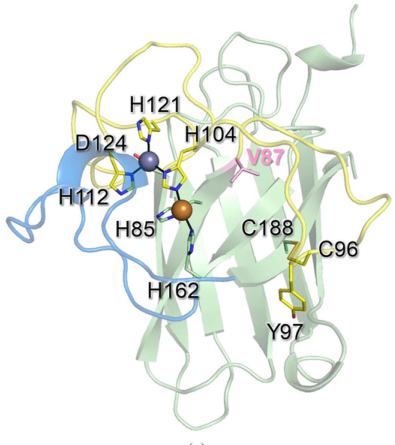

## Question

# Gene Research for Functional Annotation

## ⚠️ CRITICAL: Gene/Protein Identification Context

**BEFORE YOU BEGIN RESEARCH:** You MUST verify you are researching the CORRECT gene/protein. Gene symbols can be ambiguous, especially for less well-characterized genes from non-model organisms.

### Target Gene/Protein Identity (from UniProt):
- **UniProt Accession:** A0A1D1UDY8
- **Protein Description:** RecName: Full=Superoxide dismutase [Cu-Zn] {ECO:0000256|RuleBase:RU000393}; EC=1.15.1.1 {ECO:0000256|RuleBase:RU000393};
- **Gene Information:** Name=RvY_00650-1 {ECO:0000313|EMBL:GAU87856.1}; Synonyms=RvY_00650.1 {ECO:0000313|EMBL:GAU87856.1}; ORFNames=RvY_00650 {ECO:0000313|EMBL:GAU87856.1};
- **Organism (full):** Ramazzottius varieornatus (Water bear) (Tardigrade).
- **Protein Family:** Belongs to the Cu-Zn superoxide dismutase family.
- **Key Domains:** SOD-like_Cu/Zn_dom_sf. (IPR036423); SOD_Cu/Zn_/chaperone. (IPR024134); SOD_Cu/Zn_BS. (IPR018152); SOD_Cu_Zn_dom. (IPR001424); Sod_Cu (PF00080)

### MANDATORY VERIFICATION STEPS:

1. **Check if the gene symbol "RvY_00650-1" matches the protein description above**
2. **Verify the organism is correct:** Ramazzottius varieornatus (Water bear) (Tardigrade).
3. **Check if protein family/domains align with what you find in literature**
4. **If you find literature for a DIFFERENT gene with the same or similar symbol, STOP**

### If Gene Symbol is Ambiguous or You Cannot Find Relevant Literature:

**DO NOT PROCEED WITH RESEARCH ON A DIFFERENT GENE.** Instead:
- State clearly: "The gene symbol 'RvY_00650-1' is ambiguous or literature is limited for this specific protein"
- Explain what you found (e.g., "Found extensive literature on a different gene with the same symbol in a different organism")
- Describe the protein based ONLY on the UniProt information provided above
- Suggest that the protein function can be inferred from domain/family information

### Research Target:

Please provide a comprehensive research report on the gene **RvY_00650-1** (gene ID: RvY_00650, UniProt: A0A1D1UDY8) in RAMVA.

The research report should be a detailed narrative explaining the function, biological processes, and localization of the gene product. Citations should be given for all claims.

You should prioritize authoritative reviews and primary scientific literature when conducting research. You can supplement
this with annotations you find in gene/protein databases, but these can be outdated or inaccurate.

We are specifically interested in the primary function of the gene - for enzymes, what reaction is catalyzed, and what is the substrate specificity? For transporters, what is the substrate? For structural proteins or adapters, what is the broader structural role? For signaling molecules, what is the role in the pathway.

We are interested in where in or outside the cell the gene product carries out its function.

We are also interested in the signaling or biochemical pathways in which the gene functions. We are less interested in broad pleiotropic effects, except where these elucidate the precise role.

Include evidence where possible. We are interested in both experimental evidence as well as inference from structure, evolution, or bioinformatic analysis. Precise studies should be prioritized over high-throughput, where available.

## Output

Question: You are an expert researcher providing comprehensive, well-cited information.

Provide detailed information focusing on:
1. Key concepts and definitions with current understanding
2. Recent developments and latest research (prioritize 2023-2024 sources)
3. Current applications and real-world implementations
4. Expert opinions and analysis from authoritative sources
5. Relevant statistics and data from recent studies

Format as a comprehensive research report with proper citations. Include URLs and publication dates where available.
Always prioritize recent, authoritative sources and provide specific citations for all major claims.

# Gene Research for Functional Annotation

## ⚠️ CRITICAL: Gene/Protein Identification Context

**BEFORE YOU BEGIN RESEARCH:** You MUST verify you are researching the CORRECT gene/protein. Gene symbols can be ambiguous, especially for less well-characterized genes from non-model organisms.

### Target Gene/Protein Identity (from UniProt):
- **UniProt Accession:** A0A1D1UDY8
- **Protein Description:** RecName: Full=Superoxide dismutase [Cu-Zn] {ECO:0000256|RuleBase:RU000393}; EC=1.15.1.1 {ECO:0000256|RuleBase:RU000393};
- **Gene Information:** Name=RvY_00650-1 {ECO:0000313|EMBL:GAU87856.1}; Synonyms=RvY_00650.1 {ECO:0000313|EMBL:GAU87856.1}; ORFNames=RvY_00650 {ECO:0000313|EMBL:GAU87856.1};
- **Organism (full):** Ramazzottius varieornatus (Water bear) (Tardigrade).
- **Protein Family:** Belongs to the Cu-Zn superoxide dismutase family.
- **Key Domains:** SOD-like_Cu/Zn_dom_sf. (IPR036423); SOD_Cu/Zn_/chaperone. (IPR024134); SOD_Cu/Zn_BS. (IPR018152); SOD_Cu_Zn_dom. (IPR001424); Sod_Cu (PF00080)

### MANDATORY VERIFICATION STEPS:

1. **Check if the gene symbol "RvY_00650-1" matches the protein description above**
2. **Verify the organism is correct:** Ramazzottius varieornatus (Water bear) (Tardigrade).
3. **Check if protein family/domains align with what you find in literature**
4. **If you find literature for a DIFFERENT gene with the same or similar symbol, STOP**

### If Gene Symbol is Ambiguous or You Cannot Find Relevant Literature:

**DO NOT PROCEED WITH RESEARCH ON A DIFFERENT GENE.** Instead:
- State clearly: "The gene symbol 'RvY_00650-1' is ambiguous or literature is limited for this specific protein"
- Explain what you found (e.g., "Found extensive literature on a different gene with the same symbol in a different organism")
- Describe the protein based ONLY on the UniProt information provided above
- Suggest that the protein function can be inferred from domain/family information

### Research Target:

Please provide a comprehensive research report on the gene **RvY_00650-1** (gene ID: RvY_00650, UniProt: A0A1D1UDY8) in RAMVA.

The research report should be a detailed narrative explaining the function, biological processes, and localization of the gene product. Citations should be given for all claims.

You should prioritize authoritative reviews and primary scientific literature when conducting research. You can supplement
this with annotations you find in gene/protein databases, but these can be outdated or inaccurate.

We are specifically interested in the primary function of the gene - for enzymes, what reaction is catalyzed, and what is the substrate specificity? For transporters, what is the substrate? For structural proteins or adapters, what is the broader structural role? For signaling molecules, what is the role in the pathway.

We are interested in where in or outside the cell the gene product carries out its function.

We are also interested in the signaling or biochemical pathways in which the gene functions. We are less interested in broad pleiotropic effects, except where these elucidate the precise role.

Include evidence where possible. We are interested in both experimental evidence as well as inference from structure, evolution, or bioinformatic analysis. Precise studies should be prioritized over high-throughput, where available.

# Comprehensive research report: Functional annotation of **RvY_00650-1** (UniProt **A0A1D1UDY8**) in *Ramazzottius varieornatus*

## Executive summary (identity-verified scope)
**Target identity (verified)**: The UniProt accession **A0A1D1UDY8** is annotated as **superoxide dismutase [Cu–Zn]** (Cu/Zn SOD; **EC 1.15.1.1**) from the tardigrade *Ramazzottius varieornatus* (water bear), gene **RvY_00650-1 / RvY_00650** (user-provided UniProt context). The Cu/Zn SOD family assignment is consistent with recent *R. varieornatus* literature on Cu/Zn SOD paralogs. However, **the retrieved primary literature does not explicitly mention the specific gene ID RvY_00650-1/RvY_00650 or UniProt A0A1D1UDY8**, so conclusions about this exact protein are **primarily inferred from Cu/Zn SOD family/domain knowledge** plus **direct evidence from closely related *R. varieornatus* Cu/Zn SOD paralogs** (notably **RvSOD15**) and a 2024 tardigrade antioxidant-defense review. (sim2023structureofa pages 3-4, sadowskabartosz2024antioxidantdefensein pages 23-24)

## 1) Key concepts and definitions (current understanding)

### 1.1 What Cu/Zn superoxide dismutase does (primary function)
**Superoxide dismutases (SODs)** catalyze the **dismutation (disproportionation)** of the superoxide radical anion (**O2•−**) into **hydrogen peroxide (H2O2)** and **molecular oxygen (O2)**; thus the core substrate is **superoxide**. (zheng2023theapplicationsand pages 1-2)

A quantitative framing from a recent high-citation review: spontaneous (non-enzymatic) disproportionation proceeds at about **2 × 10^5 M−1 s−1** at physiological pH, and enzymatic catalysis increases this rate by about **10,000-fold**, reflecting an effectively diffusion-limited antioxidant enzyme. (zheng2023theapplicationsand pages 1-2)

### 1.2 Cofactors and substrate guidance (Cu catalytic; Zn structural)
Cu/Zn SODs are **metalloenzymes** whose activity depends on metal cofactors. In the canonical intracellular Cu/Zn SOD (SOD1), **copper is the catalytic metal** required for activity, while **zinc primarily stabilizes structure** and is not itself catalytic. (zheng2023theapplicationsand pages 2-4)

Cu/Zn SODs also feature a conserved **electrostatic guidance region (“electrostatic loop”)** enriched in positively charged residues that steer O2•− into the active-site channel, which helps explain the near diffusion-limited kinetics. (zheng2023theapplicationsand pages 1-2)

### 1.3 Cu/Zn SOD isoforms and typical localization
General isoform framework:
* **SOD1 (Cu/Zn)**: the main intracellular Cu/Zn SOD; described as distributed in the **cytoplasm, nucleus, and cell membrane**, and existing as a **~32 kDa homodimer**. (zheng2023theapplicationsand pages 2-4)
* **SOD3 / ecSOD (Cu/Zn)**: secreted/extracellular Cu/Zn SOD; described as a **~135 kDa homotetramer** distributed in extracellular fluids/tissues, with secretion/ECM association mediated by features such as a signal peptide and positively charged regions enabling binding to extracellular matrix/proteoglycans. (zheng2023theapplicationsand pages 4-5, zheng2023theapplicationsand pages 2-4)

**Implication for A0A1D1UDY8/RvY_00650-1**: without direct experimental localization data for this exact accession in the retrieved literature, the most defensible statement is that it encodes a Cu/Zn SOD-family enzyme likely operating in **intracellular or extracellular redox defense**, and any more specific localization (cytosolic vs secreted) requires **sequence-based targeting prediction or direct proteomics/localization experiments**.

## 2) Recent developments and latest research (prioritizing 2023–2024)

### 2.1 2023: Structure of a *Ramazzottius varieornatus* Cu/Zn SOD paralog reveals unusual active-site chemistry
A key 2023 primary study solved crystal structures of a tardigrade Cu/Zn SOD paralog named **RvSOD15** from *R. varieornatus* strain YOKOZUNA-1 (GenBank **GAV02514.1**; PDB **7ypp** wild type and **7ypr** V87H mutant). (sim2023structureofa pages 1-2, sim2023structureofa pages 3-4)

Key findings relevant to functional annotation in *R. varieornatus*:
* **Signal peptide / secretion**: RvSOD15 is predicted to have an **N-terminal signal peptide**, suggesting a **secreted** Cu/Zn SOD in this species. (sim2023structureofa pages 2-3)
* **Active-site divergence**: one of the histidine ligands at the catalytic copper center is naturally replaced by **Val87**. (sim2023structureofa pages 1-2, sim2023structureofa pages 3-4)
* **High-resolution structures**: wild type solved at **2.20 Å** and V87H mutant at **2.10 Å**, with anomalous scattering confirming Cu and Zn at the metal sites. (sim2023structureofa pages 3-4)
* **Metal-site geometry**: the copper site in RvSOD15 is unusual (only **three histidines** in a T-shaped geometry, plus water ligands), with observed Cu–water interaction distances **2.6–3.4 Å** (longer than typical CuZnSOD ranges). (sim2023structureofa pages 4-7)
* **Functional interpretation**: structural comparisons and modeling suggested that some *R. varieornatus* Cu/Zn SOD paralogs may have **very low** or **lost** canonical SOD activity, and might instead have residual scavenging (“better than nothing”) or **unknown evolved functions**. (sim2023structureofa pages 7-9, sim2023structureofa pages 9-10)

These observations are important because they show that, in *R. varieornatus*, **not all Cu/Zn SOD-like proteins are necessarily canonical, high-activity SOD enzymes**, which is a critical caveat for annotating any specific paralog (including RvY_00650-1) without direct biochemical testing. (sim2023structureofa pages 7-9, sadowskabartosz2024antioxidantdefensein pages 15-16)

**Figure evidence (structure and Val87 substitution)**: the extracted figures show the RvSOD15 monomer, the copper/zinc sites, and a sequence alignment highlighting the Val87 position relative to conserved eukaryotic SODs. (sim2023structureofa media fb42da98, sim2023structureofa media 47b97881, sim2023structureofa media 045f3ce5)

### 2.2 2024: Antioxidant defense review synthesizes tardigrade SOD gene expansion and stress biology
A 2024 review focused on tardigrade antioxidant defense reports that *R. varieornatus* encodes a large repertoire of antioxidant genes, including **17 SOD genes** (noting that typical metazoans have fewer), and contextualizes Cu/Zn SODs within broader dehydration/radiation stress tolerance. (sadowskabartosz2024antioxidantdefensein pages 15-16)

The review highlights that structural modeling of *R. varieornatus* SOD paralogs found unusual features (e.g., changes to the electrostatic loop or metal-binding residues) and supports the idea that **gene-family expansion alone does not explain stress tolerance**, because some duplicates may have reduced enzymatic function or novel roles. (sadowskabartosz2024antioxidantdefensein pages 15-16)

## 3) Functional annotation of **RvY_00650-1 (A0A1D1UDY8)**: function, processes, localization, pathways

### 3.1 Enzymatic function and substrate specificity (inference strength)
**Most likely molecular function**: Cu/Zn SOD family enzyme catalyzing superoxide dismutation (superoxide as primary substrate). This is the canonical function of Cu/Zn SODs and matches the UniProt description (user-provided) and general enzyme mechanism. (zheng2023theapplicationsand pages 1-2)

**Caveat for *R. varieornatus***: direct *R. varieornatus* evidence shows that at least one Cu/Zn SOD paralog (RvSOD15) has an atypical copper site and is hypothesized to have reduced or lost canonical SOD activity. Therefore, for **RvY_00650-1**, without direct assay data, the most defensible annotation is **“Cu/Zn SOD-like protein; likely antioxidant superoxide dismutase activity, but paralog-specific divergence in *R. varieornatus* makes activity uncertain.”** (sim2023structureofa pages 7-9, sim2023structureofa pages 4-7, sadowskabartosz2024antioxidantdefensein pages 15-16)

### 3.2 Structural features and domains (family-consistent; paralog caveats)
The retrieved *R. varieornatus* structure work demonstrates that a tardigrade Cu/Zn SOD paralog can retain the canonical CuZnSOD fold and dimeric assembly while harboring meaningful active-site divergences that plausibly alter catalysis. (sim2023structureofa pages 3-4, sim2023structureofa pages 4-7)

For annotation purposes, this supports:
* **CuZnSOD-like fold** and likely requirement for **Cu/Zn binding motifs** typical of the family.
* Need to evaluate whether **metal-binding residues** and the **electrostatic loop** are conserved in the specific RvY_00650-1 sequence to assess the likelihood of high SOD activity.

### 3.3 Subcellular localization (expected vs organism-specific evidence)
General Cu/Zn SOD biology differentiates between intracellular SOD1 and secreted SOD3/ecSOD. (zheng2023theapplicationsand pages 2-4, zheng2023theapplicationsand pages 4-5)

Organism-specific evidence: the structurally characterized *R. varieornatus* paralog **RvSOD15** is predicted to have an **N-terminal signal peptide**, supporting a **secreted/extracellular** localization for that paralog. (sim2023structureofa pages 2-3)

**For A0A1D1UDY8/RvY_00650-1**: no direct localization evidence for this exact protein was identified in the retrieved sources. Therefore, localization should be treated as **unknown** until supported by (i) presence/absence of a signal peptide or organelle targeting sequence in A0A1D1UDY8, or (ii) experimental proteomics/imaging evidence.

### 3.4 Biological processes and pathways in tardigrade stress tolerance
Recent synthesis of tardigrade stress biology places antioxidant enzymes (including SODs) in a broader oxidative-stress framework linked to cryptobiosis:

**Preparation for oxidative stress (POS)**: antioxidant defenses can be induced during dehydration/anhydrobiosis to mitigate oxidative bursts during rehydration. This concept is discussed explicitly for tardigrades. (sadowskabartosz2024antioxidantdefensein pages 16-17, sadowskabartosz2024antioxidantdefensein pages 23-24)

**ROS as signals for tun formation**: ROS are not purely damaging; they can act as signaling molecules required for entry into cryptobiosis. For example, H2O2 at **0.75–5 mM** can induce tun formation in *Hypsibius exemplaris* via cysteine thiol oxidation; blocking thiols or preventing H2O2-induced oxidation prevents tun formation. This supports a model where controlled oxidative signaling is part of the entry program. (sadowskabartosz2024antioxidantdefensein pages 12-13, sadowskabartosz2024antioxidantdefensein pages 13-15)

**Gene-family expansion context**: *R. varieornatus* is reported to have expanded antioxidant gene families (e.g., **17 SOD genes**, plus expansions in other antioxidant systems), suggesting a diversified ROS-management repertoire; however, paralog divergence can include loss or modification of canonical enzyme activity. (sadowskabartosz2024antioxidantdefensein pages 15-16)

**Interaction with broader redox network**: The antioxidant system includes glutathione cycling enzymes, GSTs, peroxiredoxins/thioredoxins, catalases, and novel peroxidases; these likely work in concert to protect proteins and support DNA-repair competence after stress. (sadowskabartosz2024antioxidantdefensein pages 13-15, sadowskabartosz2024antioxidantdefensein pages 15-16)

**Quantitative stress phenotypes linked to oxidative damage**: the review reports examples such as **>5-fold higher lipid peroxidation** in desiccated *Paramacrobiotus richtersi* and ROS increases during rehydration proportional to desiccation duration, illustrating why superoxide/H2O2 detox pathways (including SOD→peroxidase/catalase) are expected to be important. (sadowskabartosz2024antioxidantdefensein pages 12-13, sadowskabartosz2024antioxidantdefensein pages 16-17)

## 4) Current applications and real-world implementations (SOD-centric; relevance to tardigrade biology)
While there is no direct evidence in the retrieved set for **commercial/clinical deployment of tardigrade-derived Cu/Zn SODs**, there are extensive real-world implementations of SODs and engineered SOD formulations.

From a 2023 applications review:
* **Food/fermentation**: a *Lactobacillus plantarum* strain produced SOD at **2476.21 ± 1.52 U g−1**, and increased fermented yogurt SOD concentration to **19.827 ± 0.323 U mL−1**. (zheng2023theapplicationsand pages 12-14)
* **Dermatology/photoprotection delivery**: topical **TAT–SOD** increased the **minimum erythema dose by 36.6 ± 18.4%** and reduced apoptotic sunburn cells by **47.6 ± 8.6%**, illustrating one mode of SOD protein delivery and measured benefit in UVB-induced skin injury contexts. (zheng2023theapplicationsand pages 14-15)
* **Stability/half-life engineering**: PEGylation approaches can retain **90–100% of native SOD activity** while improving pharmacokinetics/stability (reported for very high MW PEG 41,000–72,000 Da in cited work). (zheng2023theapplicationsand pages 14-15)

**Relevance to tardigrade SOD annotation**: tardigrade biology emphasizes ROS management during desiccation/rehydration; structural divergence among *R. varieornatus* SOD paralogs suggests a potential reservoir for engineering antioxidant proteins with altered stability/function, but this remains speculative without direct characterization of A0A1D1UDY8. (sadowskabartosz2024antioxidantdefensein pages 15-16, sim2023structureofa pages 9-10)

## 5) Expert opinions and analysis (authoritative interpretations from sources)

### 5.1 “Expanded SOD gene sets” do not guarantee expanded SOD enzymatic capacity
The 2023 structural paper argues that some *R. varieornatus* Cu/Zn SOD paralogs have unusual metal-binding residues or structural deletions, and proposes that some may have **very low or absent canonical SOD activity** and might have **other roles** yet to be discovered. (sim2023structureofa pages 7-9, sim2023structureofa pages 9-10)

The 2024 review echoes this view: R. varieornatus contains numerous SOD genes (17 reported), but structural deviations such as in RvSOD15 support the interpretation that **duplication alone is not a sufficient explanation** for extreme stress tolerance. (sadowskabartosz2024antioxidantdefensein pages 15-16)

### 5.2 ROS are both threat and signal in cryptobiosis
The 2024 review emphasizes that ROS can function as signaling molecules for tun formation and that excessive antioxidant pretreatment can reduce survival in some stress paradigms, consistent with the concept that **controlled oxidation** is part of the cryptobiosis program (“preparation for oxidative stress” and cysteine oxidation signaling). (sadowskabartosz2024antioxidantdefensein pages 13-15, sadowskabartosz2024antioxidantdefensein pages 12-13)

## 6) Relevant statistics and data points (recent sources)

### 6.1 *R. varieornatus* SOD gene repertoire and structural data
* **17 SOD genes** reported for *R. varieornatus* in a recent synthesis. (sadowskabartosz2024antioxidantdefensein pages 15-16)
* RvSOD15 structures solved at **2.20 Å** and **2.10 Å**; anomalous scattering confirmed Cu/Zn at metal sites. (sim2023structureofa pages 3-4)
* Copper-site water ligand distances **2.6–3.4 Å** and modeling metrics (e.g., pLDDT values for multiple RvSODs) reported, supporting unusual coordination geometry and paralog diversity. (sim2023structureofa pages 7-9, sim2023structureofa pages 4-7)

### 6.2 Kinetic/statistical data for general SOD biology and real-world use
* Nonenzymatic disproportionation rate **~2 × 10^5 M−1 s−1**; enzymatic catalysis increases rate by **~10,000-fold**. (zheng2023theapplicationsand pages 1-2)
* Fermentation/food enrichment: **2476.21 ± 1.52 U g−1** SOD production; **19.827 ± 0.323 U mL−1** yogurt SOD concentration. (zheng2023theapplicationsand pages 12-14)
* Dermatologic photoprotection: **36.6 ± 18.4%** increase in minimum erythema dose; **47.6 ± 8.6%** reduction in sunburn cells with TAT–SOD. (zheng2023theapplicationsand pages 14-15)

## Consolidated evidence table
| Topic | Summary | Evidence type | Key sources |
|---|---|---|---|
| Functional annotation summary for RvY_00650-1 (A0A1D1UDY8): Gene/protein identifiers and organism | Target protein is UniProt A0A1D1UDY8, annotated as **superoxide dismutase [Cu-Zn]** (EC 1.15.1.1), gene **RvY_00650-1 / RvY_00650**, from **Ramazzottius varieornatus** (tardigrade). In the retrieved literature, this exact accession/gene ID was **not directly discussed**; published structural work instead focused on other R. varieornatus Cu/Zn SODs such as **RvSOD15 (GenBank GAV02514.1)** and additional RvSOD family members. | Direct for A0A1D1UDY8 (identifier from user/UniProt context) + Direct for R. varieornatus SOD | (sim2023structureofa pages 2-3, sim2023structureofa pages 3-4, sadowskabartosz2024antioxidantdefensein pages 23-24) |
| Protein family/domains | UniProt/domain context places A0A1D1UDY8 in the **Cu/Zn superoxide dismutase family** with **SOD-like_Cu/Zn_dom_sf, SOD_Cu/Zn_/chaperone, SOD_Cu/Zn_BS, SOD_Cu_Zn_dom, PF00080**. This matches the broader CuZnSOD fold described for tardigrade **RvSOD15**, which adopts a canonical CuZnSOD monomer architecture despite unusual active-site features. | Direct for A0A1D1UDY8 (family/domain assignment) + Direct for R. varieornatus SOD | (sim2023structureofa pages 3-4, sim2023structureofa pages 1-2) |
| Enzymatic reaction and substrate | Canonical Cu/Zn SODs catalyze **dismutation of superoxide radical**: **2 O2•− + 2 H+ -> H2O2 + O2**. Substrate specificity is principally **superoxide anion (O2•−)**. The spontaneous nonenzymatic rate is about **2 × 10^5 M−1 s−1** at physiological pH, and SOD catalysis accelerates this by about **10,000-fold**. For A0A1D1UDY8, this function is **inferred from family membership**, not directly demonstrated in the retrieved Ramazzottius paper set. | General CuZnSOD; inferred for A0A1D1UDY8 | (zheng2023theapplicationsand pages 2-4, zheng2023theapplicationsand pages 1-2) |
| Cofactors and active-site residues | Canonical CuZnSOD requires **catalytic Cu** for redox chemistry and **Zn** mainly for structural stabilization; Cu generally cannot be replaced, whereas Zn can sometimes be substituted experimentally. Superoxide is guided into the active site by a conserved **electrostatic loop** with positively charged residues. In R. varieornatus, several Cu/Zn SOD paralogs show **unusual substitutions/deletions**: e.g., **RvSOD15** carries **Val87** in place of a canonical Cu-ligating histidine, and some RvSODs show deletion of the electrostatic loop or β3 sheet and atypical metal-binding residues, suggesting reduced or lost canonical SOD activity in some paralogs. | Direct for R. varieornatus SOD + General CuZnSOD | (sim2023structureofa pages 7-9, sim2023structureofa pages 4-7, sadowskabartosz2024antioxidantdefensein pages 15-16, zheng2023theapplicationsand pages 4-5, zheng2023theapplicationsand pages 1-2) |
| Oligomeric state | Typical intracellular **SOD1/CuZnSOD** is a **~32 kDa homodimer**. Extracellular **SOD3** is typically a **~135 kDa homotetramer**. Structurally characterized tardigrade **RvSOD15** forms the **canonical CuZnSOD monomer fold** and assembled as typical **dimers** in the crystal. | Direct for R. varieornatus SOD + General CuZnSOD | (sim2023structureofa pages 3-4, zheng2023theapplicationsand pages 2-4) |
| Subcellular localization | In general, **SOD1** is mainly intracellular and distributed in the **cytoplasm, nucleus, and cell membrane**, whereas **SOD3/ecSOD** is **secreted/extracellular**, carrying a signal peptide and ECM/proteoglycan-binding features. For tardigrades, **RvSOD15** is specifically reported to have an **N-terminal signal peptide**, supporting a **secreted/extracellular localization**. For **A0A1D1UDY8/RvY_00650-1**, no direct localization evidence was found in the retrieved literature; localization remains an inference from family/domain annotation unless sequence-level targeting features are independently verified. | Direct for R. varieornatus SOD + General CuZnSOD | (sim2023structureofa pages 2-3, sim2023structureofa pages 3-4, zheng2023theapplicationsand pages 4-5, zheng2023theapplicationsand pages 2-4) |
| Evidence availability for the specific target | **Literature is limited for the specific protein A0A1D1UDY8 / RvY_00650-1.** The retrieved papers do **not mention RvY_00650 or UniProt A0A1D1UDY8** directly. There is, however, direct literature on **other R. varieornatus Cu/Zn SODs**, especially **RvSOD15**, plus review-level evidence that R. varieornatus has an expanded SOD repertoire (reported as **17 SOD genes**). Therefore, functional annotation of A0A1D1UDY8 must rely heavily on **family/domain inference** plus **organism-level paralog evidence**, while carefully avoiding overclaiming direct experimental support for this exact protein. | Direct for R. varieornatus SOD; limited direct evidence for A0A1D1UDY8 | (sim2023structureofa pages 3-4, sadowskabartosz2024antioxidantdefensein pages 15-16, sim2023structureofa pages 9-10, sadowskabartosz2024antioxidantdefensein pages 23-24) |
| Key quantitative data points | For tardigrade **RvSOD15**, crystal structures were solved at **2.20 Å** (wild type) and **2.10 Å** (V87H mutant), with **Rwork/Rfree ~19.3/23.2** and **~17.2/21.4**, respectively; AlphaFold/model comparisons included **pLDDT ~86.99** for RvSOD15, **77.15** for RvSOD12, **92.19** for RvSOD16 v1; Cu-associated water distances were **2.6–3.4 Å**; by analogy to a related mutant, activity may be around **10^-4 of canonical CuZnSODs** for RvSOD15-like active-site geometry. General CuZnSOD kinetics/applications reported: spontaneous superoxide disproportionation **~2 × 10^5 M−1 s−1**, enzyme acceleration **~10,000-fold**; food/biotech examples include **2476.21 ± 1.52 U g−1** SOD production by Lactobacillus plantarum, **19.827 ± 0.323 U mL−1** SOD in yogurt, and topical TAT-SOD causing **36.6 ± 18.4%** increase in minimum erythema dose and **47.6 ± 8.6%** reduction in sunburn cells. | Direct for R. varieornatus SOD + General CuZnSOD | (sim2023structureofa pages 7-9, sim2023structureofa pages 4-7, sim2023structureofa pages 3-4, zheng2023theapplicationsand pages 1-2, zheng2023theapplicationsand pages 12-14, zheng2023theapplicationsand pages 14-15) |

*Table: This table summarizes what can be stated directly versus inferred for Ramazzottius varieornatus gene RvY_00650-1 (UniProt A0A1D1UDY8), integrating direct tardigrade SOD evidence with general Cu/Zn SOD biology. It is useful for distinguishing target-specific support from paralog- and family-based annotation.*

## Evidence gaps specific to **A0A1D1UDY8 / RvY_00650-1** (what cannot be concluded from retrieved sources)
1. **No direct publication linkage** to A0A1D1UDY8 or the gene ID RvY_00650-1 was retrieved; therefore **sequence-specific claims** (e.g., active-site histidines, signal peptide presence, precise localization) cannot be cited from the retrieved literature set. (sim2023structureofa pages 3-4, sadowskabartosz2024antioxidantdefensein pages 23-24)
2. **No biochemical assay data** (kcat/KM, activity units, inhibitor sensitivity, metal-binding stoichiometry) were retrieved for A0A1D1UDY8. The structural paper notes “low activity” for an engineered mutant in RvSOD15 context but does not provide full kinetic values in the extracted passages. (sim2023structureofa pages 4-7)

## Most defensible functional-annotation statement (target-specific)
**RvY_00650-1 (UniProt A0A1D1UDY8)** should be annotated as a **Cu/Zn superoxide dismutase-family protein (EC 1.15.1.1)** that most likely participates in **ROS management via superoxide dismutation** in *R. varieornatus*, with biological relevance to oxidative stress during **dehydration/anhydrobiosis and rehydration**. However, given direct evidence that some *R. varieornatus* Cu/Zn SOD paralogs show unusual active-site substitutions and may have reduced/lost canonical activity, the **confidence in enzymatic activity for this specific paralog remains provisional** until sequence conservation and/or direct assays confirm canonical Cu/Zn SOD catalysis. (zheng2023theapplicationsand pages 1-2, sadowskabartosz2024antioxidantdefensein pages 15-16, sim2023structureofa pages 7-9)

## Key recent sources (URLs and publication dates)
* Sim K-S, Inoue T. **Structure of a superoxide dismutase from a tardigrade: *Ramazzottius varieornatus* strain YOKOZUNA-1.** *Acta Crystallographica F* (Publication date: **Jun 2023**). https://doi.org/10.1107/S2053230X2300523X (sim2023structureofa pages 3-4)
* Sadowska-Bartosz I, Bartosz G. **Antioxidant Defense in the Toughest Animals on the Earth: Its Contribution to the Extreme Resistance of Tardigrades.** *Int. J. Mol. Sci.* (Publication date: **Aug 2024**). https://doi.org/10.3390/ijms25158393 (sadowskabartosz2024antioxidantdefensein pages 15-16)
* Zheng M, Liu Y, Zhang G, et al. **The Applications and Mechanisms of Superoxide Dismutase in Medicine, Food, and Cosmetics.** *Antioxidants* (Publication date: **Aug 2023**). https://doi.org/10.3390/antiox12091675 (zheng2023theapplicationsand pages 1-2)

References

1. (sim2023structureofa pages 3-4): Kee-Shin Sim and Tsuyoshi Inoue. Structure of a superoxide dismutase from a tardigrade: ramazzottius varieornatus strain yokozuna-1. Acta crystallographica. Section F, Structural biology communications, 79:169-179, Jun 2023. URL: https://doi.org/10.1107/s2053230x2300523x, doi:10.1107/s2053230x2300523x. This article has 5 citations.

2. (sadowskabartosz2024antioxidantdefensein pages 23-24): Izabela Sadowska-Bartosz and Grzegorz Bartosz. Antioxidant defense in the toughest animals on the earth: its contribution to the extreme resistance of tardigrades. International Journal of Molecular Sciences, 25:8393, Aug 2024. URL: https://doi.org/10.3390/ijms25158393, doi:10.3390/ijms25158393. This article has 14 citations.

3. (zheng2023theapplicationsand pages 1-2): Mengli Zheng, Yating Liu, Guanfeng Zhang, Zhikang Yang, Weiwei Xu, and Qinghua Chen. The applications and mechanisms of superoxide dismutase in medicine, food, and cosmetics. Antioxidants, 12:1675, Aug 2023. URL: https://doi.org/10.3390/antiox12091675, doi:10.3390/antiox12091675. This article has 373 citations.

4. (zheng2023theapplicationsand pages 2-4): Mengli Zheng, Yating Liu, Guanfeng Zhang, Zhikang Yang, Weiwei Xu, and Qinghua Chen. The applications and mechanisms of superoxide dismutase in medicine, food, and cosmetics. Antioxidants, 12:1675, Aug 2023. URL: https://doi.org/10.3390/antiox12091675, doi:10.3390/antiox12091675. This article has 373 citations.

5. (zheng2023theapplicationsand pages 4-5): Mengli Zheng, Yating Liu, Guanfeng Zhang, Zhikang Yang, Weiwei Xu, and Qinghua Chen. The applications and mechanisms of superoxide dismutase in medicine, food, and cosmetics. Antioxidants, 12:1675, Aug 2023. URL: https://doi.org/10.3390/antiox12091675, doi:10.3390/antiox12091675. This article has 373 citations.

6. (sim2023structureofa pages 1-2): Kee-Shin Sim and Tsuyoshi Inoue. Structure of a superoxide dismutase from a tardigrade: ramazzottius varieornatus strain yokozuna-1. Acta crystallographica. Section F, Structural biology communications, 79:169-179, Jun 2023. URL: https://doi.org/10.1107/s2053230x2300523x, doi:10.1107/s2053230x2300523x. This article has 5 citations.

7. (sim2023structureofa pages 2-3): Kee-Shin Sim and Tsuyoshi Inoue. Structure of a superoxide dismutase from a tardigrade: ramazzottius varieornatus strain yokozuna-1. Acta crystallographica. Section F, Structural biology communications, 79:169-179, Jun 2023. URL: https://doi.org/10.1107/s2053230x2300523x, doi:10.1107/s2053230x2300523x. This article has 5 citations.

8. (sim2023structureofa pages 4-7): Kee-Shin Sim and Tsuyoshi Inoue. Structure of a superoxide dismutase from a tardigrade: ramazzottius varieornatus strain yokozuna-1. Acta crystallographica. Section F, Structural biology communications, 79:169-179, Jun 2023. URL: https://doi.org/10.1107/s2053230x2300523x, doi:10.1107/s2053230x2300523x. This article has 5 citations.

9. (sim2023structureofa pages 7-9): Kee-Shin Sim and Tsuyoshi Inoue. Structure of a superoxide dismutase from a tardigrade: ramazzottius varieornatus strain yokozuna-1. Acta crystallographica. Section F, Structural biology communications, 79:169-179, Jun 2023. URL: https://doi.org/10.1107/s2053230x2300523x, doi:10.1107/s2053230x2300523x. This article has 5 citations.

10. (sim2023structureofa pages 9-10): Kee-Shin Sim and Tsuyoshi Inoue. Structure of a superoxide dismutase from a tardigrade: ramazzottius varieornatus strain yokozuna-1. Acta crystallographica. Section F, Structural biology communications, 79:169-179, Jun 2023. URL: https://doi.org/10.1107/s2053230x2300523x, doi:10.1107/s2053230x2300523x. This article has 5 citations.

11. (sadowskabartosz2024antioxidantdefensein pages 15-16): Izabela Sadowska-Bartosz and Grzegorz Bartosz. Antioxidant defense in the toughest animals on the earth: its contribution to the extreme resistance of tardigrades. International Journal of Molecular Sciences, 25:8393, Aug 2024. URL: https://doi.org/10.3390/ijms25158393, doi:10.3390/ijms25158393. This article has 14 citations.

12. (sim2023structureofa media fb42da98): Kee-Shin Sim and Tsuyoshi Inoue. Structure of a superoxide dismutase from a tardigrade: ramazzottius varieornatus strain yokozuna-1. Acta crystallographica. Section F, Structural biology communications, 79:169-179, Jun 2023. URL: https://doi.org/10.1107/s2053230x2300523x, doi:10.1107/s2053230x2300523x. This article has 5 citations.

13. (sim2023structureofa media 47b97881): Kee-Shin Sim and Tsuyoshi Inoue. Structure of a superoxide dismutase from a tardigrade: ramazzottius varieornatus strain yokozuna-1. Acta crystallographica. Section F, Structural biology communications, 79:169-179, Jun 2023. URL: https://doi.org/10.1107/s2053230x2300523x, doi:10.1107/s2053230x2300523x. This article has 5 citations.

14. (sim2023structureofa media 045f3ce5): Kee-Shin Sim and Tsuyoshi Inoue. Structure of a superoxide dismutase from a tardigrade: ramazzottius varieornatus strain yokozuna-1. Acta crystallographica. Section F, Structural biology communications, 79:169-179, Jun 2023. URL: https://doi.org/10.1107/s2053230x2300523x, doi:10.1107/s2053230x2300523x. This article has 5 citations.

15. (sadowskabartosz2024antioxidantdefensein pages 16-17): Izabela Sadowska-Bartosz and Grzegorz Bartosz. Antioxidant defense in the toughest animals on the earth: its contribution to the extreme resistance of tardigrades. International Journal of Molecular Sciences, 25:8393, Aug 2024. URL: https://doi.org/10.3390/ijms25158393, doi:10.3390/ijms25158393. This article has 14 citations.

16. (sadowskabartosz2024antioxidantdefensein pages 12-13): Izabela Sadowska-Bartosz and Grzegorz Bartosz. Antioxidant defense in the toughest animals on the earth: its contribution to the extreme resistance of tardigrades. International Journal of Molecular Sciences, 25:8393, Aug 2024. URL: https://doi.org/10.3390/ijms25158393, doi:10.3390/ijms25158393. This article has 14 citations.

17. (sadowskabartosz2024antioxidantdefensein pages 13-15): Izabela Sadowska-Bartosz and Grzegorz Bartosz. Antioxidant defense in the toughest animals on the earth: its contribution to the extreme resistance of tardigrades. International Journal of Molecular Sciences, 25:8393, Aug 2024. URL: https://doi.org/10.3390/ijms25158393, doi:10.3390/ijms25158393. This article has 14 citations.

18. (zheng2023theapplicationsand pages 12-14): Mengli Zheng, Yating Liu, Guanfeng Zhang, Zhikang Yang, Weiwei Xu, and Qinghua Chen. The applications and mechanisms of superoxide dismutase in medicine, food, and cosmetics. Antioxidants, 12:1675, Aug 2023. URL: https://doi.org/10.3390/antiox12091675, doi:10.3390/antiox12091675. This article has 373 citations.

19. (zheng2023theapplicationsand pages 14-15): Mengli Zheng, Yating Liu, Guanfeng Zhang, Zhikang Yang, Weiwei Xu, and Qinghua Chen. The applications and mechanisms of superoxide dismutase in medicine, food, and cosmetics. Antioxidants, 12:1675, Aug 2023. URL: https://doi.org/10.3390/antiox12091675, doi:10.3390/antiox12091675. This article has 373 citations.

## Artifacts

- [Edison artifact artifact-00](RvY_00650-deep-research-falcon_artifacts/artifact-00.md)

## Citations

1. zheng2023theapplicationsand pages 1-2
2. zheng2023theapplicationsand pages 2-4
3. sim2023structureofa pages 2-3
4. sim2023structureofa pages 3-4
5. sim2023structureofa pages 4-7
6. sadowskabartosz2024antioxidantdefensein pages 15-16
7. zheng2023theapplicationsand pages 12-14
8. zheng2023theapplicationsand pages 14-15
9. sadowskabartosz2024antioxidantdefensein pages 23-24
10. zheng2023theapplicationsand pages 4-5
11. sim2023structureofa pages 1-2
12. sim2023structureofa pages 7-9
13. sim2023structureofa pages 9-10
14. sadowskabartosz2024antioxidantdefensein pages 16-17
15. sadowskabartosz2024antioxidantdefensein pages 12-13
16. sadowskabartosz2024antioxidantdefensein pages 13-15
17. Cu-Zn
18. Cu–Zn
19. https://doi.org/10.1107/S2053230X2300523X
20. https://doi.org/10.3390/ijms25158393
21. https://doi.org/10.3390/antiox12091675
22. https://doi.org/10.1107/s2053230x2300523x,
23. https://doi.org/10.3390/ijms25158393,
24. https://doi.org/10.3390/antiox12091675,