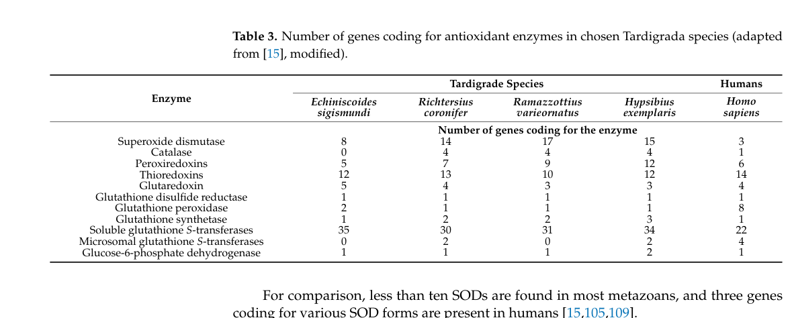

## Question

# Gene Research for Functional Annotation

## ⚠️ CRITICAL: Gene/Protein Identification Context

**BEFORE YOU BEGIN RESEARCH:** You MUST verify you are researching the CORRECT gene/protein. Gene symbols can be ambiguous, especially for less well-characterized genes from non-model organisms.

### Target Gene/Protein Identity (from UniProt):
- **UniProt Accession:** A0A1D1UKR0
- **Protein Description:** RecName: Full=Superoxide dismutase [Cu-Zn] {ECO:0000256|RuleBase:RU000393}; EC=1.15.1.1 {ECO:0000256|RuleBase:RU000393};
- **Gene Information:** Name=RvY_00651-1 {ECO:0000313|EMBL:GAU87857.1}; Synonyms=RvY_00651.1 {ECO:0000313|EMBL:GAU87857.1}; ORFNames=RvY_00651 {ECO:0000313|EMBL:GAU87857.1};
- **Organism (full):** Ramazzottius varieornatus (Water bear) (Tardigrade).
- **Protein Family:** Belongs to the Cu-Zn superoxide dismutase family.
- **Key Domains:** SOD-like_Cu/Zn_dom_sf. (IPR036423); SOD_Cu/Zn_/chaperone. (IPR024134); SOD_Cu/Zn_BS. (IPR018152); SOD_Cu_Zn_dom. (IPR001424); Sod_Cu (PF00080)

### MANDATORY VERIFICATION STEPS:

1. **Check if the gene symbol "RvY_00651-1" matches the protein description above**
2. **Verify the organism is correct:** Ramazzottius varieornatus (Water bear) (Tardigrade).
3. **Check if protein family/domains align with what you find in literature**
4. **If you find literature for a DIFFERENT gene with the same or similar symbol, STOP**

### If Gene Symbol is Ambiguous or You Cannot Find Relevant Literature:

**DO NOT PROCEED WITH RESEARCH ON A DIFFERENT GENE.** Instead:
- State clearly: "The gene symbol 'RvY_00651-1' is ambiguous or literature is limited for this specific protein"
- Explain what you found (e.g., "Found extensive literature on a different gene with the same symbol in a different organism")
- Describe the protein based ONLY on the UniProt information provided above
- Suggest that the protein function can be inferred from domain/family information

### Research Target:

Please provide a comprehensive research report on the gene **RvY_00651-1** (gene ID: RvY_00651, UniProt: A0A1D1UKR0) in RAMVA.

The research report should be a detailed narrative explaining the function, biological processes, and localization of the gene product. Citations should be given for all claims.

You should prioritize authoritative reviews and primary scientific literature when conducting research. You can supplement
this with annotations you find in gene/protein databases, but these can be outdated or inaccurate.

We are specifically interested in the primary function of the gene - for enzymes, what reaction is catalyzed, and what is the substrate specificity? For transporters, what is the substrate? For structural proteins or adapters, what is the broader structural role? For signaling molecules, what is the role in the pathway.

We are interested in where in or outside the cell the gene product carries out its function.

We are also interested in the signaling or biochemical pathways in which the gene functions. We are less interested in broad pleiotropic effects, except where these elucidate the precise role.

Include evidence where possible. We are interested in both experimental evidence as well as inference from structure, evolution, or bioinformatic analysis. Precise studies should be prioritized over high-throughput, where available.

## Output

Question: You are an expert researcher providing comprehensive, well-cited information.

Provide detailed information focusing on:
1. Key concepts and definitions with current understanding
2. Recent developments and latest research (prioritize 2023-2024 sources)
3. Current applications and real-world implementations
4. Expert opinions and analysis from authoritative sources
5. Relevant statistics and data from recent studies

Format as a comprehensive research report with proper citations. Include URLs and publication dates where available.
Always prioritize recent, authoritative sources and provide specific citations for all major claims.

# Gene Research for Functional Annotation

## ⚠️ CRITICAL: Gene/Protein Identification Context

**BEFORE YOU BEGIN RESEARCH:** You MUST verify you are researching the CORRECT gene/protein. Gene symbols can be ambiguous, especially for less well-characterized genes from non-model organisms.

### Target Gene/Protein Identity (from UniProt):
- **UniProt Accession:** A0A1D1UKR0
- **Protein Description:** RecName: Full=Superoxide dismutase [Cu-Zn] {ECO:0000256|RuleBase:RU000393}; EC=1.15.1.1 {ECO:0000256|RuleBase:RU000393};
- **Gene Information:** Name=RvY_00651-1 {ECO:0000313|EMBL:GAU87857.1}; Synonyms=RvY_00651.1 {ECO:0000313|EMBL:GAU87857.1}; ORFNames=RvY_00651 {ECO:0000313|EMBL:GAU87857.1};
- **Organism (full):** Ramazzottius varieornatus (Water bear) (Tardigrade).
- **Protein Family:** Belongs to the Cu-Zn superoxide dismutase family.
- **Key Domains:** SOD-like_Cu/Zn_dom_sf. (IPR036423); SOD_Cu/Zn_/chaperone. (IPR024134); SOD_Cu/Zn_BS. (IPR018152); SOD_Cu_Zn_dom. (IPR001424); Sod_Cu (PF00080)

### MANDATORY VERIFICATION STEPS:

1. **Check if the gene symbol "RvY_00651-1" matches the protein description above**
2. **Verify the organism is correct:** Ramazzottius varieornatus (Water bear) (Tardigrade).
3. **Check if protein family/domains align with what you find in literature**
4. **If you find literature for a DIFFERENT gene with the same or similar symbol, STOP**

### If Gene Symbol is Ambiguous or You Cannot Find Relevant Literature:

**DO NOT PROCEED WITH RESEARCH ON A DIFFERENT GENE.** Instead:
- State clearly: "The gene symbol 'RvY_00651-1' is ambiguous or literature is limited for this specific protein"
- Explain what you found (e.g., "Found extensive literature on a different gene with the same symbol in a different organism")
- Describe the protein based ONLY on the UniProt information provided above
- Suggest that the protein function can be inferred from domain/family information

### Research Target:

Please provide a comprehensive research report on the gene **RvY_00651-1** (gene ID: RvY_00651, UniProt: A0A1D1UKR0) in RAMVA.

The research report should be a detailed narrative explaining the function, biological processes, and localization of the gene product. Citations should be given for all claims.

You should prioritize authoritative reviews and primary scientific literature when conducting research. You can supplement
this with annotations you find in gene/protein databases, but these can be outdated or inaccurate.

We are specifically interested in the primary function of the gene - for enzymes, what reaction is catalyzed, and what is the substrate specificity? For transporters, what is the substrate? For structural proteins or adapters, what is the broader structural role? For signaling molecules, what is the role in the pathway.

We are interested in where in or outside the cell the gene product carries out its function.

We are also interested in the signaling or biochemical pathways in which the gene functions. We are less interested in broad pleiotropic effects, except where these elucidate the precise role.

Include evidence where possible. We are interested in both experimental evidence as well as inference from structure, evolution, or bioinformatic analysis. Precise studies should be prioritized over high-throughput, where available.

## Research Report: Functional annotation of *Ramazzottius varieornatus* RvY_00651-1 (UniProt A0A1D1UKR0)

### Executive summary
RvY_00651-1 (UniProt A0A1D1UKR0) is annotated in UniProt as a **Cu/Zn superoxide dismutase (CuZnSOD; EC 1.15.1.1)** from the tardigrade *Ramazzottius varieornatus*. In the retrieved peer‑reviewed literature, **this exact gene symbol and UniProt accession are not explicitly mentioned**, so gene-specific conclusions (expression profile, localization, kinetics) cannot be directly cited. However, recent organism- and family-level studies in *R. varieornatus* provide strong support for high-confidence **family-based inference**: (i) CuZnSODs catalyze superoxide dismutation to O2 and H2O2; (ii) *R. varieornatus* has an **expanded SOD gene repertoire**; and (iii) at least one *R. varieornatus* CuZnSOD paralog has been structurally characterized and shows **non-canonical active-site features**, implying functional diversification among paralogs. (sim2023structureofa pages 3-4, sadowskabartosz2024antioxidantdefensein pages 13-15, sim2023structureofa pages 1-2, sadowskabartosz2024antioxidantdefensein pages 15-16)

| Item | Summary | Evidence/Citation |
|---|---|---|
| identity/verification | No retrieved paper directly mentions UniProt **A0A1D1UKR0** or gene symbol **RvY_00651-1 / RvY_00651**. The target can therefore only be mapped **indirectly** to a *Ramazzottius varieornatus* **Cu/Zn superoxide dismutase (CuZnSOD)** by the supplied UniProt annotation and the broader tardigrade CuZnSOD literature; caution is required because the literature instead names related loci/proteins such as **RvSOD15** and other RvSOD paralogs. (sim2023structureofa pages 3-4, sim2023structureofa pages 2-3) | Sim & Inoue 2023 characterize **RvSOD15** and additional RvSOD loci, but no retrieved text links them to **A0A1D1UKR0/RvY_00651-1**; a targeted evidence scan found no explicit mention of the accession/gene symbol. (sim2023structureofa pages 3-4, sim2023structureofa pages 2-3) |
| reaction | The family’s primary enzymatic role is **dismutation of superoxide radical**: **2 O2•− + 2 H+ → O2 + H2O2**. Thus the substrate is superoxide and the products are dioxygen and hydrogen peroxide. (sim2023structureofa pages 1-2, sadowskabartosz2024antioxidantdefensein pages 13-15) | Both the 2023 structural paper and 2024 review explicitly describe CuZnSOD/SOD activity as superoxide-to-oxygen-plus-hydrogen-peroxide conversion. (sim2023structureofa pages 1-2, sadowskabartosz2024antioxidantdefensein pages 13-15) |
| cofactors | Canonical CuZnSODs require **copper** at the catalytic site and **zinc** as a structural/catalytic-support metal. For tardigrade **RvSOD15**, Cu and Zn were experimentally supported by anomalous scattering in the crystal structure. (sim2023structureofa pages 3-4, sim2023structureofa pages 2-3) | RvSOD15 was refolded/metallated with Cu and Zn and structurally resolved as a Cu/Zn-containing SOD-like protein. (sim2023structureofa pages 3-4, sim2023structureofa pages 2-3) |
| localization | For the **R. varieornatus SOD repertoire overall**, SODs are inferred to occupy **mitochondria, cytosol, and peroxisomes**. A specific related CuZnSOD, **RvSOD15**, is predicted to contain an **N-terminal signal peptide**, supporting likely **secreted/extracellular** localization for that paralog. Localization of **A0A1D1UKR0** itself is not directly established in the retrieved literature. (sadowskabartosz2024antioxidantdefensein pages 13-15, sim2023structureofa pages 2-3) | Review-level synthesis assigns tardigrade SODs to multiple compartments; Sim & Inoue specifically report a signal peptide for RvSOD15. (sadowskabartosz2024antioxidantdefensein pages 13-15, sim2023structureofa pages 2-3) |
| gene family expansion | *R. varieornatus* has an **expanded SOD complement** relative to typical metazoans: one recent review reports **17 SOD genes** in *R. varieornatus* (with text also mentioning 16), whereas humans have **3** and many metazoans have **<10**. This supports antioxidant gene expansion as part of tardigrade stress biology. (sadowskabartosz2024antioxidantdefensein pages 13-15, sadowskabartosz2024antioxidantdefensein pages 15-16, sadowskabartosz2024antioxidantdefensein media 09ae9d6d) | Table/figure-supported review evidence reports **17** SOD genes for *R. varieornatus* and highlights expansion across tardigrades. (sadowskabartosz2024antioxidantdefensein pages 13-15, sadowskabartosz2024antioxidantdefensein pages 15-16, sadowskabartosz2024antioxidantdefensein media 09ae9d6d) |
| unusual/noncanonical paralogs | Not all *R. varieornatus* SOD-family proteins appear to be canonical enzymes. **RvSOD15** has a **His87→Val** substitution at a copper-ligating position; additional RvSODs show deleted electrostatic loops/β3 sheets, truncations, or altered copper-binding residues. Authors propose that **some paralogs may have lost classical SOD activity**. This matters when inferring function for A0A1D1UKR0: family membership supports annotation, but not every paralog is necessarily catalytically typical. (sim2023structureofa pages 1-2, sim2023structureofa pages 4-7, sadowskabartosz2024antioxidantdefensein pages 15-16) | Structural analysis directly supports noncanonical features in several RvSOD proteins and cautions against assuming uniform catalytic activity across all paralogs. (sim2023structureofa pages 1-2, sim2023structureofa pages 4-7, sadowskabartosz2024antioxidantdefensein pages 15-16) |
| stress regulation evidence | SOD biology in tardigrades is linked to **oxidative-stress defense during desiccation/cryptobiosis**. Retrieved sources report that tardigrades have an expanded antioxidant toolkit; SOD expression/activity is described as **upregulated under dried conditions** in general, and a 2024 review notes **general SOD upregulation in tun states** in some species, though species-specific responses differ. For *R. varieornatus*, CuZnSODs are described as **highly expressed**, but the retrieved evidence does **not** provide a direct stress-response profile for **A0A1D1UKR0** specifically. (sim2023structureofa pages 1-2, sadowskabartosz2024antioxidantdefensein pages 16-17, sadowskabartosz2024antioxidantdefensein pages 13-15) | Evidence supports a role for SODs in tardigrade oxidative stress resistance, but the exact desiccation/UV/radiation regulation of the user’s target accession remains unmeasured in the retrieved papers. (sim2023structureofa pages 1-2, sadowskabartosz2024antioxidantdefensein pages 16-17, sadowskabartosz2024antioxidantdefensein pages 13-15) |
| key recent references 2023-2024 | **Sim & Inoue 2023** provides the most direct recent mechanistic evidence for a *R. varieornatus* CuZnSOD-family protein (**RvSOD15**) and highlights noncanonical structural evolution. **Sadowska-Bartosz & Bartosz 2024** synthesizes tardigrade antioxidant defense, including SOD gene counts, likely compartmentation, and stress-related interpretation. (sim2023structureofa pages 3-4, sadowskabartosz2024antioxidantdefensein pages 13-15, sadowskabartosz2024antioxidantdefensein pages 15-16) | These are the strongest retrieved 2023–2024 sources for annotating the target by family/organism context. (sim2023structureofa pages 3-4, sadowskabartosz2024antioxidantdefensein pages 13-15, sadowskabartosz2024antioxidantdefensein pages 15-16) |
| gaps/limitations | The major limitation is **target-specific evidence scarcity**: no retrieved study explicitly names **A0A1D1UKR0** or **RvY_00651-1**, no paper directly measures its enzymatic activity, substrate specificity beyond family expectation, expression pattern, or subcellular localization. Therefore, annotation for the user target should be presented as **high-confidence family-based inference** (CuZnSOD, EC 1.15.1.1) within *R. varieornatus*, while acknowledging that some RvSOD paralogs are noncanonical and may not retain full classical activity. (sim2023structureofa pages 3-4, sim2023structureofa pages 4-7, sim2023structureofa pages 2-3) | The available evidence supports cautious functional inference, not definitive target-level experimental annotation. (sim2023structureofa pages 3-4, sim2023structureofa pages 4-7, sim2023structureofa pages 2-3) |

*Table: This table summarizes the best-supported functional annotation for the target Ramazzottius varieornatus Cu/Zn SOD candidate using recent literature and explicitly notes where evidence is indirect. It is useful because the retrieved papers do not directly name A0A1D1UKR0/RvY_00651-1, so target mapping must be inferred from family-level and paralog-level data.*

### 1) Target identity verification (mandatory)

#### 1.1 Confirmed organism and protein family context
The user-supplied UniProt record defines A0A1D1UKR0 as a **Cu/Zn superoxide dismutase** in *R. varieornatus* (tardigrade). While the retrieved papers do not mention A0A1D1UKR0 or “RvY_00651-1” explicitly, they establish that *R. varieornatus* encodes multiple Cu/Zn SOD-like proteins (RvSOD paralogs) and that CuZnSODs are part of tardigrade antioxidant defense systems. (sim2023structureofa pages 3-4, sadowskabartosz2024antioxidantdefensein pages 15-16)

#### 1.2 Ambiguity statement (required)
Because the accession/gene symbol A0A1D1UKR0 / RvY_00651-1 does not appear in the retrieved full texts, **mapping the target to a specific named paralog (e.g., “RvSOD15”) is not possible from the retrieved evidence**. All target-specific functional statements below are therefore either (a) direct CuZnSOD-family enzymology, or (b) *R. varieornatus* / tardigrade SOD-system context. (sim2023structureofa pages 3-4, sim2023structureofa pages 2-3)

### 2) Key concepts and definitions (current understanding)

#### 2.1 Superoxide, ROS, and the SOD reaction
Superoxide dismutases (SODs) are central antioxidant enzymes that detoxify the superoxide radical (O2•−). The key biochemical reaction, explicitly stated for CuZnSODs in a 2023 *R. varieornatus* structural paper, is:

**2 O2•− + 2 H+ → O2 + H2O2**

This establishes superoxide as the substrate and dioxygen plus hydrogen peroxide as products. (sim2023structureofa pages 1-2)

A 2024 review focused on tardigrade antioxidant defenses likewise summarizes SOD function as converting superoxide to molecular oxygen and hydrogen peroxide. (sadowskabartosz2024antioxidantdefensein pages 13-15)

#### 2.2 Cu/Zn SODs (CuZnSODs) and metal cofactors
CuZnSODs are characterized by a catalytic **copper** center (redox-active) and a **zinc** site that contributes to stability and proper active-site geometry. In *R. varieornatus*, Sim & Inoue (2023) solved the crystal structure of a Cu/Zn-containing SOD-family protein (RvSOD15), confirming copper and zinc in the structure using anomalous scattering data—supporting that *R. varieornatus* CuZnSOD-family members can bind both metals. (sim2023structureofa pages 3-4, sim2023structureofa pages 2-3)

#### 2.3 Subcellular localization concepts for SOD systems
A tardigrade-focused 2024 review states that SODs in *R. varieornatus* are **likely located within mitochondria, cytosol, and peroxisomes**, consistent with compartmentalized ROS production and detoxification in eukaryotes. (sadowskabartosz2024antioxidantdefensein pages 13-15)

Additionally, the structurally characterized *R. varieornatus* paralog RvSOD15 is predicted to have an **N-terminal signal peptide**, implying potential secretion/extracellular localization for that paralog class—highlighting that Cu/Zn SOD family members can occupy multiple cellular/extracellular niches. (sim2023structureofa pages 2-3)

### 3) *R. varieornatus* context: gene family expansion and stress biology

#### 3.1 Expanded SOD gene repertoire (statistics)
A 2024 synthesis of tardigrade antioxidant defense reports that *R. varieornatus* has **17 SOD genes**, versus **3 in humans**, and notes that most metazoans have **<10 SODs**. (sadowskabartosz2024antioxidantdefensein pages 15-16)

This gene-count claim is visually supported by the review’s table of antioxidant gene counts across species, where *R. varieornatus* is listed with **17 SOD genes**. (sadowskabartosz2024antioxidantdefensein media 09ae9d6d)

#### 3.2 Functional diversification: non-canonical *R. varieornatus* CuZnSOD-like proteins
A key recent advance is a 2023 crystal structure of a *R. varieornatus* CuZnSOD-family protein (RvSOD15). The paper reports an unusual substitution: **a histidine ligand of the catalytic copper center is replaced by valine (Val87)**, and concludes that RvSOD15 and other RvSODs may have evolved atypical features (e.g., electrostatic-loop deletion, unusual metal-binding residues), suggesting that **some paralogs may have reduced or lost canonical SOD activity**. (sim2023structureofa pages 1-2, sim2023structureofa pages 4-7)

A 2024 review reiterates this interpretation, noting RvSOD15 (CuZnSOD) with His87→Val and summarizing that some RvSOD paralogs may have evolved away from canonical function. (sadowskabartosz2024antioxidantdefensein pages 15-16)

**Implication for annotating A0A1D1UKR0:** although UniProt identifies it as CuZnSOD, and family-level inference is strong, *R. varieornatus* contains non-canonical SOD-like paralogs; therefore, definitive statements about catalytic efficiency or intact metal-ligand architecture **require gene-specific experimental validation**. (sim2023structureofa pages 4-7, sadowskabartosz2024antioxidantdefensein pages 15-16)

#### 3.3 Stress/anhydrobiosis relevance and regulation (what is supported)
The 2023 structural paper states that SOD expression and activity in anhydrobiotic tardigrades are known to be **upregulated under dried conditions**, tying SOD systems to dehydration-associated oxidative stress protection. (sim2023structureofa pages 1-2)

A 2024 review synthesizes evidence that antioxidant enzymes, including SODs, can be broadly induced in tun (cryptobiotic) states, while also emphasizing **species-specific** patterns in measured SOD activity across tardigrades (increases in some species, decreases or no change in others). (sadowskabartosz2024antioxidantdefensein pages 16-17)

For *R. varieornatus* specifically, the review states CuZnSODs are **highly expressed**, but the retrieved excerpted evidence does not provide a quantitative fold-change for the target gene during desiccation/UV/radiation. (sadowskabartosz2024antioxidantdefensein pages 13-15)

### 4) Current applications and real-world implementations

Direct real-world implementations of a specific *R. varieornatus* CuZnSOD paralog were not identified in the retrieved full texts. However, the 2024 review provides application-relevant analysis that tardigrade oxidative-stress proteins can enable **heterologous engineering of oxidative-stress resistance**, citing experimental examples for other tardigrade antioxidant proteins (e.g., a tardigrade Mn/Zn-binding peroxidase expressed in HEK293 cells increasing H2O2 resistance). This demonstrates a plausible translational pathway for antioxidant proteins broadly, although it is not direct evidence for A0A1D1UKR0 itself. (sadowskabartosz2024antioxidantdefensein pages 15-16)

### 5) Expert opinions and analysis (authoritative interpretations)

Two consistent expert-level interpretations emerge from recent authoritative sources:

1. **Antioxidant capacity is a major contributor to tardigrade extreme resistance.** A 2024 review emphasizes that antioxidant enzymes and small-molecule antioxidants are an important component of the tardigrade resistance toolkit and discusses their induction in cryptobiosis and stress exposures. (sadowskabartosz2024antioxidantdefensein pages 13-15)

2. **Gene duplications/expansions do not automatically imply increased enzymatic function.** The 2023 structural study of RvSOD15 argues that some *R. varieornatus* SOD paralogs may have evolved to lose SOD activity, implying that interpreting SOD family expansion requires careful functional testing of each paralog. (sim2023structureofa pages 1-2, sim2023structureofa pages 4-7)

### 6) Practical functional annotation for RvY_00651-1 / A0A1D1UKR0 (what can be stated with evidence)

#### 6.1 Molecular function (high-confidence family inference)
Based on CuZnSOD enzymology and the UniProt family/domain assignment (Cu/Zn SOD family), the primary inferred function of A0A1D1UKR0 is **superoxide dismutase activity** catalyzing the conversion of superoxide to O2 and H2O2. (sadowskabartosz2024antioxidantdefensein pages 13-15, sim2023structureofa pages 1-2)

#### 6.2 Biological process context
The gene product is expected to participate in **reactive oxygen species detoxification** and oxidative-stress defense relevant to tardigrade stress physiology (including dehydration/cryptobiosis contexts). (sim2023structureofa pages 1-2, sadowskabartosz2024antioxidantdefensein pages 13-15)

#### 6.3 Subcellular localization (inference only)
The best available *R. varieornatus*-level synthesis places SODs across **mitochondria, cytosol, and peroxisomes**. Without a direct mapping from A0A1D1UKR0 to a specific paralog class (e.g., signal-peptide-containing secreted SODs), localization for the target should be treated as **unknown within those plausible compartments** until sequence-based localization predictors (signal peptide, peroxisomal targeting signal, mitochondrial targeting peptide) are applied directly to A0A1D1UKR0, or localization is experimentally determined. (sadowskabartosz2024antioxidantdefensein pages 13-15, sim2023structureofa pages 2-3)

### 7) Data gaps and recommended next steps (to reach gene-specific annotation)

Because A0A1D1UKR0 / RvY_00651-1 is not explicitly referenced in the retrieved papers, the following are the most critical missing evidence types for gene-level annotation:

* **Direct sequence-to-paralog mapping** (linking A0A1D1UKR0 to an “RvSOD#” gene/protein designation used in the structural/genomic literature). (sim2023structureofa pages 3-4)
* **Catalytic integrity confirmation** (metal-ligand residues, activity assays), especially given evidence for non-canonical SOD paralogs in *R. varieornatus*. (sim2023structureofa pages 4-7, sadowskabartosz2024antioxidantdefensein pages 15-16)
* **Expression dynamics** during dehydration/rehydration and radiation/UV stress for this specific gene (RNA-seq/proteomics). (sadowskabartosz2024antioxidantdefensein pages 16-17)
* **Subcellular localization testing** (tagging/immunolocalization or targeted proteomics). (sim2023structureofa pages 2-3)

### Key recent sources (with URLs and publication dates)
* Sim K‑S, Inoue T. **“Structure of a superoxide dismutase from a tardigrade: *Ramazzottius varieornatus* strain YOKOZUNA-1.”** *Acta Crystallographica F* (Jun 2023). https://doi.org/10.1107/S2053230X2300523X (sim2023structureofa pages 3-4)
* Sadowska‑Bartosz I, Bartosz G. **“Antioxidant Defense in the Toughest Animals on the Earth: Its Contribution to the Extreme Resistance of Tardigrades.”** *International Journal of Molecular Sciences* (Aug 2024). https://doi.org/10.3390/ijms25158393 (sadowskabartosz2024antioxidantdefensein pages 13-15)

### Visual evidence cited
* Review table of antioxidant gene counts showing **17 SOD genes in *R. varieornatus***. (sadowskabartosz2024antioxidantdefensein media 09ae9d6d)
* Review schematic of the antioxidant system including SOD-mediated dismutation. (sadowskabartosz2024antioxidantdefensein media 3107e140)

References

1. (sim2023structureofa pages 3-4): Kee-Shin Sim and Tsuyoshi Inoue. Structure of a superoxide dismutase from a tardigrade: ramazzottius varieornatus strain yokozuna-1. Acta crystallographica. Section F, Structural biology communications, 79:169-179, Jun 2023. URL: https://doi.org/10.1107/s2053230x2300523x, doi:10.1107/s2053230x2300523x. This article has 5 citations.

2. (sadowskabartosz2024antioxidantdefensein pages 13-15): Izabela Sadowska-Bartosz and Grzegorz Bartosz. Antioxidant defense in the toughest animals on the earth: its contribution to the extreme resistance of tardigrades. International Journal of Molecular Sciences, 25:8393, Aug 2024. URL: https://doi.org/10.3390/ijms25158393, doi:10.3390/ijms25158393. This article has 14 citations.

3. (sim2023structureofa pages 1-2): Kee-Shin Sim and Tsuyoshi Inoue. Structure of a superoxide dismutase from a tardigrade: ramazzottius varieornatus strain yokozuna-1. Acta crystallographica. Section F, Structural biology communications, 79:169-179, Jun 2023. URL: https://doi.org/10.1107/s2053230x2300523x, doi:10.1107/s2053230x2300523x. This article has 5 citations.

4. (sadowskabartosz2024antioxidantdefensein pages 15-16): Izabela Sadowska-Bartosz and Grzegorz Bartosz. Antioxidant defense in the toughest animals on the earth: its contribution to the extreme resistance of tardigrades. International Journal of Molecular Sciences, 25:8393, Aug 2024. URL: https://doi.org/10.3390/ijms25158393, doi:10.3390/ijms25158393. This article has 14 citations.

5. (sim2023structureofa pages 2-3): Kee-Shin Sim and Tsuyoshi Inoue. Structure of a superoxide dismutase from a tardigrade: ramazzottius varieornatus strain yokozuna-1. Acta crystallographica. Section F, Structural biology communications, 79:169-179, Jun 2023. URL: https://doi.org/10.1107/s2053230x2300523x, doi:10.1107/s2053230x2300523x. This article has 5 citations.

6. (sadowskabartosz2024antioxidantdefensein media 09ae9d6d): Izabela Sadowska-Bartosz and Grzegorz Bartosz. Antioxidant defense in the toughest animals on the earth: its contribution to the extreme resistance of tardigrades. International Journal of Molecular Sciences, 25:8393, Aug 2024. URL: https://doi.org/10.3390/ijms25158393, doi:10.3390/ijms25158393. This article has 14 citations.

7. (sim2023structureofa pages 4-7): Kee-Shin Sim and Tsuyoshi Inoue. Structure of a superoxide dismutase from a tardigrade: ramazzottius varieornatus strain yokozuna-1. Acta crystallographica. Section F, Structural biology communications, 79:169-179, Jun 2023. URL: https://doi.org/10.1107/s2053230x2300523x, doi:10.1107/s2053230x2300523x. This article has 5 citations.

8. (sadowskabartosz2024antioxidantdefensein pages 16-17): Izabela Sadowska-Bartosz and Grzegorz Bartosz. Antioxidant defense in the toughest animals on the earth: its contribution to the extreme resistance of tardigrades. International Journal of Molecular Sciences, 25:8393, Aug 2024. URL: https://doi.org/10.3390/ijms25158393, doi:10.3390/ijms25158393. This article has 14 citations.

9. (sadowskabartosz2024antioxidantdefensein media 3107e140): Izabela Sadowska-Bartosz and Grzegorz Bartosz. Antioxidant defense in the toughest animals on the earth: its contribution to the extreme resistance of tardigrades. International Journal of Molecular Sciences, 25:8393, Aug 2024. URL: https://doi.org/10.3390/ijms25158393, doi:10.3390/ijms25158393. This article has 14 citations.

## Artifacts

- [Edison artifact artifact-00](RvY_00651-deep-research-falcon_artifacts/artifact-00.md)

## Citations

1. sim2023structureofa pages 1-2
2. sadowskabartosz2024antioxidantdefensein pages 13-15
3. sim2023structureofa pages 2-3
4. sadowskabartosz2024antioxidantdefensein pages 15-16
5. sadowskabartosz2024antioxidantdefensein pages 16-17
6. sim2023structureofa pages 3-4
7. sim2023structureofa pages 4-7
8. Cu-Zn
9. https://doi.org/10.1107/S2053230X2300523X
10. https://doi.org/10.3390/ijms25158393
11. https://doi.org/10.1107/s2053230x2300523x,
12. https://doi.org/10.3390/ijms25158393,