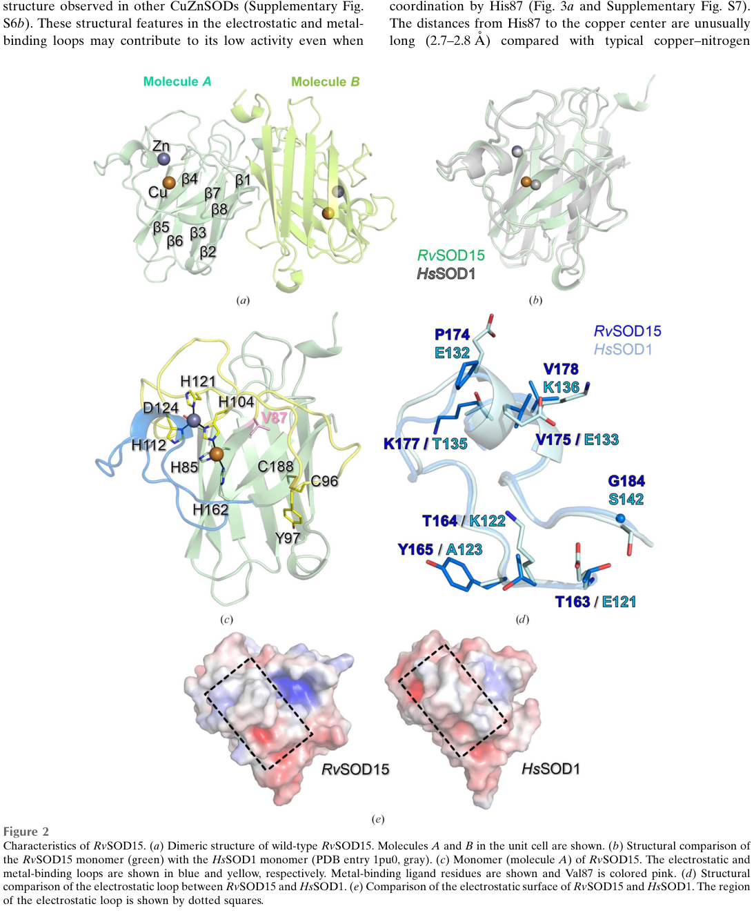

## Question

# Gene Research for Functional Annotation

## ⚠️ CRITICAL: Gene/Protein Identification Context

**BEFORE YOU BEGIN RESEARCH:** You MUST verify you are researching the CORRECT gene/protein. Gene symbols can be ambiguous, especially for less well-characterized genes from non-model organisms.

### Target Gene/Protein Identity (from UniProt):
- **UniProt Accession:** A0A1D1USM4
- **Protein Description:** RecName: Full=Superoxide dismutase {ECO:0000256|ARBA:ARBA00012682, ECO:0000256|RuleBase:RU000414}; EC=1.15.1.1 {ECO:0000256|ARBA:ARBA00012682, ECO:0000256|RuleBase:RU000414};
- **Gene Information:** Name=RvY_01767-1 {ECO:0000313|EMBL:GAU89188.1}; Synonyms=RvY_01767.1 {ECO:0000313|EMBL:GAU89188.1}; ORFNames=RvY_01767 {ECO:0000313|EMBL:GAU89188.1};
- **Organism (full):** Ramazzottius varieornatus (Water bear) (Tardigrade).
- **Protein Family:** Belongs to the iron/manganese superoxide dismutase family.
- **Key Domains:** Fe/Mn_Superoxide_Dismutase. (IPR050265); Mn/Fe_SOD. (IPR001189); Mn/Fe_SOD_BS. (IPR019833); Mn/Fe_SOD_C. (IPR019832); Mn/Fe_SOD_N. (IPR019831)

### MANDATORY VERIFICATION STEPS:

1. **Check if the gene symbol "RvY_01767-1" matches the protein description above**
2. **Verify the organism is correct:** Ramazzottius varieornatus (Water bear) (Tardigrade).
3. **Check if protein family/domains align with what you find in literature**
4. **If you find literature for a DIFFERENT gene with the same or similar symbol, STOP**

### If Gene Symbol is Ambiguous or You Cannot Find Relevant Literature:

**DO NOT PROCEED WITH RESEARCH ON A DIFFERENT GENE.** Instead:
- State clearly: "The gene symbol 'RvY_01767-1' is ambiguous or literature is limited for this specific protein"
- Explain what you found (e.g., "Found extensive literature on a different gene with the same symbol in a different organism")
- Describe the protein based ONLY on the UniProt information provided above
- Suggest that the protein function can be inferred from domain/family information

### Research Target:

Please provide a comprehensive research report on the gene **RvY_01767-1** (gene ID: RvY_01767, UniProt: A0A1D1USM4) in RAMVA.

The research report should be a detailed narrative explaining the function, biological processes, and localization of the gene product. Citations should be given for all claims.

You should prioritize authoritative reviews and primary scientific literature when conducting research. You can supplement
this with annotations you find in gene/protein databases, but these can be outdated or inaccurate.

We are specifically interested in the primary function of the gene - for enzymes, what reaction is catalyzed, and what is the substrate specificity? For transporters, what is the substrate? For structural proteins or adapters, what is the broader structural role? For signaling molecules, what is the role in the pathway.

We are interested in where in or outside the cell the gene product carries out its function.

We are also interested in the signaling or biochemical pathways in which the gene functions. We are less interested in broad pleiotropic effects, except where these elucidate the precise role.

Include evidence where possible. We are interested in both experimental evidence as well as inference from structure, evolution, or bioinformatic analysis. Precise studies should be prioritized over high-throughput, where available.

## Output

Question: You are an expert researcher providing comprehensive, well-cited information.

Provide detailed information focusing on:
1. Key concepts and definitions with current understanding
2. Recent developments and latest research (prioritize 2023-2024 sources)
3. Current applications and real-world implementations
4. Expert opinions and analysis from authoritative sources
5. Relevant statistics and data from recent studies

Format as a comprehensive research report with proper citations. Include URLs and publication dates where available.
Always prioritize recent, authoritative sources and provide specific citations for all major claims.

# Gene Research for Functional Annotation

## ⚠️ CRITICAL: Gene/Protein Identification Context

**BEFORE YOU BEGIN RESEARCH:** You MUST verify you are researching the CORRECT gene/protein. Gene symbols can be ambiguous, especially for less well-characterized genes from non-model organisms.

### Target Gene/Protein Identity (from UniProt):
- **UniProt Accession:** A0A1D1USM4
- **Protein Description:** RecName: Full=Superoxide dismutase {ECO:0000256|ARBA:ARBA00012682, ECO:0000256|RuleBase:RU000414}; EC=1.15.1.1 {ECO:0000256|ARBA:ARBA00012682, ECO:0000256|RuleBase:RU000414};
- **Gene Information:** Name=RvY_01767-1 {ECO:0000313|EMBL:GAU89188.1}; Synonyms=RvY_01767.1 {ECO:0000313|EMBL:GAU89188.1}; ORFNames=RvY_01767 {ECO:0000313|EMBL:GAU89188.1};
- **Organism (full):** Ramazzottius varieornatus (Water bear) (Tardigrade).
- **Protein Family:** Belongs to the iron/manganese superoxide dismutase family.
- **Key Domains:** Fe/Mn_Superoxide_Dismutase. (IPR050265); Mn/Fe_SOD. (IPR001189); Mn/Fe_SOD_BS. (IPR019833); Mn/Fe_SOD_C. (IPR019832); Mn/Fe_SOD_N. (IPR019831)

### MANDATORY VERIFICATION STEPS:

1. **Check if the gene symbol "RvY_01767-1" matches the protein description above**
2. **Verify the organism is correct:** Ramazzottius varieornatus (Water bear) (Tardigrade).
3. **Check if protein family/domains align with what you find in literature**
4. **If you find literature for a DIFFERENT gene with the same or similar symbol, STOP**

### If Gene Symbol is Ambiguous or You Cannot Find Relevant Literature:

**DO NOT PROCEED WITH RESEARCH ON A DIFFERENT GENE.** Instead:
- State clearly: "The gene symbol 'RvY_01767-1' is ambiguous or literature is limited for this specific protein"
- Explain what you found (e.g., "Found extensive literature on a different gene with the same symbol in a different organism")
- Describe the protein based ONLY on the UniProt information provided above
- Suggest that the protein function can be inferred from domain/family information

### Research Target:

Please provide a comprehensive research report on the gene **RvY_01767-1** (gene ID: RvY_01767, UniProt: A0A1D1USM4) in RAMVA.

The research report should be a detailed narrative explaining the function, biological processes, and localization of the gene product. Citations should be given for all claims.

You should prioritize authoritative reviews and primary scientific literature when conducting research. You can supplement
this with annotations you find in gene/protein databases, but these can be outdated or inaccurate.

We are specifically interested in the primary function of the gene - for enzymes, what reaction is catalyzed, and what is the substrate specificity? For transporters, what is the substrate? For structural proteins or adapters, what is the broader structural role? For signaling molecules, what is the role in the pathway.

We are interested in where in or outside the cell the gene product carries out its function.

We are also interested in the signaling or biochemical pathways in which the gene functions. We are less interested in broad pleiotropic effects, except where these elucidate the precise role.

Include evidence where possible. We are interested in both experimental evidence as well as inference from structure, evolution, or bioinformatic analysis. Precise studies should be prioritized over high-throughput, where available.

## Comprehensive Research Report: Functional Annotation of **RvY_01767-1** (UniProt **A0A1D1USM4**) in *Ramazzottius varieornatus* (tardigrade)

### Executive summary
The UniProt target **A0A1D1USM4** (gene: **RvY_01767-1 / RvY_01767.1 / ORF RvY_01767**) is annotated as **superoxide dismutase (SOD)**, **EC 1.15.1.1**, belonging to the **iron/manganese superoxide dismutase (Fe/Mn SOD) family**. However, within the literature retrievable by the provided tools, **no publication explicitly mentions this exact UniProt accession or this gene identifier**, so gene-specific functional claims beyond the UniProt description must be treated as **inference from enzyme family/domain evidence** and *R. varieornatus* antioxidant-system context. (sadowskabartosz2024antioxidantdefensein pages 13-15, sim2023structureofa pages 3-4, sadowskabartosz2024antioxidantdefensein pages 15-16)

The broader *R. varieornatus* genome and tardigrade literature strongly supports that antioxidant defenses (including large SOD repertoires) are central to stress tolerance, but also warns that some tardigrade SOD paralogs can be atypical and potentially non-canonical. (sadowskabartosz2024antioxidantdefensein pages 13-15, sadowskabartosz2024antioxidantdefensein pages 15-16, sim2023structureofa pages 3-4)

### 1) Mandatory verification: gene/protein identity and ambiguity check
**Target identity (must-match constraints):**
- **Organism**: *Ramazzottius varieornatus* (water bear/tardigrade).
- **Protein**: annotated as **Superoxide dismutase**, **EC 1.15.1.1**, **Fe/Mn SOD family** (UniProt-provided context).
- **Gene symbol**: **RvY_01767-1** (syn. RvY_01767.1; ORF RvY_01767).

**Verification outcome using tool-retrieved literature:**
- Searches and evidence extraction across recent and foundational tardigrade papers yielded **no explicit mention** of **UniProt A0A1D1USM4** or **RvY_01767-1/RvY_01767.1**. Therefore, the gene symbol is effectively **literature-sparse** for this specific locus in the accessible corpus, and it would be inappropriate to attribute to it results from other SOD paralogs (e.g., Cu/Zn SODs such as RvSOD15) without additional sequence mapping. (sim2023structureofa pages 3-4, sadowskabartosz2024antioxidantdefensein pages 15-16)
- Nonetheless, the organism-level context is strongly consistent with the presence of multiple SOD genes in *R. varieornatus* and other tardigrades. (sadowskabartosz2024antioxidantdefensein pages 13-15, hashimoto2016extremotoleranttardigradegenome pages 2-3)

### 2) Key concepts and definitions (current understanding)
#### 2.1 Superoxide dismutase (SOD): definition and core biochemical role
Superoxide dismutases are metalloenzymes (EC **1.15.1.1**) that catalyze the **disproportionation (dismutation)** of superoxide radicals. (zheng2023theapplicationsand pages 2-4, mishra2023achievingabioticstress pages 3-5)

**Canonical reaction**:
\[2\,\mathrm{O_2^{\u2022-}} + 2\,\mathrm{H^+} \rightarrow \mathrm{H_2O_2} + \mathrm{O_2}\] (mishra2023achievingabioticstress pages 3-5, zheng2023theapplicationsand pages 2-4)

The product **H2O2** is subsequently handled by enzymes such as catalase, peroxiredoxins, and glutathione peroxidases; transport across membranes can occur via aquaporins in some contexts. (zheng2023theapplicationsand pages 4-5, zheng2023theapplicationsand pages 2-4)

#### 2.2 Fe/Mn SOD family: active site chemistry and defining features
For Mn- and Fe-dependent SODs, the catalytic metal is coordinated by **three histidines, one aspartate**, and a **water/hydroxide ligand** whose coordination state depends on the metal oxidation state. (zheng2023theapplicationsand pages 2-4)

Fe-SOD and Mn-SOD have closely related active-site architectures (same types of coordinating residues), supporting functional inference when a protein is assigned to the Fe/Mn SOD family by sequence/domain. (zheng2023theapplicationsand pages 2-4)

#### 2.3 Cellular localization patterns of eukaryotic Fe/Mn SODs
In eukaryotes, Mn-SOD (often termed SOD2) is typically **mitochondrial**, synthesized in the cytoplasm as a precursor with a **mitochondrial targeting/transport peptide** (reported up to ~24 amino acids) that is cleaved after import into the mitochondrial matrix. (zheng2023theapplicationsand pages 4-5)

Cross-eukaryote comparative analyses further support that **Mn-SODs are predominantly mitochondrial**, whereas **Fe-SODs are mainly chloroplast-localized** and most common in photosynthetic lineages—an important localization prior for annotating a tardigrade (non-photosynthetic) Fe/Mn family SOD. (lyall2020comparativeanalysisof pages 8-10)

### 3) Functional annotation for **RvY_01767-1 / A0A1D1USM4** (evidence-based inference)
Because gene-specific primary data were not found in the accessible corpus, the functional assignment below is explicitly **inference from (i) Fe/Mn SOD family/domain membership (UniProt-provided) and (ii) canonical Fe/Mn SOD biochemistry and localization evidence in the literature**.

#### 3.1 Molecular function
**Most likely molecular function:** **superoxide dismutase activity** (EC 1.15.1.1): disproportionation of superoxide to oxygen and hydrogen peroxide. (zheng2023theapplicationsand pages 2-4, mishra2023achievingabioticstress pages 3-5)

**Substrate specificity:** primary substrate is the **superoxide anion radical (O2•−)**; SODs are described as scavenging superoxide and producing H2O2 + O2. (zheng2023theapplicationsand pages 2-4, mishra2023achievingabioticstress pages 3-5)

**Cofactor:** expected to bind **Mn or Fe** at the active site, with the typical 3His/1Asp/water(hydroxide) coordination. (zheng2023theapplicationsand pages 2-4)

#### 3.2 Biological process context in tardigrades
Tardigrade extreme stress tolerance (desiccation/anhydrobiosis, UV, radiation) is strongly linked to managing oxidative stress. A major expert synthesis highlights that antioxidant enzymes and low-molecular-weight antioxidants are important elements in this resistance and that antioxidant proteins are induced during anhydrobiosis and UV stress, consistent with the “preparation for oxidative stress” concept. (sadowskabartosz2024antioxidantdefensein pages 1-3)

Moreover, recent synthesis emphasizes that ROS can also be **required as signals** for successful cryptobiosis/tun formation: blocking cysteine thiols or reducing oxidized thiols can prevent tun formation and lead to death, and some antioxidant pretreatments reduce survival—arguing that antioxidant defenses must balance detoxification with preserving ROS signaling. (sadowskabartosz2024antioxidantdefensein pages 13-15)

Thus, **RvY_01767-1/A0A1D1USM4**, if a mitochondrial Fe/Mn SOD, would most plausibly contribute to **mitochondrial ROS homeostasis**, protecting macromolecules while still permitting ROS-dependent signaling required for stress transitions.

#### 3.3 Subcellular localization (inferred)
Given the strong prior that eukaryotic Mn/Fe SOD2-type enzymes are mitochondrial and possess N-terminal mitochondrial targeting peptides, and given that tardigrades are non-photosynthetic (making chloroplast-localized Fe-SOD less plausible), the most defensible inference is that **A0A1D1USM4 is mitochondrial (matrix) or mitochondria-associated** if it resembles canonical Mn-SODs. (zheng2023theapplicationsand pages 4-5, lyall2020comparativeanalysisof pages 8-10)

This remains a **prediction** until the A0A1D1USM4 N-terminus is checked for a mitochondrial targeting peptide and/or experimentally validated localization.

### 4) *Ramazzottius varieornatus* antioxidant system and SOD repertoire (organism-level evidence)
#### 4.1 SOD gene family expansion in *R. varieornatus*
Multiple independent sources report that *R. varieornatus* has an expanded SOD repertoire:
- **16 SODs** reported in the *R. varieornatus* genome assembly in a high-impact genome paper, compared to **<10 in most metazoans**. (hashimoto2016extremotoleranttardigradegenome pages 2-3)
- A 2024 review synthesizing multiple datasets reports **16 SODs** and a table listing **17 SOD genes** for *R. varieornatus*; the review also suggests SODs are likely distributed across **mitochondria, cytosol, and peroxisomes**, and notes high expression of CuZn-SODs in *R. varieornatus*. (sadowskabartosz2024antioxidantdefensein pages 13-15)

These data support that an Fe/Mn-family SOD gene such as RvY_01767-1 is biologically plausible within a large SOD gene family, but do not identify which of these correspond to A0A1D1USM4.

#### 4.2 Caution: paralog divergence and potential loss of canonical SOD function
A key recent structural paper solved a **Cu/Zn SOD (RvSOD15)** from *R. varieornatus* and found that it contains an unusual substitution at a normally catalytic copper-ligand position and that other *R. varieornatus* SOD paralogs show missing or mutated metal-binding residues; the authors argue some RvSODs may have evolved to **lose canonical SOD function**, cautioning against assuming all SOD-like genes are functional enzymes. (sim2023structureofa pages 3-4, sim2023structureofa pages 2-3)

A 2024 review similarly notes unusual SOD structural features (e.g., deletions of electrostatic loops/β-sheets and unusual metal-binding residues) and the possibility of SOD-function loss in some paralogs. (sadowskabartosz2024antioxidantdefensein pages 15-16)

Therefore, for **A0A1D1USM4**, the Fe/Mn SOD family assignment implies canonical function, but the tardigrade context argues that **experimental validation (activity assay and metal identity)** is important.

### 5) Recent developments (prioritizing 2023–2024)
#### 5.1 2024 synthesis: antioxidant defense as both detoxification and signaling
A 2024 review emphasizes a modern view in which ROS are not merely damaging; ROS-mediated redox events can be necessary for tun formation and survival, and excessive antioxidant pretreatment can reduce survival under osmotic stress—supporting a nuanced framework for how SOD-like enzymes are integrated with redox signaling in tardigrades. (sadowskabartosz2024antioxidantdefensein pages 13-15)

The same review compiles evidence for expanded antioxidant repertoires (including SOD expansions) and additional mechanisms (e.g., AOX genes, altered peroxisomal pathways) that can limit ROS generation. (sadowskabartosz2024antioxidantdefensein pages 13-15)

#### 5.2 2023 primary structure: *R. varieornatus* SOD structural genomics
A 2023 crystal structure paper provides direct structural evidence for a tardigrade SOD (Cu/Zn class, RvSOD15), mapping ligand residues and showing coordinated metals (Cu and Zn). While not directly about Fe/Mn SODs, it is the strongest recent structural demonstration that *R. varieornatus* encodes structurally bona fide SODs and that some are atypical. (sim2023structureofa pages 3-4, sim2023structureofa media 8c71c123, sim2023structureofa media ee73ca09)

#### 5.3 Stress-response discovery: Mn-dependent peroxidase with SOD-like fold
Tardigrades also encode a distinct Mn-dependent peroxidase (g12777/AMNP) reported to have a “SOD-like” fold and Mn binding; it localizes to the Golgi and increases H2O2 stress tolerance when expressed in human cells. This underscores that SOD-like folds can be repurposed in tardigrades and reinforces the need for careful protein-specific functional validation. (yoshida2020anovelmndependent pages 26-29)

### 6) Pathways and cellular systems where A0A1D1USM4 most likely acts
#### 6.1 ROS detoxification network
In typical eukaryotic cells, mitochondrial superoxide can be produced by respiration-related processes. A mitochondrial Mn/Fe SOD converts superoxide to H2O2, which is then processed by catalase/peroxiredoxins/GPx systems. (zheng2023theapplicationsand pages 2-4)

In tardigrades, antioxidant enzymes and small-molecule antioxidants increase during anhydrobiosis and UV exposures, consistent with a coordinated ROS-defense network (POS concept). (sadowskabartosz2024antioxidantdefensein pages 1-3)

#### 6.2 Stress transitions (anhydrobiosis/UV cross-tolerance)
Transcriptomic analyses in *R. varieornatus* stress contexts list conserved anti-oxidative stress proteins (including SODs) among components implicated in cross-tolerance, while also highlighting additional tardigrade-specific factors such as a Mn-dependent peroxidase with Golgi localization. (yoshida2022timeseriestranscriptomicscreening pages 1-2)

### 7) Current applications and real-world implementations (SOD and SOD-mimetic technologies)
Although not specific to tardigrade A0A1D1USM4, SOD biology has substantial translational activity.

#### 7.1 Human clinical implementation example (2024)
A 2024 double-blind, randomized, active-comparator controlled, non-inferiority trial tested **GF101** (a Bacillus-derived antioxidative enzyme SOD product) versus CoQ10 for IVF outcomes over 12 weeks: **86 enrolled**, **65 completed** (30 GF101, 34 CoQ10). GF101 was non-inferior with risk differences of **−6.27%** (clinical pregnancy), **−1.18%** (live birth), and **−13.49%** (miscarriage), with wide confidence intervals; oxidative marker changes were modest (no significant between-group change in serum SOD). (shin2024theefficacyand pages 1-2)

#### 7.2 Dermatology/cosmetics: topical delivery
A review summarizes that topical **TAT-SOD** before UVB exposure increased minimum erythema dose by **36.6 ± 18.4%** and reduced apoptotic sunburn cells by **47.6 ± 8.6%**, illustrating the importance of delivery systems for SOD efficacy. (zheng2023theapplicationsand pages 14-15)

#### 7.3 Food/biotech: fermentation and functional foods
A probiotic *Lactobacillus plantarum* strain producing SOD was reported with **2476.21 ± 1.52 U g−1** activity, and fermented yogurt SOD content of **19.827 ± 0.323 U mL−1**, **63.01–146.79% higher** than commercial yogurts—illustrating scalable production and incorporation into food matrices. (zheng2023theapplicationsand pages 12-14)

#### 7.4 Engineering and mimetics: nanozymes and stability strategies (2023–2024)
The SOD application literature emphasizes that major barriers include **poor stability**, **short in vivo half-life**, and **limited membrane permeability**, driving approaches such as PEGylation, encapsulation, and development of SOD mimetics and nanozymes. (zheng2023theapplicationsand pages 14-15, zheng2023theapplicationsand pages 15-16)

### 8) Expert opinions and authoritative analysis
- A 2024 tardigrade-focused antioxidant defense review concludes that antioxidant systems are critical contributors to extreme resistance and frames antioxidant induction during dehydration as “preparation for oxidative stress” on rehydration; it also synthesizes gene family expansion and HGT hypotheses for antioxidant genes. (sadowskabartosz2024antioxidantdefensein pages 1-3)
- The same 2024 synthesis argues for a modern interpretation in which ROS are both harmful and required signals for cryptobiotic transitions, implying that antioxidant enzymes (including SODs) must be integrated into redox signaling rather than simply maximized. (sadowskabartosz2024antioxidantdefensein pages 13-15)
- A 2023 *R. varieornatus* SOD structural study provides a cautionary interpretation: some duplicated SODs may have diverged and possibly lost SOD function, indicating that “expanded set of genes” is not sufficient evidence that all paralogs function canonically. (sim2023structureofa pages 3-4)

### 9) Relevant statistics and data (recent studies)
Key quantitative points directly relevant to the report:
- *R. varieornatus* SOD gene repertoire reported as **16–17 SOD genes** (organism-level genomic context). (hashimoto2016extremotoleranttardigradegenome pages 2-3, sadowskabartosz2024antioxidantdefensein pages 13-15)
- 2024 IVF RCT of an SOD product: **n=86 enrolled**, **65 completed**; non-inferiority risk differences reported for pregnancy, live birth, miscarriage. (shin2024theefficacyand pages 1-2)
- Topical UVB protection: **+36.6 ± 18.4%** minimum erythema dose and **−47.6 ± 8.6%** sunburn cells (reviewed data). (zheng2023theapplicationsand pages 14-15)
- Probiotic/food enrichment: **2476.21 ± 1.52 U g−1** SOD production; yogurt **19.827 ± 0.323 U mL−1**, **63–147%** higher than commercial. (zheng2023theapplicationsand pages 12-14)

### 10) Visual evidence: structure and metal coordination of a tardigrade SOD (context)
The following figure crops provide primary visual evidence that *R. varieornatus* encodes structurally validated SOD enzymes, including canonical metal-binding architecture for a Cu/Zn SOD (RvSOD15). While not the Fe/Mn protein A0A1D1USM4, this is high-quality context for the broader SOD repertoire in the same organism. (sim2023structureofa media 8c71c123, sim2023structureofa media ee73ca09)

### 11) Limitations and recommendations for next-step validation (gene-specific)
Because direct RvY_01767-1/A0A1D1USM4 literature was not found in the accessible corpus, the following steps would most efficiently convert inference into gene-specific evidence:
1. **Sequence-level confirmation** that A0A1D1USM4 contains conserved Fe/Mn SOD motifs and predicted metal-binding residues (3His/1Asp region) and is not a diverged pseudoenzyme.
2. **Subcellular localization prediction/experiment**: check for an N-terminal mitochondrial targeting peptide (expected for eukaryotic MnSOD-like enzymes). (zheng2023theapplicationsand pages 4-5, lyall2020comparativeanalysisof pages 8-10)
3. **Biochemical validation**: recombinant expression, metal reconstitution (Mn vs Fe), and SOD activity assay; inhibitor sensitivity can help discriminate isozyme class in some systems. (mishra2023achievingabioticstress pages 3-5)

## Summary table of key evidence
| Topic | Key point | Quantitative/statistical detail | Source (author/year) | URL |
|---|---|---|---|---|
| Gene-specific evidence status | No retrieved paper explicitly mentioned UniProt **A0A1D1USM4** or gene **RvY_01767-1/RvY_01767.1**; functional annotation therefore should rely on the provided UniProt identity plus Fe/Mn-SOD family inference, not on a different similarly named gene. (sadowskabartosz2024antioxidantdefensein pages 13-15, sim2023structureofa pages 3-4, sadowskabartosz2024antioxidantdefensein pages 15-16) | Direct literature hits for this exact gene/protein in retrieved corpus: **0** | Sadowska-Bartosz & Bartosz 2024; Sim & Inoue 2023 | https://doi.org/10.3390/ijms25158393 ; https://doi.org/10.1107/S2053230X2300523X |
| Organism context: R. varieornatus SOD repertoire | Ramazzottius varieornatus has an expanded antioxidant repertoire, including a large SOD family; this supports the biological plausibility of an Fe/Mn SOD in this species even though this exact paralog lacks direct literature. (sadowskabartosz2024antioxidantdefensein pages 13-15, hashimoto2016extremotoleranttardigradegenome pages 2-3) | Reported SOD count in **R. varieornatus = 16–17 genes**; most metazoans have **<10**, humans **3** | Sadowska-Bartosz & Bartosz 2024; Hashimoto et al. 2016 | https://doi.org/10.3390/ijms25158393 ; https://doi.org/10.1038/ncomms12808 |
| Tardigrade stress-biology interpretation | Recent expert synthesis argues antioxidant systems are central to tardigrade resistance; SOD expansion is interpreted as part of ROS control during desiccation/UV stress, though duplications alone do not explain all extremotolerance. (sadowskabartosz2024antioxidantdefensein pages 13-15, sadowskabartosz2024antioxidantdefensein pages 15-16, sadowskabartosz2024antioxidantdefensein pages 1-3) | Eutardigrades reported with **12–16 putative SOD genes** vs heterotardigrade example with **~7**; table values included **R. varieornatus 17** | Sadowska-Bartosz & Bartosz 2024 | https://doi.org/10.3390/ijms25158393 |
| Canonical Fe/Mn SOD reaction | Fe/Mn SODs (EC 1.15.1.1) catalyze disproportionation of superoxide, the core function that should be assigned to A0A1D1USM4 unless contradicted by future gene-specific data. (zheng2023theapplicationsand pages 4-5, zheng2023theapplicationsand pages 2-4, mishra2023achievingabioticstress pages 3-5) | Reaction: **2 O2•− + 2 H+ → H2O2 + O2** | Zheng et al. 2023; Mishra et al. 2023 | https://doi.org/10.3390/antiox12091675 ; https://doi.org/10.3389/fpls.2023.1110622 |
| Canonical Fe/Mn SOD metal center | Mn- and Fe-SODs share closely related active-site chemistry; metal is typically coordinated by **3 His + 1 Asp + water/hydroxide**, consistent with Fe/Mn_SOD family/domain annotation in UniProt. (zheng2023theapplicationsand pages 2-4) | Active-site coordination: **3 histidines, 1 aspartate, 1 water/hydroxide ligand** | Zheng et al. 2023 | https://doi.org/10.3390/antiox12091675 |
| Canonical localization for eukaryotic Fe/Mn SODs | In eukaryotes, Mn-SOD is typically mitochondrial and often synthesized with an N-terminal targeting peptide; Fe-SODs are mainly chloroplastic in photosynthetic taxa, so a tardigrade Fe/Mn family protein is more plausibly **mitochondrial Mn-SOD-like** than chloroplastic. (zheng2023theapplicationsand pages 4-5, lyall2020comparativeanalysisof pages 8-10) | Mitochondrial targeting/transport peptide reported up to **~24 aa** for eukaryotic SOD2 precursors | Zheng et al. 2023; Lyall et al. 2020 | https://doi.org/10.3390/antiox12091675 ; https://doi.org/10.3390/ijms21239131 |
| Recent tardigrade SOD structural context | The best direct 2023 structural study in R. varieornatus concerns **RvSOD15**, a **Cu/Zn SOD**, not A0A1D1USM4; it shows that some tardigrade SOD paralogs are atypical and may have diverged from canonical activity. This is important context but should not be conflated with the Fe/Mn target. (sim2023structureofa pages 3-4, sim2023structureofa pages 2-3, sim2023structureofa media 8c71c123) | RvSOD15 carries an unusual **Val87** substitution at a normally catalytic Cu ligand position; structural study resolved Cu/Zn-bound architecture | Sim & Inoue 2023 | https://doi.org/10.1107/S2053230X2300523X |
| 2024 application statistic: IVF trial | A Bacillus-derived oral SOD product (GF101) showed non-inferior IVF outcomes versus CoQ10 in a randomized trial, illustrating contemporary real-world SOD implementation beyond basic research. (shin2024theefficacyand pages 1-2) | **n=86 enrolled**, **65 completed**; risk differences: clinical pregnancy **−6.27%** (95% CI −30.77 to 18.22), live birth **−1.18%** (95% CI −25.28 to 22.93), miscarriage **−13.49%** (95% CI −41.14 to 14.15) | Shin et al. 2024 | https://doi.org/10.3390/antiox13030321 |
| Application statistic: topical UVB protection | Protein transduction/topical delivery can make SOD biologically useful in skin protection. (zheng2023theapplicationsand pages 14-15) | Topical **TAT-SOD** increased minimum erythema dose by **36.6 ± 18.4%** and reduced apoptotic sunburn cells by **47.6 ± 8.6%** | Zheng et al. 2023 | https://doi.org/10.3390/antiox12091675 |
| Application statistic: probiotic/food SOD | SOD has measurable food-biotech implementation, including fermentation-based production and functional food enrichment. (zheng2023theapplicationsand pages 12-14) | Lactobacillus plantarum SOD production **2476.21 ± 1.52 U g−1**; fermented yogurt reached **19.827 ± 0.323 U mL−1**, **63.01–146.79%** above commercial yogurts | Zheng et al. 2023 | https://doi.org/10.3390/antiox12091675 |

*Table: This table compiles the core evidence needed to functionally annotate Ramazzottius varieornatus RvY_01767-1 / UniProt A0A1D1USM4. It distinguishes direct evidence from inference, summarizes tardigrade SOD context, and includes recent quantitative application examples relevant to SOD biology.*

References

1. (sadowskabartosz2024antioxidantdefensein pages 13-15): Izabela Sadowska-Bartosz and Grzegorz Bartosz. Antioxidant defense in the toughest animals on the earth: its contribution to the extreme resistance of tardigrades. International Journal of Molecular Sciences, 25:8393, Aug 2024. URL: https://doi.org/10.3390/ijms25158393, doi:10.3390/ijms25158393. This article has 14 citations.

2. (sim2023structureofa pages 3-4): Kee-Shin Sim and Tsuyoshi Inoue. Structure of a superoxide dismutase from a tardigrade: ramazzottius varieornatus strain yokozuna-1. Acta crystallographica. Section F, Structural biology communications, 79:169-179, Jun 2023. URL: https://doi.org/10.1107/s2053230x2300523x, doi:10.1107/s2053230x2300523x. This article has 5 citations.

3. (sadowskabartosz2024antioxidantdefensein pages 15-16): Izabela Sadowska-Bartosz and Grzegorz Bartosz. Antioxidant defense in the toughest animals on the earth: its contribution to the extreme resistance of tardigrades. International Journal of Molecular Sciences, 25:8393, Aug 2024. URL: https://doi.org/10.3390/ijms25158393, doi:10.3390/ijms25158393. This article has 14 citations.

4. (hashimoto2016extremotoleranttardigradegenome pages 2-3): Takuma Hashimoto, Daiki D. Horikawa, Yuki Saito, Hirokazu Kuwahara, Hiroko Kozuka-Hata, Tadasu Shin-I, Yohei Minakuchi, Kazuko Ohishi, Ayuko Motoyama, Tomoyuki Aizu, Atsushi Enomoto, Koyuki Kondo, Sae Tanaka, Yuichiro Hara, Shigeyuki Koshikawa, Hiroshi Sagara, Toru Miura, Shin-ichi Yokobori, Kiyoshi Miyagawa, Yutaka Suzuki, Takeo Kubo, Masaaki Oyama, Yuji Kohara, Asao Fujiyama, Kazuharu Arakawa, Toshiaki Katayama, Atsushi Toyoda, and Takekazu Kunieda. Extremotolerant tardigrade genome and improved radiotolerance of human cultured cells by tardigrade-unique protein. Nature Communications, Sep 2016. URL: https://doi.org/10.1038/ncomms12808, doi:10.1038/ncomms12808. This article has 477 citations and is from a highest quality peer-reviewed journal.

5. (zheng2023theapplicationsand pages 2-4): Mengli Zheng, Yating Liu, Guanfeng Zhang, Zhikang Yang, Weiwei Xu, and Qinghua Chen. The applications and mechanisms of superoxide dismutase in medicine, food, and cosmetics. Antioxidants, 12:1675, Aug 2023. URL: https://doi.org/10.3390/antiox12091675, doi:10.3390/antiox12091675. This article has 373 citations.

6. (mishra2023achievingabioticstress pages 3-5): Neelam Mishra, Chenkai Jiang, Lin Chen, Abhirup Paul, Archita Chatterjee, and Guoxin Shen. Achieving abiotic stress tolerance in plants through antioxidative defense mechanisms. Frontiers in Plant Science, Jun 2023. URL: https://doi.org/10.3389/fpls.2023.1110622, doi:10.3389/fpls.2023.1110622. This article has 460 citations.

7. (zheng2023theapplicationsand pages 4-5): Mengli Zheng, Yating Liu, Guanfeng Zhang, Zhikang Yang, Weiwei Xu, and Qinghua Chen. The applications and mechanisms of superoxide dismutase in medicine, food, and cosmetics. Antioxidants, 12:1675, Aug 2023. URL: https://doi.org/10.3390/antiox12091675, doi:10.3390/antiox12091675. This article has 373 citations.

8. (lyall2020comparativeanalysisof pages 8-10): Rafe Lyall, Zoran Nikoloski, and Tsanko Gechev. Comparative analysis of ros network genes in extremophile eukaryotes. International Journal of Molecular Sciences, 21:9131, Nov 2020. URL: https://doi.org/10.3390/ijms21239131, doi:10.3390/ijms21239131. This article has 17 citations.

9. (sadowskabartosz2024antioxidantdefensein pages 1-3): Izabela Sadowska-Bartosz and Grzegorz Bartosz. Antioxidant defense in the toughest animals on the earth: its contribution to the extreme resistance of tardigrades. International Journal of Molecular Sciences, 25:8393, Aug 2024. URL: https://doi.org/10.3390/ijms25158393, doi:10.3390/ijms25158393. This article has 14 citations.

10. (sim2023structureofa pages 2-3): Kee-Shin Sim and Tsuyoshi Inoue. Structure of a superoxide dismutase from a tardigrade: ramazzottius varieornatus strain yokozuna-1. Acta crystallographica. Section F, Structural biology communications, 79:169-179, Jun 2023. URL: https://doi.org/10.1107/s2053230x2300523x, doi:10.1107/s2053230x2300523x. This article has 5 citations.

11. (sim2023structureofa media 8c71c123): Kee-Shin Sim and Tsuyoshi Inoue. Structure of a superoxide dismutase from a tardigrade: ramazzottius varieornatus strain yokozuna-1. Acta crystallographica. Section F, Structural biology communications, 79:169-179, Jun 2023. URL: https://doi.org/10.1107/s2053230x2300523x, doi:10.1107/s2053230x2300523x. This article has 5 citations.

12. (sim2023structureofa media ee73ca09): Kee-Shin Sim and Tsuyoshi Inoue. Structure of a superoxide dismutase from a tardigrade: ramazzottius varieornatus strain yokozuna-1. Acta crystallographica. Section F, Structural biology communications, 79:169-179, Jun 2023. URL: https://doi.org/10.1107/s2053230x2300523x, doi:10.1107/s2053230x2300523x. This article has 5 citations.

13. (yoshida2020anovelmndependent pages 26-29): Yuki Yoshida, Tadashi Satoh, Chise Ota, Sae Tanaka, Daiki D. Horikawa, Masaru Tomita, Koichi Kato, and Kazuharu Arakawa. A novel mn-dependent peroxidase contributes to tardigrade anhydrobiosis. bioRxiv, Nov 2020. URL: https://doi.org/10.1101/2020.11.06.370643, doi:10.1101/2020.11.06.370643. This article has 5 citations.

14. (yoshida2022timeseriestranscriptomicscreening pages 1-2): Yuki Yoshida, Tadashi Satoh, Chise Ota, Sae Tanaka, Daiki D. Horikawa, Masaru Tomita, Koichi Kato, and Kazuharu Arakawa. Time-series transcriptomic screening of factors contributing to the cross-tolerance to uv radiation and anhydrobiosis in tardigrades. BMC Genomics, May 2022. URL: https://doi.org/10.1186/s12864-022-08642-1, doi:10.1186/s12864-022-08642-1. This article has 27 citations and is from a peer-reviewed journal.

15. (shin2024theefficacyand pages 1-2): So Yeon Shin, Hye Kyung Yoon, Jee Hyun Kim, Ji Hyang Kim, Chan Park, Dong Hee Choi, Young Dong Yu, Ji Eun Shin, and Hwang Kwon. The efficacy and safety of gf101 and its antioxidant effect on in vitro fertilization outcomes: a double-blind, non-inferiority, randomized, controlled trial with coenzyme q10. Antioxidants, 13:321, Mar 2024. URL: https://doi.org/10.3390/antiox13030321, doi:10.3390/antiox13030321. This article has 2 citations.

16. (zheng2023theapplicationsand pages 14-15): Mengli Zheng, Yating Liu, Guanfeng Zhang, Zhikang Yang, Weiwei Xu, and Qinghua Chen. The applications and mechanisms of superoxide dismutase in medicine, food, and cosmetics. Antioxidants, 12:1675, Aug 2023. URL: https://doi.org/10.3390/antiox12091675, doi:10.3390/antiox12091675. This article has 373 citations.

17. (zheng2023theapplicationsand pages 12-14): Mengli Zheng, Yating Liu, Guanfeng Zhang, Zhikang Yang, Weiwei Xu, and Qinghua Chen. The applications and mechanisms of superoxide dismutase in medicine, food, and cosmetics. Antioxidants, 12:1675, Aug 2023. URL: https://doi.org/10.3390/antiox12091675, doi:10.3390/antiox12091675. This article has 373 citations.

18. (zheng2023theapplicationsand pages 15-16): Mengli Zheng, Yating Liu, Guanfeng Zhang, Zhikang Yang, Weiwei Xu, and Qinghua Chen. The applications and mechanisms of superoxide dismutase in medicine, food, and cosmetics. Antioxidants, 12:1675, Aug 2023. URL: https://doi.org/10.3390/antiox12091675, doi:10.3390/antiox12091675. This article has 373 citations.

## Artifacts

- [Edison artifact artifact-00](RvY_01767-deep-research-falcon_artifacts/artifact-00.md)

## Citations

1. zheng2023theapplicationsand pages 2-4
2. zheng2023theapplicationsand pages 4-5
3. lyall2020comparativeanalysisof pages 8-10
4. sadowskabartosz2024antioxidantdefensein pages 1-3
5. sadowskabartosz2024antioxidantdefensein pages 13-15
6. hashimoto2016extremotoleranttardigradegenome pages 2-3
7. sadowskabartosz2024antioxidantdefensein pages 15-16
8. yoshida2020anovelmndependent pages 26-29
9. yoshida2022timeseriestranscriptomicscreening pages 1-2
10. shin2024theefficacyand pages 1-2
11. zheng2023theapplicationsand pages 14-15
12. zheng2023theapplicationsand pages 12-14
13. sim2023structureofa pages 3-4
14. mishra2023achievingabioticstress pages 3-5
15. sim2023structureofa pages 2-3
16. zheng2023theapplicationsand pages 15-16
17. 2\,\mathrm{O_2^{\u2022-}} + 2\,\mathrm{H^+} \rightarrow \mathrm{H_2O_2} + \mathrm{O_2}\
18. https://doi.org/10.3390/ijms25158393
19. https://doi.org/10.1107/S2053230X2300523X
20. https://doi.org/10.1038/ncomms12808
21. https://doi.org/10.3390/antiox12091675
22. https://doi.org/10.3389/fpls.2023.1110622
23. https://doi.org/10.3390/ijms21239131
24. https://doi.org/10.3390/antiox13030321
25. https://doi.org/10.3390/ijms25158393,
26. https://doi.org/10.1107/s2053230x2300523x,
27. https://doi.org/10.1038/ncomms12808,
28. https://doi.org/10.3390/antiox12091675,
29. https://doi.org/10.3389/fpls.2023.1110622,
30. https://doi.org/10.3390/ijms21239131,
31. https://doi.org/10.1101/2020.11.06.370643,
32. https://doi.org/10.1186/s12864-022-08642-1,
33. https://doi.org/10.3390/antiox13030321,