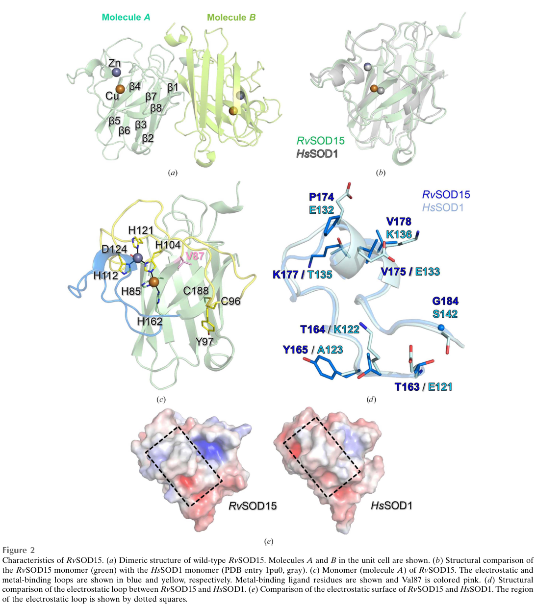

## Question

# Gene Research for Functional Annotation

## ⚠️ CRITICAL: Gene/Protein Identification Context

**BEFORE YOU BEGIN RESEARCH:** You MUST verify you are researching the CORRECT gene/protein. Gene symbols can be ambiguous, especially for less well-characterized genes from non-model organisms.

### Target Gene/Protein Identity (from UniProt):
- **UniProt Accession:** A0A1D1UP68
- **Protein Description:** RecName: Full=Superoxide dismutase [Cu-Zn] {ECO:0000256|RuleBase:RU000393}; EC=1.15.1.1 {ECO:0000256|RuleBase:RU000393};
- **Gene Information:** Name=RvY_03754-1 {ECO:0000313|EMBL:GAU91516.1}; Synonyms=RvY_03754.1 {ECO:0000313|EMBL:GAU91516.1}; ORFNames=RvY_03754 {ECO:0000313|EMBL:GAU91516.1};
- **Organism (full):** Ramazzottius varieornatus (Water bear) (Tardigrade).
- **Protein Family:** Belongs to the Cu-Zn superoxide dismutase family.
- **Key Domains:** SOD-like_Cu/Zn_dom_sf. (IPR036423); SOD_Cu/Zn_/chaperone. (IPR024134); SOD_Cu/Zn_BS. (IPR018152); SOD_Cu_Zn_dom. (IPR001424); Sod_Cu (PF00080)

### MANDATORY VERIFICATION STEPS:

1. **Check if the gene symbol "RvY_03754-1" matches the protein description above**
2. **Verify the organism is correct:** Ramazzottius varieornatus (Water bear) (Tardigrade).
3. **Check if protein family/domains align with what you find in literature**
4. **If you find literature for a DIFFERENT gene with the same or similar symbol, STOP**

### If Gene Symbol is Ambiguous or You Cannot Find Relevant Literature:

**DO NOT PROCEED WITH RESEARCH ON A DIFFERENT GENE.** Instead:
- State clearly: "The gene symbol 'RvY_03754-1' is ambiguous or literature is limited for this specific protein"
- Explain what you found (e.g., "Found extensive literature on a different gene with the same symbol in a different organism")
- Describe the protein based ONLY on the UniProt information provided above
- Suggest that the protein function can be inferred from domain/family information

### Research Target:

Please provide a comprehensive research report on the gene **RvY_03754-1** (gene ID: RvY_03754, UniProt: A0A1D1UP68) in RAMVA.

The research report should be a detailed narrative explaining the function, biological processes, and localization of the gene product. Citations should be given for all claims.

You should prioritize authoritative reviews and primary scientific literature when conducting research. You can supplement
this with annotations you find in gene/protein databases, but these can be outdated or inaccurate.

We are specifically interested in the primary function of the gene - for enzymes, what reaction is catalyzed, and what is the substrate specificity? For transporters, what is the substrate? For structural proteins or adapters, what is the broader structural role? For signaling molecules, what is the role in the pathway.

We are interested in where in or outside the cell the gene product carries out its function.

We are also interested in the signaling or biochemical pathways in which the gene functions. We are less interested in broad pleiotropic effects, except where these elucidate the precise role.

Include evidence where possible. We are interested in both experimental evidence as well as inference from structure, evolution, or bioinformatic analysis. Precise studies should be prioritized over high-throughput, where available.

## Output

Question: You are an expert researcher providing comprehensive, well-cited information.

Provide detailed information focusing on:
1. Key concepts and definitions with current understanding
2. Recent developments and latest research (prioritize 2023-2024 sources)
3. Current applications and real-world implementations
4. Expert opinions and analysis from authoritative sources
5. Relevant statistics and data from recent studies

Format as a comprehensive research report with proper citations. Include URLs and publication dates where available.
Always prioritize recent, authoritative sources and provide specific citations for all major claims.

# Gene Research for Functional Annotation

## ⚠️ CRITICAL: Gene/Protein Identification Context

**BEFORE YOU BEGIN RESEARCH:** You MUST verify you are researching the CORRECT gene/protein. Gene symbols can be ambiguous, especially for less well-characterized genes from non-model organisms.

### Target Gene/Protein Identity (from UniProt):
- **UniProt Accession:** A0A1D1UP68
- **Protein Description:** RecName: Full=Superoxide dismutase [Cu-Zn] {ECO:0000256|RuleBase:RU000393}; EC=1.15.1.1 {ECO:0000256|RuleBase:RU000393};
- **Gene Information:** Name=RvY_03754-1 {ECO:0000313|EMBL:GAU91516.1}; Synonyms=RvY_03754.1 {ECO:0000313|EMBL:GAU91516.1}; ORFNames=RvY_03754 {ECO:0000313|EMBL:GAU91516.1};
- **Organism (full):** Ramazzottius varieornatus (Water bear) (Tardigrade).
- **Protein Family:** Belongs to the Cu-Zn superoxide dismutase family.
- **Key Domains:** SOD-like_Cu/Zn_dom_sf. (IPR036423); SOD_Cu/Zn_/chaperone. (IPR024134); SOD_Cu/Zn_BS. (IPR018152); SOD_Cu_Zn_dom. (IPR001424); Sod_Cu (PF00080)

### MANDATORY VERIFICATION STEPS:

1. **Check if the gene symbol "RvY_03754-1" matches the protein description above**
2. **Verify the organism is correct:** Ramazzottius varieornatus (Water bear) (Tardigrade).
3. **Check if protein family/domains align with what you find in literature**
4. **If you find literature for a DIFFERENT gene with the same or similar symbol, STOP**

### If Gene Symbol is Ambiguous or You Cannot Find Relevant Literature:

**DO NOT PROCEED WITH RESEARCH ON A DIFFERENT GENE.** Instead:
- State clearly: "The gene symbol 'RvY_03754-1' is ambiguous or literature is limited for this specific protein"
- Explain what you found (e.g., "Found extensive literature on a different gene with the same symbol in a different organism")
- Describe the protein based ONLY on the UniProt information provided above
- Suggest that the protein function can be inferred from domain/family information

### Research Target:

Please provide a comprehensive research report on the gene **RvY_03754-1** (gene ID: RvY_03754, UniProt: A0A1D1UP68) in RAMVA.

The research report should be a detailed narrative explaining the function, biological processes, and localization of the gene product. Citations should be given for all claims.

You should prioritize authoritative reviews and primary scientific literature when conducting research. You can supplement
this with annotations you find in gene/protein databases, but these can be outdated or inaccurate.

We are specifically interested in the primary function of the gene - for enzymes, what reaction is catalyzed, and what is the substrate specificity? For transporters, what is the substrate? For structural proteins or adapters, what is the broader structural role? For signaling molecules, what is the role in the pathway.

We are interested in where in or outside the cell the gene product carries out its function.

We are also interested in the signaling or biochemical pathways in which the gene functions. We are less interested in broad pleiotropic effects, except where these elucidate the precise role.

Include evidence where possible. We are interested in both experimental evidence as well as inference from structure, evolution, or bioinformatic analysis. Precise studies should be prioritized over high-throughput, where available.

# Functional annotation research report: **RvY_03754-1** (UniProt **A0A1D1UP68**) from *Ramazzottius varieornatus*

## 1) Identity verification and scope
**Target specified by user**: UniProt A0A1D1UP68; gene name **RvY_03754-1** (syn. RvY_03754.1; ORF RvY_03754) from the tardigrade *Ramazzottius varieornatus*; protein family **Cu/Zn superoxide dismutase (SOD)**; enzyme class **EC 1.15.1.1**.

**Evidence limitation**: within the retrieved literature corpus, no paper explicitly mentions the exact UniProt accession **A0A1D1UP68** or the gene symbol **RvY_03754-1**. Consequently, any **protein-specific** claims beyond the UniProt description must be treated as *inference from family/domain membership* plus *nearest-neighbor evidence* from other *R. varieornatus* Cu/Zn SOD-like paralogs with direct experimental characterization (notably **RvSOD15**). This report therefore avoids attributing RvSOD15-specific sequence features (e.g., Val87) to A0A1D1UP68 unless explicitly supported.

## 2) Key concepts and definitions (current understanding)
### 2.1 Reactive oxygen species (ROS) and oxidative stress in anhydrobiosis
During anhydrobiosis (desiccation-induced ametabolic “tun” state) and rehydration, organisms can experience oxidative stress due to ROS generation and imbalances between ROS production and antioxidant capacity. A contemporary tardigrade-focused review frames oxidative defense as central to cryptobiosis/extremotolerance and discusses “preparation for oxidative stress”—induction/maintenance of antioxidants during dehydration to mitigate ROS bursts upon rehydration (sadowskabartosz2024antioxidantdefensein pages 16-17).

### 2.2 Cu/Zn superoxide dismutase (SOD; EC 1.15.1.1)
**Superoxide dismutases (SODs)** are antioxidant enzymes that **dismutate superoxide (O2•−) into molecular oxygen and hydrogen peroxide**, typically described by the net reaction:

**2 O2•− + 2 H+ → O2 + H2O2** (sim2023structureofa pages 1-2, sadowskabartosz2024antioxidantdefensein pages 13-15).

Cu/Zn SODs are widely distributed and classically consist of a β-barrel (“Greek-key”) fold with active-site metal cofactors and loops that guide substrate to the catalytic copper center (sim2023structureofa pages 3-4).

## 3) Primary function and biochemical mechanism of the gene product (family-level functional inference for A0A1D1UP68)
### 3.1 Catalyzed reaction and substrate specificity
Given the UniProt designation (EC 1.15.1.1) and Cu/Zn SOD family assignment, the **primary biochemical function** inferred for A0A1D1UP68 is detoxification of **superoxide anion radical (O2•−)** through dismutation to **H2O2 and O2** (sim2023structureofa pages 1-2, sadowskabartosz2024antioxidantdefensein pages 13-15).

The substrate specificity of canonical SODs is for **superoxide** (rather than broad ROS), consistent with the “first ROS formed” narrative in biological systems emphasized in tardigrade antioxidant reviews (O2•− as an initial ROS species) (sadowskabartosz2024antioxidantdefensein pages 13-15).

### 3.2 Metal cofactors and active-site features (Cu/Zn SOD family)
Cu/Zn SODs require **copper** (catalysis/redox cycling) and **zinc** (structural) at the active site. In the closest organism-matched primary study available, a *R. varieornatus* Cu/Zn SOD-like protein (**RvSOD15**) was solved by crystallography and metals were validated by **anomalous scattering**, supporting bona fide Cu and Zn occupancy in a tardigrade Cu/Zn SOD scaffold (sim2023structureofa pages 3-4, sim2023structureofa pages 2-3).

However, the same study demonstrates that not all *R. varieornatus* “Cu/Zn SOD-like” paralogs necessarily retain canonical catalytic competence: RvSOD15 carries an unusual substitution at a canonical copper-liganding position (His→Val), and even a back-mutation (V87H) can be structurally destabilized by a nearby flexible loop, suggesting reduced/abrogated SOD activity in that paralog (sim2023structureofa pages 1-2, sim2023structureofa pages 7-9).

**Implication for A0A1D1UP68 annotation**: family membership supports annotating **SOD activity**, but *R. varieornatus* contains atypical paralogs; therefore, confident assignment of **full catalytic activity** for A0A1D1UP68 would ideally require direct biochemical assay or conservation analysis of canonical metal-binding residues (not available in the retrieved corpus). This is consistent with the structural paper’s conclusion that some RvSOD paralogs may have evolved altered or lost canonical SOD function (sim2023structureofa pages 1-2, sim2023structureofa pages 7-9).

### 3.3 Structural determinants of activity (nearest-neighbor evidence)
The RvSOD15 structure illustrates key determinants that can modulate activity in Cu/Zn SOD-like proteins:
- The **electrostatic loop** contributes charged/polar residues that guide anionic substrate toward the catalytic copper site; changes in this region can affect activity and/or metal uptake/reconstitution (sim2023structureofa pages 3-4, sim2023structureofa pages 7-9).
- The **metal-binding loop** geometry and flexibility influence copper coordination; in RvSOD15, loop features and water positioning near copper differ from canonical expectations, and the mutant remains unlikely to form a catalytically suitable copper site (sim2023structureofa pages 7-9).

**Figures supporting these points** are available from the paper’s structural panels (showing Val87/His87 region, electrostatic and metal-binding loops, and the copper site) (sim2023structureofa media ccb4aeae, sim2023structureofa media 56ed6f20, sim2023structureofa media 89eab734).

## 4) Subcellular localization and biological process context
### 4.1 Localization inference for A0A1D1UP68
The UniProt-derived domain context indicates a cytosolic-like Cu/Zn SOD fold, but the retrieved literature does not contain direct localization experiments for A0A1D1UP68.

### 4.2 Evidence that *R. varieornatus* includes secreted Cu/Zn SOD-like proteins
A *R. varieornatus* Cu/Zn SOD-like paralog (**RvSOD15**) is **predicted to possess an N-terminal signal peptide, indicating secretion** (sim2023structureofa pages 3-4, sim2023structureofa pages 2-3). This demonstrates that *R. varieornatus* Cu/Zn SOD-like proteins can plausibly function in **extracellular/secretory** contexts, not only canonical intracellular (cytosolic) settings.

**Annotation implication**: for A0A1D1UP68, subcellular localization should be treated as an **open attribute** unless corroborated by sequence-level targeting motifs (signal peptide, peroxisomal targeting, mitochondrial targeting) or experimental localization.

### 4.3 Biological process: oxidative stress defense during anhydrobiosis
A 2024 review on tardigrade antioxidant defense summarizes that antioxidant enzymes (including SODs) are regulated across stress states and life stages; for example, SODs are reported as **upregulated in the tun state** in *Milnesium tardigradum* and SOD activity is increased with dehydration in *Paramacrobiotus richtersi* (sadowskabartosz2024antioxidantdefensein pages 16-17). These patterns align with the concept that oxidative defense supports successful entry into and recovery from anhydrobiosis (sadowskabartosz2024antioxidantdefensein pages 16-17).

## 5) Recent developments (prioritizing 2023–2024)
### 5.1 2023: structural genomics clarifies that some tardigrade Cu/Zn SOD paralogs are atypical
The 2023 crystallographic study of **RvSOD15** provides one of the most direct molecular-level insights into *R. varieornatus* Cu/Zn SOD-like proteins, revealing that gene-family expansion does not imply uniform enzymatic function. The authors propose that some paralogs may have low/absent canonical SOD activity and potentially unknown roles (sim2023structureofa pages 1-2, sim2023structureofa pages 7-9). This directly impacts functional annotation strategy: **do not assume all paralogs are equivalent antioxidants** without residue-level conservation or assay (sim2023structureofa pages 7-9).

### 5.2 2024: synthesis of antioxidant defense and SOD gene expansion in tardigrades
A 2024 authoritative review compiles evidence for **SOD gene-family expansion** in tardigrades and reports high CuZn-SOD expression in *R. varieornatus* (sadowskabartosz2024antioxidantdefensein pages 13-15). The review provides gene-count context across species (with some internal inconsistency between narrative and table values) but supports the overall conclusion of expanded SOD repertoires relative to humans (sadowskabartosz2024antioxidantdefensein pages 13-15).

## 6) Statistics and data points from recent studies
### 6.1 SOD gene family size in *R. varieornatus* (review-reported)
The 2024 review reports **~16 SODs** in *R. varieornatus* and indicates that **CuZn-SODs are highly expressed** in *R. varieornatus* (sadowskabartosz2024antioxidantdefensein pages 13-15). (The same excerpt also contains a nearby table line listing *R. varieornatus* SOD counts as 17; this discrepancy highlights uncertainty in compiled gene counts and should be checked against the underlying genome annotation in a dedicated database query.) (sadowskabartosz2024antioxidantdefensein pages 13-15).

### 6.2 Quantitative enzymology/physiology: SOD activity changes across anhydrobiosis kinetics (other tardigrades)
In a 2022 experimental study measuring antioxidant enzymes during dehydration and rehydration:
- In *Acutuncus antarcticus*, SOD activity differed significantly across hydration states (one-way ANOVA **F(3,8)=4.33, p<0.05**), with **lower SOD activity in desiccated animals** vs controls (**t=3.62, p<0.05**) (giovannini2022antioxidantresponseduring pages 6-8).
- In *Paramacrobiotus spatialis*, SOD activity showed **no significant differences** among hydrated, dry, and rehydration timepoints (giovannini2022antioxidantresponseduring pages 6-8).

These data demonstrate that **SOD regulation during anhydrobiosis is species- and context-dependent**, an important caution for extrapolating to A0A1D1UP68 without direct measurement in *R. varieornatus*.

### 6.3 Structural metrics indicating altered catalytic competence in an *R. varieornatus* Cu/Zn SOD-like protein
For RvSOD15 (nearest-neighbor evidence), structural features near the copper site include altered water interaction distances (~**2.6–3.4 Å**) and loop-dependent destabilization of a putative copper ligand in the V87H variant (sim2023structureofa pages 7-9). While not a kinetic readout, these data support a mechanistic hypothesis of reduced catalytic competence in at least one *R. varieornatus* paralog (sim2023structureofa pages 7-9).

## 7) Current applications and real-world implementations (evidence-constrained)
### 7.1 Biomarkers/assays for tardigrade stress physiology
Within the retrieved corpus, the clearest “real-world implementation” relevant to SOD is its routine use as a **biochemical readout (enzyme activity) of oxidative stress responses** during dehydration/rehydration experiments in tardigrades (giovannini2022antioxidantresponseduring pages 6-8) and as a compiled marker in reviews of tardigrade extremotolerance (sadowskabartosz2024antioxidantdefensein pages 16-17).

### 7.2 Engineering/biotechnology (adjacent context)
No retrieved 2023–2024 source in this session provides direct evidence of **biotechnological deployment specifically of tardigrade SOD proteins** (e.g., as a recombinant therapeutic/enzyme product). The 2024 antioxidant-defense review’s reference context indicates that tardigrade stress genes are explored for engineering stress resistance more broadly (not necessarily SOD-specific) (sadowskabartosz2024antioxidantdefensein pages 23-24), but narrative details on SOD-centered applications were not present in the retrieved review passages.

## 8) Expert synthesis and functional-annotation recommendations for A0A1D1UP68
1. **Core molecular function (most defensible)**: annotate as **superoxide dismutase, Cu/Zn-dependent (EC 1.15.1.1)** catalyzing **2 O2•− + 2 H+ → O2 + H2O2**, consistent with Cu/Zn SOD family assignment and contemporary tardigrade antioxidant reviews (sim2023structureofa pages 1-2, sadowskabartosz2024antioxidantdefensein pages 13-15).
2. **Biological process context**: place in **cellular oxidative stress response**, with likely relevance during **anhydrobiosis/rehydration** where antioxidant systems are induced as “preparation for oxidative stress” (sadowskabartosz2024antioxidantdefensein pages 16-17).
3. **Localization**: treat as **unknown/needs confirmation** for this specific accession; *R. varieornatus* includes at least one Cu/Zn SOD-like paralog predicted to be **secreted** (signal peptide) (sim2023structureofa pages 3-4, sim2023structureofa pages 2-3), so extracellular/secretory localization is plausible for some paralogs.
4. **Activity caution** (important): the 2023 *R. varieornatus* structure demonstrates that some Cu/Zn SOD-like paralogs may have **altered metal-binding residues/loops** and potentially diminished canonical enzymatic activity; thus, for A0A1D1UP68, catalytic competence should ideally be corroborated by (i) conservation of canonical metal-binding residues and electrostatic-loop features, and/or (ii) enzymatic activity assays under relevant stress conditions (sim2023structureofa pages 1-2, sim2023structureofa pages 7-9).

## Evidence summary table
| Study (citation) | Publication date | Organism/species | Molecule(s) studied | Main finding relevant to function/structure/localization | Quantitative/statistical details | URL/DOI |
|---|---|---|---|---|---|---|
| Sim & Inoue, *Acta Crystallographica F* (sim2023structureofa pages 1-2, sim2023structureofa pages 3-4, sim2023structureofa pages 2-3) | Jun 2023 | *Ramazzottius varieornatus* strain YOKOZUNA-1 | RvSOD15 (Cu/Zn SOD-like protein), V87H mutant | Established nearest-neighbor experimental evidence in the same species: Cu/Zn SOD-like protein adopts canonical Cu/Zn SOD fold and carries Cu and Zn, but an active-site His ligand is replaced by Val87; protein is also predicted to have an N-terminal signal peptide, suggesting secretion rather than classic cytosolic localization. | Catalyzed reaction discussed as 2 O2•− + 2 H+ → O2 + H2O2; crystal resolutions 2.20 Å (WT) and 2.10 Å (V87H); anomalous scattering confirmed Cu/Zn positions; sequence similarity reported as 44% to human SOD1 and 56% to a *Hypsibius exemplaris* Cu/Zn SOD. | https://doi.org/10.1107/S2053230X2300523X |
| Sim & Inoue, *Acta Crystallographica F* (sim2023structureofa pages 7-9, sim2023structureofa media ccb4aeae, sim2023structureofa media 56ed6f20, sim2023structureofa media 89eab734) | Jun 2023 | *Ramazzottius varieornatus* strain YOKOZUNA-1 | RvSOD15 and modeled RvSOD paralogs | Showed that some *R. varieornatus* Cu/Zn SOD paralogs are structurally atypical, with altered metal-binding residues, deletions in the electrostatic loop or β3 sheet, and likely reduced or lost canonical SOD activity; supports caution in assigning all tardigrade SOD paralogs as fully active enzymes. | Water interaction distances near Cu site 2.6–3.4 Å; V87H mutant still judged catalytically unsuitable; comparison cited to P104H BsSOD with activity ~10,000-fold lower than canonical Cu/Zn SODs; AlphaFold pLDDT examples: RvSOD15 86.99, RvSOD12 77.15, RvSOD16 var1 92.19; WT/V87H Rwork/Rfree 19.3/23.2 and 17.2/21.4. | https://doi.org/10.1107/S2053230X2300523X |
| Giovannini et al., *Life* (giovannini2022antioxidantresponseduring pages 6-8) | May 2022 | *Paramacrobiotus spatialis* and *Acutuncus antarcticus* | Total SOD enzymatic activity during dehydration/rehydration | Provides tardigrade-level physiological evidence that SOD activity changes during anhydrobiosis, supporting antioxidant function in dehydration stress, though not specific to the A0A1D1UP68 protein. | In *P. spatialis*, no significant SOD differences among hydrated, dry, 1 h rehydrated, and 24 h rehydrated groups; in *A. antarcticus*, one-way ANOVA F(3,8) = 4.33, p < 0.05; dry animals had lower SOD activity than controls (t = 3.62, p < 0.05). | https://doi.org/10.3390/life12060817 |
| Nagwani et al., *Diversity* (nagwani2022applicablelifehistoryand pages 10-11) | Aug 2022 | Tardigrades (review; includes *Ramazzottius varieornatus* context) | Antioxidant enzymes including SOD, CAT, GPx, GR | Review-level synthesis: SOD is part of endogenous ROS-detoxifying machinery implicated in successful anhydrobiosis; places Cu/Zn SOD-like proteins into the oxidative-stress pathway relevant to tardigrade survival and recovery. | Summarizes increased ROS with time in anhydrobiosis and notes reports that CAT/SOD activities are important in tardigrade anhydrobiosis; no protein-specific kinetic values for *R. varieornatus* Cu/Zn SOD given in the cited excerpt. | https://doi.org/10.3390/d14080664 |
| Sim & Inoue, *Acta Crystallographica F* (sim2023structureofa pages 1-2) | Jun 2023 | *Ramazzottius varieornatus* strain YOKOZUNA-1 | RvSOD15 and other RvSOD family members | Concluded that tardigrades possess expanded antioxidant repertoires including SODs, but duplication does not imply equivalent enzyme function; some RvSOD members may be neofunctionalized or noncanonical. | No exact family count or expression fold-change reported in the excerpt; qualitative conclusion that some paralogs are truncated or mutated at catalytic residues. | https://doi.org/10.1107/S2053230X2300523X |

*Table: This table compiles the most relevant experimental and review evidence for functional annotation of *Ramazzottius varieornatus* Cu/Zn SOD-like proteins as proxies for UniProt A0A1D1UP68. It highlights what is directly known in tardigrades about reaction chemistry, structural constraints, likely localization, and stress-related roles.*

## Key primary sources (with publication dates and URLs)
- Sim K-S, Inoue T. **“Structure of a superoxide dismutase from a tardigrade: *Ramazzottius varieornatus* strain YOKOZUNA-1.”** *Acta Crystallographica Section F* (online 26 Jun **2023**). https://doi.org/10.1107/S2053230X2300523X (sim2023structureofa pages 1-2, sim2023structureofa pages 7-9, sim2023structureofa pages 3-4, sim2023structureofa pages 2-3)
- Sadowska-Bartosz I, Bartosz G. **“Antioxidant Defense in the Toughest Animals on the Earth: Its Contribution to the Extreme Resistance of Tardigrades.”** *International Journal of Molecular Sciences* (Aug **2024**). https://doi.org/10.3390/ijms25158393 (sadowskabartosz2024antioxidantdefensein pages 13-15, sadowskabartosz2024antioxidantdefensein pages 16-17)
- Giovannini I et al. **“Antioxidant Response during the Kinetics of Anhydrobiosis in Two Eutardigrade Species.”** *Life* (May **2022**). https://doi.org/10.3390/life12060817 (giovannini2022antioxidantresponseduring pages 6-8)

## Figures (structural evidence)
Cropped figure regions showing RvSOD15 overall fold/loops and copper-site details supporting the mechanistic discussion are available from the structural paper (sim2023structureofa media ccb4aeae, sim2023structureofa media 56ed6f20, sim2023structureofa media 89eab734).

References

1. (sadowskabartosz2024antioxidantdefensein pages 16-17): Izabela Sadowska-Bartosz and Grzegorz Bartosz. Antioxidant defense in the toughest animals on the earth: its contribution to the extreme resistance of tardigrades. International Journal of Molecular Sciences, 25:8393, Aug 2024. URL: https://doi.org/10.3390/ijms25158393, doi:10.3390/ijms25158393. This article has 14 citations.

2. (sim2023structureofa pages 1-2): Kee-Shin Sim and Tsuyoshi Inoue. Structure of a superoxide dismutase from a tardigrade: ramazzottius varieornatus strain yokozuna-1. Acta crystallographica. Section F, Structural biology communications, 79:169-179, Jun 2023. URL: https://doi.org/10.1107/s2053230x2300523x, doi:10.1107/s2053230x2300523x. This article has 5 citations.

3. (sadowskabartosz2024antioxidantdefensein pages 13-15): Izabela Sadowska-Bartosz and Grzegorz Bartosz. Antioxidant defense in the toughest animals on the earth: its contribution to the extreme resistance of tardigrades. International Journal of Molecular Sciences, 25:8393, Aug 2024. URL: https://doi.org/10.3390/ijms25158393, doi:10.3390/ijms25158393. This article has 14 citations.

4. (sim2023structureofa pages 3-4): Kee-Shin Sim and Tsuyoshi Inoue. Structure of a superoxide dismutase from a tardigrade: ramazzottius varieornatus strain yokozuna-1. Acta crystallographica. Section F, Structural biology communications, 79:169-179, Jun 2023. URL: https://doi.org/10.1107/s2053230x2300523x, doi:10.1107/s2053230x2300523x. This article has 5 citations.

5. (sim2023structureofa pages 2-3): Kee-Shin Sim and Tsuyoshi Inoue. Structure of a superoxide dismutase from a tardigrade: ramazzottius varieornatus strain yokozuna-1. Acta crystallographica. Section F, Structural biology communications, 79:169-179, Jun 2023. URL: https://doi.org/10.1107/s2053230x2300523x, doi:10.1107/s2053230x2300523x. This article has 5 citations.

6. (sim2023structureofa pages 7-9): Kee-Shin Sim and Tsuyoshi Inoue. Structure of a superoxide dismutase from a tardigrade: ramazzottius varieornatus strain yokozuna-1. Acta crystallographica. Section F, Structural biology communications, 79:169-179, Jun 2023. URL: https://doi.org/10.1107/s2053230x2300523x, doi:10.1107/s2053230x2300523x. This article has 5 citations.

7. (sim2023structureofa media ccb4aeae): Kee-Shin Sim and Tsuyoshi Inoue. Structure of a superoxide dismutase from a tardigrade: ramazzottius varieornatus strain yokozuna-1. Acta crystallographica. Section F, Structural biology communications, 79:169-179, Jun 2023. URL: https://doi.org/10.1107/s2053230x2300523x, doi:10.1107/s2053230x2300523x. This article has 5 citations.

8. (sim2023structureofa media 56ed6f20): Kee-Shin Sim and Tsuyoshi Inoue. Structure of a superoxide dismutase from a tardigrade: ramazzottius varieornatus strain yokozuna-1. Acta crystallographica. Section F, Structural biology communications, 79:169-179, Jun 2023. URL: https://doi.org/10.1107/s2053230x2300523x, doi:10.1107/s2053230x2300523x. This article has 5 citations.

9. (sim2023structureofa media 89eab734): Kee-Shin Sim and Tsuyoshi Inoue. Structure of a superoxide dismutase from a tardigrade: ramazzottius varieornatus strain yokozuna-1. Acta crystallographica. Section F, Structural biology communications, 79:169-179, Jun 2023. URL: https://doi.org/10.1107/s2053230x2300523x, doi:10.1107/s2053230x2300523x. This article has 5 citations.

10. (giovannini2022antioxidantresponseduring pages 6-8): Ilaria Giovannini, Paola Antonia Corsetto, Tiziana Altiero, Gigliola Montorfano, Roberto Guidetti, Angela Maria Rizzo, and Lorena Rebecchi. Antioxidant response during the kinetics of anhydrobiosis in two eutardigrade species. Life, 12:817, May 2022. URL: https://doi.org/10.3390/life12060817, doi:10.3390/life12060817. This article has 16 citations.

11. (sadowskabartosz2024antioxidantdefensein pages 23-24): Izabela Sadowska-Bartosz and Grzegorz Bartosz. Antioxidant defense in the toughest animals on the earth: its contribution to the extreme resistance of tardigrades. International Journal of Molecular Sciences, 25:8393, Aug 2024. URL: https://doi.org/10.3390/ijms25158393, doi:10.3390/ijms25158393. This article has 14 citations.

12. (nagwani2022applicablelifehistoryand pages 10-11): Amit Kumar Nagwani, Łukasz Kaczmarek, and Hanna Kmita. Applicable life-history and molecular traits for studying the effects of anhydrobiosis on aging in tardigrades. Diversity, 14:664, Aug 2022. URL: https://doi.org/10.3390/d14080664, doi:10.3390/d14080664. This article has 10 citations.

## Artifacts

- [Edison artifact artifact-00](RvY_03754-deep-research-falcon_artifacts/artifact-00.md)

## Citations

1. sadowskabartosz2024antioxidantdefensein pages 16-17
2. sim2023structureofa pages 3-4
3. sadowskabartosz2024antioxidantdefensein pages 13-15
4. sim2023structureofa pages 7-9
5. giovannini2022antioxidantresponseduring pages 6-8
6. sadowskabartosz2024antioxidantdefensein pages 23-24
7. nagwani2022applicablelifehistoryand pages 10-11
8. sim2023structureofa pages 1-2
9. sim2023structureofa pages 2-3
10. Cu-Zn
11. https://doi.org/10.1107/S2053230X2300523X
12. https://doi.org/10.3390/life12060817
13. https://doi.org/10.3390/d14080664
14. https://doi.org/10.3390/ijms25158393
15. https://doi.org/10.3390/ijms25158393,
16. https://doi.org/10.1107/s2053230x2300523x,
17. https://doi.org/10.3390/life12060817,
18. https://doi.org/10.3390/d14080664,