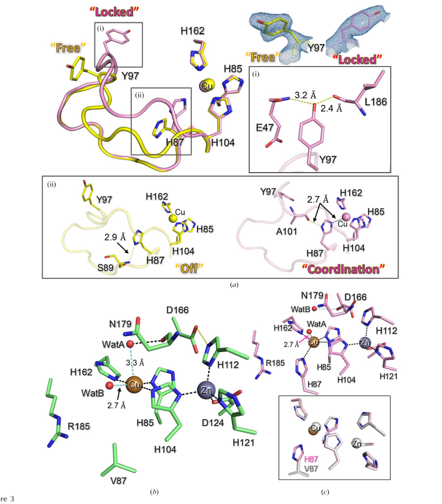

## Question

# Gene Research for Functional Annotation

## ⚠️ CRITICAL: Gene/Protein Identification Context

**BEFORE YOU BEGIN RESEARCH:** You MUST verify you are researching the CORRECT gene/protein. Gene symbols can be ambiguous, especially for less well-characterized genes from non-model organisms.

### Target Gene/Protein Identity (from UniProt):
- **UniProt Accession:** A0A1D1UP59
- **Protein Description:** RecName: Full=Superoxide dismutase [Cu-Zn] {ECO:0000256|RuleBase:RU000393}; EC=1.15.1.1 {ECO:0000256|RuleBase:RU000393};
- **Gene Information:** Name=RvY_03757 {ECO:0000313|EMBL:GAU91519.1}; Synonyms=RvY_03757.1 {ECO:0000313|EMBL:GAU91519.1}; ORFNames=RvY_03757-1 {ECO:0000313|EMBL:GAU91519.1};
- **Organism (full):** Ramazzottius varieornatus (Water bear) (Tardigrade).
- **Protein Family:** Belongs to the Cu-Zn superoxide dismutase family.
- **Key Domains:** SOD-like_Cu/Zn_dom_sf. (IPR036423); SOD_Cu/Zn_/chaperone. (IPR024134); SOD_Cu/Zn_BS. (IPR018152); SOD_Cu_Zn_dom. (IPR001424); Sod_Cu (PF00080)

### MANDATORY VERIFICATION STEPS:

1. **Check if the gene symbol "RvY_03757" matches the protein description above**
2. **Verify the organism is correct:** Ramazzottius varieornatus (Water bear) (Tardigrade).
3. **Check if protein family/domains align with what you find in literature**
4. **If you find literature for a DIFFERENT gene with the same or similar symbol, STOP**

### If Gene Symbol is Ambiguous or You Cannot Find Relevant Literature:

**DO NOT PROCEED WITH RESEARCH ON A DIFFERENT GENE.** Instead:
- State clearly: "The gene symbol 'RvY_03757' is ambiguous or literature is limited for this specific protein"
- Explain what you found (e.g., "Found extensive literature on a different gene with the same symbol in a different organism")
- Describe the protein based ONLY on the UniProt information provided above
- Suggest that the protein function can be inferred from domain/family information

### Research Target:

Please provide a comprehensive research report on the gene **RvY_03757** (gene ID: RvY_03757, UniProt: A0A1D1UP59) in RAMVA.

The research report should be a detailed narrative explaining the function, biological processes, and localization of the gene product. Citations should be given for all claims.

You should prioritize authoritative reviews and primary scientific literature when conducting research. You can supplement
this with annotations you find in gene/protein databases, but these can be outdated or inaccurate.

We are specifically interested in the primary function of the gene - for enzymes, what reaction is catalyzed, and what is the substrate specificity? For transporters, what is the substrate? For structural proteins or adapters, what is the broader structural role? For signaling molecules, what is the role in the pathway.

We are interested in where in or outside the cell the gene product carries out its function.

We are also interested in the signaling or biochemical pathways in which the gene functions. We are less interested in broad pleiotropic effects, except where these elucidate the precise role.

Include evidence where possible. We are interested in both experimental evidence as well as inference from structure, evolution, or bioinformatic analysis. Precise studies should be prioritized over high-throughput, where available.

## Output

Question: You are an expert researcher providing comprehensive, well-cited information.

Provide detailed information focusing on:
1. Key concepts and definitions with current understanding
2. Recent developments and latest research (prioritize 2023-2024 sources)
3. Current applications and real-world implementations
4. Expert opinions and analysis from authoritative sources
5. Relevant statistics and data from recent studies

Format as a comprehensive research report with proper citations. Include URLs and publication dates where available.
Always prioritize recent, authoritative sources and provide specific citations for all major claims.

# Gene Research for Functional Annotation

## ⚠️ CRITICAL: Gene/Protein Identification Context

**BEFORE YOU BEGIN RESEARCH:** You MUST verify you are researching the CORRECT gene/protein. Gene symbols can be ambiguous, especially for less well-characterized genes from non-model organisms.

### Target Gene/Protein Identity (from UniProt):
- **UniProt Accession:** A0A1D1UP59
- **Protein Description:** RecName: Full=Superoxide dismutase [Cu-Zn] {ECO:0000256|RuleBase:RU000393}; EC=1.15.1.1 {ECO:0000256|RuleBase:RU000393};
- **Gene Information:** Name=RvY_03757 {ECO:0000313|EMBL:GAU91519.1}; Synonyms=RvY_03757.1 {ECO:0000313|EMBL:GAU91519.1}; ORFNames=RvY_03757-1 {ECO:0000313|EMBL:GAU91519.1};
- **Organism (full):** Ramazzottius varieornatus (Water bear) (Tardigrade).
- **Protein Family:** Belongs to the Cu-Zn superoxide dismutase family.
- **Key Domains:** SOD-like_Cu/Zn_dom_sf. (IPR036423); SOD_Cu/Zn_/chaperone. (IPR024134); SOD_Cu/Zn_BS. (IPR018152); SOD_Cu_Zn_dom. (IPR001424); Sod_Cu (PF00080)

### MANDATORY VERIFICATION STEPS:

1. **Check if the gene symbol "RvY_03757" matches the protein description above**
2. **Verify the organism is correct:** Ramazzottius varieornatus (Water bear) (Tardigrade).
3. **Check if protein family/domains align with what you find in literature**
4. **If you find literature for a DIFFERENT gene with the same or similar symbol, STOP**

### If Gene Symbol is Ambiguous or You Cannot Find Relevant Literature:

**DO NOT PROCEED WITH RESEARCH ON A DIFFERENT GENE.** Instead:
- State clearly: "The gene symbol 'RvY_03757' is ambiguous or literature is limited for this specific protein"
- Explain what you found (e.g., "Found extensive literature on a different gene with the same symbol in a different organism")
- Describe the protein based ONLY on the UniProt information provided above
- Suggest that the protein function can be inferred from domain/family information

### Research Target:

Please provide a comprehensive research report on the gene **RvY_03757** (gene ID: RvY_03757, UniProt: A0A1D1UP59) in RAMVA.

The research report should be a detailed narrative explaining the function, biological processes, and localization of the gene product. Citations should be given for all claims.

You should prioritize authoritative reviews and primary scientific literature when conducting research. You can supplement
this with annotations you find in gene/protein databases, but these can be outdated or inaccurate.

We are specifically interested in the primary function of the gene - for enzymes, what reaction is catalyzed, and what is the substrate specificity? For transporters, what is the substrate? For structural proteins or adapters, what is the broader structural role? For signaling molecules, what is the role in the pathway.

We are interested in where in or outside the cell the gene product carries out its function.

We are also interested in the signaling or biochemical pathways in which the gene functions. We are less interested in broad pleiotropic effects, except where these elucidate the precise role.

Include evidence where possible. We are interested in both experimental evidence as well as inference from structure, evolution, or bioinformatic analysis. Precise studies should be prioritized over high-throughput, where available.

# Functional Annotation Research Report: **RvY_03757 (UniProt A0A1D1UP59)** in *Ramazzottius varieornatus* (tardigrade)

## Executive summary
The UniProt target (A0A1D1UP59) is annotated as a Cu/Zn superoxide dismutase (Cu/Zn SOD; EC 1.15.1.1). Independent literature verification confirms that the gene symbol **RvY_03757.1** corresponds to a *Ramazzottius varieornatus* Cu/Zn SOD-family member (named **RvSOD6 variant 3**) but it is described as **truncated**, and there is **no direct biochemical activity measurement** reported for this specific gene product in the retrieved sources. Therefore, the safest gene-specific conclusion is that **RvY_03757 encodes a Cu/Zn SOD-like protein whose canonical dismutase activity is uncertain** (likely reduced/absent), while its family context strongly implicates a role in oxidative-stress biology in tardigrades. (sim2023structureofa pages 3-4)

## 1) Identity verification (mandatory) and ambiguity assessment
### 1.1 Verified identity elements
- A recent structure-focused study on tardigrade SODs explicitly lists **RvSOD6 variant 3 = RvY_03757.1** in *R. varieornatus* among Cu/Zn SOD family genes. (sim2023structureofa pages 3-4, sim2023structureofa media e0beceae)
- The same source reports **RvY_03757.1 is truncated**. (sim2023structureofa pages 3-4)

### 1.2 What could *not* be independently verified from retrieved literature
- The retrieved papers did **not** mention the UniProt accession **A0A1D1UP59** explicitly, so the UniProt↔gene mapping cannot be independently cross-validated from these publications alone. (sim2023structureofa pages 3-4)

**Conclusion:** Proceeding with functional annotation is appropriate *only* under the constraint that **RvY_03757 is a Cu/Zn SOD-family paralog in *R. varieornatus*** and appears **truncated**, so its activity/localization should be treated as **hypothesis/inference** unless directly demonstrated. (sim2023structureofa pages 3-4)

## 2) Key concepts and definitions (current understanding)
### 2.1 Cu/Zn superoxide dismutase (EC 1.15.1.1): reaction and substrate
- Superoxide dismutases (SODs) are EC **1.15.1.1** metalloenzymes catalyzing the **dismutation (disproportionation)** of superoxide (O2•−) into **H2O2 and O2**. (zheng2023theapplicationsand pages 2-4, furukawa2023characterizationofa pages 1-2, zheng2023theapplicationsand pages 1-2)
- Kinetic context from a 2023 review: spontaneous superoxide dismutation is ~**2 × 10^5 M−1 s−1** at physiological pH, while SOD catalysis increases the reaction rate by ~**10,000-fold**. (zheng2023theapplicationsand pages 1-2)

### 2.2 Cofactors and catalytic mechanism highlights
- For Cu/Zn SODs, **copper** at the active site is required for catalysis; **zinc** is primarily structural, contributing to stability and affecting pH sensitivity of activity. (zheng2023theapplicationsand pages 2-4, furukawa2023characterizationofa pages 1-2)
- Substrate guidance into the active site is strongly influenced by a **positively charged electrostatic loop** that helps “steer” O2•− toward the copper center; example residues reported include **Lys136 and Arg143** (human SOD1 numbering in the cited review). (zheng2023theapplicationsand pages 1-2)
- A conserved **intramolecular disulfide bond** helps maintain a catalytically competent conformation by tethering loop elements that shape the substrate entry site; this also influences a conserved **Arg** residue important for electrostatic attraction of superoxide. (furukawa2023characterizationofa pages 1-2)

### 2.3 Typical cellular localization (general, not gene-specific)
- In eukaryotes, Cu/Zn SOD (SOD1) is primarily intracellular (cytosol; also described in nucleus, and some intermembrane-space presence), while extracellular Cu/Zn SOD (SOD3) is secreted. (zheng2023theapplicationsand pages 2-4, zheng2023theapplicationsand pages 4-5)
- For bacterial Cu/Zn SODs, a common localization is the oxidizing **periplasm**, contrasting with cytosolic eukaryotic SOD1. (furukawa2023characterizationofa pages 1-2)

## 3) Gene-family and pathway context in *Ramazzottius varieornatus*
### 3.1 Expansion of SOD genes in tardigrades (statistics)
- Comparative transcriptomics reports **16 putative Cu/Zn SOD genes** in *R. cf. varieornatus*, with cumulative expression **1533.6840 TPM** (as reported in the excerpt). (kamilari2019comparativetranscriptomicssuggest pages 7-10)
- A 2024 review summarizes *R. varieornatus* as having **17 SOD genes**, contrasted with “less than ten” SODs in most metazoans and **3 genes** in humans. (sadowskabartosz2024antioxidantdefensein pages 15-16)
- The same 2024 review notes that tardigrade SODs likely distribute across compartments (mitochondria/cytosol/peroxisomes) at the family level, consistent with compartmentalized ROS control. (sadowskabartosz2024antioxidantdefensein pages 13-15)

### 3.2 Biological pathways: oxidative stress buffering and redox signaling
- The product of SOD activity, H2O2, can serve as a diffusible signaling molecule and can be detoxified by catalase, peroxiredoxins, and glutathione peroxidases; H2O2 diffusion via aquaporins is described in a 2023 review context. (zheng2023theapplicationsand pages 1-2, zheng2023theapplicationsand pages 4-5)
- A 2023 review estimates that **~1–2%** of mitochondrial respiratory-chain oxygen consumption may be diverted to superoxide formation, highlighting why SOD capacity is under strong selection. (zheng2023theapplicationsand pages 2-4, zheng2023theapplicationsand pages 1-2)

## 4) Gene-specific functional annotation: **RvY_03757 (RvSOD6 variant 3)**
### 4.1 Evidence-based statements
- **RvY_03757.1 (RvSOD6 variant 3)** is explicitly called out as **truncated** in a 2023 study that catalogs and structurally analyzes *R. varieornatus* Cu/Zn SODs. (sim2023structureofa pages 3-4)
- The same study notes that multiple RvSOD paralogs are atypical (e.g., truncations and/or mutations in copper-binding residues), and that transcriptome evidence indicates expression of these genes. (sim2023structureofa pages 3-4)

### 4.2 What can and cannot be inferred about enzymatic activity
- **Primary function expected by family assignment:** Cu/Zn SODs catalyze superoxide dismutation (O2•− → H2O2 + O2), requiring copper for catalysis and typically zinc for structural stabilization. (zheng2023theapplicationsand pages 2-4, furukawa2023characterizationofa pages 1-2)
- **Gene-specific limitation:** because **RvY_03757.1 is truncated**, the protein may lack essential structural elements (e.g., loops, metal-binding residues, disulfide positioning) needed for diffusion-limited superoxide catalysis; the retrieved literature does not report direct assays confirming SOD activity for this paralog. (sim2023structureofa pages 3-4)

### 4.3 Subcellular localization for RvY_03757
- No direct localization signal or subcellular localization experiment is reported for **RvY_03757.1** in the retrieved sources. (sim2023structureofa pages 3-4)
- By contrast, another paralog, **RvSOD15**, is predicted to have an N-terminal signal peptide (secreted), demonstrating that at least some tardigrade Cu/Zn SOD-like proteins are secretory/extracellular. (sim2023structureofa pages 2-3, sim2023structureofa pages 3-4)

## 5) Recent developments and latest research (prioritizing 2023–2024)
### 5.1 2023: Structural biology reveals atypical Cu/Zn SOD paralogs in *R. varieornatus*
- Crystal structures of a *R. varieornatus* Cu/Zn SOD-like protein (**RvSOD15**) show bound copper and zinc and reveal atypical active-site features (including substitution of a canonical copper ligand position by **Val87** and unusual loop flexibility), supporting the idea that some tardigrade SOD paralogs may have diminished/altered canonical function. (sim2023structureofa pages 4-7, sim2023structureofa pages 2-3, sim2023structureofa pages 1-2, sim2023structureofa media c06cb5e6)
- Importantly for this report, this 2023 study explicitly lists **RvY_03757.1** among truncated paralogs, providing the best current gene-specific clue about function loss/alteration. (sim2023structureofa pages 3-4, sim2023structureofa media e0beceae)

### 5.2 2024: Synthesis of tardigrade antioxidant defense emphasizes gene expansion but cautions against “more copies = more activity”
- A 2024 review synthesizes evidence that *R. varieornatus* has an expanded SOD repertoire (17 genes) and highlights that some RvSODs appear to have evolved atypical features consistent with possible **loss of SOD function**, arguing that duplication alone may not explain tardigrade extremotolerance. (sadowskabartosz2024antioxidantdefensein pages 15-16, sadowskabartosz2024antioxidantdefensein pages 13-15)

## 6) Current applications and real-world implementations (Cu/Zn SOD context)
Although RvY_03757 itself is not yet an engineered protein with direct translational use in the retrieved literature, Cu/Zn SODs as a class have extensive application development.

### 6.1 Topical/dermatologic application examples (quantitative)
- A 2023 review reports that **topical TAT-SOD** (SOD delivered via an HIV-TAT peptide) **increased minimum erythema dose by 36.6 ± 18.4%** and **reduced apoptotic sunburn cells by 47.6 ± 8.6%** in male subjects exposed to UVB. (zheng2023theapplicationsand pages 14-15)

### 6.2 Formulation and delivery strategies (with quantitative details)
- PEGylation: high-molecular-weight PEG (**41,000–72,000 Da**) retained **90–100% activity** in the cited example. (zheng2023theapplicationsand pages 14-15)
- Encapsulation/delivery systems: niosomes (hair-follicle delivery), hydrogels (e.g., N,O-carboxymethyl chitosan-heparin), and other protective formulations are described as strategies to address SOD instability and short half-life. (zheng2023theapplicationsand pages 14-15, zheng2023theapplicationsand pages 15-16)

### 6.3 Food/agriculture examples
- Transgenic expression of **cassava CuZnSOD** in cucumber fruit increased SOD-specific activity by approximately **~3×** compared with controls (as summarized in the 2023 review). (zheng2023theapplicationsand pages 14-15)

### 6.4 Documented commercial/product examples
- The 2023 review notes incorporation into consumer products such as **Dabao SOD honey** and **Meijiajing SOD toothpaste**. (zheng2023theapplicationsand pages 14-15)

## 7) Expert opinions / authoritative analysis: limitations and future directions
Authoritative synthesis in 2023 emphasizes that, despite broad promise across medicine/food/cosmetics, SOD use is constrained by delivery and durability.

- Key limitations emphasized include **poor stability**, **short in vivo half-life**, **protease susceptibility**, challenges with **membrane permeability**, and uncertainty about whether orally administered SOD can be absorbed/used in the presence of gastric digestion; PTD-mediated delivery is noted to have drawbacks including **lack of cell specificity** and **short action time**. (zheng2023theapplicationsand pages 14-15, zheng2023theapplicationsand pages 15-16)
- Suggested directions include combining **cell-penetrating peptides**, **encapsulation (liposomes/niosomes)**, **PEGylation**, and development of **thermostable/engineered SOD variants** and **SOD mimetics/nanozymes**, with more rigorous clinical evaluation. (zheng2023theapplicationsand pages 14-15, zheng2023theapplicationsand pages 15-16)

## 8) Evidence-based functional hypothesis for **RvY_03757**
Given the gene’s explicit placement in the RvSOD repertoire and its truncation:
- **Most conservative annotation:** “Cu/Zn superoxide dismutase family protein (SOD-like), truncated; enzymatic activity uncertain.” (sim2023structureofa pages 3-4)
- **Likely biological role (inference):** member of an expanded antioxidant-defense gene family in *R. varieornatus* that contributes to oxidative stress management during extreme stress and recovery, but with the possibility that some paralogs have diverged to non-canonical functions. (sadowskabartosz2024antioxidantdefensein pages 15-16, sadowskabartosz2024antioxidantdefensein pages 13-15, sim2023structureofa pages 3-4)

## 9) Key gaps and recommended next experiments
### 9.1 Gaps (gene-specific)
- No retrieved primary study reports **enzyme kinetics/activity**, **metal occupancy**, or **subcellular localization** for **RvY_03757** specifically. (sim2023structureofa pages 3-4)

### 9.2 High-value follow-ups
- Recombinant expression and metalation + SOD activity assay (e.g., cytochrome c reduction or WST-1 assay) to test whether truncation abolishes activity.
- ICP-MS or anomalous scattering (as used for RvSOD15) for Cu/Zn binding.
- Cellular localization via tagged expression in a heterologous system or immunolocalization if antibodies can be generated.

## Evidence summary table
| Entity (gene/protein) | Evidence type | Key finding | Biological implication | Source (paper + year + URL) |
|---|---|---|---|---|
| **RvY_03757.1 (RvSOD6 variant 3)** | Structural / sequence analysis | Explicitly identified in *Ramazzottius varieornatus* as **RvSOD6 variant 3 (RvY_03757.1)** and reported to be **truncated**; grouped among atypical Cu/Zn SOD-like genes that are nevertheless expressed in transcriptome data. (sim2023structureofa pages 3-4, sim2023structureofa media e0beceae) | Supports assignment of **A0A1D1UP59** to the RvSOD family, but the truncation argues that its **canonical Cu/Zn superoxide dismutase activity is uncertain** or potentially reduced/lost; no direct localization or biochemical assay was reported for this specific protein in the provided literature. (sim2023structureofa pages 3-4) | Sim & Inoue 2023, *Acta Crystallographica Section F* — https://doi.org/10.1107/S2053230X2300523X |
| **RvSOD15 (GenBank GAV02514.1)** | Structural | Crystal structures of wild-type and V87H mutant were solved; protein is a **Cu/Zn-containing SOD-like protein** with experimentally confirmed Cu and Zn binding, but it has an unusual **Val87 substitution** at a canonical copper-ligand position and a flexible/disordered metal-binding loop. (sim2023structureofa pages 4-7, sim2023structureofa pages 2-3, sim2023structureofa pages 1-2) | Direct evidence that at least one *R. varieornatus* RvSOD family member binds Cu/Zn. However, the unusual active-site architecture suggests some duplicated tardigrade Cu/Zn SODs may have **non-canonical or diminished SOD function**. (sim2023structureofa pages 4-7, sim2023structureofa pages 1-2) | Sim & Inoue 2023, *Acta Crystallographica Section F* — https://doi.org/10.1107/S2053230X2300523X |
| **RvSOD15 (GenBank GAV02514.1)** | Structural / localization inference | Predicted to contain an **N-terminal signal peptide**, indicating that this protein is **secreted**. (sim2023structureofa pages 2-3, sim2023structureofa pages 3-4) | Shows that not all tardigrade Cu/Zn SOD-like proteins are necessarily cytosolic; some family members likely function in the **extracellular/secretory compartment**. (sim2023structureofa pages 2-3, sim2023structureofa pages 3-4) | Sim & Inoue 2023, *Acta Crystallographica Section F* — https://doi.org/10.1107/S2053230X2300523X |
| **Cu/Zn SOD gene family in *R. varieornatus*** | Transcriptomic | Comparative transcriptomics reported **16 putative CuZn-SOD genes** in *R. cf. varieornatus* with cumulative expression **1533.6840 TPM**. (kamilari2019comparativetranscriptomicssuggest pages 7-10) | Indicates a **large and actively expressed Cu/Zn SOD repertoire**, consistent with strong antioxidant capacity and likely importance in oxidative-stress management in tardigrades. (kamilari2019comparativetranscriptomicssuggest pages 7-10) | Kamilari et al. 2019, *BMC Genomics* — https://doi.org/10.1186/s12864-019-5912-x |
| **SOD gene family in *R. varieornatus*** | Review | Review summarizes *R. varieornatus* as having **17 SOD genes**, exceeding the typical metazoan complement (noted as usually fewer than 10; humans have 3). (sadowskabartosz2024antioxidantdefensein pages 15-16) | Supports the view that antioxidant-gene expansion is a notable genomic feature of *R. varieornatus*, though expansion alone may not guarantee canonical enzymatic function for every paralog. (sadowskabartosz2024antioxidantdefensein pages 15-16) | Sadowska-Bartosz & Bartosz 2024, *International Journal of Molecular Sciences* — https://doi.org/10.3390/ijms25158393 |
| **Atypical RvSOD paralogs in *R. varieornatus*** | Structural / review synthesis | Several RvSOD genes besides RvY_03757.1 are described as atypical: some are **truncated**, while others harbor **numerous mutations in copper-binding residues**; the review highlights that some RvSODs may have evolved to **lose SOD function**. (sim2023structureofa pages 3-4, sadowskabartosz2024antioxidantdefensein pages 15-16) | Functional annotation of any single RvSOD paralog, including **RvY_03757**, should therefore be treated cautiously: family membership supports a Cu/Zn SOD-like assignment, but **direct biochemical confirmation is lacking** for many paralogs. (sim2023structureofa pages 3-4, sadowskabartosz2024antioxidantdefensein pages 15-16) | Sim & Inoue 2023, *Acta Crystallographica Section F* — https://doi.org/10.1107/S2053230X2300523X; Sadowska-Bartosz & Bartosz 2024, *Int J Mol Sci* — https://doi.org/10.3390/ijms25158393 |
| **SOD repertoire in tardigrades / *R. varieornatus*** | Review | Review states tardigrade SODs are likely distributed across **mitochondria, cytosol, and peroxisomes**, and frames SOD expansion as part of antioxidant defenses associated with survival under hostile conditions and recovery from cryptobiosis. (sadowskabartosz2024antioxidantdefensein pages 13-15) | For **RvY_03757/A0A1D1UP59**, localization is **not directly demonstrated**; compartment assignment remains inferential from family-level tardigrade biology rather than gene-specific evidence. (sadowskabartosz2024antioxidantdefensein pages 13-15, sim2023structureofa pages 3-4) | Sadowska-Bartosz & Bartosz 2024, *International Journal of Molecular Sciences* — https://doi.org/10.3390/ijms25158393 |

*Table: This table summarizes the evidence available for the Ramazzottius varieornatus Cu/Zn SOD-like gene RvY_03757 and the broader RvSOD family. It distinguishes direct gene-specific findings from family-level inferences, which is critical because several tardigrade SOD paralogs appear atypical or truncated.*

## Key sources (URLs and dates)
- Sim K-S, Inoue T. **Structure of a superoxide dismutase from a tardigrade: *Ramazzottius varieornatus* strain YOKOZUNA-1.** *Acta Crystallographica F* (Jun **2023**). https://doi.org/10.1107/S2053230X2300523X (sim2023structureofa pages 3-4, sim2023structureofa pages 2-3)
- Sadowska-Bartosz I, Bartosz G. **Antioxidant Defense in the Toughest Animals on the Earth: Its Contribution to the Extreme Resistance of Tardigrades.** *Int J Mol Sci* (Aug **2024**). https://doi.org/10.3390/ijms25158393 (sadowskabartosz2024antioxidantdefensein pages 15-16, sadowskabartosz2024antioxidantdefensein pages 13-15)
- Zheng M, et al. **The Applications and Mechanisms of Superoxide Dismutase in Medicine, Food, and Cosmetics.** *Antioxidants* (Aug **2023**). https://doi.org/10.3390/antiox12091675 (zheng2023theapplicationsand pages 1-2, zheng2023theapplicationsand pages 14-15)
- Kamilari M, et al. **Comparative transcriptomics suggest unique molecular adaptations within tardigrade lineages.** *BMC Genomics* (Jul **2019**). https://doi.org/10.1186/s12864-019-5912-x (kamilari2019comparativetranscriptomicssuggest pages 7-10)

References

1. (sim2023structureofa pages 3-4): Kee-Shin Sim and Tsuyoshi Inoue. Structure of a superoxide dismutase from a tardigrade: ramazzottius varieornatus strain yokozuna-1. Acta crystallographica. Section F, Structural biology communications, 79:169-179, Jun 2023. URL: https://doi.org/10.1107/s2053230x2300523x, doi:10.1107/s2053230x2300523x. This article has 5 citations.

2. (sim2023structureofa media e0beceae): Kee-Shin Sim and Tsuyoshi Inoue. Structure of a superoxide dismutase from a tardigrade: ramazzottius varieornatus strain yokozuna-1. Acta crystallographica. Section F, Structural biology communications, 79:169-179, Jun 2023. URL: https://doi.org/10.1107/s2053230x2300523x, doi:10.1107/s2053230x2300523x. This article has 5 citations.

3. (zheng2023theapplicationsand pages 2-4): Mengli Zheng, Yating Liu, Guanfeng Zhang, Zhikang Yang, Weiwei Xu, and Qinghua Chen. The applications and mechanisms of superoxide dismutase in medicine, food, and cosmetics. Antioxidants, 12:1675, Aug 2023. URL: https://doi.org/10.3390/antiox12091675, doi:10.3390/antiox12091675. This article has 373 citations.

4. (furukawa2023characterizationofa pages 1-2): Yoshiaki Furukawa, Atsuko Shintani, Shuhei Narikiyo, Kaori Sue, Masato Akutsu, and Norifumi Muraki. Characterization of a novel cysteine-less cu/zn-superoxide dismutase in paenibacillus lautus missing a conserved disulfide bond. Journal of Biological Chemistry, 299:105040, Aug 2023. URL: https://doi.org/10.1016/j.jbc.2023.105040, doi:10.1016/j.jbc.2023.105040. This article has 6 citations and is from a domain leading peer-reviewed journal.

5. (zheng2023theapplicationsand pages 1-2): Mengli Zheng, Yating Liu, Guanfeng Zhang, Zhikang Yang, Weiwei Xu, and Qinghua Chen. The applications and mechanisms of superoxide dismutase in medicine, food, and cosmetics. Antioxidants, 12:1675, Aug 2023. URL: https://doi.org/10.3390/antiox12091675, doi:10.3390/antiox12091675. This article has 373 citations.

6. (zheng2023theapplicationsand pages 4-5): Mengli Zheng, Yating Liu, Guanfeng Zhang, Zhikang Yang, Weiwei Xu, and Qinghua Chen. The applications and mechanisms of superoxide dismutase in medicine, food, and cosmetics. Antioxidants, 12:1675, Aug 2023. URL: https://doi.org/10.3390/antiox12091675, doi:10.3390/antiox12091675. This article has 373 citations.

7. (kamilari2019comparativetranscriptomicssuggest pages 7-10): Maria Kamilari, Aslak Jørgensen, Morten Schiøtt, and Nadja Møbjerg. Comparative transcriptomics suggest unique molecular adaptations within tardigrade lineages. BMC Genomics, Jul 2019. URL: https://doi.org/10.1186/s12864-019-5912-x, doi:10.1186/s12864-019-5912-x. This article has 98 citations and is from a peer-reviewed journal.

8. (sadowskabartosz2024antioxidantdefensein pages 15-16): Izabela Sadowska-Bartosz and Grzegorz Bartosz. Antioxidant defense in the toughest animals on the earth: its contribution to the extreme resistance of tardigrades. International Journal of Molecular Sciences, 25:8393, Aug 2024. URL: https://doi.org/10.3390/ijms25158393, doi:10.3390/ijms25158393. This article has 14 citations.

9. (sadowskabartosz2024antioxidantdefensein pages 13-15): Izabela Sadowska-Bartosz and Grzegorz Bartosz. Antioxidant defense in the toughest animals on the earth: its contribution to the extreme resistance of tardigrades. International Journal of Molecular Sciences, 25:8393, Aug 2024. URL: https://doi.org/10.3390/ijms25158393, doi:10.3390/ijms25158393. This article has 14 citations.

10. (sim2023structureofa pages 2-3): Kee-Shin Sim and Tsuyoshi Inoue. Structure of a superoxide dismutase from a tardigrade: ramazzottius varieornatus strain yokozuna-1. Acta crystallographica. Section F, Structural biology communications, 79:169-179, Jun 2023. URL: https://doi.org/10.1107/s2053230x2300523x, doi:10.1107/s2053230x2300523x. This article has 5 citations.

11. (sim2023structureofa pages 4-7): Kee-Shin Sim and Tsuyoshi Inoue. Structure of a superoxide dismutase from a tardigrade: ramazzottius varieornatus strain yokozuna-1. Acta crystallographica. Section F, Structural biology communications, 79:169-179, Jun 2023. URL: https://doi.org/10.1107/s2053230x2300523x, doi:10.1107/s2053230x2300523x. This article has 5 citations.

12. (sim2023structureofa pages 1-2): Kee-Shin Sim and Tsuyoshi Inoue. Structure of a superoxide dismutase from a tardigrade: ramazzottius varieornatus strain yokozuna-1. Acta crystallographica. Section F, Structural biology communications, 79:169-179, Jun 2023. URL: https://doi.org/10.1107/s2053230x2300523x, doi:10.1107/s2053230x2300523x. This article has 5 citations.

13. (sim2023structureofa media c06cb5e6): Kee-Shin Sim and Tsuyoshi Inoue. Structure of a superoxide dismutase from a tardigrade: ramazzottius varieornatus strain yokozuna-1. Acta crystallographica. Section F, Structural biology communications, 79:169-179, Jun 2023. URL: https://doi.org/10.1107/s2053230x2300523x, doi:10.1107/s2053230x2300523x. This article has 5 citations.

14. (zheng2023theapplicationsand pages 14-15): Mengli Zheng, Yating Liu, Guanfeng Zhang, Zhikang Yang, Weiwei Xu, and Qinghua Chen. The applications and mechanisms of superoxide dismutase in medicine, food, and cosmetics. Antioxidants, 12:1675, Aug 2023. URL: https://doi.org/10.3390/antiox12091675, doi:10.3390/antiox12091675. This article has 373 citations.

15. (zheng2023theapplicationsand pages 15-16): Mengli Zheng, Yating Liu, Guanfeng Zhang, Zhikang Yang, Weiwei Xu, and Qinghua Chen. The applications and mechanisms of superoxide dismutase in medicine, food, and cosmetics. Antioxidants, 12:1675, Aug 2023. URL: https://doi.org/10.3390/antiox12091675, doi:10.3390/antiox12091675. This article has 373 citations.

## Artifacts

- [Edison artifact artifact-00](RvY_03757-deep-research-falcon_artifacts/artifact-00.md)

## Citations

1. sim2023structureofa pages 3-4
2. zheng2023theapplicationsand pages 1-2
3. furukawa2023characterizationofa pages 1-2
4. kamilari2019comparativetranscriptomicssuggest pages 7-10
5. sadowskabartosz2024antioxidantdefensein pages 15-16
6. sadowskabartosz2024antioxidantdefensein pages 13-15
7. zheng2023theapplicationsand pages 14-15
8. zheng2023theapplicationsand pages 2-4
9. zheng2023theapplicationsand pages 4-5
10. sim2023structureofa pages 2-3
11. sim2023structureofa pages 4-7
12. sim2023structureofa pages 1-2
13. zheng2023theapplicationsand pages 15-16
14. Cu-Zn
15. https://doi.org/10.1107/S2053230X2300523X
16. https://doi.org/10.1186/s12864-019-5912-x
17. https://doi.org/10.3390/ijms25158393
18. https://doi.org/10.1107/S2053230X2300523X;
19. https://doi.org/10.3390/antiox12091675
20. https://doi.org/10.1107/s2053230x2300523x,
21. https://doi.org/10.3390/antiox12091675,
22. https://doi.org/10.1016/j.jbc.2023.105040,
23. https://doi.org/10.1186/s12864-019-5912-x,
24. https://doi.org/10.3390/ijms25158393,