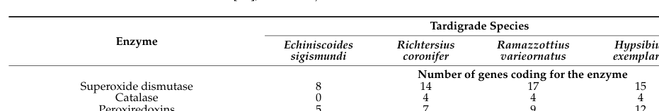

## Question

# Gene Research for Functional Annotation

## ⚠️ CRITICAL: Gene/Protein Identification Context

**BEFORE YOU BEGIN RESEARCH:** You MUST verify you are researching the CORRECT gene/protein. Gene symbols can be ambiguous, especially for less well-characterized genes from non-model organisms.

### Target Gene/Protein Identity (from UniProt):
- **UniProt Accession:** A0A1D1VEY6
- **Protein Description:** RecName: Full=Superoxide dismutase [Cu-Zn] {ECO:0000256|RuleBase:RU000393}; EC=1.15.1.1 {ECO:0000256|RuleBase:RU000393};
- **Gene Information:** Name=RvY_09480-1 {ECO:0000313|EMBL:GAU98317.1}; Synonyms=RvY_09480.1 {ECO:0000313|EMBL:GAU98317.1}; ORFNames=RvY_09480 {ECO:0000313|EMBL:GAU98317.1};
- **Organism (full):** Ramazzottius varieornatus (Water bear) (Tardigrade).
- **Protein Family:** Belongs to the Cu-Zn superoxide dismutase family.
- **Key Domains:** SOD-like_Cu/Zn_dom_sf. (IPR036423); SOD_Cu/Zn_/chaperone. (IPR024134); SOD_Cu/Zn_BS. (IPR018152); SOD_Cu_Zn_dom. (IPR001424); Sod_Cu (PF00080)

### MANDATORY VERIFICATION STEPS:

1. **Check if the gene symbol "RvY_09480-1" matches the protein description above**
2. **Verify the organism is correct:** Ramazzottius varieornatus (Water bear) (Tardigrade).
3. **Check if protein family/domains align with what you find in literature**
4. **If you find literature for a DIFFERENT gene with the same or similar symbol, STOP**

### If Gene Symbol is Ambiguous or You Cannot Find Relevant Literature:

**DO NOT PROCEED WITH RESEARCH ON A DIFFERENT GENE.** Instead:
- State clearly: "The gene symbol 'RvY_09480-1' is ambiguous or literature is limited for this specific protein"
- Explain what you found (e.g., "Found extensive literature on a different gene with the same symbol in a different organism")
- Describe the protein based ONLY on the UniProt information provided above
- Suggest that the protein function can be inferred from domain/family information

### Research Target:

Please provide a comprehensive research report on the gene **RvY_09480-1** (gene ID: RvY_09480, UniProt: A0A1D1VEY6) in RAMVA.

The research report should be a detailed narrative explaining the function, biological processes, and localization of the gene product. Citations should be given for all claims.

You should prioritize authoritative reviews and primary scientific literature when conducting research. You can supplement
this with annotations you find in gene/protein databases, but these can be outdated or inaccurate.

We are specifically interested in the primary function of the gene - for enzymes, what reaction is catalyzed, and what is the substrate specificity? For transporters, what is the substrate? For structural proteins or adapters, what is the broader structural role? For signaling molecules, what is the role in the pathway.

We are interested in where in or outside the cell the gene product carries out its function.

We are also interested in the signaling or biochemical pathways in which the gene functions. We are less interested in broad pleiotropic effects, except where these elucidate the precise role.

Include evidence where possible. We are interested in both experimental evidence as well as inference from structure, evolution, or bioinformatic analysis. Precise studies should be prioritized over high-throughput, where available.

## Output

Question: You are an expert researcher providing comprehensive, well-cited information.

Provide detailed information focusing on:
1. Key concepts and definitions with current understanding
2. Recent developments and latest research (prioritize 2023-2024 sources)
3. Current applications and real-world implementations
4. Expert opinions and analysis from authoritative sources
5. Relevant statistics and data from recent studies

Format as a comprehensive research report with proper citations. Include URLs and publication dates where available.
Always prioritize recent, authoritative sources and provide specific citations for all major claims.

# Gene Research for Functional Annotation

## ⚠️ CRITICAL: Gene/Protein Identification Context

**BEFORE YOU BEGIN RESEARCH:** You MUST verify you are researching the CORRECT gene/protein. Gene symbols can be ambiguous, especially for less well-characterized genes from non-model organisms.

### Target Gene/Protein Identity (from UniProt):
- **UniProt Accession:** A0A1D1VEY6
- **Protein Description:** RecName: Full=Superoxide dismutase [Cu-Zn] {ECO:0000256|RuleBase:RU000393}; EC=1.15.1.1 {ECO:0000256|RuleBase:RU000393};
- **Gene Information:** Name=RvY_09480-1 {ECO:0000313|EMBL:GAU98317.1}; Synonyms=RvY_09480.1 {ECO:0000313|EMBL:GAU98317.1}; ORFNames=RvY_09480 {ECO:0000313|EMBL:GAU98317.1};
- **Organism (full):** Ramazzottius varieornatus (Water bear) (Tardigrade).
- **Protein Family:** Belongs to the Cu-Zn superoxide dismutase family.
- **Key Domains:** SOD-like_Cu/Zn_dom_sf. (IPR036423); SOD_Cu/Zn_/chaperone. (IPR024134); SOD_Cu/Zn_BS. (IPR018152); SOD_Cu_Zn_dom. (IPR001424); Sod_Cu (PF00080)

### MANDATORY VERIFICATION STEPS:

1. **Check if the gene symbol "RvY_09480-1" matches the protein description above**
2. **Verify the organism is correct:** Ramazzottius varieornatus (Water bear) (Tardigrade).
3. **Check if protein family/domains align with what you find in literature**
4. **If you find literature for a DIFFERENT gene with the same or similar symbol, STOP**

### If Gene Symbol is Ambiguous or You Cannot Find Relevant Literature:

**DO NOT PROCEED WITH RESEARCH ON A DIFFERENT GENE.** Instead:
- State clearly: "The gene symbol 'RvY_09480-1' is ambiguous or literature is limited for this specific protein"
- Explain what you found (e.g., "Found extensive literature on a different gene with the same symbol in a different organism")
- Describe the protein based ONLY on the UniProt information provided above
- Suggest that the protein function can be inferred from domain/family information

### Research Target:

Please provide a comprehensive research report on the gene **RvY_09480-1** (gene ID: RvY_09480, UniProt: A0A1D1VEY6) in RAMVA.

The research report should be a detailed narrative explaining the function, biological processes, and localization of the gene product. Citations should be given for all claims.

You should prioritize authoritative reviews and primary scientific literature when conducting research. You can supplement
this with annotations you find in gene/protein databases, but these can be outdated or inaccurate.

We are specifically interested in the primary function of the gene - for enzymes, what reaction is catalyzed, and what is the substrate specificity? For transporters, what is the substrate? For structural proteins or adapters, what is the broader structural role? For signaling molecules, what is the role in the pathway.

We are interested in where in or outside the cell the gene product carries out its function.

We are also interested in the signaling or biochemical pathways in which the gene functions. We are less interested in broad pleiotropic effects, except where these elucidate the precise role.

Include evidence where possible. We are interested in both experimental evidence as well as inference from structure, evolution, or bioinformatic analysis. Precise studies should be prioritized over high-throughput, where available.

# Functional Annotation Research Report: *Ramazzottius varieornatus* RvY_09480-1 (UniProt A0A1D1VEY6)

## Executive summary
UniProt A0A1D1VEY6 is annotated as a **copper/zinc superoxide dismutase (Cu/Zn SOD; EC 1.15.1.1)** from the tardigrade *Ramazzottius varieornatus* (strain YOKOZUNA-1–associated resources are commonly used in the literature). Direct publications that explicitly mention the exact locus tag **RvY_09480-1** were not found in the retrieved literature; therefore, the functional narrative for A0A1D1VEY6 must be treated as **(i) organism-confirmed** (it is *R. varieornatus*) and **(ii) strongly inferred from Cu/Zn SOD family membership and close tardigrade paralog studies**, rather than proven for this exact accession. The most relevant *R. varieornatus* experimental advance is a 2023 crystal-structure study of a Cu/Zn SOD paralog (RvSOD15), which shows that some tardigrade Cu/Zn SOD paralogs carry atypical metal-binding residues and may have reduced or altered canonical SOD activity, cautioning against assuming all expanded SOD paralogs are enzymatically active. (sim2023structureofa pages 2-3, sim2023structureofa pages 3-4, sim2023structureofa pages 1-2)

## 1. Verification of gene/protein identity and symbol ambiguity checks
### 1.1 Target identity (what is known with high confidence)
- **Organism**: *Ramazzottius varieornatus* is directly supported as a focal species in multiple genomics/omics and mechanistic studies of tardigrade extremotolerance, including genome resources for YOKOZUNA-1 (hashimoto2016extremotoleranttardigradegenome pages 10-11, yoshida2017comparativegenomicsof pages 11-13).
- **Protein family**: UniProt describes A0A1D1VEY6 as a **Cu/Zn superoxide dismutase family** protein (EC 1.15.1.1). While UniProt itself is not directly cited in the tool evidence, multiple *R. varieornatus* Cu/Zn SOD paralogs are explicitly described and structurally characterized in the primary literature, supporting the plausibility of this annotation for an *R. varieornatus* protein called “superoxide dismutase [Cu-Zn]”. (sim2023structureofa pages 3-4, sim2023structureofa pages 1-2)

### 1.2 Ambiguity and mapping limitation
- In the retrieved primary and review literature, *R. varieornatus* Cu/Zn SODs are typically referred to by names like **RvSOD15** and associated accessions such as **GenBank GAV02514.1**, not by the locus tag **RvY_09480-1** or UniProt **A0A1D1VEY6**. Consequently, **sequence-level equivalence between A0A1D1VEY6 and any experimentally studied paralog (e.g., RvSOD15) cannot be confirmed from the retrieved text**. (sim2023structureofa pages 2-3)

## 2. Key concepts and definitions (current understanding)
### 2.1 Reactive oxygen species (ROS) and oxidative stress in extremotolerance
Tardigrade resilience to desiccation, UV, and radiation is frequently discussed in terms of **oxidative damage avoidance/repair** and **robust antioxidant systems**, with enzymatic antioxidants (including SODs) forming a core component of the defense network. (yoshida2017comparativegenomicsof pages 11-13, sadowskabartosz2024antioxidantdefensein pages 13-15)

### 2.2 Cu/Zn superoxide dismutase (EC 1.15.1.1): primary function
Cu/Zn SODs catalyze the **dismutation of superoxide radicals** to less-reactive products (hydrogen peroxide and oxygen). In tardigrade literature, SODs are repeatedly treated as essential antioxidant enzymes plausibly important during **desiccation and rehydration** (consistent with “preparation for oxidative stress” framing in reviews), although gene-specific biochemical validation for individual *R. varieornatus* paralogs can vary. (sim2023structureofa pages 1-2, sadowskabartosz2024antioxidantdefensein pages 13-15)

### 2.3 Structure/function hallmarks of Cu/Zn SODs
A Cu/Zn SOD paralog from *R. varieornatus* (RvSOD15) adopts the expected **Cu/Zn SOD fold** (Greek-key β-barrel; electrostatic and metal-binding loops), validating that canonical Cu/Zn SOD architecture is present in this organism and supporting family-based annotation for related paralogs. (sim2023structureofa pages 3-4)

## 3. Gene product annotation for A0A1D1VEY6 (RvY_09480-1)
### 3.1 Likely molecular function
**Most likely function** (family-based): superoxide dismutase activity (Cu/Zn-dependent), i.e., detoxification of superoxide radicals generated during metabolic and stress conditions. This inference is consistent with: (i) UniProt family assignment (per user-provided context), (ii) the established presence of multiple Cu/Zn SOD paralogs in *R. varieornatus*, and (iii) tardigrade genomics studies that emphasize expansion/duplication of oxidant-protection proteins including SODs. (yoshida2017comparativegenomicsof pages 11-13, sadowskabartosz2024antioxidantdefensein pages 13-15)

**Important caveat**: The 2023 structural analysis shows some *R. varieornatus* Cu/Zn SOD paralogs have mutations/truncations in catalytically important residues and may have **lost canonical SOD function**, implying that paralog identity matters. Without direct mapping, A0A1D1VEY6 could represent a canonical enzyme or a neofunctionalized/noncanonical paralog. (sim2023structureofa pages 1-2, sim2023structureofa pages 3-4)

### 3.2 Cofactors and active-site considerations
A characterized *R. varieornatus* Cu/Zn SOD paralog (RvSOD15) binds both **Cu and Zn**, consistent with metallation requirements of Cu/Zn SODs. However, RvSOD15 is notable because a copper-liganding histidine is replaced by **Val87**, and even a V87H mutant showed destabilized copper coordination due to loop flexibility, supporting the idea of noncanonical catalytic properties in at least some tardigrade paralogs. (sim2023structureofa pages 1-2)

### 3.3 Subcellular localization (inference)
- A 2024 review synthesizing genomic annotations states that tardigrade SOD complements are predicted across **mitochondria, cytosol, and peroxisomes**, and notes high CuZn-SOD expression in *R. varieornatus* (generalized at the species level). (sadowskabartosz2024antioxidantdefensein pages 13-15)
- In contrast, the RvSOD15 paralog examined structurally in 2023 is predicted to have an **N-terminal signal peptide**, consistent with secretion, indicating that localization among paralogs can diverge (cytosolic vs secreted vs organellar). (sim2023structureofa pages 2-3)

For A0A1D1VEY6 specifically, localization should be treated as **unresolved** without sequence-level features (signal peptide, targeting peptides) being confirmed for this accession; the safest statement is that **Cu/Zn SOD paralogs in *R. varieornatus* span multiple compartments**, and A0A1D1VEY6 may represent one such compartment-specific paralog. (sim2023structureofa pages 2-3, sadowskabartosz2024antioxidantdefensein pages 13-15)

## 4. Pathways and biological processes in *R. varieornatus* context
### 4.1 Antioxidant system expansion and oxidative-stress management
Comparative genomics indicates that antioxidant-related families (including **SOD and peroxiredoxin**) were **extensively duplicated** in tardigrades, consistent with a stress-tolerance strategy built on robust ROS handling. (yoshida2017comparativegenomicsof pages 11-13)

Hashimoto et al. additionally describe genome features consistent with reducing endogenous peroxide generation (e.g., loss of peroxisomal oxidative enzymes linked to H2O2 generation), and expansion/acquisition of antioxidative enzymes, framing oxidative stress management as a central component of tardigrade extremotolerance. (hashimoto2016extremotoleranttardigradegenome pages 10-11)

### 4.2 Stress responses (desiccation/anhydrobiosis and cross-tolerance)
A key *R. varieornatus* theme is that transcriptional changes during anhydrobiosis can be **relatively limited**, suggesting some tolerance mechanisms may be constitutively present. Yoshida et al. report that far fewer genes are differentially upregulated in *R. varieornatus* (e.g., **64 genes; 0.5%** under fast dehydration; **307 genes; 2.2%** under slow dehydration) than in *Hypsibius dujardini*, consistent with a model of pre-armed protection that could include baseline antioxidant capacity. (yoshida2017comparativegenomicsof pages 11-13)

## 5. Recent developments and latest research (prioritizing 2023–2024)
### 5.1 2023: Structural biology reveals noncanonical Cu/Zn SOD paralogs in *R. varieornatus*
Sim & Inoue (2023; online 26 June 2023) report crystal structures of a Cu/Zn SOD paralog **RvSOD15**, highlighting atypical metal-binding chemistry (His→Val substitution at a canonical copper ligand position) and broader modeling suggesting that some *R. varieornatus* SOD paralogs have truncated sequences or mutated copper-binding residues despite being expressed in transcriptomic resources. The authors argue that some paralogs “may have evolved to lose the SOD function,” challenging a simplistic “more SOD genes = more SOD activity” interpretation for extremotolerance. (sim2023structureofa pages 3-4, sim2023structureofa pages 1-2)

### 5.2 2024: Review synthesis of tardigrade antioxidant defense
Sadowska-Bartosz & Bartosz (Aug 2024) synthesize genomic and biochemical evidence for tardigrade antioxidant systems, explicitly documenting strong **SOD gene-family expansion** and discussing links to desiccation and UV/radiation stresses. They report *R. varieornatus* has **17 SOD genes** in a table summary (with some inconsistency between running text “16” vs table “17”), and reiterate the structural finding that RvSOD15 and some paralogs may be noncanonical. (sadowskabartosz2024antioxidantdefensein pages 13-15, sadowskabartosz2024antioxidantdefensein pages 15-16, sadowskabartosz2024antioxidantdefensein media 98377f53)

## 6. Quantitative statistics and data points from the recent evidence base
### 6.1 *R. varieornatus* SOD repertoire size
Table evidence from the 2024 review indicates **17 SOD genes in *R. varieornatus***, compared with **3 in humans** in the same table. (sadowskabartosz2024antioxidantdefensein media 98377f53)

### 6.2 Desiccation-related differential expression burden (genome-enabled statistic)
*R. varieornatus* shows a smaller desiccation-induced transcriptional shift than *H. dujardini*, e.g., **64 genes (0.5%)** upregulated under fast dehydration and **307 genes (2.2%)** under slow dehydration (as reported in Yoshida et al. 2017). (yoshida2017comparativegenomicsof pages 11-13)

### 6.3 Toxicant tolerance and antioxidant gene expression context (tardigrade comparative assay)
While not specific to *R. varieornatus*, a quantitative example of tardigrade stress tolerance comes from copper toxicity assays: **Ramazzottius oberhaeuseri** shows 24 h copper EC50 **310 µg/L** (95% CI 295–328), and the authors’ transcriptome screen in another tardigrade identifies **Cu-Zn SOD transcripts** among highly expressed antioxidant defenses (reported for *Echiniscoides sigismundi*). This supports the broader principle that tardigrade lineages deploy SOD-class defenses in coping with oxidative stressors, but it should not be interpreted as gene- or species-specific measurement for A0A1D1VEY6. (hygum2017comparativeinvestigationof pages 5-6, hygum2017comparativeinvestigationof pages 1-2)

## 7. Current applications and real-world implementations
### 7.1 Near-term research applications (most directly supported)
- **Protein science and enzymology**: The presence of noncanonical Cu/Zn SOD paralogs (e.g., RvSOD15) creates an opportunity to study **neofunctionalization** (possible structural/metal-binding roles beyond superoxide dismutation) and to experimentally test which *R. varieornatus* paralogs are catalytically active. This is directly motivated by the 2023 structural results and the 2024 synthesis emphasizing paralog diversity. (sim2023structureofa pages 1-2, sadowskabartosz2024antioxidantdefensein pages 15-16)
- **Stress-tolerance engineering (conceptual)**: Genomics suggests antioxidant and damage-mitigation expansions are part of the extremotolerance toolkit in tardigrades; however, the 2023 structural work cautions that **copy number expansion does not necessarily translate into expanded enzymatic detox capacity**, so engineering efforts would require careful paralog selection/validation. (sim2023structureofa pages 1-2)

### 7.2 Broader translational context (tardigrade extremotolerance)
Genome-enabled discovery from *R. varieornatus* has already motivated cross-species protective gene transfer (e.g., tardigrade-unique proteins improving radiotolerance in human cells). Although this is not a Cu/Zn SOD application per se, it is the most established “real-world implementation” pipeline for *R. varieornatus* stress genes and supports continued interest in oxidative stress biology in this species. (hashimoto2016extremotoleranttardigradegenome pages 10-11)

## 8. Expert opinion / authoritative analysis (from retrieved reviews and high-impact primary sources)
- **Gene-family expansion is not sufficient to infer function**: The structural biology analysis of a tardigrade Cu/Zn SOD paralog argues that some SOD paralogs may have lost canonical SOD activity, implying that evolutionary duplication can enable divergence rather than purely dosage amplification. (sim2023structureofa pages 1-2)
- **Antioxidant defense is a major pillar of tardigrade resistance**: Comparative genomics and the 2024 review frame antioxidant enzymes (including SODs) as important components of extremotolerance, integrated with other mechanisms (DNA repair/protection, stress proteins). (yoshida2017comparativegenomicsof pages 11-13, sadowskabartosz2024antioxidantdefensein pages 13-15)

## 9. Evidence-supported annotation summary table
| Annotation aspect | Evidence summary | Key source(s) with publication year and URL |
|---|---|---|
| Identity | The requested target is UniProt A0A1D1VEY6 from *Ramazzottius varieornatus*, annotated as a Cu/Zn superoxide dismutase family protein. Direct literature linking the exact locus tag **RvY_09480-1** to a named experimental protein is limited; available *R. varieornatus* studies instead describe multiple Cu/Zn SOD paralogs such as RvSOD15, so functional annotation for A0A1D1VEY6 should be treated as family-based unless sequence-level mapping is independently confirmed (sim2023structureofa pages 2-3, sim2023structureofa pages 3-4). | Sim & Inoue 2023, *Acta Crystallographica F*, https://doi.org/10.1107/S2053230X2300523X |
| Enzyme class/reaction | UniProt assigns EC 1.15.1.1, the canonical superoxide dismutase reaction converting superoxide radicals to hydrogen peroxide and oxygen. In tardigrades, Cu/Zn SODs are discussed as core antioxidant enzymes implicated in oxidative-stress control during desiccation, UV exposure, and rehydration-associated stress (sim2023structureofa pages 1-2, sadowskabartosz2024antioxidantdefensein pages 13-15). | Sadowska-Bartosz & Bartosz 2024, *IJMS*, https://doi.org/10.3390/ijms25158393; Sim & Inoue 2023, https://doi.org/10.1107/S2053230X2300523X |
| Cofactors & key residues | Cu/Zn SOD family members require copper and zinc; crystallography on a *R. varieornatus* paralog confirmed bound Cu and Zn. However, some tardigrade paralogs carry substitutions in catalytic/metal-binding residues; notably RvSOD15 has Val87 replacing a histidine normally involved in copper coordination, raising concern that some paralogs may not retain canonical SOD activity (sim2023structureofa pages 1-2, sim2023structureofa pages 3-4, sadowskabartosz2024antioxidantdefensein pages 15-16). | Sim & Inoue 2023, https://doi.org/10.1107/S2053230X2300523X; Sadowska-Bartosz & Bartosz 2024, https://doi.org/10.3390/ijms25158393 |
| Structure/domains | The UniProt/domain assignment places A0A1D1VEY6 in the Cu/Zn SOD family with SOD_Cu/Zn domains. A structurally characterized *R. varieornatus* paralog (RvSOD15) adopts the expected Cu/Zn SOD fold: a Greek-key β-barrel with electrostatic and metal-binding loops, supporting domain-based inference that A0A1D1VEY6 is a Cu/Zn SOD-like protein unless proven otherwise (sim2023structureofa pages 3-4). | Sim & Inoue 2023, https://doi.org/10.1107/S2053230X2300523X |
| Subcellular localization | Tardigrade SOD complements are predicted to localize to mitochondria, cytosol, and peroxisomes at the family level. For one *R. varieornatus* Cu/Zn SOD paralog, an N-terminal signal peptide was predicted, suggesting secretion; therefore localization may vary among paralogs, and the exact localization of A0A1D1VEY6 remains inferential without direct experiment (sim2023structureofa pages 2-3, sadowskabartosz2024antioxidantdefensein pages 13-15). | Sim & Inoue 2023, https://doi.org/10.1107/S2053230X2300523X; Sadowska-Bartosz & Bartosz 2024, https://doi.org/10.3390/ijms25158393 |
| Biological role in tardigrades | Antioxidant proteins including SODs are repeatedly implicated in tardigrade resistance to desiccation-, UV-, and rehydration-associated oxidative damage. Comparative genomics concludes that oxidant-protection proteins such as SODs and peroxiredoxins were extensively duplicated in tardigrades, consistent with a protective role in anhydrobiosis and broader extremotolerance (sim2023structureofa pages 1-2, yoshida2017comparativegenomicsof pages 11-13). | Yoshida et al. 2017, *PLOS Biology*, https://doi.org/10.1371/journal.pbio.2002266; Sim & Inoue 2023, https://doi.org/10.1107/S2053230X2300523X |
| Gene family expansion | *R. varieornatus* shows a pronounced SOD expansion versus typical metazoans. A 2024 review reports 16 SODs in running text but a table value of **17 SOD genes** for *R. varieornatus* (vs **3 in humans**), so the safest summary is a large lineage-specific expansion with a minor reporting inconsistency between text and table (sadowskabartosz2024antioxidantdefensein pages 13-15, sadowskabartosz2024antioxidantdefensein media 98377f53). | Sadowska-Bartosz & Bartosz 2024, https://doi.org/10.3390/ijms25158393 |
| Notable unusual features in *R. varieornatus* SODs | Several *R. varieornatus* SOD paralogs are structurally atypical: deletions of the electrostatic loop or β3 sheet, truncations, and substitutions in copper-binding residues were reported. The authors specifically suggest that RvSOD15 and some other paralogs may have evolved to lose canonical SOD function, meaning family expansion does not equal expansion of active enzymes (sadowskabartosz2024antioxidantdefensein pages 15-16, sim2023structureofa pages 3-4, sim2023structureofa pages 1-2). | Sim & Inoue 2023, https://doi.org/10.1107/S2053230X2300523X; Sadowska-Bartosz & Bartosz 2024, https://doi.org/10.3390/ijms25158393 |
| Quantitative data/statistics | Reported statistics relevant to tardigrade oxidative-stress biology include **17 SOD genes** in *R. varieornatus* (table value), and far fewer desiccation-induced transcriptional changes in *R. varieornatus* than in *H. dujardini* (**64 genes, 0.5%** under fast drying; **307 genes, 2.2%** under slow drying). In a copper-tolerance assay on another tardigrade species, **R. oberhaeuseri** showed a **24 h EC50 of 310 µg/L** Cu (95% CI 295–328), illustrating that tardigrades pair antioxidant capacity with strong toxicant tolerance, though this is not a direct measurement for A0A1D1VEY6 (hygum2017comparativeinvestigationof pages 1-2, yoshida2017comparativegenomicsof pages 11-13, sadowskabartosz2024antioxidantdefensein media 98377f53). | Hygum et al. 2017, *Frontiers in Physiology*, https://doi.org/10.3389/fphys.2017.00095; Yoshida et al. 2017, https://doi.org/10.1371/journal.pbio.2002266; Sadowska-Bartosz & Bartosz 2024, https://doi.org/10.3390/ijms25158393 |
| Applications | The most defensible application is annotation and prioritization: Cu/Zn SOD-like genes in *R. varieornatus* are candidates for stress-tolerance engineering and mechanistic studies of anhydrobiosis, but the 2023 structural work cautions that some paralogs may be neofunctionalized or inactive. Thus A0A1D1VEY6 is relevant to comparative genomics, protein engineering, and extremotolerance research, yet it should not be assumed to be an active canonical SOD without direct biochemical validation (sim2023structureofa pages 1-2, sadowskabartosz2024antioxidantdefensein pages 15-16). | Sim & Inoue 2023, https://doi.org/10.1107/S2053230X2300523X; Sadowska-Bartosz & Bartosz 2024, https://doi.org/10.3390/ijms25158393 |

*Table: This table summarizes the strongest evidence-based functional annotation points for the *Ramazzottius varieornatus* Cu/Zn SOD target A0A1D1VEY6. It highlights where evidence is direct versus family-level inference, which is especially important because several tardigrade SOD paralogs appear structurally unusual or potentially noncanonical.*

## 10. Key figure/table evidence
A cropped excerpt of Table 3 supporting the **“17 SOD genes in *R. varieornatus*”** statistic is available here. (sadowskabartosz2024antioxidantdefensein media 98377f53)

## 11. Practical functional-annotation recommendations for A0A1D1VEY6
1. **Retain primary annotation as Cu/Zn SOD (EC 1.15.1.1)** based on domain/family assignment, but label confidence as **moderate** until the specific paralog is experimentally verified in *R. varieornatus*.
2. Add a **“paralog caution”** note: *R. varieornatus* Cu/Zn SOD paralogs can be structurally atypical (e.g., His→Val substitutions at copper ligands) and some may be enzymatically compromised or repurposed. (sim2023structureofa pages 1-2, sadowskabartosz2024antioxidantdefensein pages 15-16)
3. For localization, prefer a two-tier statement: **(i) species-level SODs are predicted in mitochondria/cytosol/peroxisomes**, but **(ii) at least one Cu/Zn SOD paralog has a predicted signal peptide**, so localization should be resolved per paralog. (sim2023structureofa pages 2-3, sadowskabartosz2024antioxidantdefensein pages 13-15)

## References (retrieved sources emphasized)
- Sim K-S, Inoue T. **Structure of a superoxide dismutase from a tardigrade: *Ramazzottius varieornatus* strain YOKOZUNA-1.** *Acta Crystallographica Section F* (Publication month: **Jun 2023**). https://doi.org/10.1107/S2053230X2300523X (sim2023structureofa pages 3-4, sim2023structureofa pages 1-2)
- Sadowska-Bartosz I, Bartosz G. **Antioxidant Defense in the Toughest Animals on the Earth: Its Contribution to the Extreme Resistance of Tardigrades.** *International Journal of Molecular Sciences* (Publication month: **Aug 2024**). https://doi.org/10.3390/ijms25158393 (sadowskabartosz2024antioxidantdefensein pages 13-15, sadowskabartosz2024antioxidantdefensein pages 15-16, sadowskabartosz2024antioxidantdefensein media 98377f53)
- Yoshida Y et al. **Comparative genomics of the tardigrades *Hypsibius dujardini* and *Ramazzottius varieornatus*.** *PLOS Biology* (Publication month: **Jul 2017**). https://doi.org/10.1371/journal.pbio.2002266 (yoshida2017comparativegenomicsof pages 11-13)
- Hashimoto T et al. **Extremotolerant tardigrade genome and improved radiotolerance of human cultured cells by tardigrade-unique protein.** *Nature Communications* (Publication month: **Sep 2016**). https://doi.org/10.1038/ncomms12808 (hashimoto2016extremotoleranttardigradegenome pages 10-11)
- Hygum TL et al. **Comparative Investigation of Copper Tolerance and Identification of Putative Tolerance Related Genes in Tardigrades.** *Frontiers in Physiology* (Publication month: **Feb 2017**). https://doi.org/10.3389/fphys.2017.00095 (hygum2017comparativeinvestigationof pages 5-6, hygum2017comparativeinvestigationof pages 1-2)

References

1. (sim2023structureofa pages 2-3): Kee-Shin Sim and Tsuyoshi Inoue. Structure of a superoxide dismutase from a tardigrade: ramazzottius varieornatus strain yokozuna-1. Acta crystallographica. Section F, Structural biology communications, 79:169-179, Jun 2023. URL: https://doi.org/10.1107/s2053230x2300523x, doi:10.1107/s2053230x2300523x. This article has 5 citations.

2. (sim2023structureofa pages 3-4): Kee-Shin Sim and Tsuyoshi Inoue. Structure of a superoxide dismutase from a tardigrade: ramazzottius varieornatus strain yokozuna-1. Acta crystallographica. Section F, Structural biology communications, 79:169-179, Jun 2023. URL: https://doi.org/10.1107/s2053230x2300523x, doi:10.1107/s2053230x2300523x. This article has 5 citations.

3. (sim2023structureofa pages 1-2): Kee-Shin Sim and Tsuyoshi Inoue. Structure of a superoxide dismutase from a tardigrade: ramazzottius varieornatus strain yokozuna-1. Acta crystallographica. Section F, Structural biology communications, 79:169-179, Jun 2023. URL: https://doi.org/10.1107/s2053230x2300523x, doi:10.1107/s2053230x2300523x. This article has 5 citations.

4. (hashimoto2016extremotoleranttardigradegenome pages 10-11): Takuma Hashimoto, Daiki D. Horikawa, Yuki Saito, Hirokazu Kuwahara, Hiroko Kozuka-Hata, Tadasu Shin-I, Yohei Minakuchi, Kazuko Ohishi, Ayuko Motoyama, Tomoyuki Aizu, Atsushi Enomoto, Koyuki Kondo, Sae Tanaka, Yuichiro Hara, Shigeyuki Koshikawa, Hiroshi Sagara, Toru Miura, Shin-ichi Yokobori, Kiyoshi Miyagawa, Yutaka Suzuki, Takeo Kubo, Masaaki Oyama, Yuji Kohara, Asao Fujiyama, Kazuharu Arakawa, Toshiaki Katayama, Atsushi Toyoda, and Takekazu Kunieda. Extremotolerant tardigrade genome and improved radiotolerance of human cultured cells by tardigrade-unique protein. Nature Communications, Sep 2016. URL: https://doi.org/10.1038/ncomms12808, doi:10.1038/ncomms12808. This article has 477 citations and is from a highest quality peer-reviewed journal.

5. (yoshida2017comparativegenomicsof pages 11-13): Yuki Yoshida, Georgios Koutsovoulos, Dominik R. Laetsch, Lewis Stevens, Sujai Kumar, Daiki D. Horikawa, Kyoko Ishino, Shiori Komine, Takekazu Kunieda, Masaru Tomita, Mark Blaxter, and Kazuharu Arakawa. Comparative genomics of the tardigrades hypsibius dujardini and ramazzottius varieornatus. PLOS Biology, 15:e2002266, Jul 2017. URL: https://doi.org/10.1371/journal.pbio.2002266, doi:10.1371/journal.pbio.2002266. This article has 250 citations and is from a highest quality peer-reviewed journal.

6. (sadowskabartosz2024antioxidantdefensein pages 13-15): Izabela Sadowska-Bartosz and Grzegorz Bartosz. Antioxidant defense in the toughest animals on the earth: its contribution to the extreme resistance of tardigrades. International Journal of Molecular Sciences, 25:8393, Aug 2024. URL: https://doi.org/10.3390/ijms25158393, doi:10.3390/ijms25158393. This article has 14 citations.

7. (sadowskabartosz2024antioxidantdefensein pages 15-16): Izabela Sadowska-Bartosz and Grzegorz Bartosz. Antioxidant defense in the toughest animals on the earth: its contribution to the extreme resistance of tardigrades. International Journal of Molecular Sciences, 25:8393, Aug 2024. URL: https://doi.org/10.3390/ijms25158393, doi:10.3390/ijms25158393. This article has 14 citations.

8. (sadowskabartosz2024antioxidantdefensein media 98377f53): Izabela Sadowska-Bartosz and Grzegorz Bartosz. Antioxidant defense in the toughest animals on the earth: its contribution to the extreme resistance of tardigrades. International Journal of Molecular Sciences, 25:8393, Aug 2024. URL: https://doi.org/10.3390/ijms25158393, doi:10.3390/ijms25158393. This article has 14 citations.

9. (hygum2017comparativeinvestigationof pages 5-6): Thomas L. Hygum, Dannie Fobian, Maria Kamilari, Aslak Jørgensen, Morten Schiøtt, Martin Grosell, and Nadja Møbjerg. Comparative investigation of copper tolerance and identification of putative tolerance related genes in tardigrades. Frontiers in Physiology, Feb 2017. URL: https://doi.org/10.3389/fphys.2017.00095, doi:10.3389/fphys.2017.00095. This article has 43 citations.

10. (hygum2017comparativeinvestigationof pages 1-2): Thomas L. Hygum, Dannie Fobian, Maria Kamilari, Aslak Jørgensen, Morten Schiøtt, Martin Grosell, and Nadja Møbjerg. Comparative investigation of copper tolerance and identification of putative tolerance related genes in tardigrades. Frontiers in Physiology, Feb 2017. URL: https://doi.org/10.3389/fphys.2017.00095, doi:10.3389/fphys.2017.00095. This article has 43 citations.

## Artifacts

- [Edison artifact artifact-00](RvY_09480-deep-research-falcon_artifacts/artifact-00.md)

## Citations

1. sim2023structureofa pages 2-3
2. sim2023structureofa pages 3-4
3. sim2023structureofa pages 1-2
4. sadowskabartosz2024antioxidantdefensein pages 13-15
5. yoshida2017comparativegenomicsof pages 11-13
6. hashimoto2016extremotoleranttardigradegenome pages 10-11
7. sadowskabartosz2024antioxidantdefensein pages 15-16
8. hygum2017comparativeinvestigationof pages 5-6
9. hygum2017comparativeinvestigationof pages 1-2
10. Cu-Zn
11. https://doi.org/10.1107/S2053230X2300523X
12. https://doi.org/10.3390/ijms25158393;
13. https://doi.org/10.1107/S2053230X2300523X;
14. https://doi.org/10.3390/ijms25158393
15. https://doi.org/10.1371/journal.pbio.2002266;
16. https://doi.org/10.3389/fphys.2017.00095;
17. https://doi.org/10.1371/journal.pbio.2002266
18. https://doi.org/10.1038/ncomms12808
19. https://doi.org/10.3389/fphys.2017.00095
20. https://doi.org/10.1107/s2053230x2300523x,
21. https://doi.org/10.1038/ncomms12808,
22. https://doi.org/10.1371/journal.pbio.2002266,
23. https://doi.org/10.3390/ijms25158393,
24. https://doi.org/10.3389/fphys.2017.00095,