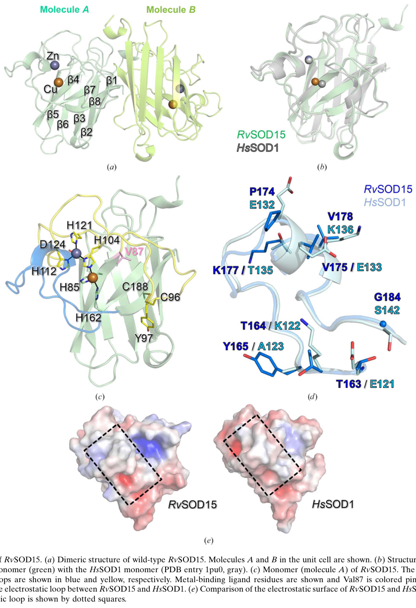

## Question

# Gene Research for Functional Annotation

## ⚠️ CRITICAL: Gene/Protein Identification Context

**BEFORE YOU BEGIN RESEARCH:** You MUST verify you are researching the CORRECT gene/protein. Gene symbols can be ambiguous, especially for less well-characterized genes from non-model organisms.

### Target Gene/Protein Identity (from UniProt):
- **UniProt Accession:** A0A1D1VE88
- **Protein Description:** RecName: Full=Superoxide dismutase [Cu-Zn] {ECO:0000256|RuleBase:RU000393}; EC=1.15.1.1 {ECO:0000256|RuleBase:RU000393};
- **Gene Information:** Name=RvY_10893-1 {ECO:0000313|EMBL:GAU99964.1}; Synonyms=RvY_10893.1 {ECO:0000313|EMBL:GAU99964.1}; ORFNames=RvY_10893 {ECO:0000313|EMBL:GAU99964.1};
- **Organism (full):** Ramazzottius varieornatus (Water bear) (Tardigrade).
- **Protein Family:** Belongs to the Cu-Zn superoxide dismutase family.
- **Key Domains:** SOD-like_Cu/Zn_dom_sf. (IPR036423); SOD_Cu/Zn_/chaperone. (IPR024134); SOD_Cu/Zn_BS. (IPR018152); SOD_Cu_Zn_dom. (IPR001424); Sod_Cu (PF00080)

### MANDATORY VERIFICATION STEPS:

1. **Check if the gene symbol "RvY_10893-1" matches the protein description above**
2. **Verify the organism is correct:** Ramazzottius varieornatus (Water bear) (Tardigrade).
3. **Check if protein family/domains align with what you find in literature**
4. **If you find literature for a DIFFERENT gene with the same or similar symbol, STOP**

### If Gene Symbol is Ambiguous or You Cannot Find Relevant Literature:

**DO NOT PROCEED WITH RESEARCH ON A DIFFERENT GENE.** Instead:
- State clearly: "The gene symbol 'RvY_10893-1' is ambiguous or literature is limited for this specific protein"
- Explain what you found (e.g., "Found extensive literature on a different gene with the same symbol in a different organism")
- Describe the protein based ONLY on the UniProt information provided above
- Suggest that the protein function can be inferred from domain/family information

### Research Target:

Please provide a comprehensive research report on the gene **RvY_10893-1** (gene ID: RvY_10893, UniProt: A0A1D1VE88) in RAMVA.

The research report should be a detailed narrative explaining the function, biological processes, and localization of the gene product. Citations should be given for all claims.

You should prioritize authoritative reviews and primary scientific literature when conducting research. You can supplement
this with annotations you find in gene/protein databases, but these can be outdated or inaccurate.

We are specifically interested in the primary function of the gene - for enzymes, what reaction is catalyzed, and what is the substrate specificity? For transporters, what is the substrate? For structural proteins or adapters, what is the broader structural role? For signaling molecules, what is the role in the pathway.

We are interested in where in or outside the cell the gene product carries out its function.

We are also interested in the signaling or biochemical pathways in which the gene functions. We are less interested in broad pleiotropic effects, except where these elucidate the precise role.

Include evidence where possible. We are interested in both experimental evidence as well as inference from structure, evolution, or bioinformatic analysis. Precise studies should be prioritized over high-throughput, where available.

## Output

Question: You are an expert researcher providing comprehensive, well-cited information.

Provide detailed information focusing on:
1. Key concepts and definitions with current understanding
2. Recent developments and latest research (prioritize 2023-2024 sources)
3. Current applications and real-world implementations
4. Expert opinions and analysis from authoritative sources
5. Relevant statistics and data from recent studies

Format as a comprehensive research report with proper citations. Include URLs and publication dates where available.
Always prioritize recent, authoritative sources and provide specific citations for all major claims.

# Gene Research for Functional Annotation

## ⚠️ CRITICAL: Gene/Protein Identification Context

**BEFORE YOU BEGIN RESEARCH:** You MUST verify you are researching the CORRECT gene/protein. Gene symbols can be ambiguous, especially for less well-characterized genes from non-model organisms.

### Target Gene/Protein Identity (from UniProt):
- **UniProt Accession:** A0A1D1VE88
- **Protein Description:** RecName: Full=Superoxide dismutase [Cu-Zn] {ECO:0000256|RuleBase:RU000393}; EC=1.15.1.1 {ECO:0000256|RuleBase:RU000393};
- **Gene Information:** Name=RvY_10893-1 {ECO:0000313|EMBL:GAU99964.1}; Synonyms=RvY_10893.1 {ECO:0000313|EMBL:GAU99964.1}; ORFNames=RvY_10893 {ECO:0000313|EMBL:GAU99964.1};
- **Organism (full):** Ramazzottius varieornatus (Water bear) (Tardigrade).
- **Protein Family:** Belongs to the Cu-Zn superoxide dismutase family.
- **Key Domains:** SOD-like_Cu/Zn_dom_sf. (IPR036423); SOD_Cu/Zn_/chaperone. (IPR024134); SOD_Cu/Zn_BS. (IPR018152); SOD_Cu_Zn_dom. (IPR001424); Sod_Cu (PF00080)

### MANDATORY VERIFICATION STEPS:

1. **Check if the gene symbol "RvY_10893-1" matches the protein description above**
2. **Verify the organism is correct:** Ramazzottius varieornatus (Water bear) (Tardigrade).
3. **Check if protein family/domains align with what you find in literature**
4. **If you find literature for a DIFFERENT gene with the same or similar symbol, STOP**

### If Gene Symbol is Ambiguous or You Cannot Find Relevant Literature:

**DO NOT PROCEED WITH RESEARCH ON A DIFFERENT GENE.** Instead:
- State clearly: "The gene symbol 'RvY_10893-1' is ambiguous or literature is limited for this specific protein"
- Explain what you found (e.g., "Found extensive literature on a different gene with the same symbol in a different organism")
- Describe the protein based ONLY on the UniProt information provided above
- Suggest that the protein function can be inferred from domain/family information

### Research Target:

Please provide a comprehensive research report on the gene **RvY_10893-1** (gene ID: RvY_10893, UniProt: A0A1D1VE88) in RAMVA.

The research report should be a detailed narrative explaining the function, biological processes, and localization of the gene product. Citations should be given for all claims.

You should prioritize authoritative reviews and primary scientific literature when conducting research. You can supplement
this with annotations you find in gene/protein databases, but these can be outdated or inaccurate.

We are specifically interested in the primary function of the gene - for enzymes, what reaction is catalyzed, and what is the substrate specificity? For transporters, what is the substrate? For structural proteins or adapters, what is the broader structural role? For signaling molecules, what is the role in the pathway.

We are interested in where in or outside the cell the gene product carries out its function.

We are also interested in the signaling or biochemical pathways in which the gene functions. We are less interested in broad pleiotropic effects, except where these elucidate the precise role.

Include evidence where possible. We are interested in both experimental evidence as well as inference from structure, evolution, or bioinformatic analysis. Precise studies should be prioritized over high-throughput, where available.

# Research report: Functional annotation of **RvY_10893-1** (UniProt **A0A1D1VE88**) from *Ramazzottius varieornatus* (tardigrade)

## Executive summary
UniProt accession **A0A1D1VE88** (gene model **RvY_10893-1 / RvY_10893**) is annotated as a **copper/zinc superoxide dismutase (Cu/Zn SOD; EC 1.15.1.1)** belonging to the Cu/Zn SOD family with canonical Cu/Zn SOD domains (per user-provided UniProt context). Direct peer‑reviewed literature explicitly naming **RvY_10893-1** or **A0A1D1VE88** could not be retrieved in this run; therefore, **gene-specific assertions beyond family-level inference are limited**. However, recent structural and review literature in *R. varieornatus* shows that (i) *R. varieornatus* carries an expanded and diversified set of Cu/Zn SOD-like proteins, and (ii) at least one paralog (RvSOD15) is structurally Cu/Zn-SOD-like but **has an unusual active site** consistent with **attenuated or lost canonical SOD activity**—a key consideration when annotating any specific paralog in this species. (sim2023structureofa pages 3-4, sadowskabartosz2024antioxidantdefensein pages 15-16)

## 1. Identity verification (mandatory)
### 1.1 Target identity and ambiguity assessment
- **Target provided**: UniProt **A0A1D1VE88**, organism ***Ramazzottius varieornatus***, protein name “Superoxide dismutase [Cu-Zn]” (EC 1.15.1.1), Cu/Zn SOD family/domains (user-provided UniProt context).
- **Literature mapping**: The best-matching *R. varieornatus* Cu/Zn-SOD primary study retrieved is a 2023 crystallography paper on **RvSOD15** (PDB 7YPP/7YPR). This paper discusses multiple *R. varieornatus* SOD gene models (e.g., **RvY_10892.1**, **RvY_10894.1**) but does **not** explicitly link **RvY_10893-1** or **A0A1D1VE88** to **RvSOD15** in the extracted sections; therefore **RvSOD15 ≠ confirmed as A0A1D1VE88**. (sim2023structureofa pages 3-4)

**Conclusion**: It is appropriate to annotate A0A1D1VE88 as a **Cu/Zn SOD family member** based on UniProt/domain context, but **paralog-specific features (e.g., unusual metal-binding residues)** cannot be assigned to A0A1D1VE88 without a definitive mapping. (sadowskabartosz2024antioxidantdefensein pages 15-16, sim2023structureofa pages 3-4)

## 2. Key concepts and definitions (current understanding)
### 2.1 Cu/Zn superoxide dismutase function (EC 1.15.1.1)
Cu/Zn SODs catalyze the **dismutation** of superoxide radicals to hydrogen peroxide and molecular oxygen:
\[2O2^{\u2022-} + 2H^+ \rightarrow H_2O_2 + O_2\] (sim2023structureofa pages 1-2, liu2025superoxidedismutasesin pages 2-4)

This reaction is central to **redox homeostasis**, reducing oxidative damage and shaping downstream signaling because the product **H2O2** can act as a diffusible signaling molecule that is subsequently removed by catalase/peroxidases. (zheng2023theapplicationsand pages 1-2, liu2025superoxidedismutasesin pages 2-4)

### 2.2 Metal cofactors and active-site logic
Cu/Zn SODs use **Cu** for redox cycling during catalysis and **Zn** primarily for structural stabilization; the family is characterized by a conserved β‑barrel fold with functional loops (notably an “electrostatic loop” that guides substrate and a “metal-binding loop”). (liu2025superoxidedismutasesin pages 2-4, sim2023structureofa pages 3-4)

## 3. Tardigrade/*R. varieornatus* context: oxidative stress and SOD gene-family expansion
### 3.1 Biological rationale: oxidative stress during anhydrobiosis
During anhydrobiosis (extreme dehydration), tardigrade cells experience oxidative stress and must control reactive oxygen species (ROS), motivating interest in antioxidant enzymes including SODs. (sim2023structureofa pages 1-2)

### 3.2 Expanded SOD repertoires in *R. varieornatus*
A 2024 review synthesizing genomic data reports a major **expansion of SOD genes** in *R. varieornatus*, listing **17 SOD genes** (compared with **3** in humans) and suggests distribution across subcellular compartments (mitochondria, cytosol, and peroxisomes) at the repertoire level (not per-gene mapping). (sadowskabartosz2024antioxidantdefensein pages 15-16, sadowskabartosz2024antioxidantdefensein pages 13-15)

A widely cited comparative genomics study reports that SOD gene families are duplicated in both *H. dujardini* and *R. varieornatus* and that, under **slow desiccation**, induced genes in *R. varieornatus* include **antioxidant-related genes** (SOD subtype not specified in the excerpt). (yoshida2017comparativegenomicsof pages 21-23)

## 4. Recent developments (prioritizing 2023–2024)
### 4.1 2023 crystal structures reveal atypical Cu/Zn SOD active sites in *R. varieornatus*
A 2023 Acta Crystallographica F paper reports X-ray structures of a *R. varieornatus* Cu/Zn SOD-like paralog (**RvSOD15**; **PDB 7YPP**) and a mutant (**V87H**; **PDB 7YPR**) (publication date: **June 2023**, URL: https://doi.org/10.1107/S2053230X2300523X). (sim2023structureofa pages 1-2)

Key mechanistic structural findings:
- **Cu and Zn presence confirmed** by anomalous scattering at their expected sites, supporting Cu/Zn-SOD family assignment even for a divergent paralog. (sim2023structureofa pages 3-4)
- RvSOD15 exhibits a **non-canonical copper site**: one histidine ligand is substituted by **Val87**, a position typically histidine in canonical Cu/Zn SODs. (sim2023structureofa pages 1-2, sim2023structureofa pages 3-4)
- Even after restoring histidine (V87H), His87 coordination to Cu is **incomplete** and **geometrically unusual**: only **3 of 6** molecules in the asymmetric unit show His87 coordination, with **His87–Cu distances ~2.7–2.8 Å**, longer than typical Cu–N distances (~2.03 Å cited for canonical coordination). (sim2023structureofa pages 4-7)
- The Cu site geometry is described as **T-shaped** with additional **water ligands** at **2.6–3.4 Å**, consistent with weak/atypical coordination. (sim2023structureofa pages 4-7)
- The enzyme retains the **Greek‑key β‑barrel fold** and forms a typical **eukaryotic-like dimer** in the crystal. (sim2023structureofa pages 3-4, sim2023structureofa pages 4-7)

These data support the expert interpretation that at least some *R. varieornatus* Cu/Zn-SOD-like genes have **diverged** and may have **low or absent canonical SOD enzymatic activity**, complicating a “more copies = more antioxidant activity” narrative. (sim2023structureofa pages 1-2, sadowskabartosz2024antioxidantdefensein pages 15-16)

**Figure evidence (cropped)**: Panels showing the RvSOD15 dimer/monomer with Val87 and the copper-site environment/His87 distances were extracted from the paper figures. (sim2023structureofa media ee91fdbf, sim2023structureofa media aef2495a)

### 4.2 2024 review synthesis: antioxidant defense in tardigrades
A 2024 review (publication date: **August 2024**, URL: https://doi.org/10.3390/ijms25158393) emphasizes that tardigrade resistance involves an “efficient antioxidant system,” including expanded antioxidant enzymes, and highlights the possibility that some expanded SOD paralogs may have lost canonical function (citing atypical residues and deletions in some modeled SODs). (sadowskabartosz2024antioxidantdefensein pages 15-16)

## 5. Functional annotation of A0A1D1VE88 (RvY_10893-1)
### 5.1 Primary molecular function (inference constrained by mapping limitations)
Given the UniProt-provided annotation and conserved Cu/Zn SOD family domains, the most defensible primary function for A0A1D1VE88 is:
- **Enzymatic activity**: superoxide dismutase (Cu/Zn), catalyzing 2O2•− + 2H+ → H2O2 + O2. (sim2023structureofa pages 1-2, liu2025superoxidedismutasesin pages 2-4)
- **Substrate specificity**: superoxide anion (O2•−); protons as cosubstrate; **Cu and Zn** as required cofactors for proper fold/activity. (liu2025superoxidedismutasesin pages 2-4, zheng2023theapplicationsand pages 2-4)

However, because *R. varieornatus* harbors multiple Cu/Zn SOD-like paralogs including atypical ones with disrupted metal-binding geometries, **the degree of catalytic competence of any specific paralog should be treated as an empirical question unless sequence-to-paralog mapping is established**. (sadowskabartosz2024antioxidantdefensein pages 15-16, sim2023structureofa pages 1-2)

### 5.2 Likely biological processes
At family level, Cu/Zn SODs participate in:
- **Cellular response to oxidative stress** via detoxification of superoxide, reducing oxidation of proteins, lipids, and nucleic acids. (sim2023structureofa pages 1-2, zheng2023theapplicationsand pages 1-2)
- **Redox signaling modulation** via controlling superoxide/H2O2 balance. (zheng2023theapplicationsand pages 1-2)

In tardigrades, antioxidant defenses are proposed to contribute to stress tolerance during desiccation and radiation exposure, and SOD gene family expansion has been repeatedly discussed in this context. (sim2023structureofa pages 1-2, sadowskabartosz2024antioxidantdefensein pages 15-16)

### 5.3 Subcellular localization (what can and cannot be concluded)
- **What is known for a specific *R. varieornatus* paralog (RvSOD15)**: RvSOD15 is predicted to possess an **N-terminal signal peptide**, indicating secretion (extracellular/pericellular space). (sim2023structureofa pages 3-4)
- **What is suggested at the repertoire level**: a 2024 review suggests multiple SODs in *R. varieornatus* likely localize across **mitochondria, cytosol, and peroxisomes**, consistent with typical eukaryotic antioxidant compartmentalization. (sadowskabartosz2024antioxidantdefensein pages 13-15)

**For A0A1D1VE88 specifically**, localization cannot be asserted from the retrieved literature without sequence features (signal peptide vs targeting peptide) or experimental localization. The safest statement is: **localization is expected to align with the targeting signals encoded by this paralog (cytosolic vs secreted vs organellar), but those signals were not extracted from primary literature in this run**. (sadowskabartosz2024antioxidantdefensein pages 13-15, sim2023structureofa pages 3-4)

### 5.4 Pathways and network context
Cu/Zn SOD acts upstream of H2O2-removal systems (catalase, peroxidases, glutathione peroxidase/peroxiredoxins), making it part of an integrated antioxidant network controlling ROS during stress and recovery/rehydration. (zheng2023theapplicationsand pages 2-4, sadowskabartosz2024antioxidantdefensein pages 13-15)

## 6. Current applications and real-world implementations (2023–2024 emphasized)
Although applications are not specific to tardigrade SOD paralogs, the Cu/Zn SOD family is widely implemented in consumer and biomedical contexts.

### 6.1 Medicine/biomedicine and delivery technologies
A 2023 review in *Antioxidants* (publication date: **Aug 2023**, URL: https://doi.org/10.3390/antiox12091675) summarizes that SODs are used/considered in medicine with reported anti-tumor, anti-radiation, and anti-aging effects, but that practical deployment is limited by **membrane permeability and persistence** (short duration/stability), motivating development of conjugates and mimetics. (zheng2023theapplicationsand pages 1-2)

Representative implementation strategies and quantitative examples from this review include:
- **Cell-penetrating peptide fusions (TAT‑SOD)**: topical administration before UVB increased minimum erythema dose by **36.6 ± 18.4%** and reduced apoptotic “sunburn cells” by **47.6 ± 8.6%** (mouse skin study summarized in the review). (zheng2023theapplicationsand pages 14-15)
- **PEGylation**: PEG of **41–72 kDa** reported to retain **~90–100% activity** in PEG–SOD conjugates (reviewed formulation example). (zheng2023theapplicationsand pages 14-15)
- **Encapsulation and carriers**: liposomes, niosomes (including hair follicle targeting), hydrogels, and polymer microcapsules are reviewed as routes to improve stability and delivery. (zheng2023theapplicationsand pages 14-15)

### 6.2 Food/agriculture and biotechnology
The same 2023 review summarizes transgenic and microbial SOD implementations, including a reported case where expression of a cassava **CuZnSOD (mSOD1)** in transgenic cucumber produced **~3× higher SOD-specific activity**, illustrating the use of Cu/Zn SOD genes to modulate antioxidant capacity in plants. (zheng2023theapplicationsand pages 14-15)

## 7. Expert opinions and analysis (authoritative synthesis)
### 7.1 “Expansion does not imply function”: paralog diversification in tardigrades
- The 2023 structural study concludes that RvSOD15 and some other *R. varieornatus* SOD-like proteins may have **evolved to lose SOD function**, suggesting that gene duplications alone do not explain high stress tolerance. (sim2023structureofa pages 1-2)
- The 2024 tardigrade antioxidant-defense review echoes this interpretation by highlighting atypical structural features (e.g., deletions/metal-binding changes) among modeled SODs and again stating that some may have lost canonical function. (sadowskabartosz2024antioxidantdefensein pages 15-16)

This is a critical annotation caveat for A0A1D1VE88: **family membership supports “SOD-like” function, but catalytic competence may vary among paralogs** and should be validated by sequence inspection (metal-binding residues, conserved loops) and/or biochemical assay. (sadowskabartosz2024antioxidantdefensein pages 15-16, sim2023structureofa pages 1-2)

### 7.2 Desiccation transcriptomics: limited inducibility vs preparedness
Comparative genomics reports *R. varieornatus* exhibits relatively **limited transcriptional regulation** during anhydrobiosis compared with *H. dujardini*, with antioxidant-related genes among those induced during slow desiccation, consistent with a “preparedness/constitutive defense” perspective often discussed for this species. (yoshida2017comparativegenomicsof pages 21-23)

## 8. Key statistics and data points (recent studies)
- **SOD gene count in *R. varieornatus***: **17 SOD genes** reported in a 2024 review synthesis (table-based). (sadowskabartosz2024antioxidantdefensein pages 15-16)
- **RvSOD15 structural metrics (2023)**:
  - Copper-site perturbation: His87–Cu distances **~2.7–2.8 Å** in the V87H mutant where coordination occurs; only **3/6** molecules show coordination. (sim2023structureofa pages 4-7)
  - Water ligand distances to Cu: **2.6–3.4 Å** (weak interactions). (sim2023structureofa pages 4-7)
  - Dimeric assembly observed in crystal (eukaryotic-like). (sim2023structureofa pages 3-4)
- **Topical UVB-protection example (SOD delivery; review of prior studies)**: TAT‑SOD increased minimum erythema dose by **36.6 ± 18.4%** and reduced sunburn cells by **47.6 ± 8.6%**. (zheng2023theapplicationsand pages 14-15)

## 9. Evidence summary table
The following table distinguishes direct experimental evidence in *R. varieornatus* (RvSOD15) from family-level inference and explicitly flags the mapping uncertainty to A0A1D1VE88.

| Entity | Evidence type | Key finding | Quantitative details | Source (paper + year + URL) | Citation context ID |
|---|---|---|---|---|---|
| RvSOD15 (Ramazzottius varieornatus strain YOKOZUNA-1) | Crystal structure | Cu/Zn-containing SOD-like enzyme; catalyzes the canonical Cu/Zn SOD reaction in the family context: dismutation of superoxide to O2 and H2O2; copper and zinc were confirmed at expected sites, supporting Cu/Zn-SOD family assignment | Reaction given as 2O2•− + 2H+ -> O2 + H2O2; anomalous scattering confirmed Cu/Zn; structure solved at 2.2 A | Sim & Inoue 2023, Acta Crystallogr F, https://doi.org/10.1107/S2053230X2300523X | (sim2023structureofa pages 1-2, sim2023structureofa pages 3-4) |
| RvSOD15 | Crystal structure | Active site is highly unusual for a Cu/Zn SOD: one histidine ligand of the catalytic copper center is replaced by Val87, implying likely impairment of canonical SOD catalysis | Val87 replaces the histidine found at the equivalent catalytic Cu-binding position in typical Cu/Zn SODs; 44% similarity to human SOD1 and 56% to H. exemplaris putative CuZnSOD | Sim & Inoue 2023, Acta Crystallogr F, https://doi.org/10.1107/S2053230X2300523X | (sim2023structureofa pages 1-2, sim2023structureofa pages 3-4) |
| RvSOD15 | Crystal structure | Overall fold remains Cu/Zn-SOD-like: Greek-key beta-barrel with electrostatic loop and metal-binding loop; forms a eukaryotic-like dimer | Monomer has 8 antiparallel beta strands; 6 monomers in crystal, 4 forming dimers in asymmetric unit and others by symmetry; wild-type PDB 7ypp | Sim & Inoue 2023, Acta Crystallogr F, https://doi.org/10.1107/S2053230X2300523X | (sim2023structureofa pages 3-4, sim2023structureofa pages 4-7, sim2023structureofa media ee91fdbf) |
| RvSOD15 | Crystal structure | Zn site is close to canonical Cu/Zn SODs, but the catalytic Cu site is distorted; Cu is coordinated by only 3 histidines in T-shaped geometry with 2 weakly interacting waters, consistent with reduced activity | WatA/WatB at 2.6-3.4 A from Cu; protein ligands comprise only 3 histidines; wild-type copper geometry T-shaped | Sim & Inoue 2023, Acta Crystallogr F, https://doi.org/10.1107/S2053230X2300523X | (sim2023structureofa pages 4-7, sim2023structureofa media ee91fdbf) |
| RvSOD15 V87H mutant | Crystal structure / mutational inference | Restoring His at position 87 does not fully rescue a catalytic copper site because a flexible loop destabilizes His87 coordination; supports very low or lost SOD activity | Only 3 of 6 molecules show His87 coordination; His87-Cu distances are unusually long at 2.7-2.8 A versus typical approximately 2.03 A | Sim & Inoue 2023, Acta Crystallogr F, https://doi.org/10.1107/S2053230X2300523X | (sim2023structureofa pages 4-7, sim2023structureofa media ee91fdbf) |
| RvSOD15 | Crystal structure / localization prediction | Predicted to be secreted based on an N-terminal signal peptide, so likely functions outside the cytosol if expressed as annotated | N-terminal signal peptide predicted; no direct localization experiment reported | Sim & Inoue 2023, Acta Crystallogr F, https://doi.org/10.1107/S2053230X2300523X | (sim2023structureofa pages 3-4, sim2023structureofa pages 2-3) |
| RvSOD15 | Crystal structure / functional inference | Electrostatic and metal-binding loops are altered relative to canonical Cu/Zn SODs, giving a less charged substrate-guiding surface and a more disordered metal-binding region; these features may depress activity | Metal-binding loop has 2-residue insertion after Cys96; loop lacks helical structure seen in other CuZnSODs; Tyr97 adopts alternative conformations | Sim & Inoue 2023, Acta Crystallogr F, https://doi.org/10.1107/S2053230X2300523X | (sim2023structureofa pages 4-7) |
| R. varieornatus CuZn-SOD paralogs | Genome/transcriptome + structural modeling | The species has an expanded SOD repertoire, but several paralogs are atypical (truncated proteins, mutated ligand residues, deleted loops), suggesting diversification and possible neofunctionalization or loss of classical SOD activity | Review summarizes 17 SOD genes in R. varieornatus (vs 3 in humans); structural classes include alpha, beta, gamma, delta, epsilon; beta/gamma include mutated metal sites or missing electrostatic loop/beta3 sheet | Sadowska-Bartosz & Bartosz 2024, Int J Mol Sci, https://doi.org/10.3390/ijms25158393; Sim & Inoue 2023, https://doi.org/10.1107/S2053230X2300523X | (sadowskabartosz2024antioxidantdefensein pages 15-16, sadowskabartosz2024antioxidantdefensein pages 13-15, sim2023structureofa pages 7-9) |
| R. varieornatus CuZn-SOD paralogs | Genome/transcriptome | Antioxidant genes, including SOD family members, are constitutively abundant and/or induced under slow desiccation; R. varieornatus shows more limited transcriptional change than H. dujardini, implying preparedness rather than strong inducibility | SOD duplicated in both tardigrade species compared; genes induced by slow desiccation included antioxidant-related genes; no gene-specific fold change for RvY_10893-1 reported | Yoshida et al. 2017, PLOS Biology, https://doi.org/10.1371/journal.pbio.2002266 | (yoshida2017comparativegenomicsof pages 21-23) |
| R. varieornatus SOD family | Genome/review | High constitutive antioxidant capacity is part of tardigrade stress biology; CuZn-SODs are described as highly expressed in R. varieornatus, though paralog-specific values are not given | 16-17 SODs reported for R. varieornatus depending on source/table interpretation; probable localization across mitochondria, cytosol, and peroxisomes | Sadowska-Bartosz & Bartosz 2024, Int J Mol Sci, https://doi.org/10.3390/ijms25158393 | (sadowskabartosz2024antioxidantdefensein pages 13-15) |
| General Cu/Zn SOD1 | Review / canonical family framework | Canonical Cu/Zn SODs are homodimeric beta-barrel metalloenzymes that bind Cu and Zn and dismutate superoxide radicals; this is the baseline for annotating R. varieornatus homologs | Reaction: 2O2•− + 2H+ -> H2O2 + O2; typical Cu/Zn SOD1 forms homodimer; each monomer is a beta-barrel plus loops | Liu et al. 2025, Antioxidants, https://doi.org/10.3390/antiox14070809 | (liu2025superoxidedismutasesin pages 2-4) |
| General Cu/Zn SOD1 vs A0A1D1VE88 mapping | Annotation inference | UniProt A0A1D1VE88 (gene RvY_10893-1) is annotated as a Cu/Zn superoxide dismutase, but the retrieved literature directly characterizes RvSOD15 and broader paralog sets rather than explicitly mapping A0A1D1VE88 to RvSOD15; therefore, functional annotation for A0A1D1VE88 should rely primarily on UniProt family/domain assignment plus indirect species-level evidence | UniProt-provided domains match Cu/Zn SOD family; literature directly names nearby paralogs such as RvSOD12 (RvY_10892.1), RvSOD14 (RvY_10894.1), and RvSOD15, but no explicit paper-based mapping of A0A1D1VE88/RvY_10893-1 to RvSOD15 was found | Sim & Inoue 2023, Acta Crystallogr F, https://doi.org/10.1107/S2053230X2300523X; Sadowska-Bartosz & Bartosz 2024, https://doi.org/10.3390/ijms25158393 | (sim2023structureofa pages 3-4, sadowskabartosz2024antioxidantdefensein pages 15-16) |

*Table: This table summarizes the strongest evidence relevant to functional annotation of Ramazzottius varieornatus Cu/Zn superoxide dismutases, emphasizing the structurally characterized RvSOD15 and how far current literature can be mapped to UniProt A0A1D1VE88 (RvY_10893-1). It is useful for distinguishing direct experimental findings from family-level inference and for flagging the current mapping uncertainty for the specific target accession.*

## 10. Practical annotation recommendations for A0A1D1VE88 (next-step evidence needed)
Given the mapping uncertainty, the most actionable, evidence-aligned annotation strategy is:
1. **Assign core molecular function**: Cu/Zn superoxide dismutase (EC 1.15.1.1) with the canonical dismutation reaction (family-consistent). (sim2023structureofa pages 1-2, liu2025superoxidedismutasesin pages 2-4)
2. **Flag potential paralog divergence**: In *R. varieornatus*, some Cu/Zn SOD-like paralogs have disrupted Cu-site ligation and altered loops consistent with reduced activity; therefore A0A1D1VE88 should be annotated with a cautionary note pending residue-level verification. (sadowskabartosz2024antioxidantdefensein pages 15-16, sim2023structureofa pages 1-2)
3. **Determine localization from sequence features**: evaluate whether A0A1D1VE88 encodes a signal peptide (secreted like RvSOD15) or other targeting motifs; secretion prediction is paralog-specific. (sim2023structureofa pages 3-4)
4. **Empirical validation priority**: biochemical activity assay (superoxide dismutation), metal-binding validation, and stress-condition expression profiling for this specific gene model.

## References (URLs and publication dates)
- Sim KS, Inoue T. **Structure of a superoxide dismutase from a tardigrade: *Ramazzottius varieornatus* strain YOKOZUNA-1.** *Acta Crystallographica Section F* (June **2023**). https://doi.org/10.1107/S2053230X2300523X (sim2023structureofa pages 1-2)
- Sadowska-Bartosz I, Bartosz G. **Antioxidant Defense in the Toughest Animals on the Earth: Its Contribution to the Extreme Resistance of Tardigrades.** *International Journal of Molecular Sciences* (Aug **2024**). https://doi.org/10.3390/ijms25158393 (sadowskabartosz2024antioxidantdefensein pages 15-16)
- Zheng M et al. **The Applications and Mechanisms of Superoxide Dismutase in Medicine, Food, and Cosmetics.** *Antioxidants* (Aug **2023**). https://doi.org/10.3390/antiox12091675 (zheng2023theapplicationsand pages 1-2)
- Yoshida Y et al. **Comparative genomics of the tardigrades *Hypsibius dujardini* and *Ramazzottius varieornatus*.** *PLOS Biology* (Jul **2017**). https://doi.org/10.1371/journal.pbio.2002266 (yoshida2017comparativegenomicsof pages 21-23)

References

1. (sim2023structureofa pages 3-4): Kee-Shin Sim and Tsuyoshi Inoue. Structure of a superoxide dismutase from a tardigrade: ramazzottius varieornatus strain yokozuna-1. Acta crystallographica. Section F, Structural biology communications, 79:169-179, Jun 2023. URL: https://doi.org/10.1107/s2053230x2300523x, doi:10.1107/s2053230x2300523x. This article has 5 citations.

2. (sadowskabartosz2024antioxidantdefensein pages 15-16): Izabela Sadowska-Bartosz and Grzegorz Bartosz. Antioxidant defense in the toughest animals on the earth: its contribution to the extreme resistance of tardigrades. International Journal of Molecular Sciences, 25:8393, Aug 2024. URL: https://doi.org/10.3390/ijms25158393, doi:10.3390/ijms25158393. This article has 14 citations.

3. (sim2023structureofa pages 1-2): Kee-Shin Sim and Tsuyoshi Inoue. Structure of a superoxide dismutase from a tardigrade: ramazzottius varieornatus strain yokozuna-1. Acta crystallographica. Section F, Structural biology communications, 79:169-179, Jun 2023. URL: https://doi.org/10.1107/s2053230x2300523x, doi:10.1107/s2053230x2300523x. This article has 5 citations.

4. (liu2025superoxidedismutasesin pages 2-4): Tong Liu, Jiajin Shang, and Qijun Chen. Superoxide dismutases in immune regulation and infectious diseases. Antioxidants, 14:809, Jun 2025. URL: https://doi.org/10.3390/antiox14070809, doi:10.3390/antiox14070809. This article has 12 citations.

5. (zheng2023theapplicationsand pages 1-2): Mengli Zheng, Yating Liu, Guanfeng Zhang, Zhikang Yang, Weiwei Xu, and Qinghua Chen. The applications and mechanisms of superoxide dismutase in medicine, food, and cosmetics. Antioxidants, 12:1675, Aug 2023. URL: https://doi.org/10.3390/antiox12091675, doi:10.3390/antiox12091675. This article has 373 citations.

6. (sadowskabartosz2024antioxidantdefensein pages 13-15): Izabela Sadowska-Bartosz and Grzegorz Bartosz. Antioxidant defense in the toughest animals on the earth: its contribution to the extreme resistance of tardigrades. International Journal of Molecular Sciences, 25:8393, Aug 2024. URL: https://doi.org/10.3390/ijms25158393, doi:10.3390/ijms25158393. This article has 14 citations.

7. (yoshida2017comparativegenomicsof pages 21-23): Yuki Yoshida, Georgios Koutsovoulos, Dominik R. Laetsch, Lewis Stevens, Sujai Kumar, Daiki D. Horikawa, Kyoko Ishino, Shiori Komine, Takekazu Kunieda, Masaru Tomita, Mark Blaxter, and Kazuharu Arakawa. Comparative genomics of the tardigrades hypsibius dujardini and ramazzottius varieornatus. PLOS Biology, 15:e2002266, Jul 2017. URL: https://doi.org/10.1371/journal.pbio.2002266, doi:10.1371/journal.pbio.2002266. This article has 250 citations and is from a highest quality peer-reviewed journal.

8. (sim2023structureofa pages 4-7): Kee-Shin Sim and Tsuyoshi Inoue. Structure of a superoxide dismutase from a tardigrade: ramazzottius varieornatus strain yokozuna-1. Acta crystallographica. Section F, Structural biology communications, 79:169-179, Jun 2023. URL: https://doi.org/10.1107/s2053230x2300523x, doi:10.1107/s2053230x2300523x. This article has 5 citations.

9. (sim2023structureofa media ee91fdbf): Kee-Shin Sim and Tsuyoshi Inoue. Structure of a superoxide dismutase from a tardigrade: ramazzottius varieornatus strain yokozuna-1. Acta crystallographica. Section F, Structural biology communications, 79:169-179, Jun 2023. URL: https://doi.org/10.1107/s2053230x2300523x, doi:10.1107/s2053230x2300523x. This article has 5 citations.

10. (sim2023structureofa media aef2495a): Kee-Shin Sim and Tsuyoshi Inoue. Structure of a superoxide dismutase from a tardigrade: ramazzottius varieornatus strain yokozuna-1. Acta crystallographica. Section F, Structural biology communications, 79:169-179, Jun 2023. URL: https://doi.org/10.1107/s2053230x2300523x, doi:10.1107/s2053230x2300523x. This article has 5 citations.

11. (zheng2023theapplicationsand pages 2-4): Mengli Zheng, Yating Liu, Guanfeng Zhang, Zhikang Yang, Weiwei Xu, and Qinghua Chen. The applications and mechanisms of superoxide dismutase in medicine, food, and cosmetics. Antioxidants, 12:1675, Aug 2023. URL: https://doi.org/10.3390/antiox12091675, doi:10.3390/antiox12091675. This article has 373 citations.

12. (zheng2023theapplicationsand pages 14-15): Mengli Zheng, Yating Liu, Guanfeng Zhang, Zhikang Yang, Weiwei Xu, and Qinghua Chen. The applications and mechanisms of superoxide dismutase in medicine, food, and cosmetics. Antioxidants, 12:1675, Aug 2023. URL: https://doi.org/10.3390/antiox12091675, doi:10.3390/antiox12091675. This article has 373 citations.

13. (sim2023structureofa pages 2-3): Kee-Shin Sim and Tsuyoshi Inoue. Structure of a superoxide dismutase from a tardigrade: ramazzottius varieornatus strain yokozuna-1. Acta crystallographica. Section F, Structural biology communications, 79:169-179, Jun 2023. URL: https://doi.org/10.1107/s2053230x2300523x, doi:10.1107/s2053230x2300523x. This article has 5 citations.

14. (sim2023structureofa pages 7-9): Kee-Shin Sim and Tsuyoshi Inoue. Structure of a superoxide dismutase from a tardigrade: ramazzottius varieornatus strain yokozuna-1. Acta crystallographica. Section F, Structural biology communications, 79:169-179, Jun 2023. URL: https://doi.org/10.1107/s2053230x2300523x, doi:10.1107/s2053230x2300523x. This article has 5 citations.

## Artifacts

- [Edison artifact artifact-00](RvY_10893-deep-research-falcon_artifacts/artifact-00.md)

## Citations

1. sim2023structureofa pages 3-4
2. sim2023structureofa pages 1-2
3. yoshida2017comparativegenomicsof pages 21-23
4. sim2023structureofa pages 4-7
5. sadowskabartosz2024antioxidantdefensein pages 15-16
6. zheng2023theapplicationsand pages 1-2
7. sadowskabartosz2024antioxidantdefensein pages 13-15
8. zheng2023theapplicationsand pages 14-15
9. liu2025superoxidedismutasesin pages 2-4
10. zheng2023theapplicationsand pages 2-4
11. sim2023structureofa pages 2-3
12. sim2023structureofa pages 7-9
13. Cu-Zn
14. 2O2^{\u2022-} + 2H^+ \rightarrow H_2O_2 + O_2\
15. https://doi.org/10.1107/S2053230X2300523X
16. https://doi.org/10.3390/ijms25158393
17. https://doi.org/10.3390/antiox12091675
18. https://doi.org/10.3390/ijms25158393;
19. https://doi.org/10.1371/journal.pbio.2002266
20. https://doi.org/10.3390/antiox14070809
21. https://doi.org/10.1107/S2053230X2300523X;
22. https://doi.org/10.1107/s2053230x2300523x,
23. https://doi.org/10.3390/ijms25158393,
24. https://doi.org/10.3390/antiox14070809,
25. https://doi.org/10.3390/antiox12091675,
26. https://doi.org/10.1371/journal.pbio.2002266,