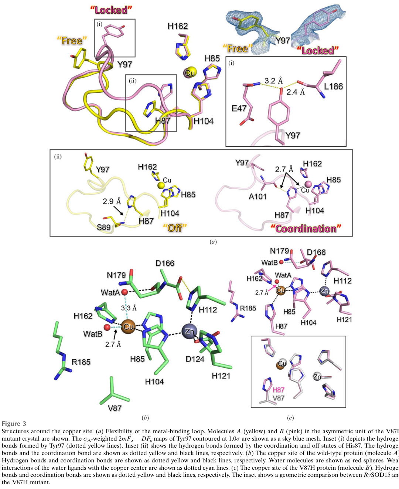

## Question

# Gene Research for Functional Annotation

## ⚠️ CRITICAL: Gene/Protein Identification Context

**BEFORE YOU BEGIN RESEARCH:** You MUST verify you are researching the CORRECT gene/protein. Gene symbols can be ambiguous, especially for less well-characterized genes from non-model organisms.

### Target Gene/Protein Identity (from UniProt):
- **UniProt Accession:** A0A1D1VWP9
- **Protein Description:** RecName: Full=Superoxide dismutase copper/zinc binding domain-containing protein {ECO:0000259|Pfam:PF00080};
- **Gene Information:** Name=RvY_15948 {ECO:0000313|EMBL:GAV05885.1}; Synonyms=RvY_15948.1 {ECO:0000313|EMBL:GAV05885.1}; ORFNames=RvY_15948-1 {ECO:0000313|EMBL:GAV05885.1};
- **Organism (full):** Ramazzottius varieornatus (Water bear) (Tardigrade).
- **Protein Family:** Not specified in UniProt
- **Key Domains:** SOD-like_Cu/Zn_dom_sf. (IPR036423); SOD_Cu/Zn_/chaperone. (IPR024134); SOD_Cu_Zn_dom. (IPR001424); Sod_Cu (PF00080)

### MANDATORY VERIFICATION STEPS:

1. **Check if the gene symbol "RvY_15948" matches the protein description above**
2. **Verify the organism is correct:** Ramazzottius varieornatus (Water bear) (Tardigrade).
3. **Check if protein family/domains align with what you find in literature**
4. **If you find literature for a DIFFERENT gene with the same or similar symbol, STOP**

### If Gene Symbol is Ambiguous or You Cannot Find Relevant Literature:

**DO NOT PROCEED WITH RESEARCH ON A DIFFERENT GENE.** Instead:
- State clearly: "The gene symbol 'RvY_15948' is ambiguous or literature is limited for this specific protein"
- Explain what you found (e.g., "Found extensive literature on a different gene with the same symbol in a different organism")
- Describe the protein based ONLY on the UniProt information provided above
- Suggest that the protein function can be inferred from domain/family information

### Research Target:

Please provide a comprehensive research report on the gene **RvY_15948** (gene ID: RvY_15948, UniProt: A0A1D1VWP9) in RAMVA.

The research report should be a detailed narrative explaining the function, biological processes, and localization of the gene product. Citations should be given for all claims.

You should prioritize authoritative reviews and primary scientific literature when conducting research. You can supplement
this with annotations you find in gene/protein databases, but these can be outdated or inaccurate.

We are specifically interested in the primary function of the gene - for enzymes, what reaction is catalyzed, and what is the substrate specificity? For transporters, what is the substrate? For structural proteins or adapters, what is the broader structural role? For signaling molecules, what is the role in the pathway.

We are interested in where in or outside the cell the gene product carries out its function.

We are also interested in the signaling or biochemical pathways in which the gene functions. We are less interested in broad pleiotropic effects, except where these elucidate the precise role.

Include evidence where possible. We are interested in both experimental evidence as well as inference from structure, evolution, or bioinformatic analysis. Precise studies should be prioritized over high-throughput, where available.

## Output

Question: You are an expert researcher providing comprehensive, well-cited information.

Provide detailed information focusing on:
1. Key concepts and definitions with current understanding
2. Recent developments and latest research (prioritize 2023-2024 sources)
3. Current applications and real-world implementations
4. Expert opinions and analysis from authoritative sources
5. Relevant statistics and data from recent studies

Format as a comprehensive research report with proper citations. Include URLs and publication dates where available.
Always prioritize recent, authoritative sources and provide specific citations for all major claims.

# Gene Research for Functional Annotation

## ⚠️ CRITICAL: Gene/Protein Identification Context

**BEFORE YOU BEGIN RESEARCH:** You MUST verify you are researching the CORRECT gene/protein. Gene symbols can be ambiguous, especially for less well-characterized genes from non-model organisms.

### Target Gene/Protein Identity (from UniProt):
- **UniProt Accession:** A0A1D1VWP9
- **Protein Description:** RecName: Full=Superoxide dismutase copper/zinc binding domain-containing protein {ECO:0000259|Pfam:PF00080};
- **Gene Information:** Name=RvY_15948 {ECO:0000313|EMBL:GAV05885.1}; Synonyms=RvY_15948.1 {ECO:0000313|EMBL:GAV05885.1}; ORFNames=RvY_15948-1 {ECO:0000313|EMBL:GAV05885.1};
- **Organism (full):** Ramazzottius varieornatus (Water bear) (Tardigrade).
- **Protein Family:** Not specified in UniProt
- **Key Domains:** SOD-like_Cu/Zn_dom_sf. (IPR036423); SOD_Cu/Zn_/chaperone. (IPR024134); SOD_Cu_Zn_dom. (IPR001424); Sod_Cu (PF00080)

### MANDATORY VERIFICATION STEPS:

1. **Check if the gene symbol "RvY_15948" matches the protein description above**
2. **Verify the organism is correct:** Ramazzottius varieornatus (Water bear) (Tardigrade).
3. **Check if protein family/domains align with what you find in literature**
4. **If you find literature for a DIFFERENT gene with the same or similar symbol, STOP**

### If Gene Symbol is Ambiguous or You Cannot Find Relevant Literature:

**DO NOT PROCEED WITH RESEARCH ON A DIFFERENT GENE.** Instead:
- State clearly: "The gene symbol 'RvY_15948' is ambiguous or literature is limited for this specific protein"
- Explain what you found (e.g., "Found extensive literature on a different gene with the same symbol in a different organism")
- Describe the protein based ONLY on the UniProt information provided above
- Suggest that the protein function can be inferred from domain/family information

### Research Target:

Please provide a comprehensive research report on the gene **RvY_15948** (gene ID: RvY_15948, UniProt: A0A1D1VWP9) in RAMVA.

The research report should be a detailed narrative explaining the function, biological processes, and localization of the gene product. Citations should be given for all claims.

You should prioritize authoritative reviews and primary scientific literature when conducting research. You can supplement
this with annotations you find in gene/protein databases, but these can be outdated or inaccurate.

We are specifically interested in the primary function of the gene - for enzymes, what reaction is catalyzed, and what is the substrate specificity? For transporters, what is the substrate? For structural proteins or adapters, what is the broader structural role? For signaling molecules, what is the role in the pathway.

We are interested in where in or outside the cell the gene product carries out its function.

We are also interested in the signaling or biochemical pathways in which the gene functions. We are less interested in broad pleiotropic effects, except where these elucidate the precise role.

Include evidence where possible. We are interested in both experimental evidence as well as inference from structure, evolution, or bioinformatic analysis. Precise studies should be prioritized over high-throughput, where available.

## Research report: Functional annotation of **RvY_15948** (UniProt **A0A1D1VWP9**) from *Ramazzottius varieornatus* (tardigrade)

### 0) Identity verification (critical disambiguation)
The target is UniProt **A0A1D1VWP9**, gene **RvY_15948** from the tardigrade ***Ramazzottius varieornatus* (strain YOKOZUNA-1)**, annotated in UniProt as a **“superoxide dismutase copper/zinc binding domain-containing protein”** with Pfam **Sod_Cu (PF00080)** domain.

In the accessible primary literature retrieved for *R. varieornatus* Cu/Zn SOD-like proteins, the specific accession **A0A1D1VWP9** and the gene symbol **RvY_15948** were **not explicitly mentioned**, so a one-to-one mapping between this UniProt record and a specific experimentally characterized paralog could not be confirmed from text evidence alone (sim2023structureofa pages 2-3, sim2023structureofa pages 7-9, sim2023structureofa pages 9-10). Therefore, the functional narrative below strictly (i) uses *R. varieornatus* SOD-family evidence, and (ii) distinguishes **domain/family-based inference** from **direct experimental characterization**.

### 1) Key concepts and definitions (current understanding)

#### 1.1 Superoxide dismutase (SOD) function
Cu/Zn superoxide dismutase (often termed SOD1 in many eukaryotes) catalyzes the **disproportionation of superoxide** into hydrogen peroxide and oxygen:

**2 O2•− + 2 H+ → H2O2 + O2** (liu2025superoxidedismutasesin pages 2-4).

A 2024 tardigrade-focused review reiterates the same core definition: **SODs dismutate superoxide to molecular oxygen and hydrogen peroxide** (sadowskabartosz2024antioxidantdefensein pages 13-15).

#### 1.2 Cofactors and structural requirements
A 2023 review of SOD applications/mechanisms summarizes the canonical Cu/Zn SOD cofactor logic: **copper is essential for catalysis**, while **zinc is primarily structural/stabilizing** (zheng2023theapplicationsand pages 2-4). This is important for annotating any “Cu/Zn SOD domain-containing” protein: the presence of the PF00080 domain indicates homology to the Cu/Zn SOD fold, but catalytic competence requires intact metal-binding geometry.

#### 1.3 Subcellular localization concepts for Cu/Zn SODs
In classical eukaryotic SOD1 biology, the enzyme is described as **primarily cytoplasmic**, with some presence in the **mitochondrial intermembrane space** (zheng2023theapplicationsand pages 2-4). In tardigrades, comparative genomics summarized in a 2024 review suggests multiple SOD paralogs distributed across **mitochondria, cytosol, and peroxisomes** (sadowskabartosz2024antioxidantdefensein pages 13-15). Separately, at least one *R. varieornatus* Cu/Zn SOD paralog characterized structurally (RvSOD15) was predicted to possess an **N-terminal signal peptide**, consistent with a **secreted/extracellular** localization (sim2023structureofa pages 2-3).

### 2) What is known specifically about Cu/Zn SOD-like proteins in *R. varieornatus* (family context for RvY_15948)

#### 2.1 Expansion of SOD genes in *R. varieornatus*
Multiple sources converge on a substantial SOD gene expansion in *R. varieornatus*:
* **Hashimoto et al. 2016 (Nature Communications)** reported **16 SOD genes** in the *R. varieornatus* genome (publication date: Sep 2016; URL: https://doi.org/10.1038/ncomms12808) (hashimoto2016extremotoleranttardigradegenome pages 2-3).
* A 2024 tardigrade antioxidant-defense review (publication date: Aug 2024; URL: https://doi.org/10.3390/ijms25158393) reports **16 SODs** in text and **17 SODs** in a comparative table (sadowskabartosz2024antioxidantdefensein pages 13-15, sadowskabartosz2024antioxidantdefensein pages 15-16). This review also highlights that most metazoans have fewer than ten SODs and lists humans as having 3 in its table (sadowskabartosz2024antioxidantdefensein pages 15-16).

These counts imply that RvY_15948 (A0A1D1VWP9) likely represents **one member of a large, diversified SOD-like repertoire** rather than a single ortholog of canonical eukaryotic SOD1.

#### 2.2 Functional diversification and possible loss of canonical SOD activity in some paralogs (critical for annotation)
A key 2023 structural study of a tardigrade Cu/Zn SOD paralog provides direct evidence that not all *R. varieornatus* Cu/Zn SOD-like proteins behave like canonical high-activity SOD enzymes:
* **Sim & Inoue 2023** solved crystal structures of a Cu/Zn-containing SOD from *R. varieornatus* (RvSOD15; GenBank GAV02514.1; publication date: Jun 2023; URL: https://doi.org/10.1107/S2053230X2300523X) (sim2023structureofa pages 2-3).
* In RvSOD15, **a histidine ligand of the catalytic copper center is replaced by valine (Val87)**; even restoring histidine (V87H mutant) did not yield a copper site “suitable for catalysis,” and the authors interpret RvSOD15 as having **low SOD activity** (sim2023structureofa pages 7-9).
* Model structures of additional RvSOD paralogs suggested other unusual features (e.g., deletions of an electrostatic loop / β3 sheet, unusual metal-binding residues), and the authors conclude that **some RvSODs may have evolved to lose SOD function** (sim2023structureofa pages 7-9).

A cropped figure region from this paper (Figure 3) visually documents the Cu/Zn active site organization and the unusual residue at the metal-binding position (Val87) in wild-type RvSOD15 (sim2023structureofa media 9ce47722).

A 2024 review independently echoes this conclusion: several *R. varieornatus* SODs are structurally unusual and **some may have lost canonical SOD activity**, implying that gene duplication alone does not explain tardigrade stress tolerance (sadowskabartosz2024antioxidantdefensein pages 15-16).

**Implication for RvY_15948 (A0A1D1VWP9):** While the UniProt record indicates a Cu/Zn SOD domain, the *R. varieornatus* family includes atypical SOD-like paralogs with altered metal-binding and reduced activity. Therefore, **RvY_15948 should be annotated cautiously as “Cu/Zn SOD-like domain protein” unless/ until catalytic residues and metal binding are validated for this exact protein**.

### 3) Likely molecular function of RvY_15948 (A0A1D1VWP9)

#### 3.1 Primary putative function (domain-based inference)
Given the Pfam PF00080 Cu/Zn SOD domain annotation in UniProt and the strong family context in *R. varieornatus*, the most defensible primary-function hypothesis is:

*RvY_15948 encodes a Cu/Zn SOD-fold (SOD1-like) protein that is evolutionarily related to enzymes catalyzing superoxide disproportionation.*

The canonical enzymatic reaction is the superoxide disproportionation shown above (liu2025superoxidedismutasesin pages 2-4, sadowskabartosz2024antioxidantdefensein pages 13-15).

#### 3.2 Substrate specificity
For catalytically competent Cu/Zn SODs, the substrate is **superoxide (O2•−)** and the products are **H2O2 and O2** (liu2025superoxidedismutasesin pages 2-4, sadowskabartosz2024antioxidantdefensein pages 13-15, zheng2023theapplicationsand pages 2-4).

For *R. varieornatus* SOD-like paralogs, substrate specificity may be altered if metal binding is disrupted (as observed for RvSOD15) (sim2023structureofa pages 7-9, sim2023structureofa media 9ce47722). No direct substrate or kinetic measurements are available for **A0A1D1VWP9**.

#### 3.3 Cofactors
If enzymatically active as a canonical Cu/Zn SOD, the protein would require **copper for catalysis** and **zinc for structural stabilization** (zheng2023theapplicationsand pages 2-4). However, the *R. varieornatus* structural work shows that even when copper and zinc are present, non-canonical coordination can compromise catalysis (sim2023structureofa pages 2-3, sim2023structureofa pages 7-9).

### 4) Biological processes and pathways (tardigrade context)

#### 4.1 Oxidative-stress management during anhydrobiosis and rehydration
Tardigrade antioxidant defenses are frequently interpreted through the “preparation for oxidative stress” concept: antioxidant systems induced/maintained during dehydration mitigate oxidative damage upon rehydration. The 2024 tardigrade antioxidant review places SODs within this broader defense system and reports SOD upregulation in stress-associated contexts (tun state, early embryonic state) in some tardigrade species (sadowskabartosz2024antioxidantdefensein pages 16-17).

#### 4.2 Constitutive vs inducible stress responses in *R. varieornatus*
Comparative genomics/transcriptomics indicates *R. varieornatus* exhibits a **smaller induced transcriptional response** to desiccation than *H. dujardini* (e.g., 64 genes upregulated after fast desiccation vs 1,422 in *H. dujardini*), consistent with **constitutive readiness** of stress-protection systems (publication date: Jul 2017; URL: https://doi.org/10.1371/journal.pbio.2002266) (yoshida2017comparativegenomicsof pages 11-13). This provides pathway-level context suggesting oxidative defense genes (including SOD-family members) may be maintained at baseline expression in active animals rather than strongly induced.

#### 4.3 Gene expansion does not imply enzyme activity (expert synthesis)
A key expert-level interpretation from the 2023 structural paper and the 2024 review is that **duplication/expansion of “antioxidant” gene families can produce paralogs with reduced/altered activity**, so functional annotation must consider sequence/structural integrity of catalytic features rather than copy number alone (sim2023structureofa pages 7-9, sadowskabartosz2024antioxidantdefensein pages 15-16).

### 5) Subcellular localization of the RvY_15948 gene product
Direct localization experiments for A0A1D1VWP9 were not found in retrieved sources. The best-supported localization statements are therefore probabilistic and family-based:

* *R. varieornatus* has multiple SOD paralogs predicted to localize to **mitochondria, cytosol, and peroxisomes** (sadowskabartosz2024antioxidantdefensein pages 13-15).
* At least one *R. varieornatus* Cu/Zn SOD paralog (RvSOD15) is predicted to have an **N-terminal signal peptide**, implying **secretion** (sim2023structureofa pages 2-3).

**Annotation consequence:** without sequence-level evidence for a signal peptide or targeting peptide in A0A1D1VWP9, its localization should remain **“unknown (predicted to be one of cytosolic/mitochondrial/peroxisomal/secreted, consistent with diversified tardigrade SOD paralogs)”**.

### 6) Recent developments (prioritizing 2023–2024)

#### 6.1 2023: Structural evidence for atypical Cu/Zn SODs in *R. varieornatus*
The 2023 crystal-structure paper provides a concrete mechanistic basis for atypical SOD-like proteins: a disrupted copper coordination environment associated with a His→Val substitution and loop flexibility that destabilizes catalytic coordination (sim2023structureofa pages 7-9, sim2023structureofa media 9ce47722). This directly affects how newly identified *R. varieornatus* Cu/Zn SOD-domain proteins (including RvY_15948) should be interpreted.

#### 6.2 2024: Consolidated antioxidant-defense synthesis and quantitative gene counts
The 2024 review compiles copy-number statistics and expression/activity trends across tardigrades, emphasizing that *R. varieornatus* contains ~16–17 SOD genes and that SOD activity/expression patterns vary across species and states (sadowskabartosz2024antioxidantdefensein pages 13-15, sadowskabartosz2024antioxidantdefensein pages 15-16, sadowskabartosz2024antioxidantdefensein pages 16-17).

### 7) Applications and real-world implementations (recent)
Although no direct biotechnology application of **RvY_15948** itself was identified, a closely related translational theme is the use of tardigrade-derived stress tolerance factors in mammalian cells.

#### 7.1 2024 implementation: tardigrade MAHS improves human stem-cell survival under stress
Rolsma et al. (publication date: May 2024; URL: https://doi.org/10.1038/s41598-024-62693-w) expressed tardigrade **MAHS** (a mitochondrial stress-tolerance protein) in human adipose-derived stem cells and reported quantitative improvements:
* **Up to 61% increased survival** after 72 h in PBS with 20% media.
* **14–49% increased survival** after up to 72 h exposure to up to 3.5% DMSO.
* **Up to 39% improved viability** after injection through 27-, 32-, and 34-gauge needles (rolsma2024thetardigradederivedmitochondrial pages 1-2).

They discuss oxidative-stress/mitochondrial ROS mechanisms (DMSO and starvation can induce ROS and mitochondrial dysfunction) and explicitly reference mitochondrial ROS-neutralizing enzymes including **manganese superoxide dismutase** (rolsma2024thetardigradederivedmitochondrial pages 10-12, rolsma2024thetardigradederivedmitochondrial pages 12-13). This illustrates a current translational direction: **deploying extremophile-derived proteins to mitigate oxidative and mechanical stress in biomedical workflows**, which is conceptually aligned with why antioxidant networks (including SOD-like proteins) are studied in tardigrades.

### 8) Relevant statistics and quantitative data (recent studies)

* **SOD gene counts:** *R. varieornatus* has **16 SOD genes** (Hashimoto et al. 2016) (hashimoto2016extremotoleranttardigradegenome pages 2-3), and a 2024 review reports **16–17** depending on the passage/table (sadowskabartosz2024antioxidantdefensein pages 13-15, sadowskabartosz2024antioxidantdefensein pages 15-16).
* **Cross-tardigrade SOD range:** 2024–2022 synthesis indicates SOD copy number across tardigrades ranges **8 to 17** (giovannini2022antioxidantresponseduring pages 8-10, sadowskabartosz2024antioxidantdefensein pages 15-16).
* **Anhydrobiosis transcriptomic response:** genes upregulated on entry: *R. varieornatus* **64 (0.5%)** after fast desiccation and **307 (2.2%)** after slow desiccation, compared to *H. dujardini* **1,422 (7.1%)** (yoshida2017comparativegenomicsof pages 11-13).
* **2024 translational outcomes (MAHS in human ASCs):** up to **61%** survival improvement; **14–49%** improvement under DMSO; up to **39%** improved injection viability (rolsma2024thetardigradederivedmitochondrial pages 1-2).

### 9) Summary functional annotation recommendation for RvY_15948 (A0A1D1VWP9)

**Most defensible current annotation (evidence-constrained):**
* **Protein type:** Cu/Zn superoxide dismutase-fold (PF00080) **domain-containing protein** in *R. varieornatus*.
* **Likely biological role:** participates in (or evolved from) **ROS/superoxide management pathways** associated with oxidative stress in tardigrades (sadowskabartosz2024antioxidantdefensein pages 13-15, yoshida2017comparativegenomicsof pages 11-13).
* **Enzymatic activity:** **uncertain without sequence/biochemical validation**; *R. varieornatus* contains atypical Cu/Zn SOD-like paralogs with **low or lost SOD activity** (sim2023structureofa pages 7-9, sadowskabartosz2024antioxidantdefensein pages 15-16).
* **Localization:** **undetermined for this accession**; family context includes cytosolic/mitochondrial/peroxisomal predictions, and at least one paralog is predicted secreted (sadowskabartosz2024antioxidantdefensein pages 13-15, sim2023structureofa pages 2-3).

### Evidence map (for traceability)
The following table summarizes how the key lines of evidence constrain annotation of A0A1D1VWP9.

| Evidence source (paper, year, DOI URL) | What was studied (organism/protein) | Key findings on function/mechanism (reaction, metals, unusual residues) | Localization notes (e.g., signal peptide/secreted vs cytosolic/mitochondrial/peroxisomal prediction) | Quantitative/statistical data (gene counts, fold changes) | Implication for annotating A0A1D1VWP9 |
|---|---|---|---|---|---|
| Sim & Inoue, 2023, https://doi.org/10.1107/S2053230X2300523X | *Ramazzottius varieornatus* Cu/Zn SOD RvSOD15 (GenBank GAV02514.1) and modeled RvSOD family members | Authors treated RvSOD15 as a Cu/Zn SOD, refolded it with ZnSO4 and CuSO4, and solved crystal structures. However, RvSOD15 has an unusual Val87 substitution at a catalytic copper-ligand position; the V87H mutant still did not form a catalytically suitable copper site. Some RvSODs have deleted electrostatic loop/β3 sheet or unusual metal-binding residues, suggesting loss or reduction of canonical SOD activity rather than standard superoxide dismutation in all paralogs (sim2023structureofa pages 2-3, sim2023structureofa pages 7-9, sim2023structureofa pages 9-10) | RvSOD15 was predicted to have an N-terminal signal peptide and thus be secreted; no direct localization data were provided for A0A1D1VWP9 or RvY_15948 (sim2023structureofa pages 2-3) | Structural study; no accession-level statistics for A0A1D1VWP9. Qualitative family-level finding that some RvSODs may have low or lost SOD activity (sim2023structureofa pages 7-9) | Strong evidence that *R. varieornatus* contains both canonical-looking and atypical Cu/Zn SOD-like proteins. Because A0A1D1VWP9 is only annotated as a Cu/Zn-binding-domain protein and was not directly studied, it should be annotated cautiously as a **SOD-like domain protein with probable metal-binding/oxidative-stress-related ancestry**, not assumed to be an active canonical SOD without sequence-level catalytic validation (sim2023structureofa pages 2-3, sim2023structureofa pages 7-9, sim2023structureofa pages 9-10) |
| Sadowska-Bartosz & Bartosz, 2024, https://doi.org/10.3390/ijms25158393 | Review of antioxidant defenses in tardigrades, including *R. varieornatus* SOD repertoire | Reiterates canonical SOD function: SODs dismutate superoxide to O2 and H2O2. Reports both Cu/Zn and Mn SOD isoforms in tardigrades, but highlights that several *R. varieornatus* Cu/Zn SODs are structurally unusual and some may have lost canonical activity; therefore gene-family expansion alone does not prove enzymatic function for every paralog (sadowskabartosz2024antioxidantdefensein pages 13-15, sadowskabartosz2024antioxidantdefensein pages 15-16) | Review states predicted SOD localizations in *R. varieornatus* include mitochondria, cytosol, and peroxisomes; does not assign a specific compartment to A0A1D1VWP9 (sadowskabartosz2024antioxidantdefensein pages 13-15) | Reported SOD counts for tardigrades: *R. varieornatus* listed as 17 in a table, with text also mentioning 16; other counts: *E. sigismundi* 8, *R. coronifer* 14, *H. exemplaris* 15, *Homo sapiens* 3. CuZn-SODs are described as highly expressed in *R. varieornatus* (sadowskabartosz2024antioxidantdefensein pages 13-15, sadowskabartosz2024antioxidantdefensein pages 15-16) | Supports annotating A0A1D1VWP9 as part of a **large, diversified tardigrade SOD-like family** associated with oxidative-stress biology, but not necessarily as an active cytosolic Cu/Zn SOD enzyme. Family context favors oxidative defense relevance, while structural divergence argues for possible neofunctionalization or pseudocatalytic behavior (sadowskabartosz2024antioxidantdefensein pages 13-15, sadowskabartosz2024antioxidantdefensein pages 15-16) |
| Hashimoto et al., 2016, https://doi.org/10.1038/ncomms12808 | Genome of *Ramazzottius varieornatus* and stress-related gene repertoires | Reports genomic expansion of antioxidative enzymes, especially SODs, in *R. varieornatus*. This supports evolutionary selection on antioxidant capacity but does not provide direct biochemical proof for any one SOD paralog. The paper frames SOD expansion as a potential contributor to desiccation tolerance (hashimoto2016extremotoleranttardigradegenome pages 2-3, hashimoto2016extremotoleranttardigradegenome pages 10-11) | No accession-specific localization for A0A1D1VWP9 in the gathered snippet (hashimoto2016extremotoleranttardigradegenome pages 2-3, hashimoto2016extremotoleranttardigradegenome pages 10-11) | 16 SOD genes reported in the genome; authors also generated RNA-seq across six physiological states, though no direct A0A1D1VWP9 expression values were present in the snippet (hashimoto2016extremotoleranttardigradegenome pages 2-3) | Supports a broad annotation that A0A1D1VWP9 belongs to an expanded antioxidant-enzyme family in *R. varieornatus*. However, genome context alone is insufficient to call it catalytically active; annotation should remain domain-based unless catalytic residues or activity are demonstrated (hashimoto2016extremotoleranttardigradegenome pages 2-3, hashimoto2016extremotoleranttardigradegenome pages 10-11) |
| Yoshida et al., 2017, https://doi.org/10.1371/journal.pbio.2002266 | Comparative genomics/transcriptomics of *R. varieornatus* vs *Hypsibius dujardini* | Reports that proteins related to protection from oxidants, including SOD and peroxiredoxin, were extensively duplicated in tardigrades. Also shows *R. varieornatus* has a much smaller inducible transcriptional response to desiccation than *H. dujardini*, consistent with constitutive readiness of stress-protection systems rather than strong induction alone (yoshida2017comparativegenomicsof pages 11-13, yoshida2017comparativegenomicsof pages 21-23) | No A0A1D1VWP9-specific localization in the gathered snippet (yoshida2017comparativegenomicsof pages 11-13, yoshida2017comparativegenomicsof pages 21-23) | Upregulated genes on anhydrobiosis entry: *R. varieornatus* 64 (0.5%) after fast desiccation and 307 (2.2%) after slow desiccation vs *H. dujardini* 1,422 (7.1%). Many stress-related genes in *R. varieornatus* were already highly expressed in active state (>100 TPM) (yoshida2017comparativegenomicsof pages 11-13, yoshida2017comparativegenomicsof pages 21-23) | Suggests A0A1D1VWP9 may function in a constitutively poised oxidative-stress network in active tardigrades. Still, this is pathway-level inference; it does not resolve whether the specific protein is an active Cu/Zn SOD, a secreted antioxidant, or a structurally derived SOD-like protein with altered function (yoshida2017comparativegenomicsof pages 11-13, yoshida2017comparativegenomicsof pages 21-23) |
| Giovannini et al., 2022, https://doi.org/10.3390/life12060817 | Antioxidant enzyme activities during anhydrobiosis in two eutardigrades (*Acutuncus antarcticus*, *Paramacrobiotus spatialis*) | Provides physiological context: SOD likely acts early in desiccation by converting superoxide into a less reactive molecule, with downstream peroxide detoxification by catalase. Responses differ across species, showing that SOD family members can be regulated differently during dehydration/rehydration (giovannini2022antioxidantresponseduring pages 8-10) | No localization data for A0A1D1VWP9; no *R. varieornatus* protein-specific result (giovannini2022antioxidantresponseduring pages 8-10) | Tardigrade SOD copy numbers summarized as ranging from 8 to 17 across species; in *A. antarcticus*, SOD activity reached the lowest value in desiccated animals (giovannini2022antioxidantresponseduring pages 8-10) | Useful as functional background for superoxide-detoxifying SODs, but only indirect for A0A1D1VWP9. Supports the possibility that if A0A1D1VWP9 is catalytically active, its substrate would be superoxide and its pathway role would be ROS detoxification; however, no accession-specific evidence is provided (giovannini2022antioxidantresponseduring pages 8-10) |
| Sadowska-Bartosz & Bartosz, 2024, https://doi.org/10.3390/ijms25158393 | Review of developmental/anhydrobiotic antioxidant regulation in tardigrades | Reports Cu/Zn SOD upregulation in early embryonic state and SOD upregulation in the tun state in some tardigrades, but species-specific behavior varies. This indicates that SOD family participation in oxidative-stress protection is biologically relevant even though not all family members are necessarily equivalent enzymes (sadowskabartosz2024antioxidantdefensein pages 16-17) | No accession-specific localization for A0A1D1VWP9 (sadowskabartosz2024antioxidantdefensein pages 16-17) | Examples include upregulation of SODs in tun state and >3-fold higher total glutathione in desiccated *P. richtersi*; a separate Mn-dependent peroxidase gene in *R. varieornatus* showed 2.5-fold induction, underscoring broader antioxidant remodeling (sadowskabartosz2024antioxidantdefensein pages 16-17) | Reinforces annotation of A0A1D1VWP9 within oxidative-stress/anhydrobiosis biology, but also shows that multiple antioxidant systems operate in parallel. For A0A1D1VWP9, the safest annotation remains **Cu/Zn SOD-like domain-containing protein, probable oxidative-stress-related protein; enzymatic activity and exact localization unresolved** (sadowskabartosz2024antioxidantdefensein pages 16-17) |

*Table: This table compiles the literature-based evidence most relevant to functional annotation of the Ramazzottius varieornatus Cu/Zn SOD-like protein A0A1D1VWP9 (RvY_15948). It distinguishes direct evidence from family-level inference and highlights why annotation should be cautious given the presence of atypical, potentially noncanonical SOD paralogs in tardigrades.*

References

1. (sim2023structureofa pages 2-3): Kee-Shin Sim and Tsuyoshi Inoue. Structure of a superoxide dismutase from a tardigrade: ramazzottius varieornatus strain yokozuna-1. Acta crystallographica. Section F, Structural biology communications, 79:169-179, Jun 2023. URL: https://doi.org/10.1107/s2053230x2300523x, doi:10.1107/s2053230x2300523x. This article has 5 citations.

2. (sim2023structureofa pages 7-9): Kee-Shin Sim and Tsuyoshi Inoue. Structure of a superoxide dismutase from a tardigrade: ramazzottius varieornatus strain yokozuna-1. Acta crystallographica. Section F, Structural biology communications, 79:169-179, Jun 2023. URL: https://doi.org/10.1107/s2053230x2300523x, doi:10.1107/s2053230x2300523x. This article has 5 citations.

3. (sim2023structureofa pages 9-10): Kee-Shin Sim and Tsuyoshi Inoue. Structure of a superoxide dismutase from a tardigrade: ramazzottius varieornatus strain yokozuna-1. Acta crystallographica. Section F, Structural biology communications, 79:169-179, Jun 2023. URL: https://doi.org/10.1107/s2053230x2300523x, doi:10.1107/s2053230x2300523x. This article has 5 citations.

4. (liu2025superoxidedismutasesin pages 2-4): Tong Liu, Jiajin Shang, and Qijun Chen. Superoxide dismutases in immune regulation and infectious diseases. Antioxidants, 14:809, Jun 2025. URL: https://doi.org/10.3390/antiox14070809, doi:10.3390/antiox14070809. This article has 12 citations.

5. (sadowskabartosz2024antioxidantdefensein pages 13-15): Izabela Sadowska-Bartosz and Grzegorz Bartosz. Antioxidant defense in the toughest animals on the earth: its contribution to the extreme resistance of tardigrades. International Journal of Molecular Sciences, 25:8393, Aug 2024. URL: https://doi.org/10.3390/ijms25158393, doi:10.3390/ijms25158393. This article has 14 citations.

6. (zheng2023theapplicationsand pages 2-4): Mengli Zheng, Yating Liu, Guanfeng Zhang, Zhikang Yang, Weiwei Xu, and Qinghua Chen. The applications and mechanisms of superoxide dismutase in medicine, food, and cosmetics. Antioxidants, 12:1675, Aug 2023. URL: https://doi.org/10.3390/antiox12091675, doi:10.3390/antiox12091675. This article has 373 citations.

7. (hashimoto2016extremotoleranttardigradegenome pages 2-3): Takuma Hashimoto, Daiki D. Horikawa, Yuki Saito, Hirokazu Kuwahara, Hiroko Kozuka-Hata, Tadasu Shin-I, Yohei Minakuchi, Kazuko Ohishi, Ayuko Motoyama, Tomoyuki Aizu, Atsushi Enomoto, Koyuki Kondo, Sae Tanaka, Yuichiro Hara, Shigeyuki Koshikawa, Hiroshi Sagara, Toru Miura, Shin-ichi Yokobori, Kiyoshi Miyagawa, Yutaka Suzuki, Takeo Kubo, Masaaki Oyama, Yuji Kohara, Asao Fujiyama, Kazuharu Arakawa, Toshiaki Katayama, Atsushi Toyoda, and Takekazu Kunieda. Extremotolerant tardigrade genome and improved radiotolerance of human cultured cells by tardigrade-unique protein. Nature Communications, Sep 2016. URL: https://doi.org/10.1038/ncomms12808, doi:10.1038/ncomms12808. This article has 477 citations and is from a highest quality peer-reviewed journal.

8. (sadowskabartosz2024antioxidantdefensein pages 15-16): Izabela Sadowska-Bartosz and Grzegorz Bartosz. Antioxidant defense in the toughest animals on the earth: its contribution to the extreme resistance of tardigrades. International Journal of Molecular Sciences, 25:8393, Aug 2024. URL: https://doi.org/10.3390/ijms25158393, doi:10.3390/ijms25158393. This article has 14 citations.

9. (sim2023structureofa media 9ce47722): Kee-Shin Sim and Tsuyoshi Inoue. Structure of a superoxide dismutase from a tardigrade: ramazzottius varieornatus strain yokozuna-1. Acta crystallographica. Section F, Structural biology communications, 79:169-179, Jun 2023. URL: https://doi.org/10.1107/s2053230x2300523x, doi:10.1107/s2053230x2300523x. This article has 5 citations.

10. (sadowskabartosz2024antioxidantdefensein pages 16-17): Izabela Sadowska-Bartosz and Grzegorz Bartosz. Antioxidant defense in the toughest animals on the earth: its contribution to the extreme resistance of tardigrades. International Journal of Molecular Sciences, 25:8393, Aug 2024. URL: https://doi.org/10.3390/ijms25158393, doi:10.3390/ijms25158393. This article has 14 citations.

11. (yoshida2017comparativegenomicsof pages 11-13): Yuki Yoshida, Georgios Koutsovoulos, Dominik R. Laetsch, Lewis Stevens, Sujai Kumar, Daiki D. Horikawa, Kyoko Ishino, Shiori Komine, Takekazu Kunieda, Masaru Tomita, Mark Blaxter, and Kazuharu Arakawa. Comparative genomics of the tardigrades hypsibius dujardini and ramazzottius varieornatus. PLOS Biology, 15:e2002266, Jul 2017. URL: https://doi.org/10.1371/journal.pbio.2002266, doi:10.1371/journal.pbio.2002266. This article has 250 citations and is from a highest quality peer-reviewed journal.

12. (rolsma2024thetardigradederivedmitochondrial pages 1-2): Jordan L. Rolsma, William Darch, Nicholas C. Higgins, and Joshua T. Morgan. The tardigrade-derived mitochondrial abundant heat soluble protein improves adipose-derived stem cell survival against representative stressors. Scientific Reports, May 2024. URL: https://doi.org/10.1038/s41598-024-62693-w, doi:10.1038/s41598-024-62693-w. This article has 6 citations and is from a peer-reviewed journal.

13. (rolsma2024thetardigradederivedmitochondrial pages 10-12): Jordan L. Rolsma, William Darch, Nicholas C. Higgins, and Joshua T. Morgan. The tardigrade-derived mitochondrial abundant heat soluble protein improves adipose-derived stem cell survival against representative stressors. Scientific Reports, May 2024. URL: https://doi.org/10.1038/s41598-024-62693-w, doi:10.1038/s41598-024-62693-w. This article has 6 citations and is from a peer-reviewed journal.

14. (rolsma2024thetardigradederivedmitochondrial pages 12-13): Jordan L. Rolsma, William Darch, Nicholas C. Higgins, and Joshua T. Morgan. The tardigrade-derived mitochondrial abundant heat soluble protein improves adipose-derived stem cell survival against representative stressors. Scientific Reports, May 2024. URL: https://doi.org/10.1038/s41598-024-62693-w, doi:10.1038/s41598-024-62693-w. This article has 6 citations and is from a peer-reviewed journal.

15. (giovannini2022antioxidantresponseduring pages 8-10): Ilaria Giovannini, Paola Antonia Corsetto, Tiziana Altiero, Gigliola Montorfano, Roberto Guidetti, Angela Maria Rizzo, and Lorena Rebecchi. Antioxidant response during the kinetics of anhydrobiosis in two eutardigrade species. Life, 12:817, May 2022. URL: https://doi.org/10.3390/life12060817, doi:10.3390/life12060817. This article has 16 citations.

16. (hashimoto2016extremotoleranttardigradegenome pages 10-11): Takuma Hashimoto, Daiki D. Horikawa, Yuki Saito, Hirokazu Kuwahara, Hiroko Kozuka-Hata, Tadasu Shin-I, Yohei Minakuchi, Kazuko Ohishi, Ayuko Motoyama, Tomoyuki Aizu, Atsushi Enomoto, Koyuki Kondo, Sae Tanaka, Yuichiro Hara, Shigeyuki Koshikawa, Hiroshi Sagara, Toru Miura, Shin-ichi Yokobori, Kiyoshi Miyagawa, Yutaka Suzuki, Takeo Kubo, Masaaki Oyama, Yuji Kohara, Asao Fujiyama, Kazuharu Arakawa, Toshiaki Katayama, Atsushi Toyoda, and Takekazu Kunieda. Extremotolerant tardigrade genome and improved radiotolerance of human cultured cells by tardigrade-unique protein. Nature Communications, Sep 2016. URL: https://doi.org/10.1038/ncomms12808, doi:10.1038/ncomms12808. This article has 477 citations and is from a highest quality peer-reviewed journal.

17. (yoshida2017comparativegenomicsof pages 21-23): Yuki Yoshida, Georgios Koutsovoulos, Dominik R. Laetsch, Lewis Stevens, Sujai Kumar, Daiki D. Horikawa, Kyoko Ishino, Shiori Komine, Takekazu Kunieda, Masaru Tomita, Mark Blaxter, and Kazuharu Arakawa. Comparative genomics of the tardigrades hypsibius dujardini and ramazzottius varieornatus. PLOS Biology, 15:e2002266, Jul 2017. URL: https://doi.org/10.1371/journal.pbio.2002266, doi:10.1371/journal.pbio.2002266. This article has 250 citations and is from a highest quality peer-reviewed journal.

## Artifacts

- [Edison artifact artifact-00](RvY_15948-deep-research-falcon_artifacts/artifact-00.md)

## Citations

1. liu2025superoxidedismutasesin pages 2-4
2. sadowskabartosz2024antioxidantdefensein pages 13-15
3. zheng2023theapplicationsand pages 2-4
4. sim2023structureofa pages 2-3
5. hashimoto2016extremotoleranttardigradegenome pages 2-3
6. sadowskabartosz2024antioxidantdefensein pages 15-16
7. sim2023structureofa pages 7-9
8. sadowskabartosz2024antioxidantdefensein pages 16-17
9. yoshida2017comparativegenomicsof pages 11-13
10. rolsma2024thetardigradederivedmitochondrial pages 1-2
11. giovannini2022antioxidantresponseduring pages 8-10
12. sim2023structureofa pages 9-10
13. rolsma2024thetardigradederivedmitochondrial pages 10-12
14. rolsma2024thetardigradederivedmitochondrial pages 12-13
15. hashimoto2016extremotoleranttardigradegenome pages 10-11
16. yoshida2017comparativegenomicsof pages 21-23
17. https://doi.org/10.1038/ncomms12808
18. https://doi.org/10.3390/ijms25158393
19. https://doi.org/10.1107/S2053230X2300523X
20. https://doi.org/10.1371/journal.pbio.2002266
21. https://doi.org/10.1038/s41598-024-62693-w
22. https://doi.org/10.3390/life12060817
23. https://doi.org/10.1107/s2053230x2300523x,
24. https://doi.org/10.3390/antiox14070809,
25. https://doi.org/10.3390/ijms25158393,
26. https://doi.org/10.3390/antiox12091675,
27. https://doi.org/10.1038/ncomms12808,
28. https://doi.org/10.1371/journal.pbio.2002266,
29. https://doi.org/10.1038/s41598-024-62693-w,
30. https://doi.org/10.3390/life12060817,