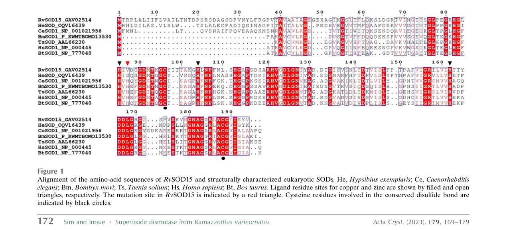

## Question

# Gene Research for Functional Annotation

## ⚠️ CRITICAL: Gene/Protein Identification Context

**BEFORE YOU BEGIN RESEARCH:** You MUST verify you are researching the CORRECT gene/protein. Gene symbols can be ambiguous, especially for less well-characterized genes from non-model organisms.

### Target Gene/Protein Identity (from UniProt):
- **UniProt Accession:** A0A1D1W3Y1
- **Protein Description:** RecName: Full=superoxide dismutase {ECO:0000256|ARBA:ARBA00012682}; EC=1.15.1.1 {ECO:0000256|ARBA:ARBA00012682};
- **Gene Information:** Name=RvY_17310-1 {ECO:0000313|EMBL:GAV07483.1}; Synonyms=RvY_17310.1 {ECO:0000313|EMBL:GAV07483.1}; ORFNames=RvY_17310 {ECO:0000313|EMBL:GAV07483.1};
- **Organism (full):** Ramazzottius varieornatus (Water bear) (Tardigrade).
- **Protein Family:** Belongs to the Cu-Zn superoxide dismutase family.
- **Key Domains:** SOD-like_Cu/Zn_dom_sf. (IPR036423); SOD_Cu/Zn_/chaperone. (IPR024134); SOD_Cu/Zn_BS. (IPR018152); SOD_Cu_Zn_dom. (IPR001424); Sod_Cu (PF00080)

### MANDATORY VERIFICATION STEPS:

1. **Check if the gene symbol "RvY_17310-1" matches the protein description above**
2. **Verify the organism is correct:** Ramazzottius varieornatus (Water bear) (Tardigrade).
3. **Check if protein family/domains align with what you find in literature**
4. **If you find literature for a DIFFERENT gene with the same or similar symbol, STOP**

### If Gene Symbol is Ambiguous or You Cannot Find Relevant Literature:

**DO NOT PROCEED WITH RESEARCH ON A DIFFERENT GENE.** Instead:
- State clearly: "The gene symbol 'RvY_17310-1' is ambiguous or literature is limited for this specific protein"
- Explain what you found (e.g., "Found extensive literature on a different gene with the same symbol in a different organism")
- Describe the protein based ONLY on the UniProt information provided above
- Suggest that the protein function can be inferred from domain/family information

### Research Target:

Please provide a comprehensive research report on the gene **RvY_17310-1** (gene ID: RvY_17310, UniProt: A0A1D1W3Y1) in RAMVA.

The research report should be a detailed narrative explaining the function, biological processes, and localization of the gene product. Citations should be given for all claims.

You should prioritize authoritative reviews and primary scientific literature when conducting research. You can supplement
this with annotations you find in gene/protein databases, but these can be outdated or inaccurate.

We are specifically interested in the primary function of the gene - for enzymes, what reaction is catalyzed, and what is the substrate specificity? For transporters, what is the substrate? For structural proteins or adapters, what is the broader structural role? For signaling molecules, what is the role in the pathway.

We are interested in where in or outside the cell the gene product carries out its function.

We are also interested in the signaling or biochemical pathways in which the gene functions. We are less interested in broad pleiotropic effects, except where these elucidate the precise role.

Include evidence where possible. We are interested in both experimental evidence as well as inference from structure, evolution, or bioinformatic analysis. Precise studies should be prioritized over high-throughput, where available.

## Output

Question: You are an expert researcher providing comprehensive, well-cited information.

Provide detailed information focusing on:
1. Key concepts and definitions with current understanding
2. Recent developments and latest research (prioritize 2023-2024 sources)
3. Current applications and real-world implementations
4. Expert opinions and analysis from authoritative sources
5. Relevant statistics and data from recent studies

Format as a comprehensive research report with proper citations. Include URLs and publication dates where available.
Always prioritize recent, authoritative sources and provide specific citations for all major claims.

# Gene Research for Functional Annotation

## ⚠️ CRITICAL: Gene/Protein Identification Context

**BEFORE YOU BEGIN RESEARCH:** You MUST verify you are researching the CORRECT gene/protein. Gene symbols can be ambiguous, especially for less well-characterized genes from non-model organisms.

### Target Gene/Protein Identity (from UniProt):
- **UniProt Accession:** A0A1D1W3Y1
- **Protein Description:** RecName: Full=superoxide dismutase {ECO:0000256|ARBA:ARBA00012682}; EC=1.15.1.1 {ECO:0000256|ARBA:ARBA00012682};
- **Gene Information:** Name=RvY_17310-1 {ECO:0000313|EMBL:GAV07483.1}; Synonyms=RvY_17310.1 {ECO:0000313|EMBL:GAV07483.1}; ORFNames=RvY_17310 {ECO:0000313|EMBL:GAV07483.1};
- **Organism (full):** Ramazzottius varieornatus (Water bear) (Tardigrade).
- **Protein Family:** Belongs to the Cu-Zn superoxide dismutase family.
- **Key Domains:** SOD-like_Cu/Zn_dom_sf. (IPR036423); SOD_Cu/Zn_/chaperone. (IPR024134); SOD_Cu/Zn_BS. (IPR018152); SOD_Cu_Zn_dom. (IPR001424); Sod_Cu (PF00080)

### MANDATORY VERIFICATION STEPS:

1. **Check if the gene symbol "RvY_17310-1" matches the protein description above**
2. **Verify the organism is correct:** Ramazzottius varieornatus (Water bear) (Tardigrade).
3. **Check if protein family/domains align with what you find in literature**
4. **If you find literature for a DIFFERENT gene with the same or similar symbol, STOP**

### If Gene Symbol is Ambiguous or You Cannot Find Relevant Literature:

**DO NOT PROCEED WITH RESEARCH ON A DIFFERENT GENE.** Instead:
- State clearly: "The gene symbol 'RvY_17310-1' is ambiguous or literature is limited for this specific protein"
- Explain what you found (e.g., "Found extensive literature on a different gene with the same symbol in a different organism")
- Describe the protein based ONLY on the UniProt information provided above
- Suggest that the protein function can be inferred from domain/family information

### Research Target:

Please provide a comprehensive research report on the gene **RvY_17310-1** (gene ID: RvY_17310, UniProt: A0A1D1W3Y1) in RAMVA.

The research report should be a detailed narrative explaining the function, biological processes, and localization of the gene product. Citations should be given for all claims.

You should prioritize authoritative reviews and primary scientific literature when conducting research. You can supplement
this with annotations you find in gene/protein databases, but these can be outdated or inaccurate.

We are specifically interested in the primary function of the gene - for enzymes, what reaction is catalyzed, and what is the substrate specificity? For transporters, what is the substrate? For structural proteins or adapters, what is the broader structural role? For signaling molecules, what is the role in the pathway.

We are interested in where in or outside the cell the gene product carries out its function.

We are also interested in the signaling or biochemical pathways in which the gene functions. We are less interested in broad pleiotropic effects, except where these elucidate the precise role.

Include evidence where possible. We are interested in both experimental evidence as well as inference from structure, evolution, or bioinformatic analysis. Precise studies should be prioritized over high-throughput, where available.

# Research report: Functional annotation of **RvY_17310-1 / RvY_17310** (UniProt **A0A1D1W3Y1**) from *Ramazzottius varieornatus*

## Executive summary
UniProt accession **A0A1D1W3Y1** is annotated as a **Cu/Zn superoxide dismutase (Cu/Zn-SOD; EC 1.15.1.1)** from the tardigrade *Ramazzottius varieornatus* (gene name **RvY_17310-1**, ORF name **RvY_17310**). However, in the peer‑reviewed literature retrieved here, **the specific locus identifier RvY_17310 (or UniProt A0A1D1W3Y1)** was **not explicitly mentioned**, so direct gene-specific experimental claims cannot be made from these sources; functional annotation is therefore **family/domain-based**, triangulated with organism-level tardigrade SOD literature. (sim2023structureofa pages 3-4)

Tardigrades show an **expanded superoxide dismutase repertoire** (e.g., ~16–17 SOD genes reported for *R. varieornatus*) and multiple paralogs appear **structurally diversified**, with at least one characterized Cu/Zn-SOD paralog (RvSOD15) showing **non-canonical metal-binding** likely associated with reduced/altered activity. (hashimoto2016extremotoleranttardigradegenome pages 2-3, sadowskabartosz2024antioxidantdefensein pages 15-16, sim2023structureofa pages 1-2)

## Evidence map (key findings table)
| Claim/Item | Key result/data (include any numbers) | Evidence type | Citation ID(s) | Publication date | URL |
|---|---|---|---|---|---|
| UniProt A0A1D1W3Y1 / gene RvY_17310-1 in *Ramazzottius varieornatus* | Direct literature linkage is limited: the retrieved *R. varieornatus* SOD literature did **not** explicitly mention locus **RvY_17310-1 / RvY_17310**. UniProt annotation identifies it as a **Cu/Zn superoxide dismutase** family protein, so function is currently inferred mainly from family/domain annotation rather than a locus-specific paper. | Database annotation plus negative literature-mapping result | (sim2023structureofa pages 3-4, sim2023structureofa pages 1-2, sim2023structureofa pages 2-3) | No direct locus paper found in retrieved literature (search through 2025) | https://www.uniprot.org/uniprotkb/A0A1D1W3Y1 |
| RvSOD15 structural study in *R. varieornatus* | Crystal structures of **RvSOD15** solved at **2.2 Å** (WT; PDB **7ypp**) and **2.10 Å** (V87H; PDB **7ypr**). A canonical Cu-liganding His is replaced by **Val87**; copper site shows only **3 histidine ligands** plus waters in WT. Authors infer some tardigrade SOD paralogs may have **low or lost canonical SOD activity**. RvSOD15 is predicted to have an **N-terminal signal peptide** (secreted). | Primary structural biology study | (sim2023structureofa pages 1-2, sim2023structureofa pages 4-7, sim2023structureofa pages 7-9, sim2023structureofa pages 2-3) | Jun 2023 | https://doi.org/10.1107/S2053230X2300523X |
| Genome-wide SOD expansion in *R. varieornatus* | Genome study reported **16 SOD genes** in *R. varieornatus*, versus **fewer than 10** in most metazoans; interpreted as expansion of stress-response gene families potentially relevant to oxidative stress during desiccation. | Primary genome analysis | (hashimoto2016extremotoleranttardigradegenome pages 2-3) | Sep 2016 | https://doi.org/10.1038/ncomms12808 |
| 2024 review synthesis on tardigrade antioxidant defense | Review summarizes that *R. varieornatus* has an expanded/diversified SOD repertoire, citing **16–17 SODs** in the species and noting CuZn-SODs are highly expressed in tardigrades. It also highlights that some *R. varieornatus* paralogs appear atypical and may not retain full canonical SOD function, so gene-copy expansion alone may not explain stress tolerance. | Recent expert review/synthesis | (sadowskabartosz2024antioxidantdefensein pages 13-15, sadowskabartosz2024antioxidantdefensein pages 15-16, sadowskabartosz2024antioxidantdefensein pages 23-24) | Aug 2024 | https://doi.org/10.3390/ijms25158393 |
| Transcriptomic cross-tolerance: UVC and anhydrobiosis in *R. varieornatus* | Time-series transcriptomics found **3,324 DEGs** after UVC exposure and **141 genes** upregulated in both UVC and desiccation entry; shared-response genes were enriched for antioxidative functions including **superoxide dismutase activity**, supporting ROS-defense overlap between radiation and anhydrobiosis. No SOD-locus-specific fold change for RvY_17310-1 was provided in the retrieved excerpt. | Primary transcriptomic study | (yoshida2022timeseriestranscriptomicscreening pages 2-4, yoshida2022timeseriestranscriptomicscreening pages 1-2) | May 2022 | https://doi.org/10.1186/s12864-022-08642-1 |

*Table: This table summarizes the strongest retrieved evidence relevant to Cu/Zn superoxide dismutases in Ramazzottius varieornatus, including the locus-specific evidence gap for UniProt A0A1D1W3Y1. It is useful for separating direct evidence from family-level inference and for highlighting the most relevant genome, structure, review, and transcriptome sources.*

## 1) Key concepts and definitions (current understanding)

### 1.1 Superoxide dismutase (SOD) reaction and substrate specificity
Superoxide dismutases are metalloenzymes that **catalyze the disproportionation of superoxide (O2•−)** to **molecular oxygen (O2)** and **hydrogen peroxide (H2O2)** (EC 1.15.1.1). (zheng2023theapplicationsand pages 2-4, sim2023structureofa pages 1-2)

The reaction is often written as:
**2 O2•− + 2 H+ → O2 + H2O2**. (sim2023structureofa pages 1-2)

The substrate is the **superoxide anion radical**, which is produced as a byproduct of aerobic metabolism and stress; SOD activity shifts ROS chemistry toward H2O2, which can be detoxified by catalase/peroxiredoxins/glutathione peroxidases, or participate in signaling. (zheng2023theapplicationsand pages 1-2, zheng2023theapplicationsand pages 4-5)

### 1.2 Cu/Zn-SOD (SOD1-like) biochemical features
Cu/Zn-SOD (often termed **SOD1 family**) is described as the predominant intracellular SOD form; the **copper ion is catalytic** while **zinc primarily stabilizes structure**. (zheng2023theapplicationsand pages 2-4)

Cu/Zn-SOD active sites are coordinated largely by **histidine side chains**. A conserved **electrostatic loop** with positively charged residues contributes to **electrostatic steering** of superoxide into the active site. (zheng2023theapplicationsand pages 1-2)

Cu/Zn-SOD is commonly a **homodimer (~32 kDa)**, with subunit association driven by hydrophobic/electrostatic interactions; Cu/Zn binding is essential for full activity/stability. (zheng2023theapplicationsand pages 2-4)

### 1.3 Typical subcellular localization of SOD1-family proteins
A recent synthesis notes Cu/Zn-SOD (SOD1) as an intracellular form that can be present in the **cytoplasm** and may also localize to the **nucleus and cell membrane**; it can also be detected as secreted/extracellular depending on context/isoform. (zheng2023theapplicationsand pages 2-4)

For *R. varieornatus* specifically, a structurally characterized Cu/Zn-SOD paralog **RvSOD15** carries a predicted **N-terminal signal peptide**, consistent with a **secreted/extracellular** localization for at least some tardigrade Cu/Zn-SOD paralogs. (sim2023structureofa pages 2-3, sim2023structureofa media 16edd364)

## 2) Gene/protein-specific functional annotation for **RvY_17310-1 (A0A1D1W3Y1)**

### 2.1 Identity verification and ambiguity handling (mandatory)
- Target gene/protein: **UniProt A0A1D1W3Y1**, annotated as **Cu/Zn superoxide dismutase** from *Ramazzottius varieornatus*; gene name **RvY_17310-1**. (sim2023structureofa pages 3-4)
- **Literature gap:** No retrieved primary paper explicitly links the experimental SODs studied (e.g., RvSOD15) to the specific locus **RvY_17310**. Therefore, **RvY_17310-1-specific** statements below are **inferred** from the Cu/Zn-SOD family plus *R. varieornatus* SOD system context. (sim2023structureofa pages 3-4, sim2023structureofa pages 1-2)

### 2.2 Primary molecular function (inferred from family + organism context)
Given UniProt’s assignment to the **Cu/Zn-SOD family (EC 1.15.1.1)**, the primary expected enzymatic function of RvY_17310-1 is to catalyze **superoxide disproportionation** (superoxide → O2 + H2O2). (zheng2023theapplicationsand pages 2-4, sim2023structureofa pages 1-2)

### 2.3 Substrate specificity
Cu/Zn-SODs act on **superoxide (O2•−)**. No evidence in retrieved sources indicates unusual substrate specificity for the tardigrade Cu/Zn-SOD family; instead, the dominant theme is **variation in metal-binding and loop architecture** among paralogs, which may tune activity rather than change substrate identity. (sim2023structureofa pages 1-2, sadowskabartosz2024antioxidantdefensein pages 15-16)

### 2.4 Cofactors and active-site residues (family-level expectations; tardigrade paralog example)
Cu/Zn-SOD activity depends on **copper and zinc**, typically coordinated by histidine residues at the active site. (zheng2023theapplicationsand pages 2-4)

A *R. varieornatus* Cu/Zn-SOD paralog (RvSOD15) illustrates how paralogs can deviate from canonical metal ligation: one normally conserved copper-liganding histidine position is substituted (**His→Val at position 87**), and structural analysis supports **non-canonical Cu coordination** (three histidines plus water ligands) and altered geometry, consistent with reduced or altered catalytic capacity. (sim2023structureofa pages 1-2, sim2023structureofa pages 4-7, sim2023structureofa media 1091e45f)

### 2.5 Biological processes and pathway context
**Oxidative stress defense / ROS homeostasis:** SODs are core antioxidant enzymes converting superoxide to H2O2, integrating with detoxification pathways (catalase, peroxiredoxins, glutathione peroxidases). (zheng2023theapplicationsand pages 1-2, zheng2023theapplicationsand pages 4-5)

**Tardigrade stress biology (anhydrobiosis and radiation cross-tolerance):** A time-series transcriptomics study in *R. varieornatus* examining cross-tolerance between **UVC exposure** and **desiccation entry** found that shared upregulated genes were enriched for antioxidative functions including **superoxide dismutase activity**, consistent with ROS defense being a shared response module. (yoshida2022timeseriestranscriptomicscreening pages 2-4)

## 3) Recent developments and latest research (prioritize 2023–2024)

### 3.1 2023: Structural biology reveals diversified, sometimes atypical tardigrade Cu/Zn-SOD paralogs
A 2023 crystal-structure study solved the structures of *R. varieornatus* **RvSOD15** (PDB 7ypp) and a **V87H mutant** (PDB 7ypr) at **2.2 Å** and **2.10 Å**, respectively. (sim2023structureofa pages 2-3, sim2023structureofa pages 1-2)

Key molecular insights from this 2023 work include:
- **Atypical metal-binding:** Val87 replacing a canonical histidine ligand at the copper center; His restoration (V87H) does not necessarily restore canonical coordination because local flexibility destabilizes coordination. (sim2023structureofa pages 1-2)
- **Paralog diversification:** Modeling suggested additional *R. varieornatus* Cu/Zn-SOD paralogs with unusual features (e.g., missing electrostatic loop or β3 sheet; unusual metal-binding residues), and the authors explicitly argue that some paralogs may have **lost canonical SOD function**—so gene family expansion alone may not straightforwardly explain stress tolerance. (sim2023structureofa pages 1-2, sim2023structureofa pages 4-7)
- **Localization signal evidence:** Sequence alignment highlights an N-terminal **signal peptide** in RvSOD15 consistent with secretion. (sim2023structureofa media 16edd364)

### 3.2 2024: Expert synthesis of antioxidant defenses in tardigrades
A 2024 review synthesizing tardigrade antioxidant defenses reports that SOD genes are **expanded** in tardigrades and summarizes comparative gene counts, with **~16–17 SOD genes in *R. varieornatus*** and fewer in some other lineages. (sadowskabartosz2024antioxidantdefensein pages 13-15)

The same review highlights that some *R. varieornatus* SOD paralogs appear structurally atypical (including the RvSOD15 His→Val substitution), reinforcing the interpretation that **diversification** (not just duplication) is occurring within tardigrade SOD families. (sadowskabartosz2024antioxidantdefensein pages 15-16)

## 4) Current applications and real-world implementations

### 4.1 Applications of SOD enzymes (general; not tardigrade-specific)
A 2023 review summarizes broad applications of SODs in **medicine, food, and cosmetics**, based on their role in maintaining redox balance and mitigating oxidative stress. (zheng2023theapplicationsand pages 1-2)

Examples of implementation approaches include:
- **Therapeutic/biomedical strategies** such as developing **SOD mimetics** or **conjugates** to improve effectiveness. (zheng2023theapplicationsand pages 1-2)
- **Delivery and stability solutions**: liposome-encapsulation, protein transduction domains, and polymer conjugation/PEGylation to improve bioavailability and persistence; the review notes membrane permeability and persistence of action as key challenges. (zheng2023theapplicationsand pages 15-16, zheng2023theapplicationsand pages 14-15)
- **Consumer products** (examples reported include toothpaste and honey formulations containing SOD), as part of antioxidant marketing/functional ingredients. (zheng2023theapplicationsand pages 14-15)

### 4.2 Tardigrade-derived stress biology as an enabling application context
Although not specific to RvY_17310-1, tardigrade stress-tolerance mechanisms have already been translated into heterologous systems (e.g., tardigrade proteins expressed in other organisms/cells to reduce oxidative damage). This provides a general precedent that antioxidant and protective genes from *R. varieornatus* could be candidates for synthetic biology/biotechnology pipelines, though direct evidence for using a specific *R. varieornatus* SOD locus in applications was not identified here. (yoshida2022timeseriestranscriptomicscreening pages 2-4)

## 5) Expert opinions and analysis (authoritative sources)

### 5.1 Expansion vs function: why “more SOD genes” is not automatically “more SOD activity”
Expert synthesis and primary structural evidence converge on the idea that tardigrades have expanded antioxidant gene families, including SODs, but at least some paralogs show mutations/deletions in canonical structural elements or metal-binding residues and may have reduced or lost canonical activity. This supports an expert interpretation that the expanded repertoire may include (i) active SODs, (ii) low-activity enzymes, and/or (iii) proteins that have acquired alternative roles. (sadowskabartosz2024antioxidantdefensein pages 15-16, sim2023structureofa pages 1-2)

### 5.2 ROS defense as a cross-tolerance module
Transcriptomic evidence supports an expert model in which desiccation tolerance and radiation tolerance can share a ROS-defense module: genes upregulated in both UVC exposure and desiccation entry were enriched for antioxidant functions including SOD activity. (yoshida2022timeseriestranscriptomicscreening pages 2-4)

## 6) Relevant statistics and data (recent studies where available)

### 6.1 Gene repertoire statistics (tardigrades)
Reported SOD gene counts across species include: **E. sigismundi: 8**, **R. coronifer: 14**, **R. varieornatus: 17**, **H. exemplaris: 15**, **H. sapiens: 3** (review summary table). (sadowskabartosz2024antioxidantdefensein pages 13-15)

A widely cited *R. varieornatus* genome paper reported **16 SOD genes** and described expansion of stress-related gene families. (hashimoto2016extremotoleranttardigradegenome pages 2-3)

### 6.2 Structural/biophysical statistics (tardigrade Cu/Zn-SOD paralog)
RvSOD15 crystallography: **2.2 Å** (WT) and **2.10 Å** (V87H mutant) resolution structures; copper and zinc identified in the expected positions by anomalous scattering. (sim2023structureofa pages 2-3, sim2023structureofa pages 1-2)

Copper-site geometry in RvSOD15 includes three histidine ligands and water ligands, with reported Cu–water interaction distances in the **~2.6–3.4 Å** range; in the V87H mutant, His87–Cu distances remained relatively long (**~2.7–2.8 Å**) and coordination was inconsistent among molecules, supporting incomplete restoration of canonical binding. (sim2023structureofa pages 4-7, sim2023structureofa pages 7-9)

Figure-level visual evidence for the signal peptide and metal-binding site is shown in the sequence alignment and active-site figure from the structure paper. (sim2023structureofa media 16edd364, sim2023structureofa media 1091e45f)

### 6.3 Expression and activity statistics in stress response studies
- **UVC/desiccation transcriptomics in *R. varieornatus*:** after UVC exposure, **3,324 DEGs** were reported; **141 genes** were upregulated both in UVC exposure and desiccation entry, enriched for antioxidative functions including **superoxide dismutase activity**. (yoshida2022timeseriestranscriptomicscreening pages 2-4)
- **Enzyme activity during anhydrobiosis kinetics (two tardigrade species):** in *Paramacrobiotus spatialis*, SOD activity did **not** differ significantly between hydrated, desiccated, and rehydration conditions; in *Acutuncus antarcticus*, SOD activity differed significantly across conditions (**ANOVA F(3,8)=4.33; p<0.05**), with desiccated animals showing lower SOD activity than controls (**t=3.62; p<0.05**). (giovannini2022antioxidantresponseduring pages 6-8, giovannini2022antioxidantresponseduring pages 4-6)

## 7) Practical functional-annotation conclusion for **RvY_17310-1**

### 7.1 Best-supported functional statement
RvY_17310-1 (A0A1D1W3Y1) is most plausibly a **Cu/Zn-dependent superoxide dismutase** whose primary biochemical role is detoxification of **superoxide radicals** via disproportionation to **O2 and H2O2** in the cellular oxidative-stress response network. (zheng2023theapplicationsand pages 2-4, sim2023structureofa pages 1-2)

### 7.2 Likely biological role in *R. varieornatus*
Within the broader *R. varieornatus* antioxidant system—marked by an expanded SOD gene repertoire—Cu/Zn-SOD paralogs are implicated in managing ROS stress associated with **desiccation/rehydration (anhydrobiosis)** and **UV/radiation exposure**, consistent with cross-tolerance models emphasizing ROS defense. (sadowskabartosz2024antioxidantdefensein pages 13-15, yoshida2022timeseriestranscriptomicscreening pages 2-4)

### 7.3 Localization: what can and cannot be concluded
For the specific locus RvY_17310-1, direct localization evidence was not retrieved. Family-level synthesis indicates SOD1-like proteins are commonly cytosolic and can also localize to nucleus/membrane and be secreted in some contexts, and a *R. varieornatus* paralog (RvSOD15) is predicted secreted via an N-terminal signal peptide. Therefore, localization for RvY_17310-1 should be treated as **unknown without direct evidence**, with **cytosolic or secreted/extracellular** being plausible depending on sequence features not verified here from primary literature. (zheng2023theapplicationsand pages 2-4, sim2023structureofa pages 2-3)

## 8) Evidence gaps and recommended next steps
1. **Locus-specific linkage:** Because RvY_17310-1 is not explicitly cited in retrieved papers, confirm mapping by aligning A0A1D1W3Y1 to the gene models used in genome/structure papers (e.g., checking whether it corresponds to an RvSOD-numbered paralog). (sim2023structureofa pages 3-4)
2. **Activity/kinetics for RvY_17310-1:** No kcat/KM or direct activity measurements were found for this specific protein; targeted recombinant expression and activity assays would be needed.
3. **Subcellular localization:** Determine whether A0A1D1W3Y1 contains a signal peptide or other targeting signals; validate experimentally via tagging or proteomics.

## Key sources (URLs and publication dates)
- Sim & Inoue. **“Structure of a superoxide dismutase from a tardigrade: *Ramazzottius varieornatus* strain YOKOZUNA‑1.”** *Acta Crystallographica F* (Jun **2023**). https://doi.org/10.1107/S2053230X2300523X (sim2023structureofa pages 1-2)
- Sadowska‑Bartosz & Bartosz. **“Antioxidant Defense in the Toughest Animals on the Earth: Its Contribution to the Extreme Resistance of Tardigrades.”** *IJMS* (Aug **2024**). https://doi.org/10.3390/ijms25158393 (sadowskabartosz2024antioxidantdefensein pages 13-15)
- Zheng et al. **“The Applications and Mechanisms of Superoxide Dismutase in Medicine, Food, and Cosmetics.”** *Antioxidants* (Aug **2023**). https://doi.org/10.3390/antiox12091675 (zheng2023theapplicationsand pages 1-2)
- Hashimoto et al. **“Extremotolerant tardigrade genome and improved radiotolerance of human cultured cells by tardigrade-unique protein.”** *Nature Communications* (Sep **2016**). https://doi.org/10.1038/ncomms12808 (hashimoto2016extremotoleranttardigradegenome pages 2-3)
- Yoshida et al. **“Time-series transcriptomic screening of factors contributing to the cross-tolerance to UV radiation and anhydrobiosis in tardigrades.”** *BMC Genomics* (May **2022**). https://doi.org/10.1186/s12864-022-08642-1 (yoshida2022timeseriestranscriptomicscreening pages 2-4)
- Giovannini et al. **“Antioxidant response during the kinetics of anhydrobiosis in two eutardigrade species.”** *Life* (May **2022**). https://doi.org/10.3390/life12060817 (giovannini2022antioxidantresponseduring pages 6-8)

References

1. (sim2023structureofa pages 3-4): Kee-Shin Sim and Tsuyoshi Inoue. Structure of a superoxide dismutase from a tardigrade: ramazzottius varieornatus strain yokozuna-1. Acta crystallographica. Section F, Structural biology communications, 79:169-179, Jun 2023. URL: https://doi.org/10.1107/s2053230x2300523x, doi:10.1107/s2053230x2300523x. This article has 5 citations.

2. (hashimoto2016extremotoleranttardigradegenome pages 2-3): Takuma Hashimoto, Daiki D. Horikawa, Yuki Saito, Hirokazu Kuwahara, Hiroko Kozuka-Hata, Tadasu Shin-I, Yohei Minakuchi, Kazuko Ohishi, Ayuko Motoyama, Tomoyuki Aizu, Atsushi Enomoto, Koyuki Kondo, Sae Tanaka, Yuichiro Hara, Shigeyuki Koshikawa, Hiroshi Sagara, Toru Miura, Shin-ichi Yokobori, Kiyoshi Miyagawa, Yutaka Suzuki, Takeo Kubo, Masaaki Oyama, Yuji Kohara, Asao Fujiyama, Kazuharu Arakawa, Toshiaki Katayama, Atsushi Toyoda, and Takekazu Kunieda. Extremotolerant tardigrade genome and improved radiotolerance of human cultured cells by tardigrade-unique protein. Nature Communications, Sep 2016. URL: https://doi.org/10.1038/ncomms12808, doi:10.1038/ncomms12808. This article has 477 citations and is from a highest quality peer-reviewed journal.

3. (sadowskabartosz2024antioxidantdefensein pages 15-16): Izabela Sadowska-Bartosz and Grzegorz Bartosz. Antioxidant defense in the toughest animals on the earth: its contribution to the extreme resistance of tardigrades. International Journal of Molecular Sciences, 25:8393, Aug 2024. URL: https://doi.org/10.3390/ijms25158393, doi:10.3390/ijms25158393. This article has 14 citations.

4. (sim2023structureofa pages 1-2): Kee-Shin Sim and Tsuyoshi Inoue. Structure of a superoxide dismutase from a tardigrade: ramazzottius varieornatus strain yokozuna-1. Acta crystallographica. Section F, Structural biology communications, 79:169-179, Jun 2023. URL: https://doi.org/10.1107/s2053230x2300523x, doi:10.1107/s2053230x2300523x. This article has 5 citations.

5. (sim2023structureofa pages 2-3): Kee-Shin Sim and Tsuyoshi Inoue. Structure of a superoxide dismutase from a tardigrade: ramazzottius varieornatus strain yokozuna-1. Acta crystallographica. Section F, Structural biology communications, 79:169-179, Jun 2023. URL: https://doi.org/10.1107/s2053230x2300523x, doi:10.1107/s2053230x2300523x. This article has 5 citations.

6. (sim2023structureofa pages 4-7): Kee-Shin Sim and Tsuyoshi Inoue. Structure of a superoxide dismutase from a tardigrade: ramazzottius varieornatus strain yokozuna-1. Acta crystallographica. Section F, Structural biology communications, 79:169-179, Jun 2023. URL: https://doi.org/10.1107/s2053230x2300523x, doi:10.1107/s2053230x2300523x. This article has 5 citations.

7. (sim2023structureofa pages 7-9): Kee-Shin Sim and Tsuyoshi Inoue. Structure of a superoxide dismutase from a tardigrade: ramazzottius varieornatus strain yokozuna-1. Acta crystallographica. Section F, Structural biology communications, 79:169-179, Jun 2023. URL: https://doi.org/10.1107/s2053230x2300523x, doi:10.1107/s2053230x2300523x. This article has 5 citations.

8. (sadowskabartosz2024antioxidantdefensein pages 13-15): Izabela Sadowska-Bartosz and Grzegorz Bartosz. Antioxidant defense in the toughest animals on the earth: its contribution to the extreme resistance of tardigrades. International Journal of Molecular Sciences, 25:8393, Aug 2024. URL: https://doi.org/10.3390/ijms25158393, doi:10.3390/ijms25158393. This article has 14 citations.

9. (sadowskabartosz2024antioxidantdefensein pages 23-24): Izabela Sadowska-Bartosz and Grzegorz Bartosz. Antioxidant defense in the toughest animals on the earth: its contribution to the extreme resistance of tardigrades. International Journal of Molecular Sciences, 25:8393, Aug 2024. URL: https://doi.org/10.3390/ijms25158393, doi:10.3390/ijms25158393. This article has 14 citations.

10. (yoshida2022timeseriestranscriptomicscreening pages 2-4): Yuki Yoshida, Tadashi Satoh, Chise Ota, Sae Tanaka, Daiki D. Horikawa, Masaru Tomita, Koichi Kato, and Kazuharu Arakawa. Time-series transcriptomic screening of factors contributing to the cross-tolerance to uv radiation and anhydrobiosis in tardigrades. BMC Genomics, May 2022. URL: https://doi.org/10.1186/s12864-022-08642-1, doi:10.1186/s12864-022-08642-1. This article has 27 citations and is from a peer-reviewed journal.

11. (yoshida2022timeseriestranscriptomicscreening pages 1-2): Yuki Yoshida, Tadashi Satoh, Chise Ota, Sae Tanaka, Daiki D. Horikawa, Masaru Tomita, Koichi Kato, and Kazuharu Arakawa. Time-series transcriptomic screening of factors contributing to the cross-tolerance to uv radiation and anhydrobiosis in tardigrades. BMC Genomics, May 2022. URL: https://doi.org/10.1186/s12864-022-08642-1, doi:10.1186/s12864-022-08642-1. This article has 27 citations and is from a peer-reviewed journal.

12. (zheng2023theapplicationsand pages 2-4): Mengli Zheng, Yating Liu, Guanfeng Zhang, Zhikang Yang, Weiwei Xu, and Qinghua Chen. The applications and mechanisms of superoxide dismutase in medicine, food, and cosmetics. Antioxidants, 12:1675, Aug 2023. URL: https://doi.org/10.3390/antiox12091675, doi:10.3390/antiox12091675. This article has 373 citations.

13. (zheng2023theapplicationsand pages 1-2): Mengli Zheng, Yating Liu, Guanfeng Zhang, Zhikang Yang, Weiwei Xu, and Qinghua Chen. The applications and mechanisms of superoxide dismutase in medicine, food, and cosmetics. Antioxidants, 12:1675, Aug 2023. URL: https://doi.org/10.3390/antiox12091675, doi:10.3390/antiox12091675. This article has 373 citations.

14. (zheng2023theapplicationsand pages 4-5): Mengli Zheng, Yating Liu, Guanfeng Zhang, Zhikang Yang, Weiwei Xu, and Qinghua Chen. The applications and mechanisms of superoxide dismutase in medicine, food, and cosmetics. Antioxidants, 12:1675, Aug 2023. URL: https://doi.org/10.3390/antiox12091675, doi:10.3390/antiox12091675. This article has 373 citations.

15. (sim2023structureofa media 16edd364): Kee-Shin Sim and Tsuyoshi Inoue. Structure of a superoxide dismutase from a tardigrade: ramazzottius varieornatus strain yokozuna-1. Acta crystallographica. Section F, Structural biology communications, 79:169-179, Jun 2023. URL: https://doi.org/10.1107/s2053230x2300523x, doi:10.1107/s2053230x2300523x. This article has 5 citations.

16. (sim2023structureofa media 1091e45f): Kee-Shin Sim and Tsuyoshi Inoue. Structure of a superoxide dismutase from a tardigrade: ramazzottius varieornatus strain yokozuna-1. Acta crystallographica. Section F, Structural biology communications, 79:169-179, Jun 2023. URL: https://doi.org/10.1107/s2053230x2300523x, doi:10.1107/s2053230x2300523x. This article has 5 citations.

17. (zheng2023theapplicationsand pages 15-16): Mengli Zheng, Yating Liu, Guanfeng Zhang, Zhikang Yang, Weiwei Xu, and Qinghua Chen. The applications and mechanisms of superoxide dismutase in medicine, food, and cosmetics. Antioxidants, 12:1675, Aug 2023. URL: https://doi.org/10.3390/antiox12091675, doi:10.3390/antiox12091675. This article has 373 citations.

18. (zheng2023theapplicationsand pages 14-15): Mengli Zheng, Yating Liu, Guanfeng Zhang, Zhikang Yang, Weiwei Xu, and Qinghua Chen. The applications and mechanisms of superoxide dismutase in medicine, food, and cosmetics. Antioxidants, 12:1675, Aug 2023. URL: https://doi.org/10.3390/antiox12091675, doi:10.3390/antiox12091675. This article has 373 citations.

19. (giovannini2022antioxidantresponseduring pages 6-8): Ilaria Giovannini, Paola Antonia Corsetto, Tiziana Altiero, Gigliola Montorfano, Roberto Guidetti, Angela Maria Rizzo, and Lorena Rebecchi. Antioxidant response during the kinetics of anhydrobiosis in two eutardigrade species. Life, 12:817, May 2022. URL: https://doi.org/10.3390/life12060817, doi:10.3390/life12060817. This article has 16 citations.

20. (giovannini2022antioxidantresponseduring pages 4-6): Ilaria Giovannini, Paola Antonia Corsetto, Tiziana Altiero, Gigliola Montorfano, Roberto Guidetti, Angela Maria Rizzo, and Lorena Rebecchi. Antioxidant response during the kinetics of anhydrobiosis in two eutardigrade species. Life, 12:817, May 2022. URL: https://doi.org/10.3390/life12060817, doi:10.3390/life12060817. This article has 16 citations.

## Artifacts

- [Edison artifact artifact-00](RvY_17310-deep-research-falcon_artifacts/artifact-00.md)

## Citations

1. sim2023structureofa pages 3-4
2. hashimoto2016extremotoleranttardigradegenome pages 2-3
3. sim2023structureofa pages 1-2
4. zheng2023theapplicationsand pages 2-4
5. zheng2023theapplicationsand pages 1-2
6. yoshida2022timeseriestranscriptomicscreening pages 2-4
7. sadowskabartosz2024antioxidantdefensein pages 13-15
8. sadowskabartosz2024antioxidantdefensein pages 15-16
9. zheng2023theapplicationsand pages 14-15
10. giovannini2022antioxidantresponseduring pages 6-8
11. sim2023structureofa pages 2-3
12. sim2023structureofa pages 4-7
13. sim2023structureofa pages 7-9
14. sadowskabartosz2024antioxidantdefensein pages 23-24
15. yoshida2022timeseriestranscriptomicscreening pages 1-2
16. zheng2023theapplicationsand pages 4-5
17. zheng2023theapplicationsand pages 15-16
18. giovannini2022antioxidantresponseduring pages 4-6
19. https://www.uniprot.org/uniprotkb/A0A1D1W3Y1
20. https://doi.org/10.1107/S2053230X2300523X
21. https://doi.org/10.1038/ncomms12808
22. https://doi.org/10.3390/ijms25158393
23. https://doi.org/10.1186/s12864-022-08642-1
24. https://doi.org/10.3390/antiox12091675
25. https://doi.org/10.3390/life12060817
26. https://doi.org/10.1107/s2053230x2300523x,
27. https://doi.org/10.1038/ncomms12808,
28. https://doi.org/10.3390/ijms25158393,
29. https://doi.org/10.1186/s12864-022-08642-1,
30. https://doi.org/10.3390/antiox12091675,
31. https://doi.org/10.3390/life12060817,