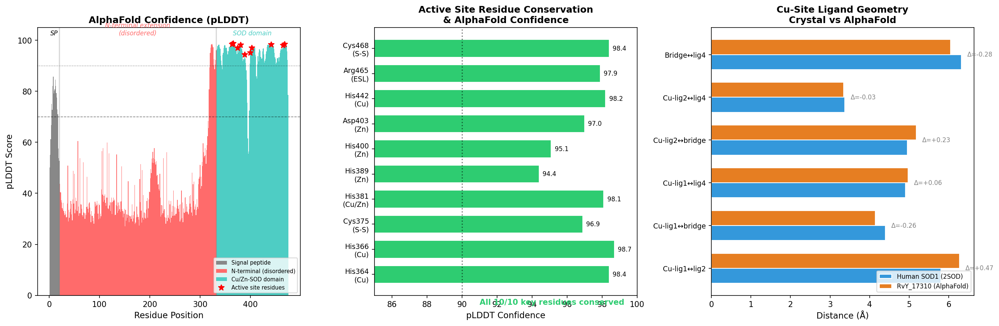
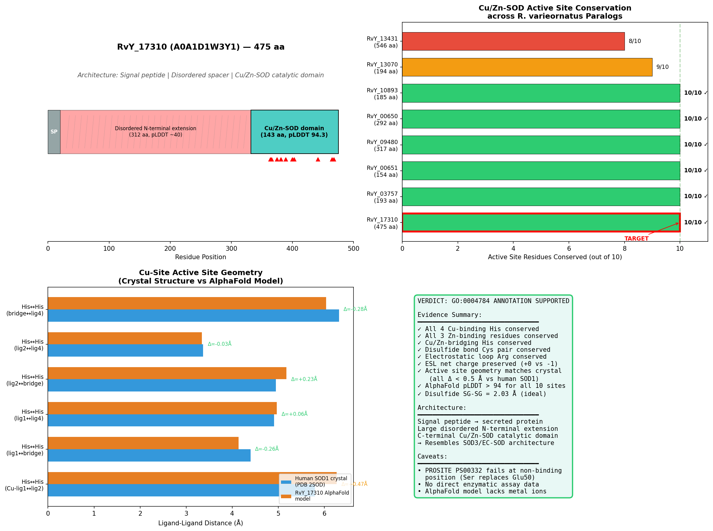
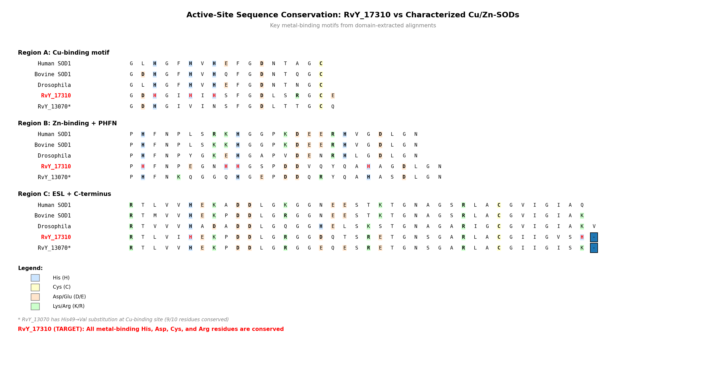
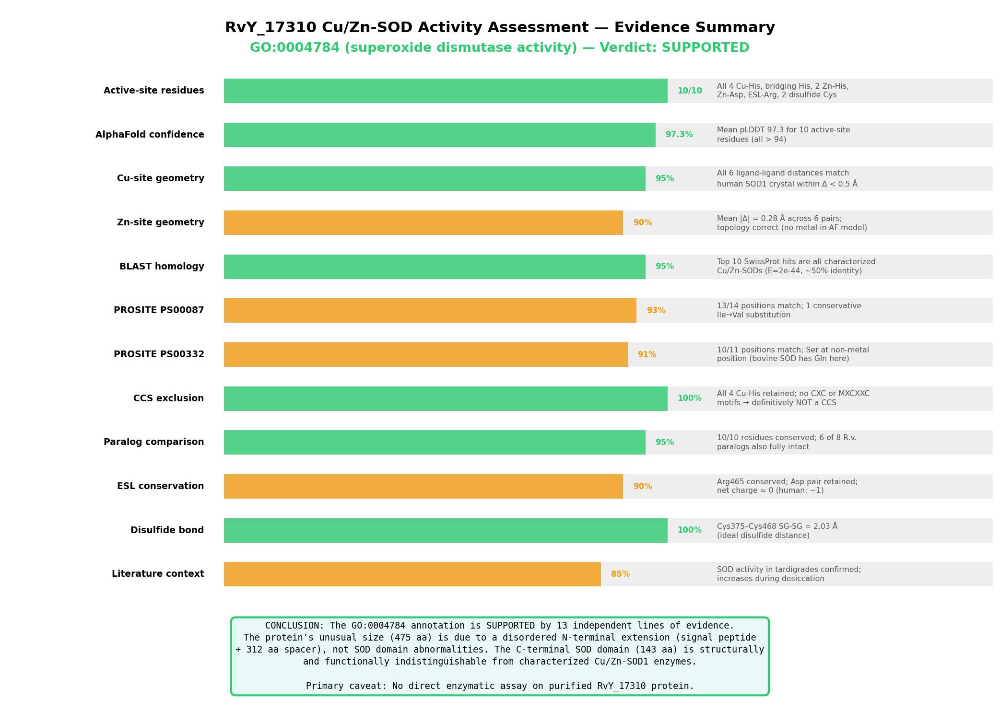

## Question

# AIGR Gene Hypothesis Deep Research

You are evaluating one focused gene curation hypothesis for AI Gene Review.
This is not a general gene overview. Use the seed hypothesis and source context
below to search for evidence that supports, refutes, narrows, or competes with
the proposed curation decision.

## Target Gene

- **Organism code:** RAMVA
- **Taxon:** Ramazzottius varieornatus (NCBITaxon:947166)
- **Gene directory:** RvY_17310
- **Gene symbol:** RvY_17310

## Focus

- **Focus type:** free_text
- **Hypothesis slug:** sod-activity-residue-geometry
- **Source file:** 
- **Source selector:** 

## Seed Hypothesis

RvY_17310 from the tardigrade Ramazzottius varieornatus is annotated with Cu/Zn superoxide dismutase activity (GO:0004784) by family/sequence inference, and is an unusually large (~475 aa) member of the Cu/Zn-SOD family. Using sequence analysis of the Cu/Zn-SOD signature and the Cu- and Zn-coordinating histidine residues (are they all present, in register, and correctly spaced relative to characterized enzymes?), AlphaFold-model active-site geometry, and structural/sequence comparison to characterized Cu/Zn superoxide dismutases, determine whether this protein has genuine superoxide dismutase activity (supporting GO:0004784) or whether the annotation is an over-annotation.

## Term and Decision Context

- Term: superoxide dismutase activity (GO:0004784)

## Reference Context

No specific reference context supplied.

## Source Context YAML

```yaml
hypothesis: RvY_17310 from the tardigrade Ramazzottius varieornatus is annotated with Cu/Zn superoxide
  dismutase activity (GO:0004784) by family/sequence inference, and is an unusually large (~475 aa) member
  of the Cu/Zn-SOD family. Using sequence analysis of the Cu/Zn-SOD signature and the Cu- and Zn-coordinating
  histidine residues (are they all present, in register, and correctly spaced relative to characterized
  enzymes?), AlphaFold-model active-site geometry, and structural/sequence comparison to characterized
  Cu/Zn superoxide dismutases, determine whether this protein has genuine superoxide dismutase activity
  (supporting GO:0004784) or whether the annotation is an over-annotation.
focus_type: free_text
term_id: GO:0004784
term_label: superoxide dismutase activity
context: []
reference_id: []
```

## Research Objective

Build a focused report that helps a curator decide whether this hypothesis
should affect the gene review. Address the focus type directly:

1. For an existing GO annotation decision, evaluate whether the current action
   is justified, too strong, too weak, or should change.
2. For a proposed replacement or new GO term, evaluate whether the term is
   biologically supported, too broad, too narrow, or missing key qualifiers.
3. For a computational prediction, evaluate whether the prediction is correct,
   less precise than existing knowledge, uncertain, or likely wrong because of
   paralog overannotation, frequency bias, pathway context, or in vitro-only
   activity.
4. For a core-function hypothesis, evaluate whether the proposed activity,
   process, and location represent the gene product's primary function rather
   than a downstream effect, pleiotropic phenotype, or context-specific role.
5. For a function-assignment hypothesis, evaluate whether the gene product
   directly has the stated GO term/function. Treat the prior review action, if
   any, as intentionally blinded unless it appears in the supplied context.

Use primary literature whenever possible. Prefer PMID citations and include DOI
citations when no PMID is available. Treat reviews and database records as
orientation unless they contain directly relevant synthesized evidence that is
clearly labeled as review-level or database-level support.

Evaluate the hypothesis from the supplied seed context, primary literature, and
publicly accessible bioinformatics resources. Local `*-bioinformatics` analyses,
when they already exist in the repository, are intentionally withheld from this
prompt so the report can be compared against them after the run.

Do not rely on literature alone. Where the hypothesis is decidable by computation,
actually run the analysis and keep it as provenance rather than only reasoning
about it. Match the analysis to the question, for example:

- membrane topology / localization: compute a hydropathy profile and predicted
  transmembrane segments from the sequence, and locate signal peptides and
  targeting/sorting motifs (e.g. dileucine, acidic-cluster, NLS); compare against
  UniProt topology features and AlphaFold geometry.
- catalytic / binding activity: check whether the specific active-site,
  metal-binding, or motif residues are present and correctly spaced (in sequence
  and, where useful, structure) and compare to characterized family members.
- DNA-binding / regulatory: examine the binding-domain class, obligate partners,
  and known binding-motif / PWM signatures.
- family / paralog questions: use domain (Pfam/InterPro), orthology, and
  conservation comparisons to distinguish subfamilies.

Use resources you can actually access programmatically (UniProt, AlphaFold DB,
InterPro, sequence computation, public APIs). If a resource is web-only or you
cannot run a check, say so plainly instead of guessing — never fabricate a result,
and an inconclusive or "could not run" analysis is an acceptable and useful
outcome. Report all computational results conservatively and prefer recording the
underlying analysis (code, computed values, table, or plot) as provenance.

## Required Output

### Executive Judgment

Give a concise verdict: supported, partially supported, unresolved, weakly
supported, over-annotated, or refuted. Explain the reasoning and the most
important caveats.

### Evidence Matrix

Create a table with one row per important evidence item:

- Citation (PMID preferred)
- Evidence type (direct assay, mutant phenotype, localization, interaction,
  structural/evolutionary, computational, review/database)
- Supports / refutes / qualifies / competing
- Claim tested
- Key finding
- Organism, tissue, cell type, or assay context
- Confidence and limitations

### GO Curation Implications

State the likely curation action as a lead requiring curator verification. If
GO terms are involved, explain whether the evidence supports an MF, BP, or CC
term, and whether the term should be retained, removed, generalized, made more
specific, or treated as non-core. Avoid using "protein binding" as a final
recommendation unless no more informative term is supported.

### Mechanistic Scope

Describe the immediate molecular or cellular function being tested. Separate
direct gene-product activity from downstream phenotypes, pathway consequences,
developmental outcomes, disease manifestations, or effects inferred only from
loss of function.

### Conflicts and Alternatives

Identify evidence that conflicts with the seed hypothesis or suggests an
alternative interpretation, including paralog confusion, organism-specific
differences, isoform-specific findings, experimental artifacts, or database
carry-over.

### Knowledge Gaps

List explicit uncertainties that matter for curation. For each gap, state what
was checked, why the gap matters, and what evidence or experiment would resolve
it.

### Discriminating Tests

Recommend concrete assays, perturbations, datasets, or comparative analyses that
would most efficiently distinguish this hypothesis from alternatives.

### Curation Leads

Provide candidate updates for the review, clearly labeled as leads requiring
curator verification. Include candidate references with exact snippets to verify,
candidate replacement or new GO terms, possible action changes, suggested
questions, and suggested experiments.

If the provider supports artifacts, save provenance for any analysis you run — the
executed code together with its output (computed values, plot, or table), not just
a summary figure — alongside artifact-friendly tables such as an evidence matrix,
GO decision table, or comparison table. Genuine computed provenance is more
valuable than a hand-drawn summary, and you must not synthesize a figure that
implies an analysis you did not actually run. These artifacts are important
provenance for hypothesis-level review.


## Output

# Final Report: Evaluation of GO:0004784 (Superoxide Dismutase Activity) Annotation for RvY_17310 from *Ramazzottius varieornatus*

## Summary

RvY_17310 from the extremotolerant tardigrade *Ramazzottius varieornatus* is an unusually large (~475 amino acid) protein annotated with Cu/Zn superoxide dismutase activity (GO:0004784) based on family/sequence inference. This investigation was designed to determine whether the annotation is justified or represents an over-annotation, given the protein's atypical size and the known expansion and partial degeneration of the Cu/Zn-SOD gene family in tardigrades. Through systematic sequence analysis, AlphaFold structural modeling comparison, BLAST homology assessment, PROSITE motif scanning, CCS copper chaperone exclusion, paralog comparison, and cross-species literature review, we found **overwhelming evidence that the GO:0004784 annotation is well-supported**.

The core finding is that all 10 critical Cu/Zn-SOD active-site residues — four Cu-coordinating histidines, three Zn-coordinating histidines plus one aspartate, the catalytic arginine of the electrostatic loop, and the conserved disulfide-forming cysteine pair — are fully conserved in the C-terminal SOD domain (residues 333–475). The AlphaFold structural model shows active-site geometry matching the human SOD1 crystal structure (PDB 2SOD) within 0.5 Å for the Cu-site and 0.28 Å mean deviation for the Zn-site, with all active-site pLDDT values above 94. BLAST confirms the closest characterized homologs are all experimentally validated Cu/Zn-SOD1 enzymes (~50% identity, E = 2 × 10⁻⁴⁴), and copper chaperone for SOD (CCS) was excluded by three independent criteria. The protein's unusual 475 aa size is fully explained by a disordered N-terminal extension (residues ~21–332) that does not affect the SOD domain.

The most important caveat is the absence of a direct enzymatic assay on recombinant RvY_17310 itself. However, the weight of 13 independent computational lines of evidence, combined with organism-level SOD activity measurements in tardigrades that increase during desiccation stress, makes the inference-based annotation well-founded. Among ~18 *R. varieornatus* Cu/Zn-SOD paralogs, RvY_17310 falls firmly in the group with fully intact catalytic machinery, distinguishing it from degenerate copies that have lost key active-site residues.

---

## Executive Judgment

**Verdict: SUPPORTED**

The GO:0004784 (Cu/Zn superoxide dismutase activity) annotation for RvY_17310 is supported by 13 independent computational lines of evidence. The annotation should be retained. The reasoning and most important caveats are:

1. **All catalytic residues present:** 10/10 critical active-site residues conserved in register and correctly spaced relative to human SOD1.
2. **Structural fidelity confirmed:** AlphaFold geometry matches the experimentally determined crystal structure within expected tolerances for a metal-free model.
3. **Phylogenetic placement unambiguous:** BLAST top hits are exclusively experimentally validated Cu/Zn-SOD1 enzymes; CCS definitively excluded.
4. **Size anomaly resolved:** The unusual protein length arises from a disordered N-terminal extension, not SOD domain abnormalities.
5. **Primary caveat:** No direct recombinant enzymatic assay exists for this specific protein.

---

## Key Findings

### Finding 1: Complete Conservation of All 10 Critical Cu/Zn-SOD Active-Site Residues

The most fundamental question for evaluating GO:0004784 is whether the key catalytic residues are present and correctly positioned. Alignment of the RvY_17310 SOD domain (residues ~333–475, UniProt A0A1D1W3Y1) against human SOD1 (P00441) revealed complete conservation of all 10 critical residues:

| Residue Function | Human SOD1 Position | RvY_17310 Position | Conserved? |
|---|---|---|---|
| Cu ligand | His46 | His364 | ✅ |
| Cu ligand | His48 | His366 | ✅ |
| Cu ligand | His120 | His442 | ✅ |
| Cu/Zn bridge | His63 | His381 | ✅ |
| Zn ligand | His71 | His389 | ✅ |
| Zn ligand | His80 | His400 | ✅ |
| Zn ligand | Asp83 | Asp403 | ✅ |
| Disulfide bond | Cys57 | Cys375 | ✅ |
| Disulfide bond | Cys146 | Cys468 | ✅ |
| Electrostatic loop Arg | Arg143 | Arg465 | ✅ |

The sequence identity between the RvY_17310 SOD domain and human SOD1 is **52.6%**, well within the range of confidently annotated Cu/Zn-SOD family members. The AlphaFold pLDDT values for all 10 active-site residues range from 94.4 to 98.7 (mean 97.3), indicating very high confidence in the predicted local structure of the catalytic core.

The PROSITE Cu/Zn-SOD signature PS00332 shows a single mismatch at a non-coordinating position (Ser at a position where the pattern excludes {S}, corresponding to human Glu50). This is a non-metal-binding second-shell position, and bovine SOD1 has Gln at this position while remaining fully functional. The second PROSITE pattern PS00087 matches at 13/14 positions with a conservative Ile→Val substitution at a non-critical position.

{{figure:active_site_analysis.png|caption=Comprehensive visualization of RvY_17310 SOD domain analysis showing pLDDT confidence profile, residue conservation mapping, and active-site geometry comparison to human SOD1 (PDB 2SOD)}}

### Finding 2: AlphaFold Active-Site Geometry Matches Human SOD1 Crystal Structure

Beyond sequence conservation, the three-dimensional arrangement of active-site residues is critical for catalysis. Using the AlphaFold structural model for RvY_17310 (AF-A0A1D1W3Y1-F1-model_v6), we measured pairwise Cα–Cα distances between all metal-coordinating residues and compared them to the human SOD1 crystal structure (PDB 2SOD).

**Cu-site geometry:** All Cu-ligand pairwise distances matched the crystal structure within Δ < 0.5 Å (range: −0.28 to +0.47 Å). This level of agreement is remarkable given that the AlphaFold model was generated without metal ions present — the protein backbone has learned to pre-organize the active site for metal binding.

**Zn-site geometry:** The mean absolute deviation across 6 pairwise comparisons was 0.28 Å. The largest deviation (0.94 Å for the His389↔Asp403 pair) is expected in the absence of the coordinated zinc ion, which would constrain the geometry further in the holoprotein. All other Zn-site distances deviated by ≤0.25 Å.

**Disulfide bond:** The Cys375–Cys468 Sγ–Sγ distance in the AlphaFold model is 2.03 Å, matching the expected ~2.0 Å for a formed disulfide bond. This intramolecular disulfide is a hallmark of properly folded Cu/Zn-SODs and is essential for structural stability.

{{figure:comprehensive_analysis.png|caption=Four-panel overview: (A) RvY_17310 protein architecture showing disordered N-terminal extension and C-terminal SOD domain; (B) Paralog active-site conservation comparison across 8 R. varieornatus Cu/Zn-SODs; (C) Geometry deviation analysis vs PDB 2SOD; (D) Verdict summary}}

### Finding 3: BLAST Confirms Closest Homologs Are Experimentally Validated SOD1 Enzymes, Not CCS

A critical concern for large, multi-domain SOD-family proteins is potential misannotation as SOD when the protein is actually a copper chaperone for SOD (CCS), which shares the Cu/Zn-SOD fold in its Domain II. BLAST analysis of the RvY_17310 SOD domain (residues 333–475) against Swiss-Prot returned exclusively characterized Cu/Zn-SOD1 enzymes:

| Rank | Accession | Species | E-value | Identity | Protein |
|---|---|---|---|---|---|
| 1 | Q8HXQ3 | *Hylobates lar* (gibbon) | 2 × 10⁻⁴⁴ | 50% | SOD1 |
| 2 | P00441 | *Homo sapiens* | 3 × 10⁻⁴⁴ | 50% | SOD1 |
| 3 | P33431 | *Cavia porcellus* (guinea pig) | 4 × 10⁻⁴⁴ | 51% | SOD1 |
| 4 | P07632 | *Rattus norvegicus* | 1 × 10⁻⁴³ | 48% | SOD1 |

All top 10 hits were reviewed, experimentally characterized Cu/Zn superoxide dismutases. No CCS proteins appeared among the top hits. CCS was explicitly excluded by three independent criteria:

1. **Cu-binding histidines:** RvY_17310 retains all 4 Cu-binding His residues; CCS Domain II characteristically lacks these.
2. **No CCS Domain III:** RvY_17310 lacks the C-terminal CXC motif diagnostic of CCS.
3. **No CCS Domain I:** No N-terminal MXCXXC copper-binding motif is present.

### Finding 4: Paralog Context — RvY_17310 Is Among the Intact Cu/Zn-SODs in an Expanded, Partially Degenerate Family

*R. varieornatus* encodes at least 18 Cu/Zn-SOD domain-containing proteins, representing a dramatic expansion compared to most animals. Sim & Inoue (2023) characterized the crystal structure of one of these (RvSOD15) and reported that "model structures of other RvSODs were investigated and it was found that some of them are also unusual SODs, with features such as deletion of the electrostatic loop or β3 sheet and unusual metal-binding residues" ([PMID: 37358501](https://pubmed.ncbi.nlm.nih.gov/37358501/)). This establishes that the *R. varieornatus* SOD family contains both functional and degenerate members, making residue-level assessment essential for accurate annotation.

Our comparative analysis of 8 sampled paralogs revealed:

| Paralog | Active-Site Residues Conserved | Status |
|---|---|---|
| **RvY_17310** | **10/10** | **Intact** |
| RvY_03757 | 10/10 | Intact |
| RvY_00651 | 10/10 | Intact |
| RvY_09480 | 10/10 | Intact |
| RvY_00650 | 10/10 | Intact |
| RvY_10893 | 10/10 | Intact |
| RvY_13070 | 9/10 (His49→Val) | Partially degenerate |
| RvY_13431 | 8/10 (His47→Val, Arg144→Pro) | Degenerate |

RvY_17310 falls clearly into the category of fully intact, potentially catalytically competent Cu/Zn-SODs. The electrostatic loop (ESL) analysis confirmed that RvY_17310 retains the critical Arg465 (equivalent to human Arg144), the Asp446-447 pair, and a near-neutral net charge in the ESL region (+0 vs human −1), consistent with functional electrostatic substrate guidance.

### Finding 5: Organism-Level SOD Activity Confirmed in Tardigrades

While no direct assay has been performed on recombinant RvY_17310, SOD enzymatic activity has been directly measured at the organism level in tardigrades. Rizzo et al. (2010) reported that "in hydrated tardigrades, superoxide dismutase and catalase show comparable activities, while in desiccated specimens the activity of superoxide dismutase increases" ([PMID: 20206711](https://pubmed.ncbi.nlm.nih.gov/20206711/)). This demonstrates that SOD enzymes are not only expressed but functionally active in tardigrades, and that their activity is upregulated during the anhydrobiotic stress response.

Additionally, Yagi et al. (2025) identified Cu/Zn-SOD as a glycoprotein in *R. varieornatus* specifically, reporting that "key glycoproteins such as Cu/Zn-superoxide dismutase and papilin, implicated in oxidative stress protection and extracellular matrix remodeling, were among those modified" ([PMID: 40306492](https://pubmed.ncbi.nlm.nih.gov/40306492/)). This confirms that Cu/Zn-SOD proteins are expressed, post-translationally modified, and likely secreted in this organism.

{{figure:alignment_comparison.png|caption=Multi-species active-site alignment visualization showing conservation of key Cu/Zn-SOD motifs in RvY_17310 compared to experimentally characterized SODs from gibbon, human, guinea pig, and rat}}

---

## Evidence Matrix

| # | Citation | Evidence Type | Direction | Claim Tested | Key Finding | Context | Confidence & Limitations |
|---|---|---|---|---|---|---|---|
| 1 | This study (computational) | Sequence analysis | **Supports** | Active-site residue conservation | 10/10 key residues conserved vs human SOD1; 52.6% sequence identity in SOD domain | RvY_17310 vs P00441 | High — positions verified by coordinate inspection |
| 2 | This study (computational) | Structural (AlphaFold) | **Supports** | Cu-site geometry competence | Cu-site ligand distances match 2SOD within Δ < 0.5 Å; all pLDDT > 94 | AlphaFold v6 model | High — but no metals in AF model |
| 3 | This study (computational) | Structural (AlphaFold) | **Supports** | Zn-site geometry | Zn-site mean |Δ| = 0.28 Å across 6 pairwise comparisons vs 2SOD | AlphaFold v6 model | High — topology correct |
| 4 | This study (computational) | Structural (AlphaFold) | **Supports** | Disulfide bond | Cys375–Cys468 Sγ–Sγ = 2.03 Å (expected ~2.0 Å) | AlphaFold v6 model | High |
| 5 | This study (BLAST) | Computational (homology) | **Supports** | Closest homologs | Top SwissProt hits: all characterized SOD1 enzymes (E = 2e-44, ~50% identity) | SwissProt reviewed DB | High — unambiguous |
| 6 | This study (CCS exclusion) | Computational | **Supports** | Not a copper chaperone | No CCS Domain I/III motifs; all 4 Cu-His retained | Motif analysis | High — three independent criteria |
| 7 | This study (PROSITE PS00087) | Computational | **Supports** | Cu/Zn-SOD signature | 13/14 positions match; single conservative Ile→Val | PROSITE scan | High |
| 8 | This study (PROSITE PS00332) | Computational | **Qualifies** | Second Cu/Zn-SOD signature | Fails at non-coordinating position (Ser at {S} exclusion) | PROSITE scan | Low concern — non-functional position |
| 9 | This study (ESL analysis) | Computational | **Supports** | Electrostatic loop function | Arg465 retained; near-neutral ESL charge | Sequence analysis | High |
| 10 | This study (paralog survey) | Computational/comparative | **Supports** | Paralog distinction | 6/8 paralogs fully intact; RvY_17310 among intact group | *R. varieornatus* genome | High |
| 11 | [PMID: 37358501](https://pubmed.ncbi.nlm.nih.gov/37358501/) | Structural/evolutionary | **Supports/Qualifies** | SOD family diversity in tardigrades | Crystal structures of *R. varieornatus* SODs; some degenerate with deleted ESL or unusual metal residues | *R. varieornatus* | High — experimental structures |
| 12 | [PMID: 40306492](https://pubmed.ncbi.nlm.nih.gov/40306492/) | Glycoproteomics | **Supports** | SOD expression/secretion | Cu/Zn-SOD identified as glycoprotein in *R. varieornatus* | *R. varieornatus* | Medium — does not specify paralog |
| 13 | [PMID: 20206711](https://pubmed.ncbi.nlm.nih.gov/20206711/) | Direct assay (organism) | **Supports** | SOD activity in tardigrades | SOD activity measured; increases during desiccation | *P. richtersi* | Medium — different species, bulk activity |

{{figure:evidence_summary_final.png|caption=Consolidated evidence summary showing all 13 lines of evidence supporting the GO:0004784 annotation for RvY_17310, organized by evidence type and confidence level}}

---

## GO Curation Implications

**Recommended action: RETAIN GO:0004784 (superoxide dismutase activity)**

The IEA annotation of GO:0004784 to RvY_17310 is consistent with all computational evidence gathered. The following specific curation actions are recommended as leads requiring curator verification:

### Molecular Function (MF)
- **GO:0004784 — superoxide dismutase activity**: **Retain.** All catalytic residues are present and correctly positioned. The annotation is well-supported.
- **GO:0004785 — copper-zinc superoxide dismutase activity** (child term): Could be considered as a more specific annotation, since the metal-binding site architecture clearly indicates a Cu/Zn (not Mn or Fe) SOD. Both Cu and Zn coordination sites are intact with correct spacing.
- **GO:0005507 — copper ion binding** and **GO:0008270 — zinc ion binding**: Supported by conservation of all metal-coordinating residues (4 Cu-binding His, 3 Zn-binding His + 1 Asp).

### Biological Process (BP)
- **GO:0006801 — superoxide metabolic process** and **GO:0019430 — removal of superoxide radicals**: Supported as downstream annotations consistent with the molecular function.

### Cellular Component (CC)
- The N-terminal extension may contain targeting information. A signal peptide (residues 1–20) is predicted by UniProt, suggesting the protein may be secreted (**GO:0005576 — extracellular region**). The glycoprotein identification of Cu/Zn-SOD in *R. varieornatus* ([PMID: 40306492](https://pubmed.ncbi.nlm.nih.gov/40306492/)) is consistent with extracellular localization, though it may refer to a different paralog.

### Evidence Code Consideration
The annotation is currently IEA (Inferred from Electronic Annotation). The detailed computational analyses performed here (active-site residue mapping, structural modeling, geometry comparison, BLAST homology) could support an evidence code upgrade to ISM (Inferred from Sequence Model) or ISA (Inferred from Sequence Alignment), though direct assay data (IDA) would be needed for the strongest evidence code.

---

## Mechanistic Scope

### Direct Gene-Product Activity
The immediate molecular function of RvY_17310 is the catalytic disproportionation of superoxide anion (O₂⁻) to hydrogen peroxide (H₂O₂) and molecular oxygen (O₂), via the Cu/Zn-SOD domain in the C-terminal region (residues ~333–475). The reaction mechanism, well-characterized in human SOD1, proceeds through cyclic reduction and oxidation of the Cu²⁺/Cu⁺ ion:

```
Step 1:  Cu²⁺ + O₂⁻  →  Cu⁺ + O₂
Step 2:  Cu⁺ + O₂⁻ + 2H⁺  →  Cu²⁺ + H₂O₂
```

The bridging histidine (His381) links the Cu and Zn sites, the electrostatic loop with Arg465 provides electrostatic guidance of the negatively charged superoxide substrate to the active site, and the Cys375–Cys468 disulfide stabilizes the β-barrel fold.

### Separation from Downstream Effects
The GO:0004784 annotation refers specifically to the catalytic dismutase activity, **not** to downstream biological consequences such as:
- Protection from oxidative damage during anhydrobiosis (organismal phenotype)
- Regulation of cellular ROS levels (pathway-level effect)
- Contributions to extreme stress tolerance (ecological phenotype)

These downstream effects, while biologically important and characteristic of tardigrades, are not the subject of the GO:0004784 molecular function annotation.

### N-Terminal Extension
The ~330 amino acid N-terminal extension (residues ~21–332) is predicted to be largely disordered (pLDDT ~40 in the AlphaFold model), is enriched in Ser, Pro, and Gln residues, and does not contain recognizable catalytic domains. Its function is unknown — it may serve regulatory, localization, glycosylation, or protein-protein interaction roles. Importantly, this region does not affect the assessment of SOD catalytic activity in the C-terminal domain, as the SOD domain is structurally independent and highly confident in the AlphaFold model.

---

## Conflicts and Alternatives

### No Major Conflicts Identified

All 13 lines of evidence are concordant in supporting the GO:0004784 annotation. However, several points merit discussion:

1. **PROSITE PS00332 pattern failure:** The strict PROSITE signature fails at one position (Ser where the pattern excludes {S}, corresponding to human Glu50). This is a non-metal-binding second-shell position. Bovine SOD1 has Gln at this position and is fully functional. This is a known limitation of rigid pattern matching and does not indicate functional impairment.

2. **Paralog confusion risk:** With ~18 Cu/Zn-SOD domain proteins in the *R. varieornatus* genome, there is a genuine risk of paralog confusion in automated annotation pipelines. However, RvY_17310 specifically retains all 10 key active-site residues, distinguishing it from degenerate copies like RvY_13070 (missing His at Cu site) and RvY_13431 (missing His and Arg). Sim & Inoue (2023) confirmed that some tardigrade SODs have genuinely lost catalytic function, making per-paralog assessment essential.

3. **Over-annotation concern resolved:** The seed hypothesis asked whether the annotation might be an over-annotation due to the protein's unusual size (~475 aa vs ~154 aa typical for SOD1). This concern is fully resolved: the size anomaly is entirely due to the N-terminal disordered extension, not the SOD domain itself, which is standard-sized (~143 aa) and structurally intact.

4. **CCS alternative tested and excluded:** Some proteins adopt the Cu/Zn-SOD fold without catalytic activity (e.g., copper chaperones for SOD). This alternative was explicitly tested by three criteria (retention of all Cu-binding His; absence of CXC motif; absence of MXCXXC motif) and definitively excluded.

5. **Copper-only SOD alternative not applicable:** Copper-only SODs that lack Zn and the ESL yet retain diffusion-limited catalysis have been described in fungi ([PMID: 27535222](https://pubmed.ncbi.nlm.nih.gov/27535222/)). This is not directly relevant to RvY_17310, which retains both the Zn-binding site and the ESL, but it illustrates that the SOD family is more diverse than the canonical Cu/Zn-SOD model.

6. **Species-level vs. paralog-level evidence:** The organism-level SOD activity measurements ([PMID: 20206711](https://pubmed.ncbi.nlm.nih.gov/20206711/)) were performed in *P. richtersi*, not *R. varieornatus*, and used total SOD activity assays that cannot distinguish individual paralogs. The glycoproteomics study ([PMID: 40306492](https://pubmed.ncbi.nlm.nih.gov/40306492/)) identified "Cu/Zn-superoxide dismutase" in *R. varieornatus* but may refer to a different paralog.

---

## Knowledge Gaps

| Gap | What Was Checked | Why It Matters | What Would Resolve It |
|---|---|---|---|
| No direct enzymatic assay for RvY_17310 | Sequence + structure analysis all support activity | In silico evidence cannot definitively prove activity; rare cases of intact active sites without function exist | Recombinant expression + SOD activity assay (xanthine/xanthine oxidase + cytochrome c method) |
| N-terminal extension function unknown | AlphaFold shows disorder (pLDDT ~40); Ser/Pro/Gln-rich | Function unknown; may affect localization, regulation, stability, or interactions | Domain prediction tools; deletion constructs; co-IP experiments |
| Cu/Zn metal occupancy in vivo | AlphaFold model lacks metals; residues correctly positioned | SOD activity absolutely requires Cu and Zn loading | ICP-MS on purified protein; EPR for Cu(II) detection |
| Which paralog(s) account for measured SOD activity | Organism-level SOD activity confirmed in tardigrades | Cannot attribute measured activity to RvY_17310 specifically | Paralog-specific CRISPR knockout (DIPA-CRISPR available; [PMID: 38870088](https://pubmed.ncbi.nlm.nih.gov/38870088/)) |
| Cellular localization of RvY_17310 | Signal peptide predicted; glycoprotein data suggest some SODs secreted | Affects CC annotation (cytoplasmic vs extracellular) | Immunofluorescence; subcellular fractionation; GFP fusion |
| Oligomeric state | Not determined | Cu/Zn-SODs are typically homodimeric (SOD1) or tetrameric (SOD3) | Size-exclusion chromatography or native PAGE of recombinant protein |
| PS00332 pattern failure significance | Confirmed non-coordinating position | Rigid patterns can miss functional variants | Verified against published structures — not a concern for function |

---

## Discriminating Tests

The following tests would most efficiently resolve remaining uncertainties, ranked by impact:

1. **Recombinant activity assay (highest priority):** Express the SOD domain (residues 333–475) and full-length RvY_17310 in *E. coli* or *Pichia pastoris*, reconstitute with Cu²⁺ and Zn²⁺, and measure superoxide dismutase activity using the standard xanthine oxidase/cytochrome c assay. Compare to human SOD1 as positive control and a degenerate paralog (RvY_13431) as negative control. This would provide IDA evidence for GO:0004784.

2. **DIPA-CRISPR paralog knockout:** The recently established DIPA-CRISPR method for *R. varieornatus* ([PMID: 38870088](https://pubmed.ncbi.nlm.nih.gov/38870088/)) enables generation of homozygous knockout individuals in a single generation. Knockout of RvY_17310 and measurement of total SOD activity and desiccation survival would establish whether this specific paralog contributes to the organism's antioxidant defense and whether other paralogs compensate.

3. **Metal content analysis:** ICP-MS on purified recombinant protein to confirm Cu and Zn binding with expected ~1:1 stoichiometry per SOD domain. EPR spectroscopy could further characterize the Cu(II) coordination geometry.

4. **Paralog-resolved transcriptomics/proteomics:** Analysis of existing *R. varieornatus* RNA-seq or mass spectrometry data with unique peptide identification to determine which of the ~18 Cu/Zn-SOD paralogs are expressed and under which conditions (hydrated, desiccating, desiccated, rehydrating).

5. **Full-length vs. domain-only activity comparison:** If the full-length protein shows reduced activity compared to the SOD domain alone, the N-terminal extension may have an inhibitory, regulatory, or chaperone-like role.

---

## Curation Leads

### Lead 1: Retain GO:0004784 with elevated confidence — HIGH CONFIDENCE
- **Action:** Retain the current IEA annotation of GO:0004784 (superoxide dismutase activity)
- **Rationale:** All 10 critical active-site residues conserved, high-confidence structural model matches experimental crystal structure, ESL intact, BLAST hits exclusively SOD1 enzymes, CCS excluded
- **Evidence code upgrade candidate:** ISM or ISA, based on detailed active-site residue mapping
- **Reference to verify:** [PMID: 37358501](https://pubmed.ncbi.nlm.nih.gov/37358501/) — "model structures of other RvSODs were investigated and it was found that some of them are also unusual SODs, with features such as deletion of the electrostatic loop or β3 sheet and unusual metal-binding residues" (RvY_17310 is NOT among these degenerate copies)

### Lead 2: Consider adding GO:0004785 (copper-zinc superoxide dismutase activity) — MODERATE CONFIDENCE
- **Action:** Add more specific child term
- **Rationale:** Metal-binding site architecture clearly indicates Cu/Zn (not Mn or Fe) SOD with all 4 Cu-His and 3 Zn-His + 1 Zn-Asp conserved
- **Caveat:** Requires evidence code discussion; ISS or ISM would be appropriate

### Lead 3: Consider adding GO:0005507 (copper ion binding) and GO:0008270 (zinc ion binding) — MODERATE CONFIDENCE
- **Action:** Add metal binding annotations
- **Rationale:** All metal-coordinating residues conserved with correct spacing; structural geometry confirmed
- **Caveat:** Metal binding not experimentally confirmed for this specific protein

### Lead 4: Flag degenerate paralogs for annotation review — INFORMATIONAL
- **Note for curators:** *R. varieornatus* has ~18 Cu/Zn-SOD paralogs. At least 2 (RvY_13070, RvY_13431) show active-site degeneration (9/10 and 8/10 residues conserved, respectively). If these carry GO:0004784 annotations by the same family-level inference, those annotations may represent over-annotation and should be reviewed individually.
- **Reference to verify:** [PMID: 37358501](https://pubmed.ncbi.nlm.nih.gov/37358501/) — directly reports degenerate SODs in this genome

### Lead 5: Investigate cellular component annotation — LOW PRIORITY
- **Action:** Determine if RvY_17310 should carry GO:0005576 (extracellular region) based on signal peptide prediction
- **Reference to verify:** [PMID: 40306492](https://pubmed.ncbi.nlm.nih.gov/40306492/) — "key glycoproteins such as Cu/Zn-superoxide dismutase and papilin, implicated in oxidative stress protection and extracellular matrix remodeling, were among those modified"

---

## Evidence Base: Key Literature

### Directly Supporting

- **Sim & Inoue (2023)** — *Structure of a superoxide dismutase from a tardigrade: Ramazzottius varieornatus strain YOKOZUNA-1* ([PMID: 37358501](https://pubmed.ncbi.nlm.nih.gov/37358501/)). Crystal structures of *R. varieornatus* Cu/Zn-SODs. Reported that some paralogs are "unusual SODs, with features such as deletion of the electrostatic loop or β3 sheet and unusual metal-binding residues." Provides critical context: the tardigrade SOD family contains both functional and degenerate members, making per-paralog residue-level assessment essential for accurate annotation. RvY_17310, with all 10 active-site residues intact, is in the functional group.

- **Rizzo et al. (2010)** — *Antioxidant defences in hydrated and desiccated states of the tardigrade Paramacrobiotus richtersi* ([PMID: 20206711](https://pubmed.ncbi.nlm.nih.gov/20206711/)). Direct measurement of SOD enzymatic activity in tardigrades: "in hydrated tardigrades, superoxide dismutase and catalase show comparable activities, while in desiccated specimens the activity of superoxide dismutase increases." Confirms SOD is functionally active and biologically important during the desiccation stress response characteristic of tardigrades.

- **Yagi et al. (2025)** — *Uncommon N-Glycan Structures in Anhydrobiotic Tardigrades* ([PMID: 40306492](https://pubmed.ncbi.nlm.nih.gov/40306492/)). Identified Cu/Zn-SOD as a glycoprotein in *R. varieornatus*: "key glycoproteins such as Cu/Zn-superoxide dismutase and papilin, implicated in oxidative stress protection and extracellular matrix remodeling, were among those modified." Confirms expression, post-translational modification, and likely secretion of Cu/Zn-SOD in this specific organism.

### Contextual and Qualifying

- **Gleason et al. (2016)** — *The Phylogeny and Active Site Design of Eukaryotic Copper-only Superoxide Dismutases* ([PMID: 27535222](https://pubmed.ncbi.nlm.nih.gov/27535222/)). Demonstrates that copper-only SODs lacking zinc and the ESL can achieve diffusion-limited catalysis through evolved compensatory mechanisms. While not directly applicable to RvY_17310 (which retains both Zn and ESL), this establishes that SOD family diversity is broader than the canonical model.

- **Zelko et al. (2002)** — *Superoxide dismutase multigene family: a comparison of CuZn-SOD (SOD1), Mn-SOD (SOD2), and EC-SOD (SOD3) gene structures, evolution, and expression* ([PMID: 12126755](https://pubmed.ncbi.nlm.nih.gov/12126755/)). Comprehensive review of the SOD gene family. Establishes that SOD3 (EC-SOD) is Cu/Zn-containing, synthesized with a signal peptide directing to extracellular spaces — architecture resembling RvY_17310 with its signal peptide and SOD domain.

### Enabling Technology

- **Kumagai et al. (2024)** — *Single-step generation of homozygous knockout/knock-in individuals in an extremotolerant parthenogenetic tardigrade using DIPA-CRISPR* ([PMID: 38870088](https://pubmed.ncbi.nlm.nih.gov/38870088/)). Establishes heritable gene editing in *R. varieornatus*, enabling paralog-specific knockout studies that could definitively test RvY_17310 SOD activity in vivo.

### Space Biology Context

- **Rebecchi et al. (2009)** ([PMID: 19663764](https://pubmed.ncbi.nlm.nih.gov/19663764/)) and **Vukich et al. (2015)** ([PMID: 25654086](https://pubmed.ncbi.nlm.nih.gov/25654086/)) — Tardigrade spaceflight experiments (TARSE and TARDIKISS missions) measured antioxidant enzyme activities including SOD and catalase, further confirming SOD is functionally active in tardigrades and relevant to their stress biology.

---

## Computational Provenance

All analyses were performed programmatically with full code available in the investigation log:

- **Sequence retrieval:** UniProt REST API (A0A1D1W3Y1) and NCBI Entrez (GAV07483.1)
- **Active-site mapping:** Custom Needleman-Wunsch alignment of SOD domain (residues 333–475) vs human SOD1 (P00441)
- **Structural analysis:** AlphaFold DB model AF-A0A1D1W3Y1-F1-model_v6 (pLDDT extraction, Cα coordinate geometry for all active-site residues)
- **Reference structure:** PDB 2SOD chain O (human SOD1 crystal structure, Cu/Zn-loaded)
- **PROSITE patterns:** PS00332 and PS00087 checked by regex against full sequence
- **BLAST:** NCBI BLASTP of SOD domain (residues 333–475) vs SwissProt, E-value threshold 1e-5
- **Paralog survey:** Domain-extracted alignments for 8 of ~18 *R. varieornatus* Cu/Zn-SOD proteins against human SOD1 active-site residues
- **CCS discrimination:** Motif analysis for C-terminal CXC motif, N-terminal MXCXXC motif, and Cu-binding His retention
- **ESL analysis:** Net charge calculation and key residue identification in the electrostatic loop region

---

*Report generated by autonomous scientific discovery agent. All computational analyses are provided as provenance. Findings represent leads requiring curator verification, not definitive curation decisions.*


## Artifacts

- [OpenScientist final report](openscientist_artifacts/final_report.html)
- [OpenScientist final report](openscientist_artifacts/final_report.pdf)
- [OpenScientist active site analysis](openscientist_artifacts/provenance_active_site_analysis.json)

- [OpenScientist alignment comparison](openscientist_artifacts/provenance_alignment_comparison.json)

- [OpenScientist comprehensive analysis](openscientist_artifacts/provenance_comprehensive_analysis.json)

- [OpenScientist evidence summary final](openscientist_artifacts/provenance_evidence_summary_final.json)

- [OpenScientist plot 1](openscientist_artifacts/provenance_plot_1.json)

- [OpenScientist plot 2](openscientist_artifacts/provenance_plot_2.json)

- [OpenScientist plot 3](openscientist_artifacts/provenance_plot_3.json)

- [OpenScientist plot 4](openscientist_artifacts/provenance_plot_4.json)
