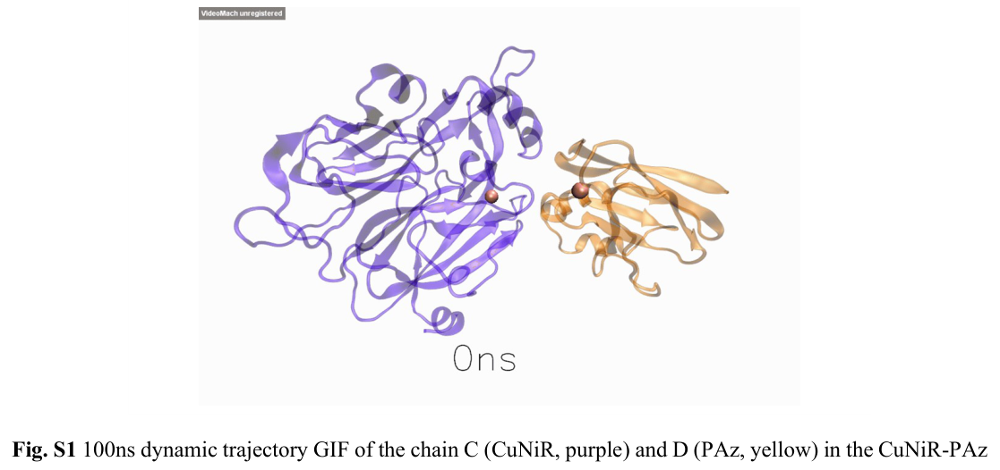

## Question

# Gene Research for Functional Annotation

## ⚠️ CRITICAL: Gene/Protein Identification Context

**BEFORE YOU BEGIN RESEARCH:** You MUST verify you are researching the CORRECT gene/protein. Gene symbols can be ambiguous, especially for less well-characterized genes from non-model organisms.

### Target Gene/Protein Identity (from UniProt):
- **UniProt Accession:** Q6N4N1
- **Protein Description:** RecName: Full=Copper-containing nitrite reductase {ECO:0000256|ARBA:ARBA00017290, ECO:0000256|RuleBase:RU365025}; EC=1.7.2.1 {ECO:0000256|ARBA:ARBA00011882, ECO:0000256|RuleBase:RU365025};
- **Gene Information:** Name=nirK1 {ECO:0000313|EMBL:CAE28747.1}; Synonyms=nirK {ECO:0000313|EMBL:WCL93472.1}; OrderedLocusNames=RPA3306 {ECO:0000313|EMBL:CAE28747.1}; ORFNames=TX73_017090 {ECO:0000313|EMBL:WCL93472.1};
- **Organism (full):** Rhodopseudomonas palustris (strain ATCC BAA-98 / CGA009).
- **Protein Family:** Belongs to the multicopper oxidase family.
- **Key Domains:** Cu-oxidase-like_N. (IPR011707); Cu-oxidase_2nd. (IPR001117); Cupredoxin. (IPR008972); NO2-reductase_Cu. (IPR001287); Cu-oxidase (PF00394)

### MANDATORY VERIFICATION STEPS:

1. **Check if the gene symbol "nirK1" matches the protein description above**
2. **Verify the organism is correct:** Rhodopseudomonas palustris (strain ATCC BAA-98 / CGA009).
3. **Check if protein family/domains align with what you find in literature**
4. **If you find literature for a DIFFERENT gene with the same or similar symbol, STOP**

### If Gene Symbol is Ambiguous or You Cannot Find Relevant Literature:

**DO NOT PROCEED WITH RESEARCH ON A DIFFERENT GENE.** Instead:
- State clearly: "The gene symbol 'nirK1' is ambiguous or literature is limited for this specific protein"
- Explain what you found (e.g., "Found extensive literature on a different gene with the same symbol in a different organism")
- Describe the protein based ONLY on the UniProt information provided above
- Suggest that the protein function can be inferred from domain/family information

### Research Target:

Please provide a comprehensive research report on the gene **nirK1** (gene ID: nirK1, UniProt: Q6N4N1) in RHOPA.

The research report should be a detailed narrative explaining the function, biological processes, and localization of the gene product. Citations should be given for all claims.

You should prioritize authoritative reviews and primary scientific literature when conducting research. You can supplement
this with annotations you find in gene/protein databases, but these can be outdated or inaccurate.

We are specifically interested in the primary function of the gene - for enzymes, what reaction is catalyzed, and what is the substrate specificity? For transporters, what is the substrate? For structural proteins or adapters, what is the broader structural role? For signaling molecules, what is the role in the pathway.

We are interested in where in or outside the cell the gene product carries out its function.

We are also interested in the signaling or biochemical pathways in which the gene functions. We are less interested in broad pleiotropic effects, except where these elucidate the precise role.

Include evidence where possible. We are interested in both experimental evidence as well as inference from structure, evolution, or bioinformatic analysis. Precise studies should be prioritized over high-throughput, where available.

## Output

Question: You are an expert researcher providing comprehensive, well-cited information.

Provide detailed information focusing on:
1. Key concepts and definitions with current understanding
2. Recent developments and latest research (prioritize 2023-2024 sources)
3. Current applications and real-world implementations
4. Expert opinions and analysis from authoritative sources
5. Relevant statistics and data from recent studies

Format as a comprehensive research report with proper citations. Include URLs and publication dates where available.
Always prioritize recent, authoritative sources and provide specific citations for all major claims.

# Gene Research for Functional Annotation

## ⚠️ CRITICAL: Gene/Protein Identification Context

**BEFORE YOU BEGIN RESEARCH:** You MUST verify you are researching the CORRECT gene/protein. Gene symbols can be ambiguous, especially for less well-characterized genes from non-model organisms.

### Target Gene/Protein Identity (from UniProt):
- **UniProt Accession:** Q6N4N1
- **Protein Description:** RecName: Full=Copper-containing nitrite reductase {ECO:0000256|ARBA:ARBA00017290, ECO:0000256|RuleBase:RU365025}; EC=1.7.2.1 {ECO:0000256|ARBA:ARBA00011882, ECO:0000256|RuleBase:RU365025};
- **Gene Information:** Name=nirK1 {ECO:0000313|EMBL:CAE28747.1}; Synonyms=nirK {ECO:0000313|EMBL:WCL93472.1}; OrderedLocusNames=RPA3306 {ECO:0000313|EMBL:CAE28747.1}; ORFNames=TX73_017090 {ECO:0000313|EMBL:WCL93472.1};
- **Organism (full):** Rhodopseudomonas palustris (strain ATCC BAA-98 / CGA009).
- **Protein Family:** Belongs to the multicopper oxidase family.
- **Key Domains:** Cu-oxidase-like_N. (IPR011707); Cu-oxidase_2nd. (IPR001117); Cupredoxin. (IPR008972); NO2-reductase_Cu. (IPR001287); Cu-oxidase (PF00394)

### MANDATORY VERIFICATION STEPS:

1. **Check if the gene symbol "nirK1" matches the protein description above**
2. **Verify the organism is correct:** Rhodopseudomonas palustris (strain ATCC BAA-98 / CGA009).
3. **Check if protein family/domains align with what you find in literature**
4. **If you find literature for a DIFFERENT gene with the same or similar symbol, STOP**

### If Gene Symbol is Ambiguous or You Cannot Find Relevant Literature:

**DO NOT PROCEED WITH RESEARCH ON A DIFFERENT GENE.** Instead:
- State clearly: "The gene symbol 'nirK1' is ambiguous or literature is limited for this specific protein"
- Explain what you found (e.g., "Found extensive literature on a different gene with the same symbol in a different organism")
- Describe the protein based ONLY on the UniProt information provided above
- Suggest that the protein function can be inferred from domain/family information

### Research Target:

Please provide a comprehensive research report on the gene **nirK1** (gene ID: nirK1, UniProt: Q6N4N1) in RHOPA.

The research report should be a detailed narrative explaining the function, biological processes, and localization of the gene product. Citations should be given for all claims.

You should prioritize authoritative reviews and primary scientific literature when conducting research. You can supplement
this with annotations you find in gene/protein databases, but these can be outdated or inaccurate.

We are specifically interested in the primary function of the gene - for enzymes, what reaction is catalyzed, and what is the substrate specificity? For transporters, what is the substrate? For structural proteins or adapters, what is the broader structural role? For signaling molecules, what is the role in the pathway.

We are interested in where in or outside the cell the gene product carries out its function.

We are also interested in the signaling or biochemical pathways in which the gene functions. We are less interested in broad pleiotropic effects, except where these elucidate the precise role.

Include evidence where possible. We are interested in both experimental evidence as well as inference from structure, evolution, or bioinformatic analysis. Precise studies should be prioritized over high-throughput, where available.

# Research Report: Functional annotation of **nirK1** (UniProt **Q6N4N1**) in *Rhodopseudomonas palustris* CGA009

## 0) Scope, identity verification, and evidence limitations

**Target to annotate (per user/UniProt):** UniProt accession **Q6N4N1**, gene **nirK1** (synonym **nirK**) from *Rhodopseudomonas palustris* (strain ATCC BAA-98 / CGA009), described as **copper-containing nitrite reductase** (EC **1.7.2.1**) belonging to a multicopper oxidase/cupredoxin family (user-provided target context).

**Critical limitation (important for correctness):** Using the available tool-based literature retrieval, I did **not** obtain a primary paper that explicitly names **Q6N4N1** or **RPA3306** and characterizes this exact protein experimentally in *R. palustris* CGA009 (e.g., enzyme purification/kinetics, knockout phenotype, expression profiling). Accordingly, organism-specific statements below are restricted to the limited genomic-context evidence retrieved for *R. palustris* CGA009 in comparative denitrification analyses, while detailed mechanistic/cellular inferences are drawn from **authoritative NirK (Cu-NIR) literature** and clearly framed as **family-level inference** rather than strain-specific demonstration. (jones2008phylogeneticanalysisof pages 9-10, cua2010expressionofgenes pages 37-42)

## 1) Key concepts and current understanding

### 1.1 Denitrification and where NirK fits
Denitrification is a respiratory pathway in which microbes reduce oxidized nitrogen species through a series of steps: **NO3− → NO2− → NO → N2O → N2**, each catalyzed by a dedicated reductase. (cua2010expressionofgenes pages 32-37)

Within this sequence, **nitrite reductase (Nir)** catalyzes the reduction of **nitrite (NO2−)** to **nitric oxide (NO)**. Two structurally unrelated enzyme classes carry out this same in vivo step: (i) **copper-containing nitrite reductase** (Cu-NIR; usually encoded by **nirK**) and (ii) **cytochrome cd1 nitrite reductase** (cd1-NIR; encoded by **nirS**). These enzyme classes are described as evolutionarily unrelated yet functionally interchangeable in vivo, and typically not both present in the same bacterial species. (cua2010expressionofgenes pages 32-37, cua2010expressionofgenes pages 37-42, hayatsu2008variousplayersin pages 2-3)

### 1.2 NirK (Cu-NIR) definition and catalytic reaction
Copper nitrite reductases (NirK/Cu-NIR) are described as catalyzing **NO2− → NO** as the denitrifying nitrite reduction step. (cua2010expressionofgenes pages 32-37, cua2010expressionofgenes pages 37-42)

Mechanistically, NirK has been summarized as performing a **one-electron reduction of nitrite coupled to proton transfer** (i.e., electron transfer is coupled to protonation steps at/near the catalytic copper center). In this framework, the **electron** is delivered from physiological electron donors—commonly small redox proteins—to an internal electron-transfer copper site, and then to the catalytic site. (cuasapud2025roldeligandos pages 22-26)

### 1.3 Protein architecture, copper centers, and electron transfer
**Overall architecture:** Cu-NIR enzymes are described as **periplasmic** and typically **trimeric**, composed of three identical subunits (monomers). (cua2010expressionofgenes pages 37-42)

**Copper centers:** Each monomer contains **two copper ions** organized into a **Type 1 (T1)** copper site and a **Type 2 (T2)** copper site. (cua2010expressionofgenes pages 37-42, cuasapud2025roldeligandos pages 19-22)

- **T1 copper** is the **electron-transfer** site and is described with a characteristic coordination sphere (e.g., two histidines, one cysteine, one methionine in distorted tetrahedral geometry). (cuasapud2025roldeligandos pages 19-22)
- **T2 copper** is the **catalytic/substrate-binding** site; in a resting state it includes an **apical water** ligand and is coordinated by **three histidines** (including one contributed by a neighboring subunit in at least some NirKs). (cuasapud2025roldeligandos pages 19-22)

**Intramolecular electron transfer:** The accepted electron flow is commonly summarized as physiological donor → **T1** → **T2**. (cuasapud2025roldeligandos pages 22-26)

A structural summary describes the T1 and T2 copper centers as separated by roughly **~12.6 Å**, and connected by electron-transfer pathways including a short **Cys–His bridge** and a longer route sometimes described as a “sensing loop” that may help gate electron delivery in response to substrate binding. (cuasapud2025roldeligandos pages 19-22)

### 1.4 Physiological electron donors to NirK
Physiological electron donors for NirK are reported to include **small copper proteins** (e.g., **pseudoazurin** or azurin-like cupredoxins) and, in some systems, **c-type cytochromes**. (cuasapud2025roldeligandos pages 22-26, cuasapud2025roldeligandos pages 90-93)

A mechanistic description specifically identifies **pseudoazurin** as the donor for a *Sinorhizobium meliloti* NirK system and presents a general donor→T1→T2 framework. (cuasapud2025roldeligandos pages 22-26)

### 1.5 Cellular localization and where the reaction occurs
Cu-NIR is explicitly described as a **periplasmic enzyme** in bacteria. (cua2010expressionofgenes pages 37-42)

Therefore, for the *R. palustris* CGA009 **nirK1/Q6N4N1** protein, the most defensible current localization statement (without strain-specific experimental localization data in hand) is **periplasmic nitrite reduction**, with electrons arriving via periplasmic redox partners (cupredoxins and/or cytochrome c proteins), consistent with the NirK family. (cua2010expressionofgenes pages 37-42, cuasapud2025roldeligandos pages 22-26)

## 2) Evidence for nirK/nirK1 context in *Rhodopseudomonas palustris* CGA009

Direct functional/biochemical characterization of **nirK1 (Q6N4N1/RPA3306)** in *R. palustris* CGA009 was not retrieved. However, a comparative phylogenetic/genomic analysis of denitrification enzymes includes **Rhodopseudomonas palustris CGA-009** among **nirK-harboring genomes**, and presents a chromosome map comparing the relative positions of **nirK, norB, and nosZ** in *Bradyrhizobium japonicum* USDA 110, *R. palustris* CGA-009, and *Brucella abortus*. This supports that *R. palustris* CGA009 carries nirK within a broader denitrification gene context (nirK–norB–nosZ). (jones2008phylogeneticanalysisof pages 9-10)

**Interpretation for annotation:** The Jones et al. genome-map evidence supports that *R. palustris* CGA009 encodes a denitrification-like gene set including **nirK**, which is consistent with UniProt’s assignment of **nirK1/Q6N4N1** as copper-containing nitrite reductase (EC 1.7.2.1). It does not specify whether *nirK1* is the only nirK gene nor does it provide strain-specific enzyme properties. (jones2008phylogeneticanalysisof pages 9-10)

## 3) Recent developments (prioritizing 2023–2024) relevant to functional annotation

### 3.1 2023: Electron-transfer interface and CuNiR–pseudoazurin complex modeling
A 2023 study used molecular dynamics and quantum mechanical analysis to investigate interaction and electron transfer between a copper-containing nitrite reductase (CuNiR; NirK-family enzyme) and its redox partner **pseudoazurin**. The supporting information references a crystal structure model (PDB **2P80**) and reports that the distance between the two T1 copper centers in the CuNiR–pseudoazurin system was **15.2 Å** in a simulation snapshot versus **18.4 Å** in the referenced crystal structure comparison, suggesting relatively stable complex geometry while highlighting conformational variability relevant to electron transfer. (li2023amoleculardynamics pages 1-5)

**Relevance to nirK1 annotation:** This informs current understanding that NirK function depends not only on active-site chemistry but also on **protein–protein docking geometry** with periplasmic redox partners, which affects electron transfer efficiency. This strengthens the inference that identifying plausible *R. palustris* periplasmic donor proteins (e.g., pseudoazurin/azurin/cytochrome c) is biologically important for pathway-level annotation of nirK1. (li2023amoleculardynamics pages 1-5, cuasapud2025roldeligandos pages 90-93)

### 3.2 2024: Copper insertion/maturation in a NirK-family enzyme (AniA)
A 2024 research thesis on **AniA** (a copper-dependent nitrite reductase in *Neisseria gonorrhoeae*) emphasizes enzyme **metallation and assembly**. It states that the active protein is a **homotrimer containing three T1Cu and three T2Cu sites**, and reports experimental observations consistent with **T1Cu loading before T2Cu loading**. It further suggests copper loading may occur through a **two-stage process**: formation of an initial “green” T1 copper center followed by an intramolecular transition to the final “blue” T1 copper center. (richards2024cuinsertioninto pages 1-8)

**Relevance to nirK1 annotation:** Although AniA is not from *R. palustris*, these findings illustrate a modern research focus on **metallochaperones/copper trafficking** and **cofactor maturation**, which can be critical determinants of NirK activity in vivo and potential regulatory bottlenecks (e.g., copper availability, periplasmic copper homeostasis). (richards2024cuinsertioninto pages 1-8)

## 4) Mechanistic and structural details supporting functional inference (expert-level synthesis)

### 4.1 Mechanism of nitrite binding and catalysis at T2 copper
A mechanistic summary reports that catalysis involves displacement of an apical water ligand and binding of nitrite at the **T2** copper site, with electron transfer **T1→T2** triggered by substrate binding and mediated by internal pathways including the Cys–His bridge and a sensing loop. (cuasapud2025roldeligandos pages 22-26, cuasapud2025roldeligandos pages 19-22)

A second-sphere residue often denoted **AspCAT** is described as critical for nitrite binding/protonation, with mutagenesis reducing activity to **<2%** of wild type in one NirK system—supporting a major catalytic role for proton delivery/active-site organization rather than merely structural stabilization. (cuasapud2025roldeligandos pages 22-26)

### 4.2 Spectroscopic signatures and distances as functional markers
A NirK structural/spectroscopic overview reports that blue-copper **T1** centers display a strong optical band near **600 nm** with an extinction coefficient on the order of **3–6 mM−1 cm−1**, and notes characteristic EPR features (including relatively small A∥ values linked to Cu–S(Cys) bonding). (cuasapud2025roldeligandos pages 22-26)

These signatures provide practical criteria for experimentally validating that *R. palustris* NirK1 is correctly folded/metallated if purified or studied spectroscopically in future work. (cuasapud2025roldeligandos pages 22-26)

## 5) Current applications and real-world implementations (how nirK/NirK knowledge is used)

### 5.1 Environmental microbiology and process monitoring
nirK is widely used as a **functional marker gene** for denitrifier community analysis. Reviews emphasize that Cu-Nir (nirK) and cd1-Nir (nirS) represent two alternative nitrite-reduction solutions, and that molecular ecological approaches use these genes to track denitrification potential and community composition across ecosystems. (hayatsu2008variousplayersin pages 2-3)

### 5.2 Biotechnology and engineered nitrogen removal
Denitrification is routinely described as a key biological process for nitrogen removal in engineered systems. While the retrieved sources here are not *R. palustris*-specific engineering studies, the denitrification pathway framing (including NirK as the nitrite→NO step) is foundational for designing and diagnosing microbial nitrogen removal (e.g., controlling electron donors, oxygen levels, copper availability). (cua2010expressionofgenes pages 32-37, cua2010expressionofgenes pages 37-42)

## 6) Quantitative/statistical highlights from the retrieved evidence

- **>40% of enzymes** are estimated to possess a transition metal in the active site (general metalloprotein context; useful for framing copper-dependence of NirK-family enzymes). (richards2024cuinsertioninto pages 1-8)
- T1–T2 center separation reported as **~12.6 Å** in a NirK structural summary. (cuasapud2025roldeligandos pages 19-22)
- Blue copper T1 center optical feature near **600 nm** with **~3–6 mM−1 cm−1** extinction coefficient (spectroscopic hallmark). (cuasapud2025roldeligandos pages 22-26)
- Mutation of catalytic residue **AspCAT** reducing activity to **<2%** of wild type in a NirK system (strong quantitative support for catalytic importance). (cuasapud2025roldeligandos pages 22-26)
- CuNiR–pseudoazurin complex: reported T1Cu–T1Cu distances **15.2 Å vs 18.4 Å** in simulation vs crystal structure comparison (quantitative geometry relevant to intermolecular electron transfer). (li2023amoleculardynamics pages 1-5)

## 7) Practical functional annotation for *R. palustris* CGA009 nirK1 (Q6N4N1)

### 7.1 Recommended functional statement (most defensible from evidence)
**nirK1 (UniProt Q6N4N1)** in *Rhodopseudomonas palustris* CGA009 is best annotated (given UniProt identity and strong family-level evidence) as a **periplasmic copper-containing nitrite reductase (NirK; EC 1.7.2.1)** catalyzing **NO2− → NO** as part of denitrification, using **Type 1 and Type 2 copper centers** for electron transfer and catalysis, with electrons likely supplied by a periplasmic redox partner such as a **pseudoazurin/azurin-like cupredoxin** and/or **c-type cytochrome**. (cua2010expressionofgenes pages 37-42, cuasapud2025roldeligandos pages 22-26, cuasapud2025roldeligandos pages 90-93)

### 7.2 Pathway context in this organism (supported at genome-context level)
Comparative genomics places *R. palustris* CGA009 among nirK-harboring genomes and maps **nirK** in relation to **norB** and **nosZ**, supporting a **denitrification gene context** in this strain that is consistent with a functional role for NirK-type nitrite reduction. (jones2008phylogeneticanalysisof pages 9-10)

### 7.3 Localization/cellular compartment (inference quality)
The periplasmic location is strongly supported for Cu-NIR enzymes in general; in the absence of a retrieved *R. palustris* nirK1-specific localization study, this is a **high-confidence family-level inference** rather than a strain-specific experimental claim. (cua2010expressionofgenes pages 37-42)

## 8) Visual evidence (retrieved figures)
A 2023 CuNiR–pseudoazurin study provides structural visualizations of the CuNiR–PAz complex and a quantum-mechanical modeling schematic highlighting the **T1 copper coordination environment** (e.g., histidine/cysteine/methionine ligation at T1Cu) and the ET-relevant geometry. (li2023amoleculardynamics media e789f8c4, li2023amoleculardynamics media b5f7d315)

## Summary table of supported annotation points

| Annotation item | What is currently supported | Key evidence/notes | Primary source (with year, DOI/URL if present in excerpts) |
|---|---|---|---|
| Target identity / ambiguity check | The requested target is **nirK1 / Q6N4N1 / RPA3306** from *Rhodopseudomonas palustris* CGA009, annotated in UniProt as a **copper-containing nitrite reductase** (EC 1.7.2.1). However, direct organism-specific primary literature for **RPA3306/Q6N4N1** was not retrieved here, so functional claims below are supported mainly by general NirK literature plus limited genome-level mentions for *R. palustris* CGA009. | Important to avoid conflating this protein with unrelated **nirK** genes from other organisms. Current support is strongest for family-level annotation, not a strain-specific biochemical characterization. | User-provided UniProt target definition; genome-level mention for *R. palustris* CGA009 in denitrification phylogeny/genome map study (jones2008phylogeneticanalysisof pages 9-10) |
| Primary enzymatic function | NirK is supported as the **nitrite reductase** of denitrification, catalyzing **NO2− → NO**. | Multiple sources agree that Cu-Nir/NirK performs the nitrite-to-nitric oxide step and is functionally equivalent in vivo to NirS/cd1 nitrite reductase, though structurally unrelated (cua2010expressionofgenes pages 37-42, cua2010expressionofgenes pages 32-37, hayatsu2008variousplayersin pages 2-3, hayatsu2008variousplayersin pages 1-2). | Cua 2010, no DOI shown in excerpt (cua2010expressionofgenes pages 37-42, cua2010expressionofgenes pages 32-37); Hayatsu et al. 2008, DOI: https://doi.org/10.1111/j.1747-0765.2007.00195.x (hayatsu2008variousplayersin pages 2-3, hayatsu2008variousplayersin pages 1-2) |
| Reaction chemistry / substrate specificity | Current understanding supports **one-electron reduction of nitrite coupled to proton transfer**, with **nitrite** as the physiological substrate and **NO** as product. | A mechanistic summary notes electron transfer from physiological donors to T1 Cu, then to catalytic T2 Cu, with protonation steps involving catalytic second-sphere residues; nitrite binding occurs at T2 after displacement of an apical water ligand (cuasapud2025roldeligandos pages 22-26, cuasapud2025roldeligandos pages 19-22). | Cuasapud 2025 thesis/excerpt, no DOI shown (cuasapud2025roldeligandos pages 22-26, cuasapud2025roldeligandos pages 19-22) |
| Cofactors / metal centers | NirK is supported as a **copper enzyme with two distinct Cu centers per monomer**: **Type 1 Cu (electron-transfer site)** and **Type 2 Cu (catalytic/substrate-binding site)**. | Cu-Nir is described as a trimer; each subunit carries T1 and T2 Cu. T2 is the substrate-binding/catalytic center; T1 provides intramolecular electron transfer to T2 (cua2010expressionofgenes pages 37-42, cuasapud2025roldeligandos pages 19-22). | Cua 2010, no DOI shown in excerpt (cua2010expressionofgenes pages 37-42); Cuasapud 2025, no DOI shown (cuasapud2025roldeligandos pages 19-22) |
| Structural organization | The common NirK architecture is a **homotrimer** with mostly **two-domain ~40 kDa subunits**; some NirKs include an extra redox-related domain. | One source reports mostly homotrimeric, two-domain enzymes with monomers of ~40 kDa; another describes periplasmic trimeric proteins of three identical subunits (cuasapud2025roldeligandos pages 19-22, cua2010expressionofgenes pages 37-42). | Cuasapud 2025, no DOI shown (cuasapud2025roldeligandos pages 19-22); Cua 2010, no DOI shown (cua2010expressionofgenes pages 37-42) |
| Key catalytic residues / copper coordination | T1 Cu is currently supported as coordinated by **2 His + Cys + Met**; T2 Cu is coordinated by **3 His** plus an apical water in the resting state. | A detailed structural summary notes T1 distorted tetrahedral coordination and T2 coordination by three histidines, including one from a neighboring subunit; catalytic outer-sphere residues such as **AspCAT/HisCAT/IleCAT** are implicated in nitrite binding/protonation (cuasapud2025roldeligandos pages 19-22). | Cuasapud 2025, no DOI shown (cuasapud2025roldeligandos pages 19-22) |
| Intramolecular electron transfer | Electron flow is currently supported as **physiological donor → T1 Cu → T2 Cu**. | Structural summaries describe a short **Cys–His bridge** and a longer **sensing loop** pathway between T1 and T2 Cu; nitrite binding at T2 is linked to gated electron transfer (cuasapud2025roldeligandos pages 22-26, cuasapud2025roldeligandos pages 19-22). | Cuasapud 2025, no DOI shown (cuasapud2025roldeligandos pages 22-26, cuasapud2025roldeligandos pages 19-22) |
| Physiological electron donors | NirK commonly receives electrons from small **cupredoxins** such as **pseudoazurin/azurin**, and in some systems from **cytochrome c** proteins. | Evidence includes explicit mention of pseudoazurin as donor in *Sinorhizobium meliloti* NirK and broader references to azurin/pseudoazurin, cupredoxin-like mediators, and cytochrome c550/cytochrome c-linked systems (cuasapud2025roldeligandos pages 22-26, cuasapud2025roldeligandos pages 90-93). A 2023 computational study examined a **CuNiR–pseudoazurin** complex and highlighted intermolecular ET geometry, including T1Cu–T1Cu distances of **15.2 Å vs 18.4 Å** in simulation/crystal comparison (li2023amoleculardynamics pages 1-5). | Cuasapud 2025, no DOI shown (cuasapud2025roldeligandos pages 22-26, cuasapud2025roldeligandos pages 90-93); Li & Zou 2023, DOI: https://doi.org/10.1039/d2cp05534a (li2023amoleculardynamics pages 1-5) |
| Cellular localization | NirK is generally supported as a **periplasmic enzyme** in bacteria. | A review/thesis source explicitly describes copper nitrite reductases as **periplasmic enzymes**; in *Neisseria*, the NirK homolog AniA is a specialized **outer-membrane lipoprotein**, showing that localization details can vary by lineage (cua2010expressionofgenes pages 37-42). | Cua 2010, no DOI shown in excerpt (cua2010expressionofgenes pages 37-42) |
| Spectroscopic / structural signatures | Blue copper T1 centers show characteristic optical and EPR properties. | Reported features include an intense band near **600 nm** with extinction coefficients of about **3–6 mM−1 cm−1** and reduced hyperfine coupling at T1 Cu due to Cu–SCys bonding; T1–T2 Cu separation is reported as **~12.6 Å** in one structural summary (cuasapud2025roldeligandos pages 22-26, cuasapud2025roldeligandos pages 19-22). | Cuasapud 2025, no DOI shown (cuasapud2025roldeligandos pages 22-26, cuasapud2025roldeligandos pages 19-22) |
| Mutagenesis / quantitative mechanistic evidence | Second-sphere catalytic residues strongly affect activity. | In one NirK system, mutation of catalytic **AspCAT** reduced activity to **<2% of wild type**, supporting a key role in nitrite binding/proton delivery and catalysis (cuasapud2025roldeligandos pages 22-26). | Cuasapud 2025, no DOI shown (cuasapud2025roldeligandos pages 22-26) |
| 2023–2024 research development | Recent work emphasizes **electron-transfer interface mechanics** and **copper loading/assembly** of NirK-family enzymes. | 2023 MD/QM study of CuNiR–pseudoazurin highlighted the ET role of interfacial residues and preserved T1Cu geometry/distances (li2023amoleculardynamics pages 1-5). A 2024 AniA study reported that apo-protein is problematic to purify, that the active protein is a **homotrimer with 3 T1Cu + 3 T2Cu**, and that copper loading appears to occur in **two stages**, with **T1Cu loading before T2Cu** and a transient green-to-blue T1Cu transition (richards2024cuinsertioninto pages 1-8). | Li & Zou 2023, DOI: https://doi.org/10.1039/d2cp05534a (li2023amoleculardynamics pages 1-5); Richards 2024 thesis, URL: https://etheses.durham.ac.uk/id/eprint/15725/ (richards2024cuinsertioninto pages 1-8) |
| Broad pathway context | NirK participates in the **denitrification pathway** between nitrate reduction and nitric oxide reduction. | Denitrification pathway summarized as **NO3− → NO2− → NO → N2O → N2**, with NirK catalyzing the second reductive step; this is the key biochemical pathway context for annotation (cua2010expressionofgenes pages 32-37, hayatsu2008variousplayersin pages 2-3). | Cua 2010, no DOI shown (cua2010expressionofgenes pages 32-37); Hayatsu et al. 2008, DOI: https://doi.org/10.1111/j.1747-0765.2007.00195.x (hayatsu2008variousplayersin pages 2-3) |
| Organism-specific note: *R. palustris* CGA009 | Evidence for **this exact protein (Q6N4N1/RPA3306)** is limited in the retrieved literature, but *R. palustris* CGA009 is included among **nirK-harboring genomes** in a denitrification phylogeny/genome comparison study. | Jones et al. present a genome map comparing **nirK, norB, and nosZ** positions in *Bradyrhizobium japonicum* USDA 110, ***Rhodopseudomonas palustris* CGA-009**, and *Brucella abortus* 9-941; this supports the presence of a denitrification gene set context in CGA009 but does **not** by itself resolve the biochemical properties of **nirK1/RPA3306** (jones2008phylogeneticanalysisof pages 9-10). | Jones et al. 2008, DOI: https://doi.org/10.1093/molbev/msn146 ; URL in excerpt: https://academic.oup.com/mbe/article/25/9/1955/1302499 (jones2008phylogeneticanalysisof pages 9-10) |
| Practical annotation conclusion for Q6N4N1 | The most defensible current annotation is: **periplasmic copper-containing nitrite reductase (NirK), multicopper oxidase family, denitrification enzyme reducing nitrite to NO via T1/T2 copper centers, likely using a small periplasmic redox partner such as pseudoazurin/azurin or cytochrome c**. | This conclusion is strongly supported at the family/mechanism level but remains only **indirectly supported** for *R. palustris* CGA009 nirK1 in the absence of a retrieved strain-specific biochemical paper for Q6N4N1/RPA3306. | Synthesized from family-level evidence (cuasapud2025roldeligandos pages 22-26, cua2010expressionofgenes pages 37-42, cuasapud2025roldeligandos pages 19-22, jones2008phylogeneticanalysisof pages 9-10) |

*Table: This table condenses the current evidence relevant to annotating nirK1/Q6N4N1 in Rhodopseudomonas palustris CGA009. It separates well-supported family-level NirK properties from the limited organism-specific evidence currently retrieved, including the Jones 2008 genome-map mention.*

## Key sources (with dates and URLs where available)

- **Jones CM et al.** (2008-09). *Molecular Biology and Evolution*: “Phylogenetic analysis of nitrite, nitric oxide, and nitrous oxide respiratory enzymes reveal a complex evolutionary history for denitrification.” DOI: https://doi.org/10.1093/molbev/msn146 ; URL (journal page): https://academic.oup.com/mbe/article/25/9/1955/1302499 (jones2008phylogeneticanalysisof pages 9-10)
- **Li X, Zou H** (2023-03). *Phys. Chem. Chem. Phys.* “A molecular dynamics and quantum mechanical investigation of intermolecular interaction and electron-transfer mechanism between copper-containing nitrite reductase and redox partner pseudoazurin.” DOI: https://doi.org/10.1039/d2cp05534a (li2023amoleculardynamics pages 1-5)
- **Richards JH** (2024). Durham University MRes thesis: “Cu insertion into Cu-dependent nitrite reductase AniA from *Neisseria gonorrhoeae*.” URL: https://etheses.durham.ac.uk/id/eprint/15725/ (richards2024cuinsertioninto pages 1-8)
- **Hayatsu M et al.** (2008-02). *Soil Science and Plant Nutrition* mini-review: “Various players in the nitrogen cycle…” DOI: https://doi.org/10.1111/j.1747-0765.2007.00195.x (hayatsu2008variousplayersin pages 2-3, hayatsu2008variousplayersin pages 1-2)

## Notes on next experimental steps (for higher-confidence *R. palustris* nirK1-specific annotation)
Because strain-specific experimental papers for **Q6N4N1/RPA3306** were not retrieved here, the highest-value next steps to solidify annotation would be: (i) direct search of *R. palustris* CGA009 genome annotation resources for signal peptides and periplasmic targeting features; (ii) targeted literature retrieval using locus tag **RPA3306** and protein accession **Q6N4N1** in additional databases; (iii) biochemical confirmation (nitrite→NO activity, copper loading, 600 nm blue-copper band); and (iv) genetics (nirK1 disruption and denitrification phenotype under low-O2 + nitrite/nitrate conditions). These steps are suggested as methodology, not claimed outcomes.

References

1. (jones2008phylogeneticanalysisof pages 9-10): Christopher M. Jones, Blaž Stres, Magnus Rosenquist, and Sara Hallin. Phylogenetic analysis of nitrite, nitric oxide, and nitrous oxide respiratory enzymes reveal a complex evolutionary history for denitrification. Molecular biology and evolution, 25 9:1955-66, Sep 2008. URL: https://doi.org/10.1093/molbev/msn146, doi:10.1093/molbev/msn146. This article has 616 citations and is from a highest quality peer-reviewed journal.

2. (cua2010expressionofgenes pages 37-42): L Cua. Expression of genes linked to nox detoxification in aerobic bacteria. Unknown journal, 2010.

3. (cua2010expressionofgenes pages 32-37): L Cua. Expression of genes linked to nox detoxification in aerobic bacteria. Unknown journal, 2010.

4. (hayatsu2008variousplayersin pages 2-3): Masahito Hayatsu, Kanako Tago, and Masanori Saito. Various players in the nitrogen cycle: diversity and functions of the microorganisms involved in nitrification and denitrification. Soil Science and Plant Nutrition, 54:33-45, Feb 2008. URL: https://doi.org/10.1111/j.1747-0765.2007.00195.x, doi:10.1111/j.1747-0765.2007.00195.x. This article has 848 citations and is from a peer-reviewed journal.

5. (cuasapud2025roldeligandos pages 22-26): LA Guevara Cuasapud. Rol de ligandos de segunda y tercera esfera de coordinación del sitio activo de cobre en las propiedades redox y catalíticas de la nitrito reductasa de sinorhizobium …. Unknown journal, 2025.

6. (cuasapud2025roldeligandos pages 19-22): LA Guevara Cuasapud. Rol de ligandos de segunda y tercera esfera de coordinación del sitio activo de cobre en las propiedades redox y catalíticas de la nitrito reductasa de sinorhizobium …. Unknown journal, 2025.

7. (cuasapud2025roldeligandos pages 90-93): LA Guevara Cuasapud. Rol de ligandos de segunda y tercera esfera de coordinación del sitio activo de cobre en las propiedades redox y catalíticas de la nitrito reductasa de sinorhizobium …. Unknown journal, 2025.

8. (li2023amoleculardynamics pages 1-5): Xin Li and Hang Zou. A molecular dynamics and quantum mechanical investigation of intermolecular interaction and electron-transfer mechanism between copper-containing nitrite reductase and redox partner pseudoazurin. Physical chemistry chemical physics : PCCP, Mar 2023. URL: https://doi.org/10.1039/d2cp05534a, doi:10.1039/d2cp05534a. This article has 3 citations.

9. (richards2024cuinsertioninto pages 1-8): J Richards. Cu insertion into cu-dependent nitrite reductase ania from neisseria gonorrhoeae. Unknown journal, 2024.

10. (li2023amoleculardynamics media e789f8c4): Xin Li and Hang Zou. A molecular dynamics and quantum mechanical investigation of intermolecular interaction and electron-transfer mechanism between copper-containing nitrite reductase and redox partner pseudoazurin. Physical chemistry chemical physics : PCCP, Mar 2023. URL: https://doi.org/10.1039/d2cp05534a, doi:10.1039/d2cp05534a. This article has 3 citations.

11. (li2023amoleculardynamics media b5f7d315): Xin Li and Hang Zou. A molecular dynamics and quantum mechanical investigation of intermolecular interaction and electron-transfer mechanism between copper-containing nitrite reductase and redox partner pseudoazurin. Physical chemistry chemical physics : PCCP, Mar 2023. URL: https://doi.org/10.1039/d2cp05534a, doi:10.1039/d2cp05534a. This article has 3 citations.

12. (hayatsu2008variousplayersin pages 1-2): Masahito Hayatsu, Kanako Tago, and Masanori Saito. Various players in the nitrogen cycle: diversity and functions of the microorganisms involved in nitrification and denitrification. Soil Science and Plant Nutrition, 54:33-45, Feb 2008. URL: https://doi.org/10.1111/j.1747-0765.2007.00195.x, doi:10.1111/j.1747-0765.2007.00195.x. This article has 848 citations and is from a peer-reviewed journal.

## Artifacts

- [Edison artifact artifact-00](nirK1-deep-research-falcon_artifacts/artifact-00.md)

## Citations

1. cua2010expressionofgenes pages 32-37
2. cuasapud2025roldeligandos pages 22-26
3. cua2010expressionofgenes pages 37-42
4. cuasapud2025roldeligandos pages 19-22
5. jones2008phylogeneticanalysisof pages 9-10
6. li2023amoleculardynamics pages 1-5
7. richards2024cuinsertioninto pages 1-8
8. hayatsu2008variousplayersin pages 2-3
9. cuasapud2025roldeligandos pages 90-93
10. hayatsu2008variousplayersin pages 1-2
11. https://doi.org/10.1111/j.1747-0765.2007.00195.x
12. https://doi.org/10.1039/d2cp05534a
13. https://etheses.durham.ac.uk/id/eprint/15725/
14. https://doi.org/10.1093/molbev/msn146
15. https://academic.oup.com/mbe/article/25/9/1955/1302499
16. https://doi.org/10.1093/molbev/msn146,
17. https://doi.org/10.1111/j.1747-0765.2007.00195.x,
18. https://doi.org/10.1039/d2cp05534a,