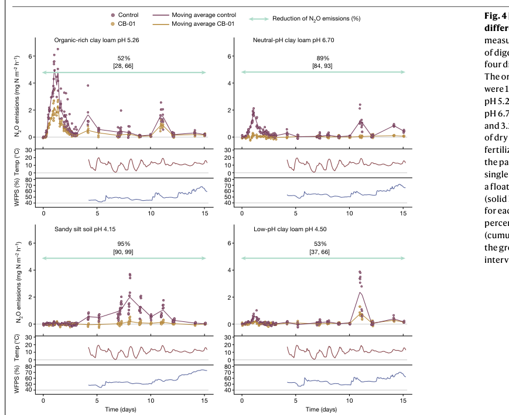

## Question

# Gene Research for Functional Annotation

## ⚠️ CRITICAL: Gene/Protein Identification Context

**BEFORE YOU BEGIN RESEARCH:** You MUST verify you are researching the CORRECT gene/protein. Gene symbols can be ambiguous, especially for less well-characterized genes from non-model organisms.

### Target Gene/Protein Identity (from UniProt):
- **UniProt Accession:** Q6N843
- **Protein Description:** RecName: Full=Nitrous-oxide reductase {ECO:0000256|ARBA:ARBA00016560, ECO:0000256|HAMAP-Rule:MF_00716}; EC=1.7.2.4 {ECO:0000256|ARBA:ARBA00011896, ECO:0000256|HAMAP-Rule:MF_00716}; AltName: Full=N(2)OR {ECO:0000256|ARBA:ARBA00031077, ECO:0000256|HAMAP-Rule:MF_00716}; AltName: Full=N2O reductase {ECO:0000256|ARBA:ARBA00032847, ECO:0000256|HAMAP-Rule:MF_00716};
- **Gene Information:** Name=nosZ {ECO:0000256|HAMAP-Rule:MF_00716, ECO:0000313|EMBL:CAE27502.1}; OrderedLocusNames=RPA2061 {ECO:0000313|EMBL:CAE27502.1}; ORFNames=TX73_010625 {ECO:0000313|EMBL:WCL92212.1};
- **Organism (full):** Rhodopseudomonas palustris (strain ATCC BAA-98 / CGA009).
- **Protein Family:** In the C-terminal section; belongs to the cytochrome c
- **Key Domains:** CcO_II-like_C. (IPR002429); Cupredoxin. (IPR008972); EfeO_Cupredoxin. (IPR028096); N2O_reductase_N. (IPR011045); NO_Rdtase. (IPR023644)

### MANDATORY VERIFICATION STEPS:

1. **Check if the gene symbol "nosZ" matches the protein description above**
2. **Verify the organism is correct:** Rhodopseudomonas palustris (strain ATCC BAA-98 / CGA009).
3. **Check if protein family/domains align with what you find in literature**
4. **If you find literature for a DIFFERENT gene with the same or similar symbol, STOP**

### If Gene Symbol is Ambiguous or You Cannot Find Relevant Literature:

**DO NOT PROCEED WITH RESEARCH ON A DIFFERENT GENE.** Instead:
- State clearly: "The gene symbol 'nosZ' is ambiguous or literature is limited for this specific protein"
- Explain what you found (e.g., "Found extensive literature on a different gene with the same symbol in a different organism")
- Describe the protein based ONLY on the UniProt information provided above
- Suggest that the protein function can be inferred from domain/family information

### Research Target:

Please provide a comprehensive research report on the gene **nosZ** (gene ID: nosZ, UniProt: Q6N843) in RHOPA.

The research report should be a detailed narrative explaining the function, biological processes, and localization of the gene product. Citations should be given for all claims.

You should prioritize authoritative reviews and primary scientific literature when conducting research. You can supplement
this with annotations you find in gene/protein databases, but these can be outdated or inaccurate.

We are specifically interested in the primary function of the gene - for enzymes, what reaction is catalyzed, and what is the substrate specificity? For transporters, what is the substrate? For structural proteins or adapters, what is the broader structural role? For signaling molecules, what is the role in the pathway.

We are interested in where in or outside the cell the gene product carries out its function.

We are also interested in the signaling or biochemical pathways in which the gene functions. We are less interested in broad pleiotropic effects, except where these elucidate the precise role.

Include evidence where possible. We are interested in both experimental evidence as well as inference from structure, evolution, or bioinformatic analysis. Precise studies should be prioritized over high-throughput, where available.

## Output

Question: You are an expert researcher providing comprehensive, well-cited information.

Provide detailed information focusing on:
1. Key concepts and definitions with current understanding
2. Recent developments and latest research (prioritize 2023-2024 sources)
3. Current applications and real-world implementations
4. Expert opinions and analysis from authoritative sources
5. Relevant statistics and data from recent studies

Format as a comprehensive research report with proper citations. Include URLs and publication dates where available.
Always prioritize recent, authoritative sources and provide specific citations for all major claims.

# Gene Research for Functional Annotation

## ⚠️ CRITICAL: Gene/Protein Identification Context

**BEFORE YOU BEGIN RESEARCH:** You MUST verify you are researching the CORRECT gene/protein. Gene symbols can be ambiguous, especially for less well-characterized genes from non-model organisms.

### Target Gene/Protein Identity (from UniProt):
- **UniProt Accession:** Q6N843
- **Protein Description:** RecName: Full=Nitrous-oxide reductase {ECO:0000256|ARBA:ARBA00016560, ECO:0000256|HAMAP-Rule:MF_00716}; EC=1.7.2.4 {ECO:0000256|ARBA:ARBA00011896, ECO:0000256|HAMAP-Rule:MF_00716}; AltName: Full=N(2)OR {ECO:0000256|ARBA:ARBA00031077, ECO:0000256|HAMAP-Rule:MF_00716}; AltName: Full=N2O reductase {ECO:0000256|ARBA:ARBA00032847, ECO:0000256|HAMAP-Rule:MF_00716};
- **Gene Information:** Name=nosZ {ECO:0000256|HAMAP-Rule:MF_00716, ECO:0000313|EMBL:CAE27502.1}; OrderedLocusNames=RPA2061 {ECO:0000313|EMBL:CAE27502.1}; ORFNames=TX73_010625 {ECO:0000313|EMBL:WCL92212.1};
- **Organism (full):** Rhodopseudomonas palustris (strain ATCC BAA-98 / CGA009).
- **Protein Family:** In the C-terminal section; belongs to the cytochrome c
- **Key Domains:** CcO_II-like_C. (IPR002429); Cupredoxin. (IPR008972); EfeO_Cupredoxin. (IPR028096); N2O_reductase_N. (IPR011045); NO_Rdtase. (IPR023644)

### MANDATORY VERIFICATION STEPS:

1. **Check if the gene symbol "nosZ" matches the protein description above**
2. **Verify the organism is correct:** Rhodopseudomonas palustris (strain ATCC BAA-98 / CGA009).
3. **Check if protein family/domains align with what you find in literature**
4. **If you find literature for a DIFFERENT gene with the same or similar symbol, STOP**

### If Gene Symbol is Ambiguous or You Cannot Find Relevant Literature:

**DO NOT PROCEED WITH RESEARCH ON A DIFFERENT GENE.** Instead:
- State clearly: "The gene symbol 'nosZ' is ambiguous or literature is limited for this specific protein"
- Explain what you found (e.g., "Found extensive literature on a different gene with the same symbol in a different organism")
- Describe the protein based ONLY on the UniProt information provided above
- Suggest that the protein function can be inferred from domain/family information

### Research Target:

Please provide a comprehensive research report on the gene **nosZ** (gene ID: nosZ, UniProt: Q6N843) in RHOPA.

The research report should be a detailed narrative explaining the function, biological processes, and localization of the gene product. Citations should be given for all claims.

You should prioritize authoritative reviews and primary scientific literature when conducting research. You can supplement
this with annotations you find in gene/protein databases, but these can be outdated or inaccurate.

We are specifically interested in the primary function of the gene - for enzymes, what reaction is catalyzed, and what is the substrate specificity? For transporters, what is the substrate? For structural proteins or adapters, what is the broader structural role? For signaling molecules, what is the role in the pathway.

We are interested in where in or outside the cell the gene product carries out its function.

We are also interested in the signaling or biochemical pathways in which the gene functions. We are less interested in broad pleiotropic effects, except where these elucidate the precise role.

Include evidence where possible. We are interested in both experimental evidence as well as inference from structure, evolution, or bioinformatic analysis. Precise studies should be prioritized over high-throughput, where available.

## Research report: **nosZ** (UniProt **Q6N843**) from *Rhodopseudomonas palustris* CGA009

### 0) Identity verification and scope
The UniProt accession **Q6N843** is annotated as **nitrous-oxide reductase (NosZ)** (EC **1.7.2.4** in UniProt) from *Rhodopseudomonas palustris* strain CGA009, with domain architecture consistent with canonical bacterial NosZ enzymes (including the copper-binding cupredoxin-type folds and the C-terminal cytochrome-c–like region described by UniProt). The literature evidence base available here is largely from well-studied model denitrifiers (e.g., *Pseudomonas* spp., *Paracoccus denitrificans*) and recent environmental studies; these sources are used to functionally annotate Q6N843 by **homology to the canonical NosZ family**, not by direct biochemical purification of the *R. palustris* CGA009 protein in the retrieved corpus.

### 1) Key concepts and definitions (current understanding)

#### 1.1 What NosZ does (primary function)
NosZ is the **terminal respiratory oxidoreductase** that catalyzes the **reduction of nitrous oxide (N2O) to dinitrogen (N2)** in microbial N2O respiration/denitrification. A widely cited stoichiometry is:

**N2O + 2 H+ + 2 e− → N2 + H2O** (zumft2006biogenesisofthe pages 1-2).

Because this reaction removes N2O, organisms that encode **nosZ** constitute the **only known biological sink** for N2O (intrator2024aquaticnitrousoxide pages 1-2, zumft2006biogenesisofthe pages 1-2).

#### 1.2 Substrate specificity
NosZ is functionally specialized for **N2O** as the respiratory electron acceptor (i.e., the substrate being reduced) and produces **N2** as the reduced end-product (zumft2006biogenesisofthe pages 1-2, intrator2024aquaticnitrousoxide pages 1-2). The defining activity is therefore N2O reduction (zumft2006biogenesisofthe pages 1-2).

#### 1.3 Cofactors and catalytic centers (CuA and CuZ)
Canonical bacterial NosZ is a **multicopper enzyme** operating as a **homodimer**. Each monomer contains two distinct copper centers:

- **CuA**: a **binuclear** electron-entry/electron-transfer site (zumft2006biogenesisofthe pages 1-2, wunsch2003requirementsforcua pages 1-2).
- **CuZ**: a **tetranuclear, sulfide-bridged catalytic Cu–S cluster** (four His-liganded Cu bridged by sulfide) where N2O reduction occurs (wunsch2003requirementsforcua pages 1-2, zumft2006biogenesisofthe pages 1-2).

A canonical copper stoichiometry is **6 Cu per monomer** (2 in CuA + 4 in CuZ; ~12 Cu per dimer) (zumft2006biogenesisofthe pages 1-2, wunsch2005functionaldomainsof pages 6-7).

#### 1.4 Cellular localization and export
A key mechanistic point for functional annotation is that NosZ is a **periplasmic enzyme** in Gram-negative bacteria and is commonly exported as an **apo-protein via the twin-arginine translocation (Tat) pathway**, followed by **post-translocational copper-center assembly in the periplasm** (zumft2006biogenesisofthe pages 4-5, zumft2006biogenesisofthe pages 5-6). When NosZ is experimentally retained in the cytoplasm by disrupting Tat export (e.g., mutation of Tat components or the twin-arginine motif), the enzyme fails to acquire copper cofactors, supporting the periplasmic maturation model (zumft2006biogenesisofthe pages 4-5).

### 2) Mechanism and pathway context for Q6N843 nosZ

#### 2.1 Role in denitrification / N-oxide respiration
NosZ is the terminal step in denitrification-like respiratory chains, reducing N2O to N2 (zumft2006biogenesisofthe pages 1-2). In ecological terms, nosZ-containing organisms can either:
- be “complete denitrifiers” (carrying additional denitrification steps), or
- be “partial/non-denitrifiers” specializing in N2O consumption (intrator2024aquaticnitrousoxide pages 1-2, yoon2016nitrousoxidereduction pages 1-2).

#### 2.2 Electron delivery architecture (NosR, and alternative arrangements)
In many denitrifiers, whole-cell N2O respiration depends on **NosR**, a membrane-associated **iron–sulfur flavoprotein** that is required to sustain in vivo NosZ activity and is implicated in electron transfer from the membrane redox pool to the periplasmic enzyme (wunsch2005functionaldomainsof pages 1-2, wunsch2005functionaldomainsof pages 5-6, wunsch2005functionaldomainsof pages 7-8). Experimental NosR variants lacking key domains can yield NosZ that remains catalytically active in vitro but cannot support whole-cell N2O respiration, consistent with an electron-supply/activation role in vivo (wunsch2005functionaldomainsof pages 7-8).

Some organisms lack nosR and instead have alternative electron-entry solutions (e.g., a c-type cytochrome fused to NosZ), underscoring that **electron delivery to periplasmic NosZ is modular across bacteria** (wunsch2005functionaldomainsof pages 7-8). This is relevant to Q6N843 because UniProt notes a cytochrome-c–related segment in the C-terminal section, consistent with known diversity in NosZ-associated electron-transfer architectures.

### 3) Biogenesis, assembly, and accessory genes (functional neighborhood)

NosZ function depends critically on correct assembly of CuA and CuZ in the periplasm.

#### 3.1 Minimal/central maturation functions (NosD/F/Y and NosL)
A major theme across experimental and review literature is that CuZ biogenesis requires a dedicated accessory apparatus:

- **NosD/F/Y**: an **ABC-transporter–like system** required for assembly of the catalytic Cu–S center; strong evidence supports a role in delivering/handling a **sulfur species** needed for CuZ formation (zumft2006biogenesisofthe pages 5-6, wunsch2003requirementsforcua pages 1-2).
- **NosL**: a periplasm-facing/outer-membrane-anchored **Cu(I) chaperone** implicated in copper delivery for NosZ maturation (zumft2006biogenesisofthe pages 5-6, zumft2006biogenesisofthe pages 1-2).

In an experimental heterologous maturation system, coexpression of key nos genes (including nosRZ and nosDFY) was sufficient to produce active holo-NosZ, implicating NosD/F/Y as “obligatory” for Cu–S center assembly in that context (wunsch2003requirementsforcua pages 1-2).

#### 3.2 Additional accessory factors (NosX, NosA, Sco-like proteins)
Additional factors frequently cluster with nos genes and influence NosZ maturation/state:

- **NosX**: described as a periplasmic **FAD-containing** flavoprotein, often **Tat-exported**, frequently found in nos clusters (e.g., nosRZDFYLX). Lack of NosX can shift the catalytic center toward an altered **CuZ\*** state, linking NosX to proper catalytic-center configuration/activation (zumft2006biogenesisofthe pages 9-10).
- **NosA**: described (in *Pseudomonas stutzeri*) as a Cu-containing outer-membrane protein suggested to aid Cu uptake under anaerobic/Cu limitation; however, nosA mutants can still respire N2O in some contexts, indicating species/context dependence (zumft2006biogenesisofthe pages 9-10).
- **Sco/ScoP homologues**: Cu-binding proteins with conserved cysteine motifs (e.g., CxxxCP) that can participate in Cu handling/oxidative protection; experimental deletions in some systems suggest they are not always obligatory for NosZ maturation (wunsch2003requirementsforcua pages 4-5, zumft2006biogenesisofthe pages 9-10).

**Implication for Q6N843 annotation:** even if the precise gene neighborhood in *R. palustris* CGA009 differs, the most evidence-supported expectation is that **functional NosZ requires periplasmic copper delivery and CuZ sulfide insertion machinery**, usually encoded near nosZ (zumft2006biogenesisofthe pages 5-6, zumft2006biogenesisofthe pages 1-2).

### 4) Clade I vs clade II nosZ: definitions, ecology, and kinetics

#### 4.1 Definitions and ecological distribution (2024 synthesis)
A 2024 review of aquatic nosZ diversity compiled **>11,000 nosZ sequences** and reinforced that nosZ segregates into **two major clades** with strong ecological patterning (intrator2024aquaticnitrousoxide pages 1-2). In that synthesis:

- **Clade I nosZ** is more associated with organisms encoding “complete denitrification” and is prevalent in certain aquatic habitats (e.g., marine sediments) (intrator2024aquaticnitrousoxide pages 1-2).
- **Clade II nosZ** is **more phylogenetically diverse** and **more broadly distributed**, and its hosts often lack other denitrification enzymes, consistent with “incomplete denitrifiers” or specialist N2O reducers (intrator2024aquaticnitrousoxide pages 1-2).

#### 4.2 Kinetic distinctions (primary data)
Whole-cell kinetic measurements show systematic differences between clades. In a widely used comparative study, the **apparent half-saturation constants (Ks)** for N2O were orders of magnitude lower for clade II organisms than for tested clade I organisms, consistent with higher apparent N2O affinity in clade II:

- **Clade II**: *Dechloromonas aromatica* Ks = **0.324 ± 0.078**; *Anaeromyxobacter dehalogenans* Ks = **1.34 ± 0.35**.
- **Clade I**: *Pseudomonas stutzeri* Ks = **35.5 ± 9.3**; *Shewanella loihica* Ks = **7.07 ± 1.13** (yoon2016nitrousoxidereduction pages 1-2).

The same study reported **~1.5–1.8× higher growth yields** for clade II isolates relative to clade I isolates under N2O-respiring conditions tested (yoon2016nitrousoxidereduction pages 1-2).

#### 4.3 pH sensitivity and clade selection (2024 primary study)
A 2024 soil microcosm study highlighted that the final denitrification step (N2O → N2) can be especially sensitive to pH and that clade II nosZ-containing organisms can dominate N2O reduction potential in certain acidic environments, often lacking nir genes (nirS/nirK) (sun2024phselectsfor pages 1-2). The study used controlled N2O feeding regimes and reported long lag times in some acidic/high-N2O microcosms, consistent with constraints on N2O-reduction activity under low pH (sun2024phselectsfor pages 1-2).

### 5) Current applications and real-world implementations (focus on 2023–2024)

#### 5.1 Field-scale mitigation via inoculation/biostimulation (Nature 2024)
A 2024 field study demonstrated a practical route to reduce agricultural soil N2O emissions by delivering N2O-respiring bacteria (with NosZ activity) using organic waste (digestate) as a substrate/vector. The paper reports that fertilization with digestate containing approximately **6 × 10^9 cells mL−1** of the selected strain reduced N2O emissions by **50–95%**, depending on soil type (hiis2024unlockingbacterialpotential media eb6c8c86). The field reductions are displayed in **Figure 4**, showing reductions of **52%, 89%, 95%, and 53%** across soil types (hiis2024unlockingbacterialpotential media 670020dc).

These results exemplify a near-term “microbiome engineering” strategy: increasing in situ N2O sink capacity by introducing robust N2O-respiring populations rather than only trying to suppress N2O formation.

#### 5.2 Environmental suppression of emissions by clade II sinks (2024 aquifer study)
In a 2024 aquifer investigation with strong subsurface N2O production but limited surface emission, depth-resolved molecular analyses indicated that consumption of N2O near the surface correlated with enrichment of **clade II** N2O reducers, supporting a growing understanding that clade II NosZ guilds can strongly regulate net emissions in some systems (wunsch2005functionaldomainsof pages 5-6).

#### 5.3 Implications for engineered nitrogen removal (wastewater/bioreactors)
While the detailed engineering literature is broader than the evidence retrieved here, the mechanistic requirements summarized above (periplasmic maturation; dependence on copper delivery and accessory factors) motivate operational strategies that protect/enable NosZ activity (e.g., maintaining conditions supporting periplasmic copper cofactor assembly and avoiding environmental constraints that stall NosZ in inactive forms). The strong dependency of N2O sink capacity on community composition (clade I vs II) and environmental parameters (e.g., pH) is directly supported by 2024 studies (sun2024phselectsfor pages 1-2, intrator2024aquaticnitrousoxide pages 1-2).

### 6) Expert synthesis / authoritative analysis (what is well established vs. uncertain)

#### 6.1 Well-established features suitable for high-confidence functional annotation of Q6N843
On the basis of authoritative mechanistic review and primary genetics/biochemistry in model systems, the following are high-confidence annotations for UniProt Q6N843 NosZ:

- **Enzymatic function:** N2O reductase converting N2O to N2 (zumft2006biogenesisofthe pages 1-2).
- **Cofactors:** multicopper enzyme with **CuA** and **CuZ** centers; CuZ is a sulfide-bridged tetranuclear catalytic cluster (zumft2006biogenesisofthe pages 1-2, wunsch2003requirementsforcua pages 1-2).
- **Localization:** **periplasmic**, with **Tat-dependent export** and **periplasmic cofactor insertion** (zumft2006biogenesisofthe pages 4-5, zumft2006biogenesisofthe pages 5-6).
- **Accessory requirements:** NosZ activity depends on a broader nos system, prominently **NosD/F/Y** (CuZ assembly; sulfur handling) and **NosL** (copper chaperoning), and frequently **NosR** and **NosX** for whole-cell N2O respiration/activation (zumft2006biogenesisofthe pages 5-6, zumft2006biogenesisofthe pages 1-2, zumft2006biogenesisofthe pages 9-10, wunsch2005functionaldomainsof pages 7-8).

#### 6.2 What remains organism-specific (and not directly resolved here for *R. palustris* CGA009)
The evidence retrieved does not directly report purified enzyme kinetics, transcriptional regulation, or gene-neighborhood experiments specifically for **Q6N843** in *R. palustris* CGA009. Therefore, organism-specific annotations such as the exact electron donor pathway (specific cytochromes/quinol dehydrogenases used), operon composition in CGA009, and regulation under different growth modes should be treated as **inferred** from conserved NosZ biology rather than confirmed for this strain.

### 7) Summary table (evidence-backed functional annotation)
The following table consolidates the key functional and contextual annotations for Q6N843 nosZ.

| Annotation topic | Functional annotation for UniProt Q6N843 / **nosZ** in *Rhodopseudomonas palustris* CGA009 |
|---|---|
| Function / reaction (EC) | **NosZ = nitrous-oxide reductase**, the terminal respiratory oxidoreductase of denitrification/N2O respiration; catalyzes **N2O + 2 H+ + 2 e− → N2 + H2O**. Canonical EC in older literature is **1.7.99.6**; UniProt assigns **EC 1.7.2.4** for Q6N843. Overall function is consistent across sources and matches the UniProt description for Q6N843 (zumft2006biogenesisofthe pages 1-2, intrator2024aquaticnitrousoxide pages 1-2). |
| Substrate & products | **Substrate:** nitrous oxide (**N2O**). **Products:** dinitrogen (**N2**) and water. NosZ-bearing organisms are the **only known biological sink** for N2O (zumft2006biogenesisofthe pages 1-2, intrator2024aquaticnitrousoxide pages 1-2). |
| Electron entry / donors (general) | Electrons enter NosZ through the **CuA** center and are delivered to catalytic **CuZ**. In vivo, electron supply commonly depends on **NosR**, a membrane Fe-S/flavoprotein proposed to draw electrons from the quinol pool or a related membrane redox chain; some assays used artificial donors such as **benzyl viologen**, while whole-cell studies used organic donors such as **acetate**, **citrate**, or **lactate** depending on organism/experiment. Thus, Q6N843 is best annotated as a **periplasmic respiratory reductase receiving electrons indirectly from membrane/periplasmic redox partners rather than binding a dedicated small-molecule donor itself** (wunsch2005functionaldomainsof pages 7-8, wunsch2005functionaldomainsof pages 6-7, yoon2016nitrousoxidereduction pages 1-2, wunsch2003requirementsforcua pages 4-5, sun2024phselectsfor pages 1-2). |
| Cofactors / metal centers | NosZ is a **multicopper homodimer**. Each monomer carries **CuA** (binuclear, mixed-valent electron-transfer site) and **CuZ** (tetranuclear, sulfide-bridged catalytic Cu-S cluster). Canonical stoichiometry is **6 Cu per monomer / ~12 Cu per dimer**. CuZ is the catalytic center for N2O reduction; CuA is the electron-entry site (zumft2006biogenesisofthe pages 1-2, wunsch2003requirementsforcua pages 1-2, wunsch2005functionaldomainsof pages 6-7, cua2010expressionofgenes pages 37-42). |
| Localization & export pathway | For canonical/clade I NosZ such as Q6N843, activity is **periplasmic**. NosZ is exported as an **apo-protein by the Tat pathway** via a twin-arginine leader; copper loading occurs **post-translocationally in the periplasm**. Cell fractionation and immunogold EM in model systems support periplasmic localization. Clade I enzymes generally have a **Tat leader**, whereas clade II enzymes may instead use a **Sec leader** (zumft2006biogenesisofthe pages 4-5, zumft2006biogenesisofthe pages 5-6, bennett2019assemblyofthe pages 35-39). |
| Key maturation / accessory proteins | **NosR:** membrane Fe-S/flavoprotein required for whole-cell N2O respiration; supports mature NosZ activity/electron delivery and can affect nosZ expression (wunsch2005functionaldomainsof pages 5-6, wunsch2005functionaldomainsof pages 1-2, wunsch2005functionaldomainsof pages 7-8). **NosX:** periplasmic FAD protein, often Tat-exported; linked to proper catalytic-center state and may participate in redox activation of NosZ (zumft2006biogenesisofthe pages 9-10, zumft2006biogenesisofthe pages 1-2). **NosD/F/Y:** ABC-type assembly system essential for CuZ biogenesis; strongest evidence supports delivery/handling of a sulfur species needed for the Cu-S catalytic center (zumft2006biogenesisofthe pages 5-6, wunsch2003requirementsforcua pages 1-2, bennett2019assemblyofthe pages 35-39). **NosL:** outer-membrane/periplasm-facing lipoprotein Cu(I) chaperone for periplasmic copper delivery to NosZ assembly (zumft2006biogenesisofthe pages 5-6, bennett2019assemblyofthe pages 35-39, zumft2006biogenesisofthe pages 1-2). **NosA:** Cu-responsive outer-membrane protein proposed to assist copper uptake under Cu limitation, but dispensable in some backgrounds (zumft2006biogenesisofthe pages 9-10). **Sco/ScoP:** Sco1-family Cu-binding protein implicated in Cu handling/oxidative protection; can be nonessential for NosZ maturation in some organisms (zumft2006biogenesisofthe pages 9-10, wunsch2003requirementsforcua pages 4-5). |
| Likely operon / family context for Q6N843 | Q6N843 matches the **canonical NosZ family** described in denitrifiers: a periplasmic, multicopper nitrous-oxide reductase typically embedded in a **nos gene cluster** containing core biogenesis functions such as **nosRZDFYL**, often plus **nosX** and sometimes **nosA/sco-like** functions. This fits UniProt domain architecture and annotation for *R. palustris* CGA009 (zumft2006biogenesisofthe pages 1-2, zumft2006biogenesisofthe pages 9-10, bennett2019assemblyofthe pages 35-39). |
| Clade I vs Clade II distinctions | **Clade I:** usually associated with more canonical/complete denitrifiers, often in Proteobacteria/Pseudomonadota; generally Tat-exported NosZ and classical nos operons. **Clade II:** phylogenetically broader, often in organisms lacking **nirS/nirK** and thus acting as specialist or partial N2O reducers; wider environmental distribution and commonly higher apparent N2O affinity. Q6N843 from *R. palustris* is most consistent with **clade I/canonical NosZ** based on domain architecture and organismal context (intrator2024aquaticnitrousoxide pages 1-2, sun2024phselectsfor pages 1-2, bennett2019assemblyofthe pages 35-39). |
| Clade I vs Clade II kinetics (Yoon 2016) | Whole-cell apparent half-saturation constants (**Ks**) for N2O separated clades: **clade II** *Dechloromonas aromatica* **0.324 ± 0.078**, *Anaeromyxobacter dehalogenans* **1.34 ± 0.35**; **clade I** *Pseudomonas stutzeri* **35.5 ± 9.3**, *Shewanella loihica* **7.07 ± 1.13**. Clade II strains also showed **~1.5–1.8-fold higher growth yields** with N2O as electron acceptor in that study (yoon2016nitrousoxidereduction pages 1-2). |
| Real-world / engineering applications | NosZ is being actively exploited for **N2O mitigation** in soils, aquifers, and biotechnological nitrogen removal systems. A 2024 **Nature** field study using **Cloacibacterium sp. CB-01** (a NosZ-based inoculant/vector in digestate) reported **soil-specific N2O emission reductions of 52%, 89%, 95%, and 53%** in Figure 4, with the paper summarizing an overall **50–95%** reduction range and projecting potentially meaningful national-scale mitigation if deployed broadly (hiis2024unlockingbacterialpotential media 670020dc, hiis2024unlockingbacterialpotential media eb6c8c86). Recent 2024 studies also link surface N2O suppression to enrichment of **clade II** reducers in aquifers and show strong pH/oxygen-history effects on which NosZ guilds dominate environmental N2O sinks (wunsch2005functionaldomainsof pages 5-6, sun2024phselectsfor pages 1-2, intrator2024aquaticnitrousoxide pages 1-2). |

*Table: This table condenses the key functional annotation points for UniProt Q6N843 NosZ, including reaction chemistry, localization, copper cofactors, accessory proteins, clade distinctions, and recent mitigation applications. It is useful as a compact evidence-backed reference for gene function and biological context.*

### Key references (URLs and publication dates)
- Zumft WG. **“Biogenesis of the Bacterial Respiratory CuA, Cu-S Enzyme Nitrous Oxide Reductase.”** *Journal of Molecular Microbiology and Biotechnology* (Apr **2006**). https://doi.org/10.1159/000091562 (zumft2006biogenesisofthe pages 1-2)
- Wunsch P, Herb M, Wieland H, Schiek UM, Zumft WG. **“Requirements for CuA and Cu-S Center Assembly of Nitrous Oxide Reductase…”** *Journal of Bacteriology* (Feb **2003**). https://doi.org/10.1128/JB.185.3.887-896.2003 (wunsch2003requirementsforcua pages 1-2)
- Wunsch P, Zumft WG. **“Functional Domains of NosR…”** *Journal of Bacteriology* (Mar **2005**). https://doi.org/10.1128/JB.187.6.1992-2001.2005 (wunsch2005functionaldomainsof pages 5-6)
- Yoon S, Nissen S, Park D, Sanford RA, Löffler FE. **“Nitrous Oxide Reduction Kinetics Distinguish Bacteria Harboring Clade I NosZ from Those Harboring Clade II NosZ.”** *Applied and Environmental Microbiology* (Jul **2016**). https://doi.org/10.1128/AEM.00409-16 (yoon2016nitrousoxidereduction pages 1-2)
- Intrator N, Jayakumar A, Ward BB. **“Aquatic nitrous oxide reductase gene (nosZ) phylogeny and environmental distribution.”** *Frontiers in Microbiology* (May **2024**). https://doi.org/10.3389/fmicb.2024.1407573 (intrator2024aquaticnitrousoxide pages 1-2)
- Sun Y, et al. **“pH selects for distinct N2O-reducing microbiomes in tropical soil microcosms.”** *ISME Communications* (Jan **2024**). https://doi.org/10.1093/ismeco/ycae070 (sun2024phselectsfor pages 1-2)
- Hiis EG, et al. **“Unlocking bacterial potential to reduce farmland N2O emissions.”** *Nature* (May **2024**). https://doi.org/10.1038/s41586-024-07464-3 (field reductions shown in Fig. 4) (hiis2024unlockingbacterialpotential media 670020dc, hiis2024unlockingbacterialpotential media eb6c8c86)

References

1. (zumft2006biogenesisofthe pages 1-2): Walter G. Zumft. Biogenesis of the bacterial respiratory cua, cu-s enzyme nitrous oxide reductase. Journal of Molecular Microbiology and Biotechnology, 10:154-166, Apr 2006. URL: https://doi.org/10.1159/000091562, doi:10.1159/000091562. This article has 87 citations and is from a peer-reviewed journal.

2. (intrator2024aquaticnitrousoxide pages 1-2): Naomi Intrator, Amal Jayakumar, and Bess B. Ward. Aquatic nitrous oxide reductase gene (nosz) phylogeny and environmental distribution. Frontiers in Microbiology, May 2024. URL: https://doi.org/10.3389/fmicb.2024.1407573, doi:10.3389/fmicb.2024.1407573. This article has 19 citations and is from a peer-reviewed journal.

3. (wunsch2003requirementsforcua pages 1-2): Patrick Wunsch, Margitta Herb, Hagen Wieland, Ulrike M. Schiek, and Walter G. Zumft. Requirements for cua and cu-s center assembly of nitrous oxide reductase deduced from complete periplasmic enzyme maturation in the nondenitrifier pseudomonas putida. Journal of Bacteriology, 185:887-896, Feb 2003. URL: https://doi.org/10.1128/jb.185.3.887-896.2003, doi:10.1128/jb.185.3.887-896.2003. This article has 100 citations and is from a peer-reviewed journal.

4. (wunsch2005functionaldomainsof pages 6-7): Patrick Wunsch and Walter G. Zumft. Functional domains of nosr, a novel transmembrane iron-sulfur flavoprotein necessary for nitrous oxide respiration. Journal of Bacteriology, 187:1992-2001, Mar 2005. URL: https://doi.org/10.1128/jb.187.6.1992-2001.2005, doi:10.1128/jb.187.6.1992-2001.2005. This article has 143 citations and is from a peer-reviewed journal.

5. (zumft2006biogenesisofthe pages 4-5): Walter G. Zumft. Biogenesis of the bacterial respiratory cua, cu-s enzyme nitrous oxide reductase. Journal of Molecular Microbiology and Biotechnology, 10:154-166, Apr 2006. URL: https://doi.org/10.1159/000091562, doi:10.1159/000091562. This article has 87 citations and is from a peer-reviewed journal.

6. (zumft2006biogenesisofthe pages 5-6): Walter G. Zumft. Biogenesis of the bacterial respiratory cua, cu-s enzyme nitrous oxide reductase. Journal of Molecular Microbiology and Biotechnology, 10:154-166, Apr 2006. URL: https://doi.org/10.1159/000091562, doi:10.1159/000091562. This article has 87 citations and is from a peer-reviewed journal.

7. (yoon2016nitrousoxidereduction pages 1-2): Sukhwan Yoon, Silke Nissen, Doyoung Park, Robert A. Sanford, and Frank E. Löffler. Nitrous oxide reduction kinetics distinguish bacteria harboring clade i nosz from those harboring clade ii nosz. Applied and Environmental Microbiology, 82:3793-3800, Jul 2016. URL: https://doi.org/10.1128/aem.00409-16, doi:10.1128/aem.00409-16. This article has 263 citations and is from a peer-reviewed journal.

8. (wunsch2005functionaldomainsof pages 1-2): Patrick Wunsch and Walter G. Zumft. Functional domains of nosr, a novel transmembrane iron-sulfur flavoprotein necessary for nitrous oxide respiration. Journal of Bacteriology, 187:1992-2001, Mar 2005. URL: https://doi.org/10.1128/jb.187.6.1992-2001.2005, doi:10.1128/jb.187.6.1992-2001.2005. This article has 143 citations and is from a peer-reviewed journal.

9. (wunsch2005functionaldomainsof pages 5-6): Patrick Wunsch and Walter G. Zumft. Functional domains of nosr, a novel transmembrane iron-sulfur flavoprotein necessary for nitrous oxide respiration. Journal of Bacteriology, 187:1992-2001, Mar 2005. URL: https://doi.org/10.1128/jb.187.6.1992-2001.2005, doi:10.1128/jb.187.6.1992-2001.2005. This article has 143 citations and is from a peer-reviewed journal.

10. (wunsch2005functionaldomainsof pages 7-8): Patrick Wunsch and Walter G. Zumft. Functional domains of nosr, a novel transmembrane iron-sulfur flavoprotein necessary for nitrous oxide respiration. Journal of Bacteriology, 187:1992-2001, Mar 2005. URL: https://doi.org/10.1128/jb.187.6.1992-2001.2005, doi:10.1128/jb.187.6.1992-2001.2005. This article has 143 citations and is from a peer-reviewed journal.

11. (zumft2006biogenesisofthe pages 9-10): Walter G. Zumft. Biogenesis of the bacterial respiratory cua, cu-s enzyme nitrous oxide reductase. Journal of Molecular Microbiology and Biotechnology, 10:154-166, Apr 2006. URL: https://doi.org/10.1159/000091562, doi:10.1159/000091562. This article has 87 citations and is from a peer-reviewed journal.

12. (wunsch2003requirementsforcua pages 4-5): Patrick Wunsch, Margitta Herb, Hagen Wieland, Ulrike M. Schiek, and Walter G. Zumft. Requirements for cua and cu-s center assembly of nitrous oxide reductase deduced from complete periplasmic enzyme maturation in the nondenitrifier pseudomonas putida. Journal of Bacteriology, 185:887-896, Feb 2003. URL: https://doi.org/10.1128/jb.185.3.887-896.2003, doi:10.1128/jb.185.3.887-896.2003. This article has 100 citations and is from a peer-reviewed journal.

13. (sun2024phselectsfor pages 1-2): Yanchen Sun, Yongchao Yin, Guang He, Gyuhyon Cha, Héctor L Ayala-del-Río, Grizelle González, Konstantinos T Konstantinidis, and Frank E Löffler. Ph selects for distinct n2o-reducing microbiomes in tropical soil microcosms. ISME Communications, Jan 2024. URL: https://doi.org/10.1093/ismeco/ycae070, doi:10.1093/ismeco/ycae070. This article has 18 citations and is from a peer-reviewed journal.

14. (hiis2024unlockingbacterialpotential media eb6c8c86): Elisabeth G. Hiis, Silas H. W. Vick, Lars Molstad, Kristine Røsdal, Kjell Rune Jonassen, Wilfried Winiwarter, and Lars R. Bakken. Unlocking bacterial potential to reduce farmland n2o emissions. Nature, 630:421-428, May 2024. URL: https://doi.org/10.1038/s41586-024-07464-3, doi:10.1038/s41586-024-07464-3. This article has 143 citations and is from a highest quality peer-reviewed journal.

15. (hiis2024unlockingbacterialpotential media 670020dc): Elisabeth G. Hiis, Silas H. W. Vick, Lars Molstad, Kristine Røsdal, Kjell Rune Jonassen, Wilfried Winiwarter, and Lars R. Bakken. Unlocking bacterial potential to reduce farmland n2o emissions. Nature, 630:421-428, May 2024. URL: https://doi.org/10.1038/s41586-024-07464-3, doi:10.1038/s41586-024-07464-3. This article has 143 citations and is from a highest quality peer-reviewed journal.

16. (cua2010expressionofgenes pages 37-42): L Cua. Expression of genes linked to nox detoxification in aerobic bacteria. Unknown journal, 2010.

17. (bennett2019assemblyofthe pages 35-39): S Bennett. Assembly of the copper centres of nitrous oxide reductase in paracoccus denitrificans and connections to copper detoxification/trafficking. Unknown journal, 2019.

## Artifacts

- [Edison artifact artifact-00](nosZ-deep-research-falcon_artifacts/artifact-00.md)

## Citations

1. zumft2006biogenesisofthe pages 1-2
2. zumft2006biogenesisofthe pages 4-5
3. wunsch2005functionaldomainsof pages 7-8
4. wunsch2003requirementsforcua pages 1-2
5. zumft2006biogenesisofthe pages 9-10
6. intrator2024aquaticnitrousoxide pages 1-2
7. yoon2016nitrousoxidereduction pages 1-2
8. sun2024phselectsfor pages 1-2
9. wunsch2005functionaldomainsof pages 5-6
10. wunsch2005functionaldomainsof pages 6-7
11. zumft2006biogenesisofthe pages 5-6
12. wunsch2005functionaldomainsof pages 1-2
13. wunsch2003requirementsforcua pages 4-5
14. cua2010expressionofgenes pages 37-42
15. bennett2019assemblyofthe pages 35-39
16. https://doi.org/10.1159/000091562
17. https://doi.org/10.1128/JB.185.3.887-896.2003
18. https://doi.org/10.1128/JB.187.6.1992-2001.2005
19. https://doi.org/10.1128/AEM.00409-16
20. https://doi.org/10.3389/fmicb.2024.1407573
21. https://doi.org/10.1093/ismeco/ycae070
22. https://doi.org/10.1038/s41586-024-07464-3
23. https://doi.org/10.1159/000091562,
24. https://doi.org/10.3389/fmicb.2024.1407573,
25. https://doi.org/10.1128/jb.185.3.887-896.2003,
26. https://doi.org/10.1128/jb.187.6.1992-2001.2005,
27. https://doi.org/10.1128/aem.00409-16,
28. https://doi.org/10.1093/ismeco/ycae070,
29. https://doi.org/10.1038/s41586-024-07464-3,